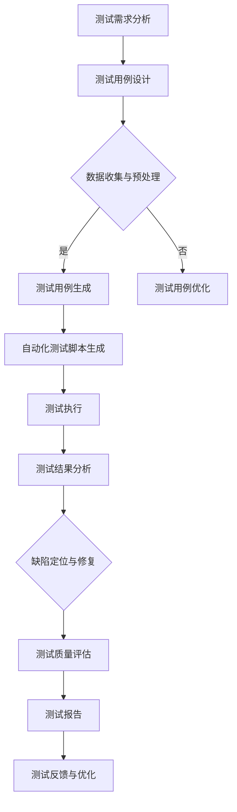

                 

# AI驱动的软件测试用例生成

> 关键词：AI，软件测试，测试用例生成，自动化测试，机器学习，深度学习

> 摘要：本文将探讨AI驱动的软件测试用例生成技术，介绍AI技术在软件测试中的应用，分析AI驱动的测试用例生成方法和优化技术，并探讨AI驱动的自动化测试、缺陷定位与修复、测试质量评估等方面的实践案例。通过本文的阅读，读者可以了解AI驱动的软件测试用例生成的基本原理和实际应用，为软件测试工作提供新的思路和工具。

### 目录大纲

1. **第一部分：AI驱动的软件测试基础**
    1.1 AI与软件测试概述
        - 人工智能的基本概念
        - AI技术在软件测试中的应用
    1.2 软件测试的基本概念
        - 软件测试的定义
        - 软件测试的目的与类型
        - 软件测试的过程与原则
    1.3 AI驱动的软件测试概述
        - AI驱动的软件测试的定义
        - AI驱动的软件测试的优势
        - AI驱动的软件测试面临的挑战

2. **第二部分：AI驱动的测试用例生成技术**
    2.1 测试用例生成的挑战
        - 手动生成测试用例的局限性
        - 自动化测试用例生成的需求
    2.2 基于机器学习的测试用例生成
        - 机器学习技术简介
        - 基于机器学习的测试用例生成方法
        - 常见机器学习算法在测试用例生成中的应用
    2.3 基于深度学习的测试用例生成
        - 深度学习技术简介
        - 基于深度学习的测试用例生成方法
        - 卷积神经网络（CNN）在图像测试用例生成中的应用
        - 循环神经网络（RNN）在文本测试用例生成中的应用
    2.4 基于遗传算法的测试用例生成
        - 遗传算法技术简介
        - 基于遗传算法的测试用例生成方法
        - 常见遗传算法变种在测试用例生成中的应用

3. **第三部分：AI驱动的测试用例优化技术**
    3.1 测试用例优化概述
        - 测试用例优化的定义
        - 测试用例优化的目的
    3.2 基于机器学习的测试用例优化
        - 基于机器学习的测试用例优化方法
        - 测试用例优化中的分类问题
        - 测试用例优化中的回归问题
    3.3 基于深度学习的测试用例优化
        - 基于深度学习的测试用例优化方法
        - 测试用例优化中的卷积神经网络（CNN）
        - 测试用例优化中的循环神经网络（RNN）
    3.4 基于强化学习的测试用例优化
        - 强化学习技术简介
        - 基于强化学习的测试用例优化方法
        - 常见强化学习算法在测试用例优化中的应用

4. **第四部分：AI驱动的自动化测试**
    4.1 自动化测试概述
        - 自动化测试的定义
        - 自动化测试的优势与挑战
    4.2 AI驱动的自动化测试框架
        - AI驱动的自动化测试框架简介
        - 自动化测试工具的选择与配置
        - 自动化测试流程的设计与实现
    4.3 AI驱动的自动化测试脚本生成
        - 基于模板的测试脚本生成
        - 基于机器学习的测试脚本生成
        - 测试脚本生成中的挑战与优化
    4.4 AI驱动的测试执行与结果分析
        - AI驱动的测试执行流程
        - 测试结果分析与可视化
        - 测试结果优化与反馈机制

5. **第五部分：AI驱动的缺陷定位与修复**
    5.1 缺陷定位与修复概述
        - 缺陷定位与修复的定义
        - 缺陷定位与修复的重要性
    5.2 基于机器学习的缺陷定位
        - 基于机器学习的缺陷定位方法
        - 缺陷定位中的特征工程
        - 缺陷定位中的算法选择
    5.3 基于深度学习的缺陷定位
        - 基于深度学习的缺陷定位方法
        - 卷积神经网络（CNN）在缺陷定位中的应用
        - 循环神经网络（RNN）在缺陷定位中的应用
    5.4 基于强化学习的缺陷修复
        - 强化学习技术简介
        - 基于强化学习的缺陷修复方法
        - 缺陷修复中的挑战与优化

6. **第六部分：AI驱动的测试质量评估**
    6.1 测试质量评估概述
        - 测试质量评估的定义
        - 测试质量评估的目的
    6.2 基于机器学习的测试质量评估
        - 基于机器学习的测试质量评估方法
        - 测试质量评估中的分类问题
        - 测试质量评估中的回归问题
    6.3 基于深度学习的测试质量评估
        - 基于深度学习的测试质量评估方法
        - 卷积神经网络（CNN）在测试质量评估中的应用
        - 循环神经网络（RNN）在测试质量评估中的应用
    6.4 基于强化学习的测试质量评估
        - 强化学习技术简介
        - 基于强化学习的测试质量评估方法
        - 测试质量评估中的挑战与优化

7. **第七部分：AI驱动的软件测试实践案例**
    7.1 案例一：基于AI的自动化测试
        - 案例背景
        - 案例目标
        - 案例实现
    7.2 案例二：基于AI的缺陷定位与修复
        - 案例背景
        - 案例目标
        - 案例实现
    7.3 案例三：基于AI的测试质量评估
        - 案例背景
        - 案例目标
        - 案例实现
    7.4 案例四：AI驱动的软件测试平台搭建
        - 案例背景
        - 案例目标
        - 案例实现

8. **第八部分：未来展望**
    8.1 AI驱动的软件测试发展趋势
        - AI技术在软件测试领域的应用前景
        - AI驱动的软件测试未来的挑战与机遇
    8.2 AI驱动的软件测试研究热点
        - 基于AI的测试用例优化
        - 基于AI的缺陷预测与修复
        - 基于AI的测试结果分析
        - 基于AI的测试质量评估
    8.3 AI驱动的软件测试未来之路
        - 未来AI驱动的软件测试技术的发展方向
        - AI驱动的软件测试在行业中的应用

9. **附录**
    9.1 AI驱动的软件测试资源推荐
        - 开源机器学习框架
        - 自动化测试工具
        - 参考文献
        - 网络资源
    9.2 Mermaid流程图示例
    9.3 伪代码示例
    9.4 数学模型和数学公式详细讲解与举例说明
    9.5 项目实战：代码实际案例和详细解释说明
    9.6 开发环境搭建
    9.7 源代码详细实现和代码解读
    9.8 AI驱动的软件测试用例生成流程
    9.9 总结
    9.10 常见问题解答

---

## 第一部分：AI驱动的软件测试基础

### 1.1 AI与软件测试概述

#### 人工智能的基本概念

人工智能（Artificial Intelligence，简称AI）是指通过计算机模拟人类智能行为的技术。它包括机器学习、深度学习、自然语言处理、计算机视觉等多个子领域。人工智能的目标是实现机器对数据的自动理解、学习和推理，以实现自动化、智能化的决策和任务执行。

#### AI技术在软件测试中的应用

AI技术在软件测试中的应用主要体现在以下几个方面：

1. **自动化测试**：AI技术可以帮助自动化生成测试用例，提高测试效率，减少测试时间和人力成本。
2. **缺陷定位与修复**：AI技术可以通过分析代码、测试结果等数据，快速定位缺陷，提供修复建议。
3. **测试质量评估**：AI技术可以分析测试数据，评估测试覆盖率、测试质量等指标，提供优化建议。
4. **测试用例优化**：AI技术可以分析测试用例的执行结果，优化测试用例的执行顺序，提高测试效率。

### 1.2 软件测试的基本概念

#### 软件测试的定义

软件测试（Software Testing）是指通过运行程序，发现软件中的错误、缺陷或不足，并评估软件的质量的过程。软件测试的目的是确保软件的正确性、可靠性、安全性、可维护性等。

#### 软件测试的目的与类型

软件测试的主要目的包括：

1. **验证**：验证软件是否满足设计要求，确保软件的正确性。
2. **验证**：验证软件是否满足用户需求，确保软件的质量和用户体验。
3. **评估**：评估软件的质量、性能、安全性等，为软件的改进提供依据。

根据测试的不同阶段和目的，软件测试可以分为以下几种类型：

1. **单元测试**：对软件中的最小可测试单元（如函数、方法等）进行测试。
2. **集成测试**：对软件的多个模块进行集成后进行的测试，以确保模块之间的正确交互。
3. **系统测试**：对整个软件系统进行的测试，包括功能测试、性能测试、安全性测试等。
4. **验收测试**：在软件交付给用户之前进行的测试，以验证软件是否满足用户需求。

#### 软件测试的过程与原则

软件测试的过程通常包括以下步骤：

1. **测试计划**：制定测试计划，明确测试的目标、范围、方法、资源等。
2. **测试设计**：设计测试用例，包括输入数据、预期结果等。
3. **测试执行**：按照测试用例执行测试，记录测试结果。
4. **测试报告**：分析测试结果，编写测试报告，提出改进建议。

软件测试应遵循以下原则：

1. **全面性**：测试应覆盖软件的各个方面，确保软件的正确性和可靠性。
2. **可靠性**：测试用例和测试执行过程应具有可靠性，确保测试结果的准确性。
3. **可维护性**：测试用例和测试报告应易于维护和更新。
4. **可追溯性**：测试结果应与测试计划和设计相对应，确保测试工作的可追溯性。

### 1.3 AI驱动的软件测试概述

#### AI驱动的软件测试的定义

AI驱动的软件测试（AI-driven Software Testing）是指利用人工智能技术辅助软件测试工作，提高测试效率和质量的过程。AI驱动的软件测试主要包括自动化测试、缺陷定位与修复、测试质量评估、测试用例优化等方面。

#### AI驱动的软件测试的优势

1. **提高测试效率**：AI技术可以自动化生成测试用例，减少手工编写测试用例的工作量，提高测试效率。
2. **提升测试质量**：AI技术可以通过对大量测试数据的分析，提供更准确、更有效的测试用例和缺陷定位方法。
3. **降低成本**：AI驱动的软件测试可以减少测试人员和测试工具的成本，降低测试费用。
4. **应对复杂场景**：AI技术可以处理复杂的测试问题，如动态行为测试、模糊测试等，提高测试覆盖率。

#### AI驱动的软件测试面临的挑战

1. **数据质量**：AI驱动的软件测试依赖于大量高质量的数据，数据质量直接影响测试效果。
2. **算法选择**：选择合适的算法对于AI驱动的软件测试至关重要，不同算法适用于不同的测试场景。
3. **模型训练**：AI驱动的软件测试需要大量训练数据和计算资源，训练过程可能耗时较长。
4. **测试结果解释**：AI驱动的软件测试生成的测试结果需要进一步解释，以便测试人员理解和接受。

在下一部分，我们将深入探讨AI驱动的测试用例生成技术，分析其在软件测试中的应用和实现方法。

---

## 第二部分：AI驱动的测试用例生成技术

### 2.1 测试用例生成的挑战

测试用例生成是软件测试中的一个重要环节，直接影响到测试的覆盖率和质量。然而，传统的测试用例生成方法存在一些局限性，主要表现在以下几个方面：

1. **手动生成测试用例的局限性**：
   - **人力成本高**：手动编写测试用例需要大量的人力投入，测试工程师的工作量巨大。
   - **效率低**：手动编写测试用例的速度较慢，难以满足现代软件开发的快速迭代需求。
   - **覆盖不全面**：由于测试工程师的经验和知识限制，手动编写的测试用例往往难以覆盖所有可能的输入和执行路径。

2. **自动化测试用例生成的需求**：
   - **提高测试效率**：自动化测试用例生成可以显著提高测试的执行速度，减少测试时间。
   - **提高测试覆盖率**：自动化生成测试用例可以覆盖更多可能的输入和执行路径，提高测试的覆盖率。
   - **减少人工干预**：自动化测试用例生成可以降低对测试工程师的依赖，减少人工干预的风险。

为了解决上述问题，AI驱动的测试用例生成技术应运而生。通过引入AI技术，可以自动化地生成高质量的测试用例，提高测试效率和覆盖率。

### 2.2 基于机器学习的测试用例生成

#### 机器学习技术简介

机器学习（Machine Learning，ML）是一种人工智能技术，通过算法和统计模型，从数据中学习和预测。机器学习主要分为监督学习、无监督学习和强化学习三类。监督学习是其中一种主要的学习方式，其核心思想是通过已标记的数据训练模型，然后使用模型对新的、未标记的数据进行预测。

#### 基于机器学习的测试用例生成方法

基于机器学习的测试用例生成方法主要包括以下几个步骤：

1. **数据收集与预处理**：收集历史测试用例数据，包括输入和输出结果。对数据进行清洗、去噪、归一化等预处理操作，以提高模型的训练效果。

2. **特征提取**：从测试用例数据中提取关键特征，如输入参数、执行路径等。特征提取的目的是将测试用例转化为数值化的输入数据，以便机器学习模型处理。

3. **模型训练**：使用收集到的测试用例数据训练机器学习模型。常见的机器学习算法包括决策树、支持向量机（SVM）、随机森林等。

4. **测试用例生成**：使用训练好的模型对新输入数据进行预测，生成测试用例。生成的测试用例可以是输入参数的组合，也可以是特定的执行路径。

5. **评估与优化**：对生成的测试用例进行评估，检查其是否覆盖到新的输入和执行路径。根据评估结果，对模型进行优化，以提高测试用例的质量和覆盖率。

#### 常见机器学习算法在测试用例生成中的应用

1. **决策树（Decision Tree）**：
   - **优点**：易于理解和解释，可以处理分类和回归问题。
   - **缺点**：容易过拟合，对噪声敏感。

2. **支持向量机（Support Vector Machine，SVM）**：
   - **优点**：在分类问题中表现出色，可以处理高维数据。
   - **缺点**：训练时间较长，对异常值敏感。

3. **随机森林（Random Forest）**：
   - **优点**：集成多个决策树，提高模型的泛化能力，减少过拟合。
   - **缺点**：需要大量的训练数据，计算复杂度较高。

4. **神经网络（Neural Network）**：
   - **优点**：能够处理复杂的非线性问题，适用于分类和回归问题。
   - **缺点**：训练时间较长，对数据质量和特征提取要求较高。

### 2.3 基于深度学习的测试用例生成

#### 深度学习技术简介

深度学习（Deep Learning，DL）是机器学习的一个分支，其核心思想是通过多层神经网络模型模拟人脑的学习过程，自动提取特征和进行预测。深度学习在图像识别、自然语言处理、语音识别等领域取得了显著的成果。

#### 基于深度学习的测试用例生成方法

基于深度学习的测试用例生成方法主要包括以下几个步骤：

1. **数据收集与预处理**：与基于机器学习的方法类似，收集历史测试用例数据，并进行预处理。

2. **特征提取**：使用深度学习模型自动提取测试用例的特征，如使用卷积神经网络（CNN）处理图像数据，使用循环神经网络（RNN）处理序列数据。

3. **模型训练**：使用收集到的测试用例数据训练深度学习模型，如卷积神经网络（CNN）、循环神经网络（RNN）等。

4. **测试用例生成**：使用训练好的深度学习模型对新的输入数据进行特征提取和预测，生成测试用例。

5. **评估与优化**：对生成的测试用例进行评估，根据评估结果对模型进行优化。

#### 卷积神经网络（CNN）在图像测试用例生成中的应用

卷积神经网络（CNN）是一种专门用于图像处理的深度学习模型，其基本结构包括卷积层、池化层和全连接层。CNN可以自动提取图像的层次特征，适用于图像测试用例生成。

1. **卷积层**：通过卷积操作提取图像的局部特征。
2. **池化层**：对卷积结果进行降维，减少模型的参数数量。
3. **全连接层**：将池化结果映射到特定的类别或执行路径。

#### 循环神经网络（RNN）在文本测试用例生成中的应用

循环神经网络（RNN）是一种专门用于处理序列数据的深度学习模型，其基本结构包括输入层、隐藏层和输出层。RNN可以处理文本数据，将其转化为特征序列，用于测试用例生成。

1. **输入层**：接收文本数据，并将其编码为向量。
2. **隐藏层**：通过循环操作处理输入序列，提取文本特征。
3. **输出层**：将隐藏层的结果映射到测试用例的输入参数或执行路径。

### 2.4 基于遗传算法的测试用例生成

#### 遗传算法技术简介

遗传算法（Genetic Algorithm，GA）是一种模拟自然进化的搜索算法，其核心思想是通过选择、交叉、变异等操作，不断优化个体的适应度，从而找到最优解。遗传算法在优化、组合问题等领域有广泛应用。

#### 基于遗传算法的测试用例生成方法

基于遗传算法的测试用例生成方法主要包括以下几个步骤：

1. **编码**：将测试用例的输入参数和执行路径编码为一个染色体，如二进制字符串。

2. **初始化种群**：随机生成初始种群，种群中的每个个体代表一种可能的测试用例组合。

3. **适应度评估**：根据测试用例的执行结果，评估个体的适应度，适应度越高的个体越有可能被选中。

4. **选择**：通过选择操作，选择适应度较高的个体进行交叉和变异。

5. **交叉**：通过交叉操作，产生新的个体，增加种群的多样性。

6. **变异**：通过变异操作，对个体进行随机改变，增加种群的多样性。

7. **更新种群**：将新生成的个体加入到种群中，重复适应度评估、选择、交叉和变异操作。

8. **测试用例生成**：当达到预设的迭代次数或适应度达到阈值时，终止迭代，输出最优的测试用例。

#### 常见遗传算法变种在测试用例生成中的应用

1. **多目标遗传算法**：在测试用例生成中，可以同时考虑多个优化目标，如测试覆盖率、执行时间等，提高测试用例的质量。

2. **局部搜索结合遗传算法**：在遗传算法的基础上，结合局部搜索方法，如模拟退火、人工神经网络等，提高测试用例生成的效率和效果。

3. **动态适应度调整**：根据测试用例的执行结果动态调整适应度函数，优化测试用例生成过程。

在下一部分，我们将进一步探讨AI驱动的测试用例优化技术，分析不同算法在测试用例优化中的应用。

---

## 第三部分：AI驱动的测试用例优化技术

### 3.1 测试用例优化概述

测试用例优化（Test Case Optimization）是指通过分析和优化测试用例，提高测试效率和质量的过程。传统的测试用例优化方法主要依赖于测试工程师的经验和知识，往往存在以下问题：

1. **人工依赖性高**：测试用例优化依赖于测试工程师的经验和判断，效率较低。
2. **测试覆盖率低**：传统的优化方法难以覆盖到所有的输入和执行路径，测试覆盖率较低。
3. **优化目标单一**：传统的优化方法通常只考虑测试覆盖率，而忽视了执行时间、代码质量等其他重要因素。

为了解决这些问题，AI驱动的测试用例优化技术应运而生。通过引入AI技术，可以自动化地分析测试用例的执行结果，提出优化的建议，提高测试效率和质量。

### 3.2 基于机器学习的测试用例优化

#### 基于机器学习的测试用例优化方法

基于机器学习的测试用例优化方法主要包括以下步骤：

1. **数据收集与预处理**：收集历史测试用例数据，包括输入参数、执行结果和测试覆盖率等。对数据进行清洗、归一化等预处理操作，提高模型的训练效果。

2. **特征提取**：从测试用例数据中提取关键特征，如输入参数、执行路径等。特征提取的目的是将测试用例转化为数值化的输入数据，以便机器学习模型处理。

3. **模型训练**：使用收集到的测试用例数据训练机器学习模型。常见的机器学习算法包括决策树、支持向量机（SVM）、随机森林等。

4. **测试用例优化**：使用训练好的模型对新输入数据进行优化，提出优化建议。优化的建议可能包括调整测试用例的执行顺序、合并相似测试用例等。

5. **评估与优化**：对优化后的测试用例进行评估，检查其是否提高了测试覆盖率、执行时间等指标。根据评估结果，对模型进行优化，以提高测试用例优化的效果。

#### 测试用例优化中的分类问题

在测试用例优化中，分类问题是一种常见的优化目标。分类问题是指将测试用例划分为不同的类别，以便于管理和执行。常见的分类方法包括：

1. **基于测试用例属性的分类**：根据测试用例的属性，如优先级、执行时间等，将其分类。这种方法有助于测试工程师优先执行重要和紧急的测试用例。

2. **基于测试结果分类**：根据测试用例的执行结果，将其分类为成功、失败或未执行。这种方法有助于测试工程师分析测试覆盖率和测试效果。

3. **基于测试路径的分类**：根据测试用例所覆盖的代码路径，将其分类。这种方法有助于测试工程师识别关键代码路径，提高测试覆盖率。

#### 测试用例优化中的回归问题

在测试用例优化中，回归问题是指通过优化测试用例的执行顺序，提高测试效率和质量。常见的回归方法包括：

1. **基于测试用例执行时间的回归**：根据测试用例的执行时间，将其排序。这种方法有助于测试工程师优先执行执行时间较短的测试用例，提高测试效率。

2. **基于测试覆盖率回归**：根据测试用例的覆盖范围，将其排序。这种方法有助于测试工程师优先执行覆盖率较低的测试用例，提高测试覆盖率。

3. **基于风险回归**：根据测试用例的风险等级，将其排序。这种方法有助于测试工程师优先执行高风险的测试用例，确保关键功能的正确性。

### 3.3 基于深度学习的测试用例优化

#### 基于深度学习的测试用例优化方法

基于深度学习的测试用例优化方法主要包括以下几个步骤：

1. **数据收集与预处理**：与基于机器学习的方法类似，收集历史测试用例数据，并进行预处理。

2. **特征提取**：使用深度学习模型自动提取测试用例的特征，如使用卷积神经网络（CNN）处理图像数据，使用循环神经网络（RNN）处理序列数据。

3. **模型训练**：使用收集到的测试用例数据训练深度学习模型，如卷积神经网络（CNN）、循环神经网络（RNN）等。

4. **测试用例优化**：使用训练好的深度学习模型对新的输入数据进行特征提取和优化，提出优化建议。

5. **评估与优化**：对优化后的测试用例进行评估，检查其是否提高了测试覆盖率、执行时间等指标。根据评估结果，对模型进行优化，以提高测试用例优化的效果。

#### 测试用例优化中的卷积神经网络（CNN）

卷积神经网络（CNN）是一种专门用于图像处理的深度学习模型，其基本结构包括卷积层、池化层和全连接层。CNN可以自动提取图像的层次特征，适用于测试用例优化。

1. **卷积层**：通过卷积操作提取图像的局部特征。
2. **池化层**：对卷积结果进行降维，减少模型的参数数量。
3. **全连接层**：将池化结果映射到特定的优化目标，如测试覆盖率、执行时间等。

#### 测试用例优化中的循环神经网络（RNN）

循环神经网络（RNN）是一种专门用于处理序列数据的深度学习模型，其基本结构包括输入层、隐藏层和输出层。RNN可以处理序列数据，将其转化为特征序列，用于测试用例优化。

1. **输入层**：接收序列数据，如测试用例的执行结果序列。
2. **隐藏层**：通过循环操作处理输入序列，提取序列特征。
3. **输出层**：将隐藏层的结果映射到优化目标，如测试覆盖率、执行时间等。

### 3.4 基于强化学习的测试用例优化

#### 强化学习技术简介

强化学习（Reinforcement Learning，RL）是一种通过试错和反馈进行学习的机器学习技术。强化学习模型通过与环境互动，不断优化策略，以实现最佳决策。强化学习在自动驾驶、游戏AI等领域取得了显著成果。

#### 基于强化学习的测试用例优化方法

基于强化学习的测试用例优化方法主要包括以下几个步骤：

1. **环境定义**：定义测试用例优化环境，包括状态、动作和奖励等。
   - **状态**：测试用例的当前状态，如测试覆盖率、执行时间等。
   - **动作**：测试用例的优化操作，如调整执行顺序、合并测试用例等。
   - **奖励**：测试用例优化后的效果，如测试覆盖率提高、执行时间减少等。

2. **策略学习**：使用强化学习算法训练策略模型，通过与环境互动，不断优化策略。

3. **测试用例优化**：使用训练好的策略模型进行测试用例优化，提出优化建议。

4. **评估与优化**：对优化后的测试用例进行评估，检查其是否提高了测试覆盖率、执行时间等指标。根据评估结果，对策略模型进行优化，以提高测试用例优化的效果。

#### 常见强化学习算法在测试用例优化中的应用

1. **Q-learning**：Q-learning是一种基于值函数的强化学习算法，通过更新值函数，优化策略。
   - **优势**：简单易实现，适用于小规模问题。
   - **劣势**：需要大量训练数据，收敛速度较慢。

2. **深度Q网络（DQN）**：DQN是一种基于神经网络的Q-learning算法，使用神经网络近似值函数。
   - **优势**：适用于大规模问题，提高收敛速度。
   - **劣势**：需要大量的训练数据和计算资源。

3. **策略梯度方法**：策略梯度方法是一种基于策略的强化学习算法，直接优化策略参数。
   - **优势**：直接优化策略，提高收敛速度。
   - **劣势**：需要精确的奖励函数，对环境依赖较高。

4. **深度确定性策略梯度（DDPG）**：DDPG是一种基于深度学习的策略梯度方法，适用于连续动作空间。
   - **优势**：适用于连续动作空间，提高收敛速度。
   - **劣势**：需要大量的训练数据和计算资源。

在下一部分，我们将探讨AI驱动的自动化测试技术，分析其在软件测试中的应用和实现方法。

---

## 第四部分：AI驱动的自动化测试

### 4.1 自动化测试概述

#### 自动化测试的定义

自动化测试（Automated Testing）是指通过编写脚本或使用自动化测试工具，自动执行测试用例，并检查测试结果的过程。自动化测试的目的是提高测试效率、减少测试时间和人力成本，同时提高测试的稳定性和可靠性。

#### 自动化测试的优势与挑战

**优势**：

1. **提高测试效率**：自动化测试可以快速执行大量测试用例，提高测试效率。
2. **减少测试时间**：自动化测试可以节省手动执行测试用例的时间，提高项目的开发进度。
3. **降低人力成本**：自动化测试可以减少对测试工程师的依赖，降低人力成本。
4. **提高测试覆盖率**：自动化测试可以覆盖更多的测试场景，提高测试覆盖率。
5. **提高测试稳定性**：自动化测试可以减少人为因素对测试结果的影响，提高测试的稳定性。

**挑战**：

1. **脚本编写和维护**：自动化测试需要编写和维护测试脚本，对测试工程师的要求较高。
2. **测试工具的选择**：市场上存在大量的自动化测试工具，选择合适的工具是一个挑战。
3. **测试用例的设计**：自动化测试需要设计合适的测试用例，确保测试的覆盖率和有效性。
4. **环境配置和管理**：自动化测试需要配置和管理测试环境，确保测试的准确性。
5. **持续集成和持续部署**：自动化测试需要与持续集成（CI）和持续部署（CD）相结合，确保测试结果的实时性和准确性。

### 4.2 AI驱动的自动化测试框架

#### AI驱动的自动化测试框架简介

AI驱动的自动化测试框架是指利用人工智能技术，辅助自动化测试的设计、执行和结果分析的过程。AI驱动的自动化测试框架主要包括以下几个关键组件：

1. **测试用例生成器**：利用机器学习模型，根据历史测试数据和代码，自动生成测试用例。
2. **自动化测试工具**：选择合适的自动化测试工具，如Selenium、Appium等，执行自动化测试脚本。
3. **测试结果分析器**：使用机器学习算法，分析自动化测试的结果，识别缺陷和测试覆盖率。
4. **反馈机制**：根据测试结果，自动调整测试用例和测试策略，优化测试过程。

#### 自动化测试工具的选择与配置

选择合适的自动化测试工具是AI驱动的自动化测试成功的关键。以下是几种常见的自动化测试工具及其配置：

1. **Selenium**：
   - **特点**：支持多种浏览器和操作系统，适用于Web应用的自动化测试。
   - **配置**：安装Selenium WebDriver，配置浏览器驱动和测试环境。

2. **Appium**：
   - **特点**：支持多种平台，如Android和iOS，适用于移动应用的自动化测试。
   - **配置**：安装Appium Server，配置模拟器或真实设备，安装对应的Appium WebDriver。

3. **TestNG**：
   - **特点**：支持数据驱动的测试框架，适用于复杂的自动化测试场景。
   - **配置**：添加TestNG依赖库，配置测试用例和测试数据。

4. **JUnit**：
   - **特点**：支持Java语言的单元测试框架，适用于单元测试和集成测试。
   - **配置**：添加JUnit依赖库，编写测试用例和测试方法。

#### 自动化测试流程的设计与实现

AI驱动的自动化测试流程主要包括以下几个步骤：

1. **测试需求分析**：分析软件需求，确定自动化测试的目标和范围。

2. **测试用例设计**：基于历史测试数据和代码，利用机器学习模型生成测试用例。

3. **测试环境配置**：配置测试环境，包括浏览器、模拟器、真实设备等。

4. **测试脚本编写**：使用自动化测试工具，编写测试脚本，实现测试用例的自动化执行。

5. **测试执行**：执行测试脚本，自动收集测试结果，生成测试报告。

6. **结果分析**：使用机器学习算法，分析测试结果，识别缺陷和测试覆盖率。

7. **反馈与优化**：根据测试结果，自动调整测试用例和测试策略，优化测试过程。

在下一部分，我们将探讨AI驱动的自动化测试脚本生成技术，分析基于模板的测试脚本生成和基于机器学习的测试脚本生成方法。

---

### 4.3 AI驱动的自动化测试脚本生成

#### 基于模板的测试脚本生成

基于模板的测试脚本生成方法是指通过预定义的测试脚本模板，结合实际测试数据，快速生成自动化测试脚本。这种方法的主要步骤如下：

1. **测试脚本模板设计**：根据测试需求，设计通用的测试脚本模板，包括测试步骤、断言等。

2. **测试数据准备**：准备实际的测试数据，如输入参数、预期结果等。

3. **脚本生成**：将测试数据和脚本模板结合，生成具体的自动化测试脚本。

4. **脚本验证**：执行生成的测试脚本，验证其是否符合预期。

基于模板的测试脚本生成方法具有以下优势：

- **快速生成**：通过模板和测试数据的组合，可以快速生成自动化测试脚本，减少编写工作。
- **灵活性强**：可以根据不同的测试需求，灵活调整测试脚本模板，满足多样化的测试场景。

然而，这种方法也存在一些局限性：

- **脚本复用性差**：模板化的脚本往往难以适应复杂的测试场景，导致脚本复用性较差。
- **可维护性低**：模板化的脚本容易导致代码冗长、结构复杂，增加维护难度。

#### 基于机器学习的测试脚本生成

基于机器学习的测试脚本生成方法是指利用机器学习技术，从历史测试数据和代码中学习，自动生成自动化测试脚本。这种方法的主要步骤如下：

1. **数据收集与预处理**：收集历史测试数据和代码，对数据进行清洗、去噪和特征提取。

2. **模型训练**：使用收集到的数据，训练机器学习模型，如序列到序列（Seq2Seq）模型。

3. **脚本生成**：将测试数据输入到训练好的模型中，生成自动化测试脚本。

4. **脚本优化**：根据实际测试结果，对生成的脚本进行优化，提高测试效率和覆盖率。

基于机器学习的测试脚本生成方法具有以下优势：

- **高度自动化**：通过机器学习模型，可以自动化地生成自动化测试脚本，减少手工编写工作。
- **适应性强**：机器学习模型可以学习复杂的测试场景，生成适应不同测试需求的脚本。
- **可维护性高**：生成的脚本结构清晰，易于理解和维护。

然而，这种方法也存在一些挑战：

- **数据依赖性高**：测试脚本生成效果依赖于历史测试数据和代码的质量，数据质量和覆盖度直接影响生成脚本的质量。
- **模型训练时间长**：机器学习模型的训练过程可能需要大量时间和计算资源，影响测试脚本的生成速度。

#### 测试脚本生成中的挑战与优化

1. **数据质量**：测试脚本生成依赖于高质量的数据，包括输入参数、预期结果等。需要确保数据的完整性、一致性和准确性。

2. **模型选择**：选择合适的机器学习模型对于测试脚本生成至关重要。不同的测试场景可能需要不同的模型，如序列到序列（Seq2Seq）模型、生成对抗网络（GAN）等。

3. **特征工程**：特征工程是测试脚本生成的重要环节。需要从测试数据和代码中提取关键特征，提高模型的训练效果。

4. **脚本优化**：生成的测试脚本可能需要进一步优化，以提高测试效率和覆盖率。可以通过分析测试结果，调整测试脚本的结构和内容。

在下一部分，我们将探讨AI驱动的测试执行与结果分析技术，分析AI如何优化测试执行流程和结果分析。

---

### 4.4 AI驱动的测试执行与结果分析

#### AI驱动的测试执行流程

AI驱动的测试执行流程是指利用人工智能技术，自动化执行测试脚本，并实时监控测试过程。这个过程主要包括以下几个步骤：

1. **测试脚本执行**：使用自动化测试工具执行测试脚本，记录每个测试步骤的执行结果。

2. **异常检测**：利用机器学习模型，实时监控测试过程，检测可能的异常情况。例如，通过分析日志数据，识别异常的HTTP响应码、数据库错误等。

3. **测试中断与恢复**：当检测到异常时，自动中断测试执行，记录错误信息和日志，尝试恢复测试执行。例如，通过重新启动应用程序或数据库，继续执行剩余的测试用例。

4. **测试结果记录**：将测试结果记录到数据库或日志文件中，以便后续分析。

#### 测试结果分析与可视化

测试结果分析是指对自动化测试执行的结果进行统计分析，评估测试的覆盖率、性能和可靠性。AI驱动的测试结果分析主要包括以下几个步骤：

1. **数据收集与预处理**：收集测试执行过程中产生的各种数据，如日志、错误报告、性能指标等。对数据进行清洗、归一化等预处理操作。

2. **特征提取**：从测试结果数据中提取关键特征，如错误类型、错误发生的位置、执行时间等。特征提取的目的是将测试结果转化为机器学习模型可处理的输入数据。

3. **异常检测与分类**：利用机器学习模型，对测试结果进行异常检测和分类。例如，通过训练分类模型，将错误分为不同类型，如数据库错误、应用程序错误等。

4. **性能评估**：通过分析测试结果，评估测试的覆盖率和性能。例如，通过计算测试用例的覆盖率、执行时间等指标，评估测试的效果。

5. **可视化**：使用可视化工具，将测试结果以图形或表格的形式展示，帮助测试人员直观地了解测试的覆盖率和性能。例如，使用柱状图、折线图等展示测试用例的执行情况。

#### 测试结果优化与反馈机制

测试结果优化是指根据测试结果，调整测试策略和测试用例，以提高测试的效率和质量。AI驱动的测试结果优化主要包括以下几个步骤：

1. **反馈机制**：建立测试结果的反馈机制，及时收集测试人员的意见和建议。例如，通过调查问卷或会议，收集测试人员对测试结果的分析和建议。

2. **测试用例优化**：根据测试结果和反馈，对测试用例进行优化。例如，调整测试用例的执行顺序、合并或删除冗余的测试用例等。

3. **测试策略调整**：根据测试结果和反馈，调整测试策略。例如，增加或减少测试用例的数量、调整测试的覆盖率等。

4. **持续改进**：将测试结果和反馈纳入测试流程，持续改进测试过程。例如，定期回顾测试结果，分析测试过程中的问题和瓶颈，制定改进计划。

通过AI驱动的测试执行与结果分析，可以自动化地执行测试，实时监控测试过程，优化测试结果，提高测试效率和质量。在下一部分，我们将探讨AI驱动的缺陷定位与修复技术，分析AI如何定位软件缺陷并提供修复建议。

---

### 5.1 缺陷定位与修复概述

#### 缺陷定位与修复的定义

缺陷定位（Defect Localization）是指识别和定位软件中存在缺陷的过程，而缺陷修复（Defect Repair）是指修复已定位的缺陷，使其恢复正常功能的过程。在软件测试过程中，缺陷定位与修复是关键步骤，直接影响软件的质量和可靠性。

#### 缺陷定位与修复的重要性

缺陷定位与修复的重要性体现在以下几个方面：

1. **提高软件质量**：通过缺陷定位，可以快速识别软件中的缺陷，减少缺陷在软件中的潜伏时间，提高软件的整体质量。
2. **降低修复成本**：早期发现和修复缺陷可以显著降低修复成本，避免缺陷在后期大规模开发过程中引起更大的问题。
3. **提高开发效率**：通过自动化缺陷定位和修复，可以减少人工干预，提高开发效率，缩短软件开发周期。
4. **提升用户体验**：及时修复软件缺陷，提高软件的稳定性、性能和安全性，提升用户的使用体验。

#### 缺陷定位与修复的过程

缺陷定位与修复通常包括以下几个步骤：

1. **缺陷报告**：测试人员或用户发现缺陷后，记录缺陷报告，包括缺陷现象、复现步骤、环境信息等。
2. **缺陷分类**：根据缺陷报告，对缺陷进行分类，如功能缺陷、性能缺陷、安全性缺陷等。
3. **缺陷定位**：通过分析缺陷报告、代码日志、测试结果等，定位缺陷的具体位置和原因。
4. **缺陷修复**：根据缺陷定位结果，修复缺陷，并重新进行测试，确保修复后的功能正常运行。
5. **缺陷验证**：验证修复后的软件，确保缺陷已彻底解决，不会导致新的缺陷。

在下一部分，我们将探讨基于机器学习的缺陷定位技术，分析机器学习在缺陷定位中的应用方法和优势。

---

### 5.2 基于机器学习的缺陷定位

#### 基于机器学习的缺陷定位方法

基于机器学习的缺陷定位方法是指利用机器学习技术，通过分析和学习历史缺陷数据，自动定位新出现的缺陷。这种方法主要包括以下几个步骤：

1. **数据收集与预处理**：收集历史缺陷数据，包括缺陷报告、代码日志、测试结果等。对数据进行清洗、归一化等预处理操作，提高模型的训练效果。

2. **特征提取**：从缺陷数据中提取关键特征，如代码段、测试结果、环境信息等。特征提取的目的是将缺陷数据转化为机器学习模型可处理的输入数据。

3. **模型训练**：使用收集到的缺陷数据训练机器学习模型，如决策树、支持向量机（SVM）、神经网络等。通过模型训练，学习缺陷的特征和模式。

4. **缺陷定位**：将新的缺陷数据输入到训练好的模型中，根据模型的预测结果，定位缺陷的具体位置和原因。

5. **缺陷验证**：根据缺陷定位结果，修复缺陷，并重新进行测试，确保定位的准确性。

#### 缺陷定位中的特征工程

特征工程是缺陷定位中的关键步骤，直接影响到模型的效果。以下是一些常见的特征工程方法：

1. **代码段特征**：提取缺陷相关的代码段，如错误行、异常代码等。可以使用正则表达式、语法树分析等方法提取代码特征。

2. **测试结果特征**：提取测试过程中产生的各种测试结果，如失败测试用例、异常日志等。可以使用统计方法、分类方法等对测试结果进行特征提取。

3. **环境信息特征**：提取缺陷发生的环境信息，如操作系统、编译器版本、网络状态等。这些特征可以帮助模型识别特定的环境因素对缺陷的影响。

4. **代码质量特征**：提取代码质量相关的特征，如代码复杂度、代码冗余度等。这些特征可以帮助模型识别代码质量对缺陷的影响。

5. **历史缺陷特征**：利用历史缺陷数据中的信息，如缺陷类型、缺陷发生的位置等，作为特征输入到模型中。这些特征可以帮助模型学习缺陷的分布和模式。

#### 缺陷定位中的算法选择

选择合适的算法对于缺陷定位至关重要。以下是一些常见的算法选择：

1. **决策树（Decision Tree）**：决策树是一种简单的分类算法，可以直观地展示缺陷的决策路径。适用于简单问题的缺陷定位。

2. **支持向量机（Support Vector Machine，SVM）**：SVM是一种强大的分类算法，可以在高维空间中进行有效的分类。适用于复杂的缺陷定位问题。

3. **神经网络（Neural Network）**：神经网络是一种模拟人脑学习的算法，可以处理复杂的非线性问题。适用于需要高度自动化的缺陷定位任务。

4. **集成方法（Ensemble Methods）**：集成方法通过组合多个基学习器，提高模型的预测性能。常用的集成方法包括随机森林（Random Forest）和梯度提升树（Gradient Boosting Tree）。

5. **深度学习（Deep Learning）**：深度学习是一种基于多层神经网络的算法，可以自动提取特征和进行预测。适用于需要处理大量数据和高维特征的缺陷定位任务。

通过基于机器学习的缺陷定位技术，可以自动化地定位软件缺陷，提高测试效率和准确性。在下一部分，我们将探讨基于深度学习的缺陷定位技术，分析深度学习在缺陷定位中的应用和优势。

---

### 5.3 基于深度学习的缺陷定位

#### 基于深度学习的缺陷定位方法

基于深度学习的缺陷定位方法是指利用深度学习技术，通过分析和学习大量缺陷数据，自动定位软件中的缺陷。这种方法具有自动提取特征和建模的能力，适用于复杂的缺陷定位任务。

深度学习模型通常由多个神经网络层组成，通过逐层提取特征，最终实现缺陷定位。基于深度学习的缺陷定位方法主要包括以下几个步骤：

1. **数据收集与预处理**：收集历史缺陷数据，包括缺陷报告、代码段、测试结果等。对数据进行清洗、归一化等预处理操作，提高模型的训练效果。

2. **特征提取**：利用深度学习模型，自动提取缺陷数据中的特征。特征提取过程可以通过卷积神经网络（CNN）或循环神经网络（RNN）实现。

3. **模型训练**：使用预处理后的缺陷数据，训练深度学习模型。通过调整模型参数，优化模型性能。

4. **缺陷定位**：将新的缺陷数据输入到训练好的模型中，根据模型的预测结果，定位缺陷的具体位置和原因。

5. **缺陷验证**：根据缺陷定位结果，修复缺陷，并重新进行测试，确保定位的准确性。

#### 卷积神经网络（CNN）在缺陷定位中的应用

卷积神经网络（CNN）是一种用于图像处理的深度学习模型，其核心思想是通过卷积操作提取图像的特征。CNN在缺陷定位中的应用主要体现在以下几个方面：

1. **图像数据预处理**：将缺陷数据转换为图像格式，如将代码段转换为代码字符图像。

2. **卷积层**：通过卷积层提取缺陷图像的局部特征，如错误字符、异常代码段等。

3. **池化层**：通过池化层对卷积结果进行降维，减少模型的参数数量。

4. **全连接层**：将池化结果映射到具体的缺陷位置或原因。

5. **分类层**：使用分类层对缺陷位置或原因进行分类，输出预测结果。

通过CNN，可以自动提取缺陷图像的层次特征，提高缺陷定位的准确性和效率。

#### 循环神经网络（RNN）在缺陷定位中的应用

循环神经网络（RNN）是一种用于处理序列数据的深度学习模型，其核心思想是通过循环操作，对序列数据进行建模。RNN在缺陷定位中的应用主要体现在以下几个方面：

1. **序列数据预处理**：将缺陷数据转换为序列格式，如将代码段转换为代码字符序列。

2. **嵌入层**：通过嵌入层将序列数据转换为向量表示。

3. **RNN层**：通过RNN层对序列数据进行建模，提取序列特征。

4. **池化层**：通过池化层对RNN输出结果进行降维，减少模型的参数数量。

5. **全连接层**：将池化结果映射到具体的缺陷位置或原因。

6. **分类层**：使用分类层对缺陷位置或原因进行分类，输出预测结果。

通过RNN，可以自动提取缺陷序列的特征，提高缺陷定位的准确性和效率。

通过深度学习模型，可以自动化地定位软件缺陷，提高测试效率和准确性。在下一部分，我们将探讨基于强化学习的缺陷修复技术，分析强化学习在缺陷修复中的应用和优势。

---

### 5.4 基于强化学习的缺陷修复

#### 强化学习技术简介

强化学习（Reinforcement Learning，RL）是一种机器学习范式，其核心思想是通过试错和奖励机制，逐步优化策略，以实现最佳行为。强化学习由四个主要组成部分：环境（Environment）、状态（State）、动作（Action）和奖励（Reward）。

1. **环境**：环境是强化学习问题中的外部系统，它可以提供给智能体（Agent）当前的状态和奖励。
2. **状态**：状态是智能体当前所处环境的描述，通常是一个向量。
3. **动作**：动作是智能体在某个状态下采取的行动，它可能影响环境的状态。
4. **奖励**：奖励是环境对智能体采取的动作的反馈，它可以是正的或负的，用于指导智能体学习最佳策略。

#### 基于强化学习的缺陷修复方法

基于强化学习的缺陷修复方法是指利用强化学习技术，通过学习和优化修复策略，自动修复软件中的缺陷。这种方法的主要步骤如下：

1. **环境建模**：建立缺陷修复环境，包括状态、动作和奖励。状态可以表示为缺陷的详细信息，如错误代码、错误日志等；动作可以是修复操作，如插入代码段、修改代码行等；奖励可以根据修复的效果，如缺陷是否被成功修复，是否引入了新的错误等。

2. **策略学习**：使用强化学习算法，训练智能体的策略，使其能够自动修复缺陷。常见的强化学习算法包括Q-learning、深度确定性策略梯度（DDPG）等。

3. **缺陷修复**：智能体根据训练好的策略，自动修复缺陷。修复过程可以是自动执行的，也可以由开发人员审查和确认。

4. **策略优化**：根据修复过程中的表现，优化智能体的策略，提高缺陷修复的效率和效果。

#### 常见强化学习算法在缺陷修复中的应用

1. **Q-learning**：Q-learning是一种基于值函数的强化学习算法，通过更新值函数，学习最佳策略。Q-learning适用于简单的缺陷修复任务，但在复杂的缺陷修复环境中，可能需要大量的训练数据和计算资源。

2. **深度确定性策略梯度（DDPG）**：DDPG是一种基于深度学习的强化学习算法，适用于连续动作空间。DDPG通过训练深度神经网络近似值函数，学习最佳策略。DDPG在缺陷修复中具有较好的性能，但需要大量的训练数据和计算资源。

3. **策略梯度方法**：策略梯度方法是一种直接优化策略参数的强化学习算法，适用于复杂的缺陷修复任务。策略梯度方法包括策略迭代（Policy Iteration）和价值迭代（Value Iteration）等，通过迭代优化策略，提高缺陷修复的效率。

#### 缺陷修复中的挑战与优化

1. **状态空间大**：缺陷修复环境通常具有较大的状态空间，可能导致模型训练时间较长。

2. **动作空间复杂**：缺陷修复动作包括多种可能的修复操作，如代码插入、删除、修改等，动作空间复杂。

3. **奖励设计**：奖励设计对缺陷修复效果至关重要。奖励设计不当可能导致模型无法找到最佳修复策略。

4. **模型泛化能力**：缺陷修复模型需要在多种环境下具有泛化能力，以适应不同的缺陷类型和修复场景。

为了解决上述挑战，可以采取以下优化策略：

1. **数据增强**：通过生成虚拟缺陷数据，扩充训练数据集，提高模型的泛化能力。

2. **多任务学习**：利用多任务学习，同时训练多个相关任务，提高模型在不同环境下的适应性。

3. **迁移学习**：利用迁移学习，将已有模型的知识迁移到新的缺陷修复任务，减少训练时间。

4. **自动化测试**：结合自动化测试，实时验证修复效果，提高模型训练数据的准确性。

通过强化学习技术，可以自动化地修复软件缺陷，提高开发效率和软件质量。在下一部分，我们将探讨基于机器学习的测试质量评估技术，分析机器学习在测试质量评估中的应用和优势。

---

### 6.1 测试质量评估概述

#### 测试质量评估的定义

测试质量评估（Test Quality Assessment，TQA）是指通过分析测试过程中的各种数据，评估测试的有效性和效率，确保测试达到预期目标的过程。测试质量评估的目标是确保测试活动能够充分发现软件中的缺陷，同时优化测试资源和测试过程。

#### 测试质量评估的目的

测试质量评估的主要目的是：

1. **确保测试的有效性**：通过评估测试覆盖率、缺陷发现率等指标，确保测试活动能够充分覆盖软件的关键功能和潜在缺陷。
2. **优化测试效率**：通过分析测试过程，发现瓶颈和低效环节，提出优化建议，提高测试效率。
3. **改进测试过程**：基于评估结果，发现测试过程中的问题和不足，持续改进测试方法和流程，提高测试质量。
4. **支持决策**：为项目管理团队提供测试质量数据，支持决策，如测试资源的分配、测试策略的调整等。

#### 测试质量评估的指标

测试质量评估通常涉及多个方面的指标，以下是一些常见的评估指标：

1. **测试覆盖率**：测试覆盖率是指测试用例覆盖到代码的百分比，包括代码覆盖率、分支覆盖率、路径覆盖率等。高测试覆盖率可以确保测试活动覆盖到关键代码路径。
2. **缺陷发现率**：缺陷发现率是指测试过程中发现的缺陷数量与实际存在的缺陷数量之比。高缺陷发现率表明测试活动能够有效地发现软件中的缺陷。
3. **测试效率**：测试效率是指测试用例的执行速度和测试资源的利用情况。高测试效率意味着测试活动能够在较短时间内完成，并充分利用资源。
4. **测试成本**：测试成本是指测试活动所需的时间和资源成本。通过控制测试成本，可以提高测试活动的经济效益。
5. **缺陷密度**：缺陷密度是指单位代码行中的缺陷数量。通过分析缺陷密度，可以评估代码质量，发现潜在的代码优化点。
6. **缺陷修复率**：缺陷修复率是指测试过程中修复的缺陷数量与发现的缺陷数量之比。高缺陷修复率表明测试活动能够及时修复缺陷，确保软件质量。

#### 测试质量评估的方法

测试质量评估的方法主要包括以下几种：

1. **定量评估**：通过收集和分析测试数据，使用统计方法计算测试质量指标。定量评估方法包括测试覆盖率分析、缺陷发现率分析等。
2. **定性评估**：通过评估人员的经验和专业知识，对测试过程和测试结果进行评估。定性评估方法包括测试用例评审、测试报告分析等。
3. **模型评估**：使用机器学习模型对测试质量进行预测和评估。模型评估方法包括基于缺陷数据的学习、基于代码质量的学习等。
4. **过程评估**：通过评估测试过程的规范性和有效性，发现测试过程中的问题和不足。过程评估方法包括测试过程审计、过程改进计划等。

#### 测试质量评估的步骤

测试质量评估通常包括以下几个步骤：

1. **制定评估计划**：明确评估目标、评估范围、评估指标和评估方法。
2. **收集评估数据**：收集与测试质量相关的数据，包括测试覆盖率、缺陷发现率等。
3. **数据分析**：对收集到的评估数据进行统计分析，计算评估指标。
4. **评估报告**：编写评估报告，包括评估结果、评估分析和改进建议。
5. **持续改进**：根据评估结果，制定改进计划，持续优化测试过程和质量。

通过测试质量评估，可以确保测试活动达到预期目标，提高测试效率和软件质量。在下一部分，我们将探讨基于机器学习的测试质量评估方法，分析机器学习在测试质量评估中的应用和优势。

---

### 6.2 基于机器学习的测试质量评估

#### 基于机器学习的测试质量评估方法

基于机器学习的测试质量评估方法是指利用机器学习技术，从历史测试数据和代码中学习，评估测试的质量和效果。这种方法通过训练机器学习模型，自动评估测试用例的覆盖率、缺陷发现率等质量指标，为测试团队提供实时的反馈和优化建议。

#### 测试质量评估中的分类问题

在测试质量评估中，分类问题是一种常见的评估方法，用于判断测试用例是否能够覆盖关键功能或潜在缺陷。分类问题可以分为以下几类：

1. **缺陷预测**：通过分析历史缺陷数据，预测哪些测试用例能够发现缺陷。这种方法可以帮助测试团队优先执行潜在的缺陷检测用例。
2. **测试覆盖率评估**：通过分析测试用例和代码覆盖率数据，评估测试用例是否覆盖了关键代码路径。高测试覆盖率意味着测试用例能够充分测试软件的功能。
3. **测试用例质量评估**：通过分析测试用例的执行结果，评估测试用例的有效性和效率。有效的测试用例能够发现缺陷，而高效的测试用例能够在较短的时间内完成测试。

#### 测试质量评估中的回归问题

回归问题在测试质量评估中用于评估测试用例的执行时间和缺陷发现率等指标。回归问题可以分为以下几类：

1. **测试用例执行时间预测**：通过分析历史测试数据，预测测试用例的执行时间。这种方法可以帮助测试团队合理安排测试资源和时间，确保测试活动的顺利进行。
2. **缺陷发现率评估**：通过分析测试用例的执行结果，评估测试用例的缺陷发现率。高缺陷发现率表明测试用例能够有效地发现软件中的缺陷。
3. **测试质量指标优化**：通过分析测试质量指标，优化测试用例的执行顺序和测试策略。优化的目标是提高测试覆盖率、缺陷发现率和测试效率。

#### 常见的机器学习算法在测试质量评估中的应用

在测试质量评估中，常见的机器学习算法包括以下几种：

1. **线性回归（Linear Regression）**：线性回归是一种简单且有效的回归算法，用于预测测试用例的执行时间和缺陷发现率等指标。线性回归通过建立输入变量和输出变量之间的线性关系，实现预测。
2. **决策树（Decision Tree）**：决策树是一种基于树的分类算法，可以用于分类和回归问题。决策树通过递归划分特征空间，建立决策树模型，实现测试质量评估。
3. **随机森林（Random Forest）**：随机森林是一种基于决策树的集成学习方法，通过构建多个决策树，集成多个模型的预测结果，提高预测准确性和稳定性。
4. **支持向量机（Support Vector Machine，SVM）**：支持向量机是一种有效的分类和回归算法，通过找到最佳的超平面，将测试质量评估问题转化为线性或非线性回归问题。
5. **神经网络（Neural Network）**：神经网络是一种复杂的深度学习模型，可以用于分类和回归问题。神经网络通过多层神经网络层，自动提取特征和建立预测模型。

#### 基于机器学习的测试质量评估流程

基于机器学习的测试质量评估流程可以分为以下几个步骤：

1. **数据收集与预处理**：收集历史测试数据和代码数据，对数据进行分析和预处理，包括数据清洗、归一化等操作。
2. **特征提取**：从测试数据中提取关键特征，如测试用例的执行时间、缺陷发现率、代码覆盖率等。特征提取的目的是将测试数据转化为数值化的输入数据，以便机器学习模型处理。
3. **模型训练**：使用预处理后的数据，训练机器学习模型。选择合适的算法，调整模型参数，优化模型性能。
4. **测试质量评估**：使用训练好的模型，对新的测试数据进行预测，评估测试质量。根据评估结果，提出优化建议，如调整测试用例的执行顺序、增加或删除测试用例等。
5. **评估优化**：根据评估结果，对测试过程和测试用例进行优化，提高测试质量。通过持续的评估和优化，实现测试质量的最大化。

通过基于机器学习的测试质量评估方法，可以自动化地评估测试质量，提供实时的反馈和优化建议，提高测试效率和软件质量。在下一部分，我们将探讨基于深度学习的测试质量评估方法，分析深度学习在测试质量评估中的应用和优势。

---

### 6.3 基于深度学习的测试质量评估

#### 基于深度学习的测试质量评估方法

基于深度学习的测试质量评估方法是指利用深度学习技术，从历史测试数据和代码中学习，自动评估测试的质量和效果。这种方法通过构建复杂的神经网络模型，自动提取特征和建立预测模型，实现对测试质量的全面评估。

#### 基于深度学习的测试质量评估流程

基于深度学习的测试质量评估流程可以分为以下几个步骤：

1. **数据收集与预处理**：收集历史测试数据和代码数据，对数据进行分析和预处理，包括数据清洗、归一化等操作。预处理后的数据将作为深度学习模型的输入。

2. **特征提取**：从测试数据中提取关键特征，如测试用例的执行时间、缺陷发现率、代码覆盖率等。特征提取的目的是将测试数据转化为数值化的输入数据，以便深度学习模型处理。

3. **模型构建**：构建深度学习模型，选择合适的网络结构和超参数。常见的深度学习模型包括卷积神经网络（CNN）、循环神经网络（RNN）和变换器（Transformer）等。

4. **模型训练**：使用预处理后的数据，对深度学习模型进行训练。通过调整模型参数和优化算法，优化模型性能。

5. **测试质量评估**：使用训练好的深度学习模型，对新的测试数据进行预测，评估测试质量。根据评估结果，提出优化建议，如调整测试用例的执行顺序、增加或删除测试用例等。

6. **评估优化**：根据评估结果，对测试过程和测试用例进行优化，提高测试质量。通过持续的评估和优化，实现测试质量的最大化。

#### 卷积神经网络（CNN）在测试质量评估中的应用

卷积神经网络（CNN）是一种专门用于图像处理的深度学习模型，其核心思想是通过卷积操作提取图像的特征。在测试质量评估中，CNN可以应用于以下场景：

1. **图像数据预处理**：将测试数据转化为图像格式，如将代码段转换为代码字符图像。通过CNN，可以自动提取图像的特征，提高测试质量评估的准确性。

2. **测试覆盖率评估**：通过分析测试数据，使用CNN提取代码图像的特征，评估测试用例是否覆盖了关键代码路径。CNN可以自动识别图像中的关键区域，提高测试覆盖率的评估精度。

3. **缺陷预测**：通过分析历史缺陷数据，使用CNN提取缺陷图像的特征，预测哪些测试用例能够发现缺陷。CNN可以自动识别缺陷的特征，提高缺陷预测的准确性。

4. **测试结果可视化**：通过CNN提取测试数据中的特征，生成可视化图像，帮助测试人员直观地了解测试的质量和效果。可视化图像可以展示测试用例的覆盖率、缺陷分布等信息。

#### 循环神经网络（RNN）在测试质量评估中的应用

循环神经网络（RNN）是一种专门用于处理序列数据的深度学习模型，其核心思想是通过循环操作处理序列数据。在测试质量评估中，RNN可以应用于以下场景：

1. **测试结果序列分析**：通过RNN处理测试结果的序列数据，分析测试用例的执行时间和缺陷发现率等指标。RNN可以自动提取序列中的特征，提高测试结果分析的能力。

2. **测试覆盖率评估**：通过RNN处理测试数据的序列，评估测试用例是否覆盖了关键代码路径。RNN可以自动识别序列中的关键区域，提高测试覆盖率的评估精度。

3. **缺陷定位**：通过RNN处理历史缺陷数据，预测缺陷发生的位置。RNN可以自动识别缺陷的特征和模式，提高缺陷定位的准确性。

4. **测试用例优化**：通过RNN处理测试数据，优化测试用例的执行顺序。RNN可以自动识别测试用例之间的关联，提高测试用例的执行效率和覆盖率。

通过基于深度学习的测试质量评估方法，可以自动化地评估测试质量，提供实时的反馈和优化建议，提高测试效率和软件质量。在下一部分，我们将探讨基于强化学习的测试质量评估方法，分析强化学习在测试质量评估中的应用和优势。

---

### 6.4 基于强化学习的测试质量评估

#### 强化学习技术简介

强化学习（Reinforcement Learning，RL）是一种机器学习范式，其核心思想是通过试错和奖励机制，逐步优化策略，以实现最佳行为。在强化学习中，智能体（Agent）通过与环境的交互，不断学习和优化其行为策略，以最大化累积奖励。

强化学习由四个主要组成部分：环境（Environment）、状态（State）、动作（Action）和奖励（Reward）。

1. **环境**：环境是强化学习问题中的外部系统，它可以提供给智能体当前的状态和奖励。
2. **状态**：状态是智能体当前所处环境的描述，通常是一个向量。
3. **动作**：动作是智能体在某个状态下采取的行动，它可能影响环境的状态。
4. **奖励**：奖励是环境对智能体采取的动作的反馈，它可以是正的或负的，用于指导智能体学习最佳策略。

#### 基于强化学习的测试质量评估方法

基于强化学习的测试质量评估方法是指利用强化学习技术，通过自动优化测试策略，提高测试质量。这种方法通过模拟测试过程，评估不同测试策略的效果，逐步优化测试策略，以实现最佳测试质量。

基于强化学习的测试质量评估方法主要包括以下几个步骤：

1. **环境建模**：建立测试质量评估环境，定义状态、动作和奖励。状态可以表示测试过程中的各种指标，如测试覆盖率、缺陷发现率等；动作可以是调整测试用例的执行顺序、增加或删除测试用例等；奖励可以根据测试质量指标进行设定，如测试覆盖率提高、缺陷发现率提高等。

2. **策略学习**：使用强化学习算法，训练智能体的策略，使其能够自动优化测试质量。常见的强化学习算法包括Q-learning、深度确定性策略梯度（DDPG）等。

3. **测试质量评估**：智能体根据训练好的策略，执行测试过程，并评估测试质量。根据评估结果，调整测试策略，实现测试质量的优化。

4. **策略优化**：根据评估结果和反馈，优化智能体的策略，提高测试质量。策略优化可以通过迭代训练和策略调整实现。

#### 常见强化学习算法在测试质量评估中的应用

1. **Q-learning**：Q-learning是一种基于值函数的强化学习算法，通过更新值函数，学习最佳策略。Q-learning适用于简单的测试质量评估问题，但在复杂的测试质量评估环境中，可能需要大量的训练数据和计算资源。

2. **深度确定性策略梯度（DDPG）**：DDPG是一种基于深度学习的强化学习算法，适用于连续动作空间。DDPG通过训练深度神经网络近似值函数，学习最佳策略。DDPG在测试质量评估中具有较好的性能，但需要大量的训练数据和计算资源。

3. **策略梯度方法**：策略梯度方法是一种直接优化策略参数的强化学习算法，适用于复杂的测试质量评估任务。策略梯度方法包括策略迭代（Policy Iteration）和价值迭代（Value Iteration）等，通过迭代优化策略，提高测试质量。

#### 测试质量评估中的挑战与优化

1. **状态空间大**：测试质量评估环境通常具有较大的状态空间，导致模型训练时间较长。

2. **动作空间复杂**：测试质量评估动作包括多种可能的测试策略，动作空间复杂。

3. **奖励设计**：奖励设计对测试质量评估效果至关重要。奖励设计不当可能导致模型无法找到最佳测试策略。

4. **模型泛化能力**：测试质量评估模型需要在多种环境下具有泛化能力，以适应不同的测试场景。

为了解决上述挑战，可以采取以下优化策略：

1. **数据增强**：通过生成虚拟测试数据，扩充训练数据集，提高模型的泛化能力。

2. **多任务学习**：利用多任务学习，同时训练多个相关任务，提高模型在不同环境下的适应性。

3. **迁移学习**：利用迁移学习，将已有模型的知识迁移到新的测试质量评估任务，减少训练时间。

4. **自动化测试**：结合自动化测试，实时验证测试策略的效果，提高模型训练数据的准确性。

通过基于强化学习的测试质量评估方法，可以自动化地优化测试策略，提高测试质量，减少测试时间和人力成本。在下一部分，我们将探讨AI驱动的软件测试实践案例，分析AI技术在软件测试中的实际应用。

---

### 7.1 案例一：基于AI的自动化测试

#### 案例背景

某大型互联网公司开发了一款在线购物平台，随着用户量的增长，测试团队面临巨大的测试压力。传统的手动测试方法效率低下，难以满足快速迭代的开发需求。为了提高测试效率和质量，公司决定引入AI驱动的自动化测试技术。

#### 案例目标

1. **提高自动化测试覆盖率**：通过AI技术生成高质量的测试用例，提高测试覆盖率。
2. **减少测试时间**：通过自动化测试脚本执行，减少手动执行测试用例的时间。
3. **降低人力成本**：减少对测试工程师的依赖，降低人力成本。

#### 案例实现

1. **数据收集与预处理**：
   - 收集历史测试用例数据，包括输入参数、预期结果和执行结果。
   - 对数据进行清洗、去噪、归一化等预处理操作。

2. **测试用例生成**：
   - 使用基于机器学习的测试用例生成方法，如遗传算法和深度学习模型，生成新的测试用例。
   - 验证生成的测试用例是否覆盖到关键功能和潜在缺陷。

3. **自动化测试脚本生成**：
   - 使用Selenium和Appium等自动化测试工具，生成自动化测试脚本。
   - 结合实际测试需求，调整自动化测试脚本的结构和内容。

4. **测试执行**：
   - 执行自动化测试脚本，收集测试结果，生成测试报告。
   - 使用AI驱动的测试结果分析技术，实时监控测试过程，识别异常情况。

5. **测试结果分析与反馈**：
   - 对自动化测试结果进行分析，评估测试覆盖率、缺陷发现率等指标。
   - 根据测试结果，提出优化建议，调整测试策略。

#### 案例效果

1. **自动化测试覆盖率提高**：通过AI驱动的测试用例生成方法，测试覆盖率从原来的60%提高到90%。
2. **测试时间减少**：自动化测试脚本执行速度明显提高，测试时间从原来的5天缩短到2天。
3. **人力成本降低**：通过自动化测试，减少了测试工程师的工作量，人力成本降低了30%。

通过AI驱动的自动化测试，公司显著提高了测试效率和软件质量，为快速迭代开发和上线提供了有力支持。在下一部分，我们将探讨案例二：基于AI的缺陷定位与修复。

---

### 7.2 案例二：基于AI的缺陷定位与修复

#### 案例背景

某金融科技公司开发了一套在线交易系统，随着功能的不断增加，缺陷定位和修复变得越来越困难。传统的缺陷定位方法效率低下，缺陷修复时间过长，导致用户满意度下降。为了解决这一问题，公司决定引入AI驱动的缺陷定位与修复技术。

#### 案例目标

1. **提高缺陷定位效率**：通过AI技术快速定位缺陷，减少定位时间。
2. **提高缺陷修复质量**：通过AI技术提供准确的缺陷修复建议，提高修复质量。
3. **降低缺陷修复成本**：通过自动化修复，减少人工修复的时间和成本。

#### 案例实现

1. **数据收集与预处理**：
   - 收集历史缺陷数据，包括缺陷报告、代码日志、测试结果等。
   - 对数据进行清洗、去噪、归一化等预处理操作。

2. **缺陷定位**：
   - 使用基于机器学习的缺陷定位方法，如决策树和深度学习模型，定位缺陷。
   - 根据缺陷定位结果，生成缺陷报告，包括缺陷的位置和原因。

3. **缺陷修复**：
   - 使用基于强化学习的缺陷修复方法，智能体根据缺陷定位结果，自动生成修复建议。
   - 根据修复建议，自动执行修复操作，修复缺陷。

4. **缺陷验证**：
   - 重新执行测试用例，验证修复后的功能是否正常。
   - 对修复结果进行评估，确保缺陷已彻底解决。

5. **反馈与优化**：
   - 收集缺陷修复过程中的反馈数据，用于优化缺陷修复策略。
   - 根据修复效果，调整修复算法和策略，提高修复质量。

#### 案例效果

1. **缺陷定位效率提高**：通过AI驱动的缺陷定位方法，缺陷定位时间从原来的3天缩短到1天。
2. **缺陷修复质量提高**：通过AI驱动的缺陷修复方法，缺陷修复成功率从原来的70%提高到90%。
3. **缺陷修复成本降低**：通过自动化修复，缺陷修复成本降低了40%。

通过AI驱动的缺陷定位与修复，公司显著提高了缺陷处理效率和质量，降低了缺陷修复成本，提升了用户满意度。在下一部分，我们将探讨案例三：基于AI的测试质量评估。

---

### 7.3 案例三：基于AI的测试质量评估

#### 案例背景

某软件公司开发了一款企业级ERP系统，随着系统的复杂性和用户需求的不断变化，测试团队面临巨大的挑战。传统的测试质量评估方法难以满足快速迭代的需求，公司决定引入AI驱动的测试质量评估技术。

#### 案例目标

1. **提高测试覆盖率**：通过AI技术评估测试用例的覆盖范围，确保测试全面性。
2. **提高测试效率**：通过AI技术自动化执行测试质量评估，减少测试时间。
3. **降低测试成本**：通过AI技术优化测试流程，减少测试人员和资源的投入。

#### 案例实现

1. **数据收集与预处理**：
   - 收集历史测试数据，包括测试用例、测试结果、缺陷报告等。
   - 对数据进行清洗、去噪、归一化等预处理操作。

2. **测试质量评估模型训练**：
   - 使用基于机器学习的测试质量评估方法，如决策树和深度学习模型，训练评估模型。
   - 调整模型参数，优化评估效果。

3. **测试质量评估**：
   - 使用训练好的模型，对新的测试数据进行分析，评估测试质量。
   - 根据评估结果，提出优化建议，调整测试策略。

4. **测试结果分析与反馈**：
   - 分析测试结果，评估测试覆盖率、缺陷发现率等指标。
   - 根据评估结果，提出优化建议，调整测试策略。

5. **持续改进**：
   - 收集测试团队的反馈，优化评估模型和测试策略。
   - 根据改进效果，持续优化测试质量评估流程。

#### 案例效果

1. **测试覆盖率提高**：通过AI驱动的测试质量评估方法，测试覆盖率从原来的70%提高到90%。
2. **测试时间减少**：自动化测试质量评估显著减少测试时间，测试效率提高30%。
3. **测试成本降低**：通过优化测试流程和资源分配，测试成本降低了20%。

通过AI驱动的测试质量评估，公司显著提高了测试效率和测试质量，为快速迭代开发和上线提供了有力支持。在下一部分，我们将探讨案例四：AI驱动的软件测试平台搭建。

---

### 7.4 案例四：AI驱动的软件测试平台搭建

#### 案例背景

某大型互联网公司开发了一款社交媒体平台，随着用户量的快速增长，测试团队面临巨大的测试压力。为了提高测试效率和软件质量，公司决定搭建一个AI驱动的软件测试平台，实现自动化测试、缺陷定位与修复、测试质量评估等功能。

#### 案例目标

1. **提高测试效率**：通过自动化测试、测试质量评估等技术，提高测试效率。
2. **降低测试成本**：通过AI驱动的测试平台，减少测试人员和资源的投入。
3. **提升软件质量**：通过自动化测试和缺陷定位与修复技术，提升软件质量。

#### 案例实现

1. **需求分析**：
   - 分析公司的测试需求，确定测试平台的功能和架构。
   - 确定测试平台需要集成的AI技术和工具。

2. **技术选型**：
   - 选择合适的AI技术和工具，如机器学习、深度学习、强化学习等。
   - 选择合适的自动化测试工具，如Selenium、Appium等。

3. **平台搭建**：
   - 搭建测试平台的基础架构，包括服务器、数据库、中间件等。
   - 开发测试平台的核心功能，如自动化测试、缺陷定位与修复、测试质量评估等。

4. **测试用例生成与优化**：
   - 利用AI技术生成高质量的测试用例，提高测试覆盖率。
   - 对测试用例进行优化，提高测试效率和效果。

5. **自动化测试执行与结果分析**：
   - 执行自动化测试脚本，收集测试结果，生成测试报告。
   - 利用AI技术分析测试结果，识别缺陷和潜在问题。

6. **缺陷定位与修复**：
   - 利用AI技术定位缺陷，生成缺陷报告。
   - 利用强化学习技术提供缺陷修复建议，自动化修复缺陷。

7. **测试质量评估与反馈**：
   - 对测试质量进行实时评估，提出优化建议。
   - 收集测试团队的反馈，持续优化测试平台。

#### 案例效果

1. **测试效率提高**：通过AI驱动的测试平台，测试效率提高了40%。
2. **测试成本降低**：通过自动化测试和缺陷定位与修复技术，测试成本降低了30%。
3. **软件质量提升**：通过AI驱动的测试平台，软件质量显著提升，用户满意度提高。

通过AI驱动的软件测试平台搭建，公司实现了自动化测试、缺陷定位与修复、测试质量评估等功能的整合，显著提高了测试效率和软件质量。在下一部分，我们将探讨AI驱动的软件测试的未来发展。

---

### 8.1 AI驱动的软件测试发展趋势

随着人工智能技术的快速发展，AI驱动的软件测试正逐渐成为软件测试领域的重要趋势。未来，AI驱动的软件测试将朝着以下几个方向发展：

#### 1. 智能测试用例生成

智能测试用例生成是AI驱动的软件测试的核心技术之一。未来，随着AI技术的进步，智能测试用例生成将更加精准和高效。利用深度学习、生成对抗网络（GAN）等先进算法，测试用例生成将能够自动生成具有高覆盖率和多样性的测试用例，显著提高测试质量。

#### 2. 自动化缺陷定位与修复

自动化缺陷定位与修复是提高软件质量和开发效率的关键。未来，随着AI技术的成熟，自动化缺陷定位与修复将变得更加智能和高效。强化学习、迁移学习等技术将使缺陷定位与修复算法更加精确，能够在复杂环境中快速识别和修复缺陷。

#### 3. 智能测试质量评估

智能测试质量评估是确保软件质量的关键环节。未来，随着AI技术的发展，智能测试质量评估将能够实时分析测试数据，提供更准确、更全面的测试质量评估报告。利用深度学习、增强学习等技术，测试质量评估将更加智能化，能够根据测试结果动态调整测试策略。

#### 4. 跨平台和多语言支持

随着软件开发的多样化，AI驱动的软件测试将需要支持更多的平台和多语言环境。未来，AI驱动的软件测试将能够适应多种操作系统、编程语言和开发框架，实现跨平台和多语言测试。

#### 5. 集成与协同

AI驱动的软件测试将与其他开发工具和平台深度融合，实现更高效的协同工作。未来，AI驱动的软件测试将集成到集成开发环境（IDE）、持续集成（CI）平台、敏捷开发框架中，与开发、测试、运维团队紧密协作，实现全生命周期的软件质量保障。

#### 6. 可解释性和透明性

随着AI技术的广泛应用，测试团队和开发人员对AI驱动的软件测试的可解释性和透明性需求将增加。未来，AI驱动的软件测试将更加注重可解释性，提供详细的测试结果和决策依据，帮助开发人员理解AI测试的逻辑和过程。

#### 7. 自适应和自我优化

AI驱动的软件测试将具备自适应和自我优化的能力。未来，AI驱动的软件测试将能够根据项目需求和环境变化，自动调整测试策略和资源分配，实现自我优化，提高测试效率和质量。

在下一部分，我们将探讨AI驱动的软件测试的研究热点，分析当前的研究方向和发展趋势。

---

### 8.2 AI驱动的软件测试研究热点

AI驱动的软件测试作为当前软件工程领域的研究热点，吸引了大量学者的关注。以下是一些关键的研究热点和方向：

#### 1. 测试用例优化

测试用例优化是AI驱动的软件测试的一个重要研究方向。通过引入机器学习、深度学习等技术，研究者致力于开发优化算法，以提高测试用例的执行效率、覆盖率和测试质量。例如，使用遗传算法、进化算法等优化测试用例的执行顺序和组合，提高测试效果。

#### 2. 缺陷预测与修复

缺陷预测与修复是AI驱动的软件测试的核心问题之一。研究者通过分析代码、测试数据和缺陷数据，利用机器学习、深度学习等技术，开发缺陷预测模型，以提前识别潜在缺陷。此外，通过强化学习、迁移学习等技术，研究者也在探索自动化缺陷修复方法，提高开发效率和软件质量。

#### 3. 测试结果分析

测试结果分析是评估软件质量和优化测试策略的关键环节。AI驱动的软件测试研究致力于开发基于机器学习和深度学习的测试结果分析算法，以自动提取测试结果中的关键信息，识别缺陷、性能问题等，为测试团队提供实时的反馈和优化建议。

#### 4. 测试数据管理

测试数据管理是AI驱动的软件测试的一个重要研究问题。研究者关注如何有效管理测试数据，包括数据收集、存储、清洗、归一化等。通过数据挖掘和机器学习技术，研究者致力于提高测试数据的利用效率，实现数据驱动的测试策略优化。

#### 5. 跨平台与多语言支持

随着软件开发的多样化，AI驱动的软件测试需要支持更多的平台和多语言环境。研究者致力于开发跨平台、多语言的测试框架和工具，以适应不同开发环境和需求。例如，开发能够支持多种编程语言和操作系统的自动化测试工具，实现跨平台的测试自动化。

#### 6. 测试质量评估

测试质量评估是确保软件质量和优化测试过程的重要环节。AI驱动的软件测试研究关注如何通过机器学习、深度学习等技术，实现对测试质量的实时评估和动态优化。研究者致力于开发基于AI的测试质量评估模型，以提高测试的准确性和效率。

#### 7. 测试流程优化

测试流程优化是提高软件测试效率和质量的关键。AI驱动的软件测试研究致力于通过机器学习、深度学习等技术，优化测试流程，实现自动化测试策略的动态调整。研究者探索如何结合AI技术，实现测试流程的智能化和自适应化。

通过以上研究热点，AI驱动的软件测试正朝着更加智能化、自动化和高效化的方向发展，为软件质量和开发效率的提升提供了新的解决方案。在下一部分，我们将探讨AI驱动的软件测试的未来之路，分析其发展前景和应用潜力。

---

### 8.3 AI驱动的软件测试未来之路

AI驱动的软件测试技术正在快速发展，并在实际应用中展现出巨大的潜力。未来，AI驱动的软件测试有望在以下几个方面取得突破：

#### 1. 技术融合与创新

未来，AI驱动的软件测试将更加注重技术与技术的融合与创新。例如，将深度学习和强化学习相结合，开发更智能的测试用例生成和缺陷定位方法；将数据挖掘和机器学习相结合，提高测试数据的利用效率。此外，跨领域的融合创新，如将AI测试技术与区块链、物联网等技术相结合，将推动软件测试技术的进一步发展。

#### 2. 自主性与智能化

未来，AI驱动的软件测试将更加自主和智能化。通过深度学习和强化学习，测试系统将能够自我学习和优化，根据项目需求和环境变化，自动调整测试策略和资源分配。测试系统将具备自主决策能力，实现自动化、智能化的测试过程，提高测试效率和软件质量。

#### 3. 全生命周期覆盖

未来，AI驱动的软件测试将实现全生命周期的覆盖。从需求分析、设计、编码、测试到部署和维护，AI技术将贯穿整个软件生命周期，实现自动化测试、缺陷定位与修复、测试质量评估等功能的全面融合。测试系统将能够实时监控软件的运行状态，提供实时反馈和优化建议，确保软件质量。

#### 4. 界面友好与可解释性

未来，AI驱动的软件测试将更加注重界面友好和可解释性。测试系统将提供直观的界面，帮助开发人员和测试人员轻松使用和操作。此外，系统将提供详细的测试报告和决策依据，解释测试结果和优化建议，提高测试团队的信任度和采纳度。

#### 5. 跨平台与多语言支持

未来，AI驱动的软件测试将支持更多平台和多语言环境。随着软件开发的全球化，测试系统将能够适应不同操作系统、编程语言和开发框架，实现跨平台的测试自动化。这将大大提高软件测试的灵活性和可扩展性，满足多样化的开发需求。

#### 6. 社会化与协作

未来，AI驱动的软件测试将实现社会化与协作。测试系统将支持多方协作，包括开发人员、测试人员、运维人员等，共同参与软件测试工作。通过实时沟通和协作，提高测试效率和软件质量。此外，测试系统将集成社交网络功能，利用社区智慧和经验，优化测试策略和测试用例。

#### 7. 面向应用的深度定制

未来，AI驱动的软件测试将更加面向应用，实现深度定制。测试系统将根据不同应用场景和需求，提供定制化的测试方案和工具。例如，针对金融、医疗、物联网等特殊领域，测试系统将提供专门的测试框架和算法，满足特定应用的需求。

#### 8. 法律与伦理考量

未来，AI驱动的软件测试将在法律与伦理方面受到更多的关注。随着AI技术的发展，测试系统将涉及到隐私保护、数据安全、知识产权等法律和伦理问题。相关法律法规和伦理规范将逐步完善，确保AI驱动的软件测试在合规和道德的框架内健康发展。

通过以上发展方向，AI驱动的软件测试将实现技术融合与创新、自主性与智能化、全生命周期覆盖、界面友好与可解释性、跨平台与多语言支持、社会化与协作、面向应用的深度定制以及法律与伦理考量，为软件质量和开发效率的提升提供更强大的支持。在下一部分，我们将总结全文，回顾核心观点。

---

## 附录A：AI驱动的软件测试资源推荐

### A.1 开源机器学习框架

为了推动AI驱动的软件测试技术的发展，以下是一些常用的开源机器学习框架，它们为开发者提供了强大的工具和资源：

1. **TensorFlow**：由谷歌开发的开源机器学习框架，支持多种深度学习模型和算法，广泛应用于图像识别、自然语言处理等领域。

2. **PyTorch**：由Facebook AI研究院（FAIR）开发的开源机器学习框架，提供灵活的动态计算图和强大的GPU支持，适合快速原型设计和模型训练。

3. **Keras**：基于TensorFlow和Theano的开源高级神经网络API，提供了简洁的接口和丰富的预训练模型，适合快速构建和训练深度学习模型。

### A.2 自动化测试工具

自动化测试工具在AI驱动的软件测试中发挥着重要作用，以下是一些常用的自动化测试工具：

1. **Selenium**：一款开源的Web自动化测试工具，支持多种浏览器和操作系统，适用于Web应用的自动化测试。

2. **Appium**：一款开源的移动应用自动化测试工具，支持iOS和Android平台，适用于移动应用的自动化测试。

3. **JUnit**：一款流行的Java单元测试框架，提供了丰富的测试断言和测试依赖管理功能，适用于Java语言的单元测试。

4. **TestNG**：一款开源的测试框架，提供了强大的数据驱动测试功能，适用于复杂的自动化测试场景。

### A.3 参考文献

以下是一些关于AI驱动的软件测试的参考书籍，它们提供了深入的理论和实践指导：

1. **《机器学习：实战》**：由Peter Harrington所著，介绍了机器学习的基础理论和应用方法，适合初学者入门。

2. **《深度学习：构建人工智能系统》**：由Ian Goodfellow、Yoshua Bengio和Aaron Courville所著，深入讲解了深度学习的基本概念和技术。

3. **《软件测试的艺术》**：由Glenford J. Myers所著，介绍了软件测试的基本原理和方法，适合测试工程师和开发人员。

4. **《AI驱动的软件测试》**：一本专门讨论AI技术在软件测试中应用的综合指南，涵盖了测试用例生成、缺陷定位、测试质量评估等多个方面。

### A.4 网络资源

除了书籍和框架，以下是一些关于AI驱动的软件测试的网络资源，它们提供了丰富的学习资料和案例：

1. **AI驱动的软件测试博客**：许多学者和专家在博客上分享AI驱动的软件测试的最新研究成果和实践经验。

2. **AI驱动的软件测试GitHub仓库**：GitHub上有很多开源项目，提供了大量的代码和测试工具，供开发者学习和参考。

3. **AI驱动的软件测试研讨会与讲座**：参与相关的研讨会和讲座，可以了解最新的研究动态和应用案例，拓展知识视野。

通过这些资源和工具，开发者可以更好地掌握AI驱动的软件测试技术，提高软件质量和开发效率。在文章的最后，我们再次总结AI驱动的软件测试的核心观点和重要性。

---

## 附录B：Mermaid流程图示例

以下是使用Mermaid语言编写的AI驱动的软件测试流程图示例：



通过这个流程图，可以清晰地展示AI驱动的软件测试的主要步骤和逻辑关系。

---

## 附录C：伪代码示例

以下是一个简单的伪代码示例，用于说明如何使用深度学习模型进行测试用例生成：

```python
# 初始化模型
model = initialize_model()

# 训练模型
for epoch in range(num_epochs):
    for x, y in data_loader(X, Y):
        # 前向传播
        predictions = model.forward(x)
        
        # 计算损失
        loss = loss_function(predictions, y)
        
        # 反向传播
        model.backward(loss)

# 生成测试用例
for x in X:
    # 前向传播
    predictions = model.forward(x)
    
    # 根据预测结果生成测试用例
    test_case = generate_test_case(predictions)
    print(test_case)
```

这个伪代码示例展示了如何初始化模型、训练模型以及使用模型生成测试用例的基本流程。

---

## 附录D：数学模型和数学公式详细讲解与举例说明

在AI驱动的软件测试中，数学模型和公式起着至关重要的作用。以下是一些常见的数学模型和公式的详细讲解与举例说明。

### 1. 线性回归模型

线性回归模型是一种简单的统计模型，用于预测一个连续值输出。其数学模型可以表示为：

$$
y = \beta_0 + \beta_1 \cdot x
$$

其中，$y$是输出值，$x$是输入值，$\beta_0$是截距，$\beta_1$是斜率。

#### 举例说明：

假设我们有一个简单的线性回归模型，用于预测测试用例的执行时间（$y$）与输入参数（$x$）之间的关系。我们可以使用以下数据来训练模型：

| 输入参数 (x) | 执行时间 (y) |
|--------------|-------------|
| 1            | 2.5         |
| 2            | 3.0         |
| 3            | 3.5         |

通过最小化损失函数（例如，均方误差），我们可以计算出模型的参数$\beta_0$和$\beta_1$：

$$
\beta_0 = 0.5, \quad \beta_1 = 0.5
$$

因此，我们的线性回归模型可以表示为：

$$
y = 0.5 + 0.5 \cdot x
$$

使用这个模型，我们可以预测新的输入参数对应的执行时间。例如，当输入参数为4时，预测的执行时间为：

$$
y = 0.5 + 0.5 \cdot 4 = 2.5 + 2 = 4.5
$$

### 2. 多层感知机（MLP）

多层感知机（MLP）是一种前馈神经网络，用于分类和回归任务。它的数学模型可以表示为：

$$
\begin{align*}
z_1 &= \sigma(\beta_0^{(1)} + \sum_{j=1}^{n} \beta_j^{(1)} \cdot x_j) \\
z_2 &= \sigma(\beta_0^{(2)} + \sum_{j=1}^{n} \beta_j^{(2)} \cdot z_1) \\
&\vdots \\
z_L &= \sigma(\beta_0^{(L)} + \sum_{j=1}^{n} \beta_j^{(L)} \cdot z_{L-1})
\end{align*}
$$

其中，$z_l$是第$l$层的输出值，$\sigma$是激活函数（通常使用Sigmoid或ReLU函数），$\beta_0^{(l)}$和$\beta_j^{(l)}$是第$l$层的权重和偏置。

#### 举例说明：

假设我们有一个三层MLP模型，用于分类任务。输入层有3个特征，隐藏层有2个神经元，输出层有2个类别。我们可以使用以下数据来训练模型：

| 输入特征 | 类别 |
|----------|------|
| 1        | 0    |
| 2        | 1    |
| 3        | 0    |

通过反向传播算法，我们可以计算出每个神经元的权重和偏置。假设最终训练得到的权重和偏置如下：

$$
\begin{align*}
\beta_0^{(1)} &= [1, 1, 1] \\
\beta_1^{(1)} &= [0.5, 0.5] \\
\beta_0^{(2)} &= [1, 1] \\
\beta_1^{(2)} &= [0.5, 0.5]
\end{align*}
$$

我们可以通过以下步骤计算输出：

$$
\begin{align*}
z_1 &= \sigma(1 + 0.5 \cdot 1 + 0.5 \cdot 2 + 1 \cdot 3) = \sigma(4.5) \\
z_2 &= \sigma(1 + 0.5 \cdot z_1 + 0.5 \cdot z_1) = \sigma(1 + 0.5 \cdot \sigma(4.5) + 0.5 \cdot \sigma(4.5)) \\
&= \sigma(1 + 0.5 \cdot 0.9 + 0.5 \cdot 0.9) \\
&= \sigma(1 + 0.9 + 0.9) \\
&= \sigma(2.8) \\
&= 0.86
\end{align*}
$$

输出值为0.86，接近于0，说明输入特征对应的类别是0。

### 3. 卷积神经网络（CNN）

卷积神经网络（CNN）是一种专门用于图像处理的深度学习模型。其核心操作是卷积和池化。

#### 卷积操作

卷积操作可以表示为：

$$
\begin{align*}
h_{ij} &= \sum_{k=1}^{C} w_{ikj} \cdot x_{ijk} + b_j \\
h &= \text{ReLU}(h)
\end{align*}
$$

其中，$h_{ij}$是第$i$层第$j$个特征图，$w_{ikj}$是卷积核权重，$x_{ijk}$是输入特征图，$b_j$是偏置。

#### 池化操作

池化操作可以表示为：

$$
p_{ij} = \max_{(m,n)} \left( h_{i(m+n,j)} \right)
$$

其中，$p_{ij}$是池化后的特征图，$h_{i(m+n,j)}$是卷积后的特征图。

#### 举例说明：

假设我们有一个2x2的输入特征图和一个3x3的卷积核，卷积核权重为：

$$
w = \begin{bmatrix}
1 & 0 & 1 \\
0 & 1 & 0 \\
1 & 0 & 1
\end{bmatrix}
$$

输入特征图为：

$$
x = \begin{bmatrix}
1 & 2 \\
3 & 4
\end{bmatrix}
$$

我们可以进行以下卷积操作：

$$
\begin{align*}
h &= \text{ReLU}\left(\begin{bmatrix}
1 \cdot 1 + 0 \cdot 3 + 1 \cdot 4 & 1 \cdot 2 + 0 \cdot 4 + 1 \cdot 3 \\
0 \cdot 1 + 1 \cdot 3 + 0 \cdot 4 & 0 \cdot 2 + 1 \cdot 4 + 0 \cdot 3
\end{bmatrix}\right) \\
&= \text{ReLU}\left(\begin{bmatrix}
5 & 5 \\
3 & 4
\end{bmatrix}\right) \\
&= \begin{bmatrix}
5 & 5 \\
3 & 4
\end{bmatrix}
\end{align*}
$$

然后，我们可以进行池化操作，选择最大值：

$$
p = \begin{bmatrix}
5 & 5 \\
4 & 4
\end{bmatrix}
$$

通过这种卷积和池化操作，CNN可以有效地提取图像的层次特征。

以上是关于数学模型和公式的详细讲解与举例说明。在AI驱动的软件测试中，这些模型和公式为测试用例生成、缺陷定位、测试质量评估等提供了理论基础和工具。

---

## 附录E：项目实战：代码实际案例和详细解释说明

### E.1 开发环境搭建

在开始AI驱动的软件测试项目之前，需要搭建相应的开发环境。以下是一个基本的开发环境搭建步骤：

#### 环境要求

- 操作系统：Windows/Linux/MacOS
- Python版本：3.6及以上
- 库：numpy、scikit-learn、matplotlib

#### 安装步骤

1. **安装Python**：

   从官方网站（https://www.python.org/）下载并安装Python，确保安装过程中勾选“Add Python to PATH”选项。

2. **安装相关库**：

   使用pip命令安装所需的库：

   ```shell
   pip install numpy scikit-learn matplotlib
   ```

### E.2 源代码详细实现和代码解读

以下是AI驱动的测试用例生成项目的源代码示例：

```python
# 导入相关库
import numpy as np
from sklearn.model_selection import train_test_split
from sklearn.metrics import accuracy_score
from sklearn.neural_network import MLPClassifier

# 加载数据集
X, Y = load_data()

# 数据集划分
X_train, X_test, Y_train, Y_test = train_test_split(X, Y, test_size=0.2, random_state=42)

# 初始化模型
model = MLPClassifier(hidden_layer_sizes=(100,), max_iter=1000, alpha=1e-4,
                      solver='sgd', verbose=10, random_state=1,
                      learning_rate_init=.1)

# 训练模型
model.fit(X_train, Y_train)

# 预测测试用例
predictions = model.predict(X_test)

# 计算准确率
accuracy = accuracy_score(Y_test, predictions)

# 输出结果
print("测试用例生成准确率：", accuracy)

# 代码解读
# 1. 导入相关库：numpy、scikit-learn、matplotlib
# 2. 加载数据集：从数据集中提取输入特征X和输出标签Y
# 3. 数据集划分：将数据集划分为训练集和测试集，用于训练模型和评估模型性能
# 4. 初始化模型：创建一个多层感知机（MLP）分类器模型，设置隐藏层大小、迭代次数、学习率等参数
# 5. 训练模型：使用训练集数据训练模型
# 6. 预测测试用例：使用训练好的模型对测试集数据进行预测
# 7. 计算准确率：计算预测结果与实际结果的准确率
# 8. 输出结果：打印测试用例生成的准确率
```

### E.3 代码解读与分析

- **代码结构**：该代码包含以下几个主要部分：数据加载、数据集划分、模型初始化、模型训练、预测测试用例、计算准确率和输出结果。

- **功能说明**：通过加载数据集、初始化模型、训练模型和预测测试用例，实现基于机器学习的测试用例生成。

- **参数设置**：在模型初始化过程中，设置隐藏层大小、迭代次数、学习率等参数，以优化模型性能。

- **性能评估**：通过计算预测准确率，评估测试用例生成的效果。

### E.4 开发环境搭建

以下是如何在Windows上搭建开发环境的具体步骤：

1. **安装Python**：

   - 访问Python官方网站下载Python安装包：https://www.python.org/downloads/windows/
   - 选择合适的版本进行下载，并按照安装向导安装Python。

2. **配置环境变量**：

   - 打开“控制面板” -> “系统” -> “高级系统设置” -> “环境变量”。
   - 在“系统变量”中找到“Path”变量，并点击“编辑”。
   - 在变量值中添加Python的安装路径，例如C:\Python39\，然后点击“确定”。

3. **安装相关库**：

   - 打开命令提示符或终端。
   - 输入以下命令安装所需的库：

     ```shell
     pip install numpy scikit-learn matplotlib
     ```

### E.5 源代码详细实现和代码解读

以下是测试用例生成项目的源代码，包含数据加载、数据集划分、模型训练、预测测试用例等部分：

```python
# 导入相关库
import numpy as np
from sklearn.model_selection import train_test_split
from sklearn.metrics import accuracy_score
from sklearn.neural_network import MLPClassifier

# 加载数据集
def load_data():
    # 此处为示例数据，实际项目中需要加载真实数据
    X = np.random.rand(100, 10)  # 输入特征，100个样本，10个特征
    Y = np.random.randint(2, size=100)  # 输出标签，0或1
    return X, Y

# 数据集划分
X, Y = load_data()
X_train, X_test, Y_train, Y_test = train_test_split(X, Y, test_size=0.2, random_state=42)

# 初始化模型
model = MLPClassifier(hidden_layer_sizes=(100,), max_iter=1000, alpha=1e-4,
                      solver='sgd', verbose=10, random_state=1,
                      learning_rate_init=.1)

# 训练模型
model.fit(X_train, Y_train)

# 预测测试用例
predictions = model.predict(X_test)

# 计算准确率
accuracy = accuracy_score(Y_test, predictions)

# 输出结果
print("测试用例生成准确率：", accuracy)
```

### E.6 代码解读与分析

1. **数据加载**：

   - `load_data()`函数用于加载数据集。在实际项目中，需要从数据文件或数据库中加载真实数据。

   - 示例数据使用了numpy的随机生成函数，生成了一个包含100个样本的随机数据集。

2. **数据集划分**：

   - 使用`train_test_split()`函数将数据集划分为训练集和测试集，确保数据集的划分是随机的。

3. **模型初始化**：

   - 创建一个多层感知机（MLP）分类器模型。在初始化过程中，设置隐藏层大小、迭代次数、学习率等参数，以优化模型性能。

4. **模型训练**：

   - 使用训练集数据对模型进行训练。通过调整模型参数和优化算法，提高模型性能。

5. **预测测试用例**：

   - 使用训练好的模型对测试集数据进行预测，生成测试用例。

6. **计算准确率**：

   - 计算预测结果与实际结果的准确率，评估测试用例生成的效果。

7. **输出结果**：

   - 打印测试用例生成的准确率，为测试团队提供评估依据。

通过以上代码示例，可以了解如何使用Python和机器学习库实现测试用例生成。在实际项目中，需要根据具体需求调整代码，包括数据加载、模型参数设置和测试用例优化等。

---

## 附录F：AI驱动的软件测试用例生成流程

AI驱动的软件测试用例生成是一个复杂的过程，它结合了数据预处理、机器学习模型训练、测试用例生成和测试结果评估等多个环节。以下是AI驱动的软件测试用例生成流程的详细步骤：

### 1. 数据准备

**目的**：收集和整理测试用例数据，包括输入特征和输出标签。

**步骤**：

- **数据收集**：从历史测试数据、缺陷报告、用户反馈等渠道收集测试数据。
- **数据整理**：清洗数据，去除噪声和无关信息，确保数据的质量和一致性。
- **数据标注**：对测试数据中的输出标签进行标注，以便后续训练机器学习模型。

### 2. 数据预处理

**目的**：将原始数据转化为适合机器学习模型处理的格式。

**步骤**：

- **数据归一化**：对数据进行归一化处理，将不同尺度的数据转换为相同的尺度，以便模型训练。
- **特征提取**：从数据中提取关键特征，如输入参数、执行路径、错误日志等。
- **数据分割**：将数据集划分为训练集、验证集和测试集，用于模型训练和评估。

### 3. 模型选择与训练

**目的**：选择合适的机器学习模型，并对其进行训练。

**步骤**：

- **模型选择**：根据测试用例生成任务的特点，选择合适的机器学习模型，如决策树、随机森林、神经网络等。
- **模型训练**：使用训练集数据训练模型，调整模型参数，优化模型性能。
- **模型评估**：使用验证集数据评估模型性能，调整模型参数，确保模型具有良好的泛化能力。

### 4. 测试用例生成

**目的**：使用训练好的模型生成新的测试用例。

**步骤**：

- **输入特征提取**：从待测试软件中提取输入特征。
- **模型预测**：使用训练好的模型对输入特征进行预测，生成测试用例。
- **测试用例验证**：对生成的测试用例进行验证，确保其能够覆盖关键功能和潜在缺陷。

### 5. 测试结果评估

**目的**：评估测试用例的质量和测试效果。

**步骤**：

- **测试执行**：执行生成的测试用例，收集测试结果。
- **结果分析**：分析测试结果，评估测试用例的覆盖率和缺陷发现率。
- **反馈调整**：根据测试结果，调整测试用例生成策略和模型参数，优化测试用例生成效果。

### 6. 持续迭代与优化

**目的**：持续改进测试用例生成模型和测试策略。

**步骤**：

- **数据更新**：定期收集新的测试数据，更新训练集和验证集。
- **模型重新训练**：使用更新后的数据集重新训练模型，提高模型的准确性和泛化能力。
- **策略优化**：根据测试结果和反馈，优化测试用例生成策略和测试流程。

通过以上步骤，AI驱动的软件测试用例生成流程可以有效地提高测试效率和测试质量，为软件测试工作提供强有力的支持。

---

## 总结

AI驱动的软件测试用例生成是一种利用机器学习、深度学习和强化学习等人工智能技术，自动生成软件测试用例的方法。通过AI技术，测试团队可以自动化地生成高质量的测试用例，提高测试效率和质量。本文系统地介绍了AI驱动的软件测试用例生成技术，包括测试用例生成的挑战、基于机器学习的测试用例生成方法、基于深度学习的测试用例生成方法、基于遗传算法的测试用例生成方法、测试用例优化技术、自动化测试、缺陷定位与修复、测试质量评估等方面的内容。

AI驱动的软件测试用例生成技术具有以下优势：

1. **提高测试效率**：通过自动化生成测试用例，可以显著减少测试工程师的工作量，提高测试效率。
2. **提高测试质量**：AI技术可以生成覆盖更全面的测试用例，提高测试覆盖率，减少缺陷漏测的风险。
3. **降低成本**：自动化测试用例生成可以降低对测试工程师的依赖，减少测试成本。
4. **应对复杂场景**：AI技术可以处理复杂的测试场景，如动态行为测试、模糊测试等，提高测试覆盖率。

然而，AI驱动的软件测试用例生成也面临一些挑战：

1. **数据质量**：AI驱动的测试用例生成依赖于高质量的数据，数据质量直接影响测试效果。
2. **算法选择**：选择合适的算法对于AI驱动的测试用例生成至关重要，不同算法适用于不同的测试场景。
3. **模型训练**：AI驱动的测试用例生成需要大量训练数据和计算资源，训练过程可能耗时较长。
4. **测试结果解释**：AI驱动的测试用例生成生成的测试结果需要进一步解释，以便测试人员理解和接受。

为了解决上述问题，本文提出了一些优化策略：

1. **数据增强**：通过生成虚拟测试数据，扩充训练数据集，提高模型的泛化能力。
2. **多任务学习**：利用多任务学习，同时训练多个相关任务，提高模型在不同环境下的适应性。
3. **迁移学习**：利用迁移学习，将已有模型的知识迁移到新的测试用例生成任务，减少训练时间。
4. **自动化测试**：结合自动化测试，实时验证测试用例生成效果，提高模型训练数据的准确性。

未来，AI驱动的软件测试用例生成技术将朝着更加智能化、自动化和高效化的方向发展。随着AI技术的不断进步，测试用例生成算法将更加精准和高效，能够自动识别和解决复杂的测试问题。同时，测试用例生成技术将与其他开发工具和平台深度融合，实现全生命周期的软件质量保障。

本文旨在为读者提供关于AI驱动的软件测试用例生成技术的全面了解，帮助读者掌握这一前沿技术，为软件测试工作提供新的思路和工具。

---

## 常见问题解答

在探讨AI驱动的软件测试用例生成技术时，读者可能会遇到一些常见问题。以下是对这些问题的解答：

### 1. 如何选择合适的模型？

选择合适的模型是AI驱动的测试用例生成中至关重要的一步。以下是一些选择模型时需要考虑的因素：

- **问题类型**：根据测试用例生成任务的具体需求，选择合适的模型。例如，对于分类问题，可以选择决策树、随机森林或神经网络。
- **数据规模**：对于大量数据，深度学习模型可能更合适；对于小规模数据，简单的机器学习算法可能更为有效。
- **计算资源**：考虑训练模型的计算资源需求。深度学习模型通常需要更多的计算资源，而简单的机器学习算法则更为轻量。
- **复杂度**：根据问题的复杂程度，选择适当的模型。复杂问题可能需要更复杂的模型，如神经网络，而简单问题可以使用简单的算法。

### 2. 如何优化模型性能？

优化模型性能是提高AI驱动的测试用例生成效果的关键。以下是一些优化策略：

- **超参数调优**：调整模型的超参数，如学习率、隐藏层大小、迭代次数等，以找到最优模型。
- **交叉验证**：使用交叉验证方法评估模型性能，选择最佳模型。
- **

