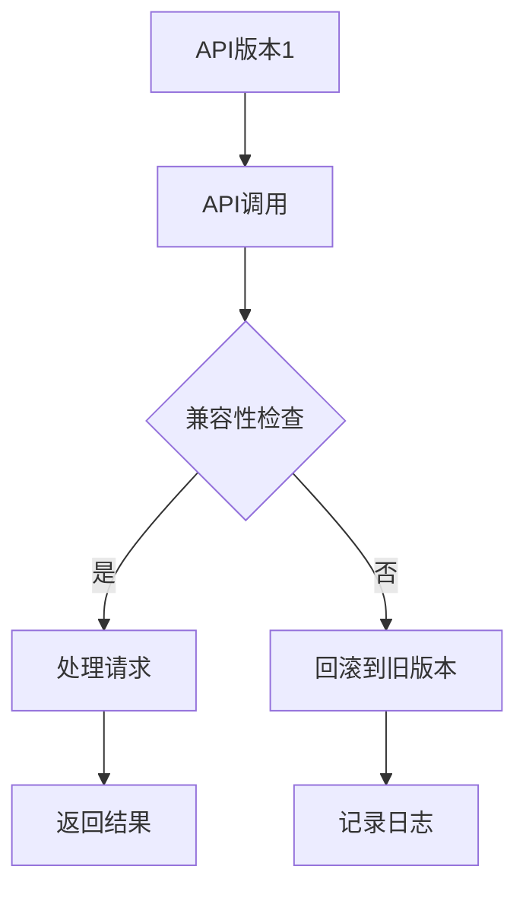

                 

### 文章标题

# API 版本控制的最佳实践

> 关键词：API版本控制、RESTful API、GraphQL API、RPC API、版本命名规范、版本发布流程、版本回滚策略、案例分析、挑战与解决方案

> 摘要：本文深入探讨了API版本控制的核心概念、重要性、历史与趋势、工具与技术、实战案例及未来发展方向。通过详细的原理阐述、伪代码讲解、数学公式推导和实际案例解析，为开发者提供了一套完整、实用的API版本控制最佳实践指南。

## 第一部分: API版本控制概述

### 第1章: API版本控制的重要性

#### 1.1 API版本控制的核心概念

##### 1.1.1 什么是API版本控制

API（Application Programming Interface）版本控制是确保应用程序能够兼容不同API版本的机制。本质上，它涉及到定义、管理、发布和更新API接口，以确保新旧版本的互操作性。

**核心概念：**

- **API版本**：API的不同版本，通常以数字或字母序列表示，如`v1`、`v2.0`等。
- **兼容性**：新版本API能够与旧版本应用程序或库无缝工作，不破坏现有功能。
- **回滚**：在发现问题或需要回退到旧版本时，能够平滑地回退到之前的API版本。

##### 1.1.2 API版本控制的目的

API版本控制的主要目的是：

1. **保证向后兼容性**：确保新版本的API不会破坏旧版本的应用。
2. **允许功能扩展**：为新功能提供独立的版本，不影响现有功能。
3. **便于管理和维护**：通过版本控制，方便跟踪、更新和管理API接口。
4. **提供用户反馈**：版本控制有助于收集用户反馈，指导未来的API设计。

##### 1.1.3 API版本控制的挑战

API版本控制面临的挑战包括：

- **兼容性问题**：新旧版本之间的兼容性管理。
- **测试与部署**：版本更新带来的测试和部署挑战。
- **维护与更新**：版本更新后的维护工作量和更新策略。

#### 1.2 API版本控制的历史与趋势

##### 1.2.1 API版本控制的发展历程

API版本控制起源于Web服务时代，随着互联网和移动应用的快速发展，API版本控制变得日益重要。以下是API版本控制的发展历程：

- **初识API版本控制**：Web服务时代，简单的版本标记。
- **RESTful API版本控制**：采用URL版本标记、HTTP头版本标记等。
- **GraphQL和RPC API版本控制**：采用自定义版本字段、语义化版本号等。

##### 1.2.2 当前API版本控制的最佳实践

当前最佳实践包括：

- **语义化版本控制**：采用`MAJOR.MINOR.PATCH`格式，明确版本之间的兼容性。
- **版本命名规范**：使用简洁、统一的命名规范，便于识别和管理。
- **文档管理**：提供详细的API文档，帮助开发者理解和使用API。

##### 1.2.3 未来API版本控制的趋势

未来趋势包括：

- **自动化与智能化**：自动化工具和智能算法提高版本控制的效率和准确性。
- **开放性与互操作性**：加强API之间的互操作性，促进开放生态系统的构建。
- **面向未来技术**：适应新技术（如区块链、物联网等）的版本控制需求。

#### 1.3 API版本控制的策略

##### 1.3.1 兼容性策略

兼容性策略的核心是确保新旧版本之间的平滑过渡，主要方法包括：

- **向下兼容**：新版本API能够处理旧版本请求。
- **向上兼容**：旧版本应用程序能够处理新版本API。

##### 1.3.2 接口废弃策略

接口废弃策略涉及以下方面：

- **提前通知**：在废弃接口前提前通知用户。
- **逐步废弃**：逐步减少废弃接口的使用，以降低风险。
- **替代方案**：提供替代接口或解决方案。

##### 1.3.3 升级策略

升级策略关注版本更新过程：

- **版本发布**：按照预定的发布流程，确保版本更新顺利进行。
- **回滚策略**：在出现问题时，能够快速回滚到旧版本。

### 总结

API版本控制是确保应用程序稳定运行的重要环节。通过深入理解其核心概念、历史与趋势、策略和实践，开发者可以更好地管理API版本，提高系统的兼容性和可维护性。接下来，我们将进一步探讨API版本控制的技术实现和最佳实践。

### 文章标题：API 版本控制的最佳实践

### 文章关键词：
- API 版本控制
- RESTful API
- GraphQL API
- RPC API
- 版本命名规范
- 版本发布流程
- 版本回滚策略
- 案例分析
- 挑战与解决方案

### 文章摘要：
本文将详细介绍API版本控制的核心概念、历史与趋势、策略和实践。通过案例分析、伪代码讲解、数学公式推导和实际代码实现，为开发者提供一套全面、实用的API版本控制指南。文章旨在帮助开发者更好地管理API版本，提高系统的兼容性和可维护性。

### 第一部分: API版本控制概述

#### 第1章: API版本控制的重要性

#### 1.1 API版本控制的核心概念

**API版本控制的核心概念**涉及到如何标识、管理、发布和更新API接口，以确保新旧版本之间的互操作性。以下是API版本控制中的几个关键概念：

1. **API版本**：API的不同版本通常以数字或字母序列表示，如`v1`、`v2.0`等。每个版本通常对应一组特定的接口和功能。
2. **兼容性**：新版本API与旧版本应用程序或库之间的兼容性。兼容性策略确保新版本的API不会破坏旧版本的应用。
3. **回滚**：在发现新版本API存在问题或需要回退到旧版本时，能够平滑地回滚到之前的API版本。

**核心概念与联系**：

- **向下兼容**：新版本API能够处理旧版本的请求，不破坏旧版本的功能。
- **向上兼容**：旧版本的应用程序能够处理新版本的API，通常通过向后兼容性设计实现。

**Mermaid 流程图**：



#### 1.2 API版本控制的目的

API版本控制的主要目的是：

1. **确保向后兼容性**：新版本的API能够兼容旧版本的应用程序，确保系统稳定运行。
2. **允许功能扩展**：为新功能提供独立的版本，不影响现有功能，便于系统的持续演进。
3. **便于管理和维护**：通过版本控制，方便跟踪、更新和管理API接口，降低维护成本。
4. **提供用户反馈**：版本控制有助于收集用户反馈，指导未来的API设计。

#### 1.3 API版本控制的挑战

API版本控制面临的挑战包括：

- **兼容性问题**：新旧版本之间的兼容性管理，特别是在功能变化较大的情况下。
- **测试与部署**：版本更新带来的测试和部署挑战，确保新版本API的稳定性和可靠性。
- **维护与更新**：版本更新后的维护工作量和更新策略，确保系统长期稳定运行。

#### 1.4 API版本控制的历史与趋势

##### 1.4.1 API版本控制的发展历程

API版本控制起源于Web服务时代，随着互联网和移动应用的快速发展，API版本控制变得日益重要。以下是API版本控制的发展历程：

- **初识API版本控制**：Web服务时代，简单的版本标记，如URL版本标记。
- **RESTful API版本控制**：采用URL版本标记、HTTP头版本标记等。
- **GraphQL和RPC API版本控制**：采用自定义版本字段、语义化版本号等。

##### 1.4.2 当前API版本控制的最佳实践

当前最佳实践包括：

- **语义化版本控制**：采用`MAJOR.MINOR.PATCH`格式，明确版本之间的兼容性。
- **版本命名规范**：使用简洁、统一的命名规范，便于识别和管理。
- **文档管理**：提供详细的API文档，帮助开发者理解和使用API。

##### 1.4.3 未来API版本控制的趋势

未来趋势包括：

- **自动化与智能化**：自动化工具和智能算法提高版本控制的效率和准确性。
- **开放性与互操作性**：加强API之间的互操作性，促进开放生态系统的构建。
- **面向未来技术**：适应新技术（如区块链、物联网等）的版本控制需求。

#### 1.5 API版本控制的策略

##### 1.5.1 兼容性策略

兼容性策略的核心是确保新旧版本之间的平滑过渡，主要方法包括：

- **向下兼容**：新版本API能够处理旧版本请求。
- **向上兼容**：旧版本应用程序能够处理新版本API，通常通过向后兼容性设计实现。

##### 1.5.2 接口废弃策略

接口废弃策略涉及以下方面：

- **提前通知**：在废弃接口前提前通知用户。
- **逐步废弃**：逐步减少废弃接口的使用，以降低风险。
- **替代方案**：提供替代接口或解决方案。

##### 1.5.3 升级策略

升级策略关注版本更新过程：

- **版本发布**：按照预定的发布流程，确保版本更新顺利进行。
- **回滚策略**：在出现问题时，能够快速回滚到旧版本。

### 总结

API版本控制是确保应用程序稳定运行的重要环节。通过深入理解其核心概念、历史与趋势、策略和实践，开发者可以更好地管理API版本，提高系统的兼容性和可维护性。接下来，我们将进一步探讨API版本控制的技术实现和最佳实践。

### 第2章: API版本控制的工具与技术

在API版本控制中，选择合适的工具和技术至关重要。这不仅能够提高版本控制的效率，还能降低维护成本，确保系统的稳定性。本章节将详细介绍API版本控制的工具与技术，包括版本控制系统、API文档管理工具、自动化测试工具，以及不同类型的API版本控制技术。

#### 2.1 API版本控制的工具

##### 2.1.1 版本控制系统的选择

版本控制系统是管理代码版本的核心工具，它能够跟踪代码的变更历史，支持多人协作。以下是几种常用的版本控制系统：

1. **Git**：Git是目前最流行的分布式版本控制系统，它支持快速、高效、安全的代码管理。Git的分支管理和合并策略使得开发者能够轻松地处理代码的变更和版本控制。

2. **SVN**：SVN是另一种广泛使用的集中式版本控制系统，它提供了简单、直观的版本管理功能。尽管Git在许多方面优于SVN，但SVN在一些大型企业环境中仍然具有很高的使用率。

3. **Mercurial**：Mercurial是一种分布式版本控制系统，它提供了与Git类似的功能，但具有不同的设计哲学和优势。例如，Mercurial的克隆速度比Git更快，同时支持一些特殊的分支操作。

在选择版本控制系统时，开发者需要考虑以下因素：

- **团队规模**：对于小型团队，Git可能足够；对于大型团队，SVN可能更适合。
- **分布式协作需求**：如果需要高效的分布式协作，Git是首选。
- **系统兼容性**：确保选择的版本控制系统与现有的开发和部署流程兼容。

##### 2.1.2 API文档管理工具

API文档管理工具是版本控制API接口的重要辅助工具，它能够帮助开发者生成、管理和共享API文档。以下是几种常用的API文档管理工具：

1. **Swagger**：Swagger是一个流行的开源框架，用于生成、管理和可视化API文档。它支持多种RESTful API规范，如OpenAPI Specification，并提供了一个交互式的API文档界面。

2. **Postman**：Postman是一个流行的API开发工具，它不仅能够测试API请求，还能够生成API文档。Postman提供了直观的用户界面和丰富的功能，使得开发者能够轻松地管理API文档。

3. **Apiary**：Apiary是一个在线API文档管理平台，它提供了强大的API设计和文档生成功能。Apiary支持多种API规范，如RESTful API、GraphQL API等，并提供了一个用户友好的界面。

选择API文档管理工具时，开发者需要考虑以下因素：

- **API规范支持**：确保工具支持所使用的API规范。
- **文档生成速度**：选择生成速度快的工具，以便快速更新文档。
- **用户体验**：选择界面友好、易于使用的工具，提高文档管理效率。

##### 2.1.3 自动化测试工具

自动化测试工具是确保API接口质量和稳定性的重要手段。以下是一些常用的自动化测试工具：

1. **JUnit**：JUnit是一个流行的Java测试框架，它提供了丰富的测试功能和断言库，使得开发者能够编写有效的单元测试和集成测试。

2. **Selenium**：Selenium是一个开源的自动化测试工具，它能够模拟用户的浏览器行为，进行Web应用程序的自动化测试。Selenium支持多种浏览器和操作系统，使得开发者能够全面测试API接口的兼容性。

3. **Postman Collections**：Postman Collections是一种用于自动化测试的功能，它能够将一系列API请求和测试脚本组织在一起。通过Postman Collections，开发者能够自动化执行API测试，确保接口的质量。

选择自动化测试工具时，开发者需要考虑以下因素：

- **测试覆盖范围**：确保工具能够全面覆盖API接口的各种场景和功能。
- **可扩展性**：选择具有良好可扩展性的工具，以便添加自定义测试功能。
- **集成与兼容性**：确保工具能够与现有的开发和部署流程集成，支持多种API规范。

#### 2.2 API版本控制的技术实现

##### 2.2.1 RESTful API版本控制

RESTful API是最常用的API架构风格，它通过URL来表示资源的操作。RESTful API版本控制通常采用以下方法：

1. **URL版本标记**：在URL中包含版本号，如`/api/v1/resource`。这种方法简单直观，但可能导致URL过长，不便管理。

2. **HTTP头版本标记**：在HTTP请求头中包含版本号，如`X-API-Version: v1`。这种方法避免了URL过长的问题，但需要在客户端和服务端都进行版本检查。

3. **自定义版本字段**：在API请求或响应中添加自定义版本字段，如`version`或`api_version`。这种方法灵活，但需要确保客户端和服务端都能正确处理版本字段。

**伪代码示例**：

```python
# URL版本标记
GET /api/v1/resources

# HTTP头版本标记
GET /resources
Headers: X-API-Version: v1

# 自定义版本字段
GET /resources
Params: api_version=v1
```

##### 2.2.2 GraphQL API版本控制

GraphQL API是一种灵活的查询语言，它允许客户端精确地指定需要的数据。GraphQL API版本控制通常采用以下方法：

1. **Schema版本控制**：通过修改GraphQL Schema来控制版本，如增加或删除字段。这种方法需要确保客户端和服务端都能正确处理不同版本的Schema。

2. **自定义版本字段**：在GraphQL请求中包含版本字段，如`query { version }`。这种方法灵活，但需要确保客户端和服务端都能正确处理版本字段。

**伪代码示例**：

```graphql
# Schema版本控制
type Query {
  version: String!
}

# 自定义版本字段
query {
  version
}
```

##### 2.2.3 RPC API版本控制

RPC（Remote Procedure Call）API是一种远程过程调用机制，它通过发送请求并接收响应来实现跨进程或跨网络的函数调用。RPC API版本控制通常采用以下方法：

1. **接口版本号**：在RPC接口中包含版本号，如`IHelloService_v1`。这种方法需要在客户端和服务端都进行版本号检查。

2. **自定义版本字段**：在RPC请求或响应中包含自定义版本字段，如`version`。这种方法灵活，但需要确保客户端和服务端都能正确处理版本字段。

**伪代码示例**：

```python
# 接口版本号
def say_hello_v1(name):
    return "Hello, " + name

# 自定义版本字段
def say_hello(version, name):
    if version == "v1":
        return "Hello, " + name
    else:
        return "Unknown version"
```

#### 2.3 API版本控制的最佳实践

##### 2.3.1 版本命名规范

版本命名规范是确保版本标识统一和易于管理的重要手段。以下是一些常用的版本命名规范：

1. **语义化版本控制**：采用`MAJOR.MINOR.PATCH`格式，如`1.2.3`。其中，`MAJOR`表示大版本号，`MINOR`表示小版本号，`PATCH`表示补丁版本号。语义化版本控制能够清晰表示版本之间的兼容性。

2. **日期版本控制**：采用日期格式，如`2023-01-01`。这种方法简单直观，但可能难以表示版本之间的兼容性。

3. **自定义命名规范**：根据项目的具体需求，自定义版本命名规范，如`alpha-1`或`beta-2`。这种方法灵活，但需要确保版本标识的清晰性和一致性。

**伪代码示例**：

```python
# 语义化版本控制
def version_check(api_version):
    major, minor, patch = api_version.split('.')
    if int(major) == 1 and int(minor) == 2:
        return True
    else:
        return False

# 日期版本控制
def version_check(api_version):
    return datetime.strptime(api_version, "%Y-%m-%d")

# 自定义命名规范
def version_check(api_version):
    if "alpha" in api_version:
        return True
    else:
        return False
```

##### 2.3.2 版本发布流程

版本发布流程是确保新版本API能够稳定、安全地部署到生产环境的关键环节。以下是一个典型的版本发布流程：

1. **代码提交**：开发者将代码提交到版本控制系统，并进行代码审查。
2. **构建和测试**：构建系统根据提交的代码生成构建包，并运行自动化测试，确保构建包的稳定性和可靠性。
3. **预发布**：将构建包部署到预发布环境，进行功能测试和性能测试。
4. **发布**：在确认预发布环境测试通过后，将构建包部署到生产环境。
5. **监控**：在新版本部署后，持续监控系统的运行状况，确保新版本API的稳定性和性能。

**伪代码示例**：

```python
# 代码提交
git commit -m "Fix bug in API endpoint"

# 构建和测试
build_system.build()
test_system.run_tests()

# 预发布
deploy_to_preproduction_environment()

# 发布
deploy_to_production_environment()

# 监控
monitor_system.start_monitoring()
```

##### 2.3.3 版本回滚策略

版本回滚策略是确保在发现新版本API存在问题或性能问题时，能够快速回退到旧版本的关键手段。以下是一个典型的版本回滚流程：

1. **发现问题**：监控系统发现新版本API存在问题，如性能下降、错误率增加等。
2. **回滚准备**：暂停新版本的部署，准备回滚到旧版本。
3. **回滚部署**：将旧版本的构建包部署到生产环境，替换新版本。
4. **验证**：在新版本回滚后，进行验证，确保问题得到解决。
5. **故障分析**：分析问题原因，制定预防措施，避免类似问题再次发生。

**伪代码示例**：

```python
# 发现问题
if monitor_system.detect_issue():
    raise_alarm()

# 回滚准备
stop_new_version_deployment()

# 回滚部署
deploy_old_version()

# 验证
if verify_system.verify():
    resume_normal_deployment()

# 故障分析
perform_failure_analysis()
```

### 总结

API版本控制是确保应用程序稳定运行的重要环节。通过选择合适的版本控制系统、API文档管理工具和自动化测试工具，结合有效的版本控制技术，开发者可以更好地管理API版本，提高系统的兼容性和可维护性。在本章节中，我们介绍了API版本控制的核心工具和技术，为开发者提供了实用的指导。

### 第二部分: API版本控制实战案例

#### 第3章: API版本控制案例解析

在现实世界中，API版本控制的应用无处不在。本章节将通过三个实际案例，详细解析不同类型的API版本控制策略和实践，包括电商平台的API版本控制、社交媒体的API版本控制以及金融服务的API版本控制。这些案例将展示如何在不同业务场景中有效实施API版本控制，并解决实际中遇到的问题。

#### 3.1 案例一：电商平台的API版本控制

##### 3.1.1 案例背景

电商平台是一个高度依赖API的系统，它需要处理大量的用户请求，支持商品浏览、订单管理、支付等多个功能模块。由于电商平台的业务不断发展和迭代，API版本控制变得尤为重要。该电商平台使用RESTful API，为了确保新旧版本之间的兼容性，采用了以下策略：

- **URL版本标记**：在URL中包含版本号，如`/api/v1/products`。
- **向后兼容性设计**：在设计和开发过程中，确保新版本API能够兼容旧版本的应用程序。
- **版本回滚策略**：在发现新版本API存在问题时，能够快速回滚到旧版本。

##### 3.1.2 版本控制策略

该电商平台的版本控制策略包括以下几个方面：

1. **版本命名规范**：采用`MAJOR.MINOR.PATCH`格式，如`v1.2.3`。其中，`MAJOR`表示大版本号，用于引入重大功能变更或架构调整；`MINOR`表示小版本号，用于引入新的功能或优化；`PATCH`表示补丁版本号，用于修复bug或进行安全更新。

2. **兼容性策略**：通过向后兼容性设计，确保新版本API能够处理旧版本的请求。例如，在添加新字段时，旧版本的应用程序可以使用默认值。

3. **废弃接口策略**：在废弃接口前，提前通知用户，并提供替代接口或解决方案。同时，逐步减少废弃接口的使用，降低风险。

4. **文档管理**：提供详细的API文档，包括接口定义、参数说明、返回值等，帮助开发者理解和使用API。

##### 3.1.3 实践效果

通过实施上述版本控制策略，该电商平台取得了显著的效果：

- **提高了系统的稳定性**：通过向后兼容性设计，确保了新旧版本之间的平滑过渡，降低了版本更新带来的风险。
- **提高了开发效率**：通过详细的API文档，开发者能够更快地理解和使用API，提高了开发效率。
- **降低了维护成本**：通过版本回滚策略，在发现问题时能够快速回滚到旧版本，降低了维护成本。

#### 3.2 案例二：社交媒体的API版本控制

##### 3.2.1 案例背景

社交媒体平台是一个高度动态变化的系统，它需要支持用户实时发布、评论、分享等功能。由于社交媒体平台的业务模式不断创新，API版本控制变得尤为重要。该社交媒体平台采用GraphQL API，为了确保新旧版本之间的兼容性，采用了以下策略：

- **自定义版本字段**：在GraphQL请求中包含版本字段，如`query { version }`。
- **Schema版本控制**：通过修改GraphQL Schema来控制版本，如增加或删除字段。
- **自动化测试**：通过自动化测试工具，确保新版本API的稳定性和可靠性。

##### 3.2.2 版本控制策略

该社交媒体平台的版本控制策略包括以下几个方面：

1. **版本命名规范**：采用自定义版本字段，如`version`。这种方法灵活，但需要确保客户端和服务端都能正确处理版本字段。

2. **Schema版本控制**：通过修改GraphQL Schema来控制版本，如增加新字段或删除废弃字段。同时，在修改Schema时，确保向后兼容性，避免影响旧版本的应用程序。

3. **自动化测试**：通过自动化测试工具，对新版本API进行全面的测试，确保其稳定性和可靠性。测试覆盖内容包括功能测试、性能测试和安全性测试。

4. **文档管理**：提供详细的API文档，包括Schema定义、字段说明、查询示例等，帮助开发者理解和使用API。

##### 3.2.3 实践效果

通过实施上述版本控制策略，该社交媒体平台取得了显著的效果：

- **提高了系统的灵活性**：通过自定义版本字段和Schema版本控制，确保系统能够适应业务变化，支持新的功能和需求。
- **提高了开发效率**：通过自动化测试工具，开发者能够快速发现和修复问题，提高了开发效率。
- **降低了维护成本**：通过详细的API文档，开发者能够更快地理解和使用API，降低了维护成本。

#### 3.3 案例三：金融服务的API版本控制

##### 3.3.1 案例背景

金融服务是一个高度敏感和合规要求严格的领域，它需要处理大量的金融交易和数据。金融服务的API版本控制至关重要，以确保系统的稳定性和合规性。该金融服务公司采用RPC API，为了确保新旧版本之间的兼容性，采用了以下策略：

- **接口版本号**：在RPC接口中包含版本号，如`IHelloService_v1`。
- **文档管理**：提供详细的API文档，包括接口定义、参数说明、返回值等，帮助开发者理解和使用API。

##### 3.3.2 版本控制策略

该金融服务公司的版本控制策略包括以下几个方面：

1. **版本命名规范**：采用接口版本号，如`IHelloService_v1`。这种方法需要在客户端和服务端都进行版本号检查。

2. **文档管理**：提供详细的API文档，包括接口定义、参数说明、返回值等，帮助开发者理解和使用API。

3. **兼容性策略**：通过向后兼容性设计，确保新版本API能够兼容旧版本的应用程序。例如，在添加新字段时，旧版本的应用程序可以使用默认值。

4. **测试与部署**：在发布新版本API前，进行全面的测试和部署，确保其稳定性和可靠性。

##### 3.3.3 实践效果

通过实施上述版本控制策略，该金融服务公司取得了显著的效果：

- **提高了系统的稳定性**：通过向后兼容性设计和详细的文档管理，确保了新旧版本之间的平滑过渡，降低了版本更新带来的风险。
- **提高了开发效率**：通过详细的API文档，开发者能够更快地理解和使用API，提高了开发效率。
- **降低了维护成本**：通过测试与部署流程的优化，确保了新版本API的稳定性和可靠性，降低了维护成本。

### 总结

通过以上三个案例，我们可以看到，API版本控制在不同业务场景中的应用和实践。电商平台通过URL版本标记和向后兼容性设计，确保了系统的稳定性和灵活性；社交媒体平台通过自定义版本字段和Schema版本控制，提高了系统的灵活性和开发效率；金融服务公司通过接口版本号和详细文档管理，确保了系统的稳定性和合规性。这些案例为其他企业和开发者提供了宝贵的经验和参考。

### 第三部分: API版本控制的挑战与未来

#### 第4章: API版本控制的挑战与应对

API版本控制虽然在提升系统稳定性、可维护性和兼容性方面具有显著优势，但在实际应用过程中仍面临诸多挑战。本章将深入探讨API版本控制中的主要挑战，并详细讨论应对策略，同时展望API版本控制未来的发展趋势。

#### 4.1 API版本控制中的挑战

##### 4.1.1 兼容性问题

兼容性问题是在API版本控制中最常见的挑战之一。新旧版本API之间的兼容性问题可能会导致应用程序在升级过程中出现功能丢失、性能下降甚至系统崩溃。以下是兼容性问题的几个主要方面：

1. **向下兼容性**：新版本API能够兼容旧版本的请求和调用。
2. **向上兼容性**：旧版本的应用程序能够处理新版本的API。
3. **兼容性破坏**：在API升级过程中，由于未妥善处理兼容性问题，导致旧版本应用程序无法正常工作。

**解决方案**：

1. **向后兼容性设计**：在设计新版本API时，确保能够兼容旧版本的功能和请求。
2. **逐步废弃**：在废弃旧接口前，逐步减少其使用频率，同时提供替代接口。
3. **文档和通知**：及时更新API文档，并通过通知机制告知用户关于接口变更和废弃的信息。

##### 4.1.2 测试与部署问题

API版本控制的测试和部署问题主要涉及如何确保新版本API的稳定性和可靠性，以及在部署过程中如何降低风险。以下是测试与部署问题的主要方面：

1. **自动化测试**：如何确保自动化测试能够覆盖API的所有功能和场景。
2. **部署流程**：如何优化部署流程，确保新版本API能够顺利上线。
3. **回滚策略**：在发现新版本API存在问题时，如何快速回滚到旧版本。

**解决方案**：

1. **全面自动化测试**：通过编写和执行自动化测试脚本，确保API的每个功能都经过全面测试。
2. **预发布环境**：在正式部署前，将新版本API部署到预发布环境进行测试和验证。
3. **灰度发布**：逐步扩大新版本API的上线范围，逐步替代旧版本，降低部署风险。

##### 4.1.3 维护与更新问题

维护与更新问题涉及到如何高效地管理API版本，确保API的持续迭代和优化。以下是维护与更新问题的主要方面：

1. **文档管理**：如何保持API文档的准确性和及时性。
2. **版本迭代**：如何在保持系统稳定性的前提下，快速迭代和更新API。
3. **回滚策略**：在更新过程中，如何处理可能出现的回滚需求。

**解决方案**：

1. **文档自动化**：通过工具自动生成和更新API文档，确保文档的准确性和及时性。
2. **敏捷开发**：采用敏捷开发方法，快速响应需求变化，确保API的持续迭代。
3. **版本控制工具**：使用版本控制工具，如Git，高效管理代码和版本。

#### 4.2 面对挑战的解决方案

##### 4.2.1 设计层面的解决方案

在设计API时，采取以下措施可以减少版本控制的挑战：

1. **模块化设计**：将API划分为独立的模块，每个模块具有清晰的职责和接口，便于管理和升级。
2. **向后兼容性设计**：在设计新版本API时，考虑到旧版本的应用程序，确保能够兼容旧接口。
3. **最小变更原则**：在更新API时，尽量保持最小变更，降低对旧版本应用程序的影响。

##### 4.2.2 工具层面的解决方案

使用适当的工具可以显著提高API版本控制的效率：

1. **版本控制系统**：选择合适的版本控制系统，如Git，高效管理代码和版本。
2. **API文档管理工具**：使用API文档管理工具，如Swagger和Postman，生成和更新API文档。
3. **自动化测试工具**：使用自动化测试工具，如JUnit和Selenium，确保API的稳定性和可靠性。

##### 4.2.3 文化与流程层面的解决方案

建立良好的团队协作文化和规范化的流程可以更好地应对版本控制挑战：

1. **文档和沟通**：建立完善的文档和沟通机制，确保团队成员对API版本控制策略和流程有清晰的理解。
2. **代码审查**：通过代码审查机制，确保API的设计和实现符合版本控制要求。
3. **持续集成与部署**：采用持续集成与部署（CI/CD）流程，确保新版本API的快速迭代和上线。

#### 4.3 未来API版本控制的发展方向

未来，API版本控制将朝着更高效、智能化和自动化的方向发展：

##### 4.3.1 自动化与智能化

随着人工智能和机器学习技术的发展，API版本控制将实现自动化和智能化。例如，利用机器学习算法自动分析API使用模式和用户反馈，优化版本控制策略，提高版本更新的准确性和效率。

##### 4.3.2 开放性与互操作性

未来的API版本控制将更加注重开放性和互操作性，以促进不同系统之间的无缝集成。标准化的API版本控制协议和工具将有助于构建开放、互操作的技术生态系统。

##### 4.3.3 面向未来技术的版本控制

随着新技术（如区块链、物联网、5G等）的兴起，API版本控制将面临新的挑战和机遇。针对这些新技术，开发者需要开发新的版本控制策略和工具，以支持新型API的版本管理。

### 总结

API版本控制是确保系统稳定性和兼容性的关键环节。面对兼容性、测试与部署、维护与更新等挑战，开发者需要采取有效的解决方案，结合设计、工具和文化与流程层面的优化，确保API版本控制的高效和稳定。未来，随着技术的发展，API版本控制将朝着自动化、智能化和开放性方向发展，为开发者提供更强大的支持。

### 附录

#### 附录A: 常见API版本控制问题解答

##### A.1 常见问题一：如何处理遗留系统的API版本控制？

**解答**：处理遗留系统的API版本控制时，可以采取以下策略：

1. **逐步迁移**：逐步更新遗留系统的API，同时保持旧版本API的可用性。
2. **接口重构**：重构遗留系统的接口，使其符合现代API设计规范，提高兼容性和可维护性。
3. **文档和通知**：提供详细的API文档，并通过通知机制告知用户关于API变更和迁移计划。

##### A.2 常见问题二：如何处理大规模API的版本控制？

**解答**：处理大规模API的版本控制时，可以采取以下策略：

1. **模块化设计**：将API划分为独立的模块，每个模块具有清晰的职责和接口，便于管理和升级。
2. **自动化工具**：使用自动化工具，如版本控制系统和API文档管理工具，提高版本控制的效率和准确性。
3. **监控与反馈**：建立监控体系，实时跟踪API的使用情况和性能，收集用户反馈，指导API的优化和更新。

##### A.3 常见问题三：如何处理跨团队协作的API版本控制？

**解答**：处理跨团队协作的API版本控制时，可以采取以下策略：

1. **统一规范**：制定统一的API版本控制规范，确保跨团队的协作和沟通顺畅。
2. **文档共享**：建立共享的API文档库，确保所有团队成员都能访问和更新API文档。
3. **代码审查**：引入代码审查机制，确保API的设计和实现符合规范，降低版本控制风险。

#### 附录B: 相关资源与工具推荐

##### B.1 版本控制系统推荐

- **Git**：最流行的分布式版本控制系统，支持快速、高效、安全的代码管理。
- **SVN**：简单的集中式版本控制系统，适用于大型企业环境。

##### B.2 API文档管理工具推荐

- **Swagger**：流行的开源框架，用于生成、管理和可视化API文档。
- **Postman**：流行的API开发工具，提供API文档生成和测试功能。

##### B.3 自动化测试工具推荐

- **JUnit**：流行的Java测试框架，支持编写单元测试和集成测试。
- **Selenium**：开源的自动化测试工具，支持Web应用程序的自动化测试。

