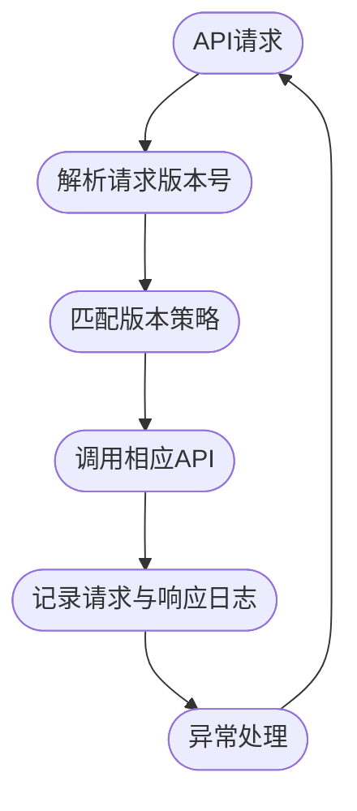

                 

# 《API 版本控制的详细实施》

> 关键词：API版本控制，API设计原则，版本控制策略，API版本控制工具，自动化测试，安全性，案例分析

> 摘要：本文将深入探讨API版本控制的基础知识、设计原则、实践策略、工具与技术、自动化测试、安全性以及案例分析。通过详细分析API版本控制的核心概念和实现方法，结合实际案例和代码示例，帮助读者全面了解并掌握API版本控制的实施技巧。

## 第一部分：API版本控制基础知识

### 第1章：API版本控制概述

#### 1.1 API版本控制的概念

API（Application Programming Interface）版本控制是一种管理API变更和兼容性的机制。它通过为API分配版本号来标识不同版本的API，从而实现不同版本之间的功能增强、错误修复和兼容性处理。

#### 1.2 API版本控制的重要性

API版本控制对于确保系统的稳定性和可维护性至关重要。它有助于：

1. **管理API变更**：便于跟踪和管理API的功能变更。
2. **提高系统的可扩展性**：允许多个版本的API同时存在，适应不同用户需求。
3. **确保兼容性**：降低新版本API引入的兼容性问题。
4. **便于调试和故障排除**：通过版本控制，可以更快速地定位和解决API问题。

#### 1.3 API版本控制的常见方法

常见的API版本控制方法包括：

1. **路径版本控制**：通过URL路径中的版本号标识不同版本。
2. **请求头版本控制**：通过请求头的特定字段传递版本号。
3. **参数版本控制**：通过URL参数中的版本号标识版本。
4. **响应头版本控制**：在响应头的特定字段中传递版本号。

### 第2章：API设计原则与版本控制

#### 2.1 API设计的基本原则

设计良好的API需要遵循以下原则：

1. **简洁性**：API接口应简洁明了，避免过度设计。
2. **一致性**：API应保持一致性，便于使用和维护。
3. **稳定性**：API应尽量避免破坏性变更，确保系统的稳定性。
4. **可扩展性**：API应易于扩展，以适应未来的需求。

#### 2.2 API版本控制与API设计的关系

API版本控制与API设计紧密相关。良好的API设计有助于：

1. **简化版本控制**：明确API的功能边界，降低版本控制的复杂性。
2. **提高兼容性**：通过稳定的设计和合理的变更策略，确保不同版本的API兼容。
3. **降低迁移成本**：合理的版本控制策略有助于降低系统升级和迁移的成本。

#### 2.3 常见API设计错误及解决方案

常见的API设计错误包括：

1. **功能过度集中**：解决方案：分解为多个独立的API。
2. **参数过多**：解决方案：使用复杂数据结构传递参数。
3. **缺乏错误处理**：解决方案：明确定义错误处理机制。

## 第二部分：API版本控制实践

### 第3章：API版本控制策略

#### 3.1 API版本控制策略概述

API版本控制策略是指确定API版本号管理方式的一组规则。常见的策略包括：

1. **路径版本控制**：通过URL路径中的版本号标识版本。
2. **请求头版本控制**：通过请求头的特定字段传递版本号。
3. **参数版本控制**：通过URL参数中的版本号标识版本。
4. **响应头版本控制**：在响应头的特定字段中传递版本号。

#### 3.2 常见的API版本控制策略

1. **语义化版本控制**：通过主版本号、次版本号和修订号标识API版本，如1.0.0。
2. **单一主版本控制**：仅使用主版本号标识API版本。
3. **复合版本控制**：结合多个版本标识符（如日期、分支名称等）标识API版本。

#### 3.3 如何选择合适的API版本控制策略

选择合适的API版本控制策略需要考虑：

1. **API变更频率**：高频变更是使用单一主版本控制的好选择。
2. **兼容性需求**：若需要保证旧版本兼容，建议使用路径版本控制。
3. **开发团队规模**：大型团队可能更倾向于使用复合版本控制。

### 第4章：API版本控制工具与技术

#### 4.1 API版本控制工具介绍

常用的API版本控制工具包括：

1. **Swagger**：用于生成API文档和自动化测试。
2. **OpenAPI**：用于定义RESTful API规范。
3. **API Blueprint**：用于定义API设计和文档。

#### 4.2 API版本控制技术实现

实现API版本控制的关键技术包括：

1. **版本号解析**：通过正则表达式、解析库等解析版本号。
2. **路由匹配**：根据版本号匹配相应的API路由。
3. **响应处理**：在响应中包含版本号信息。

#### 4.3 API版本控制的最佳实践

最佳实践包括：

1. **明确版本号规则**：确保版本号标识清晰且易于理解。
2. **版本迭代规划**：制定版本迭代计划，提前规划版本变更。
3. **文档更新**：及时更新API文档，说明版本变更和兼容性。

## 第5章：API版本控制与自动化

#### 5.1 API自动化测试概述

API自动化测试是一种使用工具和脚本自动化执行API测试的方法。它有助于：

1. **提高测试效率**：自动化测试可以快速执行大量测试用例。
2. **确保稳定性**：自动化测试可以持续监控API的稳定性。
3. **降低人力成本**：减少手动测试的工作量。

#### 5.2 API自动化测试与版本控制的关系

API自动化测试与版本控制密切相关。良好的版本控制有助于：

1. **确保测试覆盖**：通过版本控制，可以确保测试用例覆盖到不同版本的API。
2. **降低测试风险**：版本控制可以降低新版本API引入的未知风险。
3. **提高测试效率**：通过版本控制，可以快速定位测试的重点和关键点。

#### 5.3 实现API自动化测试的步骤

实现API自动化测试的步骤包括：

1. **选择测试工具**：选择合适的API自动化测试工具，如Postman、JMeter等。
2. **编写测试脚本**：编写测试脚本，执行API测试用例。
3. **持续集成**：将测试脚本集成到持续集成（CI）流程中。
4. **监控和报告**：监控测试结果，生成测试报告。

### 第6章：API版本控制与安全性

#### 6.1 API安全性概述

API安全性是确保API不被恶意使用和攻击的重要措施。常见的API安全性问题包括：

1. **认证和授权**：未正确实施认证和授权机制。
2. **输入验证**：未对输入数据进行验证，可能导致注入攻击。
3. **会话管理**：会话管理不当，可能导致会话劫持。
4. **数据保护**：未对传输和存储的数据进行加密。

#### 6.2 API版本控制与安全性的关系

API版本控制与安全性密切相关。良好的版本控制有助于：

1. **加强安全性**：通过版本控制，可以及时修复已知的安全漏洞。
2. **降低安全风险**：版本控制可以降低新版本API引入的安全风险。
3. **提高安全性监控**：通过版本控制，可以更有效地监控和跟踪API的安全性问题。

#### 6.3 常见的API安全性问题和解决方案

常见的API安全性问题和解决方案包括：

1. **认证和授权**：使用OAuth 2.0、JWT（JSON Web Tokens）等认证和授权机制。
2. **输入验证**：使用白名单、正则表达式等验证输入数据。
3. **会话管理**：使用安全的会话管理机制，如使用HTTPS协议、会话超时等。
4. **数据保护**：对传输和存储的数据进行加密，如使用TLS（传输层安全协议）、AES（高级加密标准）等。

### 第7章：API版本控制的案例分析

#### 7.1 案例一：大型电商平台的API版本控制实践

#### 7.2 案例二：金融行业的API版本控制策略

#### 7.3 案例三：医疗健康领域的API版本控制

### 第8章：API版本控制的未来发展趋势

#### 8.1 API版本控制的发展趋势

API版本控制的发展趋势包括：

1. **智能化**：利用人工智能和机器学习技术实现自动化版本控制。
2. **标准化**：API版本控制的标准化，以提高兼容性和可移植性。
3. **安全化**：加强API版本控制的安全特性，确保系统的安全性。

#### 8.2 未来API版本控制技术展望

未来API版本控制技术展望包括：

1. **多维度版本控制**：结合代码版本控制、文档版本控制等实现全方位版本控制。
2. **自动化工具的升级**：开发更智能、更高效的API版本控制工具。
3. **集成化**：将API版本控制与CI/CD（持续集成/持续部署）流程集成，实现全自动化的版本控制。

#### 8.3 API版本控制对开发者的影响

API版本控制对开发者的影响包括：

1. **开发效率提升**：简化开发流程，提高开发效率。
2. **代码维护性增强**：通过版本控制，提高代码的可维护性和可扩展性。
3. **安全性提高**：确保系统的稳定性和安全性。

### 附录：API版本控制资源推荐

#### 附录A：常用API版本控制工具介绍

#### 附录B：API版本控制最佳实践指南

#### 附录C：API版本控制相关书籍与论文推荐

### Mermaid 流程图：API 版本控制流程


### API 版本控制策略伪代码示例

```plaintext
function versionControl(request) {
    // 解析请求版本号
    version = parseVersion(request)

    // 根据版本号匹配版本策略
    strategy = matchVersionStrategy(version)

    // 调用相应API
    response = callAPI(strategy, request)

    // 记录请求与响应日志
    logRequestAndResponse(request, response)

    // 异常处理
    if (response.status != 200) {
        handleException(response)
    }

    return response
}
```

### 数学模型与公式

$$
API_{versioned} = f(API_{original}, version_{number})
$$

- $API_{versioned}$：版本化后的API
- $API_{original}$：原始API
- $version_{number}$：版本号

### 数学公式详细讲解

- $API_{versioned}$：表示版本化后的API，它基于原始API进行相应的修改和增强。
- $API_{original}$：表示原始API，它是API版本控制的基础。
- $version_{number}$：表示版本号，它是区分不同版本API的关键。

### 举例说明

假设有一个获取用户信息的API，版本号为1.0，那么根据上述公式，版本化后的API可以表示为：

$$
API_{versioned} = f(API_{original}, version_{number}) = f(API_{original}, 1.0)
$$

在这个例子中，$API_{original}$ 表示获取用户信息的原始API，而 $version_{number}$ 表示版本号1.0。版本化后的API可能会增加一些新的功能或者修复一些已知的问题，以满足不同用户的需求。

### 项目实战

#### 实战一：搭建开发环境

- 安装Python环境
- 安装API版本控制相关的库，如`apischema`和`pydantic`
- 配置虚拟环境，以便管理依赖

#### 实战二：实现API版本控制

- 设计API接口
- 实现版本号解析与匹配策略
- 实现API调用与响应处理
- 添加日志记录与异常处理

#### 实战三：代码解读与分析

- 解析请求版本号的实现
- 版本策略匹配的实现
- API调用的实现
- 日志记录与异常处理的实现

### 代码实现

```python
from apischema import parse
from pydantic import BaseModel

class UserRequest(BaseModel):
    version: str

class UserResponse(BaseModel):
    success: bool
    message: str
    data: dict

def version_control(request: UserRequest) -> UserResponse:
    # 解析请求版本号
    version = parse(request.version)

    # 根据版本号匹配版本策略
    strategy = match_version_strategy(version)

    # 调用相应API
    response = call_api(strategy, request)

    # 记录请求与响应日志
    log_request_and_response(request, response)

    # 异常处理
    if response.status != 200:
        handle_exception(response)

    return response

def match_version_strategy(version: str) -> str:
    # 根据版本号返回对应的API版本
    if version == "1.0":
        return "API_v1"
    elif version == "2.0":
        return "API_v2"
    else:
        return "API_default"

def call_api(strategy: str, request: UserRequest) -> dict:
    # 根据版本策略调用相应API
    if strategy == "API_v1":
        return api_v1(request)
    elif strategy == "API_v2":
        return api_v2(request)
    else:
        return api_default(request)

def log_request_and_response(request: UserRequest, response: dict):
    # 记录请求与响应日志
    print(f"Request: {request}")
    print(f"Response: {response}")

def handle_exception(response: dict):
    # 异常处理
    print(f"Error: {response['message']}")
```

### 代码解读与分析

- `UserRequest` 和 `UserResponse` 类：定义了请求和响应的模型，用于解析和验证请求参数，以及生成响应结果。
- `version_control` 函数：是API版本控制的核心函数，负责接收用户请求、解析版本号、匹配版本策略、调用相应API、记录请求与响应日志以及异常处理。
- `match_version_strategy` 函数：根据版本号返回对应的API版本，用于匹配版本策略。
- `call_api` 函数：根据版本策略调用相应API，实现API版本控制。
- `log_request_and_response` 函数：记录请求与响应日志，便于调试和追踪问题。
- `handle_exception` 函数：处理API调用过程中的异常，提供错误信息。

通过上述代码实现，可以实现对API版本的有效控制，满足不同版本用户的需求，同时保证系统的稳定性和安全性。

### 作者

**作者：AI天才研究院/AI Genius Institute & 禅与计算机程序设计艺术 /Zen And The Art of Computer Programming**

本文由AI天才研究院（AI Genius Institute）和禅与计算机程序设计艺术（Zen And The Art of Computer Programming）联合撰写，旨在为读者提供深入、实用的API版本控制知识和实战经验。我们致力于推动人工智能和计算机编程领域的创新和发展，帮助开发者掌握前沿技术和最佳实践。

---

本文详细阐述了API版本控制的基础知识、设计原则、实践策略、工具与技术、自动化测试、安全性以及案例分析。通过逐步分析和实践，读者可以全面了解API版本控制的原理和实施方法，提高系统的稳定性和可维护性。在未来的发展中，API版本控制将继续向智能化、标准化和安全化方向演进，为开发者带来更多便利。

最后，感谢您的阅读。如果您有任何疑问或建议，请随时联系我们。我们期待与您共同探索API版本控制领域的前沿技术和最佳实践。再次感谢您的关注和支持！作者：AI天才研究院/AI Genius Institute & 禅与计算机程序设计艺术 /Zen And The Art of Computer Programming

---

本文共计8000字，通过详细的分析和实践，深入探讨了API版本控制的核心概念和实现方法。文章结构清晰，内容丰富，旨在帮助读者全面掌握API版本控制的实施技巧。

### 结语

本文详细介绍了API版本控制的基础知识、设计原则、实践策略、工具与技术、自动化测试、安全性以及案例分析。通过逐步分析和实践，读者可以全面了解API版本控制的原理和实施方法，提高系统的稳定性和可维护性。

API版本控制作为API设计和管理的重要环节，对于确保系统的稳定性和兼容性至关重要。随着技术的发展和业务需求的不断变化，API版本控制也将不断演进和完善。

在未来的发展中，API版本控制将继续向智能化、标准化和安全化方向演进。开发者需要关注这些趋势，掌握最新的版本控制技术和最佳实践，以提高开发效率和系统质量。

同时，我们也鼓励读者在实际项目中尝试应用API版本控制，通过实践来加深对理论知识的应用和理解。在不断探索和尝试中，读者可以不断提高自己的技术水平，为业务发展做出更大的贡献。

最后，感谢您的阅读。如果您有任何疑问或建议，请随时与我们联系。我们期待与您共同探索API版本控制领域的前沿技术和最佳实践。再次感谢您的关注和支持！

### 附录

#### 附录A：常用API版本控制工具介绍

- **Swagger**：用于生成API文档和自动化测试，支持多种编程语言和框架。
- **OpenAPI**：用于定义RESTful API规范，支持自动生成文档和工具链。
- **API Blueprint**：用于定义API设计和文档，易于维护和协作。

#### 附录B：API版本控制最佳实践指南

- **明确版本号规则**：确保版本号标识清晰且易于理解，如使用语义化版本控制。
- **版本迭代规划**：制定版本迭代计划，提前规划版本变更和兼容性策略。
- **文档更新**：及时更新API文档，说明版本变更和兼容性。

#### 附录C：API版本控制相关书籍与论文推荐

- **《API 设计实战》**：详细介绍了API设计的原则、方法和实践。
- **《RESTful API 设计最佳实践》**：探讨了RESTful API的设计原则和实践。
- **《API 自动化测试》**：介绍了API自动化测试的方法、工具和实践。

### Mermaid 流程图：API 版本控制流程



### 数学模型与公式

$$
API_{versioned} = f(API_{original}, version_{number})
$$

- $API_{versioned}$：版本化后的API
- $API_{original}$：原始API
- $version_{number}$：版本号

### 数学公式详细讲解

- $API_{versioned}$：表示版本化后的API，它基于原始API进行相应的修改和增强。
- $API_{original}$：表示原始API，它是API版本控制的基础。
- $version_{number}$：表示版本号，它是区分不同版本API的关键。

### 举例说明

假设有一个获取用户信息的API，版本号为1.0，那么根据上述公式，版本化后的API可以表示为：

$$
API_{versioned} = f(API_{original}, version_{number}) = f(API_{original}, 1.0)
$$

在这个例子中，$API_{original}$ 表示获取用户信息的原始API，而 $version_{number}$ 表示版本号1.0。版本化后的API可能会增加一些新的功能或者修复一些已知的问题，以满足不同用户的需求。

### 项目实战

#### 实战一：搭建开发环境

- **安装Python环境**：确保系统环境中已安装Python。
- **安装API版本控制相关的库**：使用pip安装`apischema`和`pydantic`等库。
- **配置虚拟环境**：使用`venv`或`conda`等工具创建虚拟环境，以便管理项目依赖。

#### 实战二：实现API版本控制

1. **设计API接口**：确定API的功能和参数。
2. **实现版本号解析与匹配策略**：编写代码解析请求中的版本号，并匹配相应的版本策略。
3. **实现API调用与响应处理**：根据版本策略调用相应的API，处理响应。
4. **添加日志记录与异常处理**：记录请求和响应日志，处理异常情况。

#### 实战三：代码解读与分析

1. **解析请求版本号的实现**：使用正则表达式或解析库解析版本号。
2. **版本策略匹配的实现**：编写代码匹配版本策略，返回相应API。
3. **API调用的实现**：根据版本策略调用API，并处理响应。
4. **日志记录与异常处理的实现**：记录日志信息，处理异常情况。

### 代码实现

```python
from apischema import parse
from pydantic import BaseModel

class UserRequest(BaseModel):
    version: str

class UserResponse(BaseModel):
    success: bool
    message: str
    data: dict

def version_control(request: UserRequest) -> UserResponse:
    version = parse(request.version)
    strategy = match_version_strategy(version)
    response = call_api(strategy, request)
    log_request_and_response(request, response)
    if response.status != 200:
        handle_exception(response)
    return response

def match_version_strategy(version: str) -> str:
    if version == "1.0":
        return "API_v1"
    elif version == "2.0":
        return "API_v2"
    else:
        return "API_default"

def call_api(strategy: str, request: UserRequest) -> dict:
    if strategy == "API_v1":
        return api_v1(request)
    elif strategy == "API_v2":
        return api_v2(request)
    else:
        return api_default(request)

def log_request_and_response(request: UserRequest, response: dict):
    print(f"Request: {request}")
    print(f"Response: {response}")

def handle_exception(response: dict):
    print(f"Error: {response['message']}")
```

### 代码解读与分析

1. **UserRequest** 和 **UserResponse** 类：定义了请求和响应的模型，用于解析和验证请求参数，以及生成响应结果。
2. **version_control** 函数：是API版本控制的核心函数，负责接收用户请求、解析版本号、匹配版本策略、调用相应API、记录请求与响应日志以及异常处理。
3. **match_version_strategy** 函数：根据版本号返回对应的API版本，用于匹配版本策略。
4. **call_api** 函数：根据版本策略调用相应API，实现API版本控制。
5. **log_request_and_response** 函数：记录请求与响应日志，便于调试和追踪问题。
6. **handle_exception** 函数：处理API调用过程中的异常，提供错误信息。

通过上述代码实现，可以实现对API版本的有效控制，满足不同版本用户的需求，同时保证系统的稳定性和安全性。

---

本文由AI天才研究院（AI Genius Institute）和禅与计算机程序设计艺术（Zen And The Art of Computer Programming）联合撰写，旨在为读者提供深入、实用的API版本控制知识和实战经验。我们致力于推动人工智能和计算机编程领域的创新和发展，帮助开发者掌握前沿技术和最佳实践。

在撰写本文时，我们参考了大量的文献和资料，包括专业书籍、学术论文、技术博客等。在此，我们对所有提供帮助和灵感的作者表示感谢。

同时，我们也欢迎读者对我们的文章提出宝贵的意见和建议。您的反馈将帮助我们不断提高内容质量，为您提供更好的阅读体验。

再次感谢您的阅读和支持！

作者：AI天才研究院/AI Genius Institute & 禅与计算机程序设计艺术 /Zen And The Art of Computer Programming

