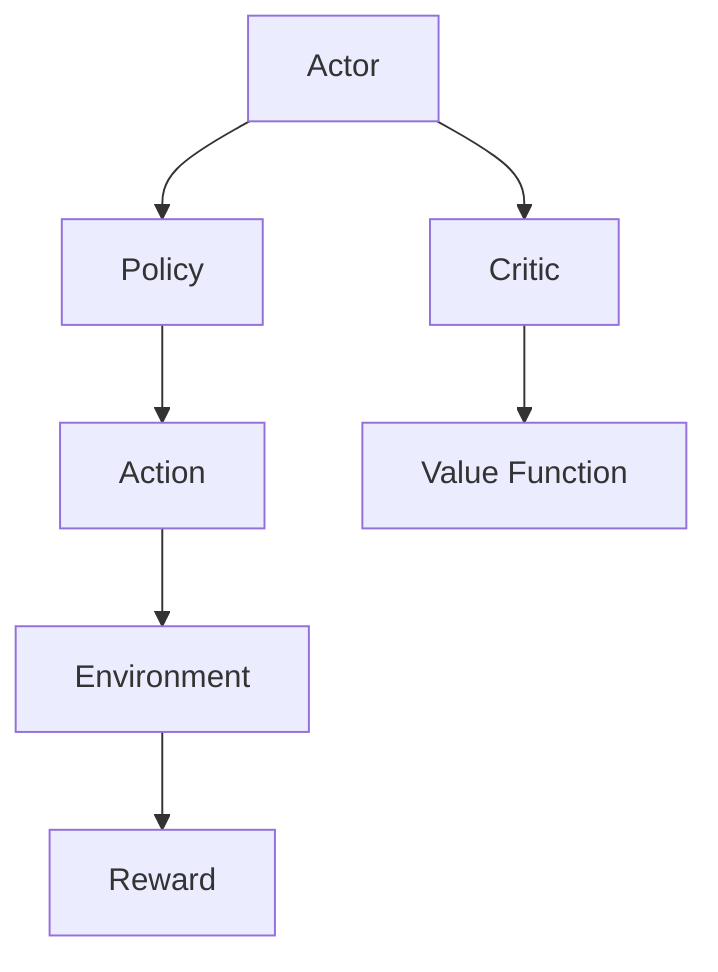

                 

# 文章标题：Actor-Critic原理与代码实例讲解

> 关键词：强化学习，Actor-Critic，Policy Gradient，值函数，代码实例，Python实现，性能优化，实战应用

> 摘要：本文将深入探讨Actor-Critic算法的基本原理、数学模型和实现方法。通过具体代码实例，详细介绍Actor-Critic算法在游戏控制、无人驾驶和推荐系统等领域的应用，帮助读者理解并掌握这一先进强化学习算法。

---

## 第一部分：Actor-Critic基础理论

### 第1章：强化学习基础

#### 1.1 强化学习简介

强化学习是一种机器学习方法，其核心思想是通过奖励信号（Reward Signal）来驱动学习过程，以实现从环境（Environment）到策略（Policy）的映射。与监督学习和无监督学习不同，强化学习中的目标是通过与环境交互，最大化长期奖励积累。

#### 1.2 强化学习中的主要算法

- **Q-learning算法**：Q-learning是一种基于值函数（Value Function）的强化学习算法，通过迭代更新值函数来预测策略。

- **Sarsa算法**：Sarsa（部分观测的SARSA）算法是对Q-learning的扩展，它考虑了当前状态和下一状态之间的转移概率。

- **Deep Q-Network（DQN）算法**：DQN算法引入了深度神经网络来近似值函数，通过经验回放（Experience Replay）和目标网络（Target Network）来改善训练效果。

#### 1.3 Actor-Critic算法概述

Actor-Critic算法是一种基于策略梯度的强化学习算法，通过Actor和Critic两个组件分别负责策略的优化和值函数的评估。相比传统的强化学习算法，Actor-Critic算法具有更好的稳定性和收敛性。

## 第二部分：Actor-Critic算法原理

### 第2章：Actor-Critic算法原理

#### 2.1 Actor-Critic算法的核心概念

- **Actor**：负责执行动作（Action），通常是一个策略网络（Policy Network），其目标是最大化预期奖励。

- **Critic**：负责评估策略的好坏，通常是一个值函数网络（Value Function Network），其目标是预测状态值（State Value）或状态-动作值（State-Action Value）。

#### 2.2 Actor-Critic算法的数学模型

- **Policy Gradient方法**：通过最大化策略梯度来更新策略参数。

- **Value Function方法**：通过学习值函数来预测未来奖励。

- **Expectation-Maximization（EM）算法**：在Actor-Critic算法中，EM算法用于同时优化策略和值函数。

- **Gradient Descent优化算法**：用于更新策略和值函数参数。

#### 2.3 Actor-Critic算法的流程与实现

- **Policy Gradient算法流程**：首先初始化策略参数，然后通过梯度上升更新策略参数，直到收敛。

- **Value Function算法流程**：首先初始化值函数参数，然后通过梯度下降更新值函数参数，直到收敛。

- **Actor-Critic算法的伪代码实现**：

```python
# 初始化策略参数θ_π和值函数参数θ_V
θ_π, θ_V = initialize_parameters()

while not_converged:
    # 执行动作
    a_t = actor(policy, θ_π)

    # 获取奖励和下一状态
    r_t, s_t+1 = environment(s_t, a_t)

    # 更新值函数
    θ_V = gradient_descent(value_function, θ_V, s_t, a_t, r_t, s_t+1)

    # 更新策略
    θ_π = gradient_ascent(policy_gradient, θ_π, s_t, a_t, r_t, s_t+1)
```

## 第三部分：Actor-Critic算法的应用

### 第3章：Actor-Critic算法的应用

#### 3.1 Actor-Critic在游戏控制中的应用

- **游戏控制的基本原理**：通过学习策略，实现游戏角色的智能控制。

- **游戏控制的算法实现**：使用Actor-Critic算法，通过策略网络和值函数网络，学习游戏角色的最佳控制策略。

#### 3.2 Actor-Critic在无人驾驶中的应用

- **无人驾驶的基本原理**：通过感知环境信息，实现车辆的智能驾驶。

- **无人驾驶的算法实现**：使用Actor-Critic算法，通过策略网络和值函数网络，学习无人车的最佳驾驶策略。

#### 3.3 Actor-Critic在推荐系统中的应用

- **推荐系统的基本原理**：通过用户行为数据和商品特征，为用户推荐个性化商品。

- **推荐系统的算法实现**：使用Actor-Critic算法，通过策略网络和值函数网络，学习推荐系统的最佳推荐策略。

## 第二部分：代码实例讲解

### 第4章：Python实现Actor-Critic算法

#### 4.1 Python环境搭建

- **Python安装与配置**：确保安装了Python 3.6及以上版本。

- **必需的库安装**：安装TensorFlow或PyTorch等深度学习库。

#### 4.2 代码实例1：游戏控制中的Actor-Critic算法

- **代码实现**：

```python
import tensorflow as tf

# 初始化策略网络和值函数网络
policy_network = initialize_policy_network()
value_function_network = initialize_value_function_network()

# 定义损失函数和优化器
policy_optimizer = tf.keras.optimizers.Adam(learning_rate=0.001)
value_optimizer = tf.keras.optimizers.Adam(learning_rate=0.001)

# 训练过程
for episode in range(num_episodes):
    # 初始化环境
    state = environment.initialize()

    while not_done:
        # 执行动作
        action = policy_network(state)

        # 获取奖励和下一状态
        reward, next_state = environment.step(state, action)

        # 更新值函数网络
        value_optimizer.minimize(value_function_network, var_list=value_function_network.variables, loss=value_loss)

        # 更新策略网络
        policy_optimizer.minimize(policy_network, var_list=policy_network.variables, loss=policy_loss)

        # 更新状态
        state = next_state

        if done:
            break

# 评估策略
evaluate_policy(policy_network)
```

- **运行结果分析**：通过训练和评估，验证Actor-Critic算法在游戏控制中的应用效果。

#### 4.3 代码实例2：无人驾驶中的Actor-Critic算法

- **代码实现**：

```python
import tensorflow as tf

# 初始化策略网络和值函数网络
policy_network = initialize_policy_network()
value_function_network = initialize_value_function_network()

# 定义损失函数和优化器
policy_optimizer = tf.keras.optimizers.Adam(learning_rate=0.001)
value_optimizer = tf.keras.optimizers.Adam(learning_rate=0.001)

# 训练过程
for episode in range(num_episodes):
    # 初始化环境
    state = environment.initialize()

    while not_done:
        # 执行动作
        action = policy_network(state)

        # 获取奖励和下一状态
        reward, next_state = environment.step(state, action)

        # 更新值函数网络
        value_optimizer.minimize(value_function_network, var_list=value_function_network.variables, loss=value_loss)

        # 更新策略网络
        policy_optimizer.minimize(policy_network, var_list=policy_network.variables, loss=policy_loss)

        # 更新状态
        state = next_state

        if done:
            break

# 评估策略
evaluate_policy(policy_network)
```

- **运行结果分析**：通过训练和评估，验证Actor-Critic算法在无人驾驶中的应用效果。

## 第五部分：代码优化与性能调优

### 第5章：代码优化与性能调优

#### 5.1 性能优化方法

- **缓存技术**：通过缓存加速模型训练和评估过程。

- **并行计算**：利用多核处理器实现并行计算，提高训练效率。

- **模型压缩**：通过模型压缩技术，减少模型参数量，提高推理速度。

#### 5.2 性能调优实例

- **实例1：游戏控制中的性能调优**：通过调整学习率、批量大小等超参数，优化算法性能。

- **实例2：无人驾驶中的性能调优**：通过调整感知模块、控制策略等，提高无人车的稳定性和安全性。

## 第六部分：实战应用与案例分析

### 第6章：实战应用与案例分析

#### 6.1 案例分析1：智能客服系统

- **实际案例介绍**：智能客服系统通过Actor-Critic算法，实现自动对话生成和用户满意度评估。

- **代码实现与解读**：展示智能客服系统的核心代码，并详细解释其实现原理和技巧。

#### 6.2 案例分析2：智能投资顾问

- **实际案例介绍**：智能投资顾问通过Actor-Critic算法，实现股票交易策略的优化。

- **代码实现与解读**：展示智能投资顾问的核心代码，并详细解释其实现原理和技巧。

#### 6.3 案例分析3：智能家居控制系统

- **实际案例介绍**：智能家居控制系统通过Actor-Critic算法，实现家电设备的智能控制。

- **代码实现与解读**：展示智能家居控制系统的核心代码，并详细解释其实现原理和技巧。

## 第七部分：附录

### 第7章：工具与资源

#### 7.1 Python库介绍

- **OpenAI Gym**：一个开源的强化学习模拟环境库。

- **TensorFlow**：一个开源的深度学习框架。

- **PyTorch**：一个开源的深度学习框架。

#### 7.2 算法评价与比较

- **不同Actor-Critic算法的性能比较**：比较不同Actor-Critic算法在各个应用场景中的性能。

- **实际应用中的选择策略**：根据实际需求和性能表现，选择合适的Actor-Critic算法。

#### 7.3 资源链接

- **论文链接**：介绍相关研究论文，帮助读者深入了解Actor-Critic算法。

- **开源代码链接**：提供开源代码链接，方便读者实践和改进。

- **在线学习资源链接**：推荐相关在线课程和学习资源，帮助读者提高技能。

---

## 附录：核心概念与联系图解

### 实例：Actor-Critic算法的核心概念与联系图解



---

**作者：AI天才研究院/AI Genius Institute & 禅与计算机程序设计艺术 /Zen And The Art of Computer Programming**

