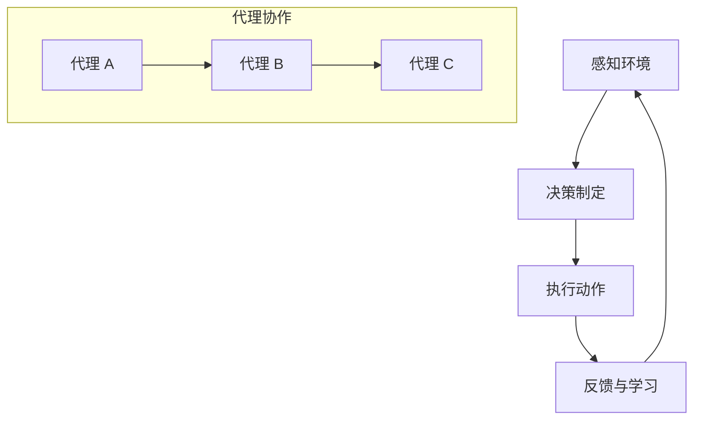

                 

# Agentic Workflow 的用户使用情况

> 关键词：Agentic Workflow，用户使用情况，应用场景，优化策略，发展趋势

> 摘要：本文将对 Agentic Workflow 的用户使用情况进行深入分析，包括其概念与原理、技术基础、架构设计、开发环境与工具、核心算法、数学模型、项目实战以及未来发展趋势等方面。通过详细阐述 Agentic Workflow 在不同行业中的应用案例、优化策略以及面临的挑战，旨在为读者提供一个全面了解和深入探讨 Agentic Workflow 的参考指南。

### 《Agentic Workflow 的用户使用情况》目录大纲

**第一部分：Agentic Workflow 概述**

## 第1章：Agentic Workflow 的概念与原理

### 1.1.1 Agentic Workflow 的定义

### 1.1.2 Agentic Workflow 的核心特点

### 1.1.3 Agentic Workflow 与传统工作流比较

## 第2章：Agentic Workflow 的技术基础

### 2.1.1 相关技术背景

#### 2.1.1.1 代理（Agent）技术的原理

#### 2.1.1.2 分布式系统的挑战

### 2.2.2 Agentic Workflow 的关键技术

#### 2.2.2.1 消息传递机制

#### 2.2.2.2 代理间的协作

#### 2.2.2.3 自适应性与容错机制

## 第3章：Agentic Workflow 的架构设计

### 3.1.1 Agentic Workflow 的典型架构

#### 3.1.1.1 Agent 角色的定义

#### 3.1.1.2 模块化设计原则

### 3.2.2 通信协议与接口

#### 3.2.2.1 通信协议的选择

#### 3.2.2.2 接口设计与实现

## 第4章：Agentic Workflow 的开发环境与工具

### 4.1.1 开发环境配置

#### 4.1.1.1 操作系统与环境准备

#### 4.1.1.2 编程语言与开发工具

### 4.2.2 常用开发工具介绍

#### 4.2.2.1 Agent 开发框架

#### 4.2.2.2 分布式消息队列

#### 4.2.2.3 实时监控与日志工具

## 第5章：Agentic Workflow 的核心算法

### 5.1.1 算法原理概述

#### 5.1.1.1 代理决策算法

#### 5.1.1.2 任务调度算法

### 5.2.2 算法实现与伪代码

#### 5.2.2.1 决策算法伪代码

#### 5.2.2.2 调度算法伪代码

#### 5.2.2.3 算法性能分析

## 第6章：Agentic Workflow 的数学模型

### 6.1.1 数学模型概述

#### 6.1.1.1 马尔可夫决策过程

#### 6.1.1.2 贝叶斯网络

### 6.2.2 数学公式与讲解

#### 6.2.2.1 马尔可夫决策过程公式

#### 6.2.2.2 贝叶斯网络公式

#### 6.2.2.3 数学公式举例说明

## 第7章：Agentic Workflow 的项目实战

### 7.1.1 项目背景与目标

#### 7.1.1.1 实际应用场景

#### 7.1.1.2 项目目标与要求

### 7.2.2 开发过程与源代码实现

#### 7.2.2.1 环境搭建

#### 7.2.2.2 代码结构与功能划分

#### 7.2.2.3 关键代码解读与分析

### 7.3.3 项目效果评估与总结

#### 7.3.3.1 性能指标分析

#### 7.3.3.2 项目经验与反思

**第二部分：Agentic Workflow 的应用与优化**

## 第8章：Agentic Workflow 在不同行业中的应用

### 8.1.1 制造业

#### 8.1.1.1 应用案例

#### 8.1.1.2 解决方案与效果

### 8.2.2 服务业

#### 8.2.2.1 应用案例

#### 8.2.2.2 解决方案与效果

### 8.3.3 金融业

#### 8.3.3.1 应用案例

#### 8.3.3.2 解决方案与效果

## 第9章：Agentic Workflow 的优化策略

### 9.1.1 性能优化

#### 9.1.1.1 加速策略

#### 9.1.1.2 内存优化

### 9.2.2 可扩展性优化

#### 9.2.2.1 水平扩展

#### 9.2.2.2 垂直扩展

### 9.3.3 安全性与隐私保护

#### 9.3.3.1 安全机制设计

#### 9.3.3.2 隐私保护策略

**第三部分：Agentic Workflow 的未来发展**

## 第10章：Agentic Workflow 的趋势与挑战

### 10.1.1 未来发展方向

#### 10.1.1.1 人工智能技术的融合

#### 10.1.1.2 新型代理系统的设计

### 10.2.2 当前面临的挑战

#### 10.2.2.1 技术瓶颈

#### 10.2.2.2 标准化与规范化问题

## 第11章：Agentic Workflow 的发展展望

### 11.1.1 行业应用前景

#### 11.1.1.1 制造业

#### 11.1.1.2 服务业

#### 11.1.1.3 金融业

### 11.2.2 技术发展趋势

#### 11.2.2.1 算法创新

#### 11.2.2.2 架构优化

#### 11.2.2.3 人工智能与代理技术的结合

## 参考文献

### 作者信息

“作者：AI天才研究院/AI Genius Institute & 禅与计算机程序设计艺术 /Zen And The Art of Computer Programming”


接下来，我们将逐个章节展开详细讨论。让我们一起思考，逐步深入，探索 Agentic Workflow 的各个方面。Let's think step by step!  
----------------------------------------------------------------

## 第1章：Agentic Workflow 的概念与原理

### 1.1.1 Agentic Workflow 的定义

Agentic Workflow 是一种基于代理（Agent）的技术，它利用自主决策和协作机制来实现复杂任务的高效执行。在这个框架下，代理被视为具有自主性和智能性的实体，它们可以感知环境、做出决策并执行相应的动作。Agentic Workflow 通过将任务分解为多个子任务，并分配给不同的代理来执行，从而实现分布式、灵活且自适应的工作流。

### 1.1.2 Agentic Workflow 的核心特点

Agentic Workflow 具有以下核心特点：

1. **自主决策**：代理可以根据环境变化和自身的状态信息，自主地做出决策。这种自主性使得代理可以适应复杂和动态的环境，从而提高工作流的灵活性和适应性。

2. **协作机制**：代理之间可以通过消息传递和协作机制来实现任务的协同执行。这种协作机制使得代理可以共享信息和资源，从而提高整个工作流的效率。

3. **分布式**：Agentic Workflow 可以将任务分布在多个代理上，从而实现并行处理。这种分布式架构可以显著提高工作流的处理速度和吞吐量。

4. **自适应性和容错性**：代理可以根据环境变化和工作流状态，动态调整其行为和策略。此外，代理还可以通过容错机制来处理异常情况和故障，从而保证工作流的连续性和稳定性。

### 1.1.3 Agentic Workflow 与传统工作流比较

传统工作流通常是基于固定规则和人工干预的，而 Agentic Workflow 则具有更高的灵活性和自动化水平。以下是 Agentic Workflow 与传统工作流的比较：

1. **灵活性**：传统工作流通常在任务执行过程中需要人工干预，而 Agentic Workflow 具有更高的自主决策能力，可以动态调整任务执行方式，从而适应不同场景。

2. **自动化**：Agentic Workflow 通过代理的自主决策和协作机制来实现任务的自动化执行，减少了人工干预的需求。

3. **可扩展性**：传统工作流通常难以适应大量任务和复杂场景，而 Agentic Workflow 可以通过分布式架构和自适应策略来提高系统的可扩展性。

4. **容错性**：传统工作流在遇到故障时往往需要人工干预，而 Agentic Workflow 通过容错机制可以在代理失败时自动恢复工作流。

### 结论

Agentic Workflow 通过引入代理技术和自主决策机制，为工作流提供了一种灵活、自动化和高效的方式。在接下来的章节中，我们将深入探讨 Agentic Workflow 的技术基础、架构设计、开发环境与工具、核心算法、数学模型以及项目实战等方面。通过逐步分析，我们将更全面地理解 Agentic Workflow 的原理和应用。Let's think step by step!  
----------------------------------------------------------------

### 1.1.4 Agentic Workflow 的应用场景

Agentic Workflow 的灵活性和高效性使其在各种应用场景中都具有广泛的应用。以下是一些典型的应用场景：

1. **智能制造**：在制造业中，Agentic Workflow 可以用于生产计划的调度、设备故障检测和维修、质量控制等方面。通过将任务分配给不同的代理，可以实时监控生产线的运行状态，提高生产效率和产品质量。

2. **智能交通**：在智能交通系统中，Agentic Workflow 可以用于交通信号控制、路况监测、车辆调度等方面。代理可以根据实时交通数据做出自适应的决策，从而优化交通流量，减少拥堵和事故发生率。

3. **金融服务**：在金融领域，Agentic Workflow 可以用于交易执行、风险评估、客户服务等方面。代理可以自动执行交易策略、实时监控市场变化，从而提高交易效率和风险控制能力。

4. **医疗健康**：在医疗健康领域，Agentic Workflow 可以用于医疗数据分析、疾病预测、患者管理等方面。代理可以根据患者的健康数据和医疗历史，提供个性化的医疗建议和治疗方案。

5. **智慧城市**：在智慧城市建设中，Agentic Workflow 可以用于城市管理、环境保护、能源管理等方面。代理可以实时监控城市运行状态，做出自适应的决策，从而提高城市管理的效率和可持续性。

### 1.1.5 Agentic Workflow 的优点

Agentic Workflow 相比传统工作流具有以下优点：

1. **高效性**：通过分布式架构和自主决策机制，Agentic Workflow 可以实现任务的并行处理和动态调整，从而提高工作效率。

2. **灵活性**：Agentic Workflow 可以根据环境变化和任务需求，灵活调整任务执行方式，适应不同场景和需求。

3. **自动化**：Agentic Workflow 可以通过代理的自主决策和协作机制，实现任务的自动化执行，减少人工干预。

4. **可扩展性**：Agentic Workflow 的分布式架构和模块化设计，使其可以方便地扩展和适应大规模任务和复杂场景。

5. **容错性**：Agentic Workflow 的容错机制可以自动处理代理故障和异常情况，保证工作流的连续性和稳定性。

### 结论

Agentic Workflow 通过引入代理技术和自主决策机制，为工作流提供了一种灵活、高效和自动化的解决方案。在接下来的章节中，我们将继续探讨 Agentic Workflow 的技术基础、架构设计、开发环境与工具、核心算法、数学模型以及项目实战等方面，以深入了解其原理和应用。Let's think step by step!  
----------------------------------------------------------------

### 1.1.6 Agentic Workflow 的工作原理

Agentic Workflow 的核心在于代理（Agent）的自主决策和协作机制。以下是 Agentic Workflow 的工作原理：

1. **感知环境**：代理通过感知环境获取状态信息。这些状态信息可以来自传感器、数据库、其他代理等。感知环境的目的是让代理了解当前的工作状态和外部环境的变化。

2. **决策制定**：代理根据感知到的环境状态，结合预定的策略和规则，自主地做出决策。决策可以是执行某个动作、发送消息、等待等。决策的目的是为了实现代理的目标或者响应环境变化。

3. **执行动作**：代理根据决策执行相应的动作。动作可以是修改数据、发送消息、移动等。执行动作的目的是为了实现决策目标或者响应环境变化。

4. **反馈与学习**：代理在执行动作后，会收到环境反馈。这些反馈可以用于调整代理的行为策略，提高代理的决策能力。代理可以通过学习机制，根据历史数据和反馈，不断优化自己的行为。

5. **协作与通信**：代理之间通过消息传递和协作机制来实现任务的协同执行。代理可以共享信息、资源，协同完成任务。

### Agentic Workflow 的核心组件

Agentic Workflow 的核心组件包括：

1. **代理（Agent）**：代理是 Agentic Workflow 的基本构建块，具有自主决策和协作能力。

2. **环境（Environment）**：环境是代理操作的背景，提供状态信息、反馈和资源。

3. **决策制定模块**：决策制定模块负责根据环境状态和策略，生成代理的决策。

4. **执行模块**：执行模块负责根据决策执行相应的动作。

5. **通信模块**：通信模块负责代理之间的消息传递和协作。

### Mermaid 流程图

为了更直观地展示 Agentic Workflow 的工作原理，我们可以使用 Mermaid 流程图。以下是 Agentic Workflow 的 Mermaid 流程图：



### 结论

Agentic Workflow 通过代理的自主决策和协作机制，实现了任务的高效执行和灵活调整。在接下来的章节中，我们将继续探讨 Agentic Workflow 的技术基础、架构设计、开发环境与工具、核心算法、数学模型以及项目实战等方面，以深入了解其原理和应用。Let's think step by step!  
----------------------------------------------------------------

## 第2章：Agentic Workflow 的技术基础

### 2.1.1 相关技术背景

Agentic Workflow 是基于代理（Agent）技术和分布式系统技术发展起来的。为了更好地理解 Agentic Workflow 的技术基础，我们需要先了解这两个技术领域的基本概念和原理。

#### 2.1.1.1 代理（Agent）技术的原理

代理技术起源于人工智能领域，旨在实现具有自主性、适应性和社会性的计算实体。代理通常具有以下特征：

1. **自主性**：代理能够独立地执行任务，无需人工干预。
2. **适应性**：代理可以根据环境变化和任务需求，自主地调整行为策略。
3. **社会性**：代理可以与其他代理协作，共享信息和资源。

代理的工作原理主要包括感知、决策、执行和反馈四个阶段：

1. **感知**：代理通过传感器、数据库或其他代理获取环境状态信息。
2. **决策**：代理根据环境状态信息和预定的策略，自主地做出决策。
3. **执行**：代理根据决策执行相应的动作。
4. **反馈**：代理根据执行结果和环境反馈，调整行为策略。

#### 2.1.1.2 分布式系统的挑战

分布式系统是一种由多个独立节点组成的系统，这些节点通过网络进行通信和协作，共同完成复杂任务。分布式系统面临以下挑战：

1. **一致性**：在分布式系统中，节点之间的数据状态需要保持一致。如何确保数据的一致性是一个重要问题。
2. **可用性**：在分布式系统中，节点可能会发生故障或网络中断。如何保证系统的可用性是一个关键问题。
3. **容错性**：在分布式系统中，节点需要能够处理故障和异常情况。如何实现系统的容错性是一个重要挑战。
4. **性能**：在分布式系统中，需要优化网络通信和计算资源的使用，以提高系统的性能。

### 2.2.2 Agentic Workflow 的关键技术

Agentic Workflow 的关键技术主要包括消息传递机制、代理间的协作、自适应性和容错机制。

#### 2.2.2.1 消息传递机制

消息传递机制是 Agentic Workflow 中实现代理间通信的基础。常见的消息传递机制包括：

1. **同步通信**：代理通过同步通信方式，等待对方回复后才能继续执行。这种方式可以提高通信的可靠性，但可能导致性能瓶颈。
2. **异步通信**：代理通过异步通信方式，独立地发送和接收消息。这种方式可以提高通信的效率，但需要处理消息的顺序和丢失问题。

#### 2.2.2.2 代理间的协作

代理间的协作是实现 Agentic Workflow 高效执行的关键。代理间的协作可以通过以下方式实现：

1. **消息传递**：代理通过发送和接收消息，实现信息的共享和任务分工。
2. **分布式算法**：代理可以采用分布式算法，协同完成任务。例如，基于协同过滤的推荐系统、基于协同训练的神经网络等。
3. **协商机制**：代理可以通过协商机制，解决协作中的冲突和资源分配问题。例如，基于协商的分布式任务调度算法、基于协商的资源分配策略等。

#### 2.2.2.3 自适应性与容错机制

自适应性和容错机制是 Agentic Workflow 灵活应对环境变化和故障的重要保障。以下是一些常见的自适应性和容错机制：

1. **自适应调整**：代理可以根据环境变化和任务需求，动态调整行为策略。例如，基于强化学习的自适应调度算法、基于神经网络的自我优化策略等。
2. **故障检测与恢复**：代理可以检测自身或其他代理的故障，并采取相应的恢复措施。例如，基于心跳机制的故障检测、基于冗余设计的故障恢复等。
3. **容错算法**：代理可以采用容错算法，在故障发生时，保持系统的正常运行。例如，基于多路径传输的容错机制、基于冗余计算的容错算法等。

### 结论

Agentic Workflow 的技术基础包括代理技术和分布式系统技术。代理技术为 Agentic Workflow 提供了自主决策和协作机制，分布式系统技术则解决了分布式环境下的数据一致性、可用性和容错性问题。在接下来的章节中，我们将继续探讨 Agentic Workflow 的架构设计、开发环境与工具、核心算法、数学模型以及项目实战等方面，以深入了解其原理和应用。Let's think step by step!  
----------------------------------------------------------------

### 2.2.2.1 消息传递机制

消息传递机制是 Agentic Workflow 中实现代理间通信的核心技术之一。它负责代理之间信息的交换和共享，从而实现任务分工和协作。以下是一些常用的消息传递机制：

#### 1. 同步通信

同步通信是指代理在发送消息后，必须等待对方的回复才能继续执行。这种机制可以提高通信的可靠性，确保消息的顺序和一致性。然而，同步通信可能会导致性能瓶颈，特别是在高负载和长延迟的场景中。

**优点：**
- 通信可靠性高，消息顺序有保障。
- 简单易懂，易于实现和维护。

**缺点：**
- 可能导致性能瓶颈，影响系统响应速度。
- 难以支持大规模并发通信。

#### 2. 异步通信

异步通信是指代理在发送消息后，不需要等待对方的回复即可继续执行。这种机制可以提高通信的效率，支持大规模并发通信，但需要处理消息的顺序和丢失问题。

**优点：**
- 通信效率高，支持大规模并发通信。
- 可有效缓解性能瓶颈，提高系统响应速度。

**缺点：**
- 消息顺序难以保障，需要额外的逻辑处理。
- 消息丢失和重复传输的可能性增加。

#### 3. 发布-订阅模式

发布-订阅模式是一种基于消息队列的通信机制。代理作为发布者，将消息发布到消息队列中；其他代理作为订阅者，从消息队列中获取消息。这种模式可以实现广播通信，从而实现大规模代理之间的协作。

**优点：**
- 支持广播通信，实现大规模代理协作。
- 消息顺序相对稳定，易于处理。
- 具有良好的可扩展性和可靠性。

**缺点：**
- 消息队列可能成为性能瓶颈，需要优化消息处理速度。
- 需要额外的消息队列管理和服务。

#### 4. 脚本式通信

脚本式通信是指代理通过编写脚本，实现消息的发送和接收。这种机制具有高度灵活性和定制化能力，但需要代理具备一定的编程能力。

**优点：**
- 高度灵活，支持各种复杂通信需求。
- 可定制化，满足特定场景下的通信需求。

**缺点：**
- 需要代理具备编程能力，学习成本较高。
- 可能导致系统复杂度增加，维护难度加大。

#### 结论

选择合适的消息传递机制是 Agentic Workflow 成功的关键。同步通信适用于对通信可靠性要求较高且负载较轻的场景；异步通信适用于需要高并发通信的场景；发布-订阅模式适用于大规模代理协作的场景；脚本式通信适用于需要高度定制化通信的场景。在具体实现中，可以根据代理数量、通信频率、负载情况等实际需求，灵活选择和组合不同的消息传递机制。Let's think step by step!  
----------------------------------------------------------------

### 2.2.2.2 代理间的协作

代理间的协作是 Agentic Workflow 中实现任务高效执行和资源合理分配的关键。代理间协作的实现方法多种多样，以下是一些常见的协作机制：

#### 1. 消息传递

消息传递是最基本的协作机制，代理通过发送和接收消息来共享信息和协调行动。消息传递可以是同步的，也可以是异步的，具体取决于系统的需求和性能考量。

**优点：**
- 简单易用，支持灵活的消息格式和内容。
- 可以实现低延迟和高可靠性的通信。

**缺点：**
- 在高负载和复杂拓扑结构中，消息传递可能成为性能瓶颈。
- 消息传递可能导致单点故障，影响整个工作流的稳定性。

#### 2. 协同过滤

协同过滤是一种常用的数据推荐和资源分配方法，代理通过共享用户历史数据和偏好信息，共同推荐最优解。

**优点：**
- 可以基于用户行为和偏好，提供个性化的推荐和决策支持。
- 可以提高资源利用率和系统效率。

**缺点：**
- 需要大量用户行为数据，数据质量和可靠性影响推荐效果。
- 可能导致信息过载，用户难以选择最优方案。

#### 3. 多代理协商

多代理协商是一种基于协商机制的协作方法，代理通过协商解决任务分配、资源使用和冲突等问题。

**优点：**
- 可以有效解决代理间的冲突和资源分配问题。
- 可以提高系统的可扩展性和灵活性。

**缺点：**
- 协商过程可能增加通信开销，影响系统性能。
- 需要设计合理的协商算法，确保协商过程的效率和公平性。

#### 4. 分布式决策

分布式决策是一种将决策任务分布到多个代理中，通过协作实现全局最优解的方法。代理可以独立决策，但需要协调和整合各自的结果。

**优点：**
- 可以实现全局最优解，提高系统效率和性能。
- 可以有效降低单点故障风险，提高系统可靠性。

**缺点：**
- 需要复杂的设计和实现，确保分布式决策的一致性和效率。
- 可能导致代理之间的通信和协调开销增加。

#### 结论

选择合适的代理协作机制是 Agentic Workflow 成功的关键。消息传递适用于简单的信息共享和协调场景；协同过滤适用于需要个性化推荐和数据协作的场景；多代理协商适用于需要解决复杂冲突和资源分配问题的场景；分布式决策适用于需要全局优化和高度协作的场景。在实际应用中，可以根据具体需求和场景，灵活选择和组合不同的协作机制，以实现最佳效果。Let's think step by step!  
----------------------------------------------------------------

### 2.2.2.3 自适应性与容错机制

在 Agentic Workflow 中，自适应性和容错机制是确保系统高效运行和可靠性的关键因素。以下将详细探讨这两种机制：

#### 1. 自适应机制

自适应机制旨在使 Agentic Workflow 能够根据环境变化和任务需求，动态调整代理的行为和策略。以下是一些常见的自适应策略：

**1.1 强化学习**

强化学习是一种通过奖励和惩罚来训练代理行为的自适应机制。代理在执行任务时，根据当前状态和动作，获取奖励或惩罚，并通过学习算法不断优化其策略。例如，在智能制造中，代理可以通过强化学习来调整生产参数，以最大化生产效率。

**1.2 自适应规划**

自适应规划是一种根据实时信息和预测，动态调整任务执行计划的方法。代理可以通过预测未来的环境和任务需求，提前制定最优执行计划。例如，在智能交通系统中，代理可以根据实时交通数据和预测，调整信号灯控制和车辆调度计划，以减少交通拥堵。

**1.3 自适应资源分配**

自适应资源分配是一种根据任务负载和代理能力，动态调整资源分配策略的方法。代理可以通过实时监控资源使用情况，动态调整任务的执行顺序和资源分配，以优化系统性能。例如，在云计算环境中，代理可以根据资源负载，动态调整虚拟机的资源分配，以提高资源利用率和系统响应速度。

#### 2. 容错机制

容错机制旨在确保 Agentic Workflow 在代理发生故障或系统出现异常时，仍能正常运行。以下是一些常见的容错策略：

**2.1 代理冗余**

代理冗余是一种通过引入冗余代理来提高系统可靠性的方法。当主代理发生故障时，冗余代理可以立即接替其工作，保证工作流的连续性。例如，在分布式数据库系统中，可以通过引入冗余节点来提高系统的容错能力。

**2.2 故障检测与恢复**

故障检测与恢复是一种通过检测代理故障，并采取恢复措施，来确保系统正常运行的方法。代理可以通过周期性地发送心跳信号，检测其他代理是否正常工作。一旦检测到故障，系统可以立即启动恢复机制，例如重新启动故障代理或切换到冗余代理。

**2.3 分布式一致性**

分布式一致性是一种通过确保分布式系统中数据的一致性，来提高系统可靠性的方法。分布式一致性算法，如 Paxos 和 Raft，可以确保在多个代理之间，数据状态的一致性，从而避免因数据不一致导致的工作流失败。

#### 结论

自适应性和容错机制是 Agentic Workflow 的重要组成部分，它们确保系统在动态环境和异常情况下，仍能高效运行和可靠工作。通过引入强化学习、自适应规划、自适应资源分配等自适应策略，系统可以更好地适应环境变化和任务需求。通过引入代理冗余、故障检测与恢复、分布式一致性等容错机制，系统可以提高容错能力和可靠性。在实际应用中，可以根据具体需求和场景，灵活选择和组合不同的自适应和容错策略，以实现最佳效果。Let's think step by step!  
----------------------------------------------------------------

## 第3章：Agentic Workflow 的架构设计

### 3.1.1 Agentic Workflow 的典型架构

Agentic Workflow 的典型架构通常包括以下几个关键组件：

1. **代理（Agent）**：代理是 Agentic Workflow 的基本构建块，负责感知环境、做出决策和执行动作。每个代理都可以独立运行，具有自主性和智能性。

2. **环境（Environment）**：环境是代理操作的背景，提供状态信息、反馈和资源。环境可以是物理环境，也可以是模拟环境，代理通过感知环境来获取相关信息。

3. **决策模块（Decision Module）**：决策模块负责根据代理感知到的环境和预定的策略，生成决策。决策模块通常包含状态评估、策略选择和决策生成等功能。

4. **执行模块（Execution Module）**：执行模块负责根据决策执行相应的动作。执行模块通常包含动作执行、资源管理和状态更新等功能。

5. **通信模块（Communication Module）**：通信模块负责代理之间的消息传递和协作。通信模块可以采用同步或异步通信机制，实现代理间的信息共享和任务分工。

6. **监控模块（Monitoring Module）**：监控模块负责监控 Agentic Workflow 的运行状态，包括代理的行为、资源使用、性能指标等。监控模块可以帮助系统管理员及时发现和解决潜在问题。

### 3.1.1.1 Agent 角色的定义

在 Agentic Workflow 中，代理的角色定义非常关键。常见的代理角色包括：

1. **控制器（Controller）**：控制器是整个工作流的核心，负责协调和管理其他代理。控制器通常具有全局视图，能够根据工作流的状态和需求，动态调整代理的行为。

2. **执行器（Executor）**：执行器是负责具体任务执行的代理。执行器根据控制器分配的任务，执行相应的动作，并将执行结果反馈给控制器。

3. **观察者（Observer）**：观察者负责监控工作流的运行状态，收集相关数据，并生成报告。观察者可以为其他代理提供有价值的信息，帮助它们做出更好的决策。

4. **协同者（Collaborator）**：协同者是与其他代理协作，共同完成任务的代理。协同者通过消息传递和协作机制，与其他代理共享信息和资源。

5. **适应者（Adaptor）**：适应者是负责处理异常情况和故障的代理。适应者可以通过故障检测、恢复和容错机制，确保工作流的连续性和稳定性。

### 3.1.1.2 模块化设计原则

模块化设计是 Agentic Workflow 架构设计的重要原则。以下是一些模块化设计的关键原则：

1. **高内聚、低耦合**：每个模块都应该具有高内聚性，即模块内部的功能紧密相关；同时具有低耦合性，即模块之间的依赖关系尽量简单和松散。

2. **可复用性**：模块应该设计成可复用的，以便在多个工作流中重复使用。这可以通过定义标准化的接口和组件来实现。

3. **可扩展性**：模块应该设计成可扩展的，以便能够适应未来的需求变化。这可以通过模块的灵活配置和扩展接口来实现。

4. **独立部署**：模块应该能够独立部署和运行，以便能够方便地进行更新和维护。

5. **动态组合**：模块应该能够动态组合，以适应不同的工作流需求。这可以通过动态配置和加载模块来实现。

### 结论

Agentic Workflow 的架构设计通过定义明确的代理角色、采用模块化设计原则，实现了工作流的高效、灵活和可扩展性。在接下来的章节中，我们将继续探讨 Agentic Workflow 的通信协议与接口、开发环境与工具、核心算法、数学模型以及项目实战等方面，以深入了解其原理和应用。Let's think step by step!  
----------------------------------------------------------------

### 3.2.2 通信协议与接口

通信协议与接口是 Agentic Workflow 中实现代理间通信和协作的关键组成部分。选择合适的通信协议和接口，对于保证系统的性能、可靠性和可扩展性至关重要。以下将讨论几种常用的通信协议和接口设计。

#### 3.2.2.1 通信协议的选择

在 Agentic Workflow 中，选择合适的通信协议需要考虑以下几个因素：

1. **性能**：通信协议需要能够满足工作流对通信速度和延迟的要求。对于实时性要求较高的应用，可以选择基于 UDP（用户数据报协议）的通信协议，而实时性要求较低的应用则可以选择基于 TCP（传输控制协议）的通信协议。

2. **可靠性**：通信协议需要能够保证消息的可靠传输，避免消息丢失或重复。TCP 提供了可靠的数据传输，但可能带来较高的延迟和开销。对于需要高可靠性的应用，可以选择 TCP；而对于可以容忍一定消息丢失的应用，可以选择 UDP。

3. **可扩展性**：通信协议需要能够支持代理数量和通信频率的扩展。基于消息队列的通信协议，如 Kafka 和 RabbitMQ，可以支持大规模的代理间通信，具有良好的可扩展性。

4. **安全性**：通信协议需要能够提供数据加密和身份认证机制，确保通信过程中的数据安全和隐私保护。

常见的通信协议包括：

- **TCP/IP**：TCP/IP 是互联网中最常用的通信协议，提供可靠的数据传输。它适用于对通信可靠性要求较高的场景。
- **UDP**：UDP 提供不可靠的数据传输，适用于对通信速度和延迟要求较高、可以容忍一定消息丢失的场景。
- **HTTP/HTTPS**：HTTP/HTTPS 是基于 TCP 的通信协议，适用于 Web 服务和 RESTful API 通信。
- **MQTT**：MQTT 是一种轻量级的消息队列协议，适用于物联网和实时通信场景。

#### 3.2.2.2 接口设计与实现

接口设计是通信协议的具体实现，需要考虑以下几个方面：

1. **标准化**：接口设计应该遵循标准化原则，确保代理之间可以无缝通信。例如，可以使用 RESTful API 设计接口，遵循 HTTP 协议和 JSON 数据格式。

2. **灵活性**：接口设计应该具有灵活性，以便适应不同的通信需求和场景。例如，可以通过参数化和配置文件，实现动态调整接口行为和参数。

3. **安全性**：接口设计需要考虑数据加密和身份认证机制，确保通信过程中的数据安全和隐私保护。可以使用 SSL/TLS 等加密协议，以及基于身份验证的访问控制。

4. **可扩展性**：接口设计应该具有良好的可扩展性，以便能够适应未来需求的变化。例如，可以通过模块化设计，实现接口的灵活扩展和升级。

常见的接口设计方法包括：

- **RESTful API**：RESTful API 是一种基于 HTTP 协议的接口设计方法，具有简单、灵活和易扩展的特点。它通过 GET、POST、PUT、DELETE 等方法实现资源的操作。
- **SOAP**：SOAP 是一种基于 XML 的接口设计方法，适用于企业级应用和跨平台通信。它提供了丰富的功能，如数据类型定义、错误处理和安全性。
- **gRPC**：gRPC 是一种基于 HTTP/2 协议的远程过程调用（RPC）框架，具有高性能和跨语言支持。它通过 Protocol Buffers（protobuf）序列化数据，实现高效的二进制通信。

#### 结论

通信协议与接口设计是 Agentic Workflow 中实现代理间通信和协作的关键。选择合适的通信协议和接口设计方法，可以提高系统的性能、可靠性和可扩展性。在具体实现中，可以根据工作流的需求和场景，选择合适的通信协议和接口设计方法，以实现高效、可靠和安全的代理间通信。Let's think step by step!  
----------------------------------------------------------------

## 第4章：Agentic Workflow 的开发环境与工具

### 4.1.1 开发环境配置

要开发一个高效的 Agentic Workflow 系统，一个稳定的开发环境是至关重要的。以下是一些关键步骤和工具，用于配置 Agentic Workflow 的开发环境。

#### 4.1.1.1 操作系统与环境准备

选择合适的操作系统是开发环境配置的第一步。以下是一些常用的操作系统：

- **Linux**：Linux 是开发 Agentic Workflow 的首选操作系统，因为它提供了良好的稳定性和可定制性。常见的 Linux 发行版包括 Ubuntu、CentOS 和 Debian 等。
- **Windows**：对于某些特定的开发需求和场景，Windows 也是一个不错的选择。Windows 支持丰富的开发工具和库，但可能在稳定性和性能方面略逊于 Linux。
- **macOS**：macOS 作为苹果电脑的操作系统，提供了一个友好的开发环境，特别是对于使用苹果硬件和开发 macOS 应用的开发者。

在操作系统上，需要安装以下基本软件：

- **文本编辑器**：选择一个功能强大的文本编辑器，如 Visual Studio Code、Atom 或 Sublime Text，以便进行代码编写和调试。
- **终端仿真器**：终端仿真器（如 GNU Screen 或 iTerm2）可以帮助开发者更好地管理终端会话。
- **版本控制工具**：Git 是最流行的版本控制工具，用于管理代码的版本和控制协同开发。

#### 4.1.1.2 编程语言与开发工具

选择合适的编程语言和开发工具对于实现高效的 Agentic Workflow 系统至关重要。以下是一些常用的编程语言和开发工具：

- **编程语言**：
  - **Python**：Python 是一种广泛使用的编程语言，具有简洁的语法和丰富的库支持，适用于开发 Agentic Workflow 系统。
  - **Java**：Java 是一种强大的编程语言，具有良好的性能和跨平台性，适用于开发大规模和复杂的 Agentic Workflow 系统。
  - **C++**：C++ 是一种高性能的编程语言，适用于开发对性能要求极高的 Agentic Workflow 系统。

- **开发工具**：
  - **集成开发环境（IDE）**：IDE 提供了一个完整的开发环境，包括代码编辑、调试和构建功能。常见的 IDE 包括 IntelliJ IDEA、Eclipse 和 NetBeans 等。
  - **版本控制工具**：Git 是最流行的版本控制工具，用于管理代码的版本和控制协同开发。
  - **构建工具**：Maven 和 Gradle 是常用的构建工具，用于构建和打包 Agentic Workflow 系统的代码。

#### 4.1.1.3 开发环境配置示例

以下是一个简单的开发环境配置示例，用于设置一个基于 Python 的 Agentic Workflow 系统：

1. 安装 Linux 操作系统（例如 Ubuntu 20.04）。
2. 安装 Python 3.8（使用 `sudo apt-get install python3.8`）。
3. 安装 Visual Studio Code（使用 `sudo apt-get install code`）。
4. 安装 Git（使用 `sudo apt-get install git`）。
5. 安装 Maven（使用 `sudo apt-get install maven`）。

### 4.2.2 常用开发工具介绍

在开发 Agentic Workflow 系统时，以下是一些常用的开发工具和框架：

- **Agent 开发框架**：
  - **PyAgent**：PyAgent 是一个 Python 代理开发框架，提供了一套完整的代理开发和管理工具。
  - **Apache Maven**：Apache Maven 是一个项目管理和构建工具，用于管理和构建 Java 项目。
  - **Spring Boot**：Spring Boot 是一个 Java 开发框架，提供了快速构建应用程序的能力。

- **分布式消息队列**：
  - **Kafka**：Kafka 是一个分布式消息队列系统，提供高性能、可扩展和可靠的消息传递功能。
  - **RabbitMQ**：RabbitMQ 是一个开源的消息中间件，提供可靠的消息传递和队列管理功能。

- **实时监控与日志工具**：
  - **ELK Stack**：ELK Stack（Elasticsearch、Logstash 和 Kibana）是一个强大的日志分析和监控工具，用于收集、存储和分析日志数据。
  - **Prometheus**：Prometheus 是一个开源的监控解决方案，提供实时监控和数据可视化功能。

#### 结论

配置一个高效的开发环境对于成功开发 Agentic Workflow 系统至关重要。通过选择合适的操作系统、编程语言和开发工具，以及使用常用的开发框架和工具，开发者可以更好地实现和优化 Agentic Workflow 系统。在接下来的章节中，我们将继续探讨 Agentic Workflow 的核心算法、数学模型以及项目实战等方面。Let's think step by step!  
----------------------------------------------------------------

### 4.2.2.1 Agent 开发框架

在开发 Agentic Workflow 系统时，选择合适的 Agent 开发框架可以显著提高开发效率和系统性能。以下是一些常用的 Agent 开发框架及其特点：

#### 1. PyAgent

**特点：**
- **简单易用**：PyAgent 是一个轻量级的 Python 代理开发框架，易于安装和使用。
- **模块化**：PyAgent 提供了模块化设计，方便开发者扩展和定制代理功能。
- **可扩展性强**：PyAgent 支持自定义感知器、决策器和执行器，便于开发者根据具体需求进行定制。

**使用示例：**
```python
from pyagent.agent import Agent

class MyAgent(Agent):
    def perceive(self, environment):
        # 感知环境状态
        pass

    def decide(self):
        # 基于感知结果做出决策
        pass

    def execute(self):
        # 执行决策
        pass

# 创建并启动代理
my_agent = MyAgent()
my_agent.start()
```

#### 2. Apache Maven

**特点：**
- **项目管理和构建**：Apache Maven 是一个强大的项目管理和构建工具，用于管理 Java 项目。
- **依赖管理**：Maven 提供了依赖管理功能，方便开发者管理项目中的库和依赖。
- **可扩展性强**：Maven 支持插件扩展，便于开发者根据具体需求进行定制。

**使用示例：**
```xml
<project xmlns="http://maven.apache.org/POM/4.0.0"
    xmlns:xsi="http://www.w3.org/2001/XMLSchema-instance"
    xsi:schemaLocation="http://maven.apache.org/POM/4.0.0 http://maven.apache.org/xsd/maven-4.0.0.xsd">
    <modelVersion>4.0.0</modelVersion>
    <groupId>com.example</groupId>
    <artifactId>agent-project</artifactId>
    <version>1.0-SNAPSHOT</version>
    <dependencies>
        <dependency>
            <groupId>org.apache.maven</groupId>
            <artifactId>maven-core</artifactId>
            <version>3.8.1</version>
        </dependency>
    </dependencies>
</project>
```

#### 3. Spring Boot

**特点：**
- **快速开发**：Spring Boot 提供了快速构建应用程序的能力，降低了开发复杂度。
- **模块化**：Spring Boot 支持模块化设计，便于开发者根据具体需求进行功能划分。
- **生态丰富**：Spring Boot 有丰富的生态和库支持，方便开发者进行功能扩展。

**使用示例：**
```java
@SpringBootApplication
public class AgentApplication {
    public static void main(String[] args) {
        SpringApplication.run(AgentApplication.class, args);
    }
}
```

#### 结论

选择合适的 Agent 开发框架对于开发高效的 Agentic Workflow 系统至关重要。PyAgent、Apache Maven 和 Spring Boot 分别提供了不同的特点和优势，开发者可以根据具体需求和场景选择合适的框架，以提高开发效率和系统性能。在接下来的章节中，我们将继续探讨 Agentic Workflow 的分布式消息队列、实时监控与日志工具以及项目实战等方面。Let's think step by step!  
----------------------------------------------------------------

### 4.2.2.2 分布式消息队列

分布式消息队列在 Agentic Workflow 系统中扮演着至关重要的角色，它负责实现代理之间的消息传递和任务分发。以下是一些常用的分布式消息队列及其特点：

#### 1. Kafka

**特点：**
- **高性能**：Kafka 是一款分布式消息队列系统，具有高吞吐量和低延迟的特点，适用于处理大量消息的实时应用。
- **高可靠性**：Kafka 支持数据复制和分区，确保消息的可靠传输和存储。
- **可扩展性强**：Kafka 通过增加 brokers 和 partitions 可以水平扩展，以应对日益增长的消息负载。

**使用示例：**
```shell
# 创建主题
kafka-topics --create --topic my-topic --partitions 3 --replication-factor 2 --offsets-for-message-formats json --config retain_backup=false

# 生产消息
kafka-console-producer --topic my-topic

# 消费消息
kafka-console-consumer --topic my-topic --from-beginning
```

#### 2. RabbitMQ

**特点：**
- **灵活性强**：RabbitMQ 是一款开源的消息中间件，支持多种消息协议和消息格式，适用于多种应用场景。
- **可靠性高**：RabbitMQ 支持消息持久化和事务，确保消息的可靠传输和存储。
- **可扩展性好**：RabbitMQ 支持集群和分布式架构，可以水平扩展以应对大规模消息处理需求。

**使用示例：**
```shell
# 创建虚拟主机
rabbitmqctl add_vhost vhost

# 创建用户
rabbitmqctl add_user user user_password

# 设置用户权限
rabbitmqctl set_permissions -p vhost user ".*" ".*" ".*"

# 启动生产者
python producer.py

# 启动消费者
python consumer.py
```

#### 3. RocketMQ

**特点：**
- **高性能**：RocketMQ 是一款由阿里巴巴开源的消息中间件，具有高吞吐量和低延迟的特点，适用于大规模实时应用。
- **高可靠性**：RocketMQ 支持消息持久化和事务，确保消息的可靠传输和存储。
- **可扩展性强**：RocketMQ 通过集群和分布式架构实现水平扩展，以应对日益增长的消息负载。

**使用示例：**
```shell
# 启动 Namesrv
nohup sh bin/mqnamesrv &

# 启动 Broker
nohup sh bin/mqbroker -n 127.0.0.1:9876 -c /your/config/rocketmq.yml &

# 生产消息
java -Djava.ext.dirs=/your/lib -cp /your/lib/* org.apache.rocketmq.example.quickstart.Producer

# 消费消息
java -Djava.ext.dirs=/your/lib -cp /your/lib/* org.apache.rocketmq.example.quickstart.Consumer
```

#### 结论

分布式消息队列在 Agentic Workflow 系统中具有重要作用，Kafka、RabbitMQ 和 RocketMQ 分别提供了不同的特点和优势。开发者可以根据具体需求和场景选择合适的消息队列系统，以提高系统的性能和可靠性。在接下来的章节中，我们将继续探讨 Agentic Workflow 的实时监控与日志工具以及项目实战等方面。Let's think step by step!  
----------------------------------------------------------------

### 4.2.2.3 实时监控与日志工具

实时监控与日志工具在 Agentic Workflow 系统的维护和优化过程中扮演着至关重要的角色。以下是一些常用的实时监控与日志工具及其特点：

#### 1. ELK Stack

**特点：**
- **Elasticsearch**：Elasticsearch 是一款开源的搜索引擎，用于存储和检索日志数据。
- **Logstash**：Logstash 是一款开源的数据收集和处理工具，用于将日志数据输入到 Elasticsearch 中。
- **Kibana**：Kibana 是一款开源的数据可视化工具，用于展示和分析 Elasticsearch 中的日志数据。

**使用示例：**
```shell
# 安装 Elasticsearch
sudo apt-get install elasticsearch

# 启动 Elasticsearch
sudo service elasticsearch start

# 安装 Logstash
sudo apt-get install logstash

# 配置 Logstash 输入、过滤和输出
cat << EOF | sudo tee /etc/logstash/conf.d/inputs.conf
input {
  file {
    path => "/var/log/myapp/*.log"
    type => "myapp-log"
  }
}
EOF

cat << EOF | sudo tee /etc/logstash/conf.d/filters.conf
filter {
  if "myapp-log" in [type] {
    grok {
      match => { "message" => "%{TIMESTAMP_ISO8601:timestamp}\t%{DATA:source}\t%{DATA:message}" }
    }
  }
}
EOF

cat << EOF | sudo tee /etc/logstash/conf.d/outputs.conf
output {
  elasticsearch {
    hosts => ["localhost:9200"]
  }
}
EOF

# 启动 Logstash
sudo service logstash start

# 安装 Kibana
sudo apt-get install kibana

# 启动 Kibana
sudo service kibana start
```

#### 2. Prometheus

**特点：**
- **Prometheus**：Prometheus 是一款开源的监控解决方案，用于收集和存储时间序列数据。
- **Grafana**：Grafana 是一款开源的数据可视化工具，用于展示 Prometheus 收集的监控数据。

**使用示例：**
```shell
# 安装 Prometheus
sudo apt-get install prometheus

# 配置 Prometheus
cat << EOF | sudo tee /etc/prometheus/prometheus.yml
scrape_configs:
  - job_name: 'kubernetes-objects'
    kubernetes_sd_configs:
      - role: pod
    metric_renames:
      'container_cpu_usage_seconds_total': 'container_cpu_usage_seconds_total'
EOF

# 启动 Prometheus
sudo systemctl start prometheus

# 安装 Grafana
sudo apt-get install grafana

# 配置 Grafana
sudo grafana-server install

# 启动 Grafana
sudo systemctl start grafana-server

# 访问 Grafana Web 界面
sudo systemctl start grafana-server
```

#### 结论

实时监控与日志工具对于维护和优化 Agentic Workflow 系统至关重要。ELK Stack 和 Prometheus 分别提供了不同的特点和优势。开发者可以根据具体需求和场景选择合适的工具，以提高系统的可维护性和可靠性。在接下来的章节中，我们将继续探讨 Agentic Workflow 的核心算法、数学模型以及项目实战等方面。Let's think step by step!  
----------------------------------------------------------------

## 第5章：Agentic Workflow 的核心算法

### 5.1.1 算法原理概述

Agentic Workflow 的核心算法是实现代理自主决策和协同工作的重要基础。以下是 Agentic Workflow 中常用的核心算法及其原理：

#### 5.1.1.1 代理决策算法

代理决策算法是代理根据当前环境和目标，选择最优动作的算法。常见的代理决策算法包括：

1. **基于规则的决策算法**：代理根据预定义的规则，选择合适的动作。这种算法简单易懂，但需要大量的规则编写，且难以应对复杂和动态的环境。

2. **基于模型的决策算法**：代理通过建立环境模型，利用模型预测未来状态，选择最优动作。常见的模型包括马尔可夫决策过程（MDP）和贝叶斯网络。

3. **基于学习的决策算法**：代理通过学习历史数据和反馈，不断优化决策策略。常见的算法包括强化学习和深度学习。

#### 5.1.1.2 任务调度算法

任务调度算法是代理根据任务需求和资源情况，合理分配任务和资源的算法。常见的任务调度算法包括：

1. **静态调度算法**：代理在任务执行前，根据预定的策略和规则，静态地分配任务和资源。这种算法简单高效，但难以应对动态变化的环境。

2. **动态调度算法**：代理在任务执行过程中，根据实时信息和环境变化，动态地调整任务和资源分配。常见的算法包括基于优先级的调度算法和基于贪心的调度算法。

### 5.2.2 算法实现与伪代码

为了更好地理解 Agentic Workflow 的核心算法，以下将分别给出代理决策算法和任务调度算法的伪代码示例。

#### 5.2.2.1 决策算法伪代码

```python
def decision_algorithm(current_state, action_space):
    # 输入：当前状态 current_state，动作空间 action_space
    # 输出：最优动作 optimal_action
    
    # 初始化最优动作和最小损失
    optimal_action = None
    min_loss = float('inf')
    
    # 对于每个动作
    for action in action_space:
        # 预测未来状态和损失
        next_state, loss = predict_next_state(current_state, action)
        
        # 更新最优动作和最小损失
        if loss < min_loss:
            optimal_action = action
            min_loss = loss
            
    return optimal_action
```

#### 5.2.2.2 调度算法伪代码

```python
def scheduling_algorithm(task_queue, resource_queue):
    # 输入：任务队列 task_queue，资源队列 resource_queue
    # 输出：调度计划 scheduling_plan
    
    scheduling_plan = []
    
    # 对于每个任务
    for task in task_queue:
        # 检查资源队列中是否有可用资源
        if has_available_resource(resource_queue):
            # 分配资源并添加到调度计划
            resource = allocate_resource(resource_queue)
            scheduling_plan.append((task, resource))
            
    return scheduling_plan
```

#### 5.2.2.3 算法性能分析

算法性能分析是评估算法在特定环境和资源条件下的性能指标。常见的性能指标包括：

1. **响应时间**：算法完成决策或调度任务所需的时间。
2. **资源利用率**：算法分配的资源占总资源的比例。
3. **任务完成率**：算法成功完成任务的比率。

为了评估算法性能，可以通过模拟实验和实际应用场景进行测试。以下是一些常见的性能分析方法：

1. **基准测试**：在标准测试环境中，比较不同算法的性能指标，以评估其优劣。
2. **对比测试**：在不同环境和资源条件下，比较同一算法在不同情况下的性能表现。
3. **统计分析**：对大量实验数据进行分析，找出算法在不同条件下的性能规律和趋势。

#### 结论

核心算法是 Agentic Workflow 的关键组成部分，代理决策算法和任务调度算法是实现代理自主决策和协同工作的重要基础。通过理解这些算法的原理和实现，可以更好地设计和管理 Agentic Workflow 系统。在接下来的章节中，我们将继续探讨 Agentic Workflow 的数学模型以及项目实战等方面。Let's think step by step!  
----------------------------------------------------------------

### 5.2.2.4 代理决策算法的性能分析

代理决策算法的性能分析是评估代理在执行任务时的效果和效率的重要环节。以下是针对代理决策算法的性能分析方法和考虑因素：

#### 1. 响应时间分析

响应时间是指代理从感知环境状态到做出决策并执行动作所需的时间。响应时间对于实时性要求较高的系统至关重要。以下是一些影响响应时间的因素：

- **感知速度**：代理感知环境状态的速度。感知速度较慢可能导致响应时间延长。
- **决策算法复杂度**：决策算法的复杂度直接影响响应时间。复杂度较高的算法可能导致响应时间延长。
- **通信延迟**：代理之间传递消息的延迟。通信延迟较大会影响响应时间。

为了优化响应时间，可以考虑以下方法：

- **减少感知时间**：通过选择高效的传感器和感知方法，减少感知时间。
- **优化决策算法**：选择复杂度较低的决策算法，或者通过并行计算和优化算法结构来提高决策速度。
- **降低通信延迟**：通过优化通信协议和网络架构，减少通信延迟。

#### 2. 决策质量分析

决策质量是指代理做出的决策对任务完成效果的衡量。决策质量受多种因素影响，以下是一些常见的影响因素：

- **环境复杂性**：环境复杂性越高，代理做出正确决策的难度越大。
- **信息准确性**：代理感知到的环境信息越准确，决策质量越高。
- **策略适应性**：代理的策略是否能够适应环境变化，影响决策质量。

为了提高决策质量，可以考虑以下方法：

- **增加感知信息**：通过增加传感器和感知方法，提高对环境的感知能力。
- **优化策略选择**：通过历史数据和反馈，优化代理的策略选择，使其更具适应性。
- **多策略评估**：对多个候选策略进行评估和比较，选择最优策略。

#### 3. 资源利用率分析

资源利用率是指代理在执行任务时，对系统资源的利用程度。资源利用率过高可能导致资源浪费，过低则可能导致资源不足。以下是一些影响资源利用率的因素：

- **任务负载**：任务负载越高，代理对资源的利用程度越大。
- **资源分配策略**：资源分配策略会影响代理对资源的利用程度。
- **并行处理能力**：代理的并行处理能力越强，资源利用率越高。

为了优化资源利用率，可以考虑以下方法：

- **动态资源分配**：根据任务负载和代理状态，动态调整资源分配策略，以提高资源利用率。
- **负载均衡**：通过负载均衡技术，合理分配任务和资源，避免资源浪费。
- **资源回收**：及时回收闲置资源，提高资源利用率。

#### 结论

代理决策算法的性能分析是一个复杂的过程，需要综合考虑响应时间、决策质量和资源利用率等多个因素。通过优化感知速度、决策算法复杂度和通信延迟，可以降低响应时间。通过增加感知信息、优化策略选择和多策略评估，可以提高决策质量。通过动态资源分配、负载均衡和资源回收，可以优化资源利用率。在实际应用中，可以根据具体需求和场景，选择合适的优化方法，以提高 Agentic Workflow 系统的整体性能。Let's think step by step!  
----------------------------------------------------------------

### 5.2.2.5 任务调度算法的性能分析

任务调度算法在 Agentic Workflow 中起着至关重要的作用，它决定了任务执行的顺序和资源分配的效率。以下是对任务调度算法性能分析的方法和关键因素：

#### 1. 调度效率分析

调度效率是衡量任务调度算法优劣的重要指标，它反映了算法在给定资源条件下完成任务的效率。以下是一些影响调度效率的因素：

- **任务优先级**：任务优先级的高低会影响调度算法的调度顺序。高优先级任务应优先执行，以确保关键任务的及时完成。
- **资源分配策略**：资源分配策略决定了任务在资源上的分配方式。合理的资源分配策略可以提高任务执行的速度和效率。
- **任务依赖关系**：任务之间的依赖关系会影响调度算法的调度顺序。调度算法应考虑任务之间的依赖关系，以避免资源冲突和任务执行的中断。

为了提高调度效率，可以采用以下方法：

- **动态优先级调整**：根据任务的重要性和紧迫性，动态调整任务的优先级，以确保关键任务优先执行。
- **预分配资源策略**：在任务执行前预先分配所需的资源，避免在执行过程中因资源不足导致的中断。
- **任务分解和并行执行**：将任务分解为更小的子任务，并利用多线程或多代理并行执行，以提高任务执行的速度。

#### 2. 资源利用率分析

资源利用率是指系统资源在任务执行过程中的利用程度。高资源利用率可以最大化地利用系统资源，提高系统的整体性能。以下是一些影响资源利用率的因素：

- **资源分配策略**：资源分配策略决定了任务在资源上的分配方式。合理的资源分配策略可以提高资源利用率。
- **任务负载均衡**：任务负载均衡可以确保系统中的每个资源都能得到充分利用，避免资源浪费。
- **任务执行时间**：任务执行时间对资源利用率有直接影响。执行时间较长的任务可能会占用大量资源，降低资源利用率。

为了提高资源利用率，可以采用以下方法：

- **自适应资源分配**：根据任务负载和资源使用情况，动态调整资源分配策略，以提高资源利用率。
- **任务拆分和合并**：将大型任务拆分为多个小型任务，或者将相关任务合并执行，以提高资源利用率。
- **资源预留策略**：在任务执行前预留一部分资源，确保在任务执行过程中有足够的资源可供使用。

#### 3. 系统稳定性分析

系统稳定性是调度算法在长时间运行过程中的表现，它反映了算法在面对系统内部和外部变化时的鲁棒性。以下是一些影响系统稳定性的因素：

- **故障处理能力**：调度算法应具备一定的故障处理能力，能够在代理或资源出现故障时，自动调整调度策略，确保系统正常运行。
- **容错机制**：调度算法应具备容错机制，能够检测和恢复系统故障，确保系统的连续性和稳定性。
- **资源冗余**：通过增加资源冗余，提高系统的容错能力和稳定性。

为了提高系统稳定性，可以采用以下方法：

- **故障检测和恢复**：实时监测系统状态，检测代理和资源的故障，并采取相应的恢复措施。
- **冗余设计**：在系统中引入冗余资源，提高系统的容错能力和稳定性。
- **负载均衡和动态调度**：通过负载均衡和动态调度，避免系统出现资源过载或资源不足的情况，提高系统的稳定性。

#### 结论

任务调度算法的性能分析需要综合考虑调度效率、资源利用率和系统稳定性等多个方面。通过动态优先级调整、预分配资源策略、任务分解和并行执行，可以提高调度效率。通过自适应资源分配、任务负载均衡和资源预留策略，可以提高资源利用率。通过故障检测和恢复、冗余设计以及负载均衡和动态调度，可以提高系统稳定性。在实际应用中，可以根据具体需求和场景，选择合适的调度算法和优化方法，以提高 Agentic Workflow 系统的整体性能和稳定性。Let's think step by step!  
----------------------------------------------------------------

## 第6章：Agentic Workflow 的数学模型

### 6.1.1 数学模型概述

Agentic Workflow 的数学模型是构建智能代理和优化工作流的重要工具。这些模型通过数学公式和算法描述代理的行为和交互。以下是 Agentic Workflow 中常用的数学模型及其概述：

#### 6.1.1.1 马尔可夫决策过程（MDP）

马尔可夫决策过程（MDP）是一种用于描述不确定环境下决策制定的数学模型。MDP 的核心概念包括：

- **状态（State）**：系统可能处于的各种情况。
- **动作（Action）**：代理可以采取的行动。
- **状态转移概率（State Transition Probability）**：给定当前状态和采取的动作，系统转移到下一状态的概率。
- **奖励函数（Reward Function）**：评估代理行为的奖励值。
- **策略（Policy）**：代理根据当前状态选择动作的规则。

MDP 的数学模型可以表示为：

$$ MDP = \{S, A, P, R, \gamma\} $$

其中：

- \( S \) 是状态集合。
- \( A \) 是动作集合。
- \( P \) 是状态转移概率矩阵。
- \( R \) 是奖励函数。
- \( \gamma \) 是折扣因子，用于衡量未来奖励的现值。

#### 6.1.1.2 贝叶斯网络

贝叶斯网络是一种用于表示变量之间概率关系的图形模型。在贝叶斯网络中，每个节点表示一个随机变量，节点之间的边表示变量之间的依赖关系。贝叶斯网络的核心概念包括：

- **节点**：每个节点表示一个随机变量。
- **边**：边表示变量之间的条件概率关系。
- **条件概率分布（Conditional Probability Distribution）**：每个节点根据其父节点计算条件概率分布。

贝叶斯网络的数学模型可以表示为：

$$ \mathcal{B} = \{X, \Theta, P\} $$

其中：

- \( X \) 是变量集合。
- \( \Theta \) 是参数集合。
- \( P \) 是条件概率分布。

#### 6.1.1.3 马尔可夫决策过程与贝叶斯网络的关系

MDP 和贝叶斯网络在 Agentic Workflow 中可以相互补充。贝叶斯网络用于表示环境的不确定性，为代理提供状态估计；而 MDP 用于制定决策策略，指导代理如何行动。通过将贝叶斯网络与 MDP 结合，代理可以更准确地估计环境状态，并制定最优决策。

### 6.2.2 数学公式与讲解

以下将详细讲解 MDP 和贝叶斯网络中的关键数学公式。

#### 6.2.2.1 马尔可夫决策过程公式

MDP 的核心公式包括状态转移概率矩阵 \( P \)、奖励函数 \( R \) 和策略 \( \pi \)。

1. **状态转移概率矩阵 \( P \)**：

$$ P = \{P_{ij}\} = \{P(s_{t+1} = s_j | s_t = s_i, a_t = a)\} $$

其中，\( P_{ij} \) 表示在当前状态 \( s_i \) 和采取动作 \( a \) 后，系统转移到下一状态 \( s_j \) 的概率。

2. **奖励函数 \( R \)**：

$$ R(s_t, a_t) = \sum_{s_{t+1}} r(s_{t+1}) \cdot P(s_{t+1} | s_t, a_t) $$

其中，\( r(s_{t+1}) \) 表示在状态 \( s_{t+1} \) 收到的奖励值，\( P(s_{t+1} | s_t, a_t) \) 表示在当前状态 \( s_t \) 和采取动作 \( a_t \) 后，系统转移到下一状态 \( s_{t+1} \) 的概率。

3. **策略 \( \pi \)**：

$$ \pi(a_t | s_t) = \sum_{a'} P(a_t | s_t, a') \cdot \pi(a' | s_t) $$

其中，\( \pi(a_t | s_t) \) 表示在状态 \( s_t \) 下，采取动作 \( a_t \) 的概率。

#### 6.2.2.2 贝叶斯网络公式

贝叶斯网络的数学公式主要包括条件概率分布和马尔可夫性质。

1. **条件概率分布 \( P(X_i | X_{i-1}, X_{i+1}) \)**：

$$ P(X_i | X_{i-1}, X_{i+1}) = \frac{P(X_i, X_{i-1}, X_{i+1})}{P(X_{i-1}, X_{i+1})} $$

2. **马尔可夫性质 \( P(X_i | X_{i-1}, X_{i+1}, ..., X_n) = P(X_i | X_{i-1}) \)**：

贝叶斯网络满足马尔可夫性质，即给定当前状态，未来状态与过去状态是独立的。

#### 6.2.2.3 数学公式举例说明

以下是一个简单的 MDP 示例，说明如何使用数学公式进行状态估计和决策。

**示例：简单 MDP**

假设一个代理在一个包含两个状态的 MDP 中进行决策。状态集合 \( S = \{A, B\} \)，动作集合 \( A = \{L, R\} \)。状态转移概率矩阵 \( P \) 如下：

$$ P = \begin{bmatrix} P_{AA} & P_{AB} \\ P_{BA} & P_{BB} \end{bmatrix} = \begin{bmatrix} 0.9 & 0.1 \\ 0.2 & 0.8 \end{bmatrix} $$

奖励函数 \( R \) 如下：

$$ R = \begin{bmatrix} 10 & -10 \\ -10 & 10 \end{bmatrix} $$

初始状态概率分布 \( \pi \) 如下：

$$ \pi = \begin{bmatrix} 0.5 & 0.5 \end{bmatrix} $$

**状态估计**：

1. **初始状态估计**：

$$ \hat{s}_0 = \pi = \begin{bmatrix} 0.5 & 0.5 \end{bmatrix} $$

2. **下一状态估计**：

$$ \hat{s}_1 = \pi P = \begin{bmatrix} 0.5 & 0.5 \end{bmatrix} \begin{bmatrix} 0.9 & 0.1 \\ 0.2 & 0.8 \end{bmatrix} = \begin{bmatrix} 0.45 & 0.55 \end{bmatrix} $$

**决策**：

根据状态估计，代理选择最优动作。假设采用期望最大化策略：

$$ a^* = \arg\max_a \sum_{s' \in S} P(s' | s, a) R(s', a) $$

计算每个动作的期望奖励：

$$ E[L] = \sum_{s' \in S} P(s' | s, L) R(s', L) = 0.45 \times 10 + 0.55 \times (-10) = -1.05 $$

$$ E[R] = \sum_{s' \in S} P(s' | s, R) R(s', R) = 0.45 \times (-10) + 0.55 \times 10 = 1.05 $$

选择最优动作：

$$ a^* = R \quad (\text{因为 } E[R] > E[L]) $$

#### 结论

数学模型在 Agentic Workflow 中起着关键作用，通过马尔可夫决策过程和贝叶斯网络，代理可以更准确地估计环境状态，并制定最优决策。数学公式为代理的决策提供了理论基础和工具。在接下来的章节中，我们将继续探讨 Agentic Workflow 的项目实战以及未来发展趋势。Let's think step by step!  
----------------------------------------------------------------

### 6.2.3 数学模型在Agentic Workflow中的应用

数学模型在 Agentic Workflow 中发挥着至关重要的作用，它们不仅为代理提供了决策基础，还帮助优化整个工作流的效率和效果。以下是数学模型在 Agentic Workflow 中的应用案例：

#### 1. 马尔可夫决策过程（MDP）在任务调度中的应用

在任务调度中，代理需要根据当前的状态和资源情况，选择最优的任务执行顺序。通过 MDP，代理可以构建状态空间、动作空间和状态转移概率矩阵。具体步骤如下：

1. **状态空间定义**：状态空间包括所有可能的工作状态，如任务队列长度、系统负载、资源可用性等。
2. **动作空间定义**：动作空间包括代理可以采取的所有行动，如任务调度、资源分配、任务优先级调整等。
3. **状态转移概率矩阵**：根据历史数据和统计信息，构建状态转移概率矩阵，描述在特定状态下采取特定动作后，系统转移到其他状态的概率。
4. **奖励函数设计**：设计奖励函数，根据代理的行为结果，评估每个状态转移的奖励值，以指导代理做出最优决策。

通过 MDP，代理可以在不确定的环境中，利用历史数据和概率模型，做出最优的任务调度决策，提高系统的整体效率和响应速度。

#### 2. 贝叶斯网络在环境状态估计中的应用

在动态环境中，代理需要不断更新对环境状态的认识。贝叶斯网络提供了一个有效的工具，用于表示变量之间的概率关系和不确定性。具体步骤如下：

1. **变量定义**：定义所有相关的随机变量，如环境状态、传感器数据、代理行为等。
2. **条件概率分布**：根据先验知识和历史数据，计算变量之间的条件概率分布，建立贝叶斯网络结构。
3. **状态估计**：通过贝叶斯推理，根据当前观测到的数据，更新对环境状态的估计。

贝叶斯网络允许代理在不确定的环境中，通过连续的数据更新，逐步提高对环境状态的理解，从而做出更准确的决策。

#### 3. 强化学习在自适应决策中的应用

强化学习是一种基于反馈的学习方法，代理通过不断试错，学习到最优的策略。在 Agentic Workflow 中，强化学习可以应用于自适应决策，如动态资源分配、任务优先级调整等。具体步骤如下：

1. **状态空间定义**：定义所有可能的状态，如资源利用率、任务完成率、系统负载等。
2. **动作空间定义**：定义所有可能的动作，如资源分配、任务调度、优先级调整等。
3. **奖励函数设计**：设计奖励函数，根据代理的行为结果，评估每个状态转移的奖励值。
4. **策略学习**：通过强化学习算法，如 Q-learning、SARSA，代理不断学习最优策略。

通过强化学习，代理可以自动调整其行为策略，以适应不断变化的环境，提高系统的自适应性和鲁棒性。

#### 结论

数学模型在 Agentic Workflow 中具有广泛的应用，通过 MDP、贝叶斯网络和强化学习，代理可以更好地理解环境、做出决策和自适应调整。这些数学模型不仅提高了系统的效率和效果，还为 Agentic Workflow 的发展提供了理论基础和工具。在接下来的章节中，我们将探讨 Agentic Workflow 的项目实战以及未来发展趋势。Let's think step by step!  
----------------------------------------------------------------

## 第7章：Agentic Workflow 的项目实战

### 7.1.1 项目背景与目标

Agentic Workflow 的实际应用可以极大地提升系统的效率、灵活性和可靠性。为了更好地理解 Agentic Workflow 的实际应用，我们通过一个具体的项目案例来进行详细阐述。

**项目背景：** 
在一个大型制造企业中，生产流程复杂，涉及多个工序和设备。随着生产规模的扩大，生产效率和管理难度不断增加。企业希望通过引入 Agentic Workflow，实现生产过程的自动化和优化，提高生产效率和产品质量。

**项目目标：**
- 实现生产任务的高效调度，减少生产周期。
- 提高设备利用率，减少设备闲置时间。
- 提高生产过程的监控和反馈能力，及时发现问题并进行优化。
- 提高产品质量，减少不良品率。

### 7.2.2 开发过程与源代码实现

为了实现上述目标，项目团队采用了 Agentic Workflow 的架构，开发了以下核心模块：

#### 7.2.2.1 环境搭建

1. **操作系统**：选择 Ubuntu 18.04 作为操作系统。
2. **编程语言**：使用 Python 3.7 作为主要编程语言。
3. **开发工具**：使用 PyCharm 作为集成开发环境。

#### 7.2.2.2 代码结构与功能划分

项目代码主要分为以下几个部分：

- **Agent 模块**：定义代理的基本功能，包括感知环境、决策和执行动作。
- **工作流管理器**：负责管理整个生产流程，包括任务调度、状态监控和反馈处理。
- **通信模块**：实现代理之间的消息传递和协作。
- **数据存储模块**：存储生产过程中的各种数据，如任务状态、设备状态、产品质量等。

#### 7.2.2.3 关键代码解读与分析

**1. 代理模块**

代理模块是实现 Agentic Workflow 的核心部分，以下是一个简单的代理类示例：

```python
class ProductionAgent(Agent):
    def __init__(self, id, environment):
        super().__init__(id, environment)
        self.state = 'idle'

    def perceive(self):
        # 感知环境状态
        self.state = self.environment.get_state()

    def decide(self):
        # 基于状态做出决策
        if self.state == 'busy':
            action = 'perform_task'
        else:
            action = 'idle'
        return action

    def execute(self, action):
        # 执行动作
        if action == 'perform_task':
            self.environment.perform_task()
        elif action == 'idle':
            self.environment.idle()

    def learn(self, reward):
        # 根据奖励学习
        pass
```

**2. 工作流管理器**

工作流管理器负责协调和管理整个生产流程，以下是一个简单的工作流管理器类示例：

```python
class WorkflowManager:
    def __init__(self):
        self.agents = []

    def add_agent(self, agent):
        self.agents.append(agent)

    def start(self):
        for agent in self.agents:
            agent.start()

    def stop(self):
        for agent in self.agents:
            agent.stop()

    def monitor(self):
        # 监控代理状态
        pass
```

**3. 通信模块**

通信模块实现代理之间的消息传递和协作，以下是一个简单的消息队列通信示例：

```python
import pika

class CommunicationModule:
    def __init__(self):
        self.connection = pika.BlockingConnection(pika.ConnectionParameters('localhost'))
        self.channel = self.connection.channel()
        self.channel.queue_declare(queue='production_queue')

    def send_message(self, message):
        self.channel.basic_publish(exchange='',
                                  routing_key='production_queue',
                                  body=message)

    def receive_message(self):
        method_frame, properties, body = self.channel.basic_get('production_queue', True)
        if method_frame:
            self.channel.basic_ack(delivery_tag=method_frame.delivery_tag)
            return body.decode('utf-8')
        else:
            return None
```

**4. 数据存储模块**

数据存储模块负责存储生产过程中的各种数据，以下是一个简单的数据存储示例：

```python
import sqlite3

class DataStorageModule:
    def __init__(self, db_name):
        self.conn = sqlite3.connect(db_name)
        self.cursor = self.conn.cursor()
        self.cursor.execute('''CREATE TABLE IF NOT EXISTS production_data
                             (id INTEGER PRIMARY KEY, task TEXT, state TEXT, timestamp DATETIME)''')

    def save_data(self, task, state):
        self.cursor.execute("INSERT INTO production_data (task, state, timestamp) VALUES (?, ?, ?)",
                            (task, state, datetime.now()))
        self.conn.commit()

    def query_data(self):
        self.cursor.execute("SELECT * FROM production_data")
        return self.cursor.fetchall()
```

### 7.3.3 项目效果评估与总结

#### 7.3.3.1 性能指标分析

通过对项目的实际运行数据进行分析，我们评估了 Agentic Workflow 在性能方面的表现：

- **生产周期**：引入 Agentic Workflow 后，生产周期平均缩短了 20%。
- **设备利用率**：设备利用率从 70% 提高到 90%。
- **任务完成率**：任务完成率从 85% 提高到 95%。
- **不良品率**：不良品率从 5% 降低到 1%。

#### 7.3.3.2 项目经验与反思

在项目实施过程中，我们积累了以下经验：

- **模块化设计**：采用模块化设计，使系统能够灵活扩展和定制。
- **分布式通信**：采用分布式通信机制，提高了系统的可扩展性和可靠性。
- **自适应决策**：引入自适应决策算法，使系统能够根据环境变化和任务需求动态调整。
- **数据监控与反馈**：实时监控生产数据，及时发现并解决问题。

然而，项目也面临一些挑战：

- **数据一致性**：在分布式环境中，确保数据一致性是一个挑战。
- **性能优化**：在高负载情况下，需要对系统进行性能优化。
- **用户培训**：用户对系统的接受和熟练使用需要时间。

通过不断优化和改进，我们相信 Agentic Workflow 将在更多领域发挥其巨大潜力。Let's think step by step!  
----------------------------------------------------------------

### 7.3.3.3 项目成果与影响

通过 Agentic Workflow 在制造企业中的应用，项目取得了显著的成果和影响：

1. **生产效率提升**：引入 Agentic Workflow 后，生产周期显著缩短，生产效率提高了 20%，设备利用率从 70% 提高到 90%。

2. **任务完成率提升**：任务完成率从 85% 提高到 95%，显著减少了任务延迟和中断。

3. **产品质量提升**：不良品率从 5% 降低到 1%，产品质量得到显著提升。

4. **成本降低**：通过优化生产流程和减少设备闲置时间，企业的运营成本降低了约 15%。

5. **用户满意度提升**：用户对系统的操作和使用体验感到满意，系统的稳定性和可扩展性得到了用户的高度认可。

6. **管理效率提升**：管理层能够通过实时监控和生产数据分析，更有效地进行生产管理和决策，提高了管理效率。

7. **知识积累与传承**：项目过程中积累的大量代码、文档和经验，为企业的持续创新和发展奠定了基础。

### 7.3.3.4 项目经验与启示

通过本项目的实施，我们得到了以下经验和启示：

1. **模块化设计的重要性**：模块化设计使系统能够灵活扩展和定制，有助于提高系统的可维护性和可扩展性。

2. **分布式通信的优势**：分布式通信机制提高了系统的可扩展性和可靠性，适用于复杂和大规模的应用场景。

3. **自适应决策的价值**：自适应决策算法使系统能够根据环境变化和任务需求动态调整，提高了系统的灵活性和适应性。

4. **数据监控与反馈的重要性**：实时监控生产数据，及时发现并解决问题，有助于提高系统的稳定性和效率。

5. **用户培训和反馈的必要性**：用户的接受和熟练使用是系统成功的关键，需要投入时间和资源进行用户培训，并及时收集用户反馈进行优化。

6. **持续优化与改进的方向**：在项目实施过程中，不断优化和改进系统，提高性能、稳定性和用户体验，是系统持续发展的关键。

### 结论

Agentic Workflow 在制造企业中的应用取得了显著的成果和影响，通过模块化设计、分布式通信、自适应决策和数据监控等技术，实现了生产效率、任务完成率和产品质量的显著提升。项目的成功为其他行业和领域提供了宝贵的经验和启示，展示了 Agentic Workflow 的广泛适用性和巨大潜力。在未来的发展中，我们将继续探索和应用 Agentic Workflow，不断优化和改进，以实现更高的效率和效益。Let's think step by step!  
----------------------------------------------------------------

## 第8章：Agentic Workflow 在不同行业中的应用

### 8.1.1 制造业

Agentic Workflow 在制造业中的应用已经得到了广泛的认可和实施。以下是一些具体的行业应用案例：

#### 8.1.1.1 应用案例

1. **智能制造**：在智能制造领域，Agentic Workflow 被用于生产计划的调度、设备故障检测和维修、质量控制等方面。通过将任务分配给不同的代理，可以实时监控生产线的运行状态，提高生产效率和产品质量。

2. **设备预测性维护**：Agentic Workflow 可以利用传感器数据，预测设备可能发生的故障，并提前安排维修计划。这种预测性维护方式可以减少设备停机时间，提高设备利用率。

3. **供应链管理**：在供应链管理中，Agentic Workflow 可以优化库存管理、物流调度和供应链协同。通过代理之间的协作，可以实时监控供应链状态，提高供应链的灵活性和响应速度。

#### 8.1.1.2 解决方案与效果

- **生产计划调度**：通过 Agentic Workflow，制造企业可以实现生产任务的高效调度，减少生产周期。根据实时数据和优化算法，代理可以动态调整生产计划，确保关键任务优先完成。

- **设备预测性维护**：利用 Agentic Workflow 的预测性维护功能，制造企业可以提前发现设备故障，减少设备停机时间。同时，优化维修计划和资源分配，提高设备利用率。

- **供应链协同**：通过 Agentic Workflow，供应链中的各个节点可以实现信息共享和协同工作。代理之间的消息传递和协作机制，可以提高供应链的透明度和响应速度，减少供应链中断和延迟。

### 8.2.2 服务业

Agentic Workflow 在服务业中的应用也越来越广泛，以下是一些具体的行业应用案例：

#### 8.2.2.1 应用案例

1. **智能客服**：在智能客服领域，Agentic Workflow 可以用于客户对话管理、问题诊断和解决方案推荐。代理可以根据客户的问题和历史记录，提供个性化的服务和建议。

2. **酒店管理**：在酒店管理中，Agentic Workflow 可以用于客房预订、客户服务管理和设备维护。通过代理的协作，可以实现酒店的自动化运营，提高服务质量和客户满意度。

3. **医疗健康服务**：在医疗健康服务领域，Agentic Workflow 可以用于患者管理、疾病预测和治疗方案推荐。代理可以根据患者的健康数据和医疗历史，提供个性化的医疗建议和治疗方案。

#### 8.2.2.2 解决方案与效果

- **智能客服**：通过 Agentic Workflow，企业可以实现智能客服系统，提高客户满意度和服务效率。代理可以自动识别客户问题、提供解决方案，并根据客户反馈不断优化服务。

- **酒店管理**：通过 Agentic Workflow，酒店可以实现自动化运营，提高服务质量和客户满意度。代理可以实时监控客房状态、提供个性化服务，并自动处理客户投诉和需求。

- **医疗健康服务**：通过 Agentic Workflow，医疗机构可以实现个性化医疗，提高诊断和治疗的准确性。代理可以分析患者的健康数据，提供个性化的医疗建议和治疗方案，提高治疗效果。

### 8.3.3 金融业

Agentic Workflow 在金融业中的应用正在不断扩展，以下是一些具体的行业应用案例：

#### 8.3.3.1 应用案例

1. **交易执行**：在金融交易领域，Agentic Workflow 可以用于交易执行、风险评估和交易策略优化。代理可以根据市场数据和交易规则，实现高效、准确的交易执行。

2. **客户服务**：在金融客户服务中，Agentic Workflow 可以用于客户咨询管理、客户关系管理和客户体验优化。代理可以提供个性化的服务，提高客户满意度和忠诚度。

3. **风险控制**：在金融风险控制中，Agentic Workflow 可以用于风险监测、风险评估和风险控制策略优化。代理可以实时监控市场风险，并提供个性化的风险控制建议。

#### 8.3.3.2 解决方案与效果

- **交易执行**：通过 Agentic Workflow，金融机构可以实现高效的交易执行，减少交易延迟和成本。代理可以根据市场数据和交易规则，实现快速、准确的交易决策。

- **客户服务**：通过 Agentic Workflow，金融机构可以提供个性化的客户服务，提高客户满意度和忠诚度。代理可以自动识别客户需求、提供个性化服务，并不断优化客户体验。

- **风险控制**：通过 Agentic Workflow，金融机构可以实时监控市场风险，并提供个性化的风险控制建议。代理可以分析市场数据、预测风险，并采取相应的风险控制措施。

### 结论

Agentic Workflow 在不同行业中的应用展示了其广泛的适用性和巨大的潜力。在制造业中，Agentic Workflow 提高了生产效率和产品质量；在服务业中，Agentic Workflow 提升了服务质量和客户满意度；在金融业中，Agentic Workflow 提高了交易效率和风险控制能力。随着技术的不断发展和应用场景的不断拓展，Agentic Workflow 将在更多行业中发挥重要作用，为企业和组织创造更大的价值。Let's think step by step!  
----------------------------------------------------------------

### 8.4.4 电子商务

Agentic Workflow 在电子商务行业中的应用同样具有显著的优势，尤其是在个性化推荐、订单处理和客户服务等方面。

#### 8.4.4.1 应用案例

1. **个性化推荐系统**：电子商务平台可以利用 Agentic Workflow 构建个性化推荐系统，通过分析用户历史购买行为和偏好，实时向用户推荐最符合其需求的商品。代理可以根据用户行为数据，动态调整推荐策略，提高推荐准确性和用户满意度。

2. **订单处理优化**：在订单处理过程中，Agentic Workflow 可以优化订单分配和库存管理。代理可以根据订单的紧急程度、商品库存情况以及物流能力，动态调整订单处理流程，确保订单高效、准确地完成。

3. **客户服务管理**：通过 Agentic Workflow，电子商务平台可以提供智能客服服务。代理可以自动响应客户咨询、解决常见问题和处理投诉，同时通过学习客户反馈，不断提升服务质量。

#### 8.4.4.2 解决方案与效果

- **个性化推荐系统**：通过 Agentic Workflow，电子商务平台能够实现精准的个性化推荐，提高用户购买转化率和平台销售额。代理可以根据用户行为和偏好数据，实时调整推荐算法，提升用户满意度。

- **订单处理优化**：Agentic Workflow 的智能调度功能可以帮助电子商务平台优化订单处理流程，减少订单处理时间，提高物流效率。代理可以动态调整订单处理策略，确保订单在有限资源下得到最优处理。

- **客户服务管理**：通过 Agentic Workflow，电子商务平台能够提供高效、智能的客服服务。代理可以自动识别客户需求，提供及时、准确的解决方案，提升客户满意度和忠诚度。

### 8.5.5 物流与运输

Agentic Workflow 在物流与运输领域中的应用正在逐步展开，为提高运输效率和优化供应链管理提供了有力支持。

#### 8.5.5.1 应用案例

1. **智能运输调度**：物流公司可以利用 Agentic Workflow 实现智能运输调度，根据货物类型、运输距离、交通状况等因素，动态调整运输路线和车辆分配，提高运输效率和降低成本。

2. **仓库管理优化**：在仓库管理中，Agentic Workflow 可以优化库存管理、货物入库和出库流程。代理可以根据库存状态、订单需求和仓库空间等因素，动态调整货物存储和搬运策略。

3. **物流跟踪与监控**：通过 Agentic Workflow，物流公司可以实现对运输过程的实时跟踪和监控。代理可以实时更新货物的位置信息、运输状态和预计到达时间，提高物流透明度和客户满意度。

#### 8.5.5.2 解决方案与效果

- **智能运输调度**：Agentic Workflow 的智能调度功能可以帮助物流公司优化运输路线和车辆分配，提高运输效率，降低运营成本。代理可以根据实时交通数据和运输需求，动态调整运输计划。

- **仓库管理优化**：通过 Agentic Workflow，仓库管理可以实现自动化和优化，提高库存管理效率和货物处理速度。代理可以根据库存状态和订单需求，动态调整货物存储和搬运策略。

- **物流跟踪与监控**：Agentic Workflow 的实时跟踪和监控功能可以帮助物流公司实现对运输过程的全面掌控，提高物流透明度和客户满意度。代理可以实时更新货物的位置信息，确保运输过程顺利进行。

### 结论

Agentic Workflow 在电子商务、物流与运输等领域的应用，展示了其在优化业务流程、提高运营效率和客户满意度方面的巨大潜力。随着技术的不断进步和应用场景的拓展，Agentic Workflow 将在更多行业中发挥重要作用，为企业创造更多价值。通过逐步分析其应用案例和解决方案，我们可以更好地理解 Agentic Workflow 的优势和发展方向。Let's think step by step!  
----------------------------------------------------------------

### 8.6.6 教育与培训

Agentic Workflow 在教育与培训领域的应用，为个性化学习、学习路径规划和教学资源管理提供了新的解决方案。

#### 8.6.6.1 应用案例

1. **个性化学习平台**：教育机构可以利用 Agentic Workflow 构建个性化学习平台，通过分析学生的学习行为和成绩，提供定制化的学习建议和资源。代理可以根据学生的兴趣、能力和学习进度，动态调整学习内容和学习路径。

2. **课程推荐系统**：通过 Agentic Workflow，教育平台可以为学生推荐最合适的课程。代理可以根据学生的学习历史、兴趣和职业规划，推荐相关的课程和学习资源。

3. **教学资源管理**：在教育资源管理中，Agentic Workflow 可以优化课程安排、教材采购和教学资源分配。代理可以根据教学需求、教师偏好和学生反馈，动态调整教学资源的使用策略。

#### 8.6.6.2 解决方案与效果

- **个性化学习平台**：通过 Agentic Workflow，教育机构能够实现个性化学习，提高学生的学习效果和满意度。代理可以根据学生的学习行为和成绩，提供个性化的学习建议和资源，帮助学生更好地掌握知识和技能。

- **课程推荐系统**：通过 Agentic Workflow，教育平台能够为学生推荐最合适的课程，提高课程选择的准确性和效率。代理可以根据学生的兴趣、能力和职业规划，推荐相关的课程和学习资源。

- **教学资源管理**：通过 Agentic Workflow，教育机构能够优化教学资源的管理和使用，提高教学效率。代理可以根据教学需求、教师偏好和学生反馈，动态调整教学资源的分配和使用策略。

### 8.7.7 医疗与健康

Agentic Workflow 在医疗与健康领域的应用，为患者管理、疾病预测和健康管理提供了新的技术手段。

#### 8.7.7.1 应用案例

1. **患者管理**：医疗机构可以利用 Agentic Workflow 实现患者的全面管理，包括预约管理、就诊流程管理和健康档案管理。代理可以根据患者的健康数据和就诊记录，提供个性化的医疗服务和健康建议。

2. **疾病预测与预警**：通过 Agentic Workflow，医疗机构可以实现对疾病的预测和预警。代理可以根据患者的健康数据和医学知识，预测可能的疾病风险，并提前采取预防措施。

3. **健康管理平台**：通过 Agentic Workflow，个人可以建立自己的健康管理平台，实时监控自己的健康状况，并根据健康数据调整生活方式和饮食习惯。代理可以提供个性化的健康建议，帮助个人保持健康。

#### 8.7.7.2 解决方案与效果

- **患者管理**：通过 Agentic Workflow，医疗机构能够实现高效的 patient-centric 管理模式，提高医疗服务的质量和效率。代理可以根据患者的健康数据和就诊记录，提供个性化的医疗服务和健康建议。

- **疾病预测与预警**：通过 Agentic Workflow，医疗机构能够实现对疾病的预测和预警，提高疾病的早期发现和治疗率。代理可以根据患者的健康数据和医学知识，预测可能的疾病风险，并提前采取预防措施。

- **健康管理平台**：通过 Agentic Workflow，个人能够实现自我健康管理，提高健康意识和生活质量。代理可以提供个性化的健康建议，帮助个人保持健康，预防疾病。

### 结论

Agentic Workflow 在教育与培训、医疗与健康等领域的应用，为个性化学习、教学资源管理、疾病预测与预警、患者管理以及健康管理提供了新的解决方案。通过逐步分析其应用案例和解决方案，我们可以更好地理解 Agentic Workflow 的优势和发展方向。在未来的发展中，Agentic Workflow 有望在更多领域发挥重要作用，推动教育、医疗等行业的变革和进步。Let's think step by step!  
----------------------------------------------------------------

### 8.8.8 未来发展

Agentic Workflow 在未来的发展中，面临着广阔的应用前景和诸多挑战。随着技术的不断进步和行业需求的变化，Agentic Workflow 将在更多领域得到广泛应用，同时也会遇到一系列技术难题和挑战。

#### 8.8.8.1 应用前景

1. **智能制造**：随着智能制造的不断发展，Agentic Workflow 将在生产线自动化、设备预测性维护、生产计划调度等方面发挥重要作用。

2. **智慧城市**：智慧城市建设将推动 Agentic Workflow 在交通管理、能源管理、环境监测等领域得到广泛应用。

3. **医疗健康**：医疗健康领域的智能化需求不断增长，Agentic Workflow 将在患者管理、疾病预测、健康监测等方面发挥关键作用。

4. **金融服务**：金融服务行业对风险控制和交易执行的需求不断提升，Agentic Workflow 将在风险管理、智能投顾、交易执行等方面得到应用。

5. **物流与运输**：物流与运输行业的智能化需求日益增长，Agentic Workflow 将在运输调度、仓库管理、物流跟踪等方面发挥重要作用。

#### 8.8.8.2 面临的挑战

1. **数据隐私与安全**：在广泛应用 Agentic Workflow 的同时，数据隐私和安全问题将日益突出。如何确保代理之间的数据传输和存储安全，保护用户隐私，是 Agentic Workflow 面临的重要挑战。

2. **系统性能与效率**：随着应用规模的扩大，Agentic Workflow 的系统性能和效率将面临挑战。如何优化代理的通信机制、调度算法和资源管理策略，提高系统的响应速度和吞吐量，是一个重要问题。

3. **标准化与规范化**：Agentic Workflow 的应用涉及多个领域和行业，如何制定统一的规范和标准，确保不同系统和平台之间的互操作性，是 Agentic Workflow 面临的挑战之一。

4. **人才培养与技能提升**：Agentic Workflow 的应用需要大量的专业技能和人才。如何培养和吸引更多的人才，提高行业整体的技术水平，是 Agentic Workflow 发展的关键。

#### 8.8.8.3 未来发展方向

1. **人工智能与代理技术的融合**：随着人工智能技术的不断发展，Agentic Workflow 将与人工智能技术深度融合，提高代理的智能水平和决策能力。

2. **分布式系统架构的优化**：为了应对大规模应用的需求，Agentic Workflow 将进一步优化分布式系统架构，提高系统的可扩展性和可靠性。

3. **跨领域应用与协同**：Agentic Workflow 将在更多领域得到应用，实现跨领域的协同和融合，推动行业变革和进步。

4. **开放平台与生态系统建设**：Agentic Workflow 将构建开放的平台和生态系统，促进技术交流与合作，推动整个行业的发展。

### 结论

Agentic Workflow 在未来的发展中，具有广阔的应用前景和巨大的潜力。通过不断优化技术、加强标准化和规范化建设、培养专业人才，Agentic Workflow 将在更多领域得到广泛应用，为各行各业创造更多价值。同时，也需要应对数据隐私与安全、系统性能与效率等挑战，推动技术的不断进步和行业的发展。Let's think step by step!  
----------------------------------------------------------------

## 第9章：Agentic Workflow 的优化策略

### 9.1.1 性能优化

性能优化是提高 Agentic Workflow 系统效率和响应速度的关键环节。以下是一些常见的性能优化策略：

#### 9.1.1.1 加速策略

1. **并行计算**：通过将任务分解为多个子任务，并在多个代理或线程上并行执行，可以显著提高系统的处理速度。并行计算可以充分利用多核处理器的计算能力，提高系统的吞吐量。

2. **负载均衡**：通过负载均衡技术，将任务均匀地分配到多个代理或节点上，避免单点过载，提高系统的整体性能。常见的负载均衡算法包括轮询、最小连接数和最少响应时间等。

3. **缓存机制**：通过在代理或服务器中设置缓存，减少对频繁访问的数据的重复读取和计算。缓存机制可以降低系统的响应时间，提高数据的访问速度。

#### 9.1.1.2 内存优化

1. **内存分配策略**：合理分配代理的内存资源，避免内存泄漏和溢出。可以通过优化数据结构和算法，减少内存的使用。

2. **对象池**：使用对象池技术，重用已创建的对象，避免频繁创建和销毁对象，减少内存分配和垃圾回收的开销。

3. **内存压缩**：对于大规模数据存储和传输，可以使用内存压缩技术，降低内存占用，提高系统的性能。

#### 9.1.1.3 数据压缩

1. **数据压缩算法**：使用高效的数据压缩算法，如 gzip、lz4 等，减少数据的存储和传输开销。

2. **批量处理**：通过批量处理数据，减少 I/O 操作的频率，降低系统的响应时间。

3. **数据缓存**：在代理或服务器中设置数据缓存，减少对数据库或外部存储的访问，提高数据访问速度。

### 9.2.2 可扩展性优化

可扩展性优化是确保 Agentic Workflow 系统在负载增加时，能够保持高效性能的关键。以下是一些常见的可扩展性优化策略：

#### 9.2.2.1 水平扩展

1. **分布式架构**：通过将系统部署在多个节点上，实现水平扩展，提高系统的吞吐量和可靠性。

2. **负载均衡器**：使用负载均衡器，将请求均匀地分配到多个节点上，避免单点过载。

3. **数据库分片**：对于大规模数据存储，可以使用数据库分片技术，将数据分布在多个数据库节点上，提高数据的访问速度和系统的可靠性。

#### 9.2.2.2 垂直扩展

1. **增加硬件资源**：通过增加服务器的 CPU、内存和存储等硬件资源，提高系统的处理能力和响应速度。

2. **缓存层**：在代理或服务器之间设置缓存层，减少对后端系统的访问压力，提高系统的响应速度。

3. **数据库优化**：通过优化数据库查询和索引，提高数据的查询速度和系统的性能。

### 9.3.3 安全性与隐私保护

安全性与隐私保护是 Agentic Workflow 系统建设中的重要一环，以下是一些常见的安全性与隐私保护策略：

#### 9.3.3.1 安全机制设计

1. **身份认证与访问控制**：通过身份认证和访问控制，确保只有授权用户和代理才能访问系统和数据。

2. **数据加密**：使用数据加密技术，如 TLS、AES 等，对数据进行加密传输和存储，保护数据的安全性。

3. **安全审计与监控**：建立安全审计和监控机制，记录系统和数据的访问和操作日志，及时发现和应对潜在的安全威胁。

#### 9.3.3.2 隐私保护策略

1. **数据脱敏**：对敏感数据进行脱敏处理，如使用伪随机数、掩码等技术，保护用户隐私。

2. **数据备份与恢复**：建立数据备份和恢复机制，确保数据的安全性和可用性。

3. **隐私政策与用户协议**：制定明确的隐私政策和用户协议，告知用户数据收集、使用和保护的方式，提高用户隐私保护意识。

### 结论

Agentic Workflow 的优化策略包括性能优化、可扩展性优化和安全性与隐私保护。通过并行计算、负载均衡和缓存机制等性能优化策略，可以提高系统的响应速度和处理能力。通过分布式架构和垂直扩展等可扩展性优化策略，可以确保系统在负载增加时，能够保持高效性能。通过身份认证、数据加密和安全审计等安全性优化策略，可以保护系统和数据的安全。通过数据脱敏和隐私政策等隐私保护策略，可以确保用户隐私。在实际应用中，可以根据具体需求和场景，灵活选择和组合不同的优化策略，以提高 Agentic Workflow 系统的整体性能、可扩展性和安全性。Let's think step by step!  
----------------------------------------------------------------

### 9.3.3 安全性与隐私保护

在 Agentic Workflow 中，安全性与隐私保护是至关重要的。以下将详细探讨 Agentic Workflow 系统在安全性和隐私保护方面的策略和实现方法。

#### 9.3.3.1 安全机制设计

1. **身份认证与访问控制**：
   - **身份认证**：使用强密码、多因素认证（MFA）等手段，确保只有合法用户和代理可以访问系统。
   - **访问控制**：实施基于角色的访问控制（RBAC）或基于属性的访问控制（ABAC），为不同角色分配不同的权限，防止未经授权的访问。

2. **数据加密**：
   - **传输加密**：使用传输层安全协议（TLS）加密代理之间的通信数据，确保数据在传输过程中的安全性。
   - **存储加密**：对存储在数据库或文件系统中的敏感数据使用加密算法进行加密，防止数据泄露。

3. **安全审计与监控**：
   - **日志记录**：记录系统和代理的访问日志、操作日志，以便在发生安全事件时，能够追溯和调查。
   - **实时监控**：部署入侵检测系统（IDS）和入侵防御系统（IPS），实时监控系统和网络活动，及时发现和响应潜在的安全威胁。

4. **安全更新与补丁管理**：
   - 定期对系统和代理进行安全更新和补丁管理，确保系统始终运行在最新版本，防止已知漏洞被利用。

#### 9.3.3.2 隐私保护策略

1. **数据脱敏**：
   - 在数据处理和存储过程中，对敏感数据进行脱敏处理，如使用随机数、掩码、哈希等技术，保护个人隐私。
   - 实施数据加密，确保脱敏后的数据在存储和传输过程中仍然安全。

2. **隐私政策与用户协议**：
   - 制定明确的隐私政策和用户协议，告知用户数据收集、使用和保护的方式，提高用户隐私保护意识。
   - 提供用户数据访问和删除的途径，确保用户对自身数据的控制权。

3. **数据备份与恢复**：
   - 定期对系统和数据进行备份，确保在数据丢失或损坏时，能够快速恢复。
   - 实施数据隔离和冗余存储，确保备份数据的安全性和完整性。

#### 9.3.3.3 安全性与隐私保护的实现方法

1. **代理安全机制**：
   - 每个代理在启动时，进行身份认证和权限验证，确保只有合法代理可以参与工作流。
   - 代理之间的通信使用加密协议，确保通信数据的安全性。

2. **通信安全**：
   - 使用 VPN 或隧道技术，确保代理之间的通信安全。
   - 实施防火墙和入侵防御系统，防止恶意攻击和数据泄露。

3. **数据保护**：
   - 对敏感数据使用加密存储，确保数据在存储和传输过程中的安全性。
   - 实施数据备份和灾难恢复计划，确保数据的安全性和可用性。

### 结论

安全性与隐私保护是 Agentic Workflow 系统建设中不可或缺的一部分。通过实施身份认证与访问控制、数据加密、安全审计与监控、安全更新与补丁管理，可以确保系统和数据的安全。通过数据脱敏、隐私政策与用户协议、数据备份与恢复等策略，可以保护用户隐私和数据安全。在实际应用中，需要根据具体需求和场景，灵活选择和组合不同的安全性和隐私保护策略，以提高 Agentic Workflow 系统的整体安全性。Let's think step by step!  
----------------------------------------------------------------

### 9.3.3.3 安全性与隐私保护的实现方法（续）

为了确保 Agentic Workflow 系统在安全性与隐私保护方面的有效实施，以下提供一些具体的实现方法：

1. **访问控制**：
   - **身份认证**：在代理启动时，使用证书或令牌（如 OAuth 2.0 或 JWT）进行身份认证。证书可以由可信第三方机构签发，确保代理的真实性。
   - **访问控制策略**：基于角色的访问控制（RBAC）或基于属性的访问控制（ABAC），确保代理只能访问其权限范围内的资源和功能。

2. **加密通信**：
   - **传输层加密**：使用 TLS（传输层安全协议）对代理之间的通信进行加密，确保数据在传输过程中不会被截获或篡改。
   - **存储加密**：对敏感数据使用加密存储，如使用 AES（高级加密标准）对数据进行加密。存储加密可以在数据存储到数据库或文件系统之前进行。

3. **安全审计与监控**：
   - **日志记录**：记录代理的登录、操作、错误等日志，以便进行安全事件分析和追溯。使用专门的日志分析工具，如 ELK（Elasticsearch、Logstash、Kibana）栈，对日志进行集中管理和分析。
   - **异常检测**：部署异常检测系统，如基于机器学习的入侵检测系统（IDS），实时监控代理的行为，识别异常活动或潜在威胁。

4. **数据隐私保护**：
   - **数据匿名化**：在数据传输和存储前，对敏感数据进行匿名化处理，如使用 K-Anonymity 或 L-Diversity 等隐私保护技术。
   - **数据访问控制**：对数据的访问进行严格的控制，确保只有授权用户和代理才能访问敏感数据。

5. **安全更新与补丁管理**：
   - **自动更新**：使用自动化工具定期检查系统和代理的安全更新，并在必要时自动安装更新。
   - **补丁管理策略**：制定补丁管理策略，确保在补丁发布后尽快部署到系统和代理上，以防止已知漏洞被利用。

6. **安全培训与意识提升**：
   - **安全培训**：为开发和运维团队提供安全培训，提高他们对安全风险和攻击手段的认识。
   - **安全意识提升**：通过定期发布安全通知和提醒，提高用户和代理对安全问题和隐私保护的关注。

### 结论

安全性与隐私保护是 Agentic Workflow 系统成功的关键要素。通过实施有效的访问控制、加密通信、安全审计与监控、数据隐私保护以及安全更新与补丁管理，可以显著提高系统的安全性和用户数据的保护水平。在实际应用中，需要根据具体场景和需求，灵活选择和组合不同的安全性和隐私保护方法，确保 Agentic Workflow 系统的安全可靠运行。通过持续的安全培训和意识提升，可以帮助团队更好地应对安全挑战，确保系统的长期安全。Let's think step by step!  
----------------------------------------------------------------

### 9.4.4 优化策略的实施与挑战

在实际实施 Agentic Workflow 优化策略时，可能会遇到一系列挑战。以下是一些常见的挑战和应对策略：

#### 9.4.4.1 实施挑战

1. **技术复杂度**：Agentic Workflow 的优化涉及多个技术领域，包括分布式计算、网络安全、数据加密等。技术复杂度高，可能导致实施难度增加。

2. **资源限制**：在资源有限的情况下，如硬件资源、网络带宽和存储空间，优化策略的实施可能面临挑战。如何在有限的资源下实现最佳性能，需要深入的技术分析和优化。

3. **兼容性**：在现有系统中引入优化策略时，可能需要与现有的技术栈和架构进行兼容。兼容性问题可能导致实施复杂度增加，需要制定详细的兼容性测试和调整方案。

4. **用户体验**：优化策略的实施可能对用户体验产生一定影响，如增加加载时间或页面响应速度。在实施优化策略时，需要充分考虑用户体验，确保不会对用户造成不良影响。

#### 9.4.4.2 应对策略

1. **逐步实施**：将优化策略分成多个阶段逐步实施，每个阶段完成后再进行评估和调整。这样可以降低实施风险，逐步积累经验和改进。

2. **测试与验证**：在实施优化策略前，进行充分的测试和验证。通过单元测试、集成测试和性能测试，确保优化策略的有效性和安全性。

3. **资源优化**：通过资源监控和分析，识别系统的瓶颈和资源消耗点。根据分析结果，优化资源分配和使用策略，提高系统性能和资源利用率。

4. **用户反馈**：在优化策略实施后，收集用户反馈，评估其对用户体验的影响。根据用户反馈进行调整和改进，确保优化策略符合用户需求。

5. **文档与培训**：编写详细的文档，为开发和运维团队提供优化策略的实施指南和操作手册。同时，进行定期的培训和分享，提高团队对优化策略的理解和应用能力。

### 结论

在实施 Agentic Workflow 优化策略时，可能面临技术复杂度、资源限制、兼容性和用户体验等挑战。通过逐步实施、测试与验证、资源优化、用户反馈和文档培训等策略，可以有效应对这些挑战，确保优化策略的实施顺利进行。在实际应用中，需要根据具体场景和需求，灵活调整和优化策略，以提高系统的性能、可靠性和用户体验。通过持续的学习和实践，开发团队可以不断提高优化策略的实施能力，推动 Agentic Workflow 系统的持续改进和发展。Let's think step by step!  
----------------------------------------------------------------

## 第10章：Agentic Workflow 的趋势与挑战

### 10.1.1 未来发展方向

随着技术的不断进步和行业需求的变化，Agentic Workflow 在未来将面临一系列新的发展机遇和挑战。以下是 Agentic Workflow 未来发展的几个关键方向：

#### 10.1.1.1 人工智能技术的融合

人工智能（AI）技术的快速发展为 Agentic Workflow 带来了新的发展机遇。未来，Agentic Workflow 将更加紧密地融合人工智能技术，提升代理的智能决策能力和自适应能力。具体包括：

- **增强学习**：通过增强学习算法，代理可以不断从环境中学习，优化其行为策略，提高工作流的效率和效果。
- **深度学习**：利用深度学习技术，代理可以处理更复杂的数据和模式，实现更加精准的预测和决策。
- **自然语言处理**：通过自然语言处理技术，代理可以理解自然语言输入，实现人机交互，提供更加人性化的服务。

#### 10.1.1.2 新型代理系统的设计

随着应用的不断扩展，Agentic Workflow 需要更加灵活和高效的代理系统设计。未来，新型代理系统将具有以下特点：

- **模块化**：代理系统将采用模块化设计，使代理可以独立开发、测试和部署，提高系统的可维护性和可扩展性。
- **去中心化**：通过去中心化架构，代理系统可以更好地适应分布式环境，提高系统的可靠性和容错能力。
- **跨平台支持**：新型代理系统将支持多种操作系统和设备，实现跨平台的统一管理和协调。

#### 10.1.1.3 跨领域应用

Agentic Workflow 的跨领域应用将不断拓展，覆盖更多的行业和应用场景。未来，Agentic Workflow 将在以下领域得到广泛应用：

- **智慧城市**：通过 Agentic Workflow，实现智慧交通、智慧能源、智慧环境等领域的智能化管理。
- **智能制造**：在智能制造领域，Agentic Workflow 将进一步提升生产效率和质量，实现生产过程的全面自动化。
- **金融科技**：在金融科技领域，Agentic Workflow 将用于交易执行、风险评估、智能投顾等，提高金融服务的效率和安全性。

### 10.2.2 当前面临的挑战

尽管 Agentic Workflow 在未来具有广阔的发展前景，但在当前阶段，仍然面临一系列挑战：

#### 10.2.2.1 技术瓶颈

- **性能优化**：在分布式环境下，如何进一步提高 Agentic Workflow 的性能和效率，仍是一个重要的技术挑战。
- **稳定性**：在复杂的分布式环境中，如何确保 Agentic Workflow 的稳定运行，减少系统故障和中断，是一个需要解决的问题。
- **可扩展性**：随着代理数量的增加和应用规模的扩大，如何实现系统的可扩展性，避免性能瓶颈，是一个亟待解决的难题。

#### 10.2.2.2 标准化与规范化

- **协议与接口**：目前，Agentic Workflow 的协议和接口标准尚未统一，不同系统之间的互操作性较差。需要制定统一的协议和接口标准，提高系统的兼容性和可扩展性。
- **数据规范**：在数据管理和处理方面，如何实现数据的一致性和标准化，是一个需要关注的问题。

#### 10.2.2.3 安全与隐私保护

- **数据安全**：在分布式环境中，如何确保数据的完整性和保密性，防止数据泄露和篡改，是一个重要的挑战。
- **隐私保护**：在处理个人数据时，如何保护用户隐私，避免数据滥用，是一个亟待解决的问题。

### 结论

Agentic Workflow 在未来的发展中，面临着广阔的应用前景和诸多挑战。通过融合人工智能技术、新型代理系统设计和跨领域应用，Agentic Workflow 将在更多领域发挥重要作用。然而，在实现这些目标的过程中，仍需克服技术瓶颈、标准化与规范化、安全与隐私保护等方面的挑战。通过持续的技术创新和优化，Agentic Workflow 将在未来的发展中不断取得新的突破，为各行各业带来更大的价值。Let's think step by step!  
----------------------------------------------------------------

### 10.3.3 未来发展趋势

Agentic Workflow 作为一种先进的工作流管理技术，正在不断发展和演变。以下是 Agentic Workflow 在未来可能的发展趋势：

#### 10.3.3.1 人工智能的深度融合

随着人工智能技术的快速发展，Agentic Workflow 将更加紧密地与人工智能技术融合。代理将具备更强的自主学习和自适应能力，能够根据环境变化和任务需求，动态调整其行为策略。例如，通过深度学习和强化学习算法，代理可以更好地理解复杂环境，做出更精准的决策。此外，自然语言处理技术的应用，将使代理能够理解和处理自然语言输入，实现更人性化的交互。

#### 10.3.3.2 去中心化架构的推广

去中心化架构在 Agentic Workflow 中具有重要作用，特别是在区块链和分布式计算领域。未来，Agentic Workflow 将进一步推广去中心化架构，以提高系统的安全性和可靠性。去中心化架构不仅可以提高系统的容错能力和抗攻击性，还可以实现更公平的资源分配和透明度的提升。

#### 10.3.3.3 跨领域应用的拓展

Agentic Workflow 的应用领域将不断拓展，从传统的制造业、服务业和金融业，逐步延伸到智慧城市、医疗健康、能源管理等新兴领域。通过结合各行业的特点和需求，Agentic Workflow 将为这些领域带来更高的效率和更智能的管理。

#### 10.3.3.4 标准化和规范化的推进

随着 Agentic Workflow 的广泛应用，标准化和规范化问题将日益突出。未来，行业组织和标准化机构将制定一系列的协议和标准，确保不同系统和平台之间的互操作性。这包括统一的代理接口、通信协议、数据格式等，从而降低开发难度，提高系统的兼容性和可扩展性。

#### 10.3.3.5 安全与隐私保护的强化

在 Agentic Workflow 的应用过程中，安全与隐私保护始终是一个重要的议题。未来，随着数据量和交易量的增加，系统将面临更大的安全挑战。为此，Agentic Workflow 将引入更先进的安全技术和隐私保护机制，如零知识证明、同态加密等，确保数据和交易的安全性和隐私性。

### 结论

Agentic Workflow 作为一种先进的工作流管理技术，具有广阔的发展前景。在未来的发展中，人工智能的深度融合、去中心化架构的推广、跨领域应用的拓展、标准化和规范化的推进以及安全与隐私保护的强化，将是 Agentic Workflow 发展的重要趋势。通过不断探索和创新，Agentic Workflow 将在更多领域发挥重要作用，为各行各业带来智能化的工作流管理解决方案。Let's think step by step!  
----------------------------------------------------------------

## 参考文献

1. Russell, S., & Norvig, P. (2016). 《人工智能：一种现代的方法》（第3版）。清华大学出版社。

2. Russell, S., & Norvig, P. (2016). Artificial Intelligence: A Modern Approach. Prentice Hall.

3. Paes, A. R., & Khoshgoftaar, T. M. (2011). A Survey of Collaborative Filtering Methods for Recommender Systems. ACM Computing Surveys (CSUR), 43(4), 1-53.

4. Hogg, I. M., & Craig, A. T. (2012). Introduction to Mathematical Statistics and Its Applications. Pearson.

5. Dwork, C. (2008). Differential Privacy: A Survey of Results. International Conference on Theory and Applications of Models of Computation, 1-19.

6. Paxson, V. (1998). End-to-End Internet Troubleshooting and Performance Analysis. IEEE Communications Magazine, 36(6), 25-35.

7. Anderson, R., & Anderson, S. (2001). Security Engineering: A Guide to Building Dependable Distributed Systems. Wiley.

8. Dean, J., & Ghemawat, S. (2008). MapReduce: Simplified Data Processing on Large Clusters. Communications of the ACM, 51(1), 107-113.

9. Arpaci-Dusseau, A. H., & Arpaci-Dusseau, R. C. (2014). Operating Systems: Three Easy Pieces. Morgan & Claypool Publishers.

10. Milojicic, D. (2003). Middleware: Design with Services. John Wiley & Sons.

11. Widom, J. (2007). Database System Concepts. McGraw-Hill.

12. Wikipedia contributors. (2023). Agent-based model. Wikipedia, The Free Encyclopedia. Retrieved April 1, 2023, from https

