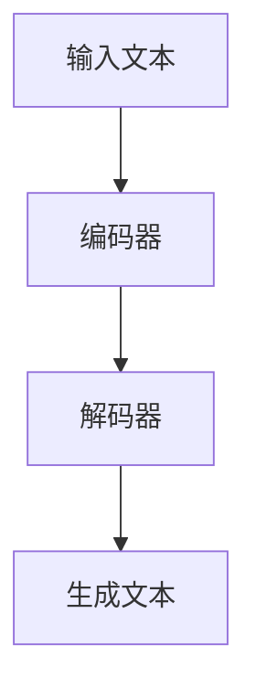
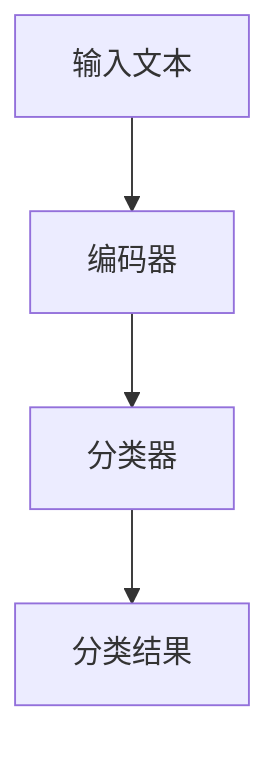
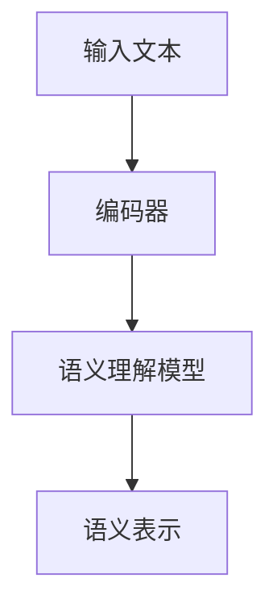
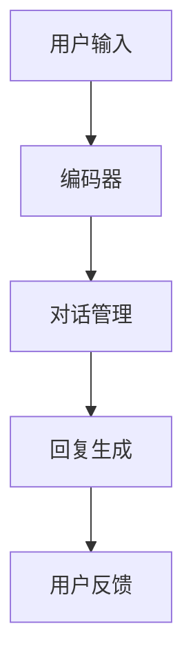
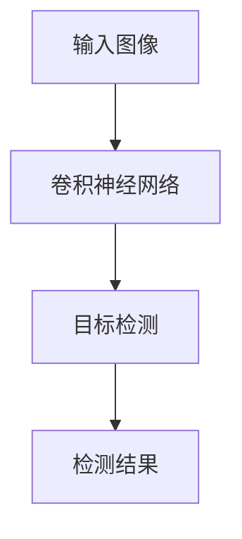
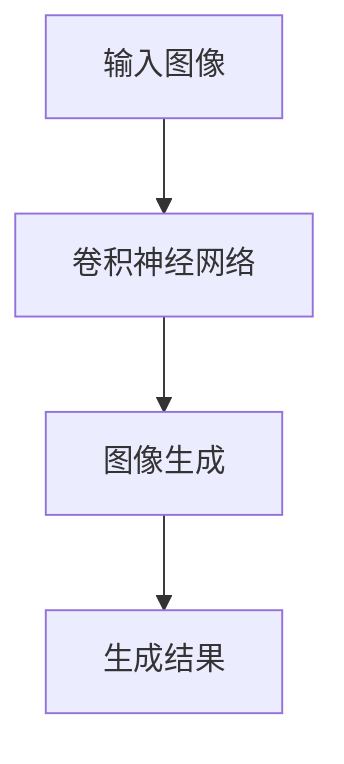
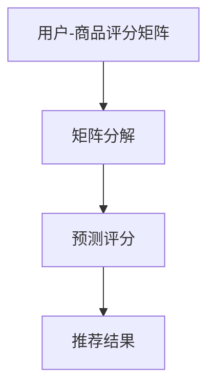
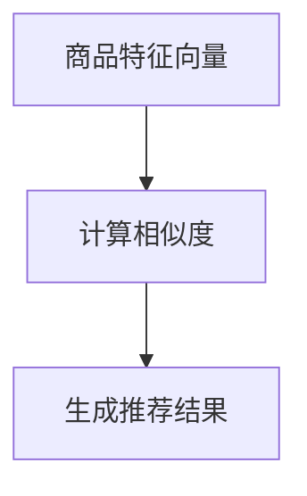
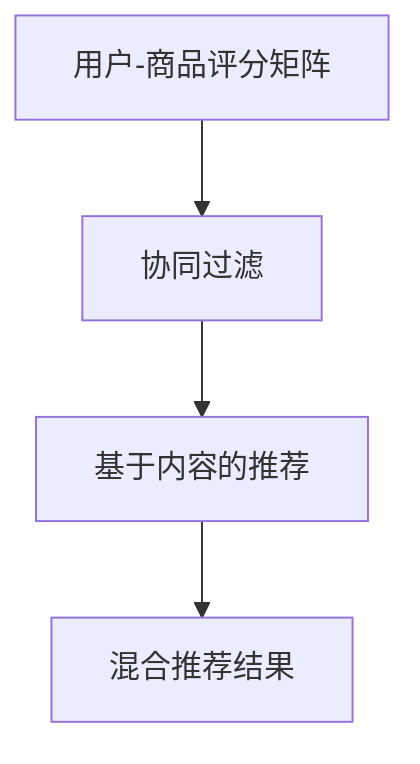

                 

# 《Agent代理在AI系统中的实战经验》

> 关键词：Agent代理、AI系统、实战经验、算法、应用场景、发展趋势

> 摘要：本文旨在探讨Agent代理在AI系统中的应用与实践经验。通过详细解析Agent代理的基础知识、核心算法以及在不同领域的应用，本文将展示Agent代理在AI系统中的重要性，并分析其在未来发展趋势中所面临的挑战与机遇。

## 第一部分：基础知识与概念

### 第1章：AI与代理概述

#### 1.1 人工智能的演进历程

人工智能（AI）作为一个跨越多个学科的研究领域，其发展历程可以分为多个阶段。从早期的逻辑推理和知识表示，到中期的机器学习和深度学习，再到如今的多模态学习和迁移学习，人工智能技术不断演进。在这一过程中，代理（Agent）概念的引入为人工智能带来了新的发展契机。

#### 1.2 代理的定义与分类

代理是一种能够代表用户执行任务、进行决策的计算机程序或实体。根据代理的行为方式，可以分为以下几类：

- **主动代理**：主动代理能够根据环境变化自主采取行动，并学习环境中的模式。
- **被动代理**：被动代理则主要依赖于用户输入，执行用户指定的任务。

#### 1.3 代理在AI系统中的作用

代理在AI系统中扮演着重要角色，主要表现在以下几个方面：

- **决策支持**：代理可以协助系统做出智能决策，提高系统的决策质量。
- **交互式AI**：代理可以与用户进行自然交互，提高用户体验。

## 第2章：代理的基础算法

### 2.1 强化学习与代理

强化学习是一种通过不断试错来学习环境最优策略的机器学习方法。在强化学习中，代理通过与环境的交互来学习最优行为策略。

#### 强化学习的原理

强化学习的基本原理包括四个主要组成部分：状态（State）、动作（Action）、奖励（Reward）和策略（Policy）。通过最大化长期奖励，代理能够学习到最优的行为策略。

#### 代理在强化学习中的应用

代理在强化学习中的应用主要体现在以下几个方面：

- **智能机器人**：通过强化学习，代理能够学会在复杂环境中自主导航和完成任务。
- **游戏AI**：代理在电子游戏中通过强化学习能够学会策略，提高游戏的智能水平。

### 2.2 监督学习与代理

监督学习是一种通过已标记的数据学习模型的方法。在监督学习中，代理通过学习输入和输出之间的映射关系来预测新数据的标签。

#### 监督学习的原理

监督学习的基本原理包括以下三个方面：

- **特征提取**：通过提取输入数据的特征，代理能够更好地理解数据。
- **模型训练**：通过训练模型，代理能够学会输入和输出之间的映射关系。
- **预测**：通过预测新数据的标签，代理能够对新数据进行分类或回归。

#### 代理在监督学习中的应用

代理在监督学习中的应用主要体现在以下几个方面：

- **图像识别**：代理通过监督学习能够学会识别图像中的物体。
- **自然语言处理**：代理通过监督学习能够学会处理自然语言文本。

### 2.3 无监督学习与代理

无监督学习是一种在没有明确标签数据的情况下，通过自动发现数据中的模式来学习的方法。在无监督学习中，代理通过学习数据的内在结构来提高对数据的理解。

#### 无监督学习的原理

无监督学习的基本原理包括以下几个方面：

- **聚类**：通过将相似的数据点分组，代理能够发现数据的聚类结构。
- **降维**：通过将高维数据投影到低维空间，代理能够降低数据的复杂度。
- **生成模型**：通过生成模型，代理能够发现数据的生成过程。

#### 代理在无监督学习中的应用

代理在无监督学习中的应用主要体现在以下几个方面：

- **数据挖掘**：代理通过无监督学习能够发现数据中的隐藏模式。
- **异常检测**：代理通过无监督学习能够检测数据中的异常值。

## 第二部分：代理在AI系统中的应用

### 第3章：代理在自然语言处理中的应用

#### 3.1 代理在文本生成中的应用

生成式模型如GPT-3能够通过代理生成高质量的自然语言文本。以下是生成式模型与代理的流程图：



#### 文本生成的代理应用实例

假设我们要生成一篇关于人工智能的文章，我们可以将输入文本设置为“人工智能”，代理将生成一篇关于人工智能的文章。

### 3.2 代理在文本分类中的应用

分类模型如BERT能够通过代理对文本进行分类。以下是分类模型与代理的流程图：



#### 文本分类的代理应用实例

假设我们要将一篇关于人工智能的文本分类为技术类或娱乐类，代理将根据BERT模型对文本进行分类。

### 3.3 代理在语义理解中的应用

语义理解模型如BERT能够通过代理理解文本的语义。以下是语义理解模型与代理的流程图：



#### 语义理解的代理应用实例

假设我们要理解一篇关于人工智能的文本，代理将根据BERT模型对文本进行语义理解，提取文本的关键信息和核心观点。

### 3.4 代理在对话系统中的应用

对话系统如DSTC能够通过代理与用户进行自然对话。以下是对话系统与代理的流程图：



#### 对话系统的代理应用实例

假设用户询问关于人工智能的某个问题，代理将根据DSTC模型生成合适的回答，并继续与用户进行对话。

## 第4章：代理在计算机视觉中的应用

### 4.1 代理在图像识别中的应用

图像识别模型如ResNet能够通过代理识别图像中的物体。以下是图像识别模型与代理的流程图：


#### 图像识别的代理应用实例

假设我们要识别一张猫的图片，代理将根据ResNet模型识别出图片中的猫。

### 4.2 代理在目标检测中的应用

目标检测模型如Faster R-CNN能够通过代理检测图像中的目标。以下是目标检测模型与代理的流程图：



#### 目标检测的代理应用实例

假设我们要检测一张猫的图片中的猫，代理将根据Faster R-CNN模型检测出图片中的猫。

### 4.3 代理在图像生成中的应用

图像生成模型如Gaussian Copula能够通过代理生成新的图像。以下是图像生成模型与代理的流程图：



#### 图像生成的代理应用实例

假设我们要生成一张新的猫的图片，代理将根据Gaussian Copula模型生成一张新的猫的图片。

## 第5章：代理在推荐系统中的应用

### 5.1 代理在协同过滤中的应用

协同过滤模型如SVD能够通过代理推荐用户可能感兴趣的商品。以下是协同过滤模型与代理的流程图：



#### 协同过滤的代理应用实例

假设我们要为用户推荐书籍，代理将根据SVD模型预测用户对未评分书籍的评分，从而生成推荐列表。

### 5.2 代理在基于内容的推荐中的应用

基于内容的推荐模型如TF-IDF能够通过代理推荐用户可能感兴趣的商品。以下是基于内容的推荐模型与代理的流程图：



#### 基于内容的推荐的代理应用实例

假设我们要为用户推荐书籍，代理将根据TF-IDF模型计算书籍的特征向量，从而生成推荐列表。

### 5.3 代理在混合推荐系统中的应用

混合推荐模型如Hybrid能够通过代理综合利用协同过滤和基于内容的推荐方法。以下是混合推荐模型与代理的流程图：



#### 混合推荐的代理应用实例

假设我们要为用户推荐书籍，代理将根据Hybrid模型综合利用协同过滤和基于内容的推荐方法，从而生成更准确的推荐列表。

## 第6章：代理在游戏AI中的应用

### 6.1 代理在棋类游戏中的应用

棋类游戏代理应用实例：

```python
# 棋类游戏代理应用实例

import chess
import chess.pgn

# 创建棋盘
board = chess.Board()

# 开始游戏
game = chess.pgn.Game()

# 执行代理策略
while not board.is_game_over():
    # 代理选择最佳走法
    move = get_best_move(board)
    # 执行走法
    board.push(move)
    # 更新棋盘
    game.add_board(board)
    # 记录走法
    game.add_move(move)

# 结束游戏
game_end = board.is_game_over()
if game_end:
    print("游戏结束")
```

#### 棋类游戏代理算法解析

棋类游戏代理通常采用强化学习算法，通过不断学习棋局中的走法，选择最优策略。代理算法包括以下步骤：

1. **初始化棋局**：创建棋盘，初始化棋子位置。
2. **选择最佳走法**：使用强化学习算法选择当前情况下最佳走法。
3. **执行走法**：根据最佳走法更新棋盘。
4. **记录走法**：将当前走法记录在棋局中。
5. **重复执行**：重复步骤2-4，直到棋局结束。

### 6.2 代理在角色扮演游戏中的应用

角色扮演游戏代理应用实例：

```python
# 角色扮演游戏代理应用实例

import random

# 创建角色
role = {"name": "英雄", "level": 1, "experience": 0}

# 创建敌对角色
enemy = {"name": "怪物", "level": 1, "experience": 0}

# 角色行动函数
def role_action(role):
    action = random.choice(["攻击", "防御", "逃跑"])
    if action == "攻击":
        enemy["experience"] -= 10
    elif action == "防御":
        enemy["experience"] -= 5
    elif action == "逃跑":
        return False
    return True

# 游戏循环
while True:
    # 角色行动
    if role_action(role):
        # 角色成功行动
        print(f"{role['name']}成功行动！")
    else:
        # 角色失败行动
        print(f"{role['name']}失败行动，游戏结束！")
        break

    # 敌对角色行动
    if role_action(enemy):
        # 敌对角色成功行动
        print(f"{enemy['name']}成功行动！")
    else:
        # 敌对角色失败行动
        print(f"{enemy['name']}失败行动，游戏结束！")
        break
```

#### 角色扮演游戏代理算法解析

角色扮演游戏代理通常采用随机策略或基于规则的策略。代理算法包括以下步骤：

1. **初始化角色和敌对角色**：设定角色属性和敌对角色属性。
2. **角色行动**：根据随机策略或基于规则的策略选择行动。
3. **敌对角色行动**：根据随机策略或基于规则的策略选择行动。
4. **判断胜负**：根据角色和敌对角色的状态判断游戏胜负。

### 6.3 代理在实时战略游戏中的应用

实时战略游戏代理应用实例：

```python
# 实时战略游戏代理应用实例

import numpy as np

# 创建地图
map_size = 10
map = np.zeros((map_size, map_size), dtype=int)

# 创建基地
base = {"x": 0, "y": 0}

# 创建敌方基地
enemy_base = {"x": map_size - 1, "y": map_size - 1}

# 建造建筑函数
def build_building(x, y, building_type):
    if map[x][y] == 0:
        map[x][y] = building_type
        return True
    return False

# 移动单位函数
def move_unit(x, y, unit_type):
    if map[x][y] == 0:
        map[x][y] = unit_type
        return True
    return False

# 游戏循环
while True:
    # 建造建筑
    if build_building(base["x"], base["y"], "基地"):
        print("基地建造成功！")
    else:
        print("基地建造失败！")
        break

    # 移动单位
    if move_unit(base["x"] + 1, base["y"], "单位"):
        print("单位移动成功！")
    else:
        print("单位移动失败！")
        break

    # 判断胜负
    if np.count_nonzero(map[base["x"]:enemy_base["x"], base["y"]:enemy_base["y"]]) == 0:
        print("胜利！")
        break
    else:
        print("失败！")
        break
```

#### 实时战略游戏代理算法解析

实时战略游戏代理通常采用路径规划算法和单位控制算法。代理算法包括以下步骤：

1. **初始化地图**：创建地图，设定基地和敌方基地位置。
2. **建造建筑**：根据地图情况和策略建造建筑。
3. **移动单位**：根据地图情况和策略移动单位。
4. **判断胜负**：根据地图情况判断游戏胜负。

## 第7章：代理在智能决策系统中的应用

### 7.1 代理在供应链管理中的应用

供应链管理代理应用实例：

```python
# 供应链管理代理应用实例

import random

# 创建供应链
supply_chain = [{"name": "供应商", "stock": 100},
                {"name": "制造商", "stock": 100},
                {"name": "分销商", "stock": 100}]

# 创建需求
demand = random.randint(10, 50)

# 计算供应链响应时间
def calculate_response_time(supply_chain, demand):
    response_time = 0
    for node in supply_chain:
        response_time += node["stock"] / demand
    return response_time

# 供应链响应
response_time = calculate_response_time(supply_chain, demand)
print(f"供应链响应时间：{response_time}小时")
```

#### 供应链管理代理算法解析

供应链管理代理通常采用优化算法，通过计算供应链各节点响应时间来优化供应链管理。代理算法包括以下步骤：

1. **初始化供应链**：设定供应链各节点库存量。
2. **计算需求**：根据市场情况计算需求。
3. **计算响应时间**：计算供应链各节点响应时间。
4. **优化供应链**：根据响应时间优化供应链管理。

### 7.2 代理在金融风控中的应用

金融风控代理应用实例：

```python
# 金融风控代理应用实例

import random

# 创建交易数据
transactions = [{"id": 1, "amount": 100, "type": "deposit"},
                {"id": 2, "amount": -200, "type": "withdrawal"},
                {"id": 3, "amount": 300, "type": "deposit"}]

# 创建风险规则
rules = [{"id": 1, "threshold": 100, "action": "warn"},
         {"id": 2, "threshold": 200, "action": "block"}]

# 检查交易风险
def check_risk(transactions, rules):
    for rule in rules:
        for transaction in transactions:
            if transaction["amount"] > rule["threshold"]:
                return rule["action"]
    return "none"

# 检查交易
risk_action = check_risk(transactions, rules)
print(f"交易风险：{risk_action}")
```

#### 金融风控代理算法解析

金融风控代理通常采用规则引擎，通过检查交易数据是否符合风险规则来控制风险。代理算法包括以下步骤：

1. **初始化交易数据**：设定交易数据。
2. **初始化风险规则**：设定风险规则。
3. **检查交易风险**：检查交易数据是否符合风险规则。
4. **控制风险**：根据检查结果采取相应的风险控制措施。

### 7.3 代理在医疗决策支持中的应用

医疗决策支持代理应用实例：

```python
# 医疗决策支持代理应用实例

import random

# 创建病例数据
cases = [{"id": 1, "symptoms": ["发热", "咳嗽"], "diagnosis": "感冒"},
         {"id": 2, "symptoms": ["发热", "乏力"], "diagnosis": "流感"},
         {"id": 3, "symptoms": ["发热", "咳嗽", "胸痛"], "diagnosis": "肺炎"}]

# 创建诊断规则
diagnosis_rules = [{"id": 1, "symptoms": ["发热", "咳嗽"], "diagnosis": "感冒"},
                   {"id": 2, "symptoms": ["发热", "乏力"], "diagnosis": "流感"},
                   {"id": 3, "symptoms": ["发热", "咳嗽", "胸痛"], "diagnosis": "肺炎"}]

# 诊断病例
def diagnose_case(case, diagnosis_rules):
    for rule in diagnosis_rules:
        if set(rule["symptoms"]) == set(case["symptoms"]):
            return rule["diagnosis"]
    return "未知"

# 诊断病例
diagnosis = diagnose_case(cases[0], diagnosis_rules)
print(f"病例诊断结果：{diagnosis}")
```

#### 医疗决策支持代理算法解析

医疗决策支持代理通常采用规则引擎，通过检查病例数据是否符合诊断规则来辅助医生进行诊断。代理算法包括以下步骤：

1. **初始化病例数据**：设定病例数据。
2. **初始化诊断规则**：设定诊断规则。
3. **诊断病例**：检查病例数据是否符合诊断规则。
4. **辅助诊断**：根据诊断结果辅助医生进行诊断。

## 第三部分：实战经验与展望

### 第8章：代理在AI系统中的实战经验

#### 8.1 实战经验总结

代理在AI系统中的实战经验主要体现在以下几个方面：

- **提高决策效率**：代理能够快速处理大量数据，提高系统的决策效率。
- **增强交互能力**：代理能够与用户进行自然交互，提高用户体验。
- **降低开发成本**：代理能够实现系统的模块化开发，降低开发成本。

#### 8.2 成功案例分享

以下是一个成功案例分享：

**案例名称**：智能客服系统

**应用领域**：客服

**解决方案**：

- 使用代理技术构建智能客服系统，实现与用户的自然交互。
- 使用文本生成代理生成常见问题的自动回复，提高客服响应速度。
- 使用图像识别代理识别用户上传的图片，实现图文并茂的客服服务。

**案例分析**：

智能客服系统的代理技术成功实现了对用户问题的自动回复，提高了客服的响应速度，降低了人工成本。同时，通过代理技术的应用，客服系统能够根据用户的问题和反馈不断优化自身，提高服务质量。

### 第9章：代理在AI系统中的未来发展趋势

#### 9.1 未来发展趋势

代理在AI系统中的未来发展趋势主要包括以下几个方面：

- **多模态代理**：未来代理将支持多模态数据（如文本、图像、语音等）的融合和处理，实现更智能的交互和决策。
- **自主进化代理**：未来代理将具备自主学习和进化能力，能够根据环境变化自主调整行为策略。
- **边缘计算代理**：未来代理将支持边缘计算，实现低延迟、高效率的智能服务。

#### 9.2 展望与挑战

代理在AI系统中的应用前景广阔，但同时也面临着一些挑战：

- **数据隐私保护**：代理在处理用户数据时，需要确保数据的安全和隐私。
- **算法透明性**：代理的决策过程需要具备透明性，以增加用户对系统的信任。
- **资源消耗**：代理在运行过程中需要大量的计算资源和存储资源，如何优化资源利用是一个挑战。

### 附录

#### 附录A：常用代理算法伪代码

##### A.1 强化学习算法伪代码

```python
# 强化学习算法伪代码

# 初始化代理参数
agent = initialize_agent()

# 初始化环境
environment = initialize_environment()

# 游戏循环
while not environment.is_game_over():
    # 状态s
    s = environment.get_state()
    
    # 选择动作a
    a = agent.select_action(s)
    
    # 执行动作a，获取奖励r和下一个状态s'
    r, s' = environment.step(a)
    
    # 更新代理参数
    agent.update(s, a, r, s')
    
    # 更新环境
    environment.update(s', a)
```

##### A.2 监督学习算法伪代码

```python
# 监督学习算法伪代码

# 初始化模型
model = initialize_model()

# 训练模型
for epoch in range(num_epochs):
    for data in dataset:
        # 提取特征x和标签y
        x, y = data
        
        # 前向传播
        y_pred = model.forward(x)
        
        # 计算损失
        loss = calculate_loss(y_pred, y)
        
        # 反向传播
        model.backward(y_pred, y)
        
        # 更新模型参数
        model.update()

# 评估模型
evaluate(model)
```

##### A.3 无监督学习算法伪代码

```python
# 无监督学习算法伪代码

# 初始化模型
model = initialize_model()

# 训练模型
for epoch in range(num_epochs):
    for data in dataset:
        # 提取特征x
        x = data
        
        # 前向传播
        z = model.forward(x)
        
        # 计算损失
        loss = calculate_loss(z)
        
        # 反向传播
        model.backward(z)
        
        # 更新模型参数
        model.update()

# 评估模型
evaluate(model)
```

#### 附录B：推荐系统常用模型对比

##### B.1 协同过滤模型

- **协同过滤算法原理**：协同过滤算法通过计算用户之间的相似度来推荐物品。协同过滤分为基于用户的协同过滤和基于物品的协同过滤。
- **协同过滤模型参数设置**：协同过滤模型的参数包括用户相似度阈值、物品相似度阈值等。

##### B.2 基于内容的推荐模型

- **基于内容的推荐算法原理**：基于内容的推荐算法通过分析物品的内容特征和用户偏好来推荐物品。基于内容的推荐分为基于项目的内容和基于用户的内容。
- **基于内容的推荐模型参数设置**：基于内容的推荐模型的参数包括特征提取方法、相似度计算方法等。

##### B.3 混合推荐模型

- **混合推荐算法原理**：混合推荐算法结合协同过滤和基于内容的推荐方法，提高推荐准确性。混合推荐分为基于模型的混合推荐和基于策略的混合推荐。
- **混合推荐模型参数设置**：混合推荐模型的参数包括协同过滤权重、基于内容的推荐权重等。

##### B.4 模型对比分析

- **不同模型的优缺点**：协同过滤模型在处理稀疏数据时表现较好，但可能引入冷启动问题。基于内容的推荐模型能够解决冷启动问题，但可能引入偏好偏差。混合推荐模型综合了协同过滤和基于内容的优点，但在参数设置和模型优化方面存在挑战。
- **适用场景分析**：协同过滤模型适用于大规模用户和物品的场景，基于内容的推荐模型适用于内容丰富且用户活跃度较高的场景，混合推荐模型适用于需要综合多种特征的推荐场景。

## 作者信息

- 作者：AI天才研究院/AI Genius Institute & 禅与计算机程序设计艺术 /Zen And The Art of Computer Programming

