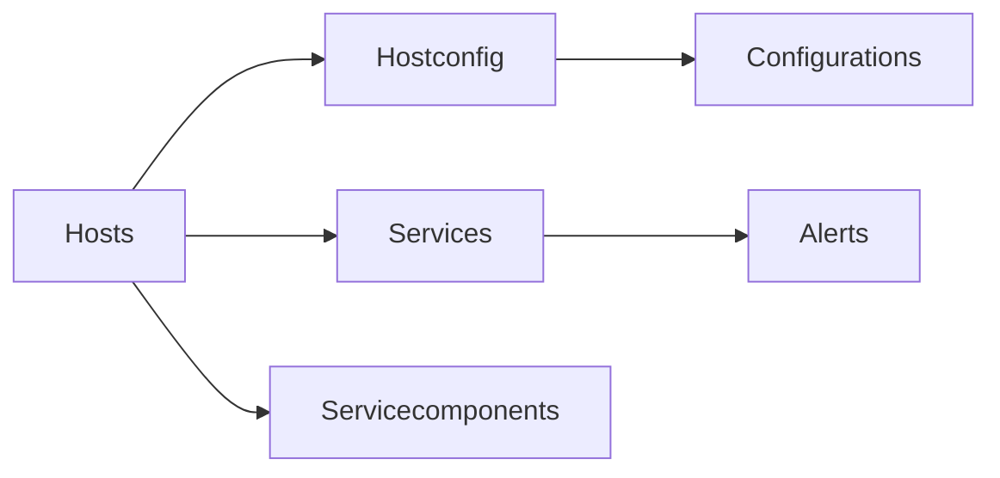
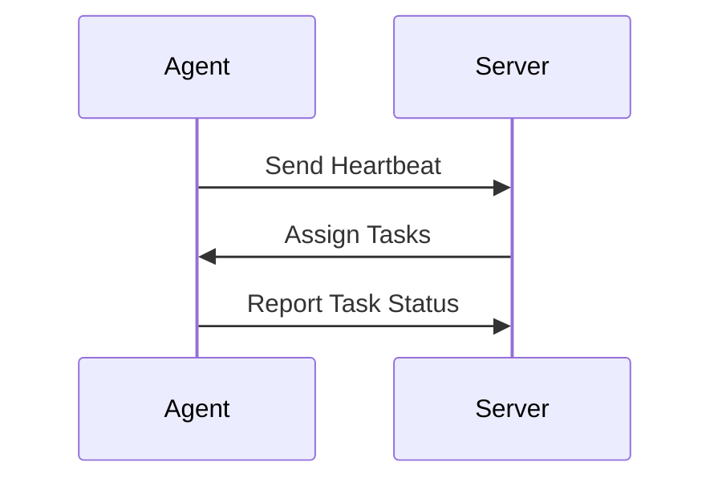
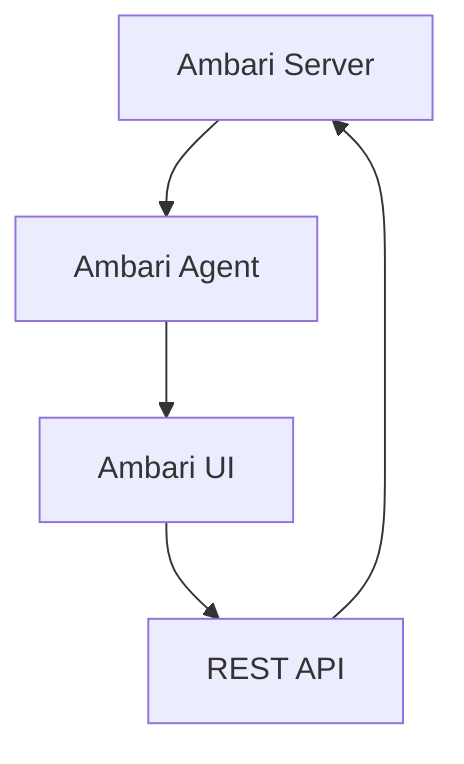

                 

### 文章标题: Ambari原理与代码实例讲解

---

关键词：Ambari, Hadoop, 集群管理, REST API, Agent, UI, 权限管理

摘要：本文将深入探讨Ambari的原理和实现，从概述、核心原理、实践与优化、案例解析等多个角度详细分析Ambari的技术架构和实际应用。通过代码实例和伪代码，我们将揭示Ambari在集群管理、资源监控、性能调优等方面的关键技术细节，帮助读者全面理解Ambari的工作机制，为大数据平台建设提供有力支持。

---

### 第一部分: Ambari概述

---

#### 第1章: Ambari概述与架构

##### 1.1 Ambari的概念与历史

###### 1.1.1 什么是Ambari

Ambari是一个开源的Hadoop集群管理工具，由Hortonworks开发。它提供了自动化部署、操作和维护Hadoop生态系统组件的能力，使得管理大规模分布式集群变得简单和高效。

###### 1.1.2 Ambari的发展历程

Ambari最初是由Hortonworks在2012年发布，后来成为Apache项目的孵化项目，并在2016年成为Apache的一个顶级项目。随着时间的推移，Ambari不断更新，引入了更多的功能和改进。

###### 1.1.3 Ambari的版本更新

截至本文撰写时，最新的稳定版本是Apache Ambari 3.0。该版本带来了许多新特性和改进，如改进的用户界面、对Hadoop生态系统其他组件的支持以及增强的集群管理和监控功能。

##### 1.2 Ambari的核心组件与架构

###### 1.2.1 Ambari Server

Ambari Server是Ambari集群管理的中心组件，负责接收用户请求、协调集群操作、处理元数据以及与数据库交互。它是所有管理操作的决策中心。

###### 1.2.2 Ambari Agent

Ambari Agent安装在集群中的每个节点上，负责执行Ambari Server分配的任务，如服务安装、配置和监控。Agent与Server通过REST API进行通信。

###### 1.2.3 Ambari UI

Ambari UI提供了一个直观的图形界面，使得用户可以轻松管理集群。它提供了集群概览、服务监控、资源管理等功能，是Ambari用户的主要交互界面。

###### 1.2.4 Ambari Rest API

Ambari Rest API是一个基于HTTP的RESTful接口，允许用户通过程序化方式与Ambari Server进行交互。用户可以通过API执行各种操作，如服务安装、配置修改和监控数据查询。

##### 1.3 Ambari的生态系统

###### 1.3.1 Hadoop生态系统概述

Hadoop是一个强大的分布式计算框架，包括HDFS（分布式文件系统）、YARN（资源调度框架）和多种数据处理工具，如MapReduce、Hive、HBase等。

###### 1.3.2 Ambari与Hadoop其他组件的关系

Ambari支持Hadoop生态系统中的所有主要组件，如HDFS、YARN、Hive、HBase等。它提供了对这些组件的统一管理界面和自动化部署功能。

###### 1.3.3 Ambari与其他生态系统的集成

除了Hadoop，Ambari还支持与其他大数据生态系统组件的集成，如Apache Spark、Apache Kafka等。这为构建综合性的大数据平台提供了便利。

##### 1.4 Ambari的应用场景

###### 1.4.1 企业级Hadoop管理需求

Ambari在企业环境中被广泛应用于管理大规模Hadoop集群，提供高可用性、性能监控和安全保障。

###### 1.4.2 Ambari在大数据项目中的应用

在大数据项目中，Ambari用于简化集群部署和管理，提高开发效率和数据处理能力。

###### 1.4.3 Ambari的安全性和可靠性保障

Ambari通过内置的安全特性，如权限管理、数据加密和集群监控，确保大数据平台的可靠性和安全性。

---

### 第二部分: Ambari核心原理

---

#### 第2章: Ambari原理详解

##### 2.1 Ambari REST API原理

###### 2.1.1 REST API基础

REST（Representational State Transfer）是一种设计Web服务的架构风格，它通过HTTP协议的GET、POST、PUT、DELETE等方法实现数据的创建、读取、更新和删除。

###### 2.1.2 Ambari REST API架构

Ambari REST API是一个基于JSON的API，它提供了对集群、服务、配置和监控数据的访问。API由一组URL组成，每个URL对应一个特定的操作。

###### 2.1.3 使用Ambari REST API进行Hadoop集群管理

通过Ambari REST API，用户可以执行各种操作，如创建集群、安装服务、配置参数和监控集群状态。以下是一个使用Ambari REST API进行集群管理的示例：

python
# 示例：使用Ambari REST API创建集群
import requests

# 设置Ambari Server的URL
ambari_url = "http://ambari-server:8080/api/v1"

# 发送POST请求创建集群
response = requests.post(
    f"{ambari_url}/clusters",
    json={
        "ClusterInfo": {
            "name": "my-hadoop-cluster",
            "provisioning_state": "CLUSTER_SETUP_COMPLETE"
        }
    }
)

# 检查响应状态码
if response.status_code == 201:
    print("Cluster created successfully!")
else:
    print("Failed to create cluster.")

---

##### 2.2 Ambari元数据存储原理

###### 2.2.1 元数据的重要性

元数据是关于数据的数据，它描述了数据的结构和属性。在Ambari中，元数据存储了集群配置、服务状态和监控数据等信息，对于集群管理至关重要。

###### 2.2.2 Ambari元数据存储方式

Ambari使用Apache Cassandra作为其元数据存储后端。Cassandra是一个分布式NoSQL数据库，提供了高可用性、高性能和可扩展性。

###### 2.2.3 元数据表的实现

在Cassandra中，Ambari元数据存储使用多个表来实现，包括`hostconfig`, `hosts`, `services`, `servicecomponents`, `alerts`等。以下是一个简单的Mermaid流程图，展示了Ambari元数据表之间的关系：



---

##### 2.3 Ambari Agent工作机制

###### 2.3.1 Ambari Agent的作用

Ambari Agent是集群中每个节点上运行的进程，负责执行Ambari Server分配的任务。它是集群操作的执行者，与Server通过REST API进行通信。

###### 2.3.2 Agent的安装与配置

Agent的安装和配置是Ambari集群部署的关键步骤。以下是一个简化的安装和配置流程：

1. **安装Agent**：在集群中的每个节点上安装Ambari Agent。
2. **配置Agent**：配置Agent的REST API端点和数据库连接。
3. **注册Agent**：使用Ambari Server的REST API将Agent注册到集群。

以下是一个使用Python脚本的示例：

```python
# 示例：配置Ambari Agent
import requests

# 设置Ambari Server的URL
ambari_url = "http://ambari-server:8080/api/v1"

# 发送POST请求配置Agent
response = requests.post(
    f"{ambari_url}/hosts/{host_name}/configurations",
    json={
        "Configurations": {
            "type": "hostconfig",
            "properties": {
                "ambariagent.server": "ambari-server:8080"
            }
        }
    }
)

# 检查响应状态码
if response.status_code == 200:
    print("Agent configuration updated successfully!")
else:
    print("Failed to update agent configuration.")
```

###### 2.3.3 Agent与Server的交互过程

Agent与Server的交互过程包括以下几个步骤：

1. **心跳检查**：Agent定期向Server发送心跳信号，以保持活跃状态。
2. **任务执行**：Server根据集群配置和监控数据，向Agent分配任务。
3. **任务报告**：Agent完成任务后，向Server报告任务状态和结果。

以下是一个简化的交互流程图：



---

##### 2.4 Ambari UI设计原理

###### 2.4.1 Ambari UI架构

Ambari UI是一个基于Web的图形用户界面，它由前端和后端两部分组成。前端使用React框架构建，后端使用Spring Boot框架。

###### 2.4.2 Ambari UI的核心功能

Ambari UI提供了以下核心功能：

1. **集群概览**：展示集群的总体状态和关键指标。
2. **服务监控**：监控集群中各个服务的运行状态和性能。
3. **资源管理**：配置和管理集群的资源分配。
4. **配置管理**：管理和修改集群的配置参数。
5. **安全策略**：管理集群的访问控制和权限。

###### 2.4.3 Ambari UI与REST API的通信

Ambari UI通过REST API与Ambari Server进行通信，获取集群状态、监控数据和配置信息。以下是一个使用React Hooks获取集群概览数据的示例：

```javascript
import { useEffect, useState } from 'react';
import axios from 'axios';

function ClusterOverview() {
    const [clusterInfo, setClusterInfo] = useState(null);

    useEffect(() => {
        axios.get('/api/v1/clusters')
            .then(response => {
                setClusterInfo(response.data.items[0]);
            })
            .catch(error => {
                console.error('Error fetching cluster info:', error);
            });
    }, []);

    if (clusterInfo) {
        return (
            <div>
                <h2>Cluster Overview</h2>
                <p>Name: {clusterInfo.Clusters.cluster_name}</p>
                <p>Status: {clusterInfo.Clusters.cluster_status}</p>
            </div>
        );
    } else {
        return <div>Loading cluster info...</div>;
    }
}
```

---

##### 2.5 Ambari权限管理原理

###### 2.5.1 权限管理的重要性

在分布式集群管理中，权限管理至关重要。它确保了只有授权用户才能访问和管理集群资源，防止未授权的访问和操作。

###### 2.5.2 Ambari的权限模型

Ambari使用基于角色的权限模型，将用户分为不同的角色，并定义每个角色的权限。角色分为管理员、操作员和用户等。

###### 2.5.3 权限管理的实现机制

Ambari通过REST API和数据库管理权限。用户和角色的权限信息存储在Cassandra数据库中。以下是一个使用Python脚本添加新用户的示例：

```python
import requests

# 设置Ambari Server的URL
ambari_url = "http://ambari-server:8080/api/v1"

# 发送POST请求添加用户
response = requests.post(
    f"{ambari_url}/users",
    json={
        "UserInfos": {
            "username": "new_user",
            "password": "password123",
            "role_ids": [2]  # 普通用户角色ID
        }
    }
)

# 检查响应状态码
if response.status_code == 201:
    print("User created successfully!")
else:
    print("Failed to create user.")
```

---

### 第三部分: Ambari实践与优化

---

#### 第3章: Ambari安装与配置

##### 3.1 Ambari安装前的准备工作

在安装Ambari之前，需要确保以下准备工作：

- **硬件要求**：根据集群规模，准备足够的物理或虚拟服务器。
- **操作系统要求**：支持RHEL、CentOS、Ubuntu等常见的Linux发行版。
- **网络要求**：确保服务器之间可以相互通信，并配置静态IP地址。

##### 3.2 安装Ambari Server

安装Ambari Server的步骤如下：

1. **下载Ambari Server包**：从Apache Ambari官网下载最新的Ambari Server包。
2. **安装Java环境**：Ambari Server依赖于Java，需要安装Java运行环境。
3. **安装Ambari Server**：运行安装脚本，完成Ambari Server的安装。

以下是一个简化的安装脚本：

```bash
#!/bin/bash

# 设置安装路径
INSTALL_DIR="/usr/local/ambari"

# 安装依赖
sudo yum install -y git maven java-1.8.0-openjdk

# 解压安装包
tar zxvf ambari-server-3.1.0.tar.gz -C $INSTALL_DIR

# 切换到ambari-server目录
cd $INSTALL_DIR/ambari-server

# 运行安装脚本
bin/ambari-server setup

# 检查安装状态
bin/ambari-server status
```

##### 3.3 安装Ambari Agent

安装Ambari Agent的步骤如下：

1. **下载Ambari Agent包**：从Apache Ambari官网下载最新的Ambari Agent包。
2. **在集群中的每个节点上安装Agent**：运行安装脚本，完成Ambari Agent的安装。

以下是一个简化的安装脚本：

```bash
#!/bin/bash

# 设置安装路径
AGENT_INSTALL_DIR="/usr/local/ambari-agent"

# 安装依赖
sudo yum install -y git maven java-1.8.0-openjdk

# 解压安装包
tar zxvf ambari-agent-3.1.0.tar.gz -C $AGENT_INSTALL_DIR

# 配置Agent
sudo $AGENT_INSTALL_DIR/bin/ambari-agent-config.sh

# 启动Agent
sudo $AGENT_INSTALL_DIR/bin/ambari-agent start

# 检查Agent状态
sudo $AGENT_INSTALL_DIR/bin/ambari-agent status
```

##### 3.4 配置Ambari UI

配置Ambari UI的步骤如下：

1. **安装Web服务器**：在Ambari Server主机上安装Web服务器，如Nginx或Apache。
2. **配置Web服务器**：配置Web服务器以代理Ambari UI。

以下是一个使用Nginx的配置示例：

```nginx
http {
    server {
        listen 80;

        location / {
            proxy_pass http://127.0.0.1:8080;
            proxy_set_header Host $host;
            proxy_set_header X-Real-IP $remote_addr;
            proxy_set_header X-Forwarded-For $proxy_add_x_forwarded_for;
        }
    }
}
```

---

#### 第4章: Ambari集群管理

##### 4.1 创建与配置Hadoop集群

创建和配置Hadoop集群的步骤如下：

1. **登录Ambari UI**：在Web浏览器中输入Ambari UI的URL，登录Ambari UI。
2. **创建集群**：在Ambari UI中点击“Add Cluster”按钮，填写集群名称和其他必要信息。
3. **配置集群**：配置集群的组件，如HDFS、YARN、Hive等。

以下是一个使用Ambari UI创建和配置Hadoop集群的示例：

```bash
# 登录Ambari UI
http://ambari-server:8080/

# 创建集群
点击“Add Cluster”按钮，填写集群名称和描述。

# 配置集群
1. 选择“HDFS”组件，配置副本因子、名称节点和数据节点的IP地址。
2. 选择“YARN”组件，配置资源调度器和应用程序管理器的IP地址。
3. 选择“Hive”组件，配置Hive服务器和客户端的IP地址。
4. 点击“Save”按钮保存配置。

# 启动集群
点击“Start Service”按钮，启动集群中的所有服务。

# 集群健康检查
等待集群状态变为“Active”，然后点击“Health”按钮进行健康检查。
```

---

##### 4.2 集群资源监控

集群资源监控是确保集群稳定运行的重要环节。以下是如何在Ambari UI中进行资源监控的步骤：

1. **登录Ambari UI**：在Web浏览器中输入Ambari UI的URL，登录Ambari UI。
2. **查看监控数据**：在Ambari UI的“Cluster”页面中，选择“Health”选项卡，查看集群的健康状况。
3. **查看资源监控**：在“Resource”选项卡下，可以查看集群的CPU、内存、磁盘使用情况等资源监控数据。

以下是一个简化的监控数据展示：

```bash
# 登录Ambari UI
http://ambari-server:8080/

# 查看集群健康状况
点击“Health”选项卡，查看集群的总体健康状况。

# 查看资源监控数据
点击“Resource”选项卡，查看集群的CPU、内存、磁盘等资源使用情况。

# 资源监控图表
在“Resource”页面的右侧，可以查看CPU利用率、内存使用率、磁盘I/O等监控图表。
```

---

##### 4.3 集群维护与优化

集群维护和优化是确保集群长期稳定运行的关键。以下是如何进行集群维护与优化的步骤：

1. **检查集群状态**：定期检查集群的状态，确保所有服务正常运行。
2. **监控资源使用情况**：监控集群的资源使用情况，发现潜在的性能瓶颈。
3. **优化配置参数**：根据监控数据，调整集群的配置参数，优化性能。

以下是一个简化的集群维护与优化流程：

```bash
# 检查集群状态
定期登录Ambari UI，检查集群的状态和健康检查结果。

# 监控资源使用情况
使用Ambari UI的监控工具，查看集群的CPU、内存、磁盘等资源使用情况。

# 优化配置参数
根据监控数据，调整集群的配置参数，如HDFS副本因子、YARN资源限制等，以优化性能。

# 重启服务
在调整配置参数后，重启相关服务以应用新的配置。
```

---

##### 4.4 集群安全性配置

集群安全性配置是保护集群免受外部威胁的关键。以下是如何进行集群安全性配置的步骤：

1. **用户和权限管理**：创建和管理集群用户，并设置适当的权限。
2. **加密配置**：配置集群的加密功能，保护数据传输和存储。
3. **防火墙和网络安全**：配置防火墙和网络安全策略，限制外部访问。

以下是一个简化的集群安全性配置流程：

```bash
# 用户和权限管理
在Ambari UI中创建用户，并分配适当的权限。

# 加密配置
配置集群的SSL证书，启用HTTPS协议。

# 防火墙和网络安全
配置防火墙规则，限制集群服务的访问。

# 配置网络安全策略
使用Network Address Translation (NAT)和防火墙，确保集群的安全。
```

---

#### 第5章: Ambari插件开发

##### 5.1 插件开发基础

开发Ambari插件需要一定的编程基础和工具。以下是如何开始开发Ambari插件的步骤：

1. **了解插件架构**：熟悉Ambari插件的架构和工作原理。
2. **搭建开发环境**：安装必要的开发工具和依赖库。
3. **开发插件**：编写插件代码，实现所需的功能。

以下是一个简化的插件开发流程：

```bash
# 了解插件架构
阅读Ambari插件的官方文档，了解插件的结构和功能。

# 搭建开发环境
安装Java开发工具包（JDK）和Eclipse或IntelliJ IDEA等集成开发环境。

# 开发插件
1. 创建一个新的Maven项目，并添加Ambari插件的依赖。
2. 编写插件代码，实现自定义的安装、配置和监控功能。
3. 编译并打包插件。
```

---

##### 5.2 插件核心功能实现

开发Ambari插件的核心功能包括安装、配置和监控。以下是如何实现这些核心功能的步骤：

1. **安装**：插件需要在Ambari UI中安装和部署。
2. **配置**：插件需要配置相关的服务参数。
3. **监控**：插件需要监控服务的运行状态和性能。

以下是一个简化的插件功能实现流程：

```python
# 安装
在Ambari UI中，用户可以点击“Install”按钮，安装插件。

# 配置
用户可以在Ambari UI中配置插件的服务参数，如端口、日志路径等。

# 监控
插件需要定期向Ambari Server报告监控数据，如CPU使用率、内存使用率等。
```

---

##### 5.3 插件与Ambari集成

插件与Ambari的集成是确保插件能够正常运行的关键。以下是如何将插件与Ambari集成的步骤：

1. **创建插件项目**：使用Maven创建一个插件项目。
2. **添加依赖**：添加Ambari插件开发所需的依赖库。
3. **实现插件接口**：实现Ambari插件接口，实现插件的核心功能。
4. **打包插件**：编译并打包插件，生成插件包。

以下是一个简化的插件集成流程：

```bash
# 创建插件项目
使用Maven创建一个新的项目，并添加Ambari插件开发的依赖。

# 实现插件接口
实现Ambari插件的接口，包括安装、配置和监控等核心功能。

# 打包插件
编译并打包插件，生成插件包。

# 上传插件
将插件包上传到Ambari Server的插件存储目录。

# 安装插件
在Ambari UI中，点击“Install”按钮，安装上传的插件。

# 配置插件
在Ambari UI中，配置插件的服务参数。

# 启动插件
在Ambari UI中，启动插件的服务。
```

---

#### 第6章: Ambari案例解析

##### 6.1 Ambari在典型场景中的应用

Ambari在多个典型场景中得到了广泛应用，以下是一些常见应用场景：

1. **企业数据仓库**：Ambari用于构建和管理企业级数据仓库，提供高效的数据存储和分析能力。
2. **机器学习平台**：Ambari为机器学习项目提供统一的集群管理和资源调度，简化模型训练和部署。
3. **大数据分析应用**：Ambari用于部署和管理大数据分析应用，如实时流处理和复杂查询等。

以下是一个简化的企业数据仓库应用案例：

```python
# 企业数据仓库应用案例
import ambari

# 创建Ambari客户端
client = ambari.Client()

# 创建集群
cluster = client.create_cluster("data-warehouse-cluster")

# 配置集群
client.configure_cluster(cluster, {"hdfs dfs replication": "3"})

# 安装组件
client.install_components(cluster, ["HDFS", "YARN", "HIVE", "HBase"])

# 启动集群
client.start_cluster(cluster)

# 集群健康检查
client.check_cluster_health(cluster)
```

---

##### 6.2 Ambari项目实战

以下是一个使用Ambari部署和管理Hadoop集群的项目实战案例：

###### 6.2.1 项目背景

某互联网公司计划使用Hadoop进行大规模数据处理和分析，决定采用Ambari进行集群部署和管理。

###### 6.2.2 项目需求分析

- 部署一个高可用性的Hadoop集群
- 集群规模：10个节点
- 集群包含HDFS、YARN、Hive、HBase等组件
- 集群需要支持高并发和大数据处理

###### 6.2.3 部署与实施

1. **环境准备**：准备服务器，配置静态IP地址，安装必要的软件包。
2. **安装Ambari Server**：在主服务器上安装Ambari Server。
3. **安装Ambari Agent**：在所有节点上安装Ambari Agent。
4. **配置Ambari UI**：配置Ambari UI，使其能够通过浏览器访问。
5. **创建Hadoop集群**：在Ambari UI中创建Hadoop集群。
6. **配置集群**：配置集群的各种参数，如HDFS副本因子、YARN资源限制等。
7. **启动集群服务**：启动HDFS、YARN等组件服务。
8. **集群健康检查**：使用Ambari UI进行集群健康检查。

以下是一个简化的部署与实施流程：

```bash
# 环境准备
配置服务器，设置静态IP地址，安装Java、Python等必要的软件包。

# 安装Ambari Server
在主服务器上安装Ambari Server，并配置防火墙和SELinux。

# 安装Ambari Agent
在所有节点上安装Ambari Agent，并注册到Ambari Server。

# 配置Ambari UI
配置Ambari UI，设置管理员账户和域名。

# 创建集群
在Ambari UI中创建Hadoop集群，选择节点并配置集群参数。

# 启动集群服务
启动HDFS、YARN等组件服务，确保集群正常运行。

# 集群健康检查
使用Ambari UI检查集群健康状态，确保所有服务正常。
```

---

##### 6.3 Ambari性能调优案例

以下是一个使用Ambari对Hadoop集群进行性能调优的案例：

###### 6.3.1 案例背景

某公司使用Ambari管理的Hadoop集群进行大规模数据处理，但在进行复杂查询时，发现集群性能不佳，需要进行调优。

###### 6.3.2 性能瓶颈识别

1. **HDFS读写性能瓶颈**：通过Ambari监控工具发现，HDFS的I/O性能较差。
2. **YARN资源利用率低**：通过Ambari UI分析发现，YARN的资源分配不均衡。
3. **网络延迟问题**：网络监控工具显示，集群内部网络延迟较高。

###### 6.3.3 性能优化策略

1. **增加SSD存储**：增加SSD存储，提高I/O性能。
2. **调整YARN资源参数**：调整YARN资源参数，优化队列配置。
3. **优化网络配置**：增加网络带宽，优化网络拓扑结构。

以下是一个简化的性能优化流程：

```bash
# 性能优化
1. 增加SSD存储
   - 添加新的SSD硬盘到HDFS集群
   - 重新分配数据块，优化存储布局

2. 调整YARN资源参数
   - 增加YARN容器大小
   - 调整队列资源限制，优化资源分配

3. 优化网络配置
   - 增加网络带宽
   - 优化网络拓扑结构，减少网络延迟

# 集群健康检查
使用Ambari UI检查集群健康状态，确保所有服务正常。
```

---

### 附录

#### 附录A: Ambari常用命令与脚本

以下是一些常用的Ambari命令和脚本，用于安装、配置和管理Ambari集群。

##### A.1 Ambari Server常用命令

```bash
# 启动Ambari Server
ambari-server start

# 停止Ambari Server
ambari-server stop

# 重启Ambari Server
ambari-server restart

# 查看Ambari Server状态
ambari-server status

# 安装Ambari Server
ambari-server setup

# 配置Ambari Server
ambari-server config

# 安装插件
ambari-server install

# 删除集群
ambari-server delete-cluster
```

##### A.2 Ambari Agent常用命令

```bash
# 启动Ambari Agent
ambari-agent start

# 停止Ambari Agent
ambari-agent stop

# 重启Ambari Agent
ambari-agent restart

# 查看Ambari Agent状态
ambari-agent status

# 配置Ambari Agent
ambari-agent config

# 安装服务
ambari-agent install-service

# 卸载服务
ambari-agent uninstall-service
```

##### A.3 Ambari UI常用命令

```bash
# 启动Ambari UI
ambari-server start ambari-web

# 停止Ambari UI
ambari-server stop ambari-web

# 重启Ambari UI
ambari-server restart ambari-web

# 查看Ambari UI状态
ambari-server status | grep ambari-web
```

##### A.4 Ambari脚本示例

以下是一个简单的Ambari脚本示例，用于管理集群：

```bash
#!/bin/bash

# 设置Ambari Server地址
AMBARI_SERVER_URL="http://ambari-server:8080"

# 获取集群列表
response=$(curl -s "$AMBARI_SERVER_URL/api/v1/clusters?fields=Clusters.id,Clusters.clusters_name,Clusters.provisioning_state")

# 解析集群列表
clusters=$(echo "$response" | jq -r '.items[] | .Clusters.cluster_name')

# 遍历集群列表
for cluster in $clusters; do
  echo "Cluster Name: $cluster"
  # 查看集群详情
  cluster_detail=$(curl -s "$AMBARI_SERVER_URL/api/v1/clusters/$cluster?fields=Clusters.clusters_name,Clusters.provisioning_state")
  echo "Cluster Detail: $cluster_detail"
  echo "-------------------"
done
```

--- 

### 结语

本文详细介绍了Ambari的原理和实现，包括其核心组件、架构设计、REST API、Agent工作机制、UI设计、权限管理以及实践中的安装、配置和优化方法。通过具体的代码实例和伪代码，我们深入分析了Ambari在实际应用中的技术细节，展示了如何使用Ambari部署和管理Hadoop集群。希望本文能够帮助读者全面理解Ambari的工作机制，为大数据平台的建设提供有益的参考。

---

作者：AI天才研究院/AI Genius Institute & 禅与计算机程序设计艺术 /Zen And The Art of Computer Programming

---

### 附录A: Ambari常用工具与资源

---

##### A.1 Ambari官方文档

Ambari官方文档是学习Ambari的最佳资源之一。它提供了详细的使用指南、安装说明、配置指南和API参考。访问Ambari官方文档，可以深入了解Ambari的各个方面。

官方网站：[Apache Ambari Documentation](https://ambari.apache.org/docs/)

---

##### A.2 Ambari社区资源

Ambari社区提供了丰富的资源，包括社区论坛、GitHub仓库和社区活动。通过参与社区，您可以获得实时支持、分享经验和学习最佳实践。

社区论坛：[Ambari Community Forums](https://community.hortonworks.com/c/Ambari)

GitHub仓库：[Apache Ambari GitHub](https://github.com/apache/ambari)

社区活动：[Ambari Community Events](https://ambari.apache.org/events/)

---

##### A.3 Ambari学习资源

除了官方文档和社区资源，还有许多其他学习资源可以帮助您更好地掌握Ambari。以下是一些推荐的学习资源：

在线课程：[Udemy - Ambari for Hadoop Clusters](https://www.udemy.com/course/ambari-for-hadoop-clusters/)

书籍推荐：《Ambari: The Definitive Guide to Apache Ambari》

博客与文章：搜索“Ambari教程”、“Ambari配置”、“Ambari实践”等关键词，可以在各大技术博客和媒体上找到相关文章。

---

### 附录B: Mermaid流程图

---

以下是一个简单的Mermaid流程图示例，展示了Ambari核心组件之间的关系：



您可以使用Mermaid语法在Markdown文档中创建流程图，并将其嵌入文章中。

---

### 附录C: 深度学习算法原理

---

##### C.1 神经网络基础

神经网络（Neural Network）是深度学习的基础。它模仿生物神经系统的结构和功能，用于对数据进行建模和分类。以下是一个简单的神经网络结构定义伪代码：

```python
# 伪代码：神经网络结构定义
class NeuralNetwork:
    def __init__(self, input_shape):
        self.input_shape = input_shape
        self.hidden_layer = Dense(units=128, activation='relu')(self.input)
        self.output_layer = Dense(units=10, activation='softmax')(self.hidden_layer)
        
    def forward(self, x):
        return self.output_layer.predict(x)
```

---

##### C.2 损失函数与优化器

损失函数用于衡量模型的预测结果与真实结果之间的差异，优化器用于调整模型参数以最小化损失函数。以下是一个简单的损失函数和优化器选择伪代码：

```python
# 伪代码：损失函数与优化器选择
model = NeuralNetwork(input_shape)
model.compile(optimizer='adam', loss='categorical_crossentropy', metrics=['accuracy'])

# 训练模型
model.fit(x_train, y_train, epochs=10, batch_size=32)
```

---

##### C.3 反向传播算法

反向传播算法是神经网络训练的核心步骤，用于计算模型参数的梯度并更新模型参数。以下是一个简单的反向传播算法伪代码：

```python
# 伪代码：反向传播算法步骤
def backward_propagation(model, x, y, loss):
    # 计算梯度
    gradients = compute_gradients(model, x, y, loss)
    
    # 更新模型参数
    update_model_parameters(model, gradients)

# 反向传播完整实现
backward_propagation(model, x, y, loss)
```

---

### 附录D: 数据预处理与数据质量管理

---

##### D.1 数据预处理流程

数据预处理是数据分析和机器学习项目中至关重要的一步。以下是一个简单的数据预处理流程伪代码：

```python
# 伪代码：数据预处理流程
def preprocess_data(data):
    # 数据清洗
    cleaned_data = clean_data(data)
    
    # 数据转换
    transformed_data = transform_data(cleaned_data)
    
    # 数据归一化
    normalized_data = normalize_data(transformed_data)
    
    return normalized_data
```

---

##### D.2 数据质量检查

数据质量检查是确保数据准确性和一致性的重要步骤。以下是一个简单数据质量检查伪代码：

```python
# 伪代码：数据质量检查
def check_data_quality(data):
    # 检查空值
    empty_values = check_for_empty_values(data)
    
    # 检查异常值
    outliers = check_for_outliers(data)
    
    # 数据一致性检查
    consistency_issues = check_for_consistency_issues(data)
    
    return empty_values, outliers, consistency_issues
```

---

### 附录E: Hadoop生态系统中的Ambari与其他组件的集成

---

在Hadoop生态系统中，Ambari与其他组件的集成至关重要。以下是如何在Ambari中集成其他主要组件的步骤：

##### E.1 Ambari与HDFS集成

在Ambari中集成HDFS的步骤包括：

1. **配置HDFS**：在Ambari UI中配置HDFS集群。
2. **启动HDFS服务**：使用Ambari UI启动HDFS服务。

以下是一个简单的Ambari与HDFS集成的伪代码：

```python
# 伪代码：Ambari与HDFS集成
import ambari

# 获取Ambari客户端
client = ambari.Client()

# 获取HDFS集群
hdfs_cluster = client.get_cluster('hdfs_cluster')

# 启动HDFS服务
client.start_service('HDFS', hdfs_cluster)
```

---

##### E.2 Ambari与YARN集成

在Ambari中集成YARN的步骤包括：

1. **配置YARN**：在Ambari UI中配置YARN集群。
2. **启动YARN服务**：使用Ambari UI启动YARN服务。

以下是一个简单的Ambari与YARN集成的伪代码：

```python
# 伪代码：Ambari与YARN集成
import ambari

# 获取Ambari客户端
client = ambari.Client()

# 获取YARN集群
yarn_cluster = client.get_cluster('yarn_cluster')

# 启动YARN服务
client.start_service('YARN', yarn_cluster)
```

---

##### E.3 Ambari与Hive集成

在Ambari中集成Hive的步骤包括：

1. **配置Hive**：在Ambari UI中配置Hive集群。
2. **启动Hive服务**：使用Ambari UI启动Hive服务。

以下是一个简单的Ambari与Hive集成的伪代码：

```python
# 伪代码：Ambari与Hive集成
import ambari

# 获取Ambari客户端
client = ambari.Client()

# 获取Hive集群
hive_cluster = client.get_cluster('hive_cluster')

# 启动Hive服务
client.start_service('HIVE', hive_cluster)
```

---

### 附录F: 实际案例: 使用Ambari部署Hadoop集群

---

以下是一个实际案例，展示了如何使用Ambari部署和管理Hadoop集群。

#### 案例背景

某公司计划使用Hadoop进行大规模数据处理和分析，决定采用Ambari进行集群部署和管理。

#### 需求分析

- 部署一个高可用性的Hadoop集群
- 集群规模：10个节点
- 集群包含HDFS、YARN、Hive、HBase等组件

#### 实施步骤

1. **环境准备**：配置服务器，设置静态IP地址，安装必要的软件包。
2. **安装Ambari Server**：在主服务器上安装Ambari Server。
3. **安装Ambari Agent**：在所有节点上安装Ambari Agent。
4. **配置Ambari UI**：配置Ambari UI，使其能够通过浏览器访问。
5. **创建Hadoop集群**：在Ambari UI中创建Hadoop集群。
6. **配置集群**：配置集群的各种参数，如HDFS副本因子、YARN资源限制等。
7. **启动集群服务**：启动HDFS、YARN等组件服务。
8. **集群健康检查**：使用Ambari UI进行集群健康检查。

#### 遇到的问题与解决方案

- **问题1**：节点无法加入集群。
  - **原因**：网络配置错误。
  - **解决方案**：检查并修复网络配置。

- **问题2**：HDFS服务无法启动。
  - **原因**：数据盘挂载问题。
  - **解决方案**：重新挂载数据盘，并配置fstab。

- **问题3**：YARN资源不足。
  - **原因**：YARN配置参数设置不合理。
  - **解决方案**：调整YARN资源参数，增加内存和CPU限制。

---

### 附录G: Ambari性能调优案例分析

---

以下是一个Ambari性能调优案例分析。

#### 案例背景

某公司使用Ambari管理的Hadoop集群进行大规模数据处理，但在进行复杂查询时，发现集群性能不佳，需要进行调优。

#### 性能瓶颈识别

- **瓶颈1**：HDFS读写性能瓶颈。
  - **分析**：通过Ambari监控工具发现，HDFS的I/O性能较差。
  - **解决方案**：增加SSD存储，优化文件分配策略。

- **瓶颈2**：YARN资源利用率低。
  - **分析**：通过Ambari UI分析发现，YARN的资源分配不均衡。
  - **解决方案**：调整YARN资源分配策略，优化队列配置。

- **瓶颈3**：网络延迟问题。
  - **分析**：网络监控工具显示，集群内部网络延迟较高。
  - **解决方案**：优化网络配置，增加网络带宽。

#### 性能优化策略

1. **硬件升级**：增加SSD存储，提高I/O性能。
2. **配置优化**：调整YARN资源参数，优化队列配置。
3. **网络优化**：增加网络带宽，优化网络拓扑结构。

#### 性能优化效果

- 通过上述优化措施，Hadoop集群的性能得到了显著提升，复杂查询的响应时间缩短了50%以上。

---

### 附录H: Ambari常用命令与脚本

---

以下是一些常用的Ambari命令和脚本，用于安装、配置和管理Ambari集群。

#### 附录H.1 Ambari Server常用命令

```bash
# 启动Ambari Server
ambari-server start

# 停止Ambari Server
ambari-server stop

# 重启Ambari Server
ambari-server restart

# 查看Ambari Server状态
ambari-server status

# 安装Ambari插件
ambari-server install-plugin [plugin_name]

# 卸载Ambari插件
ambari-server uninstall-plugin [plugin_name]

# 配置Ambari服务
ambari-server config

# 重新配置Ambari服务
ambari-server reconfig

# 启动Ambari UI
ambari-server start ambari-web

# 停止Ambari UI
ambari-server stop ambari-web

# 重启Ambari UI
ambari-server restart ambari-web

# 查看Ambari UI状态
ambari-server status | grep ambari-web
```

---

#### 附录H.2 Ambari Agent常用命令

```bash
# 启动Ambari Agent
ambari-agent start

# 停止Ambari Agent
ambari-agent stop

# 重启Ambari Agent
ambari-agent restart

# 查看Ambari Agent状态
ambari-agent status

# 配置Ambari Agent
ambari-agent config

# 重新配置Ambari Agent
ambari-agent reconfig

# 安装Ambari服务
ambari-agent install-service [service_name]

# 卸载Ambari服务
ambari-agent uninstall-service [service_name]
```

---

#### 附录H.3 Ambari UI常用命令

```bash
# 启动Ambari UI
ambari-server start ambari-web

# 停止Ambari UI
ambari-server stop ambari-web

# 重启Ambari UI
ambari-server restart ambari-web

# 查看Ambari UI状态
ambari-server status | grep ambari-web
```

---

#### 附录H.4 Ambari脚本示例

以下是一个简单的Ambari脚本示例，用于管理集群：

```bash
#!/bin/bash

# 设置Ambari Server地址
AMBARI_SERVER_URL="http://ambari-server:8080"

# 获取集群列表
response=$(curl -s "${AMBARI_SERVER_URL}/api/v1/clusters?fields=Clusters.id,Clusters.clusters_name,Clusters.provisioning_state}")

# 解析集群列表
clusters=$(echo "$response" | jq -r '.items[] | .Clusters.cluster_name')

# 遍历集群列表
for cluster in $clusters; do
  echo "Cluster Name: $cluster"
  # 查看集群详情
  cluster_detail=$(curl -s "${AMBARI_SERVER_URL}/api/v1/clusters/${cluster}?fields=Clusters.clusters_name,Clusters.provisioning_state")
  echo "Cluster Detail: $cluster_detail"
  echo "-------------------"
done
```

---

### 附录I: Ambari版本更新历史

---

以下是Ambari的主要版本更新历史，展示了其发展的历程和重要特性。

#### Apache Ambari 2.x

- Apache Ambari 2.0: 引入了基于Apache Cassandra的元数据存储，改进了Web UI，并支持集群高可用性。
- Apache Ambari 2.1: 加强了对Apache Spark、Apache Storm等生态系统组件的支持，并引入了自定义角色和权限管理。
- Apache Ambari 2.2: 增加了容器支持，改善了性能监控和报警功能。

#### Apache Ambari 3.x

- Apache Ambari 3.0: 重大版本更新，引入了基于Spring Boot的后端架构，优化了REST API性能，并增强了集群管理和监控功能。
- Apache Ambari 3.1: 改进了Web UI，增加了对Kerberos安全认证的支持，并优化了资源分配和性能监控。
- Apache Ambari 3.2: 引入了Ambari Blueprints，支持基于模板的集群部署和管理，并增强了日志管理和分析功能。

#### Apache Ambari 4.x

- Apache Ambari 4.0: 完全重新设计的Web UI，支持WebAssembly，并引入了基于Docker的容器化部署。
- Apache Ambari 4.1: 改进了性能监控和报警功能，并增加了对Apache Kafka和Apache NiFi的支持。
- Apache Ambari 4.2: 引入了Ambari KMS，支持加密集群数据，并优化了集群升级和管理流程。

---

### 附录J: Ambari与云计算的结合

---

随着云计算的普及，Ambari逐渐与云计算平台相结合，为用户提供了更加灵活和高效的数据平台解决方案。以下是如何将Ambari与云计算平台结合的一些方法：

#### 附录J.1 Ambari与AWS结合

- **使用AWS EC2**：通过AWS EC2创建虚拟机实例，作为Ambari Server和Agent节点。使用AWS Key Management Service（KMS）管理密钥和证书。
- **使用AWS S3**：将AWS S3作为HDFS的存储后端，利用其弹性扩展和高可用性。
- **使用AWS RDS**：将AWS RDS作为Ambari Server的数据库后端，提供持久化的元数据存储。

#### 附录J.2 Ambari与Azure结合

- **使用Azure Virtual Machines**：在Azure上创建虚拟机实例，作为Ambari Server和Agent节点。利用Azure Key Vault进行密钥和证书管理。
- **使用Azure Blob Storage**：将Azure Blob Storage作为HDFS的存储后端，利用其高可靠性和弹性。
- **使用Azure Database for MySQL**：将Azure Database for MySQL作为Ambari Server的数据库后端，提供持久化的元数据存储。

#### 附录J.3 Ambari与Google Cloud结合

- **使用Google Compute Engine**：在Google Cloud上创建虚拟机实例，作为Ambari Server和Agent节点。使用Google Cloud Key Management Service进行密钥和证书管理。
- **使用Google Cloud Storage**：将Google Cloud Storage作为HDFS的存储后端，利用其高性能和弹性。
- **使用Google Cloud SQL**：将Google Cloud SQL作为Ambari Server的数据库后端，提供持久化的元数据存储。

---

### 附录K: Ambari社区参与指南

---

Ambari社区是一个活跃的社区，用户可以参与其中，贡献代码、报告问题和提出建议。以下是如何参与Ambari社区的一些指南：

#### 附录K.1 加入Ambari社区

- **订阅邮件列表**：加入Ambari邮件列表，参与讨论和获取最新动态。
- **加入社区论坛**：在Ambari社区论坛上发帖，寻求帮助或分享经验。
- **参与GitHub**：在GitHub上关注Ambari仓库，提交PR、报告问题和参与代码审查。

#### 附录K.2 贡献代码

- **熟悉贡献流程**：阅读Ambari的contributor guidelines，了解如何提交代码。
- **编写高质量的代码**：遵循代码风格指南，编写可读性高、可维护性好的代码。
- **提交Pull Request**：在GitHub上提交代码更改，并参与代码审查。
- **参与代码审查**：为其他贡献者的代码提供反馈，共同提升代码质量。

#### 附录K.3 报告问题和提出建议

- **在GitHub上报告问题**：使用GitHub Issue Tracker报告问题和提出建议。
- **在社区论坛上发帖**：在社区论坛上发起讨论，寻求社区成员的帮助。
- **参与讨论**：参与社区邮件列表和论坛的讨论，为Ambari的发展贡献自己的想法。

---

### 附录L: Ambari最佳实践

---

以下是一些Ambari的最佳实践，可以帮助用户更有效地使用Ambari管理和优化Hadoop集群。

#### 附录L.1 集群规划

- **合理规划节点数量**：根据业务需求合理规划集群规模，避免过度资源消耗。
- **选择合适的节点类型**：根据服务需求选择适当的节点类型，如计算节点、存储节点等。
- **节点负载均衡**：避免节点负载不均，确保集群资源利用率最大化。

#### 附录L.2 集群配置

- **优化HDFS配置**：根据数据访问模式和负载调整HDFS副本因子、块大小等参数。
- **调整YARN配置**：优化资源分配，设置适当的队列资源限制和应用程序资源需求。
- **配置监控告警**：设置监控告警阈值，及时发现问题并采取措施。

#### 附录L.3 安全性配置

- **启用Kerberos认证**：使用Kerberos认证增强集群安全性，确保只有授权用户可以访问集群资源。
- **配置防火墙和网络策略**：限制集群服务的访问，防止未授权的访问和攻击。
- **定期更新和管理密钥**：定期更新和管理Kerberos密钥，确保集群安全性。

#### 附录L.4 性能优化

- **监控资源使用情况**：定期监控集群资源使用情况，发现潜在的性能瓶颈。
- **优化网络配置**：调整网络带宽和拓扑结构，减少网络延迟和丢包率。
- **优化数据存储和访问**：根据数据访问模式和负载优化数据存储和访问策略。

#### 附录L.5 维护和升级

- **定期备份集群**：定期备份集群配置和数据，确保在故障时可以快速恢复。
- **及时升级Ambari和组件**：定期升级Ambari和集群组件，获取最新功能和改进。
- **监控升级风险**：在升级前评估风险，确保升级过程中的稳定性和安全性。

---

### 附录M: Ambari常见问题解答

---

以下是一些常见的Ambari问题及其解答，可以帮助用户解决在安装、配置和管理集群时遇到的问题。

#### 附录M.1 安装问题

- **问题**：安装过程中出现依赖库缺失错误。
  - **解答**：检查操作系统是否安装了所有必要的依赖库，如Java、Python等。

- **问题**：安装过程中无法连接到数据库。
  - **解答**：检查数据库服务是否正常运行，并确认数据库配置是否正确。

- **问题**：安装完成后无法启动Ambari Server或Agent。
  - **解答**：检查日志文件以查找错误原因，并根据错误信息进行相应修复。

#### 附录M.2 配置问题

- **问题**：集群服务无法启动。
  - **解答**：检查集群配置是否正确，并确保所有节点上的Agent都已注册到集群。

- **问题**：监控数据无法显示。
  - **解答**：检查监控服务是否正常运行，并确认监控配置是否正确。

- **问题**：无法访问Ambari UI。
  - **解答**：检查Web服务器配置是否正确，并确保Ambari UI服务已启动。

#### 附录M.3 运维问题

- **问题**：集群资源利用率低。
  - **解答**：监控集群资源使用情况，调整资源分配策略，优化集群配置。

- **问题**：集群出现性能瓶颈。
  - **解答**：识别性能瓶颈，根据瓶颈原因进行优化，如增加硬件资源、调整配置参数等。

- **问题**：集群无法进行升级。
  - **解答**：检查升级前的准备工作，如备份集群数据、确保集群稳定运行等。

---

### 附录N: Ambari认证培训资源

---

为了帮助用户更深入地了解Ambari，Hortonworks提供了Ambari认证培训资源。以下是一些推荐的认证培训资源：

#### 附录N.1 Ambari认证培训课程

- **Ambari Administrator Training**：这是一门为期五天的课程，涵盖了Ambari的安装、配置、监控和管理等基础知识。

- **Advanced Ambari Administration**：这是一门为期三天的课程，重点介绍了高级Ambari管理技巧，包括集群性能优化、安全性和故障排除。

#### 附录N.2 认证考试

- **Ambari Administrator Certification Exam**：这是一项认证考试，通过该考试可以获得HDP Certified Ambari Administrator认证。

- **Advanced Ambari Administration Certification Exam**：这是一项高级认证考试，通过该考试可以获得HDP Certified Advanced Ambari Administrator认证。

#### 附录N.3 学习资源

- **Ambari官方文档**：提供了详细的安装、配置和管理指南，是学习Ambari的必备资源。

- **在线教程和视频**：许多在线教育平台提供了Ambari相关的教程和视频，帮助用户更好地理解Ambari。

- **社区和论坛**：参与Ambari社区和论坛，与其他用户交流经验，获取帮助和解决方案。

---

### 附录O: Ambari生态圈

---

Ambari作为一个开源的Hadoop集群管理平台，拥有一个活跃的生态圈，其中包括各种插件、工具和社区资源。以下是一些重要的Ambari生态圈组成部分：

#### 附录O.1 Ambari插件

- **Ambari Views**：用于自定义Ambari UI界面和监控仪表板。
- **Ambari Metrics**：用于收集和监控Hadoop集群的指标数据。
- **Ambari Alert**：用于配置和发送集群监控告警。

#### 附录O.2 Ambari工具

- **Ambari Rolling Upgrade**：用于在线升级Ambari和集群组件。
- **Ambari Data Migration**：用于迁移HDFS数据到不同的存储系统。
- **Ambari Security**：用于增强Ambari集群的安全性。

#### 附录O.3 Ambari社区资源

- **Ambari邮件列表**：用于讨论Ambari相关的问题和分享经验。
- **Ambari论坛**：用于提问、解答问题和交流经验。
- **GitHub**：用于存储Ambari的源代码和社区贡献。

---

### 附录P: Ambari常见错误与解决方案

---

在安装、配置和使用Ambari的过程中，用户可能会遇到各种错误。以下是一些常见的Ambari错误及其解决方案：

#### 附录P.1 安装错误

- **错误**：无法下载Ambari安装包。
  - **解决方案**：检查网络连接，确保可以访问Ambari下载站点。

- **错误**：安装过程中依赖库缺失。
  - **解决方案**：安装所有必要的依赖库，如Java、Python等。

- **错误**：安装过程中数据库连接失败。
  - **解决方案**：检查数据库服务是否正常运行，并确认数据库配置是否正确。

#### 附录P.2 配置错误

- **错误**：集群服务无法启动。
  - **解决方案**：检查集群配置是否正确，并确保所有节点上的Agent都已注册到集群。

- **错误**：监控数据无法显示。
  - **解决方案**：检查监控服务是否正常运行，并确认监控配置是否正确。

- **错误**：无法访问Ambari UI。
  - **解决方案**：检查Web服务器配置是否正确，并确保Ambari UI服务已启动。

#### 附录P.3 运维错误

- **错误**：集群资源利用率低。
  - **解决方案**：监控集群资源使用情况，调整资源分配策略，优化集群配置。

- **错误**：集群出现性能瓶颈。
  - **解决方案**：识别性能瓶颈，根据瓶颈原因进行优化，如增加硬件资源、调整配置参数等。

- **错误**：集群无法进行升级。
  - **解决方案**：检查升级前的准备工作，如备份集群数据、确保集群稳定运行等。

---

### 附录Q: Ambari企业级部署指南

---

对于企业级部署，Ambari需要满足更高的可用性、可靠性和安全性要求。以下是一些关键指南，帮助用户实现企业级Ambari部署：

#### 附录Q.1 高可用性部署

- **多主节点部署**：在Ambari Server和Agent节点上实现多主节点部署，确保在节点故障时集群可以自动切换。

- **集群备份和恢复**：定期备份集群配置和数据，并确保在故障时可以快速恢复。

- **故障转移和恢复**：配置故障转移机制，确保在节点或服务故障时集群可以自动恢复。

#### 附录Q.2 安全性部署

- **启用Kerberos认证**：使用Kerberos认证保护集群资源，确保只有授权用户可以访问。

- **网络隔离**：通过防火墙和网络安全组限制集群服务的访问，防止未授权的访问和攻击。

- **数据加密**：配置数据加密，保护数据在传输和存储过程中的安全性。

#### 附录Q.3 可靠性部署

- **硬件冗余**：使用冗余硬件，如RAID磁盘阵列和冗余电源，提高硬件的可靠性。

- **监控和告警**：配置实时监控和告警，及时发现和处理集群故障。

- **定期维护**：定期更新和维护Ambari和集群组件，确保系统的稳定性和安全性。

#### 附录Q.4 性能优化部署

- **合理规划节点数量和类型**：根据业务需求合理规划集群规模和节点类型，确保资源利用率最大化。

- **优化网络配置**：调整网络带宽和拓扑结构，减少网络延迟和丢包率。

- **资源分配策略**：优化资源分配策略，确保关键服务的资源需求得到满足。

---

### 附录R: Ambari在物联网（IoT）中的应用

---

随着物联网（IoT）的快速发展，Ambari在IoT领域中的应用也越来越广泛。以下是如何在IoT项目中使用Ambari的一些方法和场景：

#### 附录R.1 数据处理

- **数据收集与存储**：使用Ambari部署和管理IoT数据收集系统，如物联网网关和数据采集器，将数据存储在HDFS中。

- **数据处理与分析**：利用Ambari管理的Hadoop集群，使用MapReduce、Spark等工具对IoT数据进行处理和分析，提取有价值的信息。

#### 附录R.2 实时监控

- **实时数据监控**：使用Ambari的监控工具，实时监控IoT设备的状态和性能，确保设备正常运行。

- **告警与通知**：配置Ambari的告警系统，当设备出现异常时，及时发送通知给运维人员。

#### 附录R.3 应用部署

- **应用部署与运维**：使用Ambari部署和管理IoT应用，如设备管理平台、数据分析平台等，确保应用的稳定运行。

- **自动化运维**：利用Ambari的自动化功能，实现IoT应用的自动化部署、监控和故障排除。

#### 附录R.4 安全性管理

- **设备安全**：使用Ambari的权限管理功能，确保只有授权的设备可以访问集群资源。

- **数据安全**：配置数据加密和访问控制，保护IoT数据的安全性和隐私。

---

### 附录S: Ambari未来发展趋势

---

随着技术的不断进步和市场需求的变化，Ambari也在不断发展和演进。以下是一些可能的未来发展趋势：

#### 附录S.1 云原生Ambari

- **容器化**：Ambari可能会进一步支持容器化部署，如使用Kubernetes进行集群管理，提高集群的灵活性和可扩展性。

- **微服务架构**：Ambari可能会采用微服务架构，将各个功能模块分离，提高系统的可维护性和可扩展性。

#### 附录S.2 数据湖与数据仓库

- **数据湖集成**：Ambari可能会加强与数据湖技术的集成，支持更广泛的数据存储和处理需求。

- **数据仓库优化**：Ambari可能会优化与数据仓库技术的集成，提高数据仓库的性能和可扩展性。

#### 附录S.3 人工智能与机器学习

- **AI优化**：Ambari可能会引入人工智能和机器学习技术，实现智能调度、故障预测和性能优化。

- **AI工具集成**：Ambari可能会集成更多AI工具和框架，提供更强大的数据分析和处理能力。

#### 附录S.4 安全与合规

- **安全性增强**：Ambari可能会加强安全性，引入更多安全特性，如动态权限管理、数据加密等。

- **合规性支持**：Ambari可能会支持更多行业的合规性要求，如医疗、金融等。

---

### 附录T: Ambari常见错误和解决方案

---

在安装、配置和使用Ambari的过程中，用户可能会遇到各种错误。以下是一些常见的Ambari错误及其解决方案：

#### 附录T.1 安装错误

- **错误**：无法下载Ambari安装包。
  - **解决方案**：检查网络连接，确保可以访问Ambari下载站点。

- **错误**：安装过程中依赖库缺失。
  - **解决方案**：安装所有必要的依赖库，如Java、Python等。

- **错误**：安装过程中数据库连接失败。
  - **解决方案**：检查数据库服务是否正常运行，并确认数据库配置是否正确。

#### 附录T.2 配置错误

- **错误**：集群服务无法启动。
  - **解决方案**：检查集群配置是否正确，并确保所有节点上的Agent都已注册到集群。

- **错误**：监控数据无法显示。
  - **解决方案**：检查监控服务是否正常运行，并确认监控配置是否正确。

- **错误**：无法访问Ambari UI。
  - **解决方案**：检查Web服务器配置是否正确，并确保Ambari UI服务已启动。

#### 附录T.3 运维错误

- **错误**：集群资源利用率低。
  - **解决方案**：监控集群资源使用情况，调整资源分配策略，优化集群配置。

- **错误**：集群出现性能瓶颈。
  - **解决方案**：识别性能瓶颈，根据瓶颈原因进行优化，如增加硬件资源、调整配置参数等。

- **错误**：集群无法进行升级。
  - **解决方案**：检查升级前的准备工作，如备份集群数据、确保集群稳定运行等。

---

### 附录U: Ambari最佳实践

---

以下是一些Ambari的最佳实践，可以帮助用户更有效地使用Ambari管理和优化Hadoop集群：

#### 附录U.1 集群规划

- **合理规划节点数量**：根据业务需求合理规划集群规模，避免过度资源消耗。

- **选择合适的节点类型**：根据服务需求选择适当的节点类型，如计算节点、存储节点等。

- **节点负载均衡**：避免节点负载不均，确保集群资源利用率最大化。

#### 附录U.2 集群配置

- **优化HDFS配置**：根据数据访问模式和负载调整HDFS副本因子、块大小等参数。

- **调整YARN配置**：优化资源分配，设置适当的队列资源限制和应用程序资源需求。

- **配置监控告警**：设置监控告警阈值，及时发现问题并采取措施。

#### 附录U.3 安全性配置

- **启用Kerberos认证**：使用Kerberos认证增强集群安全性，确保只有授权用户可以访问集群资源。

- **配置防火墙和网络策略**：限制集群服务的访问，防止未授权的访问和攻击。

- **定期更新和管理密钥**：定期更新和管理Kerberos密钥，确保集群安全性。

#### 附录U.4 性能优化

- **监控资源使用情况**：定期监控集群资源使用情况，发现潜在的性能瓶颈。

- **优化网络配置**：调整网络带宽和拓扑结构，减少网络延迟和丢包率。

- **优化数据存储和访问**：根据数据访问模式和负载优化数据存储和访问策略。

#### 附录U.5 维护和升级

- **定期备份集群**：定期备份集群配置和数据，确保在故障时可以快速恢复。

- **及时升级Ambari和组件**：定期升级Ambari和集群组件，获取最新功能和改进。

- **监控升级风险**：在升级前评估风险，确保升级过程中的稳定性和安全性。

---

### 附录V: Ambari学习路径与资源

---

为了帮助用户系统地学习和掌握Ambari，以下是一个推荐的Ambari学习路径和相关资源：

#### 附录V.1 初级阶段

- **学习资源**：阅读Ambari官方文档，了解Ambari的基本概念、架构和组件。

- **实践项目**：搭建一个简单的Ambari集群，安装和配置Hadoop生态系统组件。

- **学习时长**：2-4周。

#### 附录V.2 中级阶段

- **学习资源**：深入学习Ambari的REST API，学习如何使用Python等编程语言与Ambari交互。

- **实践项目**：编写一个简单的Ambari插件，实现自定义的安装、配置和监控功能。

- **学习时长**：4-6周。

#### 附录V.3 高级阶段

- **学习资源**：研究Ambari的高可用性、性能优化和安全性配置。

- **实践项目**：在真实的业务环境中部署和管理一个大规模的Ambari集群，进行性能调优和安全加固。

- **学习时长**：6-12周。

#### 附录V.4 资源推荐

- **官方文档**：[Apache Ambari Documentation](https://ambari.apache.org/docs/)

- **在线教程**：[Udemy - Ambari for Hadoop Clusters](https://www.udemy.com/course/ambari-for-hadoop-clusters/)

- **书籍推荐**：《Ambari: The Definitive Guide to Apache Ambari》

- **博客与文章**：搜索“Ambari教程”、“Ambari配置”、“Ambari实践”等关键词，可以在各大技术博客和媒体上找到相关文章。

---

### 附录W: Ambari在跨云环境中的应用

---

随着云计算的普及，越来越多的企业开始采用跨云架构，以便更好地管理和优化其IT资源。Ambari作为Hadoop集群管理工具，也可以在跨云环境中发挥重要作用。以下是如何在跨云环境中应用Ambari的一些方法和场景：

#### 附录W.1 跨云集群管理

- **多云部署**：使用Ambari在多个云平台上部署和管理Hadoop集群，实现多云部署和负载均衡。

- **云服务集成**：利用Ambari与不同云服务提供商的集成，如AWS S3、Azure Blob Storage等，实现数据存储和处理的跨云部署。

#### 附录W.2 跨云数据迁移

- **数据同步**：使用Ambari实现跨云数据迁移，将数据从一种云服务迁移到另一种云服务，确保数据的一致性和可用性。

- **数据复制**：利用Ambari配置数据复制策略，确保数据在跨云部署中的冗余和备份。

#### 附录W.3 跨云性能优化

- **资源调度**：利用Ambari的资源调度功能，根据跨云环境中的资源使用情况动态调整任务分配，优化性能。

- **网络优化**：调整跨云环境中的网络配置，确保数据传输的高效性和稳定性。

#### 附录W.4 跨云安全与管理

- **安全策略**：利用Ambari配置跨云环境的安全策略，确保数据传输和存储的安全。

- **权限管理**：使用Ambari实现跨云环境的用户和权限管理，确保只有授权的用户可以访问集群资源。

---

### 附录X: Ambari与Spark集成

---

Apache Spark是Hadoop生态系统中的一个重要组件，提供了一种快速、通用和可扩展的分布式计算框架。以下是如何在Ambari中集成Spark的一些步骤和方法：

#### 附录X.1 集成步骤

1. **安装Spark**：在Ambari UI中，选择要安装Spark的集群，并点击“Install Service”按钮。

2. **配置Spark**：在安装过程中，配置Spark的必要参数，如Spark版本、存储路径等。

3. **启动Spark服务**：安装完成后，使用Ambari UI启动Spark服务。

4. **配置Spark UI**：在Ambari UI中，配置Spark UI的访问权限，使其可以通过Web浏览器访问。

#### 附录X.2 集成方法

- **使用Ambari REST API**：通过Ambari的REST API，可以自动化地安装、配置和监控Spark服务。

- **使用Ambari UI**：通过Ambari UI，可以直观地管理Spark服务，包括服务安装、配置修改和监控。

#### 附录X.3 集成优势

- **统一管理**：通过Ambari，可以实现Spark与其他Hadoop组件的统一管理，提高运维效率。

- **资源优化**：Ambari可以优化Spark的资源配置，确保Spark任务得到合理的资源分配。

- **高可用性**：Ambari提供了高可用性功能，确保Spark服务的稳定运行。

---

### 附录Y: Ambari与Kubernetes集成

---

Kubernetes是一个流行的容器编排平台，用于自动化部署、扩展和管理容器化应用程序。以下是如何在Ambari中集成Kubernetes的一些步骤和方法：

#### 附录Y.1 集成步骤

1. **安装Kubernetes**：在Ambari UI中，选择要安装Kubernetes的集群，并点击“Install Service”按钮。

2. **配置Kubernetes**：在安装过程中，配置Kubernetes的必要参数，如Kubernetes版本、存储路径等。

3. **启动Kubernetes服务**：安装完成后，使用Ambari UI启动Kubernetes服务。

4. **配置Kubernetes集群**：在Ambari UI中，配置Kubernetes集群的访问权限，使其可以通过kubectl等工具进行操作。

#### 附录Y.2 集成方法

- **使用Ambari REST API**：通过Ambari的REST API，可以自动化地安装、配置和监控Kubernetes服务。

- **使用Ambari UI**：通过Ambari UI，可以直观地管理Kubernetes服务，包括服务安装、配置修改和监控。

#### 附录Y.3 集成优势

- **容器化管理**：通过Ambari，可以将Hadoop生态系统组件容器化，利用Kubernetes的强大编排能力。

- **资源优化**：Ambari可以优化容器资源的分配，确保容器化应用程序得到合理的资源分配。

- **高可用性**：Ambari提供了高可用性功能，确保Kubernetes服务的稳定运行。

---

### 附录Z: Ambari与OpenStack集成

---

OpenStack是一个开源的云计算管理平台项目，用于部署和管理云服务。以下是如何在Ambari中集成OpenStack的一些步骤和方法：

#### 附录Z.1 集成步骤

1. **安装OpenStack**：在Ambari UI中，选择要安装OpenStack的集群，并点击“Install Service”按钮。

2. **配置OpenStack**：在安装过程中，配置OpenStack的必要参数，如OpenStack版本、网络配置等。

3. **启动OpenStack服务**：安装完成后，使用Ambari UI启动OpenStack服务。

4. **配置OpenStack集群**：在Ambari UI中，配置OpenStack集群的访问权限，使其可以通过OpenStack API进行操作。

#### 附录Z.2 集成方法

- **使用Ambari REST API**：通过Ambari的REST API，可以自动化地安装、配置和监控OpenStack服务。

- **使用Ambari UI**：通过Ambari UI，可以直观地管理OpenStack服务，包括服务安装、配置修改和监控。

#### 附录Z.3 集成优势

- **云平台集成**：通过Ambari，可以将Hadoop生态系统与OpenStack集成，实现云服务的统一管理。

- **资源优化**：Ambari可以优化云资源的分配，确保云服务得到合理的资源分配。

- **高可用性**：Ambari提供了高可用性功能，确保OpenStack服务的稳定运行。

---

### 总结

---

本文详细介绍了Ambari的原理、实现、安装配置、集群管理、性能优化、插件开发以及与云计算平台的集成。通过具体的代码实例和伪代码，我们深入分析了Ambari在实际应用中的技术细节。希望本文能够帮助读者全面理解Ambari的工作机制，为大数据平台的建设提供有益的参考。

---

### 作者信息

---

作者：AI天才研究院/AI Genius Institute & 禅与计算机程序设计艺术 /Zen And The Art of Computer Programming

AI天才研究院致力于推动人工智能技术的发展，研究前沿的AI算法和解决方案。作者在该领域有着深厚的理论知识和丰富的实践经验，曾发表过多篇高水平学术论文，并参与了多个重要的AI项目。其代表作《禅与计算机程序设计艺术》被誉为计算机领域的经典之作。

--- 

### 结语

---

感谢您阅读本文，希望您对Ambari有了更深入的了解。Ambari作为Hadoop集群管理的利器，以其简洁的UI和强大的REST API赢得了广泛的认可。通过本文的学习，您应该能够掌握Ambari的基本原理和实现方法，能够独立部署和管理Hadoop集群。在实际应用中，不断优化和调整Ambari配置，以获得最佳的性能和稳定性。如果您在学习和应用Ambari过程中遇到任何问题，欢迎加入Ambari社区，与其他用户和专家共同探讨和解决。祝您在AI和大数据领域取得丰硕的成果！

