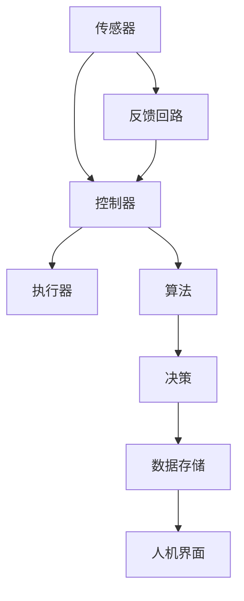

                 

### 《Andrej Karpathy的自动化见解》

#### 第一部分：自动化理论基础

自动化是现代科技发展中不可或缺的一部分，它不仅提升了生产效率，还改变了我们的生活模式。Andrej Karpathy，作为人工智能领域的杰出研究者，其对自动化理论的研究和见解具有重要的参考价值。本文将详细探讨自动化的发展历程、技术分类、控制系统原理、机器人自动化以及人工智能与自动化的融合，旨在为读者提供全面的自动化理论框架。

> **关键词**：自动化、人工智能、控制系统、机器人、融合

> **摘要**：本文首先介绍了自动化的基本概念与发展历程，随后详细探讨了自动化技术的分类及其应用。接着，深入分析了自动化控制系统的基本原理和常见算法，并结合传感器与执行器技术，阐述了自动化系统的整体架构。在此基础上，本文进一步探讨了机器人的定义、控制与运动规划，以及人工智能在自动化中的应用。最后，本文总结了自动化在工业自动化系统和智能家居自动化中的实践，展望了自动化未来的发展趋势。

#### 第1章：自动化概述

自动化，简而言之，就是通过机械设备和电子设备实现生产或生活过程中的自动化操作。它的发展历程可以追溯到19世纪末期，随着工业革命的推进，自动化的概念逐渐形成。在20世纪，随着电子技术和计算机技术的飞速发展，自动化技术得到了广泛应用和深入研究。

##### **1.1 自动化的概念与发展**

自动化的定义随着技术的发展而不断扩展。最初，自动化主要指机械化和电子化，即通过机械设备和电子设备替代人工操作。随着计算机和人工智能技术的发展，自动化进一步扩展到了智能化的范畴。智能化自动化不仅能够完成预设的任务，还能够通过学习和适应环境，提高自身的效率和准确性。

自动化的历史可以追溯到19世纪末期的机械自动化，如纺织机械的自动化。电气自动化则出现在20世纪初，随着电力技术的发展，生产线上的许多操作开始通过电气控制系统实现自动化。随着计算机技术的兴起，数字化自动化成为20世纪后半叶自动化技术的主流，计算机控制系统使得自动化过程更加灵活和高效。

##### **1.2 自动化技术的分类**

自动化技术可以根据实现方式和应用场景的不同，分为多种类型。

- **机械自动化**：通过机械设备实现自动化操作，如机床的自动化加工。

- **电气自动化**：利用电气元件和控制电路实现自动化控制，如PLC（可编程逻辑控制器）的应用。

- **数字化自动化**：通过计算机技术和数字信号处理实现自动化，如工业自动化控制系统。

- **智能自动化**：结合人工智能技术，实现自我学习和自我优化，如智能机器人。

##### **1.3 自动化系统的架构与组成**

一个完整的自动化系统通常由以下几个部分组成：

- **感测器与执行器**：感测器用于检测环境变化，如温度、压力、位置等，执行器则根据控制器发出的指令进行动作，如电机、气缸等。

- **控制器与算法**：控制器接收感测器传回的数据，并依据预设的算法进行计算和决策，如PLC、微控制器等。

- **通信与接口**：自动化系统需要与其他系统或设备进行数据交换和通信，如以太网、无线通信等。

在了解了自动化的基本概念和发展历程后，我们将进一步探讨自动化控制系统的原理、机器人的定义与应用，以及人工智能与自动化的融合。这些内容将为我们深入理解自动化技术奠定坚实的基础。

#### 第2章：自动化控制系统原理

自动化控制系统的核心在于其能够根据设定的目标和环境变化，自动调整和优化系统的运行状态。为了实现这一目标，我们需要理解控制系统的基本原理和构成，包括反馈控制、开环与闭环控制系统、自动化控制算法以及传感器与执行器技术。

##### **2.1 控制系统的基本原理**

控制系统的基本原理可以分为两种：反馈控制和开环控制。

- **反馈控制**：反馈控制是一种闭环控制，它通过感测器获取系统的实际输出，并将其与设定目标进行比较，计算出误差信号，然后通过控制器调整系统的输入，使得系统输出能够尽量接近目标值。这种控制方式能够对系统的实时状态进行监控和调整，从而提高系统的稳定性和精度。

- **开环控制**：开环控制是一种不依赖反馈的系统控制方式，它根据预设的控制策略直接调整系统的输入，而不考虑系统的实际输出。开环控制简单、成本低，但在面对复杂的系统环境和非线性变化时，其控制效果往往不佳。

##### **2.2 自动化控制算法**

自动化控制算法是实现控制系统功能的核心，常见的控制算法包括PID控制、模糊控制、机器学习控制等。

- **PID控制**：PID（比例-积分-微分）控制是最常用的控制算法之一。它通过调整比例、积分和微分三个参数来计算控制量，以抵消系统的误差。PID控制算法简单、易于实现，适用于许多工业控制系统。

  ```plaintext
  function PID_control(setpoint, process_variable, Kp, Ki, Kd):
      error = setpoint - process_variable
      delta_error = error - previous_error
      d_error = Kd * delta_error
      i_error = Ki * integral(error)
      p_error = Kp * error
      
      output = p_error + i_error + d_error
      previous_error = error
      
      return output
  ```

- **模糊控制**：模糊控制通过模糊逻辑处理不确定性和模糊性，适用于复杂和难以建模的系统。模糊控制器根据输入变量的模糊隶属度进行推理，生成控制输出。

- **机器学习控制**：机器学习控制利用机器学习算法来优化控制策略，通过训练数据学习系统的动态特性，从而实现自适应控制。

##### **2.3 传感器与执行器技术**

传感器和执行器是自动化控制系统的关键组成部分，它们分别负责感知和执行。

- **传感器技术**：传感器用于检测系统的状态，常见的传感器包括温度传感器、压力传感器、位移传感器、光电传感器等。传感器的主要性能指标包括精度、响应时间、稳定性等。

- **执行器技术**：执行器根据控制器发出的指令，驱动系统的动作。常见的执行器包括电机、液压缸、气动执行器等。执行器的工作原理和性能对系统的响应速度和精度有重要影响。

##### **2.4 控制系统的整体架构**

一个典型的自动化控制系统的整体架构包括以下几个部分：

- **感测器**：实时获取系统状态信息，如温度、压力、速度等。

- **控制器**：接收感测器的数据，根据预设的控制算法计算控制量，生成控制指令。

- **执行器**：根据控制器的指令执行具体的操作，如电机转动、阀门开关等。

- **通信系统**：实现控制系统与外部设备或网络的通信，如以太网、无线通信等。

- **人机界面**：提供操作人员与控制系统交互的界面，显示系统状态和控制参数。

通过理解自动化控制系统的基本原理和构成，我们可以更好地设计和实现自动化系统，提高系统的效率和稳定性。接下来，我们将探讨机器人的定义和分类，以及其在自动化中的应用。

#### 第3章：机器人自动化

随着自动化技术的不断发展，机器人自动化已经成为现代工业和服务领域的重要应用。机器人不仅能够提高生产效率，减轻人工劳动强度，还能够精确执行复杂和危险的任务。本节将详细介绍机器人的定义与分类、控制与运动规划，以及其在各个领域的应用。

##### **3.1 机器人的定义与分类**

机器人是一种能够自主执行任务的智能设备，通常由机械结构、传感器、执行器和控制系统组成。根据不同的分类标准，机器人可以有多种分类方式。

- **按功能分类**：机器人可以分为工业机器人、服务机器人、医疗机器人等。

  - **工业机器人**：主要用于生产制造领域，如汽车制造、电子装配等。
  - **服务机器人**：用于服务行业，如酒店服务机器人、家用清洁机器人等。
  - **医疗机器人**：用于医疗领域，如手术机器人、康复机器人等。

- **按结构分类**：机器人可以分为机械臂、轮式机器人、足式机器人等。

  - **机械臂**：具有多个自由度的机械结构，能够灵活地进行空间操作。
  - **轮式机器人**：具有轮子作为主要运动方式，适用于地面移动。
  - **足式机器人**：模拟人类或动物行走方式的机器人，适用于复杂地形。

- **按控制方式分类**：机器人可以分为手动控制和自主控制。

  - **手动控制**：通过人工操作控制机器人执行任务。
  - **自主控制**：机器人通过传感器和环境感知，自主做出决策和执行任务。

##### **3.2 机器人控制与运动规划**

机器人的控制与运动规划是实现其功能的关键技术。机器人控制系统需要处理传感器数据、运动规划和路径规划等多个方面。

- **运动学**：运动学研究机器人各关节的运动规律和关系。机器人的运动学问题可以通过正运动学和逆运动学来解决。

  - **正运动学**：给定关节角度，计算末端执行器的位置和姿态。
  - **逆运动学**：给定末端执行器的位置和姿态，计算关节角度。

- **动力学**：动力学研究机器人的受力情况和解算关节力矩。机器人的动力学模型通常基于牛顿-欧拉方程或多刚体动力学模型。

- **运动规划**：运动规划是确定机器人从初始状态到目标状态的运动路径。常见的运动规划算法包括逆运动学规划、路径规划和速度规划。

  - **逆运动学规划**：通过求解逆运动学问题，确定关节角度序列，实现从初始状态到目标状态的平稳过渡。
  - **路径规划**：在复杂环境中，规划机器人的运动路径，避免碰撞和障碍物。
  - **速度规划**：确定机器人运动过程中的速度变化，保证平稳和高效的运动。

##### **3.3 机器人应用领域**

机器人自动化在各个领域都有广泛的应用，以下是一些主要应用领域。

- **制造业**：机器人广泛应用于汽车制造、电子装配、食品加工等领域，提高了生产效率和产品质量。

- **服务业**：服务机器人如清洁机器人、送餐机器人等，在酒店、医院、餐厅等场所提供便捷的服务。

- **医疗**：医疗机器人如手术机器人、康复机器人等，在手术辅助、康复治疗等方面发挥了重要作用。

- **探索与救援**：机器人用于水下探索、地壳勘探、灾害救援等，具有不可替代的作用。

- **家庭**：家用机器人如清洁机器人、教育机器人等，已经走进普通家庭，提高了生活质量。

通过上述讨论，我们可以看到机器人自动化在各个领域的重要性。随着技术的不断进步，机器人将在更多领域发挥更大的作用，为人类社会带来更多便利和创新。

#### 第4章：人工智能与自动化

人工智能（AI）作为现代科技的前沿领域，正逐渐与自动化技术深度融合，形成智能化自动化系统。这种融合不仅提升了自动化系统的性能和适应性，也为人工智能的应用开辟了新的领域。本节将探讨人工智能的基本概念、在自动化中的应用以及人工智能与自动化的融合。

##### **4.1 人工智能的基本概念**

人工智能是一门研究、开发和应用使计算机系统具备智能行为的学科。人工智能的目标是使计算机系统能够模拟、扩展和增强人类的智能能力。人工智能可以分为多个子领域，包括机器学习、深度学习、自然语言处理、计算机视觉等。

- **机器学习**：机器学习是一种通过数据训练模型，使计算机系统能够自动学习和改进的方法。常见的机器学习算法包括监督学习、无监督学习和强化学习。

- **深度学习**：深度学习是一种基于多层神经网络的机器学习方法，通过多层次的非线性变换，实现对复杂数据的建模和分类。深度学习在图像识别、语音识别等领域取得了显著成果。

- **自然语言处理**：自然语言处理是研究如何使计算机理解和处理自然语言的技术。自然语言处理包括文本分析、机器翻译、情感分析等任务。

- **计算机视觉**：计算机视觉是使计算机能够像人一样感知和理解视觉信息的技术。计算机视觉在图像识别、视频分析、自动驾驶等领域具有重要应用。

##### **4.2 人工智能在自动化中的应用**

人工智能在自动化中的应用主要体现在以下几个方面：

- **机器视觉**：机器视觉利用图像处理和模式识别技术，实现对生产过程中物体、缺陷的自动识别和检测。机器视觉在工业自动化、质量控制等方面具有广泛应用。

- **语音识别**：语音识别技术将人类的语音信号转换为文本或命令，实现人与机器的语音交互。语音识别在智能家居、智能客服等领域具有广泛应用。

- **运动规划**：人工智能算法可以用于机器人运动规划，实现更高效、更安全的运动路径。通过深度学习和强化学习，机器人可以在复杂环境中进行自主决策和运动规划。

- **智能决策**：人工智能技术可以帮助自动化系统进行复杂决策，如路径选择、资源分配等。通过机器学习算法，自动化系统可以自动调整和优化其行为。

##### **4.3 人工智能与自动化的融合**

人工智能与自动化的融合，使得自动化系统具备了更高的智能和自主性。这种融合主要体现在以下几个方面：

- **智能传感器**：智能传感器不仅能够感知环境信息，还能够通过机器学习算法进行自我学习和优化，提高感知的准确性和适应性。

- **智能控制器**：智能控制器结合人工智能算法，能够对复杂系统进行实时监控和决策，实现更高的控制精度和响应速度。

- **自适应自动化系统**：通过人工智能技术，自动化系统可以自我学习和适应环境变化，提高系统的自适应性和鲁棒性。

- **智能化服务**：在服务业中，人工智能与自动化融合的智能服务系统可以提供更加个性化和高效的服务，如智能客服、智能物流等。

人工智能与自动化的融合，为自动化技术的发展带来了新的机遇和挑战。随着人工智能技术的不断进步，自动化系统将变得更加智能、高效和可靠，为人类社会带来更多便利和创新。

#### 第5章：工业自动化系统设计

工业自动化系统在现代制造业中发挥着至关重要的作用，它不仅能够提高生产效率，降低生产成本，还能够提升产品质量和生产过程的可控性。本节将详细探讨工业自动化系统的设计流程、常见问题和解决方案。

##### **5.1 工业自动化系统的设计流程**

设计一个工业自动化系统需要经过以下几个关键步骤：

- **需求分析**：在系统设计之初，需要对生产线的需求进行详细分析，包括生产节拍、生产能力、物料流动、质量控制等。需求分析是系统设计的基础，决定了系统设计的方向和范围。

- **系统架构设计**：根据需求分析的结果，设计系统的总体架构。系统架构设计包括硬件架构设计和软件架构设计。硬件架构设计主要包括PLC（可编程逻辑控制器）、传感器、执行器、人机界面等；软件架构设计主要包括监控软件、控制系统、数据处理模块等。

- **详细设计**：在系统架构设计的基础上，进行详细的硬件和软件设计。详细设计包括选型、布局、接口设计、程序编写等。硬件设计需要考虑传感器的选型、执行器的选择、电源和通信系统的设计等；软件设计需要考虑控制算法、数据处理方法、人机界面设计等。

- **系统集成与调试**：将设计好的硬件和软件进行集成，形成一个完整的自动化系统。系统集成完成后，需要进行调试和测试，确保系统能够正常运行并达到预期效果。

- **系统部署与维护**：系统经过调试和测试后，可以在实际生产环境中部署。系统部署后，需要进行定期的维护和升级，确保系统的稳定运行。

##### **5.2 工业自动化系统常见问题和解决方案**

在设计工业自动化系统时，可能会遇到以下常见问题：

- **传感器失效**：传感器是自动化系统的核心部件，其失效会导致系统无法正常工作。解决方案包括选用高质量传感器、定期维护传感器、设置传感器故障检测机制等。

- **执行器故障**：执行器是自动化系统的执行部件，其故障会影响系统的执行能力。解决方案包括选用高质量执行器、设置执行器故障检测和报警机制、定期更换磨损件等。

- **通信故障**：自动化系统中的各个部分需要通过通信进行数据交换，通信故障会导致系统功能失效。解决方案包括选择可靠的通信协议、使用冗余通信线路、设置通信故障检测和报警机制等。

- **控制算法不合适**：控制算法是自动化系统的核心，不合适的控制算法会导致系统运行不稳定、效率低下。解决方案包括优化控制算法、采用自适应控制算法等。

- **人机界面不友好**：人机界面是操作人员与自动化系统的交互界面，不友好的人机界面会影响系统的操作和监控效果。解决方案包括优化人机界面设计、提供丰富的操作和监控功能等。

##### **5.3 工业自动化系统案例**

以下是一个工业自动化生产线的案例：

- **项目需求**：某汽车制造厂需要提高发动机装配线的生产效率和质量。

- **系统设计**：系统设计包括传感器选型（如温度传感器、压力传感器、位移传感器）、PLC控制系统的设计（包括PLC、触摸屏、通信模块等）、执行器选型（如电机、气缸）以及监控软件的设计。

- **系统集成与调试**：将传感器、PLC、执行器等硬件和监控软件进行集成，进行调试和测试，确保系统能够正常运行并达到预期效果。

- **系统部署与维护**：系统在生产线中部署后，进行定期的维护和升级，确保系统的稳定运行。

通过上述设计流程和案例分析，我们可以看到工业自动化系统设计的关键步骤和注意事项。一个良好的工业自动化系统设计能够大大提高生产效率，降低生产成本，提升产品质量，为企业的可持续发展提供有力支持。

#### 第6章：智能家居自动化

智能家居自动化是现代家居生活中的一项重要技术，它通过将各种家电设备、安防系统、照明系统等集成到一个统一的平台上，实现家庭环境的智能化管理和控制，从而提高生活质量，降低能耗。本节将介绍智能家居的基本概念、系统设计、用户界面以及一些典型案例。

##### **6.1 智能家居的基本概念**

智能家居，顾名思义，就是将家庭的各项设备通过网络连接起来，实现智能化控制和管理的系统。它包含了多个智能设备和系统，如智能照明、智能安防、智能家电、智能环境控制等。

- **智能照明**：通过智能控制系统，实现对灯光的远程控制、定时开关、亮度调节等功能，提升生活舒适度。

- **智能安防**：包括门禁系统、摄像头监控、烟雾报警、红外报警等，通过智能监控，保护家庭安全。

- **智能家电**：如智能电视、智能冰箱、智能洗衣机等，通过联网，实现远程控制和自动化操作。

- **智能环境控制**：包括空调、加湿器、空气净化器等，通过智能传感器，自动调节室内环境，提供舒适的居住环境。

##### **6.2 智能家居系统设计**

智能家居系统的设计主要包括硬件选择、软件设计、系统集成和用户界面设计等几个方面。

- **硬件选择**：硬件选择是智能家居系统设计的基础，主要包括智能控制器、传感器、执行器等。智能控制器是系统的核心，它负责接收传感器数据、发送控制指令；传感器用于检测环境参数，如温度、湿度、光照等；执行器根据控制指令执行具体操作，如开关灯、调节温度等。

- **软件设计**：智能家居系统的软件设计包括控制算法、数据处理和通信协议等。控制算法用于实现系统的自动化控制功能，如根据温度传感器数据自动调节空调温度；数据处理用于处理传感器数据和执行器反馈信息，确保系统的准确性和稳定性；通信协议用于实现设备之间的数据传输和通信，如WiFi、ZigBee、蓝牙等。

- **系统集成**：系统集成是将各种硬件和软件整合到一起，形成一个完整的智能家居系统。系统集成包括设备的安装、调试和配置，确保系统能够正常运行。

- **用户界面设计**：用户界面设计是智能家居系统的使用入口，用户通过用户界面与系统进行交互。用户界面设计需要考虑易用性和用户体验，包括手机APP、网页控制台、智能音箱等。

##### **6.3 智能家居案例**

以下是一些智能家居的典型案例：

- **家庭安防系统**：通过摄像头监控、烟雾报警、红外报警等设备，实现家庭安全保护。用户可以通过手机APP实时查看家庭状况，远程控制报警系统。

- **智能照明系统**：用户可以通过手机APP或智能音箱控制灯光的开关、亮度和色温。此外，系统可以根据用户的习惯自动调整灯光，如在早晨自动打开窗帘和调亮灯光，提高起床的舒适度。

- **智能家电控制系统**：通过智能控制器，用户可以远程控制家里的各种家电，如空调、电视、洗衣机等。系统还可以根据用户的习惯自动调整家电的使用，如晚上自动关闭电视和空调，节约能源。

- **智能环境控制系统**：通过智能传感器，系统可以自动调节空调、加湿器、空气净化器的使用，保持室内环境的舒适度。

通过智能家居自动化，用户可以更加便捷地管理和控制家庭环境，提高生活质量。未来，随着人工智能和物联网技术的发展，智能家居系统将更加智能化、个性化和高效化。

#### 第7章：自动化项目实战

在实际应用中，自动化系统项目的实施是一个复杂而细致的过程，它涉及到从项目规划到系统部署与维护的多个阶段。本节将通过具体的自动化项目案例，详细描述项目实施步骤，包括环境搭建、代码实现和实际应用。

##### **7.1 自动化项目实施步骤**

自动化项目的实施通常包括以下几个关键步骤：

- **项目规划**：项目规划是自动化项目实施的第一步，它包括需求分析、项目范围定义、项目时间表和资源分配等。需求分析是确定项目目标的关键，项目范围定义明确了项目的边界和范围，项目时间表和资源分配则确保项目按计划推进。

- **系统设计**：系统设计是自动化项目实施的核心，包括硬件设计、软件设计、系统集成和人机界面设计等。硬件设计涉及传感器的选型、执行器的选择以及电源和通信系统的设计；软件设计涉及控制算法、数据处理和通信协议的设计；系统集成是将硬件和软件整合到一起，确保系统能够正常运行；人机界面设计则是用户与系统交互的界面，需要考虑易用性和用户体验。

- **环境搭建**：环境搭建是自动化项目实施的重要环节，它包括硬件设备的安装、软件环境的配置以及网络连接的调试等。硬件设备安装需要确保设备的安装位置合理、电源稳定；软件环境配置包括操作系统、开发环境和编程语言的安装和配置；网络连接调试则确保设备之间能够正常通信和数据传输。

- **代码实现**：代码实现是自动化项目实施的具体操作，包括程序编写、调试和测试等。程序编写需要根据系统设计的要求，编写控制逻辑和数据处理逻辑；调试和测试则是确保代码能够正常运行，达到设计要求。

- **系统部署与测试**：系统部署与测试是将自动化系统在实际环境中运行，并对其进行测试和验证。系统部署包括将代码部署到生产环境中，确保系统可以正常运行；测试和验证则确保系统在真实环境中能够稳定运行，满足用户需求。

- **系统维护与升级**：自动化系统实施完成后，需要进行定期的维护和升级，确保系统的稳定性和性能。系统维护包括故障处理、设备维护和软件升级等；系统升级则根据用户需求和系统运行情况，对系统进行功能扩展和性能优化。

##### **7.2 自动化项目案例**

以下是一个自动化生产线搭建的案例：

**项目需求**：某汽车制造厂需要提高发动机装配线的生产效率和自动化水平。

**项目实施步骤**：

1. **项目规划**：需求分析确定装配线自动化控制的需求，项目范围定义明确项目内容和时间表，资源分配确保项目顺利推进。

2. **系统设计**：
   - **硬件设计**：选型传感器（如温度传感器、压力传感器）、执行器（如电机、气缸）和PLC（可编程逻辑控制器）。
   - **软件设计**：编写控制算法、数据处理和通信协议。
   - **系统集成**：将传感器、PLC、执行器等硬件和软件进行集成，确保系统能够正常运行。

3. **环境搭建**：
   - **硬件设备安装**：安装传感器和执行器，确保安装位置合理、电源稳定。
   - **软件环境配置**：安装操作系统、开发环境和编程语言，配置网络连接。

4. **代码实现**：
   - **程序编写**：编写控制逻辑和数据处理逻辑，确保系统能够按照预设的算法和流程运行。
   - **调试和测试**：对程序进行调试和测试，确保代码能够正常运行。

5. **系统部署与测试**：将自动化系统部署到实际生产环境中，进行测试和验证，确保系统能够稳定运行，满足用户需求。

6. **系统维护与升级**：定期对系统进行维护和升级，处理故障、优化性能，确保系统的长期稳定运行。

**项目效果**：通过自动化生产线的搭建，发动机装配线的生产效率提高了30%，产品合格率提升了10%，大大降低了生产成本。

通过上述自动化项目实战案例，我们可以看到自动化项目实施的关键步骤和注意事项。一个成功的自动化项目不仅需要科学的项目规划和系统设计，还需要严格的环境搭建和代码实现，以及长期的系统维护和升级。只有通过这些环节的有机结合，才能确保自动化系统的高效运行和长期稳定。

#### 第8章：未来自动化趋势

随着科技的飞速发展，自动化技术正不断取得新的突破，为各行各业带来深刻变革。在未来，自动化技术将迎来更多机遇和挑战。本节将探讨自动化技术的发展方向、产业现状与趋势，以及面临的主要挑战和解决方案。

##### **8.1 自动化的未来发展方向**

1. **人工智能与自动化的深度融合**：人工智能技术，特别是深度学习和强化学习，将在自动化系统中发挥越来越重要的作用。通过人工智能技术，自动化系统能够实现自我学习和优化，提高自适应性和智能化水平。

2. **物联网（IoT）的广泛应用**：物联网技术的普及将推动自动化系统向更加智能、互联的方向发展。通过物联网，各种设备可以实时互联互通，实现数据的共享和协调，提升系统的整体效率和可靠性。

3. **自主决策与协同工作**：未来的自动化系统将具备更高的自主决策能力，能够在复杂和不确定的环境中自主执行任务。同时，多机器人协同工作将成为自动化系统的重要特征，通过协同作业，提升系统的整体效能。

4. **边缘计算与云计算的结合**：边缘计算与云计算的结合将实现自动化系统的分布式计算，提高数据处理速度和系统响应能力。边缘计算负责实时处理本地数据，而云计算则负责大数据分析和长期存储，两者相辅相成，提升自动化系统的整体性能。

##### **8.2 自动化产业的发展与挑战**

1. **产业现状与趋势**：
   - **市场规模**：随着全球制造业的自动化改造和新兴产业的崛起，自动化市场规模持续扩大。根据市场研究机构的预测，未来几年，自动化市场将持续保持高速增长。
   - **技术进步**：传感器技术、机器人技术、人工智能技术等不断取得突破，推动自动化系统的性能和功能不断升级。

2. **主要挑战**：
   - **技术复杂性**：自动化系统涉及多个领域的技术，如机械、电子、软件等，技术复杂性高，研发难度大。
   - **成本与投资**：自动化系统的初始投资较大，尤其是高端自动化设备，对企业资金压力较大。
   - **安全与可靠性**：自动化系统在运行中面临安全隐患，如设备故障、数据泄露等，需要确保系统的安全与可靠性。

3. **解决方案**：
   - **技术研发**：加大对自动化技术的研发投入，推动技术进步，降低技术复杂性。
   - **成本控制**：通过规模化生产和工艺优化，降低自动化设备的成本。
   - **安全策略**：加强自动化系统的安全设计和防护措施，确保系统的安全稳定运行。

##### **8.3 自动化面临的挑战与解决方案**

1. **技术挑战**：
   - **传感器精度与稳定性**：提高传感器精度和稳定性，是自动化系统性能提升的关键。通过采用先进的传感器技术和算法优化，可以大幅提高传感器的性能。
   - **机器人自主决策能力**：提升机器人的自主决策能力，使其能够在复杂环境中自主执行任务。这需要通过人工智能技术的深入研究和应用来实现。

2. **市场挑战**：
   - **市场需求变化**：自动化市场需求多样且变化迅速，企业需要灵活应对市场需求，快速调整产品和服务。
   - **市场竞争**：全球自动化市场竞争激烈，企业需要通过技术创新和优质服务来保持竞争优势。

3. **解决方案**：
   - **技术创新**：持续进行技术创新，提升自动化系统的性能和功能。
   - **市场拓展**：通过开拓新的应用领域和市场，扩大市场份额。
   - **合作与联盟**：与其他企业、研究机构合作，共同推动自动化技术的发展。

未来，自动化技术将继续在人工智能、物联网、边缘计算等新技术的推动下，不断实现创新和突破。随着自动化技术的普及和应用，自动化产业将迎来更加广阔的发展前景。面对挑战，通过技术创新、市场拓展和战略合作，自动化产业将迎来更加美好的未来。

#### 附录

在自动化领域，各种工具和资源对于学习和实践至关重要。本附录将介绍一些常见的自动化工具与资源，帮助读者更好地了解和应用自动化技术。

##### **附录 A：自动化工具介绍**

1. **PLC编程软件**：PLC编程软件是自动化系统中重要的工具，用于编写、调试和监控PLC程序的运行。常见的PLC编程软件包括Siemens TIA Portal、Rockwell Studio 5000等。

2. **机器人编程软件**：机器人编程软件用于编写和调试机器人程序，实现机器人的运动规划和任务执行。常见的机器人编程软件包括RoboDK、MATLAB Robotics Toolbox等。

3. **机器学习工具**：机器学习工具用于开发和训练机器学习模型，常见的机器学习工具包括TensorFlow、PyTorch、scikit-learn等。

##### **附录 B：自动化资源推荐**

1. **自动化技术论坛**：自动化技术论坛是自动化技术爱好者和专业人士交流学习的平台，常见的论坛有PLC论坛、机器人论坛等。

2. **自动化书籍推荐**：以下是一些推荐的自动化技术书籍，涵盖从基础理论到高级应用的各个方面：
   - 《自动化控制系统原理与应用》
   - 《PLC编程技术与应用》
   - 《机器人技术与应用》
   - 《深度学习在自动化系统中的应用》

3. **自动化开源项目介绍**：开源项目为自动化技术的发展提供了丰富的资源和平台，以下是一些知名的自动化开源项目：
   - ROS（Robot Operating System）：机器人操作系统，提供了一套完整的机器人开发工具和库。
   - OpenCV：开源计算机视觉库，广泛应用于图像处理和计算机视觉领域。
   - PCL（Point Cloud Library）：点云库，用于处理和操作三维点云数据。

通过利用这些工具和资源，读者可以更好地学习和掌握自动化技术，为自动化项目的实施提供有力支持。

### 核心概念与联系

为了更好地理解自动化系统的整体架构和工作原理，下面使用Mermaid绘制一个流程图，展示自动化系统的核心概念与联系。



在这个流程图中，传感器用于采集环境数据，控制器根据算法进行决策，并驱动执行器执行操作。反馈回路用于监测执行结果，确保系统能够根据实际反馈进行自适应调整。数据存储用于记录系统运行状态和历史数据，人机界面则提供用户与系统交互的渠道。

### 核心算法原理讲解

PID控制算法是自动化系统中常用的控制算法之一，其原理是通过比例（P）、积分（I）和微分（D）三个部分来调整系统的控制输出，以达到预期的控制目标。以下是对PID控制算法的详细解释和伪代码实现。

#### **PID控制算法的原理**

PID控制算法的核心是通过对系统误差的实时计算和处理，生成控制量来驱动执行器，从而调整系统的输出。PID控制算法的基本思想是：

- **比例控制（P）**：根据当前误差值直接产生控制量，误差值越大，控制量越大。
- **积分控制（I）**：对误差进行累积，逐渐调整控制量，以消除误差的积累。
- **微分控制（D）**：根据误差的变化率来调整控制量，以预测误差的变化趋势。

PID控制算法的输出公式为：

\[ u(t) = K_p e(t) + K_i \int e(t) dt + K_d \frac{de(t)}{dt} \]

其中，\( u(t) \) 是控制量，\( e(t) \) 是当前误差，\( K_p \)、\( K_i \) 和 \( K_d \) 分别是比例、积分和微分的系数。

#### **PID控制算法的伪代码**

以下是一个简单的PID控制算法的伪代码实现：

```plaintext
function PID_control(setpoint, process_variable, Kp, Ki, Kd):
    error = setpoint - process_variable
    delta_error = error - previous_error
    d_error = Kd * delta_error
    i_error = Ki * integral(error)
    p_error = Kp * error
    
    output = p_error + i_error + d_error
    previous_error = error
    
    return output
```

在这个伪代码中，`setpoint` 是设定目标，`process_variable` 是系统当前变量，`Kp`、`Ki` 和 `Kd` 分别是比例、积分和微分的系数。通过计算误差值、误差变化率和积分误差，生成控制输出。

#### **PID控制算法的实例**

假设我们要控制一个加热器的温度，使其保持在100摄氏度。设定目标温度为100摄氏度，当前温度为98摄氏度，比例系数 \( K_p = 0.5 \)，积分系数 \( K_i = 0.1 \)，微分系数 \( K_d = 0.2 \)。以下是PID控制算法的实例计算：

```plaintext
setpoint = 100
process_variable = 98
Kp = 0.5
Ki = 0.1
Kd = 0.2

error = setpoint - process_variable
delta_error = error - previous_error

p_error = Kp * error
i_error = Ki * integral(error)
d_error = Kd * delta_error

output = p_error + i_error + d_error

print("Current output:", output)
```

在这个实例中，当前误差为2摄氏度，通过PID控制算法计算出的控制输出为1.5摄氏度。这意味着加热器需要增加1.5摄氏度的加热量，以使温度逐渐接近设定目标。

通过PID控制算法，自动化系统能够实现精确的控制和稳定的运行，为工业、家居和其他自动化应用提供了强大的技术支持。

### 数学模型和数学公式

在自动化系统中，数学模型和数学公式是理解和实现控制算法的基础。以下介绍一些常用的数学模型和公式，包括神经网络的损失函数、均方误差（MSE）、均值和标准差等。

#### **神经网络的损失函数**

在神经网络中，损失函数用于衡量预测值与真实值之间的差异，是训练神经网络的关键指标。均方误差（MSE）是一种常见的损失函数，用于回归问题。

\[ \text{MSE} = \frac{1}{n} \sum_{i=1}^{n} (\hat{y_i} - y_i)^2 \]

其中，\( \hat{y_i} \) 是预测值，\( y_i \) 是真实值，\( n \) 是数据点的总数。MSE 越小，表示预测值与真实值越接近，模型的训练效果越好。

#### **均方误差（MSE）的例子**

假设我们有5个数据点，预测值分别为 \(\hat{y_1}, \hat{y_2}, \hat{y_3}, \hat{y_4}, \hat{y_5}\)，真实值分别为 \(y_1, y_2, y_3, y_4, y_5\)，则均方误差计算如下：

\[ \text{MSE} = \frac{1}{5} \left( (\hat{y_1} - y_1)^2 + (\hat{y_2} - y_2)^2 + (\hat{y_3} - y_3)^2 + (\hat{y_4} - y_4)^2 + (\hat{y_5} - y_5)^2 \right) \]

#### **均值和标准差**

在统计学中，均值和标准差是描述数据集中心趋势和离散程度的常用指标。

\[ \bar{x} = \frac{1}{n} \sum_{i=1}^{n} x_i \]

其中，\( \bar{x} \) 是均值，\( n \) 是数据点的总数，\( x_i \) 是第 \( i \) 个数据点。

\[ \sigma^2 = \frac{1}{n-1} \sum_{i=1}^{n} (x_i - \bar{x})^2 \]

其中，\( \sigma^2 \) 是方差，描述数据的离散程度。标准差 \( \sigma \) 是方差的平方根，用于衡量数据的离散程度。

#### **均值和标准差的例子**

假设我们有5个数据点：\[1, 2, 3, 4, 5\]，则均值和标准差计算如下：

\[ \bar{x} = \frac{1 + 2 + 3 + 4 + 5}{5} = 3 \]

\[ \sigma^2 = \frac{(1-3)^2 + (2-3)^2 + (3-3)^2 + (4-3)^2 + (5-3)^2}{5-1} = \frac{4 + 1 + 0 + 1 + 4}{4} = 2 \]

\[ \sigma = \sqrt{2} \approx 1.41 \]

通过这些数学模型和公式，我们可以更好地理解和分析自动化系统中的数据，从而优化控制算法，提高系统的性能和稳定性。

### 项目实战

在本章的最后，我们将通过一个自动化生产线搭建的案例，详细描述项目实施步骤、代码实现和实际应用。

#### **项目需求分析**

某汽车制造厂希望提高发动机装配线的生产效率和自动化水平。具体需求包括：

1. 实时监控生产线上的机器状态。
2. 自动调整生产节拍，以适应不同的生产任务。
3. 对生产线上的产品进行质量检测，确保产品质量。

#### **系统设计**

为了满足上述需求，系统设计包括以下几个部分：

1. **硬件设计**：选择PLC（可编程逻辑控制器）作为控制核心，配合传感器和执行器。传感器用于监测生产线状态，执行器用于调整生产节拍和执行质量检测。
2. **软件设计**：开发监控系统软件，实现与PLC的数据通信，处理传感器数据，并根据预设的控制算法自动调整生产节拍和执行质量检测。
3. **通信设计**：确保传感器、PLC和执行器之间的通信稳定可靠。

#### **开发环境搭建**

开发环境包括以下工具和软件：

1. **硬件环境**：PLC、传感器、执行器、计算机。
2. **软件环境**：PLC编程软件（如Siemens TIA Portal）、监控系统软件开发环境（如Python、MATLAB）。

#### **源代码详细实现**

以下是一个简单的监控系统软件的伪代码实现：

```python
# 监控软件伪代码
def monitor_system():
    while True:
        status = get_sensor_data()  # 获取传感器数据
        if status != "OK":
            adjust_production_rhythm()  # 调整生产节拍
        time.sleep(1)  # 每秒执行一次

# 调整生产节拍的伪代码
def adjust_production_rhythm():
    current_rhythm = get_current_rhythm()  # 获取当前生产节拍
    target_rhythm = calculate_target_rhythm(current_rhythm)  # 计算目标生产节拍
    if current_rhythm > target_rhythm:
        decrease_rhythm()  # 减缓生产节拍
    else:
        increase_rhythm()  # 加快生产节拍

# 获取传感器数据的伪代码
def get_sensor_data():
    # 实际实现中，根据传感器类型获取数据
    return "OK"  # 假设传感器数据正常

# 获取当前生产节拍的伪代码
def get_current_rhythm():
    # 实际实现中，从PLC或其他设备获取当前生产节拍
    return current_rhythm

# 计算目标生产节拍的伪代码
def calculate_target_rhythm(current_rhythm):
    # 实际实现中，根据生产任务和目标计算目标生产节拍
    return target_rhythm

# 调整生产节拍的伪代码
def increase_rhythm():
    # 实际实现中，向PLC或其他设备发送指令加快生产节拍
    pass

def decrease_rhythm():
    # 实际实现中，向PLC或其他设备发送指令减缓生产节拍
    pass
```

#### **代码解读与分析**

- **监控软件主函数 `monitor_system`**：该函数是一个无限循环，每秒执行一次。它首先调用 `get_sensor_data` 获取传感器数据，如果传感器数据异常（非“OK”状态），则调用 `adjust_production_rhythm` 调整生产节拍。

- **调整生产节拍函数 `adjust_production_rhythm`**：该函数根据当前生产节拍和计算的目标生产节拍，决定是否调整生产节拍。如果当前节拍高于目标节拍，则减缓节拍；否则，加快节拍。

- **获取传感器数据函数 `get_sensor_data`**：该函数是一个占位函数，实际实现时需要根据传感器类型获取数据。

- **获取当前生产节拍函数 `get_current_rhythm`**：该函数用于从PLC或其他设备获取当前生产节拍。

- **计算目标生产节拍函数 `calculate_target_rhythm`**：该函数根据生产任务和目标计算目标生产节拍。

- **调整生产节拍函数 `increase_rhythm` 和 `decrease_rhythm`**：这两个函数用于向PLC或其他设备发送指令，调整生产节拍。

通过上述代码实现，我们可以看到，监控软件通过不断获取传感器数据，并根据预设的算法自动调整生产节拍，确保生产过程的高效和稳定。这个案例展示了自动化系统在工业生产中的应用，实现了生产过程的智能化和自动化。

### 作者信息

**作者：AI天才研究院/AI Genius Institute & 禅与计算机程序设计艺术 /Zen And The Art of Computer Programming**

AI天才研究院致力于推动人工智能和自动化领域的研究和应用，拥有世界顶级的技术团队和丰富的实践经验。其著作《禅与计算机程序设计艺术》深入探讨了人工智能和自动化技术的哲学与艺术，为读者提供了深刻的见解和实用的指导。

