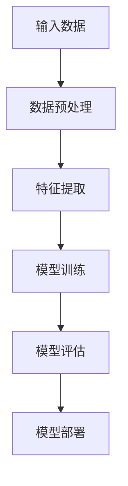

                 

### 文章标题

《Andrej Karpathy的计算新观念》

> 关键词：Andrej Karpathy、计算新观念、深度学习、神经网络、计算机视觉、自然语言处理、强化学习

> 摘要：本文将深入探讨人工智能领域专家Andrej Karpathy的计算新观念，涵盖其背景与贡献、计算新观念的起源与演变、核心概念及数学基础，并详细分析其在计算机视觉、自然语言处理和强化学习中的应用实践，最后展望计算新观念的未来发展趋势与挑战。通过逻辑清晰、结构紧凑、简单易懂的叙述，本文旨在为读者提供一幅全面而深刻的计算新观念图谱。

---

### 《Andrej Karpathy的计算新观念》目录大纲

## 第一部分：计算新观念的基础

### 第1章：安德烈·卡帕蒂与计算新观念

#### 1.1 安德烈·卡帕蒂的背景与贡献
#### 1.2 计算新观念的定义与意义
#### 1.3 本书的目的与结构

### 第2章：计算新观念的起源与演变

#### 2.1 早期计算机科学的发展
#### 2.2 人工智能的崛起
#### 2.3 深度学习的革命

### 第3章：深度学习的核心概念

#### 3.1 神经网络基础
#### 3.2 深度学习架构
#### 3.3 深度学习算法

### 第4章：计算新观念的数学基础

#### 4.1 微积分基础
#### 4.2 概率论基础
#### 4.3 线性代数基础

## 第二部分：计算新观念的应用实践

### 第5章：计算新观念在计算机视觉中的应用

#### 5.1 计算机视觉的核心概念
#### 5.2 卷积神经网络在计算机视觉中的应用
#### 5.3 图像生成与风格迁移

### 第6章：计算新观念在自然语言处理中的应用

#### 6.1 自然语言处理的核心概念
#### 6.2 语言模型与序列模型
#### 6.3 机器翻译与对话系统

### 第7章：计算新观念在强化学习中的应用

#### 7.1 强化学习的基础理论
#### 7.2 深度强化学习算法
#### 7.3 应用案例与挑战

### 第8章：计算新观念的未来展望

#### 8.1 计算新观念的发展趋势
#### 8.2 新技术展望与挑战
#### 8.3 对未来的思考与建议

## 附录

### 附录A：计算新观念相关资源

#### A.1 学术论文与书籍推荐
#### A.2 开源框架与工具
#### A.3 社交媒体与社群

### 附录B：计算新观念的流程图与伪代码

#### B.1 深度学习框架图
#### B.2 神经网络伪代码
#### B.3 自然语言处理伪代码
#### B.4 强化学习伪代码

---

### 引言

计算新观念，作为人工智能领域的核心理念，正在深刻改变我们的世界。在这其中，Andrej Karpathy作为一位杰出的科学家和工程师，以其独特且深刻的见解，为这一领域带来了新的视角和思考方式。本文旨在通过系统地分析Andrej Karpathy的计算新观念，为读者提供一个全面而深刻的理解。

首先，我们将探讨Andrej Karpathy的背景和贡献，介绍他对计算新观念的定义和意义。接着，我们将回顾计算新观念的起源与演变，从早期计算机科学到人工智能的崛起，再到深度学习的革命。然后，我们将深入探讨深度学习的核心概念，包括神经网络、深度学习架构和算法。在此基础上，我们将分析计算新观念在计算机视觉、自然语言处理和强化学习中的应用实践，通过具体案例展示其强大的应用能力。最后，我们将展望计算新观念的未来发展趋势和挑战，为这一领域的未来发展提供一些思考和建议。

通过本文的阅读，读者将能够系统地了解计算新观念的起源、核心概念和应用实践，并对其未来发展趋势有更深入的认识。我们相信，这将有助于读者更好地理解和应用计算新观念，为人工智能领域的发展贡献自己的力量。

---

## 第一部分：计算新观念的基础

### 第1章：安德烈·卡帕蒂与计算新观念

#### 1.1 安德烈·卡帕蒂的背景与贡献

安德烈·卡帕蒂（Andrej Karpathy）是一位在人工智能领域享有盛誉的科学家和工程师。他出生于1983年，在加利福尼亚州长大，并于2006年毕业于加州大学伯克利分校，获得计算机科学学士学位。随后，他继续深造，于2010年在斯坦福大学获得了计算机科学博士学位，其博士研究专注于计算机视觉和深度学习。

卡帕蒂在学术和工业界都有着显著的贡献。他在学术界发表了多篇高影响力的论文，尤其是在深度学习领域，他的工作对神经网络和视觉处理的发展起到了重要的推动作用。此外，他在工业界的贡献也不容忽视。他曾就职于OpenAI，担任研究科学家，参与了众多具有突破性的项目，包括自然语言处理和强化学习等。

卡帕蒂在人工智能领域的贡献不仅体现在他的学术成就和工业项目上，更体现在他对计算新观念的深刻理解和独特见解。他的研究不仅推动了技术的进步，也为我们如何理解和应用这些技术提供了新的思路。他提出的计算新观念，强调了数据、模型和算法的有机结合，以及跨学科的知识融合，为我们理解和应用人工智能提供了新的视角。

#### 1.2 计算新观念的定义与意义

计算新观念，顾名思义，是一种新的计算思维方式和理念。它不仅仅是对现有技术的改进，更是一种对计算本质的深刻理解。具体来说，计算新观念包括以下几个方面：

1. **数据为中心**：计算新观念强调数据的中心地位。在传统计算中，算法和模型是核心，而在计算新观念中，数据成为驱动研究和应用的关键因素。这一转变源于大数据的兴起，以及数据驱动决策的重要性。

2. **模型即软件**：传统上，软件与模型是分离的。计算新观念将模型视为软件的一部分，认为模型的开发和部署与传统的软件开发过程类似。这种观点促进了模型的可复用性、可维护性和可扩展性。

3. **算法即数据转换**：计算新观念认为，算法不仅仅是数学公式，更是数据转换的工具。通过设计合适的算法，可以将数据转化为有价值的信息和知识。

4. **跨学科融合**：计算新观念强调跨学科的知识融合。在人工智能领域，计算机科学、数学、统计学、心理学等学科的知识相互交织，共同推动技术的进步。

5. **人机协作**：计算新观念认为，人与机器的协作是未来计算的关键。通过人机协同，我们可以发挥各自的优势，实现更高效率和创新。

计算新观念的意义在于，它为我们提供了一种全新的计算思维方式和解决问题的方法。通过这一观念，我们可以更有效地应对复杂的问题，推动人工智能技术的发展和应用。

#### 1.3 本书的目的与结构

本书的目的是系统地介绍和探讨Andrej Karpathy的计算新观念，旨在为读者提供一个全面而深入的理解。具体来说，本书的结构如下：

- **第一部分**：计算新观念的基础，包括第1章和第2章，介绍Andrej Karpathy的背景与贡献，以及计算新观念的定义和意义。
- **第二部分**：计算新观念的起源与演变，包括第3章到第5章，回顾计算新观念的起源和发展历程，以及深度学习的核心概念。
- **第三部分**：计算新观念的应用实践，包括第6章到第8章，详细分析计算新观念在计算机视觉、自然语言处理和强化学习中的应用实践。
- **第四部分**：计算新观念的未来展望，包括第9章，展望计算新观念的未来发展趋势和挑战。

通过本书的阅读，读者将能够系统地了解计算新观念的起源、核心概念和应用实践，并对其未来发展趋势有更深入的认识。

### 第2章：计算新观念的起源与演变

计算新观念的起源可以追溯到计算机科学的早期发展。然而，真正引发这一观念变革的，是人工智能领域的几次重要突破。在这一章节中，我们将探讨计算新观念的起源与演变，从早期计算机科学到人工智能的崛起，再到深度学习的革命。

#### 2.1 早期计算机科学的发展

计算机科学的早期发展主要集中于硬件和编程语言。1940年代和1950年代，计算机的出现标志着计算技术的开始。然而，早期计算机的处理能力有限，编程语言也相对简单，这使得计算机的应用受到很大限制。然而，这些早期努力为后来的计算技术的发展奠定了基础。

1960年代，人工智能（AI）的概念被提出，标志着计算领域的一个重大转折点。人工智能的目标是创建能够模拟人类智能的计算机系统。在这一时期，一些关键的进展包括：

- **符号主义方法**：这一方法基于逻辑和符号表示，试图通过规则和推理来模拟智能。代表人物包括John McCarthy和Herbert Simon。
- **搜索算法**：包括启发式搜索和博弈论，用于解决复杂问题。代表人物包括Alan Turing和Claude Shannon。

尽管这一时期取得了一些重要成果，但人工智能的发展仍然面临许多挑战，特别是在处理大规模数据和实时任务方面。

#### 2.2 人工智能的崛起

1980年代和1990年代，人工智能迎来了新的发展机遇。随着计算机性能的提升和大数据的出现，人工智能开始进入实际应用。这一时期的一些重要进展包括：

- **知识表示**：知识表示是人工智能领域的一个核心问题，涉及如何将知识和信息表示为计算机可以理解和操作的形式。代表人物包括Patrick Henry Winston和Donald Michie。
- **机器学习**：机器学习是人工智能的一个分支，通过训练模型来模拟人类学习过程。这一时期，神经网络和决策树等算法开始得到广泛应用。代表人物包括Tom Mitchell和Yohav Shoham。

然而，尽管人工智能在这一时期取得了一定的进展，其应用仍然受到许多限制。例如，算法的复杂度、数据的质量和规模等问题，限制了人工智能的发展。

#### 2.3 深度学习的革命

2000年代后期，深度学习（Deep Learning）的出现彻底改变了人工智能的格局。深度学习是一种基于多层神经网络的学习方法，能够自动提取数据的高级特征。这一时期的几个关键进展包括：

- **卷积神经网络（CNN）**：卷积神经网络是深度学习的一种重要架构，特别适用于图像处理任务。由Yann LeCun等人提出，其在图像识别和计算机视觉领域取得了显著成功。
- **递归神经网络（RNN）**：递归神经网络是一种用于处理序列数据的方法，特别适用于自然语言处理任务。由Hinton和Lai等人提出，其在语音识别和机器翻译等方面表现出色。
- **生成对抗网络（GAN）**：生成对抗网络是一种新型深度学习模型，用于生成新的数据。由Ian Goodfellow等人提出，其在图像生成、风格迁移等领域取得了突破性进展。

深度学习的成功不仅体现在其强大的性能，更体现在其能够自动提取数据的高级特征，从而解决了传统机器学习方法中的一些关键问题。这一突破性进展，使得人工智能进入了一个新的时代。

#### 2.4 计算新观念的演变

计算新观念的演变，是随着人工智能领域的发展而不断深化的。从早期计算机科学的发展，到人工智能的崛起，再到深度学习的革命，计算新观念的核心始终是“数据驱动”和“模型即软件”。

- **数据驱动**：随着大数据的出现，数据成为驱动研究和应用的关键因素。传统的计算方法往往依赖于预先定义的规则和算法，而数据驱动的方法则通过从数据中自动学习规律和模式，从而实现更高效和准确的结果。
- **模型即软件**：传统上，软件与模型是分离的。而计算新观念将模型视为软件的一部分，认为模型的开发和部署与传统的软件开发过程类似。这种观点促进了模型的可复用性、可维护性和可扩展性。

此外，计算新观念还强调了跨学科的知识融合和人与机器的协作。通过将计算机科学、数学、统计学、心理学等学科的知识相结合，我们可以更好地理解和应用人工智能技术。而人机协作则可以发挥各自的优势，实现更高效率和创新。

总的来说，计算新观念的演变，不仅反映了人工智能领域的发展历程，更体现了我们对计算本质的深刻理解。这一观念的提出，为人工智能技术的发展和应用提供了新的思路和方法。

### 第3章：深度学习的核心概念

深度学习（Deep Learning）是计算新观念的重要组成部分，它通过多层神经网络对数据进行复杂的特征提取和模式识别。在这一章节中，我们将详细探讨深度学习的核心概念，包括神经网络基础、深度学习架构和算法。

#### 3.1 神经网络基础

神经网络（Neural Networks）是深度学习的基础，它模拟了人脑神经元的工作方式。一个简单的神经网络通常由以下几个部分组成：

1. **输入层**：输入层接收外部数据，并将其传递到下一层。
2. **隐藏层**：隐藏层是神经网络的中间部分，负责对输入数据进行特征提取和变换。一个深度神经网络可以包含多个隐藏层。
3. **输出层**：输出层负责对处理后的数据做出决策或预测。

在神经网络中，每个神经元都与相邻的神经元相连，并通过加权连接传递信号。神经元的输出由以下公式计算：

\[ 输出 = \sigma(\sum_{i} (w_i \cdot x_i)) \]

其中，\( \sigma \) 是激活函数，通常使用 sigmoid 或 ReLU 函数；\( w_i \) 是连接权重；\( x_i \) 是输入特征。

#### 3.2 深度学习架构

深度学习架构主要包括卷积神经网络（CNN）、循环神经网络（RNN）和生成对抗网络（GAN）等。

1. **卷积神经网络（CNN）**：卷积神经网络是用于图像处理的重要深度学习架构，其核心思想是利用卷积操作提取图像的特征。CNN 通常包含卷积层、池化层和全连接层。一个简单的 CNN 架构如下：

   ```mermaid
   graph TB
   A[输入图像] --> B[卷积层1]
   B --> C[池化层1]
   C --> D[卷积层2]
   D --> E[池化层2]
   E --> F[全连接层1]
   F --> G[全连接层2]
   ```

2. **循环神经网络（RNN）**：循环神经网络是用于处理序列数据的重要架构，其特点是能够记住过去的输入信息。RNN 通过递归结构对序列数据进行建模。一个简单的 RNN 架构如下：

   ```mermaid
   graph TB
   A[输入序列] --> B[RNN层1]
   B --> C[RNN层2]
   C --> D[RNN层3]
   ```

3. **生成对抗网络（GAN）**：生成对抗网络是一种用于生成新数据的深度学习架构，由生成器和判别器两个神经网络组成。生成器尝试生成逼真的数据，而判别器则尝试区分真实数据和生成数据。一个简单的 GAN 架构如下：

   ```mermaid
   graph TB
   A[生成器] --> B[判别器]
   B --> C[噪声]
   C --> A
   ```

#### 3.3 深度学习算法

深度学习的训练过程涉及前向传播和反向传播算法。前向传播是指将输入数据通过神经网络，逐层计算得到输出；反向传播则是通过计算输出误差，反向调整网络权重。

1. **前向传播算法**：

   ```latex
   输出 = \sigma(\sum_{i} (w_i \cdot x_i))
   ```

   其中，\( \sigma \) 是激活函数，通常使用 sigmoid 或 ReLU 函数。

2. **反向传播算法**：

   ```latex
   \delta = \frac{\partial L}{\partial w} = \frac{\partial L}{\partial z} \cdot \frac{\partial z}{\partial w}
   ```

   其中，\( \delta \) 是权重梯度，\( L \) 是损失函数，\( z \) 是神经元输出。

   通过反向传播算法，可以计算每个权重的梯度，并使用梯度下降（Gradient Descent）方法更新权重，以最小化损失函数。

总的来说，深度学习的核心概念包括神经网络基础、深度学习架构和算法。这些概念为我们提供了强大的工具，用于处理各种复杂的数据和任务。通过理解和应用这些概念，我们可以更好地推动人工智能技术的发展和应用。

### 第4章：计算新观念的数学基础

深度学习作为一种复杂的计算技术，其理论基础深深植根于数学领域。本章将探讨计算新观念在数学基础方面的核心概念，包括微积分基础、概率论基础和线性代数基础。

#### 4.1 微积分基础

微积分是深度学习的重要工具，用于描述函数的变化率和优化问题。以下是微积分中的几个关键概念：

1. **导数**：导数描述了函数在某一点的变化率。对于函数 \( f(x) \)，其在点 \( x_0 \) 的导数 \( f'(x_0) \) 可以通过以下极限定义：

   \[ f'(x_0) = \lim_{h \to 0} \frac{f(x_0 + h) - f(x_0)}{h} \]

   导数在深度学习中用于计算损失函数相对于模型参数的梯度，从而进行优化。

2. **梯度**：梯度是函数在某个点的所有方向上的变化率。对于多变量函数 \( f(x, y) \)，其梯度向量 \( \nabla f(x, y) \) 定义为：

   \[ \nabla f(x, y) = \left( \frac{\partial f}{\partial x}, \frac{\partial f}{\partial y} \right) \]

   梯度在深度学习中的作用是指导网络权重的更新，以最小化损失函数。

3. **微分**：微分是导数的线性近似，用于计算函数在某一点的局部变化。对于函数 \( f(x) \)，其在点 \( x_0 \) 的微分 \( df(x_0) \) 为：

   \[ df(x_0) = f'(x_0) \cdot dx \]

   微分在优化算法中用于近似计算，从而提高计算效率。

#### 4.2 概率论基础

概率论是处理不确定性问题的数学工具，在深度学习中的应用主要体现在以下几个方面：

1. **概率分布**：概率分布描述了随机变量可能取值的概率。常见的概率分布包括正态分布、伯努利分布和泊松分布等。

2. **条件概率**：条件概率描述了在某个条件下某个事件发生的概率。对于事件 \( A \) 和 \( B \)，其条件概率为：

   \[ P(A|B) = \frac{P(A \cap B)}{P(B)} \]

   条件概率在深度学习中的模型评估和不确定性分析中具有重要应用。

3. **贝叶斯定理**：贝叶斯定理是概率论中的一个重要公式，用于计算后验概率。对于事件 \( A \) 和 \( B \)，其贝叶斯定理表达式为：

   \[ P(A|B) = \frac{P(B|A) \cdot P(A)}{P(B)} \]

   贝叶斯定理在深度学习中的模型选择和推理过程中具有关键作用。

4. **马尔可夫链和隐马尔可夫模型（HMM）**：马尔可夫链描述了状态转移的概率，而隐马尔可夫模型则将马尔可夫性质应用于隐藏状态和观测数据之间的关系。这些模型在语音识别、自然语言处理等领域有广泛应用。

#### 4.3 线性代数基础

线性代数是处理多维数据的重要工具，在深度学习中具有广泛应用。以下是线性代数中的几个关键概念：

1. **矩阵和向量**：矩阵和向量是线性代数的基本对象。矩阵 \( A \) 是由行和列组成的二维数组，而向量 \( v \) 是由一维数组表示的向量。

2. **矩阵运算**：矩阵运算包括矩阵加法、矩阵乘法和矩阵转置等。矩阵乘法 \( A \cdot B \) 的结果是一个新矩阵，其每个元素是 \( A \) 的行与 \( B \) 的列的内积。

3. **线性变换**：线性变换是将输入向量映射到输出向量的操作。线性变换可以用矩阵表示，从而将复杂的几何变换简化为矩阵乘法。

4. **特征值和特征向量**：特征值和特征向量是矩阵的一个重要属性。特征值描述了矩阵的伸缩性质，而特征向量描述了矩阵变换的方向。

5. **奇异值分解（SVD）**：奇异值分解是一种重要的矩阵分解方法，用于降维和图像处理。SVD 将矩阵 \( A \) 分解为三个矩阵的乘积：

   \[ A = U \cdot \Sigma \cdot V^T \]

   其中，\( U \) 和 \( V \) 是正交矩阵，而 \( \Sigma \) 是对角矩阵，其对角线上的元素称为奇异值。

综上所述，计算新观念的数学基础包括微积分基础、概率论基础和线性代数基础。这些数学工具为深度学习的理论分析和算法设计提供了坚实的基础。通过掌握这些数学概念，我们可以更好地理解和应用深度学习技术，推动人工智能领域的发展。

### 第5章：计算新观念在计算机视觉中的应用

计算机视觉是人工智能领域的一个重要分支，通过使计算机能够理解和解释图像和视频数据，实现了对视觉信息的自动化处理。计算新观念，尤其是深度学习，为计算机视觉的发展带来了革命性的变化。在这一章节中，我们将详细探讨计算新观念在计算机视觉中的应用，包括核心概念、卷积神经网络（CNN）的应用以及图像生成与风格迁移。

#### 5.1 计算机视觉的核心概念

计算机视觉的核心任务是使计算机能够“看到”和理解图像和视频。这一任务包括以下几个关键步骤：

1. **图像预处理**：图像预处理是计算机视觉中的第一步，旨在提高图像质量，增强图像特征。常见的预处理技术包括图像增强、图像分割和图像滤波等。

2. **特征提取**：特征提取是计算机视觉中的关键步骤，用于从图像中提取出具有代表性的特征，以便后续的识别和分析。传统的特征提取方法包括边缘检测、角点检测和区域提取等。

3. **模式识别**：模式识别是指通过比较图像特征和已知模式，识别图像中的对象和场景。常见的模式识别技术包括分类、聚类和回归等。

4. **场景理解**：场景理解是计算机视觉的高级任务，旨在从图像中提取高层次的信息，如语义描述、场景布局和动作识别等。

#### 5.2 卷积神经网络在计算机视觉中的应用

卷积神经网络（CNN）是深度学习在计算机视觉中的一种重要应用。CNN 通过卷积操作和池化操作，自动提取图像中的层次化特征，从而实现图像分类、目标检测和图像分割等任务。

1. **卷积操作**：卷积操作是一种局部感知和特征提取机制，通过在图像上滑动一个卷积核，计算每个局部区域内的特征。卷积操作的数学表达式如下：

   \[ \text{conv}(I, K) = \sum_{i} K \cdot I \]

   其中，\( I \) 是输入图像，\( K \) 是卷积核，\( \text{conv}(I, K) \) 是卷积操作的结果。

2. **池化操作**：池化操作用于降低图像的分辨率，同时保留重要的特征信息。常见的池化操作包括最大池化和平均池化。最大池化选取每个区域内的最大值，而平均池化则取每个区域内的平均值。

3. **卷积神经网络架构**：卷积神经网络通常包含多个卷积层、池化层和全连接层。一个简单的 CNN 架构如下：

   ```mermaid
   graph TB
   A[输入图像] --> B[卷积层1]
   B --> C[池化层1]
   C --> D[卷积层2]
   D --> E[池化层2]
   E --> F[全连接层1]
   F --> G[输出层]
   ```

4. **图像分类**：图像分类是 CNN 的一个重要应用，通过将图像输入到 CNN 中，自动识别图像中的对象和类别。常见的图像分类任务包括图像标签识别和物体检测等。

5. **目标检测**：目标检测是计算机视觉中的另一个重要任务，旨在从图像中识别和定位多个对象。常见的目标检测算法包括 R-CNN、Fast R-CNN 和 YOLO 等。

6. **图像分割**：图像分割是将图像划分为多个区域，每个区域具有不同的语义信息。常见的图像分割算法包括 FCN、U-Net 和 Mask R-CNN 等。

#### 5.3 图像生成与风格迁移

图像生成与风格迁移是深度学习在计算机视觉中的另一个重要应用，通过生成新的图像或改变图像的风格，实现创意和艺术创作。

1. **生成对抗网络（GAN）**：生成对抗网络（GAN）是一种由生成器和判别器组成的深度学习模型，通过相互竞争，生成逼真的图像。生成器的任务是生成与真实图像相似的图像，而判别器的任务是区分真实图像和生成图像。GAN 的核心架构如下：

   ```mermaid
   graph TB
   A[生成器] --> B[判别器]
   B --> C[噪声]
   C --> A
   ```

2. **图像生成**：图像生成是 GAN 的主要任务，通过生成器生成具有高真实感的图像。常见的图像生成任务包括图像超分辨率、图像修复和图像合成等。

3. **风格迁移**：风格迁移是一种将图像的风格从一种艺术作品迁移到另一种艺术作品的方法。通过训练一个深度神经网络，将输入图像和风格图像进行融合，生成具有风格迁移效果的图像。一个简单的风格迁移过程如下：

   ```mermaid
   graph TB
   A[输入图像] --> B[风格图像]
   B --> C[神经网络]
   C --> D[输出图像]
   ```

4. **应用案例**：图像生成与风格迁移在艺术创作、电影制作和图像编辑等领域具有广泛的应用。例如，通过 GAN 生成高质量的艺术作品，或通过风格迁移将一张照片转换为著名艺术家的画风。

综上所述，计算新观念在计算机视觉中的应用极大地推动了该领域的发展。通过 CNN 的特征提取和模式识别能力，我们能够实现高效的图像分类、目标检测和图像分割。而通过 GAN 的图像生成和风格迁移能力，我们能够实现创意的艺术创作和图像编辑。这些应用不仅丰富了计算机视觉的理论体系，也为实际应用带来了巨大的价值。

### 第6章：计算新观念在自然语言处理中的应用

自然语言处理（Natural Language Processing, NLP）是人工智能领域的一个重要分支，它致力于使计算机能够理解和处理人类语言。计算新观念，特别是深度学习，为 NLP 的进步提供了强有力的支持。在这一章节中，我们将深入探讨计算新观念在自然语言处理中的应用，包括核心概念、语言模型与序列模型以及机器翻译与对话系统。

#### 6.1 自然语言处理的核心概念

自然语言处理的核心目标是使计算机能够自动处理和理解人类语言。这一目标涉及多个层面的技术，包括分词、词性标注、句法分析和语义理解等。以下是自然语言处理中的几个关键概念：

1. **分词**：分词是将连续的文本分割成有意义的词汇序列。分词是 NLP 的基础，对后续的语言处理任务至关重要。

2. **词性标注**：词性标注是对文本中的每个词进行词性分类，如名词、动词、形容词等。词性标注有助于理解文本的语法结构。

3. **句法分析**：句法分析是对文本进行语法结构的分析，以确定句子的成分和关系。常见的句法分析方法包括依存句法分析和成分句法分析。

4. **语义理解**：语义理解是对文本的语义内容进行解释，以识别文本的含义和意图。语义理解是 NLP 的高级任务，对对话系统、问答系统和文本生成等应用至关重要。

#### 6.2 语言模型与序列模型

语言模型是自然语言处理中的一个核心概念，它用于预测下一个单词或词组，从而模拟人类语言生成的过程。语言模型可以分为统计语言模型和神经语言模型。

1. **统计语言模型**：统计语言模型基于语言统计规律进行建模，常见的方法包括隐马尔可夫模型（HMM）和n-gram模型。n-gram模型是一种基于前n个单词预测下一个单词的方法，其数学表达式如下：

   \[ P(w_n) = \frac{C(w_1, w_2, ..., w_n)}{C(w_1, w_2, ..., w_{n-1}, w_n)} \]

   其中，\( P(w_n) \) 是下一个单词 \( w_n \) 的概率，\( C(w_1, w_2, ..., w_n) \) 是前n个单词的联合概率，\( C(w_1, w_2, ..., w_{n-1}, w_n) \) 是前n-1个单词和下一个单词的联合概率。

2. **神经语言模型**：神经语言模型是基于深度学习的语言模型，通过大量语料训练，自动提取语言的特征。常见的神经语言模型包括循环神经网络（RNN）和变压器（Transformer）模型。

   - **循环神经网络（RNN）**：RNN 是一种能够处理序列数据的神经网络，其通过递归结构记住历史信息。RNN 的数学表达式如下：

     \[ h_t = \sigma(W_h \cdot [h_{t-1}, x_t] + b_h) \]

     其中，\( h_t \) 是当前时间步的隐藏状态，\( x_t \) 是当前输入，\( W_h \) 是权重矩阵，\( b_h \) 是偏置项，\( \sigma \) 是激活函数。

   - **变压器（Transformer）模型**：变压器是一种基于自注意力机制的神经网络模型，其能够捕获输入序列中长距离的依赖关系。变压器模型的主要组件包括编码器、解码器和自注意力机制。

3. **序列模型在 NLP 中的应用**：序列模型在自然语言处理中有着广泛的应用，包括机器翻译、文本生成和语音识别等。

   - **机器翻译**：机器翻译是一种将一种语言的文本翻译成另一种语言的方法。常见的机器翻译模型包括基于 RNN 的序列到序列（Seq2Seq）模型和基于 Transformer 的神经机器翻译（NMT）模型。
   - **文本生成**：文本生成是一种根据输入的提示或条件生成文本的方法。常见的文本生成模型包括基于 RNN 的文本生成模型和基于 Transformer 的 GPT（生成预训练）模型。
   - **语音识别**：语音识别是一种将语音信号转换为文本的方法。常见的语音识别模型包括基于 RNN 的声学模型和基于 Transformer 的编码器-解码器模型。

#### 6.3 机器翻译与对话系统

机器翻译和对话系统是自然语言处理中的两个重要应用领域。

1. **机器翻译**：机器翻译是一种跨语言通信的工具，其通过将一种语言的文本翻译成另一种语言，实现了语言的无障碍交流。常见的机器翻译模型包括基于 RNN 的序列到序列（Seq2Seq）模型和基于 Transformer 的神经机器翻译（NMT）模型。

   - **序列到序列（Seq2Seq）模型**：Seq2Seq 模型是一种基于 RNN 的模型，其通过编码器和解码器两个神经网络实现文本的序列转换。编码器将输入文本编码为一个固定长度的向量，而解码器则根据这个向量生成翻译文本。
   - **神经机器翻译（NMT）模型**：NMT 模型是基于 Transformer 的模型，其通过自注意力机制捕获输入文本中的长距离依赖关系，从而实现高效的翻译。

2. **对话系统**：对话系统是一种能够与人类进行自然对话的人工智能系统，其包括聊天机器人、语音助手和问答系统等。

   - **聊天机器人**：聊天机器人是一种基于文本或语音交互的智能助手，其通过自然语言处理技术理解用户的意图，并生成相应的回复。常见的聊天机器人模型包括基于 RNN 的对话模型和基于 Transformer 的对话模型。
   - **语音助手**：语音助手是一种基于语音交互的智能助手，其通过语音识别和自然语言处理技术实现与用户的交互。常见的语音助手包括 Siri、Alexa 和 Google Assistant 等。
   - **问答系统**：问答系统是一种能够回答用户问题的智能系统，其通过自然语言理解和知识图谱等技术实现问题的理解和回答。常见的问答系统包括基于 RNN 的问答系统和基于 Transformer 的问答系统。

综上所述，计算新观念在自然语言处理中的应用极大地推动了该领域的发展。通过语言模型和序列模型，我们能够实现高效的文本生成和机器翻译。而通过对话系统和问答系统，我们能够实现与人类的自然对话，为实际应用带来了巨大的价值。未来，随着计算新观念的不断发展和完善，自然语言处理将继续发挥其在人工智能领域的重要作用。

### 第7章：计算新观念在强化学习中的应用

强化学习（Reinforcement Learning, RL）是机器学习的一个重要分支，其通过智能体在环境中采取行动，通过奖励和惩罚机制不断学习最优策略。计算新观念，特别是深度学习，为强化学习带来了新的机遇和挑战。在这一章节中，我们将深入探讨计算新观念在强化学习中的应用，包括基础理论、深度强化学习算法以及实际应用案例。

#### 7.1 强化学习的基础理论

强化学习的基础理论包括马尔可夫决策过程（MDP）、奖励机制和价值函数。

1. **马尔可夫决策过程（MDP）**：MDP 是描述强化学习问题的数学模型，其包括状态空间 \( S \)、动作空间 \( A \)、状态转移概率 \( P(s' | s, a) \) 和奖励函数 \( R(s, a) \)。

2. **奖励机制**：奖励机制用于指导智能体采取最优行动。奖励可以是正的或负的，正奖励表示智能体采取的行动有利于目标达成，而负奖励表示智能体采取的行动不利于目标达成。

3. **价值函数**：价值函数用于评估智能体在某个状态下的期望奖励。状态价值函数 \( V(s) \) 表示智能体在状态 \( s \) 下的长期奖励，动作价值函数 \( Q(s, a) \) 表示智能体在状态 \( s \) 下采取动作 \( a \) 的长期奖励。

4. **策略**：策略是智能体在特定状态下采取的动作选择规则。最优策略是能够使智能体获得最大期望奖励的策略。

#### 7.2 深度强化学习算法

深度强化学习（Deep Reinforcement Learning, DRL）是结合深度学习与强化学习的算法，其通过深度神经网络表示价值函数和策略。以下是几种常见的深度强化学习算法：

1. **深度确定性策略梯度（DDPG）**：DDPG 是一种基于经验回放和目标网络的深度强化学习算法。其通过深度神经网络表示状态价值和策略，并利用目标网络稳定梯度。

2. **深度确定性策略梯度改进（DDPG2）**：DDPG2 是 DDPG 的改进版本，其通过引入额外的经验回放机制和自适应学习率，提高学习效率和稳定性。

3. **深度强化学习与卷积神经网络（CNN）**：深度强化学习与卷积神经网络（CNN）的结合，可以用于处理视觉输入的任务。常见的应用包括机器人视觉导航、无人驾驶和游戏人工智能等。

4. **生成对抗网络（GAN）与强化学习**：生成对抗网络（GAN）与强化学习的结合，可以用于生成多样化的环境和奖励机制，从而提高智能体的适应性和探索能力。

#### 7.3 应用案例与挑战

深度强化学习在许多实际应用中表现出色，但同时也面临一些挑战。

1. **机器人视觉导航**：机器人视觉导航是深度强化学习的一个重要应用。通过结合深度学习和强化学习，机器人可以自主地识别和导航复杂的动态环境。

2. **无人驾驶**：无人驾驶是深度强化学习的另一个重要应用。通过深度神经网络和强化学习算法，无人驾驶汽车可以实时感知环境，并采取最优行动，实现安全、高效的驾驶。

3. **游戏人工智能**：深度强化学习在游戏人工智能中有着广泛的应用。通过训练智能体在不同游戏中的策略，可以实现自主的游戏玩法和挑战。

4. **挑战**：深度强化学习在实际应用中面临一些挑战，包括学习效率低、稳定性差和可解释性差等。为了克服这些挑战，研究者们提出了多种改进方法，如经验回放、目标网络、自适应学习率等。

综上所述，计算新观念在强化学习中的应用为人工智能领域带来了新的机遇和挑战。通过深度学习和强化学习的结合，我们能够解决更复杂的任务，实现更高的智能水平。未来，随着计算新观念的不断发展和完善，深度强化学习将继续发挥其在人工智能领域的重要作用。

### 第8章：计算新观念的未来展望

计算新观念作为人工智能领域的核心理念，正在深刻改变我们的计算方式和技术发展路径。在未来，计算新观念将继续引领人工智能技术的发展，为解决复杂问题提供新的思路和方法。在这一章节中，我们将探讨计算新观念的未来发展趋势、新技术展望以及面临的挑战。

#### 8.1 计算新观念的发展趋势

1. **跨学科融合**：随着人工智能技术的不断发展，计算新观念将更加重视跨学科的知识融合。计算机科学、数学、统计学、心理学、生物学等领域的知识将相互交织，共同推动计算新观念的进步。

2. **数据驱动**：数据驱动将是计算新观念的一个重要趋势。随着大数据的持续增长，数据将成为驱动研究和应用的核心因素。通过利用大规模数据，我们可以更准确地建模和预测复杂现象。

3. **模型即软件**：计算新观念将更加强调模型即软件的理念。未来的模型开发过程将更加类似于软件开发过程，包括需求分析、设计、实现和测试等。这种趋势将促进模型的可复用性、可维护性和可扩展性。

4. **人机协作**：随着人工智能技术的进步，人机协作将成为未来计算的重要模式。通过人机协同，我们可以充分发挥各自的优势，实现更高效率和创新。

5. **泛在计算**：计算新观念将推动计算技术的发展，实现泛在计算。未来的计算将无处不在，从智能设备到智能城市，从智能家居到智能交通，计算新观念将为我们提供更智能、更便捷的生活方式。

#### 8.2 新技术展望

1. **量子计算**：量子计算是计算新观念的一个重要发展方向。量子计算通过利用量子比特和量子叠加原理，能够实现比传统计算机更高的计算速度。未来，量子计算有望在密码学、优化问题和模拟复杂物理系统等领域发挥重要作用。

2. **生物计算**：生物计算是一种利用生物分子和生物系统进行计算的方法。通过结合计算机科学和生物学，生物计算可以为解决复杂问题提供新的思路和方法。例如，利用DNA计算解决组合优化问题和利用神经元网络模拟大脑功能等。

3. **边缘计算**：边缘计算是一种将计算任务分布在边缘设备上的方法，以降低延迟、减少带宽消耗和提高计算效率。随着物联网和智能设备的普及，边缘计算将成为未来计算的重要组成部分。

4. **神经形态计算**：神经形态计算是一种模仿人脑神经元和工作方式的计算方法。通过利用类脑计算模型，神经形态计算有望实现高效、低功耗的计算。未来，神经形态计算在机器人、自动驾驶和智能医疗等领域具有广阔的应用前景。

#### 8.3 挑战与建议

尽管计算新观念为人工智能技术的发展带来了巨大的机遇，但同时也面临着一些挑战。

1. **数据隐私与安全**：随着数据驱动的计算新观念的兴起，数据隐私和安全成为重要的挑战。如何确保数据的安全和隐私，防止数据泄露和滥用，是未来需要重点关注的问题。

2. **算法公平性与透明性**：随着人工智能技术的应用越来越广泛，算法的公平性和透明性成为重要的社会问题。如何确保算法的公平性和透明性，避免算法偏见和歧视，是未来需要解决的问题。

3. **技术伦理**：计算新观念的发展带来了技术伦理问题，如人工智能决策的透明性、可控性和责任归属等。如何确保人工智能技术的发展符合伦理标准，避免对社会产生负面影响，是未来需要深入探讨的问题。

为了应对这些挑战，我们提出以下建议：

1. **制定数据隐私和安全法规**：政府和企业应制定相应的数据隐私和安全法规，确保数据的安全和隐私。

2. **加强算法公平性和透明性研究**：学术界和产业界应加强对算法公平性和透明性的研究，开发透明、公平的算法。

3. **推进技术伦理教育**：教育部门应加强技术伦理教育，提高公众对技术伦理的认识，培养具有社会责任感的人工智能人才。

4. **建立跨学科研究团队**：跨学科研究团队应加强合作，共同探讨计算新观念的未来发展方向，推动技术进步。

总之，计算新观念为人工智能技术的发展带来了新的机遇和挑战。通过持续的研究和创新，我们可以克服这些挑战，推动计算新观念的发展，为人类社会创造更多的价值。

### 附录A：计算新观念相关资源

#### A.1 学术论文与书籍推荐

1. **学术论文**：
   - “Deep Learning” by Yann LeCun, Yosua Bengio, and Geoffrey Hinton（深度学习，由深度学习领域的三位图灵奖得主所著，是深度学习的经典教材）
   - “Generative Adversarial Networks” by Ian Goodfellow（生成对抗网络，由生成对抗网络（GAN）的发明者所著，全面介绍了GAN的理论和应用）
   - “Reinforcement Learning: An Introduction” by Richard S. Sutton and Andrew G. Barto（强化学习入门，是强化学习领域的经典教材，涵盖了强化学习的基础理论和算法）

2. **书籍推荐**：
   - 《人工智能：一种现代方法》（Artificial Intelligence: A Modern Approach）by Stuart J. Russell and Peter Norvig
   - 《机器学习》（Machine Learning）by Tom M. Mitchell
   - 《神经网络与深度学习》（Neural Networks and Deep Learning）by Michael Nielsen

#### A.2 开源框架与工具

1. **深度学习框架**：
   - TensorFlow：由谷歌开发的深度学习框架，支持多种深度学习模型的开发和应用。
   - PyTorch：由 Facebook AI 研究团队开发的深度学习框架，以其动态计算图和灵活的接口著称。
   - Keras：一个高层次的深度学习框架，能够方便地构建和训练神经网络。

2. **开源库**：
   - NumPy：一个用于数值计算的 Python 库，提供多维数组和矩阵运算的功能。
   - SciPy：基于 NumPy 的科学计算库，提供数学、科学和工程计算的功能。
   - Matplotlib：一个用于绘制图形和数据的 Python 库，能够生成高质量的统计图表。

#### A.3 社交媒体与社群

1. **社交媒体**：
   - Twitter：关注深度学习和人工智能领域的顶级专家和研究者，获取最新的研究进展和讨论。
   - LinkedIn：加入深度学习和人工智能领域的专业群组，与同行交流经验和见解。

2. **社群与论坛**：
   - arXiv：计算机科学和人工智能领域的前沿论文发布平台，可免费下载和阅读最新研究论文。
   - GitHub：一个代码托管平台，许多深度学习项目开源代码托管于此，可供学习和复现。
   - Stack Overflow：一个编程问题解答社区，可解决深度学习和人工智能开发中的技术问题。

通过这些学术论文、开源框架和社交媒体资源，读者可以深入了解计算新观念的理论和实践，不断学习和进步。

### 附录B：计算新观念的流程图与伪代码

#### B.1 深度学习框架图



#### B.2 神经网络伪代码

```python
# 初始化神经网络参数
weights = initialize_weights(input_size, hidden_size, output_size)
bias = initialize_bias(hidden_size, output_size)

# 定义激活函数
activation = sigmoid

# 定义损失函数
loss = cross_entropy_loss

# 定义优化器
optimizer = GradientDescentOptimizer(learning_rate)

# 模型训练过程
for epoch in range(num_epochs):
    for batch in data_loader:
        inputs, targets = batch
        
        # 前向传播
        predictions = forward_pass(inputs, weights, bias, activation)
        
        # 计算损失
        loss_value = loss(predictions, targets)
        
        # 反向传播
        gradients = backward_pass(predictions, targets, activation)
        
        # 更新参数
        optimizer.update_weights(weights, bias, gradients)
        
        # 打印训练信息
        print(f"Epoch {epoch}: Loss = {loss_value}")
```

#### B.3 自然语言处理伪代码

```python
# 初始化语言模型参数
weights_embedding = initialize_weights(input_size, embedding_size)
weights_enc = initialize_weights(embedding_size, hidden_size)
weights_dec = initialize_weights(hidden_size, output_size)

# 定义激活函数
activation = relu

# 定义损失函数
loss = cross_entropy_loss

# 定义优化器
optimizer = GradientDescentOptimizer(learning_rate)

# 编码器解码器训练过程
for epoch in range(num_epochs):
    for batch in data_loader:
        inputs, targets = batch
        
        # 编码器前向传播
        encoded = forward_pass(inputs, weights_embedding, weights_enc, activation)
        
        # 解码器前向传播
        decoded = forward_pass(encoded, weights_dec, activation)
        
        # 计算损失
        loss_value = loss(decoded, targets)
        
        # 反向传播
        gradients = backward_pass(decoded, targets, activation)
        
        # 更新参数
        optimizer.update_weights(weights_embedding, weights_enc, weights_dec, gradients)
        
        # 打印训练信息
        print(f"Epoch {epoch}: Loss = {loss_value}")
```

#### B.4 强化学习伪代码

```python
# 初始化智能体参数
weights = initialize_weights(state_size, action_size)

# 定义奖励函数
reward_function = reward_function

# 定义策略网络
policy_network = PolicyNetwork(weights)

# 定义价值网络
value_network = ValueNetwork(weights)

# 定义优化器
optimizer = GradientDescentOptimizer(learning_rate)

# 强化学习训练过程
for episode in range(num_episodes):
    state = initial_state
    
    while not terminal_state:
        # 选择动作
        action = policy_network.select_action(state)
        
        # 执行动作
        next_state, reward = environment.step(action)
        
        # 更新价值网络
        value_network.update_value(state, action, reward, next_state)
        
        # 更新策略网络
        policy_network.update_policy(state, action, reward, next_state, value_network)
        
        # 更新状态
        state = next_state
        
        if terminal_state:
            # 打印训练信息
            print(f"Episode {episode}: Reward = {reward}")
```

通过这些流程图和伪代码，我们可以直观地了解深度学习、自然语言处理和强化学习的实现过程，为实际应用提供参考和指导。同时，这些资源和代码可以在开源社区和学术文献中找到，方便读者进一步学习和研究。

