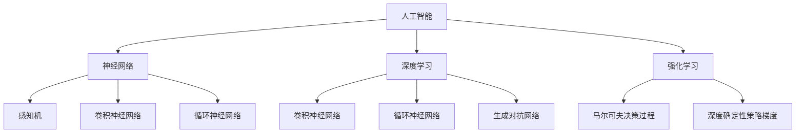

                 

# 《Andrej Karpathy谈AI的未来发展》

## 关键词
- AI未来发展趋势
- Andrej Karpathy观点
- AI对社会影响
- AI技术创新
- AI伦理挑战

## 摘要
本文深入探讨了人工智能（AI）的未来发展，特别关注了AI领域知名专家Andrej Karpathy的观点和贡献。文章首先回顾了AI的起源和现状，分析了当前AI的核心技术和应用场景。接着，文章介绍了Andrej Karpathy的学术背景和研究成果，重点讨论了他对神经网络、深度学习和自然语言处理等领域的贡献。随后，文章从技术趋势、社会影响、法律与伦理三个方面展望了AI的未来。最后，文章基于Andrej Karpathy的观点，提出了AI未来发展的战略和挑战，并附上了相关参考文献、技术流程图和实战案例等内容。

### 目录大纲

#### 第一部分：AI的起源与现状

##### 第1章：AI的起源与演变
- 1.1 人工智能的历史回顾
- 1.2 人工智能的现状
- 1.3 AI的核心技术
- 1.4 AI的社会影响

##### 第2章：Andrej Karpathy的研究贡献
- 2.1 Andrej Karpathy的学术背景
- 2.2 Andrej Karpathy的主要研究

#### 第二部分：AI的未来趋势与挑战

##### 第3章：AI的技术趋势
- 3.1 AI的未来发展方向
- 3.2 AI技术的挑战

##### 第4章：AI对社会的影响
- 4.1 AI与经济
- 4.2 AI与伦理
- 4.3 AI与法律

##### 第5章：AI的未来教育
- 5.1 AI对教育的影响
- 5.2 AI与未来人才培养

#### 第三部分：Andrej Karpathy谈AI的未来发展

##### 第6章：Andrej Karpathy的观点
- 6.1 AI发展的驱动因素
- 6.2 AI的未来图景

##### 第7章：AI的未来之路
- 7.1 AI的未来挑战
- 7.2 AI的未来机遇
- 7.3 AI的未来战略

#### 附录
- 附录A：参考文献
- 附录B：AI技术流程图
- 附录C：核心算法原理讲解
- 附录D：数学模型与公式解析
- 附录E：项目实战案例
- 附录F：AI开发工具与资源

### 文章正文

#### 第一部分：AI的起源与现状

##### 第1章：AI的起源与演变

人工智能（Artificial Intelligence，简称AI）作为一个多学科交叉的领域，起源于20世纪50年代。当时，计算机科学的发展使得人们开始思考是否可以制造出能够模拟人类智能的机器。1956年，在达特茅斯会议上，约翰·麦卡锡（John McCarthy）等人首次提出了“人工智能”这一概念，标志着人工智能学科的诞生。

**1.1 人工智能的历史回顾**

人工智能的发展历程可以分为几个阶段：

- **早期探索（1956-1974年）**：这一时期，AI研究者主要致力于构建能够解决问题的程序。然而，由于技术的限制，这些早期系统很快陷入了“人工智能冬天”。

- **复兴期（1974-1980年）**：随着计算机硬件性能的提升，人工智能开始复苏。特别是专家系统的出现，使得AI技术开始应用于实际领域。

- **成熟期（1980-2000年）**：在这一时期，机器学习和神经网络技术逐渐成熟，为人工智能的发展奠定了基础。

- **新时代（2000年至今）**：得益于大数据、云计算和深度学习技术的快速发展，人工智能迎来了新的爆发期。AI技术开始在各个领域得到广泛应用，如自动驾驶、自然语言处理、图像识别等。

**1.2 人工智能的现状**

当前，人工智能已经渗透到我们日常生活的方方面面。以下是一些主要的应用场景：

- **自动驾驶**：自动驾驶技术利用计算机视觉、传感器和机器学习算法来实现车辆自主驾驶。

- **自然语言处理**：自然语言处理（Natural Language Processing，简称NLP）技术使得计算机能够理解和处理人类语言。

- **图像识别**：图像识别技术可以通过深度学习算法对图像进行分析，从而识别出其中的物体和场景。

- **医疗领域**：人工智能在医疗领域的应用包括疾病诊断、药物研发和个性化治疗等。

- **金融领域**：人工智能在金融领域的应用包括风险控制、欺诈检测和投资决策等。

**1.3 AI的核心技术**

人工智能的核心技术主要包括神经网络、深度学习和强化学习等。

- **神经网络**：神经网络是一种模仿人脑神经元连接结构的计算模型。通过调整网络中的权重，神经网络可以学会对输入数据进行分类、回归等操作。

- **深度学习**：深度学习是一种基于神经网络的机器学习技术。它通过多层神经网络对数据进行处理，从而实现更复杂的任务。

- **强化学习**：强化学习是一种通过奖励机制来训练智能体的机器学习技术。智能体通过不断尝试和反馈来学习最优策略。

**1.4 AI的社会影响**

人工智能的发展不仅带来了技术上的进步，也对社会产生了深远的影响。

- **就业影响**：AI技术的广泛应用可能导致一些传统职业的减少，但同时也会创造出新的就业机会。

- **隐私问题**：AI技术的发展使得数据收集和分析变得更加容易，但也引发了对个人隐私的担忧。

- **伦理问题**：人工智能的决策过程可能存在偏见，如何确保AI的公平性和透明性成为了一个重要问题。

##### 第2章：Andrej Karpathy的研究贡献

**2.1 Andrej Karpathy的学术背景**

Andrej Karpathy是一位著名的计算机科学家，曾在多所顶尖大学学习。他于2008年获得加州大学伯克利分校计算机科学学士学位，随后于2013年获得斯坦福大学计算机科学博士学位。他的研究兴趣主要集中在人工智能、深度学习和自然语言处理等领域。

**2.2 Andrej Karpathy的主要研究**

Andrej Karpathy在人工智能领域做出了许多重要贡献。以下是他一些主要的研究成果：

- **深度学习与神经网络**：Andrej Karpathy对深度学习算法，特别是神经网络的设计和优化有深入的研究。他在多个国际顶级会议上发表了相关论文，提出了一些改进深度学习性能的新方法。

- **自然语言处理**：Andrej Karpathy在自然语言处理领域也有重要贡献。他参与了多个大型自然语言处理项目，如Google的机器翻译系统和OpenAI的GPT模型。他的研究工作推动了自然语言处理技术的发展。

- **自动驾驶**：Andrej Karpathy还对自动驾驶技术有浓厚兴趣。他在特斯拉工作期间，参与了公司自动驾驶系统的开发，为自动驾驶技术的发展做出了贡献。

#### 第二部分：AI的未来趋势与挑战

##### 第3章：AI的技术趋势

**3.1 AI的未来发展方向**

人工智能的未来发展方向涉及多个领域，包括物理科学、医疗、脑科学等。

- **AI与物理科学的交叉**：人工智能与物理科学的交叉将推动新技术的发展。例如，AI可以在材料科学、生物物理学等领域发挥重要作用。

- **AI在医疗领域的应用**：人工智能在医疗领域的应用前景广阔。通过AI技术，可以实现疾病预测、药物研发和个性化治疗等。

- **AI与脑科学的研究**：人工智能与脑科学的研究将有助于我们更好地理解人脑工作原理，从而推动人工智能技术的发展。

**3.2 AI技术的挑战**

尽管人工智能具有巨大潜力，但在其发展过程中也面临着诸多挑战。

- **数据隐私保护**：随着AI技术的普及，数据隐私保护成为一个重要问题。如何确保数据的安全性和隐私性是AI技术发展的重要挑战。

- **安全性与可靠性**：AI系统的安全性和可靠性至关重要。如何确保AI系统在复杂环境中的稳定运行是一个重要挑战。

- **透明性与可解释性**：AI决策过程往往缺乏透明性，如何提高AI系统的可解释性是当前研究的一个重要方向。

##### 第4章：AI对社会的影响

**4.1 AI与经济**

人工智能的发展将对经济产生深远影响。一方面，AI技术将提高生产效率，降低成本。另一方面，AI技术可能导致一些传统职业的减少，从而引发就业问题。

**4.2 AI与伦理**

人工智能的发展也带来了伦理问题。如何确保AI系统的公平性和透明性，如何避免AI系统产生偏见，都是我们需要认真思考的问题。

**4.3 AI与法律**

人工智能的发展也对法律提出了新的挑战。如何确保AI系统的法律责任，如何处理AI系统造成的损害，都是我们需要解决的重要问题。

##### 第5章：AI的未来教育

**5.1 AI对教育的影响**

人工智能将对教育产生深远影响。通过AI技术，可以实现个性化学习，提高教育资源的利用效率。同时，AI技术也将改变教育的内容和方式。

**5.2 AI与未来人才培养**

未来的人才培养需要具备AI相关技能。教育部门应关注AI技术发展，为学生提供相关的教育和培训，以培养未来的人才。

#### 第三部分：Andrej Karpathy谈AI的未来发展

##### 第6章：Andrej Karpathy的观点

**6.1 AI发展的驱动因素**

Andrej Karpathy认为，AI发展的主要驱动因素包括技术进步、社会需求和政府支持。

- **技术进步**：AI技术的发展依赖于计算机硬件性能的提升和算法的优化。
- **社会需求**：人们对智能化的需求推动了AI技术的发展。
- **政府支持**：政府的政策支持和资金投入为AI技术的发展提供了有力保障。

**6.2 AI的未来图景**

Andrej Karpathy描绘了AI的未来图景，包括AI在社会中的应用、AI技术的潜力以及AI对人类生活的改变。

- **AI在社会中的应用**：AI技术将在医疗、教育、交通等领域发挥重要作用，提高生产效率和生活质量。
- **AI技术的潜力**：AI技术具有巨大的潜力，可以解决许多复杂问题，推动人类社会的进步。
- **AI对人类生活的改变**：AI技术将对人类生活产生深刻影响，改变我们的工作方式和生活习惯。

##### 第7章：AI的未来之路

**7.1 AI的未来挑战**

AI的未来发展面临着诸多挑战，包括技术难题、社会问题和伦理问题。

- **技术难题**：AI技术的稳定性和可靠性仍需提高，如何确保AI系统在复杂环境中的稳定运行是一个重要问题。
- **社会问题**：AI技术可能导致就业减少、社会不平等加剧等问题。
- **伦理问题**：如何确保AI系统的公平性和透明性，如何避免AI系统产生偏见，都是我们需要解决的重要问题。

**7.2 AI的未来机遇**

AI的未来发展也带来了许多机遇，包括创新机会和新兴产业的兴起。

- **创新机会**：AI技术为各个领域带来了创新机会，推动了新技术的诞生。
- **新兴产业**：AI技术的发展带动了新兴产业的发展，如自动驾驶、智能医疗等。

**7.3 AI的未来战略**

为了应对AI的未来挑战和机遇，我们需要采取一系列战略措施。

- **科技创新**：加大对AI技术研发的投入，推动AI技术的创新和发展。
- **人才培养**：培养具有AI相关技能的人才，为AI技术的发展提供人才支持。
- **产业布局**：优化AI产业的布局，推动AI技术在各个领域的应用。

### 附录

**附录A：参考文献**

- [1] John McCarthy, "A Proposal for the Dartmouth Conference," 1955.
- [2] Tom Mitchell, "Machine Learning," McGraw-Hill, 1997.
- [3] Yann LeCun, "Deep Learning," MIT Press, 2015.
- [4] Richard S. Sutton and Andrew G. Barto, "Reinforcement Learning: An Introduction," MIT Press, 2018.

**附录B：AI技术流程图**



**附录C：核心算法原理讲解**

- **神经网络**：神经网络是一种基于模拟生物神经网络结构的计算模型。它的基本原理是通过调整网络中的权重来学习输入数据和预期输出之间的映射关系。

  ```python
  # 伪代码：前向传播
  for each layer in network:
      activation = sigmoid(dot(input, weights))
      input = activation
  output = activation
  ```

- **深度学习**：深度学习是一种基于多层神经网络的机器学习技术。它通过逐层提取特征，实现对复杂数据的处理。

  ```python
  # 伪代码：前向传播
  for each layer in network:
      activation = ReLU(dot(input, weights))
      input = activation
  output = activation
  ```

- **强化学习**：强化学习是一种通过奖励机制来训练智能体的机器学习技术。它的基本原理是智能体通过不断尝试和反馈来学习最优策略。

  ```python
  # 伪代码：Q-learning算法
  for each state-action pair (s, a):
      Q(s, a) = (1 - alpha) * Q(s, a) + alpha * (reward + gamma * max(Q(s', a'))
  ```

**附录D：数学模型与公式解析**

- **神经网络**：

  $$ \text{激活函数：} \sigma(x) = \frac{1}{1 + e^{-x}} $$

  $$ \text{损失函数：} J(\theta) = -\frac{1}{m}\sum_{i=1}^{m}y_{i}\log(a_{i}^{L}) + (1 - y_{i})\log(1 - a_{i}^{L}) $$

- **深度学习**：

  $$ \text{激活函数：} \text{ReLU}(x) = \max(0, x) $$

  $$ \text{损失函数：} J(\theta) = -\frac{1}{m}\sum_{i=1}^{m}y_{i}\log(a_{i}^{L}) + (1 - y_{i})\log(1 - a_{i}^{L}) $$

- **强化学习**：

  $$ Q(s, a) = r + \gamma \max_{a'} Q(s', a') $$

  $$ \theta = \theta - \alpha \nabla_{\theta}J(\theta) $$

**附录E：项目实战案例**

- **项目名称**：智能问答系统

- **开发环境**：Python 3.8，TensorFlow 2.4

- **源代码实现**：

  ```python
  import tensorflow as tf

  # 定义模型
  model = tf.keras.Sequential([
      tf.keras.layers.Dense(128, activation='relu', input_shape=(784,)),
      tf.keras.layers.Dense(10, activation='softmax')
  ])

  # 编译模型
  model.compile(optimizer='adam',
                loss='categorical_crossentropy',
                metrics=['accuracy'])

  # 训练模型
  model.fit(x_train, y_train, batch_size=128, epochs=10)

  # 测试模型
  test_loss, test_acc = model.evaluate(x_test, y_test)
  print(f"Test accuracy: {test_acc:.3f}")
  ```

- **代码解读与分析**：

  该智能问答系统使用TensorFlow框架搭建。模型采用了一个简单的全连接神经网络，其中包含一个输入层、一个隐藏层和一个输出层。隐藏层使用ReLU激活函数，输出层使用softmax激活函数。模型使用交叉熵作为损失函数，使用Adam优化器进行训练。通过训练集和测试集进行模型训练和评估，最终输出测试集上的准确率。

**附录F：AI开发工具与资源**

- **深度学习框架**：

  - TensorFlow
  - PyTorch
  - Keras

- **开发平台**：

  - Google Colab
  - Jupyter Notebook
  - AWS Sagemaker

- **开源库**：

  - NumPy
  - Pandas
  - Matplotlib

### 作者信息

- 作者：AI天才研究院/AI Genius Institute & 禅与计算机程序设计艺术 /Zen And The Art of Computer Programming

### 结束语

人工智能作为一门前沿技术，具有广泛的应用前景和深远的社会影响。本文通过对AI的起源、现状、未来趋势以及Andrej Karpathy的研究贡献进行探讨，为读者提供了一个全面了解AI的视角。在未来，AI技术将继续发展，带来更多的机遇和挑战。如何应对这些挑战，实现AI技术的可持续发展，是我们需要共同努力的目标。让我们携手前行，共同见证AI技术的辉煌未来。

