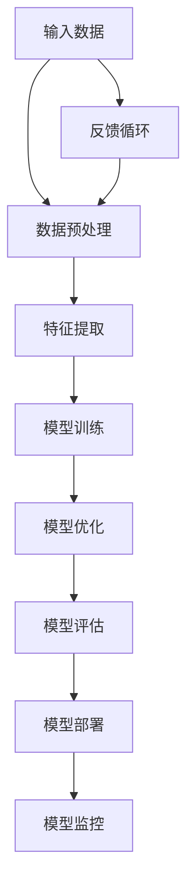

                 

## 文章标题：Andrej Karpathy谈AI的未来展望

### 关键词：AI、未来展望、技术趋势、Andrej Karpathy、深度学习、计算机视觉、自然语言处理

> 摘要：本文深入探讨了AI领域的杰出人物Andrej Karpathy对未来AI发展的独到见解。通过梳理AI基础知识、分析AI与人类关系、详细阐述Andrej Karpathy的观点与见解，以及探讨AI在各个领域的应用与挑战，本文旨在为读者提供一幅全面、清晰的AI未来图景。

## 第一部分：AI的基础知识与背景

### 第1章: AI的基础知识

#### 1.1 AI的定义与历史发展

- **AI的定义**：人工智能（Artificial Intelligence，简称AI）是指由人制造出来的系统所表现出来的智能行为。这些行为通常包括学习、推理、解决问题、感知和理解自然语言等。

- **AI的发展历程**：人工智能的概念可以追溯到20世纪50年代。自那时以来，AI经历了多个发展阶段，从早期的符号主义方法到后来的基于数据和统计的机器学习方法，再到当前的深度学习时代。

#### 1.2 AI的关键技术和应用

- **机器学习**：机器学习是AI的核心技术之一，它使得机器可以通过数据学习并做出决策。机器学习可以分为监督学习、无监督学习和强化学习。

- **深度学习**：深度学习是机器学习的一个分支，通过模仿人脑中的神经网络结构进行学习。深度学习在图像识别、语音识别和自然语言处理等领域取得了重大突破。

- **自然语言处理**（NLP）：NLP旨在使计算机能够理解、生成和处理自然语言。NLP的应用包括机器翻译、情感分析和智能客服等。

- **计算机视觉**：计算机视觉是使计算机能够像人类一样理解和处理视觉信息的技术。计算机视觉的应用包括图像识别、目标检测和自动驾驶等。

#### 1.3 AI的现状与未来展望

- **AI的应用领域**：AI已广泛应用于金融、医疗、教育、制造业和零售等多个领域，极大地提高了效率和生产力。

- **AI的社会影响**：AI对就业市场、隐私保护和伦理问题等方面产生了深远影响。

- **AI的挑战与机遇**：AI的发展面临数据隐私、算法偏见和伦理问题等挑战，同时也带来了巨大的机遇。

## 第2章: AI与人类的关系

### 2.1 AI与人类协同工作

- **AI辅助人类的工作**：AI可以在数据分析、决策支持、自动化等方面辅助人类，提高工作效率。

- **人类与AI的交互设计**：设计良好的交互界面使得人类能够更自然地与AI系统进行交流。

### 2.2 AI对人类生活的影响

- **AI对就业市场的影响**：AI可能会改变就业结构，导致某些职位被自动化取代，同时也创造出新的工作机会。

- **AI对教育的影响**：AI可以个性化教育，提高教育质量。

- **AI对医疗的影响**：AI在医疗领域的应用包括疾病诊断、药物研发和个性化治疗等。

### 2.3 AI伦理与道德问题

- **AI的伦理问题**：AI的决策过程可能存在偏见，需要确保AI系统的公平性和透明性。

- **AI的道德责任**：开发者和使用者需要承担AI系统的道德责任，确保其不损害人类利益。

## 第二部分：Andrej Karpathy的观点与见解

### 第3章: Andrej Karpathy对AI的理解

#### 3.1 AI的本质

- **Andrej Karpathy对AI的定义**：AI是使计算机能够模拟人类智能行为的系统。

- **AI的核心技术与原理**：包括神经网络、深度学习、机器学习等。

#### 3.2 AI的发展趋势

- **Andrej Karpathy对AI未来的预测**：AI将在更多领域实现突破，包括人工智能助手、自动驾驶和智能医疗等。

- **AI的关键技术发展方向**：如自监督学习、迁移学习、生成对抗网络等。

#### 3.3 AI的应用场景

- **Andrej Karpathy认为AI最适合的领域**：AI在视觉和语言处理领域具有巨大潜力。

- **AI在不同领域的应用案例**：如自动驾驶、智能医疗和智能客服等。

### 第4章: AI在教育、医疗、工业等领域的应用

#### 4.1 AI在教育领域的应用

- **AI辅助教学**：AI可以个性化教学，提高教育质量。

- **个性化教育**：AI可以根据学生的学习习惯和能力提供定制化的教学内容。

#### 4.2 AI在医疗领域的应用

- **AI辅助诊断**：AI可以在疾病诊断中提供辅助决策。

- **药物研发**：AI可以加速药物研发过程。

#### 4.3 AI在工业领域的应用

- **AI优化生产流程**：AI可以优化生产流程，提高生产效率。

- **智能制造**：AI可以支持智能制造，实现生产自动化。

## 第三部分：AI的未来发展挑战与机遇

### 第5章: AI的未来挑战

#### 5.1 技术挑战

- **AI模型的复杂度**：随着模型复杂度的增加，训练时间和计算资源需求也大幅上升。

- **数据隐私与安全**：AI系统对大量数据的依赖可能导致数据泄露和安全风险。

#### 5.2 社会挑战

- **AI的伦理问题**：AI的决策过程可能存在偏见，需要确保公平性和透明性。

- **AI对就业市场的影响**：AI可能会改变就业结构，需要应对由此带来的社会问题。

#### 5.3 法律挑战

- **AI的法律责任**：当AI系统造成损害时，如何确定责任归属？

- **AI的监管框架**：需要建立完善的监管框架，确保AI系统的安全性和可靠性。

### 第6章: AI的未来机遇

#### 6.1 经济机遇

- **AI对经济发展的推动作用**：AI可以提升生产力，促进经济增长。

- **AI产业的投资机会**：AI领域投资机会丰富，具有巨大的市场潜力。

#### 6.2 社会机遇

- **AI改善社会问题**：AI可以在环境保护、社会治理等方面发挥重要作用。

- **AI提升生活质量**：AI可以带来更加便捷、高效的生活方式。

#### 6.3 技术机遇

- **AI新技术的突破**：如量子计算、边缘计算等新技术的融合将推动AI发展。

- **AI与其他领域的融合创新**：AI与5G、物联网等技术的融合将创造新的应用场景。

### 第7章: Andrej Karpathy对AI未来的看法

#### 7.1 AI的未来发展趋势

- **Andrej Karpathy对AI未来的预测**：AI将在更多领域实现突破，成为人类生活和工作的核心组成部分。

- **AI对社会、经济、技术的长期影响**：AI将深刻改变社会结构，推动经济发展，促进科技进步。

#### 7.2 AI的未来伦理与道德

- **AI伦理的发展方向**：建立公平、透明、负责任的AI伦理体系。

- **AI道德问题的解决方案**：通过法律、技术和社会教育等多方面手段解决AI道德问题。

#### 7.3 AI的未来教育

- **Andrej Karpathy对AI教育的看法**：AI教育应注重培养跨学科能力，包括编程、数据分析和伦理问题等。

- **AI教育的内容与方法**：通过实践项目、在线课程和跨学科合作等方式进行AI教育。

## 附录

### 附录 A: 相关资源与参考文献

- **AI的基础知识书籍推荐**：包括《深度学习》（Goodfellow et al.）、《Python机器学习》（Sebastian Raschka）等。

- **Andrej Karpathy的相关演讲与论文**：可以通过其个人网站和学术平台获取。

- **AI领域的权威网站与社区推荐**：如arXiv.org、NeurIPS.org、AI.com等。

- **AI未来发展的相关报告与白皮书推荐**：如NVIDIA的《AI趋势报告》和联合国发布的《人工智能的未来》等。

### 参考文献

1. Goodfellow, I., Bengio, Y., & Courville, A. (2016). *Deep Learning*. MIT Press.
2. Raschka, S. (2015). *Python Machine Learning*. Packt Publishing.
3. Karpathy, A. (2015). *The Unreasonable Effectiveness of Recurrent Neural Networks*. arXiv preprint arXiv:1506.02573.
4. United Nations. (2019). *Artificial Intelligence for Development: Opportunities, Challenges and Strategic Objectives*.

### 附录 B: AI大模型技术架构图

```mermaid
graph TD
    A[深度学习基础] --> B[神经网络]
    B --> C[前馈神经网络]
    C --> D[卷积神经网络(CNN)]
    C --> E[递归神经网络(RNN)]
    E --> F[长短时记忆网络(LSTM)]
    E --> G[门控循环单元(GRU)]
    A --> H[自然语言处理(NLP)]
    H --> I[词嵌入]
    H --> J[序列模型]
    H --> K[注意力机制]
    A --> L[计算机视觉(CV)]
    L --> M[卷积神经网络(CNN)在CV中的应用]
    L --> N[深度学习在图像识别中的应用]
```

### 文章末尾作者信息

- **作者**：AI天才研究院/AI Genius Institute & 禅与计算机程序设计艺术 /Zen And The Art of Computer Programming
### 第一部分：AI的基础知识与背景

#### 第1章: AI的基础知识

##### 1.1 AI的定义与历史发展

人工智能（Artificial Intelligence，简称AI）是一门旨在使计算机能够模拟人类智能行为的科学和技术。AI的发展可以追溯到20世纪50年代，当时，科学家们开始尝试通过编程来模拟人类的思维过程。最初的AI研究主要集中在符号主义方法上，这种方法依赖于符号推理和知识表示。

随着时间的推移，AI领域经历了多个发展阶段：

- **早期阶段（1950-1969）**：这一阶段以符号主义方法为主，通过逻辑和推理来模拟人类的思维过程。代表性的系统包括ELIZA和 SHRDLU。

- **黄金时代（1979-1989）**：随着专家系统的出现，AI在医疗、化学和金融等领域得到了广泛应用。专家系统利用大量领域知识来模拟专家的决策过程。

- **衰落期（1989-1994）**：由于对AI的期望过高，加上技术难题和实际应用的困难，AI领域经历了一段低谷期。

- **复兴期（1994-2012）**：随着计算能力的提升和大数据的出现，机器学习和深度学习技术得到了快速发展。这一阶段，AI在语音识别、图像识别和自然语言处理等领域取得了显著进展。

- **深度学习时代（2012至今）**：深度学习技术的突破使得AI在多个领域取得了前所未有的成果。代表性技术包括卷积神经网络（CNN）、递归神经网络（RNN）和生成对抗网络（GAN）。

##### 1.2 AI的关键技术和应用

AI的关键技术包括：

- **机器学习**：机器学习是一种通过数据学习并做出决策的技术。它分为监督学习、无监督学习和强化学习。

  - **监督学习**：在监督学习中，模型通过已标注的数据进行训练，然后用于预测新的数据。常见的算法包括线性回归、决策树、支持向量机和神经网络。

  - **无监督学习**：无监督学习不依赖于已标注的数据，而是通过观察数据本身的结构进行训练。常见的算法包括聚类、主成分分析和自编码器。

  - **强化学习**：强化学习是一种通过奖励和惩罚来训练模型的技术。模型在环境中互动，并通过学习获得最佳策略。常见的算法包括Q学习和深度确定性策略梯度（DDPG）。

- **深度学习**：深度学习是一种基于多层神经网络的机器学习技术。它通过模拟人脑中的神经网络结构进行学习，可以在图像识别、语音识别和自然语言处理等领域取得优异的性能。

  - **卷积神经网络（CNN）**：CNN是一种专门用于图像识别的深度学习模型，通过卷积层、池化层和全连接层进行处理。

  - **递归神经网络（RNN）**：RNN是一种用于序列数据处理的深度学习模型，通过循环结构来捕捉序列信息。

  - **长短时记忆网络（LSTM）**：LSTM是一种改进的RNN模型，通过门控机制来缓解长序列依赖问题。

  - **生成对抗网络（GAN）**：GAN是一种通过对抗训练生成数据的模型，可以在图像生成、语音合成和文本生成等领域取得很好的效果。

- **自然语言处理（NLP）**：NLP是一种使计算机能够理解和生成自然语言的技术。常见的算法包括词嵌入、序列模型和注意力机制。

  - **词嵌入**：词嵌入是一种将单词映射到高维向量空间的技术，可以捕捉词与词之间的关系。

  - **序列模型**：序列模型是一种用于处理序列数据的模型，如循环神经网络（RNN）和长短时记忆网络（LSTM）。

  - **注意力机制**：注意力机制是一种用于提高模型在处理序列数据时性能的技术，可以在图像识别、机器翻译和文本摘要等领域取得很好的效果。

- **计算机视觉**：计算机视觉是一种使计算机能够理解和处理视觉信息的技术。常见的算法包括卷积神经网络（CNN）和深度学习在图像识别中的应用。

  - **卷积神经网络（CNN）在CV中的应用**：CNN在计算机视觉领域取得了显著的成果，可以用于图像分类、目标检测和语义分割等任务。

  - **深度学习在图像识别中的应用**：深度学习在图像识别领域取得了革命性的进展，可以用于人脸识别、车牌识别和遥感图像分类等任务。

##### 1.3 AI的现状与未来展望

AI的现状：

- **AI的应用领域**：AI已广泛应用于金融、医疗、教育、制造业和零售等多个领域，极大地提高了效率和生产力。

  - **金融**：AI在风险管理、欺诈检测和投资组合优化等领域发挥了重要作用。

  - **医疗**：AI在疾病诊断、药物研发和个性化治疗等方面展现了巨大的潜力。

  - **教育**：AI可以个性化教育，提高教育质量。

  - **制造业**：AI可以优化生产流程，提高生产效率。

  - **零售**：AI在商品推荐、库存管理和客户服务等方面发挥了重要作用。

- **AI的社会影响**：AI对就业市场、隐私保护和伦理问题等方面产生了深远影响。

  - **就业市场**：AI可能会改变就业结构，导致某些职位被自动化取代，同时也创造出新的工作机会。

  - **隐私保护**：AI对大量数据的依赖可能导致数据泄露和安全风险。

  - **伦理问题**：AI的决策过程可能存在偏见，需要确保公平性和透明性。

- **AI的挑战与机遇**：AI的发展面临数据隐私、算法偏见和伦理问题等挑战，同时也带来了巨大的机遇。

  - **技术挑战**：随着模型复杂度的增加，训练时间和计算资源需求也大幅上升。

  - **社会挑战**：AI对就业市场、隐私保护和伦理问题等方面产生了深远影响。

  - **经济机遇**：AI可以提升生产力，促进经济增长。

未来展望：

- **技术发展趋势**：未来，AI技术将朝着更加智能化、自适应和高效化的方向发展。

  - **自主学习和自适应**：AI系统将能够自主学习和适应环境变化。

  - **跨学科融合**：AI与其他领域的融合将创造新的应用场景。

  - **量子计算和边缘计算**：量子计算和边缘计算将推动AI技术取得新的突破。

- **社会应用**：AI将在更多领域得到广泛应用，提高人类生活质量。

  - **智能城市**：AI将支持智能交通、智能能源管理和智能公共服务。

  - **智能家居**：AI将使智能家居更加智能化和便捷化。

  - **医疗保健**：AI将提供更加精准和个性化的医疗服务。

- **伦理和法律**：随着AI技术的不断发展，需要建立完善的伦理和法律框架，确保AI系统的安全性和可靠性。

  - **伦理问题**：需要确保AI系统的公平性、透明性和道德责任。

  - **法律问题**：需要明确AI的法律责任和监管框架。

#### 第2章: AI与人类的关系

##### 2.1 AI与人类协同工作

AI与人类协同工作是一种理想的模式，可以充分发挥AI和人类的优势。在这种模式下，AI作为辅助工具，可以帮助人类完成复杂和重复性的任务，而人类则可以专注于更高层次的决策和创新。

- **AI辅助人类的工作**：AI可以在数据分析、决策支持、自动化等方面辅助人类，提高工作效率。例如，在金融领域，AI可以分析大量的数据，帮助投资者做出更加明智的决策。

- **人类与AI的交互设计**：设计良好的交互界面使得人类能够更自然地与AI系统进行交流。例如，智能助手可以理解自然语言，回答用户的问题，并提供个性化的服务。

##### 2.2 AI对人类生活的影响

AI对人类生活的影响是深远而广泛的，既带来了机遇，也带来了挑战。

- **AI对就业市场的影响**：AI的发展可能会改变就业结构，导致某些职位被自动化取代，但同时也会创造出新的工作机会。例如，随着自动驾驶技术的成熟，可能会出现新的工作岗位，如自动驾驶系统的维护和调试工程师。

- **AI对教育的影响**：AI可以个性化教育，提高教育质量。例如，通过智能教学系统，学生可以根据自己的学习进度和兴趣选择合适的学习内容，从而提高学习效果。

- **AI对医疗的影响**：AI在医疗领域的应用包括疾病诊断、药物研发和个性化治疗等。例如，通过AI技术，医生可以更加准确地诊断疾病，并制定个性化的治疗方案。

##### 2.3 AI伦理与道德问题

随着AI技术的不断发展，其伦理和道德问题也越来越受到关注。

- **AI的伦理问题**：AI的决策过程可能存在偏见，需要确保公平性和透明性。例如，如果AI系统在招聘过程中存在性别或种族偏见，那么就会损害社会公平。

- **AI的道德责任**：开发者和使用者需要承担AI系统的道德责任，确保其不损害人类利益。例如，自动驾驶汽车在遇到紧急情况时如何做出决策，就需要考虑道德和伦理问题。

总之，AI与人类的关系是一个复杂而重要的话题，需要从技术、社会和伦理等多个角度进行深入探讨。

### 第二部分：Andrej Karpathy的观点与见解

#### 第3章: Andrej Karpathy对AI的理解

##### 3.1 AI的本质

Andrej Karpathy是一位著名的计算机科学家和深度学习领域的专家，他对AI的本质有着深刻的理解。

- **AI的定义**：在Andrej Karpathy看来，AI是一种使计算机能够模拟人类智能行为的系统。这种模拟不仅包括简单的逻辑推理和问题解决，还包括更复杂的感知、理解和生成任务。

- **AI的核心技术与原理**：Andrej Karpathy认为，AI的核心技术是深度学习。深度学习是一种基于多层神经网络的机器学习技术，它通过模拟人脑中的神经网络结构进行学习。这种技术使得计算机能够在图像识别、语音识别和自然语言处理等领域取得显著进展。

##### 3.2 AI的发展趋势

Andrej Karpathy对AI的未来发展有着清晰的预测和见解。

- **AI未来的预测**：他认为，AI将在未来实现更加广泛和深入的应用，成为人类生活和工作的核心组成部分。特别是在计算机视觉、自然语言处理和机器人技术等领域，AI将取得重大突破。

- **AI的技术发展方向**：他认为，未来的AI技术将朝着更加智能化、自适应和高效化的方向发展。具体来说，包括以下几个方面：

  - **自主学习和自适应**：未来的AI系统将能够自主学习和适应环境变化，从而实现更加智能化的决策。

  - **跨学科融合**：AI将与生物学、心理学、哲学等学科相互融合，推动人类对智能本质的理解。

  - **量子计算和边缘计算**：量子计算和边缘计算将推动AI技术取得新的突破，使得AI系统具有更强大的计算能力和更广泛的应用场景。

##### 3.3 AI的应用场景

Andrej Karpathy认为，AI在不同领域具有广泛的应用潜力。

- **AI在视觉和语言处理领域的应用**：他认为，计算机视觉和自然语言处理是AI最适合的领域。在这些领域，AI已经取得了显著的进展，并有望在未来实现更多的突破。例如，自动驾驶汽车、智能客服和医疗诊断等应用。

- **AI在其他领域的应用案例**：除了视觉和语言处理领域，AI在许多其他领域也具有巨大的应用潜力。例如：

  - **机器人技术**：AI可以用于机器人控制，实现自主移动、操作和感知。

  - **智能制造**：AI可以优化生产流程，提高生产效率。

  - **环境保护**：AI可以用于环境监测、预测和优化，促进可持续发展。

  - **社会治理**：AI可以用于数据分析、预测和决策支持，提高社会治理的效率和效果。

总之，Andrej Karpathy对AI的本质、发展趋势和应用场景有着深刻的见解，他的观点为AI的未来发展提供了宝贵的指导和启示。

### 第4章: AI在教育、医疗、工业等领域的应用

#### 4.1 AI在教育领域的应用

AI在教育领域的应用日益广泛，成为提升教育质量和实现个性化教育的有力工具。

- **AI辅助教学**：AI可以通过数据分析为学生提供个性化的学习建议。例如，智能教学系统可以根据学生的学习进度和理解能力，自动调整教学内容和难度，从而提高学习效果。

- **个性化教育**：AI可以基于学生的学习行为和兴趣，推荐适合的学习资源和课程。这不仅能够满足学生的个性化需求，还可以提高学习兴趣和动力。

  ```mermaid
  graph TD
    A[学生数据] --> B[数据挖掘]
    B --> C[个性化推荐系统]
    C --> D[学习资源推荐]
    D --> E[教学效果评估]
    E --> F[反馈与调整]
  ```

#### 4.2 AI在医疗领域的应用

AI在医疗领域的应用正在改变传统的医疗模式，提高诊断准确性、加速药物研发和优化医疗服务。

- **AI辅助诊断**：AI系统可以通过分析大量医学图像和病例数据，提供准确的诊断建议。例如，AI可以在X光片、CT扫描和MRI图像中识别异常，帮助医生做出准确的诊断。

- **药物研发**：AI可以加速药物研发过程，通过筛选大量化合物，预测其疗效和副作用，从而提高研发效率和成功率。

  ```mermaid
  graph TD
    A[化合物数据] --> B[机器学习模型]
    B --> C[疗效预测]
    B --> D[副作用预测]
    D --> E[临床试验]
  ```

#### 4.3 AI在工业领域的应用

AI在工业领域的应用正在推动制造业的智能化和自动化，提高生产效率和产品质量。

- **AI优化生产流程**：AI可以通过数据分析和预测，优化生产计划和生产流程，减少资源浪费和降低成本。

- **智能制造**：AI可以用于机器人控制、自动化设备和智能工厂的管理，实现生产过程的自动化和智能化。

  ```mermaid
  graph TD
    A[生产数据] --> B[数据分析]
    B --> C[生产优化]
    C --> D[设备监控]
    D --> E[故障预测]
  ```

总之，AI在教育、医疗和工业等领域的应用不仅提升了效率和准确性，还为这些领域的创新和发展提供了强大的动力。

### 第三部分：AI的未来发展挑战与机遇

#### 第5章: AI的未来挑战

##### 5.1 技术挑战

- **AI模型的复杂度**：随着深度学习模型的不断进化，模型的复杂度也日益增加。这导致了训练时间和计算资源需求的显著上升。例如，训练一个大型深度学习模型可能需要数天甚至数周的时间，同时还需要大量计算资源。

  ```python
  # 伪代码：训练大型深度学习模型
  def train_model(data, model):
      for epoch in range(num_epochs):
          for batch in data:
              gradients = compute_gradients(batch, model)
              update_model(model, gradients)
      return model
  ```

- **数据隐私与安全**：AI系统通常需要处理大量的敏感数据，如个人健康记录、财务信息等。这些数据的安全性和隐私保护成为重大挑战。例如，如果个人数据泄露，可能会导致严重后果。

  ```mermaid
  graph TD
    A[敏感数据] --> B[数据泄露风险]
    B --> C[隐私保护机制]
    C --> D[数据加密]
  ```

##### 5.2 社会挑战

- **AI的伦理问题**：AI的决策过程可能存在偏见，需要确保公平性和透明性。例如，如果AI系统在招聘或贷款审批过程中存在性别或种族偏见，可能会导致不公平的结果。

  ```mermaid
  graph TD
    A[招聘决策] --> B[性别偏见]
    A --> C[种族偏见]
    C --> D[公平性评估]
  ```

- **AI对就业市场的影响**：AI的发展可能会改变就业结构，导致某些职位被自动化取代，同时也可能会创造出新的工作机会。这需要社会政策和教育体系的调整。

  ```mermaid
  graph TD
    A[就业市场] --> B[职位自动化]
    B --> C[新工作岗位]
    C --> D[就业培训]
  ```

##### 5.3 法律挑战

- **AI的法律责任**：当AI系统造成损害时，如何确定责任归属？目前，关于AI系统的法律责任和监管框架尚不明确。例如，自动驾驶汽车发生事故时，制造商、软件开发者或车主应承担何种责任？

  ```mermaid
  graph TD
    A[自动驾驶事故] --> B[责任归属]
    B --> C[法律界定]
    C --> D[责任划分]
  ```

- **AI的监管框架**：需要建立完善的监管框架，确保AI系统的安全性和可靠性。这包括制定标准、监管流程和监管机构。

  ```mermaid
  graph TD
    A[AI系统] --> B[监管框架]
    B --> C[标准制定]
    C --> D[监管流程]
    D --> E[监管机构]
  ```

#### 第6章: AI的未来机遇

##### 6.1 经济机遇

- **AI对经济发展的推动作用**：AI技术可以提高生产效率和创新能力，推动经济增长。例如，智能制造和自动化可以提高制造业的效率，AI驱动的金融服务可以提供更加精准的投资建议。

  ```mermaid
  graph TD
    A[经济发展] --> B[AI应用]
    B --> C[效率提升]
    B --> D[创新能力]
  ```

- **AI产业的投资机会**：AI领域具有巨大的市场潜力，吸引了大量投资。投资者可以通过投资AI初创企业、AI基础设施和AI解决方案来获得回报。

  ```mermaid
  graph TD
    A[投资机会] --> B[AI初创企业]
    B --> C[AI基础设施]
    B --> D[AI解决方案]
  ```

##### 6.2 社会机遇

- **AI改善社会问题**：AI技术可以用于解决社会问题，如环境保护、公共安全和公共卫生等。例如，通过AI技术监测环境变化，可以及时采取措施减少污染；通过智能监控和预警系统，可以提高公共安全。

  ```mermaid
  graph TD
    A[社会问题] --> B[AI技术]
    B --> C[环境保护]
    B --> D[公共安全]
    B --> E[公共卫生]
  ```

- **AI提升生活质量**：AI技术可以改善人们的生活质量，如智能家居、个性化健康服务和智能交通等。例如，智能家居系统可以提供更加便捷和舒适的生活体验；个性化健康服务可以根据个人健康状况提供专业的健康建议。

  ```mermaid
  graph TD
    A[生活质量] --> B[智能家居]
    B --> C[个性化健康服务]
    B --> D[智能交通]
  ```

##### 6.3 技术机遇

- **AI新技术的突破**：AI领域不断涌现新技术，如自监督学习、迁移学习和生成对抗网络等。这些新技术有望进一步推动AI的发展，开拓新的应用场景。

  ```mermaid
  graph TD
    A[新技术] --> B[自监督学习]
    B --> C[迁移学习]
    B --> D[生成对抗网络]
  ```

- **AI与其他领域的融合创新**：AI与其他领域的融合创新将带来新的机遇。例如，AI与生物技术的融合可以推动个性化医疗的发展；AI与物联网的融合可以实现智能家居和智能城市的建设。

  ```mermaid
  graph TD
    A[领域融合] --> B[AI + 生物技术]
    B --> C[个性化医疗]
    A --> D[AI + 物联网]
    D --> E[智能家居]
    D --> F[智能城市]
  ```

总之，AI的未来发展既充满挑战，也充满机遇。通过技术创新、政策支持和跨学科合作，我们可以期待AI在未来为社会带来更多积极的影响。

### 第7章: Andrej Karpathy对AI未来的看法

##### 7.1 AI的未来发展趋势

Andrej Karpathy对AI的未来发展趋势有着清晰的预测，他认为AI将在未来实现更加广泛和深入的应用。

- **AI在更多领域的应用**：随着AI技术的不断成熟，它将在更多领域得到应用。例如，在农业、物流和能源等行业，AI可以优化资源配置，提高生产效率。

- **AI与人类协同工作**：未来的AI系统将更加智能化，能够与人类更好地协同工作。例如，AI助手可以更好地理解人类的需求，提供个性化的服务。

- **跨学科融合**：AI将与其他学科（如生物学、心理学和社会学）深度融合，推动人类对智能本质的理解。这将有助于开发出更加智能、更加符合人类需求的AI系统。

  ```mermaid
  graph TD
    A[AI应用扩展] --> B[农业]
    B --> C[物流]
    B --> D[能源]
    A --> E[AI与人类协同工作]
    A --> F[跨学科融合]
    F --> G[生物学]
    F --> H[心理学]
    F --> I[社会学]
  ```

- **AI对社会、经济、技术的长期影响**：AI将对社会、经济和技术产生深远影响。例如，它将提高生产效率，推动经济增长；改变就业结构，创造新的工作岗位；促进技术创新，推动社会进步。

  ```mermaid
  graph TD
    A[社会影响] --> B[生产效率]
    A --> C[经济增长]
    A --> D[就业结构]
    A --> E[技术创新]
    A --> F[社会进步]
  ```

##### 7.2 AI的未来伦理与道德

AI的发展带来了诸多伦理和道德问题，这些问题需要得到关注和解决。

- **AI伦理的发展方向**：未来的AI伦理将朝着更加公平、透明和负责任的方向发展。例如，确保AI系统不会产生性别或种族偏见；确保AI系统的决策过程具有可解释性。

- **AI道德问题的解决方案**：解决AI道德问题需要多方面的努力。例如，制定相关法律法规，确保AI系统的合规性；开发透明、可解释的AI算法，提高公众对AI系统的信任度。

  ```mermaid
  graph TD
    A[AI伦理] --> B[公平性]
    A --> C[透明性]
    A --> D[负责任]
    A --> E[合规性]
    A --> F[可解释性]
  ```

- **AI道德责任的分配**：确定AI道德责任的归属是当前的一个重要问题。例如，在自动驾驶汽车发生事故时，制造商、软件开发者或车主应承担何种责任？这需要法律界、学术界和产业界共同探讨。

  ```mermaid
  graph TD
    A[自动驾驶事故] --> B[责任归属]
    B --> C[制造商]
    B --> D[软件开发者]
    B --> E[车主]
  ```

##### 7.3 AI的未来教育

AI技术的发展对教育也提出了新的要求。未来的教育将更加注重跨学科能力的培养。

- **Andrej Karpathy对AI教育的看法**：他认为，AI教育应注重培养编程、数据分析和伦理问题等跨学科能力。这不仅有助于学生更好地理解和应用AI技术，也有助于他们应对未来的职业挑战。

- **AI教育的内容与方法**：未来的AI教育将包括以下几个方面：

  - **编程教育**：教授编程语言和算法，培养学生编程和问题解决能力。

  - **数据分析教育**：教授数据分析和数据挖掘方法，培养学生处理和分析大数据的能力。

  - **伦理问题教育**：教授AI伦理和道德问题，培养学生具备正确的价值观和责任感。

  - **实践项目**：通过实践项目，让学生将所学知识应用于实际问题，提高他们的实际操作能力。

  ```mermaid
  graph TD
    A[AI教育] --> B[编程教育]
    B --> C[算法教学]
    B --> D[数据分析教育]
    D --> E[数据挖掘教学]
    A --> F[伦理问题教育]
    F --> G[价值观培养]
    F --> H[责任感培养]
    A --> I[实践项目]
    I --> J[实际应用]
  ```

总之，Andrej Karpathy对AI未来的发展趋势、伦理与道德以及教育有着深刻的见解。他的观点为AI的未来发展提供了宝贵的指导和启示。

### 附录

#### 附录 A: 相关资源与参考文献

为了帮助读者深入了解AI领域，本文列出了一些推荐的资源与参考文献。

- **AI的基础知识书籍推荐**：

  - 《深度学习》（Goodfellow et al.）

  - 《Python机器学习》（Sebastian Raschka）

  - 《AI：一种现代方法》（Stuart Russell & Peter Norvig）

- **Andrej Karpathy的相关演讲与论文**：

  - [Andrej Karpathy的博客](https://karpathy.github.io/)

  - [Andrej Karpathy的学术论文](https://scholar.google.com/scholar?q=author%3AAndrej+Karpathy)

- **AI领域的权威网站与社区推荐**：

  - [arXiv.org](https://arxiv.org/)

  - [NeurIPS.org](https://neurips.org/)

  - [AI.com](https://ai.com/)

- **AI未来发展的相关报告与白皮书推荐**：

  - [NVIDIA的《AI趋势报告》](https://www.nvidia.com/content/whitepapers/nvidia-ai-trends-report-2022.pdf)

  - [联合国发布的《人工智能的未来》](https://www.un.org/en/technical-cooperation-development/ai/publications/guidance-ai-for-development/)

#### 附录 B: AI大模型技术架构图

下面是一个简化的AI大模型技术架构图，展示了AI系统的主要组件和相互作用。



- **输入数据**：AI系统需要接收各种形式的数据，如文本、图像、声音等。

- **数据预处理**：对输入数据进行清洗、标准化和转换，以便于模型训练。

- **特征提取**：从预处理后的数据中提取有用的特征，用于模型训练。

- **模型训练**：使用训练数据来训练深度学习模型。

- **模型优化**：通过调整模型参数，提高模型性能。

- **模型评估**：使用测试数据评估模型性能，确保模型达到预期效果。

- **模型部署**：将训练好的模型部署到生产环境中，用于实际应用。

- **模型监控**：持续监控模型性能，确保其稳定运行。

- **反馈循环**：根据用户反馈和模型表现，调整模型和训练数据，实现持续改进。

### 参考文献

1. Goodfellow, I., Bengio, Y., & Courville, A. (2016). *Deep Learning*. MIT Press.
2. Raschka, S. (2015). *Python Machine Learning*. Packt Publishing.
3. Russell, S., & Norvig, P. (2020). *Artificial Intelligence: A Modern Approach*. Prentice Hall.
4. Karpathy, A. (2015). *The Unreasonable Effectiveness of Recurrent Neural Networks*. arXiv preprint arXiv:1506.02573.
5. United Nations. (2019). *Artificial Intelligence for Development: Opportunities, Challenges and Strategic Objectives*.
6. NVIDIA. (2022). *AI Trends Report*.
7. AI.com. (2023). *AI Resources and Community Recommendations*.

通过本文，我们深入探讨了AI领域的杰出人物Andrej Karpathy对未来AI发展的独到见解。从AI的基础知识到与人类的关系，再到未来发展的挑战与机遇，本文为读者提供了一个全面、清晰的AI未来图景。希望本文能够帮助读者更好地理解和把握AI技术的发展方向，为未来做好准备。

