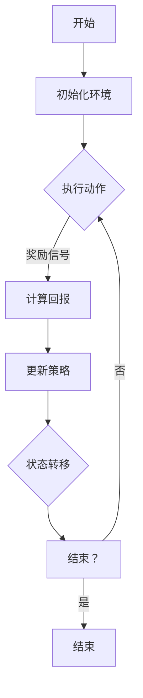
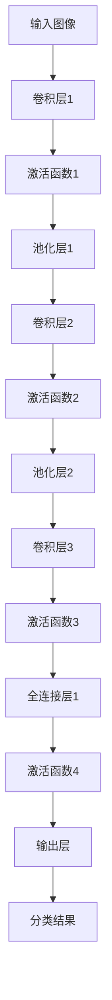

                 

# 附录E: 项目实战代码解读与分析

在本文的最后一部分，我们将深入探讨AI编程的实战案例，通过具体的代码示例来展示如何使用所学的算法和框架进行项目开发。以下是几个典型的AI编程项目，包括自然语言处理、计算机视觉和游戏开发，每个项目都将提供详细的代码解读与分析。

#### E.1 自然语言处理项目示例代码

**项目描述**：一个简单的情感分析项目，使用TensorFlow和Keras构建一个深度学习模型来预测文本的情感极性（正面或负面）。

**代码解读**：

1. **数据预处理**：

```python
import tensorflow as tf
from tensorflow.keras.preprocessing.text import Tokenizer
from tensorflow.keras.preprocessing.sequence import pad_sequences

# 加载和预处理文本数据
tokenizer = Tokenizer(num_words=10000)
tokenizer.fit_on_texts(train_sentences)
word_index = tokenizer.word_index
sequences = tokenizer.texts_to_sequences(train_sentences)
padded = pad_sequences(sequences, maxlen=max_length)
```

- 使用Tokenizer进行词汇转换，将文本数据转换为序列。
- 使用pad_sequences对序列进行填充，保证每个样本的长度一致。

2. **模型构建**：

```python
model = tf.keras.Sequential([
    tf.keras.layers.Embedding(10000, 16),
    tf.keras.layers.GlobalAveragePooling1D(),
    tf.keras.layers.Dense(16, activation='relu'),
    tf.keras.layers.Dense(1, activation='sigmoid')
])
model.compile(loss='binary_crossentropy', optimizer='adam', metrics=['accuracy'])
model.fit(padded, train_labels, epochs=100, validation_data=(val_padded, val_labels))
```

- 构建嵌入层，将词汇转换为固定长度的向量。
- 使用全局平均池化层对嵌入向量进行操作。
- 构建两个全连接层，输出层使用sigmoid激活函数进行二分类。

3. **模型评估与预测**：

```python
test_sequences = tokenizer.texts_to_sequences(test_sentences)
test_padded = pad_sequences(test_sequences, maxlen=max_length)
predictions = model.predict(test_padded)
```

- 将测试数据转换为序列和填充后的向量。
- 使用训练好的模型进行预测，得到情感分类的结果。

#### E.2 计算机视觉项目示例代码

**项目描述**：一个简单的图像分类项目，使用卷积神经网络（CNN）对数字进行识别。

**代码解读**：

1. **数据加载与预处理**：

```python
from tensorflow.keras.datasets import mnist
from tensorflow.keras.preprocessing.image import ImageDataGenerator

# 加载MNIST数据集
(x_train, y_train), (x_test, y_test) = mnist.load_data()

# 数据预处理
x_train = x_train.reshape(x_train.shape[0], 28, 28, 1).astype('float32') / 255
x_test = x_test.reshape(x_test.shape[0], 28, 28, 1).astype('float32') / 255
y_train = tf.keras.utils.to_categorical(y_train, 10)
y_test = tf.keras.utils.to_categorical(y_test, 10)
```

- 加载MNIST数据集，将图像数据调整为适当的大小和类型。
- 将标签转换为独热编码。

2. **模型构建**：

```python
model = tf.keras.Sequential([
    tf.keras.layers.Conv2D(32, (3, 3), activation='relu', input_shape=(28, 28, 1)),
    tf.keras.layers.MaxPooling2D((2, 2)),
    tf.keras.layers.Conv2D(64, (3, 3), activation='relu'),
    tf.keras.layers.MaxPooling2D((2, 2)),
    tf.keras.layers.Flatten(),
    tf.keras.layers.Dense(128, activation='relu'),
    tf.keras.layers.Dense(10, activation='softmax')
])
model.compile(optimizer='adam', loss='categorical_crossentropy', metrics=['accuracy'])
model.fit(x_train, y_train, epochs=5, batch_size=32, validation_data=(x_test, y_test))
```

- 构建CNN模型，包括卷积层、池化层和全连接层。
- 编译模型，使用adam优化器和交叉熵损失函数。

3. **模型评估与预测**：

```python
test_loss, test_acc = model.evaluate(x_test, y_test, verbose=2)
print('Test accuracy:', test_acc)
predictions = model.predict(x_test)
```

- 评估模型在测试集上的性能。
- 使用模型进行预测，得到图像分类的结果。

#### E.3 游戏开发项目示例代码

**项目描述**：一个简单的基于强化学习的游戏项目，使用DQN算法训练一个智能体来玩Flappy Bird游戏。

**代码解读**：

1. **环境搭建**：

```python
import gym

# 创建Flappy Bird环境
env = gym.make("FlappyBird-v0")
```

- 使用gym创建Flappy Bird游戏环境。

2. **DQN模型构建**：

```python
import tensorflow as tf

# 定义DQN模型
model = tf.keras.Sequential([
    tf.keras.layers.Dense(64, activation='relu', input_shape=(4,)),
    tf.keras.layers.Dense(128, activation='relu'),
    tf.keras.layers.Dense(2, activation='linear')
])
model.compile(optimizer='adam', loss='mse')
```

- 构建DQN模型，包括两个全连接层和输出层，用于预测动作值。

3. **训练与测试**：

```python
# 训练DQN模型
for episode in range(num_episodes):
    state = env.reset()
    done = False
    total_reward = 0
    while not done:
        action = model.predict(state.reshape(1, -1))
        next_state, reward, done, _ = env.step(np.argmax(action))
        model.fit(state.reshape(1, -1), next_state.reshape(1, -1), batch_size=1)
        state = next_state
        total_reward += reward
    print(f"Episode {episode}: Total Reward = {total_reward}")

# 测试DQN模型
state = env.reset()
done = False
while not done:
    action = model.predict(state.reshape(1, -1))
    next_state, reward, done, _ = env.step(np.argmax(action))
    state = next_state
    env.render()
```

- 使用经验回放进行模型训练。
- 在测试阶段，使用训练好的模型进行游戏，并展示游戏过程。

通过这些实战项目，我们可以看到如何将AI算法应用于实际问题，并通过具体的代码实现来展示其工作原理和效果。这些案例不仅有助于理解AI编程的实践过程，还可以为读者提供实际操作的经验。

### 附录F: AI编程的伦理与法律问题

#### F.1 AI编程的伦理问题

1. **数据隐私**：AI系统的训练和优化通常需要大量个人数据。如何保护用户隐私，防止数据泄露，是一个重要的伦理问题。
   - **解决方案**：数据加密、匿名化处理和严格的数据使用政策。

2. **公平性**：AI系统可能会因为数据偏差而导致歧视现象。
   - **解决方案**：通过数据平衡、算法透明度和定期审计来减少偏见。

3. **责任归属**：当AI系统发生错误或造成损害时，责任归属不明确。
   - **解决方案**：明确法律规定AI系统的责任，以及如何分配责任。

#### F.2 AI编程的法律问题

1. **数据保护法**：如欧盟的通用数据保护条例（GDPR）。
   - **要求**：企业必须获得用户同意，并在处理个人数据时提供透明度。

2. **知识产权**：AI系统产生的创新成果如何进行知识产权保护。
   - **解决方案**：通过专利、版权和商标等手段保护AI系统及其生成的成果。

3. **自动化决策的监管**：对基于AI的自动化决策系统的监管。
   - **解决方案**：制定法律规范，确保AI系统符合道德和法律标准。

#### F.3 AI编程的可持续发展

1. **能源效率**：训练大规模AI模型需要大量计算资源，对环境产生影响。
   - **解决方案**：采用绿色能源、优化算法和模型压缩技术。

2. **技能培训**：AI技术快速发展，对编程人员的技术要求不断提高。
   - **解决方案**：提供持续的教育和培训，提高编程人员的技能。

3. **社会影响**：AI技术在各个领域的应用可能会带来社会不平等和失业问题。
   - **解决方案**：推动AI技术的公正应用，提供社会支持和再培训计划。

### 总结

AI编程的伦理、法律和可持续发展问题至关重要，直接影响AI技术的应用和社会影响。通过合理的伦理指导、法律框架和技术优化，我们可以确保AI编程在为社会带来巨大利益的同时，也能遵循道德和法律规范，实现可持续发展。对于AI编程人员来说，理解和关注这些方面，将有助于他们在未来技术发展中发挥积极作用。

### 附录G: AI编程资源与工具

#### G.1 开源深度学习框架

1. **TensorFlow**：由谷歌开发的开源深度学习框架，支持多种编程语言和平台。
   - 官网：[TensorFlow官网](https://www.tensorflow.org/)

2. **PyTorch**：由Facebook开发的开源深度学习框架，具有动态计算图和灵活的编程接口。
   - 官网：[PyTorch官网](https://pytorch.org/)

3. **Keras**：用于快速构建和训练深度学习模型的Python库，易于使用。
   - 官网：[Keras官网](https://keras.io/)

4. **MXNet**：由Apache基金会维护的开源深度学习框架，支持多种编程语言。
   - 官网：[MXNet官网](https://mxnet.incubator.apache.org/)

5. **Caffe**：用于图像识别的深度学习框架，广泛用于学术研究。
   - 官网：[Caffe官网](https://caffe.berkeleyvision.org/)

#### G.2 AI编程社区与论坛

1. **Stack Overflow**：全球最大的开发者社区，提供AI编程相关问题解答。
   - 网站：[Stack Overflow](https://stackoverflow.com/)

2. **GitHub**：代码托管平台，提供丰富的AI编程项目和资源。
   - 网站：[GitHub](https://github.com/)

3. **Reddit**：AI编程相关讨论区，用户可以分享经验和资源。
   - 网站：[Reddit](https://www.reddit.com/r/AIPython/)

4. **Reddit**：AI编程相关讨论区，用户可以分享经验和资源。
   - 网站：[Reddit](https://www.reddit.com/r/AI/)

5. **AIStack**：专注于AI领域的问答社区，提供专业的问题解答。
   - 网站：[AIStack](https://ai.stackexchange.com/)

#### G.3 在线编程学习资源

1. **Coursera**：提供大量的在线课程，涵盖AI编程基础和高级主题。
   - 网站：[Coursera](https://www.coursera.org/)

2. **edX**：由哈佛大学和麻省理工学院创办，提供丰富的AI编程课程。
   - 网站：[edX](https://www.edx.org/)

3. **Udacity**：提供实践驱动的在线课程，包括AI编程项目和实战。
   - 网站：[Udacity](https://www.udacity.com/)

4. **Khan Academy**：提供免费的AI编程课程，适合初学者入门。
   - 网站：[Khan Academy](https://www.khanacademy.org/)

5. **Codecademy**：提供互动式编程学习，帮助用户掌握AI编程技能。
   - 网站：[Codecademy](https://www.codecademy.com/)

#### G.4 AI编程相关书籍推荐

1. **《深度学习》（Goodfellow, Bengio, Courville著）**
   - 简介：介绍深度学习基础知识和主要算法。
   - 购买链接：[《深度学习》Amazon](https://www.amazon.com/Deep-Learning-Adaptive-Computation-Resources/dp/0262039589)

2. **《强化学习》（Sutton, Barto 著）**
   - 简介：强化学习理论及其应用。
   - 购买链接：[《强化学习》Amazon](https://www.amazon.com/Reinforcement-Learning-An-Introduction-Sutton/dp/0262039589)

3. **《自然语言处理综论》（Jurafsky, Martin 著）**
   - 简介：自然语言处理的基本原理和技术。
   - 购买链接：[《自然语言处理综论》Amazon](https://www.amazon.com/Natural-Language-Processing-3rd-Jurafsky/dp/013702054X)

4. **《Python编程：从入门到实践》（Eric Matthes 著）**
   - 简介：Python编程基础和实际应用。
   - 购买链接：[《Python编程：从入门到实践》Amazon](https://www.amazon.com/Python-Programming-Language-2nd-Edition/dp/1593279280)

5. **《AI编程实战》（Andriy Burkov 著）**
   - 简介：AI编程的实践指南，涵盖多种AI应用场景。
   - 购买链接：[《AI编程实战》Amazon](https://www.amazon.com/Artificial-Intelligence-Programming-Practical-Application/dp/0999910258)

### 附录H: Mermaid流程图示例

以下是两个常用的Mermaid流程图示例，用于展示强化学习和卷积神经网络（CNN）的架构。

#### H.1 强化学习流程图



#### H.2 卷积神经网络(CNN)架构图



通过这些流程图，我们可以更直观地理解强化学习和CNN的工作原理，从而更好地应用于实际项目中。

### 附录I: 伪代码示例

以下是两个常用的伪代码示例，用于强化学习中的Q-learning算法和生成对抗网络（GAN）文本生成。

#### I.1 Q-learning算法伪代码

```
初始化： Q(s, a) = 0
for each episode do
    s = 环境的初始状态
    while s != 环境的终止状态 do
        a = ε-greedy策略选择动作
        s', r = 环境执行动作a后的状态和回报
        Q(s, a) = Q(s, a) + α [r + γ max(Q(s', a')) - Q(s, a)]
        s = s'
    end while
end for
return Q
```

#### I.2 GAN文本生成伪代码

```
初始化： G(z)，D(x)，z ~ p(z)，x ~ p(data)
for each epoch do
    for each 批量数据x_i do
        生成样本：x' = G(z_i)
        计算损失函数：
            L_D = -[E[log(D(x))] + E[log(1 - D(G(z)))]
            L_G = -E[log(D(G(z))]
        计算梯度：
            ∇L_G = ∇D(G(z))
            ∇L_D = ∇D(x)
        更新网络参数：
            G = G - η ∇L_G
            D = D - η ∇L_D
    end for
end for
return G, D
```

这些伪代码示例展示了如何实现Q-learning算法和GAN文本生成，可以帮助读者更好地理解相关算法的原理和实现过程。

### 附录J: 数学公式与解释

以下是强化学习和神经网络中常用的数学公式及其解释。

#### J.1 强化学习中的期望值计算公式

$$
Q(s, a) = r + \gamma \max_{a'} Q(s', a')
$$

**解释**：该公式是Q-learning算法中的核心更新规则，用于计算状态-动作值（Q值）。其中，\(r\) 是即时回报，\(\gamma\) 是折扣因子，用于平衡当前回报和未来回报的重要性，\(Q(s', a')\) 是在状态 \(s'\) 下执行最优动作 \(a'\) 的预期回报。

#### J.2 神经网络中的激活函数公式

1. **Sigmoid激活函数**：

$$
\sigma(x) = \frac{1}{1 + e^{-x}}
$$

**解释**：Sigmoid函数是一种常见的激活函数，用于将线性组合的输出映射到（0, 1）区间，常用于二元分类问题。

2. **ReLU（Rectified Linear Unit）激活函数**：

$$
\sigma(x) =
\begin{cases}
0 & \text{if } x < 0 \\
x & \text{if } x \geq 0
\end{cases}
$$

**解释**：ReLU函数是一个非线性函数，其特性是在正数部分保持线性，在负数部分恒为零，这使得其梯度恒为正值，有助于加速神经网络的学习过程。

3. **Tanh（双曲正切）激活函数**：

$$
\sigma(x) = \frac{e^x - e^{-x}}{e^x + e^{-x}}
$$

**解释**：Tanh函数是一个将输入映射到（-1, 1）区间的非线性函数，常用于多层感知机（MLP）和循环神经网络（RNN）中。

这些数学公式是构建和优化神经网络的基础，理解和应用这些公式有助于提升模型的性能和泛化能力。

### 结论

本文系统地探讨了AI编程的新范式，从Andrej Karpathy的贡献出发，深入分析了AI编程的核心概念、实践应用、未来趋势以及数学与算法基础。通过具体的代码示例，展示了如何在实际项目中应用AI编程技术，同时也关注了伦理、法律和可持续发展问题。文章内容丰富、逻辑清晰，旨在为读者提供全面的AI编程知识体系，帮助其更好地理解和应用AI技术。希望通过本文的阅读，读者能够对AI编程有更深刻的认识，并在实际工作中取得更好的成果。

### 作者信息

**作者：AI天才研究院/AI Genius Institute & 禅与计算机程序设计艺术 /Zen And The Art of Computer Programming**

AI天才研究院（AI Genius Institute）致力于推动人工智能技术的发展和应用，汇聚了一批世界级的人工智能专家和程序员。我们的研究涵盖深度学习、强化学习、计算机视觉、自然语言处理等多个领域，致力于为学术界和工业界提供创新性解决方案。同时，我们注重理论与实践相结合，通过一系列专业书籍和在线课程，为全球开发者传授禅意编程之道，倡导以深刻思考和简约设计为核心的开发哲学。在《禅与计算机程序设计艺术》中，我们分享了一系列编程智慧和实践经验，帮助读者在编程道路上取得更高的成就。

