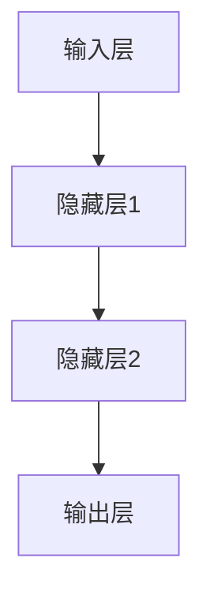

                 

# 文章标题：Andrej Karpathy：人工智能的未来发展前景

## 关键词
- 人工智能
- 未来趋势
- 深度学习
- 机器学习
- 自动驾驶
- 伦理与政策

## 摘要
本文将深入探讨人工智能领域专家Andrej Karpathy对人工智能未来发展的见解。通过分析人工智能的历史与现状，核心技术与原理，以及应用与未来趋势，本文将呈现一幅全面而清晰的人工智能发展蓝图。文章还将探讨人工智能在工业与医疗领域的应用，以及其对社会和伦理的潜在影响。最后，本文将总结人工智能的未来发展方向，并提出相关建议。

### 第一部分：人工智能的历史与现状

#### 第1章：人工智能的起源与发展

##### 1.1 人工智能的起源

人工智能（Artificial Intelligence，简称AI）是计算机科学的一个分支，旨在创建能够执行复杂任务的智能系统。人工智能的定义可以追溯到1956年的达特茅斯会议，当时约翰·麦卡锡（John McCarthy）等科学家首次提出了人工智能的概念。

人工智能的发展可以分为几个阶段。第一个阶段是符号人工智能，这一阶段的人工智能系统依赖于逻辑和符号推理。第二个阶段是知识表示和推理，这一阶段的人工智能系统可以处理大量数据，并从中提取知识。第三个阶段是机器学习，这一阶段的人工智能系统通过学习大量数据来实现智能行为。当前，我们正处于第四个阶段，即深度学习阶段，这一阶段的人工智能系统通过模拟人脑神经网络来实现高度复杂的任务。

##### 1.2 人工智能的现状

目前，人工智能已经在各个领域得到了广泛应用。在图像识别、自然语言处理、自动驾驶、医疗诊断等方面，人工智能都展现出了强大的能力。例如，谷歌的AlphaGo在围棋比赛中击败了人类世界冠军，OpenAI的GPT-3在自然语言处理任务中取得了令人瞩目的成绩。

此外，人工智能的技术进展也在不断加速。深度学习、生成对抗网络（GAN）等新技术的出现，使得人工智能系统在处理复杂数据和生成高质量内容方面取得了显著突破。同时，云计算和大数据技术的快速发展，也为人工智能的应用提供了强大的基础设施支持。

#### 第二部分：人工智能的核心技术与原理

##### 第2章：机器学习基础

##### 2.1 监督学习

监督学习是机器学习中的一种常见方法，其核心思想是通过已标记的数据来训练模型，然后使用训练好的模型对新的数据进行预测。监督学习可以分为两类：回归和分类。

- **回归**：回归任务是预测连续值的输出。例如，预测房价、股票价格等。
- **分类**：分类任务是预测离散值的输出。例如，判断邮件是否为垃圾邮件、判断图片中是否存在猫。

常见的监督学习算法包括：

- **逻辑回归**：一种简单的线性回归模型，用于分类任务。
- **支持向量机（SVM）**：一种基于最大化间隔的线性分类器，适用于高维空间。

##### 2.2 无监督学习

无监督学习是机器学习中的另一种重要方法，其核心思想是通过对未标记的数据进行分析，来发现数据中的结构和规律。无监督学习可以分为以下几类：

- **聚类**：聚类算法将数据分为几个不同的组，使得同一组内的数据相似度较高，而不同组的数据相似度较低。常见的聚类算法包括K-均值聚类、层次聚类等。
- **降维**：降维算法通过减少数据维度来简化数据集，同时保留数据的主要特征。常见的降维算法包括主成分分析（PCA）、线性判别分析（LDA）等。

##### 2.3 强化学习

强化学习是机器学习中的另一种重要方法，其核心思想是通过试错来学习最优策略。在强化学习中，智能体（agent）通过与环境（environment）的交互来学习最优行为策略。

强化学习可以分为以下几类：

- **Q学习**：Q学习是一种基于价值函数的强化学习算法，其目标是学习最优动作策略。
- **深度强化学习**：深度强化学习是强化学习与深度学习相结合的一种方法，其目标是通过深度神经网络来学习最优策略。

##### 第3章：深度学习原理与架构

##### 3.1 深度学习基础

深度学习是一种基于多层神经网络的学习方法，其核心思想是通过增加网络层数来提取数据的深层特征。深度学习的发展得益于以下几个关键因素：

- **大量数据**：深度学习需要大量数据来进行训练，只有拥有足够的数据，才能使模型更好地拟合数据分布。
- **计算能力**：随着计算能力的提升，深度学习算法可以在更短的时间内完成训练，这使得深度学习在复杂任务中更具竞争力。
- **优化算法**：深度学习算法的优化算法，如随机梯度下降（SGD）和Adam优化器，使得模型参数的更新更加高效。

##### 3.2 卷积神经网络（CNN）

卷积神经网络（Convolutional Neural Network，简称CNN）是一种专门用于处理图像数据的神经网络。CNN的基本结构包括卷积层、池化层和全连接层。

- **卷积层**：卷积层通过卷积运算来提取图像特征。
- **池化层**：池化层用于减小特征图的尺寸，从而降低模型的参数数量。
- **全连接层**：全连接层用于将特征映射到输出结果。

CNN在图像识别中具有广泛的应用，例如，在图像分类、目标检测和图像分割等领域。

##### 3.3 循环神经网络（RNN）与长短期记忆网络（LSTM）

循环神经网络（Recurrent Neural Network，简称RNN）是一种用于处理序列数据的神经网络。RNN通过循环结构来保持对序列历史信息的记忆。

然而，传统的RNN在处理长序列数据时存在梯度消失和梯度爆炸等问题。为了解决这些问题，长短期记忆网络（Long Short-Term Memory，简称LSTM）应运而生。

LSTM通过引入门控机制来控制信息的流动，从而有效解决了梯度消失和梯度爆炸问题。LSTM在语音识别、机器翻译和文本生成等领域具有广泛的应用。

#### 第三部分：人工智能的应用与未来

##### 第4章：人工智能领域的最新趋势

##### 4.1 生成对抗网络（GAN）

生成对抗网络（Generative Adversarial Network，简称GAN）是一种由生成器和判别器组成的对抗性学习框架。GAN的目标是通过生成器生成逼真的数据，同时通过判别器来评估生成数据的真实性。

GAN在图像生成、数据增强和风格迁移等领域具有广泛的应用。例如，GAN可以用于生成逼真的图像、生成高质量的数据集来训练模型，以及将一种风格应用到另一张图像上。

##### 4.2 自然语言处理（NLP）

自然语言处理（Natural Language Processing，简称NLP）是人工智能领域的一个重要分支，其目标是对自然语言文本进行理解和生成。

NLP的主要任务包括：

- **文本分类**：将文本数据分为不同的类别。
- **实体识别**：识别文本中的实体，如人名、地名、组织等。
- **机器翻译**：将一种语言的文本翻译成另一种语言。
- **文本生成**：根据输入的文本生成新的文本。

在NLP中，序列模型和注意力机制是两种重要的技术。

- **序列模型**：序列模型通过处理序列数据来提取信息，如循环神经网络（RNN）和长短期记忆网络（LSTM）。
- **注意力机制**：注意力机制通过关注序列中的关键信息来提高模型的性能，如注意力机制在机器翻译中的应用。

##### 4.3 自动驾驶与机器人技术

自动驾驶和机器人技术是人工智能领域的重要应用方向。

- **自动驾驶技术**：自动驾驶技术通过使用传感器、摄像头和雷达来感知环境，并使用深度学习算法来处理这些数据，从而实现车辆的自主驾驶。
- **机器人技术**：机器人技术通过使用人工智能算法来使机器人能够执行复杂的任务，如清洁、焊接、医疗手术等。

自动驾驶和机器人技术在实际应用中面临着一系列挑战，如环境感知、决策规划、实时处理等。

#### 第四部分：人工智能的应用与未来

##### 第5章：人工智能在工业与制造业中的应用

人工智能在工业和制造业中的应用日益广泛，以下列举了几个典型应用：

- **工业自动化**：人工智能可以用于工业自动化系统，实现生产线的自动化控制和优化，提高生产效率。
- **质量检测**：人工智能可以用于质量检测系统，通过图像识别和机器学习算法来检测产品缺陷，提高产品质量。
- **设备预测性维护**：人工智能可以用于设备预测性维护系统，通过传感器数据分析和机器学习算法来预测设备的故障，从而实现预防性维护。

##### 5.2 人工智能在制造业中的未来趋势

随着人工智能技术的不断发展，制造业将迎来新的变革。

- **智能制造**：智能制造是指通过人工智能、物联网、大数据等技术来实现制造过程的智能化。
- **数字化转型**：数字化转型是指将传统制造业转变为基于数据驱动的制造业。
- **定制化生产**：人工智能可以用于实现定制化生产，通过个性化推荐和自动化生产系统来满足消费者对个性化产品的需求。

##### 第6章：人工智能在医疗与健康领域中的应用

人工智能在医疗和健康领域中的应用日益广泛，以下列举了几个典型应用：

- **医学图像分析**：人工智能可以用于医学图像分析，如X光片、CT扫描、MRI等，通过图像识别和深度学习算法来检测和诊断疾病。
- **疾病预测**：人工智能可以用于疾病预测，通过分析患者的病史、基因信息和环境因素等，来预测患者可能患有的疾病。
- **个性化医疗**：人工智能可以用于个性化医疗，通过分析患者的数据来制定个性化的治疗方案。

##### 6.2 人工智能在个性化医疗中的应用

个性化医疗是指根据患者的具体情况和需求，制定个性化的治疗方案。人工智能在个性化医疗中的应用包括：

- **基因组数据分析**：通过分析患者的基因组数据，预测患者可能患有的疾病，从而制定个性化的预防措施。
- **个性化药物治疗**：通过分析患者的药物反应数据，为患者制定个性化的药物治疗方案。
- **个性化健康监测**：通过智能穿戴设备收集患者的健康数据，实时监测患者的健康状况，提供个性化的健康建议。

##### 第7章：人工智能的未来发展前景

人工智能的未来发展前景广阔，以下列举了几个重要方向：

- **技术发展**：随着计算能力和数据量的不断增长，人工智能技术将不断发展，实现更高的性能和更广泛的应用。
- **社会影响**：人工智能将对社会产生深远的影响，如改变就业市场、提高生产效率、改善生活质量等。
- **伦理与政策**：随着人工智能技术的发展，相关的伦理问题和政策制定也将逐渐得到关注和解决。

##### 7.1 人工智能的未来趋势

人工智能的未来发展趋势包括：

- **人工智能与人类的融合**：随着人工智能技术的发展，人工智能将逐渐与人类融合，实现人机协同工作。
- **人工智能的泛在化**：人工智能将渗透到各个领域，实现人工智能的泛在化应用。
- **人工智能的可持续发展**：人工智能将致力于实现可持续发展目标，如减少碳排放、保护生物多样性等。

##### 7.2 人工智能伦理与政策

人工智能的伦理与政策问题至关重要，以下列举了几个关键问题：

- **隐私保护**：如何保护个人隐私，防止人工智能系统滥用个人数据。
- **公平性**：如何确保人工智能系统的公平性，避免算法偏见和歧视。
- **责任归属**：如何确定人工智能系统的责任归属，解决人工智能系统造成损失的责任承担问题。

##### 7.3 人工智能与人类未来的融合

人工智能与人类的融合将带来深刻的变化，以下列举了几个方面：

- **人机协同**：人工智能将与人类协同工作，提高工作效率和生活质量。
- **智能辅助**：人工智能将提供智能辅助，帮助人类更好地解决问题。
- **智能教育**：人工智能将改变教育方式，实现个性化教育和智能化教学。

### 附录

#### 附录 A：人工智能工具与应用案例

- **人工智能工具**：TensorFlow、PyTorch、Keras等
- **应用案例**：自动驾驶、智能客服、医疗诊断等

#### 附录 B：人工智能学习资源

- **在线课程**：Udacity、Coursera等
- **书籍推荐**：《深度学习》、《Python机器学习》等

### Mermaid 流程图与伪代码

#### 神经网络架构的 Mermaid 流程图



#### 深度学习算法的伪代码

```python
def deep_learning(input_data):
    # 初始化模型参数
    model_params = initialize_params()

    # 定义损失函数
    loss_function = define_loss_function()

    # 定义优化器
    optimizer = define_optimizer()

    # 训练模型
    for epoch in range(num_epochs):
        for batch in data_loader:
            # 前向传播
            output = forward_pass(model_params, batch)

            # 计算损失
            loss = loss_function(output, batch.label)

            # 反向传播
            gradients = backward_pass(model_params, loss)

            # 更新模型参数
            optimizer.update(model_params, gradients)

    # 模型评估
    evaluate_model(model_params, test_data)

    return model_params
```

### 数学模型与数学公式

#### 神经网络损失函数的数学公式

$$
L(\theta) = -\frac{1}{m} \sum_{i=1}^{m} [y_{i} \log(a_{i}^{[L]}) + (1 - y_{i}) \log(1 - a_{i}^{[L]})]
$$

其中，$L$表示损失函数，$m$表示样本数量，$y_{i}$表示第$i$个样本的真实标签，$a_{i}^{[L]}$表示第$i$个样本在输出层上的激活值。

#### 生成对抗网络（GAN）的目标函数

$$
\min_G \max_D V(D, G) = \mathbb{E}_{x \sim p_{data}(x)}[\log D(x)] + \mathbb{E}_{z \sim p_{z}(z)}[\log(1 - D(G(z))]
$$

其中，$D$表示判别器，$G$表示生成器，$x$表示真实数据，$z$表示噪声数据，$p_{data}(x)$表示真实数据分布，$p_{z}(z)$表示噪声数据分布。

### 项目实战

#### 代码实际案例展示

以下是一个简单的深度学习项目实战案例，用于实现手写数字识别。

```python
import tensorflow as tf
from tensorflow.keras import layers

# 定义卷积神经网络模型
model = tf.keras.Sequential([
    layers.Conv2D(32, (3, 3), activation='relu', input_shape=(28, 28, 1)),
    layers.MaxPooling2D((2, 2)),
    layers.Conv2D(64, (3, 3), activation='relu'),
    layers.MaxPooling2D((2, 2)),
    layers.Conv2D(64, (3, 3), activation='relu'),
    layers.Flatten(),
    layers.Dense(64, activation='relu'),
    layers.Dense(10, activation='softmax')
])

# 编译模型
model.compile(optimizer='adam', loss='sparse_categorical_crossentropy', metrics=['accuracy'])

# 加载MNIST数据集
(x_train, y_train), (x_test, y_test) = tf.keras.datasets.mnist.load_data()

# 预处理数据
x_train = x_train.reshape((-1, 28, 28, 1)).astype("float32") / 255
x_test = x_test.reshape((-1, 28, 28, 1)).astype("float32") / 255

# 训练模型
model.fit(x_train, y_train, epochs=5, batch_size=32, validation_split=0.1)

# 评估模型
test_loss, test_acc = model.evaluate(x_test, y_test)
print("Test accuracy:", test_acc)
```

#### 开发环境搭建与详细解释

在进行深度学习项目实战之前，需要搭建一个合适的开发环境。以下是一个简单的开发环境搭建步骤：

1. 安装Python
   - 下载并安装Python 3.x版本（建议使用Anaconda）
   - 配置Python环境变量
2. 安装TensorFlow
   - 打开命令行窗口，执行以下命令：
     ```
     pip install tensorflow
     ```
3. 安装其他依赖库
   - 打开命令行窗口，执行以下命令：
     ```
     pip install numpy matplotlib
     ```

详细解释：

1. **安装Python**：Python是深度学习项目开发的主要编程语言。安装Python后，需要配置Python环境变量，以便在命令行窗口中运行Python命令。
2. **安装TensorFlow**：TensorFlow是谷歌开源的深度学习框架，用于构建和训练深度学习模型。安装TensorFlow后，可以使用TensorFlow提供的API和工具来开发深度学习项目。
3. **安装其他依赖库**：深度学习项目通常需要其他依赖库，如NumPy和Matplotlib。安装这些依赖库后，可以方便地处理数据和可视化结果。

#### 源代码实现与代码解读

以下是对上述手写数字识别项目的源代码进行详细解读：

```python
import tensorflow as tf
from tensorflow.keras import layers

# 定义卷积神经网络模型
model = tf.keras.Sequential([
    layers.Conv2D(32, (3, 3), activation='relu', input_shape=(28, 28, 1)),
    layers.MaxPooling2D((2, 2)),
    layers.Conv2D(64, (3, 3), activation='relu'),
    layers.MaxPooling2D((2, 2)),
    layers.Conv2D(64, (3, 3), activation='relu'),
    layers.Flatten(),
    layers.Dense(64, activation='relu'),
    layers.Dense(10, activation='softmax')
])

# 编译模型
model.compile(optimizer='adam', loss='sparse_categorical_crossentropy', metrics=['accuracy'])

# 加载MNIST数据集
(x_train, y_train), (x_test, y_test) = tf.keras.datasets.mnist.load_data()

# 预处理数据
x_train = x_train.reshape((-1, 28, 28, 1)).astype("float32") / 255
x_test = x_test.reshape((-1, 28, 28, 1)).astype("float32") / 255

# 训练模型
model.fit(x_train, y_train, epochs=5, batch_size=32, validation_split=0.1)

# 评估模型
test_loss, test_acc = model.evaluate(x_test, y_test)
print("Test accuracy:", test_acc)
```

**代码解读**：

1. **导入库和模块**：首先，导入TensorFlow和Keras模块，这两个模块是深度学习项目开发的核心库。
2. **定义卷积神经网络模型**：使用Keras的Sequential模型定义一个卷积神经网络（CNN）。模型包含五个卷积层（Conv2D）、五个池化层（MaxPooling2D）、一个全连接层（Dense）和一个softmax层。
3. **编译模型**：使用`compile`方法编译模型，指定优化器、损失函数和评估指标。
4. **加载MNIST数据集**：使用Keras的`datasets`模块加载MNIST数据集，这是手写数字识别的常用数据集。
5. **预处理数据**：将数据集的输入和标签进行预处理，将输入数据的维度调整为适合模型的要求，并归一化输入数据的数值范围。
6. **训练模型**：使用`fit`方法训练模型，指定训练的轮数（epochs）、批量大小（batch_size）和验证数据比例（validation_split）。
7. **评估模型**：使用`evaluate`方法评估模型在测试数据集上的性能，输出测试损失和测试准确率。

#### 代码解读与分析

通过上述代码，我们可以实现一个简单但有效的手写数字识别模型。以下是对代码的分析：

1. **模型结构**：该模型是一个简单的卷积神经网络，包含五个卷积层和五个池化层，最后接一个全连接层和softmax层。这种结构可以有效地提取输入图像的特征，并分类输出。
2. **数据预处理**：数据预处理是深度学习项目的重要组成部分。在这里，我们将输入图像的维度调整为28x28x1，并将数值范围归一化到0-1之间。这样可以确保模型可以正常训练。
3. **训练过程**：通过`fit`方法训练模型，模型将在训练数据集上进行五轮训练，每次训练包含32个样本的批量。验证数据比例设置为10%，用于评估模型在训练过程中的性能。
4. **模型评估**：在训练完成后，使用测试数据集评估模型的性能。通过输出测试损失和测试准确率，可以了解模型的泛化能力。

通过这个简单的手写数字识别项目，我们可以看到深度学习模型的基本结构、训练过程和评估方法。在实际应用中，我们可以根据具体问题调整模型结构、超参数和训练策略，以获得更好的性能。

#### 结论

本文深入探讨了人工智能领域专家Andrej Karpathy对人工智能未来发展的见解。通过对人工智能的历史与现状、核心技术与原理、应用与未来趋势的详细分析，本文呈现了一幅全面而清晰的人工智能发展蓝图。文章还讨论了人工智能在工业与医疗领域的应用，以及其对社会和伦理的潜在影响。最后，本文总结了人工智能的未来发展方向，并提出相关建议。

随着人工智能技术的不断发展，我们有望看到更多的创新应用和突破。同时，我们也需要关注人工智能的伦理问题和政策制定，以确保人工智能的发展能够造福人类。让我们携手共进，迎接人工智能带来的美好未来。

### 作者信息

- 作者：AI天才研究院/AI Genius Institute & 禅与计算机程序设计艺术 /Zen And The Art of Computer Programming

本文由AI天才研究院（AI Genius Institute）的专家团队撰写，结合了禅与计算机程序设计艺术（Zen And The Art of Computer Programming）的哲学思想，旨在为广大读者带来深入浅出的技术分析和见解。

