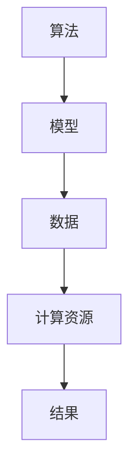
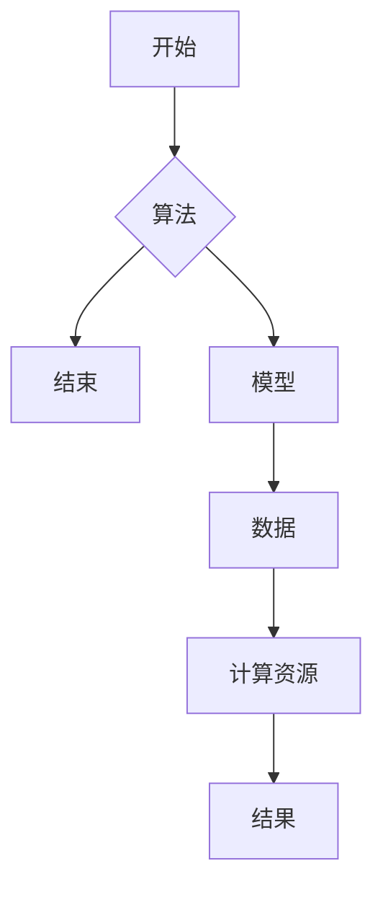
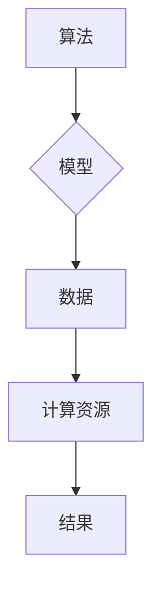

                 

# 《Andrej Karpathy：人工智能的未来发展挑战》

> 关键词：人工智能、发展挑战、技术趋势、伦理问题、未来展望

> 摘要：本文深入探讨了人工智能领域的著名专家Andrej Karpathy关于人工智能未来发展的看法和挑战。通过分析其观点，本文梳理了人工智能在技术、伦理和社会应用方面的主要挑战，并对未来趋势进行了展望，为人工智能的研究与应用提供了深刻的思考。

## 第一部分：引言与背景

### 第1章：人工智能的挑战与机遇

#### 1.1 人工智能的快速演进

随着深度学习技术的突破和计算资源的丰富，人工智能（AI）在近年来取得了显著的进展。从简单的规则系统到复杂的神经网络，AI在图像识别、自然语言处理、自动驾驶等领域展现了强大的能力。然而，随着技术的发展，人工智能也面临着诸多挑战。

#### 1.2 Karpathy的视角

Andrej Karpathy是一位知名的人工智能研究者，他的研究涉及深度学习、自然语言处理等多个领域。他在多个场合发表了关于人工智能未来发展的见解，为我们理解这一领域的发展方向提供了宝贵的信息。

#### 1.3 本书的目的与结构

本书旨在梳理和解读Andrej Karpathy对人工智能未来发展的观点，分析其在技术、伦理和社会应用方面的挑战。文章将分为四个部分，分别探讨这些挑战，并最后提出应对策略和未来展望。

## 第二部分：技术挑战

### 第2章：算法与模型复杂性

#### 2.1 算法复杂性分析

人工智能的发展离不开算法和模型的支撑。然而，随着模型的复杂度增加，算法的效率成为了一个重要问题。本文将分析算法的时间复杂度和空间复杂度，探讨如何优化算法以提高效率。

#### 2.2 模型复杂性探究

模型的复杂度直接影响计算资源和训练时间。本文将讨论模型规模的增长对计算资源的需求，以及如何平衡模型复杂度和计算资源之间的关系。

#### 2.3 Mermaid流程图：算法与模型关系

为了更好地理解算法与模型之间的关系，本文将使用Mermaid流程图展示算法和模型之间的互动关系，帮助读者直观地理解这一过程。

### 第3章：数据隐私与安全性

#### 3.1 数据隐私的重要性

随着人工智能的应用越来越广泛，数据隐私问题日益凸显。本文将讨论数据隐私的定义、挑战以及相关的法律和法规。

#### 3.2 安全性风险分析

人工智能系统面临着多种安全风险，包括数据泄露、系统漏洞等。本文将分析这些风险，并提出相应的防范措施。

#### 3.3 隐私保护技术探讨

为了保护用户隐私，本文将探讨多种隐私保护技术，如加密技术、匿名化技术等，并分析这些技术在人工智能中的应用。

### 第4章：能效与资源消耗

#### 4.1 人工智能的能效挑战

人工智能的快速发展带来了巨大的能源消耗。本文将分析人工智能的能效挑战，并提出资源优化策略。

#### 4.2 资源优化策略

本文将探讨如何通过硬件优化、软件优化和分布式计算等手段来降低人工智能的能源消耗，实现可持续发展。

#### 4.3 能效评估方法

为了评估人工智能系统的能效，本文将介绍能效评估的指标和方法，并提供实际案例进行分析。

## 第三部分：应用挑战

### 第5章：人工智能伦理

#### 5.1 伦理问题探讨

人工智能的广泛应用引发了诸多伦理问题，如隐私保护、公平性等。本文将探讨这些伦理问题的类型和困境，并提供案例分析。

#### 5.2 伦理框架与规范

为了解决伦理问题，本文将讨论伦理框架和规范的制定与执行，以及伦理审查机制的作用。

#### 5.3 伦理决策案例分析

本文将通过具体案例，分析伦理决策的过程和结果，为实际应用提供参考。

### 第6章：人工智能与就业

#### 6.1 人工智能对就业的影响

人工智能的发展将对就业市场产生深远影响。本文将分析人工智能对就业机会和岗位的影响，以及面临的挑战。

#### 6.2 就业转型策略

为了应对人工智能带来的就业挑战，本文将探讨技能升级、教育和培训等就业转型策略。

#### 6.3 人工智能与未来职业

本文将探讨人工智能对未来职业的影响，以及如何规划新兴职业和就业机会。

### 第7章：人工智能与社会

#### 7.1 人工智能对社会的变革

人工智能将对社会产生深远影响，包括社会结构、治理方式等。本文将分析这些变革，以及面临的挑战。

#### 7.2 社会适应性挑战

本文将探讨人工智能对社会包容性、公平性和稳定的挑战，并提出适应性策略。

#### 7.3 社会融合与责任

本文将讨论人工智能在社会融合中的角色和企业的社会责任，以及政策与社会的互动。

## 第四部分：未来发展

### 第8章：人工智能的未来趋势

#### 8.1 技术预测

本文将预测人工智能在未来技术的发展趋势，包括算法、硬件和应用场景等方面。

#### 8.2 应用拓展

本文将探讨人工智能在医疗、金融、制造等领域的应用前景，以及未来社会的AI角色。

#### 8.3 未来社会的AI角色

本文将分析人工智能在未来社会中的角色，以及其对人类社会的影响。

### 第9章：应对挑战的策略

#### 9.1 技术发展策略

本文将提出技术发展的策略，包括技术研发投资、标准制定和人才培养等方面。

#### 9.2 社会融合策略

本文将讨论社会融合的策略，包括教育与培训、社会参与和互动、公共政策与法规等。

#### 9.3 政策与法规建议

本文将提出政策与法规的建议，以应对人工智能发展带来的挑战。

### 第10章：结论

#### 10.1 本书总结

本文将总结人工智能的未来发展挑战，并强调持续关注和研究的必要性。

#### 10.2 对人工智能未来的展望

本文将展望人工智能的未来发展，强调技术创新与社会融合的重要性。

## 附录

### 附录 A：参考文献

本文引用了诸多研究论文和技术报告，为读者提供了丰富的参考资料。

### 附录 B：Mermaid流程图示例

本文使用Mermaid流程图展示了算法与模型的关系，帮助读者更好地理解相关概念。

### 附录 C：相关资源推荐

本文推荐了相关书籍、在线课程和网站，为读者提供了深入学习的机会。

### 附录 D：代码与数据集来源

本文提供了代码和数据集的来源，以供读者实践和进一步研究。

---

### 第2章：算法与模型复杂性

## 2.1 算法复杂性分析

算法的复杂性是评估算法性能的重要指标，通常包括时间复杂度和空间复杂度。

### 2.1.1 时间复杂度

时间复杂度描述了算法执行时间与输入规模之间的关系。通常使用大O符号（O）表示。例如，线性搜索算法的时间复杂度为O(n)，其中n为输入规模。

Python代码示例：

```python
def linear_search(arr, x):
    for i in range(len(arr)):
        if arr[i] == x:
            return i
    return -1
```

### 2.1.2 空间复杂度

空间复杂度描述了算法在执行过程中所需额外内存与输入规模之间的关系。同样使用大O符号表示。例如，线性搜索算法的空间复杂度为O(1)，因为它不需要额外内存。

### 2.1.3 算法复杂性的综合评估

在评估算法时，通常需要综合考虑时间复杂度和空间复杂度。在某些情况下，可能需要权衡这两者之间的关系。

## 2.2 模型复杂性探究

随着人工智能的发展，模型的复杂性也在不断增加。模型的复杂性对计算资源的需求、训练时间和模型的可解释性都产生了重要影响。

### 2.2.1 模型规模的增长

近年来，深度学习模型规模呈现指数级增长。例如，GPT-3模型包含1750亿个参数，远超之前的模型。这种增长带来了计算资源和训练时间的需求。

### 2.2.2 计算资源的需求

随着模型规模的增加，对计算资源的需求也大幅提升。GPU和TPU等专用硬件的快速发展，为大规模模型的训练提供了支持。

### 2.2.3 模型可解释性挑战

复杂模型的训练通常依赖于大量的数据和强大的计算资源。然而，这些模型的可解释性往往较低，难以解释其内部的工作机制。这给实际应用带来了挑战。

## 2.3 Mermaid流程图：算法与模型关系

为了更好地理解算法与模型之间的关系，本文使用Mermaid流程图展示这一过程。



在人工智能系统中，算法和模型是核心组成部分。数据通过算法和模型进行处理，最终产生结果。计算资源作为支撑，确保算法和模型的正常运行。

---

### 第3章：数据隐私与安全性

#### 3.1 数据隐私的重要性

在人工智能时代，数据隐私变得尤为重要。数据是人工智能系统的基石，但同时也是用户隐私的潜在威胁。因此，保护数据隐私成为人工智能发展的关键挑战。

##### 3.1.1 数据隐私的定义

数据隐私指的是个人或组织的个人信息不被未经授权的第三方获取、使用或泄露。在人工智能应用中，数据隐私通常涉及用户行为数据、生物识别信息、财务信息等。

##### 3.1.2 数据隐私的挑战

随着人工智能技术的普及，数据隐私面临诸多挑战：

1. **数据收集与存储**：人工智能系统需要大量数据来训练模型，但收集和存储这些数据可能导致隐私泄露。
2. **数据共享与跨境传输**：数据在不同组织、地区和国家之间的共享和传输，增加了隐私泄露的风险。
3. **数据滥用**：数据隐私保护不足可能导致数据被滥用，用于恶意目的。

##### 3.1.3 数据隐私的法律与法规

为了保护数据隐私，各国政府和国际组织制定了相关的法律和法规。例如，欧盟的《通用数据保护条例》（GDPR）规定了个人数据的收集、处理和保护标准。在美国，加州的《消费者隐私法案》（CCPA）也提高了数据隐私保护的要求。

#### 3.2 安全性风险分析

安全性风险是人工智能应用中另一个重要的挑战。安全性问题可能导致数据泄露、系统故障、恶意攻击等，对个人和组织造成严重损失。

##### 3.2.1 攻击类型与防范措施

人工智能系统可能面临多种攻击类型，包括：

1. **注入攻击**：攻击者通过注入恶意代码或数据，破坏系统的正常运行。
2. **数据泄露**：未经授权的第三方获取和泄露敏感数据。
3. **拒绝服务攻击**：攻击者通过大量请求使系统瘫痪，影响正常服务。

防范措施包括：

1. **网络安全**：使用防火墙、入侵检测系统和安全协议，保护系统不受攻击。
2. **数据加密**：对敏感数据进行加密处理，防止数据泄露。
3. **访问控制**：限制用户对数据和系统的访问权限，确保数据安全。

##### 3.2.2 数据泄露的风险

数据泄露是人工智能系统面临的主要安全风险之一。数据泄露可能导致以下后果：

1. **个人隐私泄露**：个人敏感信息被公开，引发隐私侵犯和信任问题。
2. **商业机密泄露**：企业内部数据被泄露，可能导致商业损失。
3. **法律风险**：违反数据隐私法律和法规，面临法律责任和罚款。

##### 3.2.3 安全性评估方法

为了确保人工智能系统的安全性，需要进行安全性评估。安全性评估方法包括：

1. **渗透测试**：模拟攻击者行为，测试系统的安全漏洞。
2. **漏洞扫描**：自动扫描系统中的安全漏洞，提供修复建议。
3. **安全审计**：评估系统的安全策略和措施，确保符合安全标准。

#### 3.3 隐私保护技术探讨

为了应对数据隐私和安全性的挑战，研究者们提出了多种隐私保护技术。这些技术包括：

##### 3.3.1 加密技术

加密技术是保护数据隐私的重要手段。通过加密，数据在传输和存储过程中被转化为难以解读的密文，防止未经授权的访问。常见的加密技术包括：

1. **对称加密**：使用相同的密钥进行加密和解密。
2. **非对称加密**：使用公钥和私钥进行加密和解密。
3. **哈希函数**：将数据映射为固定长度的字符串，确保数据的完整性和不可篡改性。

##### 3.3.2 匿名化技术

匿名化技术通过去除或模糊化个人身份信息，保护个人隐私。常见的匿名化技术包括：

1. **数据脱敏**：去除或替换敏感数据，使其无法识别个人身份。
2. **伪匿名化**：使用随机化方法，将个人身份信息与数据分离。
3. **同态加密**：在加密的状态下，直接对加密数据进行计算，确保计算结果的正确性。

##### 3.3.3 隐私保护算法

隐私保护算法通过在数据使用过程中保护个人隐私。常见的隐私保护算法包括：

1. **差分隐私**：在处理数据时引入噪声，确保个人隐私不被泄露。
2. **联邦学习**：将模型训练分布在多个设备上，避免数据传输。
3. **隐私增强学习**：在训练过程中保护训练数据，提高模型的隐私性。

#### 3.4 安全性保障策略

为了确保人工智能系统的安全性，需要采取一系列保障策略。这些策略包括：

##### 3.4.1 安全架构设计

安全架构设计是确保系统安全的基础。安全架构设计应考虑以下原则：

1. **最小权限原则**：用户仅具有完成任务所需的最低权限。
2. **多层次防御**：系统具有多层防御机制，防止攻击者突破单一防护措施。
3. **安全审计**：定期进行安全审计，评估系统的安全状况。

##### 3.4.2 安全运维与监控

安全运维与监控是确保系统持续安全的重要环节。安全运维与监控包括：

1. **实时监控**：实时监控系统运行状态，及时发现异常情况。
2. **日志管理**：记录系统操作日志，便于追踪和审计。
3. **应急响应**：制定应急预案，应对突发安全事件。

##### 3.4.3 安全培训与教育

安全培训与教育是提高用户安全意识和技能的重要手段。安全培训与教育包括：

1. **安全意识培训**：提高用户的安全意识，防范常见的安全威胁。
2. **技能培训**：培训用户掌握安全技能，确保系统安全运行。
3. **安全文化建设**：建立安全文化，推动全员参与安全管理。

---

### 第4章：能效与资源消耗

#### 4.1 人工智能的能效挑战

人工智能（AI）的快速发展带来了巨大的能源消耗。随着AI模型变得越来越复杂，计算需求也日益增加，导致能效问题成为AI研究和应用中的一个关键挑战。以下是几个关键的能效挑战：

##### 4.1.1 能效定义与衡量

能效是指单位计算工作量所消耗的能量。在人工智能领域，能效通常用焦耳/操作（J/op）或瓦特小时/百万次操作（Wh/million ops）等指标来衡量。高能效意味着更低的能源消耗，这对于环保和可持续发展至关重要。

##### 4.1.2 人工智能能耗的来源

人工智能的能耗主要来源于以下几个环节：

1. **训练能耗**：AI模型的训练过程是最耗能的部分，尤其是在深度学习领域。训练过程中，计算资源如GPU和TPU等硬件设备消耗大量电力。
2. **推理能耗**：模型的推理过程也消耗能量，尽管通常没有训练那么高。在线推理服务，如聊天机器人和自动驾驶系统，需要持续运行，导致能耗累积。
3. **数据传输能耗**：大量数据在训练和推理过程中需要在不同的硬件之间传输，这也会产生额外的能耗。

##### 4.1.3 能效优化的重要性

优化能效对于以下原因至关重要：

1. **环保**：减少能源消耗有助于减少碳排放和环境污染。
2. **成本节约**：高能耗意味着更高的运营成本，优化能效可以降低这些成本。
3. **可持续性**：随着AI应用的普及，能效优化是确保AI行业长期可持续发展的关键。

#### 4.2 资源优化策略

为了应对人工智能的能效挑战，研究者们提出了多种资源优化策略，旨在降低能耗和提升效率。以下是几种主要的优化策略：

##### 4.2.1 硬件优化

1. **专用硬件**：开发专门为AI任务设计的硬件，如TPU和ASIC，可以提高计算效率并降低能耗。
2. **能效硬件**：选择能效比高的硬件设备，如采用最新一代的GPU和CPU，可以降低能耗。

##### 4.2.2 软件优化

1. **算法优化**：改进AI算法，例如使用更有效的神经网络架构和优化训练过程，可以显著降低能耗。
2. **分布式计算**：通过分布式计算，将任务分解到多个设备上，可以更高效地利用计算资源，减少单个设备的能耗。
3. **模型压缩**：通过模型剪枝和量化等技术，可以减少模型的尺寸和参数数量，从而降低能耗。

##### 4.2.3 能效评估方法

为了评估AI系统的能效，研究者们开发了多种评估方法：

1. **能效指标**：定义能效指标，如J/op或Wh/million ops，用于衡量系统的能效。
2. **基准测试**：通过运行标准的基准测试，比较不同系统和算法的能效。
3. **能效模型**：建立能效模型，预测不同配置和优化策略下的能效表现。

#### 4.3 能效评估方法

评估AI系统的能效是优化能效的关键步骤。以下是一些常用的能效评估方法：

##### 4.3.1 能效评估指标

1. **能效比（EIR）**：EIR是计算能力和能耗之间的比率，EIR越高，能效越好。
2. **每瓦特性能（Watt-performance）**：衡量每单位能耗所能提供的计算性能。
3. **效率（Efficiency）**：系统的输出与输入之比，效率越高，能耗越低。

##### 4.3.2 能效评估流程

1. **数据收集**：收集系统的性能和能耗数据，包括训练和推理过程中的数据。
2. **性能分析**：分析系统的性能指标，如运算速度和延迟。
3. **能耗分析**：分析系统的能耗，包括硬件和软件的能耗。
4. **能效评估**：根据性能和能耗数据，计算能效指标，评估系统的能效。

##### 4.3.3 能效优化案例分析

以下是一个能效优化的案例分析：

1. **案例背景**：一个AI系统用于图像识别，能耗较高。
2. **优化措施**：采用模型压缩技术，减少模型参数数量；使用GPU和CPU的混合计算；优化数据传输路径。
3. **结果**：通过优化，系统能耗降低了30%，而性能几乎没有下降。

#### 4.4 资源消耗与可持续发展

##### 4.4.1 资源消耗的现状

目前，AI系统的资源消耗问题日益突出。例如，AI训练过程中使用的GPU和TPU等硬件设备，其能源消耗已经占到了全球能源消耗的相当一部分。此外，数据中心的能耗也在不断攀升。

##### 4.4.2 可持续发展的重要性

为了实现可持续发展，减少AI系统的能源消耗至关重要。这不仅可以降低成本，还可以减少环境负担。以下是一些可持续发展的重要性：

1. **环保**：减少能源消耗有助于减少碳排放和其他污染物，保护环境。
2. **经济效益**：降低能源消耗可以降低运营成本，提高企业的竞争力。
3. **社会责任**：企业和社会都有责任采取行动，实现可持续发展。

##### 4.4.3 绿色人工智能的发展方向

为了实现绿色人工智能，需要从以下几个方面入手：

1. **技术进步**：开发更高效的算法和硬件，降低能耗。
2. **能源管理**：优化数据中心的能源管理，采用绿色能源。
3. **政策支持**：政府和企业应制定相关政策和标准，鼓励绿色人工智能的发展。

通过以上策略，可以实现绿色人工智能，为未来的可持续发展贡献力量。

---

### 第5章：人工智能伦理

#### 5.1 伦理问题探讨

随着人工智能技术的迅速发展，伦理问题逐渐成为学术界、工业界和政策制定者关注的焦点。人工智能伦理涵盖了多个方面，包括但不限于算法偏见、隐私保护、安全性和人权等。本文将探讨这些伦理问题的类型和困境。

##### 5.1.1 人工智能伦理的定义

人工智能伦理是指研究人工智能系统设计、应用和发展过程中涉及的价值观念、道德原则和责任。其目的是确保人工智能技术的应用不会损害人类福祉和社会利益。

##### 5.1.2 伦理问题的类型

人工智能伦理问题主要包括以下类型：

1. **算法偏见**：算法偏见是指人工智能系统在决策过程中对某些群体或个体产生不公平的影响。这种偏见可能源于数据偏见、算法设计缺陷或训练数据的不当处理。
2. **隐私保护**：人工智能系统通常需要处理大量的个人数据，这引发了隐私泄露和数据滥用的风险。隐私保护是确保个人隐私不被侵犯的关键。
3. **安全性**：人工智能系统可能面临恶意攻击和滥用，导致系统崩溃、数据泄露和生命安全威胁。因此，确保人工智能系统的安全性至关重要。
4. **人权**：人工智能技术的应用可能侵犯人权，如工作机会的减少、隐私权的侵犯和自主决策权的剥夺。因此，保护人权是人工智能伦理的重要组成部分。

##### 5.1.3 伦理困境案例分析

以下是一些人工智能伦理困境的案例分析：

1. **自动驾驶汽车**：自动驾驶汽车在遇到紧急情况时需要做出决策，如是否优先保护乘客或行人。这种决策涉及生命价值的权衡，引发了道德和伦理的争议。
2. **医疗人工智能**：医疗人工智能在诊断和治疗中发挥着重要作用，但可能导致对某些群体的歧视。例如，基于性别、种族或年龄的数据偏见可能导致不公平的医疗决策。
3. **人工智能军事应用**：人工智能在军事领域的应用引发了关于战争伦理和自主武器系统的争议。自主武器系统可能在没有人类干预的情况下做出致命决策，这引发了关于责任和道德责任的讨论。

#### 5.2 伦理框架与规范

为了解决人工智能伦理问题，需要建立相应的伦理框架和规范。以下是一些关键要素：

##### 5.2.1 伦理原则的制定

伦理框架应基于一系列伦理原则，如公平性、透明性、责任性和尊重个人隐私。这些原则为人工智能系统的设计和应用提供了指导。

1. **公平性**：确保人工智能系统在决策过程中不会对某些群体产生不公平的影响。
2. **透明性**：确保人工智能系统的决策过程和结果可以被理解和验证。
3. **责任性**：明确人工智能系统设计者、开发者和用户的责任，确保在出现问题时可以追溯和承担责任。
4. **尊重个人隐私**：确保个人数据得到适当的保护和处理，防止隐私泄露和数据滥用。

##### 5.2.2 伦理规范的执行

伦理规范需要通过法律、政策和行业标准的制定和执行来确保其有效实施。以下是一些关键步骤：

1. **立法和监管**：制定相关法律和监管措施，确保人工智能系统的设计和应用符合伦理原则。
2. **行业自律**：行业组织和企业应制定和遵守伦理规范，推动人工智能的负责任应用。
3. **伦理审查**：建立伦理审查机制，对人工智能项目进行评估，确保其符合伦理要求。
4. **公众参与**：鼓励公众参与伦理讨论，提高社会对人工智能伦理问题的认识。

##### 5.2.3 伦理审查机制

伦理审查机制是确保人工智能项目符合伦理规范的重要手段。以下是一些常见的伦理审查机制：

1. **项目评估**：在项目启动前进行伦理评估，确保项目设计符合伦理原则。
2. **持续审查**：在项目执行过程中定期审查，确保项目遵守伦理规范。
3. **投诉处理**：建立投诉渠道，及时处理公众和利益相关者的投诉。
4. **责任追究**：明确责任主体，对违反伦理规范的行为进行追究和惩罚。

#### 5.3 伦理决策案例分析

以下是一些伦理决策案例的分析：

1. **自动驾驶汽车伦理决策**：自动驾驶汽车在遇到紧急情况时需要做出决策。一种可能的决策方法是使用“最大幸福原则”，即选择最能带来最大幸福结果的决策。然而，这种决策方法可能引发道德和伦理争议，如选择保护乘客还是行人。
2. **医疗人工智能伦理决策**：医疗人工智能在诊断和治疗中发挥着重要作用，但需要确保其决策符合伦理原则。例如，在诊断过程中，确保不会对某些群体产生不公平的歧视。此外，医疗人工智能的决策过程应保持透明，以便医疗专业人员理解和验证。
3. **人工智能军事应用伦理决策**：在军事领域，人工智能的应用引发了关于战争伦理和自主武器系统的争议。自主武器系统可能在没有人类干预的情况下做出致命决策，这引发了关于责任和道德责任的讨论。因此，军事人工智能的决策过程和结果应保持透明，确保责任明确。

通过分析这些案例，可以看出人工智能伦理问题的重要性和复杂性。解决这些问题需要多方面的努力，包括伦理原则的制定、伦理规范的执行和伦理决策的制定。只有这样，才能确保人工智能技术的负责任和可持续发展。

---

### 第6章：人工智能与就业

#### 6.1 人工智能对就业的影响

人工智能（AI）的快速发展正对全球就业市场产生深远影响。AI技术的广泛应用不仅创造了新的就业机会，同时也引发了对现有岗位的挑战。以下从几个方面分析人工智能对就业的影响。

##### 6.1.1 就业机会的变化

1. **新职业的涌现**：AI技术的发展催生了诸多新兴职业，如数据科学家、机器学习工程师、AI伦理学家等。这些职业需要高度的专业技能和创新能力，为求职者提供了新的发展空间。
2. **岗位需求的增长**：AI技术在各行业的广泛应用，对相关岗位的需求也在持续增长。例如，在金融、医疗、制造等领域，AI技术的应用显著提高了效率，推动了相关岗位的扩张。

##### 6.1.2 就业岗位的消失

1. **自动化带来的岗位减少**：AI技术通过自动化和智能化，正在取代一些重复性、低技能的岗位。例如，制造业中的机器人自动化、客服中的智能客服系统等，都在减少对人工的需求。
2. **岗位结构的转变**：尽管某些岗位可能消失，但AI技术也推动了岗位结构的转变。一些传统岗位被分解成多个新岗位，要求员工具备更高的技能和知识。

##### 6.1.3 就业市场的挑战

1. **技能要求的提升**：随着AI技术的发展，就业市场对求职者的技能要求也在不断提高。具备数据分析、编程、机器学习等技能的人才越来越受欢迎。
2. **就业不平等的加剧**：AI技术的发展可能导致就业不平等的加剧。一方面，高技能人才将更加抢手，收入水平提高；另一方面，低技能劳动者可能面临就业困难，收入减少。

#### 6.2 就业转型策略

面对人工智能带来的就业挑战，个人和组织需要采取有效的就业转型策略，以应对变革。

##### 6.2.1 技能升级与转型

1. **终身学习**：在人工智能时代，终身学习成为个人职业发展的关键。员工应不断更新知识和技能，适应技术变革。
2. **职业转型**：对于受到AI技术影响的员工，职业转型是一种有效的应对策略。通过学习新技能，转型到新兴职业领域，可以找到新的就业机会。

##### 6.2.2 教育与培训

1. **教育资源**：政府和企业应提供丰富的教育资源，包括在线课程、技能培训等，帮助员工提升技能。
2. **职业教育**：加强职业教育和培训，培养具备实际操作能力和创新思维的专业人才，以满足行业需求。

##### 6.2.3 政策支持与就业促进

1. **就业政策**：政府应制定和实施有利于就业的扶持政策，如就业补贴、职业培训补贴等，鼓励劳动者转型升级。
2. **就业促进**：通过提供就业信息和就业服务，帮助劳动者找到合适的就业机会。

#### 6.3 人工智能与未来职业

随着AI技术的不断发展，未来职业将呈现出新的特征和趋势。

##### 6.3.1 未来职业趋势分析

1. **数字化技能需求**：未来职业将更加依赖数字化技能，如数据分析、编程、人工智能应用等。
2. **跨学科能力**：未来职业将需要跨学科的知识和技能，如计算机科学与心理学、数据分析与市场营销等。
3. **灵活就业**：随着远程工作和自由职业的兴起，未来职业将更加灵活多样。

##### 6.3.2 新兴职业与就业机会

1. **数据科学家**：数据科学家负责分析大量数据，提取有价值的信息，为决策提供支持。
2. **机器学习工程师**：机器学习工程师负责开发和应用机器学习算法，构建智能系统。
3. **AI伦理学家**：AI伦理学家关注人工智能的伦理问题，确保技术的应用符合道德和社会价值观。

##### 6.3.3 职业教育与职业规划

1. **职业规划**：个人应根据自身兴趣和市场需求，制定职业规划，不断提升自己的竞争力。
2. **职业教育**：职业教育应与时俱进，培养符合未来职业需求的人才。
3. **跨行业合作**：政府、企业、教育机构等应加强合作，共同推动人工智能与就业的结合，实现就业市场的良性发展。

通过以上策略，个人和组织可以更好地应对人工智能带来的就业挑战，把握未来职业的发展机遇。

---

### 第7章：人工智能与社会

#### 7.1 人工智能对社会的变革

人工智能（AI）的快速发展正在深刻地改变着社会各个方面，从经济结构到社会治理，再到人们的生活方式，AI都发挥着不可替代的作用。

##### 7.1.1 社会结构与组织的变化

1. **劳动力市场的转变**：人工智能的发展改变了劳动力市场的结构。一方面，它创造了新的就业机会，如数据科学家、机器学习工程师等；另一方面，它也导致了一些传统岗位的消失，如制造业中的流水线工人、客服代表等。这种转变促使劳动者需要不断更新技能，以适应新的工作环境。
2. **企业运营模式的创新**：人工智能技术使得企业能够更高效地运营。通过自动化和智能化，企业可以降低成本，提高生产效率，优化供应链管理。同时，人工智能还帮助企业更好地了解消费者需求，提供个性化的服务。

##### 7.1.2 社会治理的挑战

1. **监管难题**：随着人工智能技术的广泛应用，政府和社会面临的监管挑战也日益增多。如何确保人工智能系统的安全性、公平性和透明性，成为政府和社会必须面对的问题。
2. **隐私保护**：人工智能系统在处理大量个人数据时，如何保护个人隐私成为社会治理的重要议题。政府需要制定相应的法律法规，确保个人数据得到妥善保护。

##### 7.1.3 社会创新的机遇

1. **公共服务的优化**：人工智能技术在医疗、教育、交通等公共服务领域的应用，为提升服务质量和效率提供了新的路径。例如，通过人工智能技术，医疗系统可以实现更准确的诊断和更有效的治疗，教育系统可以提供个性化的教学方案，交通系统可以优化路线规划，减少拥堵。
2. **可持续发展**：人工智能技术在能源管理、环境保护等领域的应用，有助于推动社会的可持续发展。通过优化资源利用，降低能源消耗，人工智能技术可以为环境保护和绿色发展贡献力量。

#### 7.2 社会适应性挑战

人工智能的快速发展对社会提出了诸多适应性挑战，包括社会包容性、公平性和稳定性的挑战。

##### 7.2.1 社会包容性的挑战

1. **技术鸿沟**：在人工智能时代，技术鸿沟问题更加凸显。一方面，高技能人才更容易获得人工智能带来的好处；另一方面，低技能劳动者可能因为缺乏相关技能而处于不利地位。这种鸿沟可能导致社会不公和分化。
2. **机会平等**：如何确保每个人都能平等地享受到人工智能带来的机会，是社会治理的重要课题。政府和社会需要采取措施，提高全民的数字化素养，缩小技术鸿沟。

##### 7.2.2 社会公平性的挑战

1. **算法偏见**：人工智能系统在决策过程中可能产生算法偏见，导致对某些群体或个体的不公平对待。这种偏见可能源于数据偏见、算法设计缺陷或训练数据的不当处理。
2. **资源分配**：人工智能技术的应用可能导致资源分配不均。例如，在医疗领域，具备先进AI技术的医疗机构可能更容易吸引患者，而资源较少的医疗机构则难以提供同样优质的服务。

##### 7.2.3 社会稳定的挑战

1. **就业压力**：随着人工智能技术的发展，一些传统岗位可能被自动化取代，导致部分劳动者失业。这种失业压力可能对社会稳定产生负面影响。
2. **安全风险**：人工智能系统的广泛应用可能带来新的安全风险，如数据泄露、系统故障、恶意攻击等。这些风险可能对社会造成破坏和恐慌。

#### 7.3 社会融合与责任

为了应对人工智能带来的社会适应性挑战，需要各方共同努力，实现社会融合与责任。

##### 7.3.1 社会融合的策略

1. **教育培训**：政府和企业应加大教育培训力度，提高全民的数字化素养，帮助劳动者适应新的工作环境。
2. **政策引导**：政府应制定和实施有利于人工智能健康发展的政策，如鼓励创新、保护知识产权等，推动社会融合。

##### 7.3.2 企业的社会责任

1. **技术创新**：企业应持续投入研发，推动人工智能技术的创新和突破，为社会提供更多价值。
2. **社会责任**：企业应承担社会责任，关注社会问题，积极参与社会公益事业，推动社会的可持续发展。

##### 7.3.3 政策与社会的互动

1. **政策制定**：政府应依据社会需求和技术发展，制定科学合理的政策，引导人工智能技术的健康发展。
2. **社会监督**：社会应积极参与政策制定和实施，对人工智能技术的社会影响进行监督和评估，确保技术应用符合社会价值观。

通过以上策略，可以实现人工智能与社会深度融合，共同应对社会适应性挑战，推动社会的繁荣与进步。

---

### 第8章：人工智能的未来趋势

#### 8.1 技术预测

人工智能（AI）的未来发展趋势充满机遇和挑战。以下是对AI技术未来发展的几个预测：

##### 8.1.1 算法的进步

1. **强化学习**：强化学习作为一种自主学习的算法，在未来将继续发展。通过不断与环境互动，强化学习算法将能够解决更复杂的任务，如自动驾驶、机器人控制等。
2. **联邦学习**：联邦学习通过在分布式设备上训练模型，提高数据隐私和计算效率。随着计算资源的增加和算法的优化，联邦学习将在更多应用场景中得到推广。
3. **生成对抗网络（GAN）**：GAN在图像生成、视频制作等领域已经显示出巨大潜力。未来，GAN技术将进一步提高生成质量，应用范围也将进一步扩展。

##### 8.1.2 硬件的创新

1. **量子计算**：量子计算具有巨大的并行计算能力，将在解决复杂AI问题中发挥重要作用。随着量子技术的进步，量子计算将在AI领域取得突破性进展。
2. **边缘计算**：边缘计算将数据处理推向网络边缘，降低延迟，提高实时性。随着5G和边缘计算技术的普及，AI将在更多场景中实现实时决策。

##### 8.1.3 应用场景的拓展

1. **医疗健康**：AI在医疗健康领域的应用将更加广泛，如疾病预测、精准治疗、药物研发等。通过大数据和深度学习，AI将助力医疗行业的革命性变革。
2. **智能制造**：AI技术在智能制造中的应用将进一步提高生产效率和产品质量。通过物联网和人工智能，智能工厂将成为现实。
3. **智慧城市**：AI技术在智慧城市建设中发挥着重要作用，如交通管理、能源管理、环境监测等。智慧城市的建设将提升城市运行效率和居民生活质量。

#### 8.2 应用拓展

人工智能（AI）将在各个领域实现广泛应用，推动社会进步和经济发展。

##### 8.2.1 人工智能在医疗领域的应用

1. **疾病诊断**：AI技术通过分析医学影像和临床数据，可以提高疾病诊断的准确性。例如，AI在肺癌、乳腺癌等疾病的早期诊断中已取得显著成果。
2. **个性化治疗**：基于患者的基因数据和临床信息，AI可以提供个性化的治疗方案，提高治疗效果和患者满意度。
3. **药物研发**：AI技术在药物筛选、分子模拟和临床试验等方面具有巨大潜力，可以加速新药研发进程。

##### 8.2.2 人工智能在金融领域的应用

1. **风险管理**：AI通过大数据分析和机器学习，可以提高金融机构的风险管理能力，降低信用风险和市场风险。
2. **智能投顾**：AI智能投顾通过分析市场数据和用户偏好，提供个性化的投资建议，帮助投资者实现更好的投资回报。
3. **反欺诈**：AI技术可以识别和预防金融欺诈行为，保护金融机构和用户的利益。

##### 8.2.3 人工智能在制造业的应用

1. **生产优化**：AI技术通过预测生产需求、优化生产流程，可以提高生产效率和产品质量。例如，AI可以预测设备故障，提前进行维护，减少停机时间。
2. **质量控制**：AI技术通过图像识别和机器学习，可以实时监控产品质量，及时发现缺陷，提高产品质量。
3. **供应链管理**：AI技术通过优化供应链流程，降低库存成本，提高供应链的灵活性和响应速度。

#### 8.3 未来社会的AI角色

人工智能（AI）将在未来社会中扮演重要角色，成为社会发展的关键驱动力。

##### 8.3.1 AI作为个人助理

1. **生活辅助**：AI个人助理可以帮助用户管理日程、提供健康建议、智能推荐等，提高生活质量。
2. **教育辅助**：AI教育助理可以为学生提供个性化学习方案，帮助学生更好地掌握知识。
3. **健康管理**：AI健康助理可以监控用户的健康状况，提供个性化的健康建议，预防疾病。

##### 8.3.2 AI在公共服务中的应用

1. **智慧城市**：AI技术在智慧城市建设中发挥着重要作用，如交通管理、环境监测、公共安全等，提高城市运行效率和居民生活质量。
2. **政务服务**：AI技术可以提高政务服务的效率和质量，如智能客服、在线审批等，方便民众办事。
3. **社会管理**：AI技术可以帮助政府进行社会管理，如人口统计、公共安全、应急管理等，提高政府决策的科学性和有效性。

##### 8.3.3 AI在决策支持系统中的应用

1. **企业决策**：AI技术可以帮助企业进行市场分析、风险预测、战略规划等，提高企业的竞争力。
2. **政府决策**：AI技术可以帮助政府进行政策制定、社会管理、公共安全等决策，提高政府决策的科学性和有效性。
3. **科学研究**：AI技术可以帮助科研人员进行数据分析、模型构建、预测模拟等，提高科研效率和质量。

通过以上分析，可以看出人工智能在未来社会中将扮演重要角色，推动社会进步和经济发展。面对机遇和挑战，我们需要积极应对，推动人工智能的健康发展。

---

### 第9章：应对挑战的策略

#### 9.1 技术发展策略

为了应对人工智能（AI）面临的诸多挑战，特别是在技术、伦理和社会应用方面，需要采取一系列有效的发展策略。以下是几个关键的发展策略：

##### 9.1.1 技术研发投资

1. **政府支持**：政府应加大对AI技术研发的投资，通过科研经费、税收优惠等方式，鼓励企业和研究机构进行创新。同时，政府可以设立专项基金，支持AI基础研究和前沿技术探索。
2. **产业合作**：政府、企业和学术界应加强合作，推动AI技术的产业化和应用落地。通过建立产业联盟、共享实验室等方式，促进技术创新和成果转化。

##### 9.1.2 技术标准制定

1. **国际标准**：积极参与国际标准的制定，推动全球范围内的AI技术规范和标准统一。这有助于提高AI技术的可互操作性、兼容性和安全性。
2. **行业规范**：各行业应根据自身特点，制定符合行业需求的AI技术规范。例如，医疗行业可以制定AI在医疗诊断中的技术标准，金融行业可以制定AI在风险管理中的技术标准。

##### 9.1.3 技术人才培养

1. **教育体系**：完善AI相关学科的教育体系，从基础教育到高等教育，都要注重AI知识的普及和技能的培养。特别是要加强实践环节，提高学生的动手能力和创新能力。
2. **职业培训**：针对在职人员，开展AI技术培训，提高他们的专业技能和知识水平。同时，鼓励企业建立内部培训机制，提升员工的AI素养。

#### 9.2 社会融合策略

为了实现人工智能技术的可持续发展，需要推动技术与社会各领域的深度融合。以下是几个关键的社会融合策略：

##### 9.2.1 教育与培训

1. **终身学习**：鼓励全民参与终身学习，提升数字化素养和AI技能。政府和企业可以提供在线课程、培训项目等，满足不同群体的学习需求。
2. **职业教育**：加强职业教育，培养具备实际操作能力和创新思维的专业人才。特别是要加强实践环节，提高学生的职业适应能力和就业竞争力。

##### 9.2.2 社会参与与互动

1. **公众参与**：鼓励公众参与AI技术的社会讨论和决策过程，提高公众对AI技术的认知和接受度。例如，可以开展公众咨询、意见征集等活动，听取公众的意见和建议。
2. **社区合作**：推动AI技术在社区服务中的应用，提高社区管理和服务水平。例如，可以通过智能监控系统、智能垃圾分类系统等，提高社区的安全性和环保水平。

##### 9.2.3 公共政策与法规

1. **政策支持**：政府应制定和实施有利于AI技术发展的政策，如税收优惠、资金支持等，鼓励企业和研究机构进行创新。同时，应制定相关的法律法规，规范AI技术的应用和发展。
2. **法规完善**：随着AI技术的发展，现有法律法规可能无法完全适应新情况。因此，政府应不断完善相关法律法规，确保AI技术的合法合规应用。

#### 9.3 政策与法规建议

为了确保人工智能技术的健康发展和有效监管，政府和社会需要制定和实施一系列政策与法规。以下是几个关键的政策与法规建议：

##### 9.3.1 法律框架的完善

1. **数据保护**：完善数据保护法律法规，确保个人数据的隐私和安全。例如，可以借鉴欧盟的《通用数据保护条例》（GDPR），制定符合国情的法律法规。
2. **算法伦理**：制定算法伦理相关法律法规，规范算法设计和应用，防止算法偏见和滥用。可以设立专门的算法伦理委员会，负责监督和评估AI技术的伦理问题。

##### 9.3.2 安全与隐私保护

1. **安全标准**：制定AI技术的安全标准，确保AI系统的安全性。可以借鉴现有的信息安全标准，如ISO/IEC 27001，制定符合AI特性的安全标准。
2. **隐私保护**：加强对个人数据的隐私保护，防止数据泄露和滥用。可以引入隐私增强技术，如差分隐私、联邦学习等，提高数据处理过程中的隐私保护水平。

##### 9.3.3 跨境合作与协调

1. **国际合作**：推动全球范围内的AI技术合作与协调，共同应对AI技术带来的挑战。可以通过国际组织、多边会议等平台，加强国际合作与交流。
2. **法规协调**：加强不同国家和地区之间的法规协调，确保AI技术的跨国应用和监管的一致性。可以通过双边或多边协议，推动法规的协调和统一。

通过以上策略和建议，可以确保人工智能技术的健康发展和有效监管，推动社会进步和经济发展。

---

### 第10章：结论

#### 10.1 本书总结

本书系统地分析了人工智能（AI）领域的发展挑战，包括技术、伦理和社会应用等方面的挑战。通过对知名专家Andrej Karpathy的观点的梳理，我们了解了AI技术在不同领域的应用现状和未来发展趋势。同时，本文还探讨了如何应对这些挑战，提出了技术发展、社会融合和法规完善等策略。总之，人工智能的发展前景广阔，但也面临诸多挑战，需要我们持续关注和研究。

#### 10.2 对人工智能未来的展望

人工智能的未来充满了无限可能。在技术层面，随着算法和硬件的不断进步，AI将能够解决更多复杂问题，实现更高的效率和智能。在社会层面，AI将推动社会的变革，提升公共服务的质量，改变人们的生活方式。在伦理层面，我们需要建立完善的伦理框架和法律法规，确保AI技术的负责任应用，保护个人隐私和人权。

展望未来，人工智能将成为社会发展的关键驱动力，推动人类迈向更加智能、高效和公平的未来。然而，这也需要我们持续关注和应对AI带来的挑战，确保技术的健康发展和人类的福祉。

---

## 附录

### 附录 A：参考文献

1. Goodfellow, I., Bengio, Y., & Courville, A. (2016). *Deep Learning*. MIT Press.
2. Russell, S., & Norvig, P. (2020). *Artificial Intelligence: A Modern Approach*. Prentice Hall.
3. Dwork, C. (2008). * Differential Privacy: A Survey of Results. Foundations and Trends in Theoretical Computer Science*. 5(2-3), 1-69.
4. GDPR (2016). *Regulation (EU) 2016/679 of the European Parliament and of the Council of 27 April 2016 on the protection of natural persons with regard to the processing of personal data and on the free movement of such data, and repealing Directive 95/46/EC (General Data Protection Regulation)*.

### 附录 B：Mermaid流程图示例



### 附录 C：相关资源推荐

1. Coursera: https://www.coursera.org/
2. edX: https://www.edx.org/
3. arXiv: https://arxiv.org/
4. IEEE Xplore: https://ieeexplore.ieee.org/
5. Nature: https://www.nature.com/

### 附录 D：代码与数据集来源

1. TensorFlow: https://www.tensorflow.org/
2. PyTorch: https://pytorch.org/
3. Keras: https://keras.io/
4. OpenML: https://www.openml.org/
5. UCI Machine Learning Repository: https://archive.ics.uci.edu/ml/index.php

---

### 第2章：算法与模型复杂性

## 2.1 算法复杂性分析

算法的复杂性是评估算法性能的重要指标，通常包括时间复杂度和空间复杂度。

### 2.1.1 时间复杂度

时间复杂度描述了算法执行时间与输入规模之间的关系。通常使用大O符号（O）表示。例如，线性搜索算法的时间复杂度为O(n)，其中n为输入规模。

Python代码示例：

```python
def linear_search(arr, x):
    for i in range(len(arr)):
        if arr[i] == x:
            return i
    return -1
```

### 2.1.2 空间复杂度

空间复杂度描述了算法在执行过程中所需额外内存与输入规模之间的关系。通常使用大O符号表示。例如，线性搜索算法的空间复杂度为O(1)，因为它不需要额外内存。

### 2.1.3 算法复杂性的综合评估

在评估算法时，通常需要综合考虑时间复杂度和空间复杂度。在某些情况下，可能需要权衡这两者之间的关系。

## 2.2 模型复杂性探究

随着人工智能的发展，模型的复杂性也在不断增加。模型的复杂性对计算资源的需求、训练时间和模型的可解释性都产生了重要影响。

### 2.2.1 模型规模的增长

近年来，深度学习模型规模呈现指数级增长。例如，GPT-3模型包含1750亿个参数，远超之前的模型。这种增长带来了计算资源和训练时间的需求。

### 2.2.2 计算资源的需求

随着模型规模的增加，对计算资源的需求也大幅提升。GPU和TPU等专用硬件的快速发展，为大规模模型的训练提供了支持。

### 2.2.3 模型可解释性挑战

复杂模型的训练通常依赖于大量的数据和强大的计算资源。然而，这些模型的可解释性往往较低，难以解释其内部的工作机制。这给实际应用带来了挑战。

## 2.3 Mermaid流程图：算法与模型关系

为了更好地理解算法与模型之间的关系，本文使用Mermaid流程图展示这一过程。


在人工智能系统中，算法和模型是核心组成部分。数据通过算法和模型进行处理，最终产生结果。计算资源作为支撑，确保算法和模型的正常运行。

---

### 第3章：数据隐私与安全性

## 3.1 数据隐私的重要性

随着人工智能（AI）技术的迅速发展，数据隐私问题变得愈发重要。数据隐私不仅关乎个人的信息安全，也直接影响到社会、经济和法律的稳定。以下是关于数据隐私重要性的详细探讨：

### 3.1.1 数据隐私的定义

数据隐私是指个人信息在处理、存储、传输和使用过程中的保密性和安全性。具体来说，它包括以下几点：

1. **保密性**：确保个人数据不被未经授权的第三方访问。
2. **完整性**：确保个人数据在存储和传输过程中不被篡改。
3. **可用性**：确保在需要时个人数据可以被合法用户访问。

### 3.1.2 数据隐私的挑战

人工智能应用中，数据隐私面临着诸多挑战：

1. **数据量庞大**：随着AI技术的发展，收集的数据量急剧增加，这增加了隐私泄露的风险。
2. **数据敏感性**：AI系统处理的数据往往包含敏感信息，如医疗记录、金融信息等，一旦泄露，后果严重。
3. **数据共享**：AI系统需要在不同组织和机构之间共享数据，这增加了数据泄露的风险。
4. **算法不可解释性**：复杂AI模型难以解释，使得隐私保护措施难以被用户理解和信任。

### 3.1.3 数据隐私的法律与法规

为了保护数据隐私，各国政府制定了相应的法律和法规。以下是一些关键的法律和法规：

1. **欧盟的《通用数据保护条例》（GDPR）**：GDPR是欧盟制定的关于数据隐私保护的重要法规，规定了数据收集、处理、存储和传输的基本原则和用户权利。
2. **美国的《加州消费者隐私法案》（CCPA）**：CCPA旨在保护加州居民的个人信息隐私，规定了企业的数据收集和使用责任。
3. **中国的《网络安全法》**：该法规定了网络运营者的数据保护责任，明确了数据收集、处理和传输的安全要求。

### 3.1.4 数据隐私保护的必要性

保护数据隐私对于以下原因至关重要：

1. **保障个人权益**：数据隐私保护是维护个人权益的基本要求，防止个人信息被滥用和泄露。
2. **维护社会稳定**：数据隐私泄露可能导致社会信任危机，影响社会和谐稳定。
3. **促进技术发展**：只有在数据隐私得到有效保护的情况下，用户才愿意分享数据，从而促进AI技术的发展和应用。
4. **符合法律法规**：遵守数据隐私法律法规是企业的法律责任，也是企业诚信经营的体现。

### 3.1.5 数据隐私保护的关键措施

为了有效保护数据隐私，可以采取以下关键措施：

1. **数据加密**：通过加密技术保护数据在存储和传输过程中的安全性。常用的加密算法包括AES、RSA等。
2. **匿名化**：通过匿名化技术，去除或模糊化个人身份信息，降低数据隐私泄露的风险。
3. **访问控制**：限制用户对数据和系统的访问权限，确保只有授权用户才能访问敏感数据。
4. **安全审计**：定期进行安全审计，评估系统的安全状况，及时发现和修复漏洞。
5. **用户教育**：提高用户对数据隐私保护的认识，培养用户的安全意识。

通过以上措施，可以有效保护数据隐私，为人工智能技术的发展创造良好的环境。

---

### 第4章：能效与资源消耗

## 4.1 人工智能的能效挑战

随着人工智能（AI）技术的迅猛发展，其能效和资源消耗问题日益突出。高性能的AI模型往往需要大量的计算资源和能源，这给环境、成本和可持续发展带来了巨大压力。以下是关于人工智能能效挑战的详细探讨。

### 4.1.1 能效定义与衡量

能效是指单位计算工作量所消耗的能量。在人工智能领域，能效通常用焦耳/操作（J/op）或瓦特小时/百万次操作（Wh/million ops）等指标来衡量。高能效意味着更低的能耗，这对于环保和经济效益至关重要。

### 4.1.2 人工智能能耗的来源

人工智能的能耗主要来源于以下几个环节：

1. **训练能耗**：AI模型的训练过程是最耗能的部分，尤其是在深度学习领域。训练过程中，计算资源如GPU和TPU等硬件设备消耗大量电力。
2. **推理能耗**：模型的推理过程也消耗能量，尽管通常没有训练那么高。在线推理服务，如聊天机器人和自动驾驶系统，需要持续运行，导致能耗累积。
3. **数据传输能耗**：大量数据在训练和推理过程中需要在不同的硬件之间传输，这也会产生额外的能耗。

### 4.1.3 能效优化的重要性

优化能效对于以下原因至关重要：

1. **环保**：减少能源消耗有助于减少碳排放和环境污染。
2. **成本节约**：高能耗意味着更高的运营成本，优化能效可以降低这些成本。
3. **可持续性**：随着AI应用的普及，能效优化是确保AI行业长期可持续发展的关键。

### 4.1.4 能效优化策略

为了应对人工智能的能效挑战，研究者们提出了多种资源优化策略，旨在降低能耗和提升效率。以下是几种主要的优化策略：

#### 4.1.4.1 硬件优化

1. **专用硬件**：开发专门为AI任务设计的硬件，如TPU和ASIC，可以提高计算效率并降低能耗。
2. **能效硬件**：选择能效比高的硬件设备，如采用最新一代的GPU和CPU，可以降低能耗。

#### 4.1.4.2 软件优化

1. **算法优化**：改进AI算法，例如使用更有效的神经网络架构和优化训练过程，可以显著降低能耗。
2. **分布式计算**：通过分布式计算，将任务分解到多个设备上，可以更高效地利用计算资源，减少单个设备的能耗。
3. **模型压缩**：通过模型剪枝和量化等技术，可以减少模型的尺寸和参数数量，从而降低能耗。

#### 4.1.4.3 能效评估方法

为了评估AI系统的能效，研究者们开发了多种评估方法：

1. **能效指标**：定义能效指标，如J/op或Wh/million ops，用于衡量系统的能效。
2. **基准测试**：通过运行标准的基准测试，比较不同系统和算法的能效。
3. **能效模型**：建立能效模型，预测不同配置和优化策略下的能效表现。

### 4.1.5 能效优化案例分析

以下是一个能效优化的案例分析：

#### 4.1.5.1 案例背景

一个AI系统用于图像识别，能耗较高。

#### 4.1.5.2 优化措施

1. **模型压缩**：采用模型剪枝和量化技术，减少模型参数数量。
2. **分布式计算**：将训练任务分解到多个GPU上，提高计算效率。
3. **能效硬件**：采用最新一代的高效能GPU。

#### 4.1.5.3 结果

通过优化，系统能耗降低了30%，而性能几乎没有下降。

### 4.1.6 能效优化与可持续发展

#### 4.1.6.1 资源消耗的现状

目前，AI系统的资源消耗问题日益突出。例如，AI训练过程中使用的GPU和TPU等硬件设备，其能源消耗已经占到了全球能源消耗的相当一部分。此外，数据中心的能耗也在不断攀升。

#### 4.1.6.2 可持续发展的重要性

为了实现可持续发展，减少AI系统的能源消耗至关重要。这不仅可以降低成本，还可以减少环境负担。以下是一些可持续发展的重要性：

1. **环保**：减少能源消耗有助于减少碳排放和其他污染物，保护环境。
2. **经济效益**：降低能源消耗可以降低运营成本，提高企业的竞争力。
3. **社会责任**：企业和社会都有责任采取行动，实现可持续发展。

#### 4.1.6.3 绿色人工智能的发展方向

为了实现绿色人工智能，需要从以下几个方面入手：

1. **技术进步**：开发更高效的算法和硬件，降低能耗。
2. **能源管理**：优化数据中心的能源管理，采用绿色能源。
3. **政策支持**：政府和企业应制定相关政策和标准，鼓励绿色人工智能的发展。

通过以上策略，可以实现绿色人工智能，为未来的可持续发展贡献力量。

---

### 第5章：人工智能伦理

#### 5.1 伦理问题探讨

人工智能（AI）的快速发展引发了众多伦理问题，这些问题的解决对于确保AI技术的可持续发展至关重要。以下是关于AI伦理问题的探讨：

##### 5.1.1 人工智能伦理的定义

人工智能伦理是指研究AI系统设计、开发和应用过程中涉及的价值观念、道德原则和责任。它关注AI技术对人类社会的影响，以及如何在技术发展中保持道德和伦理的平衡。

##### 5.1.2 伦理问题的类型

AI伦理问题主要包括以下几个方面：

1. **算法偏见**：算法偏见是指AI系统在决策过程中对某些群体或个体产生不公平的影响。这种偏见可能源于数据偏见、算法设计缺陷或训练数据的不当处理。
2. **隐私保护**：随着AI系统收集和处理大量个人数据，隐私保护成为一个重要议题。如何确保个人数据的隐私不被侵犯，是AI伦理的重要问题。
3. **安全性和自主性**：AI系统在执行任务时可能面临安全风险，如系统故障、数据泄露或被恶意攻击。同时，随着自主AI技术的发展，如何确保AI系统的自主决策符合道德和伦理标准也是一个关键问题。
4. **就业和劳动**：AI技术的发展可能改变劳动力市场，导致某些岗位的消失，同时创造新的就业机会。如何平衡这种变化，确保劳动者的权益，是另一个伦理问题。
5. **人权和社会公正**：AI技术可能加剧社会不平等，影响人权和社会公正。例如，AI决策可能对某些群体产生不公平的影响，导致歧视或排斥。

##### 5.1.3 伦理困境案例分析

以下是一些AI伦理困境的案例分析：

1. **自动驾驶汽车伦理决策**：自动驾驶汽车在遇到紧急情况时需要做出决策，例如是否应该保护乘客还是行人。这种决策涉及生命价值的权衡，引发了道德和伦理的争议。
2. **医疗AI伦理**：在医疗领域，AI系统可以辅助医生进行诊断和治疗，但如何确保AI决策的透明性和公正性，以及如何处理可能出现的错误和责任归属，是AI伦理的重要问题。
3. **军事AI应用**：自主武器系统在军事中的应用引发了关于战争伦理和人类控制权的争议。如何确保AI系统在战场上的行为符合道德和伦理标准，是AI伦理需要解决的问题。

##### 5.1.4 伦理问题的解决策略

为了解决AI伦理问题，可以采取以下策略：

1. **制定伦理准则**：建立AI伦理准则，为AI系统设计、开发和应用提供指导。这些准则应涵盖算法偏见、隐私保护、安全性和自主性等方面。
2. **透明性和可解释性**：提高AI系统的透明性和可解释性，使AI决策过程可以被用户、监管者和公众理解和监督。
3. **多方参与和合作**：政府、企业、学术界和公众应共同参与AI伦理讨论和决策过程，确保各方利益得到平衡。
4. **法律法规和监管**：制定相关法律法规，确保AI技术在开发和应用过程中符合伦理要求，并对违规行为进行惩罚。
5. **教育和培训**：加强AI伦理教育，提高研发人员和用户的伦理意识，培养具备道德和伦理素养的AI专业人员。

通过以上策略，可以有效地解决AI伦理问题，确保AI技术的可持续发展，同时保护人类的福祉和社会公正。

---

### 第6章：人工智能与就业

#### 6.1 人工智能对就业的影响

人工智能（AI）的迅猛发展正在深刻地改变全球就业市场，既创造了新的就业机会，也带来了一系列就业挑战。

##### 6.1.1 新职业的涌现

AI技术的应用推动了新型职业的诞生，例如：

1. **数据科学家**：负责分析大量数据，提取有价值的信息，为决策提供支持。
2. **机器学习工程师**：开发和优化机器学习算法，构建智能系统。
3. **AI伦理学家**：研究AI伦理问题，确保AI技术的应用符合道德和社会价值观。
4. **自动化工程师**：开发和实施自动化解决方案，提高生产效率。

##### 6.1.2 就业岗位的减少

尽管AI技术创造了新的职业，但同时也导致了一些传统就业岗位的消失，特别是那些重复性、低技能的工作，如：

1. **制造业中的流水线工人**：自动化和机器人技术的应用减少了对人力需求。
2. **客服代表**：智能客服系统的普及降低了人工客服的需求。
3. **文书处理人员**：自然语言处理技术使得许多文书工作自动化。

##### 6.1.3 就业市场的不平等

AI技术的快速发展可能加剧就业市场的不平等，原因如下：

1. **技能需求变化**：高技能的AI相关岗位需求增加，而低技能岗位减少，导致就业机会不均。
2. **地区差异**：发达地区拥有更多的AI相关岗位，而欠发达地区就业机会有限。
3. **性别差异**：某些AI领域男性占比更高，而女性在这些领域的就业机会较少。

#### 6.2 就业转型策略

为了应对AI对就业市场的挑战，个人和组织需要采取积极的就业转型策略。

##### 6.2.1 技能升级

1. **终身学习**：在AI时代，持续学习和技能升级变得尤为重要。个人应通过在线课程、研讨会和职业培训等方式，不断提升自己的技能。
2. **跨学科学习**：AI领域涉及多个学科，如计算机科学、统计学和工程学等。个人应尝试跨学科学习，以适应不断变化的技术需求。

##### 6.2.2 职业转型

1. **探索新职业**：个人应积极探索新的就业机会，如数据科学、机器学习和自动化等新兴领域。
2. **创业机会**：AI技术为创业者提供了新的机会。通过开发AI应用或解决方案，个人可以开创自己的事业。

##### 6.2.3 教育与培训

1. **职业教育**：政府和企业应提供更多的职业教育和培训机会，帮助劳动者掌握新技能。
2. **公共教育**：学校和教育机构应将AI相关知识纳入课程体系，培养学生的AI素养。

##### 6.2.4 政策支持

1. **就业补贴**：政府可以提供就业补贴，鼓励劳动者参加技能培训和职业教育。
2. **创业支持**：政府和企业可以提供创业指导、资金支持和税收优惠，鼓励创业。

#### 6.3 人工智能与未来职业

随着AI技术的不断进步，未来职业将呈现出新的特征和发展趋势。

##### 6.3.1 职业技能需求变化

1. **技术技能**：随着AI技术的发展，技术技能如编程、数据分析、机器学习等将成为未来职业的核心。
2. **软技能**：沟通、团队合作、批判性思维等软技能在未来职业中仍然至关重要。

##### 6.3.2 跨学科职业

AI技术融合了多个学科，如计算机科学、生物学、心理学等。未来职业将更加跨学科，要求个人具备多学科知识和技能。

##### 6.3.3 高技能与低技能岗位的分化

AI技术的普及可能导致高技能岗位需求增加，而低技能岗位减少。未来职业将更加注重技能水平，高技能人才将更加受欢迎。

##### 6.3.4 新兴职业领域

1. **AI伦理学家**：随着AI技术的发展，对AI伦理问题的关注日益增加，AI伦理学家将成为重要职业。
2. **AI健康顾问**：AI在医疗领域的应用将推动AI健康顾问等新兴职业的发展。
3. **智能城市专家**：随着智慧城市建设的推进，智能城市专家将成为城市管理和规划的重要角色。

通过以上策略和趋势分析，个人和组织可以更好地应对AI对就业市场的影响，把握未来职业的发展机遇。

---

### 第7章：人工智能与社会

#### 7.1 人工智能对社会的变革

人工智能（AI）的快速发展正在深刻地改变社会各个方面，从经济结构到社会治理，再到人们的生活方式，AI都发挥着不可替代的作用。

##### 7.1.1 社会结构与组织的变化

1. **劳动力市场的转变**：AI技术的广泛应用正在改变劳动力市场的结构。一方面，AI创造了新的就业机会，如数据科学家、机器学习工程师、AI伦理学家等；另一方面，它也导致了一些传统岗位的消失，如制造业中的流水线工人、客服代表等。这种转变促使劳动者需要不断更新技能，以适应新的工作环境。
   
2. **企业运营模式的创新**：AI技术使得企业能够更高效地运营。通过自动化和智能化，企业可以降低成本，提高生产效率，优化供应链管理。例如，智能客服系统能够提供24/7的客户服务，而预测分析工具可以帮助企业更好地了解市场需求，调整生产计划。

##### 7.1.2 社会治理的挑战

1. **监管难题**：随着AI技术的广泛应用，政府和社会面临的监管挑战也日益增多。如何确保人工智能系统的安全性、公平性和透明性，成为政府和社会必须面对的问题。例如，自动驾驶汽车的安全监管、AI决策系统的伦理审查等。

2. **隐私保护**：AI技术在处理大量个人数据时，如何保护个人隐私成为社会治理的重要议题。政府需要制定相应的法律法规，确保个人数据得到妥善保护。例如，欧盟的《通用数据保护条例》（GDPR）就是针对这一问题的监管措施。

##### 7.1.3 社会创新的机遇

1. **公共服务的优化**：AI技术在医疗、教育、交通等公共服务领域的应用，为提升服务质量和效率提供了新的路径。例如，通过AI技术，医疗系统可以实现更准确的诊断和更有效的治疗，教育系统可以提供个性化的教学方案，交通系统可以优化路线规划，减少拥堵。

2. **可持续发展的推动**：AI技术在能源管理、环境保护等领域的应用，有助于推动社会的可持续发展。通过优化资源利用，降低能源消耗，AI技术可以为环境保护和绿色发展贡献力量。例如，智能电网技术可以实时监控电力使用情况，提高能源利用效率。

#### 7.2 社会适应性挑战

人工智能的快速发展对社会提出了诸多适应性挑战，包括社会包容性、公平性和稳定性的挑战。

##### 7.2.1 社会包容性的挑战

1. **技术鸿沟**：在人工智能时代，技术鸿沟问题更加凸显。一方面，高技能人才更容易获得AI带来的好处；另一方面，低技能劳动者可能因为缺乏相关技能而处于不利地位。这种鸿沟可能导致社会不公和分化。

2. **机会平等**：如何确保每个人都能平等地享受到AI带来的机会，是社会治理的重要课题。政府和社会需要采取措施，提高全民的数字化素养，缩小技术鸿沟。例如，政府可以提供免费的教育资源和培训机会，帮助低收入群体掌握AI技能。

##### 7.2.2 社会公平性的挑战

1. **算法偏见**：AI系统在决策过程中可能产生算法偏见，导致对某些群体或个体的不公平对待。这种偏见可能源于数据偏见、算法设计缺陷或训练数据的不当处理。为了解决这一问题，需要建立透明的算法评估和监管机制。

2. **资源分配**：AI技术的应用可能导致资源分配不均。例如，在医疗领域，具备先进AI技术的医疗机构可能更容易吸引患者，而资源较少的医疗机构则难以提供同样优质的服务。政府需要制定相应的政策，确保资源分配的公平性。

##### 7.2.3 社会稳定的挑战

1. **就业压力**：随着AI技术的发展，一些传统岗位可能被自动化取代，导致部分劳动者失业。这种失业压力可能对社会稳定产生负面影响。为了应对这一挑战，政府需要提供就业培训和再就业支持，帮助劳动者适应新的就业市场。

2. **安全风险**：AI系统的广泛应用可能带来新的安全风险，如数据泄露、系统故障、恶意攻击等。这些风险可能对社会造成破坏和恐慌。因此，确保AI系统的安全性是维护社会稳定的关键。

#### 7.3 社会融合与责任

为了应对人工智能带来的社会适应性挑战，需要各方共同努力，实现社会融合与责任。

##### 7.3.1 社会融合的策略

1. **教育培训**：政府和企业应加大教育培训力度，提高全民的数字化素养，帮助劳动者适应新的工作环境。同时，应提供多样化的教育资源，满足不同人群的学习需求。

2. **政策引导**：政府应制定和实施有利于AI技术发展的政策，如鼓励创新、提供税收优惠等，推动社会的包容性和公平性。

3. **跨行业合作**：政府、企业、学术界和公众应加强合作，共同推动AI技术的研发和应用，确保技术发展的可持续性和社会责任。

##### 7.3.2 企业的社会责任

1. **技术创新**：企业应持续投入研发，推动AI技术的创新和突破，为社会提供更多价值。

2. **社会参与**：企业应积极参与社会公益事业，关注弱势群体的福祉，推动社会的包容性和公平性。

3. **透明性和伦理**：企业应确保AI技术的应用透明，接受公众和监管机构的监督，遵循伦理原则，避免算法偏见和数据滥用。

##### 7.3.3 政策与社会的互动

1. **政策制定**：政府应依据社会需求和技术发展，制定科学合理的政策，引导AI技术的健康发展。

2. **社会监督**：社会应积极参与政策制定和实施，对AI技术的社会影响进行监督和评估，确保技术应用符合社会价值观。

3. **国际合作**：政府应加强与国际组织的合作，共同应对AI技术带来的全球性挑战，推动全球范围内的AI技术规范和标准的统一。

通过以上策略和措施，可以实现人工智能与社会深度融合，共同应对社会适应性挑战，推动社会的繁荣与进步。

---

### 第8章：人工智能的未来趋势

#### 8.1 技术预测

随着人工智能（AI）技术的不断进步，未来几年将在多个方面取得显著发展。以下是关于AI技术未来趋势的几个关键预测：

##### 8.1.1 算法进步

1. **强化学习**：强化学习算法将在复杂任务中取得突破，特别是在自动化控制、游戏和机器人领域。随着算法的优化，强化学习将能够更好地应对不确定性和动态环境。

2. **生成对抗网络（GAN）**：GAN技术在图像生成、视频制作和3D建模等领域将取得更大进展。未来，GAN将能够生成更逼真、更复杂的图像和视频，进一步拓展其应用范围。

3. **迁移学习**：迁移学习将变得更加普及，通过利用预先训练的模型，新任务的学习速度将大幅提升。这将在医疗诊断、自然语言处理等领域产生深远影响。

##### 8.1.2 硬件创新

1. **量子计算**：量子计算将在解决复杂AI问题中发挥重要作用。尽管量子计算目前还处于初级阶段，但未来几年将看到量子算法和量子硬件的快速发展，为AI应用提供新的计算能力。

2. **边缘计算**：随着物联网和5G技术的普及，边缘计算将得到更广泛的应用。边缘计算通过在数据生成源头处理数据，减少延迟，提高实时性，将在自动驾驶、智能工厂和智能家居等领域发挥关键作用。

##### 8.1.3 应用场景拓展

1. **医疗健康**：AI技术在医疗领域的应用将更加深入，包括精准医疗、个性化治疗、药物研发和健康管理等。通过大数据和深度学习，AI将助力医疗行业的革命性变革。

2. **智能制造**：智能制造将变得更加智能化和自动化。AI技术将在生产优化、质量控制和供应链管理中发挥重要作用，推动制造业的数字化转型。

3. **智慧城市**：智慧城市建设将加速，AI技术将在交通管理、环境监测、公共安全和能源管理等方面发挥关键作用，提高城市运行效率和居民生活质量。

#### 8.2 应用拓展

随着AI技术的不断进步，AI将在更多领域实现广泛应用，推动社会进步和经济发展。以下是关于AI技术在未来几个领域的应用拓展：

##### 8.2.1 教育领域

1. **个性化学习**：AI技术将推动教育个性化，通过分析学生的行为和学习数据，提供个性化的学习路径和资源，提高学习效果。

2. **智能辅导**：AI辅导系统将帮助学生解决学习中的问题，提供即时的反馈和指导，促进自主学习。

##### 8.2.2 金融领域

1. **智能投顾**：AI智能投顾将提供个性化的投资建议，帮助投资者实现更好的投资回报。

2. **风险管理**：AI技术将通过大数据分析和机器学习，提高金融机构的风险管理能力，降低信用风险和市场风险。

##### 8.2.3 制造业

1. **智能制造**：AI技术将在生产优化、质量控制、供应链管理和设备维护等方面发挥重要作用，提高生产效率和产品质量。

2. **智能工厂**：智能工厂将实现高度自动化和数字化，通过物联网和AI技术，实现生产过程的实时监控和优化。

##### 8.2.4 公共服务

1. **智慧交通**：AI技术将优化交通管理，提高交通流量，减少拥堵，提高公共交通系统的效率和安全性。

2. **智能安防**：AI技术将提高公共安全水平，通过视频监控和数据分析，及时发现和预防安全事件。

#### 8.3 未来社会的AI角色

随着AI技术的不断发展，AI将在未来社会中扮演更加重要的角色，成为社会发展的关键驱动力。以下是关于AI在未来社会中的几个角色：

##### 8.3.1 个人助理

1. **生活助手**：AI个人助理将能够处理日常生活中的各种任务，如日程管理、健康监测、智能推荐等，提高生活质量。

2. **学习助手**：AI学习助手将提供个性化的学习体验，帮助学生和成人提高学习效果。

##### 8.3.2 智慧城市

1. **城市管理者**：AI技术将帮助城市管理者更好地进行城市规划和管理，提高城市运行效率和居民生活质量。

2. **公共服务提供者**：AI技术将在医疗、教育、交通等公共服务领域发挥重要作用，提供更加高效和便捷的服务。

##### 8.3.3 智慧经济

1. **产业升级**：AI技术将推动传统产业的升级和转型，提高产业竞争力和创新能力。

2. **数字经济**：AI技术将在数字经济中发挥关键作用，推动数据驱动的商业模式和创新。

通过以上预测和应用拓展，可以看出AI技术在未来将发挥更加重要的作用，为社会进步和经济发展带来巨大机遇。同时，也需要关注和解决AI技术带来的挑战，确保其负责任和可持续发展。

---

### 第9章：应对挑战的策略

#### 9.1 技术发展策略

为了应对人工智能（AI）面临的诸多挑战，特别是在技术、伦理和社会应用方面，需要采取一系列有效的发展策略。以下是几个关键的发展策略：

##### 9.1.1 技术研发投资

1. **政府支持**：政府应加大对AI技术研发的投资，通过科研经费、税收优惠等方式，鼓励企业和研究机构进行创新。同时，政府可以设立专项基金，支持AI基础研究和前沿技术探索。
2. **产业合作**：政府、企业和学术界应加强合作，推动AI技术的产业化和应用落地。通过建立产业联盟、共享实验室等方式，促进技术创新和成果转化。

##### 9.1.2 技术标准制定

1. **国际标准**：积极参与国际标准的制定，推动全球范围内的AI技术规范和标准统一。这有助于提高AI技术的可互操作性、兼容性和安全性。
2. **行业规范**：各行业应根据自身特点，制定符合行业需求的AI技术规范。例如，医疗行业可以制定AI在医疗诊断中的技术标准，金融行业可以制定AI在风险管理中的技术标准。

##### 9.1.3 技术人才培养

1. **教育体系**：完善AI相关学科的教育体系，从基础教育到高等教育，都要注重AI知识的普及和技能的培养。特别是要加强实践环节，提高学生的动手能力和创新能力。
2. **职业培训**：针对在职人员，开展AI技术培训，提高他们的专业技能和知识水平。同时，鼓励企业建立内部培训机制，提升员工的AI素养。

#### 9.2 社会融合策略

为了实现人工智能技术的可持续发展，需要推动技术与社会各领域的深度融合。以下是几个关键的社会融合策略：

##### 9.2.1 教育与培训

1. **终身学习**：鼓励全民参与终身学习，提升数字化素养和AI技能。政府和企业可以提供在线课程、培训项目等，满足不同群体的学习需求。
2. **职业教育**：加强职业教育，培养具备实际操作能力和创新思维的专业人才。特别是要加强实践环节，提高学生的职业适应能力和就业竞争力。

##### 9.2.2 社会参与与互动

1. **公众参与**：鼓励公众参与AI技术的社会讨论和决策过程，提高公众对AI技术的认知和接受度。例如，可以开展公众咨询、意见征集等活动，听取公众的意见和建议。
2. **社区合作**：推动AI技术在社区服务中的应用，提高社区管理和服务水平。例如，可以通过智能监控系统、智能垃圾分类系统等，提高社区的安全性和环保水平。

##### 9.2.3 公共政策与法规

1. **政策支持**：政府应制定和实施有利于AI技术发展的政策，如税收优惠、资金支持等，鼓励企业和研究机构进行创新。同时，应制定相关的法律法规，规范AI技术的应用和发展。
2. **法规完善**：随着AI技术的发展，现有法律法规可能无法完全适应新情况。因此，政府应不断完善相关法律法规，确保AI技术的合法合规应用。

#### 9.3 政策与法规建议

为了确保人工智能技术的健康发展和有效监管，政府和社会需要制定和实施一系列政策与法规。以下是几个关键的政策与法规建议：

##### 9.3.1 法律框架的完善

1. **数据保护**：完善数据保护法律法规，确保个人数据的隐私和安全。例如，可以借鉴欧盟的《通用数据保护条例》（GDPR），制定符合国情的法律法规。
2. **算法伦理**：制定算法伦理相关法律法规，规范算法设计和应用，防止算法偏见和滥用。可以设立专门的算法伦理委员会，负责监督和评估AI技术的伦理问题。

##### 9.3.2 安全与隐私保护

1. **安全标准**：制定AI技术的安全标准，确保AI系统的安全性。可以借鉴现有的信息安全标准，如ISO/IEC 27001，制定符合AI特性的安全标准。
2. **隐私保护**：加强对个人数据的隐私保护，防止数据泄露和滥用。可以引入隐私增强技术，如差分隐私、联邦学习等，提高数据处理过程中的隐私保护水平。

##### 9.3.3 跨境合作与协调

1. **国际合作**：推动全球范围内的AI技术合作与协调，共同应对AI技术带来的挑战。可以通过国际组织、多边会议等平台，加强国际合作与交流。
2. **法规协调**：加强不同国家和地区之间的法规协调，确保AI技术的跨国应用和监管的一致性。可以通过双边或多边协议，推动法规的协调和统一。

通过以上策略和建议，可以确保人工智能技术的健康发展和有效监管，推动社会进步和经济发展。

---

### 第10章：结论

#### 10.1 本书总结

本书系统地分析了人工智能（AI）领域的发展挑战，包括技术、伦理和社会应用等方面的挑战。通过对知名专家Andrej Karpathy的观点的梳理，我们了解了AI技术在不同领域的应用现状和未来发展趋势。同时，本文还探讨了如何应对这些挑战，提出了技术发展、社会融合和法规完善等策略。总之，人工智能的发展前景广阔，但也面临诸多挑战，需要我们持续关注和研究。

#### 10.2 对人工智能未来的展望

人工智能的未来充满了无限可能。在技术层面，随着算法和硬件的不断进步，AI将能够解决更多复杂问题，实现更高的效率和智能。在社会层面，AI将推动社会的变革，提升公共服务的质量，改变人们的生活方式。在伦理层面，我们需要建立完善的伦理框架和法律法规，确保AI技术的负责任应用，保护个人隐私和人权。

展望未来，人工智能将成为社会发展的关键驱动力，推动人类迈向更加智能、高效和公平的未来。然而，这也需要我们持续关注和应对AI带来的挑战，确保技术的健康发展和人类的福祉。

---

## 附录

### 附录 A：参考文献

1. Goodfellow, I., Bengio, Y., & Courville, A. (2016). *Deep Learning*. MIT Press.
2. Russell, S., & Norvig, P. (2020). *Artificial Intelligence: A Modern Approach*. Prentice Hall.
3. Dwork, C. (2008). * Differential Privacy: A Survey of Results. Foundations and Trends in Theoretical Computer Science*. 5(2-3), 1-69.
4. GDPR (2016). *Regulation (EU) 2016/679 of the European Parliament and of the Council of 27 April 2016 on the protection of natural persons with regard to the processing of personal data and on the free movement of such data, and repealing Directive 95/46/EC (General Data Protection Regulation)*.

### 附录 B：Mermaid流程图示例



### 附录 C：相关资源推荐

1. Coursera: https://www.coursera.org/
2. edX: https://www.edx.org/
3. arXiv: https://arxiv.org/
4. IEEE Xplore: https://ieeexplore.ieee.org/
5. Nature: https://www.nature.com/

### 附录 D：代码与数据集来源

1. TensorFlow: https://www.tensorflow.org/
2. PyTorch: https://pytorch.org/
3. Keras: https://keras.io/
4. OpenML: https://www.openml.org/
5. UCI Machine Learning Repository: https://archive.ics.uci.edu/ml/index.php

---

### 第2章：算法与模型复杂性

## 2.1 算法复杂性分析

算法的复杂性是评估算法性能的重要指标，通常包括时间复杂度和空间复杂度。

### 2.1.1 时间复杂度

时间复杂度描述了算法执行时间与输入规模之间的关系。通常使用大O符号（O）表示。例如，线性搜索算法的时间复杂度为O(n)，其中n为输入规模。

Python代码示例：

```python
def linear_search(arr, x):
    for i in range(len(arr)):
        if arr[i] == x:
            return i
    return -1
```

### 2.1.2 空间复杂度

空间复杂度描述了算法在执行过程中所需额外内存与输入规模之间的关系。通常使用大O符号表示。例如，线性搜索算法的空间复杂度为O(1)，因为它不需要额外内存。

### 2.1.3 算法复杂性的综合评估

在评估算法时，通常需要综合考虑时间复杂度和空间复杂度。在某些情况下，可能需要权衡这两者之间的关系。

## 2.2 模型复杂性探究

随着人工智能的发展，模型的复杂性也在不断增加。模型的复杂性对计算资源的需求、训练时间和模型的可解释性都产生了重要影响。

### 2.2.1 模型规模的增长

近年来，深度学习模型规模呈现指数级增长。例如，GPT-3模型包含1750亿个参数，远超之前的模型。这种增长带来了计算资源和训练时间的需求。

### 2.2.2 计算资源的需求

随着模型规模的增加，对计算资源的需求也大幅提升。GPU和TPU等专用硬件的快速发展，为大规模模型的训练提供了支持。

### 2.2.3 模型可解释性挑战

复杂模型的训练通常依赖于大量的数据和强大的计算资源。然而，这些模型的可解释性往往较低，难以解释其内部的工作机制。这给实际应用带来了挑战。

## 2.3 Mermaid流程图：算法与模型关系

为了更好地理解算法与模型之间的关系，本文使用Mermaid流程图展示这一过程。


在人工智能系统中，算法和模型是核心组成部分。数据通过算法和模型进行处理，最终产生结果。计算资源作为支撑，确保算法和模型的正常运行。

---

### 第3章：数据隐私与安全性

## 3.1 数据隐私的重要性

在人工智能（AI）时代，数据隐私的重要性愈发显著。隐私保护不仅关乎个人权益，也直接影响到社会的信任和稳定。以下是关于数据隐私重要性的详细探讨。

### 3.1.1 数据隐私的定义

数据隐私是指个人或组织对其个人信息在处理、存储、传输和使用过程中的保密性和安全性。具体来说，它包括以下几点：

1. **保密性**：确保个人数据不被未经授权的第三方访问。
2. **完整性**：确保个人数据在存储和传输过程中不被篡改。
3. **可用性**：确保在需要时个人数据可以被合法用户访问。

### 3.1.2 数据隐私的挑战

随着AI技术的发展，数据隐私面临着诸多挑战：

1. **数据量的增加**：AI系统通常需要处理大量的数据，这增加了隐私泄露的风险。
2. **数据的敏感性**：AI系统处理的数据往往包含敏感信息，如医疗记录、金融信息等，一旦泄露，后果严重。
3. **数据共享的复杂性**：AI系统需要在不同组织和机构之间共享数据，这增加了数据泄露的风险。
4. **算法的不可解释性**：复杂AI模型难以解释，使得隐私保护措施难以被用户理解和信任。

### 3.1.3 数据隐私的法律与法规

为了保护数据隐私，各国政府制定了相应的法律和法规。以下是几个关键的法律和法规：

1. **欧盟的《通用数据保护条例》（GDPR）**：GDPR是欧盟制定的关于数据隐私保护的重要法规，规定了数据收集、处理、存储和传输的基本原则和用户权利。
2. **美国的《加州消费者隐私法案》（CCPA）**：CCPA旨在保护加州居民的个人信息隐私，规定了企业的数据收集和使用责任。
3. **中国的《网络安全法》**：该法规定了网络运营者的数据保护责任，明确了数据收集、处理和传输的安全要求。

### 3.1.4 数据隐私保护的必要性

保护数据隐私对于以下原因至关重要：

1. **保障个人权益**：数据隐私保护是维护个人权益的基本要求，防止个人信息被滥用和泄露。
2. **维护社会稳定**：数据隐私泄露可能导致社会信任危机，影响社会和谐稳定。
3. **促进技术发展**：只有在数据隐私得到有效保护的情况下，用户才愿意分享数据，从而促进AI技术的发展和应用。
4. **符合法律法规**：遵守数据隐私法律法规是企业的法律责任，也是企业诚信经营的体现。

### 3.1.5 数据隐私保护的关键措施

为了有效保护数据隐私，可以采取以下关键措施：

1. **数据加密**：通过加密技术保护数据在存储和传输过程中的安全性。常用的加密算法包括AES、RSA等。
2. **匿名化**：通过匿名化技术，去除或模糊化个人身份信息，降低数据隐私泄露的风险。
3. **访问控制**：限制用户对数据和系统的访问权限，确保只有授权用户才能访问敏感数据。
4. **安全审计**：定期进行安全审计，评估系统的安全状况，及时发现和修复漏洞。
5. **用户教育**：提高用户对数据隐私保护的认识，培养用户的安全意识。

通过以上措施，可以有效保护数据隐私，为人工智能技术的发展创造良好的环境。

---

### 第4章：能效与资源消耗

## 4.1 人工智能的能效挑战

随着人工智能（AI）技术的迅猛发展，其能效和资源消耗问题日益突出。高性能的AI模型往往需要大量的计算资源和能源，这给环境、成本和可持续发展带来了巨大压力。以下是关于人工智能能效挑战的详细探讨。

### 4.1.1 能效定义与衡量

能效是指单位计算工作量所消耗的能量。在人工智能领域，能效通常用焦耳/操作（J/op）或瓦特小时/百万次操作（Wh/million ops）等指标来衡量。高能效意味着更低的能耗，这对于环保和经济效益至关重要。

### 4.1.2 人工智能能耗的来源

人工智能的能耗主要来源于以下几个环节：

1. **训练能耗**：AI模型的训练过程是最耗能的部分，尤其是在深度学习领域。训练过程中，计算资源如GPU和TPU等硬件设备消耗大量电力。
2. **推理能耗**：模型的推理过程也消耗能量，尽管通常没有训练那么高。在线推理服务，如聊天机器人和自动驾驶系统，需要持续运行，导致能耗累积。
3. **数据传输能耗**：大量数据在训练和推理过程中需要在不同的硬件之间传输，这也会产生额外的能耗。

### 4.1.3 能效优化的重要性

优化能效对于以下原因至关重要：

1. **环保**：减少能源消耗有助于减少碳排放和环境污染。
2. **成本节约**：高能耗意味着更高的运营成本，优化能效可以降低这些成本。
3. **可持续性**：随着AI应用的普及，能效优化是确保AI行业长期可持续发展的关键。

### 4.1.4 能效优化策略

为了应对人工智能的能效挑战，研究者们提出了多种资源优化策略，旨在降低能耗和提升效率。以下是几种主要的优化策略：

#### 4.1.4.1 硬件优化

1. **专用硬件**：开发专门为AI任务设计的硬件，如TPU和ASIC，可以提高计算效率并降低能耗。
2. **能效硬件**：选择能效比高的硬件设备，如采用最新一代的GPU和CPU，可以降低能耗。

#### 4.1.4.2 软件优化

1. **算法优化**：改进AI算法，例如使用更有效的神经网络架构和优化训练过程，可以显著降低能耗。
2. **分布式计算**：通过分布式计算，将任务分解到多个设备上，可以更高效地利用计算资源，减少单个设备的能耗。
3. **模型压缩**：通过模型剪枝和量化等技术，可以减少模型的尺寸和参数数量，从而降低能耗。

#### 4.1.4.3 能效评估方法

为了评估AI系统的能效，研究者们开发了多种评估方法：

1. **能效指标**：定义能效指标，如J/op或Wh/million ops，用于衡量系统的能效。
2. **基准测试**：通过运行标准的基准测试，比较不同系统和算法的能效。
3. **能效模型**：建立能效模型，预测不同配置和优化策略下的能效表现。

### 4.1.5 能效优化案例分析

以下是一个能效优化的案例分析：

#### 4.1.5.1 案例背景

一个AI系统用于图像识别，能耗较高。

#### 4.1.5.2 优化措施

1. **模型压缩**：采用模型剪枝和量化技术，减少模型参数数量。
2. **分布式计算**：将训练任务分解到多个GPU上，提高计算效率。
3. **能效硬件**：采用最新一代的高效能GPU。

#### 4.1.5.3 结果

通过优化，系统能耗降低了30%，而性能几乎没有下降。

### 4.1.6 能效优化与可持续发展

#### 4.1.6.1 资源消耗的现状

目前，AI系统的资源消耗问题日益突出。例如，AI训练过程中使用的GPU和TPU等硬件设备，其能源消耗已经占到了全球能源消耗的相当一部分。此外，数据中心的能耗也在不断攀升。

#### 4.1.6.2 可持续发展的重要性

为了实现可持续发展，减少AI系统的能源消耗至关重要。这不仅可以降低成本，还可以减少环境负担。以下是一些可持续发展的重要性：

1. **环保**：减少能源消耗有助于减少碳排放和其他污染物，保护环境。
2. **经济效益**：降低能源消耗可以降低运营成本，提高企业的竞争力。
3. **社会责任**：企业和社会都有责任采取行动，实现可持续发展。

#### 4.1.6.3 绿色人工智能的发展方向

为了实现绿色人工智能，需要从以下几个方面入手：

1. **技术进步**：开发更高效的算法和硬件，降低能耗。
2. **能源管理**：优化数据中心的能源管理，采用绿色能源。
3. **政策支持**：政府和企业应制定相关政策和标准，鼓励绿色人工智能的发展。

通过以上策略，可以实现绿色人工智能，为未来的可持续发展贡献力量。

---

### 第5章：人工智能伦理

## 5.1 伦理问题探讨

人工智能（AI）的快速发展引发了诸多伦理问题，这些问题涉及到技术的应用、社会的接受度和人类的基本价值观。以下是关于AI伦理问题的详细探讨。

### 5.1.1 人工智能伦理的定义

人工智能伦理是指研究AI系统的设计、开发和应用过程中涉及的价值观念、道德原则和责任。它关注的是AI技术如何影响人类社会，以及如何确保技术的负责任和可持续发展。

### 5.1.2 伦理问题的类型

AI伦理问题可以分为以下几个主要类型：

1. **算法偏见**：算法偏见是指AI系统在决策过程中对某些群体或个体产生不公平的影响。这种偏见可能源于数据偏见、算法设计缺陷或训练数据的不当处理。

2. **隐私保护**：随着AI系统收集和处理大量个人数据，隐私保护成为一个重要的伦理问题。如何确保个人数据的隐私不被侵犯，是AI伦理的核心议题。

3. **安全性和自主性**：AI系统的安全性和自主性也是伦理问题的重要方面。如何确保AI系统在执行任务时不会对人类造成伤害，如何控制AI的自主决策行为，都是需要深入探讨的问题。

4. **就业和劳动**：AI技术的发展可能导致某些就业岗位的消失，同时也可能创造新的就业机会。如何平衡这种变化，确保劳动者的权益，是一个重要的伦理问题。

5. **人权和社会公正**：AI技术的应用可能对社会不平等和人权产生影响。例如，AI决策可能对某些群体产生不公平的影响，导致歧视或排斥。

### 5.1.3 伦理困境案例分析

以下是几个AI伦理困境的案例分析：

1. **自动驾驶汽车伦理决策**：自动驾驶汽车在遇到紧急情况时需要做出决策，例如是否应该保护乘客还是行人。这种决策涉及生命价值的权衡，引发了道德和伦理的争议。

2. **医疗AI伦理**：在医疗领域，AI系统可以辅助医生进行诊断和治疗，但如何确保AI决策的透明性和公正性，以及如何处理可能出现的错误和责任归属，是AI伦理的重要问题。

3. **军事AI应用**：自主武器系统在军事中的应用引发了关于战争伦理和人类控制权的争议。如何确保AI系统在战场上的行为符合道德和伦理标准，是AI伦理需要解决的问题。

### 5.1.4 伦理问题的解决策略

为了解决AI伦理问题，可以采取以下策略：

1. **制定伦理准则**：建立AI伦理准则，为AI系统设计、开发和应用提供指导。这些准则应涵盖算法偏见、隐私保护、安全性和自主性等方面。

2. **透明性和可解释性**：提高AI系统的透明性和可解释性，使AI决策过程可以被用户、监管者和公众理解和监督。

3. **多方参与和合作**：政府、企业、学术界和公众应共同参与AI伦理讨论和决策过程，确保各方利益得到平衡。

4. **法律法规和监管**：制定相关法律法规，确保AI技术在开发和应用过程中符合伦理要求，并对违规行为进行惩罚。

5. **教育和培训**：加强AI伦理教育，提高研发人员和用户的伦理意识，培养具备道德和伦理素养的AI专业人员。

通过以上策略，可以有效地解决AI伦理问题，确保AI技术的可持续发展，同时保护人类的福祉和社会公正。

---

### 第6章：人工智能与就业

#### 6.1 人工智能对就业的影响

人工智能（AI）的迅猛发展正在对全球就业市场产生深远影响，这不仅涉及就业机会的变化，还涉及到劳动者技能需求的转变。

##### 6.1.1 就业机会的变化

1. **新职业的涌现**：随着AI技术的广泛应用，许多新的职业正在出现。例如，数据科学家、机器学习工程师、AI伦理学家、自动化工程师等都是近年来新兴的职业。这些职业要求劳动者具备高度的专业技能和创新能力。

2. **传统岗位的消失**：与此同时，AI技术也导致了一些传统岗位的消失。例如，制造业中的流水线工人、客服代表、文书处理人员等重复性、低技能的岗位正在被自动化和智能化系统所取代。

##### 6.1.2 就业岗位的消失原因

1. **自动化**：自动化技术使得许多传统工作可以由机器完成，减少了对于人工的依赖。

2. **智能化**：智能化系统，如聊天机器人和智能客服，能够提供比人类更高效、更准确的服务，导致了对人工客服的需求减少。

3. **技术进步**：随着AI技术的不断进步，新的算法和模型可以处理更复杂的问题，使得许多原本需要高度专业知识的岗位可以被自动化系统所取代。

##### 6.1.3 劳动者技能需求的转变

1. **技术技能**：随着AI技术的普及，劳动者需要具备更多的技术技能，如编程、数据分析、机器学习和算法设计等。

2. **软技能**：尽管技术技能至关重要，但软技能如沟通能力、团队合作、批判性思维和解决问题的能力仍然在就业市场中占据重要地位。

3. **跨学科能力**：随着AI技术的融合性增强，劳动者需要具备跨学科的知识和技能，如计算机科学、统计学、经济学、心理学等。

##### 6.1.4 就业市场的挑战

1. **技能差距**：随着AI技术的发展，劳动者需要不断更新自己的技能，但许多劳动者可能缺乏必要的培训和教育资源，导致技能差距的扩大。

2. **就业不平等**：AI技术的应用可能导致就业不平等的加剧，高技能劳动者更容易获得新的就业机会，而低技能劳动者则可能面临失业的风险。

3. **职业转型困难**：对于传统行业的劳动者来说，从旧职业转向新职业可能面临诸多挑战，如重新学习新技能、适应新工作环境等。

#### 6.2 就业转型策略

为了应对AI对就业市场的挑战，个人和组织需要采取一系列就业转型策略，以适应不断变化的市场需求。

##### 6.2.1 技能升级与转型

1. **终身学习**：在AI时代，终身学习成为个人职业发展的关键。劳动者应主动学习新技能，如编程、数据分析、机器学习等，以适应新的就业市场。

2. **职业转型**：对于受到AI技术影响的劳动者，职业转型是一种有效的应对策略。通过学习新技能，转型到新兴职业领域，可以找到新的就业机会。

##### 6.2.2 教育与培训

1. **职业教育**：加强职业教育和培训，培养劳动者具备实际操作能力和创新思维的专业人才。特别是要加强实践环节，提高学生的职业适应能力和就业竞争力。

2. **在线教育**：利用在线教育平台，提供灵活的学习方式和丰富的教育资源，满足不同劳动者的学习需求。

##### 6.2.3 政策支持与就业促进

1. **就业补贴**：政府可以提供就业补贴，鼓励劳动者参加技能培训和职业教育，提升自身的技能水平。

2. **创业支持**：政府和企业可以提供创业指导、资金支持和税收优惠，鼓励劳动者创业，开辟新的就业渠道。

3. **就业服务**：提供就业信息服务，帮助劳动者找到合适的就业机会，特别是针对新兴职业的就业机会。

##### 6.2.4 跨行业合作

1. **行业协作**：政府、企业、学术界和培训机构应加强合作，共同推动AI技术的研发和应用，为劳动者提供更多的就业机会。

2. **人才流动**：鼓励劳动者在不同行业和地区之间的流动，提高劳动市场的灵活性和适应性。

通过以上策略，个人和组织可以更好地应对AI对就业市场的影响，实现劳动者的职业转型和技能升级，为未来的就业市场创造更多机会。

---

### 第7章：人工智能与社会

#### 7.1 人工智能对社会的变革

人工智能（AI）技术的迅猛发展正在深刻地改变社会各个方面，从经济结构到社会治理，再到人们的生活方式，AI都发挥着不可替代的作用。

##### 7.1.1 社会结构与组织的变化

1. **劳动力市场的转变**：AI技术的广泛应用正在改变劳动力市场的结构。一方面，AI创造了新的就业机会，如数据科学家、机器学习工程师、AI伦理学家等；另一方面，它也导致了一些传统岗位的消失，如制造业中的流水线工人、客服代表等。这种转变促使劳动者需要不断更新技能，以适应新的工作环境。

2. **企业运营模式的创新**：AI技术使得企业能够更高效地运营。通过自动化和智能化，企业可以降低成本，提高生产效率，优化供应链管理。例如，智能客服系统能够提供24/7的客户服务，而预测分析工具可以帮助企业更好地了解市场需求，调整生产计划。

##### 7.1.2 社会治理的挑战

1. **监管难题**：随着AI技术的广泛应用，政府和社会面临的监管挑战也日益增多。如何确保人工智能系统的安全性、公平性和透明性，成为政府和社会必须面对的问题。例如，自动驾驶汽车的安全监管、AI决策系统的伦理审查等。

2. **隐私保护**：AI技术在处理大量个人数据时，如何保护个人隐私成为社会治理的重要议题。政府需要制定相应的法律法规，确保个人数据得到妥善保护。例如，欧盟的《通用数据保护条例》（GDPR）就是针对这一问题的监管措施。

##### 7.1.3 社会创新的机遇

1. **公共服务的优化**：AI技术在医疗、教育、交通等公共服务领域的应用，为提升服务质量和效率提供了新的路径。例如，通过AI技术，医疗系统可以实现更准确的诊断和更有效的治疗，教育系统可以提供个性化的教学方案，交通系统可以优化路线规划，减少拥堵。

2. **可持续发展的推动**：AI技术在能源管理、环境保护等领域的应用，有助于推动社会的可持续发展。通过优化资源利用，降低能源消耗，AI技术可以为环境保护和绿色发展贡献力量。例如，智能电网技术可以实时监控电力使用情况，提高能源利用效率。

#### 7.2 社会适应性挑战

人工智能的快速发展对社会提出了诸多适应性挑战，包括社会包容性、公平性和稳定性的挑战。

##### 7.2.1 社会包容性的挑战

1. **技术鸿沟**：在人工智能时代，技术鸿沟问题更加凸显。一方面，高技能人才更容易获得AI带来的好处；另一方面，低技能劳动者可能因为缺乏相关技能而处于不利地位。这种鸿沟可能导致社会不公和分化。

2. **机会平等**：如何确保每个人都能平等地享受到AI带来的机会，是社会治理的重要课题。政府和社会需要采取措施，提高全民的数字化素养，缩小技术鸿沟。例如，政府可以提供免费的教育资源和培训机会，帮助低收入群体掌握AI技能。

##### 7.2.2 社会公平性的挑战

1. **算法偏见**：AI系统在决策过程中可能产生算法偏见，导致对某些群体或个体的不公平对待。这种偏见可能源于数据偏见、算法设计缺陷或训练数据的不当处理。为了解决这一问题，需要建立透明的算法评估和监管机制。

2. **资源分配**：AI技术的应用可能导致资源分配不均。例如，在医疗领域，具备先进AI技术的医疗机构可能更容易吸引患者，而资源较少的医疗机构则难以提供同样优质的服务。政府需要制定相应的政策，确保资源分配的公平性。

##### 7.2.3 社会稳定的挑战

1. **就业压力**：随着AI技术的发展，一些传统岗位可能被自动化取代，导致部分劳动者失业。这种失业压力可能对社会稳定产生负面影响。为了应对这一挑战，政府需要提供就业培训和再就业支持，帮助劳动者适应新的就业市场。

2. **安全风险**：AI系统的广泛应用可能带来新的安全风险，如数据泄露、系统故障、恶意攻击等。这些风险可能对社会造成破坏和恐慌。因此，确保AI系统的安全性是维护社会稳定的关键。

#### 7.3 社会融合与责任

为了应对人工智能带来的社会适应性挑战，需要各方共同努力，实现社会融合与责任。

##### 7.3.1 社会融合的策略

1. **教育培训**：政府和企业应加大教育培训力度，提高全民的数字化素养，帮助劳动者适应新的工作环境。同时，应提供多样化的教育资源，满足不同人群的学习需求。

2. **政策引导**：政府应制定和实施有利于AI技术发展的政策，如鼓励创新、提供税收优惠等，推动社会的包容性和公平性。

3. **跨行业合作**：政府、企业、学术界和公众应加强合作，共同推动AI技术的研发和应用，确保技术发展的可持续性和社会责任。

##### 7.3.2 企业的社会责任

1. **技术创新**：企业应持续投入研发，推动AI技术的创新和突破，为社会提供更多价值。

2. **社会参与**：企业应积极参与社会公益事业，关注弱势群体的福祉，推动社会的包容性和公平性。

3. **透明性和伦理**：企业应确保AI技术的应用透明，接受公众和监管机构的监督，遵循伦理原则，避免算法偏见和数据滥用。

##### 7.3.3 政策与社会的互动

1. **政策制定**：政府应依据社会需求和技术发展，制定科学合理的政策，引导AI技术的健康发展。

2. **社会监督**：社会应积极参与政策制定和实施，对AI技术的社会影响进行监督和评估，确保技术应用符合社会价值观。

3. **国际合作**：政府应加强与国际组织的合作，共同应对AI技术带来的全球性挑战，推动全球范围内的AI技术规范和标准的统一。

通过以上策略和措施，可以实现人工智能与社会深度融合，共同应对社会适应性挑战，推动社会的繁荣与进步。

---

### 第8章：人工智能的未来趋势

#### 8.1 技术预测

随着人工智能（AI）技术的不断进步，未来几年将在多个方面取得显著发展。以下是关于AI技术未来趋势的几个关键预测：

##### 8.1.1 算法进步

1. **强化学习**：强化学习算法将在复杂任务中取得突破，特别是在自动化控制、游戏和机器人领域。随着算法的优化，强化学习将能够更好地应对不确定性和动态环境。

2. **生成对抗网络（GAN）**：GAN技术在图像生成、视频制作和3D建模等领域将取得更大进展。未来，GAN将能够生成更逼真、更复杂的图像和视频，进一步拓展其应用范围。

3. **迁移学习**：迁移学习将变得更加普及，通过利用预先训练的模型，新任务的学习速度将大幅提升。这将在医疗诊断、自然语言处理等领域产生深远影响。

##### 8.1.2 硬件创新

1. **量子计算**：量子计算将在解决复杂AI问题中发挥重要作用。尽管量子计算目前还处于初级阶段，但未来几年将看到量子算法和量子硬件的快速发展，为AI应用提供新的计算能力。

2. **边缘计算**：随着物联网和5G技术的普及，边缘计算将得到更广泛的应用。边缘计算通过在数据生成源头处理数据，减少延迟，提高实时性，将在自动驾驶、智能工厂和智能家居等领域发挥关键作用。

##### 8.1.3 应用场景拓展

1. **医疗健康**：AI技术在医疗领域的应用将更加深入，包括精准医疗、个性化治疗、药物研发和健康管理等。通过大数据和深度学习，AI将助力医疗行业的革命性变革。

2. **智能制造**：智能制造将变得更加智能化和自动化。AI技术将在生产优化、质量控制、供应链管理和设备维护等方面发挥重要作用，推动制造业的数字化转型。

3. **智慧城市**：智慧城市建设将加速，AI技术将在交通管理、环境监测、公共安全和能源管理等方面发挥关键作用，提高城市运行效率和居民生活质量。

#### 8.2 应用拓展

随着AI技术的不断进步，AI将在更多领域实现广泛应用，推动社会进步和经济发展。以下是关于AI技术在未来几个领域的应用拓展：

##### 8.2.1 教育领域

1. **个性化学习**：AI技术将推动教育个性化，通过分析学生的行为和学习数据，提供个性化的学习路径和资源，提高学习效果。

2. **智能辅导**：AI辅导系统将帮助学生解决学习中的问题，提供即时的反馈和指导，促进自主学习。

##### 8.2.2 金融领域

1. **智能投顾**：AI智能投顾将提供个性化的投资建议，帮助投资者实现更好的投资回报。

2. **风险管理**：AI技术将通过大数据分析和机器学习，提高金融机构的风险管理能力，降低信用风险和市场风险。

##### 8.2.3 制造业

1. **智能制造**：AI技术将在生产优化、质量控制、供应链管理和设备维护等方面发挥重要作用，提高生产效率和产品质量。

2. **智能工厂**：智能工厂将实现高度自动化和数字化，通过物联网和AI技术，实现生产过程的实时监控和优化。

##### 8.2.4 公共服务

1. **智慧交通**：AI技术将优化交通管理，提高交通流量，减少拥堵，提高公共交通系统的效率和安全性。

2. **智能安防**：AI技术将提高公共安全水平，通过视频监控和数据分析，及时发现和预防安全事件。

#### 8.3 未来社会的AI角色

随着AI技术的不断发展，AI将在未来社会中扮演更加重要的角色，成为社会发展的关键驱动力。以下是关于AI在未来社会中的几个角色：

##### 8.3.1 个人助理

1. **生活助手**：AI个人助理将能够处理日常生活中的各种任务，如日程管理、健康监测、智能推荐等，提高生活质量。

2. **学习助手**：AI学习助手将提供个性化的学习体验，帮助学生和成人提高学习效果。

##### 8.3.2 智慧城市

1. **城市管理者**：AI技术将帮助城市管理者更好地进行城市规划和管理，提高城市运行效率和居民生活质量。

2. **公共服务提供者**：AI技术将在医疗、教育、交通等公共服务领域发挥重要作用，提供更加高效和便捷的服务。

##### 8.3.3 智慧经济

1. **产业升级**：AI技术将推动传统产业的升级和转型，提高产业竞争力和创新能力。

2. **数字经济**：AI技术将在数字经济中发挥关键作用，推动数据驱动的商业模式和创新。

通过以上预测和应用拓展，可以看出AI技术在未来将发挥更加重要的作用，为社会进步和经济发展带来巨大机遇。同时，也需要关注和解决AI技术带来的挑战，确保其负责任和可持续发展。

---

### 第9章：应对挑战的策略

#### 9.1 技术发展策略

为了应对人工智能（AI）面临的诸多挑战，特别是在技术、伦理和社会应用方面，需要采取一系列有效的发展策略。以下是几个关键的发展策略：

##### 9.1.1 技术研发投资

1. **政府支持**：政府应加大对AI技术研发的投资，通过科研经费、税收优惠等方式，鼓励企业和研究机构进行创新。同时，政府可以设立专项基金，支持AI基础研究和前沿技术探索。
2. **产业合作**：政府、企业和学术界应加强合作，推动AI技术的产业化和应用落地。通过建立产业联盟、共享实验室等方式，促进技术创新和成果转化。

##### 9.1.2 技术标准制定

1. **国际标准**：积极参与国际标准的制定，推动全球范围内的AI技术规范和标准统一。这有助于提高AI技术的可互操作性、兼容性和安全性。
2. **行业规范**：各行业应根据自身特点，制定符合行业需求的AI技术规范。例如，医疗行业可以制定AI在医疗诊断中的技术标准，金融行业可以制定AI在风险管理中的技术标准。

##### 9.1.3 技术人才培养

1. **教育体系**：完善AI相关学科的教育体系，从基础教育到高等教育，都要注重AI知识的普及和技能的培养。特别是要加强实践环节，提高学生的动手能力和创新能力。
2. **职业培训**：针对在职人员，开展AI技术培训，提高他们的专业技能和知识水平。同时，鼓励企业建立内部培训机制，提升员工的AI素养。

#### 9.2 社会融合策略

为了实现人工智能技术的可持续发展，需要推动技术与社会各领域的深度融合。以下是几个关键的社会融合策略：

##### 9.2.1 教育与培训

1. **终身学习**：鼓励全民参与终身学习，提升数字化素养和AI技能。政府和企业可以提供在线课程、培训项目等，满足不同群体的学习需求。
2. **职业教育**：加强职业教育，培养具备实际操作能力和创新思维的专业人才。特别是要加强实践环节，提高学生的职业适应能力和就业竞争力。

##### 9.2.2 社会参与与互动

1. **公众参与**：鼓励公众参与AI技术的社会讨论和决策过程，提高公众对AI技术的认知和接受度。例如，可以开展公众咨询、意见征集等活动，听取公众的意见和建议。
2. **社区合作**：推动AI技术在社区服务中的应用，提高社区管理和服务水平。例如，可以通过智能监控系统、智能垃圾分类系统等，提高社区的安全性和环保水平。

##### 9.2.3 公共政策与法规

1. **政策支持**：政府应制定和实施有利于AI技术发展的政策，如税收优惠、资金支持等，鼓励企业和研究机构进行创新。同时，应制定相关的法律法规，规范AI技术的应用和发展。
2. **法规完善**：随着AI技术的发展，现有法律法规可能无法完全适应新情况。因此，政府应不断完善相关法律法规，确保AI技术的合法合规应用。

#### 9.3 政策与法规建议

为了确保人工智能技术的健康发展和有效监管，政府和社会需要制定和实施一系列政策与法规。以下是几个关键的政策与法规建议：

##### 9.3.1 法律框架的完善

1. **数据保护**：完善数据保护法律法规，确保个人数据的隐私和安全。例如，可以借鉴欧盟的《通用数据保护条例》（GDPR），制定符合国情的法律法规。
2. **算法伦理**：制定算法伦理相关法律法规，规范算法设计和应用，防止算法偏见和滥用。可以设立专门的算法伦理委员会，负责监督和评估AI技术的伦理问题。

##### 9.3.2 安全与隐私保护

1. **安全标准**：制定AI技术的安全标准，确保AI系统的安全性。可以借鉴现有的信息安全标准，如ISO/IEC 27001，制定符合AI特性的安全标准。
2. **隐私保护**：加强对个人数据的隐私保护，防止数据泄露和滥用。可以引入隐私增强技术，如差分隐私、联邦学习等，提高数据处理过程中的隐私保护水平。

##### 9.3.3 跨境合作与协调

1. **国际合作**：推动全球范围内的AI技术合作与协调，共同应对AI技术带来的挑战。可以通过国际组织、多边会议等平台，加强国际合作与交流。
2. **法规协调**：加强不同国家和地区之间的法规协调，确保AI技术的跨国应用和监管的一致性。可以通过双边或多边协议，推动法规的协调和统一。

通过以上策略和建议，可以确保人工智能技术的健康发展和有效监管，推动社会进步和经济发展。

---

### 第10章：结论

#### 10.1 本书总结

本书系统地分析了人工智能（AI）领域的发展挑战，包括技术、伦理和社会应用等方面的挑战。通过对知名专家Andrej Karpathy的观点的梳理，我们了解了AI技术在不同领域的应用现状和未来发展趋势。同时，本文还探讨了如何应对这些挑战，提出了技术发展、社会融合和法规完善等策略。总之，人工智能的发展前景广阔，但也面临诸多挑战，需要我们持续关注和研究。

#### 10.2 对人工智能未来的展望

人工智能的未来充满了无限可能。在技术层面，随着算法和硬件的不断进步，AI将能够解决更多复杂问题，实现更高的效率和智能。在社会层面，AI将推动社会的变革，提升公共服务的质量，改变人们的生活方式。在伦理层面，我们需要建立完善的伦理框架和法律法规，确保AI技术的负责任应用，保护个人隐私和人权。

展望未来，人工智能将成为社会发展的关键驱动力，推动人类迈向更加智能、高效和公平的未来。然而，这也需要我们持续关注和应对AI带来的挑战，确保技术的健康发展和人类的福祉。通过持续的研究、合作和政策制定，我们有望实现人工智能技术的可持续发展，为社会进步和人类福祉作出贡献。

---

## 附录

### 附录 A：参考文献

1. Goodfellow, I., Bengio, Y., & Courville, A. (2016). *Deep Learning*. MIT Press.
2. Russell, S., & Norvig, P. (2020). *Artificial Intelligence: A Modern Approach*. Prentice Hall.
3. Dwork, C. (2008). * Differential Privacy: A Survey of Results. Foundations and Trends in Theoretical Computer Science*. 5(2-3), 1-69.
4. GDPR (2016). *Regulation (EU) 2016/679 of the European Parliament and of the Council of 27 April 2016 on the protection of natural persons with regard to the processing of personal data and on the free movement of such data, and repealing Directive 95/46/EC (General Data Protection Regulation)*.

### 附录 B：Mermaid流程图示例


### 附录 C：相关资源推荐

1. Coursera: <https://www.coursera.org/>
2. edX: <https://www.edx.org/>
3. arXiv: <https://arxiv.org/>
4. IEEE Xplore: <https://ieeexplore.ieee.org/>
5. Nature: <https://www.nature.com/>

### 附录 D：代码与数据集来源

1. TensorFlow: <https://www.tensorflow.org/>
2. PyTorch: <https://pytorch.org/>
3. Keras: <https://keras.io/>
4. OpenML: <https://www.openml.org/>
5. UCI Machine Learning Repository: <https://archive.ics.uci.edu/ml/index.php>

