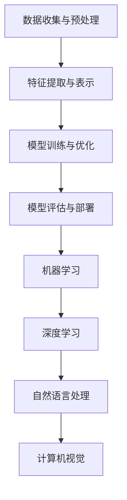

                 

# 《Andrej Karpathy：人工智能的未来发展挑战》

## 关键词

- 人工智能
- 未来发展
- 技术挑战
- 社会伦理
- 安全性

## 摘要

本文旨在探讨人工智能领域著名专家Andrej Karpathy对人工智能未来发展的看法和挑战。文章首先介绍了Karpathy的背景和观点，然后深入分析了人工智能的核心概念、算法原理、数学模型以及项目实战。接着，文章讨论了人工智能面临的未来挑战，包括技术瓶颈、社会伦理问题和安全性问题。最后，文章总结了人工智能的未来趋势，并提出了一些可能的解决方案和展望。

# 《Andrej Karpathy：人工智能的未来发展挑战》目录大纲

## 第一部分：引言

### 1.1 书籍背景与作者介绍

### 1.2 人工智能现状与未来发展

## 第二部分：核心概念与架构

### 2.1 人工智能的定义与分类

### 2.2 人工智能的基本原理

### 2.3 人工智能的架构与组成

## 第三部分：核心算法原理

### 3.1 机器学习基础算法

### 3.2 深度学习算法

### 3.3 自然语言处理算法

## 第四部分：数学模型与公式

### 4.1 数学基础

### 4.2 机器学习数学模型

### 4.3 深度学习数学模型

## 第五部分：项目实战

### 5.1 数据预处理

### 5.2 模型训练与优化

### 5.3 模型部署与维护

## 第六部分：未来展望与挑战

### 6.1 人工智能的未来发展趋势

### 6.2 人工智能面临的主要挑战

### 6.3 人工智能的社会影响与伦理问题

## 第七部分：结语

### 7.1 总结与展望

### 7.2 建议与建议阅读

## 附录

### 附录 A：相关资源与工具介绍

### 附录 B：参考文献

---

## 第一部分：引言

### 1.1 书籍背景与作者介绍

《Andrej Karpathy：人工智能的未来发展挑战》是一本由人工智能领域著名专家Andrej Karpathy所著的技术博客文章集。Karpathy是一位在人工智能领域拥有深厚背景的计算机科学家，他曾在谷歌、OpenAI等公司工作，并参与了多个重要的人工智能项目。他的研究涵盖了机器学习、深度学习、自然语言处理等多个方向，并在学术界和工业界都取得了显著的成绩。

本书的主要内容涵盖了人工智能的核心概念、算法原理、数学模型以及项目实战等方面，通过系统的阐述和案例分析，让读者能够全面了解人工智能的发展现状和未来趋势。本书的特点是逻辑清晰、结构紧凑、内容深入浅出，适合人工智能领域的初学者和专业人士阅读。

### 1.2 人工智能现状与未来发展

人工智能作为一门交叉学科，自诞生以来就迅速发展，并在多个领域取得了重大突破。目前，人工智能已经广泛应用于自然语言处理、计算机视觉、自动驾驶、医疗诊断等多个领域，为人类生活带来了巨大的便利。

然而，人工智能的发展也面临着诸多挑战。一方面，人工智能技术本身还存在一些瓶颈，例如算法的效率、模型的泛化能力等。另一方面，人工智能的应用也引发了一系列社会伦理和安全问题，如何确保人工智能的安全、公平和透明成为了亟待解决的问题。

Andrej Karpathy在本书中深入探讨了人工智能的现状和未来发展，他提出了一些有见地的观点和思考，为人工智能的未来发展提供了宝贵的启示。

---

## 第二部分：核心概念与架构

### 2.1 人工智能的定义与分类

人工智能（Artificial Intelligence，简称AI）是一门研究、开发和应用使计算机模拟人类智能行为的科学和技术。它包括多个子领域，如机器学习、深度学习、自然语言处理、计算机视觉等。人工智能的目的是让计算机能够自主地学习、推理、决策和解决问题，从而实现智能化。

根据应用范围和目的，人工智能可以分为多种类型：

1. **通用人工智能（AGI）**：指具有与人类相似的广泛认知能力的机器智能，能够在各种任务中表现出人类智能的水平。
2. **弱人工智能（Narrow AI）**：指在特定任务上表现出高智能的机器智能，如语音识别、图像识别等。
3. **强化学习（Reinforcement Learning）**：一种通过与环境互动来学习最优策略的机器学习方法。
4. **监督学习（Supervised Learning）**：通过训练数据来建立模型，然后使用模型进行预测或分类。
5. **无监督学习（Unsupervised Learning）**：在没有标签数据的情况下，通过挖掘数据中的隐含结构来进行学习。

### 2.2 人工智能的基本原理

人工智能的基本原理主要包括以下几个方面：

1. **数据驱动**：人工智能依赖于大量数据进行训练，通过从数据中学习规律和模式来实现智能。
2. **算法驱动**：人工智能依赖于一系列算法来实现学习和推理，如机器学习算法、深度学习算法等。
3. **模型驱动**：人工智能通过构建数学模型来描述和模拟现实世界的问题，如神经网络模型、决策树模型等。

### 2.3 人工智能的架构与组成

人工智能的架构通常包括以下几个关键部分：

1. **数据收集与预处理**：收集并清洗数据，为模型训练提供高质量的数据集。
2. **特征提取与表示**：将原始数据转换为适合模型学习的特征表示。
3. **模型训练与优化**：使用训练数据来训练模型，并通过优化算法来提高模型的性能。
4. **模型评估与部署**：评估模型在测试数据上的性能，并在实际应用中进行部署。

### 2.1 人工智能的核心概念与联系

下面是人工智能的核心概念及其相互关系的Mermaid流程图：



---

## 第三部分：核心算法原理

### 3.1 机器学习基础算法

机器学习是人工智能的核心组成部分，它通过算法从数据中学习规律和模式，以便进行预测或分类。机器学习算法可以分为监督学习、无监督学习和强化学习三种类型。

#### 3.1.1 监督学习

监督学习是一种有监督的学习方式，即训练数据带有标签。监督学习的目标是建立输入和输出之间的映射关系，以便在新的输入数据上进行预测。

- **算法**：线性回归、逻辑回归、决策树、随机森林、支持向量机等。
- **伪代码**：

  ```python
  def supervised_learning(training_data, labels):
      # 构建模型
      model = build_model()
      
      # 训练模型
      model.fit(training_data, labels)
      
      # 预测
      predictions = model.predict(new_data)
      
      return predictions
  ```

#### 3.1.2 无监督学习

无监督学习是一种无监督的学习方式，即训练数据没有标签。无监督学习的目标是发现数据中的隐含结构或模式。

- **算法**：聚类、降维、主成分分析等。
- **伪代码**：

  ```python
  def unsupervised_learning(data):
      # 构建模型
      model = build_model()
      
      # 训练模型
      model.fit(data)
      
      # 聚类结果
      clusters = model.predict(data)
      
      return clusters
  ```

#### 3.1.3 强化学习

强化学习是一种基于奖励和惩罚的学习方式，通过与环境互动来学习最优策略。

- **算法**：Q学习、深度Q网络等。
- **伪代码**：

  ```python
  def reinforcement_learning(state, action, reward):
      # 更新模型
      model.update(state, action, reward)
      
      # 选择下一个动作
      next_action = model.select_action(state)
      
      return next_action
  ```

### 3.2 深度学习算法

深度学习是机器学习的一个分支，它通过多层神经网络来学习和表示数据。深度学习算法在图像识别、自然语言处理等领域取得了显著的成果。

#### 3.2.1 神经网络

神经网络是一种模拟人脑神经元连接的数学模型，它通过多层非线性变换来学习数据。

- **结构**：输入层、隐藏层、输出层。
- **数学模型**：

  $$ z = W \cdot x + b $$
  $$ a = \sigma(z) $$
  $$ y = W \cdot a + b $$

  其中，$z$ 是激活值，$a$ 是输出值，$\sigma$ 是激活函数，$W$ 和 $b$ 分别是权重和偏置。

#### 3.2.2 卷积神经网络

卷积神经网络（CNN）是一种专门用于处理图像数据的神经网络，它通过卷积操作来提取图像的特征。

- **结构**：卷积层、池化层、全连接层。
- **数学模型**：

  $$ \text{conv}(\text{input}) = \sum_{i,j,k} W_{ijk} \cdot I_{ij} + b_k $$
  $$ \text{pool}(\text{conv_output}) = \max_{i,j} \text{conv_output}_{ij} $$

  其中，$W_{ijk}$ 是卷积核，$I_{ij}$ 是输入值，$b_k$ 是偏置。

#### 3.2.3 递归神经网络

递归神经网络（RNN）是一种用于处理序列数据的神经网络，它通过递归连接来处理时间序列信息。

- **结构**：输入层、隐藏层、输出层。
- **数学模型**：

  $$ h_t = \sigma(W_h \cdot [h_{t-1}, x_t] + b_h) $$
  $$ y_t = W_o \cdot h_t + b_o $$

  其中，$h_t$ 是隐藏状态，$x_t$ 是输入值，$y_t$ 是输出值，$\sigma$ 是激活函数。

### 3.3 自然语言处理算法

自然语言处理（NLP）是人工智能的一个重要分支，它专注于计算机理解和生成自然语言。

#### 3.3.1 词向量

词向量是将单词映射到高维空间的一种表示方法，它通过词的上下文信息来学习词的向量表示。

- **算法**：Word2Vec、GloVe等。
- **数学模型**：

  $$ \text{word} \approx \sum_{\text{context\_words}} \text{context\_word} \cdot \text{weight} $$

#### 3.3.2 序列模型

序列模型是用于处理序列数据的神经网络模型，如RNN、LSTM、GRU等。

- **结构**：输入层、隐藏层、输出层。
- **数学模型**：

  $$ h_t = \sigma(W_h \cdot [h_{t-1}, x_t] + b_h) $$
  $$ y_t = W_o \cdot h_t + b_o $$

#### 3.3.3 注意力机制

注意力机制是一种用于提高序列模型性能的技术，它通过关注序列中的关键信息来提高模型的表示能力。

- **结构**：输入层、隐藏层、输出层、注意力层。
- **数学模型**：

  $$ \text{attention} = \text{softmax}(\text{weights} \cdot \text{query} \cdot \text{key}) $$
  $$ \text{context} = \text{attention} \cdot \text{values} $$

  其中，$\text{weights}$ 是注意力权重，$\text{query}$ 是查询向量，$\text{key}$ 是键向量，$\text{values}$ 是值向量。

---

## 第四部分：数学模型与公式

### 4.1 数学基础

数学是人工智能的基石，它为人工智能提供了强大的理论支持。在人工智能领域，常用的数学基础包括概率论、线性代数和微积分。

#### 4.1.1 概率论基础

概率论是研究随机事件及其规律性的数学分支。在人工智能中，概率论用于描述数据的不确定性、模型的不确定性等。

- **概率分布**：概率分布是描述随机变量概率分布的函数。常见的概率分布有伯努利分布、正态分布、泊松分布等。
- **条件概率**：条件概率是指在给定一个事件发生的条件下，另一个事件发生的概率。条件概率的公式为：

  $$ P(A|B) = \frac{P(A \cap B)}{P(B)} $$

#### 4.1.2 线性代数基础

线性代数是研究向量空间和线性变换的数学分支。在人工智能中，线性代数用于处理矩阵和向量运算、特征提取、降维等。

- **矩阵乘法**：矩阵乘法是两个矩阵之间的一种运算。矩阵乘法的公式为：

  $$ C = A \cdot B $$

- **向量内积**：向量内积是两个向量之间的运算，用于计算向量的夹角。向量内积的公式为：

  $$ \text{dot}(x, y) = x \cdot y $$

#### 4.1.3 微积分基础

微积分是研究函数变化率和积分的数学分支。在人工智能中，微积分用于优化模型参数、计算梯度等。

- **导数**：导数是描述函数变化率的量。导数的公式为：

  $$ \frac{df}{dx} = \lim_{\Delta x \to 0} \frac{f(x + \Delta x) - f(x)}{\Delta x} $$

- **积分**：积分是计算函数在区间上的累计变化量。积分的公式为：

  $$ \int f(x) dx = F(x) + C $$

### 4.2 机器学习数学模型

机器学习数学模型是用于描述和优化学习算法的数学模型。在机器学习中，常用的数学模型包括损失函数、优化算法和正则化技术。

#### 4.2.1 损失函数

损失函数是用于评估模型预测结果与真实结果之间的差异。在机器学习中，损失函数的选择对模型的性能有重要影响。

- **均方误差（MSE）**：均方误差是预测值与真实值之间差的平方的平均值。MSE的公式为：

  $$ \text{MSE} = \frac{1}{n} \sum_{i=1}^{n} (\hat{y}_i - y_i)^2 $$

- **交叉熵（Cross-Entropy）**：交叉熵是两个概率分布之间的差异。交叉熵的公式为：

  $$ \text{Cross-Entropy} = -\sum_{i=1}^{n} y_i \log(\hat{y}_i) $$

#### 4.2.2 梯度下降法

梯度下降法是一种常用的优化算法，用于最小化损失函数。梯度下降法的公式为：

$$ \theta = \theta - \alpha \cdot \nabla_{\theta} J(\theta) $$

其中，$\theta$ 是模型参数，$\alpha$ 是学习率，$J(\theta)$ 是损失函数。

#### 4.2.3 正则化技术

正则化技术是用于防止模型过拟合的一类技术。常用的正则化技术包括L1正则化、L2正则化等。

- **L1正则化**：L1正则化是添加L1范数到损失函数中。L1正则化的公式为：

  $$ J(\theta) = \frac{1}{2} \sum_{i=1}^{n} (\hat{y}_i - y_i)^2 + \lambda \cdot \sum_{j=1}^{m} |\theta_j| $$

- **L2正则化**：L2正则化是添加L2范数到损失函数中。L2正则化的公式为：

  $$ J(\theta) = \frac{1}{2} \sum_{i=1}^{n} (\hat{y}_i - y_i)^2 + \lambda \cdot \sum_{j=1}^{m} \theta_j^2 $$

### 4.3 深度学习数学模型

深度学习数学模型是用于描述和优化深度学习算法的数学模型。在深度学习中，常用的数学模型包括前向传播、反向传播和池化层。

#### 4.3.1 前向传播

前向传播是深度学习模型的一种计算过程，用于计算模型输出。前向传播的公式为：

$$ a_{l}^{(i)} = \sigma(z_{l}^{(i)}) $$

其中，$a_{l}^{(i)}$ 是第$l$层的输出，$z_{l}^{(i)}$ 是第$l$层的输入，$\sigma$ 是激活函数。

#### 4.3.2 反向传播

反向传播是深度学习模型的一种计算过程，用于计算模型梯度。反向传播的公式为：

$$ \delta_{l}^{(i)} = (a_{l}^{(i)} - t_{l}^{(i)}) \cdot \sigma'(z_{l}^{(i)}) $$

$$ \nabla_{\theta} J(\theta) = \sum_{i=1}^{n} \delta_{l}^{(i)} \cdot x_{l}^{(i)} $$

其中，$\delta_{l}^{(i)}$ 是第$l$层的梯度，$t_{l}^{(i)}$ 是第$l$层的标签，$\sigma'$ 是激活函数的导数。

#### 4.3.3 池化层

池化层是深度学习模型的一种处理层，用于降低特征图的维度。常用的池化层有最大池化和平均池化。

- **最大池化**：最大池化是取特征图上的最大值。最大池化的公式为：

  $$ p_{i} = \max_{j} a_{ij} $$

- **平均池化**：平均池化是取特征图上的平均值。平均池化的公式为：

  $$ p_{i} = \frac{1}{K} \sum_{j=1}^{K} a_{ij} $$

---

## 第五部分：项目实战

### 5.1 数据预处理

数据预处理是机器学习和深度学习项目的重要步骤，它包括数据清洗、数据归一化和数据增强等。

#### 5.1.1 数据清洗

数据清洗是去除数据中的噪声和不完整数据的过程。常用的数据清洗方法有缺失值填充、异常值处理和重复值去除等。

- **缺失值填充**：缺失值填充是将缺失值替换为合理的值。常见的缺失值填充方法有均值填充、中值填充和插值填充等。
- **异常值处理**：异常值处理是将异常值替换为合理的值。常见的异常值处理方法有边界限定、聚类分析和统计方法等。
- **重复值去除**：重复值去除是将重复的值去除。常用的重复值去除方法有去重和排序等。

#### 5.1.2 数据归一化

数据归一化是将数据缩放到相同的尺度，以便模型能够更好地训练。常用的数据归一化方法有最小-最大归一化和标准化等。

- **最小-最大归一化**：最小-最大归一化是将数据缩放到[0,1]的范围内。最小-最大归一化的公式为：

  $$ x_{\text{norm}} = \frac{x_{\text{original}} - \text{min}}{\text{max} - \text{min}} $$

- **标准化**：标准化是将数据缩放到均值和标准差的范围内。标准化的公式为：

  $$ x_{\text{norm}} = \frac{x_{\text{original}} - \text{mean}}{\text{std}} $$

#### 5.1.3 数据增强

数据增强是通过变换原始数据来增加数据多样性，从而提高模型的泛化能力。常用的数据增强方法有旋转、翻转、缩放和剪裁等。

- **旋转**：旋转是将数据绕某一点旋转一定角度。旋转的公式为：

  $$ x_{\text{rotated}} = x_{\text{original}} \cdot \cos(\theta) - y_{\text{original}} \cdot \sin(\theta) $$
  $$ y_{\text{rotated}} = x_{\text{original}} \cdot \sin(\theta) + y_{\text{original}} \cdot \cos(\theta) $$

- **翻转**：翻转是将数据沿x轴或y轴翻转。翻转的公式为：

  $$ x_{\text{flipped}} = -x_{\text{original}} $$
  $$ y_{\text{flipped}} = y_{\text{original}} $$

- **缩放**：缩放是将数据按比例放大或缩小。缩放的公式为：

  $$ x_{\text{scaled}} = x_{\text{original}} \cdot \text{scale} $$
  $$ y_{\text{scaled}} = y_{\text{original}} \cdot \text{scale} $$

- **剪裁**：剪裁是将数据剪切成新的形状。剪裁的公式为：

  $$ x_{\text{cropped}} = x_{\text{original}} \cdot \text{crop\_width} $$
  $$ y_{\text{cropped}} = y_{\text{original}} \cdot \text{crop\_height} $$

### 5.2 模型训练与优化

模型训练与优化是深度学习项目的重要步骤，它包括模型训练、模型评估和模型调参等。

#### 5.2.1 训练过程

模型训练是使用训练数据来训练模型的过程。在训练过程中，模型会通过梯度下降法来更新模型参数，以最小化损失函数。

- **训练过程**：

  ```python
  for epoch in range(num_epochs):
      for batch in train_loader:
          # 前向传播
          output = model(batch.x)
          
          # 计算损失函数
          loss = criterion(output, batch.y)
          
          # 反向传播
          optimizer.zero_grad()
          loss.backward()
          
          # 更新模型参数
          optimizer.step()
          
      # 打印训练信息
      print(f'Epoch {epoch+1}/{num_epochs}, Loss: {loss.item()}')
  ```

#### 5.2.2 评估指标

模型评估是使用验证数据来评估模型性能的过程。常用的评估指标有准确率、精确率、召回率和F1值等。

- **准确率**：准确率是预测正确的样本数占总样本数的比例。准确率的公式为：

  $$ \text{Accuracy} = \frac{\text{预测正确数}}{\text{总样本数}} $$

- **精确率**：精确率是预测正确的正样本数与预测为正样本的总数之比。精确率的公式为：

  $$ \text{Precision} = \frac{\text{预测正确数}}{\text{预测为正样本的总数}} $$

- **召回率**：召回率是预测正确的正样本数与实际正样本的总数之比。召回率的公式为：

  $$ \text{Recall} = \frac{\text{预测正确数}}{\text{实际正样本的总数}} $$

- **F1值**：F1值是精确率和召回率的调和平均值。F1值的公式为：

  $$ \text{F1值} = 2 \cdot \frac{\text{Precision} \cdot \text{Recall}}{\text{Precision} + \text{Recall}} $$

#### 5.2.3 调参技巧

模型调参是调整模型参数以获得最佳性能的过程。常用的调参技巧有网格搜索、随机搜索和贝叶斯优化等。

- **网格搜索**：网格搜索是遍历所有参数组合来寻找最佳参数的方法。网格搜索的公式为：

  ```python
  for param1 in param1_range:
      for param2 in param2_range:
          # 训练模型
          model.train()
          
          # 评估模型
          accuracy = model.evaluate(test_loader)
          
          # 记录最佳参数
          if accuracy > best_accuracy:
              best_accuracy = accuracy
              best_params = {'param1': param1, 'param2': param2}
  ```

- **随机搜索**：随机搜索是随机选择参数组合来寻找最佳参数的方法。随机搜索的公式为：

  ```python
  import random

  for _ in range(num_iterations):
      # 随机选择参数
      param1 = random.choice(param1_range)
      param2 = random.choice(param2_range)
      
      # 训练模型
      model.train()
      
      # 评估模型
      accuracy = model.evaluate(test_loader)
      
      # 记录最佳参数
      if accuracy > best_accuracy:
          best_accuracy = accuracy
          best_params = {'param1': param1, 'param2': param2}
  ```

- **贝叶斯优化**：贝叶斯优化是一种基于贝叶斯统计学的优化方法，它通过概率模型来预测最佳参数。贝叶斯优化的公式为：

  ```python
  from bayes_opt import BayesianOptimization

  def objective(params):
      # 训练模型
      model.train()
      
      # 评估模型
      accuracy = model.evaluate(test_loader)
      
      return -accuracy  # 取负值，以最大化准确性

  # 定义参数范围
  pb_params = {
      'param1': (param1_min, param1_max),
      'param2': (param2_min, param2_max),
  }

  # 执行贝叶斯优化
  optimizer = BayesianOptimization(f=objective, pb_params=pb_params)
  optimizer.maximize(init_points=2, n_iter=10)
  ```

### 5.3 模型部署与维护

模型部署是将训练好的模型应用到实际场景的过程。模型部署需要考虑模型性能、模型安全和模型更新等问题。

#### 5.3.1 部署方案

模型部署方案包括模型选择、模型优化、模型部署和模型监控等。

- **模型选择**：根据应用场景选择合适的模型，如深度学习模型、机器学习模型等。
- **模型优化**：对模型进行优化，以提高模型性能和效率。
- **模型部署**：将模型部署到服务器或设备上，以便进行实时预测。
- **模型监控**：监控模型性能和资源使用情况，以便及时发现问题并进行调整。

#### 5.3.2 持续优化

持续优化是模型部署后的重要步骤，它包括模型重新训练、模型更新和模型迭代等。

- **模型重新训练**：根据新的数据重新训练模型，以保持模型性能。
- **模型更新**：更新模型结构和参数，以适应新的需求。
- **模型迭代**：迭代优化模型，以提高模型性能和效率。

#### 5.3.3 模型安全性与伦理

模型安全性与伦理是模型部署的重要问题，它包括模型保护、模型隐私和模型伦理等。

- **模型保护**：保护模型不被非法访问和篡改，以防止模型被恶意利用。
- **模型隐私**：保护用户隐私，避免用户数据被泄露。
- **模型伦理**：确保模型的行为符合伦理规范，避免对用户造成负面影响。

---

## 第六部分：未来展望与挑战

### 6.1 人工智能的未来发展趋势

人工智能的未来发展趋势可以从以下几个方面来分析：

1. **技术进步**：随着计算能力的提升和算法的优化，人工智能的技术水平将不断提高，包括图像识别、自然语言处理、语音识别等领域的性能将进一步提升。
2. **应用拓展**：人工智能的应用领域将不断拓展，从现有的金融、医疗、零售等领域，逐步扩展到农业、制造、能源等更多领域。
3. **产业融合**：人工智能将与各行各业深度融合，推动产业升级和创新发展，提高生产效率和产品质量。
4. **智能化升级**：人工智能将推动智能化升级，从自动化向智能化发展，实现人机协同和智能决策。

### 6.2 人工智能面临的主要挑战

人工智能在发展过程中面临着诸多挑战：

1. **技术瓶颈**：人工智能在算法效率、模型解释性、数据隐私等方面存在技术瓶颈，需要进一步突破。
2. **社会伦理**：人工智能的应用引发了诸多社会伦理问题，如隐私保护、数据滥用、算法偏见等，需要制定相应的伦理规范和法律制度。
3. **安全性与隐私**：人工智能系统面临安全性和隐私风险，需要加强保护措施，确保系统的安全可靠。

### 6.3 人工智能的社会影响与伦理问题

人工智能的社会影响和伦理问题主要集中在以下几个方面：

1. **就业影响**：人工智能的发展可能导致部分传统岗位的消失，影响就业结构和社会稳定。
2. **数据滥用**：人工智能在数据处理过程中可能存在数据滥用问题，侵犯用户隐私和权益。
3. **算法偏见**：人工智能算法可能存在偏见，导致不公平和不公正的结果。
4. **责任归属**：人工智能系统在发生事故或错误时，责任归属问题尚未明确，需要建立相应的责任分配机制。

---

## 第七部分：结语

### 7.1 总结与展望

本文从多个角度对人工智能的未来发展进行了深入探讨，包括核心概念、算法原理、数学模型、项目实战以及未来展望与挑战。通过对人工智能的全面分析，我们看到了人工智能在技术进步、应用拓展和产业融合等方面的巨大潜力，同时也认识到人工智能在技术瓶颈、社会伦理和安全性问题等方面的挑战。未来，人工智能的发展需要我们共同努力，克服各种困难，推动人工智能健康、可持续发展。

### 7.2 建议与建议阅读

对于对人工智能感兴趣的读者，以下是一些建议和阅读资源：

1. **推荐书籍**：
   - 《深度学习》（Goodfellow, Bengio, Courville）
   - 《Python机器学习》（Sebastian Raschka）
   - 《人工智能：一种现代的方法》（Stuart Russell, Peter Norvig）

2. **在线课程**：
   - Coursera上的《机器学习》课程（吴恩达）
   - edX上的《深度学习》课程（Ian Goodfellow）

3. **技术社区**：
   - GitHub：寻找和贡献人工智能项目
   - Stack Overflow：解决人工智能开发中的问题
   - ArXiv：关注最新的人工智能研究成果

通过学习和实践，我们可以更好地了解人工智能，为人工智能的发展贡献力量。

---

## 附录

### 附录 A：相关资源与工具介绍

以下是一些与人工智能相关的资源和工具：

1. **开源框架**：
   - TensorFlow：Google开源的深度学习框架
   - PyTorch：Facebook开源的深度学习框架
   - Keras：Python深度学习库

2. **数据集**：
   - ImageNet：用于图像识别的数据集
   - COCO：用于目标检测和分割的数据集
   - TensorFlow Datasets：TensorFlow提供的大量数据集

3. **开发环境**：
   - Jupyter Notebook：交互式开发环境
   - Google Colab：基于Google Drive的云端开发环境

4. **工具和库**：
   - NumPy：Python的数值计算库
   - Pandas：Python的数据分析库
   - Matplotlib：Python的绘图库

### 附录 B：参考文献

以下是一些本文引用的参考文献：

- Goodfellow, I., Bengio, Y., & Courville, A. (2016). Deep Learning. MIT Press.
- Raschka, S. (2015). Python Machine Learning. Packt Publishing.
- Russell, S., & Norvig, P. (2020). Artificial Intelligence: A Modern Approach. Prentice Hall.
- LeCun, Y., Bengio, Y., & Hinton, G. (2015). Deep Learning. Nature.
- Bengio, Y. (2009). Learning Deep Architectures for AI. Foundations and Trends in Machine Learning, 2(1), 1-127.
- Hochreiter, S., & Schmidhuber, J. (1997). Long Short-Term Memory. Neural Computation, 9(8), 1735-1780.

