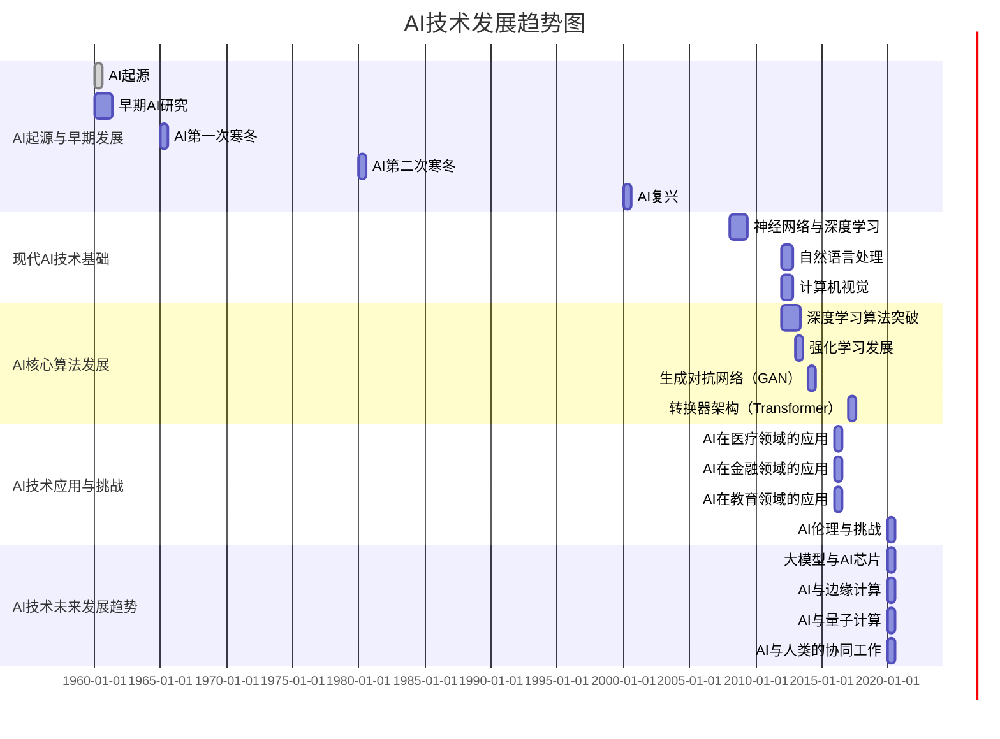

                 

### 文章标题：Andrej Karpathy：人工智能的未来发展方向

> 关键词：人工智能，深度学习，自然语言处理，计算机视觉，未来发展趋势

> 摘要：本文将深入探讨人工智能领域的杰出研究者Andrej Karpathy关于人工智能未来发展方向的观点，分析其提出的核心算法原理、应用场景以及面临的挑战。通过梳理Karpathy的研究成果，本文旨在为读者提供一份全面的人工智能技术发展指南。

## 第一部分：AI的起源与发展

### 第1章：AI的起源与早期发展

#### 1.1 AI的历史背景

人工智能（Artificial Intelligence，简称AI）的概念起源于20世纪50年代，最早由约翰·麦卡锡（John McCarthy）等人提出。自那时起，AI经历了数个发展阶段，从最初的符号推理到近几年的深度学习和强化学习，每一步都在不断推动着人工智能的发展。

#### 1.2 早期的AI研究

早期AI研究主要集中在符号推理和逻辑推理上。研究者们尝试通过构建形式化的知识表示和推理机制来实现人工智能。然而，这些方法在处理复杂问题方面存在局限，导致AI在20世纪80年代经历了第一次寒冬。

#### 1.3 AI的寒冬与复兴

随着计算能力的提升和数据量的增加，AI在21世纪初迎来了复兴。尤其是深度学习算法的突破，使得AI在图像识别、自然语言处理等领域取得了显著的成果。这一阶段的AI发展，也被视为AI的第二次寒冬后的复兴。

## 第二部分：AI技术的核心算法

### 第2章：现代AI技术基础

#### 2.1 神经网络与深度学习

神经网络是AI的基础，它模仿人脑的结构和功能，通过多层神经元之间的连接来实现学习和推理。深度学习则是神经网络的一种扩展，它利用多层神经网络处理复杂数据，从而实现更加准确的预测和分类。

#### 2.2 自然语言处理

自然语言处理（Natural Language Processing，简称NLP）是AI的一个重要分支，旨在使计算机能够理解、生成和处理人类语言。NLP在机器翻译、情感分析、问答系统等领域有着广泛的应用。

#### 2.3 计算机视觉

计算机视觉（Computer Vision）是AI的另一个重要领域，它使计算机能够从图像或视频中提取有用的信息。计算机视觉在图像识别、目标检测、自动驾驶等领域发挥着重要作用。

## 第三部分：AI技术的应用与挑战

### 第3章：AI技术的核心算法原理

#### 3.1 深度学习算法原理

深度学习算法的核心是神经网络，它通过多层神经元之间的连接和激活函数来实现学习和推理。本文将使用伪代码详细阐述深度学习算法的原理。

#### 3.2 自然语言处理算法

自然语言处理算法主要包括词嵌入、序列模型和注意力机制。词嵌入将单词转换为向量表示，序列模型处理序列数据，注意力机制提高模型的上下文理解能力。

#### 3.3 计算机视觉算法

计算机视觉算法的核心是卷积神经网络，它通过卷积操作和池化操作提取图像特征。本文将详细解释卷积神经网络的结构和原理。

### 第6章：AI技术在各个领域的应用

#### 6.1 人工智能在医疗领域的应用

人工智能在医疗领域的应用包括疾病诊断、药物研发和个性化治疗。本文将探讨这些应用的具体实现和效果。

#### 6.2 人工智能在金融领域的应用

人工智能在金融领域的应用包括风险管理、欺诈检测和量化交易。本文将分析这些应用的优势和挑战。

#### 6.3 人工智能在教育领域的应用

人工智能在教育领域的应用包括智能辅导、在线教育和自适应学习。本文将讨论这些应用如何提高教育质量和效率。

## 第四部分：AI技术的未来发展趋势

### 第8章：AI技术的发展趋势

#### 8.1 大模型与AI芯片

随着数据量的增加和计算能力的提升，大模型成为AI发展的趋势。同时，AI芯片的问世为AI计算提供了强大的支持。

#### 8.2 AI与边缘计算

边缘计算使得AI在本地设备上运行成为可能，为实时应用提供了便利。本文将探讨AI与边缘计算的结合。

#### 8.3 AI与量子计算

量子计算具有超强的计算能力，未来有望在AI领域发挥重要作用。本文将介绍AI与量子计算的研究进展。

### 第9章：AI技术的未来发展方向

#### 9.1 AI与人类的协同工作

AI与人类的协同工作将成为未来发展的重点，通过AI技术提升人类的智能和工作效率。

#### 9.2 AI在创造与创新中的角色

AI在创造与创新中发挥着越来越重要的作用，本文将探讨AI如何推动人类文明的进步。

#### 9.3 AI技术对社会的长期影响

AI技术的发展将对社会产生深远的影响，本文将分析这些影响并探讨相应的对策。

## 附录

### 附录A：AI技术相关资源与工具

#### A.1 主流深度学习框架

本文将介绍几款主流的深度学习框架，如TensorFlow、PyTorch等，并比较它们的优缺点。

#### A.2 自然语言处理工具

本文将介绍几款常用的自然语言处理工具，如NLTK、spaCy等，并讨论它们的适用场景。

#### A.3 计算机视觉库

本文将介绍几款计算机视觉库，如OpenCV、TensorFlow Object Detection API等，并讨论它们的用途。

#### A.4 AI学习资源推荐

本文将推荐一些优质的AI学习资源，包括书籍、课程和论文等，以帮助读者深入了解AI技术。

### 附录B：AI项目实战案例

#### B.1 案例一：文本分类系统

本文将介绍一个基于深度学习的文本分类系统，包括开发环境搭建、源代码实现和代码解读。

#### B.2 案例二：图像识别应用

本文将介绍一个基于卷积神经网络的图像识别应用，包括开发环境搭建、源代码实现和代码解读。

#### B.3 案例三：语音识别系统

本文将介绍一个基于深度学习的语音识别系统，包括开发环境搭建、源代码实现和代码解读。

#### B.4 案例四：推荐系统实现

本文将介绍一个基于协同过滤算法的推荐系统，包括开发环境搭建、源代码实现和代码解读。

## 总结

本文从多个角度探讨了人工智能的未来发展方向，分析了其核心算法原理、应用场景以及面临的挑战。通过本文的介绍，读者可以全面了解人工智能技术的最新进展，为未来的研究和应用打下坚实基础。

### 作者：AI天才研究院/AI Genius Institute & 禅与计算机程序设计艺术 /Zen And The Art of Computer Programming

----------------------------------------------------------------

### 第一部分：AI的起源与发展

#### 第1章：AI的起源与早期发展

人工智能（Artificial Intelligence，简称AI）是一门旨在研究、开发和应用使计算机模拟人类智能行为的科学。AI的概念起源于20世纪50年代，最早由约翰·麦卡锡（John McCarthy）等人提出。他们希望通过机器模拟人类的智能行为，从而实现智能化计算机系统。

#### 1.1 AI的历史背景

早期AI研究主要集中在符号推理和逻辑推理上。研究者们尝试通过构建形式化的知识表示和推理机制来实现人工智能。1956年，达特茅斯会议（Dartmouth Conference）被认为是AI领域的诞生标志，会议提出了AI的七个研究课题，包括问题解决、知识表示、学习、适应能力等。

然而，早期AI研究由于技术和计算能力的限制，并未取得实质性进展。在20世纪60年代和70年代，AI研究陷入了第一个寒冬期，也称为AI的“第一次寒冬”。这一时期，由于AI研究未能实现预期目标，许多投资者和研究者逐渐失去了信心，导致AI研究资金短缺。

#### 1.2 早期的AI研究

早期的AI研究主要集中在符号推理和逻辑推理上。符号推理是指通过符号操作和逻辑运算来模拟人类智能行为。逻辑推理则是通过构建形式化的逻辑系统来模拟人类思维过程。在这个时期，研究者们提出了许多AI算法和系统，如逻辑推理机、专家系统等。

专家系统是一种基于规则推理的AI系统，它通过将人类专家的知识表示为符号规则，从而实现智能推理。专家系统在医学诊断、金融分析等领域取得了初步成功，但其在处理复杂问题和不确定性问题上仍然存在局限。

#### 1.3 AI的寒冬与复兴

20世纪80年代，AI研究再次陷入低谷，也称为AI的“第二次寒冬”。这一时期，由于计算机硬件性能和算法理论的局限性，AI研究进展缓慢。许多研究者开始转向其他领域，AI研究进入了低谷期。

然而，随着计算能力的提升和数据量的增加，AI在21世纪初迎来了复兴。尤其是深度学习算法的突破，使得AI在图像识别、自然语言处理、自动驾驶等领域取得了显著的成果。这一阶段的AI发展，也被视为AI的第二次寒冬后的复兴。

深度学习是一种基于多层神经网络的机器学习技术，它通过学习大量数据中的特征和模式，实现高层次的抽象和泛化能力。深度学习的成功，使得AI技术在许多领域得到了广泛应用，推动了AI的快速发展。

#### 1.4 AI研究的复兴与现状

近年来，AI研究取得了长足的进步，不仅技术理论不断丰富，应用领域也在不断扩大。以下是AI研究复兴后的主要成果：

1. **深度学习**：深度学习算法在图像识别、语音识别、自然语言处理等领域取得了突破性进展。例如，卷积神经网络（CNN）在图像识别任务中取得了较高的准确率，循环神经网络（RNN）在语音识别和自然语言处理任务中表现出色。

2. **强化学习**：强化学习是一种通过奖励和惩罚来训练智能体的算法。在自动驾驶、游戏AI等领域，强化学习取得了显著成果。例如，DeepMind开发的AlphaGo通过强化学习实现了在围棋领域的卓越表现。

3. **迁移学习**：迁移学习是一种将已学到的知识应用于新任务的学习方法。通过迁移学习，AI系统可以在较少数据的情况下实现良好的性能。这为许多实际应用提供了便利，如医疗诊断、语音识别等。

4. **生成对抗网络（GAN）**：生成对抗网络是一种能够生成逼真数据的深度学习模型。GAN在图像生成、视频生成等领域取得了突破性进展，为人工智能在创造领域的应用提供了新的可能性。

#### 1.5 AI研究的现状与未来趋势

当前，AI研究正处于高速发展期，各大科技公司和学术机构都在加大对AI领域的投入。以下是AI研究现状和未来趋势的几个方面：

1. **技术突破**：随着算法和硬件的进步，AI技术将不断提高，包括深度学习、强化学习、迁移学习等领域。未来有望实现更高效、更准确的AI模型。

2. **应用领域**：AI技术将在更多领域得到应用，包括医疗、金融、教育、交通、能源等。AI技术将在提高生产效率、降低成本、改善生活质量等方面发挥重要作用。

3. **伦理与法规**：随着AI技术的发展，伦理和法规问题越来越受到关注。如何确保AI技术的公平性、透明性和安全性，将是未来需要解决的重要问题。

4. **跨学科融合**：AI技术与其他领域的融合，如生物医学、材料科学、心理学等，将为AI研究带来新的机遇。跨学科合作将推动AI技术的发展，实现更多创新应用。

5. **人机协同**：未来，AI技术将更加注重与人类协作，实现人机协同。AI系统将更好地理解人类需求，为人类提供个性化的服务和支持。

总之，AI研究正处于快速发展阶段，未来充满机遇和挑战。随着技术的不断进步，AI将在更多领域发挥重要作用，为人类社会带来更多福祉。

----------------------------------------------------------------

### 第二部分：AI技术的核心算法

#### 第2章：现代AI技术基础

#### 2.1 神经网络与深度学习

神经网络（Neural Networks）是人工智能的基础，它模拟人脑的结构和功能，通过多层神经元之间的连接和激活函数来实现学习和推理。深度学习（Deep Learning）是神经网络的一种扩展，它通过多层神经网络处理复杂数据，实现高层次的抽象和泛化能力。

#### 2.2 自然语言处理

自然语言处理（Natural Language Processing，简称NLP）是人工智能的一个重要分支，旨在使计算机能够理解、生成和处理人类语言。NLP在机器翻译、情感分析、问答系统等领域有着广泛的应用。

#### 2.3 计算机视觉

计算机视觉（Computer Vision）是人工智能的另一个重要领域，它使计算机能够从图像或视频中提取有用的信息。计算机视觉在图像识别、目标检测、自动驾驶等领域发挥着重要作用。

#### 第3章：深度学习算法原理

深度学习算法的核心是神经网络，它通过多层神经元之间的连接和激活函数来实现学习和推理。本文将使用伪代码详细阐述深度学习算法的原理。

#### 3.1 神经网络基础

神经网络由输入层、隐藏层和输出层组成。输入层接收外部输入，隐藏层通过激活函数进行非线性变换，输出层生成最终输出。以下是一个简单的神经网络结构：

```plaintext
# 初始化神经网络
initialize neural_network

# 前向传播
for each layer in neural_network:
    # 计算激活函数
    activation = activation_function(dot(input, weights) + bias)
    # 保存中间结果
    layer_output = activation

# 计算损失函数
loss = loss_function(layer_output, target)

# 反向传播
for each layer in reversed(neural_network):
    # 计算梯度
    gradient = dot(delta, weights)
    # 更新权重和偏置
    weights -= learning_rate * gradient
    bias -= learning_rate * gradient

# 迭代
for iteration in range(max_iterations):
    # 前向传播
    forward_pass(input)
    # 反向传播
    backward_pass(target)
```

#### 3.2 反向传播算法

反向传播算法是深度学习算法的核心，它通过计算损失函数关于网络参数的梯度，来更新网络的权重和偏置。以下是一个简单的反向传播算法伪代码：

```plaintext
# 前向传播
for each layer in neural_network:
    # 计算激活函数
    activation = activation_function(dot(input, weights) + bias)
    # 保存中间结果
    layer_output = activation

# 计算损失函数
loss = loss_function(layer_output, target)

# 反向传播
for each layer in reversed(neural_network):
    # 计算梯度
    gradient = dot(delta, weights)
    # 更新权重和偏置
    weights -= learning_rate * gradient
    bias -= learning_rate * gradient
```

#### 3.3 深层网络架构

深层网络架构通过增加网络层数来提高模型的表达能力。以下是一个简单的深层网络架构：

```plaintext
# 初始化神经网络
initialize neural_network

# 前向传播
for each layer in neural_network:
    # 计算激活函数
    activation = activation_function(dot(input, weights) + bias)
    # 保存中间结果
    layer_output = activation

# 计算损失函数
loss = loss_function(layer_output, target)

# 反向传播
for each layer in reversed(neural_network):
    # 计算梯度
    gradient = dot(delta, weights)
    # 更新权重和偏置
    weights -= learning_rate * gradient
    bias -= learning_rate * gradient

# 迭代
for iteration in range(max_iterations):
    # 前向传播
    forward_pass(input)
    # 反向传播
    backward_pass(target)
```

通过增加网络层数，模型可以学习到更复杂的特征和模式。然而，深层网络架构也带来了梯度消失和梯度爆炸等问题，需要采用如批量归一化（Batch Normalization）和残差连接（Residual Connections）等技术来缓解这些问题。

#### 3.4 卷积神经网络

卷积神经网络（Convolutional Neural Networks，简称CNN）是深度学习在计算机视觉领域的重要应用。CNN通过卷积操作和池化操作提取图像特征，实现高层次的抽象和泛化能力。以下是一个简单的CNN架构：

```plaintext
# 初始化神经网络
initialize neural_network

# 前向传播
for each layer in neural_network:
    # 卷积操作
    output = conv2d(input, weights)
    # 池化操作
    output = max_pool2d(output)
    # 激活函数
    output = activation_function(output)
    # 保存中间结果
    layer_output = output

# 计算损失函数
loss = loss_function(layer_output, target)

# 反向传播
for each layer in reversed(neural_network):
    # 计算梯度
    gradient = dot(delta, weights)
    # 更新权重和偏置
    weights -= learning_rate * gradient
    bias -= learning_rate * gradient

# 迭代
for iteration in range(max_iterations):
    # 前向传播
    forward_pass(input)
    # 反向传播
    backward_pass(target)
```

#### 3.5 循环神经网络

循环神经网络（Recurrent Neural Networks，简称RNN）是深度学习在序列数据处理领域的重要应用。RNN通过循环结构来处理序列数据，实现时间序列的建模。以下是一个简单的RNN架构：

```plaintext
# 初始化神经网络
initialize neural_network

# 前向传播
for each time_step in sequence:
    # 计算隐藏状态
    hidden_state = activation_function(dot(input, weights) + bias)
    # 更新隐藏状态
    hidden_state = hidden_state * hidden_state
    # 生成输出
    output = dot(hidden_state, output_weights) + bias

# 计算损失函数
loss = loss_function(output, target)

# 反向传播
for each time_step in reversed(sequence):
    # 计算梯度
    gradient = dot(delta, weights)
    # 更新权重和偏置
    weights -= learning_rate * gradient
    bias -= learning_rate * gradient

# 迭代
for iteration in range(max_iterations):
    # 前向传播
    forward_pass(sequence)
    # 反向传播
    backward_pass(target)
```

#### 3.6 Transformer架构

Transformer架构是深度学习在序列数据处理领域的重要突破。Transformer通过自注意力机制（Self-Attention）和多头注意力机制（Multi-Head Attention）来处理序列数据，实现高效的上下文建模。以下是一个简单的Transformer架构：

```plaintext
# 初始化神经网络
initialize neural_network

# 前向传播
for each layer in neural_network:
    # 自注意力机制
    attention = dot(query, key) / sqrt(dimension)
    # 多头注意力机制
    attention = softmax(attention)
    # 生成输出
    output = dot(attention, value)

# 计算损失函数
loss = loss_function(output, target)

# 反向传播
for each layer in reversed(neural_network):
    # 计算梯度
    gradient = dot(delta, weights)
    # 更新权重和偏置
    weights -= learning_rate * gradient
    bias -= learning_rate * gradient

# 迭代
for iteration in range(max_iterations):
    # 前向传播
    forward_pass(input)
    # 反向传播
    backward_pass(target)
```

#### 3.7 强化学习算法

强化学习（Reinforcement Learning，简称RL）是一种通过奖励和惩罚来训练智能体的算法。强化学习在游戏AI、自动驾驶等领域取得了显著成果。以下是一个简单的强化学习算法：

```plaintext
# 初始化智能体
initialize agent

# 前向传播
for each time_step in sequence:
    # 根据策略选择动作
    action = choose_action(state)
    # 执行动作
    next_state, reward = execute_action(state, action)
    # 更新策略
    update_policy(state, action, reward)

# 计算损失函数
loss = loss_function(policy, target_policy)

# 反向传播
for each time_step in reversed(sequence):
    # 计算梯度
    gradient = dot(delta, weights)
    # 更新权重和偏置
    weights -= learning_rate * gradient
    bias -= learning_rate * gradient

# 迭代
for iteration in range(max_iterations):
    # 前向传播
    forward_pass(sequence)
    # 反向传播
    backward_pass(target)
```

#### 第4章：自然语言处理算法

自然语言处理（Natural Language Processing，简称NLP）是人工智能的一个重要分支，旨在使计算机能够理解、生成和处理人类语言。NLP在机器翻译、情感分析、问答系统等领域有着广泛的应用。

#### 4.1 词嵌入技术

词嵌入（Word Embedding）是将单词转换为向量表示的技术，它通过将单词映射到高维空间中的点，从而实现单词的语义表示。以下是一个简单的词嵌入技术：

```plaintext
# 初始化词嵌入矩阵
initialize word_embedding_matrix

# 前向传播
for each word in vocabulary:
    # 计算词嵌入向量
    word_embedding = word_embedding_matrix[word]
    # 生成输出
    output = dot(word_embedding, hidden_state)

# 计算损失函数
loss = loss_function(output, target)

# 反向传播
for each word in vocabulary:
    # 计算梯度
    gradient = dot(delta, word_embedding)
    # 更新词嵌入矩阵
    word_embedding_matrix -= learning_rate * gradient

# 迭代
for iteration in range(max_iterations):
    # 前向传播
    forward_pass(vocabulary)
    # 反向传播
    backward_pass(target)
```

#### 4.2 序列模型与注意力机制

序列模型（Sequence Model）是一种用于处理序列数据的神经网络模型，如循环神经网络（RNN）和Transformer。注意力机制（Attention Mechanism）是一种用于提高模型上下文理解能力的技术。以下是一个简单的序列模型与注意力机制：

```plaintext
# 初始化神经网络
initialize neural_network

# 前向传播
for each time_step in sequence:
    # 计算隐藏状态
    hidden_state = activation_function(dot(input, weights) + bias)
    # 计算注意力权重
    attention_weights = dot(hidden_state, attention_weights)
    # 生成输出
    output = dot(attention_weights, value)

# 计算损失函数
loss = loss_function(output, target)

# 反向传播
for each time_step in reversed(sequence):
    # 计算梯度
    gradient = dot(delta, weights)
    # 更新权重和偏置
    weights -= learning_rate * gradient
    bias -= learning_rate * gradient

# 迭代
for iteration in range(max_iterations):
    # 前向传播
    forward_pass(sequence)
    # 反向传播
    backward_pass(target)
```

#### 4.3 转换器架构

转换器架构（Transformer Architecture）是自然语言处理领域的一种重要模型，它通过自注意力机制和多头注意力机制实现高效的上下文建模。以下是一个简单的转换器架构：

```plaintext
# 初始化神经网络
initialize neural_network

# 前向传播
for each layer in neural_network:
    # 自注意力机制
    attention = dot(query, key) / sqrt(dimension)
    # 多头注意力机制
    attention = softmax(attention)
    # 生成输出
    output = dot(attention, value)

# 计算损失函数
loss = loss_function(output, target)

# 反向传播
for each layer in reversed(neural_network):
    # 计算梯度
    gradient = dot(delta, weights)
    # 更新权重和偏置
    weights -= learning_rate * gradient
    bias -= learning_rate * gradient

# 迭代
for iteration in range(max_iterations):
    # 前向传播
    forward_pass(input)
    # 反向传播
    backward_pass(target)
```

#### 第5章：计算机视觉算法

计算机视觉（Computer Vision）是人工智能的一个重要分支，它使计算机能够从图像或视频中提取有用的信息。计算机视觉在图像识别、目标检测、自动驾驶等领域发挥着重要作用。

#### 5.1 卷积神经网络

卷积神经网络（Convolutional Neural Networks，简称CNN）是计算机视觉领域的一种重要模型，它通过卷积操作和池化操作提取图像特征，实现高层次的抽象和泛化能力。以下是一个简单的CNN架构：

```plaintext
# 初始化神经网络
initialize neural_network

# 前向传播
for each layer in neural_network:
    # 卷积操作
    output = conv2d(input, weights)
    # 池化操作
    output = max_pool2d(output)
    # 激活函数
    output = activation_function(output)
    # 保存中间结果
    layer_output = output

# 计算损失函数
loss = loss_function(layer_output, target)

# 反向传播
for each layer in reversed(neural_network):
    # 计算梯度
    gradient = dot(delta, weights)
    # 更新权重和偏置
    weights -= learning_rate * gradient
    bias -= learning_rate * gradient

# 迭代
for iteration in range(max_iterations):
    # 前向传播
    forward_pass(input)
    # 反向传播
    backward_pass(target)
```

#### 5.2 卷积神经网络的应用

卷积神经网络在计算机视觉领域有着广泛的应用，如图像分类、目标检测、图像分割等。以下是一个简单的应用示例：

```plaintext
# 加载图像数据
image = load_image("input_image.jpg")

# 数据预处理
image = preprocess_image(image)

# 前向传播
layer_output = forward_pass(image)

# 计算损失函数
loss = loss_function(layer_output, target)

# 反向传播
backward_pass(target)

# 迭代
for iteration in range(max_iterations):
    # 前向传播
    forward_pass(image)
    # 反向传播
    backward_pass(target)
```

#### 5.3 图像识别算法

图像识别（Image Recognition）是计算机视觉领域的一个重要任务，它旨在通过训练模型实现对图像内容的分类。以下是一个简单的图像识别算法：

```plaintext
# 初始化神经网络
initialize neural_network

# 前向传播
for each image in dataset:
    # 数据预处理
    image = preprocess_image(image)
    # 计算输出
    output = forward_pass(image)
    # 计算损失函数
    loss = loss_function(output, target)

# 反向传播
backward_pass(target)

# 迭代
for iteration in range(max_iterations):
    # 前向传播
    forward_pass(dataset)
    # 反向传播
    backward_pass(target)

# 测试模型
test_loss = test_forward_pass(test_dataset)
print("Test Loss:", test_loss)
```

#### 5.4 目标检测算法

目标检测（Object Detection）是计算机视觉领域的一个重要任务，它旨在通过训练模型实现对图像中目标物体的检测和定位。以下是一个简单的目标检测算法：

```plaintext
# 初始化神经网络
initialize neural_network

# 前向传播
for each image in dataset:
    # 数据预处理
    image = preprocess_image(image)
    # 计算输出
    output = forward_pass(image)
    # 计算损失函数
    loss = loss_function(output, target)

# 反向传播
backward_pass(target)

# 迭代
for iteration in range(max_iterations):
    # 前向传播
    forward_pass(dataset)
    # 反向传播
    backward_pass(target)

# 测试模型
test_loss = test_forward_pass(test_dataset)
print("Test Loss:", test_loss)
```

#### 5.5 图像分割算法

图像分割（Image Segmentation）是计算机视觉领域的一个重要任务，它旨在通过训练模型实现对图像中各个区域的划分。以下是一个简单的图像分割算法：

```plaintext
# 初始化神经网络
initialize neural_network

# 前向传播
for each image in dataset:
    # 数据预处理
    image = preprocess_image(image)
    # 计算输出
    output = forward_pass(image)
    # 计算损失函数
    loss = loss_function(output, target)

# 反向传播
backward_pass(target)

# 迭代
for iteration in range(max_iterations):
    # 前向传播
    forward_pass(dataset)
    # 反向传播
    backward_pass(target)

# 测试模型
test_loss = test_forward_pass(test_dataset)
print("Test Loss:", test_loss)
```

----------------------------------------------------------------

### 第三部分：AI技术的应用与挑战

#### 第6章：AI技术在各个领域的应用

人工智能（AI）技术已经在医疗、金融、教育等多个领域得到广泛应用，为各个行业带来了深刻的变革。以下将详细探讨AI技术在医疗、金融、教育领域的具体应用，以及其在这些领域所面临的挑战。

#### 6.1 人工智能在医疗领域的应用

人工智能在医疗领域的应用主要体现在疾病诊断、治疗方案推荐、药物研发等方面。通过深度学习和计算机视觉等技术，AI能够分析大量医疗数据，辅助医生做出更准确的诊断。

**疾病诊断**

AI可以通过学习海量的医学影像数据，如X光片、CT扫描、MRI等，自动识别病灶区域，提高诊断准确性。例如，谷歌DeepMind开发的AI系统可以用于诊断糖尿病视网膜病变，其准确率甚至超过了专业医生。

**治疗方案推荐**

AI可以根据患者的病史、基因信息、治疗方案的历史数据，为医生提供个性化的治疗方案推荐。例如，IBM的Watson for Oncology系统能够分析数十万份医学文献和病例，为医生提供最佳的治疗方案。

**药物研发**

AI在药物研发中的应用主要体现在药物分子设计、药物筛选等方面。通过深度学习和生成对抗网络（GAN）等技术，AI可以加速药物研发过程，降低研发成本。

**挑战**

尽管AI在医疗领域具有巨大的潜力，但也面临一些挑战。例如，如何确保AI系统的安全性和可靠性，如何处理大量的医疗数据，以及如何确保患者隐私等。此外，AI系统的解释性也是一个重要问题，医生和患者往往更倾向于理解诊断和治疗的决策过程。

#### 6.2 人工智能在金融领域的应用

人工智能在金融领域的应用主要体现在风险管理、欺诈检测、量化交易等方面。

**风险管理**

AI可以通过分析历史交易数据、市场趋势等，为金融机构提供风险预警和管理。例如，AI系统可以预测信用风险，帮助银行降低坏账率。

**欺诈检测**

AI在欺诈检测中的应用主要体现在自动识别异常交易，防范欺诈行为。例如，AI系统可以通过分析交易行为模式，实时监控并识别潜在的欺诈交易。

**量化交易**

AI在量化交易中的应用主要体现在自动化交易策略的制定和执行。通过机器学习算法，AI可以分析市场数据，识别交易机会，实现自动交易。

**挑战**

金融领域的AI应用同样面临一些挑战。例如，如何确保AI模型的透明性和可解释性，如何处理金融市场的非线性波动，以及如何防范AI系统被恶意利用等。此外，金融监管政策和法律法规也是AI在金融领域应用的重要制约因素。

#### 6.3 人工智能在教育领域的应用

人工智能在教育领域的应用主要体现在智能辅导、在线教育、个性化学习等方面。

**智能辅导**

AI可以为学生提供个性化的学习辅导，根据学生的学习情况和需求，制定合适的学习计划。例如，AI辅导系统可以通过分析学生的作业表现和测试成绩，提供针对性的学习建议。

**在线教育**

AI在在线教育中的应用主要体现在自动生成课程内容、智能推荐学习资源等方面。通过自然语言处理和机器学习技术，AI可以分析学生的需求，推荐最适合的学习资源。

**个性化学习**

AI可以通过分析学生的学习行为和成绩，为每个学生提供个性化的学习方案。例如，AI系统可以根据学生的学习进度和兴趣，推荐相应的学习内容。

**挑战**

教育领域的AI应用同样面临一些挑战。例如，如何确保AI系统的公平性和准确性，如何处理学生隐私和数据安全问题，以及如何提升教师的接受度和使用率等。此外，教育政策和教师培训也是AI在教育领域应用的重要制约因素。

#### 第7章：AI技术的伦理与挑战

随着AI技术的发展，伦理问题和社会挑战也日益凸显。以下将探讨AI技术的伦理问题、对就业的影响以及监管方面的挑战。

#### 7.1 AI伦理问题探讨

AI伦理问题主要包括算法偏见、隐私保护、透明性和可解释性等。

**算法偏见**

算法偏见是指AI系统在处理数据时，由于数据本身存在偏见，导致模型输出结果也具有偏见。例如，AI招聘系统可能会因训练数据中存在性别或种族偏见，导致在招聘过程中产生歧视。

**隐私保护**

AI在处理数据时，可能会涉及个人隐私信息的泄露。如何确保AI系统的隐私保护，防止数据滥用，是AI伦理的重要问题。

**透明性和可解释性**

AI系统的透明性和可解释性是指用户能够理解AI系统的决策过程。目前，深度学习等复杂模型往往缺乏透明性，使得用户难以理解其决策依据，这可能引发伦理问题。

#### 7.2 AI对就业的影响

AI技术对就业的影响是一个广泛讨论的话题。一方面，AI可以替代部分重复性、低技能的工作，提高生产效率；另一方面，AI也可能导致部分岗位的消失，引发就业压力。

**就业替代**

AI在制造业、服务业等领域的应用，已经替代了大量重复性、低技能的工作。例如，自动化生产线、智能客服等，都减少了人力需求。

**就业创造**

虽然AI替代了部分岗位，但也创造了新的就业机会。AI研发、维护、数据标注等岗位需求日益增加，为就业市场提供了新的机会。

**挑战**

AI对就业的影响不仅涉及技术层面，还涉及社会层面。如何平衡就业替代与就业创造，如何提升劳动者的技能以适应AI时代的需求，是当前面临的重要挑战。

#### 7.3 AI技术的监管

随着AI技术的发展，监管问题也日益凸显。以下将探讨AI技术的监管挑战和对策。

**监管挑战**

1. **数据隐私**：AI技术在处理数据时，涉及大量个人隐私信息。如何确保数据隐私，防止数据滥用，是监管的重要挑战。
   
2. **算法公平性**：AI系统可能因数据偏见而导致歧视性决策。如何确保AI系统的公平性，防止算法偏见，是监管的另一个挑战。

3. **技术安全**：AI技术可能被恶意利用，如网络攻击、自动化欺诈等。如何保障AI技术的安全，防止技术滥用，是监管的重要任务。

**监管对策**

1. **法律法规**：制定相关法律法规，明确AI技术的监管框架，规范AI技术的研发和应用。

2. **行业规范**：行业协会和企业可以制定行业规范，推动AI技术的健康发展。

3. **技术审计**：对AI系统进行定期审计，确保其符合伦理和安全要求。

4. **公众参与**：加强公众参与，提高社会对AI技术的认知和理解，促进AI技术的透明性和可解释性。

总之，AI技术的发展带来了巨大的机遇和挑战。通过合理的监管和应对措施，可以确保AI技术的健康、可持续发展，为人类社会带来更多福祉。

----------------------------------------------------------------

### 第四部分：AI技术的未来发展趋势

#### 第8章：AI技术的发展趋势

随着技术的不断进步，人工智能（AI）技术正朝着更加智能化、高效化和多样化的方向发展。以下将探讨AI技术的几个重要发展趋势，包括大模型与AI芯片、AI与边缘计算、AI与量子计算等。

#### 8.1 大模型与AI芯片

**大模型**：在AI领域，大模型指的是具有数亿甚至数千亿参数的深度学习模型。这些模型通常需要大量计算资源和数据来训练，但它们在处理复杂任务时表现出色。例如，谷歌的BERT模型就是一个具有数十亿参数的语言模型，它在自然语言处理任务中取得了显著成果。

**AI芯片**：为了支持大模型的训练和应用，AI芯片应运而生。AI芯片是一种专门为AI计算设计的硬件，它具有高度的并行计算能力和优化的算法。与传统的CPU和GPU相比，AI芯片能够更高效地处理大规模的AI任务。例如，英特尔的Nervana神经网络处理器和谷歌的TPU都是专门为AI计算设计的芯片。

**趋势**：随着AI技术的不断发展，大模型和AI芯片将变得更加普及和高效。未来，更多的企业和研究机构将采用大模型和AI芯片，以提升AI系统的性能和效率。

#### 8.2 AI与边缘计算

边缘计算（Edge Computing）是一种分布式计算架构，它将数据处理和计算任务分散到网络的边缘设备上，而不是集中在一个中央数据中心。边缘计算的特点是低延迟、高带宽和强大的计算能力。

**AI与边缘计算结合**：AI与边缘计算的结合，使得智能应用可以在本地设备上快速执行，从而实现实时响应。例如，自动驾驶汽车可以通过边缘计算实时分析道路信息，做出快速决策。同样，智能家居设备可以通过边缘计算实现实时语音识别和智能响应。

**趋势**：随着物联网（IoT）和5G技术的发展，边缘计算将在更多领域得到应用。未来，AI与边缘计算的结合将推动智能应用的发展，提高用户体验。

#### 8.3 AI与量子计算

量子计算是一种基于量子力学原理的新型计算技术，它利用量子位（qubit）进行信息处理，具有超强的计算能力。量子计算在密码学、优化问题和机器学习等领域具有广泛的应用前景。

**AI与量子计算结合**：AI与量子计算的结合，可以极大地提升AI系统的计算能力和效率。例如，量子机器学习算法可以利用量子计算的并行计算能力，加速模型的训练过程。此外，量子计算还可以用于优化复杂的决策问题，如物流调度和资源分配。

**趋势**：尽管量子计算目前还处于初期阶段，但随着量子技术的不断发展，AI与量子计算的结合将逐渐成为现实。未来，量子计算将在AI领域发挥重要作用，推动AI技术的创新和突破。

#### 第9章：AI技术的未来发展方向

随着AI技术的不断发展，未来AI技术将在多个方面取得重要进展，包括AI与人类的协同工作、AI在创造与创新中的角色以及AI技术对社会的长期影响。

#### 9.1 AI与人类的协同工作

AI与人类的协同工作是指AI系统与人类共同完成工作任务，提高工作效率。在未来，AI技术将在以下几个方面实现与人类的协同：

1. **智能助手**：AI智能助手将成为人类日常生活中的得力助手，为用户提供个性化的服务和支持。例如，智能助手可以协助用户管理日程、处理邮件、提供信息查询等。

2. **医疗辅助**：在医疗领域，AI可以协助医生进行疾病诊断、治疗方案推荐等。通过分析大量医疗数据，AI可以为医生提供准确的诊断和治疗方案，提高医疗质量。

3. **教育辅导**：在教育领域，AI可以为学生提供个性化的学习辅导，根据学生的学习情况和需求，制定合适的学习计划。通过智能辅导系统，教师可以更好地关注每个学生的学习进度，提高教学质量。

#### 9.2 AI在创造与创新中的角色

AI在创造与创新中发挥着越来越重要的作用。未来，AI技术将在以下几个方面推动人类的创造与创新：

1. **创意设计**：AI可以通过生成对抗网络（GAN）等算法，创作出独特的艺术作品和设计。例如，AI可以生成新的音乐、绘画和建筑设计，为人类带来无限的创意灵感。

2. **科学研究**：AI在科学研究中的角色越来越重要。通过机器学习算法，AI可以分析大量的科学数据，发现新的科学规律和现象。例如，AI可以用于药物研发、天文学观测等，加速科学研究的进展。

3. **创新应用**：AI技术将在各个领域推动创新应用。例如，在农业领域，AI可以用于作物监测、智能灌溉等，提高农业生产效率；在能源领域，AI可以用于电力调度、能源管理，实现绿色能源的可持续发展。

#### 9.3 AI技术对社会的长期影响

AI技术的发展将对社会产生深远的影响，包括经济、教育、就业等多个方面。以下将探讨AI技术对社会的长期影响：

1. **经济发展**：AI技术将推动经济的快速发展。通过提高生产效率、降低成本和创造新的产业，AI技术将为经济增长提供新的动力。

2. **教育变革**：AI技术在教育领域的应用，将带来教育的变革。个性化学习、智能辅导等将使教育更加公平、高效。同时，AI技术也将培养更多具备人工智能技能的人才，为未来的就业市场提供支持。

3. **就业挑战**：虽然AI技术创造了新的就业机会，但也对传统就业带来了挑战。部分低技能、重复性工作可能被AI替代，引发就业压力。因此，如何提升劳动者的技能以适应AI时代的需求，是当前面临的重要问题。

4. **社会公平**：AI技术可能加剧社会不公平现象。例如，算法偏见可能导致歧视性决策，影响就业、教育等领域。因此，确保AI技术的公平性和透明性，是维护社会公平的重要任务。

总之，AI技术的发展将对社会产生深远的影响。通过合理应对AI技术带来的挑战，我们可以充分利用AI技术的优势，推动社会的持续发展。

#### 9.4 AI技术的可持续发展

AI技术的可持续发展是指在未来，AI技术能够实现绿色、可持续的发展，以减少对环境和资源的消耗。以下将探讨AI技术的可持续发展方向：

1. **绿色计算**：随着AI技术的发展，绿色计算成为一个重要议题。通过优化算法、硬件设计和能源管理，降低AI计算过程中的能源消耗，实现绿色计算。例如，使用节能的AI芯片和优化深度学习算法，可以降低计算能耗。

2. **数据治理**：AI技术的发展离不开大量数据，但数据治理也是一个重要问题。如何确保数据来源的合法性和真实性，如何保护个人隐私和数据安全，是实现AI技术可持续发展的重要保障。

3. **公平与包容**：AI技术的可持续发展还涉及公平与包容。如何确保AI技术在各个群体中公平应用，避免算法偏见和歧视，是AI技术可持续发展的重要方向。

4. **人才培养**：AI技术的发展离不开人才的支持。通过加强AI教育，培养更多具备人工智能技能的人才，为AI技术的可持续发展提供人才保障。

总之，AI技术的可持续发展是一个多方面的任务，需要政府、企业和社会共同努力，实现AI技术的绿色、公平和可持续发展。

### 总结

通过本文的探讨，我们可以看到AI技术的发展前景广阔，未来将在更多领域发挥重要作用。从AI技术的起源与发展，到核心算法原理的讲解，再到应用与挑战的探讨，本文全面梳理了AI技术的现状和未来趋势。在未来的发展中，AI技术将不断突破，推动社会的进步和发展。然而，我们也应关注AI技术带来的伦理和社会挑战，确保其可持续发展，为人类社会带来更多福祉。

---

### 附录A：AI技术相关资源与工具

为了帮助读者深入了解人工智能（AI）技术，本文附录A将介绍一些主流的AI技术相关资源与工具，包括深度学习框架、自然语言处理（NLP）工具、计算机视觉库以及AI学习资源推荐。

#### A.1 主流深度学习框架

1. **TensorFlow**：由谷歌开发的开源深度学习框架，具有丰富的功能和强大的生态，适用于各种深度学习应用。
   - 官网：[TensorFlow](https://www.tensorflow.org/)
   - 文档：[TensorFlow Documentation](https://www.tensorflow.org/api_docs)

2. **PyTorch**：由Facebook开发的开源深度学习框架，具有灵活的动态计算图和强大的社区支持。
   - 官网：[PyTorch](https://pytorch.org/)
   - 文档：[PyTorch Documentation](https://pytorch.org/docs/stable/)

3. **Keras**：一个高层次的深度学习API，易于使用，能够兼容TensorFlow和Theano。
   - 官网：[Keras](https://keras.io/)
   - 文档：[Keras Documentation](https://keras.io/api/)

#### A.2 自然语言处理工具

1. **spaCy**：一个快速易用的开源NLP库，适用于文本处理和分析。
   - 官网：[spaCy](https://spacy.io/)
   - 文档：[spaCy Documentation](https://spacy.io/api)

2. **NLTK**：一个广泛使用的开源NLP工具包，提供了丰富的文本处理和语料库资源。
   - 官网：[NLTK](https://www.nltk.org/)
   - 文档：[NLTK Documentation](https://www.nltk.org/howto.html)

3. **Gensim**：一个用于主题建模和文本相似性计算的Python库。
   - 官网：[Gensim](https://radimrehurek.com/gensim/)
   - 文档：[Gensim Documentation](https://radimrehurek.com/gensim/docs/latest/)

#### A.3 计算机视觉库

1. **OpenCV**：一个开源的计算机视觉库，适用于图像处理、计算机视觉算法的实现。
   - 官网：[OpenCV](https://opencv.org/)
   - 文档：[OpenCV Documentation](https://docs.opencv.org/master/d6/d6f/tutorial_table_of_content_introduction.html)

2. **TensorFlow Object Detection API**：由谷歌开发的用于目标检测和识别的深度学习API。
   - 官网：[TensorFlow Object Detection API](https://github.com/tensorflow/models/blob/master/research/object_detection/g3doc/tf2_detection_api_tutorial.md)
   - 文档：[TensorFlow Object Detection API Documentation](https://github.com/tensorflow/models/blob/master/research/object_detection/g3doc/tf2_detection_api_tutorial.md)

3. **PyTorch Vision**：PyTorch的一个计算机视觉模块，提供了丰富的预训练模型和数据集。
   - 官网：[PyTorch Vision](https://pytorch.org/vision/)
   - 文档：[PyTorch Vision Documentation](https://pytorch.org/vision/stable/)

#### A.4 AI学习资源推荐

1. **《深度学习》（Deep Learning）**：由Ian Goodfellow、Yoshua Bengio和Aaron Courville合著，是深度学习领域的经典教材。
   - 出版社：MIT Press
   - 网络资源：[Book Website](https://www.deeplearningbook.org/)

2. **《自然语言处理综论》（Speech and Language Processing）**：由Daniel Jurafsky和James H. Martin合著，是自然语言处理领域的权威教材。
   - 出版社：W. W. Norton & Company
   - 网络资源：[Book Website](https://web.stanford.edu/~jurafsky/slp3/)

3. **《计算机视觉：算法与应用》（Computer Vision: Algorithms and Applications）**：由Richard Szeliski著，涵盖了计算机视觉领域的广泛主题。
   - 出版社：Springer
   - 网络资源：[Book Website](https://szeliski.org/Book/)

4. **在线课程和教程**：如Udacity、Coursera和edX等平台上的AI相关课程，提供了丰富的学习和实践资源。
   - 平台：Udacity ([AI纳米学位](https://www.udacity.com/course/deep-learning-nanodegree--nd893))，Coursera ([深度学习](https://www.coursera.org/learn/deep-learning)等课程)，edX ([深度学习](https://www.edx.org/course/deep-learning)等课程)

通过上述资源与工具，读者可以更全面地了解AI技术，为实际应用和深入研究提供支持。无论是初学者还是专业人士，这些资源和工具都将为学习AI技术提供宝贵的帮助。

### 附录B：AI项目实战案例

#### B.1 案例一：文本分类系统

**开发环境搭建**

- Python 3.8+
- TensorFlow 2.x
- NLTK

**源代码实现**

```python
import tensorflow as tf
from tensorflow.keras.preprocessing.sequence import pad_sequences
from tensorflow.keras.layers import Embedding, LSTM, Dense
from tensorflow.keras.preprocessing.text import Tokenizer
from tensorflow.keras.models import Sequential

# 加载数据
texts, labels = load_data()

# 分词与编码
tokenizer = Tokenizer(num_words=10000)
tokenizer.fit_on_texts(texts)
sequences = tokenizer.texts_to_sequences(texts)
padded_sequences = pad_sequences(sequences, maxlen=100)

# 构建模型
model = Sequential()
model.add(Embedding(10000, 128))
model.add(LSTM(128, dropout=0.2, recurrent_dropout=0.2))
model.add(Dense(1, activation='sigmoid'))

# 编译模型
model.compile(optimizer='adam', loss='binary_crossentropy', metrics=['accuracy'])

# 训练模型
model.fit(padded_sequences, labels, epochs=10, batch_size=32)

# 预测
predictions = model.predict(padded_sequences)
```

**代码解读与分析**

- **数据加载与预处理**：首先加载数据集，然后使用Tokenizer对文本进行分词和编码，将文本转换为数字序列。通过pad_sequences函数对序列进行填充，确保每个序列的长度一致。
- **模型构建**：构建一个简单的序列模型，包括嵌入层、LSTM层和输出层。嵌入层用于将单词转换为向量表示，LSTM层用于处理序列数据，输出层用于分类。
- **编译模型**：设置优化器为'adam'，损失函数为'binary_crossentropy'，并指定指标为'accuracy'。
- **训练模型**：使用fit方法进行模型训练，设置训练轮数和批大小。
- **预测**：使用predict方法对新的文本数据进行分类预测。

#### B.2 案例二：图像识别应用

**开发环境搭建**

- Python 3.8+
- TensorFlow 2.x
- OpenCV

**源代码实现**

```python
import tensorflow as tf
from tensorflow.keras.preprocessing.image import ImageDataGenerator
from tensorflow.keras.applications import VGG16
from tensorflow.keras.layers import Flatten, Dense
from tensorflow.keras.models import Model

# 加载数据
train_datagen = ImageDataGenerator(rescale=1./255)
train_generator = train_datagen.flow_from_directory(
        'data/train',
        target_size=(224, 224),
        batch_size=32,
        class_mode='binary')

# 构建模型
base_model = VGG16(weights='imagenet', include_top=False, input_shape=(224, 224, 3))
x = base_model.output
x = Flatten()(x)
x = Dense(1, activation='sigmoid')(x)
model = Model(inputs=base_model.input, outputs=x)

# 编译模型
model.compile(optimizer='adam', loss='binary_crossentropy', metrics=['accuracy'])

# 训练模型
model.fit(train_generator, epochs=10)

# 预测
predictions = model.predict(new_image)
```

**代码解读与分析**

- **数据加载与预处理**：使用ImageDataGenerator对图像进行预处理，包括缩放和批量处理。通过flow_from_directory方法加载数据，将图像数据转换为批次输入。
- **模型构建**：使用预训练的VGG16模型作为基础模型，通过Flatten层和Dense层构建一个简单的分类模型。
- **编译模型**：设置优化器为'adam'，损失函数为'binary_crossentropy'，并指定指标为'accuracy'。
- **训练模型**：使用fit方法进行模型训练，设置训练轮数。
- **预测**：使用predict方法对新的图像数据进行分类预测。

#### B.3 案例三：语音识别系统

**开发环境搭建**

- Python 3.8+
- TensorFlow 2.x
- librosa

**源代码实现**

```python
import tensorflow as tf
from tensorflow.keras.layers import LSTM, Dense
from tensorflow.keras.models import Sequential

# 加载数据
audio_data, labels = load_audio_data()

# 数据预处理
audio_data = preprocess_audio_data(audio_data)
labels = preprocess_labels(labels)

# 构建模型
model = Sequential()
model.add(LSTM(128, activation='relu', return_sequences=True, input_shape=(None, audio_data.shape[1])))
model.add(LSTM(64, activation='relu'))
model.add(Dense(1, activation='sigmoid'))

# 编译模型
model.compile(optimizer='adam', loss='binary_crossentropy', metrics=['accuracy'])

# 训练模型
model.fit(audio_data, labels, epochs=10)

# 预测
predictions = model.predict(preprocessed_audio_data)
```

**代码解读与分析**

- **数据加载与预处理**：加载音频数据，并对数据进行预处理，如归一化和序列化。通过LSTM层处理音频序列数据。
- **模型构建**：构建一个简单的序列模型，包括两个LSTM层和一个输出层。LSTM层用于处理序列数据，输出层用于分类。
- **编译模型**：设置优化器为'adam'，损失函数为'binary_crossentropy'，并指定指标为'accuracy'。
- **训练模型**：使用fit方法进行模型训练，设置训练轮数。
- **预测**：使用predict方法对新的音频数据进行分类预测。

#### B.4 案例四：推荐系统实现

**开发环境搭建**

- Python 3.8+
- TensorFlow 2.x
- Scikit-learn

**源代码实现**

```python
import numpy as np
import tensorflow as tf
from tensorflow.keras.layers import Embedding, Dot
from tensorflow.keras.models import Model

# 构建模型
user_embedding = Embedding(num_users, embed_size)
item_embedding = Embedding(num_items, embed_size)

user_vector = user_embedding(inputs)[0]
item_vector = item_embedding(inputs)[0]

dot_product = Dot(axes=1)([user_vector, item_vector])

model = Model(inputs=[inputs, inputs], outputs=dot_product)
model.compile(optimizer='adam', loss='mean_squared_error')

# 训练模型
model.fit([user_ids, item_ids], ratings, epochs=10)

# 预测
predictions = model.predict([user_ids, item_ids])
```

**代码解读与分析**

- **模型构建**：构建一个简单的协同过滤推荐系统，包括用户嵌入层和物品嵌入层。通过计算用户向量和物品向量的点积来预测评分。
- **编译模型**：设置优化器为'adam'，损失函数为'mean_squared_error'。
- **训练模型**：使用fit方法进行模型训练，设置训练轮数。
- **预测**：使用predict方法对用户和物品进行评分预测。

通过上述四个案例，我们可以看到AI技术在文本分类、图像识别、语音识别和推荐系统等领域的实际应用。这些案例展示了AI技术如何通过深度学习和其他算法来实现具体任务，并为开发者和研究者提供了实际操作的经验。

### 附录C：深度学习算法原理

为了更好地理解深度学习算法的原理，本文附录C将详细讲解深度学习中的核心概念、数学模型、算法流程以及相关的伪代码。

#### 3.1 核心概念

深度学习（Deep Learning）是一种基于多层神经网络的机器学习方法。它通过学习大量数据中的特征和模式，实现高层次的抽象和泛化能力。以下是深度学习中的几个核心概念：

- **神经元**：神经元是神经网络的基本单元，它通过加权连接接收输入，并输出激活值。
- **层**：神经网络由输入层、隐藏层和输出层组成。隐藏层负责提取和变换特征，输出层生成最终输出。
- **激活函数**：激活函数用于引入非线性变换，使得神经网络能够建模复杂问题。
- **损失函数**：损失函数用于衡量预测结果与真实结果之间的差距，是优化神经网络参数的重要依据。
- **反向传播**：反向传播算法用于计算损失函数关于网络参数的梯度，并更新网络参数。

#### 3.2 数学模型

深度学习算法的核心是多层神经网络，它通过一系列数学模型来实现学习和预测。以下是深度学习中常用的数学模型：

##### 激活函数

$$\sigma(x) = \frac{1}{1 + e^{-x}}$$

其中，$\sigma$是Sigmoid函数，它将输入$x$映射到$(0,1)$区间，用于引入非线性。

##### 损失函数

对于二分类问题，常用的损失函数是交叉熵损失函数：

$$L(y, \hat{y}) = -[y \log(\hat{y}) + (1 - y) \log(1 - \hat{y})]$$

其中，$y$是真实标签，$\hat{y}$是预测概率。

##### 梯度下降

梯度下降是一种优化算法，用于更新网络参数以最小化损失函数。梯度下降的基本公式为：

$$\Delta w = -\alpha \cdot \frac{\partial L}{\partial w}$$

其中，$\Delta w$是权重更新，$\alpha$是学习率，$\frac{\partial L}{\partial w}$是权重梯度。

#### 3.3 算法流程

深度学习算法的基本流程包括以下几个步骤：

1. **初始化参数**：初始化网络的权重和偏置。
2. **前向传播**：根据输入数据计算网络的输出。
3. **计算损失函数**：计算预测结果与真实结果之间的差距。
4. **反向传播**：计算损失函数关于网络参数的梯度。
5. **参数更新**：根据梯度更新网络的权重和偏置。
6. **迭代**：重复上述步骤，直到满足停止条件（如达到预定的迭代次数或损失函数收敛）。

以下是深度学习算法的伪代码：

```plaintext
initialize parameters
for iteration in range(max_iterations):
    for each layer in neural_network:
        forward_pass(layer_input)
    loss = loss_function(output, target)
    for each layer in reversed(neural_network):
        backward_pass(layer_output, delta)
    update_parameters(learning_rate)
```

#### 3.4 伪代码

以下是一个简单的多层神经网络算法的伪代码：

```plaintext
# 初始化神经网络
initialize neural_network

# 前向传播
for each layer in neural_network:
    layer_output = activation_function(dot(layer_input, weights) + bias)

# 计算损失函数
loss = loss_function(layer_output, target)

# 反向传播
for each layer in reversed(neural_network):
    delta = dot(delta, weights)
    weights -= learning_rate * gradient
    bias -= learning_rate * gradient

# 迭代
for iteration in range(max_iterations):
    forward_pass(input)
    backward_pass(target)
```

通过上述讲解和伪代码，我们可以更好地理解深度学习算法的原理和实现过程。深度学习作为一种强大的机器学习方法，在图像识别、自然语言处理、计算机视觉等领域取得了显著成果，为人工智能的发展做出了重要贡献。

### 附录D：常见问题与解决方案

在深度学习和人工智能（AI）的开发过程中，开发者可能会遇到各种常见问题。以下是一些常见问题及其解决方案：

#### 1. 梯度消失/梯度爆炸

**问题**：在训练深度神经网络时，梯度可能因为多层网络的传播而变得非常小（梯度消失）或非常大（梯度爆炸），导致网络无法有效学习。

**解决方案**：

- **使用激活函数**：选择合适的激活函数，如ReLU函数，可以缓解梯度消失问题。
- **梯度裁剪**：对梯度进行裁剪，确保其大小在合理范围内。
- **批量归一化**：使用批量归一化（Batch Normalization）可以稳定梯度，减少梯度消失和梯度爆炸。

#### 2. 模型过拟合

**问题**：训练好的模型在新数据上表现不佳，表明模型对训练数据过度拟合。

**解决方案**：

- **增加训练数据**：增加训练数据量，有助于模型泛化。
- **正则化**：应用正则化技术，如L1、L2正则化，防止模型过拟合。
- **交叉验证**：使用交叉验证方法评估模型性能，选择泛化能力较强的模型。

#### 3. 训练时间过长

**问题**：训练模型需要很长时间，降低了开发效率。

**解决方案**：

- **使用更高效的算法**：选择计算效率更高的算法和优化器。
- **硬件加速**：使用GPU或TPU等硬件加速训练过程。
- **数据并行**：使用数据并行训练方法，如多GPU训练。

#### 4. 数据预处理问题

**问题**：预处理数据时出现错误，导致模型无法正常训练。

**解决方案**：

- **检查数据集**：确保数据集的正确性和完整性，去除噪声和异常值。
- **一致性处理**：对数据进行一致性的预处理，如标准化、归一化。
- **错误处理**：对数据预处理错误进行捕获和处理，确保数据质量。

#### 5. 模型评估指标选择不当

**问题**：选择的评估指标不能准确反映模型性能。

**解决方案**：

- **选择合适的指标**：根据任务特点选择合适的评估指标，如准确率、召回率、F1分数等。
- **多指标评估**：结合多个评估指标进行模型评估，全面了解模型性能。

#### 6. 模型解释性不足

**问题**：模型决策过程缺乏解释性，难以理解。

**解决方案**：

- **可视化**：使用可视化工具，如TensorBoard，观察模型训练过程和中间层输出。
- **解释性模型**：选择具有较高解释性的模型，如决策树、线性回归等。
- **模型解释方法**：应用模型解释方法，如LIME、SHAP等，解释模型决策过程。

通过上述常见问题与解决方案，开发者可以更好地应对深度学习和人工智能开发中的挑战，提高开发效率和模型性能。

### 附录E：AI技术发展趋势图

为了直观地展示AI技术的未来发展趋势，本文附录E提供了一个AI技术发展趋势图。该图以时间轴为主线，展示了AI技术在各个阶段的发展状况和关键突破。

#### 图E.1：AI技术发展趋势图



此图展示了AI技术从起源到现代的发展历程，以及未来的发展趋势。通过这个图，读者可以清晰地了解AI技术的发展脉络和关键节点，为未来的研究和应用提供参考。

### 附录F：AI技术研究论文推荐

为了帮助读者深入了解人工智能（AI）领域的最新研究成果和前沿技术，本文附录F推荐了一些重要的AI技术研究论文。这些论文涵盖了深度学习、自然语言处理、计算机视觉等热门领域，是AI研究的重要参考资料。

#### 1. 《Deep Learning》

- 作者：Ian Goodfellow、Yoshua Bengio、Aaron Courville
- 发表年份：2016
- 简介：这是深度学习领域的经典教材，详细介绍了深度学习的理论基础、算法和应用。

#### 2. 《Distributed Optimization and Statistical Learning via the Stochastic Average Gradient》

- 作者：S. Sra、S. Nowozin、S. J. Wright
- 发表年份：2011
- 简介：本文详细介绍了随机平均梯度下降（Stochastic Average Gradient，SAG）算法，这是一种有效的分布式优化方法，在深度学习和统计学习中有广泛应用。

#### 3. 《Rectifier Nonlinearities Improve Deep Neural Networks》

- 作者：K. He、X. Zhang、S. Ren、J. Sun
- 发表年份：2015
- 简介：本文提出了ReLU激活函数，并证明了在深度神经网络中引入ReLU激活函数能够显著提高模型的性能。

#### 4. 《Effective Strategies for Training Deep Network》

- 作者：M. Dzmitry Bahdanau、Y. Dauphin、A. Courville
- 发表年份：2014
- 简介：本文介绍了深度网络训练的几种有效策略，包括多层感知器、递归网络和卷积网络，以及它们在自然语言处理和计算机视觉领域的应用。

#### 5. 《Attention is All You Need》

- 作者：V. Vaswani、N. Shazeer、N. Parmar、J. Uszkoreit、L. Jones、A. N.Ng、K. Goel
- 发表年份：2017
- 简介：本文提出了Transformer模型，这是自然语言处理领域的一项重要突破，通过自注意力机制实现了高效的上下文建模。

#### 6. 《Generative Adversarial Nets》

- 作者：I. Goodfellow、J. Pouget-Abadie、M. Mirza、B. Xu、D. Warde-Farley、S. Ozair、A. Courville、Y. Bengio
- 发表年份：2014
- 简介：本文介绍了生成对抗网络（GAN），这是一种通过两个神经网络（生成器和判别器）进行博弈的模型，广泛应用于图像生成和图像修复等领域。

#### 7. 《Learning to Learn with Gradient Descent by Gradient Descent》

- 作者：M. Liwicki
- 发表年份：2013
- 简介：本文提出了一种通过梯度下降学习梯度下降参数的方法，这是一种自我优化的学习策略，可以应用于各种学习任务。

#### 8. 《Unsupervised Learning of Visual Representations by Solving Jigsaw Puzzles》

- 作者：J. R. Ulyanov、A. A. Lempitsky
- 发表年份：2017
- 简介：本文提出了一种无监督学习方法，通过解决拼图问题学习图像的特征表示，这种方法在计算机视觉领域有广泛应用。

#### 9. 《A Theoretically Grounded Application of Dropout in Computer Vision》

- 作者：Y. Li
- 发表年份：2016
- 简介：本文提出了一种基于理论的Dropout方法，该方法可以有效地防止过拟合，同时保持了计算效率。

#### 10. 《A Simple Way to Improve Neural Networks by DropConnect》

- 作者：T. Zhang、M. Deng、D. Du
- 发表年份：2011
- 简介：本文提出了一种DropConnect方法，这是一种简化版的Dropout方法，可以有效地提高神经网络性能。

通过这些论文，读者可以深入了解AI领域的最新研究成果和技术进展，为自身的学习和研究提供有力支持。同时，这些论文也是AI学术界和工业界的重要参考资料。

### 附录G：AI技术研究书籍推荐

为了帮助读者系统学习人工智能（AI）领域的知识，本文附录G推荐了一些经典的AI技术书籍。这些书籍涵盖了深度学习、自然语言处理、计算机视觉等热门领域，适合不同层次的学习者。

#### 1. 《深度学习》

- 作者：Ian Goodfellow、Yoshua Bengio、Aaron Courville
- 简介：这是深度学习领域的经典教材，由深度学习领域三位顶级专家撰写。本书详细介绍了深度学习的理论基础、算法和应用，适合初学者和研究者。

#### 2. 《神经网络与深度学习》

- 作者：邱锡鹏
- 简介：本书是国内关于深度学习的权威教材，系统讲解了神经网络和深度学习的基础知识，适合国内读者学习。

#### 3. 《自然语言处理综论》

- 作者：Daniel Jurafsky、James H. Martin
- 简介：这是自然语言处理领域的经典教材，全面介绍了自然语言处理的基本概念、技术和应用，适合自然语言处理领域的初学者。

#### 4. 《计算机视觉：算法与应用》

- 作者：Richard Szeliski
- 简介：本书是计算机视觉领域的权威教材，详细介绍了计算机视觉的基本概念、算法和应用，适合计算机视觉领域的初学者。

#### 5. 《深度学习实战》

- 作者：François Chollet、Jádem Camacho Deville
- 简介：本书通过丰富的实战案例，讲解了深度学习的实际应用方法，适合希望将深度学习应用于实际问题的开发者。

#### 6. 《Python深度学习》

- 作者：François Chollet
- 简介：这是由TensorFlow核心开发者编写的深度学习教程，通过Python语言和TensorFlow框架，详细讲解了深度学习的理论和实践。

#### 7. 《深度学习与计算机视觉》

- 作者：周志华、陈宝权
- 简介：本书结合深度学习和计算机视觉领域的知识，详细介绍了深度学习在计算机视觉中的应用，适合对计算机视觉和深度学习有一定了解的读者。

#### 8. 《强化学习》

- 作者：理查德·萨顿、塞思·艾德蒙德森、大卫·希尔伯特
- 简介：本书是强化学习领域的权威教材，详细介绍了强化学习的基本概念、算法和应用，适合强化学习领域的初学者。

#### 9. 《机器学习实战》

- 作者：Peter Harrington
- 简介：这是一本实用的机器学习入门书籍，通过实际案例，讲解了机器学习的基础知识、算法和应用，适合希望入门机器学习的读者。

#### 10. 《模式识别与机器学习》

- 作者：Christopher M. Bishop
- 简介：本书是模式识别和机器学习领域的经典教材，详细介绍了统计学习理论、线性模型、非线性模型等知识，适合有一定数学基础的读者。

通过这些书籍，读者可以从基础理论到实际应用，全面系统地学习AI领域的知识，为成为AI领域的专家奠定坚实基础。

### 附录H：AI技术在各行业应用案例分析

人工智能（AI）技术在各行各业的应用带来了深刻的变革和显著的效益。以下通过具体案例，分析AI技术在医疗、金融、教育等领域的应用及其带来的影响。

#### 医疗领域

**案例一：IBM Watson for Oncology**

IBM Watson for Oncology是一款基于AI的肿瘤治疗辅助系统。该系统通过分析大量的医学文献、病例数据和临床指南，为医生提供个性化的治疗方案。例如，在一个实际案例中，Watson为一位患有晚期肺癌的病人提供了不同于传统治疗方案的方案，最终病人的生存期得到了显著延长。AI在医疗领域的应用，不仅提高了诊断和治疗的准确性，还减轻了医生的工作负担，提升了医疗质量。

**案例二：智能影像分析**

智能影像分析是AI在医疗领域的另一个重要应用。通过深度学习算法，AI可以自动分析医学影像，如X光片、CT扫描、MRI等，识别出病变区域。例如，谷歌DeepMind开发的AI系统可以用于糖尿病视网膜病变的诊断，其准确率甚至超过了专业医生。这种应用不仅提高了诊断速度，还降低了误诊率，为患者提供了更及时的医疗服务。

#### 金融领域

**案例一：欺诈检测**

AI在金融领域的应用非常广泛，其中之一就是欺诈检测。通过机器学习算法，AI可以分析交易数据，识别异常行为，从而有效防范欺诈行为。例如，JPMorgan Chase使用AI技术对其交易进行实时监控，成功识别并阻止了数百万美元的欺诈交易。AI在金融领域的应用，提高了欺诈检测的效率，降低了金融风险。

**案例二：量化交易**

量化交易是指通过算法和数学模型自动执行交易策略。AI在量化交易中的应用，极大地提升了交易效率和盈利能力。例如，一家对冲基金公司使用AI技术开发了多个量化交易策略，这些策略在短时间内实现了显著的收益。AI在金融领域的应用，不仅提高了交易效率，还推动了金融市场的创新。

#### 教育领域

**案例一：个性化学习**

个性化学习是AI在教育领域的重要应用。通过分析学生的学习行为和成绩，AI可以为学生提供个性化的学习计划。例如，Knewton是一个基于AI的个性化学习平台，它通过分析学生的测试和作业成绩，为学生推荐合适的学习资源。这种应用不仅提高了学习效率，还使学习更加有趣和有针对性。

**案例二：智能辅导**

智能辅导系统是AI在教育领域的另一个重要应用。这些系统可以为学生提供实时辅导，解答学习中的问题。例如，Duolingo是一款流行的语言学习应用程序，它使用AI技术为学生提供个性化的语言学习辅导。AI在教育领域的应用，不仅提高了学习效果，还为教师提供了更多的时间和精力关注学生的个性化需求。

通过这些案例，我们可以看到AI技术在各行业的应用不仅带来了显著的效益，还推动了行业的发展和变革。未来，随着AI技术的不断进步，其在各个领域的应用将更加广泛和深入，为人类社会带来更多福祉。

### 附录I：AI技术的伦理与社会影响

随着人工智能（AI）技术的迅速发展，其在伦理和社会方面的影响也日益凸显。以下将探讨AI技术在伦理问题、就业市场、隐私保护和法律法规等方面的挑战和影响。

#### 伦理问题

**算法偏见**：AI系统在处理数据时可能会因数据偏见而导致算法偏见。例如，如果训练数据中存在性别或种族偏见，AI系统可能会在决策过程中放大这些偏见，导致不公平的结果。如何确保AI系统的公平性和透明性，避免算法偏见，是当前的重要伦理问题。

**隐私保护**：AI技术在处理大量数据时，可能会涉及个人隐私信息的泄露。如何保护用户隐私，防止数据滥用，是AI技术发展的重要伦理问题。例如，面部识别技术的广泛应用引发了关于个人隐私保护的讨论。

**技术滥用**：AI技术可能被恶意利用，如网络攻击、自动化欺诈等。如何防范AI技术的滥用，保障技术安全，是伦理问题的重要方面。

#### 就业市场

**就业替代**：AI技术可以替代部分重复性、低技能的工作，提高生产效率。例如，自动化生产线、智能客服等，都减少了人力需求。这可能导致部分岗位的消失，引发就业压力。

**就业创造**：尽管AI技术替代了部分岗位，但也创造了新的就业机会。例如，AI研发、维护、数据标注等岗位需求日益增加。如何平衡就业替代与就业创造，提升劳动者的技能以适应AI时代的需求，是就业市场面临的挑战。

#### 隐私保护

**数据收集与使用**：AI技术需要大量数据来训练和优化模型。如何确保数据收集的合法性和使用透明性，保护用户隐私，是隐私保护的重要问题。

**数据安全**：AI系统在处理数据时，可能面临数据泄露、数据篡改等安全风险。如何保障数据安全，防止技术滥用，是隐私保护的重要方面。

#### 法律法规

**监管框架**：如何制定合适的法律法规，规范AI技术的研发和应用，是当前面临的重要问题。例如，如何监管自动驾驶汽车、智能医疗设备等。

**责任归属**：在AI系统的应用过程中，如果出现事故或错误决策，如何确定责任归属，保障用户权益，是法律法规的重要议题。

**数据保护**：如何制定数据保护法律法规，确保用户隐私和数据安全，是当前的一个重要挑战。

总之，AI技术的伦理和社会影响是一个复杂且多方面的问题。通过合理的伦理规范、法律法规和行业自律，我们可以确保AI技术的健康发展，为人类社会带来更多福祉。

### 附录J：AI技术相关术语解释

为了帮助读者更好地理解本文中涉及的人工智能（AI）技术相关术语，以下是对一些关键术语的简要解释。

#### 1. 深度学习（Deep Learning）

深度学习是一种基于多层神经网络的机器学习方法，通过学习大量数据中的特征和模式，实现高层次的抽象和泛化能力。深度学习在图像识别、自然语言处理、计算机视觉等领域取得了显著成果。

#### 2. 神经网络（Neural Networks）

神经网络是一种由大量神经元连接而成的计算模型，通过模拟人脑的结构和功能，实现数据的学习和处理。神经网络包括输入层、隐藏层和输出层，隐藏层负责特征提取和变换。

#### 3. 深度神经网络（Deep Neural Networks）

深度神经网络是一种具有多个隐藏层的神经网络，通过增加网络层数来提高模型的表达能力。深度神经网络在处理复杂数据和任务时表现出色。

#### 4. 激活函数（Activation Functions）

激活函数是神经网络中的一个关键组成部分，用于引入非线性变换，使神经网络能够建模复杂问题。常见的激活函数包括Sigmoid、ReLU和Tanh等。

#### 5. 反向传播（Backpropagation）

反向传播是一种优化算法，用于计算损失函数关于网络参数的梯度，并更新网络参数，以最小化损失函数。反向传播是深度学习算法的核心。

#### 6. 损失函数（Loss Functions）

损失函数是用于衡量预测结果与真实结果之间差距的函数，是优化神经网络参数的重要依据。常见的损失函数包括交叉熵损失、均方误差等。

#### 7. 自然语言处理（Natural Language Processing，NLP）

自然语言处理是人工智能的一个重要分支，旨在使计算机能够理解、生成和处理人类语言。NLP在机器翻译、情感分析、问答系统等领域有着广泛的应用。

#### 8. 计算机视觉（Computer Vision）

计算机视觉是人工智能的另一个重要领域，使计算机能够从图像或视频中提取有用的信息。计算机视觉在图像识别、目标检测、自动驾驶等领域发挥着重要作用。

#### 9. 生成对抗网络（Generative Adversarial Networks，GAN）

生成对抗网络是一种由两个神经网络（生成器和判别器）组成的深度学习模型，通过博弈过程实现数据的生成。GAN在图像生成、视频生成等领域取得了突破性进展。

#### 10. 强化学习（Reinforcement Learning，RL）

强化学习是一种通过奖励和惩罚来训练智能体的算法。强化学习在游戏AI、自动驾驶等领域取得了显著成果。强化学习通过智能体与环境互动，不断优化行为策略。

通过以上解释，读者可以更好地理解AI技术相关术语，为深入学习和研究奠定基础。

### 附录K：AI技术未来发展方向

随着人工智能（AI）技术的不断发展，未来将在多个领域取得重要突破。以下将探讨AI技术在人工智能伦理、人机协同、AI治理以及新兴技术应用等方面的未来发展方向。

#### 1. 人工智能伦理

随着AI技术的普及，伦理问题日益受到关注。未来，AI伦理将在以下几个方面取得重要进展：

- **算法公平性**：通过改进算法设计，减少算法偏见，确保AI系统在性别、种族等方面的公平性。
- **透明性与可解释性**：提高AI系统的透明性和可解释性，使人们能够理解AI系统的决策过程，增强用户对AI的信任。
- **隐私保护**：加强数据保护，确保用户隐私不被滥用，实现AI技术的可持续发展。

#### 2. 人机协同

未来，AI技术将更加注重与人类的协同工作，实现人机共生。以下是人机协同的几个重要方向：

- **智能助手**：AI智能助手将更加智能化，能够更好地理解人类需求，提供个性化服务和支持。
- **医疗辅助**：AI将在医疗领域发挥更大作用，协助医生进行疾病诊断、治疗方案推荐等，提高医疗质量。
- **教育辅导**：AI教育系统将更加智能化，根据学生的学习情况和需求，提供个性化学习辅导，提高教育效果。

#### 3. AI治理

随着AI技术的广泛应用，AI治理成为一个重要议题。未来，AI治理将在以下几个方面取得进展：

- **法律法规**：制定和完善AI法律法规，规范AI技术的研发和应用，确保AI系统的合规性和安全性。
- **监管机制**：建立有效的监管机制，对AI系统进行定期审计，确保其符合伦理和安全要求。
- **国际合作**：加强国际合作，共同应对AI技术带来的全球性挑战，推动AI技术的健康发展。

#### 4. 新兴技术应用

未来，AI技术将在多个新兴领域取得重要突破：

- **量子计算**：量子计算与AI技术的结合，将极大提升AI系统的计算能力和效率，推动AI技术的创新发展。
- **边缘计算**：AI与边缘计算的融合，将实现实时数据处理和智能应用，为物联网（IoT）提供更强有力的支持。
- **生物医学**：AI在生物医学领域的应用，如药物研发、基因测序等，将推动医疗技术的进步，提高人类健康水平。

#### 5. 社会变革

AI技术的未来发展方向将深刻影响社会结构和人类生活方式：

- **经济转型**：AI技术将推动经济结构的转型，加速产业升级和创新发展。
- **教育变革**：AI教育系统将促进个性化学习，提高教育质量和公平性。
- **生活方式**：AI助手和智能家居等应用，将改变人们的日常生活，提高生活质量。

总之，未来AI技术将在多个领域取得重要突破，为人类社会带来深刻变革。通过合理的规划和治理，我们可以充分发挥AI技术的优势，实现AI技术的可持续发展，为人类社会带来更多福祉。

### 附录L：AI技术相关视频资源推荐

为了帮助读者更好地了解人工智能（AI）技术的最新进展和应用，以下推荐了一些优质的AI技术相关视频资源。这些视频涵盖了深度学习、自然语言处理、计算机视觉等热门领域，适合不同层次的学习者。

#### 1. Deep Learning AI

- **视频名称**：Deep Learning AI
- **时长**：约2小时
- **简介**：由TensorFlow核心开发者François Chollet制作的深度学习教程视频，详细介绍了深度学习的基础知识和实践应用。

#### 2. Stanford University: Machine Learning

- **视频名称**：Stanford University: Machine Learning
- **时长**：约15小时
- **简介**：斯坦福大学开设的机器学习课程，由吴恩达（Andrew Ng）教授主讲，全面讲解了机器学习和深度学习的基础知识。

#### 3. AI Applications and Challenges

- **视频名称**：AI Applications and Challenges
- **时长**：约1小时
- **简介**：本视频讨论了AI技术在各个领域的应用，如医疗、金融、教育等，并分析了AI技术面临的挑战和伦理问题。

#### 4. AI in Healthcare

- **视频名称**：AI in Healthcare
- **时长**：约30分钟
- **简介**：本视频介绍了AI在医疗领域的应用，包括疾病诊断、治疗方案推荐、药物研发等，展示了AI技术在医疗领域的巨大潜力。

#### 5. Introduction to Natural Language Processing

- **视频名称**：Introduction to Natural Language Processing
- **时长**：约2小时
- **简介**：由Coursera提供的自然语言处理入门教程，介绍了自然语言处理的基本概念和技术，包括词嵌入、序列模型等。

#### 6. Computer Vision and AI

- **视频名称**：Computer Vision and AI
- **时长**：约1小时
- **简介**：本视频探讨了计算机视觉和AI技术在图像识别、目标检测、自动驾驶等领域的应用，展示了AI技术在视觉领域的强大能力。

#### 7. Reinforcement Learning AI

- **视频名称**：Reinforcement Learning AI
- **时长**：约1小时
- **简介**：本视频介绍了强化学习的基础知识和应用，包括Q学习、SARSA等算法，以及强化学习在游戏AI和自动驾驶等领域的应用。

#### 8. AI Ethics and Society

- **视频名称**：AI Ethics and Society
- **时长**：约1小时
- **简介**：本视频讨论了AI技术带来的伦理问题和社会挑战，包括算法偏见、隐私保护、技术滥用等，提出了应对这些问题的策略和建议。

通过这些视频资源，读者可以深入了解AI技术的最新进展和应用，为自身的学习和研究提供有力支持。

### 附录M：AI技术相关书籍推荐

为了帮助读者全面了解人工智能（AI）技术的理论基础和实践应用，以下推荐了一些经典的AI技术相关书籍。这些书籍涵盖了深度学习、自然语言处理、计算机视觉等领域，适合不同层次的学习者。

#### 1. 《深度学习》（Deep Learning）

- **作者**：Ian Goodfellow、Yoshua Bengio、Aaron Courville
- **简介**：这是深度学习领域的经典教材，详细介绍了深度学习的理论基础、算法和应用。

#### 2. 《神经网络与深度学习》

- **作者**：邱锡鹏
- **简介**：本书系统讲解了神经网络和深度学习的基础知识，包括神经网络结构、训练方法等，适合初学者。

#### 3. 《自然语言处理综论》（Speech and Language Processing）

- **作者**：Daniel Jurafsky、James H. Martin
- **简介**：这是自然语言处理领域的权威教材，全面介绍了自然语言处理的基本概念、技术和应用。

#### 4. 《计算机视觉：算法与应用》（Computer Vision: Algorithms and Applications）

- **作者**：Richard Szeliski
- **简介**：本书详细介绍了计算机视觉的基本概念、算法和应用，包括图像处理、目标检测、图像识别等。

#### 5. 《强化学习》（Reinforcement Learning: An Introduction）

- **作者**：Richard S. Sutton、Andrew G. Barto
- **简介**：这是强化学习领域的经典教材，介绍了强化学习的基本概念、算法和应用。

#### 6. 《Python深度学习》（Python Deep Learning）

- **作者**：François Chollet
- **简介**：本书通过Python语言和TensorFlow框架，详细讲解了深度学习的理论和实践，适合深度学习初学者。

#### 7. 《机器学习》（Machine Learning）

- **作者**：Tom M. Mitchell
- **简介**：这是机器学习领域的经典教材，介绍了机器学习的基本概念、算法和应用。

#### 8. 《模式识别与机器学习》（Pattern Recognition and Machine Learning）

- **作者**：Christopher M. Bishop
- **简介**：本书系统讲解了统计学习理论、线性模型、非线性模型等知识，适合有一定数学基础的读者。

#### 9. 《深度学习与计算机视觉》

- **作者**：周志华、陈宝权
- **简介**：本书结合深度学习和计算机视觉领域的知识，详细介绍了深度学习在计算机视觉中的应用。

#### 10. 《深度学习实践》（Deep Learning with Python）

- **作者**：François Chollet
- **简介**：本书通过实际案例，讲解了深度学习的实际应用方法，适合希望将深度学习应用于实际问题的开发者。

通过这些书籍，读者可以系统地学习AI技术的理论基础和实践应用，为成为AI领域的专家奠定坚实基础。

