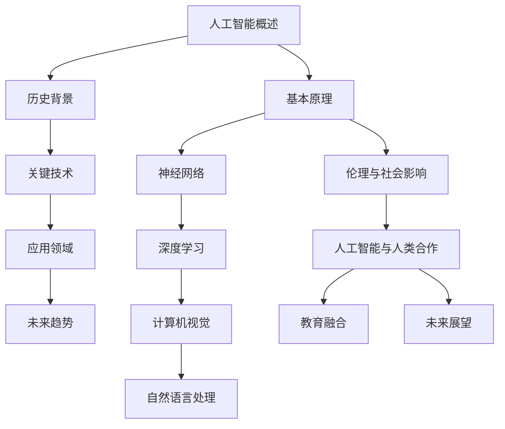

                 

# Andrej Karpathy：人工智能的未来发展方向

> 关键词：人工智能，深度学习，神经网络，计算机视觉，自然语言处理，未来趋势，应用领域，伦理问题

> 摘要：本文将深入探讨人工智能（AI）的未来发展方向，包括其基本原理、关键技术、应用领域、伦理问题以及未来趋势。通过逐步分析推理，本文旨在为读者提供一幅全面而清晰的AI发展蓝图，帮助读者理解AI的核心概念、掌握关键技术，并思考其在现实世界中的应用和影响。

## 第一部分：引言与基础

### 第1章：人工智能的概述与历史背景

#### 1.1 人工智能的定义与分类

人工智能（Artificial Intelligence，简称AI）是指通过计算机模拟人类智能的一种技术，其目标是使机器能够执行通常需要人类智能才能完成的任务，如视觉识别、语言理解、决策制定等。根据人工智能的发展阶段和实现方式，AI可以分为以下几种类型：

- **弱人工智能**：这种AI系统在特定领域内表现出高度的专长，但缺乏通用的智能和自我意识。例如，语音助手、图像识别系统等。

- **强人工智能**：这种AI系统能够像人类一样进行思考、学习和决策，具有广泛的认知能力。目前，强人工智能尚未实现，仍处于理论研究和开发阶段。

- **通用人工智能**：这种AI系统具备与人类相同的认知能力，能够在任何领域内进行学习和思考。通用人工智能的实现将是人工智能发展的最终目标。

#### 1.2 人工智能的发展历程

人工智能的概念可以追溯到20世纪50年代。以下是一些关键的发展阶段：

- **1956年**：约翰·麦卡锡等人在达特茅斯会议上首次提出了人工智能的概念。

- **1970年代**：早期的人工智能系统在逻辑推理和符号处理方面取得了显著进展。

- **1980年代**：专家系统和知识表示技术得到了广泛研究。

- **1990年代**：随着计算能力和算法的进步，机器学习和深度学习开始崭露头角。

- **2000年代**：神经网络和深度学习技术在图像识别、语音识别等领域取得了突破性进展。

- **2010年代至今**：AI技术在各个领域得到了广泛应用，如自动驾驶、医疗诊断、金融分析等。

#### 1.3 当前人工智能的关键技术

当前人工智能的关键技术主要包括：

- **神经网络与深度学习**：神经网络是一种模拟人脑结构和功能的计算模型，深度学习则是基于多层神经网络的一种学习方法。

- **计算机视觉**：计算机视觉旨在使计算机具备处理和理解图像和视频的能力，包括图像识别、目标检测和图像生成等。

- **自然语言处理**：自然语言处理（NLP）涉及计算机理解和生成自然语言，包括语言模型、机器翻译和文本生成等。

- **强化学习**：强化学习是一种通过试错学习实现决策优化的方法，广泛应用于游戏、机器人控制和推荐系统等领域。

#### 1.4 人工智能的影响与挑战

人工智能的发展对人类社会带来了深远的影响和挑战：

- **经济影响**：AI技术可以提高生产效率，降低成本，但同时也可能导致部分工作岗位的失业。

- **伦理问题**：AI系统的偏见、隐私泄露和责任归属等问题引发了广泛讨论。

- **社会影响**：AI技术改变了人们的生活方式，如自动驾驶汽车、智能家居等。

- **技术挑战**：实现通用人工智能、确保AI系统的安全性和可靠性等技术难题仍待解决。

### 第2章：人工智能的基本原理

#### 2.1 神经网络与深度学习

##### 2.1.1 神经网络的基础

神经网络（Neural Networks）是一种模拟人脑神经元的计算模型。每个神经元（又称节点）接收多个输入信号，通过加权求和后加上偏置，然后通过激活函数输出一个信号。神经网络由多个层次组成，包括输入层、隐藏层和输出层。

##### 2.1.2 深度学习的核心算法

深度学习（Deep Learning）是基于多层神经网络的一种学习方法。深度学习的关键在于通过反向传播算法（Backpropagation）不断调整网络权重，以最小化损失函数。常用的深度学习模型包括卷积神经网络（CNN）、循环神经网络（RNN）和变换器（Transformer）等。

##### 2.1.3 训练与优化

深度学习模型的训练过程包括以下步骤：

1. **数据预处理**：对输入数据进行归一化、标准化等处理。

2. **模型初始化**：随机初始化网络权重。

3. **前向传播**：将输入数据传递到网络中，计算输出。

4. **损失函数计算**：计算预测值与真实值之间的差异。

5. **反向传播**：根据损失函数的梯度信息，更新网络权重。

6. **迭代优化**：重复上述步骤，直至达到预设的停止条件。

##### 2.2 计算机视觉

###### 2.2.1 图像处理与特征提取

图像处理是计算机视觉的基础，包括图像增强、滤波、边缘检测等操作。特征提取则是从图像中提取有助于分类或识别的特征，如边缘、角点、纹理等。

###### 2.2.2 卷积神经网络在计算机视觉中的应用

卷积神经网络（CNN）是一种专门用于处理图像数据的深度学习模型。CNN通过卷积层、池化层和全连接层等结构，实现对图像的层次化特征提取和分类。

###### 2.2.3 目标检测与图像分类

目标检测旨在从图像中定位和识别多个目标，常用的方法包括单阶段检测器和多阶段检测器。图像分类则是将图像分为不同的类别，如猫、狗等。

##### 2.3 自然语言处理

###### 2.3.1 语言模型与序列模型

语言模型（Language Model）是一种用于预测文本序列的概率分布的模型，常见的方法包括n-gram模型和神经网络模型。序列模型（Sequence Model）则是用于处理序列数据的模型，如循环神经网络（RNN）和变换器（Transformer）。

###### 2.3.2 转换器架构与预训练

转换器（Transformer）是一种基于自注意力机制的深度学习模型，广泛应用于自然语言处理任务。预训练（Pre-training）则是通过在大规模语料库上训练语言模型，提高模型在下游任务中的性能。

###### 2.3.3 机器翻译与文本生成

机器翻译（Machine Translation）是一种将一种自然语言翻译成另一种自然语言的模型，常见的模型包括基于规则的方法和基于统计的方法。文本生成（Text Generation）则是根据给定输入生成文本的模型，如生成对抗网络（GAN）和变换器（Transformer）。

### 第二部分：人工智能的应用与趋势

### 第3章：人工智能在各个领域的应用

#### 3.1 人工智能在医疗领域的应用

人工智能在医疗领域的应用涵盖了医学影像分析、疾病诊断与预测、药物发现与个性化治疗等方面。

- **医学影像分析**：AI技术可以自动分析医学影像，如X光片、CT扫描和MRI，辅助医生进行诊断和病变检测。

- **疾病诊断与预测**：AI模型可以根据患者的病史、实验室检测结果和医学影像等数据，预测疾病的发生风险和病情进展。

- **药物发现与个性化治疗**：AI技术可以加速新药的发现过程，通过模拟药物与生物大分子的相互作用，提高药物研发的效率。同时，AI还可以为患者提供个性化的治疗方案。

#### 3.2 人工智能在金融领域的应用

人工智能在金融领域的应用涵盖了风险管理、量化交易、客户服务与风险管理等方面。

- **风险管理**：AI技术可以实时监测金融市场，识别潜在风险，为金融机构提供风险控制和决策支持。

- **量化交易**：AI模型可以根据历史交易数据和市场走势，自动进行高频交易和算法交易，实现投资收益的最大化。

- **客户服务与风险管理**：AI技术可以自动处理客户咨询、交易请求等，提高金融机构的客户服务水平。同时，AI还可以实时监控客户交易行为，识别异常行为并采取相应的风险控制措施。

#### 3.3 人工智能在工业制造领域的应用

人工智能在工业制造领域的应用涵盖了生产优化、质量控制、机器人与自动化等方面。

- **生产优化**：AI技术可以通过数据分析，优化生产流程和资源配置，提高生产效率。

- **质量控制**：AI模型可以实时监测产品质量，识别潜在的质量问题，确保产品的一致性和可靠性。

- **机器人与自动化**：AI技术可以开发智能机器人，实现工业生产过程中的自动化和智能化。

### 第4章：人工智能的伦理与社会影响

#### 4.1 人工智能伦理问题探讨

人工智能伦理问题主要包括隐私保护、数据安全、机器偏见与公平性等方面。

- **隐私保护**：AI技术在收集和处理大量个人数据时，可能侵犯用户的隐私权。如何确保数据隐私和安全是人工智能发展的重要伦理问题。

- **数据安全**：AI模型在训练和部署过程中，可能面临数据泄露、篡改等风险。如何保护数据安全和防止滥用是当前面临的挑战。

- **机器偏见与公平性**：AI模型在训练数据中可能包含偏见，导致模型在特定群体中的表现不佳。如何消除机器偏见，确保AI系统的公平性和透明性是重要的伦理问题。

#### 4.2 人工智能对社会的长期影响

人工智能对社会的长期影响涵盖了经济、政治和文化等方面。

- **经济影响**：AI技术可以提高生产效率，降低成本，但同时也可能导致部分工作岗位的失业。如何平衡人工智能带来的经济影响，促进社会公平和发展是重要的问题。

- **政治影响**：人工智能的发展可能改变国际政治格局，影响国家利益和安全。如何制定有效的政策和规范，确保AI技术的和平与合理使用是重要的政治问题。

- **文化与社会变革**：AI技术改变了人们的生活方式和社会结构，引发了文化和社会变革。如何应对这些变革，促进社会的和谐与发展是重要的文化问题。

### 第5章：人工智能的未来趋势与发展方向

#### 5.1 人工智能技术的演进

人工智能技术的演进包括以下几个方面：

- **量子计算与人工智能**：量子计算具有极高的计算能力，可能在未来实现超乎想象的AI应用。

- **类脑计算与神经形态硬件**：类脑计算和神经形态硬件旨在模拟人脑的计算模式和结构，实现更高效、更智能的人工智能系统。

- **多模态融合与增强现实**：多模态融合和增强现实技术可以整合多种感官信息，提高人工智能系统的感知和理解能力。

#### 5.2 人工智能在新兴领域的探索

人工智能在新兴领域的探索包括以下几个方面：

- **基因编辑与生物信息学**：AI技术可以加速基因编辑和生物信息学的研究，推动生命科学的进步。

- **虚拟现实与增强现实**：虚拟现实和增强现实技术可以为人工智能提供更加丰富和直观的交互体验。

- **人工智能在航空航天领域的应用**：AI技术可以优化航空航天器的性能，提高航天任务的效率和安全性。

### 第6章：人工智能与人类合作

#### 6.1 人工智能辅助人类工作

人工智能可以辅助人类完成各种工作任务，提高工作效率。例如，智能助手可以帮助人们管理日程、处理邮件和搜索信息。此外，AI还可以为人类提供决策支持，如金融分析、医疗诊断和供应链管理等领域。

#### 6.2 人工智能与人类教育的融合

人工智能与人类教育的融合包括以下几个方面：

- **个性化学习与智能教育系统**：AI技术可以根据学生的学习习惯和能力，提供个性化的学习资源和指导。

- **人工智能在教育评价中的应用**：AI技术可以自动评估学生的作业和考试，提高教育评价的效率和准确性。

- **人工智能与教育公平**：AI技术可以帮助解决教育资源的分配问题，提高教育公平。

### 第7章：人工智能的未来展望

#### 7.1 人工智能的发展前景

人工智能的发展前景非常广阔，它将在未来社会中发挥越来越重要的作用。例如，AI技术可以帮助解决全球性问题，如气候变化、疾病传播和贫困问题。此外，AI技术还可以促进可持续发展，提高资源利用效率。

#### 7.2 人工智能的长期挑战与机遇

人工智能的发展面临着一系列长期挑战和机遇。例如，技术伦理和监管问题需要得到妥善解决，以确保AI技术的安全和合理使用。此外，人才培养和技术创新也将是人工智能发展的重要驱动力。

#### 7.3 人工智能的未来发展与人类的共同进步

人工智能的未来发展将与人类的共同进步紧密相连。通过合理利用AI技术，我们可以创造更加美好和繁荣的未来，实现人类的可持续发展。

### 附录

#### 附录 A：人工智能工具与资源

- **主流人工智能框架介绍**：介绍常用的深度学习框架，如TensorFlow、PyTorch和Keras。

- **人工智能开源项目与资源**：介绍常用的人工智能开源项目，如TensorFlow的官方示例、Keras的实用教程等。

- **人工智能学习与交流平台**：介绍适合学习和交流的人工智能社区和论坛，如CSDN、GitHub和Stack Overflow。

### Mermaid 流程图

以下是一个用于描述人工智能基本原理的Mermaid流程图：



### 核心算法原理讲解与伪代码

以下是对神经网络、卷积神经网络和语言模型等核心算法原理的讲解以及相应的伪代码。

#### 神经网络基本结构伪代码

```python
define NeuralNetwork():
    input_layer = InputLayer()
    hidden_layer = HiddenLayer(input_layer, activation='ReLU')
    output_layer = OutputLayer(hidden_layer, activation='Sigmoid')
    return Model(input_layer, output_layer)
```

#### 卷积神经网络（CNN）训练与优化伪代码

```python
define train_CNN():
    model = NeuralNetwork()
    for epoch in range(num_epochs):
        for batch in data_loader:
            loss = model.calculate_loss(batch)
            model.update_weights(batch)
            if loss < threshold:
                break
        if loss < threshold:
            break
    return model
```

#### 语言模型与序列模型训练伪代码

```python
define train_LM():
    model = NeuralNetwork()
    for epoch in range(num_epochs):
        for sentence in sentences:
            loss = model.calculate_loss(sentence)
            model.update_weights(sentence)
            if loss < threshold:
                break
        if loss < threshold:
            break
    return model
```

### 数学模型与公式及举例说明

以下是对神经元激活函数、损失函数和梯度下降算法等数学模型和公式的讲解及举例说明。

#### 神经元激活函数

$$
a(x) = \sigma(z) = \frac{1}{1 + e^{-z}}
$$

举例说明：对于输入值 \( x = 2 \)，神经元激活函数 \( \sigma \) 的计算过程如下：

$$
a(2) = \frac{1}{1 + e^{-2}} \approx 0.886
$$

#### 损失函数（均方误差）

$$
J = \frac{1}{2n} \sum_{i=1}^{n} (y_i - \hat{y}_i)^2
$$

举例说明：假设有 5 个样本，预测值和真实值分别为 \( y_1, y_2, y_3, y_4, y_5 \) 和 \( \hat{y}_1, \hat{y}_2, \hat{y}_3, \hat{y}_4, \hat{y}_5 \)，则损失函数 \( J \) 的计算如下：

$$
J = \frac{1}{2 \times 5} \left[ (y_1 - \hat{y}_1)^2 + (y_2 - \hat{y}_2)^2 + (y_3 - \hat{y}_3)^2 + (y_4 - \hat{y}_4)^2 + (y_5 - \hat{y}_5)^2 \right]
$$

#### 梯度下降算法

$$
w_{new} = w_{old} - \alpha \cdot \frac{\partial J}{\partial w}
$$

举例说明：假设当前权重 \( w = 2 \)，学习率 \( \alpha = 0.1 \)，损失函数关于权重 \( w \) 的导数 \( \frac{\partial J}{\partial w} = 0.3 \)，则权重更新过程如下：

$$
w_{new} = 2 - 0.1 \cdot 0.3 = 1.7
$$

### 项目实战：人脸识别系统

#### 环境搭建

在 Python 环境中，需要安装以下库：

```bash
pip install tensorflow numpy matplotlib
```

#### 数据集准备

从开源数据集下载人脸图像，如 LFW 数据集，并将其分成训练集和测试集。

#### 数据预处理

对图像进行缩放和归一化处理，使得图像大小统一为 \( 128 \times 128 \) 像素，并转换为灰度图像。

```python
import numpy as np
import cv2

def preprocess_image(image_path):
    image = cv2.imread(image_path, cv2.IMREAD_GRAYSCALE)
    image = cv2.resize(image, (128, 128))
    image = image / 255.0
    return image
```

#### 构建卷积神经网络模型

使用 TensorFlow 和 Keras 构建一个卷积神经网络模型。

```python
from tensorflow.keras.models import Sequential
from tensorflow.keras.layers import Conv2D, MaxPooling2D, Flatten, Dense

model = Sequential([
    Conv2D(32, (3, 3), activation='relu', input_shape=(128, 128, 1)),
    MaxPooling2D((2, 2)),
    Conv2D(64, (3, 3), activation='relu'),
    MaxPooling2D((2, 2)),
    Flatten(),
    Dense(128, activation='relu'),
    Dense(1, activation='sigmoid')
])
```

#### 训练模型

编译并训练模型，使用均方误差损失函数和 Adam 优化器。

```python
model.compile(optimizer='adam', loss='binary_crossentropy', metrics=['accuracy'])

X_train, y_train = load_data()  # 加载训练数据
X_test, y_test = load_data()  # 加载测试数据

model.fit(X_train, y_train, epochs=10, batch_size=32, validation_data=(X_test, y_test))
```

#### 模型评估

评估模型在测试集上的准确率。

```python
test_loss, test_acc = model.evaluate(X_test, y_test)
print("Test accuracy:", test_acc)
```

#### 人脸识别演示

使用训练好的模型进行人脸识别。

```python
def recognize_face(image_path):
    image = preprocess_image(image_path)
    prediction = model.predict(np.expand_dims(image, axis=0))
    if prediction > 0.5:
        print("The person is recognized.")
    else:
        print("The person is not recognized.")

recognize_face("path_to_new_face_image")
```

以上是书中的一些核心内容和代码实现，具体细节和更深入的解释将在后续章节中详细讨论。读者可以根据这些框架和示例，逐步学习和实践人工智能的各个方面。希望这本书能够帮助读者全面了解人工智能的未来发展方向，为今后的研究和应用奠定坚实的基础。

### 作者

作者：AI天才研究院/AI Genius Institute & 禅与计算机程序设计艺术 /Zen And The Art of Computer Programming

