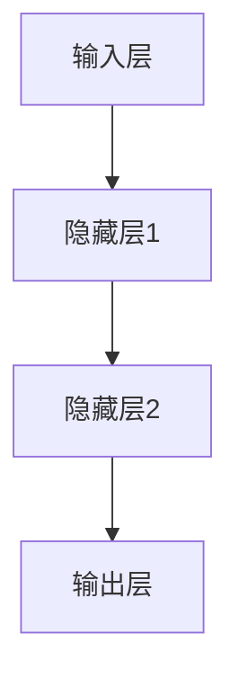
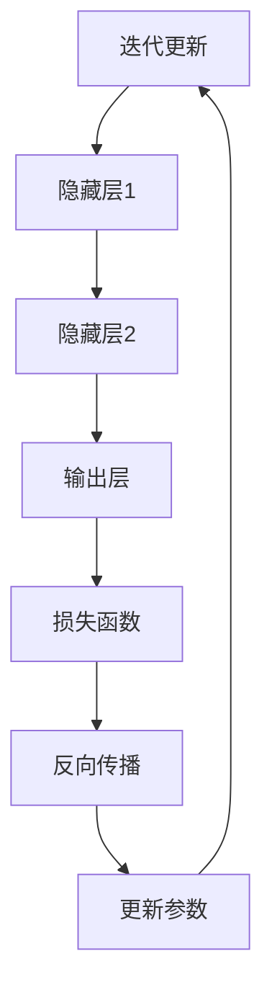

                 

# 《Andrej Karpathy：人工智能的未来发展方向》

## 关键词

人工智能，未来趋势，深度学习，应用场景，社会影响，伦理问题

## 摘要

本文将深入探讨人工智能（AI）领域的知名专家Andrej Karpathy对未来人工智能发展方向的观点。通过对人工智能的定义、核心算法原理、应用场景、未来趋势以及伦理与社会影响的详细分析，本文旨在揭示人工智能技术发展的方向与挑战。文章将从多个角度出发，结合实际案例，为读者提供一幅全面而清晰的人工智能未来图景。

## 目录大纲

### 第一部分：人工智能基础

#### 第1章：人工智能概述

- 1.1 人工智能的定义与历史
- 1.2 人工智能的核心领域
- 1.3 人工智能的应用现状与未来趋势
- 1.4 人工智能的发展背景与驱动因素

#### 第2章：人工智能的核心算法原理

- 2.1 机器学习基本概念
- 2.2 神经网络算法原理
- 2.3 深度学习算法原理
- 2.4 自然语言处理算法原理
- 2.5 计算机视觉算法原理

### 第二部分：人工智能的应用场景

#### 第3章：人工智能在工业生产中的应用

- 3.1 人工智能在制造业的应用
- 3.2 人工智能在物流管理中的应用
- 3.3 人工智能在能源管理中的应用
- 3.4 人工智能在智能装备中的应用

#### 第4章：人工智能在服务业中的应用

- 4.1 人工智能在金融行业的应用
- 4.2 人工智能在医疗健康领域的应用
- 4.3 人工智能在旅游服务中的应用
- 4.4 人工智能在智能家居中的应用

#### 第5章：人工智能在公共管理中的应用

- 5.1 人工智能在智慧城市建设中的应用
- 5.2 人工智能在公共安全领域的应用
- 5.3 人工智能在教育领域的应用
- 5.4 人工智能在环境保护中的应用

### 第三部分：人工智能的发展趋势与挑战

#### 第6章：人工智能的未来发展趋势

- 6.1 人工智能技术的未来发展方向
- 6.2 人工智能与物联网的结合
- 6.3 人工智能与生物技术的结合
- 6.4 人工智能在量子计算中的应用前景

#### 第7章：人工智能的伦理与社会影响

- 7.1 人工智能伦理问题探讨
- 7.2 人工智能对社会的影响
- 7.3 人工智能在公共政策中的应用
- 7.4 人工智能教育的发展趋势

### 附录

#### 附录A：人工智能技术常用工具与资源

- A.1 人工智能开发工具
- A.2 人工智能学习资源
- A.3 人工智能开源框架

#### 附录B：人工智能项目实战案例

- B.1 智能客服系统
- B.2 智能安防监控系统
- B.3 智能医疗诊断系统
- B.4 智能驾驶系统

## 第1章：人工智能概述

### 1.1 人工智能的定义与历史

#### 1.1.1 人工智能的定义

人工智能（AI）是指通过计算机程序和算法模拟、扩展和辅助人类智能的能力。它旨在实现机器在感知、理解、学习、推理、决策和创造等领域的智能化表现。

#### 1.1.2 人工智能的历史

人工智能的概念最早可以追溯到20世纪50年代。从逻辑推理和问题解决开始，人工智能经历了多个阶段的发展。20世纪70年代，知识表示和专家系统的出现标志着人工智能的一个重要里程碑。20世纪80年代，机器学习和神经网络的研究取得了重要进展。进入21世纪，深度学习技术的发展使人工智能进入了新一轮的复兴期。

### 1.2 人工智能的核心领域

#### 1.2.1 机器学习

机器学习（ML）是指通过数据驱动的方法，使计算机系统具备学习和预测能力。它主要包括监督学习、无监督学习和强化学习等不同类型。

#### 1.2.2 深度学习

深度学习（DL）是一种基于多层神经网络的机器学习方法，具有强大的特征提取和表示能力。它通过模拟人脑神经元之间的连接，对大规模数据进行训练，从而实现复杂的任务。

#### 1.2.3 自然语言处理

自然语言处理（NLP）是人工智能的一个分支，专注于使计算机理解和生成人类语言。它包括文本分类、情感分析、机器翻译、问答系统等任务。

#### 1.2.4 计算机视觉

计算机视觉（CV）是使计算机能够像人类一样理解和处理视觉信息的技术。它包括图像分类、目标检测、图像分割、人脸识别等任务。

### 1.3 人工智能的应用现状与未来趋势

#### 1.3.1 应用现状

当前，人工智能技术已经在多个领域取得了显著的应用成果，如智能语音助手、自动驾驶、智能家居、金融科技、医疗诊断、智慧城市等。

#### 1.3.2 未来趋势

未来，人工智能技术将在更多领域得到广泛应用，如量子计算、脑机接口、生物信息学、新型传感器技术、自主决策系统等。

### 1.4 人工智能的发展背景与驱动因素

#### 1.4.1 发展背景

人工智能的发展背景包括计算能力的提升、数据量的爆发式增长、算法的创新与发展以及产业的广泛应用需求。

#### 1.4.2 驱动因素

人工智能的发展驱动因素包括技术进步、产业需求、政策支持和社会变革。

### 1.4.3 挑战与机遇

人工智能在发展过程中面临着数据安全与隐私、伦理问题、技术普及与教育、国际竞争与合作等挑战。但同时，它也带来了巨大的机遇。

## 第2章：人工智能的核心算法原理

### 2.1 机器学习基本概念

#### 2.1.1 监督学习

监督学习是一种机器学习方法，它通过已知的输入和输出数据来训练模型，从而预测新的输入数据对应的输出。

##### 监督学习算法步骤：

1. 准备数据集：包括输入特征和对应的标签。
2. 设计模型：选择合适的模型结构，如线性模型、决策树、神经网络等。
3. 训练模型：通过迭代计算，更新模型参数，最小化损失函数。
4. 预测新数据：使用训练好的模型，对新的输入数据进行预测。

##### 伪代码示例：

```python
# 伪代码：监督学习算法
Input: 特征集 X，标签集 Y
Output: 模型参数 W

for each epoch do:
    for each training example (x, y) do:
        predict y_hat = W * x
        calculate loss L = (y - y_hat)^2
        update W = W - learning_rate * gradient(W, L)
return W
```

#### 2.1.2 无监督学习

无监督学习是指在没有明确标签的情况下，通过数据本身的特征来训练模型。它主要包括聚类、降维、生成模型等任务。

##### K-means聚类算法：

K-means聚类是一种常用的无监督学习方法，它将数据分为k个簇，每个簇由其质心表示。

##### 伪代码示例：

```python
# 伪代码：无监督学习算法（K-means聚类）
Input: 数据集 X，簇数 k
Output: 簇中心点 C

Initialize k random centroids C
for each iteration do:
    for each data point x in X do:
        assign x to the nearest centroid C_i
    recalculate centroids C as the mean of all points in each cluster
until convergence
return C
```

### 2.2 神经网络算法原理

#### 2.2.1 神经网络基本结构

神经网络（NN）是一种模仿人脑神经元连接的算法。它由输入层、隐藏层和输出层组成。

##### Mermaid流程图：



#### 2.2.2 激活函数

激活函数是神经网络中的一个关键组件，它引入了非线性特性。常用的激活函数包括ReLU、Sigmoid和Tanh。

##### 伪代码示例：

```python
# 伪代码：激活函数（ReLU）
def ReLU(x):
    if x > 0:
        return x
    else:
        return 0
```

#### 2.2.3 前向传播与反向传播

前向传播是指将输入数据通过神经网络层，计算输出结果。反向传播是指通过计算损失函数的梯度，更新模型参数。

##### Mermaid流程图：



### 2.3 深度学习算法原理

#### 2.3.1 深度学习的优势

深度学习（DL）相对于传统机器学习方法，具有以下优势：

- 高维特征表示：深度学习能够自动提取和表示高维特征，减少人工特征工程的工作量。
- 自动特征学习：深度学习模型能够通过训练自动学习数据中的特征，提高模型的泛化能力。
- 模型泛化能力：深度学习模型具有较好的泛化能力，能够在新的数据集上取得较好的表现。

#### 2.3.2 常见深度学习架构

常见的深度学习架构包括卷积神经网络（CNN）、递归神经网络（RNN）、Transformer模型等。

- 卷积神经网络（CNN）：主要应用于图像和视频处理任务。
- 递归神经网络（RNN）：适用于序列数据处理，如自然语言处理和时间序列预测。
- Transformer模型：基于注意力机制的深度学习模型，广泛应用于自然语言处理领域。

### 2.4 自然语言处理算法原理

#### 2.4.1 词嵌入技术

词嵌入（Word Embedding）是将词语映射到高维向量空间的一种技术。它通过学习词语的上下文信息，使得具有相似语义的词语在向量空间中彼此靠近。

#### 2.4.2 序列模型与注意力机制

序列模型（如RNN、LSTM、GRU）能够处理具有时间依赖性的数据。注意力机制（Attention Mechanism）用于捕捉序列中的长距离依赖关系，提高模型的表示能力。

#### 2.4.3 编码器-解码器模型

编码器-解码器模型（Encoder-Decoder Model）是一种常用的自然语言处理模型，它能够同时处理输入和输出序列，广泛应用于机器翻译、文本生成等任务。

### 2.5 计算机视觉算法原理

#### 2.5.1 卷积神经网络在计算机视觉中的应用

卷积神经网络（CNN）在计算机视觉领域具有广泛的应用，包括图像分类、目标检测、图像分割、人脸识别等。

#### 2.5.2 卷积神经网络架构

卷积神经网络主要由卷积层、池化层和全连接层组成。

- 卷积层：用于提取图像中的局部特征。
- 池化层：用于降低特征图的维度，减少计算量。
- 全连接层：用于分类和回归等任务。

## 第3章：人工智能在工业生产中的应用

### 3.1 人工智能在制造业中的应用

#### 3.1.1 智能制造系统

智能制造系统（Intelligent Manufacturing System，IMS）是人工智能在制造业中的重要应用。它通过集成人工智能技术，实现生产过程的自动化、智能化和高效化。

##### 智能制造系统的主要功能：

- 智能生产计划：根据生产需求和资源情况，自动生成最优的生产计划。
- 智能质量控制：实时监测产品质量，自动识别和纠正生产过程中的质量问题。
- 智能物流管理：通过智能化物流系统，实现生产原材料和成品的自动配送。

#### 3.1.2 智能装备

智能装备是智能制造系统的重要组成部分。它通过集成人工智能技术，提高生产过程的自动化水平和效率。

##### 智能装备的主要类型：

- 智能机器人：用于自动化装配、搬运、检测等生产任务。
- 智能传感器：用于实时监测设备状态和生产过程中的关键参数。
- 智能监控系统：用于对生产过程进行实时监控和数据分析。

### 3.2 人工智能在物流管理中的应用

#### 3.2.1 智能配送系统

智能配送系统是人工智能在物流管理中的重要应用。它通过集成人工智能技术，实现配送过程的自动化、高效化和精准化。

##### 智能配送系统的主要功能：

- 自动化配送中心：通过自动化设备，实现货物的自动分拣、打包和配送。
- 路径优化：通过智能算法，为配送车辆生成最优的配送路径，提高配送效率。
- 实时监控与调度：通过实时监控和调度系统，实现对配送过程的实时监控和调度，提高配送准确性。

#### 3.2.2 物流数据分析

物流数据分析是人工智能在物流管理中的另一个重要应用。它通过大数据分析和机器学习技术，对物流数据进行分析和挖掘，为物流管理和决策提供支持。

##### 物流数据分析的主要功能：

- 数据挖掘：通过数据挖掘技术，发现物流数据中的潜在价值和规律。
- 预测分析：通过预测分析技术，预测物流需求的趋势和变化，为物流规划和决策提供依据。
- 决策支持：通过数据分析结果，为物流管理者提供决策支持和优化建议。

### 3.3 人工智能在能源管理中的应用

#### 3.3.1 智能能源管理系统

智能能源管理系统是人工智能在能源管理中的重要应用。它通过集成人工智能技术，实现对能源消耗的实时监测、预测和优化。

##### 智能能源管理系统的主要功能：

- 能源消耗监测：通过智能传感器和监测系统，实时监测能源消耗情况。
- 负荷预测：通过数据分析和机器学习技术，预测能源负荷的变化趋势，为能源调度提供依据。
- 能源优化调度：通过优化算法，对能源的供应和分配进行优化，提高能源利用效率。

#### 3.3.2 智能电网

智能电网是人工智能在能源管理中的重要应用领域。它通过集成人工智能技术，实现对电力系统的智能化管理和控制。

##### 智能电网的主要功能：

- 自动化调度：通过智能算法，实现电力系统的自动化调度和优化。
- 电力需求预测：通过数据分析和机器学习技术，预测电力需求的趋势和变化，为电力规划和调度提供依据。
- 分布式能源管理：通过分布式能源管理系统，实现对分布式能源的优化调度和管理，提高能源利用效率。

### 3.4 人工智能在智能装备中的应用

#### 3.4.1 智能检测系统

智能检测系统是人工智能在智能装备中的重要应用。它通过集成人工智能技术，实现对生产过程中产品质量的实时监测和智能分析。

##### 智能检测系统的主要功能：

- 质量检测：通过智能传感器和检测设备，实时监测产品的质量状况。
- 故障诊断：通过数据分析和机器学习技术，对生产设备进行实时故障诊断，提高生产设备的稳定性和可靠性。
- 过程优化：通过数据分析结果，为生产过程提供优化建议，提高生产效率和质量。

#### 3.4.2 智能机器人

智能机器人是人工智能在智能装备中的重要应用。它通过集成人工智能技术，实现机器人的自动化操作和智能化决策。

##### 智能机器人主要有以下功能：

- 自动化装配：通过智能机器人，实现生产过程中的自动化装配，提高生产效率和质量。
- 无人搬运：通过智能机器人，实现生产物料的自动搬运，减少人工操作，提高生产效率。
- 辅助操作：通过智能机器人，辅助工人完成复杂的生产操作，提高生产效率和安全性。

## 第4章：人工智能在服务业中的应用

### 4.1 人工智能在金融行业的应用

#### 4.1.1 智能投资顾问

智能投资顾问是人工智能在金融行业中的重要应用。它通过集成人工智能技术，为投资者提供智能化的投资建议和策略。

##### 智能投资顾问的主要功能：

- 股票预测：通过数据分析和机器学习技术，预测股票价格的变化趋势，为投资者提供买入和卖出的建议。
- 市场分析：通过数据挖掘和统计方法，分析市场趋势和投资机会，为投资者提供投资策略。
- 投资组合优化：通过优化算法，为投资者构建最优的投资组合，提高投资回报率。

#### 4.1.2 风险管理

风险管理是金融行业中至关重要的一环。人工智能在风险管理中的应用，通过数据分析和预测模型，帮助金融机构识别、评估和管理风险。

##### 风险管理的主要功能：

- 欺诈检测：通过机器学习技术，识别和防范金融欺诈行为，保护金融机构的资金安全。
- 信用评分：通过数据分析和统计模型，评估借款人的信用状况，为金融机构提供信用评分服务。
- 市场风险分析：通过数据分析和技术，预测和评估市场风险，为金融机构提供风险管理策略。

### 4.2 人工智能在医疗健康领域的应用

#### 4.2.1 智能诊断系统

智能诊断系统是人工智能在医疗健康领域中的重要应用。它通过集成人工智能技术，实现对疾病诊断和治疗的智能化支持。

##### 智能诊断系统的主要功能：

- 疾病预测：通过数据分析和预测模型，预测患者可能患有的疾病，为医生提供诊断参考。
- 病情评估：通过数据分析和临床经验，评估患者的病情严重程度，为医生提供治疗建议。
- 治疗建议：通过数据挖掘和知识库，为医生提供治疗疾病的最佳方案，提高治疗效果。

#### 4.2.2 医疗数据分析

医疗数据分析是人工智能在医疗健康领域中的重要应用。它通过大数据分析和机器学习技术，对医疗数据进行分析和挖掘，为医疗管理和决策提供支持。

##### 医疗数据分析的主要功能：

- 电子病历分析：通过对电子病历数据进行分析，发现患者的疾病特征和诊疗规律，为医生提供诊疗参考。
- 遗传病风险预测：通过对基因数据进行分析，预测患者可能患有的遗传病，为医生提供诊断和治疗建议。
- 医疗图像分析：通过对医疗图像进行分析，发现病变区域和病情特征，为医生提供诊断支持。

### 4.3 人工智能在旅游服务中的应用

#### 4.3.1 智能旅游平台

智能旅游平台是人工智能在旅游服务中的重要应用。它通过集成人工智能技术，为游客提供智能化的旅游服务和体验。

##### 智能旅游平台的主要功能：

- 旅游路线规划：通过数据分析和推荐算法，为游客规划最佳旅游路线，提供个性化的旅游体验。
- 导游助手：通过语音识别和自然语言处理技术，为游客提供实时导游服务和解答疑问。
- 智能推荐：通过数据分析和技术，为游客推荐旅游景点、餐饮和住宿等旅游服务，提高游客满意度。

#### 4.3.2 旅游数据分析

旅游数据分析是人工智能在旅游服务中的重要应用。它通过大数据分析和预测模型，对旅游数据进行分析和挖掘，为旅游管理和决策提供支持。

##### 旅游数据分析的主要功能：

- 客流预测：通过对旅游数据进行统计分析，预测未来旅游客流量，为旅游管理者提供资源配置和调度依据。
- 景区管理：通过对旅游数据分析，优化景区管理和服务，提高景区的运营效率。
- 营销策略：通过对旅游数据分析，制定有效的营销策略，提高旅游服务的知名度和竞争力。

### 4.4 人工智能在智能家居中的应用

#### 4.4.1 智能家居系统

智能家居系统是人工智能在智能家居中的重要应用。它通过集成人工智能技术，实现家庭设备的智能化和互联化。

##### 智能家居系统的主要功能：

- 智能安防：通过智能传感器和监控系统，实时监测家庭安全状况，为家庭提供安全保障。
- 智能照明：通过智能照明系统，实现家居照明的自动化控制和场景设定，提高家居舒适度。
- 智能家电控制：通过智能家电控制系统，实现对家庭电器的远程控制和自动化控制，提高家居生活的便捷性。

#### 4.4.2 家庭生活数据分析

家庭生活数据分析是人工智能在智能家居中的重要应用。它通过大数据分析和机器学习技术，对家庭生活数据进行分析和挖掘，为家庭管理和决策提供支持。

##### 家庭生活数据分析的主要功能：

- 日常行为分析：通过对家庭生活数据分析，了解家庭成员的日常行为习惯和偏好，为家居设备提供个性化服务。
- 能耗监控：通过对家庭能耗数据分析，监测家庭能耗状况，提供节能建议和优化方案。
- 家庭健康管理：通过对家庭生活数据分析，了解家庭成员的健康状况，提供健康建议和预警服务。

## 第5章：人工智能在公共管理中的应用

### 5.1 人工智能在智慧城市建设中的应用

#### 5.1.1 城市规划与管理

人工智能在智慧城市建设中的应用，主要包括城市规划与管理、智能交通管理、城市资源优化等方面。

##### 智能规划与管理的功能：

- 城市规划模拟：通过人工智能技术，模拟城市发展规划，优化城市布局，提高土地利用效率。
- 智能交通管理：通过数据分析和技术，实现交通流量监控、道路拥堵预测和交通信号优化，提高交通效率。
- 城市资源优化：通过数据分析和技术，优化城市能源、水资源和公共设施的配置，提高城市资源利用效率。

#### 5.1.2 智慧安防

智慧安防是人工智能在公共管理中的重要应用。它通过集成人工智能技术，实现城市安全的智能化监控和管理。

##### 智慧安防的主要功能：

- 智能监控：通过智能摄像头和监控系统，实时监控城市安全状况，提高治安管理效率。
- 威胁识别：通过数据分析和图像识别技术，识别潜在的安全威胁，为公共安全提供预警。
- 紧急响应：通过智能分析和调度系统，实现快速应急响应，提高公共安全事件处置效率。

### 5.2 人工智能在公共安全领域的应用

#### 5.2.1 网络安全

人工智能在公共安全领域的应用，主要包括网络安全、灾害预测与应急响应等方面。

##### 网络安全的功能：

- 入侵检测：通过人工智能技术，实时监控网络流量和日志，识别潜在的网络攻击行为。
- 恶意软件识别：通过数据分析和行为特征识别，检测和防范恶意软件的入侵和传播。
- 安全风险评估：通过大数据分析和预测模型，评估网络系统的安全风险，提供安全防护策略。

#### 5.2.2 灾害预测与应急响应

人工智能在灾害预测与应急响应中的应用，主要包括灾害监测、风险评估和应急资源调度等方面。

##### 灾害预测与应急响应的功能：

- 灾情监测：通过数据采集和传感器技术，实时监测自然灾害的发展态势，提供预警信息。
- 风险评估：通过数据分析和预测模型，评估灾害可能造成的损失和影响，为应急响应提供决策依据。
- 应急资源调度：通过智能调度系统，合理分配应急资源，提高灾害应急响应的效率。

### 5.3 人工智能在教育领域的应用

#### 5.3.1 智能教学系统

人工智能在教育领域的应用，主要包括智能教学系统、教育数据分析等方面。

##### 智能教学系统的功能：

- 个性化学习：通过数据分析和学习算法，为学习者提供个性化的学习资源和指导，提高学习效果。
- 自动批改作业：通过自然语言处理和计算机视觉技术，自动批改学生的作业，节省教师的时间和精力。
- 学习数据分析：通过对学习行为数据进行分析，了解学习者的学习状况和需求，提供针对性的学习支持。

#### 5.3.2 教育数据分析

教育数据分析是人工智能在教育领域中的重要应用。它通过大数据分析和预测模型，对教育数据进行分析和挖掘，为教育管理和决策提供支持。

##### 教育数据分析的功能：

- 学生行为分析：通过对学生的学习行为数据进行分析，了解学生的学习状况和需求，为教育管理者提供决策依据。
- 教学效果评估：通过对教学过程数据进行分析，评估教学效果，优化教学方法和策略。
- 教学资源优化：通过对教学资源数据进行分析，优化教学资源的配置和使用，提高教育资源的利用效率。

### 5.4 人工智能在环境保护中的应用

#### 5.4.1 环境监测

人工智能在环境保护领域的应用，主要包括环境监测、环境保护管理等方面。

##### 环境监测的功能：

- 水质监测：通过智能传感器和监测设备，实时监测水质状况，为水环境保护提供数据支持。
- 大气污染监测：通过智能传感器和监测设备，实时监测大气污染状况，为大气环境保护提供数据支持。
- 噪音监测：通过智能传感器和监测设备，实时监测噪音水平，为城市环境保护提供数据支持。

#### 5.4.2 环境保护管理

环境保护管理是人工智能在环境保护领域中的重要应用。它通过集成人工智能技术，实现对环境保护的智能化管理和决策。

##### 环境保护管理的主要功能：

- 资源优化：通过数据分析和技术，优化环境保护资源的配置和使用，提高环境保护效率。
- 能源节约：通过数据分析和技术，优化能源消耗结构，提高能源利用效率，减少能源浪费。
- 污染源控制：通过数据分析和技术，识别和监测污染源，采取有效措施控制污染，保护生态环境。

## 第6章：人工智能的未来发展趋势

### 6.1 人工智能技术的未来发展方向

#### 6.1.1 量子计算

量子计算是一种基于量子力学原理的计算方式，具有超越经典计算机的潜力。在未来，量子计算有望解决传统计算机无法处理的复杂问题。

##### 量子计算的优势：

- 高速度：量子计算机能够同时处理大量数据，大大提高计算速度。
- 大存储：量子计算机的存储能力远远超过经典计算机。
- 新算法：量子计算将开启新的计算算法和应用领域。

#### 6.1.2 脑机接口

脑机接口技术将实现人类与计算机的直接交互，使得人类能够通过思维控制和操作计算机。

##### 脑机接口的应用：

- 神经恢复：通过脑机接口技术，帮助截肢者、瘫痪患者恢复肢体功能。
- 智能控制：通过脑机接口技术，实现对机器人的智能控制，提高工作效率。
- 医疗诊断：通过脑机接口技术，实现对大脑活动的实时监测，提高医疗诊断的准确性。

#### 6.1.3 生物信息学

生物信息学结合人工智能与生物学，将为医疗健康领域带来革命性变革。

##### 生物信息学的研究领域：

- 基因组学：通过数据分析和技术，解析基因组的结构和功能，揭示生物遗传信息。
- 蛋白质组学：通过数据分析和技术，研究蛋白质的结构、功能和相互作用。
- 代谢组学：通过数据分析和技术，研究生物体的代谢途径和代谢产物。

#### 6.1.4 新型传感器技术

新型传感器技术将提高人工智能系统的感知能力，使其能够更好地应对复杂环境。

##### 新型传感器的优势：

- 高灵敏度：新型传感器能够检测到更微小的变化，提高系统的感知精度。
- 多模态：新型传感器能够同时感知多种环境信息，提高系统的综合感知能力。
- 低功耗：新型传感器具有低功耗特性，延长系统的运行时间。

### 6.2 人工智能与物联网的结合

#### 6.2.1 智慧家居

智能家居将实现家庭设备的智能化和互联化，提高生活质量。

##### 智慧家居的应用：

- 智能安防：通过智能传感器和监控系统，实时监测家庭安全状况，提高家庭安全水平。
- 智能照明：通过智能控制系统，实现家庭照明的自动化控制，提高照明效果和节能效率。
- 智能家电：通过智能控制系统，实现家庭电器的远程控制和自动化操作，提高家居生活的便捷性。

#### 6.2.2 智慧城市

智慧城市将提高城市管理和公共服务的效率，创造更宜居的城市环境。

##### 智慧城市的应用：

- 智能交通：通过智能交通管理系统，实现交通流量的实时监控和优化，提高交通效率。
- 城市安全：通过智能监控系统，实时监控城市安全状况，提高公共安全水平。
- 城市资源管理：通过数据分析和技术，优化城市资源的配置和使用，提高资源利用效率。

#### 6.2.3 智能交通

智能交通将改善交通拥堵，提高交通效率。

##### 智能交通的应用：

- 智能交通信号控制：通过智能交通管理系统，实现交通信号控制的自动化和优化，提高交通效率。
- 智能停车场管理：通过智能停车场管理系统，实现停车场的自动化管理和调度，提高停车效率。
- 智能出行服务：通过智能出行服务系统，提供实时路况信息、最优出行路线推荐等，提高出行效率。

### 6.3 人工智能与生物技术的结合

#### 6.3.1 医疗诊断

人工智能与生物技术的结合，将提高疾病诊断的准确性。

##### 医疗诊断的应用：

- 智能诊断系统：通过人工智能技术和生物信息学方法，实现疾病的智能诊断和预测。
- 医学图像分析：通过人工智能技术和计算机视觉技术，对医学图像进行分析和诊断，提高诊断准确性。
- 药物研发：通过人工智能技术和生物信息学方法，加速药物研发进程，提高药物疗效。

#### 6.3.2 药物研发

人工智能与生物技术的结合，将加速药物研发进程。

##### 药物研发的应用：

- 药物筛选：通过人工智能技术和生物信息学方法，快速筛选和评估药物候选分子，提高药物研发效率。
- 药物组合：通过人工智能技术和生物信息学方法，设计最优的药物组合方案，提高治疗效果。
- 药物安全评估：通过人工智能技术和生物信息学方法，评估药物的安全性，提高药物的安全性。

#### 6.3.3 基因编辑

人工智能与生物技术的结合，将推动基因编辑技术的发展。

##### 基因编辑的应用：

- 基因编辑技术：通过人工智能技术和生物信息学方法，优化基因编辑工具的设计和操作，提高基因编辑的效率和准确性。
- 基因组编辑：通过人工智能技术和生物信息学方法，实现对基因组的精确编辑，治疗遗传疾病和遗传缺陷。
- 基因治疗：通过人工智能技术和生物信息学方法，设计个性化的基因治疗方案，提高治疗效果。

### 6.4 人工智能在量子计算中的应用前景

#### 6.4.1 量子机器学习

量子机器学习是一种基于量子计算的学习方法，具有潜力提高机器学习的效率和准确性。

##### 量子机器学习的研究领域：

- 量子神经网络：通过量子计算技术，构建量子神经网络模型，提高机器学习的效率和准确性。
- 量子优化算法：通过量子计算技术，优化机器学习算法的参数和学习过程，提高算法的效率和性能。
- 量子数据编码：通过量子计算技术，实现数据的量子编码和量子存储，提高数据的处理速度和存储容量。

#### 6.4.2 量子计算模拟

量子计算模拟是利用量子计算机模拟量子物理现象和量子系统的过程。

##### 量子计算模拟的应用：

- 物理模拟：通过量子计算模拟，研究复杂物理系统的行为和特性，提高物理理论的研究水平。
- 化学模拟：通过量子计算模拟，研究化学反应和分子结构，优化药物设计和材料制备。
- 生物系统模拟：通过量子计算模拟，研究生物大分子和生物系统的动态行为，揭示生命现象的奥秘。

#### 6.4.3 量子安全通信

量子安全通信是一种基于量子力学原理的安全通信方式，具有无法被破解的潜力。

##### 量子安全通信的应用：

- 信息安全：通过量子密钥分发技术，实现安全的通信加密和解密，保护信息安全。
- 隐私保护：通过量子通信技术，实现隐私信息的保护和传输，防止信息泄露和攻击。
- 防止网络攻击：通过量子安全通信技术，防止网络攻击和黑客入侵，提高网络安全性。

## 第7章：人工智能的伦理与社会影响

### 7.1 人工智能伦理问题探讨

#### 7.1.1 隐私保护

人工智能在数据处理过程中，需要保护个人隐私，避免隐私泄露和数据滥用。

##### 隐私保护的关键问题：

- 数据收集和使用：明确数据收集的范围和使用目的，确保数据的合法性和合理性。
- 数据匿名化：通过技术手段对数据进行匿名化处理，保护个人隐私。
- 数据安全：建立完善的数据安全保护机制，防止数据泄露和滥用。

#### 7.1.2 平等与歧视

人工智能算法可能导致歧视和不公平现象，需要采取措施确保算法的公平性和公正性。

##### 平等与歧视的关键问题：

- 算法偏见：确保算法在训练和预测过程中，不会因为数据集的不公平性而放大偏见。
- 透明性：提高算法的透明度，使其易于理解和审查。
- 多样性：确保数据集和算法开发者具有多样性，减少偏见和歧视。

#### 7.1.3 责任归属

人工智能系统的决策责任应由谁承担，是一个复杂的伦理问题。

##### 责任归属的关键问题：

- 个体责任：明确人工智能系统的操作者、开发者、用户等在决策过程中各自的责任。
- 系统责任：建立人工智能系统的责任承担机制，确保在发生问题时能够追究责任。
- 法规责任：制定相关法律法规，明确人工智能系统的责任承担和责任追究。

### 7.2 人工智能对社会的影响

#### 7.2.1 经济影响

人工智能将改变劳动力市场的结构，影响就业和经济结构。

##### 经济影响的关键问题：

- 就业替代：评估人工智能对劳动力市场的影响，制定相应的政策和培训计划，帮助劳动者适应新技术。
- 创新驱动：利用人工智能技术，推动经济创新和产业升级，提高经济增长质量和效益。
- 税收和分配：调整税收政策，确保人工智能发展过程中的财富分配更加公平。

#### 7.2.2 社会影响

人工智能可能影响社会价值观和社会结构，需要关注其对社会稳定和和谐的影响。

##### 社会影响的关键问题：

- 人际关系：人工智能技术可能改变人际交往的方式和模式，影响社会关系和社会交往。
- 社会公平：关注人工智能技术带来的社会不平等问题，采取有效措施保障社会公平。
- 文明传承：在发展人工智能技术的同时，保护和传承人类文明和传统文化。

#### 7.2.3 文明影响

人工智能技术将推动人类文明的发展，改变人类的生活方式和社会形态。

##### 文明影响的关键问题：

- 科技进步：推动科技进步，为人类创造更加美好的生活条件。
- 知识创新：促进知识创新和传播，提升人类的知识水平和智力素质。
- 全球合作：通过人工智能技术，促进全球合作，解决全球性问题，实现共同发展。

### 7.3 人工智能在公共政策中的应用

#### 7.3.1 政策制定

人工智能技术可以辅助政策制定和实施，提高政策制定的科学性和有效性。

##### 政策制定的关键问题：

- 数据支持：利用大数据和人工智能技术，为政策制定提供数据支持和分析依据。
- 风险评估：通过人工智能技术，评估政策实施的风险和影响，为政策调整提供参考。
- 透明度：提高政策制定的透明度，接受公众监督和反馈，确保政策公正和合理。

#### 7.3.2 法规制定

需要制定相应的法规来规范人工智能的应用，保障人工智能技术的健康发展。

##### 法规制定的关键问题：

- 法律责任：明确人工智能系统的法律责任，确保在发生问题时能够追究责任。
- 伦理审查：建立人工智能伦理审查机制，确保人工智能技术的应用符合伦理要求。
- 安全标准：制定人工智能安全标准，保障人工智能技术的安全性、可靠性和可控性。

#### 7.3.3 公共服务

人工智能技术可以提高公共服务的效率和品质，为公众提供更加便捷、高效的服务。

##### 公共服务的关键问题：

- 服务个性化：利用人工智能技术，实现公共服务的个性化定制，满足公众的多样化需求。
- 数据共享：建立公共服务数据共享平台，实现数据的互联互通，提高公共服务的数据支撑能力。
- 智能化服务：通过人工智能技术，提供智能化、高效化的公共服务，提高公众的满意度。

### 7.4 人工智能教育的发展趋势

#### 7.4.1 教育内容

人工智能教育应涵盖算法、数据结构、机器学习等内容，培养人工智能领域的专业人才。

##### 教育内容的关键问题：

- 算法学习：教授常见的机器学习算法和深度学习算法，培养学生的算法设计和实现能力。
- 数据结构：教授数据结构的基本概念和应用，提高学生的数据处理和分析能力。
- 实践项目：通过实践项目，让学生在实际应用中掌握人工智能技术的原理和应用方法。

#### 7.4.2 教学方法

人工智能教育应采用项目驱动、实践导向的教学方法，提高学生的实践能力和创新能力。

##### 教学方法的关键问题：

- 项目驱动：通过实际项目，让学生动手实践，培养解决问题的能力和团队协作能力。
- 实践导向：通过实践环节，让学生了解人工智能技术的实际应用场景，提高学生的实践能力。
- 创新思维：鼓励学生创新思维，培养学生的独立思考能力和创新能力。

#### 7.4.3 教育资源

需要开发丰富的人工智能教育资源，为人工智能教育提供支持。

##### 教育资源的关键问题：

- 教材和书籍：开发高质量的人工智能教材和书籍，为学生提供系统的学习资源。
- 在线课程：提供丰富多样的在线课程，满足不同层次学生的学习需求。
- 开源项目：鼓励开源人工智能项目，为学生提供实践平台和学习资源。

## 附录A：人工智能技术常用工具与资源

### A.1 主流深度学习框架对比

- TensorFlow：由Google开发，支持多种编程语言，具有丰富的API和生态系统。
- PyTorch：由Facebook开发，具有动态计算图和易于使用的接口，适用于科研和工业应用。
- Keras：基于Theano和TensorFlow开发，提供简洁的API，适合快速实验和项目开发。
- MXNet：由Apache Software Foundation开发，支持多种编程语言，具有良好的性能和灵活性。

### A.2 人工智能学习资源

- 在线课程：Coursera、edX、Udacity等平台提供丰富的在线课程，涵盖机器学习、深度学习等多个领域。
- 科研论文：通过阅读顶级会议和期刊的论文，了解人工智能的最新研究成果和发展趋势。
- 开源项目：GitHub等平台上有大量的人工智能开源项目，供学习、参考和改进。

### A.3 人工智能开源框架

- OpenCV：用于计算机视觉的开源库，提供丰富的图像处理和计算机视觉算法。
- TensorFlow：用于机器学习和深度学习的开源库，支持多种编程语言和平台。
- PyTorch：用于机器学习和深度学习的开源库，具有动态计算图和易于使用的接口。
- Keras：用于机器学习和深度学习的开源库，提供简洁的API，方便快速实验和项目开发。

## 附录B：人工智能项目实战案例

### B.1 智能客服系统

#### 项目背景

智能客服系统是人工智能在客户服务领域的重要应用。通过集成自然语言处理、机器学习等技术，实现智能对话、问题解答和客户支持。

##### 技术架构：

- 自然语言处理：利用词嵌入技术、序列模型和注意力机制，实现自然语言理解和生成。
- 机器学习：通过监督学习和无监督学习算法，训练模型进行意图识别和实体抽取。

##### 实现细节：

- 对话管理：设计对话流程，实现多轮对话和意图识别。
- 知识库管理：建立知识库，实现问题解答和常见问题自动化处理。

### B.2 智能安防监控系统

#### 项目背景

智能安防监控系统是人工智能在公共安全领域的重要应用。通过集成计算机视觉、深度学习等技术，实现视频监控、目标检测和异常行为识别。

##### 技术架构：

- 计算机视觉：利用卷积神经网络和深度学习算法，实现图像处理和特征提取。
- 深度学习：通过深度学习模型，进行目标检测和异常行为识别。

##### 实现细节：

- 视频预处理：对视频进行去噪、缩放和增强等预处理操作。
- 目标检测：使用卷积神经网络进行目标检测和分类。
- 异常行为识别：利用深度学习算法，识别异常行为和事件。

### B.3 智能医疗诊断系统

#### 项目背景

智能医疗诊断系统是人工智能在医疗领域的重要应用。通过集成医学图像处理、深度学习等技术，实现疾病诊断、病情评估和治疗方案推荐。

##### 技术架构：

- 医学图像处理：利用深度学习算法，实现医学图像分割、标注和识别。
- 深度学习：通过深度学习模型，进行疾病诊断和病情评估。

##### 实现细节：

- 数据预处理：对医学图像进行预处理，提高图像质量和识别准确率。
- 疾病诊断：利用深度学习模型，对医学图像进行疾病分类和诊断。
- 治疗方案推荐：根据病情和诊断结果，推荐最佳治疗方案。

### B.4 智能驾驶系统

#### 项目背景

智能驾驶系统是人工智能在汽车领域的重要应用。通过集成计算机视觉、深度学习、物联网等技术，实现自动驾驶、智能导航和安全监控。

##### 技术架构：

- 计算机视觉：利用卷积神经网络和深度学习算法，实现场景识别、目标检测和物体跟踪。
- 深度学习：通过深度学习模型，进行驾驶决策和路径规划。
- 物联网：利用物联网技术，实现车辆之间的通信和协同控制。

##### 实现细节：

- 视觉感知：通过摄像头和传感器，实时获取周围环境和车辆信息。
- 驾驶决策：利用深度学习算法，实现自动驾驶和驾驶行为控制。
- 车辆通信：利用物联网技术，实现车辆之间的信息交换和协同控制。

