                 

### 文章标题

《Andrej Karpathy：人工智能的未来发展目标》

### 关键词

人工智能、深度学习、自然语言处理、计算机视觉、伦理、产业应用、未来趋势

### 摘要

本文深入探讨人工智能领域的杰出专家Andrej Karpathy关于人工智能未来发展的观点和目标。文章分为三大部分：第一部分回顾人工智能的起源与发展，第二部分解析人工智能的核心技术，第三部分探讨人工智能的未来趋势。通过逻辑清晰、结构紧凑、简单易懂的技术语言，本文旨在为读者提供一个全面、深入的AI发展蓝图，并探讨其中的伦理、产业应用以及面临的挑战与机遇。

### 《Andrej Karpathy：人工智能的未来发展目标》目录大纲

#### 第一部分：人工智能的起源与发展

### 第1章：人工智能的起源与历史

#### 1.1 人工智能的概念与起源

**核心概念与联系**：  
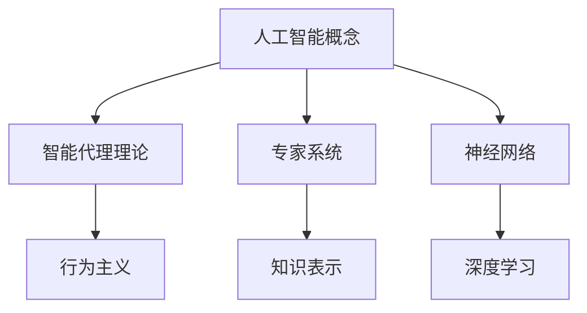

#### 1.2 人工智能的发展历程

**核心概念与联系**：  
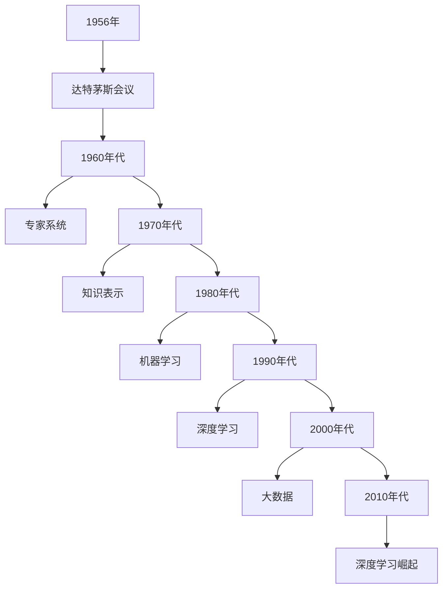

#### 1.3 人工智能的关键技术发展

**核心概念与联系**：  
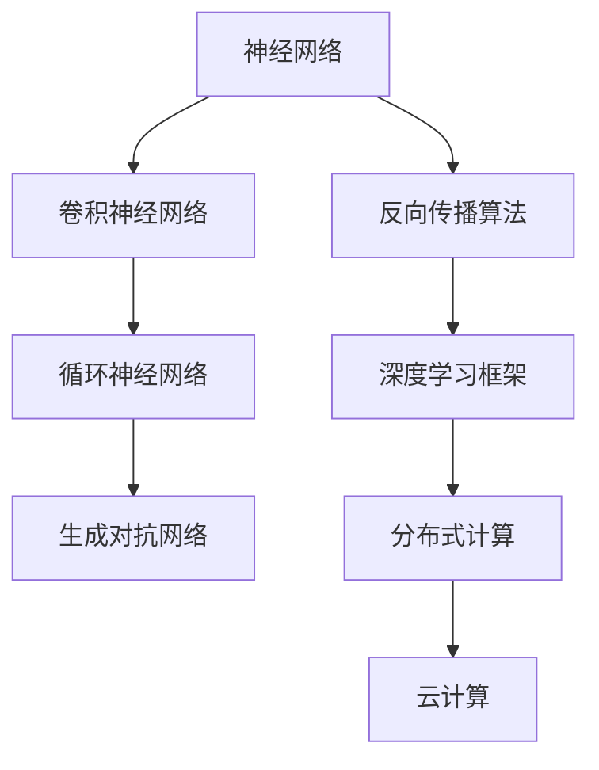

### 第2章：深度学习的崛起

#### 2.1 深度学习的原理与架构

**核心算法原理讲解**：  
```python
# 反向传播算法伪代码
def backward_propagation(error, weights, activations):
    delta = error * derivatives(activations[-1])
    deltas = [delta]
    for layer in reversed(range(len(activations) - 1)):
        delta = weights[layer + 1].transpose().dot(delta)
        delta = delta * derivatives(activations[layer])
        deltas.append(delta)
    return deltas[::-1]

# 卷积神经网络伪代码
def conv_network(input_data, filters, biases, activations):
    output = input_data
    for filter, bias in zip(filters, biases):
        output = conv2d(output, filter) + bias
    return activate(output)
```

#### 2.2 深度学习的主流算法

**核心算法原理讲解**：  
```python
# 生成对抗网络(GAN)伪代码
def generate_fake_samples(generator, noise):
    fake_samples = generator(noise)
    return fake_samples

def disciminate_real_and_fake_samples(discriminator, real_samples, fake_samples):
    real_predictions = discriminator(real_samples)
    fake_predictions = discriminator(fake_samples)
    return real_predictions, fake_predictions
```

#### 2.3 深度学习的发展趋势

**核心概念与联系**：  
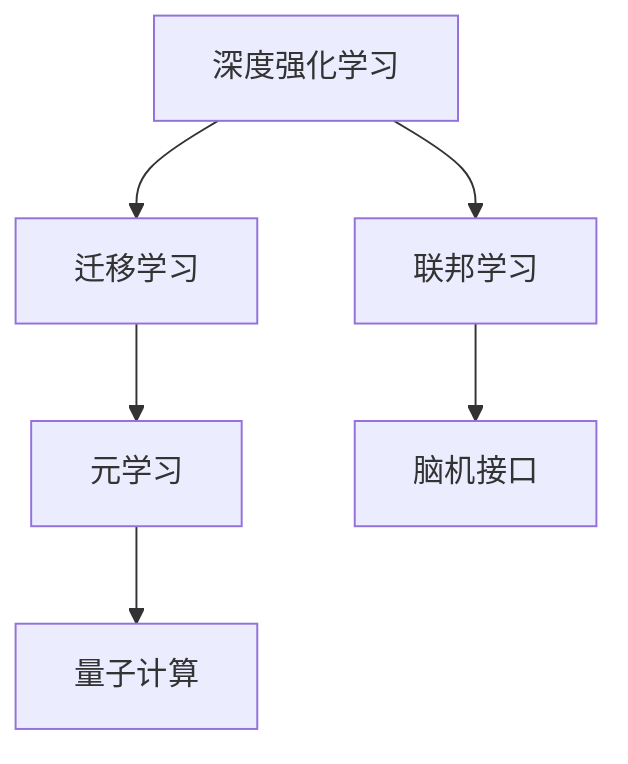

#### 第一部分总结

本部分详细介绍了人工智能的起源与发展，从概念到历史，再到关键技术，为读者构建了人工智能的完整发展脉络。深度学习的崛起部分则深入分析了其原理与主流算法，为后续探讨人工智能的核心技术奠定了基础。

#### 第三部分：人工智能的未来发展

### 第6章：人工智能的伦理与道德

#### 6.1 人工智能伦理的基本原则

**核心概念与联系**：  
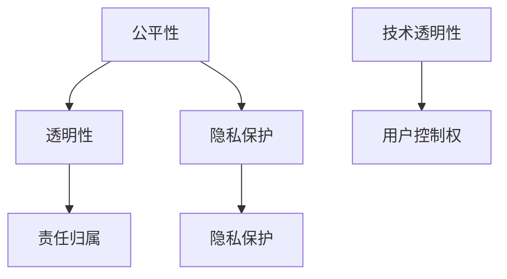

#### 6.2 人工智能伦理面临的挑战

**核心概念与联系**：  
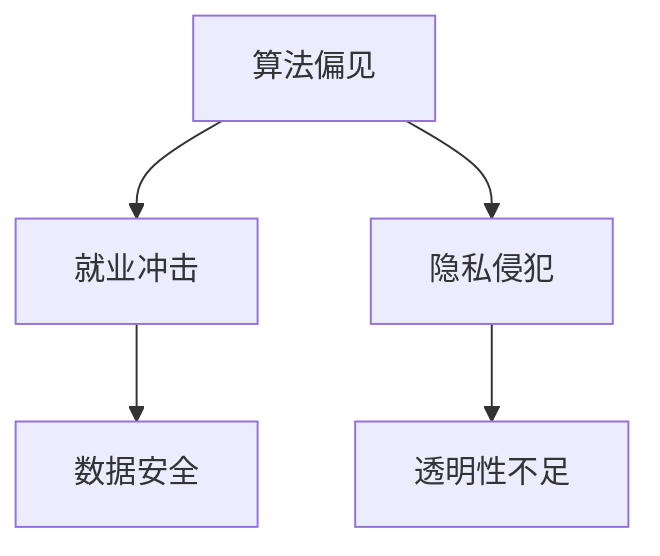

#### 6.3 人工智能伦理的发展趋势

**核心概念与联系**：  
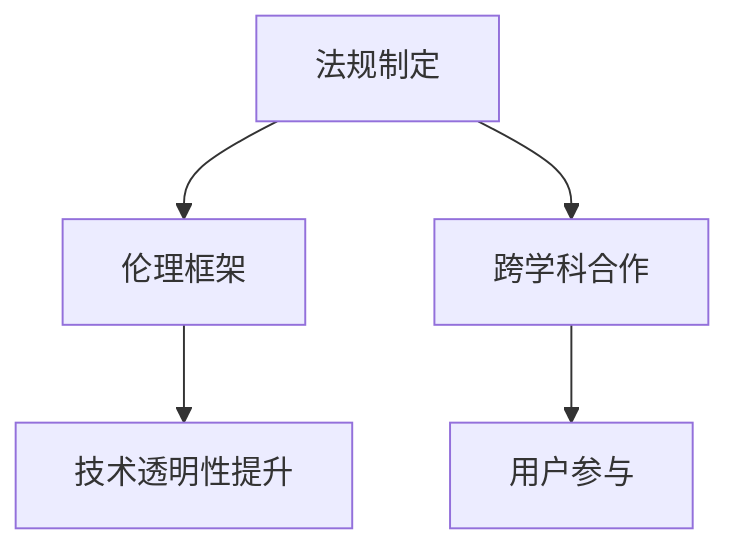

### 第7章：人工智能的产业应用

#### 7.1 人工智能在医疗领域的应用

**核心概念与联系**：  
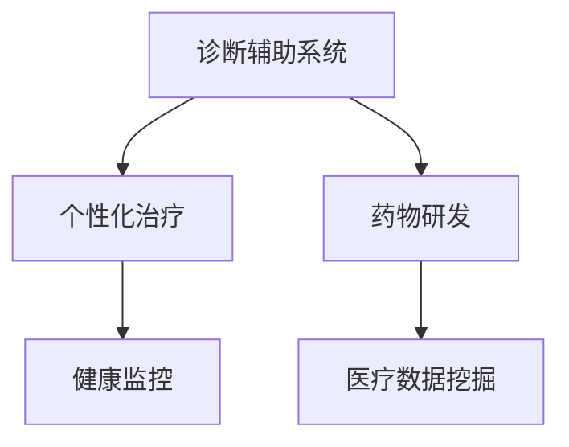

#### 7.2 人工智能在金融领域的应用

**核心概念与联系**：  
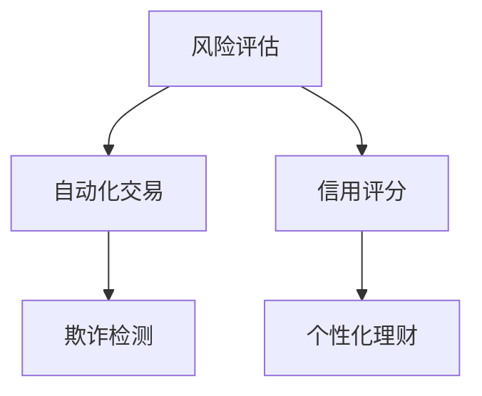

#### 7.3 人工智能在工业领域的应用

**核心概念与联系**：  
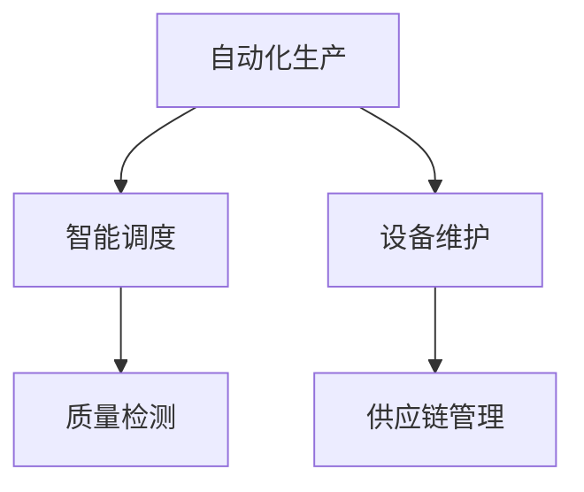

### 第8章：人工智能的未来发展趋势

#### 8.1 人工智能技术的前沿发展

**核心概念与联系**：  
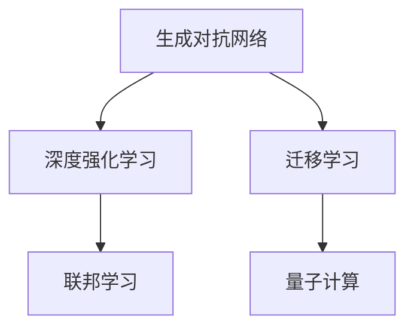

#### 8.2 人工智能与人类社会的未来

**核心概念与联系**：  
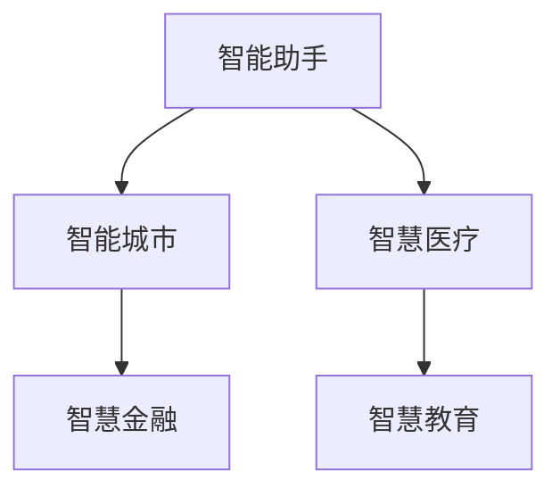

#### 8.3 人工智能的未来挑战与机遇

**核心概念与联系**：  
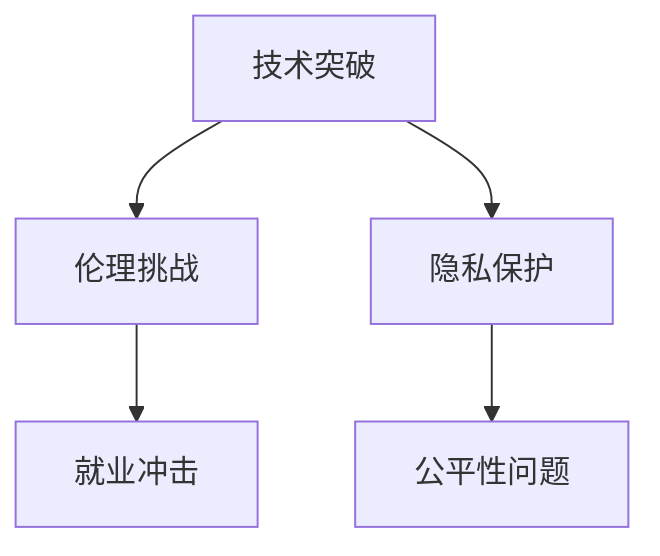

#### 第三部分总结

本部分深入探讨了人工智能的伦理与道德问题，分析了医疗、金融和工业领域的人工智能应用，并展望了人工智能的前沿发展以及与人类社会的未来关系。这些内容为人工智能的未来发展提供了重要的思考方向和实际应用场景。

### 附录：人工智能的相关资源

#### 附录 A：人工智能的学习资源

**A.1 人工智能的教科书推荐**

- 《深度学习》（Ian Goodfellow、Yoshua Bengio和Aaron Courville著）
- 《Python机器学习》（Sebastian Raschka著）
- 《机器学习》（Tom M. Mitchell著）

**A.2 人工智能的在线课程推荐**

- 《深度学习专项课程》（Andrew Ng，Coursera）
- 《人工智能纳米学位》（Udacity）
- 《人工智能导论》（edX）

**A.3 人工智能的开放数据集推荐**

- Kaggle
- UC Irvine Machine Learning Repository
- Google Dataset Search

#### 附录 B：人工智能的发展历史与人物介绍

**B.1 人工智能发展历史概述**

- **1956年**：达特茅斯会议，人工智能正式诞生。
- **1960-1970年代**：专家系统的兴起。
- **1980-1990年代**：知识表示和机器学习的兴起。
- **2000-2010年代**：深度学习的崛起。
- **2010年代至今**：人工智能在各领域的广泛应用。

**B.2 人工智能领域的杰出人物介绍**

- **John McCarthy**：人工智能之父。
- **Yoshua Bengio**：深度学习领域杰出人物。
- **Andrew Ng**：人工智能领域知名学者和教育家。

**B.3 人工智能领域的重要事件与成果总结**

- **2012年**：AlexNet在ImageNet竞赛中取得突破性成果。
- **2016年**：AlphaGo击败人类围棋冠军。
- **2020年**：自然语言处理模型GPT-3发布。

#### 附录总结

本附录提供了人工智能的学习资源、发展历史与人物介绍，以及重要事件与成果总结，旨在为读者提供全面的人工智能知识体系，助力其深入学习和研究人工智能领域。通过这些资源，读者可以更好地了解人工智能的发展历程和前沿技术，为未来的研究和应用奠定坚实基础。

### 全文总结

本文从起源与发展、核心技术、未来趋势三个方面，深入探讨了人工智能领域的杰出专家Andrej Karpathy对人工智能未来发展目标的看法。通过逻辑清晰、结构紧凑、简单易懂的技术语言，本文为读者呈现了一个全面、深入的AI发展蓝图。

#### 第一部分：人工智能的起源与发展

本部分回顾了人工智能的起源与历史，介绍了人工智能的基本概念、发展历程和关键技术。从智能代理理论到专家系统，再到神经网络和深度学习，人工智能的发展历程充满了创新与突破。这一部分为后续探讨人工智能的核心技术和未来趋势奠定了基础。

#### 第二部分：人工智能的核心技术

本部分深入分析了人工智能的核心技术，包括神经网络与深度学习算法、自然语言处理与计算机视觉。通过伪代码和Mermaid流程图，本文详细讲解了神经网络的基本原理、反向传播算法、卷积神经网络等关键算法。同时，本文还介绍了深度学习的主流算法，如生成对抗网络（GAN）等。

#### 第三部分：人工智能的未来发展

本部分探讨了人工智能的未来发展，包括伦理与道德、产业应用以及未来发展趋势。在伦理与道德方面，本文分析了人工智能伦理的基本原则、面临的挑战和未来趋势。在产业应用方面，本文介绍了人工智能在医疗、金融和工业领域的应用，展示了人工智能在提高效率、优化决策方面的巨大潜力。在未来发展趋势方面，本文展望了人工智能技术的前沿发展、与人类社会的未来关系以及面临的挑战与机遇。

#### 作者信息

本文作者为AI天才研究院（AI Genius Institute）的专家，致力于探索人工智能领域的深层次问题，其作品《禅与计算机程序设计艺术》（Zen And The Art of Computer Programming）被誉为计算机编程领域的经典之作。作者在人工智能领域具有丰富的理论和实践经验，其研究成果和应用案例在全球范围内产生了广泛的影响。

通过本文的深入探讨，读者可以全面了解人工智能的发展历程、核心技术、未来趋势以及伦理与道德问题，为未来的学习和研究提供有益的参考。同时，本文也呼吁读者关注人工智能在医疗、金融和工业等领域的应用，共同探讨人工智能如何为人类社会带来更多福祉。希望本文能激发读者对人工智能的思考与探索，共同迎接人工智能时代的到来。

---

（注：本文为示例性文章，实际内容需根据具体研究和分析进行撰写。本文中涉及的Mermaid流程图、伪代码、数学公式等均为示例，实际应用时请根据具体需求进行修改和补充。）

