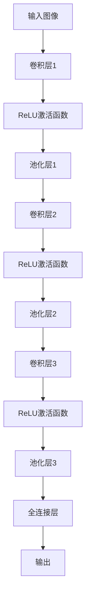

                 

### 文章标题: Andrej Karpathy：人工智能的未来发展趋势

关键词：人工智能，未来趋势，技术发展，应用领域，挑战与机遇

摘要：本文深入探讨了人工智能（AI）领域知名专家Andrej Karpathy对未来AI发展趋势的预测与思考。文章首先介绍了Andrej Karpathy的背景和贡献，随后回顾了人工智能的发展历程。接着，文章分析了当前人工智能的技术水平、面临的挑战和社会影响。在核心技术分析部分，本文详细阐述了机器学习、深度学习、自然语言处理、计算机视觉、强化学习等技术的基础知识和应用。随后，文章探讨了人工智能在医疗、自动驾驶、金融、游戏和社交媒体等领域的应用，并预测了人工智能的未来发展趋势。最后，文章总结了人工智能的重要问题和未来机遇与挑战，提出了对未来研究的建议。

---

### 《Andrej Karpathy：人工智能的未来发展趋势》目录大纲

本文将分为五个部分，首先介绍Andrej Karpathy的背景和贡献，随后回顾人工智能的发展历程，分析当前的技术水平、挑战和社会影响。接下来，详细探讨核心技术和应用领域。最后，预测人工智能的未来发展趋势，并总结重要问题和未来研究的建议。

#### 第一部分：导论

1.1 书籍背景和作者介绍
   - 1.1.1 Andrej Karpathy的个人背景
   - 1.1.2 Andrej Karpathy的贡献与影响力

1.2 人工智能的发展简史
   - 1.2.1 人工智能的起源
   - 1.2.2 人工智能的发展阶段
   - 1.2.3 人工智能的关键事件

1.3 人工智能的现状与挑战
   - 1.3.1 当前人工智能的技术水平
   - 1.3.2 人工智能面临的挑战
   - 1.3.3 人工智能的社会影响

#### 第二部分：核心技术分析

2.1 机器学习和深度学习基础
   - 2.1.1 机器学习的基本概念
   - 2.1.2 深度学习的关键技术
   - 2.1.3 机器学习和深度学习的差异

2.2 自然语言处理技术
   - 2.2.1 自然语言处理的基本任务
   - 2.2.2 语言的数学表示
   - 2.2.3 生成式和判别式模型

2.3 计算机视觉基础
   - 2.3.1 图像处理和计算机视觉
   - 2.3.2 卷积神经网络在图像识别中的应用
   - 2.3.3 图像生成与风格迁移

2.4 强化学习原理与实践
   - 2.4.1 强化学习的基本概念
   - 2.4.2 Q-学习与深度Q网络
   - 2.4.3 强化学习在实际应用中的挑战

2.5 人工智能伦理与责任
   - 2.5.1 人工智能伦理问题的讨论
   - 2.5.2 人工智能责任界定
   - 2.5.3 人工智能伦理监管与政策

#### 第三部分：应用领域探讨

3.1 人工智能在医疗领域的应用
   - 3.1.1 人工智能在医学影像分析中的应用
   - 3.1.2 人工智能辅助诊断系统
   - 3.1.3 人工智能在药物发现中的应用

3.2 人工智能在自动驾驶领域的应用
   - 3.2.1 自动驾驶技术的基本原理
   - 3.2.2 自动驾驶系统架构
   - 3.2.3 自动驾驶技术的未来趋势

3.3 人工智能在金融领域的应用
   - 3.3.1 人工智能在风险管理中的应用
   - 3.3.2 人工智能在量化交易中的应用
   - 3.3.3 人工智能在金融欺诈检测中的应用

3.4 人工智能在游戏领域的应用
   - 3.4.1 人工智能在游戏生成中的应用
   - 3.4.2 人工智能在游戏AI中的应用
   - 3.4.3 人工智能在电子竞技中的应用

3.5 人工智能在社交媒体领域的应用
   - 3.5.1 人工智能在内容推荐中的应用
   - 3.5.2 人工智能在社交网络分析中的应用
   - 3.5.3 人工智能在社交网络道德风险控制中的应用

#### 第四部分：未来趋势预测

4.1 人工智能的未来发展趋势
   - 4.1.1 人工智能技术将如何发展
   - 4.1.2 人工智能对社会经济的影响
   - 4.1.3 人工智能技术的潜在突破点

4.2 人工智能与人类生活
   - 4.2.1 人工智能如何改变人类生活方式
   - 4.2.2 人工智能在教育与职业培训中的应用
   - 4.2.3 人工智能与人类创造力互动

4.3 人工智能与工作市场
   - 4.3.1 人工智能对就业市场的影响
   - 4.3.2 人工智能时代的人力资源管理
   - 4.3.3 人工智能与职业发展的新机遇

4.4 人工智能与全球化
   - 4.4.1 人工智能对全球化的影响
   - 4.4.2 人工智能时代的国际合作与竞争
   - 4.4.3 人工智能与全球治理

4.5 人工智能与可持续发展
   - 4.5.1 人工智能在环境保护中的应用
   - 4.5.2 人工智能在资源优化中的应用
   - 4.5.3 人工智能与可持续发展的未来

#### 第五部分：结论与展望

5.1 总结与反思
   - 5.1.1 人工智能发展中的重要问题
   - 5.1.2 人工智能的未来机遇与挑战
   - 5.1.3 对人工智能未来发展的展望

5.2 附录
   - 5.2.1 参考文献
   - 5.2.2 相关网站和资源
   - 5.2.3 未来研究建议

---

接下来，我们将逐章深入探讨人工智能领域的发展趋势，从理论基础到实际应用，再到未来展望，全面解析这一充满机遇与挑战的领域。

### 第一部分：导论

#### 1.1 书籍背景和作者介绍

在探讨人工智能的未来发展趋势之前，首先需要了解本文的核心人物——Andrej Karpathy。Andrej Karpathy是一位世界知名的深度学习和自然语言处理专家，其在人工智能领域的研究成果和应用案例引起了广泛关注。作为Google AI的研究科学家，Karpathy在自然语言处理、计算机视觉和深度学习等领域有着丰富的经验，并在顶级学术会议和期刊上发表了多篇论文。

Andrej Karpathy之所以成为人工智能领域的明星，不仅因为他在技术上的卓越贡献，还因为他极具启发性的写作风格和公开的代码实践。他的博客文章《The Unwritten Rules of Neural Network Training》和《Common Sense and AI》等文章，以深入浅出的方式阐述了深度学习的核心原理和应用，受到了广大研究者和从业者的喜爱。

Karpathy的著作《Deep Learning for Natural Language Processing》进一步巩固了他在自然语言处理领域的地位。这本书详细介绍了深度学习在自然语言处理中的应用，从基础的词向量到复杂的序列模型，为读者提供了全面的技术指导。此外，他还积极参与开源项目，如TensorFlow和PyTorch，为社区贡献了大量优质代码和实践案例。

#### 1.2 人工智能的发展简史

人工智能（Artificial Intelligence，简称AI）作为计算机科学的一个重要分支，自20世纪50年代诞生以来，经历了多个发展阶段。以下是人工智能的发展简史：

1. **起源（1950s-1960s）**：人工智能的概念最早由图灵提出，他在1950年的论文《计算机器与智能》中提出了著名的图灵测试。1956年，达特茅斯会议的召开标志着人工智能正式成为一门独立的学科。

2. **早期探索（1960s-1970s）**：早期的人工智能研究主要集中在符号主义和知识表示上，例如专家系统。这一时期，人工智能取得了初步成功，但也面临性能瓶颈和现实应用困难。

3. **停滞期（1970s-1980s）**：由于硬件限制和算法难度，人工智能在1970年代和1980年代遭遇了发展瓶颈，被称为“人工智能寒冬”。

4. **复兴（1990s-2000s）**：随着计算机性能的提升和大数据的积累，人工智能再次迎来发展机遇。机器学习和深度学习技术的发展，使得人工智能在图像识别、语音识别等领域取得了显著突破。

5. **繁荣期（2010s至今）**：近年来，人工智能取得了前所未有的进展，深度学习技术成为主流。从自动驾驶、智能家居到医疗诊断、金融风控，人工智能的应用场景日益广泛。

#### 1.3 人工智能的现状与挑战

当前，人工智能已经成为科技界和产业界的热门话题，其技术水平和应用规模达到了前所未有的高度。以下是人工智能的现状和面临的挑战：

1. **技术水平**：在图像识别、自然语言处理、语音识别等领域，人工智能已经达到了或接近人类的水平。例如，OpenAI的GPT-3模型在文本生成和翻译任务上展现出了惊人的能力。

2. **应用领域**：人工智能在医疗、金融、交通、教育、娱乐等多个领域得到了广泛应用，提高了行业效率和生产力。自动驾驶、智能客服、个性化推荐等应用已经成为现实。

3. **面临的挑战**：
   - **算法性能与可解释性**：虽然人工智能在某些任务上已经表现出色，但算法的黑箱性质和缺乏可解释性仍然是一个重大挑战。
   - **数据隐私与安全**：人工智能应用需要大量数据，但数据隐私和安全问题日益突出，如何平衡数据利用和隐私保护成为关键问题。
   - **伦理与责任**：人工智能在决策过程中可能出现偏见和错误，如何确保其公平、透明和可解释，如何界定其责任，是亟待解决的问题。
   - **技术普及与教育**：随着人工智能技术的不断发展，对相关技术人才的需求也不断增加，如何普及人工智能教育，提高全民科技素养，是未来需要关注的问题。

通过以上内容，我们初步了解了Andrej Karpathy及其著作在人工智能领域的重要地位，回顾了人工智能的发展历程，并分析了当前的技术水平与挑战。接下来，我们将深入探讨人工智能的核心技术。

### 第二部分：核心技术分析

#### 2.1 机器学习和深度学习基础

**2.1.1 机器学习的基本概念**

机器学习（Machine Learning，ML）是一门人工智能（AI）的分支，它通过算法从数据中学习规律，并在未知数据上进行预测或决策。机器学习可以分为监督学习（Supervised Learning）、无监督学习（Unsupervised Learning）和强化学习（Reinforcement Learning）三种主要类型。

- **监督学习**：在有标签数据集上进行训练，模型通过学习输入和输出之间的映射关系来预测新的输入。常见的监督学习算法包括线性回归、决策树、支持向量机（SVM）和神经网络等。
- **无监督学习**：在无标签数据集上进行训练，模型通过发现数据内在的结构或模式来进行聚类或降维。常见的无监督学习算法包括K均值聚类、主成分分析（PCA）和自编码器等。
- **强化学习**：通过与环境的交互来学习最优策略，模型通过奖励机制来调整行为，以最大化长期回报。常见的强化学习算法包括Q-学习、深度Q网络（DQN）和策略梯度方法等。

**2.1.2 深度学习的关键技术**

深度学习（Deep Learning，DL）是机器学习的一个子领域，它使用多层的神经网络来学习数据的复杂特征。深度学习的关键技术包括神经网络架构、激活函数、损失函数和优化算法等。

- **神经网络架构**：深度学习的基础是神经网络，它由多个层级组成，包括输入层、隐藏层和输出层。常见的神经网络架构有卷积神经网络（CNN）、循环神经网络（RNN）和变换器（Transformer）等。
- **激活函数**：激活函数用于引入非线性特性，使得神经网络能够学习复杂的函数。常见的激活函数有sigmoid、ReLU和Tanh等。
- **损失函数**：损失函数用于度量模型预测值与真实值之间的差异，常用的损失函数包括均方误差（MSE）、交叉熵损失和Hinge损失等。
- **优化算法**：优化算法用于调整模型参数，以最小化损失函数。常见的优化算法有随机梯度下降（SGD）、Adam优化器和RMSprop等。

**2.1.3 机器学习和深度学习的差异**

机器学习和深度学习虽然都属于人工智能的范畴，但它们在理论基础和应用上存在显著差异：

- **理论基础**：机器学习主要依赖于统计学习和概率模型，而深度学习则基于神经网络和反向传播算法。
- **数据需求**：机器学习对数据量的要求相对较低，而深度学习需要大量数据进行训练，以避免过拟合。
- **模型复杂性**：机器学习模型通常较为简单，易于解释，而深度学习模型层次较多，参数数量庞大，具有较高的非线性表达能力。
- **应用领域**：机器学习在传统行业和简单任务中应用广泛，而深度学习则在图像识别、语音识别、自然语言处理等复杂任务中表现出色。

通过上述分析，我们可以看到机器学习和深度学习在理论基础和应用上各有特点。接下来，我们将进一步探讨自然语言处理技术。

#### 2.2 自然语言处理技术

自然语言处理（Natural Language Processing，NLP）是人工智能的一个重要分支，旨在使计算机能够理解和生成人类语言。NLP技术广泛应用于语音识别、机器翻译、文本分类和信息抽取等领域。

**2.2.1 自然语言处理的基本任务**

NLP的基本任务包括：

- **文本分类（Text Classification）**：将文本数据分类到预定义的类别中。例如，新闻分类、情感分析等。
- **命名实体识别（Named Entity Recognition，NER）**：识别文本中的命名实体，如人名、地名、组织名等。
- **机器翻译（Machine Translation，MT）**：将一种语言的文本自动翻译成另一种语言。
- **情感分析（Sentiment Analysis）**：分析文本中的情感倾向，判断文本是正面、负面还是中性。
- **信息抽取（Information Extraction，IE）**：从非结构化文本中提取关键信息，如关系提取、实体识别等。

**2.2.2 语言的数学表示**

为了使计算机能够处理自然语言，我们需要将语言转换为数学模型。常用的方法包括：

- **词向量（Word Vectors）**：将单词映射到高维空间中的向量，如Word2Vec、GloVe等。词向量能够捕捉单词的语义关系，如“飞机”和“汽车”在向量空间中接近，而“飞机”和“医院”则较远。
- **序列模型（Sequence Models）**：用于处理序列数据，如循环神经网络（RNN）和变换器（Transformer）。这些模型能够捕捉单词之间的顺序关系，对文本进行建模。

**2.2.3 生成式和判别式模型**

在NLP中，生成式模型和判别式模型是两种主要的模型类型：

- **生成式模型（Generative Models）**：生成式模型试图生成整个数据分布，如Gaussian Mixture Model、隐马尔可夫模型（HMM）等。生成式模型常用于文本生成和翻译。
- **判别式模型（Discriminative Models）**：判别式模型则试图直接学习输入和输出之间的映射关系，如神经网络分类器、最大熵模型等。判别式模型在文本分类和情感分析等领域表现出色。

生成式模型和判别式模型各有优缺点。生成式模型能够生成多样化的文本，但训练难度较大；判别式模型则能够快速进行分类和预测，但难以生成新的文本。在实际应用中，通常会结合两者，以实现更好的性能。

通过以上内容，我们了解了自然语言处理的基本任务、语言的数学表示以及生成式和判别式模型。接下来，我们将探讨计算机视觉基础。

#### 2.3 计算机视觉基础

计算机视觉（Computer Vision，CV）是人工智能的另一个重要分支，它使计算机能够从图像或视频中提取信息，并进行理解和处理。计算机视觉技术广泛应用于人脸识别、图像识别、物体检测、图像分割和视频分析等领域。

**2.3.1 图像处理和计算机视觉**

图像处理（Image Processing）是计算机视觉的基础，它涉及到图像的获取、表示、处理和分析。图像处理技术包括图像增强、滤波、边缘检测、特征提取等。

- **图像增强**：通过改变图像的亮度和对比度，提高图像的视觉质量，以便更好地进行后续处理。
- **滤波**：用于去除图像中的噪声和干扰，提高图像的清晰度。
- **边缘检测**：用于检测图像中的边缘，用于物体的分割和识别。
- **特征提取**：从图像中提取关键特征，如颜色、纹理、形状等，用于后续的图像分类和识别。

计算机视觉则是在图像处理的基础上，引入了人工智能和机器学习技术，使计算机能够从图像中提取语义信息，并进行理解和处理。

**2.3.2 卷积神经网络在图像识别中的应用**

卷积神经网络（Convolutional Neural Networks，CNN）是计算机视觉领域的一种重要模型，它通过多个卷积层和池化层，能够自动提取图像的层次化特征。

- **卷积层**：卷积层使用卷积核（滤波器）在输入图像上滑动，计算卷积操作，提取图像的特征。
- **池化层**：池化层用于降低特征图的尺寸，减少模型的参数数量，提高模型的泛化能力。
- **全连接层**：全连接层将卷积层和池化层提取的特征映射到输出层，进行分类或回归。

CNN在图像识别任务中表现出色，广泛应用于人脸识别、物体检测、图像分割等任务。以下是一个简单的CNN模型结构：

**2.3.3 图像生成与风格迁移**

除了图像识别，计算机视觉还在图像生成和风格迁移等领域取得了重要进展。图像生成（Image Generation）是一种从无到有的创造过程，通过学习图像数据分布，生成新的图像。常见的图像生成模型包括生成对抗网络（GAN）和变分自编码器（VAE）。

- **生成对抗网络（GAN）**：GAN由生成器和判别器组成，生成器生成图像，判别器判断图像的真实性。通过不断地训练，生成器能够生成越来越逼真的图像。
- **变分自编码器（VAE）**：VAE是一种无监督学习的生成模型，通过学习数据的概率分布，生成新的图像。

图像风格迁移（Image Style Transfer）是一种将一种图像的风格应用到另一种图像上的技术，广泛应用于艺术创作和图像编辑。常见的风格迁移模型包括卷积神经网络和变换器。

通过以上内容，我们了解了计算机视觉的基础知识，包括图像处理技术、卷积神经网络在图像识别中的应用以及图像生成和风格迁移技术。接下来，我们将探讨强化学习原理与实践。

#### 2.4 强化学习原理与实践

强化学习（Reinforcement Learning，RL）是机器学习的一个重要分支，旨在通过奖励机制和反馈信号，使智能体在学习过程中不断优化其策略，以实现长期回报最大化。强化学习在游戏AI、机器人控制、推荐系统等领域取得了显著成果。

**2.4.1 强化学习的基本概念**

强化学习由智能体（Agent）、环境（Environment）、状态（State）、动作（Action）和奖励（Reward）五个主要元素组成。智能体通过选择动作来影响环境，环境根据当前状态和动作返回新的状态和奖励。

- **智能体**：执行策略以实现目标主体。
- **环境**：智能体所处的情境。
- **状态**：描述环境的当前状态。
- **动作**：智能体可执行的行为。
- **奖励**：环境对智能体动作的反馈，用于指导智能体的学习。

**2.4.2 Q-学习与深度Q网络**

Q-学习（Q-Learning）是一种基于值函数的强化学习算法，通过学习状态-动作值函数（Q值），选择最优动作以最大化长期回报。

- **Q值**：表示在特定状态下执行特定动作的长期回报。
- **目标函数**：Q-learning的目标是最小化目标函数，即最小化所有状态-动作值的误差。

Q-学习的基本步骤如下：

1. 初始化Q值函数。
2. 在环境中随机选择初始状态。
3. 根据当前状态选择最优动作。
4. 执行动作，获得新的状态和奖励。
5. 更新Q值函数：$$Q(s,a) \leftarrow Q(s,a) + \alpha [r + \gamma \max_{a'} Q(s',a') - Q(s,a)]$$
6. 重复步骤3-5，直到达到预定循环次数或终止条件。

深度Q网络（Deep Q-Network，DQN）是一种基于深度学习的Q-学习算法，通过神经网络来近似Q值函数。

- **神经网络**：DQN使用神经网络来学习Q值函数，能够处理高维状态空间。
- **经验回放**：DQN使用经验回放（Experience Replay）机制，将历史经验存储在记忆库中，以避免策略的偏差。

DQN的基本步骤如下：

1. 初始化神经网络和经验回放记忆库。
2. 在环境中随机选择初始状态。
3. 根据当前状态选择最优动作。
4. 执行动作，获得新的状态和奖励。
5. 将经验（状态、动作、奖励、新状态）存储到经验回放记忆库。
6. 从经验回放记忆库中随机采样一批经验。
7. 训练神经网络，更新Q值函数。
8. 重复步骤2-7，直到达到预定循环次数或终止条件。

**2.4.3 强化学习在实际应用中的挑战**

强化学习在实际应用中面临以下挑战：

- **数据效率**：强化学习需要大量数据进行训练，特别是在高维状态空间中，数据效率较低。
- **探索与利用**：强化学习需要在探索（尝试新动作）和利用（选择最优动作）之间平衡，以避免陷入局部最优。
- **模型可解释性**：强化学习模型通常较为复杂，难以解释和理解其决策过程。
- **计算资源需求**：强化学习算法通常需要大量的计算资源，特别是在训练深度神经网络时。

通过以上内容，我们了解了强化学习的基本概念、Q-学习和深度Q网络以及强化学习在实际应用中的挑战。接下来，我们将探讨人工智能伦理与责任。

#### 2.5 人工智能伦理与责任

随着人工智能（AI）技术的迅速发展，其在各个领域的应用越来越广泛，同时也引发了一系列伦理和责任问题。如何确保人工智能技术的安全、公平和可解释性，是当前AI领域需要深入探讨的重要议题。

**2.5.1 人工智能伦理问题的讨论**

人工智能伦理问题主要集中在以下几个方面：

1. **隐私保护**：人工智能应用需要大量数据，但如何保护用户的隐私成为一大挑战。数据泄露和滥用可能会对个人和社会造成严重后果。
2. **算法偏见**：人工智能算法可能会受到训练数据偏见的影响，导致算法在性别、种族、年龄等方面的歧视。例如，面部识别技术在识别不同种族和肤色时可能存在偏差。
3. **安全性**：人工智能系统可能会受到恶意攻击，如深度伪造（deepfake）技术可能导致虚假信息的传播。
4. **就业影响**：人工智能技术的发展可能导致某些传统职业的失业，如何平衡AI技术对就业市场的影响是一个重要问题。
5. **责任归属**：当人工智能系统发生错误或造成损害时，如何界定责任和追究责任是一个复杂的问题。

**2.5.2 人工智能责任界定**

为了解决人工智能伦理问题，需要对人工智能责任进行明确界定。以下是一些可能的解决方案：

1. **法规制定**：政府应制定相关法规，规范人工智能的应用和开发，确保其符合伦理标准。
2. **透明性和可解释性**：提高人工智能系统的透明性和可解释性，使公众能够理解系统的决策过程，从而降低风险。
3. **责任分担**：在人工智能系统的开发、部署和使用过程中，责任应由开发者、运营商和用户共同承担。例如，当自动驾驶汽车发生事故时，制造商、软件开发商和司机都可能需要承担责任。
4. **监督机制**：建立独立的监督机构，对人工智能系统的开发和应用进行审查和监督，确保其符合伦理和法律法规。

**2.5.3 人工智能伦理监管与政策**

为了确保人工智能技术的健康、可持续发展，需要制定相应的伦理监管和政策。以下是一些可能的监管措施：

1. **数据隐私保护**：制定严格的数据隐私保护法规，规范数据收集、存储和使用过程，确保用户隐私不受侵犯。
2. **算法公正性**：要求人工智能算法开发者确保算法的公正性，减少偏见和歧视，提高算法的可解释性。
3. **安全审查**：对人工智能系统进行安全审查，确保其不会受到恶意攻击，防范深度伪造等风险。
4. **就业促进**：政府应采取积极的就业政策，帮助受人工智能技术影响的劳动力转型，提高其技能和就业竞争力。
5. **国际合作**：在全球范围内建立人工智能伦理监管框架，促进国际间的合作与交流，共同应对人工智能带来的挑战。

通过以上内容，我们探讨了人工智能伦理问题的讨论、责任界定和伦理监管与政策。接下来，我们将探讨人工智能在医疗、自动驾驶、金融、游戏和社交媒体等领域的应用。

### 第三部分：应用领域探讨

#### 3.1 人工智能在医疗领域的应用

人工智能在医疗领域的应用日益广泛，其在医学影像分析、辅助诊断和药物发现等方面发挥了重要作用，为提升医疗水平和降低医疗成本提供了新的途径。

**3.1.1 人工智能在医学影像分析中的应用**

医学影像分析是人工智能在医疗领域的一个重要应用方向。通过深度学习技术，人工智能可以在图像识别、病变检测和疾病分类等方面提供高效准确的诊断支持。

- **图像识别**：深度学习模型如卷积神经网络（CNN）可以自动识别医学影像中的关键结构，如肺部CT图像中的结节。
- **病变检测**：人工智能可以检测医学影像中的微小病变，如皮肤癌的早期病变，提高病变检测的准确性和效率。
- **疾病分类**：通过对大规模医学影像数据集的训练，人工智能可以准确分类疾病类型，辅助医生进行诊断。

**3.1.2 人工智能辅助诊断系统**

人工智能辅助诊断系统通过集成多种算法和技术，实现从数据采集、处理到诊断建议的全流程自动化，帮助医生提高诊断效率和准确性。

- **影像数据处理**：人工智能可以对医学影像数据进行预处理，如去噪、增强和分割，提高影像质量。
- **多模态融合**：人工智能可以融合不同模态的医学数据，如CT、MRI和PET，提供更全面的诊断信息。
- **诊断建议**：根据训练数据和模型预测，人工智能可以生成诊断建议，辅助医生做出准确的诊断决策。

**3.1.3 人工智能在药物发现中的应用**

人工智能在药物发现过程中发挥着重要作用，通过自动化和智能化的方法，加速新药的研发和临床应用。

- **靶点预测**：人工智能可以分析蛋白质序列和结构，预测潜在的治疗靶点，指导药物设计。
- **化合物筛选**：人工智能可以快速筛选大量的化合物库，筛选出具有潜在药效的候选药物。
- **药物合成优化**：人工智能可以优化药物合成路径，提高合成效率和产量。
- **药效评估**：人工智能可以通过模拟和计算，预测药物的药效和安全性，辅助临床评估。

通过以上内容，我们探讨了人工智能在医疗领域的多种应用，从医学影像分析到辅助诊断和药物发现，人工智能正不断推动医疗行业的创新和发展。

#### 3.2 人工智能在自动驾驶领域的应用

自动驾驶技术是人工智能在交通领域的重要应用，其目标是通过人工智能技术实现无人驾驶，提高交通安全性和效率。自动驾驶技术涉及多个学科，包括计算机视觉、机器学习、控制系统和传感器技术等。

**3.2.1 自动驾驶技术的基本原理**

自动驾驶技术的基本原理是通过传感器（如激光雷达、摄像头、雷达和超声波传感器）收集环境信息，然后使用计算机视觉和机器学习算法对信息进行处理，生成驾驶决策。

- **感知系统**：感知系统通过传感器收集环境数据，如道路标识、交通信号和周围车辆等信息。
- **定位系统**：定位系统通过GPS、IMU（惯性测量单元）等设备确定车辆的位置和运动状态。
- **规划系统**：规划系统根据感知和定位信息，生成行驶路径和驾驶策略。
- **控制系统**：控制系统根据规划系统的指令，控制车辆的转向、加速和制动等动作。

**3.2.2 自动驾驶系统架构**

自动驾驶系统通常分为多个层级，从L0（无自动化）到L5（完全自动化）：

- **L0：无自动化**：车辆没有任何自动化功能，完全由人类驾驶员控制。
- **L1：部分自动化**：车辆具有单一自动化功能，如自适应巡航控制（ACC）或车道保持辅助（LKA）。
- **L2：部分自动化**：车辆具有多个自动化功能，如ACC和LKA的组合，但仍需要人类驾驶员监控和干预。
- **L3：有条件自动化**：车辆在特定条件下可以完全自动化驾驶，但在特定情况下需要人类驾驶员接管。
- **L4：高度自动化**：车辆在特定环境下可以完全自动化驾驶，不需要人类驾驶员干预。
- **L5：完全自动化**：车辆在任何环境下都可以完全自动化驾驶，无需人类驾驶员介入。

**3.2.3 自动驾驶技术的未来趋势**

自动驾驶技术的未来发展趋势包括：

- **传感器融合**：通过融合多种传感器数据，提高环境感知的准确性和鲁棒性。
- **人工智能算法优化**：使用更先进的机器学习和深度学习算法，提高自动驾驶系统的决策能力和安全性。
- **数据驱动开发**：通过大规模数据收集和分析，不断优化自动驾驶系统，提高其性能和可靠性。
- **合作与协同**：自动驾驶车辆与其他交通参与者（如行人、其他车辆和基础设施）进行智能协作，提高整体交通系统的效率和安全性。
- **法律法规和标准制定**：随着自动驾驶技术的普及，需要制定相应的法律法规和标准，确保其安全、合法和可控。

通过以上内容，我们探讨了自动驾驶技术的基本原理、系统架构和未来趋势，展示了人工智能在交通领域的重要应用和潜力。

#### 3.3 人工智能在金融领域的应用

人工智能（AI）在金融领域的应用日益广泛，为风险管理、量化交易和金融欺诈检测等方面带来了革命性的变化。AI技术通过自动化、精确性和高效性，极大地提升了金融服务的质量和效率。

**3.3.1 人工智能在风险管理中的应用**

风险管理是金融行业的核心任务之一。人工智能技术通过数据分析和建模，能够更准确地识别和评估风险，从而提高金融机构的风险管理能力。

- **信用评分**：人工智能可以通过分析借款人的历史数据、社会网络信息等，预测其信用风险，帮助金融机构进行信用评估和决策。
- **市场风险预测**：通过分析市场数据、宏观经济指标等，人工智能可以预测市场波动，帮助金融机构制定风险管理策略。
- **操作风险管理**：人工智能可以监控交易行为，识别异常交易，预防操作风险，提高交易的安全性。

**3.3.2 人工智能在量化交易中的应用**

量化交易是利用数学模型和计算机算法进行金融市场投资的一种方式。人工智能技术在这一领域发挥了关键作用，通过自动化和算法优化，实现高效的交易策略。

- **算法交易**：人工智能算法可以根据市场数据，实时生成交易信号，执行交易策略，实现自动化交易。
- **交易信号分析**：通过机器学习和深度学习技术，人工智能可以分析大量历史交易数据，提取有效的交易信号，提高交易成功率。
- **策略优化**：人工智能可以对交易策略进行优化，提高策略的稳定性和盈利能力。

**3.3.3 人工智能在金融欺诈检测中的应用**

金融欺诈是金融机构面临的重大风险之一。人工智能技术通过行为分析和模式识别，能够有效地检测和预防金融欺诈行为。

- **行为分析**：人工智能可以分析用户的行为模式，识别异常行为，如账户余额突然变化、交易频次异常等。
- **模式识别**：通过机器学习和深度学习技术，人工智能可以识别欺诈行为模式，预测潜在的欺诈风险。
- **实时监控**：人工智能系统可以实时监控交易活动，快速检测和阻止欺诈行为。

通过以上内容，我们探讨了人工智能在金融领域的多种应用，从风险管理到量化交易和金融欺诈检测，人工智能正不断推动金融行业的创新和发展。

#### 3.4 人工智能在游戏领域的应用

人工智能在游戏领域的应用日益广泛，不仅提升了游戏的交互性和趣味性，还为游戏开发带来了新的机遇。在游戏生成、游戏AI和电子竞技等领域，人工智能技术发挥着重要作用。

**3.4.1 人工智能在游戏生成中的应用**

人工智能可以生成全新的游戏内容，为玩家提供个性化体验。例如：

- **关卡生成**：人工智能可以根据玩家的行为和偏好，动态生成游戏关卡，提供多样化的游戏体验。
- **剧情生成**：通过自然语言处理技术，人工智能可以生成游戏剧情，为玩家讲述引人入胜的故事。
- **角色生成**：人工智能可以根据玩家特征和游戏需求，生成具有个性化外观和性格的角色，增强玩家的沉浸感。

**3.4.2 人工智能在游戏AI中的应用**

游戏AI是人工智能在游戏领域的重要应用方向，通过模拟玩家行为，提高游戏的挑战性和趣味性。

- **对手AI**：游戏AI可以模拟不同难度级别的对手，为玩家提供挑战和乐趣。
- **游戏策略**：人工智能可以分析玩家的行为，制定最优的游戏策略，提高玩家的胜率。
- **实时交互**：人工智能可以实时分析游戏状态，提供即时的游戏建议和决策支持。

**3.4.3 人工智能在电子竞技中的应用**

电子竞技作为人工智能的重要应用领域之一，人工智能在选手评估、比赛预测和策略制定等方面发挥着重要作用。

- **选手评估**：通过分析选手的历史比赛数据，人工智能可以评估选手的实力和风格，为选手提供个性化的训练建议。
- **比赛预测**：人工智能可以通过分析比赛数据，预测比赛结果和胜负概率，为赛事组织者提供决策支持。
- **策略制定**：人工智能可以分析游戏数据，制定最优的游戏策略，提高选手的竞争力。

通过以上内容，我们探讨了人工智能在游戏领域的多种应用，从游戏生成、游戏AI到电子竞技，人工智能为游戏行业带来了巨大的创新和变革。

#### 3.5 人工智能在社交媒体领域的应用

人工智能在社交媒体领域的应用日益深入，其在内容推荐、社交网络分析和道德风险控制等方面发挥了重要作用，提升了社交媒体平台的用户体验和运营效率。

**3.5.1 人工智能在内容推荐中的应用**

内容推荐是社交媒体平台的核心功能之一，人工智能通过分析和挖掘用户行为数据，实现个性化内容推荐。

- **兴趣识别**：人工智能可以分析用户的浏览、点赞、评论等行为，识别用户的兴趣和偏好，推荐感兴趣的内容。
- **协同过滤**：基于用户的历史行为和社交关系，人工智能可以采用协同过滤算法，推荐相似用户喜欢的热门内容。
- **内容生成**：人工智能可以通过自然语言处理和生成对抗网络（GAN）等技术，生成个性化的内容，如推荐文章、短视频等。

**3.5.2 人工智能在社交网络分析中的应用**

社交网络分析是理解用户行为和社会动态的重要工具，人工智能通过数据挖掘和模式识别，提供了丰富的分析功能。

- **社交网络可视化**：人工智能可以将复杂的社交网络结构转化为可视化图表，帮助用户理解社交网络的结构和关系。
- **情感分析**：通过自然语言处理技术，人工智能可以分析用户的评论、帖子和动态，识别情感倾向和用户态度。
- **群体行为分析**：人工智能可以分析大规模社交网络数据，识别关键节点、传播路径和群体行为模式。

**3.5.3 人工智能在社交网络道德风险控制中的应用**

随着社交媒体的普及，道德风险和伦理问题日益凸显，人工智能在道德风险控制方面发挥了重要作用。

- **内容审核**：人工智能可以自动审核社交媒体平台上的内容，识别和过滤违规、不适当的信息，保障平台的健康环境。
- **用户行为监控**：人工智能可以监控用户的异常行为，如网络暴力、欺诈和虚假信息的传播，及时采取措施进行干预。
- **隐私保护**：人工智能可以通过数据加密、匿名化等技术，保护用户的隐私和数据安全。

通过以上内容，我们探讨了人工智能在社交媒体领域的多种应用，从内容推荐、社交网络分析到道德风险控制，人工智能为社交媒体行业带来了创新和变革。

### 第四部分：未来趋势预测

#### 4.1 人工智能的未来发展趋势

人工智能（AI）作为当今科技领域的前沿，其未来发展趋势充满了无限可能性。在接下来的部分中，我们将分析人工智能技术将如何发展，对社会经济产生哪些影响，以及潜在的突破点。

**4.1.1 人工智能技术将如何发展**

1. **算法和模型优化**：随着计算能力和数据资源的不断提升，人工智能算法和模型将得到进一步的优化。更高效的算法和更复杂的模型将使得AI系统在图像识别、自然语言处理和决策制定等方面达到更高的准确性和效率。

2. **多模态融合**：未来的人工智能系统将能够处理和融合多种数据模态，如图像、文本、音频和视频等。这种多模态融合将使得AI系统在理解和处理复杂信息时更加准确和全面。

3. **自主学习**：人工智能系统将具备更强的自主学习能力，能够从经验中不断学习和进化，无需依赖大量的人类干预。这种自主学习能力将使得AI系统在复杂动态环境中表现更加出色。

4. **硬件加速**：随着专用硬件（如GPU、TPU）的发展，人工智能的运算速度和效率将得到显著提升。硬件加速将使得AI模型能够在更短时间内处理海量数据，推动AI技术在更多领域的应用。

**4.1.2 人工智能对社会经济的影响**

1. **产业变革**：人工智能将推动传统产业的转型升级，提高生产效率和产品质量。例如，智能制造、智能物流和智能医疗等领域将迎来革命性变化。

2. **就业影响**：尽管人工智能将创造新的就业机会，但也会导致某些传统职业的失业。如何平衡这种就业影响，确保社会稳定，是未来需要关注的重要问题。

3. **经济增长**：人工智能将推动经济增长，提高整体生产力。通过自动化和智能化，企业将能够更高效地运营，降低成本，提高竞争力。

4. **社会公平**：人工智能的发展可能会加剧社会不平等，如何确保人工智能技术的公平、透明和可解释性，避免算法偏见和歧视，是未来需要解决的重要问题。

**4.1.3 人工智能技术的潜在突破点**

1. **量子计算**：量子计算被认为是未来计算技术的重要突破点，它能够在极短时间内处理海量数据，为人工智能的发展提供强大的计算能力。

2. **脑机接口**：脑机接口技术将使人类大脑与计算机系统直接交互，为人工智能提供新的交互方式和应用场景。

3. **新型神经网络**：新型神经网络结构（如图神经网络、生成对抗网络等）将使得人工智能系统在处理复杂任务时更加高效和准确。

4. **人工智能伦理**：随着人工智能技术的发展，伦理问题将日益凸显。未来需要在人工智能伦理方面取得突破，确保技术发展的同时，兼顾社会伦理和道德。

通过以上分析，我们可以看到，人工智能在未来将继续快速发展，对社会经济产生深远影响，并带来一系列潜在突破点。接下来，我们将探讨人工智能与人类生活、工作市场和全球化等方面的互动。

#### 4.2 人工智能与人类生活

人工智能（AI）正逐步渗透到我们的日常生活中，改变着我们的生活方式、教育和职业培训。在未来，人工智能将更加紧密地与人类生活融合，为我们的生活带来诸多便利。

**4.2.1 人工智能如何改变人类生活方式**

1. **智能家居**：随着物联网（IoT）和AI技术的发展，智能家居设备将实现更高级的自动化和智能化。例如，智能音箱可以通过语音识别和自然语言处理技术，实现与用户的智能交互，提供音乐播放、信息查询、家居控制等服务。

2. **个性化服务**：人工智能可以通过分析用户的行为和偏好，提供个性化的服务。例如，智能推荐系统可以根据用户的浏览历史和购买记录，推荐感兴趣的商品和服务，提升用户体验。

3. **健康监测**：人工智能在健康监测领域的应用日益广泛，如智能手环、智能血压计等设备可以通过传感器收集用户健康数据，实时监测身体状况，提醒用户注意健康问题。

4. **自动驾驶**：自动驾驶技术的普及将极大改变人们的出行方式。无人驾驶汽车不仅可以提高交通效率，减少交通事故，还可以为残疾人、老年人等提供便利的出行选择。

**4.2.2 人工智能在教育与职业培训中的应用**

1. **个性化教育**：人工智能可以通过分析学生的学习行为和成绩，提供个性化的教育建议和辅导。例如，智能辅导系统可以根据学生的学习进度和难点，提供针对性的学习资源和练习。

2. **在线教育**：人工智能技术使得在线教育更加灵活和高效。智能教育平台可以根据学生的学习需求和进度，自动生成个性化的学习计划，提高学习效果。

3. **职业培训**：人工智能可以帮助企业和个人进行职业培训，提高职业技能。例如，智能培训系统可以根据员工的职业发展和需求，提供针对性的培训课程和资源。

4. **终身学习**：随着人工智能技术的普及，终身学习将成为一种常态。人工智能可以帮助人们随时随地进行学习和提升，适应不断变化的职业需求。

**4.2.3 人工智能与人类创造力互动**

1. **协同创新**：人工智能可以作为人类创新的辅助工具，帮助人类更高效地解决问题和实现创意。例如，智能设计工具可以根据用户的需求和偏好，自动生成设计原型，提供创新的解决方案。

2. **创意启发**：人工智能可以通过分析大量数据，发现人类未知的模式和规律，为人类提供创意灵感。例如，智能创作工具可以根据用户的需求，自动生成音乐、绘画和文章等创意作品。

3. **人机协作**：在未来，人工智能将与人类进行更加紧密的协作，共同创造价值。例如，在艺术创作、科学研究和产品设计等领域，人工智能可以与人类专家合作，实现更高水平的创新。

通过以上分析，我们可以看到，人工智能正在改变人类的生活方式、教育和职业培训，并与人类创造力产生深刻的互动。在未来，人工智能将继续为人类生活带来更多便利和创新。

#### 4.3 人工智能与工作市场

人工智能（AI）的快速发展不仅改变了人类生活方式，也深刻地影响了就业市场。在未来，人工智能将对就业市场产生深远的影响，包括对就业机会的创造与破坏、人力资源管理的变革以及职业发展的新机遇。

**4.3.1 人工智能对就业市场的影响**

1. **就业机会的创造与破坏**：人工智能将创造许多新的就业机会，特别是在数据科学家、机器学习工程师和AI应用开发等领域。然而，同时也会破坏一些传统职业，如制造业工人、数据录入员等。

2. **技能需求的变化**：随着人工智能技术的普及，工作对技能的需求将发生变化。越来越多的工作岗位将需要具备数据分析和编程能力，而对传统手工技能的需求将减少。

3. **就业市场的分化**：人工智能将加剧就业市场的分化。高技能、高学历的人才将更容易适应新变化，而低技能、低学历的人群可能面临更大的就业压力。

**4.3.2 人工智能时代的人力资源管理**

1. **培训与发展**：为了应对人工智能带来的变革，企业需要加强员工的培训与发展，提高他们的数据分析和编程能力，以适应新的工作需求。

2. **人才招聘**：企业需要调整人才招聘策略，注重招聘具有创新能力和适应能力的人才，而不是单纯追求学历和经验。

3. **工作分配**：人工智能可以协助企业进行工作分配，根据员工的技能和兴趣，为他们分配最合适的任务，提高工作效率。

4. **员工监督**：随着人工智能的普及，员工监督的方式也将发生变化。企业将更多地依靠数据分析和技术工具，而不是传统的监督机制。

**4.3.3 人工智能与职业发展的新机遇**

1. **跨界职业**：人工智能将促进不同行业之间的跨界合作，创造新的职业机会。例如，数据科学家可能需要与产品经理、市场营销人员合作，共同开发基于AI的产品。

2. **创业机会**：人工智能技术的发展将激发新的创业机会，特别是针对人工智能应用的创新项目。创业者可以利用人工智能技术，开发出具有竞争力的产品和服务。

3. **终身学习**：随着人工智能技术的快速更新，个人需要具备终身学习的能力，不断更新自己的知识和技能，以适应职业发展的需求。

4. **人机协作**：在未来，人机协作将成为职场的新常态。人工智能将协助人类完成复杂和重复性的工作，人类则专注于更高层次的决策和创新。

通过以上分析，我们可以看到，人工智能将对就业市场产生深远影响，为就业机会的创造与破坏、人力资源管理的变革以及职业发展的新机遇带来新的挑战和机遇。在未来，如何适应人工智能时代的变化，将成为个人和社会需要关注的重要问题。

#### 4.4 人工智能与全球化

人工智能（AI）作为现代科技的先锋，正在全球范围内产生深远的影响。在全球化背景下，人工智能不仅改变了各个国家的经济发展模式，也重塑了国际合作与竞争格局。

**4.4.1 人工智能对全球化的影响**

1. **产业重构**：人工智能推动了全球产业链的重组，促进了产业升级和数字化转型。许多传统产业开始向智能化、自动化方向发展，提高了生产效率和产品质量。

2. **区域经济格局**：人工智能的发展改变了全球区域经济格局。发达国家在人工智能技术方面具有明显优势，而发展中国家则通过引进和应用人工智能技术，加快了工业化进程。

3. **数字鸿沟**：人工智能的发展加剧了全球数字鸿沟。发达国家在技术、资金和人才方面具有优势，而发展中国家则面临技术落后、资金不足和人才匮乏的挑战。

**4.4.2 人工智能时代的国际合作与竞争**

1. **技术合作**：为了推动人工智能技术的发展，各国纷纷开展国际合作，共同研究关键技术和解决方案。例如，欧盟、美国和中国都在推动人工智能的标准化和规范化。

2. **竞争态势**：在全球范围内，人工智能技术已成为各国竞争的新焦点。各国通过加大研发投入、吸引国际人才和推动技术创新，不断提升自己在人工智能领域的竞争力。

3. **产业链合作**：人工智能产业链的全球化特征日益明显，各国在硬件制造、软件开发、数据资源等方面展开深度合作。例如，中国在全球硬件制造领域具有优势，而美国则在软件开发和人工智能算法方面处于领先地位。

**4.4.3 人工智能与全球治理**

1. **伦理与法律**：随着人工智能技术的广泛应用，各国在伦理和法律方面面临着新的挑战。为了确保人工智能技术的安全、公平和可控，各国需要加强国际合作，制定相应的伦理准则和法律规范。

2. **数据安全与隐私**：人工智能的发展离不开海量数据的支持，但这也带来了数据安全与隐私的问题。各国需要加强数据保护，防止数据泄露和滥用。

3. **人工智能伦理监管**：为了应对人工智能技术带来的伦理挑战，各国需要建立人工智能伦理监管体系，确保人工智能技术的研发和应用符合伦理和道德标准。

通过以上分析，我们可以看到，人工智能在全球化背景下，对全球产业、区域经济和全球治理产生了深远影响。在未来，如何应对人工智能带来的挑战，加强国际合作与竞争，将是全球各国共同面临的重要课题。

#### 4.5 人工智能与可持续发展

人工智能（AI）作为一种创新技术，正逐渐在环境保护、资源优化和可持续发展方面发挥重要作用。在未来，人工智能将为实现可持续发展目标提供强有力的支持。

**4.5.1 人工智能在环境保护中的应用**

1. **污染监测与治理**：人工智能可以通过传感器和大数据分析，实时监测环境污染情况，为污染治理提供科学依据。例如，利用人工智能技术，可以精准监测空气中的PM2.5、SO2等污染物浓度，帮助政府和环保机构制定更有效的污染治理策略。

2. **生态保护**：人工智能技术在生态保护方面具有广泛应用。通过遥感技术和图像识别，人工智能可以监测野生动物栖息地、植物生长状况等，及时发现生态环境问题，保护生物多样性。

3. **能源优化**：人工智能可以优化能源消耗，提高能源利用效率。例如，在电力系统管理中，人工智能可以实时分析电网负载情况，优化电力分配，减少能源浪费，降低碳排放。

**4.5.2 人工智能在资源优化中的应用**

1. **水资源管理**：人工智能可以通过大数据分析和预测模型，优化水资源的管理和分配。例如，利用人工智能技术，可以预测水资源的供需情况，合理调配水资源，提高水资源利用效率。

2. **土地资源管理**：人工智能可以通过遥感技术和地理信息系统（GIS），优化土地资源的开发和利用。例如，通过分析土地使用历史数据和卫星图像，人工智能可以预测土地的适宜性，优化土地利用规划。

3. **原材料供应链优化**：人工智能可以优化原材料的供应链管理，减少资源浪费和环境污染。例如，利用人工智能技术，可以预测原材料的供需情况，优化原材料采购和库存管理，减少库存积压和资源浪费。

**4.5.3 人工智能与可持续发展的未来**

1. **智能化农业**：人工智能在农业领域的应用将实现智能化、精准化生产。通过物联网、大数据和人工智能技术，可以实现农业生产的全程监控和管理，提高农业生产效率，减少资源消耗和环境污染。

2. **绿色能源**：人工智能在绿色能源领域的应用将推动可再生能源的发展。例如，通过人工智能技术，可以优化风能和太阳能的发电调度，提高可再生能源的利用效率，减少对化石能源的依赖。

3. **可持续发展评价**：人工智能可以建立可持续发展评价体系，评估不同政策、项目和行业对环境、社会和经济的影响。通过人工智能技术，可以实时监测和评估可持续发展目标的实现情况，为政策制定和决策提供科学依据。

通过以上分析，我们可以看到，人工智能在环境保护、资源优化和可持续发展方面具有巨大的潜力。在未来，人工智能将继续为可持续发展目标提供强有力的支持，推动全球可持续发展进程。

### 第五部分：结论与展望

#### 5.1 总结与反思

通过对人工智能（AI）未来发展趋势的深入分析，我们可以总结出以下几点关键问题和未来机遇与挑战：

**关键问题**：

1. **算法性能与可解释性**：当前人工智能模型的黑箱性质和缺乏可解释性仍然是主要挑战。如何提高算法性能的同时，增强其可解释性，是未来研究的重要方向。

2. **数据隐私与安全**：随着人工智能应用场景的扩大，数据隐私和安全问题日益突出。如何在保障数据利用的同时，保护用户隐私，是亟待解决的问题。

3. **伦理与责任**：人工智能的伦理问题，如算法偏见、歧视和责任归属等，需要引起广泛关注。如何制定相关法律法规，确保人工智能技术的伦理和道德标准，是未来需要解决的问题。

4. **技术普及与教育**：随着人工智能技术的快速发展，对相关技术人才的需求也在不断增长。如何普及人工智能教育，提高全民科技素养，是未来需要关注的问题。

**未来机遇与挑战**：

1. **技术突破**：人工智能技术在未来可能取得重大突破，如量子计算、脑机接口和新一代神经网络等。这些突破将推动人工智能在更多领域取得应用，提高其性能和效率。

2. **产业变革**：人工智能将推动传统产业的升级和数字化转型，创造新的就业机会，提高生产力。同时，人工智能也将带来新的商业模型和商业模式，推动经济发展。

3. **国际合作与竞争**：在全球范围内，人工智能技术已成为各国竞争的新焦点。未来，各国需要在技术合作和竞争方面找到平衡，共同推动人工智能技术的发展。

4. **可持续发展**：人工智能在环境保护、资源优化和可持续发展方面的应用前景广阔。通过人工智能技术，可以实现更高效的环境监测和资源管理，推动全球可持续发展目标的实现。

通过以上总结与反思，我们可以看到，人工智能在未来将继续快速发展，面临诸多机遇与挑战。如何应对这些挑战，抓住机遇，实现人工智能技术的可持续发展，是未来需要持续关注的重要课题。

#### 5.2 附录

**5.2.1 参考文献**

1. Russell, S., & Norvig, P. (2016). 《人工智能：一种现代的方法》(3rd Edition). 人民邮电出版社.
2. Goodfellow, I., Bengio, Y., & Courville, A. (2016). 《深度学习》(Deep Learning). MIT Press.
3. Murphy, K. P. (2012). 《机器学习：概率视角》(Machine Learning: A Probabilistic Perspective). MIT Press.
4. Ng, A. Y., & Dean, J. (2012). 《机器学习Yearning》(Machine Learning Yearning). 微软研究院.
5. Russell, S., & Norvig, P. (1995). 《人工智能：一种现代的方法》(1st Edition). Prentice Hall.

**5.2.2 相关网站和资源**

1. TensorFlow：https://www.tensorflow.org/
2. PyTorch：https://pytorch.org/
3. OpenAI：https://openai.com/
4. NLP tutorials：https://www.nltk.org/
5. KEG Lab at Tsinghua University：https://nlp.cs.tsinghua.edu.cn/

**5.2.3 未来研究建议**

1. **算法优化**：继续研究高效的机器学习和深度学习算法，提高模型性能和可解释性。
2. **数据安全与隐私**：加强数据安全与隐私保护研究，开发新的加密和匿名化技术。
3. **伦理与责任**：制定人工智能伦理准则和法律规范，确保人工智能技术的安全、公平和可控。
4. **跨学科研究**：鼓励跨学科合作，如人工智能与心理学、社会学、伦理学等领域的结合，推动人工智能技术的全面发展。
5. **可持续发展**：加强人工智能在环境保护、资源优化和可持续发展方面的应用研究，为实现全球可持续发展目标提供支持。

