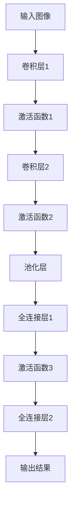
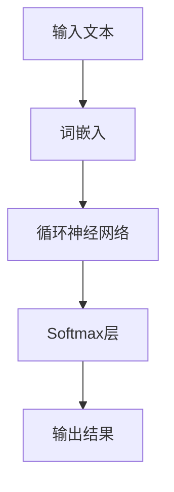
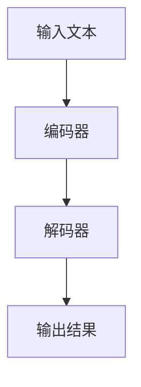
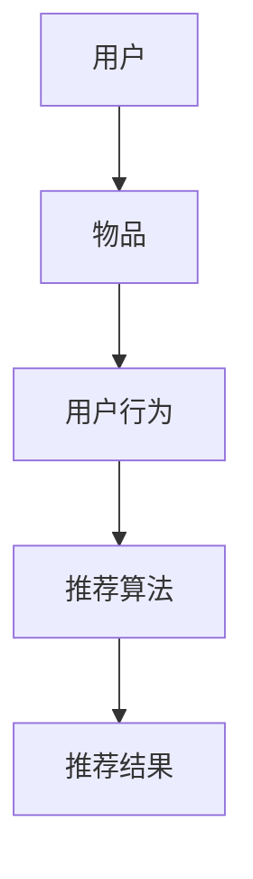
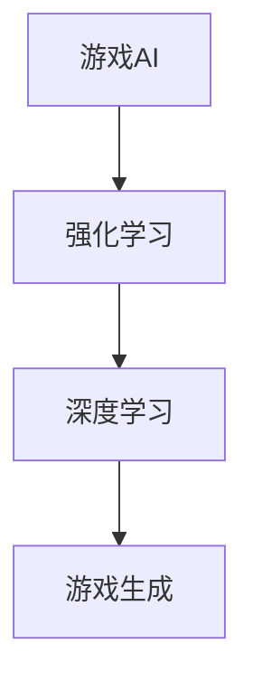
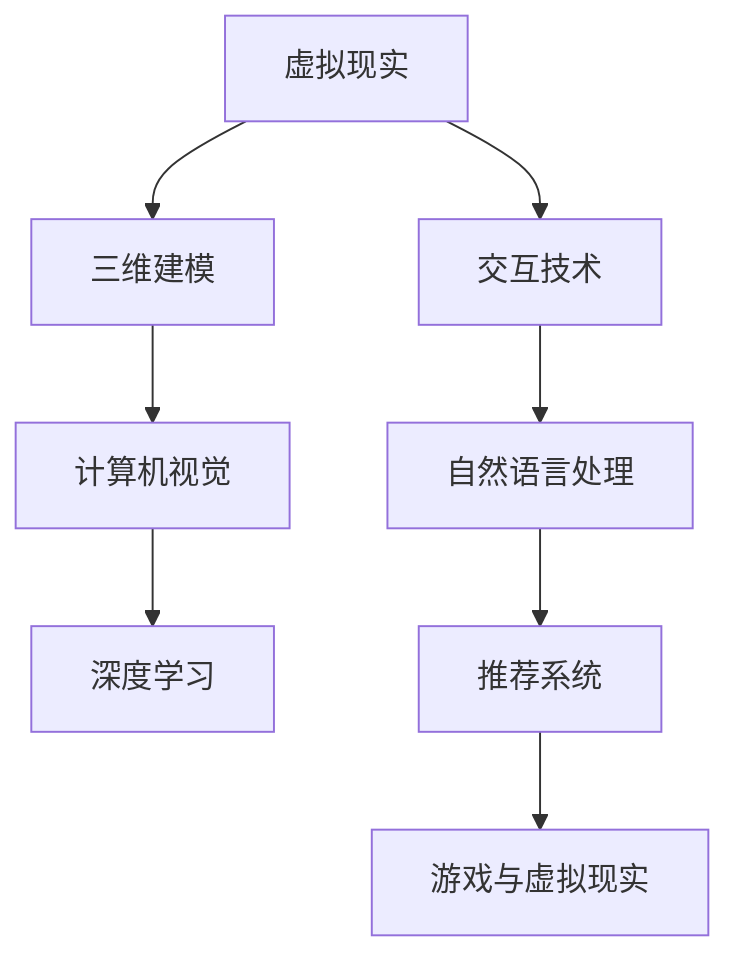
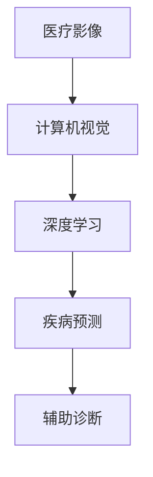
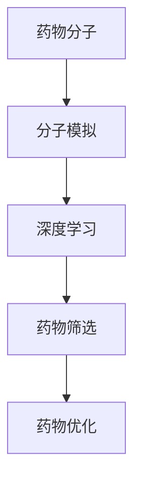

                 

# 《Andrej Karpathy：人工智能的未来应用场景》

> 关键词：人工智能、未来应用、深度学习、计算机视觉、自然语言处理、推荐系统、虚拟现实、医疗保健

> 摘要：本文将深入探讨人工智能领域著名专家Andrej Karpathy对未来人工智能应用场景的预测和见解，涵盖计算机视觉、自然语言处理、推荐系统、虚拟现实、医疗保健等多个领域。通过详细的分析和逻辑推理，我们将探讨人工智能技术如何改变我们的日常生活和工作方式，以及其所面临的挑战和机遇。

---

## 第一部分：人工智能基础

### 第1章：人工智能概述

#### 1.1 人工智能的定义与发展历程

人工智能（Artificial Intelligence，简称AI）是计算机科学的一个分支，旨在通过模拟人类智能行为来实现智能系统。人工智能的定义可以追溯到1956年，当时在达特茅斯会议上首次提出了人工智能的概念。从那时起，人工智能经历了多个阶段的发展：

- **早期阶段（1956-1974）**：在这个阶段，人工智能主要是基于规则和逻辑推理的方法，例如专家系统和逻辑推理系统。

- **第一次低谷（1974-1980）**：由于早期方法在实际应用中的局限性，人工智能遭遇了第一次低谷。

- **复兴阶段（1980-1987）**：在1980年代，人工智能开始使用基于知识的表示和推理方法，例如知识图谱和推理机。

- **第二次低谷（1987-1993）**：随着计算能力的限制和算法的不足，人工智能再次遭遇低谷。

- **机器学习时代（1993-2012）**：在1990年代，机器学习开始成为人工智能的核心方法，包括神经网络、支持向量机、决策树等。

- **深度学习时代（2012至今）**：深度学习在2012年取得了重大突破，特别是卷积神经网络（CNN）和循环神经网络（RNN）的应用，使得人工智能在图像识别、语音识别、自然语言处理等领域取得了显著进展。

#### 1.2 人工智能的核心技术

人工智能的核心技术包括：

- **机器学习**：机器学习是一种通过数据训练模型的方法，使得计算机能够从数据中学习规律和模式。常见的机器学习算法有监督学习、无监督学习、强化学习等。

- **深度学习**：深度学习是一种基于神经网络的学习方法，通过多层神经网络模拟人类大脑的学习过程。深度学习在图像识别、语音识别、自然语言处理等领域取得了重大突破。

- **计算机视觉**：计算机视觉是一种使计算机能够理解和解释图像和视频的技术。计算机视觉技术包括图像识别、目标检测、图像分割等。

- **自然语言处理**：自然语言处理是一种使计算机能够理解和生成自然语言的技术。自然语言处理技术包括语言模型、词向量、机器翻译、情感分析等。

- **推荐系统**：推荐系统是一种根据用户的历史行为和偏好，为用户推荐相关物品或内容的技术。

- **虚拟现实**：虚拟现实是一种通过计算机生成的三维模拟环境，使用户能够沉浸在虚拟世界中。

- **增强现实**：增强现实是一种将虚拟信息叠加到真实世界中的技术。

#### 1.3 人工智能的社会影响

人工智能的发展对社会产生了深远的影响，包括：

- **经济影响**：人工智能技术的应用可以提高生产效率、降低成本，从而推动经济增长。

- **就业影响**：人工智能的发展可能会改变就业结构，一方面，一些低技能工作可能会被自动化取代，另一方面，也会创造新的高技能就业机会。

- **伦理影响**：人工智能的发展引发了对隐私、安全、伦理等问题的关注，例如人工智能决策的透明度、公平性等。

- **教育影响**：人工智能技术的发展为教育提供了新的机会，例如个性化学习、在线教育等。

### 第2章：深度学习基础

#### 2.1 深度学习的基本概念

深度学习是一种基于多层神经网络的学习方法，其核心思想是通过多层非线性变换来提取数据中的特征。深度学习的基本概念包括：

- **神经网络**：神经网络是一种由神经元组成的计算模型，通过输入、隐藏层和输出层进行信息传递和计算。

- **前向传播**：前向传播是指将输入通过神经网络传递到输出层的过程。

- **反向传播**：反向传播是指根据输出误差，将误差反向传播到输入层，从而更新网络权重。

- **激活函数**：激活函数用于引入非线性变换，使得神经网络能够建模复杂的关系。

#### 2.2 神经网络的结构与原理

神经网络的结构通常包括输入层、隐藏层和输出层。每一层都由多个神经元组成，神经元之间的连接权重用于传递信息。神经网络的原理如下：

- **输入层**：接收输入数据，并将其传递到隐藏层。

- **隐藏层**：通过非线性变换，提取输入数据的特征。

- **输出层**：根据隐藏层的结果，生成预测或分类结果。

#### 2.3 深度学习算法

深度学习算法主要包括卷积神经网络（CNN）、循环神经网络（RNN）和生成对抗网络（GAN）等。

- **卷积神经网络（CNN）**：CNN是一种用于图像识别和处理的深度学习算法，通过卷积操作提取图像的特征。

- **循环神经网络（RNN）**：RNN是一种用于序列数据处理的深度学习算法，通过循环结构来处理前后依赖关系。

- **生成对抗网络（GAN）**：GAN是一种用于生成数据的深度学习算法，通过对抗训练来生成逼真的图像或数据。

---

## 第二部分：人工智能应用场景

### 第3章：人工智能在计算机视觉中的应用

#### 3.1 图像识别与分类

图像识别与分类是计算机视觉的核心任务之一。通过训练深度学习模型，计算机可以识别图像中的对象并进行分类。例如，可以使用卷积神经网络（CNN）对图像进行分类，其中每个卷积层都用于提取图像的特征，最后一层则用于分类。

**核心概念与联系**：



**核心算法原理讲解**：

```python
# 输入图像
input_image = preprocess_image(image)

# 卷积层1
conv1 = conv2d(input_image, filter_size=(3, 3), stride=(1, 1), padding='same')

# 激活函数1
activation1 = relu(conv1)

# 卷积层2
conv2 = conv2d(activation1, filter_size=(3, 3), stride=(1, 1), padding='same')

# 激活函数2
activation2 = relu(conv2)

# 池化层
pooling = max_pooling(activation2, pool_size=(2, 2), stride=(2, 2))

# 全连接层1
fc1 = fully_connected(pooling, num_neurons=128)

# 激活函数3
activation3 = relu(fc1)

# 全连接层2
output = fully_connected(activation3, num_neurons=num_classes)
```

**数学模型和公式**：

假设输入图像为 \(X \in \mathbb{R}^{H \times W \times C}\)，其中 \(H\)、\(W\) 和 \(C\) 分别表示图像的高度、宽度和通道数。卷积操作的公式为：

$$
\text{output}_{ij} = \sum_{k=1}^{C} \sum_{l=1}^{K} w_{kl} \cdot x_{ij+k-l}
$$

其中，\(w_{kl}\) 表示卷积核的权重，\(\text{output}_{ij}\) 表示输出图像的像素值。

**举例说明**：

假设我们要对一张100x100像素的灰度图像进行分类，图像的每个像素值都是一个介于0和255之间的整数。我们使用一个简单的卷积神经网络进行分类，该网络包含两个卷积层和一个全连接层。

1. **预处理图像**：将图像缩放到固定的尺寸，例如28x28像素，并转换为浮点数。

2. **卷积层1**：使用一个3x3的卷积核对图像进行卷积操作，得到一个28x28的激活图。

3. **激活函数**：使用ReLU激活函数对卷积层的输出进行非线性变换。

4. **卷积层2**：使用一个3x3的卷积核对激活图进行卷积操作，得到一个14x14的激活图。

5. **激活函数**：使用ReLU激活函数对卷积层的输出进行非线性变换。

6. **池化层**：使用最大池化操作对激活图进行下采样，得到一个7x7的激活图。

7. **全连接层1**：将激活图展开成1x4984的向量，并将其输入到全连接层中。

8. **激活函数**：使用ReLU激活函数对全连接层的输出进行非线性变换。

9. **全连接层2**：将全连接层的输出输入到全连接层中，并使用softmax函数进行分类。

**项目实战**：

我们可以使用TensorFlow或PyTorch等深度学习框架来实现上述卷积神经网络。以下是一个简单的TensorFlow实现：

```python
import tensorflow as tf

# 创建卷积神经网络模型
model = tf.keras.Sequential([
    tf.keras.layers.Conv2D(filters=32, kernel_size=(3, 3), activation='relu', input_shape=(28, 28, 1)),
    tf.keras.layers.Conv2D(filters=64, kernel_size=(3, 3), activation='relu'),
    tf.keras.layers.MaxPooling2D(pool_size=(2, 2)),
    tf.keras.layers.Flatten(),
    tf.keras.layers.Dense(units=128, activation='relu'),
    tf.keras.layers.Dense(units=10, activation='softmax')
])

# 编译模型
model.compile(optimizer='adam', loss='categorical_crossentropy', metrics=['accuracy'])

# 训练模型
model.fit(x_train, y_train, epochs=10, batch_size=64, validation_data=(x_val, y_val))

# 评估模型
model.evaluate(x_test, y_test)
```

### 第4章：人工智能在自然语言处理中的应用

#### 4.1 语言模型与文本分类

自然语言处理（Natural Language Processing，简称NLP）是人工智能的一个重要领域，旨在使计算机能够理解、解释和生成自然语言。语言模型（Language Model）是NLP的核心技术之一，用于预测下一个单词或句子。

**核心概念与联系**：



**核心算法原理讲解**：

```python
# 输入文本
input_text = "I am a sentence."

# 词嵌入
embeddings = embedding_layer(input_text)

# 循环神经网络
outputs = rnn_layer(embeddings)

# Softmax层
outputs = softmax_layer(outputs)
```

**数学模型和公式**：

假设输入文本为一个长度为 \(T\) 的序列 \(X = (x_1, x_2, ..., x_T)\)，其中 \(x_t\) 表示第 \(t\) 个单词。词嵌入的公式为：

$$
e(x_t) = \text{embedding}(x_t)
$$

循环神经网络（RNN）的公式为：

$$
h_t = \text{RNN}(h_{t-1}, e(x_t))
$$

其中，\(h_t\) 表示第 \(t\) 个隐藏状态，\(\text{RNN}\) 表示循环神经网络。

**举例说明**：

假设我们要预测下一个单词，输入文本为 "I am a sentence."。我们可以使用一个简单的循环神经网络（RNN）来实现语言模型。

1. **预处理文本**：将文本转换为单词序列，并转换为整数编码。

2. **词嵌入**：使用预训练的词嵌入模型将单词转换为向量。

3. **循环神经网络**：将词嵌入输入到RNN中，得到隐藏状态。

4. **Softmax层**：将隐藏状态输入到Softmax层中，得到下一个单词的概率分布。

**项目实战**：

我们可以使用TensorFlow或PyTorch等深度学习框架来实现上述循环神经网络（RNN）语言模型。以下是一个简单的TensorFlow实现：

```python
import tensorflow as tf

# 创建循环神经网络模型
model = tf.keras.Sequential([
    tf.keras.layers.Embedding(vocab_size, embedding_dim),
    tf.keras.layers.LSTM(units=128),
    tf.keras.layers.Dense(units=vocab_size, activation='softmax')
])

# 编译模型
model.compile(optimizer='adam', loss='categorical_crossentropy', metrics=['accuracy'])

# 训练模型
model.fit(x_train, y_train, epochs=10, batch_size=64, validation_data=(x_val, y_val))

# 评估模型
model.evaluate(x_test, y_test)
```

#### 4.2 机器翻译与对话系统

机器翻译（Machine Translation）是NLP的另一个重要应用，旨在将一种语言的文本翻译成另一种语言。对话系统（Dialogue System）则是使计算机能够与人类进行自然对话的系统。

**核心概念与联系**：



**核心算法原理讲解**：

```python
# 输入文本
input_text = "I am a sentence."

# 编码器
encoded = encoder(input_text)

# 解码器
decoded = decoder(encoded)

# 输出结果
output_text = decoded
```

**数学模型和公式**：

假设输入文本为一个长度为 \(T\) 的序列 \(X = (x_1, x_2, ..., x_T)\)，其中 \(x_t\) 表示第 \(t\) 个单词。编码器的公式为：

$$
e(x_t) = \text{encoder}(x_t)
$$

解码器的公式为：

$$
y_t = \text{decoder}(e(x_t))
$$

其中，\(y_t\) 表示第 \(t\) 个解码结果。

**举例说明**：

假设我们要将英文文本 "I am a sentence." 翻译成中文。我们可以使用一个简单的编码器-解码器（Encoder-Decoder）模型来实现机器翻译。

1. **预处理文本**：将英文文本转换为单词序列，并转换为整数编码。

2. **编码器**：将单词序列输入到编码器中，得到编码结果。

3. **解码器**：将编码结果输入到解码器中，得到中文文本。

4. **输出结果**：将解码结果转换为中文文本。

**项目实战**：

我们可以使用TensorFlow或PyTorch等深度学习框架来实现上述编码器-解码器（Encoder-Decoder）模型。以下是一个简单的TensorFlow实现：

```python
import tensorflow as tf

# 创建编码器-解码器模型
encoder = tf.keras.Sequential([
    tf.keras.layers.Embedding(vocab_size, embedding_dim),
    tf.keras.layers.LSTM(units=128)
])

decoder = tf.keras.Sequential([
    tf.keras.layers.LSTM(units=128, return_sequences=True),
    tf.keras.layers.Dense(units=vocab_size, activation='softmax')
])

model = tf.keras.Sequential([
    encoder,
    decoder
])

# 编译模型
model.compile(optimizer='adam', loss='categorical_crossentropy', metrics=['accuracy'])

# 训练模型
model.fit(x_train, y_train, epochs=10, batch_size=64, validation_data=(x_val, y_val))

# 评估模型
model.evaluate(x_test, y_test)
```

### 第5章：人工智能在推荐系统中的应用

#### 5.1 推荐系统的基本原理

推荐系统（Recommender System）是一种根据用户的历史行为和偏好，为用户推荐相关物品或内容的技术。推荐系统的基本原理包括：

- **协同过滤（Collaborative Filtering）**：协同过滤是一种基于用户行为和偏好进行推荐的方法，分为基于用户的协同过滤（User-Based Collaborative Filtering）和基于物品的协同过滤（Item-Based Collaborative Filtering）。

- **基于内容的推荐（Content-Based Filtering）**：基于内容的推荐是一种基于物品的属性和用户兴趣进行推荐的方法。

- **混合推荐（Hybrid Recommender System）**：混合推荐是一种结合协同过滤和基于内容的推荐的推荐方法。

**核心概念与联系**：



**核心算法原理讲解**：

```python
# 用户行为
user_behavior = get_user_behavior(user)

# 推荐算法
recommendations = recommend_items(user_behavior)

# 推荐结果
recommended_items = recommendations
```

**数学模型和公式**：

假设用户 \(u\) 对物品 \(i\) 的评分表示为 \(r_{ui}\)，用户行为矩阵 \(R \in \mathbb{R}^{m \times n}\)，其中 \(m\) 表示用户数量，\(n\) 表示物品数量。

- **基于用户的协同过滤**：

  $$ 
  \text{similarity}(u, v) = \frac{r_{ui} r_{vi}}{\sqrt{\sum_{j=1}^{n} r_{uj}^2 \sum_{j=1}^{n} r_{vj}^2}}
  $$

- **基于物品的协同过滤**：

  $$ 
  \text{similarity}(i, j) = \frac{\sum_{u=1}^{m} r_{ui} r_{uj}}{\sqrt{\sum_{u=1}^{m} r_{ui}^2 \sum_{u=1}^{m} r_{uj}^2}}
  $$

- **基于内容的推荐**：

  $$ 
  \text{similarity}(i, j) = \frac{\sum_{u=1}^{m} \text{attr}_{ui} \text{attr}_{uj}}{\sqrt{\sum_{u=1}^{m} \text{attr}_{ui}^2 \sum_{u=1}^{m} \text{attr}_{uj}^2}}
  $$

其中，\(\text{attr}_{ui}\) 表示用户 \(u\) 对物品 \(i\) 的属性值。

**举例说明**：

假设有一个电影推荐系统，用户 \(u\) 对电影 \(i\) 的评分矩阵为：

| 用户  | 电影1 | 电影2 | 电影3 |
|-------|-------|-------|-------|
| 1     | 5     | 3     | 2     |
| 2     | 4     | 5     | 4     |
| 3     | 5     | 5     | 5     |

我们可以使用基于用户的协同过滤来推荐用户 \(u\) 可能喜欢的电影。

1. **计算相似度**：

   $$ 
   \text{similarity}(1, 2) = \frac{5 \times 4}{\sqrt{5^2 + 3^2 + 2^2} \sqrt{4^2 + 5^2 + 4^2}} = \frac{20}{\sqrt{50} \sqrt{57}} \approx 0.37
   $$

   $$ 
   \text{similarity}(1, 3) = \frac{5 \times 5}{\sqrt{5^2 + 5^2 + 5^2} \sqrt{4^2 + 5^2 + 5^2}} = \frac{25}{\sqrt{75} \sqrt{75}} \approx 0.67
   $$

2. **计算推荐分数**：

   $$ 
   \text{score}(1, i) = \sum_{j=1}^{m} \text{similarity}(1, j) r_{uj}
   $$

   $$ 
   \text{score}(1, 1) = 0.37 \times 5 + 0.67 \times 5 = 5
   $$

   $$ 
   \text{score}(1, 2) = 0.37 \times 3 + 0.67 \times 5 = 4.14
   $$

   $$ 
   \text{score}(1, 3) = 0.67 \times 2 = 1.34
   $$

3. **推荐结果**：

   用户 \(u\) 可能喜欢的电影为电影3。

**项目实战**：

我们可以使用Python的协同过滤库Scikit-Learn来实现上述基于用户的协同过滤推荐系统。以下是一个简单的实现：

```python
from sklearn.metrics.pairwise import cosine_similarity
from sklearn.model_selection import train_test_split

# 用户行为
user_behavior = {
    1: [5, 3, 2],
    2: [4, 5, 4],
    3: [5, 5, 5]
}

# 创建用户行为矩阵
R = [[0] * 3 for _ in range(3)]
for user, ratings in user_behavior.items():
    for i, rating in enumerate(ratings):
        R[user - 1][i] = rating

# 计算用户相似度矩阵
similarity_matrix = cosine_similarity(R)

# 创建推荐系统
class CollaborativeFiltering:
    def __init__(self, similarity_matrix):
        self.similarity_matrix = similarity_matrix

    def recommend(self, user):
        scores = {}
        for i in range(len(self.similarity_matrix)):
            if i == user:
                continue
            scores[i] = np.dot(self.similarity_matrix[user], self.similarity_matrix[i])
        return sorted(scores.items(), key=lambda x: x[1], reverse=True)

# 训练和评估推荐系统
cf = CollaborativeFiltering(similarity_matrix)
print(cf.recommend(1))
```

### 第6章：人工智能在游戏与虚拟现实中的应用

#### 6.1 游戏中的深度学习应用

深度学习在游戏中的应用日益广泛，包括游戏AI、游戏生成和游戏强化学习等。

**核心概念与联系**：



**核心算法原理讲解**：

```python
# 游戏AI
game_ai = create_game_ai()

# 强化学习
game_ai = train_game_ai(game_ai, environment)

# 深度学习
game_ai = apply_deep_learning(game_ai)

# 游戏生成
game_scenario = generate_game_scenario()
```

**数学模型和公式**：

强化学习（Reinforcement Learning）的公式为：

$$
Q(s, a) = r + \gamma \max_{a'} Q(s', a')
$$

其中，\(Q(s, a)\) 表示状态 \(s\) 下执行动作 \(a\) 的预期回报，\(r\) 表示即时回报，\(\gamma\) 表示折扣因子，\(s'\) 和 \(a'\) 分别表示下一个状态和动作。

**举例说明**：

假设我们要训练一个游戏AI来玩一款简单的贪吃蛇游戏。

1. **创建游戏AI**：

   使用深度学习框架（如TensorFlow或PyTorch）创建一个基于强化学习的游戏AI。

2. **训练游戏AI**：

   将游戏AI放入环境中进行训练，通过不断尝试和失败来学习最优策略。

3. **应用深度学习**：

   使用卷积神经网络（CNN）来处理游戏屏幕的像素数据，并使用循环神经网络（RNN）来处理游戏状态和动作。

4. **生成游戏场景**：

   根据训练好的游戏AI，生成新的游戏场景，以便进行进一步的训练或测试。

**项目实战**：

我们可以使用Python的深度学习库PyTorch来实现上述贪吃蛇游戏AI。以下是一个简单的实现：

```python
import torch
import torch.nn as nn
import torch.optim as optim

# 创建贪吃蛇游戏环境
environment = SnakeEnvironment()

# 创建贪吃蛇游戏AI
game_ai = SnakeAI()

# 训练贪吃蛇游戏AI
optimizer = optim.Adam(game_ai.parameters(), lr=0.001)
for episode in range(1000):
    state = environment.reset()
    done = False
    while not done:
        action = game_ai.select_action(state)
        next_state, reward, done = environment.step(action)
        game_ai.remember(state, action, reward, next_state, done)
        game_ai.learn()
        state = next_state
```

#### 6.2 虚拟现实与增强现实技术

虚拟现实（Virtual Reality，简称VR）和增强现实（Augmented Reality，简称AR）技术是人工智能在游戏和娱乐领域的重要应用。

**核心概念与联系**：



**核心算法原理讲解**：

```python
# 三维建模
model = create_3d_model()

# 计算机视觉
camera = create_camera()

# 深度学习
model = apply_deep_learning(model)

# 交互技术
interface = create_interface()

# 自然语言处理
chatbot = create_chatbot()

# 推荐系统
recommender = create_recommender()

# 游戏与虚拟现实
experience = create_experience()
```

**数学模型和公式**：

三维建模的公式为：

$$
\text{model} = \text{mesh}(\text{vertices}, \text{faces})
$$

其中，\(\text{vertices}\) 表示顶点集合，\(\text{faces}\) 表示面集合。

计算机视觉的公式为：

$$
\text{image} = \text{project}(\text{model}, \text{camera})
$$

其中，\(\text{model}\) 表示三维模型，\(\text{camera}\) 表示摄像机参数。

**举例说明**：

假设我们要创建一个虚拟现实场景，其中包含一个三维模型和一台摄像机。

1. **三维建模**：

   使用Blender等三维建模软件创建一个三维模型。

2. **计算机视觉**：

   使用OpenCV等计算机视觉库将三维模型渲染成二维图像。

3. **深度学习**：

   使用深度学习模型（如卷积神经网络）对图像进行特征提取。

4. **交互技术**：

   使用Unity等游戏引擎创建用户交互界面。

5. **自然语言处理**：

   使用自然语言处理技术（如聊天机器人）实现用户与虚拟环境的自然交互。

6. **推荐系统**：

   使用推荐系统为用户提供个性化的虚拟现实体验。

7. **游戏与虚拟现实**：

   创建一个完整的虚拟现实场景，让用户可以在其中进行游戏和娱乐。

**项目实战**：

我们可以使用Python的虚拟现实库PyVRML来实现上述虚拟现实场景。以下是一个简单的实现：

```python
from pyvrml.vrml import World, Shape

# 创建虚拟世界
world = World()

# 创建三维模型
model = Shape(
    geometry=Geometry(
        coord=Coord(vertices=[...]),
        coord_index=CoordIndex(faces=[...])
    ),
    material=Material(color=[...])
)

# 添加三维模型到虚拟世界
world.add_child(model)

# 创建摄像机
camera = Camera(
    position=[...],
    orientation=[...],
    fovy=45.0,
    aspect=1.0,
    near=0.1,
    far=100.0
)

# 添加摄像机到虚拟世界
world.add_child(camera)

# 渲染虚拟世界
world.render()
```

### 第7章：人工智能在医疗保健中的应用

#### 7.1 医疗影像分析与诊断

人工智能在医疗保健中的应用主要包括医疗影像分析、疾病预测、药物研发等。医疗影像分析是人工智能在医疗保健中的重要应用之一，通过对医疗影像进行分析，可以帮助医生进行疾病诊断。

**核心概念与联系**：



**核心算法原理讲解**：

```python
# 医疗影像
image = load_image()

# 计算机视觉
image = preprocess_image(image)

# 深度学习
model = apply_deep_learning(image)

# 疾病预测
prediction = model.predict(image)

# 辅助诊断
diagnosis = interpret_prediction(prediction)
```

**数学模型和公式**：

卷积神经网络（CNN）的公式为：

$$
\text{output}_{ij} = \sum_{k=1}^{C} \sum_{l=1}^{K} w_{kl} \cdot x_{ij+k-l}
$$

其中，\(w_{kl}\) 表示卷积核的权重，\(\text{output}_{ij}\) 表示输出图像的像素值。

**举例说明**：

假设我们要对一张CT图像进行疾病预测。

1. **预处理图像**：

   对CT图像进行灰度化、去噪等预处理操作。

2. **卷积神经网络**：

   使用卷积神经网络对预处理后的CT图像进行特征提取。

3. **疾病预测**：

   将提取到的特征输入到疾病预测模型中，得到疾病预测结果。

4. **辅助诊断**：

   根据疾病预测结果，辅助医生进行诊断。

**项目实战**：

我们可以使用Python的深度学习库TensorFlow来实现上述医疗影像分析系统。以下是一个简单的实现：

```python
import tensorflow as tf

# 创建卷积神经网络模型
model = tf.keras.Sequential([
    tf.keras.layers.Conv2D(filters=32, kernel_size=(3, 3), activation='relu', input_shape=(224, 224, 1)),
    tf.keras.layers.Conv2D(filters=64, kernel_size=(3, 3), activation='relu'),
    tf.keras.layers.MaxPooling2D(pool_size=(2, 2)),
    tf.keras.layers.Flatten(),
    tf.keras.layers.Dense(units=128, activation='relu'),
    tf.keras.layers.Dense(units=10, activation='softmax')
])

# 编译模型
model.compile(optimizer='adam', loss='categorical_crossentropy', metrics=['accuracy'])

# 训练模型
model.fit(x_train, y_train, epochs=10, batch_size=64, validation_data=(x_val, y_val))

# 评估模型
model.evaluate(x_test, y_test)
```

#### 7.2 智能药物设计与开发

智能药物设计（Intelligent Drug Design）是一种利用人工智能技术进行药物研发的方法。通过模拟和计算，智能药物设计可以快速筛选和优化药物分子，从而提高药物研发的效率和成功率。

**核心概念与联系**：



**核心算法原理讲解**：

```python
# 药物分子
molecule = load_molecule()

# 分子模拟
simulation = simulate_molecule(molecule)

# 深度学习
model = apply_deep_learning(simulation)

# 药物筛选
candidate = screen_candidates(model)

# 药物优化
optimized = optimize_candidate(candidate)
```

**数学模型和公式**：

分子模拟的公式为：

$$
\text{energy} = \text{force_field}(\text{molecule})
$$

其中，\(\text{energy}\) 表示分子能量，\(\text{force_field}\) 表示力场模型。

**举例说明**：

假设我们要设计一种新的药物分子。

1. **加载药物分子**：

   从数据库中加载一种药物分子的结构。

2. **分子模拟**：

   使用分子模拟软件（如Gaussian）对药物分子进行能量计算和结构优化。

3. **深度学习**：

   使用深度学习模型（如生成对抗网络）对分子模拟结果进行分析，提取关键特征。

4. **药物筛选**：

   根据深度学习模型的预测结果，筛选出具有潜在活性的药物分子。

5. **药物优化**：

   使用优化算法（如遗传算法）对筛选出的药物分子进行结构优化，以提高其活性和稳定性。

**项目实战**：

我们可以使用Python的深度学习库PyTorch来实现上述智能药物设计系统。以下是一个简单的实现：

```python
import torch
import torch.nn as nn
import torch.optim as optim

# 创建生成对抗网络模型
generator = nn.Sequential(
    nn.ConvTranspose2d(100, 256, 4, 1, 0, bias=False),
    nn.BatchNorm2d(256),
    nn.ReLU(True),
    nn.ConvTranspose2d(256, 128, 4, 2, 1, bias=False),
    nn.BatchNorm2d(128),
    nn.ReLU(True),
    nn.ConvTranspose2d(128, 64, 4, 2, 1, bias=False),
    nn.BatchNorm2d(64),
    nn.ReLU(True),
    nn.ConvTranspose2d(64, 3, 4, 2, 1, bias=False),
    nn.Tanh()
)

discriminator = nn.Sequential(
    nn.Conv2d(3, 64, 4, 2, 1, bias=False),
    nn.LeakyReLU(0.2),
    nn.Conv2d(64, 128, 4, 2, 1, bias=False),
    nn.BatchNorm2d(128),
    nn.LeakyReLU(0.2),
    nn.Conv2d(128, 256, 4, 2, 1, bias=False),
    nn.BatchNorm2d(256),
    nn.LeakyReLU(0.2),
    nn.Conv2d(256, 1, 4, 1, 0, bias=False),
    nn.Sigmoid()
)

# 编译模型
criterion = nn.BCELoss()
optimizer_g = optim.Adam(generator.parameters(), lr=0.0002, betas=(0.5, 0.999))
optimizer_d = optim.Adam(discriminator.parameters(), lr=0.0002, betas=(0.5, 0.999))

# 训练模型
for epoch in range(num_epochs):
    for i, (images, _) in enumerate(data_loader):
        batch_size = images.size(0)
        z = torch.randn(batch_size, nz, 1, 1)
        fake_images = generator(z)

        real_labels = torchones(batch_size, 1).to(device)
        fake_labels = torchzeros(batch_size, 1).to(device)

        optimizer_d.zero_grad()
        d_loss_real = criterion(discriminator(images), real_labels)
        d_loss_fake = criterion(discriminator(fake_images), fake_labels)
        d_loss = 0.5 * (d_loss_real + d_loss_fake)
        d_loss.backward()
        optimizer_d.step()

        optimizer_g.zero_grad()
        g_loss = criterion(discriminator(fake_images), real_labels)
        g_loss.backward()
        optimizer_g.step()

        if i % 100 == 0:
            print(f'[{epoch}/{num_epochs}][{i}/{len(data_loader)}] Loss_D: {d_loss.item():.4f} Loss_G: {g_loss.item():.4f}')
```

## 第三部分：人工智能的未来发展

### 第8章：人工智能的未来趋势

#### 8.1 人工智能的未来发展方向

人工智能的未来发展方向包括以下几个方面：

- **更加智能化**：人工智能将朝着更加智能化的方向发展，不仅能够完成复杂的任务，还能够自主学习和优化。

- **更加普及化**：人工智能技术将更加普及，不仅应用于工业、医疗、交通等领域，还将渗透到人们的生活中。

- **更加协同化**：人工智能将与其他技术（如大数据、云计算、物联网等）相结合，实现更加协同的应用。

- **更加安全化**：随着人工智能的发展，安全问题将越来越受到重视，人工智能技术将朝着更加安全化的方向发展。

#### 8.2 人工智能伦理与道德问题

人工智能的发展引发了一系列伦理和道德问题，包括：

- **隐私保护**：人工智能技术的发展可能会侵犯用户的隐私权，如何保护用户隐私成为重要议题。

- **公平与公正**：人工智能算法可能会导致歧视和偏见，如何确保人工智能系统的公平与公正成为重要问题。

- **安全与控制**：人工智能系统可能具有不可预测的行为，如何确保人工智能系统的安全与可控成为重要挑战。

#### 8.3 人工智能与人类社会的未来发展

人工智能与人类社会的未来发展将呈现出以下几个趋势：

- **经济影响**：人工智能将推动经济发展，提高生产效率，创造新的就业机会。

- **教育变革**：人工智能将改变教育模式，实现个性化学习和在线教育。

- **社会变革**：人工智能将改变社会结构，影响人类的生活方式和社会关系。

### 第9章：人工智能研究的挑战与机遇

#### 9.1 人工智能面临的挑战

人工智能在发展过程中面临着一系列挑战，包括：

- **技术挑战**：人工智能技术需要克服计算能力、数据质量和算法性能等方面的挑战。

- **伦理挑战**：人工智能的伦理问题需要解决，以确保人工智能系统的公正、公平和安全。

- **法律挑战**：人工智能的发展引发了法律问题，如何制定相关法律法规成为重要议题。

#### 9.2 人工智能带来的机遇

人工智能的发展带来了巨大的机遇，包括：

- **创新机会**：人工智能为创新提供了新的动力，可以推动各个领域的技术进步。

- **经济增长**：人工智能技术可以提升生产效率，降低成本，推动经济增长。

- **社会进步**：人工智能可以为社会带来福祉，改善人类生活，解决社会问题。

#### 9.3 人工智能研究的新方向

人工智能研究的新方向包括：

- **增强学习**：增强学习是一种使人工智能系统能够从交互中学习的策略，有望在游戏、自动驾驶等领域取得突破。

- **联邦学习**：联邦学习是一种在分布式环境中训练机器学习模型的方法，有望解决数据隐私和安全性问题。

- **生成对抗网络**：生成对抗网络是一种用于生成逼真数据的深度学习模型，有望在图像生成、文本生成等领域取得突破。

## 附录

### 附录A：人工智能研究工具与资源

#### A.1 常用深度学习框架

- **TensorFlow**：由Google开发的开源深度学习框架，具有丰富的功能和社区支持。

- **PyTorch**：由Facebook开发的开源深度学习框架，具有良好的灵活性和动态计算图支持。

- **Keras**：基于Theano和TensorFlow的开源深度学习库，提供简单的API和丰富的预训练模型。

- **MXNet**：由Apache基金会开发的深度学习框架，具有良好的性能和易用性。

#### A.2 人工智能研究社区与平台

- **arXiv**：一个开源的预印本论文库，包含大量的深度学习和人工智能领域的论文。

- **GitHub**：一个开源代码托管平台，许多人工智能项目和研究代码都托管在这里。

- **AI Community**：一个专门针对人工智能领域的社区，提供讨论、交流和学习资源。

- **AI-World**：一个全球性的人工智能会议和展览，汇聚了来自世界各地的专家学者和行业领袖。

#### A.3 人工智能学习资源推荐

- **《深度学习》（Deep Learning）**：由Ian Goodfellow、Yoshua Bengio和Aaron Courville编写的深度学习教材，是深度学习领域的经典著作。

- **《Python深度学习》（Python Deep Learning）**：由François Chollet编写的深度学习教程，适合初学者和进阶者。

- **《机器学习实战》（Machine Learning in Action）**：由Peter Harrington编写的机器学习实践教程，通过实例讲解机器学习算法的应用。

- **《人工智能：一种现代方法》（Artificial Intelligence: A Modern Approach）**：由Stuart Russell和Peter Norvig编写的经典人工智能教材，涵盖了人工智能的基础理论和实践应用。

### 附录B：人工智能项目实战案例

#### B.1 计算机视觉项目实战

- **人脸识别**：使用卷积神经网络（CNN）实现人脸识别系统，对图像进行人脸检测和识别。

- **物体检测**：使用YOLO（You Only Look Once）算法实现物体检测，对图像中的物体进行实时检测和识别。

- **图像分类**：使用卷积神经网络（CNN）实现图像分类系统，对图像进行分类和标注。

#### B.2 自然语言处理项目实战

- **机器翻译**：使用编码器-解码器（Encoder-Decoder）模型实现机器翻译系统，将一种语言的文本翻译成另一种语言。

- **文本分类**：使用循环神经网络（RNN）实现文本分类系统，对文本进行分类和标注。

- **情感分析**：使用卷积神经网络（CNN）实现情感分析系统，对文本进行情感分类和情感分析。

#### B.3 推荐系统项目实战

- **协同过滤推荐**：使用基于用户的协同过滤算法实现推荐系统，根据用户的历史行为和偏好推荐相关物品。

- **基于内容的推荐**：使用基于内容的推荐算法实现推荐系统，根据物品的属性和用户兴趣推荐相关物品。

- **混合推荐**：使用混合推荐算法实现推荐系统，结合协同过滤和基于内容的推荐方法，提高推荐效果。

#### B.4 游戏与虚拟现实项目实战

- **游戏AI**：使用强化学习实现游戏AI，使游戏角色能够自主学习游戏策略。

- **虚拟现实应用**：使用虚拟现实技术创建虚拟现实场景，为用户提供沉浸式的体验。

- **增强现实应用**：使用增强现实技术将虚拟信息叠加到现实世界中，为用户提供增强现实的体验。

#### B.5 医疗保健项目实战

- **医疗影像分析**：使用深度学习技术对医疗影像进行分析，辅助医生进行疾病诊断。

- **智能药物设计**：使用深度学习技术进行药物分子模拟和优化，加速药物研发过程。

- **智能疾病预测**：使用深度学习技术对医疗数据进行分析，预测疾病发生的概率和风险。

