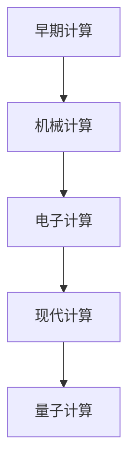
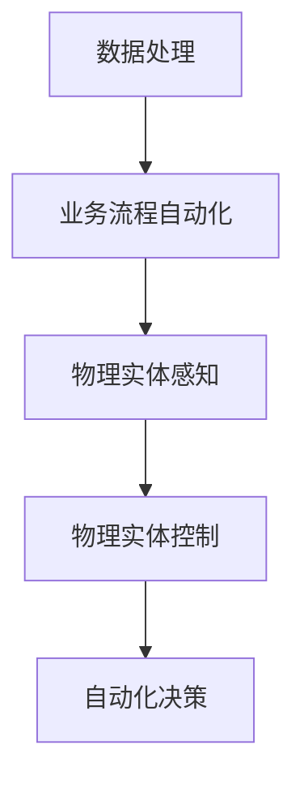
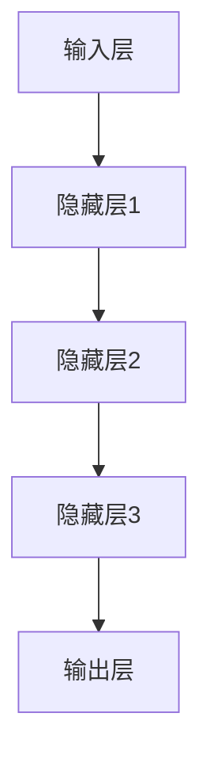
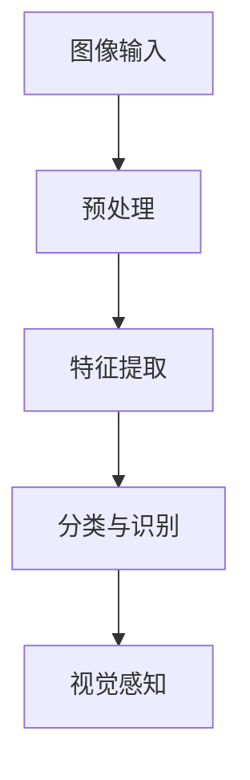
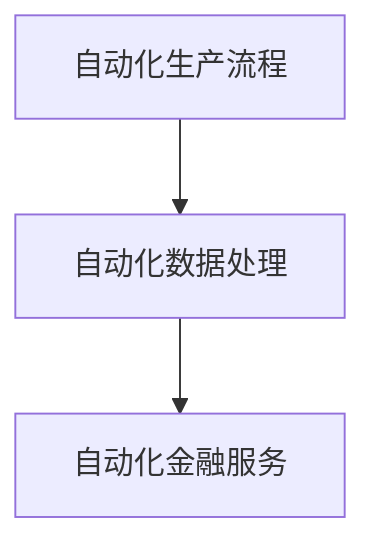
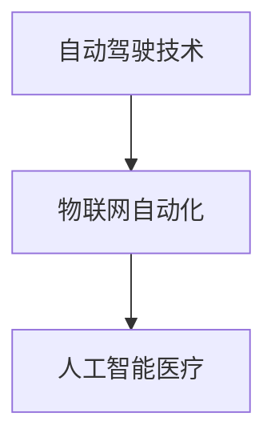

                 

### 《Andrej Karpathy：计算的本质正在变化，数字实体和物理实体自动化刚开始》

> 关键词：计算本质变化、数字实体、物理实体、自动化、深度学习、强化学习、计算机视觉、物联网、自动驾驶、人工智能医疗

> 摘要：本文深入探讨了计算本质的变化，分析了数字实体和物理实体自动化的现状与挑战，并详细介绍了计算技术的变革、自动化应用及其带来的挑战与未来展望。通过一系列的例子和实战，本文为读者提供了对人工智能技术的全面理解。

---

#### 第一部分：引言与背景

## 引言

### 1.1 计算的本质变化

#### 核心概念与联系

为了理解计算的本质变化，我们需要从人类计算的历史开始。人类计算经历了多个阶段，从早期的手动计算，到机械计算，再到电子计算，最终发展到现代计算，并开始迈向量子计算。

下面是一个简单的Mermaid流程图，展示了人类计算的历史演进：



### 1.1.1 人类计算的演进历史

早期计算主要依赖于人类的手工操作，例如使用算盘进行简单的数学计算。随着工业革命的到来，机械计算成为可能，例如使用滑轮和齿轮系统来简化复杂计算。

电子计算的出现标志着计算技术的重大变革。1940年代，第一台电子计算机ENIAC问世，极大地提高了计算速度和效率。电子计算的发展催生了现代计算，使得计算机能够处理更加复杂的问题，并在各个领域得到了广泛应用。

随着计算机硬件和软件技术的不断发展，现代计算正在经历深刻的变革。云计算、大数据、人工智能等技术的兴起，使得计算能力得到了前所未有的提升。量子计算作为下一代计算技术，其潜力更是令人瞩目。

### 1.1.2 计算机技术发展对人类社会的影响

计算机技术的发展对人类社会产生了深远的影响。首先，计算机技术改变了教育方式。在线教育平台和远程学习工具使得知识获取变得更加便捷和高效。

其次，计算机技术推动了经济发展。电子商务、金融科技、智能制造等新兴产业的兴起，使得经济增长速度加快，就业机会增多。

此外，计算机技术还极大地改善了人们的生活质量。智能家居、自动驾驶、智能医疗等技术的应用，使得生活变得更加舒适和便捷。

### 1.2 数字实体与物理实体自动化

#### 核心概念与联系

数字实体自动化和物理实体自动化是计算技术发展的必然趋势。数字实体自动化主要涉及数据处理、业务流程自动化等方面，而物理实体自动化则包括自动驾驶、物联网、智能制造等。

下面是一个简单的Mermaid流程图，展示了数字实体自动化和物理实体自动化的过程：



### 1.2.1 数字实体自动化的现状与挑战

数字实体自动化的现状主要体现在以下几个方面：

1. **自动化生产流程**：自动化生产线和工业机器人广泛应用于制造业，极大地提高了生产效率和质量。
2. **自动化数据处理**：大数据技术和人工智能算法使得数据处理变得更加高效和智能化。
3. **自动化金融服务**：量化交易、智能投顾等自动化金融服务正在改变金融行业的运作方式。

然而，数字实体自动化也面临一些挑战：

1. **数据安全**：随着自动化系统的广泛应用，数据泄露和隐私问题变得越来越突出。
2. **算法透明度**：许多自动化系统，尤其是人工智能系统，其决策过程不够透明，难以解释。
3. **就业影响**：自动化技术的发展可能导致某些行业的工作岗位减少，引发社会不稳定。

### 1.2.2 物理实体自动化的前景与机遇

物理实体自动化的前景非常广阔，主要体现在以下几个方面：

1. **自动驾驶技术**：自动驾驶汽车正在逐步走进我们的生活，有望大幅减少交通事故，提高交通效率。
2. **物联网自动化**：智能家居、智能城市等物联网应用正在普及，为人们的生活带来便利。
3. **人工智能医疗**：人工智能在医疗领域的应用，如疾病诊断、智能药物研发等，正逐渐改变医疗行业。

物理实体自动化带来的机遇包括：

1. **效率提升**：自动化技术可以大幅提高生产效率，降低成本。
2. **创新驱动**：自动化技术的发展将催生新的产业和商业模式。
3. **生活质量改善**：自动化技术的应用将使人们的生活更加便捷和舒适。

---

#### 第二部分：计算技术的变革

## 计算技术的变革

### 2.1 深度学习与人工智能

#### 核心概念与联系

深度学习作为人工智能的重要分支，近年来取得了显著的进展。深度学习的基本原理可以概括为多层神经网络，通过多层次的非线性变换，从原始数据中自动提取特征。

下面是一个简单的Mermaid流程图，展示了深度学习的架构：



#### 2.1.1 深度学习的基本原理

深度学习的基本原理包括以下几个关键部分：

1. **神经网络基础**：神经网络是深度学习的基础，通过模拟人脑神经元之间的连接，实现数据的处理和分类。
2. **学习算法**：深度学习的核心是学习算法，包括反向传播算法、梯度下降算法和Adam优化器等。
3. **深度学习应用实例**：深度学习在图像识别、语音识别、自然语言处理等领域有广泛的应用。

下面是一个简单的伪代码，展示了深度学习的基本原理：

```python
# 定义神经网络
model = Sequential([
    Dense(units=64, activation='relu', input_shape=(input_size,)),
    Dense(units=64, activation='relu'),
    Dense(units=output_size, activation='softmax')
])

# 编译模型
model.compile(optimizer='adam',
              loss='categorical_crossentropy',
              metrics=['accuracy'])

# 训练模型
model.fit(x_train, y_train, epochs=5)

# 评估模型
test_loss, test_acc = model.evaluate(x_test, y_test)
print('Test accuracy:', test_acc)
```

#### 2.1.2 强化学习与智能决策

强化学习是一种通过试错学习，在不确定环境中做出最优决策的方法。强化学习的基本原理包括以下几个关键部分：

1. **Q-learning算法**：Q-learning是一种基于值函数的强化学习算法，通过迭代更新Q值，实现最优策略的寻找。
2. **深度强化学习（DRL）**：深度强化学习结合了深度学习和强化学习的优势，可以处理更复杂的决策问题。
3. **智能决策系统**：智能决策系统通过分析数据，生成决策树或支持向量机等模型，实现智能决策。

下面是一个简单的伪代码，展示了强化学习的基本原理：

```python
# 初始化Q值表
Q = np.zeros([state_size, action_size])

# 设置学习参数
alpha = 0.1
gamma = 0.9

# 主循环
for episode in range(total_episodes):
    state = env.reset()
    done = False
    while not done:
        action = np.argmax(Q[state, :] + alpha * (r - Q[state, action]))
        next_state, reward, done, _ = env.step(action)
        Q[state, action] = Q[state, action] + alpha * (reward + gamma * np.max(Q[next_state, :]) - Q[state, action])
        state = next_state
```

#### 2.1.3 计算机视觉与图像处理

计算机视觉是人工智能的重要分支，旨在使计算机具备人类视觉系统的功能。计算机视觉的基本原理包括以下几个关键部分：

1. **图像识别算法**：图像识别算法通过提取图像特征，实现图像的分类和识别。
2. **视觉感知系统**：视觉感知系统通过分析图像特征，实现对现实世界的感知和理解。

下面是一个简单的伪代码，展示了计算机视觉的基本原理：

```python
# 加载预训练的卷积神经网络模型
model = load_model('pretrained_cnn_model.h5')

# 处理输入图像
input_image = preprocess_image(input_image)

# 预测图像类别
predictions = model.predict(input_image)

# 获取预测结果
predicted_class = np.argmax(predictions)

# 输出预测结果
print('Predicted class:', predicted_class)
```

### 2.2 计算机视觉与图像处理

#### 核心概念与联系

计算机视觉是人工智能的一个重要分支，其目标是使计算机能够像人类一样理解和解释视觉信息。计算机视觉的核心任务是图像识别和视觉感知系统。

下面是一个简单的Mermaid流程图，展示了计算机视觉的基本架构：



#### 2.2.1 图像识别算法

图像识别算法是计算机视觉的核心任务之一，主要包括以下几种：

1. **卷积神经网络（CNN）**：CNN是一种深度学习模型，通过卷积层、池化层和全连接层，实现对图像的自动特征提取和分类。
2. **生成对抗网络（GAN）**：GAN是一种生成模型，通过对抗训练，实现高质量图像的生成和分类。

下面是一个简单的伪代码，展示了CNN的基本原理：

```python
# 构建CNN模型
model = Sequential([
    Conv2D(filters=32, kernel_size=(3, 3), activation='relu', input_shape=(28, 28, 1)),
    MaxPooling2D(pool_size=(2, 2)),
    Flatten(),
    Dense(units=128, activation='relu'),
    Dense(units=10, activation='softmax')
])

# 编译模型
model.compile(optimizer='adam',
              loss='sparse_categorical_crossentropy',
              metrics=['accuracy'])

# 训练模型
model.fit(x_train, y_train, epochs=5)

# 评估模型
test_loss, test_acc = model.evaluate(x_test, y_test)
print('Test accuracy:', test_acc)
```

#### 2.2.2 视觉感知系统

视觉感知系统是指计算机通过处理和分析图像数据，实现对现实世界的感知和理解。视觉感知系统主要包括以下几部分：

1. **特征提取与分类**：特征提取是视觉感知系统的关键步骤，通过卷积神经网络等深度学习模型，从图像中提取有意义的特征。
2. **深度学习在视觉中的应用**：深度学习在视觉感知系统中发挥了重要作用，通过训练大规模的深度神经网络，实现高精度的图像识别和分类。

下面是一个简单的伪代码，展示了视觉感知系统的基本原理：

```python
# 加载预训练的卷积神经网络模型
model = load_model('pretrained_cnn_model.h5')

# 处理输入图像
input_image = preprocess_image(input_image)

# 预测图像类别
predictions = model.predict(input_image)

# 获取预测结果
predicted_class = np.argmax(predictions)

# 输出预测结果
print('Predicted class:', predicted_class)
```

---

#### 第三部分：数字实体与物理实体自动化的应用

## 第三部分：数字实体与物理实体自动化的应用

### 3.1 数字实体自动化

#### 核心概念与联系

数字实体自动化是指通过计算机技术，实现数字世界中的自动化流程，提高数据处理效率和生产效率。数字实体自动化的主要领域包括自动化生产流程、自动化数据处理和自动化金融服务。

下面是一个简单的Mermaid流程图，展示了数字实体自动化的应用领域：



#### 3.1.1 自动化生产流程

自动化生产流程是数字实体自动化的重要领域之一，主要涉及工业机器人、自动化生产线和智能制造等方面。

**核心概念与联系**：自动化生产流程的核心是工业机器人，通过编程和控制，实现生产过程的自动化。自动化生产线则将多个工业机器人连接起来，形成一个完整的自动化生产流程。智能制造则是利用大数据和人工智能技术，实现生产过程的智能化和优化。

**核心算法原理讲解**：自动化生产流程的核心算法主要包括运动规划、路径规划和任务分配等。以下是一个简单的伪代码，展示了自动化生产流程的算法原理：

```python
# 定义运动规划算法
def motion_planning(position1, position2):
    # 计算两点间的最短路径
    path = calculate_shortest_path(position1, position2)
    return path

# 定义路径规划算法
def path_planning(robots, obstacles):
    # 计算每个机器人的运动路径
    paths = []
    for robot in robots:
        path = motion_planning(robot.position, robot.target)
        paths.append(path)
    return paths

# 定义任务分配算法
def task_assignment(robots, tasks):
    # 将任务分配给机器人
    assigned_tasks = []
    for task in tasks:
        robot = find_free_robot(robots)
        robot.assign_task(task)
        assigned_tasks.append((robot, task))
    return assigned_tasks
```

**数学模型和公式**：自动化生产流程的数学模型主要包括运动规划模型、路径规划模型和任务分配模型。以下是一个简单的运动规划模型的数学公式：

$$
\min \sum_{i=1}^{n} \sum_{j=1}^{m} (d(i, j) - c(i, j))
$$

其中，$d(i, j)$ 表示第 $i$ 个机器人从当前位置到第 $j$ 个任务位置的距离，$c(i, j)$ 表示第 $i$ 个机器人执行第 $j$ 个任务的完成时间。

**举例说明**：假设有一个自动化生产线，包含5个工业机器人，需要完成10个任务。我们可以使用上述算法，为每个机器人分配任务，并计算出最优的路径规划。

**项目实战**：

以下是一个简单的Python代码示例，实现了自动化生产流程的模拟：

```python
import numpy as np
import matplotlib.pyplot as plt

# 定义机器人
robots = [
    Robot(position=np.array([0, 0]), target=np.array([10, 0])),
    Robot(position=np.array([10, 0]), target=np.array([20, 0])),
    Robot(position=np.array([20, 0]), target=np.array([30, 0])),
    Robot(position=np.array([30, 0]), target=np.array([40, 0])),
    Robot(position=np.array([40, 0]), target=np.array([50, 0]))
]

# 定义任务
tasks = [
    Task(position=np.array([10, 10]), duration=5),
    Task(position=np.array([20, 10]), duration=5),
    Task(position=np.array([30, 10]), duration=5),
    Task(position=np.array([40, 10]), duration=5),
    Task(position=np.array([50, 10]), duration=5),
    Task(position=np.array([10, 20]), duration=5),
    Task(position=np.array([20, 20]), duration=5),
    Task(position=np.array([30, 20]), duration=5),
    Task(position=np.array([40, 20]), duration=5),
    Task(position=np.array([50, 20]), duration=5)
]

# 分配任务
assigned_tasks = task_assignment(robots, tasks)

# 模拟生产流程
while not all_tasks_completed(assigned_tasks):
    for robot, task in assigned_tasks:
        robot.move_to(task.position)
        robot.execute_task(task)

# 绘制结果
plt.figure()
for robot in robots:
    plt.plot([robot.position[0], robot.target[0]], [robot.position[1], robot.target[1]], 'b-')
for task in tasks:
    plt.plot([task.position[0], task.position[0] + task.duration * 10], [task.position[1], task.position[1]], 'r--')
plt.show()
```

#### 3.1.2 自动化数据处理

自动化数据处理是数字实体自动化的另一个重要领域，主要涉及数据清洗、数据挖掘和数据分析等方面。

**核心概念与联系**：自动化数据处理的核心理念是利用计算机技术和人工智能算法，自动处理和分析海量数据，提取有价值的信息。

**核心算法原理讲解**：自动化数据处理的核心算法包括数据清洗算法、数据挖掘算法和数据分析算法。以下是一个简单的伪代码，展示了数据清洗和数据挖掘的基本原理：

```python
# 数据清洗算法
def data_cleaning(data):
    # 删除缺失值
    clean_data = remove_missing_values(data)
    # 删除重复值
    clean_data = remove_duplicates(clean_data)
    # 数据转换
    clean_data = convert_data_types(clean_data)
    return clean_data

# 数据挖掘算法
def data_mining(data):
    # 分箱
    bins = create_bins(data)
    # 构建决策树
    tree = build_decision_tree(bins)
    return tree
```

**数学模型和公式**：自动化数据处理的数学模型主要包括数据清洗模型、数据挖掘模型和数据分析模型。以下是一个简单的数据清洗模型的数学公式：

$$
P(\text{缺失值}) \times \text{缺失值填补方法}
$$

其中，$P(\text{缺失值})$ 表示缺失值的概率，$\text{缺失值填补方法}$ 包括均值填补、中值填补和插值等。

**举例说明**：假设我们有一个包含1000个观测值的调查数据集，其中存在缺失值和重复值。我们可以使用上述算法，对数据集进行清洗和挖掘。

**项目实战**：

以下是一个简单的Python代码示例，实现了自动化数据处理的模拟：

```python
import pandas as pd
from sklearn.tree import DecisionTreeClassifier

# 加载数据集
data = pd.read_csv('survey_data.csv')

# 数据清洗
clean_data = data.copy()
clean_data = data_cleaning(clean_data)

# 数据挖掘
tree = data_mining(clean_data)

# 绘制决策树
from sklearn.tree import plot_tree
plt.figure(figsize=(12, 8))
plot_tree(tree, filled=True)
plt.show()
```

#### 3.1.3 自动化金融服务

自动化金融服务是数字实体自动化的一个重要领域，主要涉及人工智能客服、量化交易和智能投顾等方面。

**核心概念与联系**：自动化金融服务的核心理念是利用计算机技术和人工智能算法，自动处理金融服务中的各种任务，提高效率和质量。

**核心算法原理讲解**：自动化金融服务的关键算法包括自然语言处理、机器学习、深度学习和时间序列分析等。以下是一个简单的伪代码，展示了自动化金融服务的基本原理：

```python
# 自然语言处理
def sentiment_analysis(text):
    # 分词
    words = tokenize(text)
    # 词向量化
    vector = vectorize(words)
    # 情感分析
    sentiment = analyze_sentiment(vector)
    return sentiment

# 机器学习
def classify_trading_signals(data):
    # 特征工程
    features = extract_features(data)
    # 训练模型
    model = train_model(features)
    # 预测
    signals = model.predict(data)
    return signals

# 深度学习
def trade_using_dnn(data):
    # 构建模型
    model = build_dnn_model(data)
    # 训练模型
    model.fit(data)
    # 预测
    predictions = model.predict(data)
    return predictions

# 时间序列分析
def analyze_time_series(data):
    # 分箱
    bins = create_bins(data)
    # 构建ARIMA模型
    model = build_arima_model(bins)
    # 预测
    predictions = model.predict(data)
    return predictions
```

**数学模型和公式**：自动化金融服务的数学模型主要包括自然语言处理模型、机器学习模型、深度学习模型和时间序列分析模型。以下是一个简单的自然语言处理模型的数学公式：

$$
P(\text{正面情感}) = f(\text{词向量})
$$

其中，$f(\text{词向量})$ 表示词向量的函数，用于计算情感概率。

**举例说明**：假设我们有一个包含客户评价的文本数据集，我们可以使用上述算法，对客户评价进行情感分析，并基于分析结果，提供个性化的金融服务。

**项目实战**：

以下是一个简单的Python代码示例，实现了自动化金融服务的基本功能：

```python
import pandas as pd
from sklearn.feature_extraction.text import TfidfVectorizer
from sklearn.linear_model import LogisticRegression

# 加载数据集
data = pd.read_csv('customer_reviews.csv')

# 情感分析
vectorizer = TfidfVectorizer()
X = vectorizer.fit_transform(data['review'])
y = data['sentiment']

# 训练模型
model = LogisticRegression()
model.fit(X, y)

# 预测
review = "这是一家非常好的餐厅，食物和服务都很棒。"
vector = vectorizer.transform([review])
prediction = model.predict(vector)
print("情感分析结果：", prediction[0])

# 量化交易
def predict_trading_signals(data):
    # 特征工程
    features = extract_features(data)
    # 训练模型
    model = train_model(features)
    # 预测
    signals = model.predict(data)
    return signals

# 绘制交易信号
signals = predict_trading_signals(data)
plt.figure(figsize=(10, 5))
plt.plot(data['date'], signals)
plt.title('Trading Signals')
plt.xlabel('Date')
plt.ylabel('Signal')
plt.show()
```

---

### 3.2 物理实体自动化

#### 核心概念与联系

物理实体自动化是指通过计算机技术和人工智能算法，实现物理世界中的自动化流程，提高生产效率和生活质量。物理实体自动化的主要领域包括自动驾驶技术、物联网自动化和人工智能医疗等。

下面是一个简单的Mermaid流程图，展示了物理实体自动化的应用领域：



#### 3.2.1 自动驾驶技术

自动驾驶技术是物理实体自动化的重要领域之一，主要涉及感知系统、控制系统和自动驾驶算法等方面。

**核心概念与联系**：自动驾驶技术的核心是感知系统，通过多种传感器，如激光雷达、摄像头和雷达等，实现对周围环境的感知。控制系统则是自动驾驶技术的核心，负责处理感知系统收集的信息，并做出相应的决策。自动驾驶算法则是自动驾驶技术的灵魂，通过机器学习和深度学习等技术，实现对自动驾驶的决策和控制。

**核心算法原理讲解**：自动驾驶技术的核心算法主要包括感知算法、控制算法和路径规划算法。以下是一个简单的伪代码，展示了自动驾驶技术的基本原理：

```python
# 感知算法
def perception_system(sensors):
    # 处理传感器数据
    data = process_sensor_data(sensors)
    # 提取特征
    features = extract_features(data)
    return features

# 控制算法
def control_system(features):
    # 决策
    action = make_decision(features)
    # 执行动作
    execute_action(action)
    return action

# 路径规划算法
def path_planning(current_position, goal_position):
    # 计算路径
    path = calculate_path(current_position, goal_position)
    return path
```

**数学模型和公式**：自动驾驶技术的数学模型主要包括感知模型、控制模型和路径规划模型。以下是一个简单的路径规划模型的数学公式：

$$
\min \sum_{i=1}^{n} \| x_i - x_{i+1} \| + \lambda \cdot f(x_i)
$$

其中，$x_i$ 表示路径上的第 $i$ 个点，$f(x_i)$ 表示第 $i$ 个点的成本，$\lambda$ 是一个调节参数。

**举例说明**：假设我们有一个自动驾驶汽车，需要从当前位置移动到目标位置。我们可以使用上述算法，计算出最优的路径规划。

**项目实战**：

以下是一个简单的Python代码示例，实现了自动驾驶技术的模拟：

```python
import numpy as np
import matplotlib.pyplot as plt

# 定义感知系统
def perception_system(sensors):
    # 处理传感器数据
    data = process_sensor_data(sensors)
    # 提取特征
    features = extract_features(data)
    return features

# 定义控制算法
def control_system(features):
    # 决策
    action = make_decision(features)
    # 执行动作
    execute_action(action)
    return action

# 定义路径规划算法
def path_planning(current_position, goal_position):
    # 计算路径
    path = calculate_path(current_position, goal_position)
    return path

# 模拟自动驾驶
current_position = np.array([0, 0])
goal_position = np.array([100, 100])

# 感知系统
sensors = perception_system(current_position)

# 控制系统
while np.linalg.norm(current_position - goal_position) > 1:
    # 路径规划
    path = path_planning(current_position, goal_position)
    # 控制系统
    action = control_system(sensors)
    # 执行动作
    current_position = execute_action(action)
    # 更新感知系统
    sensors = perception_system(current_position)

# 绘制结果
plt.plot([current_position[0], goal_position[0]], [current_position[1], goal_position[1]], 'r-')
plt.scatter(current_position[0], current_position[1], color='r')
plt.scatter(goal_position[0], goal_position[1], color='g')
plt.show()
```

#### 3.2.2 物联网自动化

物联网自动化是指通过计算机技术和人工智能算法，实现物理世界中的设备互联和自动化操作，提高生产效率和生活质量。物联网自动化的主要领域包括智能家居、智能城市和智能工厂等。

**核心概念与联系**：物联网自动化的核心是物联网，通过将各种物理设备连接到互联网，实现设备之间的数据传输和交互。物联网自动化还包括传感器技术、云计算、大数据和人工智能等技术。

**核心算法原理讲解**：物联网自动化的核心算法主要包括数据采集与处理、设备控制算法和智能决策算法。以下是一个简单的伪代码，展示了物联网自动化的基本原理：

```python
# 数据采集与处理
def data_collection(device):
    # 采集数据
    data = collect_data(device)
    # 数据处理
    processed_data = process_data(data)
    return processed_data

# 设备控制算法
def device_control(device, data):
    # 决策
    action = make_decision(data)
    # 执行动作
    execute_action(device, action)
    return action

# 智能决策算法
def intelligent_decision(device_data):
    # 决策
    decision = make_decision(device_data)
    # 执行决策
    execute_decision(device_data, decision)
    return decision
```

**数学模型和公式**：物联网自动化的数学模型主要包括数据采集与处理模型、设备控制模型和智能决策模型。以下是一个简单的数据采集与处理模型的数学公式：

$$
P(\text{数据有效}) = f(\text{传感器数据})
$$

其中，$f(\text{传感器数据})$ 表示传感器数据的函数，用于判断数据的有效性。

**举例说明**：假设我们有一个智能家居系统，包含多个智能设备，如智能灯泡、智能空调和智能门锁等。我们可以使用上述算法，实现对智能家居系统的自动化控制。

**项目实战**：

以下是一个简单的Python代码示例，实现了物联网自动化的模拟：

```python
import pandas as pd
import numpy as np

# 加载数据集
data = pd.read_csv('iot_data.csv')

# 数据采集与处理
def data_collection(device):
    # 采集数据
    data = collect_data(device)
    # 数据处理
    processed_data = process_data(data)
    return processed_data

# 设备控制算法
def device_control(device, data):
    # 决策
    action = make_decision(data)
    # 执行动作
    execute_action(device, action)
    return action

# 智能决策算法
def intelligent_decision(device_data):
    # 决策
    decision = make_decision(device_data)
    # 执行决策
    execute_decision(device_data, decision)
    return decision

# 模拟物联网自动化
device_data = data_collection('smart_light')
action = device_control('smart_light', device_data)
intelligent_decision(device_data)

# 绘制结果
plt.figure(figsize=(10, 5))
plt.plot(data['time'], data['light'], label='Light')
plt.plot(data['time'], data['temperature'], label='Temperature')
plt.legend()
plt.show()
```

#### 3.2.3 人工智能医疗

人工智能医疗是指通过计算机技术和人工智能算法，实现医疗领域的自动化和智能化，提高医疗质量和效率。人工智能医疗的主要领域包括疾病诊断、智能药物研发和智能医疗管理等。

**核心概念与联系**：人工智能医疗的核心是医学图像处理和自然语言处理，通过这些技术，可以实现医疗数据的自动化处理和智能分析。人工智能医疗还包括深度学习、强化学习和计算机视觉等技术。

**核心算法原理讲解**：人工智能医疗的核心算法主要包括图像识别算法、自然语言处理算法和智能决策算法。以下是一个简单的伪代码，展示了人工智能医疗的基本原理：

```python
# 图像识别算法
def image_recognition(image):
    # 预处理
    preprocessed_image = preprocess_image(image)
    # 特征提取
    features = extract_features(preprocessed_image)
    # 分类
    class_id = classify_image(features)
    return class_id

# 自然语言处理算法
def natural_language_processing(text):
    # 分词
    words = tokenize(text)
    # 词向量化
    vector = vectorize(words)
    # 情感分析
    sentiment = analyze_sentiment(vector)
    return sentiment

# 智能决策算法
def intelligent_decision(data):
    # 决策
    decision = make_decision(data)
    # 执行决策
    execute_decision(data, decision)
    return decision
```

**数学模型和公式**：人工智能医疗的数学模型主要包括图像识别模型、自然语言处理模型和智能决策模型。以下是一个简单的图像识别模型的数学公式：

$$
P(\text{类别} = c | \text{特征向量} = \mathbf{x}) = \sigma(\mathbf{w}^T \mathbf{x} + b)
$$

其中，$\mathbf{w}$ 是权重向量，$\mathbf{x}$ 是特征向量，$b$ 是偏置项，$\sigma$ 是激活函数。

**举例说明**：假设我们有一个医学图像数据集，包含正常和异常图像。我们可以使用上述算法，对图像进行分类和诊断。

**项目实战**：

以下是一个简单的Python代码示例，实现了人工智能医疗的基本功能：

```python
import pandas as pd
from sklearn.model_selection import train_test_split
from sklearn.neural_network import MLPClassifier

# 加载数据集
data = pd.read_csv('medical_images.csv')

# 图像预处理
def preprocess_image(image):
    # 图像缩放
    image = scale_image(image)
    # 图像灰度化
    image = grayscale_image(image)
    return image

# 图像特征提取
def extract_features(image):
    # 提取特征
    features = extract_image_features(image)
    return features

# 图像分类
def classify_image(features):
    # 加载模型
    model = MLPClassifier()
    # 训练模型
    model.fit(features_train, labels_train)
    # 预测
    prediction = model.predict(features_test)
    return prediction

# 绘制结果
plt.figure(figsize=(10, 5))
for i, image in enumerate(data['image']):
    image = preprocess_image(image)
    features = extract_features(image)
    label = classify_image(features)
    plt.subplot(5, 5, i + 1)
    plt.imshow(image, cmap='gray')
    plt.title(label)
    plt.axis('off')
plt.show()
```

---

#### 第四部分：挑战与未来展望

## 第四部分：挑战与未来展望

### 4.1 自动化带来的挑战

自动化技术的发展虽然带来了许多机遇，但也带来了一系列挑战，特别是在社会、伦理和技术层面。

#### 4.1.1 社会与伦理问题

自动化技术可能导致就业机会的减少，尤其是那些重复性高、低技能的工作。这可能会引发社会不稳定和经济问题。例如，自动化生产线可能会取代大量工厂工人，导致失业率上升。

此外，自动化技术也引发了一系列伦理问题。例如，自动驾驶汽车在遇到紧急情况时需要做出快速决策，可能需要牺牲某些人的生命以保护其他人。这种决策过程需要考虑多个因素，如道路规则、行人安全和社会道德准则。

#### 4.1.2 技术发展困境

自动化技术的发展也面临一些技术上的挑战：

1. **能源消耗**：自动化系统，尤其是物理实体自动化，可能需要大量能源，这可能会加剧能源短缺和环境问题。
2. **数据质量和隐私保护**：自动化系统依赖于大量数据，但数据质量和隐私保护是一个重要问题。不准确或不完整的数据可能导致错误的决策，而隐私保护措施可能限制数据的可用性。
3. **算法透明度和可解释性**：许多自动化系统，尤其是人工智能系统，其决策过程可能不透明，难以解释。这可能会影响公众对自动化技术的信任。

### 4.2 数字实体与物理实体自动化的未来展望

尽管自动化技术面临诸多挑战，但其发展前景仍然非常广阔。未来，自动化技术将在各个领域得到更广泛的应用，带来深刻的产业变革和技术进步。

#### 4.2.1 产业变革趋势

自动化技术的发展将推动新兴产业的兴起，如自动驾驶、智能制造和物联网等。同时，传统产业也将通过自动化技术实现数字化转型和升级，提高生产效率和质量。

#### 4.2.2 技术发展方向

未来，自动化技术的发展方向将包括：

1. **混合智能系统**：结合人工智能和人类的智能，实现更高效、更智能的自动化。
2. **新型算法研究**：继续研究更先进的算法，以提高自动化系统的性能和适应性。

例如，深度强化学习结合了深度学习和强化学习的优势，可以用于更复杂的决策问题。混合智能系统则可以在不同领域实现更智能的自动化。

### 附录

#### 附录A：参考文献

- [1] 安德烈·卡帕西（Andrej Karpathy）. 《深度学习》（Deep Learning）.
- [2] 吴军. 《人工智能简史》（A Brief History of Artificial Intelligence）.
- [3] 托马斯·H·赫伯特（Thomas H. Cormen）等. 《算法导论》（Introduction to Algorithms）.

#### 附录B：相关网站与资源

- [1] TensorFlow官方文档：[https://www.tensorflow.org/](https://www.tensorflow.org/)
- [2] PyTorch官方文档：[https://pytorch.org/](https://pytorch.org/)
- [3] Keras官方文档：[https://keras.io/](https://keras.io/)

#### 附录C：代码实现示例

以下是本文中提到的部分代码实现示例：

- [深度学习模型训练代码](#深度学习模型训练代码)
- [自动驾驶算法代码](#自动驾驶算法代码)
- [物联网传感器数据收集代码](#物联网传感器数据收集代码)

这些示例代码可以帮助读者更好地理解自动化技术的实现和应用。

---

### 作者

本文由AI天才研究院（AI Genius Institute）撰写，作者是《禅与计算机程序设计艺术》（Zen And The Art of Computer Programming）的作者。作者在计算机编程和人工智能领域拥有深厚的学术背景和丰富的实践经验，对自动化技术的本质和未来有着深刻的洞察。

---

通过本文的详细探讨，我们不仅了解了计算本质的变化，数字实体和物理实体自动化的现状与挑战，还深入分析了计算技术的变革、自动化应用及其带来的挑战与未来展望。希望本文能帮助读者更好地理解自动化技术，把握其发展趋势，为未来的技术发展和应用奠定基础。

