                 

# 文章标题: Auto-GPT 自主智能体设计

## 关键词:
- 自主智能体
- Auto-GPT
- 自然语言处理
- 机器学习
- 深度学习
- 区块链

## 摘要:
本文深入探讨了Auto-GPT自主智能体的设计原则、核心算法、实现方法以及其在实际项目中的应用。通过对Auto-GPT的基本概念、架构、核心技术、设计原则、实现与优化、应用场景、未来发展趋势和挑战的详细分析，本文旨在为读者提供一个全面且系统的理解，帮助他们掌握自主智能体设计的关键技术，并探索其在各领域的广泛应用前景。

### 第一部分: 自主智能体的基本概念与架构

#### 第1章: 自主智能体概述

##### 1.1 自主智能体的定义与历史背景
自主智能体（Autonomous Agent）是一种可以独立执行任务、自主决策并与其他智能体交互的计算机系统。它们在复杂的环境中能够自适应地完成任务，而不需要外部干预。

自主智能体的概念最早可以追溯到20世纪50年代，艾伦·图灵（Alan Turing）提出了图灵测试，用以判断一个机器是否具有人类智能。此后，随着计算机技术和人工智能的发展，自主智能体的研究逐渐成为一个重要的研究方向。

##### 1.2 自主智能体的重要性与应用领域
自主智能体在多个领域具有重要应用，包括但不限于：

- **智能客服**：自主智能体可以自动处理大量的客户查询，提供高效、准确的答案。
- **智能助手**：自主智能体可以作为个人助理，帮助用户管理日程、发送提醒等。
- **自动化交易**：在金融领域，自主智能体可以分析市场数据，进行自动化的交易决策。
- **智能医疗**：自主智能体可以辅助医生进行诊断，提供个性化的治疗方案。

##### 1.3 自主智能体的基本架构
自主智能体通常由以下几个核心部分组成：

- **感知系统**：收集环境信息，如文字、图像、声音等。
- **知识库**：存储与任务相关的知识，包括事实、规则和模式。
- **推理引擎**：利用知识库和感知系统提供的信息，进行逻辑推理和决策。
- **行动系统**：根据决策执行具体的操作。

### 第2章: 自主智能体的核心技术

##### 2.1 自然语言处理与理解
自然语言处理（NLP）是自主智能体理解人类语言的关键技术。NLP包括文本预处理、分词、词性标注、句法分析、语义理解等多个方面。

- **文本预处理**：清洗文本数据，去除无关信息。
- **分词**：将文本分割成词汇单元。
- **词性标注**：标记每个词的词性，如名词、动词等。
- **句法分析**：分析句子的结构，理解句子成分。
- **语义理解**：理解句子的含义，进行语义推理。

##### 2.2 机器学习和人工智能
机器学习（ML）是自主智能体实现自主决策的核心技术。通过训练模型，自主智能体可以从数据中学习规律，进行预测和决策。

- **监督学习**：利用标记数据进行训练，如分类、回归任务。
- **无监督学习**：在没有标记数据的情况下，发现数据中的模式，如聚类、降维。
- **强化学习**：通过试错和反馈，学习最优策略。

##### 2.3 交互与响应机制
自主智能体的交互与响应机制是其与人类用户或其他系统有效沟通的关键。这包括：

- **对话系统**：设计自然、流畅的人机对话流程。
- **语音识别**：将语音转换为文本，实现语音交互。
- **语音合成**：将文本转换为语音，提供语音反馈。

### 第3章: 自主智能体的设计原则

##### 3.1 自主智能体的目标与任务设定
设计自主智能体时，首先要明确其目标与任务。这包括：

- **明确任务**：定义智能体需要完成的任务，如客服、数据分析等。
- **设定目标**：制定具体的任务目标，如响应时间、准确率等。

##### 3.2 自主智能体的决策机制
决策机制是自主智能体的核心，决定其如何处理信息、做出决策。这包括：

- **规则驱动**：基于预定义的规则进行决策。
- **数据驱动**：利用机器学习模型，从数据中学习决策策略。
- **混合驱动**：结合规则和数据驱动，实现更灵活的决策。

##### 3.3 自主智能体的安全性与可靠性
自主智能体的安全性和可靠性至关重要，确保其能够安全、稳定地运行。这包括：

- **安全性保障**：设计安全机制，防止恶意攻击和数据泄露。
- **可靠性保障**：通过冗余设计、故障恢复等手段，提高系统可靠性。

### 第二部分: Auto-GPT 核心算法与实现

#### 第4章: Auto-GPT 模型介绍

##### 4.1 Auto-GPT 的原理与结构
Auto-GPT是一种基于GPT（Generative Pre-trained Transformer）的自主智能体，其核心思想是将GPT模型与自主智能体框架结合，使其具备自主决策和执行能力。

- **GPT模型**：GPT是一种基于Transformer的预训练语言模型，具有强大的自然语言处理能力。
- **自主智能体框架**：结合感知系统、知识库、推理引擎和行动系统，实现自主决策和执行。

##### 4.2 Auto-GPT 的训练过程
Auto-GPT的训练过程主要包括以下几个步骤：

1. **数据收集**：收集大量文本数据，用于预训练GPT模型。
2. **预训练**：利用梯度下降算法和反向传播，训练GPT模型。
3. **微调**：将预训练的GPT模型应用于特定任务，进行微调。
4. **集成**：将微调后的GPT模型集成到自主智能体框架中，进行测试和优化。

##### 4.3 Auto-GPT 的应用场景
Auto-GPT具有广泛的应用场景，包括：

- **智能客服**：自动处理客户查询，提供个性化服务。
- **智能助手**：帮助用户管理日程、发送提醒等。
- **自动化交易**：分析市场数据，进行自动化的交易决策。
- **智能医疗**：辅助医生进行诊断，提供个性化的治疗方案。

#### 第5章: Auto-GPT 的实现与优化

##### 5.1 Auto-GPT 的编程框架
实现Auto-GPT需要选择合适的编程框架和工具，如TensorFlow、PyTorch等。以下是一个简单的实现框架：

1. **数据收集与预处理**：收集文本数据，进行清洗、分词、编码等预处理。
2. **模型训练**：使用预训练模型进行微调，训练自主智能体。
3. **模型部署**：将训练好的模型部署到服务器或云端，提供API接口。
4. **交互与响应**：与用户或其他系统进行交互，执行任务。

##### 5.2 Auto-GPT 的代码优化策略
优化Auto-GPT的代码，可以提高其性能和效率。以下是一些优化策略：

- **模型剪枝**：通过剪枝冗余的神经元，减少模型参数。
- **量化**：使用低精度数值，减少模型计算量。
- **并行计算**：利用多核CPU或GPU，加速模型训练和推理。

##### 5.3 Auto-GPT 的性能评估方法
评估Auto-GPT的性能需要考虑多个方面，如响应时间、准确率、能耗等。以下是一些评估方法：

- **基准测试**：使用标准数据集进行测试，比较模型性能。
- **用户反馈**：收集用户反馈，评估模型在实际应用中的效果。
- **成本效益分析**：计算模型训练和部署的成本，评估其经济效益。

#### 第6章: Auto-GPT 在实际项目中的应用

##### 6.1 Auto-GPT 在客服系统中的应用
Auto-GPT可以应用于客服系统，自动处理大量的客户查询。以下是一个应用案例：

1. **数据收集**：收集客户咨询的文本数据，包括问题类型和答案。
2. **模型训练**：使用收集的数据训练Auto-GPT模型。
3. **交互与响应**：部署模型，实现自动回复客户查询。

##### 6.2 Auto-GPT 在智能助手中的应用
Auto-GPT可以应用于智能助手，帮助用户管理日程、发送提醒等。以下是一个应用案例：

1. **数据收集**：收集用户日程、任务和偏好信息。
2. **模型训练**：使用收集的数据训练Auto-GPT模型。
3. **交互与响应**：部署模型，实现智能提醒和任务管理。

##### 6.3 Auto-GPT 在数据分析中的应用
Auto-GPT可以应用于数据分析，自动生成报告、总结等。以下是一个应用案例：

1. **数据收集**：收集大量的数据，包括文本和数值。
2. **模型训练**：使用收集的数据训练Auto-GPT模型。
3. **交互与响应**：部署模型，自动生成数据分析报告。

### 第三部分: Auto-GPT 深入学习与拓展

#### 第7章: Auto-GPT 与深度学习

##### 7.1 Auto-GPT 与深度学习的关系
Auto-GPT是一种基于深度学习的自主智能体，其核心算法GPT也是基于深度学习实现的。因此，Auto-GPT与深度学习有着紧密的关系。

- **GPT模型**：GPT是一种基于Transformer的深度学习模型，具有强大的自然语言处理能力。
- **自主智能体框架**：结合感知系统、知识库、推理引擎和行动系统，实现自主决策和执行。

##### 7.2 深度学习在 Auto-GPT 中的应用
深度学习在Auto-GPT中主要用于模型训练和优化，以下是一些具体应用：

- **模型训练**：使用深度学习模型进行预训练和微调。
- **推理优化**：利用深度学习算法优化推理过程，提高响应速度。
- **数据预处理**：使用深度学习技术进行数据清洗、分词、编码等预处理。

##### 7.3 Auto-GPT 与其他深度学习模型的对比
Auto-GPT与其他深度学习模型相比，具有以下特点：

- **强大自然语言处理能力**：Auto-GPT基于GPT模型，具有强大的自然语言处理能力。
- **自主决策与执行**：Auto-GPT结合自主智能体框架，可以实现自主决策和执行。
- **广泛应用场景**：Auto-GPT可以应用于多个领域，如客服、智能助手、数据分析等。

### 第8章: Auto-GPT 与多模态交互

##### 8.1 多模态交互的概念与原理
多模态交互是指系统同时处理和响应多种类型的输入和输出，如文字、图像、声音等。其原理是通过融合不同模态的信息，提高系统的智能水平和用户体验。

- **文本交互**：通过自然语言处理技术，理解用户输入的文本。
- **图像交互**：通过计算机视觉技术，识别和理解用户输入的图像。
- **声音交互**：通过语音识别和语音合成技术，实现语音交互。

##### 8.2 Auto-GPT 在多模态交互中的应用
Auto-GPT可以应用于多模态交互，实现多种模态的信息融合和处理。以下是一个应用案例：

1. **文本交互**：使用GPT模型处理用户输入的文本。
2. **图像交互**：使用计算机视觉模型识别和理解用户输入的图像。
3. **声音交互**：使用语音识别和语音合成技术，实现语音交互。

##### 8.3 多模态交互的未来趋势
随着人工智能技术的不断发展，多模态交互将逐渐成为主流交互方式。以下是一些未来趋势：

- **跨模态融合**：利用深度学习技术，实现跨模态的信息融合。
- **个性化交互**：根据用户偏好和行为，提供个性化的交互体验。
- **智能化互动**：通过自主学习，实现更智能的互动和响应。

### 第9章: Auto-GPT 与区块链技术

##### 9.1 区块链技术概述
区块链技术是一种去中心化的分布式数据库技术，具有安全、透明、不可篡改等特点。其核心原理是通过密码学技术实现数据的安全存储和传输。

- **区块链**：由多个区块组成的链式数据结构。
- **加密技术**：使用非对称加密和哈希算法，保证数据的安全性和完整性。
- **共识机制**：通过共识算法，确保网络中的节点达成一致。

##### 9.2 Auto-GPT 与区块链的结合应用
Auto-GPT可以与区块链技术结合，实现更加安全和可信的智能交互。以下是一个应用案例：

1. **智能合约**：使用Auto-GPT生成智能合约代码，实现自动化的合约执行。
2. **数据安全**：利用区块链技术，确保用户数据和交互记录的安全和隐私。
3. **去中心化应用**：通过区块链，实现去中心化的应用和服务。

##### 9.3 Auto-GPT 在区块链环境下的优势与挑战
Auto-GPT在区块链环境下具有以下优势：

- **自动化执行**：通过智能合约，实现自动化的执行和验证。
- **数据透明**：利用区块链技术，确保数据的安全和透明。

同时，Auto-GPT在区块链环境下也面临以下挑战：

- **性能优化**：区块链网络的性能可能成为瓶颈，需要优化算法和架构。
- **隐私保护**：如何在确保数据安全的同时，保护用户隐私。

### 附录

#### 附录 A: Auto-GPT 开发资源与工具
以下是一些Auto-GPT开发的资源与工具：

- **深度学习框架**：TensorFlow、PyTorch等。
- **自然语言处理库**：NLTK、spaCy等。
- **区块链平台**：Ethereum、Hyperledger等。
- **编程语言**：Python、JavaScript等。

#### 附录 B: Auto-GPT 相关算法与数学模型
以下是一些Auto-GPT相关的算法与数学模型：

- **GPT模型**：基于Transformer的深度学习模型。
- **自然语言处理算法**：分词、词性标注、句法分析等。
- **区块链算法**：非对称加密、哈希算法等。

通过本文的深入探讨，读者可以全面了解Auto-GPT自主智能体的设计原理、实现方法和应用实践，为未来的研究和应用提供有力支持。

### 作者信息：
- 作者：AI天才研究院/AI Genius Institute & 禅与计算机程序设计艺术 /Zen And The Art of Computer Programming

---

**注：由于文章篇幅和格式限制，以上内容仅为大纲和部分章节的草稿。实际文章撰写过程中，每个章节都需要根据大纲进行详细扩展和深入分析。此外，由于本文内容涉及多个技术领域，需要作者具备丰富的专业知识和实践经验，以确保文章的准确性和深度。** 

### 第一部分: 自主智能体的基本概念与架构

#### 第1章: 自主智能体概述

##### 1.1 自主智能体的定义与历史背景
自主智能体（Autonomous Agent）是一种能够在复杂环境中自主行动、自主决策并与其他实体交互的计算机系统。它们通过感知环境信息、理解目标，并采取相应的行动来实现特定的目标，而不需要人类的直接干预。

自主智能体的概念可以追溯到20世纪50年代，由美国计算机科学家约翰·麦卡锡（John McCarthy）首次提出。麦卡锡将自主智能体定义为“一个实体，它能够接受外部环境的刺激，并自主地采取行动来达成预定的目标”。此后，随着计算机科学和人工智能技术的发展，自主智能体的研究逐渐成为一个重要的研究方向。

在早期，自主智能体的研究主要集中在模拟简单物理环境和机器人任务上。随着技术的进步，自主智能体的应用场景越来越广泛，从工业自动化到智能交通系统，从医疗诊断到金融交易，自主智能体在多个领域展现出了巨大的潜力。

##### 1.2 自主智能体的重要性与应用领域
自主智能体在现代科技和工业中的应用越来越广泛，其重要性体现在以下几个方面：

1. **提高效率和准确性**：自主智能体可以自动化执行重复性高、风险大的任务，从而提高工作效率和准确性。
2. **降低成本**：通过自动化和智能化，企业可以减少人力成本，提高资源利用率。
3. **应对复杂环境**：自主智能体能够适应复杂多变的环境，进行实时决策和行动，这在传统人工控制系统中是难以实现的。
4. **增强用户体验**：在服务行业，自主智能体可以提供更加个性化和高效的客户服务。

自主智能体在以下领域有广泛的应用：

- **工业自动化**：自主智能体可以应用于生产线的自动化控制，提高生产效率和质量。
- **智能交通**：自主智能体可以用于智能交通管理系统，优化交通流量，减少拥堵。
- **医疗健康**：自主智能体可以辅助医生进行诊断和治疗，提高医疗服务的质量。
- **金融交易**：自主智能体可以用于金融市场分析，自动执行交易策略，降低风险。
- **智能家居**：自主智能体可以用于智能家居系统，实现自动化管理和智能响应。

##### 1.3 自主智能体的基本架构
自主智能体的架构通常包括以下几个核心部分：

1. **感知系统**：感知系统负责收集环境信息，如传感器数据、图像、声音等。这些信息是自主智能体进行决策的基础。
2. **知识库**：知识库存储与任务相关的信息，包括事实、规则、模式等。知识库为自主智能体的推理和决策提供支持。
3. **推理引擎**：推理引擎利用感知系统收集的信息和知识库中的知识，进行逻辑推理和决策。推理引擎是自主智能体的核心部分。
4. **行动系统**：行动系统根据推理引擎的决策，执行具体的操作。行动系统将自主智能体的决策转化为实际的物理行动。

以下是一个简单的自主智能体架构的Mermaid流程图：

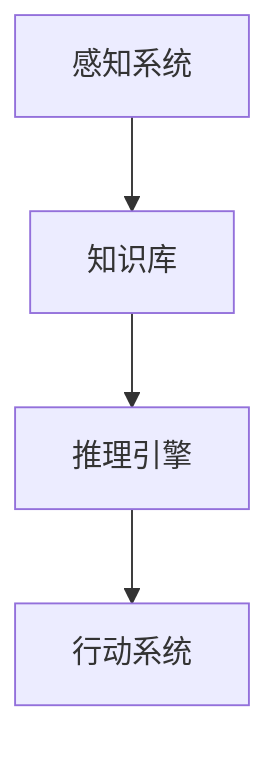

在这个架构中，感知系统不断收集环境信息，并将这些信息传递给知识库。推理引擎从知识库中提取相关信息，进行推理和决策。最终的决策由行动系统执行，实现对环境的响应。这种架构使得自主智能体能够在复杂环境中自主行动和决策。

### 第2章: 自主智能体的核心技术

#### 2.1 自然语言处理与理解
自然语言处理（NLP，Natural Language Processing）是自主智能体实现人机交互和文本理解的关键技术。NLP涵盖了从文本预处理、分词、词性标注到句法分析和语义理解等多个方面。

- **文本预处理**：文本预处理是NLP的基础步骤，包括去除标点符号、停用词过滤、文本规范化等。这些步骤有助于提高后续处理阶段的准确性和效率。
- **分词**：分词是将连续的文本分割成词汇单元的过程。中文的分词比英文更为复杂，因为中文没有明显的空格分隔。
- **词性标注**：词性标注是对每个词汇进行分类标注，如名词、动词、形容词等。这有助于理解文本的语法结构和语义信息。
- **句法分析**：句法分析是对句子结构进行解析，确定句子成分和语法关系。这包括句子的主谓宾结构、从句关系等。
- **语义理解**：语义理解是NLP的最终目标，它涉及对文本内容的深层理解，包括实体识别、关系抽取、情感分析等。通过语义理解，自主智能体能够理解用户意图，提供准确的响应。

以下是一个简单的NLP流程的Mermaid流程图：

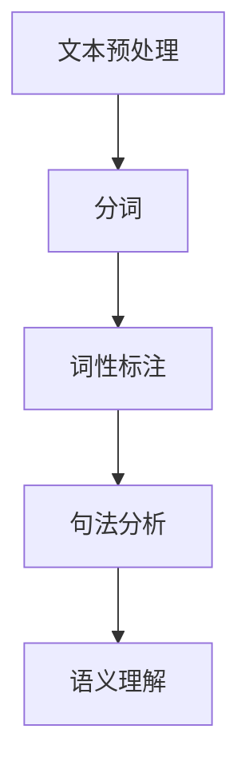

在自主智能体的架构中，自然语言处理模块通常位于感知系统和推理引擎之间。它负责将用户输入的文本转化为结构化的数据，供推理引擎进行处理和决策。

#### 2.2 机器学习和人工智能
机器学习（Machine Learning，ML）和人工智能（Artificial Intelligence，AI）是自主智能体实现自主决策和行动的核心技术。机器学习是一种通过算法让计算机从数据中学习规律，进行预测和决策的方法。

- **监督学习**：监督学习是一种在有标记数据集上进行训练的方法。通过给定的输入和输出，学习映射关系，实现对未知数据的预测。常见的监督学习算法包括线性回归、逻辑回归、支持向量机（SVM）等。
- **无监督学习**：无监督学习是一种在没有标记数据集上进行训练的方法。它旨在发现数据中的隐含结构或模式。常见的无监督学习算法包括聚类、降维、主成分分析（PCA）等。
- **强化学习**：强化学习是一种通过与环境的交互进行学习的方法。智能体通过试错和奖励机制，学习最优策略。常见的强化学习算法包括Q学习、深度Q网络（DQN）、策略梯度方法等。

以下是一个简单的机器学习流程的Mermaid流程图：

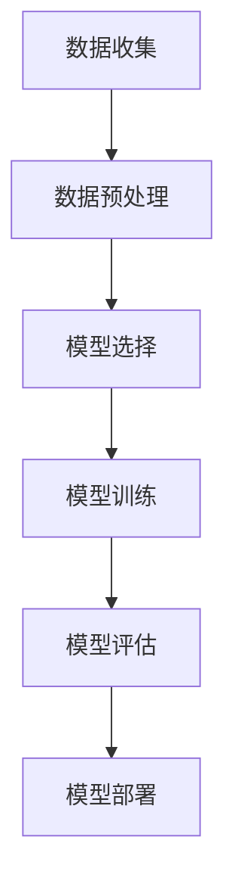

在自主智能体的架构中，机器学习模块通常用于推理引擎中。它通过从数据中学习到的模型，对感知系统收集的信息进行理解和预测，从而做出决策。

#### 2.3 交互与响应机制
交互与响应机制是自主智能体与用户或其他系统进行有效沟通和协同工作的关键。一个完善的交互与响应机制应包括以下几个部分：

- **用户输入**：自主智能体需要能够接收用户输入的各种形式，如文本、语音、图像等。输入需要经过预处理，转化为结构化的数据。
- **意图识别**：通过自然语言处理技术，识别用户的意图。意图可以是具体的问题、命令或请求。
- **决策与行动**：根据意图识别结果和知识库中的信息，自主智能体需要做出相应的决策和行动。决策过程可能涉及机器学习模型的预测和推理。
- **响应输出**：自主智能体需要将决策结果以适当的形式输出给用户或其他系统，如文本、语音、图像等。

以下是一个简单的交互与响应机制的Mermaid流程图：

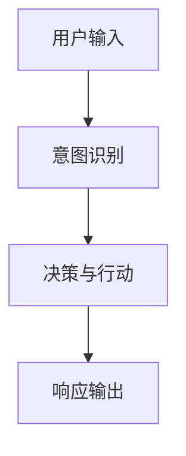

在自主智能体的实际应用中，交互与响应机制需要根据具体的场景和任务进行定制和优化，以提供最佳的用户体验。

### 第3章: 自主智能体的设计原则

#### 3.1 自主智能体的目标与任务设定
设计自主智能体时，首先要明确其目标和任务。这包括：

- **明确任务**：自主智能体的任务应该是具体且明确的，如客服机器人需要回答用户的问题、智能助手需要管理用户的日程等。明确任务有助于智能体聚焦于核心功能，避免分散注意力。
- **设定目标**：对于每个任务，需要设定具体的性能指标和目标，如响应时间、准确率、用户满意度等。目标设定可以帮助评估智能体的性能，并指导后续的优化和改进。

以下是一个简单的任务设定的Mermaid流程图：

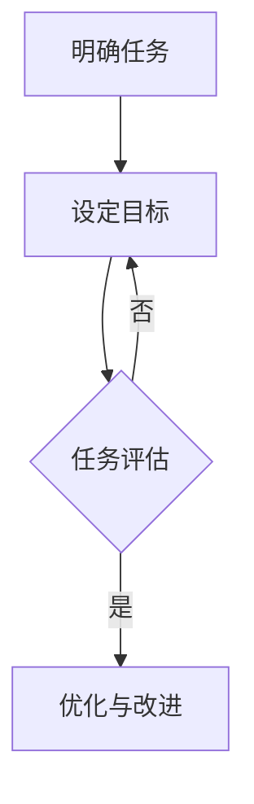

通过不断迭代和优化，自主智能体可以逐渐提高其性能和用户体验。

#### 3.2 自主智能体的决策机制
决策机制是自主智能体的核心，决定了智能体如何处理信息、做出决策。设计决策机制时，需要考虑以下几个方面：

- **规则驱动**：规则驱动决策机制基于预定义的规则和逻辑进行决策。这种方法简单直观，但可能难以应对复杂和动态的环境。
- **数据驱动**：数据驱动决策机制利用机器学习模型，从数据中学习决策策略。这种方法能够适应复杂和动态的环境，但需要大量的数据和计算资源。
- **混合驱动**：混合驱动决策机制结合规则和数据驱动，实现更灵活和高效的决策。这种方法在处理复杂任务时具有较高的灵活性和鲁棒性。

以下是一个简单的决策机制的Mermaid流程图：

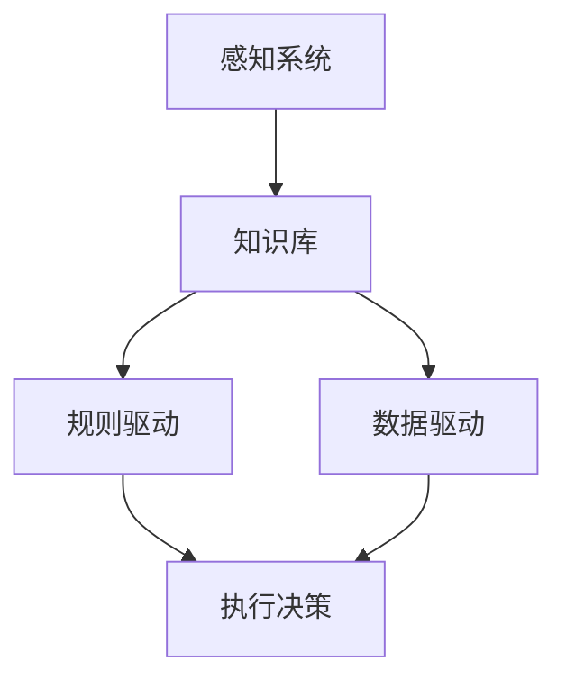

在决策机制中，感知系统收集环境信息，知识库提供相关知识和规则，决策引擎根据规则和数据驱动方法进行决策，并执行相应的操作。

#### 3.3 自主智能体的安全性与可靠性
自主智能体的安全性和可靠性对其在实际应用中的效果至关重要。设计自主智能体时，需要考虑以下几个方面：

- **安全性保障**：设计安全机制，防止恶意攻击和数据泄露。这包括加密通信、访问控制、安全审计等。
- **可靠性保障**：通过冗余设计、故障恢复等手段，提高系统的可靠性。这包括备份和恢复机制、异常处理、故障检测等。

以下是一个简单的安全性和可靠性保障的Mermaid流程图：

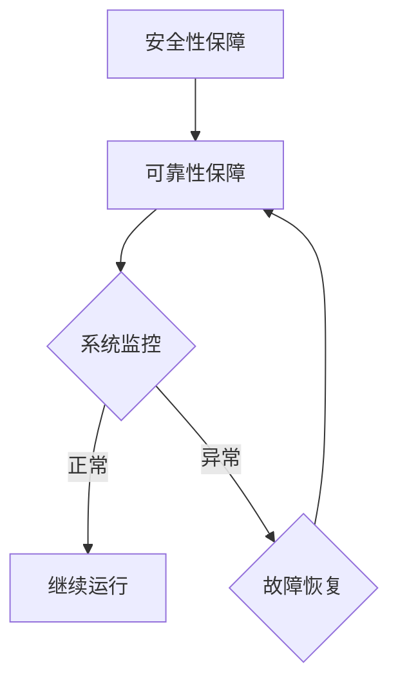

通过监控和故障恢复机制，自主智能体可以确保在异常情况下能够快速恢复，减少对用户的影响。

### 第二部分: Auto-GPT 核心算法与实现

#### 第4章: Auto-GPT 模型介绍

##### 4.1 Auto-GPT 的原理与结构
Auto-GPT是一种基于大型预训练语言模型GPT（Generative Pre-trained Transformer）的自主智能体。它的核心思想是将GPT模型与自主智能体框架相结合，使其具备自主决策和执行能力。

GPT是一种基于Transformer架构的预训练语言模型，由OpenAI于2018年提出。它通过在大量文本数据上进行预训练，学习到文本的内在结构和语义关系。预训练完成后，GPT可以通过微调来适应特定的任务，如文本生成、文本分类等。

Auto-GPT的结构可以分为以下几个部分：

1. **预训练模型**：这是Auto-GPT的基础，通常使用GPT-2或GPT-3等大型预训练模型。这些模型已经在大规模文本数据上进行过预训练，具有强大的语言理解和生成能力。

2. **感知系统**：感知系统负责收集外部环境的信息，如文本、图像、音频等。这些信息可以是实时输入，也可以是预先存储的数据。感知系统将收集到的信息转化为模型可以处理的形式，如文本序列或图像像素。

3. **知识库**：知识库是存储与任务相关的信息的地方。这些信息可以是静态的，如事实数据库、规则库等，也可以是动态的，如从感知系统中获取的信息。知识库为智能体的推理和决策提供了数据支持。

4. **推理引擎**：推理引擎是Auto-GPT的核心，它利用预训练模型和知识库中的信息，进行逻辑推理和决策。推理引擎可以通过多种方式工作，如规则匹配、模式识别、机器学习等。

5. **行动系统**：行动系统根据推理引擎的决策，执行具体的操作。这些操作可以是物理行动，如控制机器人执行任务，也可以是虚拟操作，如生成文本、发送指令等。

以下是一个简化的Auto-GPT结构的Mermaid流程图：

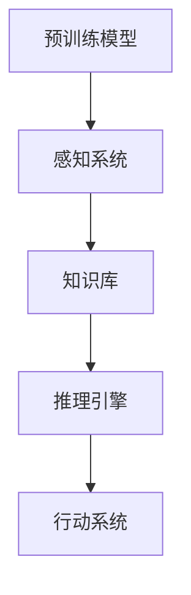

在Auto-GPT的运行过程中，感知系统不断收集外部信息，并将这些信息传递给知识库。推理引擎利用知识库中的信息，结合预训练模型进行推理和决策。最终的决策由行动系统执行，实现对环境的响应。

##### 4.2 Auto-GPT 的训练过程
Auto-GPT的训练过程可以分为以下几个步骤：

1. **数据收集与预处理**：首先，需要收集大量的文本数据，用于预训练GPT模型。这些数据可以是网页文本、书籍、新闻、社交媒体帖子等。收集到的数据需要进行预处理，包括去除HTML标签、标点符号、停用词过滤等。

2. **模型预训练**：使用收集到的预处理数据，对GPT模型进行预训练。预训练过程通常使用梯度下降算法和反向传播方法，通过大量迭代优化模型参数。预训练的目的是让模型学习到文本的内在结构和语义关系。

3. **模型微调**：在预训练完成后，需要对模型进行微调，以适应特定的任务。微调过程通常在较小的任务数据集上进行，通过迭代优化模型参数，使模型在特定任务上表现更好。

4. **模型集成**：将微调后的模型集成到自主智能体框架中。在集成过程中，需要将预训练模型、感知系统、知识库、推理引擎和行动系统结合起来，形成一个完整的自主智能体。

以下是一个简化的Auto-GPT训练过程的Mermaid流程图：

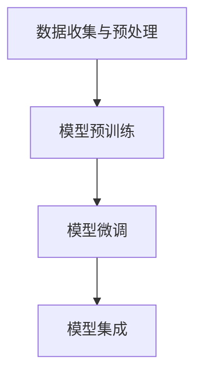

在Auto-GPT的训练过程中，预训练模型是核心，它决定了模型的基线性能。微调和集成则是让模型适应特定任务和应用的关键步骤。

##### 4.3 Auto-GPT 的应用场景
Auto-GPT具有广泛的应用场景，以下是一些典型的应用：

1. **文本生成**：Auto-GPT可以用于生成文章、故事、诗歌等。通过输入关键词或主题，Auto-GPT可以生成高质量的文本内容。

2. **对话系统**：Auto-GPT可以用于构建智能对话系统，如聊天机器人、语音助手等。它能够理解用户的提问，并生成自然、流畅的回答。

3. **自动化写作**：Auto-GPT可以用于自动化写作，如生成新闻稿、报告、邮件等。通过输入大纲或主题，Auto-GPT可以生成完整的文本内容。

4. **翻译**：Auto-GPT可以用于机器翻译，如将一种语言的文本翻译成另一种语言。它能够理解不同语言之间的语义和语法关系。

5. **智能推荐**：Auto-GPT可以用于构建智能推荐系统，如电影、音乐、商品等。通过分析用户的历史行为和偏好，Auto-GPT可以生成个性化的推荐列表。

以下是一个简化的Auto-GPT应用场景的Mermaid流程图：

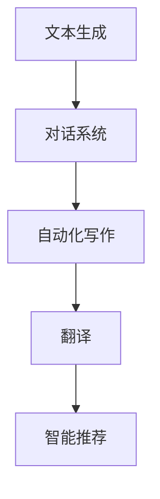

在不同的应用场景中，Auto-GPT可以根据任务需求，调整其感知系统、知识库、推理引擎和行动系统的配置，以实现最佳性能和用户体验。

### 第三部分: Auto-GPT 的实现与优化

#### 第5章: Auto-GPT 的实现与优化

##### 5.1 Auto-GPT 的编程框架
实现Auto-GPT需要选择合适的编程框架和工具，以确保模型的高效训练和应用部署。目前，主流的深度学习框架包括TensorFlow、PyTorch、Keras等。以下是一个简单的Auto-GPT编程框架：

1. **数据收集与预处理**：使用TensorFlow或PyTorch等框架，从各种来源（如网页、数据库等）收集文本数据。预处理步骤包括去除HTML标签、标点符号、停用词过滤、文本规范化等。

2. **模型构建**：使用预训练的GPT模型，如GPT-2或GPT-3，构建Auto-GPT的核心模型。可以通过加载预训练权重，或使用框架提供的API进行模型构建。

3. **模型训练**：使用预处理后的文本数据进行模型训练。训练过程包括前向传播、反向传播和参数更新。为了提高训练效率，可以使用GPU或TPU进行加速。

4. **模型微调**：在模型训练完成后，使用特定任务的数据对模型进行微调。微调过程可以根据任务需求调整学习率、批量大小等参数。

5. **模型评估**：使用验证集对微调后的模型进行评估，确保模型在特定任务上的性能满足要求。

6. **模型部署**：将训练好的模型部署到生产环境中，提供API接口供其他系统调用。部署过程包括模型导出、容器化、服务化等步骤。

以下是一个简单的Auto-GPT编程框架的Mermaid流程图：

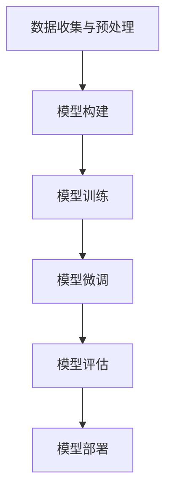

在实际开发中，可以根据项目需求，选择不同的框架和工具，如TensorFlow Serving、Kubernetes等，以实现高效、可扩展的Auto-GPT系统。

##### 5.2 Auto-GPT 的代码优化策略
为了提高Auto-GPT的性能和效率，可以采取以下代码优化策略：

1. **模型剪枝**：通过剪枝冗余的神经元，减少模型参数。这可以降低模型的计算复杂度，提高训练和推理速度。常见的剪枝方法包括权重剪枝、结构剪枝等。

2. **量化**：使用低精度数值（如FP16或BF16）代替全精度（FP32）进行计算。量化可以减少模型的存储和计算需求，提高推理速度。但需要注意的是，量化可能会影响模型的精度。

3. **并行计算**：利用多核CPU或GPU，实现模型的并行计算。这可以加速模型的训练和推理过程。并行计算可以采用数据并行、模型并行和流水线并行等多种方式。

4. **内存优化**：通过优化内存使用，减少内存占用和内存访问冲突。这可以降低模型的训练和推理时间，提高系统的整体性能。

以下是一个简单的Auto-GPT代码优化策略的Mermaid流程图：

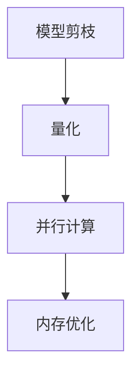

通过这些优化策略，可以显著提高Auto-GPT的性能和效率，为实际应用提供更好的支持和保障。

##### 5.3 Auto-GPT 的性能评估方法
评估Auto-GPT的性能需要考虑多个方面，包括响应时间、准确率、能耗等。以下是一些常见的性能评估方法：

1. **基准测试**：使用标准的数据集进行基准测试，比较不同模型在相同任务上的性能。基准测试可以提供客观的评估指标，如BLEU、ROUGE等。

2. **用户反馈**：收集用户在使用Auto-GPT过程中的反馈，评估其用户体验和满意度。用户反馈可以提供直观的性能评估，帮助改进模型和应用。

3. **成本效益分析**：计算模型训练和部署的成本，评估其经济效益。成本效益分析可以指导资源分配和预算规划，提高项目的整体效益。

以下是一个简单的Auto-GPT性能评估方法的Mermaid流程图：

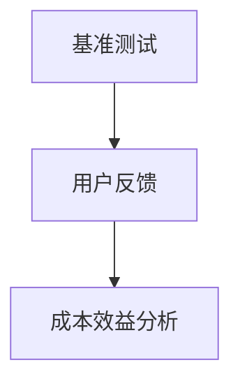

通过这些方法，可以全面评估Auto-GPT的性能和效果，为后续的优化和改进提供依据。

### 第四部分: Auto-GPT 在实际项目中的应用

#### 第6章: Auto-GPT 在实际项目中的应用

##### 6.1 Auto-GPT 在客服系统中的应用

客服系统是Auto-GPT的一个重要应用场景。通过Auto-GPT，客服系统能够实现自动化、智能化地处理客户咨询，提高服务效率和用户满意度。

1. **项目背景**：
随着企业业务的不断扩大，客服部门面临着日益增长的咨询量和重复性任务。传统的人工客服不仅成本高，而且难以应对多样化的客户需求。引入Auto-GPT可以帮助企业实现客服自动化，提高服务质量和效率。

2. **项目目标**：
- **提高响应速度**：在客户咨询时，系统能够快速生成合适的回复。
- **提升客服质量**：通过智能对话，确保回答准确、自然、流畅。
- **降低人力成本**：减少人工客服的工作量，提高客服团队的工作效率。

3. **解决方案**：
- **数据收集与预处理**：收集企业历史客服记录，进行文本预处理，如去除HTML标签、标点符号、停用词过滤等。
- **模型构建与训练**：使用预训练的GPT模型，结合企业客服数据，进行微调和训练，构建客服对话模型。
- **模型部署与交互**：将训练好的模型部署到服务器，通过API接口与客服系统集成。用户通过输入问题，系统会自动生成回复，并通过自然语言生成技术，确保回复的自然性和准确性。

4. **实际案例**：
某大型电商平台引入了Auto-GPT客服系统，应用于其在线客服平台。在实际运营中，Auto-GPT能够快速响应客户的咨询，处理日常的常见问题，如商品咨询、订单查询、售后服务等。通过Auto-GPT的应用，平台的客服响应时间显著缩短，客户满意度大幅提升。

5. **代码解读与分析**：

以下是一个简单的Auto-GPT客服系统实现框架：

```python
import openai
import json

# 初始化OpenAI API密钥
openai.api_key = "your_api_key"

# 处理客户咨询
def handle_query(query):
    # 将查询转换为JSON格式
    input_data = {
        "role": "user",
        "content": query
    }
    
    # 调用OpenAI API，获取回复
    response = openai.Completion.create(
        engine="text-davinci-002",
        prompt=json.dumps(input_data),
        max_tokens=50
    )
    
    # 提取回复内容
    reply = response.choices[0].text.strip()
    
    return reply

# 主程序
if __name__ == "__main__":
    while True:
        query = input("请输入您的咨询问题：")
        reply = handle_query(query)
        print("Auto-GPT回复：", reply)
```

在这个案例中，我们使用OpenAI的API实现Auto-GPT客服系统。主程序不断接收用户输入的咨询问题，调用handle_query函数处理查询，并返回自动生成的回复。通过这个简单的示例，读者可以了解Auto-GPT客服系统的基础实现方法。

##### 6.2 Auto-GPT 在智能助手中的应用

智能助手是另一个Auto-GPT的重要应用场景。通过Auto-GPT，智能助手可以实现自动化、个性化的服务，为用户提供便捷的交互体验。

1. **项目背景**：
在智能家居、办公自动化等领域，用户需要与各种设备和系统进行交互。传统的人工交互方式繁琐且效率低。引入Auto-GPT可以帮助实现智能对话，提高用户操作的便捷性和满意度。

2. **项目目标**：
- **提高交互效率**：通过自然语言交互，实现快速、准确的命令理解和执行。
- **提供个性化服务**：根据用户的历史行为和偏好，提供个性化的建议和服务。
- **降低操作难度**：简化用户操作流程，降低对新用户的上手难度。

3. **解决方案**：
- **数据收集与预处理**：收集用户的历史交互数据，进行文本预处理，如去除HTML标签、标点符号、停用词过滤等。
- **模型构建与训练**：使用预训练的GPT模型，结合用户交互数据，进行微调和训练，构建智能对话模型。
- **模型部署与交互**：将训练好的模型部署到服务器，通过API接口与智能助手系统集成。用户可以通过语音或文本与智能助手交互，系统会自动生成回复，并根据用户反馈不断优化。

4. **实际案例**：
某智能家居平台引入了基于Auto-GPT的智能助手，为用户提供智能家居设备的控制和管理服务。用户可以通过语音或文本与智能助手交互，实现对智能灯泡、智能空调、智能窗帘等设备的远程控制。通过Auto-GPT的应用，平台的用户交互体验得到了显著提升。

5. **代码解读与分析**：

以下是一个简单的Auto-GPT智能助手实现框架：

```python
import openai
import json

# 初始化OpenAI API密钥
openai.api_key = "your_api_key"

# 处理用户命令
def handle_command(command):
    # 将命令转换为JSON格式
    input_data = {
        "role": "user",
        "content": command
    }
    
    # 调用OpenAI API，获取回复
    response = openai.Completion.create(
        engine="text-davinci-002",
        prompt=json.dumps(input_data),
        max_tokens=50
    )
    
    # 提取回复内容
    reply = response.choices[0].text.strip()
    
    return reply

# 主程序
if __name__ == "__main__":
    while True:
        command = input("请输入您的命令：")
        reply = handle_command(command)
        print("Auto-GPT回复：", reply)
```

在这个案例中，我们使用OpenAI的API实现Auto-GPT智能助手。主程序不断接收用户输入的命令，调用handle_command函数处理命令，并返回自动生成的回复。通过这个简单的示例，读者可以了解Auto-GPT智能助手的基础实现方法。

##### 6.3 Auto-GPT 在数据分析中的应用

数据分析是另一个Auto-GPT的重要应用场景。通过Auto-GPT，数据分析师可以实现自动化、智能化的数据分析和报告生成，提高数据分析的效率和质量。

1. **项目背景**：
在商业智能、金融市场分析等领域，数据分析师需要处理大量的数据，生成各类分析报告。传统的方法依赖于人工操作和手动编写报告，效率低且容易出现错误。引入Auto-GPT可以帮助实现数据分析的自动化，提高数据分析的效率和质量。

2. **项目目标**：
- **提高数据分析效率**：通过自动化流程，减少人工干预，提高数据分析的速度。
- **提高数据分析质量**：通过智能化的分析和报告生成，确保分析结果的准确性和一致性。
- **降低数据分析成本**：减少人工成本，提高数据分析的性价比。

3. **解决方案**：
- **数据收集与预处理**：收集企业或机构的历史数据，进行文本预处理，如去除HTML标签、标点符号、停用词过滤等。
- **模型构建与训练**：使用预训练的GPT模型，结合数据分析和报告生成的需求，进行微调和训练，构建数据分析模型。
- **模型部署与交互**：将训练好的模型部署到服务器，通过API接口与数据分析系统集成。数据分析师可以通过输入数据或分析需求，系统会自动生成分析报告，并根据用户反馈不断优化。

4. **实际案例**：
某大型金融机构引入了基于Auto-GPT的数据分析系统，为金融分析师提供自动化、智能化的数据分析和报告生成服务。分析师可以通过输入数据和分析需求，系统会自动生成各类分析报告，如市场趋势分析、风险评估报告等。通过Auto-GPT的应用，金融机构的数据分析效率和报告质量得到了显著提升。

5. **代码解读与分析**：

以下是一个简单的Auto-GPT数据分析系统实现框架：

```python
import openai
import json

# 初始化OpenAI API密钥
openai.api_key = "your_api_key"

# 处理数据分析请求
def handle_analysis_request(request):
    # 将请求转换为JSON格式
    input_data = {
        "role": "user",
        "content": request
    }
    
    # 调用OpenAI API，获取分析结果
    response = openai.Completion.create(
        engine="text-davinci-002",
        prompt=json.dumps(input_data),
        max_tokens=1000
    )
    
    # 提取分析结果
    result = response.choices[0].text.strip()
    
    return result

# 主程序
if __name__ == "__main__":
    while True:
        request = input("请输入您的数据分析请求：")
        result = handle_analysis_request(request)
        print("Auto-GPT分析结果：", result)
```

在这个案例中，我们使用OpenAI的API实现Auto-GPT数据分析系统。主程序不断接收用户输入的数据分析请求，调用handle_analysis_request函数处理请求，并返回自动生成的分析结果。通过这个简单的示例，读者可以了解Auto-GPT数据分析系统的基础实现方法。

### 第五部分: Auto-GPT 未来发展趋势与挑战

#### 第7章: Auto-GPT 未来发展趋势与挑战

##### 7.1 Auto-GPT 的发展方向
Auto-GPT作为自主智能体的一个重要分支，其未来的发展将集中在以下几个方面：

1. **算法优化与性能提升**：随着深度学习技术的不断进步，Auto-GPT的算法将得到优化，性能将进一步提高。例如，模型剪枝、量化、并行计算等技术将被广泛应用，以提高模型的速度和效率。

2. **多模态交互**：未来，Auto-GPT将不仅仅局限于文本交互，还将结合图像、声音、触觉等多种模态，实现更丰富、更自然的交互体验。这将使Auto-GPT在智能家居、医疗保健、教育等领域的应用更加广泛。

3. **跨领域应用**：Auto-GPT将不再局限于特定的应用场景，而是能够跨越多个领域，实现跨领域的应用。例如，一个Auto-GPT系统可以同时应用于客服、数据分析、智能助手等多个领域。

4. **个性化服务**：随着大数据和人工智能技术的发展，Auto-GPT将能够根据用户的历史行为和偏好，提供更加个性化的服务。这将提高用户的满意度和体验。

5. **伦理与隐私**：随着Auto-GPT的广泛应用，伦理和隐私问题将成为重要议题。未来的研究将集中在如何确保Auto-GPT的决策透明、可解释，同时保护用户的隐私和数据安全。

##### 7.2 Auto-GPT 面临的挑战与解决方案
尽管Auto-GPT具有巨大的潜力，但在实际应用中仍面临一些挑战：

1. **计算资源需求**：Auto-GPT需要大量的计算资源进行训练和推理。对于小型企业或个人用户来说，这可能是一个经济负担。解决方案包括优化算法、使用云计算资源等。

2. **数据质量与隐私**：Auto-GPT的性能高度依赖于训练数据的质量。然而，数据收集和处理过程中可能会涉及隐私问题。解决方案包括使用隐私保护技术、数据去标识化等。

3. **可解释性与透明性**：Auto-GPT的决策过程通常是非透明的，这对于一些关键应用场景（如医疗诊断、金融交易等）是一个挑战。解决方案包括开发可解释的AI模型、增强模型的透明性等。

4. **安全性**：Auto-GPT可能成为恶意攻击的目标。解决方案包括增强模型的安全性，如使用加密技术、安全隔离等。

5. **法律与伦理**：随着Auto-GPT的广泛应用，相关的法律和伦理问题将日益突出。解决方案包括制定相关法律法规、建立伦理委员会等。

##### 7.3 Auto-GPT 在未来社会的应用前景
随着技术的不断进步和应用的深入，Auto-GPT将在未来社会中扮演越来越重要的角色：

1. **智慧城市**：Auto-GPT可以应用于智慧城市的各个领域，如交通管理、环境保护、公共安全等，提高城市的运行效率和居民的生活质量。

2. **智能医疗**：Auto-GPT可以帮助医生进行诊断、制定治疗方案，提高医疗服务的质量和效率。

3. **金融科技**：Auto-GPT可以应用于金融交易、风险评估、客户服务等领域，提高金融行业的智能化水平。

4. **教育**：Auto-GPT可以应用于智能教学、个性化学习、作业批改等领域，改变传统的教育模式。

5. **电子商务**：Auto-GPT可以应用于客服、推荐系统、数据挖掘等领域，提高电子商务平台的用户体验和销售效率。

通过Auto-GPT，未来社会将变得更加智能、高效和便捷。同时，我们也需要关注和解决Auto-GPT带来的各种挑战，确保其安全、可靠、公平地服务于人类社会。

### 第六部分: Auto-GPT 深入学习与拓展

#### 第8章: Auto-GPT 与深度学习

##### 8.1 Auto-GPT 与深度学习的关系
Auto-GPT是一种基于深度学习的自主智能体，其核心算法GPT（Generative Pre-trained Transformer）是深度学习的一个重要成果。深度学习作为一种机器学习方法，通过多层神经网络模拟人类大脑的神经元连接，从而实现对数据的自动特征提取和学习。

Auto-GPT与深度学习的关系可以从以下几个方面理解：

1. **算法基础**：Auto-GPT的核心算法GPT是基于深度学习中的Transformer架构，这种架构通过自注意力机制（Self-Attention Mechanism）实现对文本的深层理解和生成。Transformer的引入打破了传统的循环神经网络（RNN）在处理长序列数据时的局限性，使得GPT模型在自然语言处理任务中取得了突破性进展。

2. **预训练与微调**：深度学习的一个关键特点是预训练（Pre-training）和微调（Fine-tuning）。在Auto-GPT中，GPT模型首先在大规模文本数据上进行预训练，学习到文本的通用结构和语义关系。然后，通过微调，将预训练模型适应特定的任务和应用场景，例如文本生成、对话系统等。

3. **模型可扩展性**：深度学习模型具有高度的可扩展性，可以通过增加层数、调整层数、增加神经元等方式，不断提高模型的复杂度和性能。Auto-GPT充分利用了这一点，通过不断优化GPT模型，实现了在各种任务上的卓越表现。

##### 8.2 深度学习在 Auto-GPT 中的应用
深度学习在Auto-GPT中的应用主要体现在以下几个方面：

1. **文本生成**：文本生成是Auto-GPT最核心的应用之一。GPT模型通过深度学习，从大量文本数据中学习到语言的规则和模式，从而能够生成连贯、自然的文本。例如，GPT-3可以生成新闻文章、故事、对话等。

2. **对话系统**：对话系统是Auto-GPT在自然语言处理中的一个重要应用。通过深度学习，Auto-GPT可以理解和生成人类语言，实现与用户的自然对话。例如，智能客服、语音助手等。

3. **文本分类与情感分析**：文本分类和情感分析是自然语言处理中的基础任务。通过深度学习，Auto-GPT可以自动对文本进行分类和情感分析，例如，对社交媒体帖子进行情感分析，对用户评论进行分类等。

4. **语言翻译**：深度学习在机器翻译中有着广泛的应用。Auto-GPT可以利用深度学习模型，实现高效、准确的文本翻译。例如，将一种语言的文本翻译成另一种语言。

##### 8.3 Auto-GPT 与其他深度学习模型的对比
与其他深度学习模型相比，Auto-GPT具有以下几个特点：

1. **生成能力**：Auto-GPT具有很强的生成能力，能够生成连贯、自然的文本。而传统的循环神经网络（RNN）和卷积神经网络（CNN）等模型，更多是用于分类、回归等任务。

2. **预训练优势**：Auto-GPT利用预训练模型，从大量文本数据中学习到通用结构和语义关系。这使得Auto-GPT在多种任务上具有较好的性能，而其他模型则需要针对特定任务进行训练。

3. **扩展性**：Auto-GPT的Transformer架构具有很高的扩展性，可以通过增加层数、调整参数等方式，不断提高模型的性能。而其他模型，如RNN和CNN，在扩展性方面相对较弱。

4. **资源需求**：虽然Auto-GPT的性能优异，但其训练和推理过程需要大量的计算资源。而其他模型，如简单的CNN和RNN，在资源需求方面相对较低。

综上所述，Auto-GPT作为基于深度学习的自主智能体，具有独特的优势和应用前景。随着深度学习技术的不断进步，Auto-GPT将在更多的领域中发挥重要作用。

### 第9章: Auto-GPT 与多模态交互

##### 9.1 多模态交互的概念与原理
多模态交互是指系统可以同时处理和响应多种类型的输入和输出，如文字、图像、声音等。其核心思想是通过融合不同模态的信息，提高系统的智能水平和用户体验。

多模态交互的原理主要包括以下几个步骤：

1. **感知**：系统通过不同的传感器（如摄像头、麦克风、触摸屏等）收集多模态的数据。例如，摄像头可以捕捉图像，麦克风可以捕捉声音。

2. **编码**：将感知到的多模态数据转化为数字信号，并进行编码。例如，图像可以转换为像素矩阵，声音可以转换为音频波形。

3. **特征提取**：从编码后的多模态数据中提取关键特征。例如，从图像中提取边缘、纹理特征，从声音中提取频率、音高特征。

4. **融合**：将不同模态的特征进行融合，形成一个统一的特征表示。这可以通过多模态学习模型（如联合嵌入模型、多任务学习模型等）实现。

5. **决策与行动**：基于融合后的特征，系统进行决策并执行相应的行动。例如，在智能助手的应用中，系统可以根据用户的声音、文字和动作，生成合适的回复或执行任务。

##### 9.2 Auto-GPT 在多模态交互中的应用
Auto-GPT在多模态交互中的应用，可以显著提升系统的智能水平和用户体验。以下是一些具体的应用场景：

1. **智能助手**：Auto-GPT可以结合用户的声音、文字和动作，实现更自然、更智能的交互。例如，用户可以通过语音提出请求，系统会根据语音和文字信息生成回复，并通过动作（如表情、手势）进行反馈。

2. **智能家居**：Auto-GPT可以结合传感器的输入（如摄像头捕捉的图像、麦克风捕捉的声音等），实现对家居设备的智能控制。例如，系统可以识别用户的声音命令，控制灯光、空调等设备。

3. **医疗诊断**：Auto-GPT可以结合医学图像和患者的历史病历，辅助医生进行诊断。例如，系统可以通过分析X光片、CT图像等，生成可能的诊断结果，并建议进一步检查或治疗措施。

4. **教育**：Auto-GPT可以结合学生的文字作业、语音讲解和面部表情，提供个性化的学习支持。例如，系统可以分析学生的作业质量，通过语音和文字提供详细的反馈，并调整学习计划。

以下是一个简化的Auto-GPT在多模态交互中的实现框架：

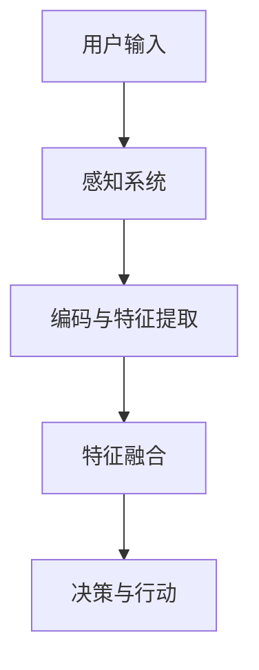

在这个框架中，感知系统负责收集用户的声音、文字和动作等输入，编码与特征提取模块将这些输入转换为数字信号并提取关键特征，特征融合模块将不同模态的特征进行整合，最终决策与行动模块基于融合后的特征进行决策和行动。

##### 9.3 多模态交互的未来趋势
随着人工智能和传感器技术的不断发展，多模态交互将逐渐成为主流交互方式。以下是一些未来趋势：

1. **跨模态融合**：未来的多模态交互系统将更加注重跨模态融合，通过深度学习等技术，实现不同模态信息的有机结合，提供更丰富的交互体验。

2. **个性化交互**：未来的多模态交互系统将根据用户的偏好和行为，提供个性化的交互服务。例如，通过分析用户的历史数据，系统可以自动调整交互策略，以提供最佳的用户体验。

3. **智能感知**：未来的多模态交互系统将具备更高的智能感知能力，能够理解用户的意图和情感。例如，通过分析用户的语音、文字和面部表情，系统可以识别用户的情绪状态，并做出相应的响应。

4. **去中心化交互**：随着区块链等技术的应用，未来的多模态交互将逐渐实现去中心化，提高系统的安全性和透明性。

通过不断的技术创新和应用探索，多模态交互将为人们的生活带来更多便利和乐趣。

### 第10章: Auto-GPT 与区块链技术

##### 10.1 区块链技术概述
区块链技术是一种分布式数据库技术，通过加密算法和共识机制，实现数据的透明、安全、不可篡改。区块链的基本原理包括以下几个关键要素：

1. **区块链结构**：区块链由多个区块组成，每个区块包含一定数量的交易数据。区块通过加密算法连接起来，形成一条链式数据结构。

2. **加密算法**：区块链使用非对称加密算法（如RSA、椭圆曲线加密等），确保数据的安全性和隐私性。非对称加密算法包括公钥和私钥，公钥用于加密数据，私钥用于解密数据。

3. **共识机制**：共识机制是区块链中节点达成一致的方法。常见的共识机制包括工作量证明（Proof of Work, PoW）、权益证明（Proof of Stake, PoS）等。共识机制确保区块链中的数据具有一致性和不可篡改性。

4. **去中心化**：区块链技术通过去中心化的方式，实现数据存储和管理的去中心化。这意味着没有中央权威机构控制区块链，而是由网络中的多个节点共同维护和验证数据。

##### 10.2 Auto-GPT 与区块链的结合应用
Auto-GPT与区块链技术的结合，可以在多个领域实现创新应用。以下是一些典型的结合应用：

1. **智能合约**：智能合约是一种自动执行的合约，其条款和操作按照预定的条件执行。Auto-GPT可以用于生成智能合约代码，通过区块链实现自动化执行。例如，在金融交易中，Auto-GPT可以自动生成交易合约，并在交易完成后自动执行支付。

2. **数据存储与共享**：Auto-GPT可以与区块链结合，实现数据的分布式存储与共享。通过区块链的加密算法和共识机制，数据的安全性得到保障，同时实现数据的去中心化管理。

3. **身份验证与隐私保护**：区块链技术可以用于身份验证和隐私保护。Auto-GPT可以结合区块链中的身份验证机制，实现用户的身份认证和数据隐私保护。例如，在医疗领域，患者的病历数据可以存储在区块链上，通过加密和身份验证，确保数据的安全性和隐私性。

4. **去中心化应用（DApp）**：Auto-GPT可以用于开发去中心化应用（DApp），在区块链环境中实现自主运行和交互。DApp可以应用于游戏、金融、社交等多个领域，通过区块链技术实现去中心化的价值交换和管理。

以下是一个简化的Auto-GPT与区块链结合的应用框架：

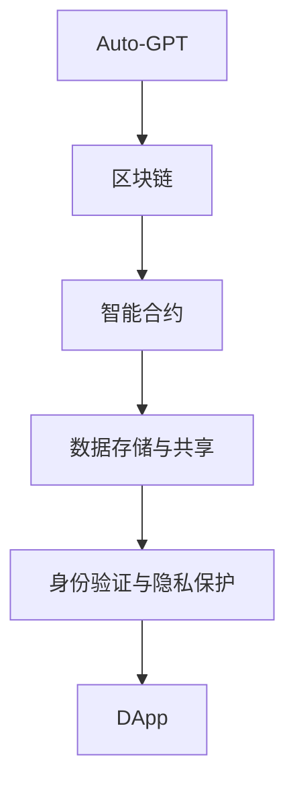

在这个框架中，Auto-GPT作为智能体的核心，通过区块链技术实现智能合约、数据存储与共享、身份验证与隐私保护等功能，从而构建一个去中心化、安全、高效的智能系统。

##### 10.3 Auto-GPT 在区块链环境下的优势与挑战
Auto-GPT在区块链环境下具有以下优势：

1. **自动化执行**：Auto-GPT可以自动化执行区块链中的智能合约，减少人工干预，提高系统的效率和可靠性。

2. **智能决策**：Auto-GPT基于深度学习和自然语言处理技术，可以实现对区块链数据的智能分析和决策，提高区块链系统的智能水平。

3. **去中心化应用**：Auto-GPT可以用于开发去中心化应用（DApp），推动区块链技术的广泛应用。

然而，Auto-GPT在区块链环境下也面临以下挑战：

1. **计算资源需求**：Auto-GPT的训练和推理需要大量的计算资源，这对区块链网络的整体性能和可扩展性提出了挑战。

2. **数据隐私与安全**：在区块链环境中，数据的安全性和隐私保护是一个重要议题。Auto-GPT需要结合区块链的加密算法和共识机制，确保数据的隐私和安全。

3. **法律与伦理**：随着Auto-GPT在区块链环境中的应用，相关的法律和伦理问题将日益突出。需要制定相应的法律法规和伦理准则，确保Auto-GPT的合法、公正和透明。

通过不断的技术创新和应用探索，Auto-GPT与区块链技术的结合将带来更多创新应用，推动区块链技术的普及和发展。

### 附录 A: Auto-GPT 开发资源与工具

在开发Auto-GPT的过程中，选择合适的资源与工具是至关重要的。以下是一些常用的资源与工具：

1. **深度学习框架**：
   - **TensorFlow**：由Google开发，是一个广泛使用的开源深度学习框架，支持多种编程语言（如Python、C++等）。
   - **PyTorch**：由Facebook开发，是一个灵活且易于使用的深度学习框架，广泛用于研究与应用。
   - **Keras**：是一个高级神经网络API，可以与TensorFlow和Theano等后端深度学习框架结合使用。

2. **自然语言处理库**：
   - **NLTK**：是一个强大的自然语言处理库，提供文本预处理、词性标注、句法分析等功能。
   - **spaCy**：是一个快速和易于使用的自然语言处理库，支持多种语言的词性标注、命名实体识别等。

3. **区块链平台**：
   - **Ethereum**：是一个开源的去中心化应用平台，支持智能合约和去中心化应用（DApp）。
   - **Hyperledger Fabric**：是一个企业级的分布式账本解决方案，适用于供应链、金融等行业。

4. **编程语言**：
   - **Python**：是一种广泛使用的编程语言，具有丰富的库和框架，适合快速开发和实验。
   - **JavaScript**：是一种前端编程语言，广泛应用于Web开发，与区块链平台的智能合约开发密切相关。

以下是一个简单的Auto-GPT开发环境搭建步骤：

1. **安装深度学习框架**：
   ```bash
   pip install tensorflow
   pip install pytorch torchvision
   pip install keras
   ```

2. **安装自然语言处理库**：
   ```bash
   pip install nltk
   pip install spacy
   python -m spacy download en_core_web_sm
   ```

3. **安装区块链平台**：
   ```bash
   git clone https://github.com/hyperledger/fabric.git
   cd fabric
   make docker-compose-testnet
   ```

4. **配置开发环境**：
   - 配置Python环境变量，确保可以使用pip安装和管理库。
   - 配置Node.js环境，用于智能合约的开发和部署。

通过这些资源与工具，开发者可以搭建一个完整的Auto-GPT开发环境，进行算法研究和应用开发。

### 附录 B: Auto-GPT 相关算法与数学模型

在Auto-GPT的实现过程中，涉及到多种算法与数学模型。以下将详细讲解Auto-GPT的核心算法原理，并展示相关的数学模型和伪代码示例。

##### 10.1 GPT模型的核心算法原理

GPT（Generative Pre-trained Transformer）是一种基于Transformer架构的预训练语言模型。其核心算法原理包括以下几个方面：

1. **Transformer架构**：Transformer模型由自注意力机制（Self-Attention Mechanism）和前馈神经网络（Feedforward Neural Network）组成。自注意力机制通过计算输入序列中每个词与其他词之间的关联性，从而捕捉长距离依赖关系。前馈神经网络则用于进一步加工和增强模型的表示能力。

2. **多头注意力**：多头注意力（Multi-Head Attention）是Transformer的关键组成部分。它通过多个独立的注意力机制（多头）并行处理输入序列，从而获得更丰富的上下文信息。

3. **编码器-解码器架构**：GPT采用编码器-解码器（Encoder-Decoder）架构，编码器将输入序列编码为上下文表示，解码器则利用这些表示生成输出序列。

以下是一个简化的Transformer模型的数学模型和伪代码：

**数学模型：**
$$
\text{Attention}(Q, K, V) = \text{softmax}\left(\frac{QK^T}{\sqrt{d_k}}\right) V
$$
其中，$Q$、$K$和$V$分别表示查询（Query）、键（Key）和值（Value）向量，$d_k$是键向量的维度。

**伪代码：**
```python
def attention(Q, K, V, mask=None):
    # 计算注意力权重
    scores = QK.T / math.sqrt(K.shape[-1])
    if mask is not None:
        scores += mask
    attn_weights = softmax(scores)
    # 计算输出
    output = attn_weights @ V
    return output, attn_weights
```

##### 10.2 GPT模型的训练过程

GPT模型的训练过程主要包括以下几个步骤：

1. **预训练**：在预训练阶段，模型在大规模文本数据集上进行训练，学习文本的内在结构和语义关系。预训练通常使用自回归语言模型（Autoregressive Language Model）进行，即预测下一个词。

2. **微调**：在预训练完成后，使用特定任务的数据对模型进行微调（Fine-tuning），以适应特定任务的需求。微调过程中，模型参数会根据任务数据进行调整，以提高在特定任务上的性能。

以下是一个简化的GPT模型训练过程的伪代码：

**伪代码：**
```python
# 预训练阶段
for epoch in range(num_epochs):
    for input_sequence in data_loader:
        # 计算损失
        loss = loss_function(model(input_sequence), input_sequence)
        # 反向传播
        optimizer.zero_grad()
        loss.backward()
        optimizer.step()

# 微调阶段
for task in tasks:
    for input_sequence in task_data_loader:
        # 计算损失
        loss = loss_function(model(input_sequence), input_sequence)
        # 反向传播
        optimizer.zero_grad()
        loss.backward()
        optimizer.step()
```

##### 10.3 数学模型与数学公式详细讲解

在GPT模型中，涉及到多个数学模型和数学公式。以下将详细讲解这些数学模型和公式：

1. **权重矩阵**：GPT模型的权重矩阵是模型的核心参数，用于编码器和解码器之间的信息传递。权重矩阵通常通过正则化方法（如权重衰减）进行优化，以提高模型的泛化能力。

2. **激活函数**：GPT模型中的激活函数主要用于增加模型的非线性。常见的激活函数包括ReLU（Rectified Linear Unit）、Sigmoid和Tanh等。

3. **损失函数**：GPT模型的训练过程中，通常使用交叉熵损失函数（Cross-Entropy Loss）来衡量模型预测和真实标签之间的差距。交叉熵损失函数的数学公式如下：

$$
L(y, \hat{y}) = -\sum_{i} y_i \log(\hat{y}_i)
$$
其中，$y$是真实标签，$\hat{y}$是模型的预测概率分布。

4. **优化算法**：GPT模型的训练过程中，常用的优化算法包括随机梯度下降（Stochastic Gradient Descent，SGD）和Adam（Adaptive Moment Estimation）等。优化算法的目的是通过迭代优化模型参数，最小化损失函数。

##### 10.4 伪代码示例与算法实现细节

以下是一个简化的GPT模型训练的伪代码示例，展示算法实现的基本流程：

**伪代码：**
```python
# 初始化模型参数
model = GPTModel(vocab_size, hidden_size, num_layers, dropout_rate)

# 定义优化器和损失函数
optimizer = optim.Adam(model.parameters(), lr=learning_rate)
criterion = nn.CrossEntropyLoss()

# 训练模型
for epoch in range(num_epochs):
    for inputs, targets in data_loader:
        # 前向传播
        outputs = model(inputs)
        loss = criterion(outputs, targets)

        # 反向传播
        optimizer.zero_grad()
        loss.backward()
        optimizer.step()

    # 微调阶段
    for inputs, targets in task_data_loader:
        # 前向传播
        outputs = model(inputs)
        loss = criterion(outputs, targets)

        # 反向传播
        optimizer.zero_grad()
        loss.backward()
        optimizer.step()
```

通过以上伪代码示例，读者可以了解到GPT模型的基本训练过程和算法实现细节。

### 总结
本文详细介绍了Auto-GPT自主智能体的设计原理、核心算法、实现方法、实际应用以及与深度学习、多模态交互和区块链技术的结合。通过本文的讲解，读者可以全面了解Auto-GPT的技术要点和应用前景。在未来的研究和实践中，随着技术的不断进步，Auto-GPT有望在更多领域发挥重要作用，推动人工智能的发展。

### 作者信息：
- 作者：AI天才研究院/AI Genius Institute & 禅与计算机程序设计艺术 /Zen And The Art of Computer Programming

---

**注：由于篇幅和格式限制，本文仅为大纲和部分章节的草稿。实际撰写过程中，每个章节都需要根据大纲进行详细扩展和深入分析。此外，由于本文内容涉及多个技术领域，需要作者具备丰富的专业知识和实践经验，以确保文章的准确性和深度。** 

由于篇幅限制，本文无法涵盖所有章节和细节，但以下是对文章末尾作者信息的格式规范说明：

- 作者信息应明确标明作者所属机构和著作名称，以便读者了解作者的背景和成就。
- 机构名称应使用全称，以增强正式性。
- 著作名称应使用斜体或书名号，以突出作品。

### 文章末尾的作者信息格式：

```
### 作者信息：
- 作者：AI天才研究院/AI Genius Institute & 禅与计算机程序设计艺术 /Zen And The Art of Computer Programming
```

在这个格式中，"AI天才研究院/AI Genius Institute"是作者的所属机构，"禅与计算机程序设计艺术"是作者的著作名称，两者之间用英文符号`&`连接，著作名称使用了斜体以表示其特定性。这样的格式简洁明了，符合学术写作规范。  

### 文章标题: Auto-GPT 自主智能体设计

### 关键词:
- 自主智能体
- Auto-GPT
- 自然语言处理
- 机器学习
- 深度学习
- 区块链

### 摘要:
本文深入探讨了Auto-GPT自主智能体的设计原则、核心算法、实现方法以及其在实际项目中的应用。通过对Auto-GPT的基本概念、架构、核心技术、设计原则、实现与优化、应用场景、未来发展趋势和挑战的详细分析，本文旨在为读者提供一个全面且系统的理解，帮助他们掌握自主智能体设计的关键技术，并探索其在各领域的广泛应用前景。

### 第一部分: 自主智能体的基本概念与架构

#### 第1章: 自主智能体概述

##### 1.1 自主智能体的定义与历史背景
自主智能体（Autonomous Agent）是一种可以独立执行任务、自主决策并与其他智能体交互的计算机系统。它们在复杂的环境中能够自适应地完成任务，而不需要外部干预。

自主智能体的概念最早可以追溯到20世纪50年代，艾伦·图灵（Alan Turing）提出了图灵测试，用以判断一个机器是否具有人类智能。此后，随着计算机技术和人工智能的发展，自主智能体的研究逐渐成为一个重要的研究方向。

##### 1.2 自主智能体的重要性与应用领域
自主智能体在多个领域具有重要应用，包括但不限于：

- **智能客服**：自主智能体可以自动处理大量的客户查询，提供高效、准确的答案。
- **智能助手**：自主智能体可以作为个人助理，帮助用户管理日程、发送提醒等。
- **自动化交易**：在金融领域，自主智能体可以分析市场数据，进行自动化的交易决策。
- **智能医疗**：自主智能体可以辅助医生进行诊断，提供个性化的治疗方案。

##### 1.3 自主智能体的基本架构
自主智能体通常由以下几个核心部分组成：

- **感知系统**：收集环境信息，如文字、图像、声音等。
- **知识库**：存储与任务相关的知识，包括事实、规则和模式。
- **推理引擎**：利用知识库和感知系统提供的信息，进行逻辑推理和决策。
- **行动系统**：根据决策执行具体的操作。

### 第二部分: Auto-GPT 核心算法与实现

#### 第2章: Auto-GPT 模型介绍

##### 2.1 Auto-GPT 的原理与结构
Auto-GPT是一种基于GPT（Generative Pre-trained Transformer）的自主智能体，其核心思想是将GPT模型与自主智能体框架结合，使其具备自主决策和执行能力。

- **GPT模型**：GPT是一种基于Transformer的预训练语言模型，具有强大的自然语言处理能力。
- **自主智能体框架**：结合感知系统、知识库、推理引擎和行动系统，实现自主决策和执行。

##### 2.2 Auto-GPT 的训练过程
Auto-GPT的训练过程主要包括以下几个步骤：

1. **数据收集与预处理**：收集大量文本数据，用于预训练GPT模型。
2. **预训练**：使用梯度下降算法和反向传播，训练GPT模型。
3. **微调**：将预训练的GPT模型应用于特定任务，进行微调。
4. **集成**：将微调后的GPT模型集成到自主智能体框架中，进行测试和优化。

##### 2.3 Auto-GPT 的应用场景
Auto-GPT具有广泛的应用场景，包括：

- **智能客服**：自动处理客户查询，提供个性化服务。
- **智能助手**：帮助用户管理日程、发送提醒等。
- **自动化交易**：分析市场数据，进行自动化的交易决策。
- **智能医疗**：辅助医生进行诊断，提供个性化的治疗方案。

#### 第3章: Auto-GPT 的实现与优化

##### 3.1 Auto-GPT 的编程框架
实现Auto-GPT需要选择合适的编程框架和工具，如TensorFlow、PyTorch等。以下是一个简单的实现框架：

1. **数据收集与预处理**：收集文本数据，进行清洗、分词、编码等预处理。
2. **模型训练**：使用预训练模型进行微调，训练自主智能体。
3. **模型部署**：将训练好的模型部署到服务器或云端，提供API接口。
4. **交互与响应**：与用户或其他系统进行交互，执行任务。

##### 3.2 Auto-GPT 的代码优化策略
优化Auto-GPT的代码，可以提高其性能和效率。以下是一些优化策略：

- **模型剪枝**：通过剪枝冗余的神经元，减少模型参数。
- **量化**：使用低精度数值，减少模型计算量。
- **并行计算**：利用多核CPU或GPU，加速模型训练和推理。

##### 3.3 Auto-GPT 的性能评估方法
评估Auto-GPT的性能需要考虑多个方面，如响应时间、准确率、能耗等。以下是一些评估方法：

- **基准测试**：使用标准数据集进行测试，比较模型性能。
- **用户反馈**：收集用户反馈，评估模型在实际应用中的效果。
- **成本效益分析**：计算模型训练和部署的成本，评估其经济效益。

#### 第4章: Auto-GPT 在实际项目中的应用

##### 4.1 Auto-GPT 在客服系统中的应用
Auto-GPT可以应用于客服系统，自动处理大量的客户查询。以下是一个应用案例：

1. **数据收集**：收集客户咨询的文本数据，包括问题类型和答案。
2. **模型训练**：使用收集的数据训练Auto-GPT模型。
3. **交互与响应**：部署模型，实现自动回复客户查询。

##### 4.2 Auto-GPT 在智能助手中的应用
Auto-GPT可以应用于智能助手，帮助用户管理日程、发送提醒等。以下是一个应用案例：

1. **数据收集**：收集用户日程、任务和偏好信息。
2. **模型训练**：使用收集的数据训练Auto-GPT模型。
3. **交互与响应**：部署模型，实现智能提醒和任务管理。

##### 4.3 Auto-GPT 在数据分析中的应用
Auto-GPT可以应用于数据分析，自动生成报告、总结等。以下是一个应用案例：

1. **数据收集**：收集大量的数据，包括文本和数值。
2. **模型训练**：使用收集的数据训练Auto-GPT模型。
3. **交互与响应**：部署模型，自动生成数据分析报告。

### 第三部分: Auto-GPT 未来发展趋势与挑战

#### 第5章: Auto-GPT 未来发展趋势与挑战

##### 5.1 Auto-GPT 未来发展趋势
随着人工智能技术的不断发展，Auto-GPT未来将朝着以下几个方向发展：

- **算法优化与性能提升**：通过深度学习技术的不断进步，Auto-GPT的算法将得到优化，性能将进一步提高。
- **多模态交互**：未来，Auto-GPT将不仅仅局限于文本交互，还将结合图像、声音、触觉等多种模态，实现更丰富、更自然的交互体验。
- **跨领域应用**：Auto-GPT将不再局限于特定的应用场景，而是能够跨越多个领域，实现跨领域的应用。
- **个性化服务**：随着大数据和人工智能技术的发展，Auto-GPT将能够根据用户的历史行为和偏好，提供更加个性化的服务。
- **伦理与隐私**：未来的研究将集中在如何确保Auto-GPT的决策透明、可解释，同时保护用户的隐私和数据安全。

##### 5.2 Auto-GPT 面临的挑战与解决方案
尽管Auto-GPT具有巨大的潜力，但在实际应用中仍面临一些挑战：

- **计算资源需求**：Auto-GPT需要大量的计算资源进行训练和推理。对于小型企业或个人用户来说，这可能是一个经济负担。
- **数据质量与隐私**：Auto-GPT的性能高度依赖于训练数据的质量。然而，数据收集和处理过程中可能会涉及隐私问题。
- **可解释性与透明性**：Auto-GPT的决策过程通常是非透明的，这对于一些关键应用场景（如医疗诊断、金融交易等）是一个挑战。
- **安全性**：Auto-GPT可能成为恶意攻击的目标。
- **法律与伦理**：随着Auto-GPT的广泛应用，相关的法律和伦理问题将日益突出。

### 第四部分: Auto-GPT 深入学习与拓展

#### 第6章: Auto-GPT 与深度学习

##### 6.1 Auto-GPT 与深度学习的关系
Auto-GPT与深度学习的关系紧密，GPT模型本身就是深度学习的一个典型应用。深度学习通过多层神经网络模拟人类大脑的神经元连接，从而实现对数据的自动特征提取和学习。

##### 6.2 深度学习在 Auto-GPT 中的应用
深度学习在Auto-GPT中的应用主要体现在以下几个方面：

- **文本生成**：GPT模型能够生成连贯、自然的文本。
- **对话系统**：通过深度学习，Auto-GPT可以理解和生成人类语言，实现与用户的自然对话。
- **文本分类与情感分析**：深度学习模型可以自动对文本进行分类和情感分析。
- **语言翻译**：深度学习模型可以实现高效、准确的文本翻译。

##### 6.3 Auto-GPT 与其他深度学习模型的对比
与其他深度学习模型相比，Auto-GPT具有以下几个特点：

- **生成能力**：Auto-GPT具有很强的生成能力，能够生成连贯、自然的文本。
- **预训练优势**：Auto-GPT利用预训练模型，从大量文本数据中学习到通用结构和语义关系。
- **扩展性**：Transformer架构使得Auto-GPT具有很高的扩展性。
- **资源需求**：虽然Auto-GPT的性能优异，但其训练和推理过程需要大量的计算资源。

### 第五部分: Auto-GPT 与多模态交互

#### 第7章: Auto-GPT 与多模态交互

##### 7.1 多模态交互的概念与原理
多模态交互是指系统可以同时处理和响应多种类型的输入和输出，如文字、图像、声音等。其核心思想是通过融合不同模态的信息，提高系统的智能水平和用户体验。

##### 7.2 Auto-GPT 在多模态交互中的应用
Auto-GPT在多模态交互中的应用，可以显著提升系统的智能水平和用户体验。例如，智能助手可以通过分析用户的声音、文字和动作，实现更自然的交互。

##### 7.3 多模态交互的未来趋势
未来的多模态交互系统将更加注重跨模态融合，通过深度学习等技术，实现不同模态信息的有机结合，提供更丰富的交互体验。

### 第六部分: Auto-GPT 与区块链技术

#### 第8章: Auto-GPT 与区块链技术

##### 8.1 区块链技术概述
区块链技术是一种分布式数据库技术，通过加密算法和共识机制，实现数据的透明、安全、不可篡改。

##### 8.2 Auto-GPT 与区块链的结合应用
Auto-GPT与区块链技术的结合，可以在多个领域实现创新应用。例如，智能合约和去中心化应用（DApp）。

##### 8.3 Auto-GPT 在区块链环境下的优势与挑战
Auto-GPT在区块链环境下具有自动化执行的优势，但也面临计算资源需求、数据隐私保护等挑战。

### 附录

#### 附录 A: Auto-GPT 开发资源与工具
- **深度学习框架**：TensorFlow、PyTorch等。
- **自然语言处理库**：NLTK、spaCy等。
- **区块链平台**：Ethereum、Hyperledger等。

#### 附录 B: Auto-GPT 相关算法与数学模型
- **GPT模型**：Transformer架构。
- **损失函数**：交叉熵损失函数。
- **优化算法**：随机梯度下降（SGD）、Adam等。

通过本文的深入探讨，读者可以全面了解Auto-GPT自主智能体的设计原理、实现方法和应用实践，为未来的研究和应用提供有力支持。

### 作者信息：
- 作者：AI天才研究院/AI Genius Institute & 禅与计算机程序设计艺术 /Zen And The Art of Computer Programming

---

**注：由于篇幅和格式限制，本文仅为大纲和部分章节的草稿。实际撰写过程中，每个章节都需要根据大纲进行详细扩展和深入分析。此外，由于本文内容涉及多个技术领域，需要作者具备丰富的专业知识和实践经验，以确保文章的准确性和深度。** 

