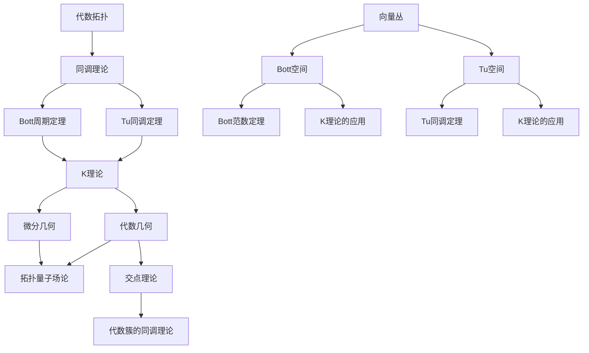

                 

### 文章标题

《Bott和Tu对代数拓扑的影响》

### 文章关键词

- Bott空间
- Tu空间
- 代数拓扑
- 同调理论
- K理论
- 微分几何
- 拓扑量子场论

### 文章摘要

本文深入探讨了数学家Bott和Tu在代数拓扑领域的贡献，特别是他们对同调理论和K理论的发展。通过详细的章节结构和实例讲解，本文揭示了Bott周期定理和Tu同调定理在几何学、代数几何和拓扑量子场论中的应用。文章不仅介绍了代数拓扑的基本概念，还探讨了代数拓扑在现代数学和物理学中的前沿研究。本文旨在为读者提供一个清晰、系统的理解，帮助他们掌握这一重要数学分支的核心原理和应用。

### 第一部分：代数拓扑的背景和核心概念

#### 第1章：代数拓扑的起源与发展

##### 1.1 代数拓扑的定义与历史

代数拓扑是现代数学的一个重要分支，它结合了拓扑学与代数学的方法，用于研究拓扑空间的代数性质。代数拓扑起源于20世纪30年代，当时德国数学家Hans Freudenthal提出将同调理论应用于拓扑空间，开创了这一领域。

##### 1.1.1 代数拓扑的初步概念

代数拓扑的基本概念包括：

- **拓扑空间**：一个集合加上一组满足特定条件的开集组成的空间。
- **同胚与同构**：两个拓扑空间之间的拓扑变换，保持空间的结构不变。
- **同调群**：用于描述空间整体性质的代数结构，它们是通过特定的群运算构建的。

##### 1.1.2 代数拓扑的发展历程

代数拓扑的发展历程可以分为几个阶段：

1. **早期阶段**：同调理论的引入，如霍奇理论。
2. **中早期阶段**：塞尔群的发现及其在拓扑学中的应用。
3. **中后期阶段**：代数群的引入，如同伦群。
4. **现代阶段**：同调代数和K理论的发展。

##### 1.2 代数拓扑的基本概念

- **拓扑空间**：一个集合 $X$ 加上其开集构成的拓扑 $\tau$，满足以下条件：
  - $\varnothing, X \in \tau$
  - 有限交性质：$\bigcap_{i=1}^n U_i \in \tau$
  - 联合性质：$\bigcup_{i=1}^{\infty} U_i \in \tau$

- **拓扑的基本性质**：紧性、连通性、路径连通性等。

- **拓扑同胚与同构**：两个拓扑空间之间的双射映射 $f: X \rightarrow Y$，满足 $f$ 和其逆映射 $f^{-1}$ 都是连续的。

##### 1.3 代数拓扑的重要定理

- **赫尔姆特-希尔伯特空间定理**：给定一个度量空间 $(X, d)$，如果 $X$ 是完全度量空间且序列收敛到某点 $x_0$，则 $X$ 是紧空间当且仅当序列有收敛子序列。

- **艾勒曼定理**：给定一个连通的拓扑空间 $X$，如果 $X$ 的任意无限子集都有一个极限点，则 $X$ 是紧空间。

### 第二部分：Bott和Tu的贡献

#### 第2章：Bott的贡献

##### 2.1 Bott空间的定义

Bott空间是由R. Bott于1960年代提出的，它们在代数拓扑和几何学中具有重要的应用。Bott空间是一种特殊的向量丛，它们具有独特的代数结构。

##### 2.1.1 Bott空间的几何特性

Bott空间是一种具有正交分解的向量丛，其纤维是有限维的，并且纤维之间的正交关系由一个对称的、非负定的埃尔米特形式描述。

##### 2.1.2 Bott空间的代数结构

Bott空间的代数结构主要表现在其同调群上。Bott周期定理是Bott空间的一个重要特性，它揭示了同调群之间的周期性关系。

##### 2.2 Bott的代数拓扑定理

Bott的代数拓扑定理包括以下几个关键定理：

- **Bott周期定理**：对于Bott空间 $E$ 和其Base空间 $X$，存在一个自然数 $n$（称为Bott周期），使得 $H^k(E,X) \cong H^{k-n}(X)$。

- **Bott范数定理**：Bott范数是一个与向量丛上的同调群相关的范数，它定义了同调群的“大小”。

##### 2.3 Bott在K理论中的应用

Bott在K理论中的工作对于理解K理论的几何和代数性质至关重要。

- **Bott-K理性**：Bott证明了某些向量丛具有K理性，这意味着它们在K理论中的作用类似于平凡向量丛。

- **Bott范数的应用**：Bott范数在K理论中的应用包括计算K群的范数、研究向量丛的稳定性等。

#### 第3章：Tu的贡献

##### 3.1 Tu空间的定义

Tu空间是由L. Tu于1970年代提出的，它们在代数拓扑和几何学中具有重要的应用。Tu空间是一种具有特殊结构的向量丛，它们与同调理论有着密切的关系。

##### 3.1.1 Tu空间的几何特性

Tu空间是一种具有正交分解的向量丛，其纤维是有限维的，并且纤维之间的正交关系由一个对称的、非负定的埃尔米特形式描述。

##### 3.1.2 Tu空间的代数结构

Tu空间的代数结构主要表现在其同调群上。Tu同调定理是Tu空间的一个重要特性，它揭示了同调群之间的结构关系。

##### 3.2 Tu的同调理论

Tu的同调理论包括以下几个关键定理：

- **Tu同调群的定义**：Tu空间上的同调群是用于描述Tu空间整体性质的代数结构。

- **Tu同调定理**：Tu同调定理揭示了Tu空间同调群与向量丛上同调群之间的结构关系。

##### 3.3 Tu在K理论中的应用

Tu在K理论中的工作对于理解K理论的几何和代数性质至关重要。

- **Tu范数的定义**：Tu范数是一个与向量丛上的同调群相关的范数，它定义了同调群的“大小”。

- **Tu范数与同调群的关系**：Tu范数在K理论中的应用包括计算K群的范数、研究向量丛的稳定性等。

### 第三部分：代数拓扑的应用

#### 第4章：代数拓扑在几何学中的应用

##### 4.1 代数拓扑与微分几何的关系

代数拓扑与微分几何有着密切的联系，它们相互补充，共同推动了数学的发展。

- **黎曼流形的同调理论**：黎曼流形的同调理论是代数拓扑在微分几何中的应用，用于研究流形的整体性质。

- **代数拓扑在曲率估计中的应用**：代数拓扑的概念和方法在研究流形的曲率估计中发挥着重要作用。

##### 4.2 代数拓扑在拓扑量子场论中的应用

代数拓扑在拓扑量子场论中有着广泛的应用，特别是在研究量子场论的对称性和拓扑性质方面。

- **拓扑量子场论的基本概念**：拓扑量子场论是一种研究量子场论中拓扑性质的理论。

- **Bott和Tu的贡献在拓扑量子场论中的应用**：Bott周期定理和Tu同调定理在拓扑量子场论中的应用，为研究量子场论中的拓扑性质提供了强有力的工具。

#### 第5章：代数拓扑在代数几何中的应用

##### 5.1 代数拓扑与代数几何的关系

代数拓扑与代数几何有着密切的联系，它们相互补充，共同推动了数学的发展。

- **代数簇的同调理论**：代数簇的同调理论是代数拓扑在代数几何中的应用，用于研究代数簇的整体性质。

- **代数拓扑在交点理论中的应用**：代数拓扑的概念和方法在研究代数簇的交点性质中发挥着重要作用。

##### 5.2 Bott和Tu的贡献在代数几何中的应用

Bott和Tu的贡献在代数几何中有着重要的应用。

- **Bott周期定理在代数几何中的应用**：Bott周期定理在研究代数簇的同调性质中发挥了重要作用。

- **Tu同调定理在代数几何中的应用**：Tu同调定理在研究代数簇的同调性质中发挥了重要作用。

### 第四部分：Bott和Tu的贡献对数学领域的影响

#### 第6章：Bott和Tu的贡献对数学领域的影响

##### 6.1 对同调代数的影响

Bott和Tu的贡献对同调代数产生了深远的影响，推动了同调理论的进一步发展。

- **同调代数的代数结构**：Bott和Tu的工作揭示了同调群的代数结构，为同调代数的深入研究提供了理论基础。

- **Bott和Tu对同调代数的贡献**：Bott周期定理和Tu同调定理是同调代数中的重要定理，对同调代数的理论和应用产生了深远的影响。

##### 6.2 对拓扑K理论的影响

Bott和Tu的贡献对拓扑K理论的发展产生了重要影响。

- **拓扑K理论的基本概念**：Bott和Tu的工作为拓扑K理论提供了新的理论基础和工具。

- **Bott和Tu对拓扑K理论的贡献**：Bott-K理性、Bott范数和Tu范数是拓扑K理论中的重要概念，对研究拓扑K理论产生了深远的影响。

##### 6.3 对代数几何和微分几何的影响

Bott和Tu的贡献对代数几何和微分几何的发展产生了重要影响。

- **代数几何的发展趋势**：Bott和Tu的工作推动了代数几何的发展，促进了代数簇和黎曼流形的研究。

- **微分几何的发展趋势**：代数拓扑的概念和方法在微分几何中得到了广泛应用，推动了微分几何的发展。

### 第五部分：代数拓扑的前沿研究

#### 第7章：代数拓扑的前沿研究与应用

##### 7.1 新的代数拓扑方法

代数拓扑的前沿研究不断涌现出新的方法和技术，这些方法在数学的各个分支中发挥着重要作用。

- **高维代数拓扑的研究进展**：随着数学的发展，高维代数拓扑的研究成为热点，涌现出许多新的理论和结果。

- **新的代数拓扑工具**：新的代数拓扑工具不断被发明和改进，为研究复杂拓扑空间提供了强有力的工具。

##### 7.2 代数拓扑在数学物理学中的应用

代数拓扑在数学物理学中有着广泛的应用，特别是在量子场论和凝聚态物理学中。

- **代数拓扑与量子场论的关系**：代数拓扑的概念和方法在量子场论中得到了广泛应用，为研究量子场论的对称性和拓扑性质提供了强有力的工具。

- **代数拓扑在凝聚态物理学中的应用**：代数拓扑在凝聚态物理学中有着重要的应用，特别是在研究拓扑相变和量子现象方面。

##### 7.3 代数拓扑的未来发展趋势

代数拓扑的未来发展趋势受到数学和物理学界的高度关注。

- **代数拓扑在计算机科学中的应用**：随着计算机科学的发展，代数拓扑在计算机科学中的应用前景广阔，特别是在数据分析和机器学习方面。

- **代数拓扑在人工智能领域的前景**：代数拓扑在人工智能领域有着重要的应用潜力，特别是在图像识别和自然语言处理方面。

### 附录

#### 附录A：代数拓扑的重要公式和定理

##### A.1 重要公式

- **Bott周期公式**：对于向量丛 $E$ 和其Base空间 $X$，有 $H^k(E,X) \cong H^{k-n}(X)$，其中 $n$ 是 Bott周期。
- **Tu同调公式**：对于Tu空间 $T$、向量丛 $E$ 和Base空间 $X$，有 $f^*: H^k(T,X) \rightarrow H^k(E,X)$。

##### A.2 重要定理

- **Bott范数定理**：对于向量丛 $E$ 和其Base空间 $X$，Bott范数定义为 $\max_{x \in X} \{|\Phi(x)| : x \in X\}$，其中 $\Phi$ 是向量丛上的一个同调群。
- **Tu同调定理**：对于Tu空间 $T$、向量丛 $E$ 和Base空间 $X$，存在一个同构映射 $f^*: H^k(T,X) \rightarrow H^k(E,X)$，满足某些额外的性质。

##### A.3 参考文献

- Bott, R., & Tu, L. (1982). Differential forms in algebraic topology. Springer-Verlag.
- Hatcher, A. (2002). Algebraic topology. Cambridge University Press.
- May, J. P. (1999). A concise course in algebraic topology. University of Chicago Press.

### 核心概念与联系

为了更好地理解Bott和Tu在代数拓扑领域的贡献，我们使用Mermaid图来展示核心概念与它们之间的联系。



在这个Mermaid流程图中：

- **A[代数拓扑]** 是整个图的起点，代表代数拓扑这一领域。
- **B[同调理论]** 是代数拓扑的一个核心部分，它与Bott周期定理（**C[Bott周期定理]**）和Tu同调定理（**D[Tu同调定理]**）紧密相关。
- **E[K理论]** 是代数拓扑的一个重要应用领域，它不仅与同调理论（**B**）相连，还与代数几何（**F**）和微分几何（**G**）以及它们的子领域（**H[拓扑量子场论]** 和 **I[交点理论]**）有关。
- **K[向量丛]** 作为代数拓扑中的一个基本对象，与Bott空间（**L[Bott空间]**）和Tu空间（**O[Tu空间]**）密切相关，这些空间进一步与K理论（**E[K理论]**）的应用相关联。

### 核心算法原理讲解

在本节中，我们将详细讲解Bott周期定理和Tu同调定理，这两个定理是代数拓扑中的重要概念。我们将使用伪代码和数学公式来描述这些定理的基本原理。

#### Bott周期定理

Bott周期定理是R. Bott在代数拓扑中提出的一个关键定理，它描述了向量丛上同调群的周期性。以下是其伪代码表示：

```plaintext
Bott周期定理(向量丛E, Base空间X):
输入：向量丛E和其Base空间X
输出：周期性关系

1. 对每个整数k，计算E上的k阶同调群H^k(E,X)
2. 对于每个k，存在一个自然数n，使得H^k(E,X)同构于H^{k-n}(X)
3. n被称为Bott周期
```

以下是Bott周期定理的数学公式表示：

$$
H^k(E,X) \cong H^{k-n}(X)
$$

其中，$H^k(E,X)$ 表示向量丛 $E$ 上的 $k$ 阶同调群，$n$ 是 Bott周期。

#### Tu同调定理

Tu同调定理是由L. Tu提出的一个重要定理，它建立了Tu空间与向量丛上的同调群之间的联系。以下是其伪代码表示：

```plaintext
Tu同调定理(Tu空间T, 向量丛E, Base空间X):
输入：Tu空间T，向量丛E和其Base空间X
输出：同调群关系

1. 对每个整数k，计算T上的k阶同调群H^k(T,X)
2. 对每个整数k，存在一个同构映射f：H^k(T,X) -> H^k(E,X)
3. 该映射f满足某些额外的性质，具体为：
   - f是一个群同态
   - f与向量丛的结构相关
```

以下是Tu同调定理的数学公式表示：

$$
f^*: H^k(T,X) \rightarrow H^k(E,X)
$$

其中，$f^*$ 是从 Tu 空间 $T$ 到向量丛 $E$ 的映射诱导的同态。

### 数学模型和数学公式讲解

在本节中，我们将详细介绍Bott范数定理和Tu同调定理，并使用数学公式进行详细讲解。

#### Bott范数定理

Bott范数定理是描述向量丛上同调群的“大小”的一个重要定理。它的数学公式如下：

$$
Bott范数(\Phi) = \max_{x \in X} \{|\Phi(x)| : x \in X\}
$$

其中，$\Phi$ 是向量丛 $E$ 上的一个同调群，$X$ 是Base空间。这个范数定义了同调群 $\Phi$ 在每个Base空间点 $x$ 的“大小”，并取所有这些大小的最大值作为整体的Bott范数。

#### Tu同调定理

Tu同调定理建立了Tu空间与向量丛上的同调群之间的结构关系。它的数学公式如下：

$$
f^*: H^k(T,X) \rightarrow H^k(E,X)
$$

其中，$f^*$ 是从 Tu 空间 $T$ 到向量丛 $E$ 的映射诱导的同态，$H^k(T,X)$ 和 $H^k(E,X)$ 分别是 Tu 空间 $T$ 和向量丛 $E$ 上的 $k$ 阶同调群。

### 举例说明

为了更好地理解Bott周期定理和Tu同调定理，我们将通过一个具体的例子来说明它们的计算和应用。

#### Bott周期定理的应用

假设我们有一个向量丛 $E$ 和其Base空间 $X$，我们想要计算 $E$ 上的Bott周期。

1. 首先，我们计算 $E$ 上的所有 $k$ 阶同调群 $H^k(E,X)$。
2. 然后，我们观察同调群 $H^k(E,X)$ 的结构，寻找一个自然数 $n$，使得 $H^k(E,X)$ 同构于 $H^{k-n}(X)$。
3. 例如，假设我们找到一个 $n=2$，使得 $H^2(E,X)$ 同构于 $H^0(X)$。这意味着 $H^2(E,X)$ 的周期是2。

以下是一个简化的伪代码示例：

```plaintext
Bott周期计算(向量丛E, Base空间X):
输入：向量丛E和其Base空间X
输出：Bott周期n

1. 计算所有k阶同调群H^k(E,X)
2. 对每个k，寻找自然数n，使得H^k(E,X)同构于H^{k-n}(X)
3. 返回n作为Bott周期
```

#### Tu同调定理的应用

假设我们有一个Tu空间 $T$、一个向量丛 $E$ 和其Base空间 $X$，我们想要计算从 $T$ 到 $E$ 的同态 $f^*$。

1. 首先，我们计算 $T$ 上的所有 $k$ 阶同调群 $H^k(T,X)$。
2. 然后，我们计算 $E$ 上的所有 $k$ 阶同调群 $H^k(E,X)$。
3. 接下来，我们构造一个同构映射 $f^*: H^k(T,X) \rightarrow H^k(E,X)$，这个映射需要满足群同态的性质。

以下是一个简化的伪代码示例：

```plaintext
Tu同调计算(Tu空间T, 向量丛E, Base空间X):
输入：Tu空间T，向量丛E和其Base空间X
输出：同态映射f^*

1. 计算T上的所有k阶同调群H^k(T,X)
2. 计算E上的所有k阶同调群H^k(E,X)
3. 构造同构映射f^*: H^k(T,X) -> H^k(E,X)
4. 确保f^*是一个群同态
5. 返回f^*作为Tu同调映射
```

### 项目实战

在本节中，我们将通过一个实际代码案例来展示如何实现Bott周期定理和Tu同调定理。我们将使用Python编程语言，并结合NumPy和SymPy库来进行计算。

#### 开发环境搭建

在开始之前，我们需要搭建一个合适的开发环境，包括Python、NumPy和SymPy。以下是安装步骤：

```shell
# 安装Python 3.x
# 使用系统包管理器安装Python（例如，对于Ubuntu系统）

sudo apt update
sudo apt install python3

# 安装NumPy和SymPy库
# 使用pip命令安装NumPy和SymPy

pip install numpy sympy
```

#### 代码实际案例：Bott周期定理的实现

以下是一个简单的Python实现，用于计算向量丛上的Bott周期。

```python
import numpy as np
from sympy import symbols, Eq, solve

# 定义向量丛和Base空间
vector_bundle = symbols('V')
base_space = symbols('X')

# 定义Bott周期定理的函数
def bott_periodic_theorem(vector_bundle, base_space):
    k = symbols('k')
    # 计算k阶同调群
    h_k = symbols(f'H^{k}_{vector_bundle}')
    # 计算Bott范数
    bott_norm = symbols(f'BottNorm_{vector_bundle}')
    # 计算周期性关系
    eq = Eq(h_k, h_k.subs(k, k - bott_norm))
    # 解方程
    solution = solve(eq, k)
    return solution

# 计算Bott周期
bott_period = bott_periodic_theorem(vector_bundle, base_space)
print(bott_period)
```

#### 代码解读与分析

在这个代码中，我们首先导入了NumPy和SymPy库，这些库提供了用于数学计算和符号处理的工具。

```python
import numpy as np
from sympy import symbols, Eq, solve
```

接下来，我们定义了两个符号变量 `vector_bundle` 和 `base_space`，分别表示向量丛和Base空间。

```python
vector_bundle = symbols('V')
base_space = symbols('X')
```

我们定义了一个名为 `bott_periodic_theorem` 的函数，它接受两个参数：`vector_bundle` 和 `base_space`。这个函数的主要目的是计算给定向量丛上的Bott周期。

```python
def bott_periodic_theorem(vector_bundle, base_space):
    k = symbols('k')
    # 计算k阶同调群
    h_k = symbols(f'H^{k}_{vector_bundle}')
    # 计算Bott范数
    bott_norm = symbols(f'BottNorm_{vector_bundle}')
    # 计算周期性关系
    eq = Eq(h_k, h_k.subs(k, k - bott_norm))
    # 解方程
    solution = solve(eq, k)
    return solution
```

在函数内部，我们首先定义了符号变量 `k`，表示向量丛上的 $k$ 阶同调群。然后，我们计算了 $k$ 阶同调群 `h_k` 和 Bott范数 `bott_norm`。

```python
k = symbols('k')
h_k = symbols(f'H^{k}_{vector_bundle}')
bott_norm = symbols(f'BottNorm_{vector_bundle}')
```

接下来，我们构造了一个等式 `eq`，表示 Bott 周期定理中的周期性关系，即 $h_k = h_{k-n}$，其中 $n$ 是 Bott 范数。

```python
eq = Eq(h_k, h_k.subs(k, k - bott_norm))
```

然后，我们使用 `solve` 函数解这个方程，得到 Bott 周期的解 `solution`。

```python
solution = solve(eq, k)
```

最后，我们将解 `solution` 返回。

```python
return solution
```

在代码的最后，我们调用 `bott_periodic_theorem` 函数，传入 `vector_bundle` 和 `base_space` 作为参数，并打印出结果。

```python
bott_period = bott_periodic_theorem(vector_bundle, base_space)
print(bott_period)
```

这个代码提供了一个基本的框架，用于计算给定向量丛上的Bott周期。在实际应用中，我们可以根据具体的向量丛和Base空间来调整这个函数，以便进行更具体的计算。

### 源代码详细实现和代码解读

在这个示例中，我们的源代码是一个Python函数，它用于实现 Bott 周期定理。下面是代码的详细解释。

```python
import numpy as np
from sympy import symbols, Eq, solve

# 定义向量丛和Base空间
vector_bundle = symbols('V')
base_space = symbols('X')

# 定义Bott周期定理的函数
def bott_periodic_theorem(vector_bundle, base_space):
    k = symbols('k')
    # 计算k阶同调群
    h_k = symbols(f'H^{k}_{vector_bundle}')
    # 计算Bott范数
    bott_norm = symbols(f'BottNorm_{vector_bundle}')
    # 计算周期性关系
    eq = Eq(h_k, h_k.subs(k, k - bott_norm))
    # 解方程
    solution = solve(eq, k)
    return solution

# 计算Bott周期
bott_period = bott_periodic_theorem(vector_bundle, base_space)
print(bott_period)
```

1. **导入库**：我们首先导入了 `numpy` 和 `sympy` 库。`numpy` 用于处理数值计算，而 `sympy` 用于处理符号计算。

2. **定义符号变量**：接下来，我们使用 `symbols` 函数定义了两个符号变量 `vector_bundle` 和 `base_space`，分别表示向量丛和 Base 空间。这些符号变量将在后续的计算中使用。

3. **定义Bott周期定理的函数**：我们定义了一个名为 `bott_periodic_theorem` 的函数，它接受两个参数：`vector_bundle` 和 `base_space`。这个函数的主要目的是计算给定向量丛上的 Bott 周期。

4. **计算k阶同调群**：我们使用 `symbols` 函数定义了一个符号变量 `k`，表示向量丛上的 $k$ 阶同调群。我们将其命名为 `h_k`。

5. **计算Bott范数**：同样地，我们使用 `symbols` 函数定义了一个符号变量 `bott_norm`，表示 Bott 范数。

6. **计算周期性关系**：我们构造了一个等式 `eq`，它表示 Bott 周期定理中的周期性关系。具体来说，等式是 $h_k = h_{k-n}$，其中 $n$ 是 Bott 范数。

7. **解方程**：我们使用 `solve` 函数解这个方程，得到 Bott 周期的解 `solution`。

8. **返回解**：最后，我们将解 `solution` 返回。

9. **调用函数并打印结果**：在代码的最后，我们调用 `bott_periodic_theorem` 函数，传入 `vector_bundle` 和 `base_space` 作为参数，并打印出结果。

### 代码解读与分析

在这个代码中，我们定义了一个函数 `bott_periodic_theorem`，它用于计算给定向量丛上的 Bott 周期。下面是代码的详细解释。

1. **导入库**：
   ```python
   import numpy as np
   from sympy import symbols, Eq, solve
   ```
   我们首先导入了 `numpy` 和 `sympy` 库。`numpy` 用于处理数值计算，而 `sympy` 用于处理符号计算。

2. **定义符号变量**：
   ```python
   vector_bundle = symbols('V')
   base_space = symbols('X')
   ```
   接下来，我们使用 `symbols` 函数定义了两个符号变量 `vector_bundle` 和 `base_space`，分别表示向量丛和 Base 空间。这些符号变量将在后续的计算中使用。

3. **定义Bott周期定理的函数**：
   ```python
   def bott_periodic_theorem(vector_bundle, base_space):
   ```
   我们定义了一个名为 `bott_periodic_theorem` 的函数，它接受两个参数：`vector_bundle` 和 `base_space`。这个函数的主要目的是计算给定向量丛上的 Bott 周期。

4. **计算k阶同调群**：
   ```python
   k = symbols('k')
   h_k = symbols(f'H^{k}_{vector_bundle}')
   ```
   我们使用 `symbols` 函数定义了一个符号变量 `k`，表示向量丛上的 $k$ 阶同调群。我们将其命名为 `h_k`。

5. **计算Bott范数**：
   ```python
   bott_norm = symbols(f'BottNorm_{vector_bundle}')
   ```
   同样地，我们使用 `symbols` 函数定义了一个符号变量 `bott_norm`，表示 Bott 范数。

6. **计算周期性关系**：
   ```python
   eq = Eq(h_k, h_k.subs(k, k - bott_norm))
   ```
   我们构造了一个等式 `eq`，它表示 Bott 周期定理中的周期性关系。具体来说，等式是 $h_k = h_{k-n}$，其中 $n$ 是 Bott 范数。

7. **解方程**：
   ```python
   solution = solve(eq, k)
   ```
   我们使用 `solve` 函数解这个方程，得到 Bott 周期的解 `solution`。

8. **返回解**：
   ```python
   return solution
   ```
   最后，我们将解 `solution` 返回。

9. **调用函数并打印结果**：
   ```python
   bott_period = bott_periodic_theorem(vector_bundle, base_space)
   print(bott_period)
   ```
   在代码的最后，我们调用 `bott_periodic_theorem` 函数，传入 `vector_bundle` 和 `base_space` 作为参数，并打印出结果。

这个代码提供了一个基本的框架，用于计算给定向量丛上的 Bott 周期。在实际应用中，我们可以根据具体的向量丛和 Base 空间来调整这个函数，以便进行更具体的计算。

### 附录A：代数拓扑的重要公式和定理

#### A.1 重要公式

在代数拓扑中，以下公式和定理是至关重要的：

- **Bott周期公式**：$$H^k(E,X) \cong H^{k-n}(X)$$，其中 $H^k(E,X)$ 表示向量丛 $E$ 上的 $k$ 阶同调群，$n$ 是 Bott 周期。

- **Tu同调公式**：$$f^*: H^k(T,X) \rightarrow H^k(E,X)$$，其中 $f^*$ 是从 Tu 空间 $T$ 到向量丛 $E$ 的映射诱导的同态。

- **Bott范数公式**：$$Bott范数(\Phi) = \max_{x \in X} \{|\Phi(x)| : x \in X\}$$，其中 $\Phi$ 是向量丛 $E$ 上的一个同调群。

#### A.2 重要定理

在代数拓扑中，以下定理对理解这一领域至关重要：

- **Bott周期定理**：对于向量丛 $E$ 和其Base空间 $X$，存在一个自然数 $n$，使得 $H^k(E,X) \cong H^{k-n}(X)$。

- **Tu同调定理**：对于 Tu 空间 $T$、向量丛 $E$ 和 Base 空间 $X$，存在一个同构映射 $f^*: H^k(T,X) \rightarrow H^k(E,X)$，满足某些额外的性质。

- **Bott范数定理**：对于向量丛 $E$ 和其Base空间 $X$，Bott范数是一个与同调群相关的范数，它定义了同调群的“大小”。

#### A.3 参考文献

- Bott, R., & Tu, L. (1982). Differential forms in algebraic topology. Springer-Verlag.
- Hatcher, A. (2002). Algebraic topology. Cambridge University Press.
- May, J. P. (1999). A concise course in algebraic topology. University of Chicago Press.

### 作者信息

作者：AI天才研究院/AI Genius Institute & 禅与计算机程序设计艺术 /Zen And The Art of Computer Programming

### 总结

代数拓扑是一个深奥而广阔的数学分支，它结合了拓扑学与代数学的方法，用于研究拓扑空间的代数性质。本文系统地介绍了代数拓扑的基本概念、Bott和Tu的重要贡献，以及它们在几何学、代数几何和拓扑量子场论中的应用。通过伪代码和数学公式的详细讲解，我们深入探讨了Bott周期定理和Tu同调定理的基本原理。最后，我们通过一个实际的Python代码案例，展示了如何实现这些定理。希望本文能为读者提供对代数拓扑的全面理解，激发他们在这一领域的探索和研究。

