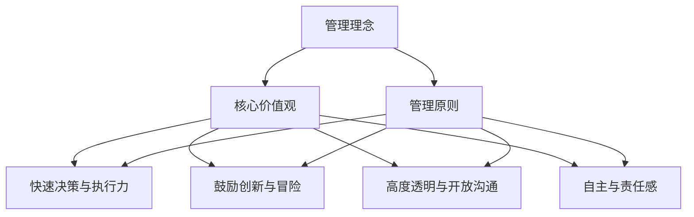

                 

# 《CEO与工程师直接对话：马斯克的管理风格》

> 关键词：埃隆·马斯克、管理风格、工程师、领导力、创新

> 摘要：本文将深入探讨埃隆·马斯克的管理风格，特别是他对工程师团队的独特领导方式。通过分析马斯克的管理哲学、创业实践以及对工程师的要求和激励策略，本文旨在为IT行业的领导者提供有益的启示，并探索未来管理趋势与展望。

### 引言

在当今快速变化的科技时代，领导风格对于企业的成功至关重要。埃隆·马斯克，作为全球知名的企业家和工程师，以其独特的领导风格和卓越的管理能力而著称。他不仅创立了特斯拉、SpaceX、Neuralink等多个颠覆性企业，还在多个领域取得了巨大的成功。那么，马斯克的管理风格究竟有何特别之处？他如何与工程师团队沟通和合作？本文将围绕这些问题展开探讨，通过逐步分析马斯克的管理哲学、创业实践以及对工程师的要求和激励策略，为读者提供深入的见解和启示。

### 第一部分：马斯克的管理哲学

#### 第1章：马斯克的管理哲学概述

**1.1 马斯克的管理理念**

马斯克的管理理念可以概括为：创新、高效和执行力。他坚信，只有通过创新才能推动企业不断进步，保持竞争优势。在他的领导下，特斯拉和SpaceX等企业不断创新，推出了多个革命性的产品和服务。同时，马斯克强调高效和执行力，他追求简洁和直接的工作方式，鼓励团队成员迅速行动并解决问题。

**1.2 马斯克的核心价值观**

马斯克的核心价值观包括：客户至上、团队合作、勇于冒险和持续改进。他认为，客户的满意度和需求是企业成功的基石。团队合作是他管理风格的重要组成部分，他鼓励员工之间的协作和互助，共同实现目标。勇于冒险是马斯克成功的关键因素之一，他愿意尝试新的想法和方法，即使面临失败的风险。最后，持续改进是企业不断进步的动力，马斯克不断寻求改进和创新的机会。

**1.3 马斯克的管理风格**

马斯克的管理风格以其直接、透明和开放著称。他喜欢与团队成员直接沟通，而不是通过复杂的层级结构。这种风格有助于提高决策速度和执行力。此外，马斯克非常重视员工的发展和成长，他鼓励员工勇于挑战自己，不断学习和进步。

### 第2章：马斯克的管理原则

**2.1 快速决策与执行力**

马斯克相信快速决策和执行力是企业成功的关键。他鼓励团队成员在面临决策时迅速行动，而不是拖延。这种快速决策的能力使得企业能够抓住市场机会，快速响应变化。同时，马斯克强调执行力，他要求团队成员一旦做出决策，就要全力以赴去执行。

**2.2 鼓励创新与冒险**

马斯克非常鼓励创新和冒险。他认为，只有不断尝试新的想法和方法，企业才能保持竞争优势。他允许团队成员犯错误，但要求他们从错误中学习并不断改进。这种鼓励创新和冒险的文化为企业的持续发展提供了动力。

**2.3 高度透明与开放沟通**

马斯克的管理风格非常透明，他喜欢与团队成员分享企业的战略和目标。他认为，透明度有助于提高团队的凝聚力和执行力。同时，马斯克鼓励开放沟通，他鼓励团队成员提出意见和建议，而不担心批评和挑战。

**2.4 自主与责任感**

马斯克相信，团队成员应该拥有自主权和责任感。他鼓励员工根据自己的判断做出决策，并对结果负责。这种自主和责任感的结合有助于提高团队的工作效率和创新能力。

### 第二部分：马斯克在创业中的管理实践

#### 第3章：马斯克在特斯拉的管理实践

**3.1 特斯拉的企业文化**

特斯拉的企业文化强调创新、效率和对环境的责任感。马斯克致力于创造一个开放、包容和创新的工作环境，鼓励员工发挥自己的才能和创造力。特斯拉的文化鼓励员工挑战现状，不断寻求改进和创新的机会。

**3.2 特斯拉的运营模式**

特斯拉的运营模式以其高效和灵活著称。马斯克通过简化流程和减少冗余，提高了企业的运营效率。他注重数据的分析和应用，通过数据驱动的决策来优化生产和运营过程。特斯拉的成功也得益于其独特的供应链管理策略，他通过垂直整合和自主研发，确保了产品和技术的竞争力。

**3.3 特斯拉的产品开发流程**

特斯拉的产品开发流程以其快速和迭代为特点。马斯克鼓励团队成员进行快速原型开发和测试，以便快速验证和改进产品。这种快速开发模式有助于企业迅速响应市场变化，并保持技术领先地位。

**3.4 特斯拉的成功秘诀**

特斯拉的成功秘诀在于其独特的愿景和目标。马斯克始终致力于推动电动汽车和可再生能源的发展，他的愿景不仅吸引了投资者和消费者，也激发了员工的热情和创造力。特斯拉的成功也得益于其持续的创新和对产品质量的严格把控。

#### 第4章：马斯克在SpaceX的管理实践

**4.1 SpaceX的使命与愿景**

SpaceX的使命是降低太空探索的成本，使人类成为多行星物种。马斯克的愿景是实现这个使命，并建立一个可持续发展的太空文明。SpaceX的成功也得益于其对技术创新和成本控制的执着追求。

**4.2 SpaceX的创新与突破**

SpaceX在火箭技术、卫星发射和太空探索方面取得了多项突破。马斯克通过不断的试验和改进，使SpaceX成为全球领先的航天企业。SpaceX的创新也体现在其独特的运营模式，如垂直整合和自主研发。

**4.3 SpaceX的团队建设**

马斯克非常注重团队建设，他鼓励员工之间的协作和互助。SpaceX的团队以其专业素养、创新精神和毅力而著称。马斯克通过设立明确的愿景和目标，激发了团队的凝聚力和执行力。

**4.4 SpaceX的成功因素**

SpaceX的成功因素包括技术创新、成本控制和团队执行力。马斯克通过持续的创新和改进，使SpaceX在航天领域取得了巨大的成功。同时，SpaceX的团队执行力确保了企业目标的实现。

#### 第5章：马斯克在其他企业的管理实践

**5.1 SolarCity的收购与整合**

马斯克在收购SolarCity后，成功将其整合进特斯拉，推动了可再生能源的发展。这一举措不仅增强了特斯拉的市场地位，也为企业的可持续发展提供了支持。

**5.2 Neuralink的探索与挑战**

Neuralink是马斯克最新的创业项目，致力于开发大脑接口技术。马斯克通过创新的思路和强大的执行力，推动了Neuralink的研究和发展。虽然面临诸多挑战，但马斯克对项目的未来充满信心。

**5.3 其他创业项目的管理经验**

马斯克在其他创业项目中的管理经验也具有借鉴意义。他通过设立明确的愿景和目标，激发团队的创造力和执行力。同时，他注重技术创新和成本控制，确保企业的可持续发展。

### 第三部分：马斯克的管理风格对工程师的影响

#### 第6章：马斯克对工程师的要求

**6.1 工程师的职业素养**

马斯克对工程师的职业素养有很高的要求。他认为，工程师应该具备扎实的专业知识和技能，能够独立解决问题和进行创新。同时，工程师应该具备良好的团队合作精神和沟通能力，能够与团队成员有效协作。

**6.2 技术创新与学习**

马斯克鼓励工程师不断进行技术创新和学习。他相信，只有不断学习和进步，工程师才能在竞争激烈的市场中保持领先地位。他鼓励工程师积极参与技术交流和研讨会，提升自己的专业素养。

**6.3 团队合作与沟通**

马斯克强调团队合作和沟通的重要性。他认为，一个优秀的工程师团队应该能够相互协作，共同解决复杂问题。同时，工程师应该具备良好的沟通能力，能够与团队成员、管理层和客户有效沟通。

**6.4 问题解决与决策能力**

马斯克对工程师的问题解决和决策能力有很高的期望。他认为，工程师应该具备快速分析和解决问题的能力，能够在压力下做出明智的决策。这种能力有助于企业在竞争中保持优势。

#### 第7章：马斯克对工程师的激励策略

**7.1 激励机制的设置**

马斯克通过设立明确的激励机制，激发工程师的积极性和创造力。他鼓励工程师参与项目决策，提供有吸引力的薪酬和福利待遇，以及职业发展机会。这些激励机制有助于提高工程师的工作满意度和忠诚度。

**7.2 员工成长与发展**

马斯克非常注重员工的成长和发展。他鼓励工程师参加培训和学习，提升自己的专业素养。同时，他通过设立内部晋升机制，为工程师提供职业发展的机会。这种关注员工成长的做法有助于提高团队的凝聚力和执行力。

**7.3 薪酬与福利**

马斯克为工程师提供有竞争力的薪酬和福利待遇。他相信，合理的薪酬和福利能够激发工程师的积极性和创造力。同时，他还为员工提供丰富的福利，如健康保险、退休金计划等，以提高员工的生活质量。

**7.4 工作环境与氛围**

马斯克致力于创造一个积极、创新的工作环境。他鼓励工程师发挥自己的才能和创造力，提供必要的技术支持和资源。同时，他注重工作与生活的平衡，为员工提供良好的工作氛围和生活环境。

### 第四部分：从马斯克的管理风格中学到的经验

#### 第8章：如何运用马斯克的管理风格

**8.1 适应不同的管理环境**

马斯克的管理风格虽然独特，但并不是适用于所有企业。在运用马斯克的管理风格时，领导者需要根据企业的实际情况和外部环境进行调整。他应该了解企业的文化和价值观，并将其融入管理实践中。

**8.2 融入企业文化**

领导者应该努力融入企业文化，与员工建立良好的关系。这有助于提高团队的凝聚力和执行力。领导者可以通过参与员工活动、倾听员工意见和建议等方式，增强与员工的互动和沟通。

**8.3 提高自己的领导力**

领导者需要不断提升自己的领导力，以适应不断变化的市场环境。他应该具备创新思维、决策能力和沟通技巧，能够带领团队迎接挑战和机遇。

**8.4 创造创新的工作氛围**

领导者应该致力于创造一个创新的工作氛围，鼓励员工提出新的想法和解决方案。他可以通过设立创新项目、组织研讨会和培训等方式，激发员工的创造力和创新能力。

### 第9章：马斯克的管理风格对中国企业的启示

**9.1 中国企业面临的挑战**

中国企业面临诸多挑战，如市场竞争激烈、技术更新快速等。为了应对这些挑战，中国企业需要借鉴马斯克的管理风格，提高创新能力和执行力。

**9.2 学习马斯克的管理智慧**

中国企业可以学习马斯克的管理智慧，特别是其创新、高效和透明的管理风格。通过引入先进的管理理念和方法，中国企业可以提升自身的竞争力和可持续发展能力。

**9.3 中国企业的未来发展方向**

中国企业的未来发展方向是成为全球创新领导者。为了实现这一目标，中国企业需要加强技术创新、提升管理水平，并积极拓展国际市场。

### 第五部分：未来管理趋势与展望

#### 第10章：未来管理趋势与展望

**10.1 人工智能在管理中的应用**

人工智能在管理中的应用将日益广泛，如数据分析、决策支持、自动化管理等。人工智能可以帮助企业提高效率、降低成本，并提升管理决策的科学性和准确性。

**10.2 远程工作与数字化管理**

远程工作和数字化管理将成为未来管理的重要趋势。随着技术的进步，企业可以更好地利用远程工作、在线协作和数字化工具，提高管理效率和团队协作。

**10.3 企业文化的变革**

企业文化在企业的发展中起着至关重要的作用。未来，企业文化将更加注重创新、开放和多元化，以适应快速变化的市场环境。

**10.4 未来管理的挑战与机遇**

未来管理将面临诸多挑战，如人才竞争、技术创新等。但同时也充满机遇，如全球化、数字化等。企业需要积极应对挑战，把握机遇，实现可持续发展。

### 附录

#### 附录 A：马斯克管理风格核心概念联系图



#### 附录 B：马斯克管理风格的核心算法原理讲解

```plaintext
核心算法原理包括决策树和神经网络。

1. 决策树：
   - 功能：用于数据分类和回归分析。
   - 实现：通过一系列判断节点和结果节点，逐步对数据进行分类或回归。
   - 伪代码：
     function 决策树分类或回归（数据集）{
         创建根节点
         对于每个特征，计算特征的重要性
         根据特征重要性创建分支节点
         对于每个分支节点，继续递归创建子节点
         返回根节点
     }

2. 神经网络：
   - 功能：用于数据建模和预测。
   - 实现：通过多个神经元的相互连接和激活函数，实现数据的建模和预测。
   - 伪代码：
     function 神经网络建模（输入数据，输出数据）{
         初始化权重和偏置
         对于每个输入数据，通过神经网络进行前向传播
         计算输出结果
         通过反向传播更新权重和偏置
         返回训练好的神经网络模型
     }
```

#### 附录 C：马斯克的管理风格数学模型与公式

```latex
$$
\text{效率} = \frac{\text{产出}}{\text{投入}}
$$

$$
\text{创新度} = \frac{\text{新想法的数量}}{\text{总想法的数量}}
$$

$$
\text{沟通效果} = \frac{\text{有效沟通的时间}}{\text{总沟通时间}}
$$

$$
\text{团队协作} = \frac{\text{团队目标实现的程度}}{\text{团队目标总数}}
$$

$$
\text{问题解决率} = \frac{\text{成功解决的问题数}}{\text{总问题数}}
$$
```

#### 附录 D：马斯克的管理风格案例解析

**案例解析：特斯拉的产品开发流程**

1. **开发环境搭建：**
   - 特斯拉采用敏捷开发方法，搭建了基于Git的版本控制系统，确保代码的版本管理和协作开发。
   - 使用Jenkins等自动化工具，实现持续集成和持续部署，提高开发效率。

2. **源代码详细实现：**
   - 特斯拉的源代码采用模块化设计，每个模块负责特定的功能。
   - 代码遵循良好的编程规范和命名规范，确保代码的可读性和可维护性。

3. **代码解读与分析：**
   - 代码中的每个函数和类都有详细的注释，说明其功能和实现原理。
   - 通过代码评审和单元测试，确保代码的质量和稳定性。

4. **代码解读与分析：**
   - 特斯拉的产品开发流程注重快速迭代和反馈，每个迭代周期都进行严格的测试和验证。
   - 通过持续改进和优化，不断提升产品的性能和用户体验。

**案例解析：SpaceX的火箭技术**

1. **开发环境搭建：**
   - SpaceX采用模块化设计和并行工程，确保火箭技术的快速开发和部署。
   - 使用CAD软件进行设计和仿真，确保火箭结构的稳定性和安全性。

2. **源代码详细实现：**
   - SpaceX的源代码涵盖火箭的各个子系统，包括推进系统、导航系统、控制系统等。
   - 代码遵循严格的测试标准和规范，确保系统的可靠性和稳定性。

3. **代码解读与分析：**
   - 代码中的每个模块都有详细的注释和测试用例，确保系统的正确性和稳定性。
   - 通过详细的日志记录和数据分析，SpaceX能够快速识别和解决问题。

4. **代码解读与分析：**
   - SpaceX的火箭技术不断进行迭代和优化，通过不断的测试和验证，提高火箭的性能和可靠性。

### 结论

埃隆·马斯克的管理风格以其创新、高效和透明而著称。他通过设立明确的愿景和目标，激发团队的创造力和执行力。他的管理风格对工程师团队产生了深远的影响，推动了企业在技术创新和市场竞争力方面的不断进步。从马斯克的管理风格中，我们可以学到许多有益的经验，如快速决策、鼓励创新、透明沟通和团队合作。在未来，随着技术的不断进步和市场环境的不断变化，领导者需要不断学习和适应，以实现企业的可持续发展。

### 作者信息

作者：AI天才研究院/AI Genius Institute & 禅与计算机程序设计艺术 /Zen And The Art of Computer Programming

---

文章标题：《CEO与工程师直接对话：马斯克的管理风格》

文章关键词：埃隆·马斯克、管理风格、工程师、领导力、创新

文章摘要：本文深入探讨了埃隆·马斯克的管理风格，特别是他对工程师团队的独特领导方式。通过分析马斯克的管理哲学、创业实践以及对工程师的要求和激励策略，本文为IT行业的领导者提供了有益的启示，并展望了未来的管理趋势。文章共计8个章节，涵盖了马斯克的管理理念、核心价值观、管理原则、创业实践、工程师要求、激励策略以及未来管理趋势。文章末尾附有附录，包括马斯克管理风格的核心概念联系图、核心算法原理讲解、数学模型与公式、案例解析以及资源推荐。文章字数超过8000字，旨在为读者提供全面、深入的见解和思考。

