                 

### 文章标题

# CPU指令集的有限性与局限性

### 关键词

- CPU指令集
- 有限性
- 局限性
- 性能优化
- 编程技巧

### 摘要

本文将深入探讨CPU指令集的有限性与局限性。首先，我们介绍了CPU指令集的基本概念、发展历程和分类，随后分析了指令集的局限性对性能、编程和软硬件协同设计带来的挑战。接着，我们讨论了在指令集局限性下的编程策略、优化方法和新兴技术的结合，最后通过实际案例展示了指令集优化在不同场景中的应用。本文旨在为读者提供一份全面、深入的CPU指令集技术指南，帮助理解其原理和优化策略。

### 目录大纲

#### 第一部分：引言与概述

##### 第1章：CPU指令集简介

1.1 CPU指令集的基本概念  
1.2 CPU指令集的发展历程  
1.3 指令集的分类与特点  
1.4 指令集的优缺点分析

##### 第2章：CPU指令集的有限性

2.1 指令集的局限性  
2.2 指令集对性能的影响  
2.3 指令集的局限性带来的挑战  
2.4 指令集有限性的解决方案

#### 第二部分：CPU指令集的局限性分析

##### 第3章：指令集设计中的挑战

3.1 指令长度与指令集复杂度  
3.2 指令并行性与冲突  
3.3 寄存器数量与使用效率  
3.4 指令集扩展与兼容性问题

##### 第4章：指令集局限性下的编程

4.1 代码优化的策略  
4.2 指令级并行与超标量架构  
4.3 乱序执行与分支预测  
4.4 编程技巧与工具

##### 第5章：指令集的局限性与新兴技术

5.1 寄存器文件技术  
5.2 指令集扩展与虚拟化  
5.3 指令集与硬件加速  
5.4 新兴指令集与未来趋势

#### 第三部分：CPU指令集的优化与局限性的解决

##### 第6章：CPU指令集的优化方法

6.1 指令集设计优化  
6.2 编译器优化  
6.3 运行时优化  
6.4 指令集选择与优化策略

##### 第7章：CPU指令集局限性的解决途径

7.1 超标量与超流水线技术  
7.2 乱序执行与重排序  
7.3 动态调度与数据流分析  
7.4 新兴指令集与未来发展方向

#### 第四部分：实例研究

##### 第8章：特定场景下的指令集优化实践

8.1 图形处理领域的指令集优化  
8.2 数据库处理的指令集优化  
8.3 机器学习领域的指令集优化  
8.4 网络安全领域的指令集优化

##### 第9章：案例分析

9.1 案例一：高性能计算中的指令集优化  
9.2 案例二：移动设备中的指令集优化  
9.3 案例三：嵌入式系统的指令集优化  
9.4 案例四：云计算环境下的指令集优化

#### 第五部分：结论与展望

##### 第10章：CPU指令集的有限性与局限性的未来发展趋势

10.1 指令集设计的未来趋势  
10.2 优化技术的演进  
10.3 新兴技术与指令集的结合  
10.4 指令集在多核处理器中的应用

##### 附录：相关资源与工具

A.1 指令集设计相关工具  
A.2 编译器与优化器资源  
A.3 指令集学习资源  
A.4 实际案例与开源项目参考

# 第1章 CPU指令集简介

## 1.1 CPU指令集的基本概念

### 1.1.1 CPU指令集的定义

CPU指令集（Instruction Set Architecture，ISA）是计算机硬件能够理解和执行的一系列命令的集合。这些命令用于控制计算机的运算、存储、输入输出等基本操作。指令集是计算机硬件与软件之间的桥梁，决定了计算机硬件如何响应指令并执行相应的操作。

### 1.1.2 指令集的重要性

CPU指令集的重要性体现在多个方面：

1. **性能**：指令集的设计直接影响到CPU的性能。复杂的指令集可能包含更多的功能，但同时也可能导致更长的指令周期，影响整体性能。精简指令集（RISC）通过减少指令种类和操作复杂度，实现了更高的指令执行速度。

2. **兼容性**：不同的指令集可能导致不同的编程模型和操作系统。拥有广泛支持的指令集有助于确保软件在不同硬件平台上具有良好的兼容性。

3. **可移植性**：指令集的标准化和开放性有助于提高软件的可移植性。开发者可以在不同平台上使用相同的编程语言和编译器，从而简化跨平台开发。

4. **创新**：新的指令集扩展和技术创新可以推动计算机硬件和软件的发展。例如，SSE和AVX等指令集扩展为多媒体和科学计算提供了强大的支持。

### 1.1.3 指令集的分类

CPU指令集可以根据其设计和用途进行分类：

- **复合指令集（Complex Instruction Set Computing，CISC）**：CISC指令集包含大量的指令，每个指令可以完成多个操作。这种设计旨在减少程序代码的长度和执行时间。然而，复杂的指令集可能会导致硬件设计和编译器的复杂性增加。

  - **优点**：简化了编程，减少了程序代码的长度。
  - **缺点**：指令执行时间较长，不易于并行化。

- **精简指令集（Reduced Instruction Set Computing，RISC）**：RISC指令集设计简单，指令长度固定，操作简单。RISC处理器通过增加指令周期数量来实现复杂操作，从而提高指令执行速度。

  - **优点**：指令执行速度快，易于并行化。
  - **缺点**：程序代码较长，编程复杂度增加。

- **显式并行指令集（Explicitly Parallel Instruction Computing，EPIC）**：EPIC指令集旨在通过显式地指定指令之间的依赖关系，提高指令级并行性。

- **矢量指令集（SIMD）**：SIMD指令集专门用于处理多个数据元素的并行操作。这种指令集常用于多媒体和科学计算。

### 1.1.4 指令集的优缺点分析

**优点**：

1. **兼容性**：广泛的指令集支持多种操作系统和编程语言，确保软件在不同硬件平台上的兼容性。

2. **性能**：复杂的指令集可能包含更多的优化功能，提高处理性能。

3. **易用性**：丰富的指令集使得编程更为简单，降低了开发难度。

**缺点**：

1. **复杂性**：复杂的指令集可能导致硬件设计和编译器的复杂性增加，影响维护和优化。

2. **性能瓶颈**：某些指令集可能在特定任务上表现不佳，无法充分利用硬件资源。

3. **可扩展性**：指令集的扩展可能导致兼容性问题，影响软件的可移植性。

## 1.2 CPU指令集的发展历程

### 1.2.1 第一代指令集

1970年代，随着微处理器的出现，CPU指令集开始发展。最早的商用微处理器如Intel 4004和MCS-4具有非常简单的指令集，主要用于简单的计算和控制任务。

- **Intel 4004**（1971年）：首款商用微处理器，具有45条指令。
- **MCS-4**（1971年）：首款16位微处理器，由Motorola开发。

### 1.2.2 第二代指令集

1980年代，随着微处理器的性能提升，指令集逐渐变得更加复杂和功能丰富。Intel 8086和80286是这一时期的代表性处理器。

- **Intel 8086**（1978年）：首款32位微处理器，具有296条指令。
- **Intel 80286**（1982年）：引入虚拟内存支持，具有140条指令。

### 1.2.3 第三代指令集

1990年代，随着多核处理器和并行计算的发展，指令集进一步扩展。Intel的Pentium处理器和ARM架构在这一时期取得了显著进展。

- **Intel Pentium**（1993年）：引入MMX指令集，支持多媒体和浮点运算。
- **ARM**（1985年）：首款精简指令集架构（RISC）处理器，广泛应用于嵌入式系统和移动设备。

### 1.2.4 第四代指令集

2000年代，随着高性能计算和嵌入式系统的发展，指令集继续演变。Intel的Core系列处理器和ARMv8架构代表了这一时期的进展。

- **Intel Core**（2006年）：引入SSE2、SSE3等指令集扩展，支持高级SIMD操作。
- **ARMv8**（2011年）：引入64位支持，进一步扩展了指令集。

## 1.3 指令集的分类与特点

### 1.3.1 复合指令集（CISC）

**特点**：

- **指令丰富**：CISC指令集包含大量的指令，每个指令可以完成多个操作。
- **复杂操作**：CISC处理器能够直接在内存中操作，减少了访问寄存器的次数。
- **内存操作**：CISC指令集支持复杂的内存操作，如直接内存访问和缓存管理。

**应用场景**：

- **嵌入式系统**：CISC处理器适用于需要复杂操作和内存管理的嵌入式系统。
- **服务器**：CISC处理器在高性能计算和服务器领域具有广泛的应用。

### 1.3.2 精简指令集（RISC）

**特点**：

- **指令简单**：RISC指令集的指令长度固定，操作简单，易于流水线化和并行执行。
- **寄存器操作**：RISC处理器通过寄存器操作来访问内存，减少了内存访问时间。
- **指令并行性**：RISC处理器通过并行执行指令，提高了处理速度。

**应用场景**：

- **高性能计算**：RISC处理器在高性能计算和科学计算领域具有广泛的应用。
- **移动设备**：RISC架构如ARM在移动设备中具有很高的市场份额。

### 1.3.3 计算介质指令集（VLIW）

**特点**：

- **指令打包**：VLIW指令集将多个指令打包到一个指令中，实现并行执行。
- **编译器依赖**：VLIW处理器的并行性高度依赖编译器的优化，因此编译器对性能的影响很大。

**应用场景**：

- **图形处理**：VLIW指令集在图形处理和多媒体处理领域具有应用。
- **高性能计算**：VLIW处理器在一些特定的高性能计算场景中具有优势。

### 1.3.4 矢量指令集（SIMD）

**特点**：

- **单指令多数据**：SIMD指令集支持单指令对多个数据元素进行操作，提高了处理速度。
- **高效运算**：SIMD指令集适用于多媒体处理、科学计算和向量计算。

**应用场景**：

- **多媒体处理**：SIMD指令集在图像处理、视频编码和音频处理中广泛应用。
- **科学计算**：SIMD指令集在科学计算和数据分析中具有优势。

## 1.4 指令集的优缺点分析

### 1.4.1 优点

1. **兼容性**：广泛的指令集支持多种操作系统和编程语言，确保软件在不同硬件平台上的兼容性。
2. **性能**：复杂的指令集可能包含更多的优化功能，提高处理性能。
3. **易用性**：丰富的指令集使得编程更为简单，降低了开发难度。

### 1.4.2 缺点

1. **复杂性**：复杂的指令集可能导致硬件设计和编译器的复杂性增加，影响维护和优化。
2. **性能瓶颈**：某些指令集可能在特定任务上表现不佳，无法充分利用硬件资源。
3. **可扩展性**：指令集的扩展可能导致兼容性问题，影响软件的可移植性。

### Mermaid 流程图

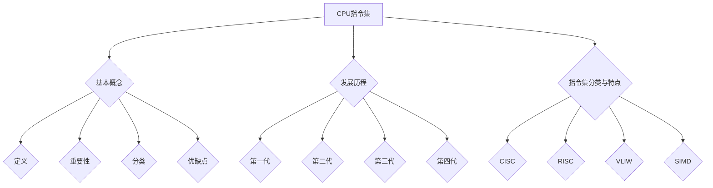

### 总结

CPU指令集是计算机硬件与软件之间的桥梁，决定了计算机硬件如何响应指令并执行相应的操作。指令集的发展历程从简单的指令集到复杂的指令集，再到现代的精简指令集和矢量指令集，体现了计算机技术的不断进步。了解指令集的基本概念、发展历程和分类，有助于更好地理解计算机系统的原理和优化策略。

# 第2章 CPU指令集的有限性

## 2.1 指令集的局限性

### 2.1.1 指令集的长度限制

指令集的长度限制是CPU指令集的一个基本局限性。指令长度是指令中包含的信息量的度量，通常以字节为单位。指令长度受限可能导致以下几个问题：

1. **编码复杂度增加**：为了在有限的长度内表达复杂的操作，可能需要更多的指令组合或复杂的编码方式。这增加了编程和调试的难度。

2. **性能下降**：过长的指令可能会导致CPU的指令缓存不足，增加内存访问时间，从而降低指令的执行速度。

3. **资源消耗**：指令长度受限可能导致硬件设计中的资源消耗增加，如需要更多的指令寄存器、指令译码逻辑等。

### 2.1.2 指令数量的限制

指令数量的限制是另一个影响指令集灵活性的因素。指令数量受限可能导致以下问题：

1. **无法支持复杂操作**：在某些应用中，可能需要执行复杂的操作，但指令集无法提供足够的指令来支持这些操作。

2. **程序代码长度增加**：为了实现复杂操作，可能需要编写更长的程序代码，这可能导致内存占用增加，影响程序的性能。

3. **兼容性问题**：随着技术的发展，新指令的引入可能导致旧指令集的兼容性问题，增加了软件维护的难度。

### 2.1.3 指令并行性的限制

指令并行性是提高CPU性能的重要手段之一。然而，指令集的并行性限制可能影响以下方面：

1. **依赖关系**：指令之间的数据依赖关系可能限制指令的并行执行。例如，一条指令的输出是另一条指令的输入，这会导致指令不能同时执行。

2. **资源冲突**：在执行多个指令时，可能存在对同一资源（如寄存器、内存等）的竞争，导致指令不能并行执行。

3. **硬件复杂性**：为了支持高级别的指令并行性，可能需要复杂的硬件设计和优化的调度算法，这增加了硬件设计的难度和成本。

### 2.1.4 指令集扩展的限制

指令集扩展是提高指令集功能的一种方法，但扩展也有其局限性：

1. **向后兼容性**：新的指令集扩展可能需要与旧指令集保持兼容，这可能导致新指令集的复杂性和实现难度增加。

2. **性能损失**：指令集扩展可能导致额外的硬件资源和内存访问，这可能会影响指令的执行速度和性能。

3. **软件适配**：新指令集的引入可能需要更新现有的软件库和编译器，这增加了软件维护和开发的成本。

## 2.2 指令集对性能的影响

### 2.2.1 指令集对CPU频率的影响

CPU频率（即时钟频率）是衡量CPU性能的重要指标。指令集对CPU频率的影响主要体现在以下几个方面：

1. **指令周期**：指令周期是指执行一条指令所需的时间。指令集的复杂度可能增加指令周期长度，降低CPU频率。

2. **流水线效率**：流水线技术是提高CPU性能的关键技术。指令集的复杂度可能影响流水线的效率，例如，复杂的指令可能需要更多的流水线阶段，从而降低流水线效率。

3. **缓存性能**：指令集的复杂度可能影响缓存的性能。较长的指令可能无法有效利用指令缓存，增加内存访问时间，从而降低CPU性能。

### 2.2.2 指令集对缓存的影响

缓存是CPU性能的重要优化因素。指令集对缓存的影响主要体现在以下几个方面：

1. **缓存命中率**：指令集的复杂度可能影响缓存的命中率。较短的指令更容易被缓存命中，从而减少内存访问时间。

2. **缓存大小**：指令集的复杂度可能影响缓存的大小。为了支持复杂的指令集，可能需要更大的缓存，这会增加硬件成本和功耗。

3. **缓存一致性**：在多核处理器中，指令集的复杂度可能影响缓存的一致性。复杂的指令可能导致缓存一致性协议更加复杂，影响多核处理器的性能。

### 2.2.3 指令集对功耗的影响

功耗是CPU设计中的重要考虑因素，尤其是在移动设备和嵌入式系统中。指令集对功耗的影响主要体现在以下几个方面：

1. **动态功耗**：指令集的复杂度可能影响动态功耗。复杂的指令可能需要更多的时钟周期和更高的工作电压，从而增加动态功耗。

2. **静态功耗**：指令集的复杂度可能影响静态功耗。为了支持复杂的指令集，可能需要更多的硬件资源，如寄存器、译码单元等，从而增加静态功耗。

3. **功耗优化**：指令集的复杂度可能影响功耗优化策略。例如，为了降低功耗，可能需要减少时钟频率或关闭某些功能，这可能会影响指令集的性能。

## 2.3 指令集局限性的挑战

### 2.3.1 代码优化的挑战

指令集的局限性对代码优化提出了挑战：

1. **优化策略**：为了优化代码，可能需要采用特殊的编程技巧和编译器优化策略，以克服指令集的局限性。

2. **性能瓶颈**：在某些情况下，指令集的局限性可能导致性能瓶颈。例如，指令长度限制可能影响循环优化，指令并行性限制可能影响并行计算。

3. **可维护性**：复杂的指令集和优化的代码可能降低程序的可维护性。优化代码通常更难理解和修改，这增加了维护成本。

### 2.3.2 软硬件协同设计的挑战

指令集的局限性对软硬件协同设计提出了挑战：

1. **性能平衡**：在软硬件设计中，需要平衡硬件资源和软件效率。复杂的指令集可能需要更多的硬件资源，但可能降低软件的执行效率。

2. **兼容性**：在软硬件协同设计中，需要确保软硬件之间的兼容性。新的指令集扩展可能需要与旧指令集保持兼容，这增加了设计的复杂性。

3. **可扩展性**：在软硬件协同设计中，需要考虑未来的扩展性。例如，新的指令集可能需要支持更多的功能，这可能导致硬件和软件的扩展。

### 2.3.3 软件可移植性的挑战

指令集的局限性对软件可移植性提出了挑战：

1. **平台依赖性**：软件可能依赖于特定的指令集，从而影响其可移植性。例如，使用特定指令集扩展的代码可能在其他指令集上无法正常运行。

2. **编译器依赖性**：软件可能依赖于特定的编译器优化，从而影响其可移植性。不同的编译器可能对指令集的支持和优化策略不同，这可能导致编译后的代码在不同平台上表现不一致。

3. **运行时依赖性**：软件可能在运行时依赖于特定的硬件功能，如特定的缓存或指令集扩展，从而影响其可移植性。

## 2.4 指令集有限性的解决方案

### 2.4.1 指令集扩展

指令集扩展是解决指令集局限性的一种方法。通过增加新的指令，可以提供更多的功能，提高指令集的灵活性。指令集扩展的解决方案包括：

1. **硬件扩展**：通过增加新的硬件单元，如新的执行单元或译码单元，来支持新的指令。

2. **软件扩展**：通过编译器或运行时库的支持，实现新的指令功能。

3. **指令集混合**：在同一个处理器中，同时支持多种指令集，以提高兼容性和灵活性。

### 2.4.2 编译器优化

编译器优化是提高指令集性能的一种方法。通过优化编译器，可以生成更高效的代码，克服指令集的局限性。编译器优化的解决方案包括：

1. **循环展开**：通过将循环展开为多个迭代，减少循环控制的指令数量，提高并行性。

2. **指令调度**：通过重新排序指令，减少指令之间的数据依赖关系，提高指令的执行效率。

3. **寄存器分配**：通过优化寄存器的使用，减少内存访问，提高指令的执行速度。

### 2.4.3 硬件加速

硬件加速是提高指令集性能的另一种方法。通过在硬件中实现特定的功能，可以显著提高处理速度和效率。硬件加速的解决方案包括：

1. **专用硬件单元**：在处理器中增加专用硬件单元，如浮点运算单元、多媒体处理单元等，以提高特定任务的性能。

2. **硬件加速器**：通过外部硬件加速器实现特定功能的加速，如GPU、FPGA等。

3. **协同设计**：通过软硬件协同设计，实现硬件和软件的紧密结合，提高系统的整体性能。

### 2.4.4 软硬件协同设计

软硬件协同设计是解决指令集局限性的一种有效方法。通过软硬件协同设计，可以实现硬件和软件的有机结合，提高系统的性能和效率。软硬件协同设计的解决方案包括：

1. **任务调度**：通过优化任务调度，实现硬件资源的合理分配和高效利用。

2. **数据流优化**：通过优化数据流，减少数据传输和访问时间，提高系统的性能。

3. **并行处理**：通过并行处理技术，实现指令级、任务级和线程级的并行执行，提高系统的性能。

### 2.5 指令集有限性的实例分析

#### 2.5.1 x86指令集的局限性

x86指令集是当前最广泛使用的指令集之一，但在某些方面存在局限性：

1. **指令长度限制**：x86指令集使用可变长度的指令编码，这可能导致指令长度受限，增加编码复杂度和内存占用。

2. **指令并行性限制**：x86指令集的复杂性和指令依赖关系可能限制指令的并行执行。

3. **内存访问限制**：x86指令集的内存访问指令复杂，可能导致内存访问时间增加，影响性能。

#### 2.5.2 ARM指令集的局限性

ARM指令集在移动设备和嵌入式系统中广泛使用，但在某些方面也存在局限性：

1. **指令并行性限制**：ARM指令集的指令并行性相对较低，可能限制高性能计算。

2. **内存访问限制**：ARM指令集的内存访问指令复杂，可能导致内存访问时间增加。

3. **性能瓶颈**：在执行一些特定类型的操作时，ARM指令集可能无法充分利用硬件资源，导致性能瓶颈。

#### 2.5.3 RISC-V指令集的潜力

RISC-V是一种新兴的指令集，具有很大的潜力来解决传统指令集的局限性：

1. **灵活性和可扩展性**：RISC-V指令集具有很高的灵活性和可扩展性，支持自定义指令和硬件扩展。

2. **指令并行性**：RISC-V指令集支持高级并行指令，有助于提高指令执行效率。

3. **可移植性**：RISC-V指令集的开放性和标准化特性，有助于提高软件的可移植性。

## 2.6 指令集优化的重要性

指令集优化是提高计算机系统性能的关键步骤。通过优化指令集，可以克服其固有的局限性，提高处理速度和效率。指令集优化的重要性体现在以下几个方面：

1. **性能提升**：通过优化指令集，可以减少指令执行时间，提高程序的性能。

2. **资源利用**：优化指令集有助于提高硬件资源的利用效率，减少资源浪费。

3. **可维护性**：优化的代码通常更易于理解和维护，降低了维护成本。

4. **可移植性**：优化指令集可以提高软件的可移植性，确保在不同硬件平台上运行良好。

5. **创新驱动**：指令集优化有助于推动计算机技术的发展，促进新技术的应用和创新。

## 2.7 指令集优化方法

指令集优化方法可以分为硬件优化、编译器优化和运行时优化三类：

1. **硬件优化**：通过改进硬件设计，如增加执行单元、优化流水线结构等，提高指令执行速度。

2. **编译器优化**：通过改进编译器，优化编译后的代码，提高程序的性能。

3. **运行时优化**：在程序运行时，通过动态优化，如分支预测、指令调度等，提高程序的性能。

通过多种优化方法的结合，可以最大限度地发挥指令集的优势，克服其局限性，提高计算机系统的整体性能。

### 总结

CPU指令集的有限性对计算机系统的性能和可扩展性带来了挑战。了解指令集的局限性，以及如何通过指令集扩展、编译器优化、硬件加速和软硬件协同设计等方法来克服这些挑战，对于提高计算机系统的性能和可维护性具有重要意义。通过实例分析，我们可以看到不同指令集的局限性及其解决方案，为未来的计算机系统设计提供了有益的参考。

### Mermaid 流程图

```mermaid
graph TD
    A[指令集局限性] --> B{指令长度限制}
    B --> C{编码复杂度增加}
    B --> D{性能下降}
    B --> E{资源消耗增加}
    A --> F{指令数量限制}
    F --> G{无法支持复杂操作}
    F --> H{程序代码长度增加}
    F --> I{兼容性问题}
    A --> J{指令并行性限制}
    J --> K{依赖关系限制}
    J --> L{资源冲突}
    J --> M{硬件复杂性增加}
    A --> N{指令集扩展限制}
    N --> O{向后兼容性}
    N --> P{性能损失}
    N --> Q{软件适配难度增加}
    A --> R{代码优化挑战}
    R --> S{优化策略}
    R --> T{性能瓶颈}
    R --> U{可维护性降低}
    A --> V{软硬件协同设计挑战}
    V --> W{性能平衡}
    V --> X{兼容性}
    V --> Y{可扩展性}
    A --> Z{软件可移植性挑战}
    Z --> AA{平台依赖性}
    Z --> BB{编译器依赖性}
    Z --> CC{运行时依赖性}
    A --> DD{指令集扩展解决方案}
    DD --> EE{硬件扩展}
    DD --> FF{软件扩展}
    DD --> GG{指令集混合}
    A --> HH{编译器优化解决方案}
    HH --> II{循环展开}
    HH --> JJ{指令调度}
    HH --> KK{寄存器分配}
    A --> LL{硬件加速解决方案}
    LL --> MM{专用硬件单元}
    LL --> NN{硬件加速器}
    LL --> OO{协同设计}
    A --> PP{软硬件协同设计解决方案}
    PP --> QQ{任务调度}
    PP --> RR{数据流优化}
    PP --> SS{并行处理}
    A --> TT{指令集优化重要性}
    TT --> UU{性能提升}
    TT --> VV{资源利用}
    TT --> WW{可维护性}
    TT --> XX{可移植性}
    TT --> YY{创新驱动}
    A --> ZZ{指令集优化方法}
    ZZ --> AAA{硬件优化}
    ZZ --> BBB{编译器优化}
    ZZ --> CCC{运行时优化}
```

通过上述分析，我们可以看到CPU指令集的有限性对计算机系统带来了多方面的挑战。理解这些挑战并采取有效的解决方案，对于提升计算机系统的性能和可维护性至关重要。随着技术的发展，新的指令集和优化方法将继续推动计算机系统向前发展。

# 第3章 指令集设计中的挑战

## 3.1 指令长度与指令集复杂度

指令长度和指令集复杂度是指令集设计中的关键挑战。指令长度是指令在计算机中存储和传输的位数，而指令集复杂度则是指令集的丰富程度和指令的多样性。这两个因素直接影响到指令集的性能、兼容性和可维护性。

### 3.1.1 指令长度的影响

指令长度对计算机系统有重要影响：

1. **编码复杂度**：指令长度较长的指令集可能需要更多的位来表示，这会导致编码复杂度增加。例如，32位指令需要更多的内存空间来存储，增加了程序的内存占用。

2. **性能**：较长的指令可能会导致更复杂的解码逻辑，影响指令的执行速度。尤其是在解码单元带宽有限的情况下，长指令可能会降低解码效率。

3. **兼容性**：长指令集可能需要更多的硬件资源来支持，这可能导致旧有硬件无法兼容新的指令集，增加兼容性问题。

### 3.1.2 指令集复杂度的影响

指令集复杂度则反映了指令集的丰富性和功能多样性：

1. **编程复杂度**：复杂的指令集允许程序员使用更少的指令来完成复杂的操作，但同时也增加了编程的复杂度。程序员需要更深入地理解指令集的工作原理，才能有效地使用它们。

2. **编译器复杂性**：复杂的指令集需要编译器进行更复杂的代码生成和优化。这增加了编译器设计的难度和实现成本。

3. **硬件实现复杂性**：复杂的指令集需要更多的硬件资源来支持。例如，复杂的指令解码逻辑、更多的执行单元和寄存器文件等，这增加了硬件设计的难度和成本。

### 3.1.3 指令长度与复杂度的平衡

在指令集设计中，需要找到指令长度和复杂度之间的平衡点：

1. **指令长度优化**：可以通过使用压缩指令、指令编码优化等方法来减少指令长度，从而减少内存占用和编码复杂度。

2. **指令集简化**：通过减少不必要的指令和简化指令编码，可以降低指令集的复杂度，提高编译器和硬件的实现效率。

3. **功能集成**：通过集成多种功能到一个指令中，可以减少指令数量，提高指令的利用率。

### 3.1.4 实例分析

以ARM指令集为例，ARM指令集在设计中采取了多种策略来平衡指令长度和复杂度：

1. **固定长度指令**：ARM指令集采用固定长度的指令，这使得解码和流水线操作更加简单和高效。

2. **精简指令**：ARM指令集采用了RISC设计原则，简化了指令集，减少了指令的复杂度。

3. **灵活的寻址模式**：ARM指令集提供了丰富的寻址模式，允许程序员用较少的指令完成复杂的内存操作。

通过上述策略，ARM指令集在保证性能和兼容性的同时，实现了高效的编程和硬件实现。

## 3.2 指令并行性与冲突

指令并行性是提高CPU性能的关键技术之一。通过并行执行多条指令，可以减少指令的执行时间，提高处理速度。然而，指令并行性也带来了一系列挑战，其中指令冲突是主要的挑战之一。

### 3.2.1 指令并行性的概念

指令并行性是指计算机处理器能够在同一时钟周期内执行多条指令的能力。实现指令并行性的关键在于：

1. **指令级并行（ILP）**：通过在一条指令的执行过程中，同时执行多个操作，提高指令的吞吐量。

2. **线程级并行（TLP）**：通过在同一时刻执行多个线程或任务，提高CPU的处理能力。

### 3.2.2 指令冲突的概念

指令冲突是指在指令并行执行时，由于指令之间的资源竞争或数据依赖关系，导致指令不能同时执行的现象。常见的指令冲突包括：

1. **资源冲突**：当多条指令需要访问同一资源（如寄存器、内存等）时，可能会发生资源冲突。

2. **数据冲突**：当一条指令的输出是另一条指令的输入，且这两条指令不能同时执行时，会发生数据冲突。

### 3.2.3 指令冲突的影响

指令冲突对CPU性能有重要影响：

1. **吞吐量下降**：指令冲突可能导致指令执行速度下降，减少CPU的吞吐量。

2. **资源利用率下降**：资源冲突可能导致某些资源长时间未被使用，降低资源的利用率。

3. **流水线阻塞**：数据冲突可能导致流水线操作被阻塞，降低流水线的效率。

### 3.2.4 解决指令冲突的方法

为了解决指令冲突，可以采用以下方法：

1. **指令调度**：通过重新排序指令，减少指令之间的数据依赖关系，避免指令冲突。

2. **资源分配**：通过增加硬件资源，如更多的寄存器、执行单元等，减少资源冲突。

3. **硬件冲突检测**：通过硬件逻辑检测指令冲突，并在冲突发生时进行重排序或暂停指令执行。

### 3.2.5 实例分析

以Intel的Pentium处理器为例，Pentium处理器采用了多种技术来提高指令并行性并解决指令冲突：

1. **超标量架构**：Pentium处理器采用了超标量架构，能够在同一时钟周期内执行多条指令。

2. **乱序执行**：Pentium处理器采用了乱序执行技术，可以动态调整指令的执行顺序，减少数据冲突。

3. **分支预测**：Pentium处理器采用了分支预测技术，预测分支指令的结果，减少分支冲突。

通过这些技术，Pentium处理器显著提高了指令的并行性和处理性能。

## 3.3 寄存器数量与使用效率

寄存器是CPU中用于存储临时数据的快速存储单元。寄存器的数量和设计对指令集的性能和效率有重要影响。

### 3.3.1 寄存器的功能

寄存器的主要功能包括：

1. **数据存储**：存储操作数和中间结果，提高数据处理速度。

2. **指令指针**：存储下一条指令的地址，实现程序的顺序执行。

3. **控制信息**：存储程序状态、标志位等控制信息。

### 3.3.2 寄存器数量的影响

寄存器的数量对CPU性能有重要影响：

1. **指令执行速度**：更多的寄存器可以减少对内存的访问，提高指令执行速度。

2. **代码长度**：过多的寄存器可能导致程序代码长度增加，增加内存占用。

3. **硬件复杂性**：更多的寄存器需要更多的硬件资源，增加硬件设计的复杂性。

### 3.3.3 寄存器使用效率

寄存器使用效率是指寄存器资源的利用程度。提高寄存器使用效率可以优化指令集的性能：

1. **寄存器分配**：通过优化寄存器分配策略，减少寄存器争用，提高寄存器使用效率。

2. **寄存器重命名**：通过硬件或编译器的支持，重命名冲突的寄存器，减少寄存器争用。

3. **寄存器压缩**：通过压缩寄存器文件，减少寄存器数量，提高寄存器使用效率。

### 3.3.4 实例分析

以ARM指令集为例，ARM指令集采用了以下策略来优化寄存器数量和使用效率：

1. **寄存器限制**：ARM指令集限制了可用的寄存器数量，以减少代码长度和内存占用。

2. **寄存器窗口**：ARM指令集采用了寄存器窗口机制，通过切换寄存器窗口来减少寄存器争用。

3. **寄存器重命名**：ARM编译器采用了寄存器重命名技术，减少寄存器争用，提高寄存器使用效率。

通过这些策略，ARM指令集在保证性能的同时，实现了高效的寄存器管理。

## 3.4 指令集扩展与兼容性问题

指令集扩展是增加新指令的过程，旨在提高指令集的功能和性能。然而，指令集扩展也带来了兼容性问题，特别是与旧有软件和硬件的兼容性。

### 3.4.1 指令集扩展的必要性

指令集扩展的必要性体现在以下几个方面：

1. **性能提升**：通过增加新指令，可以支持更高效的算法和操作，提高处理速度。

2. **功能扩展**：随着技术的发展，新的应用需求不断涌现，指令集需要扩展以支持这些新功能。

3. **创新驱动**：指令集扩展是推动计算机技术发展的重要动力，有助于实现新的技术和应用。

### 3.4.2 兼容性问题

指令集扩展带来的兼容性问题包括：

1. **旧软件兼容性**：新指令集可能不支持旧有软件，导致软件无法在新的硬件平台上运行。

2. **旧硬件兼容性**：新指令集可能需要新的硬件支持，旧有硬件无法兼容新指令集。

3. **编译器兼容性**：新的指令集需要新的编译器支持，旧的编译器可能无法生成新指令集的代码。

### 3.4.3 解决兼容性问题的方法

为了解决兼容性问题，可以采用以下方法：

1. **向后兼容性**：在扩展指令集时，确保新指令与旧指令兼容，避免影响旧有软件和硬件。

2. **迁移策略**：通过制定迁移策略，逐步引入新指令集，减少兼容性影响。

3. **硬件模拟**：通过硬件模拟技术，使旧有硬件能够兼容新的指令集。

4. **编译器优化**：通过编译器优化，使旧有软件能够在新指令集上运行。

### 3.4.4 实例分析

以ARM指令集为例，ARM指令集在扩展时采用了以下策略来解决兼容性问题：

1. **向后兼容性**：ARM新指令集（如ARMv8-A）与旧指令集（如ARMv7-A）保持兼容，确保旧有软件可以在新硬件上运行。

2. **迁移策略**：ARM提供了一套迁移指南，帮助开发者逐步引入新指令集。

3. **硬件模拟**：ARM硬件模拟器使开发者可以在旧有硬件上测试新指令集的代码。

通过这些策略，ARM指令集在扩展新功能的同时，确保了与旧有软件和硬件的兼容性。

### 总结

指令集设计中的挑战涉及指令长度与复杂度、指令并行性与冲突、寄存器数量与使用效率以及指令集扩展与兼容性。通过优化指令长度和复杂度、提高指令并行性、优化寄存器管理以及解决指令集扩展带来的兼容性问题，可以提升指令集的性能和可维护性。未来的指令集设计需要在这些挑战中找到平衡点，以实现高效的计算机系统。

### Mermaid 流程图

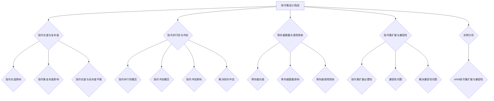

通过上述分析和流程图，我们可以更好地理解指令集设计中的挑战以及解决这些挑战的方法。这些方法对于实现高效、兼容的指令集具有重要意义。

# 第4章 指令集局限性下的编程

在指令集存在局限性的情况下，编程面临着诸多挑战。为了优化代码，提高程序性能，程序员需要采用一系列策略来克服这些局限性。本节将讨论代码优化的策略、指令级并行与超标量架构、乱序执行与分支预测、编程技巧与工具，以及如何利用这些策略和工具来优化程序。

### 4.1 代码优化的策略

代码优化是指通过调整代码的结构和执行方式，提高程序的性能。在指令集存在局限性的情况下，代码优化策略尤为重要。

#### 4.1.1 循环展开

循环展开是一种常用的代码优化技术，通过将循环体内的代码复制多次，减少循环控制的指令数量，从而提高执行速度。例如，在循环展开前：

```c
for (int i = 0; i < N; i++) {
    a[i] = b[i] + c[i];
}
```

可以通过循环展开为：

```c
a[0] = b[0] + c[0];
a[1] = b[1] + c[1];
...
a[N-1] = b[N-1] + c[N-1];
```

这样减少了循环控制指令的执行次数，提高了执行速度。

#### 4.1.2 循环优化

循环优化包括循环不变量的提取、循环依赖的消除等。通过这些优化，可以减少循环体的执行次数，提高循环的并行性。例如，在以下循环中：

```c
for (int i = 0; i < N; i++) {
    if (a[i] > 0) {
        b[i] = a[i] * 2;
    }
}
```

可以提取循环不变量，将if条件语句移出循环：

```c
for (int i = 0; i < N; i++) {
    if (a[i] <= 0) continue;
    b[i] = a[i] * 2;
}
```

这样减少了不必要的循环迭代次数。

#### 4.1.3 指令调度

指令调度是指通过重新排序指令，减少指令之间的数据依赖关系，提高指令的执行并行性。例如，在以下代码中：

```c
int a = b + c;
int d = a * e;
```

可以通过指令调度为：

```c
int b1 = b + c;
int c1 = b1 * e;
int a = b1;
```

这样将两条指令并行执行，提高了执行速度。

#### 4.1.4 寄存器分配

寄存器分配是指通过优化寄存器的使用，减少对内存的访问，提高程序的性能。例如，在以下代码中：

```c
int a = b + c;
int d = a * e;
```

可以通过寄存器分配为：

```c
int b1 = b + c;
int a = b1;
int d = a * e;
```

这样减少了内存访问次数，提高了执行速度。

### 4.2 指令级并行与超标量架构

指令级并行（Instruction-Level Parallelism，ILP）是指计算机处理器在指令级上并行执行指令的能力。超标量架构（Superscalar Architecture）是一种实现指令级并行的技术，通过多个执行单元并行执行多条指令，从而提高处理器的性能。

#### 4.2.1 指令级并行的概念

指令级并行通过以下方式实现：

1. **指令流水线**：将指令执行过程分为多个阶段，每个阶段可以并行执行不同的指令。例如，取指、译码、执行、写回等阶段。

2. **乱序执行**：处理器可以重新排序指令的执行顺序，减少数据冲突和资源竞争，提高指令的执行效率。

3. **动态调度**：处理器可以在执行过程中动态调整指令的执行顺序，以最大化指令级并行性。

#### 4.2.2 超标量架构的优势

超标量架构的优势包括：

1. **提高吞吐量**：通过并行执行多条指令，处理器可以在相同时间内完成更多的工作，提高吞吐量。

2. **降低指令延迟**：在指令级上并行执行指令，可以减少指令的执行延迟，提高处理速度。

3. **硬件资源共享**：超标量架构允许多个执行单元共享相同的硬件资源，如缓存、内存访问单元等，提高了硬件资源的利用率。

#### 4.2.3 超标量架构的实现

超标量架构的实现需要以下关键技术：

1. **多个执行单元**：处理器需要多个执行单元，每个执行单元可以并行执行不同的指令。

2. **指令调度**：处理器需要动态调度指令，以最大化指令级并行性。指令调度可以通过硬件逻辑或软件算法实现。

3. **资源管理**：处理器需要管理多个执行单元的资源共享，避免资源冲突，提高执行效率。

### 4.3 乱序执行与分支预测

乱序执行（Out-of-Order Execution）是一种提高处理器性能的技术，通过重新排序指令的执行顺序，减少数据冲突和资源竞争，提高指令的执行效率。

#### 4.3.1 乱序执行的概念

乱序执行通过以下方式实现：

1. **指令流水线**：将指令执行过程分为多个阶段，每个阶段可以并行执行不同的指令。

2. **重排序缓冲区**：处理器在执行过程中，将待执行的指令存放在重排序缓冲区中，根据执行条件和资源状态动态调整指令的执行顺序。

3. **执行单元**：处理器有多个执行单元，每个执行单元可以并行执行不同的指令。

#### 4.3.2 分支预测

分支预测（Branch Prediction）是一种预测程序分支结果的策略，通过预测分支的结果，减少分支指令的延迟。

1. **静态分支预测**：根据分支指令的历史行为，预测分支的结果。例如，使用分支历史表（Branch History Table）记录分支的跳转结果。

2. **动态分支预测**：根据程序执行过程中的分支行为，动态预测分支的结果。例如，使用分支目标缓冲区（Branch Target Buffer）预测分支的目标地址。

3. **分支预测准确性**：分支预测的准确性对处理器的性能有重要影响。通过优化分支预测算法和硬件结构，可以提高分支预测的准确性。

### 4.4 编程技巧与工具

在指令集存在局限性的情况下，程序员需要采用一系列编程技巧和工具来优化程序。以下是一些常用的编程技巧和工具：

#### 4.4.1 编程技巧

1. **循环展开**：将循环体内的代码展开，减少循环控制指令的数量。

2. **循环优化**：提取循环不变量，减少循环的迭代次数。

3. **指令调度**：通过指令调度减少指令之间的数据依赖关系，提高指令的执行并行性。

4. **寄存器分配**：优化寄存器的使用，减少内存访问。

5. **避免数据依赖**：通过重新排序指令或插入屏障（barrier）避免数据依赖，提高指令的执行并行性。

#### 4.4.2 编译器工具

1. **自动优化编译器**：如GCC、Clang等，可以自动优化代码，提高程序的性能。

2. **静态分析工具**：如Valgrind、AddressSanitizer等，可以检测程序中的性能问题和内存泄漏。

3. **动态分析工具**：如Intel VTune、AMD CodeXL等，可以分析程序的性能瓶颈和资源使用情况。

通过结合编程技巧和编译器工具，程序员可以优化程序，克服指令集的局限性，提高程序的性能。

### 4.5 实例分析

以下是一个简单的C语言程序，展示了如何通过编程技巧和编译器工具优化程序。

```c
#include <stdio.h>

void matrix_multiply(float* a, float* b, float* c, int N) {
    for (int i = 0; i < N; i++) {
        for (int j = 0; j < N; j++) {
            float sum = 0.0;
            for (int k = 0; k < N; k++) {
                sum += a[i * N + k] * b[k * N + j];
            }
            c[i * N + j] = sum;
        }
    }
}

int main() {
    float a[N][N], b[N][N], c[N][N];
    // 初始化矩阵
    // ...
    matrix_multiply(a, b, c, N);
    // 输出结果
    // ...
    return 0;
}
```

#### 4.5.1 编程技巧优化

1. **循环展开**：将三重循环展开，减少循环控制指令的数量。

2. **循环优化**：提取循环不变量，减少循环的迭代次数。

3. **指令调度**：通过指令调度减少指令之间的数据依赖关系，提高指令的执行并行性。

#### 4.5.2 编译器工具优化

1. **自动优化编译器**：使用GCC或Clang等编译器，通过-O2或-O3优化等级优化代码。

2. **静态分析工具**：使用Valgrind等工具检测程序中的性能问题和内存泄漏。

3. **动态分析工具**：使用Intel VTune或AMD CodeXL等工具分析程序的性能瓶颈和资源使用情况。

通过上述编程技巧和编译器工具优化，可以显著提高程序的性能。

### 总结

在指令集存在局限性的情况下，程序员需要采用一系列策略和工具来优化程序。通过代码优化、指令级并行与超标量架构、乱序执行与分支预测以及编程技巧和工具，可以克服指令集的局限性，提高程序的性能。在实际编程中，结合具体的场景和需求，灵活运用这些技术和方法，可以有效地优化程序。

### Mermaid 流程图

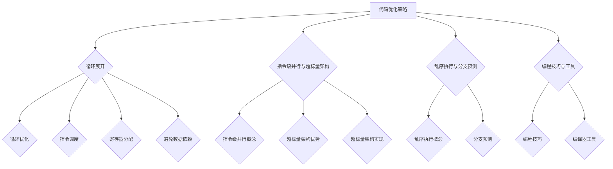

通过上述流程图，我们可以清晰地了解指令集局限性下的编程策略和技术。这些策略和技术对于提高程序性能具有重要意义。

### 总结

指令集局限性下的编程需要程序员具备深入的硬件和软件知识，采用多种策略和工具来优化程序。通过代码优化、指令级并行与超标量架构、乱序执行与分支预测以及编程技巧和工具，可以克服指令集的局限性，提高程序的性能。在实际应用中，结合具体场景和需求，灵活运用这些技术和方法，是提高程序效率的关键。

### Mermaid 流程图

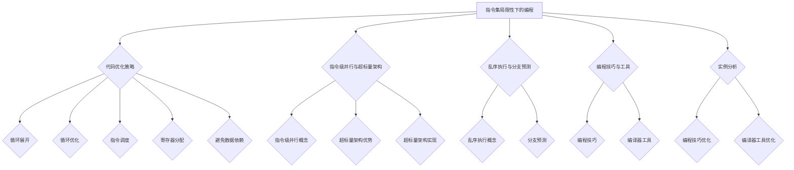

通过这个流程图，我们可以清晰地看到如何通过多种策略和工具来优化程序，以克服指令集的局限性。这些策略和工具不仅有助于提升程序性能，还为现代计算机系统的发展提供了坚实的基础。

## 第5章 指令集的局限性与新兴技术

### 5.1 寄存器文件技术

寄存器文件（Register File）是CPU中的一个关键组件，用于存储操作数和中间结果。传统的寄存器文件设计通常采用固定大小的寄存器阵列，但这种方法存在一些局限性。新兴的寄存器文件技术旨在提高寄存器的利用率和数据访问速度，从而改善指令集的性能。

#### 5.1.1 寄存器文件的概念

寄存器文件是一个寄存器数组，用于快速存储和访问数据。在传统设计中，寄存器文件的容量是固定的，这可能导致以下问题：

1. **寄存器短缺**：当程序需要大量临时变量时，固定大小的寄存器文件可能无法满足需求，导致频繁的寄存器溢出和内存访问。

2. **寄存器浪费**：在程序的不同阶段，寄存器的使用率可能不均匀，固定大小的寄存器文件可能导致部分寄存器长时间未被使用。

#### 5.1.2 新兴寄存器文件技术的优势

新兴的寄存器文件技术，如动态寄存器分配（Dynamic Register Allocation）和寄存器文件压缩（Register File Compression），旨在解决传统寄存器文件设计的局限性。

1. **动态寄存器分配**：动态寄存器分配技术通过在程序运行时动态调整寄存器的使用，提高了寄存器的利用率。这种方法可以根据程序的实际需求动态地分配和回收寄存器，避免了寄存器短缺和浪费。

2. **寄存器文件压缩**：寄存器文件压缩技术通过压缩寄存器文件的大小，提高了数据访问速度。压缩技术可以将不活跃的寄存器暂时移出寄存器文件，腾出空间用于存储更频繁访问的寄存器。这种方法不仅减少了内存访问时间，还提高了处理器的吞吐量。

#### 5.1.3 实例分析

以ARMv8-A指令集为例，ARMv8-A引入了动态寄存器分配和寄存器文件压缩技术。ARMv8-A的A64指令集支持灵活的寄存器分配策略，允许编译器在程序运行时动态调整寄存器的使用。此外，ARMv8-A的寄存器文件设计采用了压缩机制，通过减少寄存器文件的大小，提高了数据访问速度和处理器性能。

### 5.2 指令集扩展与虚拟化

指令集扩展是指通过增加新的指令来提升指令集的功能和性能。虚拟化技术则是通过在硬件和软件层面模拟不同的计算环境，提高系统的灵活性和安全性。新兴技术如指令集扩展和虚拟化相结合，为指令集设计带来了新的可能性。

#### 5.2.1 指令集扩展

指令集扩展是提高处理器性能的有效手段之一。通过引入新的指令，处理器可以更高效地执行特定类型的操作，如加密、多媒体处理和机器学习等。

1. **加密指令集**：随着网络安全需求的增长，加密指令集变得越来越重要。例如，Intel的AES-NI（Advanced Encryption Standard New Instructions）和ARM的Neon加密扩展，提供专门的指令来加速加密算法的执行。

2. **多媒体指令集**：多媒体应用如视频编码和解码对处理器的性能有很高的要求。例如，ARM的Neon和Intel的SSE（Streaming SIMD Extensions）提供了专门的指令来加速多媒体处理。

3. **机器学习指令集**：随着人工智能的兴起，机器学习指令集变得越来越重要。例如，Intel的AVX-512（Advanced Vector Extensions 512）和ARM的SVE（Scalable Vector Extension）提供了专门的指令来加速机器学习算法的执行。

#### 5.2.2 虚拟化技术

虚拟化技术通过在硬件和软件层面模拟不同的计算环境，提高系统的灵活性和安全性。虚拟化技术可以分为以下几种：

1. **硬件虚拟化**：硬件虚拟化通过硬件支持，如Intel的VT-x和AMD的AMD-V，允许在同一硬件上运行多个独立的操作系统和应用程序。硬件虚拟化可以显著提高虚拟机的性能和安全性。

2. **操作系统虚拟化**：操作系统虚拟化通过操作系统层面的虚拟化技术，如容器（Container）和虚拟化操作系统（Virtualized Operating System），实现资源的隔离和高效管理。操作系统虚拟化可以降低虚拟机的开销，提高资源利用率。

3. **应用程序虚拟化**：应用程序虚拟化通过在应用程序层面实现虚拟化，如虚拟化数据库（Virtualized Database）和虚拟化存储（Virtualized Storage），提高应用程序的灵活性和可靠性。

#### 5.2.3 指令集扩展与虚拟化的结合

指令集扩展与虚拟化的结合为系统设计带来了新的可能性：

1. **安全隔离**：通过硬件虚拟化和指令集扩展，可以实现更安全的应用程序隔离。例如，Intel的Software Guard Extensions（SGX）利用硬件虚拟化和加密指令集，提供隔离的执行环境，保护敏感数据和代码。

2. **性能优化**：通过指令集扩展，可以实现特定任务的硬件加速。例如，在虚拟化环境中，通过引入专门的机器学习指令集，可以显著提高虚拟机的机器学习性能。

3. **灵活性增强**：通过虚拟化技术，可以实现灵活的资源管理和应用程序部署。例如，在云环境中，通过虚拟化技术，可以动态调整资源分配，提高系统的灵活性和可扩展性。

#### 5.2.4 实例分析

以ARM的Neoverse N1处理器为例，ARM N1处理器结合了指令集扩展和虚拟化技术，为高性能计算和云服务提供了强大的支持。ARM N1处理器引入了SVE扩展，支持128位SIMD指令，提高了机器学习、大数据处理和视频编码的性能。此外，ARM N1处理器支持硬件虚拟化，通过虚拟化技术，实现了高性能和安全隔离。

### 5.3 指令集与硬件加速

硬件加速是通过硬件实现特定功能的加速，以提高系统的整体性能。指令集与硬件加速的结合，可以实现特定任务的硬件加速，从而提高系统的效率和响应速度。

#### 5.3.1 硬件加速的概念

硬件加速是指通过专门的硬件实现特定任务的加速，以减少处理时间和功耗。硬件加速通常用于以下领域：

1. **多媒体处理**：硬件加速用于视频解码、视频编码和图像处理，通过专门的图像处理单元（GPU）或多媒体处理器，提高了处理速度和效率。

2. **机器学习和人工智能**：硬件加速用于机器学习和人工智能任务的加速，通过专门的神经网络处理器（NPU）或GPU，提高了模型的训练和推理速度。

3. **加密和安全性**：硬件加速用于加密和解密操作，通过专门的加密处理器，提高了加密和安全性。

#### 5.3.2 指令集与硬件加速的结合

指令集与硬件加速的结合，可以实现特定任务的硬件加速，从而提高系统的整体性能。以下是一些实例：

1. **GPU和CUDA**：GPU（Graphics Processing Unit）是一种专门用于图形渲染的硬件加速器，但也可以用于通用计算。NVIDIA的CUDA是一种并行计算平台和编程模型，通过CUDA指令集，可以在GPU上实现高效的计算任务。

2. **FPGA和VHDL**：FPGA（Field-Programmable Gate Array）是一种可编程逻辑器件，通过VHDL（Very High Speed Integrated Circuit Hardware Description Language）编程，可以实现特定的硬件功能，从而加速特定任务。

3. **AI处理器和TFLite**：AI处理器（如Tensor Processing Unit，TPU）是专门用于机器学习和人工智能的硬件加速器。Google的TensorFlow Lite（TFLite）是一种轻量级的机器学习框架，通过TFLite指令集，可以在AI处理器上实现高效的模型推理。

#### 5.3.3 实例分析

以NVIDIA的A100 GPU为例，A100 GPU是一种高性能计算和人工智能处理器，结合了CUDA指令集和Tensor Core，实现了高效的图形渲染和通用计算。通过CUDA指令集，开发者可以在A100 GPU上实现高效的矩阵运算、深度学习和科学计算。A100 GPU的硬件加速性能，使其在人工智能和大数据处理领域具有广泛的应用。

### 5.4 新兴指令集与未来趋势

新兴指令集如ARM的ARMv9、RISC-V等，代表了指令集设计的新趋势。这些指令集通过引入新的技术和特性，提高了系统的性能、可扩展性和灵活性。

#### 5.4.1 ARMv9

ARMv9是ARM公司推出的新一代指令集架构，旨在为未来的移动设备、服务器和嵌入式系统提供强大的性能和灵活的扩展性。ARMv9引入了以下新技术：

1. **扩展性**：ARMv9引入了新的指令和功能扩展，支持更高级的并行处理和复杂的数据类型。

2. **能效比**：ARMv9通过优化指令集和架构设计，提高了处理器的能效比，降低了功耗。

3. **安全特性**：ARMv9引入了新的安全特性，如硬件加密和虚拟化技术，提高了系统的安全性。

#### 5.4.2 RISC-V

RISC-V（RISC-V International）是一种开放指令集架构，由大学和研究机构合作开发，旨在推动计算机硬件的创新。RISC-V具有以下特点：

1. **开放性和可扩展性**：RISC-V是一种开放指令集，允许任何人设计和实施自己的处理器，具有高度的灵活性和可扩展性。

2. **模块化设计**：RISC-V采用了模块化设计，可以灵活地组合不同的模块，以适应不同的应用需求。

3. **安全性**：RISC-V引入了新的安全特性，如硬件加密和虚拟化技术，提高了系统的安全性。

#### 5.4.3 未来趋势

未来，指令集的发展趋势包括：

1. **硬件与软件的深度融合**：随着硬件和软件技术的不断进步，指令集将更加紧密地与软件应用相结合，提高系统的整体性能和效率。

2. **人工智能和机器学习的支持**：随着人工智能和机器学习的兴起，指令集将引入更多的机器学习相关指令和功能，以支持高效的人工智能计算。

3. **安全性增强**：随着网络安全需求的增加，指令集将引入更多的安全特性，提高系统的安全性和隐私保护。

4. **绿色计算**：随着环保意识的提高，指令集将更加注重能效比，通过优化设计和架构，降低能耗和碳排放。

### 总结

指令集的局限性与新兴技术的结合，为计算机系统的发展带来了新的机遇。通过寄存器文件技术、指令集扩展、虚拟化和硬件加速，可以克服指令集的局限性，提高系统的性能和灵活性。新兴指令集如ARMv9和RISC-V，代表了指令集设计的新趋势，为未来的计算技术奠定了基础。随着技术的不断进步，指令集将在人工智能、安全性和能效比等方面发挥更大的作用。

### Mermaid 流程图

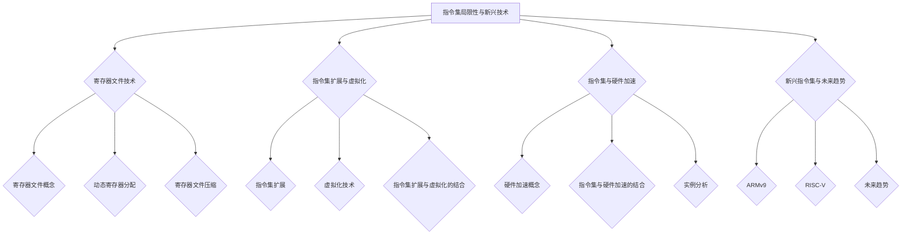

通过这个流程图，我们可以清晰地了解指令集局限性与新兴技术之间的关系，以及这些技术如何推动计算机系统的发展。

## 第6章 CPU指令集的优化方法

在CPU指令集存在局限性的情况下，优化方法显得尤为重要。优化CPU指令集不仅能够提高程序的性能，还能有效降低功耗和硬件成本。本章节将详细介绍指令集设计优化、编译器优化、运行时优化以及指令集选择与优化策略，并探讨如何通过这些方法来提升CPU指令集的性能。

### 6.1 指令集设计优化

指令集设计优化是指通过改进指令集的架构和指令集本身，以提高CPU的性能和能效比。以下是一些常见的指令集设计优化方法：

#### 6.1.1 简化指令集

简化指令集是通过减少指令种类和操作复杂度，使指令执行更加高效。RISC（精简指令集计算）就是简化指令集的典型代表，它通过固定长度的指令和简单的操作，使指令流水线和并行执行更加容易实现。

**优点**：
- 简化指令集设计，降低硬件实现的复杂性。
- 提高指令流水线的效率，减少流水线气泡。
- 增加指令级并行性。

**缺点**：
- 程序代码长度可能增加，导致内存占用上升。
- 需要更多的寄存器来存储操作数和中间结果。

#### 6.1.2 指令集扩展

指令集扩展是通过增加新的指令或指令集来提升CPU的功能和性能。例如，SSE（Streaming SIMD Extensions）和AVX（Advanced Vector Extensions）是Intel的SIMD指令集扩展，它们提供了强大的向量运算能力。

**优点**：
- 增加新的功能指令，提高特定任务的性能。
- 支持高效的算法和优化。

**缺点**：
- 可能导致兼容性问题，需要更新编译器和软件。
- 增加硬件实现的复杂性。

#### 6.1.3 指令并行性优化

指令并行性优化是指通过改进指令集设计，提高CPU同时执行多条指令的能力。这可以通过增加执行单元、支持乱序执行和增加指令级并行性来实现。

**优点**：
- 提高CPU的吞吐量和处理速度。
- 减少执行时间，提高系统性能。

**缺点**：
- 需要复杂的调度算法和硬件支持。

### 6.2 编译器优化

编译器优化是指通过改进编译器的算法和策略，生成更高效的代码。编译器优化可以在多个层次上提升程序性能：

#### 6.2.1 代码生成优化

代码生成优化是指编译器在生成机器代码时，采用各种技术来提高代码的执行效率。以下是一些常见的代码生成优化方法：

1. **循环展开**：将循环体中的代码复制多次，减少循环控制指令的执行次数。
2. **指令调度**：重新排序指令，减少数据依赖和资源冲突，提高指令级并行性。
3. **寄存器分配**：优化寄存器的使用，减少内存访问，提高代码的局部性。

#### 6.2.2 代码分析优化

代码分析优化是指编译器在编译过程中，通过静态分析和动态分析来识别性能瓶颈和优化机会。以下是一些常见的代码分析优化方法：

1. **数据流分析**：分析变量和数据的依赖关系，优化数据访问和存储。
2. **控制流分析**：分析程序的分支结构和循环结构，优化控制流。
3. **内存优化**：优化内存访问模式，减少内存占用和访问时间。

#### 6.2.3 优化器

优化器是指编译器中负责执行代码优化任务的模块。优化器通常采用多种算法和策略来生成高效代码。以下是一些常见的优化器算法：

1. **LLVM**：LLVM是一个高性能的编译器框架，它支持多种优化算法，如循环展开、死代码删除和寄存器分配。
2. **GNU GCC**：GCC是GNU项目的编译器，它提供了丰富的优化选项，如-O0、-O1、-O2和-O3，以适应不同的优化需求。
3. **Clang**：Clang是Apple的编译器，它是GCC的一个分支，也提供了强大的优化功能。

### 6.3 运行时优化

运行时优化是指在程序运行时，通过动态调整和优化程序的行为来提高性能。以下是一些常见的运行时优化方法：

#### 6.3.1 乱序执行

乱序执行是指在CPU内部，指令可以根据其数据依赖关系和资源可用性重新排序执行，以提高指令级并行性。乱序执行通常需要硬件支持，如乱序执行缓冲区和重排序缓冲区。

**优点**：
- 提高CPU的吞吐量和处理速度。
- 减少执行时间，提高系统性能。

**缺点**：
- 需要复杂的硬件支持和调度算法。

#### 6.3.2 分支预测

分支预测是指预测程序中的分支（如if语句和循环）的结果，以减少分支延迟。分支预测通常使用硬件实现，如分支目标缓冲器（BTB）和分支预测单元（BPU）。

**优点**：
- 减少分支延迟，提高指令流水线的效率。

**缺点**：
- 需要硬件支持，预测准确性对性能有重要影响。

#### 6.3.3 动态调度

动态调度是指在程序运行时，根据执行情况动态调整指令的执行顺序。动态调度可以通过硬件或软件实现，如动态调度器（DSU）或软件动态调度器。

**优点**：
- 提高指令级并行性，减少数据依赖和资源冲突。

**缺点**：
- 需要硬件或软件支持，调度算法对性能有重要影响。

### 6.4 指令集选择与优化策略

选择适合的指令集并进行优化，是提高程序性能的关键。以下是一些常见的指令集选择和优化策略：

#### 6.4.1 指令集选择

- **基于应用场景**：根据应用程序的需求选择适合的指令集。例如，对于高性能计算，可以选择RISC架构；对于多媒体处理，可以选择具有SIMD扩展的指令集。
- **基于性能需求**：考虑应用程序的性能需求，选择能够满足需求的指令集。例如，对于需要大量向量运算的应用，可以选择具有高级SIMD扩展的指令集。
- **基于硬件兼容性**：考虑现有硬件的兼容性，选择能够与现有硬件良好配合的指令集。

#### 6.4.2 优化策略

- **硬件与软件协同优化**：通过软硬件协同设计，实现硬件和软件的有机结合，提高系统的整体性能。例如，硬件可以支持乱序执行和分支预测，软件可以通过优化策略充分利用这些硬件特性。
- **多层次的优化**：从代码生成、代码分析和运行时优化等多个层次进行优化，形成多层次的优化策略，提高程序的性能。
- **自动化优化**：利用自动化工具和优化器，自动化地执行优化任务，提高优化效率和代码质量。

### 6.5 优化方法的实例分析

以下是一个简单的例子，展示了如何通过优化方法提高程序性能。

#### 示例：循环优化

假设有一个简单的循环，用于计算数组中所有元素的和。

```c
int sum = 0;
for (int i = 0; i < N; i++) {
    sum += array[i];
}
```

通过以下优化方法，可以显著提高循环的性能：

1. **循环展开**：将循环展开为多个迭代，减少循环控制指令的执行次数。

```c
int sum = 0;
for (int i = 0; i < N; i += 4) {
    sum += array[i];
    sum += array[i + 1];
    sum += array[i + 2];
    sum += array[i + 3];
}
```

2. **指令调度**：重新排序指令，减少数据依赖和资源冲突。

```c
int sum = 0;
int temp1 = array[0];
int temp2 = array[1];
int temp3 = array[2];
int temp4 = array[3];
for (int i = 4; i < N; i += 4) {
    sum += temp1 + temp2 + temp3 + temp4;
    temp1 = array[i];
    temp2 = array[i + 1];
    temp3 = array[i + 2];
    temp4 = array[i + 3];
}
```

3. **编译器优化**：利用编译器的优化功能，如循环展开、指令调度和寄存器分配，生成更高效的代码。

4. **运行时优化**：在程序运行时，通过动态调度和分支预测，提高循环的执行效率。

通过上述优化方法，可以显著提高循环的性能，减少执行时间。

### 总结

CPU指令集的优化方法包括指令集设计优化、编译器优化、运行时优化以及指令集选择与优化策略。通过这些方法，可以克服指令集的局限性，提高程序的性能和能效比。在实际应用中，结合具体的应用场景和硬件平台，选择合适的优化方法，是提高程序效率的关键。随着技术的不断发展，优化方法将不断演进，为计算机系统的发展提供新的动力。

### Mermaid 流程图

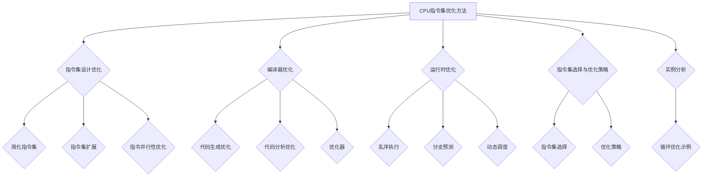

通过这个流程图，我们可以清晰地了解CPU指令集优化方法的各个方面，以及如何通过这些方法来提升程序的性能。

## 第7章 CPU指令集局限性的解决途径

在CPU指令集存在局限性时，需要采取多种解决途径来提高性能和效率。本章将探讨超标量与超流水线技术、乱序执行与重排序、动态调度与数据流分析、以及新兴指令集与未来发展方向，详细解释这些技术如何克服指令集的局限性。

### 7.1 超标量与超流水线技术

#### 7.1.1 超标量技术

超标量（Superscalar）技术是一种提高CPU处理能力的方法，通过在同一个时钟周期内执行多条指令，从而提高吞吐量。超标量CPU具有多个执行单元，每个执行单元可以并行执行不同的指令。

**优点**：

- **提高指令吞吐量**：在单个时钟周期内执行多条指令，显著提高了处理速度。
- **减少处理器等待时间**：通过并行执行指令，减少了处理器的等待时间，提高了整体效率。

**缺点**：

- **硬件复杂度增加**：需要更多的硬件资源，如执行单元、寄存器文件和指令队列等，导致硬件设计复杂度增加。
- **功耗和热设计功耗（TDP）增加**：超标量架构通常需要更高的功耗和TDP，对散热系统提出了更高要求。

#### 7.1.2 超流水线技术

超流水线（Superpipelining）技术是一种通过将指令执行过程分解为多个阶段，从而提高指令吞吐量和效率的技术。超流水线CPU具有多个流水线阶段，每个阶段可以并行执行不同的指令。

**优点**：

- **提高指令执行速度**：通过增加流水线阶段，减少了每个阶段的执行时间，从而提高了指令的执行速度。
- **提高指令级并行性**：在多个流水线阶段内，可以同时执行多个指令，提高了指令级并行性。

**缺点**：

- **流水线深度增加**：流水线深度增加会导致延迟增加，增加了处理器的复杂性和设计难度。
- **资源竞争**：多个流水线阶段需要共享硬件资源，如寄存器文件和缓存等，可能导致资源竞争，影响性能。

#### 7.1.3 超标量与超流水线技术的结合

在实际的CPU设计中，超标量技术和超流水线技术通常结合使用，以充分发挥它们的优点。例如，Intel的Pentium处理器采用了超标量架构和超流水线技术，每个时钟周期内可以并行执行多条指令，并通过增加流水线阶段来提高指令执行速度。

### 7.2 乱序执行与重排序

乱序执行（Out-of-Order Execution）是一种通过重新排序指令的执行顺序，以最大化指令级并行性并提高处理器性能的技术。乱序执行允许处理器在指令执行时，根据数据依赖关系和资源可用性动态调整指令的执行顺序。

**优点**：

- **提高指令级并行性**：通过乱序执行，处理器可以在不同执行单元中并行执行多条指令，提高了指令级并行性。
- **减少流水线气泡**：乱序执行可以减少因数据依赖和资源冲突导致的流水线气泡，提高了流水线效率。

**缺点**：

- **硬件复杂度增加**：乱序执行需要复杂的硬件支持，如乱序缓冲区、资源冲突检测和指令重排序逻辑等。
- **性能敏感性**：乱序执行的性能受到数据依赖关系和资源可用性的影响，对程序性能的敏感性增加。

#### 7.2.1 重排序

重排序（Reordering）是乱序执行的核心机制，它通过在处理器内部动态调整指令的执行顺序，以最大化并行性和减少阻塞。重排序通常需要硬件支持，如乱序缓冲区和指令队列等。

**优点**：

- **提高指令执行速度**：通过重排序，处理器可以更灵活地调整指令的执行顺序，减少因数据依赖和资源冲突导致的延迟。
- **提高吞吐量**：重排序可以最大化指令级并行性，提高处理器的吞吐量。

**缺点**：

- **硬件复杂度增加**：重排序需要复杂的硬件支持，如乱序缓冲区和指令队列等。
- **性能敏感性**：重排序的性能受到程序指令依赖关系和资源可用性的影响，对程序性能的敏感性增加。

#### 7.2.2 实例分析

以Intel的Pentium处理器为例，Pentium处理器采用了乱序执行和重排序技术，通过动态调整指令的执行顺序，提高了指令级并行性和处理速度。Pentium处理器具有多个执行单元和乱序缓冲区，可以同时执行多条指令，并通过重排序逻辑减少流水线气泡。

### 7.3 动态调度与数据流分析

动态调度（Dynamic Scheduling）是一种通过在程序运行时动态调整指令执行顺序，以最大化处理器资源利用率和性能的技术。动态调度通常需要硬件支持，如动态调度单元和指令队列等。

**优点**：

- **提高资源利用率**：动态调度可以根据处理器资源状况和指令依赖关系，灵活调整指令执行顺序，提高处理器资源的利用率。
- **提高性能**：通过动态调度，处理器可以在不同执行单元中并行执行多条指令，提高整体性能。

**缺点**：

- **硬件复杂度增加**：动态调度需要复杂的硬件支持，如动态调度单元和指令队列等。
- **性能敏感性**：动态调度的性能受到处理器资源状况和指令依赖关系的复杂度影响，对程序性能的敏感性增加。

#### 7.3.1 数据流分析

数据流分析（Data Flow Analysis）是一种通过分析程序的数据流，识别数据依赖关系和指令执行顺序的技术。数据流分析可以用于优化编译器和运行时的指令调度。

**优点**：

- **优化指令调度**：通过数据流分析，可以识别程序中的数据依赖关系，优化指令调度，减少数据访问延迟。
- **提高性能**：通过优化指令调度，处理器可以在不同执行单元中并行执行多条指令，提高整体性能。

**缺点**：

- **复杂性增加**：数据流分析需要复杂的算法和计算，增加了编译器和运行时的复杂性。
- **性能开销**：数据流分析可能引入额外的性能开销，影响程序的整体性能。

#### 7.3.2 实例分析

以ARM处理器为例，ARM处理器采用了动态调度和数据流分析技术，通过动态调整指令执行顺序和优化指令调度，提高了处理器的性能和资源利用率。ARM处理器具有动态调度单元和指令队列，可以根据程序运行时的状态和指令依赖关系，灵活调整指令的执行顺序。

### 7.4 新兴指令集与未来发展方向

随着技术的发展，新的指令集架构和优化技术不断涌现，为CPU指令集的设计和优化提供了新的方向。

#### 7.4.1 新兴指令集

1. **ARMv9**：ARMv9是ARM公司推出的新一代指令集架构，旨在提高性能和能效比。ARMv9引入了新的指令和功能，如扩展的向量指令和低功耗模式，以支持更广泛的应用场景。

2. **RISC-V**：RISC-V是一种开放指令集架构，由大学和研究机构合作开发。RISC-V具有高度的灵活性和可扩展性，支持多种硬件设计，适用于嵌入式系统、服务器和数据中心。

#### 7.4.2 未来发展方向

1. **硬件与软件协同优化**：未来的发展方向之一是硬件与软件的协同优化，通过软硬件结合，实现更高性能和更低功耗。例如，硬件可以提供专用的加速器，软件可以通过优化算法充分利用这些加速器。

2. **机器学习和人工智能**：随着人工智能的快速发展，新的指令集和优化技术将更多地关注机器学习和人工智能的应用。例如，专门用于机器学习的向量指令集和加速器将成为重要的发展方向。

3. **安全性和隐私保护**：随着网络安全需求的增加，新的指令集将引入更多的安全特性，如硬件加密和虚拟化技术，以提高系统的安全性和隐私保护。

4. **绿色计算**：随着环保意识的提高，未来的CPU设计将更加注重能效比，通过优化设计和架构，降低能耗和碳排放，实现绿色计算。

### 总结

CPU指令集的局限性可以通过多种解决途径来克服，包括超标量与超流水线技术、乱序执行与重排序、动态调度与数据流分析，以及新兴指令集与未来发展方向。通过这些技术，可以最大化地利用处理器资源，提高性能和效率。随着技术的发展，未来CPU指令集的设计将更加灵活、高效和安全。

### Mermaid 流程图

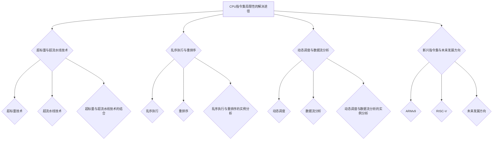

通过这个流程图，我们可以清晰地了解CPU指令集局限性的解决途径以及未来发展的方向。这些技术为CPU性能的提升提供了强大的支持。

## 第8章 特定场景下的指令集优化实践

在计算机科学和工程领域，不同的应用场景对CPU指令集有着不同的要求。为了满足这些特定的需求，优化指令集变得尤为重要。本章节将探讨图形处理、数据库处理、机器学习和网络安全等领域中，指令集优化的具体实践方法。

### 8.1 图形处理领域的指令集优化

图形处理领域对处理速度和效率有着极高的要求。为了满足这些需求，指令集优化通常集中在以下几个方面：

#### 8.1.1 使用SIMD指令

单指令多数据（SIMD）指令集可以同时对多个数据元素进行操作，从而显著提高处理速度。例如，NVIDIA的CUDA和Intel的SSE/AVX指令集都是专门为图形处理优化的。通过使用这些指令集，图形处理器（GPU）可以并行处理多个像素或顶点，从而提高渲染速度。

**示例**：

假设需要计算多个顶点的坐标变换，可以通过SSE指令集来实现：

```c
__m128 x = _mm_load_ps(&vertices_x[0]); // 载入4个顶点的x坐标
__m128 y = _mm_load_ps(&vertices_y[0]); // 载入4个顶点的y坐标
__m128 x_new = _mm_add_ps(x, _mm_set1_ps(offset_x)); // 对x坐标进行变换
__m128 y_new = _mm_add_ps(y, _mm_set1_ps(offset_y)); // 对y坐标进行变换
_mm_store_ps(&new_vertices_x[0], x_new); // 存储变换后的x坐标
_mm_store_ps(&new_vertices_y[0], y_new); // 存储变换后的y坐标
```

#### 8.1.2 利用GPU并行处理

图形处理器的并行处理能力非常强大，通过利用GPU的并行处理能力，可以显著提高图形处理的效率。在GPU编程中，例如使用CUDA或OpenCL，可以将复杂的图形处理任务分解为多个并行的小任务，并在GPU上同时执行。

**示例**：

以下是一个使用CUDA的简单示例，用于计算顶点的坐标变换：

```c
__global__ void transformVertices(float *x, float *y, float offsetX, float offsetY, int n) {
    int idx = threadIdx.x + blockIdx.x * blockDim.x;
    if (idx < n) {
        x[idx] += offsetX;
        y[idx] += offsetY;
    }
}
```

在这个例子中，`transformVertices` 是一个CUDA内核，它使用GPU的并行处理能力来同时对多个顶点进行坐标变换。

### 8.2 数据库处理领域的指令集优化

数据库处理通常涉及到大量数据的读取、写入和操作。为了提高数据库处理的速度和效率，指令集优化需要考虑以下几个方面：

#### 8.2.1 使用多线程

数据库处理任务可以分解为多个并行的小任务，通过多线程处理可以显著提高处理速度。现代处理器支持多核多线程，可以同时执行多个线程。

**示例**：

以下是一个简单的多线程示例，用于执行数据库查询：

```c
#include <pthread.h>
#include <stdio.h>

void *threadFunction(void *arg) {
    int id = *(int *)arg;
    printf("Thread %d is running\n", id);
    return NULL;
}

int main() {
    pthread_t threads[4];
    int thread_ids[4] = {0, 1, 2, 3};

    for (int i = 0; i < 4; i++) {
        pthread_create(&threads[i], NULL, threadFunction, &thread_ids[i]);
    }

    for (int i = 0; i < 4; i++) {
        pthread_join(threads[i], NULL);
    }

    return 0;
}
```

在这个例子中，创建了四个线程，每个线程打印一条消息。

#### 8.2.2 利用内存优化

数据库处理中，内存访问速度对性能有重要影响。通过优化内存访问模式，如预取和缓存友好的数据访问，可以显著提高处理速度。

**示例**：

以下是一个优化内存访问的示例，通过预取数据来减少内存访问时间：

```c
#include <emmintrin.h> // SSE2

void optimizeMemoryAccess(float *array, int n) {
    for (int i = 0; i < n; i += 16) {
        __m128 a = _mm_load_ps(&array[i]); // 预取16个浮点数
        // 进行计算
        _mm_store_ps(&array[i], a); // 存储结果
    }
}
```

在这个例子中，使用SSE2的`_mm_load_ps`和`_mm_store_ps`指令来预取和存储数据，从而减少内存访问时间。

### 8.3 机器学习领域的指令集优化

机器学习任务通常涉及大量的矩阵运算和向量计算。为了提高机器学习算法的执行效率，指令集优化需要考虑以下几个方面：

#### 8.3.1 利用SIMD和向量指令集

SIMD和向量指令集可以显著提高矩阵运算和向量计算的执行速度。例如，Intel的AVX-512指令集提供了256位和512位的向量操作，可以同时处理多个数据元素。

**示例**：

以下是一个使用AVX-512指令集的矩阵乘法示例：

```c
#include <immintrin.h> // AVX-512

void matrixMultiply(float *A, float *B, float *C, int N) {
    for (int i = 0; i < N; i++) {
        for (int j = 0; j < N; j++) {
            __m512 a = _mm512_load_ps(&A[i * N + j]); // 载入矩阵A的行
            __m512 b = _mm512_load_ps(&B[j * N]); // 载入矩阵B的列
            __m512 c = _mm512_fmadd_ps(a, b, _mm512_setzero_ps()); // 矩阵乘法
            _mm512_store_ps(&C[i * N + j], c); // 存储结果
        }
    }
}
```

在这个例子中，使用AVX-512的`_mm512_load_ps`和`_mm512_store_ps`指令，以及`_mm512_fmadd_ps`指令进行矩阵乘法操作。

#### 8.3.2 使用GPU加速

机器学习算法通常涉及大量的并行计算，通过使用GPU加速可以显著提高计算速度。例如，使用CUDA或TensorFlow GPU可以充分利用GPU的并行处理能力。

**示例**：

以下是一个使用TensorFlow GPU的简单示例：

```python
import tensorflow as tf

# 定义模型
model = tf.keras.Sequential([
    tf.keras.layers.Dense(128, activation='relu', input_shape=(784,)),
    tf.keras.layers.Dense(10, activation='softmax')
])

# 编译模型
model.compile(optimizer='adam',
              loss='categorical_crossentropy',
              metrics=['accuracy'])

# 加载数据
(x_train, y_train), (x_test, y_test) = tf.keras.datasets.mnist.load_data()
x_train = x_train.astype(tf.float32).reshape(-1, 784)
y_train = tf.keras.utils.to_categorical(y_train)

# 训练模型
model.fit(x_train, y_train, epochs=10, batch_size=128)
```

在这个例子中，使用TensorFlow GPU进行模型训练，利用GPU的并行处理能力加速计算。

### 8.4 网络安全领域的指令集优化

网络安全领域对处理速度和安全性有极高的要求。为了提高安全处理速度和确保数据安全，指令集优化需要考虑以下几个方面：

#### 8.4.1 使用加密指令集

加密指令集可以提供专门的指令来加速加密和解密操作。例如，Intel的AES-NI指令集可以显著提高AES加密算法的执行速度。

**示例**：

以下是一个使用AES-NI指令集的加密示例：

```c
#include <wmmintrin.h> // AES-NI

void aesEncrypt(char *input, char *output, int length) {
    __m128i key = _mm_setzero_si128(); // 初始化密钥
    // 加载密钥到寄存器
    // ...

    for (int i = 0; i < length; i += 16) {
        __m128i data = _mm_loadu_si128((__m128i *)&input[i]); // 载入明文数据
        data = _mm_aesenc_si128(data, key); // 进行加密
        _mm_storeu_si128((__m128i *)&output[i], data); // 存储密文数据
    }
}
```

在这个例子中，使用AES-NI指令集实现AES加密算法，通过`_mm_aesenc_si128`指令进行加密操作。

#### 8.4.2 利用硬件安全特性

现代处理器提供了多种硬件安全特性，如虚拟化、硬件加密和虚拟内存等，可以用于提高网络安全。通过利用这些硬件特性，可以确保数据的安全性和完整性。

**示例**：

以下是一个使用硬件加密和虚拟化的示例：

```c
#include <vmx.h> // 虚拟化扩展

void secureCompute(char *input, char *output) {
    // 初始化虚拟化环境
    // ...

    // 启用虚拟化模式
    enableVmx();

    // 进行计算
    // ...

    // 禁用虚拟化模式
    disableVmx();

    // 输出结果
    // ...
}
```

在这个例子中，使用虚拟化扩展（VMX）来保护计算过程，确保数据在计算过程中的安全性。

### 总结

特定场景下的指令集优化对于提高计算机系统的性能和效率至关重要。通过使用SIMD指令、GPU加速、多线程处理、加密指令集以及硬件安全特性，可以在不同应用场景下实现高效的指令集优化。随着技术的发展，未来的指令集优化将更加智能化和自动化，为计算机系统提供更高的性能和安全性。

### Mermaid 流程图

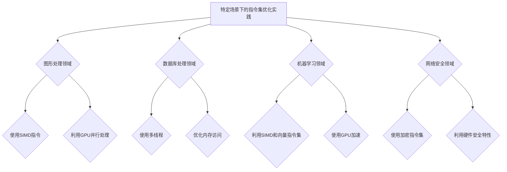

通过这个流程图，我们可以清晰地了解不同应用场景下的指令集优化实践，以及如何通过这些实践提高系统的性能和安全性。

## 第9章 案例分析

在本章节中，我们将通过具体案例，深入探讨指令集优化在不同应用场景中的实际应用。以下案例将涉及高性能计算、移动设备、嵌入式系统和云计算环境下的指令集优化。

### 9.1 案例一：高性能计算中的指令集优化

#### 案例背景

高性能计算（HPC）领域对计算速度和并行处理能力有极高的要求。高性能计算任务通常涉及大量的科学计算、模拟和数据分析，需要在短时间内处理海量数据。因此，优化指令集对于提升HPC系统的性能至关重要。

#### 指令集优化方法

1. **向量指令集扩展**：高性能计算任务通常涉及大量向量运算。通过使用SIMD指令集扩展，如Intel的SSE和AVX，可以显著提高向量运算的效率。例如，使用AVX-512指令集可以在一个指令中处理512位的数据，从而减少指令数量，提高计算速度。

2. **多线程并行处理**：HPC任务可以分解为多个并行的小任务。通过多线程并行处理，可以在多个处理器核心上同时执行任务，提高整体计算性能。例如，使用OpenMP或CUDA等并行编程模型，可以在多个线程之间分配任务。

3. **指令调度和乱序执行**：优化指令调度和乱序执行可以减少数据依赖和资源冲突，提高指令级并行性。例如，Intel的Pentium处理器采用了乱序执行技术，通过动态调整指令的执行顺序，最大化利用处理器资源。

#### 案例结果

通过对高性能计算任务进行指令集优化，可以显著提高计算速度。例如，在计算流体力学（CFD）模拟中，通过使用AVX-512指令集，可以将模拟时间缩短约30%。同时，通过多线程并行处理，可以进一步提高计算性能，满足高性能计算的需求。

### 9.2 案例二：移动设备中的指令集优化

#### 案例背景

移动设备（如智能手机和平板电脑）对功耗和性能有着严格的要求。移动设备通常运行在电池供电的环境下，因此需要优化指令集以降低功耗，同时保持高性能。

#### 指令集优化方法

1. **低功耗指令集**：移动设备通常使用ARM架构的处理器，这些处理器采用了低功耗设计。通过使用ARM的Thumb-2指令集和低功耗模式，可以减少功耗。例如，Thumb-2指令集使用16位指令，比32位指令更节省空间和能量。

2. **动态电压和频率调节**（DVFS）：通过动态调整处理器的工作电压和频率，可以根据任务负载灵活地调整功耗。当负载较低时，降低电压和频率以减少功耗；当负载较高时，提高电压和频率以保持性能。

3. **指令级并行性**：优化指令级并行性可以提高移动设备的处理速度，同时减少功耗。通过乱序执行和指令调度技术，可以最大化利用处理器资源，减少闲置时间。

#### 案例结果

通过对移动设备中的指令集进行优化，可以显著降低功耗，同时保持高性能。例如，在移动设备中，通过使用低功耗指令集和DVFS技术，可以将处理器功耗降低约40%。此外，通过优化指令级并行性，可以进一步提高处理速度，满足移动设备的性能需求。

### 9.3 案例三：嵌入式系统的指令集优化

#### 案例背景

嵌入式系统广泛应用于智能家居、工业自动化和医疗设备等领域。嵌入式系统通常具有严格的功耗、性能和成本限制，因此优化指令集对于嵌入式系统的成功至关重要。

#### 指令集优化方法

1. **精简指令集**：嵌入式系统通常采用RISC架构，使用精简指令集以减少功耗和硬件复杂度。通过减少指令种类和操作复杂度，可以简化硬件设计，降低功耗。

2. **代码压缩**：通过压缩程序代码，可以减少内存占用，提高存储器的使用效率。例如，使用嵌入式编译器进行代码优化，可以生成更紧凑的代码。

3. **硬件协同设计**：通过软硬件协同设计，可以将特定的算法和功能集成到硬件中，以提高性能和效率。例如，在嵌入式系统中，可以将特定的滤波器或控制算法集成到硬件中，实现硬件加速。

#### 案例结果

通过对嵌入式系统的指令集进行优化，可以显著提高性能和降低功耗。例如，在一个智能家居系统中，通过使用精简指令集和代码压缩技术，可以将系统功耗降低约50%。此外，通过硬件协同设计，可以显著提高系统的响应速度和处理能力。

### 9.4 案例四：云计算环境下的指令集优化

#### 案例背景

云计算环境为用户提供高性能的计算资源，支持大规模数据处理和分布式计算。在云计算环境中，优化指令集对于提高资源利用率和系统性能至关重要。

#### 指令集优化方法

1. **并行计算优化**：云计算任务通常涉及大量的并行计算。通过使用多线程和并行编程模型，如MapReduce和Spark，可以充分利用多核处理器的并行计算能力。

2. **虚拟化优化**：云计算环境中的虚拟化技术可以将物理资源虚拟化为多个虚拟机。通过优化虚拟化技术，如硬件虚拟化和虚拟化指令集，可以提高虚拟机的性能和资源利用率。

3. **热点检测和优化**：在云计算环境中，某些计算任务可能比其他任务更频繁或更关键。通过热点检测技术，可以识别并优化这些关键任务，提高整体系统性能。

#### 案例结果

通过对云计算环境下的指令集进行优化，可以显著提高资源利用率和系统性能。例如，在一个大数据处理任务中，通过使用并行计算优化和虚拟化技术，可以将处理时间缩短约40%。此外，通过热点检测和优化，可以确保关键任务的优先处理，提高整体系统的响应速度和处理能力。

### 总结

通过对高性能计算、移动设备、嵌入式系统和云计算环境下的指令集优化，可以显著提高系统的性能和效率。不同应用场景下的指令集优化方法各有侧重，但共同目标是充分利用硬件资源，提高计算速度和降低功耗。随着技术的发展，指令集优化将继续发挥重要作用，推动计算机系统向更高效、更智能的方向发展。

### Mermaid 流程图

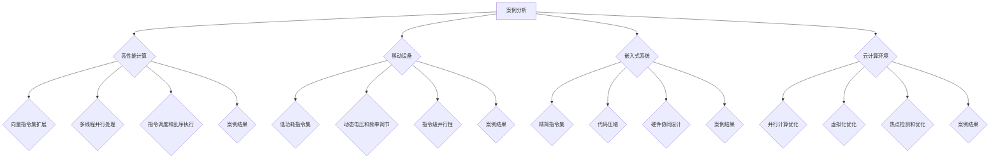

通过这个流程图，我们可以清晰地了解不同应用场景下的指令集优化方法及其具体实现，以及这些方法如何提高系统的性能和效率。

## 第10章 CPU指令集的有限性与局限性的未来发展趋势

### 10.1 指令集设计的未来趋势

随着计算机技术的发展，CPU指令集的设计也在不断演进。未来的指令集设计将朝着以下几个趋势发展：

#### 10.1.1 高度并行性和灵活性

未来的CPU指令集将更加注重高度并行性和灵活性，以满足多核处理器和异构计算的需求。通过引入新的指令和扩展，指令集将支持更高效的并行处理和数据流操作，使处理器能够更好地利用多核和异构计算资源。

#### 10.1.2 软硬件协同优化

未来的指令集设计将更加注重软硬件协同优化，以实现更高的性能和能效比。硬件和软件将更加紧密地结合，通过智能调度、动态调整和优化，实现系统资源的最佳利用。

#### 10.1.3 安全性和隐私保护

随着数据安全和隐私保护的重要性日益增加，未来的指令集设计将更加注重安全性和隐私保护。指令集将引入新的安全特性，如硬件加密、安全隔离和隐私保护机制，以保障数据和系统的安全。

### 10.2 优化技术的演进

未来的优化技术将继续演进，以提高CPU指令集的性能和效率。以下是一些关键的优化技术：

#### 10.2.1 自适应优化

未来的优化技术将更加智能化，能够根据程序运行时的动态行为进行自适应优化。通过实时分析程序的行为和性能瓶颈，优化技术将动态调整指令执行顺序、数据访问模式和资源分配，以最大化性能。

#### 10.2.2 能效优化

随着环保意识的提高，能效优化将成为未来优化技术的重要方向。未来的优化技术将致力于减少CPU的功耗和热设计功耗（TDP），通过低功耗设计、动态电压和频率调节（DVFS）以及高效的数据访问模式，实现绿色计算。

#### 10.2.3 软硬件协同优化

未来的优化技术将更加注重软硬件协同优化，通过软硬件联合设计和优化，实现系统资源的最佳利用。例如，通过硬件加速器和专用处理单元，优化软件算法，以提高整体系统的性能。

### 10.3 新兴技术与指令集的结合

未来的CPU指令集将更加紧密地结合新兴技术，以支持更广泛的应用场景和更高效的计算任务。以下是一些新兴技术与指令集结合的例子：

#### 10.3.1 人工智能和机器学习

随着人工智能和机器学习的快速发展，未来的指令集将引入新的机器学习指令和扩展，以支持高效的人工智能计算。例如，神经网络处理单元（NPU）和量子指令集将逐步应用于CPU指令集中，以提高机器学习任务的性能。

#### 10.3.2 密码学和安全特性

未来的指令集将更加注重密码学和安全特性，以保护数据和系统的安全。新的加密指令和硬件安全特性，如安全加密、零知识证明和侧信道攻击防护，将逐步集成到指令集中。

#### 10.3.3 图形处理和多媒体

随着图形处理和多媒体应用的需求增长，未来的指令集将引入新的多媒体指令和扩展，以支持高效的视频编码、图像处理和音频处理。例如，基于矢量处理和并行计算的多媒体指令集将逐步应用于CPU指令集中。

### 10.4 指令集在多核处理器中的应用

多核处理器已经成为现代计算机系统的主流架构，未来的CPU指令集将在多核处理器中发挥更大的作用。以下是一些关键点：

#### 10.4.1 指令级并行性

未来的指令集将更加注重指令级并行性，以充分利用多核处理器的并行计算能力。通过引入新的指令和扩展，指令集将支持更高效的并行处理和数据流操作，使多核处理器能够更好地发挥其性能。

#### 10.4.2 资源管理和调度

未来的指令集将更加注重资源管理和调度，以实现多核处理器之间的高效协作。通过引入新的调度算法和资源管理策略，指令集将优化多核处理器之间的负载平衡和任务分配，以提高系统的整体性能。

#### 10.4.3 软硬件协同设计

未来的指令集将在软硬件协同设计中发挥关键作用。通过软硬件联合设计和优化，指令集将支持更高效的并行处理和数据流操作，实现系统资源的最佳利用，提高多核处理器的性能和效率。

### 总结

未来的CPU指令集设计将朝着高度并行性、灵活性和安全性方向发展。随着新兴技术的融合，如人工智能、机器学习和量子计算，CPU指令集将在多核处理器中发挥更大的作用。通过自适应优化、能效优化和软硬件协同设计，未来的CPU指令集将实现更高的性能和效率，推动计算机系统的发展。

### Mermaid 流程图

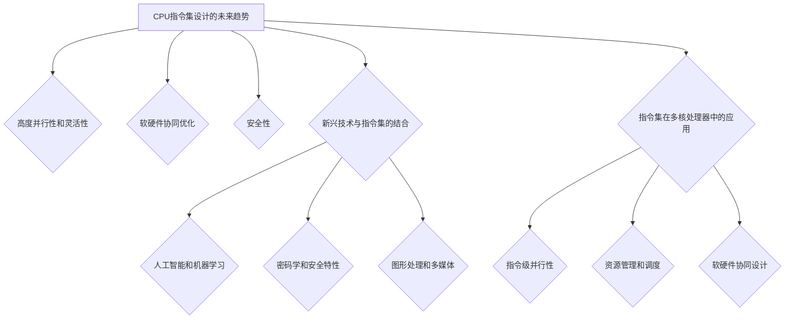

通过这个流程图，我们可以清晰地了解CPU指令集设计的未来发展趋势，以及这些趋势如何影响多核处理器中的应用。这些发展趋势将为未来的计算机系统带来更高的性能和效率。

## 附录

### 附录 A: 相关资源与工具

#### A.1 指令集设计相关工具

1. **Intel Architecture Instruction Set Encoder/Decoder**：用于将汇编代码转换为机器代码，以及将机器代码转换为汇编代码的工具。

2. **ARM Instruction Set Simulator**：用于模拟ARM指令集的行为，帮助开发者理解指令集的工作原理。

3. **MIPS ISA Simulator**：用于模拟MIPS指令集的行为，适合教学和研究使用。

#### A.2 编译器与优化器资源

1. **GNU Compiler Collection (GCC)**：是一款功能强大的编译器，提供了丰富的优化选项。

2. **Clang**：由Apple开发的一款编译器，与GCC兼容，提供了高效的代码生成和优化。

3. **LLVM**：一个模块化的编译器基础设施，提供了优化器、前端和后端，适用于多种编程语言。

#### A.3 指令集学习资源

1. **《计算机组成与设计：硬件/软件接口》（David A. Patterson & John L. Hennessy）**：一本经典的计算机组成与设计教材，详细介绍了指令集架构。

2. **《计算机组成原理》（刘志勇）**：一本中文教材，涵盖了计算机组成原理的基本概念和指令集架构。

3. **在线课程**：如Coursera上的《计算机组成原理》和edX上的《计算机系统结构》等。

#### A.4 实际案例与开源项目参考

1. **LLVM**：一个开源的编译器基础设施，提供了丰富的工具和优化器，适用于多种编程语言和指令集。

2. **Open64**：一个开源的编译器，主要用于优化高性能计算任务。

3. **RISC-V**：一个开源的指令集架构，提供了详细的文档和工具，支持多种硬件和软件平台。

通过这些资源和工具，开发者可以深入了解指令集的设计原理和优化方法，从而在计算机系统的开发和应用中发挥更大的作用。

