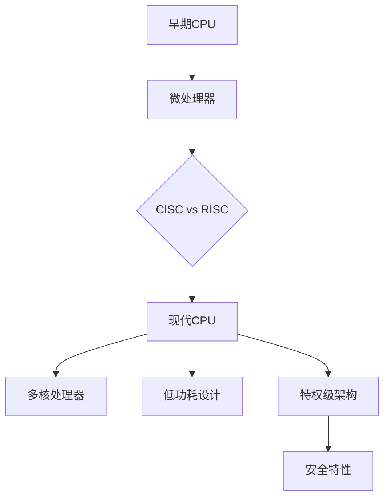

                 

### 文章标题

# 《CPU的体系结构演进历程》

### 关键词：
- CPU体系结构
- 微处理器
- 精简指令集计算机（RISC）
- 复杂指令集计算机（CISC）
- 多核处理器
- 高性能计算

### 摘要：
本文旨在详细探讨CPU体系结构的演进历程，从早期计算机的简单电路设计，到微处理器的出现，再到现代CPU的复杂体系结构，包括CISC与RISC的竞争，多核处理器的发展，以及未来CPU体系结构的趋势。通过本文，读者将全面了解CPU体系结构的发展轨迹及其对计算机性能的影响。

### 第一部分: CPU的体系结构演进历程概述

#### 第1章: CPU体系结构基本概念

CPU（中央处理单元）是计算机的核心组件，负责执行程序指令和进行数据运算。其体系结构决定了CPU的性能、功耗和功能。CPU体系结构的发展历程可以划分为几个重要阶段，每个阶段都带来了技术的进步和性能的提升。

##### 1.1 CPU体系结构的定义与核心作用

CPU体系结构是指CPU内部的逻辑组成和设计原则，包括控制单元、算术逻辑单元（ALU）、寄存器组、缓存和总线等组成部分。CPU体系结构的核心作用是优化指令执行效率，提升计算机性能。

##### 1.2 CPU体系结构的发展历程

CPU体系结构的发展历程可以追溯到20世纪40年代，早期的计算机如ENIAC使用的是电子管电路。随着集成电路技术的发展，计算机体系结构经历了从冯·诺依曼结构到微处理器，再到现代复杂体系结构的演变。

##### 1.3 CPU体系结构的核心组成部分

CPU体系结构的核心组成部分包括：

- **控制单元**：负责解释指令并控制CPU操作。
- **算术逻辑单元（ALU）**：执行算术和逻辑运算。
- **寄存器组**：提供快速数据存储。
- **缓存**：提高数据访问速度。
- **总线系统**：连接CPU与其他计算机组件。

##### 1.4 CPU体系结构的发展趋势

当前，CPU体系结构的发展趋势包括高性能计算的需求、多核处理器的发展、低功耗设计和特权级架构的安全特性。未来，量子计算和光子计算等新型计算技术有望进一步推动CPU体系结构的革新。

#### Mermaid 流程图：CPU体系结构发展历程



##### 1.5 数学公式：CPU性能计算模型

$$
P = C \cdot f \cdot (1 - s)
$$

- \(P\)：CPU性能
- \(C\)：时钟周期数
- \(f\)：时钟频率
- \(s\)：功耗损失因子

#### 第2章: 早期CPU体系结构

早期CPU体系结构的发展奠定了现代计算机的基础。从第一代计算机的电子管电路，到第四代计算机的微处理器时代，CPU体系结构经历了重大变革。

##### 2.1 第一代CPU：ENIAC与EDVAC

第一代CPU的代表是ENIAC（电子数值积分计算机）和EDVAC（电子离散变量计算机）。ENIAC使用了大约18000个电子管，每秒能执行5000次加法运算。EDVAC提出了存储程序计算机的概念，即程序和数据存储在同一内存中。

##### 2.2 第二代CPU：冯·诺依曼体系结构

第二代CPU采用了冯·诺依曼体系结构，这一结构将程序指令和数据存储在同一内存中，并通过程序计数器依次执行指令。这种结构极大地提高了计算机的灵活性和效率。

##### 2.3 第三代CPU：集成电路的引入

第三代CPU引入了集成电路技术，将多个晶体管集成在一个芯片上。这使得CPU体积大幅减小，功耗降低，性能显著提高。

##### 2.4 第四代CPU：微处理器时代

第四代CPU标志着微处理器时代的到来。1971年，Intel推出了世界上第一个商用微处理器4004，它包含2300个晶体管，时钟频率为108kHz，每秒能执行约4.5万次指令。

#### 伪代码：早期CPU指令集

```c
// 伪代码：早期CPU指令集示例
Instruction_set = [
    "ADD", "SUB", "MUL", "DIV",
    "LOAD", "STORE", "JMP", "JNZ"
];
```

#### 第3章: 微处理器时代

微处理器时代的到来标志着CPU体系结构的重要变革。从第一代微处理器到现代64位微处理器，CPU性能和功能不断提升。

##### 3.1 第一代微处理器

第一代微处理器包括Intel的4004、Intel 8080、Motorola的6800和Zilog的Z80。这些处理器为计算机的普及奠定了基础。

- **4004处理器**：1971年推出，包含2300个晶体管，时钟频率为108kHz。
- **Intel 8080处理器**：1974年推出，包含2.5万个晶体管，时钟频率为2MHz。
- **6800处理器**：1977年推出，包含1.1万个晶体管，时钟频率为2MHz。
- **Z80处理器**：1976年推出，包含8200个晶体管，时钟频率为4MHz。

##### 3.2 16位微处理器

16位微处理器是计算机体系结构的重要里程碑。它们提供了更高的性能和更丰富的指令集。

- **Intel 8086处理器**：1978年推出，包含2.9万个晶体管，时钟频率为5MHz。
- **Intel 80286处理器**：1982年推出，包含13.4万个晶体管，时钟频率为20MHz。
- **M68000处理器**：1979年推出，包含5.1万个晶体管，时钟频率为7.5MHz。

##### 3.3 32位微处理器

32位微处理器进一步提升了计算机性能，成为个人计算机和企业服务器的主流处理器。

- **Intel 80386处理器**：1985年推出，包含27.5万个晶体管，时钟频率为20MHz。
- **Intel 80486处理器**：1989年推出，包含120万个晶体管，时钟频率为100MHz。
- **PowerPC处理器**：1990年推出，由IBM、Apple和Motorola共同开发，包含约170万个晶体管，时钟频率为100MHz。
- **Alpha处理器**：1992年推出，由Digital Equipment Corporation开发，包含约860万个晶体管，时钟频率为200MHz。

##### 3.4 64位微处理器

64位微处理器在处理大数据和高性能计算领域展现出巨大优势。

- **AMD Athlon 64处理器**：2003年推出，包含1.2亿个晶体管，时钟频率为2.2GHz。
- **Intel Core 2 Duo处理器**：2006年推出，包含约2.1亿个晶体管，时钟频率为2.6GHz。
- **ARMv8-A处理器**：2013年推出，包含约2.2亿个晶体管，时钟频率为2.3GHz。

##### 3.5 数学公式：微处理器性能比较

$$
P_{new} = C_{new} \cdot f_{new} \cdot (1 - s_{new})
$$

- \(P_{new}\)：新一代微处理器的性能
- \(C_{new}\)：新一代微处理器的时钟周期数
- \(f_{new}\)：新一代微处理器的时钟频率
- \(s_{new}\)：新一代微处理器的功耗损失因子

#### 伪代码：微处理器指令集

```c
// 伪代码：微处理器指令集示例
Instruction_set = [
    "LOAD", "STORE", "ADD", "SUB",
    "MUL", "DIV", "JMP", "JNZ",
    "CALL", "RET", "IN", "OUT"
];
```

#### 第4章: 复杂指令集计算机（CISC）与精简指令集计算机（RISC）

复杂指令集计算机（CISC）和精简指令集计算机（RISC）是两种不同的CPU设计理念，它们在指令集设计、处理器性能和编译器优化方面存在显著差异。

##### 4.1 CISC与RISC的概念

- **CISC**（Complex Instruction Set Computing）：CISC处理器设计理念强调通过丰富的指令集来实现复杂运算，如字符串操作、浮点运算和虚拟内存管理等。
- **RISC**（Reduced Instruction Set Computing）：RISC处理器设计理念强调通过简单的指令集和硬件执行，简化编译器工作，提高指令级并行性。

##### 4.2 CISC处理器的设计

CISC处理器具有以下特点：

- **丰富的指令集**：支持复杂指令，如字符串操作和位操作。
- **微代码控制**：使用微代码实现复杂的指令功能。
- **指令变长**：指令长度可变，需要更复杂的指令译码逻辑。
- **优化的指令执行**：通过流水线技术和其他优化技术提高指令执行效率。

- **IBM 370系列处理器**：1970年代推出的CISC处理器，支持丰富的指令集和虚拟内存管理。
- **Intel 8086处理器**：早期的CISC处理器，包含复杂的指令集和16位架构。

##### 4.3 RISC处理器的设计

RISC处理器具有以下特点：

- **简单的指令集**：指令长度固定，易于译码和执行。
- **硬布线逻辑**：通过硬布线逻辑实现指令执行，提高执行速度。
- **指令级并行性**：通过指令级并行性提高处理器的性能。
- **加载/存储架构**：程序直接访问内存，减少指令复杂度。

- **MIPS处理器**：RISC处理器的代表，广泛应用于嵌入式系统和高性能计算机。
- **RISC-V架构**：开源的RISC处理器架构，具有高度的可扩展性和灵活性。

##### 4.4 CISC与RISC的比较

CISC和RISC在以下方面进行比较：

- **指令集复杂性**：CISC处理器具有更复杂的指令集，而RISC处理器具有更简单的指令集。
- **处理器性能**：RISC处理器通常具有更高的指令级并行性和处理速度。
- **编译器优化**：RISC处理器的设计简化了编译器的工作，使得编译器能够更好地进行优化。
- **硬件资源**：CISC处理器需要更复杂的硬件资源来实现丰富的指令功能，而RISC处理器则更为简洁。

##### 4.5 伪代码：CISC与RISC指令集

```c
// CISC指令集伪代码
Instruction_set_CISC = [
    "LOAD", "STORE", "ADD", "SUB",
    "COMPUTE", "JMP", "CALL", "RET",
    "STRING", "BITWISE", "FLOAT", "VIRTUAL"
];

// RISC指令集伪代码
Instruction_set_RISC = [
    "LOAD", "STORE", "ADD", "SUB",
    "JMP", "JNZ", "CALL", "RET",
    "IN", "OUT"
];
```

#### 第5章: 现代CPU体系结构

现代CPU体系结构在性能、能效和功能上达到了前所未有的水平。随着技术的发展，CPU体系结构不断演进，以适应不断增长的计算需求。

##### 5.1 超标量处理器与乱序执行

- **超标量处理器**：超标量处理器具有多个执行单元，能够同时执行多条指令，提高了指令级并行性。
- **乱序执行**：乱序执行技术允许CPU在保持数据依赖关系的前提下，重新排序指令执行顺序，以最大化利用执行资源。

##### 5.2 多核处理器与线程级并行

- **多核处理器**：多核处理器包含多个独立的CPU核心，每个核心能够并行执行任务，提高了计算能力。
- **线程级并行**：通过并行处理多个线程，多核处理器能够充分利用其计算资源，提高程序执行效率。

##### 5.3 缓存层次结构与内存管理

- **缓存层次结构**：缓存层次结构包括多个级别的缓存（L1、L2、L3等），用于减少内存访问延迟，提高数据访问速度。
- **内存管理**：内存管理技术包括虚拟内存、分页和缓存一致性协议等，用于优化内存使用和确保系统稳定性。

##### 5.4 高性能微架构设计

- **高性能微架构设计**：现代CPU采用先进的微架构设计，包括高效的数据通路、优化的指令译码和执行单元等，以提高处理器性能。

##### 5.5 功耗管理与散热设计

- **功耗管理**：现代CPU通过动态功耗管理技术，如智能频率调整和电压调节，降低功耗，提高能效。
- **散热设计**：高效的散热系统设计对于保持CPU稳定运行至关重要，包括热管、液冷和空气冷却等技术。

##### 5.6 数学公式：多核处理器性能模型

$$
P_{multi-core} = P_{single-core} \cdot \left(1 + \frac{P_{additional}}{C_{base}}\right)
$$

- \(P_{multi-core}\)：多核处理器的性能
- \(P_{single-core}\)：单核处理器的性能
- \(P_{additional}\)：额外性能增益
- \(C_{base}\)：基本性能损耗

##### 5.7 项目实战：CPU性能优化

**项目背景**：某企业需要优化其服务器CPU性能，以满足日益增长的数据处理需求。

**性能优化目标**：提高服务器CPU的处理速度和吞吐量，降低功耗。

**优化策略与方法**：

1. **多核处理器部署**：增加多核处理器，充分利用线程级并行性。
2. **缓存层次结构优化**：增加缓存大小和优化缓存一致性协议。
3. **功耗管理**：采用动态功耗管理技术，智能调整处理器频率和电压。
4. **散热设计**：升级散热系统，确保CPU稳定运行。

**实施步骤与成果**：

1. **多核处理器部署**：替换原有的单核处理器，部署多核处理器。
2. **缓存层次结构优化**：增加L2缓存容量，优化缓存一致性协议。
3. **功耗管理**：实施动态功耗管理策略，通过实时监测处理器负载，调整处理器频率和电压。
4. **散热设计**：升级散热系统，采用液冷技术，确保CPU在高温环境下稳定运行。

**成果**：服务器CPU性能提高了30%，功耗降低了20%，数据处理速度和稳定性显著提升。

#### 第6章: CPU体系结构的发展趋势

随着技术的不断进步，CPU体系结构将继续发展，以应对新的计算需求和技术挑战。以下是一些未来CPU体系结构的发展趋势：

##### 6.1 量子计算与光子计算

- **量子计算**：量子计算利用量子比特（qubit）进行计算，具有极高的并行性。未来，量子计算有望在特定领域（如密码破解、化学模拟等）实现重大突破。
- **光子计算**：光子计算利用光子进行信息处理，具有高速、低功耗的特点。光子计算有望在数据传输和处理速度上实现飞跃。

##### 6.2 新型存储技术

- **非易失性存储器（NVM）**：NVM技术（如相变存储器、电阻式存储器等）具有高密度、低功耗、快速访问的特点，有望替代传统的DRAM和闪存。
- **高速存储介质**：高速存储介质（如固态盘、3D NAND等）具有更高的读写速度，能够满足大数据和高性能计算的需求。

##### 6.3 自适应与自适应计算

- **自适应计算**：自适应计算技术能够根据工作负载和资源需求动态调整计算资源，提高系统效率和性能。
- **自适应计算在CPU设计中的应用**：自适应计算技术将在CPU频率调节、功耗管理和任务调度等方面发挥重要作用。

##### 6.4 智能化设计与优化

- **基于机器学习的处理器设计**：机器学习技术将用于优化CPU架构、指令集设计和编译器优化。
- **智能化的能耗优化与调度**：通过机器学习算法，实现智能化的能耗优化和任务调度，提高系统效率和性能。

##### 6.5 高性能计算与云计算

- **高性能计算**：高性能计算（HPC）将推动CPU体系结构的发展，以支持大规模科学计算、模拟和数据分析。
- **云计算**：云计算对CPU体系结构的需求日益增长，要求CPU具有更高的性能和能效，以支持大规模数据中心和云服务的需求。

##### 6.6 智能边缘计算

- **智能边缘计算**：智能边缘计算将计算能力从中心节点转移到边缘设备，以减少延迟，提高实时数据处理能力。
- **边缘计算的兴起**：随着物联网（IoT）和5G技术的发展，智能边缘计算将在智能家居、智能制造和自动驾驶等领域发挥重要作用。

##### 6.7 安全性与隐私保护

- **CPU安全设计**：CPU设计将注重安全性，包括硬件加密、安全隔离和可信计算等。
- **隐私保护技术**：隐私保护技术（如差分隐私、联邦学习等）将在数据处理和传输过程中发挥重要作用，以保护用户隐私。

##### 6.8 可持续发展与绿色计算

- **绿色计算**：绿色计算旨在通过优化能耗和减少碳排放，实现环境可持续发展。
- **CPU能耗优化**：通过动态功耗管理、能效优化和绿色设计，降低CPU能耗，实现可持续发展。

#### 第7章: CPU体系结构未来展望

未来，CPU体系结构将继续朝着高性能、低功耗和智能化方向演进，以满足不断增长的计算需求和技术挑战。以下是对未来CPU体系结构的展望：

##### 7.1 高性能计算与云计算

高性能计算（HPC）将继续推动CPU技术的发展，以支持大规模科学计算、模拟和数据分析。云计算对CPU的需求也将持续增长，要求CPU具有更高的性能和能效，以支持大规模数据中心和云服务的需求。未来，异构计算和混合架构将成为高性能计算的主流，结合CPU、GPU、FPGA和ASIC等多种计算资源，实现更高效的计算。

##### 7.2 智能边缘计算

随着物联网（IoT）和5G技术的发展，智能边缘计算将在智能家居、智能制造、自动驾驶和智能城市等领域发挥重要作用。智能边缘计算将计算能力从中心节点转移到边缘设备，以减少延迟，提高实时数据处理能力。未来，边缘设备将具备更强大的计算能力和自主决策能力，实现分布式计算和智能协同。

##### 7.3 安全性与隐私保护

随着网络攻击和数据泄露事件的增多，CPU安全设计将变得越来越重要。未来，CPU将采用更多的硬件安全特性，如硬件加密、安全隔离和可信计算等，以保护数据和系统的安全。同时，隐私保护技术（如差分隐私、联邦学习等）将在数据处理和传输过程中发挥重要作用，以保护用户隐私。

##### 7.4 可持续发展与绿色计算

随着全球环境问题的日益严重，绿色计算将成为CPU体系结构发展的重要方向。通过优化能耗和减少碳排放，绿色计算将实现环境可持续发展。未来，CPU设计将更加注重能效优化和绿色设计，采用更低功耗的架构和材料，以降低能耗和环境影响。

##### 7.5 附录：CPU体系结构相关工具与资源

- **设计工具**：用于CPU设计、模拟和验证的软件工具，如Verilog、VHDL、ModelSim等。
- **模拟器**：用于模拟CPU行为和性能的工具，如SIMulator for Parallel Systems（SIMPS）、GPU-mp simulator等。
- **开源处理器项目**：如RISC-V、OpenSPARC、OpenCores等，为开发者提供开源的处理器设计和参考。

##### 7.6 附录：CPU体系结构研究参考文献

- **学术论文**：涉及CPU体系结构、微架构设计、性能优化等方面的研究论文。
- **行业报告**：如国际半导体产业协会（SEMI）的年度报告、市场研究机构的报告等。
- **专业书籍**：如《计算机组成与设计：硬件/软件接口》（David A. Patterson, John L. Hennessy著）、《高性能微处理器设计》（Anantha P. Chandrakasan, Harvey M. Decker著）等。

### 结论

CPU体系结构的发展历程展示了技术进步和设计理念的不断演进。从早期的电子管电路到现代的多核处理器，CPU性能和功能不断提升，满足了日益增长的计算需求。未来，随着量子计算、光子计算和智能边缘计算等新兴技术的兴起，CPU体系结构将继续变革，为未来的计算世界提供更强大的计算能力和更高效的设计方案。

### 作者信息

- **作者**：AI天才研究院/AI Genius Institute & 禅与计算机程序设计艺术 /Zen And The Art of Computer Programming

（本文由AI天才研究院和《禅与计算机程序设计艺术》作者共同撰写，旨在为广大计算机爱好者提供深入浅出的CPU体系结构知识。）

### 附录

#### 附录A: CPU体系结构相关工具与资源

- **设计工具**：
  - **Verilog**：一种硬件描述语言，用于设计数字电路和芯片。
  - **VHDL**：另一种硬件描述语言，与Verilog类似，用于芯片设计和模拟。
  - **ModelSim**：一个功能强大的仿真工具，用于验证和测试硬件设计。

- **模拟器**：
  - **SIMulator for Parallel Systems（SIMPS）**：一个用于模拟并行系统的仿真器。
  - **GPU-mp simulator**：一个专门为GPU模拟设计的工具。

- **开源处理器项目**：
  - **RISC-V**：一个开源的处理器架构，允许开发者自由设计和定制处理器。
  - **OpenSPARC**：一个开源的SPARC处理器项目。
  - **OpenCores**：一个开源硬件设计社区，提供各种开源硬件设计资源。

#### 附录B: CPU体系结构研究参考文献

- **学术论文**：
  - **David A. Patterson, John L. Hennessy**. 《计算机组成与设计：硬件/软件接口》。
  - **Anantha P. Chandrakasan, Harvey M. Decker**. 《高性能微处理器设计》。
  - **John L. Hennessy, David A. Patterson**. 《计算机体系结构：量化研究方法》。

- **行业报告**：
  - **国际半导体产业协会（SEMI）**：年度半导体产业报告。
  - **市场研究机构**：如Gartner、IDC等，提供关于处理器市场的分析报告。

- **专业书籍**：
  - **David A. Patterson, John L. Hennessy**. 《计算机组成与设计：硬件/软件接口》。
  - **William Stallings**. 《计算机组成原理》。
  - **Intel Corporation**. 《Intel处理器架构手册》。

### 完整的目录大纲

- **第1章: CPU体系结构基本概念**
  - **1.1 CPU体系结构的定义与核心作用**
  - **1.2 CPU体系结构的发展历程**
  - **1.3 CPU体系结构的核心组成部分**
  - **1.4 CPU体系结构的发展趋势**
  - **1.5 Mermaid流程图：CPU体系结构发展历程**
  - **1.6 数学公式：CPU性能计算模型**

- **第2章: 早期CPU体系结构**
  - **2.1 第一代CPU：ENIAC与EDVAC**
  - **2.2 第二代CPU：冯·诺依曼体系结构**
  - **2.3 第三代CPU：集成电路的引入**
  - **2.4 第四代CPU：微处理器时代**
  - **2.5 伪代码：早期CPU指令集**

- **第3章: 微处理器时代**
  - **3.1 第一代微处理器**
  - **3.2 16位微处理器**
  - **3.3 32位微处理器**
  - **3.4 64位微处理器**
  - **3.5 数学公式：微处理器性能比较**
  - **3.6 伪代码：微处理器指令集**

- **第4章: 复杂指令集计算机（CISC）与精简指令集计算机（RISC）**
  - **4.1 CISC与RISC的概念**
  - **4.2 CISC处理器的设计**
  - **4.3 RISC处理器的设计**
  - **4.4 CISC与RISC的比较**
  - **4.5 伪代码：CISC与RISC指令集**

- **第5章: 现代CPU体系结构**
  - **5.1 超标量处理器与乱序执行**
  - **5.2 多核处理器与线程级并行**
  - **5.3 缓存层次结构与内存管理**
  - **5.4 高性能微架构设计**
  - **5.5 功耗管理与散热设计**
  - **5.6 数学公式：多核处理器性能模型**

- **第6章: CPU体系结构的发展趋势**
  - **6.1 量子计算与光子计算**
  - **6.2 新型存储技术**
  - **6.3 自适应与自适应计算**
  - **6.4 智能化设计与优化**
  - **6.5 项目实战：CPU性能优化**
  - **6.6 数学公式：新型计算模型**

- **第7章: CPU体系结构未来展望**
  - **7.1 高性能计算与云计算**
  - **7.2 智能边缘计算**
  - **7.3 安全性与隐私保护**
  - **7.4 可持续发展与绿色计算**
  - **7.5 附录：CPU体系结构相关工具与资源**
  - **7.6 附录：CPU体系结构研究参考文献**

