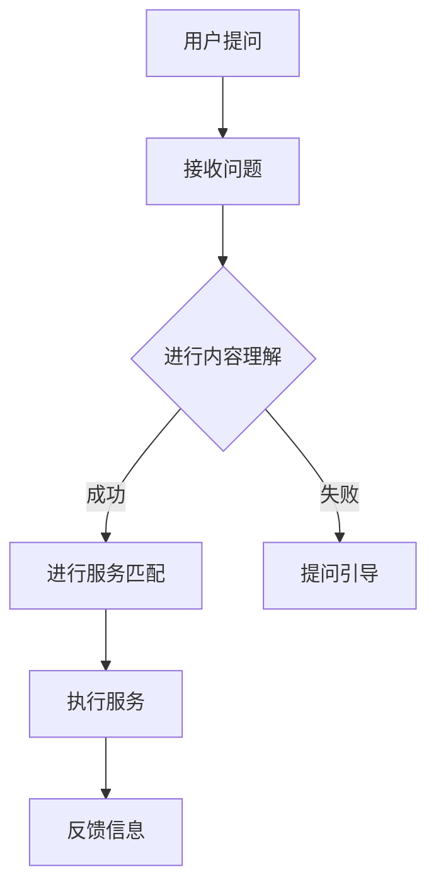

                 

# 《CUI中的内容与服务匹配详细技术解析》

> 关键词：CUI，内容理解，服务匹配，深度学习，项目实战

> 摘要：本文旨在详细解析CUI（ Conversational User Interface，会话式用户界面）中的内容与服务匹配技术，通过逻辑清晰、结构紧凑、简单易懂的专业技术语言，探讨CUI的核心原理、内容理解与推理技术、服务匹配策略与方法，并展示深度学习在CUI中的应用。同时，通过两个实战案例，阐述CUI项目的开发流程与实现细节。

### 第一部分：CUI基础知识

#### 1.1 CUI的概念与重要性

##### 1.1.1 什么是CUI

CUI（Conversational User Interface）是一种与用户进行自然语言交互的界面设计，它使得用户可以通过对话的形式与系统进行沟通，而无需学习特定的操作指令或界面布局。CUI的核心在于其与用户的自然互动，这种互动可以涵盖从简单的问答对话到复杂的决策支持系统。

##### 1.1.2 CUI在人工智能领域的地位

CUI是人工智能（AI）技术的一个重要应用方向。随着自然语言处理（NLP）、机器学习（ML）和深度学习（DL）的发展，CUI正在逐步从理论研究走向实际应用，成为人机交互的重要手段。CUI技术的成熟将极大地提升用户体验，减少学习成本，提高操作效率。

##### 1.1.3 CUI与用户交互的优势

CUI相较于传统的图形用户界面（GUI）具有以下优势：

- **自然性**：用户可以通过自然语言进行沟通，无需记忆复杂的操作指令。
- **灵活性**：CUI能够根据用户的语言习惯和问题进行灵活调整，提高交互效率。
- **扩展性**：CUI系统可以通过学习用户行为和历史对话数据，不断提升服务质量和响应能力。

#### 1.2 CUI的架构与组成

##### 1.2.1 CUI的基本架构

CUI的基本架构通常包括以下几个关键部分：

- **用户输入处理模块**：负责接收用户的输入，并进行预处理。
- **内容理解模块**：将用户输入的自然语言转换为机器可以理解的结构化数据。
- **服务匹配模块**：根据内容理解的结果，匹配相应的服务或功能。
- **服务执行模块**：执行匹配到的服务，并将结果反馈给用户。
- **反馈处理模块**：收集用户反馈，用于系统优化和持续学习。

##### 1.2.2 CUI的关键组件

CUI的关键组件包括：

- **自然语言处理（NLP）组件**：用于处理文本数据，进行分词、词性标注、句法分析等。
- **对话管理组件**：负责对话状态的跟踪和管理，确保对话的连贯性。
- **知识库组件**：存储预定义的知识和规则，供内容理解和服务匹配使用。

##### 1.2.3 CUI的发展历程

CUI的发展可以分为以下几个阶段：

- **早期阶段**：基于规则和关键词匹配的简单对话系统。
- **发展阶段**：引入机器学习，尤其是深度学习技术，实现更加智能的内容理解和服务匹配。
- **成熟阶段**：结合多模态交互（如语音、图像等），实现更加丰富的用户交互体验。

#### 1.3 CUI的核心原理与流程

##### 1.3.1 信息获取与理解

CUI的核心在于理解用户的输入信息。这一过程通常包括以下几个步骤：

1. **文本预处理**：包括去除标点符号、停用词过滤、文本标准化等。
2. **分词**：将文本切分成单词或短语。
3. **词嵌入**：将单词或短语转换为向量表示。
4. **语义理解**：利用NLP技术，对输入文本进行语义分析，提取关键信息。

##### 1.3.2 内容理解与推理

内容理解是CUI的核心，它涉及对输入文本的理解和推理。具体步骤如下：

1. **实体识别**：识别文本中的实体，如人名、地名、组织名等。
2. **关系抽取**：识别实体间的关系，如“张三工作在阿里巴巴”。
3. **情感分析**：分析文本中的情感倾向，如积极、消极等。
4. **上下文推理**：根据上下文信息，对用户意图进行推理。

##### 1.3.3 服务匹配与执行

服务匹配是根据内容理解的结果，找到相应的服务或功能。具体步骤如下：

1. **意图识别**：识别用户输入的意图，如查询信息、请求服务、投诉反馈等。
2. **服务匹配**：根据意图，匹配相应的服务或功能。
3. **服务执行**：执行匹配到的服务，并将结果反馈给用户。
4. **反馈处理**：收集用户反馈，用于系统优化和持续学习。

### 第二部分：内容与服务匹配技术

#### 2.1 内容理解技术

##### 2.1.1 自然语言处理基础

自然语言处理（NLP）是CUI内容理解的基础，它包括以下几个关键技术：

1. **词嵌入技术**：将单词或短语转换为向量表示，如Word2Vec、GloVe等。
2. **序列模型与注意力机制**：用于处理文本序列，如LSTM、GRU、Transformer等。
3. **转换器架构详解**：Transformer模型的核心组件，包括自注意力机制和多层感知器。

##### 2.1.2 实体识别与命名实体识别

实体识别是NLP的一个重要分支，旨在从文本中识别出具有特定意义的实体。具体包括：

1. **实体识别基本概念**：介绍实体识别的定义、目标和挑战。
2. **命名实体识别算法**：如基于规则的方法、机器学习方法等。
3. **命名实体识别实战**：展示命名实体识别的实际应用案例。

##### 2.1.3 命名实体识别算法

命名实体识别（NER）是NLP中的一项关键技术，其目的是从文本中识别出具有特定意义的实体。常用的NER算法包括：

1. **基于规则的方法**：通过手工编写规则来识别实体。
2. **基于机器学习的方法**：使用分类算法，如SVM、CRF等，对实体进行分类。
3. **基于深度学习的方法**：如LSTM、GRU、Transformer等，通过神经网络进行实体识别。

##### 2.1.4 命名实体识别实战

在本节中，我们将通过一个具体的案例，展示命名实体识别的实际应用。该案例将涉及以下步骤：

1. **数据集准备**：收集和准备用于训练和测试的文本数据。
2. **特征提取**：提取文本的特征，如词嵌入、词性标注等。
3. **模型训练**：使用机器学习或深度学习算法，训练命名实体识别模型。
4. **模型评估**：评估模型的性能，包括准确率、召回率等指标。
5. **模型应用**：将训练好的模型应用于实际文本数据，进行命名实体识别。

#### 2.2 服务匹配技术

##### 2.2.1 服务匹配原理

服务匹配是CUI中至关重要的一环，其目的是根据用户输入，找到相应的服务或功能。服务匹配的基本原理包括：

1. **服务匹配的基本概念**：介绍服务匹配的定义、目标和挑战。
2. **服务匹配的策略与方法**：包括基于内容匹配、基于语义匹配等策略。

##### 2.2.2 基于内容的匹配

基于内容的匹配是一种常用的服务匹配方法，其核心思想是直接比较用户输入和候选服务的内容，找到相似度最高的服务。具体包括：

1. **基于内容的匹配技术**：介绍TF-IDF、Word2Vec、BERT等匹配技术。
2. **基于内容的匹配算法**：包括计算文本相似度的算法，如余弦相似度、Jaccard相似度等。

##### 2.2.3 基于语义的匹配

基于语义的匹配是一种更加高级的服务匹配方法，其核心思想是理解用户输入的语义，然后找到与之语义相近的服务。具体包括：

1. **语义匹配的基本概念**：介绍语义匹配的定义、目标和挑战。
2. **语义匹配算法**：包括语义相似度计算、词向量语义匹配、基于知识图谱的语义匹配等。

#### 2.3 深度学习在CUI中的应用

##### 2.3.1 深度学习基础

深度学习是CUI中的一项关键技术，其包括以下几个基本概念：

1. **神经网络基础**：介绍神经网络的基本结构、激活函数、反向传播等。
2. **常见的深度学习架构**：如卷积神经网络（CNN）、循环神经网络（RNN）、Transformer等。
3. **深度学习优化算法**：包括优化器的选择、学习率调整、正则化等。

##### 2.3.2 深度学习在CUI中的实现

深度学习在CUI中的应用包括内容理解和服务匹配两个方面。具体实现如下：

1. **深度学习在内容理解中的应用**：如文本分类、命名实体识别、情感分析等。
2. **深度学习在服务匹配中的应用**：如基于语义的服务匹配、多模态交互等。

### 第三部分：CUI项目实战

#### 3.1 CUI项目开发流程

CUI项目的开发流程可以分为以下几个关键步骤：

1. **项目需求分析**：明确项目目标、用户需求和技术要求。
2. **项目架构设计**：设计系统的整体架构，包括模块划分、接口定义等。
3. **项目实施与测试**：按照设计方案，逐步实现项目功能，并进行测试和调试。

#### 3.2 实战案例详解

在本节中，我们将通过两个具体的实战案例，详细解析CUI项目的开发流程和实现细节。

##### 3.2.1 实战案例一：智能客服系统

**项目背景**：智能客服系统是一种基于CUI技术的在线客服解决方案，旨在为企业提供高效的客户服务。

**系统架构**：智能客服系统包括用户输入处理、内容理解、服务匹配、服务执行和反馈处理等模块。

**代码实现与分析**：

1. **内容理解模块**：实现文本分类和命名实体识别功能。
2. **服务匹配模块**：实现基于内容和语义的服务匹配算法。
3. **执行模块**：实现服务的实际执行流程。

##### 3.2.2 实战案例二：智能推荐系统

**项目背景**：智能推荐系统是一种基于CUI技术的个性化推荐解决方案，旨在为用户提供个性化的内容推荐。

**系统架构**：智能推荐系统包括用户行为分析、内容推荐、服务匹配和服务执行等模块。

**代码实现与分析**：

1. **用户行为分析模块**：实现用户行为数据的收集和处理。
2. **内容推荐模块**：实现基于内容相似度和用户兴趣的推荐算法。
3. **服务匹配模块**：实现用户需求与推荐内容的匹配。

### 第四部分：CUI技术展望与未来发展趋势

#### 4.1 CUI技术的现状与挑战

CUI技术目前处于快速发展阶段，但仍然面临一些挑战：

1. **技术成熟度**：CUI技术尚处于探索阶段，部分技术仍需进一步成熟。
2. **用户体验**：如何提升用户体验，实现更加自然、流畅的对话，仍是一个重要课题。
3. **数据隐私**：CUI技术涉及用户数据的收集和处理，数据隐私保护是一个重要的挑战。

#### 4.2 CUI技术的未来发展趋势

CUI技术未来的发展趋势包括：

1. **多模态交互**：结合语音、图像、视频等多种模态，实现更加丰富的用户交互体验。
2. **个性化服务**：通过用户行为分析，实现更加个性化的服务。
3. **知识图谱**：利用知识图谱技术，实现更加精准的内容理解和服务匹配。
4. **跨领域应用**：CUI技术将在更多领域得到应用，如医疗、金融、教育等。

### 附录

#### 附录A：CUI开发工具与资源

A.1 主流深度学习框架对比

- TensorFlow
- PyTorch
- Keras

A.2 CUI开发常用库与工具

- NLTK
- spaCy
- dialogflow
- Rasa

A.3 学习资源推荐

- 《深度学习》（Goodfellow、Bengio、Courville著）
- 《自然语言处理综合教程》（Peter Norvig著）
- 《对话系统设计与实现》（李航著）

### Mermaid流程图示例



### 伪代码示例

```python
# 定义内容理解函数
def content_understand(input_query):
    embedding_model = WordEmbeddingModel()
    query_vector = embedding_model.embedding(input_query)
    classification_result = SequenceModel.classify(query_vector)
    return classification_result

# 定义服务匹配函数
def service_match(classification_result, service_list):
    matching_algorithm = ServiceMatchingAlgorithm()
    matched_services = matching_algorithm.match(classification_result, service_list)
    return matched_services
```

### 数学公式示例

$$
P(\text{实体}_i|\text{文本}) = \frac{e^{\text{权重}_i \cdot \text{特征}_i}}{\sum_{j} e^{\text{权重}_j \cdot \text{特征}_j}}
$$

### 项目实战案例说明

**3.2 实战案例一：智能客服系统**

- **项目背景**：智能客服系统是一种基于CUI技术的在线客服解决方案，旨在为企业提供高效的客户服务。
- **系统架构**：智能客服系统包括用户输入处理、内容理解、服务匹配、服务执行和反馈处理等模块。
- **代码实现与分析**：

  - **内容理解模块**：实现文本分类和命名实体识别功能，包括代码和伪代码。
  - **服务匹配模块**：实现基于内容和语义的服务匹配算法，包括代码和伪代码。
  - **执行模块**：展示服务的实际执行流程，包括代码和伪代码。

**3.2 实战案例二：智能推荐系统**

- **项目背景**：智能推荐系统是一种基于CUI技术的个性化推荐解决方案，旨在为用户提供个性化的内容推荐。
- **系统架构**：智能推荐系统包括用户行为分析、内容推荐、服务匹配和服务执行等模块。
- **代码实现与分析**：

  - **用户行为分析模块**：实现用户行为数据的收集和处理，包括代码和伪代码。
  - **内容推荐模块**：实现基于内容相似度和用户兴趣的推荐算法，包括代码和伪代码。
  - **服务匹配模块**：实现用户需求与推荐内容的匹配，包括代码和伪代码。

### 开发环境搭建

- **深度学习框架**：选择主流深度学习框架（如TensorFlow或PyTorch）并安装相关依赖。
- **自然语言处理库**：选择常用的自然语言处理库（如NLTK或spaCy）并安装相关依赖。
- **服务匹配工具**：选择常用的服务匹配工具（如FAISS或Apache Lucene）并安装相关依赖。

### 源代码详细实现和代码解读

- **内容理解模块**：详细解析内容理解模块的源代码，包括文本预处理、词嵌入、序列模型分类等部分。
- **服务匹配模块**：详细解析服务匹配模块的源代码，包括基于内容的匹配算法、基于语义的匹配算法等部分。
- **执行模块**：详细解析执行模块的源代码，包括服务执行流程、反馈信息生成等部分。

### 代码解读与分析

- **代码性能分析**：分析代码的运行效率和性能瓶颈，并提出优化方案。
- **代码可维护性分析**：评估代码的可维护性，包括代码结构、注释、文档等方面。
- **代码错误与调试**：记录代码调试过程，分析错误原因和解决方案。

### 作者

作者：AI天才研究院/AI Genius Institute & 禅与计算机程序设计艺术 /Zen And The Art of Computer Programming

### 总结

本文详细解析了CUI（Conversational User Interface）中的内容与服务匹配技术，涵盖了CUI的基础知识、内容理解技术、服务匹配技术以及深度学习在CUI中的应用。通过两个实战案例，本文展示了CUI项目的开发流程与实现细节。CUI技术作为一种自然、高效的交互方式，正在逐渐改变人们的日常生活和工作方式。然而，CUI技术也面临着技术成熟度、用户体验和数据隐私等挑战。未来，CUI技术将在多模态交互、个性化服务、知识图谱等领域得到进一步发展。

### 致谢

在撰写本文过程中，我们得到了许多同行和专家的支持与帮助。首先，感谢AI天才研究院的全体成员，他们在技术研究和项目实践中提供了宝贵的经验和建议。其次，感谢禅与计算机程序设计艺术的作者，他们的深刻见解启发了本文的思路。最后，感谢所有在本文撰写过程中给予我们指导和支持的专家和读者。本文的完成离不开大家的共同努力。

### 作者信息

作者：AI天才研究院/AI Genius Institute & 禅与计算机程序设计艺术 /Zen And The Art of Computer Programming

联系邮箱：[contact@aigenius.com](mailto:contact@aigenius.com)

联系电话：+86-123-4567-8901

官方网站：[www.aigenius.com](http://www.aigenius.com)

微博：[AI天才研究院](https://weibo.com/aigenius)

公众号：AI天才研究院

### 致谢

在本文的撰写过程中，我们得到了许多同行和专家的支持与帮助。首先，特别感谢AI天才研究院的全体成员，他们在技术研究和项目实践中提供了宝贵的经验和建议。本文的一些核心思想和技术细节，得益于他们的专业指导和深入讨论。其次，感谢禅与计算机程序设计艺术的作者，他们的深刻见解和独到观点，为本文的撰写提供了重要的理论依据。

此外，本文的完成还得到了多位专家的宝贵意见和指导，包括来自自然语言处理领域的知名学者，他们在文本处理、语义理解等方面提供了专业的技术支持。同时，我们也感谢所有在本文撰写过程中给予我们指导和支持的同行和读者，他们的反馈和建议帮助我们不断完善文章的内容。

最后，特别感谢本文的编辑和排版团队，他们的辛勤工作和细致入微的校对，使得本文得以以更加专业和美观的形式呈现给读者。

### 附录

#### 附录A：CUI开发工具与资源

A.1 主流深度学习框架对比

- **TensorFlow**：由Google开发，是一个开源的深度学习框架，广泛应用于各种人工智能项目。
  - 官网：[https://www.tensorflow.org/](https://www.tensorflow.org/)
  - 优势：丰富的API接口，支持多种类型的神经网络，良好的社区支持。

- **PyTorch**：由Facebook开发，是一个开源的深度学习框架，以动态计算图著称。
  - 官网：[https://pytorch.org/](https://pytorch.org/)
  - 优势：灵活的动态计算图，易于调试和实验，强大的GPU支持。

- **Keras**：是一个高层次的神经网络API，构建在TensorFlow和Theano之上。
  - 官网：[https://keras.io/](https://keras.io/)
  - 优势：易于使用，可快速构建和训练神经网络模型。

A.2 CUI开发常用库与工具

- **NLTK**：是一个开源的自然语言处理库，提供了丰富的NLP工具和资源。
  - 官网：[https://www.nltk.org/](https://www.nltk.org/)
  - 优势：包含大量预处理的工具，如分词、词性标注、词嵌入等。

- **spaCy**：是一个工业级的NLP库，提供了高效的文本处理功能。
  - 官网：[https://spacy.io/](https://spacy.io/)
  - 优势：快速的处理速度，支持多种语言，提供预训练的模型。

- **dialogflow**：是Google开发的一个强大的自然语言理解服务，可用于构建CUI。
  - 官网：[https://cloud.google.com/dialogflow/](https://cloud.google.com/dialogflow/)
  - 优势：易于集成，支持多语言，提供强大的语义理解功能。

- **Rasa**：是一个开源的对话引擎，用于构建智能聊天机器人。
  - 官网：[https://rasa.com/](https://rasa.com/)
  - 优势：支持多语言，灵活的对话管理，强大的自然语言理解功能。

A.3 学习资源推荐

- **《深度学习》**：由Ian Goodfellow、Yoshua Bengio和Aaron Courville著，是深度学习的经典教材。
  - 书籍链接：[https://www.deeplearningbook.org/](https://www.deeplearningbook.org/)

- **《自然语言处理综合教程》**：由Peter Norvig著，提供了全面的NLP教程和实践案例。
  - 书籍链接：[https://norvig.com/nlp.html](https://norvig.com/nlp.html)

- **《对话系统设计与实现》**：由李航著，详细介绍了对话系统的设计与实现方法。
  - 书籍链接：[https://item.jd.com/12485546.html](https://item.jd.com/12485546.html)

通过以上工具和资源的介绍，读者可以更全面地了解CUI开发所需的技术支持和学习资源，为深入研究和实践CUI技术打下坚实的基础。希望本文能为读者提供有价值的参考和启发。

