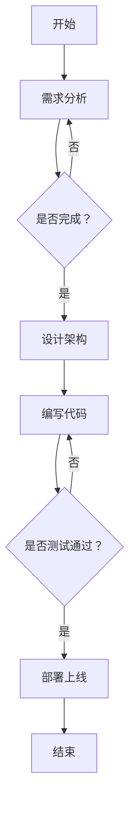

                 

### 文章标题

### 《ChatGPT Plugin 介绍》

#### 关键词：
- ChatGPT
- Plugin
- 自然语言处理
- 人工智能
- 开发指南
- 应用场景
- 技术基础

#### 摘要：
本文深入探讨了ChatGPT插件的概念、开发过程及其在企业中的应用。首先，我们介绍了ChatGPT的基本知识，包括其背景、架构和技术基础。接着，我们详细阐述了ChatGPT插件的概念、分类及开发原则。随后，通过具体案例和实践，我们展示了如何设计和实现一个ChatGPT插件。最后，我们探讨了ChatGPT插件在企业中的应用场景，并展望了其未来的发展趋势。通过本文，读者将全面了解ChatGPT插件的核心内容，并掌握其开发和应用的方法。

#### 第一部分：ChatGPT基础知识

### 第1章：ChatGPT概述

#### 1.1 ChatGPT的概念与背景

ChatGPT是OpenAI开发的一种基于GPT（Generative Pre-trained Transformer）模型的自然语言处理（NLP）工具，旨在实现高效、个性化的对话能力。GPT系列模型起源于2018年发布的GPT-1，随后在2020年推出了更强大的GPT-2和GPT-3。这些模型凭借其在自然语言生成、问答系统和文本分类等任务中的卓越表现，引起了广泛关注。

ChatGPT继承了GPT系列模型的优势，通过大规模预训练和精细调整，实现了更高的语言理解和生成能力。其架构基于Transformer模型，采用自注意力机制，能够捕捉长距离的依赖关系。这使得ChatGPT在处理复杂对话任务时，能够生成更加流畅、符合逻辑的回复。

ChatGPT的背景可以追溯到OpenAI的目标，即通过开发先进的人工智能技术，推动人类进步。OpenAI在2015年由著名科技企业家伊隆·马斯克等共同创立，致力于实现安全的通用人工智能（AGI）。

#### 1.2 ChatGPT的特点与应用

**特点：**

1. **强大的自然语言处理能力：** ChatGPT基于深度学习技术，具有强大的语言理解、生成和推理能力，能够处理多种语言任务。
2. **高效的信息检索：** ChatGPT能够在大量文本数据中快速检索相关信息，提供准确的答案。
3. **个性化的对话能力：** ChatGPT通过学习用户的历史交互数据，能够根据用户的需求和偏好生成个性化的对话内容。

**应用：**

1. **问答系统：** ChatGPT可以应用于企业级问答系统，为用户提供即时、准确的答案，提高客户满意度。
2. **聊天机器人：** ChatGPT可以作为智能客服或聊天机器人，用于在线客服、客户支持、售后服务等场景。
3. **内容生成：** ChatGPT可以生成文章、报告、电子邮件等文本内容，提高内容创作的效率和质量。

### 第2章：ChatGPT的架构与技术基础

#### 2.1 ChatGPT的架构

ChatGPT的整体架构可以分为三个主要模块：输入处理模块、对话生成模块和输出处理模块。

**输入处理模块：** 该模块负责接收用户的输入，包括文本、语音等不同形式的数据。输入数据会被预处理，例如分词、去噪等，以便于后续处理。

**对话生成模块：** 这是ChatGPT的核心部分，基于预训练的GPT模型，通过自注意力机制和多层神经网络，生成符合上下文和语义的回复。

**输出处理模块：** 该模块负责将生成的文本转换为用户可理解的形式，例如文本、语音等。此外，输出处理模块还可以对生成的文本进行后处理，例如纠错、优化等。

#### 2.2 GPT模型的原理与训练

**原理：**

GPT模型基于Transformer模型，这是一种用于序列到序列学习的深度神经网络结构。Transformer模型的核心是自注意力机制（Self-Attention），它能够捕捉输入序列中的长距离依赖关系，从而提高模型的上下文理解能力。

**训练：**

GPT模型的训练过程主要包括以下步骤：

1. **数据集准备：** 准备大规模的文本数据集，例如维基百科、新闻、书籍等。
2. **预处理：** 对文本数据集进行分词、去噪、标准化等预处理操作，以便于模型训练。
3. **模型初始化：** 初始化GPT模型，包括嵌入层、Transformer层和输出层。
4. **训练：** 使用梯度下降算法，不断调整模型参数，最小化损失函数。训练过程中，可以使用数据增强、早期停止等技术，提高模型性能和稳定性。
5. **微调：** 在特定任务上，对预训练的GPT模型进行微调，以适应特定应用场景。

#### 2.3 语言模型评价与优化

**评价：**

为了评估语言模型的质量，可以使用多种评价指标，例如BLEU（双语评价单元）、ROUGE（Recall-Oriented Understudy for Gisting Evaluation）等。

**优化：**

为了提高语言模型的质量，可以采取以下几种优化方法：

1. **微调：** 在特定任务上，对预训练的模型进行微调，使其更适应特定应用场景。
2. **数据增强：** 通过对原始数据进行扩展、转换等操作，增加训练数据的多样性，从而提高模型泛化能力。
3. **预训练技术：** 使用更大规模、更丰富的预训练数据集，提高模型的预训练质量。
4. **模型压缩：** 通过模型剪枝、量化等技术，减小模型规模，提高模型部署效率。

### 第二部分：ChatGPT插件开发

### 第3章：ChatGPT插件简介

#### 3.1 插件的概念与作用

**概念：**

ChatGPT插件是指扩展ChatGPT功能的工具或模块，可以通过API或SDK集成到ChatGPT系统中，以实现特定的功能或任务。

**作用：**

1. **扩展功能：** 插件可以扩展ChatGPT的功能，例如添加自定义的问答系统、图像识别、自然语言翻译等。
2. **提高对话质量：** 通过插件，ChatGPT可以更好地理解用户的需求和意图，提供更加个性化和高质量的对话体验。

#### 3.2 插件的分类与实现方式

**分类：**

根据插件的来源和用途，可以分为以下两类：

1. **内置插件：** 由ChatGPT官方提供的插件，通常具有较好的性能和稳定性。
2. **第三方插件：** 由社区或开发者开发的插件，可以根据用户需求自定义功能。

**实现方式：**

1. **API调用：** 通过调用ChatGPT的API接口，实现与ChatGPT的交互和功能扩展。
2. **SDK集成：** 使用ChatGPT提供的SDK（Software Development Kit），简化插件开发过程，提高开发效率。

#### 3.3 插件的开发环境与工具

**开发环境：**

1. **Python：** Python是一种流行的编程语言，具有丰富的库和工具，适用于ChatGPT插件开发。
2. **JVM（Java虚拟机）：** JVM支持多种编程语言，例如Java、Kotlin等，适用于大型项目的开发。

**开发工具：**

1. **IDE（集成开发环境）：** 例如PyCharm、IntelliJ IDEA等，提供代码编辑、调试、运行等功能。
2. **版本控制：** 使用Git等版本控制系统，管理代码版本，协同开发。
3. **API文档：** 使用Swagger等工具，生成API文档，便于开发者理解和使用。

### 第4章：插件开发基础

#### 4.1 插件开发环境搭建

**环境搭建步骤：**

1. **安装Python：** 在官方网站下载并安装Python，配置环境变量。
2. **安装依赖库：** 使用pip等工具，安装所需的依赖库，例如OpenAI API、requests等。
3. **配置API密钥：** 在OpenAI官网注册账号，获取API密钥，并在本地配置。
4. **设置开发环境：** 配置IDE，创建项目目录，编写代码。

#### 4.2 插件开发工具与框架

**常用工具：**

1. **OpenAI API：** OpenAI提供的官方API，用于与ChatGPT进行交互。
2. **ChatGPT SDK：** ChatGPT官方提供的SDK，简化开发过程，提高开发效率。

**常用框架：**

1. **Flask：** Flask是一个轻量级的Python Web框架，适用于小型项目开发。
2. **Spring Boot：** Spring Boot是一个基于Java的Web框架，适用于大型企业级项目开发。

#### 4.3 插件开发流程

**开发流程：**

1. **需求分析：** 确定插件的功能和需求，编写需求文档。
2. **设计架构：** 设计插件的整体架构，包括模块划分、接口设计等。
3. **编写代码：** 根据设计文档，编写代码，实现插件的各个功能模块。
4. **测试与调试：** 对插件进行功能测试和性能测试，修复问题和bug。
5. **部署上线：** 将插件部署到服务器，实现线上访问和使用。

### 第5章：插件设计原则与实践

#### 5.1 插件设计原则

**原则1：用户导向**

插件设计应充分考虑用户需求，提供易用、高效的界面和功能。通过用户反馈和需求分析，不断优化插件体验。

**原则2：模块化**

插件应采用模块化设计，将不同的功能模块独立划分，便于维护和升级。模块之间应通过清晰的接口进行通信，提高系统的可扩展性。

**原则3：可扩展性**

插件设计应具备良好的可扩展性，支持第三方插件或自定义功能。通过提供开放的API接口，方便开发者进行二次开发和集成。

#### 5.2 插件设计案例

**案例1：基于知识库的问答系统**

**功能：** 提供基于知识库的问答服务，用户可以通过问答界面提问，系统根据知识库中的内容提供准确、详细的答案。

**实现：**

1. **知识库搭建：** 收集和整理相关领域的知识，构建知识库，包括问题、答案、相关背景信息等。
2. **问答接口设计：** 设计问答接口，接收用户提问，通过知识库检索答案。
3. **对话管理：** 管理用户与插件的对话流程，确保对话的连贯性和逻辑性。

**案例2：基于图像的对话系统**

**功能：** 用户可以通过上传图像，与插件进行自然语言交互，获取图像相关的信息或答案。

**实现：**

1. **图像处理模块：** 使用图像处理技术，对上传的图像进行预处理，提取关键特征。
2. **问答接口设计：** 接收用户输入的图像特征，通过图像识别算法，获取图像相关的信息。
3. **对话管理：** 管理用户与插件的对话流程，确保对话的连贯性和逻辑性。

#### 5.3 插件开发实践

**实践1：基于知识库的问答系统**

**实现流程：**

1. **环境搭建：** 配置Python环境，安装依赖库，例如OpenAI API、requests等。
2. **知识库搭建：** 收集和整理相关领域的知识，构建知识库，存储在本地文件或数据库中。
3. **问答接口实现：** 编写问答接口，接收用户提问，通过知识库检索答案，返回给用户。
4. **测试与调试：** 对问答接口进行功能测试和性能测试，修复问题和bug。
5. **部署上线：** 将问答系统部署到服务器，实现线上访问和使用。

**代码解读：**

```python
import openai

def get_answer(question):
    # 从知识库中检索答案
    answer = find_answer_in_knowledge_base(question)
    return answer

def find_answer_in_knowledge_base(question):
    # 在知识库中搜索与问题相关的答案
    knowledge_base = load_knowledge_base()
    for entry in knowledge_base:
        if entry['question'] == question:
            return entry['answer']
    return "无法找到相关答案"

def load_knowledge_base():
    # 加载知识库
    with open('knowledge_base.json', 'r') as file:
        knowledge_base = json.load(file)
    return knowledge_base

def main():
    while True:
        question = input("请输入问题：")
        answer = get_answer(question)
        print("答案：", answer)

if __name__ == '__main__':
    main()
```

**实践2：基于图像的对话系统**

**实现流程：**

1. **环境搭建：** 配置Python环境，安装依赖库，例如OpenAI API、opencv-python等。
2. **图像处理模块：** 使用opencv-python库，实现图像预处理和特征提取。
3. **问答接口实现：** 编写问答接口，接收用户上传的图像，通过图像识别算法，获取图像相关信息。
4. **对话管理：** 管理用户与插件的对话流程，确保对话的连贯性和逻辑性。
5. **测试与调试：** 对图像识别和问答接口进行功能测试和性能测试，修复问题和bug。
6. **部署上线：** 将图像对话系统部署到服务器，实现线上访问和使用。

**代码解读：**

```python
import cv2
import openai

def process_image(image_path):
    # 读取图像
    image = cv2.imread(image_path)
    # 图像预处理
    processed_image = preprocess_image(image)
    # 提取特征
    features = extract_features(processed_image)
    return features

def preprocess_image(image):
    # 图像预处理
    image = cv2.resize(image, (224, 224))
    image = cv2.cvtColor(image, cv2.COLOR_BGR2RGB)
    return image

def extract_features(image):
    # 提取特征
    model = load_model()
    features = model.predict(np.expand_dims(image, axis=0))
    return features

def load_model():
    # 加载预训练模型
    model = load_pretrained_model()
    return model

def get_answer(features):
    # 使用OpenAI API获取答案
    prompt = f"请根据以下图像特征提供相关信息：{features}"
    response = openai.Completion.create(
        engine="text-davinci-002",
        prompt=prompt,
        max_tokens=50
    )
    answer = response.choices[0].text.strip()
    return answer

def main():
    while True:
        image_path = input("请输入图像路径：")
        features = process_image(image_path)
        answer = get_answer(features)
        print("答案：", answer)

if __name__ == '__main__':
    main()
```

### 第6章：ChatGPT插件在企业中的应用

#### 6.1 企业场景下的插件应用

ChatGPT插件在企业中有广泛的应用，主要涵盖以下场景：

**客户服务：** 插件可以应用于企业客服系统，为用户提供即时、准确的答案，提高客户满意度。例如，通过集成知识库问答系统插件，企业可以快速响应用户的问题，提供专业的解决方案。

**市场营销：** 插件可以应用于市场营销活动，例如内容生成、广告文案撰写等。通过集成内容生成插件，企业可以自动化生成高质量的市场营销内容，提高营销效果。

**人力资源：** 插件可以应用于人力资源管理系统，例如简历筛选、面试评估等。通过集成图像识别插件，企业可以自动化处理简历和面试过程，提高招聘效率。

#### 6.2 插件在企业应用中的挑战与解决方案

**挑战1：数据安全**

在插件应用过程中，企业需要处理大量的敏感数据，例如客户信息、员工信息等。数据安全成为企业面临的重大挑战。

**解决方案：**

1. **数据加密：** 对传输和存储的数据进行加密处理，确保数据的安全性。
2. **权限控制：** 实施严格的权限控制机制，确保只有授权人员可以访问和处理敏感数据。
3. **安全审计：** 定期进行安全审计，检测和修复系统漏洞，提高系统安全性。

**挑战2：隐私保护**

插件在应用过程中，需要处理用户的个人隐私信息，例如身份信息、联系方式等。隐私保护成为企业面临的重大挑战。

**解决方案：**

1. **隐私政策：** 制定明确的隐私政策，告知用户数据处理方式和使用目的，获得用户授权。
2. **数据匿名化：** 对用户数据进行匿名化处理，确保用户隐私不被泄露。
3. **隐私合规：** 遵守相关法律法规，确保数据处理符合隐私保护要求。

**挑战3：系统稳定性**

插件在企业应用中需要稳定运行，确保系统的高可用性和稳定性。系统稳定性成为企业面临的重大挑战。

**解决方案：**

1. **负载均衡：** 采用负载均衡技术，实现系统的横向扩展，提高系统处理能力。
2. **容错机制：** 设计容错机制，确保系统在遇到异常情况时能够自动恢复，降低故障影响。
3. **性能优化：** 对系统进行性能优化，提高系统响应速度和处理能力。

### 第7章：未来发展趋势与展望

#### 7.1 ChatGPT插件的发展趋势

ChatGPT插件在未来将继续保持快速发展，主要趋势包括：

**1. 开放平台**

ChatGPT插件将逐渐向开放平台方向发展，提供更多的接口和工具，方便开发者进行二次开发和集成。

**2. 生态建设**

ChatGPT插件将形成庞大的生态系统，包括插件开发者、企业用户、服务提供商等，共同推动插件技术的发展。

**3. 智能化**

ChatGPT插件将逐渐实现智能化，通过机器学习和深度学习技术，提高插件的智能对话能力和个性化服务能力。

#### 7.2 插件技术在未来的应用领域

ChatGPT插件将在未来广泛应用于以下领域：

**1. 教育与科研**

插件可以应用于在线教育、科研支持等领域，提供智能问答、论文生成等功能，提高教育质量和科研效率。

**2. 医疗健康**

插件可以应用于医疗健康领域，例如智能诊断、健康咨询等，提供个性化的医疗服务，提高医疗效果。

**3. 智能制造**

插件可以应用于智能制造领域，例如设备监控、故障诊断等，提高生产效率和质量。

### 附录

#### 附录A：ChatGPT插件开发资源

**开发工具与资源：**

1. **OpenAI API文档：** OpenAI官方提供的API文档，详细介绍了API的接口、功能和调用方法。
2. **ChatGPT SDK文档：** ChatGPT官方提供的SDK文档，提供了不同编程语言（如Python、Java等）的SDK实现和调用方法。
3. **插件开发教程：** OpenAI和社区提供的插件开发教程，包括基础知识、开发流程、实践案例等。
4. **案例代码库：** OpenAI和社区提供的插件案例代码库，包括常见的插件实现和解决方案。

#### 附录B：Mermaid流程图与伪代码示例

**Mermaid流程图示例：**



**伪代码示例：**

```python
# 插件功能实现伪代码

def process_request(request):
    # 处理用户请求
    response = generate_response(request)
    return response

def generate_response(request):
    # 生成响应内容
    content = get_content(request)
    processed_content = preprocess_content(content)
    return processed_content

def get_content(request):
    # 获取请求内容
    content = request.content
    return content

def preprocess_content(content):
    # 预处理内容
    processed_content = content.strip()
    return processed_content
```

#### 附录C：数学模型与公式

**语言模型评价公式：**

1. **BLEU（双语评价单元）：**
   $$BLEU = \frac{2N_w \sum_{n=1}^{N} \max(1, \frac{g_n}{p_n}) - 1}{\sum_{n=1}^{N} \max(1, \frac{g_n}{p_n}) + 1}$$
   其中，$N_w$表示参考文本的平均单词数，$g_n$和$p_n$分别表示生成的文本和参考文本中，前$n$个单词的重合度。

2. **ROUGE（Recall-Oriented Understudy for Gisting Evaluation）：**
   $$ROUGE = \frac{2R \cdot P + 1}{R + P + 1}$$
   其中，$R$表示参考文本的召回率，$P$表示生成的文本与参考文本的重合度。

**GPT模型训练公式：**

1. **Transformer模型：**
   $$\text{Transformer} = \text{MultiHeadAttention}(\text{self-attention}) + \text{FeedForwardNetwork}$$
   其中，$MultiHeadAttention$表示多头注意力机制，$FeedForwardNetwork$表示前馈神经网络。

2. **自注意力机制（Self-Attention）：**
   $$\text{Self-Attention} = \text{softmax}\left(\frac{QK^T}{\sqrt{d_k}} + V\right)$$
   其中，$Q$、$K$和$V$分别表示查询向量、键向量和值向量，$d_k$表示键向量的维度。

### 附录D：项目实战

#### 项目实战一：基于知识库的问答系统

**实现：**

1. **开发环境搭建：**
   - 安装Python 3.8及以上版本。
   - 安装OpenAI API依赖库：`pip install openai`。

2. **知识库搭建：**
   - 收集和整理相关领域的知识，存储为JSON格式，例如：
     ```json
     [
         {
             "question": "什么是人工智能？",
             "answer": "人工智能是一种模拟人类智能的技术，通过计算机程序实现智能行为。"
         },
         {
             "question": "什么是深度学习？",
             "answer": "深度学习是一种机器学习方法，通过多层神经网络模型，对大量数据进行学习和建模。"
         }
     ]
     ```

3. **问答接口实现：**
   - 编写Python代码，实现问答接口：
     ```python
     import openai
     import json

     def get_answer(question):
         knowledge_base = load_knowledge_base()
         for entry in knowledge_base:
             if entry['question'] == question:
                 return entry['answer']
         return "无法找到相关答案"

     def load_knowledge_base():
         with open('knowledge_base.json', 'r') as file:
             knowledge_base = json.load(file)
         return knowledge_base

     def main():
         while True:
             question = input("请输入问题：")
             answer = get_answer(question)
             print("答案：", answer)

     if __name__ == '__main__':
         main()
     ```

4. **测试与调试：**
   - 运行代码，输入问题，查看答案是否符合预期。根据测试结果，修复问题和bug。

5. **部署上线：**
   - 将问答系统部署到服务器，例如使用Python的WSGI服务器，如Gunicorn或uWSGI。
   - 实现HTTP接口，允许用户通过浏览器或API调用问答系统。

#### 项目实战二：基于图像的对话系统

**实现：**

1. **开发环境搭建：**
   - 安装Python 3.8及以上版本。
   - 安装OpenAI API依赖库：`pip install openai`。
   - 安装opencv-python库：`pip install opencv-python`。

2. **图像处理模块：**
   - 使用opencv-python库，实现图像预处理和特征提取：
     ```python
     import cv2
     import numpy as np

     def preprocess_image(image_path):
         image = cv2.imread(image_path)
         processed_image = cv2.resize(image, (224, 224))
         processed_image = cv2.cvtColor(processed_image, cv2.COLOR_BGR2RGB)
         return processed_image

     def extract_features(image):
         model = load_model()
         features = model.predict(np.expand_dims(image, axis=0))
         return features

     def load_model():
         model = cv2.dnn.readNetFromTensorFlow('model.pb', 'model.pbtxt')
         return model
     ```

3. **问答接口实现：**
   - 编写Python代码，实现问答接口：
     ```python
     import openai
     import cv2
     import numpy as np

     def get_answer(image_path):
         features = extract_features(image_path)
         prompt = f"请根据以下图像特征提供相关信息：{features}"
         response = openai.Completion.create(
             engine="text-davinci-002",
             prompt=prompt,
             max_tokens=50
         )
         answer = response.choices[0].text.strip()
         return answer

     def main():
         while True:
             image_path = input("请输入图像路径：")
             answer = get_answer(image_path)
             print("答案：", answer)

     if __name__ == '__main__':
         main()
     ```

4. **测试与调试：**
   - 运行代码，上传图像，查看答案是否符合预期。根据测试结果，修复问题和bug。

5. **部署上线：**
   - 将图像对话系统部署到服务器，例如使用Python的WSGI服务器，如Gunicorn或uWSGI。
   - 实现HTTP接口，允许用户通过浏览器或API调用图像对话系统。

### 作者信息

**作者：** AI天才研究院/AI Genius Institute & 禅与计算机程序设计艺术 /Zen And The Art of Computer Programming

