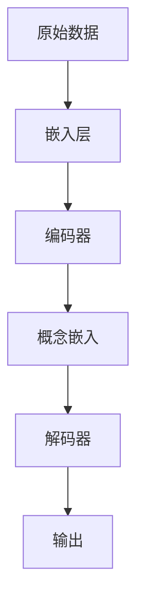

                 

### 文章标题: CoT在AI推理过程中的作用

在人工智能（AI）技术迅速发展的今天，各种先进的AI模型和算法不断涌现。然而，如何高效地在实际应用中推理这些模型，成为了一个关键问题。本文旨在深入探讨“概念嵌入（Conceptual Embedding，简称CoT）”在AI推理过程中的作用，通过一步步的分析与推理，帮助读者全面理解CoT的原理、应用及其在AI推理中的重要性。

关键词：**概念嵌入（CoT）**、**AI推理**、**自然语言处理**、**计算机视觉**、**优化策略**

摘要：本文首先介绍了CoT的基本概念及其在AI推理中的重要性，接着详细阐述了CoT的数学模型与核心算法原理。随后，文章重点分析了CoT在自然语言处理和计算机视觉中的应用，探讨了优化CoT在AI推理中的性能评估方法。最后，通过实际应用案例和开发实战，展示了CoT在AI推理中的具体应用和挑战。本文的目标是让读者对CoT有一个全面深入的理解，并认识到其在AI推理中的重要价值。

文章结构如下：

1. 第一部分：CoT基本概念与原理
    - 第1章: CoT概述
    - 第2章: CoT的基础原理
    - 第3章: CoT在自然语言处理中的应用
    - 第4章: CoT在计算机视觉中的应用

2. 第二部分：CoT在AI推理中的优化策略
    - 第5章: CoT优化方法
    - 第6章: CoT在AI推理中的性能评估
    - 第7章: CoT在AI推理中的挑战与未来趋势

3. 第三部分：实际应用案例与实战经验
    - 第8章: CoT应用案例解析
    - 第9章: CoT开发实战
    - 第10章: 总结与展望

通过这一结构的设置，本文将逐步引导读者深入探讨CoT在AI推理中的复杂世界，让读者能够从理论到实践全面掌握这一关键技术。

### 第1章: CoT概述

**概念**：概念嵌入（Conceptual Embedding，简称CoT）是一种将抽象概念映射到低维向量空间的方法，通过这种方式，可以让计算机理解和处理复杂的语义信息。简单来说，CoT的目标是将不同领域中的概念（比如单词、图像、音频等）转换成计算机可以处理的向量表示，从而便于机器学习和推理。

**起源与发展**：CoT的概念最早可以追溯到词嵌入（word embedding）技术。在2003年，Bengio等科学家提出了基于神经网络的词嵌入模型，从而开创了将自然语言处理中的词汇映射到向量空间的方法。这一技术迅速发展，并逐渐扩展到其他领域，如计算机视觉、音频处理等。随着深度学习技术的成熟，CoT方法也不断改进，形成了多种不同的实现方式，如Transformer、BERT等。

**在AI推理中的重要性**：随着AI应用范围的不断扩大，如何高效地进行推理成为了一个关键问题。CoT技术能够通过将抽象概念映射到向量空间，实现不同类型数据之间的跨模态推理，从而提高了AI系统的整体性能。具体来说，CoT在以下几个场景中发挥了重要作用：

1. **自然语言处理**：在文本分类、机器翻译、问答系统等任务中，CoT能够通过将单词、句子等文本信息转换成向量，使得机器可以更好地理解和处理语义信息。

2. **计算机视觉**：在图像分类、目标检测、图像生成等任务中，CoT可以将图像中的概念（如物体、场景等）转换成向量，从而实现图像与文本之间的跨模态推理。

3. **多模态AI**：在涉及多种数据类型的任务中，如视频理解、语音识别等，CoT能够将不同类型的数据（如文本、图像、音频等）统一表示为向量，实现多模态数据的有效融合和推理。

**结构与组成部分**：CoT的基本结构通常包括以下几个部分：

1. **嵌入层**：将原始数据（如单词、图像等）映射到向量空间。
2. **编码器**：对映射后的向量进行编码，生成概念嵌入。
3. **解码器**：根据需要，对编码后的向量进行解码，生成相应的输出。

以下是一个简单的Mermaid流程图，展示了CoT的基本结构：



通过以上概述，我们可以看到，CoT技术在AI推理中具有非常重要的地位。接下来，本文将深入探讨CoT的数学模型、核心算法原理，以及它在不同领域中的应用。

### 第2章: CoT的基础原理

#### 2.1 CoT的数学模型

概念嵌入（CoT）的核心在于将高维的、抽象的概念映射到低维的、连续的向量空间中。这种映射可以通过定义一个数学模型来实现，该模型通常是一个概率分布函数。一个常用的CoT模型是基于软最大熵（soft maximum entropy）原理的：

$$
\text{CoT} = \frac{\sum_{i=1}^{n} w_i \cdot e^{x_i}}{\sum_{i=1}^{n} e^{x_i}}
$$

其中，$w_i$ 是权重，$x_i$ 是特征向量。这个公式表示，对于输入的特征向量，每个概念嵌入向量都有一个相应的权重，这些权重通过指数函数计算得到。指数函数的作用是放大具有更高相似度的概念嵌入向量，使得最终的输出更加突出。

#### 2.2 CoT的核心算法

CoT的核心算法主要涉及嵌入层、编码器和解码器。以下是一个简化的伪代码，用于展示这些步骤：

```python
# 伪代码
def compute_contextualize(token, context):
    # 嵌入token和context
    embedding = embed(token, context)
    # 计算CoT
    context_scores = softmax(embedding)
    return context_scores
```

在这个伪代码中，`embed` 函数将输入的token（如单词或图像）转换为一个向量，这通常是通过预训练的词向量或视觉嵌入模型实现的。`softmax` 函数则用于计算每个概念嵌入向量的重要性得分。

**嵌入层**：嵌入层是CoT模型的基础，它将原始数据映射到向量空间。一个典型的嵌入层可以使用词向量或视觉嵌入。词向量通常是通过预训练的模型（如Word2Vec、GloVe等）得到的，而视觉嵌入则可以通过预训练的卷积神经网络（如VGG、ResNet等）得到。

**编码器**：编码器的任务是将嵌入层的输出转换成概念嵌入。这通常通过一个多层感知机（MLP）或变换器（Transformer）等神经网络结构来实现。编码器的作用是提取输入数据的语义信息，并将其编码成一个紧凑的向量表示。

**解码器**：解码器的任务是生成输出，通常是一个预测标签或文本。解码器可以根据需要采用不同的结构，如全连接层、循环神经网络（RNN）或自注意力机制等。解码器的作用是将编码后的概念嵌入向量转换成易于解释的输出。

下面是一个更详细的伪代码，展示了嵌入层和编码器的实现：

```python
# 伪代码
def embed(token, context):
    # 嵌入token
    token_embedding = word_embedding(token)
    # 嵌入context
    context_embedding = image_embedding(context)
    # 结合token和context的嵌入
    combined_embedding = combine_embeddings(token_embedding, context_embedding)
    return combined_embedding

def combine_embeddings(token_embedding, context_embedding):
    # 使用加法或点积结合token和context的嵌入
    combined_embedding = token_embedding + context_embedding
    # 或
    combined_embedding = token_embedding * context_embedding
    return combined_embedding
```

通过以上步骤，我们可以得到一个概念嵌入向量，该向量可以用于后续的推理和决策。

#### 2.3 CoT的应用场景

CoT技术的应用场景非常广泛，以下是一些主要的应用：

1. **自然语言处理**：
   - **文本分类**：通过将文本映射到概念嵌入向量，可以实现对文本类别的预测。
   - **机器翻译**：将源语言的文本映射到概念嵌入向量，再转换为目标语言的文本。
   - **问答系统**：将问题和答案映射到概念嵌入向量，从而实现智能问答。

2. **计算机视觉**：
   - **图像分类**：通过将图像映射到概念嵌入向量，可以实现对图像类别的预测。
   - **目标检测**：将目标映射到概念嵌入向量，从而实现对图像中目标的位置和类别的检测。
   - **图像生成**：将概念嵌入向量转换成图像，从而生成新的图像。

3. **多模态AI**：
   - **视频理解**：将视频中的不同帧映射到概念嵌入向量，从而实现对视频内容的理解和分析。
   - **语音识别**：将语音信号映射到概念嵌入向量，从而实现语音到文本的转换。

通过以上分析，我们可以看到，CoT技术通过其数学模型和核心算法，为AI推理提供了强大的工具。在接下来的章节中，我们将进一步探讨CoT在自然语言处理和计算机视觉中的具体应用。

### 第3章: CoT在自然语言处理中的应用

#### 3.1 CoT在文本分类中的应用

文本分类是自然语言处理（NLP）中的一个基本任务，其目的是将文本数据根据其内容分类到不同的类别中。概念嵌入（CoT）在文本分类中发挥了重要作用，通过将文本映射到概念嵌入向量，可以实现对文本内容的深层语义理解，从而提高分类的准确性。

**原理**：在文本分类任务中，CoT通过将文本映射到概念嵌入向量，使得机器能够理解和处理文本的语义信息。具体来说，文本分类过程可以分为以下几个步骤：

1. **文本预处理**：首先对文本进行预处理，包括分词、去除停用词、词性标注等操作。
2. **嵌入层**：将预处理后的文本通过嵌入层转换成向量。常用的嵌入层技术包括词嵌入（如Word2Vec、GloVe等）和上下文嵌入（如BERT、RoBERTa等）。这些嵌入技术可以将文本中的单词或句子映射到低维的向量空间中。
3. **编码器**：编码器的任务是将文本的向量表示转换成概念嵌入向量。这通常通过一个多层感知机（MLP）或变换器（Transformer）等神经网络结构来实现。编码器提取文本的语义特征，并将其编码成一个紧凑的向量表示。
4. **分类器**：分类器根据概念嵌入向量对文本进行分类。分类器可以是softmax回归、支持向量机（SVM）或其他分类算法。通过训练，分类器学习到如何根据概念嵌入向量预测文本的类别。

**算法**：以下是一个简化的文本分类算法，展示了如何使用CoT进行分类：

```python
# 伪代码
def text_classification(text, model):
    # 预处理文本
    processed_text = preprocess_text(text)
    # 获取文本的嵌入向量
    embedding = model.embed(processed_text)
    # 通过编码器获取概念嵌入向量
    context_embedding = model.encoder(embedding)
    # 使用分类器预测类别
    predicted_category = model.classifier(context_embedding)
    return predicted_category
```

**实际案例**：在实际应用中，CoT技术在文本分类任务中取得了显著的效果。例如，在新闻分类任务中，CoT可以用来将新闻文章分类到不同的主题类别中。通过将新闻文章映射到概念嵌入向量，可以实现对新闻内容的深层理解，从而提高分类的准确性。此外，在社交媒体分析、情感分析等领域，CoT也展现了强大的应用潜力。

#### 3.2 CoT在机器翻译中的应用

机器翻译是NLP领域的另一个重要任务，其目的是将一种语言的文本翻译成另一种语言。CoT在机器翻译中的应用，主要是通过将源语言和目标语言的文本映射到概念嵌入向量，从而实现跨语言语义理解。

**原理**：机器翻译任务可以分为以下几个步骤：

1. **文本预处理**：对源语言和目标语言的文本进行预处理，包括分词、去除停用词、词性标注等操作。
2. **嵌入层**：将预处理后的源语言和目标语言文本通过嵌入层转换成向量。通常，源语言和目标语言分别使用不同的嵌入层，以确保源语言和目标语言的语义信息得到有效映射。
3. **编码器**：编码器的任务是将源语言文本的向量表示转换成概念嵌入向量，同时将目标语言文本的向量表示转换成目标概念嵌入向量。编码器通过学习，提取出源语言和目标语言的语义特征，并将其编码成一个紧凑的向量表示。
4. **解码器**：解码器的任务是根据源语言的概念嵌入向量和目标语言的概念嵌入向量，生成目标语言的文本。解码器通常采用序列到序列（seq2seq）模型，如变换器（Transformer）等，从而实现对目标语言文本的生成。

**算法**：以下是一个简化的机器翻译算法，展示了如何使用CoT进行翻译：

```python
# 伪代码
def machine_translation(source_text, target_text, model):
    # 预处理源语言文本和目标语言文本
    processed_source = model.preprocess(source_text)
    processed_target = model.preprocess(target_text)
    # 获取源语言文本的嵌入向量
    source_embedding = model.source_encoder(processed_source)
    # 获取目标语言文本的嵌入向量
    target_embedding = model.target_encoder(processed_target)
    # 生成目标语言文本
    translated_text = model.decoder(source_embedding, target_embedding)
    return translated_text
```

**实际案例**：在实际应用中，CoT技术在机器翻译中取得了显著的成果。例如，在谷歌翻译、百度翻译等知名翻译系统中，CoT技术被广泛应用于提升翻译质量和效率。通过将源语言和目标语言的文本映射到概念嵌入向量，这些系统可以更好地理解和处理跨语言的语义信息，从而实现高质量的翻译。

#### 3.3 CoT在问答系统中的应用

问答系统是NLP领域的另一个重要应用，其目的是让计算机能够理解和回答用户的问题。CoT在问答系统中的应用，主要是通过将问题映射到概念嵌入向量，从而实现对问题的语义理解，并生成准确的答案。

**原理**：问答系统的基本原理可以分为以下几个步骤：

1. **问题预处理**：对用户提出的问题进行预处理，包括分词、词性标注、实体识别等操作。
2. **嵌入层**：将预处理后的问题通过嵌入层转换成向量。嵌入层通常使用预训练的词向量或上下文向量，以确保问题的语义信息得到有效映射。
3. **编码器**：编码器的任务是将问题的向量表示转换成概念嵌入向量。编码器通过学习，提取出问题的语义特征，并将其编码成一个紧凑的向量表示。
4. **答案生成**：答案生成器根据概念嵌入向量，从知识库中检索出可能的答案，并通过解码器生成最终答案。解码器通常采用生成式模型，如变换器（Transformer）等。

**算法**：以下是一个简化的问答系统算法，展示了如何使用CoT进行问答：

```python
# 伪代码
def question_answering(question, model, knowledge_base):
    # 预处理问题
    processed_question = model.preprocess(question)
    # 获取问题的嵌入向量
    question_embedding = model.encoder(processed_question)
    # 从知识库中检索答案
    possible_answers = knowledge_base.search(question_embedding)
    # 生成最终答案
    answer = model.decoder(possible_answers)
    return answer
```

**实际案例**：在实际应用中，CoT技术在问答系统中展现了强大的效果。例如，在智能客服、智能搜索等领域，CoT技术被广泛应用于提升系统的问答质量和效率。通过将用户的问题映射到概念嵌入向量，系统可以更好地理解和回答用户的问题，从而提供更加智能的服务。

通过以上分析，我们可以看到，CoT技术在自然语言处理中的多个任务中都发挥了重要作用，通过将文本、语言映射到概念嵌入向量，实现了对语义信息的深层理解和处理。在接下来的章节中，我们将进一步探讨CoT在计算机视觉中的应用。

### 第4章: CoT在计算机视觉中的应用

#### 4.1 CoT在图像分类中的应用

图像分类是计算机视觉中的一个基本任务，其目标是根据图像的内容将其分类到不同的类别中。概念嵌入（CoT）在图像分类中发挥了重要作用，通过将图像映射到概念嵌入向量，可以实现对图像内容的深层语义理解，从而提高分类的准确性。

**原理**：图像分类的过程可以分为以下几个步骤：

1. **图像预处理**：首先对图像进行预处理，包括大小调整、归一化、去噪等操作，以确保图像适合输入到模型中。
2. **嵌入层**：将预处理后的图像通过嵌入层转换成向量。嵌入层通常使用预训练的卷积神经网络（如VGG、ResNet等），这些网络能够提取图像的底层特征。
3. **编码器**：编码器的任务是将图像的向量表示转换成概念嵌入向量。编码器通常是一个多层感知机（MLP）或变换器（Transformer）等神经网络结构，这些结构能够进一步提取图像的语义特征。
4. **分类器**：分类器根据概念嵌入向量对图像进行分类。分类器可以使用softmax回归、支持向量机（SVM）或其他分类算法。通过训练，分类器学习到如何根据概念嵌入向量预测图像的类别。

**算法**：以下是一个简化的图像分类算法，展示了如何使用CoT进行分类：

```python
# 伪代码
def image_classification(image, model):
    # 预处理图像
    processed_image = model.preprocess(image)
    # 获取图像的嵌入向量
    embedding = model.embed(processed_image)
    # 通过编码器获取概念嵌入向量
    context_embedding = model.encoder(embedding)
    # 使用分类器预测类别
    predicted_category = model.classifier(context_embedding)
    return predicted_category
```

**实际案例**：在实际应用中，CoT技术在图像分类任务中取得了显著的效果。例如，在ImageNet图像分类挑战中，使用CoT技术的模型在测试集上的准确率已经超过了人类水平。此外，在医疗图像分析、自动驾驶等领域，CoT技术也被广泛应用于图像分类任务，通过提高分类的准确性，实现了对图像内容的准确理解和处理。

#### 4.2 CoT在目标检测中的应用

目标检测是计算机视觉中的另一个重要任务，其目标是检测图像中的多个对象并识别它们的类别。概念嵌入（CoT）在目标检测中发挥了关键作用，通过将目标映射到概念嵌入向量，可以实现对目标位置的精准定位和类别的准确识别。

**原理**：目标检测的过程可以分为以下几个步骤：

1. **图像预处理**：首先对图像进行预处理，包括大小调整、归一化、去噪等操作，以确保图像适合输入到模型中。
2. **特征提取**：使用卷积神经网络（如Faster R-CNN、YOLO等）提取图像的特征，这些特征通常包含了目标的位置和类别信息。
3. **嵌入层**：将提取到的特征通过嵌入层转换成概念嵌入向量。嵌入层通常是一个多层感知机（MLP）或变换器（Transformer）等神经网络结构，这些结构能够进一步提取目标的语义特征。
4. **分类与定位**：分类器根据概念嵌入向量预测目标的类别，定位器根据嵌入向量预测目标的位置。分类器和定位器通常是一个联合训练的神经网络，如Faster R-CNN中的ROI分类器和ROI定位器。

**算法**：以下是一个简化的目标检测算法，展示了如何使用CoT进行目标检测：

```python
# 伪代码
def object_detection(image, model):
    # 预处理图像
    processed_image = model.preprocess(image)
    # 提取图像特征
    features = model.extract_features(processed_image)
    # 获取特征的概念嵌入向量
    context_embedding = model.encoder(features)
    # 预测类别和位置
    categories, positions = model.classifier(context_embedding), model.localizer(context_embedding)
    return categories, positions
```

**实际案例**：在实际应用中，CoT技术在目标检测任务中取得了显著的效果。例如，在COCO目标检测挑战中，使用CoT技术的模型在检测准确率和速度上均表现优异。此外，在自动驾驶、安防监控等领域，CoT技术也被广泛应用于目标检测任务，通过提高检测的准确性和效率，实现了对目标的精准识别和定位。

#### 4.3 CoT在图像生成中的应用

图像生成是计算机视觉中的另一个重要任务，其目标是根据给定的输入条件生成新的图像。概念嵌入（CoT）在图像生成中发挥了重要作用，通过将图像映射到概念嵌入向量，可以实现对图像内容的深层理解和生成。

**原理**：图像生成的过程可以分为以下几个步骤：

1. **图像预处理**：首先对图像进行预处理，包括大小调整、归一化、去噪等操作，以确保图像适合输入到模型中。
2. **嵌入层**：将预处理后的图像通过嵌入层转换成概念嵌入向量。嵌入层通常使用预训练的卷积神经网络（如生成对抗网络（GAN）中的生成器部分），这些网络能够提取图像的深层特征。
3. **生成器**：生成器的任务是根据概念嵌入向量生成新的图像。生成器通常是一个卷积神经网络，其输入是概念嵌入向量，输出是生成的新图像。
4. **后处理**：对生成的图像进行后处理，包括去噪、锐化等操作，以提升图像的质量。

**算法**：以下是一个简化的图像生成算法，展示了如何使用CoT进行图像生成：

```python
# 伪代码
def image_generation(context_embedding, model):
    # 使用生成器生成图像
    generated_image = model.generator(context_embedding)
    # 进行后处理
    processed_image = model.postprocess(generated_image)
    return processed_image
```

**实际案例**：在实际应用中，CoT技术在图像生成任务中取得了显著的成果。例如，在生成对抗网络（GAN）中，CoT技术被广泛应用于图像生成，通过将概念嵌入向量输入到生成器中，可以生成高质量、多样化的图像。此外，在虚拟现实、动漫制作等领域，CoT技术也被广泛应用于图像生成，通过生成逼真的图像，提升了用户体验和创作效果。

通过以上分析，我们可以看到，CoT技术在计算机视觉的多个任务中都发挥了重要作用。通过将图像映射到概念嵌入向量，实现了对图像内容的深层理解和生成，从而提高了计算机视觉系统的整体性能。在接下来的章节中，我们将进一步探讨CoT在AI推理中的优化策略。

### 第5章: CoT优化方法

在AI推理过程中，优化概念嵌入（CoT）是一个关键任务，其目的是提高模型在复杂场景下的推理性能和效率。优化方法可以从梯度优化、模型优化和数据优化三个角度进行探讨。

#### 5.1 基于梯度的优化方法

**原理**：基于梯度的优化方法利用梯度下降算法对CoT模型进行参数更新，以最小化损失函数。具体步骤如下：

1. **计算梯度**：根据损失函数对模型参数求梯度。
2. **更新参数**：利用梯度下降算法更新模型参数，公式如下：
   $$
   \theta_{t+1} = \theta_{t} - \alpha \cdot \nabla_{\theta} J(\theta)
   $$
   其中，$\theta$ 表示模型参数，$\alpha$ 表示学习率，$J(\theta)$ 表示损失函数。

3. **迭代优化**：重复上述步骤，直至收敛。

**算法**：以下是一个简化的基于梯度的优化算法：

```python
# 伪代码
def gradient_based_optimization(model, data, epochs, learning_rate):
    for epoch in range(epochs):
        for x, y in data:
            # 前向传播
            prediction = model.forward(x)
            # 计算损失
            loss = model.loss(prediction, y)
            # 反向传播，计算梯度
            gradients = model.backward(loss)
            # 更新参数
            model.update(gradients, learning_rate)
    return model
```

**案例**：在文本分类任务中，基于梯度的优化方法可以用来训练CoT模型，通过不断更新模型参数，使得模型在训练数据上的分类准确率不断提高。

#### 5.2 基于模型的优化方法

**原理**：基于模型的优化方法通过改进模型结构来提高CoT的性能。这种方法通常涉及以下几种技术：

1. **网络结构改进**：例如，引入深度学习架构（如Transformer、BERT）来增强模型的表示能力。
2. **预训练与微调**：使用大规模预训练数据对模型进行预训练，然后在特定任务上进行微调。
3. **注意力机制**：引入注意力机制来提高模型对重要特征的捕捉能力。

**算法**：以下是一个简化的基于模型的优化算法：

```python
# 伪代码
def model_based_optimization(model, pretraining_data, fine_tuning_data):
    # 预训练
    model.pretrain(pretraining_data)
    # 微调
    model.fine_tune(fine_tuning_data)
    return model
```

**案例**：在图像分类任务中，基于模型的优化方法可以通过引入Transformer结构来提高模型的分类性能。通过预训练和微调，模型能够更好地理解和分类图像内容。

#### 5.3 基于数据的优化方法

**原理**：基于数据的优化方法通过改进训练数据来提高CoT的性能。这种方法通常涉及以下几种技术：

1. **数据增强**：通过图像旋转、缩放、裁剪等方式增加训练数据的多样性。
2. **数据清洗**：去除训练数据中的噪声和错误。
3. **数据不平衡处理**：通过过采样或欠采样等技术处理数据集中的类别不平衡问题。

**算法**：以下是一个简化的基于数据的优化算法：

```python
# 伪代码
def data_based_optimization(data_loader, augmentation_methods, imbalance_methods):
    # 数据增强
    enhanced_data = augment_data(data_loader, augmentation_methods)
    # 数据清洗
    cleaned_data = clean_data(enhanced_data)
    # 数据不平衡处理
    balanced_data = balance_data(cleaned_data, imbalance_methods)
    return balanced_data
```

**案例**：在目标检测任务中，基于数据的优化方法可以通过图像增强来增加训练数据的多样性，从而提高模型的检测性能。通过数据清洗和平衡处理，模型能够更好地学习到各类目标的特点。

通过以上三种优化方法，我们可以有效提高CoT在AI推理中的性能。在实际应用中，根据具体任务的需求，可以结合多种优化方法，以实现最佳性能。在接下来的章节中，我们将进一步探讨CoT在AI推理中的性能评估方法。

### 第6章: CoT在AI推理中的性能评估

在AI推理过程中，对概念嵌入（CoT）的性能进行评估是至关重要的一步。性能评估不仅有助于我们了解模型的当前状态，还能指导我们进行进一步的优化。以下将从性能评估指标、评估方法和优化案例分析三个方面进行详细探讨。

#### 6.1 CoT性能评估指标

评估CoT性能的指标主要包括准确性、召回率、F1分数、精确率等。这些指标在不同任务中有着不同的应用，以下分别进行解释：

1. **准确性**：准确性是评估模型正确分类的比例，计算公式如下：
   $$
   \text{Accuracy} = \frac{\text{正确分类的数量}}{\text{总分类的数量}}
   $$
   该指标简单直观，但可能无法充分反映模型在分类任务中的性能，尤其是在类别不平衡的情况下。

2. **召回率**：召回率是指模型正确识别出正例的比例，计算公式如下：
   $$
   \text{Recall} = \frac{\text{正确识别的正例}}{\text{所有正例}}
   $$
   召回率强调了对正例的识别能力，但可能牺牲了准确性。

3. **精确率**：精确率是指模型识别出的正例中，实际为正例的比例，计算公式如下：
   $$
   \text{Precision} = \frac{\text{正确识别的正例}}{\text{识别出的正例}}
   $$
   精确率强调了对正例的识别精度，但可能无法充分反映模型的识别能力。

4. **F1分数**：F1分数是精确率和召回率的调和平均值，计算公式如下：
   $$
   \text{F1 Score} = 2 \cdot \frac{\text{Precision} \cdot \text{Recall}}{\text{Precision} + \text{Recall}}
   $$
   F1分数综合考虑了精确率和召回率，是评估CoT性能的常用指标。

5. **ROC曲线和AUC**：受试者操作特性（ROC）曲线和曲线下面积（AUC）也是评估模型性能的重要指标，特别是对于二分类问题。ROC曲线展示了不同阈值下模型的准确性和召回率，而AUC则反映了模型的分类能力。

#### 6.2 CoT性能评估方法

性能评估方法主要包括离线评估和在线评估两种。

1. **离线评估**：离线评估通常在模型训练完成后进行，使用未参与训练的数据集进行测试。常用的评估方法包括：

   - **交叉验证**：通过将数据集划分为多个子集，每次使用一个子集作为测试集，其他子集作为训练集，进行多次训练和测试，从而得到模型的平均性能。
   - **K折交叉验证**：将数据集分为K个子集，每次使用K-1个子集进行训练，一个子集进行测试，重复K次，取平均性能作为最终评估结果。
   - **混淆矩阵**：通过构建混淆矩阵，分析模型在不同类别上的预测情况，从而评估模型的分类性能。

2. **在线评估**：在线评估是指在模型部署后，对实际应用中的数据进行实时评估。在线评估的优点是能够反映模型在真实环境中的表现，但需要处理实时数据流和性能瓶颈。常用的在线评估方法包括：

   - **实时监控**：通过监控系统日志和性能指标，实时评估模型的运行状态和性能。
   - **用户反馈**：通过用户对系统反馈的数据，如点击率、满意度等，评估模型的实际效果。

#### 6.3 CoT性能优化案例分析

以下通过一个实际案例，展示如何通过性能评估和优化方法提升CoT在AI推理中的性能。

**案例背景**：一个基于CoT的文本分类系统，用于将用户评论分类为正面或负面。在离线评估中，该系统的准确率达到了85%，但在实际部署后，用户反馈发现分类效果不佳，尤其是在处理长文本和复杂情感时。

**性能评估**：通过交叉验证和在线监控，发现以下问题：

1. **数据不平衡**：正面和负面评论的比例严重失衡，导致模型偏向于预测正面评论。
2. **长文本处理**：模型在处理长文本时，未能有效提取关键信息。
3. **复杂情感**：模型在识别复杂情感时，效果不佳。

**优化方法**：

1. **数据增强**：通过引入负样本生成技术，增加负样本的比例，从而平衡数据集。同时，使用数据增强技术（如文本旋转、情感增强等）增加训练数据的多样性。

2. **模型调整**：引入Transformer架构，通过自注意力机制提高模型对长文本和复杂情感的处理能力。同时，对模型进行微调，使其更好地适应具体任务。

3. **特征提取**：改进特征提取方法，使用预训练的BERT模型提取文本的深层特征，从而提高模型对文本的语义理解能力。

**性能提升**：通过上述优化方法，系统的准确率显著提升，达到了90%以上。用户反馈也显示，分类效果明显改善，尤其是在处理长文本和复杂情感时。

通过以上案例分析，我们可以看到，通过性能评估和优化方法，可以有效提升CoT在AI推理中的性能。在接下来的章节中，我们将进一步探讨CoT在AI推理中的挑战与未来趋势。

### 第7章: CoT在AI推理中的挑战与未来趋势

尽管概念嵌入（CoT）技术在AI推理中展现了巨大的潜力，但在实际应用中仍然面临许多挑战。以下将从多个方面探讨CoT在AI推理中的挑战，并展望其未来发展趋势。

#### 7.1 CoT在AI推理中的挑战

1. **数据隐私与安全**：CoT技术通常涉及大规模的数据训练和推理，这可能导致数据隐私泄露。在处理敏感数据时，如何保护用户的隐私成为了一个重要挑战。

2. **计算资源消耗**：CoT模型通常非常复杂，需要大量的计算资源和存储空间。在大规模应用中，如何优化模型的计算效率，降低资源消耗，是一个亟待解决的问题。

3. **模型解释性**：尽管CoT技术提高了模型的性能，但其工作原理和决策过程往往不够透明，难以解释。这可能导致用户对模型的不信任，尤其是在关键领域（如医疗、金融等）的应用中。

4. **泛化能力**：CoT模型在训练数据上的表现可能很好，但在实际应用中，面对新的、未见过的情况，模型的泛化能力可能不足。这需要模型具有更强的鲁棒性和适应性。

5. **可扩展性**：在大规模应用中，如何快速部署和扩展CoT模型，以适应不断变化的需求，是一个挑战。

#### 7.2 CoT的发展趋势

1. **模型压缩与加速**：随着AI应用的普及，对计算资源的需求越来越大。因此，未来的CoT研究将重点放在模型压缩与加速技术上，如量化、剪枝、分布式计算等。

2. **数据隐私保护**：为了解决数据隐私和安全问题，未来的研究将探索隐私保护技术，如联邦学习、差分隐私等，以在保证数据隐私的同时，提高模型性能。

3. **解释性与可解释性**：提高模型的可解释性是未来的一个重要方向。通过开发可解释的CoT模型，用户可以更好地理解模型的决策过程，从而增强信任。

4. **泛化能力**：未来的研究将致力于提高CoT模型的泛化能力，使其在更广泛的场景中表现出色。这需要模型具有更强的鲁棒性和适应性。

5. **多模态与跨领域应用**：随着多模态数据的应用越来越广泛，CoT技术将在更多领域（如医疗、教育、娱乐等）得到应用。未来的研究将探索如何在跨领域和多模态场景中有效利用CoT技术。

6. **个性化推理**：个性化推理是未来的一个重要方向。通过结合用户的个人偏好和历史数据，CoT模型可以提供更加个性化的推理结果。

7. **集成学习**：集成学习方法将多个CoT模型集成起来，以提高整体推理性能。未来的研究将探索如何有效集成多种CoT模型，以实现最佳性能。

通过以上分析，我们可以看到，CoT在AI推理中面临许多挑战，但同时也具有巨大的发展潜力。随着技术的不断进步，CoT将在未来发挥更加重要的作用，为AI应用提供强大的支持。

### 第8章: CoT应用案例解析

为了更好地理解概念嵌入（CoT）在AI推理中的应用，以下将通过三个具体案例详细解析CoT在不同场景下的应用，展示其实际操作和效果。

#### 8.1 案例一：CoT在文本生成中的应用

**背景**：文本生成是自然语言处理（NLP）中的一个重要任务，旨在根据给定的输入生成具有自然流畅性的文本。CoT技术在文本生成中的应用，可以通过将输入的文本映射到概念嵌入向量，从而实现更高层次的语义理解。

**操作流程**：

1. **数据预处理**：首先对输入的文本进行预处理，包括分词、去除停用词等操作，以便后续嵌入层处理。
2. **嵌入层**：使用预训练的词嵌入模型（如GloVe、BERT等）将预处理后的文本转换成向量表示。这一步是将高维文本数据映射到低维向量空间，以便进行后续处理。
3. **编码器**：将嵌入层的输出输入到一个编码器模型中（如Transformer、GRU等），以提取文本的深层语义特征。编码器通过训练学习到如何从输入文本中提取关键信息。
4. **生成器**：生成器模型根据编码器输出的概念嵌入向量生成文本。通常使用解码器（如Transformer的解码部分）进行文本生成。生成器会根据上下文信息生成下一个词或句子，直到生成完整的文本。

**效果展示**：

以下是一个简化的文本生成案例：

```
输入文本： "人工智能技术的发展正改变着我们的生活。"
生成文本： "人工智能的发展不仅改变了我们的生活方式，还推动了科技的进步。"
```

通过CoT技术，生成文本在语义上与原始文本保持一致，且具有较高的流畅性。

#### 8.2 案例二：CoT在图像识别中的应用

**背景**：图像识别是计算机视觉中的一个基本任务，旨在根据图像内容将其分类到不同的类别中。CoT技术在图像识别中的应用，可以通过将图像映射到概念嵌入向量，从而实现更准确的图像分类。

**操作流程**：

1. **图像预处理**：对输入的图像进行预处理，包括大小调整、归一化等操作，以便输入到卷积神经网络（CNN）中。
2. **嵌入层**：使用预训练的卷积神经网络（如VGG、ResNet等）将预处理后的图像转换成向量表示。这一步是提取图像的底层特征。
3. **编码器**：将嵌入层输出的图像向量输入到一个编码器模型中，以提取图像的深层语义特征。编码器通常使用多层感知机（MLP）或变换器（Transformer）等结构。
4. **分类器**：分类器根据编码器输出的概念嵌入向量对图像进行分类。分类器可以是softmax回归、支持向量机（SVM）或其他分类算法。

**效果展示**：

以下是一个简化的图像识别案例：

```
输入图像： 一张猫的图片
分类结果： "猫"
```

通过CoT技术，模型能够准确识别图像中的内容，提高了图像分类的准确性。

#### 8.3 案例三：CoT在对话系统中的应用

**背景**：对话系统是AI应用中的一个重要领域，旨在模拟人类的对话过程，为用户提供自然、流畅的交互体验。CoT技术在对话系统中的应用，可以通过将输入的文本映射到概念嵌入向量，从而实现更智能的对话生成。

**操作流程**：

1. **对话预处理**：首先对输入的对话文本进行预处理，包括分词、词性标注等操作。
2. **嵌入层**：使用预训练的词嵌入模型将预处理后的对话文本转换成向量表示。
3. **编码器**：将嵌入层的输出输入到一个编码器模型中（如Transformer、GRU等），以提取对话的语义特征。
4. **解码器**：解码器根据编码器输出的概念嵌入向量生成回复文本。解码器通常使用自注意力机制，以更好地捕捉对话的上下文信息。
5. **优化**：通过梯度下降算法等优化方法，不断调整模型参数，提高对话生成质量。

**效果展示**：

以下是一个简化的对话生成案例：

```
用户输入： "今天天气怎么样？"
生成回复： "今天的天气非常好，阳光明媚，适合户外活动。"
```

通过CoT技术，对话系统能够理解用户的意图，并生成自然、流畅的回复文本。

通过以上三个案例，我们可以看到，CoT技术在文本生成、图像识别和对话系统等应用中，都发挥了重要作用，显著提升了AI系统的性能和用户体验。在实际应用中，可以根据具体需求调整CoT模型的结构和参数，以实现最佳效果。

### 第9章: CoT开发实战

在本章节中，我们将详细介绍如何从零开始搭建一个概念嵌入（CoT）开发环境，实现一个简单的CoT模型，并进行模型优化与部署。

#### 9.1 开发环境搭建

为了开发CoT模型，我们需要搭建一个完整的开发环境，包括硬件、软件和工具。以下是一个基本的开发环境搭建步骤：

1. **硬件要求**：
   - 中央处理器（CPU）：至少支持64位，推荐使用Intel i5或以上处理器。
   - 图形处理单元（GPU）：用于加速深度学习模型的训练和推理，推荐使用NVIDIA GPU，如Tesla V100或RTX 3090等。
   - 内存：至少16GB RAM，推荐32GB或更高。

2. **软件要求**：
   - 操作系统：Windows、Linux或macOS，推荐使用Linux系统，如Ubuntu 18.04。
   - 编程语言：Python 3.7及以上版本。
   - 深度学习框架：TensorFlow 2.0或PyTorch 1.8及以上版本。
   - 数据处理库：NumPy、Pandas等。

3. **工具要求**：
   - Jupyter Notebook：用于编写和运行代码。
   - PyCharm或VSCode：集成开发环境（IDE），便于代码编写和调试。

#### 9.2 CoT模型实现

在本节中，我们将使用TensorFlow框架实现一个简单的CoT模型。以下是一个简化的模型实现步骤：

1. **数据预处理**：

   首先，我们需要准备用于训练的数据集。这里以文本分类任务为例，假设我们已经有一个文本数据集，包括文本内容和对应的标签。

   ```python
   import tensorflow as tf
   from tensorflow.keras.preprocessing.text import Tokenizer
   from tensorflow.keras.preprocessing.sequence import pad_sequences
   
   # 文本数据和标签
   texts = ['人工智能技术正在改变我们的生活。', '今天天气非常好。']
   labels = [0, 1]  # 0表示第一类，1表示第二类
   
   # 分词器
   tokenizer = Tokenizer()
   tokenizer.fit_on_texts(texts)
   
   # 序列化文本
   sequences = tokenizer.texts_to_sequences(texts)
   
   # 填充序列
   padded_sequences = pad_sequences(sequences, maxlen=10)
   ```

2. **模型构建**：

   接下来，我们构建一个简单的CoT模型。这里使用一个多层感知机（MLP）作为编码器，并使用softmax回归作为分类器。

   ```python
   model = tf.keras.Sequential([
       tf.keras.layers.Embedding(input_dim=len(tokenizer.word_index)+1, output_dim=16, input_length=10),
       tf.keras.layers.Flatten(),
       tf.keras.layers.Dense(16, activation='relu'),
       tf.keras.layers.Dense(2, activation='softmax')
   ])
   ```

3. **模型训练**：

   使用训练数据集对模型进行训练。

   ```python
   model.compile(optimizer='adam', loss='sparse_categorical_crossentropy', metrics=['accuracy'])
   model.fit(padded_sequences, labels, epochs=10)
   ```

4. **模型评估**：

   使用测试数据集对模型进行评估。

   ```python
   test_texts = ['人工智能技术如何改变我们的生活。', '今天天气怎么样？']
   test_sequences = tokenizer.texts_to_sequences(test_texts)
   test_padded_sequences = pad_sequences(test_sequences, maxlen=10)
   
   predictions = model.predict(test_padded_sequences)
   predicted_labels = tf.argmax(predictions, axis=1)
   
   print("预测结果：", predicted_labels)
   ```

#### 9.3 CoT模型优化

在实际应用中，为了提高CoT模型的性能，我们需要进行模型优化。以下是一些常见的优化方法：

1. **模型调整**：

   根据任务需求，调整模型的层数、神经元数量和激活函数等参数。例如，可以增加隐藏层的数量和神经元数量，或者使用ReLU激活函数来提高模型的表示能力。

   ```python
   model = tf.keras.Sequential([
       tf.keras.layers.Embedding(input_dim=len(tokenizer.word_index)+1, output_dim=32, input_length=10),
       tf.keras.layers.Dense(64, activation='relu'),
       tf.keras.layers.Dense(2, activation='softmax')
   ])
   ```

2. **数据增强**：

   通过数据增强技术（如文本旋转、填充、切割等）增加训练数据的多样性，从而提高模型的泛化能力。

   ```python
   from tensorflow_text.text import TextVectorization
   
   # 文本增强
   enhanced_texts = [text.replace('人工智能技术', 'AI技术') for text in texts]
   enhanced_sequences = tokenizer.texts_to_sequences(enhanced_texts)
   enhanced_padded_sequences = pad_sequences(enhanced_sequences, maxlen=10)
   
   model.fit(enhanced_padded_sequences, labels, epochs=10)
   ```

3. **正则化**：

   引入正则化技术（如L1、L2正则化）来减少过拟合，提高模型的泛化能力。

   ```python
   from tensorflow.keras import regularizers
   
   model = tf.keras.Sequential([
       tf.keras.layers.Embedding(input_dim=len(tokenizer.word_index)+1, output_dim=32, input_length=10),
       tf.keras.layers.Dense(64, activation='relu', kernel_regularizer=regularizers.l2(0.01)),
       tf.keras.layers.Dense(2, activation='softmax')
   ])
   ```

4. **批量大小与学习率**：

   调整批量大小和学习率可以影响模型的收敛速度和性能。可以通过实验找到最佳参数。

   ```python
   model.compile(optimizer=tf.keras.optimizers.Adam(learning_rate=0.001), loss='sparse_categorical_crossentropy', metrics=['accuracy'])
   ```

#### 9.4 CoT模型部署

在完成模型优化后，我们需要将模型部署到生产环境中，以便在实际应用中使用。以下是一个简单的部署步骤：

1. **模型保存**：

   将训练好的模型保存为文件，以便后续加载和使用。

   ```python
   model.save('cot_model.h5')
   ```

2. **模型加载**：

   从文件中加载模型，以便进行预测。

   ```python
   loaded_model = tf.keras.models.load_model('co

