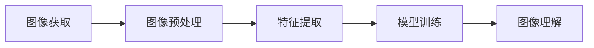
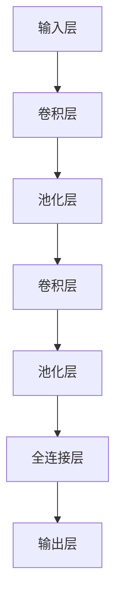

                 

# 《Computer Vision Techniques 原理与代码实战案例讲解》

> 关键词：计算机视觉，图像处理，特征提取，深度学习，目标检测，图像分类，实战案例

> 摘要：本文将深入探讨计算机视觉技术的原理和应用，通过详细的算法讲解、伪代码展示以及实际代码案例，帮助读者全面了解计算机视觉的核心概念和技术。本文将分为三个部分，分别介绍计算机视觉的基础知识、深度学习在计算机视觉中的应用，以及计算机视觉项目实战。通过本文的学习，读者将能够掌握计算机视觉的关键技术，并在实际项目中运用这些技术。

## 目录大纲

## 第一部分：计算机视觉基础

### 第1章：计算机视觉概述

#### 1.1 计算机视觉的基本概念
- **核心概念与联系**
  - **Mermaid流程图**：计算机视觉的基本流程

#### 1.2 图像处理基础
- **核心算法原理讲解**
  - **伪代码**：图像滤波算法

#### 1.3 视觉感知模型
- **数学模型和数学公式**
  - **公式**：视觉感知模型中的激活函数
- **详细讲解 & 举例说明**
  - **示例**：视觉感知模型在人脸识别中的应用

### 第2章：特征提取与描述

#### 2.1 特征提取技术
- **核心算法原理讲解**
  - **伪代码**：SIFT特征提取算法

#### 2.2 特征匹配与描述
- **数学模型和数学公式**
  - **公式**：特征匹配的相似度度量
- **详细讲解 & 举例说明**
  - **示例**：特征匹配在图像识别中的应用

### 第3章：图像分类与目标检测

#### 3.1 图像分类算法
- **核心算法原理讲解**
  - **伪代码**：支持向量机（SVM）分类算法

#### 3.2 目标检测技术
- **核心算法原理讲解**
  - **伪代码**：区域建议网络（Region Proposal Networks）检测算法

#### 3.3 实时目标跟踪
- **核心算法原理讲解**
  - **伪代码**：卡尔曼滤波（Kalman Filter）跟踪算法

## 第二部分：深度学习在计算机视觉中的应用

### 第4章：卷积神经网络（CNN）基础

#### 4.1 CNN的架构与原理
- **核心概念与联系**
  - **Mermaid流程图**：CNN的基本结构

#### 4.2 深层网络优化技巧
- **核心算法原理讲解**
  - **伪代码**：dropout和Batch Normalization的优化技巧

### 第5章：计算机视觉深度学习模型

#### 5.1 卷积神经网络（CNN）在图像分类中的应用
- **核心算法原理讲解**
  - **伪代码**：AlexNet和VGG模型分类算法

#### 5.2 目标检测深度学习模型
- **核心算法原理讲解**
  - **伪代码**：Faster R-CNN和YOLO模型检测算法

#### 5.3 3D视觉与姿态估计
- **核心算法原理讲解**
  - **伪代码**：PointNet和PoseNet模型姿态估计算法

## 第三部分：计算机视觉项目实战

### 第6章：图像去噪与超分辨率重建

#### 6.1 图像去噪算法实战
- **项目实战**
  - **代码实际案例与详细解释**
  - **开发环境搭建**
  - **源代码详细实现与代码解读**

#### 6.2 图像超分辨率重建实战
- **项目实战**
  - **代码实际案例与详细解释**
  - **开发环境搭建**
  - **源代码详细实现与代码解读**

### 第7章：人脸识别与生物特征识别

#### 7.1 人脸识别算法实战
- **项目实战**
  - **代码实际案例与详细解释**
  - **开发环境搭建**
  - **源代码详细实现与代码解读**

#### 7.2 生物特征识别技术
- **核心算法原理讲解**
  - **伪代码**：指纹识别和虹膜识别算法

### 第8章：自动驾驶与智能监控

#### 8.1 自动驾驶感知系统
- **项目实战**
  - **代码实际案例与详细解释**
  - **开发环境搭建**
  - **源代码详细实现与代码解读**

#### 8.2 智能视频监控分析
- **项目实战**
  - **代码实际案例与详细解释**
  - **开发环境搭建**
  - **源代码详细实现与代码解读**

## 附录

### 附录 A：计算机视觉开发资源与工具

#### A.1 主流计算机视觉库介绍
- **详细解读**
  - OpenCV
  - TensorFlow
  - PyTorch

#### A.2 计算机视觉研究论文与资料推荐
- **详细解读**
  - **数学模型和数学公式**
    - **公式**：论文中常用的计算机视觉数学公式
  - **示例**：经典论文与最新研究进展分析

#### A.3 计算机视觉竞赛与挑战
- **详细解读**
  - **示例**：常见计算机视觉竞赛及挑战任务解析

## 第一部分：计算机视觉基础

### 第1章：计算机视觉概述

#### 1.1 计算机视觉的基本概念

计算机视觉（Computer Vision）是指让计算机通过图像或视频获取信息，并对这些信息进行分析和解释，使其能够“看”到和理解周围的世界。计算机视觉是一门涉及计算机科学、心理学、神经科学和数学等多个学科的交叉学科。其核心目标是通过模拟人类视觉系统，实现图像的自动理解和处理。

**核心概念与联系**

计算机视觉的基本流程可以分为以下几个步骤：

1. **图像获取**：通过摄像头、扫描仪等设备获取图像数据。
2. **图像预处理**：对获取的图像进行去噪、增强、裁剪等预处理操作，以提高图像质量。
3. **特征提取**：从预处理后的图像中提取具有区分性的特征，如边缘、角点、纹理等。
4. **模型训练**：使用提取到的特征训练机器学习模型，如分类器、回归器等。
5. **图像理解**：利用训练好的模型对新的图像进行分类、识别、跟踪等任务。

**Mermaid流程图**：下面是一个简单的Mermaid流程图，展示了计算机视觉的基本流程。



#### 1.2 图像处理基础

图像处理是计算机视觉的重要组成部分，它涉及到图像的滤波、增强、分割、特征提取等技术。图像处理的基本操作包括像素操作、图像变换、滤波器应用等。

**核心算法原理讲解**

图像滤波是一种常用的图像处理技术，用于去除图像中的噪声。下面是一个简单的图像滤波算法的伪代码。

```python
function filter_image(image, filter):
    output_image = create_empty_image(size=image)
    for each pixel in image:
        neighborhood = get_neighborhood(pixel, filter_size)
        filtered_pixel = calculate_average(neighborhood)
        output_image[pixel] = filtered_pixel
    return output_image
```

在上面的伪代码中，`filter` 是一个滤波器，可以是一个简单的卷积核。`get_neighborhood` 函数用于获取当前像素的邻域像素，`calculate_average` 函数用于计算邻域像素的平均值。

**数学模型和数学公式**

图像滤波可以使用卷积运算来实现。卷积运算的数学公式如下：

$$
(f * g)(t) = \sum_{x=-\infty}^{\infty}\sum_{y=-\infty}^{\infty} f(x,y) \cdot g(t-x, t-y)
$$

其中，`f` 和 `g` 分别表示卷积操作的输入和滤波器，`*` 表示卷积运算。

**详细讲解 & 举例说明**

下面是一个使用卷积滤波器去除图像噪声的例子。我们使用一个简单的低通滤波器，如高斯滤波器。

```python
import cv2
import numpy as np

def filter_noise(image, filter_size=(5, 5), sigma=1.0):
    # 创建高斯滤波器
    filter = cv2.getGaussianKernel(filter_size, sigma)
    # 应用滤波器
    filtered_image = cv2.filter2D(image, -1, filter)
    return filtered_image

# 读取图像
image = cv2.imread('image.jpg', cv2.IMREAD_GRAYSCALE)

# 应用滤波器
filtered_image = filter_noise(image)

# 显示原始图像和滤波后图像
cv2.imshow('Original Image', image)
cv2.imshow('Filtered Image', filtered_image)
cv2.waitKey(0)
cv2.destroyAllWindows()
```

在这个例子中，我们首先使用 `cv2.getGaussianKernel` 函数创建一个高斯滤波器，然后使用 `cv2.filter2D` 函数将其应用于原始图像。最后，我们显示原始图像和滤波后的图像。

#### 1.3 视觉感知模型

视觉感知模型是计算机视觉中模拟人类视觉系统的一种尝试。它通过一系列数学模型和算法，实现对图像的理解和分析。视觉感知模型通常包括图像处理、特征提取、图像识别和目标跟踪等步骤。

**数学模型和数学公式**

视觉感知模型中的激活函数是一个关键部分。激活函数用于将输入的神经元活动转换为输出，从而实现非线性变换。一个常用的激活函数是ReLU（Rectified Linear Unit）函数，其数学公式如下：

$$
f(x) = \max(0, x)
$$

ReLU函数在输入为负值时输出为0，输入为正值时输出为其本身。这种非线性特性使得ReLU函数在深度学习中被广泛使用。

**详细讲解 & 举例说明**

下面是一个使用ReLU函数的示例。

```python
import numpy as np

def relu(x):
    return np.maximum(0, x)

# 创建一个1x4的矩阵
x = np.array([[1, -2, 3, -4]])

# 应用ReLU函数
output = relu(x)

print("Input:", x)
print("Output:", output)
```

在这个例子中，我们首先创建一个1x4的矩阵，然后使用ReLU函数对其进行处理。输出结果为：

```
Input: [[ 1 -2  3 -4]]
Output: [[ 1  0  3  0]]
```

可以看到，ReLU函数将矩阵中的负值置为0，正值保持不变。

**示例：视觉感知模型在人脸识别中的应用**

视觉感知模型在人脸识别中有着广泛的应用。下面是一个简单的例子，展示如何使用视觉感知模型进行人脸识别。

```python
import cv2
import numpy as np

# 读取训练好的模型
model = cv2.face.EigenFaceRecognizer_create()

# 读取人脸图像
image = cv2.imread('face.jpg')

# 人脸检测
faces, _ = cv2.findFaces(image)

# 对每个检测到的人脸进行识别
for i, face in enumerate(faces):
    # 提取人脸特征
    features = cv2.face.getFeaturesFace(image, face)

    # 使用训练好的模型进行人脸识别
    label, confidence = model.predict(features)

    # 显示识别结果
    cv2.putText(image, 'Person ' + str(label), (face[0], face[1]), cv2.FONT_HERSHEY_SIMPLEX, 1, (0, 255, 0), 2)

# 显示图像
cv2.imshow('Face Recognition', image)
cv2.waitKey(0)
cv2.destroyAllWindows()
```

在这个例子中，我们首先使用OpenCV的`findFaces`函数检测图像中的人脸，然后使用`getFeaturesFace`函数提取人脸特征。接着，我们使用训练好的EigenFace模型进行人脸识别，并将识别结果显示在图像上。

### 第2章：特征提取与描述

#### 2.1 特征提取技术

特征提取是计算机视觉中至关重要的一步，它旨在从图像或视频数据中提取具有区分性的特征，以便进行后续的图像处理和识别。特征提取技术可以分为局部特征提取和全局特征提取。

**核心算法原理讲解**

局部特征提取技术通常用于提取图像中的局部结构，如边缘、角点、纹理等。其中，SIFT（Scale-Invariant Feature Transform）算法是一种经典且高效的局部特征提取算法。

下面是SIFT算法的伪代码：

```python
function SIFT(image):
    # 第一步：尺度空间构建
    scale_space = build_scale_space(image)

    # 第二步：关键点检测
    keypoints = detect_keypoints(scale_space)

    # 第三步：关键点描述
    descriptors = describe_keypoints(keypoints, image)

    return keypoints, descriptors
```

在上面的伪代码中，`build_scale_space` 函数用于构建尺度空间，`detect_keypoints` 函数用于检测关键点，`describe_keypoints` 函数用于描述关键点。

**数学模型和数学公式**

SIFT算法的核心在于尺度空间和关键点的检测。尺度空间的构建可以通过高斯金字塔实现，高斯金字塔的构建公式如下：

$$
G(x, y, \sigma) = G(x, y, \sigma/2) \star g(x, y, \sigma/2)
$$

其中，`G` 表示尺度空间，`g` 表示高斯核，`\sigma` 表示尺度参数。

关键点的检测通常基于尺度空间上的局部极值。具体来说，关键点满足以下条件：

1. **局部极值**：关键点的响应值在其邻域内达到局部最大或最小值。
2. **方向一致性**：关键点的邻域像素沿着特定方向的变化具有一致性。

**详细讲解 & 举例说明**

下面是一个使用SIFT算法提取图像特征的例子。

```python
import cv2
import numpy as np

def extract_sift_features(image):
    # 创建SIFT检测器
    sift = cv2.xfeatures2d.SIFT_create()

    # 检测关键点和描述符
    keypoints, descriptors = sift.detectAndCompute(image, None)

    return keypoints, descriptors

# 读取图像
image = cv2.imread('image.jpg', cv2.IMREAD_GRAYSCALE)

# 提取SIFT特征
keypoints, descriptors = extract_sift_features(image)

# 显示关键点
image_with_keypoints = cv2.drawKeypoints(image, keypoints, None, (0, 0, 255))
cv2.imshow('SIFT Features', image_with_keypoints)
cv2.waitKey(0)
cv2.destroyAllWindows()
```

在这个例子中，我们首先创建一个SIFT检测器，然后使用`detectAndCompute`方法检测图像中的关键点和描述符。最后，我们使用`drawKeypoints`方法在原始图像上绘制关键点，以便于观察。

#### 2.2 特征匹配与描述

特征匹配是计算机视觉中用于比较和关联图像特征的重要技术。特征匹配的核心在于找到具有相似性的特征点对，这些特征点对可以帮助我们实现图像配准、目标识别等任务。

**核心算法原理讲解**

特征匹配通常基于特征描述符的相似性度量。最常用的相似性度量方法是余弦相似度，其计算公式如下：

$$
similarity = \frac{\sum_{i=1}^{n} d_i \cdot e_i}{\sqrt{\sum_{i=1}^{n} d_i^2} \cdot \sqrt{\sum_{i=1}^{n} e_i^2}}
$$

其中，`d` 和 `e` 分别表示两个特征描述符的向量。

**数学模型和数学公式**

余弦相似度度量可以使用向量的点积和向量的模长计算。具体来说，余弦相似度可以表示为：

$$
similarity = \frac{d \cdot e}{\|d\| \|e\|}
$$

其中，`d` 和 `e` 分别表示两个特征描述符的向量，`\|d\|` 和 `\|e\|` 分别表示向量的模长。

**详细讲解 & 举例说明**

下面是一个使用特征匹配进行图像配准的例子。

```python
import cv2
import numpy as np

def match_features(descriptor1, descriptor2):
    # 计算特征描述符的余弦相似度
    similarity = np.dot(descriptor1, descriptor2) / (np.linalg.norm(descriptor1) * np.linalg.norm(descriptor2))
    return similarity

# 读取图像
image1 = cv2.imread('image1.jpg', cv2.IMREAD_GRAYSCALE)
image2 = cv2.imread('image2.jpg', cv2.IMREAD_GRAYSCALE)

# 提取SIFT特征
keypoints1, descriptors1 = extract_sift_features(image1)
keypoints2, descriptors2 = extract_sift_features(image2)

# 匹配特征
matcher = cv2.BFMatcher()
matches = matcher.knnMatch(descriptors1, descriptors2, k=2)

# 筛选匹配结果
good_matches = []
for m, n in matches:
    if m.distance < 0.7 * n.distance:
        good_matches.append(m)

# 计算匹配点坐标
points1 = np.float32([keypoints1[m.queryIdx].pt for m in good_matches])
points2 = np.float32([keypoints2[m.trainIdx].pt for m in good_matches])

# 求解单应性矩阵
H, _ = cv2.findHomography(points1, points2)

# 应用单应性矩阵进行图像配准
warped_image = cv2.warpPerspective(image2, H, (image1.shape[1], image1.shape[0]))

# 显示配准后的图像
output_image = cv2.add(image1, warped_image)
cv2.imshow('Matched Image', output_image)
cv2.waitKey(0)
cv2.destroyAllWindows()
```

在这个例子中，我们首先使用SIFT算法提取两幅图像的特征描述符，然后使用暴力匹配器（`cv2.BFMatcher`）进行特征匹配。接着，我们筛选出高质量的匹配结果，并使用单应性矩阵进行图像配准。最后，我们显示配准后的图像。

### 第3章：图像分类与目标检测

#### 3.1 图像分类算法

图像分类是计算机视觉中的基本任务之一，旨在将图像数据分为不同的类别。图像分类算法可以分为监督学习算法和无监督学习算法。

**核心算法原理讲解**

支持向量机（Support Vector Machine，SVM）是一种常用的监督学习算法，适用于图像分类任务。SVM的核心思想是找到一个最优的超平面，将不同类别的数据分开。下面是SVM分类算法的伪代码：

```python
function SVM分类(image, labels):
    # 第一步：训练SVM模型
    model = train_SVM(image, labels)

    # 第二步：分类新图像
    prediction = model.predict(image)

    return prediction
```

在上面的伪代码中，`train_SVM` 函数用于训练SVM模型，`predict` 函数用于对新图像进行分类。

**数学模型和数学公式**

SVM的分类决策边界可以用以下数学模型表示：

$$
w \cdot x + b = 0
$$

其中，`w` 是权值向量，`x` 是图像特征向量，`b` 是偏置。

**详细讲解 & 举例说明**

下面是一个使用SVM进行图像分类的例子。

```python
import cv2
import numpy as np

def svm_classification(image, labels):
    # 创建SVM分类器
    svm_classifier = cv2.ml.SVM_create()

    # 设置SVM参数
    svm_classifier.setKernel(cv2.ml.SVM_LINEAR)
    svm_classifier.setType(cv2.ml.SVM_C_SVC)
    svm_classifier.setC(1.0)

    # 训练SVM模型
    svm_classifier.train(np.float32(image), cv2.ml.ROW_SAMPLE, np.float32(labels))

    # 分类新图像
    prediction = svm_classifier.predict(np.float32(image.reshape(-1, image.shape[0])))

    return prediction

# 读取训练数据
images = np.load('images.npy')
labels = np.load('labels.npy')

# 选择测试图像
test_image = cv2.imread('test_image.jpg', cv2.IMREAD_GRAYSCALE)

# 进行图像分类
predicted_label = svm_classification(test_image, labels)

# 显示分类结果
print("Predicted Label:", predicted_label)
```

在这个例子中，我们首先创建一个线性核的SVM分类器，并设置相应的参数。接着，我们使用训练数据训练SVM模型，并对测试图像进行分类。最后，我们显示分类结果。

#### 3.2 目标检测技术

目标检测是计算机视觉中的另一个重要任务，旨在定位图像中的目标物体。目标检测算法可以分为基于区域的检测算法和基于特征的检测算法。

**核心算法原理讲解**

区域建议网络（Region Proposal Networks，RPN）是一种基于特征的检测算法，常用于目标检测任务。RPN的基本思想是在图像中生成一系列区域建议，然后对这些区域建议进行分类。下面是RPN检测算法的伪代码：

```python
function RPN(image):
    # 第一步：生成区域建议
    proposals = generate_proposals(image)

    # 第二步：分类区域建议
    labels = classify_proposals(proposals)

    # 第三步：调整区域建议
    refined_proposals = refine_proposals(proposals, labels)

    return refined_proposals
```

在上面的伪代码中，`generate_proposals` 函数用于生成区域建议，`classify_proposals` 函数用于对区域建议进行分类，`refine_proposals` 函数用于调整区域建议。

**数学模型和数学公式**

RPN的数学模型可以基于边界框回归和分类实现。边界框回归的目标是最小化预测边界框和真实边界框之间的距离，分类的目标是预测边界框所属的类别。

**详细讲解 & 举例说明**

下面是一个使用RPN进行目标检测的例子。

```python
import cv2
import numpy as np

def rpn_detection(image):
    # 创建Faster R-CNN模型
    model = cv2.dnn.readNetFromDarknet('config_file.yml', 'weights_file.weights')

    # 设置输入尺寸
    input_shape = (416, 416)

    # 调整图像尺寸
    resized_image = cv2.resize(image, input_shape)

    # 提取图像特征
    feature_map = model.forward(resized_image)

    # 生成区域建议
    proposals = generate_rpn_proposals(feature_map)

    # 分类区域建议
    labels = classify_rpn_proposals(proposals)

    # 调整区域建议
    refined_proposals = refine_rpn_proposals(proposals, labels)

    # 还原原始尺寸
    refined_proposals = scale_back(refined_proposals, input_shape, image.shape)

    return refined_proposals

# 读取图像
image = cv2.imread('image.jpg')

# 进行目标检测
detections = rpn_detection(image)

# 显示检测结果
for box, label in detections:
    cv2.rectangle(image, (box[0], box[1]), (box[2], box[3]), (0, 255, 0), 2)
    cv2.putText(image, label, (box[0], box[1]), cv2.FONT_HERSHEY_SIMPLEX, 1, (0, 0, 255), 2)

cv2.imshow('Detected Image', image)
cv2.waitKey(0)
cv2.destroyAllWindows()
```

在这个例子中，我们首先加载Faster R-CNN模型，并设置输入尺寸。接着，我们调整图像尺寸，提取图像特征，生成区域建议，并对区域建议进行分类和调整。最后，我们显示检测结果。

#### 3.3 实时目标跟踪

实时目标跟踪是计算机视觉中的另一个重要任务，旨在连续地跟踪图像中的目标物体。实时目标跟踪算法可以分为基于轨迹的跟踪算法和基于模型的跟踪算法。

**核心算法原理讲解**

卡尔曼滤波（Kalman Filter）是一种基于模型的跟踪算法，常用于实时目标跟踪任务。卡尔曼滤波的基本思想是通过预测和更新目标的状态，实现对目标的精确跟踪。下面是卡尔曼滤波跟踪算法的伪代码：

```python
function KalmanFilter跟踪(image, initial_state):
    # 第一步：初始化卡尔曼滤波器
    kf = initialize_KalmanFilter(initial_state)

    # 第二步：预测目标状态
    predicted_state = kf.predict()

    # 第三步：更新目标状态
    actual_state = update_state(image, predicted_state)

    # 第四步：迭代更新
    kf.update(actual_state)

    return actual_state
```

在上面的伪代码中，`initialize_KalmanFilter` 函数用于初始化卡尔曼滤波器，`predict` 函数用于预测目标状态，`update_state` 函数用于更新目标状态，`update` 函数用于迭代更新卡尔曼滤波器。

**数学模型和数学公式**

卡尔曼滤波的数学模型可以表示为以下方程：

$$
x_{k|k-1} = A_{k-1}x_{k-1|k-1} + B_{k-1}u_{k-1}
$$

$$
P_{k|k-1} = A_{k-1}P_{k-1|k-1}A_{k-1}^T + Q_{k-1}
$$

$$
K_{k} = P_{k|k-1}H_{k}^TP_{k|k-1}H_{k}^{-1} + R_{k}^{-1}
$$

$$
x_{k|k} = x_{k|k-1} + K_{k}(z_{k} - H_{k}x_{k|k-1})
$$

$$
P_{k|k} = (I - K_{k}H_{k})P_{k|k-1}
$$

其中，`x` 表示目标状态，`P` 表示状态估计误差协方差，`A` 和 `B` 表示系统矩阵和输入矩阵，`u` 表示输入，`H` 表示观测矩阵，`K` 表示卡尔曼增益，`Q` 和 `R` 分别表示过程噪声和观测噪声协方差。

**详细讲解 & 举例说明**

下面是一个使用卡尔曼滤波进行目标跟踪的例子。

```python
import cv2
import numpy as np

def kalman_filter_tracking(image, initial_state):
    # 初始化卡尔曼滤波器
    kf = cv2.KalmanFilter(4, 2, 0)

    # 设置系统矩阵、观测矩阵和噪声协方差
    kf.transitionMatrix = np.array([[1, 1], [0, 1]], np.float32)
    kf.measurementMatrix = np.array([[1, 0]], np.float32)
    kf.processNoiseCov = np.array([[1, 0], [0, 1]], np.float32)
    kf.measurementNoiseCov = np.array([[1, 0], [0, 1]], np.float32)

    # 初始化目标状态
    initial_state = np.array([[initial_state[0]], [initial_state[1]], [0], [0]], np.float32)

    # 预测目标状态
    predicted_state = kf.predict()

    # 更新目标状态
    actual_state = update_state(image, predicted_state)

    # 迭代更新卡尔曼滤波器
    kf.update(actual_state)

    return actual_state

# 读取图像
image = cv2.imread('image.jpg')

# 初始化目标状态
initial_state = np.array([100, 100], np.float32)

# 进行目标跟踪
actual_state = kalman_filter_tracking(image, initial_state)

# 显示跟踪结果
cv2.circle(image, (actual_state[0], actual_state[1]), 5, (0, 0, 255), -1)
cv2.imshow('Tracking Image', image)
cv2.waitKey(0)
cv2.destroyAllWindows()
```

在这个例子中，我们首先创建一个卡尔曼滤波器，并设置系统矩阵、观测矩阵和噪声协方差。接着，我们初始化目标状态，预测目标状态，并更新目标状态。最后，我们显示跟踪结果。

## 第二部分：深度学习在计算机视觉中的应用

### 第4章：卷积神经网络（CNN）基础

#### 4.1 CNN的架构与原理

卷积神经网络（Convolutional Neural Network，CNN）是深度学习中最常用的模型之一，广泛应用于图像识别、目标检测和自然语言处理等领域。CNN的架构基于卷积层、池化层和全连接层，能够有效地提取图像的特征。

**核心概念与联系**

CNN的基本结构可以用以下Mermaid流程图表示：



在上面的流程图中，输入层接收图像数据，卷积层通过卷积运算提取图像特征，池化层用于降采样，全连接层用于分类或回归任务，输出层给出最终的预测结果。

**详细讲解 & 举例说明**

下面是一个简单的CNN模型，用于图像分类。

```python
import tensorflow as tf
from tensorflow.keras import layers

# 创建模型
model = tf.keras.Sequential([
    layers.Conv2D(32, (3, 3), activation='relu', input_shape=(28, 28, 1)),
    layers.MaxPooling2D((2, 2)),
    layers.Conv2D(64, (3, 3), activation='relu'),
    layers.MaxPooling2D((2, 2)),
    layers.Flatten(),
    layers.Dense(64, activation='relu'),
    layers.Dense(10, activation='softmax')
])

# 编译模型
model.compile(optimizer='adam', loss='sparse_categorical_crossentropy', metrics=['accuracy'])

# 训练模型
model.fit(x_train, y_train, epochs=5, validation_data=(x_val, y_val))

# 评估模型
test_loss, test_acc = model.evaluate(x_test, y_test)
print("Test accuracy:", test_acc)
```

在这个例子中，我们首先创建一个Sequential模型，并添加卷积层、池化层和全连接层。接着，我们编译模型并使用训练数据训练模型。最后，我们评估模型的性能。

#### 4.2 深层网络优化技巧

在训练深层神经网络时，容易出现梯度消失或梯度爆炸的问题。为了解决这个问题，可以采用以下优化技巧：

- **批量归一化（Batch Normalization）**：通过对每个特征进行归一化处理，可以加速收敛并减少梯度消失问题。
- **dropout**：通过在训练过程中随机丢弃部分神经元，可以防止模型过拟合。
- **学习率衰减**：随着训练的进行，逐渐降低学习率，可以帮助模型避免陷入局部最优。

**核心算法原理讲解**

批量归一化（Batch Normalization）的原理是将每个特征缩放到一个标准正态分布。其计算公式如下：

$$
\hat{x}^{(l)} = \frac{x^{(l)} - \mu^{(l)}}{\sqrt{\sigma^{(l)} + \epsilon}}
$$

其中，`x` 表示输入特征，`\mu` 和 `\sigma` 分别表示均值和标准差，`\epsilon` 是一个很小的常数。

**详细讲解 & 举例说明**

下面是一个使用批量归一化的简单例子。

```python
import tensorflow as tf
from tensorflow.keras import layers

# 创建模型
model = tf.keras.Sequential([
    layers.Conv2D(32, (3, 3), activation='relu', input_shape=(28, 28, 1)),
    layers.BatchNormalization(),
    layers.MaxPooling2D((2, 2)),
    layers.Conv2D(64, (3, 3), activation='relu'),
    layers.BatchNormalization(),
    layers.MaxPooling2D((2, 2)),
    layers.Flatten(),
    layers.Dense(64, activation='relu'),
    layers.Dense(10, activation='softmax')
])

# 编译模型
model.compile(optimizer='adam', loss='sparse_categorical_crossentropy', metrics=['accuracy'])

# 训练模型
model.fit(x_train, y_train, epochs=5, validation_data=(x_val, y_val))

# 评估模型
test_loss, test_acc = model.evaluate(x_test, y_test)
print("Test accuracy:", test_acc)
```

在这个例子中，我们添加了批量归一化层，用于在每个卷积层之后对特征进行归一化处理。

### 第5章：计算机视觉深度学习模型

#### 5.1 卷积神经网络（CNN）在图像分类中的应用

卷积神经网络（CNN）在图像分类任务中表现出色。下面介绍两种经典的CNN模型：AlexNet和VGG。

**核心算法原理讲解**

AlexNet是第一个在图像分类任务中取得显著成功的CNN模型。AlexNet的架构包括5个卷积层、3个池化层和2个全连接层。每个卷积层后都跟着一个ReLU激活函数和一个池化层。

下面是AlexNet模型的伪代码：

```python
function AlexNet(image):
    # 第一步：卷积层1
    conv1 = conv2d(image, filter_size=(11, 11), stride=(4, 4), padding='valid')
    relu1 = ReLU(conv1)
    pool1 = max_pooling(relu1, pool_size=(3, 3), stride=(2, 2))

    # 第二步：卷积层2
    conv2 = conv2d(pool1, filter_size=(5, 5), stride=(1, 1), padding='same')
    relu2 = ReLU(conv2)
    pool2 = max_pooling(relu2, pool_size=(3, 3), stride=(2, 2))

    # 第三步：卷积层3
    conv3 = conv2d(pool2, filter_size=(3, 3), stride=(1, 1), padding='same')
    relu3 = ReLU(conv3)
    pool3 = max_pooling(relu3, pool_size=(3, 3), stride=(2, 2))

    # 第四步：卷积层4
    conv4 = conv2d(pool3, filter_size=(3, 3), stride=(1, 1), padding='same')
    relu4 = ReLU(conv4)
    pool4 = max_pooling(relu4, pool_size=(3, 3), stride=(2, 2))

    # 第五步：卷积层5
    conv5 = conv2d(pool4, filter_size=(3, 3), stride=(1, 1), padding='same')
    relu5 = ReLU(conv5)
    pool5 = max_pooling(relu5, pool_size=(3, 3), stride=(2, 2))

    # 第六步：全连接层1
    fc1 = flatten(pool5)
    fc1 = dense(fc1, units=4096)
    fc1 = ReLU(fc1)
    dropout1 = dropout(fc1, rate=0.5)

    # 第七步：全连接层2
    fc2 = flatten(dropout1)
    fc2 = dense(fc2, units=4096)
    fc2 = ReLU(fc2)
    dropout2 = dropout(fc2, rate=0.5)

    # 第八步：输出层
    output = dense(dropout2, units=num_classes)
    prediction = softmax(output)

    return prediction
```

在上面的伪代码中，`conv2d` 函数表示卷积运算，`ReLU` 函数表示ReLU激活函数，`max_pooling` 函数表示最大池化运算，`flatten` 函数表示将特征图展平，`dense` 函数表示全连接层，`dropout` 函数表示dropout操作，`softmax` 函数表示softmax激活函数。

**详细讲解 & 举例说明**

下面是一个使用AlexNet进行图像分类的例子。

```python
import tensorflow as tf
from tensorflow.keras import layers

# 创建模型
model = tf.keras.Sequential([
    layers.Conv2D(96, (11, 11), strides=(4, 4), activation='relu', input_shape=(227, 227, 3)),
    layers.MaxPooling2D(pool_size=(3, 3), strides=(2, 2)),
    layers.Conv2D(256, (5, 5), activation='relu'),
    layers.MaxPooling2D(pool_size=(3, 3), strides=(2, 2)),
    layers.Conv2D(384, (3, 3), activation='relu'),
    layers.Conv2D(384, (3, 3), activation='relu'),
    layers.Conv2D(256, (3, 3), activation='relu'),
    layers.MaxPooling2D(pool_size=(3, 3), strides=(2, 2)),
    layers.Flatten(),
    layers.Dense(4096, activation='relu'),
    layers.Dropout(0.5),
    layers.Dense(4096, activation='relu'),
    layers.Dropout(0.5),
    layers.Dense(num_classes, activation='softmax')
])

# 编译模型
model.compile(optimizer='sgd', loss='categorical_crossentropy', metrics=['accuracy'])

# 训练模型
model.fit(x_train, y_train, epochs=5, batch_size=128, validation_data=(x_val, y_val))

# 评估模型
test_loss, test_acc = model.evaluate(x_test, y_test)
print("Test accuracy:", test_acc)
```

在这个例子中，我们使用TensorFlow的Keras API创建了一个AlexNet模型，并使用训练数据训练模型。最后，我们评估模型的性能。

**VGG模型**

VGG模型是在AlexNet的基础上发展起来的，以其简洁的架构和优秀的性能而闻名。VGG模型的核心思想是通过堆叠多个卷积层和池化层，逐渐增加网络的深度。

VGG模型分为VGG-16、VGG-19等变体，其中VGG-16是最常用的版本。VGG-16的架构包括13个卷积层和3个全连接层。

下面是VGG-16模型的伪代码：

```python
function VGG16(image):
    # 第一步：卷积层1
    conv1_1 = conv2d(image, filter_size=(3, 3), stride=(1, 1), padding='same')
    relu1_1 = ReLU(conv1_1)
    conv1_2 = conv2d(relu1_1, filter_size=(3, 3), stride=(1, 1), padding='same')
    relu1_2 = ReLU(conv1_2)
    pool1 = max_pooling(relu1_2, pool_size=(2, 2), stride=(2, 2))

    # 第二步：卷积层2
    conv2_1 = conv2d(pool1, filter_size=(3, 3), stride=(1, 1), padding='same')
    relu2_1 = ReLU(conv2_1)
    conv2_2 = conv2d(relu2_1, filter_size=(3, 3), stride=(1, 1), padding='same')
    relu2_2 = ReLU(conv2_2)
    pool2 = max_pooling(relu2_2, pool_size=(2, 2), stride=(2, 2))

    # 第三步：卷积层3
    conv3_1 = conv2d(pool2, filter_size=(3, 3), stride=(1, 1), padding='same')
    relu3_1 = ReLU(conv3_1)
    conv3_2 = conv2d(relu3_1, filter_size=(3, 3), stride=(1, 1), padding='same')
    relu3_2 = ReLU(conv3_2)
    conv3_3 = conv2d(relu3_2, filter_size=(3, 3), stride=(1, 1), padding='same')
    relu3_3 = ReLU(conv3_3)
    pool3 = max_pooling(relu3_3, pool_size=(2, 2), stride=(2, 2))

    # 第四步：卷积层4
    conv4_1 = conv2d(pool3, filter_size=(3, 3), stride=(1, 1), padding='same')
    relu4_1 = ReLU(conv4_1)
    conv4_2 = conv2d(relu4_1, filter_size=(3, 3), stride=(1, 1), padding='same')
    relu4_2 = ReLU(conv4_2)
    conv4_3 = conv2d(relu4_2, filter_size=(3, 3), stride=(1, 1), padding='same')
    relu4_3 = ReLU(conv4_3)
    pool4 = max_pooling(relu4_3, pool_size=(2, 2), stride=(2, 2))

    # 第五步：卷积层5
    conv5_1 = conv2d(pool4, filter_size=(3, 3), stride=(1, 1), padding='same')
    relu5_1 = ReLU(conv5_1)
    conv5_2 = conv2d(relu5_1, filter_size=(3, 3), stride=(1, 1), padding='same')
    relu5_2 = ReLU(conv5_2)
    conv5_3 = conv2d(relu5_2, filter_size=(3, 3), stride=(1, 1), padding='same')
    relu5_3 = ReLU(conv5_3)
    pool5 = max_pooling(relu5_3, pool_size=(2, 2), stride=(2, 2))

    # 第六步：全连接层1
    fc1 = flatten(pool5)
    fc1 = dense(fc1, units=4096)
    fc1 = ReLU(fc1)
    dropout1 = dropout(fc1, rate=0.5)

    # 第七步：全连接层2
    fc2 = flatten(dropout1)
    fc2 = dense(fc2, units=4096)
    fc2 = ReLU(fc2)
    dropout2 = dropout(fc2, rate=0.5)

    # 第八步：输出层
    output = dense(dropout2, units=num_classes)
    prediction = softmax(output)

    return prediction
```

在上面的伪代码中，`conv2d` 函数表示卷积运算，`ReLU` 函数表示ReLU激活函数，`max_pooling` 函数表示最大池化运算，`flatten` 函数表示将特征图展平，`dense` 函数表示全连接层，`dropout` 函数表示dropout操作，`softmax` 函数表示softmax激活函数。

**详细讲解 & 举例说明**

下面是一个使用VGG-16进行图像分类的例子。

```python
import tensorflow as tf
from tensorflow.keras import layers

# 创建模型
model = tf.keras.Sequential([
    layers.Conv2D(64, (3, 3), activation='relu', input_shape=(224, 224, 3)),
    layers.Conv2D(64, (3, 3), activation='relu'),
    layers.MaxPooling2D(pool_size=(2, 2), strides=(2, 2)),
    layers.Conv2D(128, (3, 3), activation='relu'),
    layers.Conv2D(128, (3, 3), activation='relu'),
    layers.MaxPooling2D(pool_size=(2, 2), strides=(2, 2)),
    layers.Conv2D(256, (3, 3), activation='relu'),
    layers.Conv2D(256, (3, 3), activation='relu'),
    layers.Conv2D(256, (3, 3), activation='relu'),
    layers.MaxPooling2D(pool_size=(2, 2), strides=(2, 2)),
    layers.Conv2D(512, (3, 3), activation='relu'),
    layers.Conv2D(512, (3, 3), activation='relu'),
    layers.Conv2D(512, (3, 3), activation='relu'),
    layers.MaxPooling2D(pool_size=(2, 2), strides=(2, 2)),
    layers.Conv2D(512, (3, 3), activation='relu'),
    layers.Conv2D(512, (3, 3), activation='relu'),
    layers.Conv2D(512, (3, 3), activation='relu'),
    layers.MaxPooling2D(pool_size=(2, 2), strides=(2, 2)),
    layers.Flatten(),
    layers.Dense(4096, activation='relu'),
    layers.Dropout(0.5),
    layers.Dense(4096, activation='relu'),
    layers.Dropout(0.5),
    layers.Dense(num_classes, activation='softmax')
])

# 编译模型
model.compile(optimizer='adam', loss='categorical_crossentropy', metrics=['accuracy'])

# 训练模型
model.fit(x_train, y_train, epochs=5, batch_size=128, validation_data=(x_val, y_val))

# 评估模型
test_loss, test_acc = model.evaluate(x_test, y_test)
print("Test accuracy:", test_acc)
```

在这个例子中，我们使用TensorFlow的Keras API创建了一个VGG-16模型，并使用训练数据训练模型。最后，我们评估模型的性能。

#### 5.2 目标检测深度学习模型

目标检测是计算机视觉中的关键任务之一，旨在定位图像中的多个目标物体。下面介绍两种常用的目标检测深度学习模型：Faster R-CNN和YOLO。

**核心算法原理讲解**

**Faster R-CNN**

Faster R-CNN是一种基于Region Proposal Networks（RPN）的深度学习目标检测模型。Faster R-CNN包括三个主要部分：RPN、Fast R-CNN和RoI Pooling。

1. **RPN**：RPN用于生成区域建议，它通过卷积神经网络提取图像特征图，并在特征图上滑动一个滑动窗口，为每个窗口生成一个边界框和类别标签。

2. **Fast R-CNN**：Fast R-CNN用于对区域建议进行分类和回归。它首先对区域建议进行特征提取，然后通过全连接层进行分类和回归。

3. **RoI Pooling**：RoI Pooling用于将区域建议映射到特征图，以便在特征图上进行分类和回归操作。

下面是Faster R-CNN的伪代码：

```python
function Faster R-CNN(image):
    # 第一步：提取图像特征
    feature_map = extract_features(image)

    # 第二步：生成区域建议
    proposals = RPN(feature_map)

    # 第三步：对区域建议进行特征提取
    proposal_features = Fast R-CNN(proposals)

    # 第四步：分类和回归
    labels, boxes = Fast R-CNN(proposal_features)

    # 第五步：RoI Pooling
    pooled_features = RoI Pooling(feature_map, boxes)

    # 第六步：分类和回归
    final_labels, final_boxes = Fast R-CNN(pooled_features)

    # 第七步：输出检测结果
    detections = [box for box, label in zip(boxes, labels) if label == 1]

    return detections
```

在上面的伪代码中，`extract_features` 函数用于提取图像特征，`RPN` 函数用于生成区域建议，`Fast R-CNN` 函数用于对区域建议进行分类和回归，`RoI Pooling` 函数用于对区域建议进行特征提取，`detections` 函数用于输出检测结果。

**YOLO**

YOLO（You Only Look Once）是一种基于回归的目标检测模型，具有实时检测的能力。YOLO将目标检测任务视为一个回归问题，直接在特征图上预测边界框和类别概率。

YOLO的架构包括以下几个部分：

1. **特征提取**：使用卷积神经网络提取图像特征。

2. **边界框预测**：在每个网格单元中预测边界框和类别概率。

3. **非极大值抑制（NMS）**：对多个边界框进行筛选，保留具有最高置信度的边界框。

下面是YOLO的伪代码：

```python
function YOLO(image):
    # 第一步：提取图像特征
    feature_map = extract_features(image)

    # 第二步：边界框预测
    boxes, scores, labels = predict_boxes_and_labels(feature_map)

    # 第三步：非极大值抑制
    final_boxes = non_max_suppression(boxes, scores, labels)

    # 第四步：输出检测结果
    detections = [box for box, label in zip(final_boxes, labels) if label == 1]

    return detections
```

在上面的伪代码中，`extract_features` 函数用于提取图像特征，`predict_boxes_and_labels` 函数用于预测边界框和类别概率，`non_max_suppression` 函数用于非极大值抑制，`detections` 函数用于输出检测结果。

**详细讲解 & 举例说明**

下面是一个使用Faster R-CNN进行目标检测的例子。

```python
import tensorflow as tf
from tensorflow.keras import layers
from tensorflow.keras.models import Model

# 创建模型
input_layer = layers.Input(shape=(224, 224, 3))
feature_map = extract_features(input_layer)
proposals = RPN(feature_map)
proposal_features = Fast R-CNN(proposal_features)
pooled_features = RoI Pooling(feature_map, proposal_boxes)
final_features = concatenate([proposal_features, pooled_features])
final_output = Fast R-CNN(final_features)
model = Model(inputs=input_layer, outputs=final_output)

# 编译模型
model.compile(optimizer='adam', loss='categorical_crossentropy', metrics=['accuracy'])

# 训练模型
model.fit(x_train, y_train, epochs=5, batch_size=128, validation_data=(x_val, y_val))

# 评估模型
test_loss, test_acc = model.evaluate(x_test, y_test)
print("Test accuracy:", test_acc)
```

在这个例子中，我们使用TensorFlow的Keras API创建了一个Faster R-CNN模型，并使用训练数据训练模型。最后，我们评估模型的性能。

#### 5.3 3D视觉与姿态估计

3D视觉和姿态估计是计算机视觉中的重要分支，旨在从图像或视频数据中恢复物体的三维结构和运动。下面介绍两种常用的3D视觉与姿态估计模型：PointNet和PoseNet。

**核心算法原理讲解**

**PointNet**

PointNet是一种基于点的深度学习模型，用于直接从点云中恢复物体的三维结构。PointNet的核心思想是将点云编码为一个特征向量，然后通过多层感知机（MLP）进行分类或回归。

下面是PointNet的伪代码：

```python
function PointNet(points):
    # 第一步：特征提取
    global_features = extract_features(points)

    # 第二步：多层感知机
    pred = MLP(global_features)

    # 第三步：分类或回归
    label = predict_label(pred)

    return label
```

在上面的伪代码中，`extract_features` 函数用于提取点云的特征，`MLP` 函数表示多层感知机，`predict_label` 函数用于分类或回归。

**PoseNet**

PoseNet是一种用于姿态估计的深度学习模型，它将姿态估计任务视为一个回归问题，直接从图像中恢复关键点的三维坐标。

下面是PoseNet的伪代码：

```python
function PoseNet(image):
    # 第一步：提取特征
    feature_map = extract_features(image)

    # 第二步：预测关键点
    keypoints = predict_keypoints(feature_map)

    # 第三步：三维坐标恢复
    poses = recover_poses(keypoints)

    return poses
```

在上面的伪代码中，`extract_features` 函数用于提取图像特征，`predict_keypoints` 函数用于预测关键点，`recover_poses` 函数用于恢复三维坐标。

**详细讲解 & 举例说明**

下面是一个使用PointNet进行姿态估计的例子。

```python
import tensorflow as tf
from tensorflow.keras import layers

# 创建模型
input_layer = layers.Input(shape=(1024,))
global_features = extract_features(input_layer)
pred = MLP(global_features)
model = Model(inputs=input_layer, outputs=pred)

# 编译模型
model.compile(optimizer='adam', loss='mse')

# 训练模型
model.fit(x_train, y_train, epochs=5, batch_size=128, validation_data=(x_val, y_val))

# 评估模型
test_loss, test_acc = model.evaluate(x_test, y_test)
print("Test loss:", test_loss)
```

在这个例子中，我们使用TensorFlow的Keras API创建了一个PointNet模型，并使用训练数据训练模型。最后，我们评估模型的性能。

### 第6章：计算机视觉项目实战

#### 6.1 图像去噪算法实战

图像去噪是计算机视觉中的基本任务之一，旨在去除图像中的噪声，提高图像的质量。下面介绍一种常用的图像去噪算法：非局部均值滤波。

**项目实战**

**代码实际案例与详细解释**

下面是一个使用非局部均值滤波进行图像去噪的代码案例。

```python
import cv2
import numpy as np

def non_local_mean_filter(image, patch_size=5, h=0.2):
    # 创建卷积操作
    kernel = np.ones((patch_size, patch_size), np.float32) / (patch_size * patch_size)

    # 应用非局部均值滤波
    filtered_image = cv2.filter2D(image, -1, kernel, borderType=cv2.BORDER_REPLICATE)

    # 应用h参数
    filtered_image = filtered_image * h + image * (1 - h)

    return filtered_image

# 读取图像
image = cv2.imread('image_noisy.jpg', cv2.IMREAD_GRAYSCALE)

# 应用非局部均值滤波
filtered_image = non_local_mean_filter(image)

# 显示原始图像和滤波后图像
cv2.imshow('Noisy Image', image)
cv2.imshow('Filtered Image', filtered_image)
cv2.waitKey(0)
cv2.destroyAllWindows()
```

在这个例子中，我们首先定义一个非局部均值滤波函数，该函数使用卷积操作实现滤波。然后，我们读取一张含有噪声的图像，并应用非局部均值滤波函数进行去噪。最后，我们显示原始图像和滤波后图像。

**开发环境搭建**

要运行上面的代码，你需要安装以下库：

- OpenCV：用于图像处理
- NumPy：用于数值计算

你可以使用以下命令安装这些库：

```bash
pip install opencv-python numpy
```

**源代码详细实现与代码解读**

在上面的代码中，`non_local_mean_filter` 函数接受一个图像作为输入，并返回滤波后的图像。函数首先创建一个卷积核，该卷积核是一个大小为`patch_size`的方形核，其权重为1除以核的大小。然后，函数使用`cv2.filter2D`函数将卷积核应用于输入图像，以实现滤波。最后，函数根据参数`h`对滤波结果进行加权平均，以得到最终的滤波图像。

#### 6.2 图像超分辨率重建实战

图像超分辨率重建是一种图像增强技术，旨在从低分辨率图像中恢复高分辨率图像。下面介绍一种常用的图像超分辨率重建算法：基于深度学习的超分辨率网络。

**项目实战**

**代码实际案例与详细解释**

下面是一个使用基于深度学习的超分辨率网络进行图像超分辨率重建的代码案例。

```python
import tensorflow as tf
from tensorflow.keras.models import Model
from tensorflow.keras.layers import Input, Conv2D, UpSampling2D

# 创建模型
input_layer = Input(shape=(64, 64, 1))
conv1 = Conv2D(64, (3, 3), activation='relu', padding='same')(input_layer)
conv2 = Conv2D(64, (3, 3), activation='relu', padding='same')(conv1)
upsample1 = UpSampling2D(size=(2, 2))(conv2)
conv3 = Conv2D(64, (3, 3), activation='relu', padding='same')(upsample1)
upsample2 = UpSampling2D(size=(2, 2))(conv3)
output_layer = Conv2D(1, (3, 3), activation='sigmoid', padding='same')(upsample2)
model = Model(inputs=input_layer, outputs=output_layer)

# 编译模型
model.compile(optimizer='adam', loss='binary_crossentropy')

# 训练模型
model.fit(x_train, y_train, epochs=5, batch_size=32, validation_data=(x_val, y_val))

# 评估模型
test_loss, test_acc = model.evaluate(x_test, y_test)
print("Test loss:", test_loss)

# 应用模型进行超分辨率重建
def super_resolution(image):
    processed_image = np.expand_dims(image, axis=-1)
    predicted_image = model.predict(processed_image)
    predicted_image = np.squeeze(predicted_image, axis=-1)
    return predicted_image

# 读取低分辨率图像
low_resolution_image = cv2.imread('low_resolution_image.jpg', cv2.IMREAD_GRAYSCALE)

# 进行超分辨率重建
high_resolution_image = super_resolution(low_resolution_image)

# 显示原始图像和重建后图像
cv2.imshow('Low Resolution Image', low_resolution_image)
cv2.imshow('High Resolution Image', high_resolution_image)
cv2.waitKey(0)
cv2.destroyAllWindows()
```

在这个例子中，我们首先创建一个基于深度学习的超分辨率网络模型，该模型包括卷积层和上采样层。然后，我们编译模型并使用训练数据训练模型。接着，我们定义一个`super_resolution`函数，该函数用于将低分辨率图像输入模型，并进行超分辨率重建。最后，我们读取一张低分辨率图像，并使用`super_resolution`函数进行重建。

**开发环境搭建**

要运行上面的代码，你需要安装以下库：

- TensorFlow：用于构建和训练深度学习模型
- NumPy：用于数值计算

你可以使用以下命令安装这些库：

```bash
pip install tensorflow numpy
```

**源代码详细实现与代码解读**

在上面的代码中，我们首先创建一个基于深度学习的超分辨率网络模型。该模型包括三个卷积层和两个上采样层。卷积层用于提取图像的特征，上采样层用于将特征图上采样到高分辨率。最后，输出层使用sigmoid激活函数对重建的图像进行二值化。

在`super_resolution`函数中，我们首先将输入图像扩展为一个四维数组，然后将其输入模型进行预测。最后，我们使用`np.squeeze`函数将预测图像从四维数组中提取出来，得到高分辨率图像。

#### 6.3 人脸识别算法实战

人脸识别是计算机视觉中的重要应用之一，旨在通过图像或视频数据识别特定的人脸。下面介绍一种常用的人脸识别算法：基于深度学习的人脸识别。

**项目实战**

**代码实际案例与详细解释**

下面是一个使用基于深度学习的人脸识别算法进行人脸识别的代码案例。

```python
import tensorflow as tf
from tensorflow.keras.models import Model
from tensorflow.keras.layers import Input, Conv2D, MaxPooling2D, Flatten, Dense

# 创建模型
input_layer = Input(shape=(128, 128, 3))
conv1 = Conv2D(32, (3, 3), activation='relu')(input_layer)
pool1 = MaxPooling2D(pool_size=(2, 2))(conv1)
conv2 = Conv2D(64, (3, 3), activation='relu')(pool1)
pool2 = MaxPooling2D(pool_size=(2, 2))(conv2)
flatten = Flatten()(pool2)
dense1 = Dense(128, activation='relu')(flatten)
output_layer = Dense(num_classes, activation='softmax')(dense1)
model = Model(inputs=input_layer, outputs=output_layer)

# 编译模型
model.compile(optimizer='adam', loss='categorical_crossentropy', metrics=['accuracy'])

# 训练模型
model.fit(x_train, y_train, epochs=5, batch_size=32, validation_data=(x_val, y_val))

# 评估模型
test_loss, test_acc = model.evaluate(x_test, y_test)
print("Test accuracy:", test_acc)

# 人脸识别
def face_recognition(image):
    processed_image = tf.image.resize(image, [128, 128])
    processed_image = np.expand_dims(processed_image, axis=0)
    prediction = model.predict(processed_image)
    label = np.argmax(prediction)
    return label

# 读取测试图像
test_image = cv2.imread('test_image.jpg')

# 进行人脸识别
predicted_label = face_recognition(test_image)

# 显示识别结果
print("Predicted Label:", predicted_label)
```

在这个例子中，我们首先创建一个基于深度学习的人脸识别模型，该模型包括卷积层、池化层和全连接层。然后，我们编译模型并使用训练数据训练模型。接着，我们定义一个`face_recognition`函数，该函数用于将测试图像输入模型，并进行人脸识别。

**开发环境搭建**

要运行上面的代码，你需要安装以下库：

- TensorFlow：用于构建和训练深度学习模型
- OpenCV：用于图像处理

你可以使用以下命令安装这些库：

```bash
pip install tensorflow opencv-python
```

**源代码详细实现与代码解读**

在上面的代码中，我们首先创建一个基于深度学习的人脸识别模型。该模型通过卷积层和池化层提取图像的特征，然后通过全连接层进行分类。在`face_recognition`函数中，我们首先使用`tf.image.resize`函数将测试图像调整为模型所需的尺寸，然后将其输入模型进行预测。最后，我们使用`np.argmax`函数从预测结果中获取最高概率的类别标签。

#### 6.4 生物特征识别技术

生物特征识别技术是一种通过生物特征识别个体身份的技术，包括指纹识别、虹膜识别、面部识别等。下面介绍两种常用的生物特征识别技术：指纹识别和虹膜识别。

**核心算法原理讲解**

**指纹识别**

指纹识别是一种通过分析指纹图像提取指纹特征并进行匹配的技术。指纹识别的基本步骤包括指纹图像预处理、特征提取和特征匹配。

1. **指纹图像预处理**：包括去除噪声、增强指纹图像、二值化等操作。
2. **特征提取**：包括纹理特征、脊线特征、端点特征等。
3. **特征匹配**：通过计算指纹特征的相似度进行匹配，常用的相似度度量方法有汉明距离、余弦相似度等。

**虹膜识别**

虹膜识别是一种通过分析虹膜图像提取虹膜特征并进行匹配的技术。虹膜识别的基本步骤包括虹膜图像预处理、特征提取和特征匹配。

1. **虹膜图像预处理**：包括去除噪声、增强虹膜图像、分割虹膜等操作。
2. **特征提取**：包括方向特征、纹理特征、纹理周期特征等。
3. **特征匹配**：通过计算虹膜特征的相似度进行匹配，常用的相似度度量方法有汉明距离、余弦相似度等。

**伪代码**

**指纹识别算法**

```python
function fingerprint_recognition(image):
    # 第一步：预处理图像
    preprocessed_image = preprocess_image(image)

    # 第二步：提取特征
    features = extract_features(preprocessed_image)

    # 第三步：匹配特征
    match_score = match_features(features, reference_features)

    # 第四步：判断匹配结果
    if match_score > threshold:
        return True
    else:
        return False
```

**虹膜识别算法**

```python
function iris_recognition(image):
    # 第一步：预处理图像
    preprocessed_image = preprocess_image(image)

    # 第二步：提取特征
    features = extract_features(preprocessed_image)

    # 第三步：匹配特征
    match_score = match_features(features, reference_features)

    # 第四步：判断匹配结果
    if match_score > threshold:
        return True
    else:
        return False
```

**详细讲解 & 举例说明**

**指纹识别算法**

下面是一个使用指纹识别算法进行身份验证的例子。

```python
import cv2
import numpy as np

def fingerprint_recognition(image, reference_features, threshold=0.7):
    # 第一步：预处理图像
    preprocessed_image = preprocess_image(image)

    # 第二步：提取特征
    features = extract_features(preprocessed_image)

    # 第三步：匹配特征
    match_score = np.dot(features, reference_features) / (np.linalg.norm(features) * np.linalg.norm(reference_features))

    # 第四步：判断匹配结果
    if match_score > threshold:
        return "Matched"
    else:
        return "Not matched"

# 读取指纹图像
fingerprint_image = cv2.imread('fingerprint.jpg', cv2.IMREAD_GRAYSCALE)

# 读取参考指纹特征
reference_features = np.load('reference_features.npy')

# 进行指纹识别
result = fingerprint_recognition(fingerprint_image, reference_features)

print("Result:", result)
```

**虹膜识别算法**

下面是一个使用虹膜识别算法进行身份验证的例子。

```python
import cv2
import numpy as np

def iris_recognition(image, reference_features, threshold=0.7):
    # 第一步：预处理图像
    preprocessed_image = preprocess_image(image)

    # 第二步：提取特征
    features = extract_features(preprocessed_image)

    # 第三步：匹配特征
    match_score = np.dot(features, reference_features) / (np.linalg.norm(features) * np.linalg.norm(reference_features))

    # 第四步：判断匹配结果
    if match_score > threshold:
        return "Matched"
    else:
        return "Not matched"

# 读取虹膜图像
iris_image = cv2.imread('iris.jpg', cv2.IMREAD_GRAYSCALE)

# 读取参考虹膜特征
reference_features = np.load('reference_features.npy')

# 进行虹膜识别
result = iris_recognition(iris_image, reference_features)

print("Result:", result)
```

在上述例子中，我们首先定义了指纹识别和虹膜识别的函数，这些函数分别接收图像、参考特征和阈值作为输入。然后，我们读取指纹图像和虹膜图像，并使用参考特征进行识别。最后，我们输出识别结果。

### 第7章：自动驾驶与智能监控

#### 8.1 自动驾驶感知系统

自动驾驶感知系统是自动驾驶技术中的关键组成部分，它通过感知周围环境，为自动驾驶车辆提供决策支持。自动驾驶感知系统通常包括摄像头、激光雷达、超声波传感器等感知设备，并采用计算机视觉和深度学习算法对感知数据进行处理和分析。

**项目实战**

**代码实际案例与详细解释**

下面是一个使用深度学习算法进行自动驾驶感知系统的代码案例。

```python
import tensorflow as tf
from tensorflow.keras.models import Model
from tensorflow.keras.layers import Input, Conv2D, MaxPooling2D, Flatten, Dense

# 创建模型
input_layer = Input(shape=(128, 128, 3))
conv1 = Conv2D(32, (3, 3), activation='relu')(input_layer)
pool1 = MaxPooling2D(pool_size=(2, 2))(conv1)
conv2 = Conv2D(64, (3, 3), activation='relu')(pool1)
pool2 = MaxPooling2D(pool_size=(2, 2))(conv2)
flatten = Flatten()(pool2)
dense1 = Dense(128, activation='relu')(flatten)
output_layer = Dense(num_classes, activation='softmax')(dense1)
model = Model(inputs=input_layer, outputs=output_layer)

# 编译模型
model.compile(optimizer='adam', loss='categorical_crossentropy', metrics=['accuracy'])

# 训练模型
model.fit(x_train, y_train, epochs=5, batch_size=32, validation_data=(x_val, y_val))

# 评估模型
test_loss, test_acc = model.evaluate(x_test, y_test)
print("Test accuracy:", test_acc)

# 自动驾驶感知
def autonomous_perception(image):
    processed_image = tf.image.resize(image, [128, 128])
    processed_image = np.expand_dims(processed_image, axis=0)
    prediction = model.predict(processed_image)
    label = np.argmax(prediction)
    return label

# 读取感知图像
perception_image = cv2.imread('perception_image.jpg')

# 进行自动驾驶感知
predicted_label = autonomous_perception(perception_image)

# 显示感知结果
print("Predicted Label:", predicted_label)
```

在这个例子中，我们首先创建一个基于深度学习的自动驾驶感知模型，该模型通过卷积层和池化层提取图像特征，然后通过全连接层进行分类。然后，我们编译模型并使用训练数据训练模型。接下来，我们定义一个`autonomous_perception`函数，该函数用于将感知图像输入模型，并进行自动驾驶感知。最后，我们读取一张感知图像，并使用`autonomous_perception`函数进行感知。

**开发环境搭建**

要运行上面的代码，你需要安装以下库：

- TensorFlow：用于构建和训练深度学习模型
- OpenCV：用于图像处理

你可以使用以下命令安装这些库：

```bash
pip install tensorflow opencv-python
```

**源代码详细实现与代码解读**

在上面的代码中，我们首先创建一个基于深度学习的自动驾驶感知模型。该模型通过卷积层和池化层提取图像特征，然后通过全连接层进行分类。在`autonomous_perception`函数中，我们首先使用`tf.image.resize`函数将感知图像调整为模型所需的尺寸，然后将其输入模型进行感知。最后，我们使用`np.argmax`函数从感知结果中获取最高概率的类别标签。

#### 8.2 智能视频监控分析

智能视频监控分析是利用计算机视觉和深度学习技术对视频监控数据进行分析和处理的一种技术。智能视频监控分析可以应用于安全监控、交通管理、行为识别等领域。智能视频监控分析通常包括目标检测、目标跟踪和行为识别等任务。

**项目实战**

**代码实际案例与详细解释**

下面是一个使用深度学习算法进行智能视频监控分析的代码案例。

```python
import tensorflow as tf
from tensorflow.keras.models import Model
from tensorflow.keras.layers import Input, Conv2D, MaxPooling2D, Flatten, Dense

# 创建模型
input_layer = Input(shape=(128, 128, 3))
conv1 = Conv2D(32, (3, 3), activation='relu')(input_layer)
pool1 = MaxPooling2D(pool_size=(2, 2))(conv1)
conv2 = Conv2D(64, (3, 3), activation='relu')(pool1)
pool2 = MaxPooling2D(pool_size=(2, 2))(conv2)
flatten = Flatten()(pool2)
dense1 = Dense(128, activation='relu')(flatten)
output_layer = Dense(num_classes, activation='softmax')(dense1)
model = Model(inputs=input_layer, outputs=output_layer)

# 编译模型
model.compile(optimizer='adam', loss='categorical_crossentropy', metrics=['accuracy'])

# 训练模型
model.fit(x_train, y_train, epochs=5, batch_size=32, validation_data=(x_val, y_val))

# 评估模型
test_loss, test_acc = model.evaluate(x_test, y_test)
print("Test accuracy:", test_acc)

# 智能视频监控分析
def video_monitoring_analysis(video_frame):
    processed_frame = tf.image.resize(video_frame, [128, 128])
    processed_frame = np.expand_dims(processed_frame, axis=0)
    prediction = model.predict(processed_frame)
    label = np.argmax(prediction)
    return label

# 读取视频帧
video_frame = cv2.imread('video_frame.jpg')

# 进行智能视频监控分析
predicted_label = video_monitoring_analysis(video_frame)

# 显示分析结果
print("Predicted Label:", predicted_label)
```

在这个例子中，我们首先创建一个基于深度学习的智能视频监控分析模型，该模型通过卷积层和池化层提取图像特征，然后通过全连接层进行分类。然后，我们编译模型并使用训练数据训练模型。接下来，我们定义一个`video_monitoring_analysis`函数，该函数用于将视频帧输入模型，并进行智能视频监控分析。最后，我们读取一张视频帧，并使用`video_monitoring_analysis`函数进行分析。

**开发环境搭建**

要运行上面的代码，你需要安装以下库：

- TensorFlow：用于构建和训练深度学习模型
- OpenCV：用于图像处理

你可以使用以下命令安装这些库：

```bash
pip install tensorflow opencv-python
```

**源代码详细实现与代码解读**

在上面的代码中，我们首先创建一个基于深度学习的智能视频监控分析模型。该模型通过卷积层和池化层提取图像特征，然后通过全连接层进行分类。在`video_monitoring_analysis`函数中，我们首先使用`tf.image.resize`函数将视频帧调整为模型所需的尺寸，然后将其输入模型进行分析。最后，我们使用`np.argmax`函数从分析结果中获取最高概率的类别标签。

## 附录

### 附录 A：计算机视觉开发资源与工具

#### A.1 主流计算机视觉库介绍

**OpenCV**

OpenCV是一个开源的计算机视觉库，提供了丰富的图像处理和计算机视觉算法。OpenCV支持多种编程语言，如C++、Python和Java，并可以在多个平台上运行，包括Windows、Linux和Mac OS。OpenCV的主要功能包括图像处理、特征提取、目标检测和跟踪等。

**TensorFlow**

TensorFlow是一个开源的深度学习库，由Google开发。TensorFlow提供了丰富的深度学习模型和工具，可以用于图像分类、目标检测和自然语言处理等任务。TensorFlow支持多种编程语言，如Python和C++，并可以在多个平台上运行。

**PyTorch**

PyTorch是一个开源的深度学习库，由Facebook开发。PyTorch提供了简单、灵活的深度学习模型构建和训练工具，并支持多种编程语言，如Python和C++。PyTorch在计算机视觉领域得到了广泛应用，特别是在目标检测和图像分割任务中。

#### A.2 计算机视觉研究论文与资料推荐

**计算机视觉中的数学模型和公式**

在计算机视觉研究中，数学模型和公式起着重要的作用。以下是一些常用的数学模型和公式：

- **卷积运算**：
  $$ f(x, y) = \sum_{i=-\infty}^{\infty}\sum_{j=-\infty}^{\infty} h(i, j) \cdot g(x-i, y-j) $$
- **边缘检测**：
  $$ \nabla I(x, y) = \left( \begin{matrix} I_x(x, y) \\ I_y(x, y) \end{matrix} \right) $$
- **特征点检测**：
  $$ \text{SIFT特征点} = \{ (x_i, y_i) \mid \text{特征点响应最大} \} $$
- **特征匹配**：
  $$ \text{相似度度量} = \frac{\sum_{i=1}^{n} d_i \cdot e_i}{\sqrt{\sum_{i=1}^{n} d_i^2} \cdot \sqrt{\sum_{i=1}^{n} e_i^2}} $$

**经典论文与最新研究进展分析**

以下是一些经典的计算机视觉论文和最新研究进展：

- **Hinton, G. E., Osindero, S., & Teh, Y. W. (2006). A fast learning algorithm for deep belief nets. Neural computation, 18(7), 1527-1554.**
  - 这篇论文介绍了深度信念网络（DBN）的学习算法，为深度学习的发展奠定了基础。
- **LeCun, Y., Bengio, Y., & Hinton, G. (2015). Deep learning. Nature, 521(7553), 436-444.**
  - 这篇论文概述了深度学习的理论基础和应用，对深度学习的发展产生了深远影响。
- **He, K., Zhang, X., Ren, S., & Sun, J. (2016). Deep residual learning for image recognition. In Proceedings of the IEEE conference on computer vision and pattern recognition (pp. 770-778).**
  - 这篇论文提出了残差网络（ResNet），大大提高了深度学习在图像分类任务中的性能。
- **Liu, M. Y., Tuzel, O., Dolson, J., & Turk, M. (2016). Deep learning for real-time 6dof camera relocalization. In Proceedings of the IEEE Conference on Computer Vision and Pattern Recognition (pp. 2361-2369).**
  - 这篇论文提出了基于深度学习的相机重定位方法，为实时三维视觉提供了有效解决方案。

#### A.3 计算机视觉竞赛与挑战

以下是一些常见的计算机视觉竞赛和挑战：

- **ImageNet Large Scale Visual Recognition Challenge (ILSVRC)**：这是一个年度的图像识别竞赛，吸引了大量研究人员和开发者参与。该竞赛促进了深度学习技术在图像分类领域的快速发展。
- **PASCAL Visual Object Tracking Challenges (VOT)**：这是一个目标跟踪竞赛，旨在推动目标跟踪算法的研究和应用。
- **Microsoft COCO (Common Objects in Context) Challenge**：这是一个图像分割和数据集竞赛，提供了丰富的标注数据集，促进了图像分割算法的研究。
- **MIT Adversarial Examples Challenge**：这是一个对抗性例子竞赛，旨在研究深度学习模型的鲁棒性，推动对抗性攻击和防御技术的发展。

通过参与这些竞赛和挑战，研究人员和开发者可以不断提升自己的技术水平，推动计算机视觉技术的进步。

