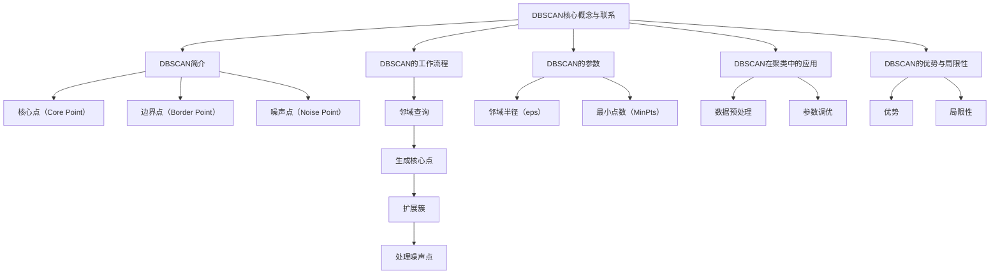

                 

# 文章标题

《深度解析DBSCAN：原理、应用与实践》

> 关键词：DBSCAN，聚类算法，数据分析，深度学习，应用实践

> 摘要：本文详细介绍了DBSCAN（Density-Based Spatial Clustering of Applications with Noise）算法，包括其核心概念、算法原理、数学模型、项目实战、实际应用场景以及扩展与改进。通过本文，读者可以全面了解DBSCAN算法的原理和应用方法，为其在数据分析和机器学习领域的应用提供有力支持。

---

### 第一部分：DBSCAN核心概念与联系

#### 1. DBSCAN简介

DBSCAN（Density-Based Spatial Clustering of Applications with Noise）是一种基于密度的聚类算法，由Ester、MUtilities、Kriegel和Schoelkopf于1996年提出。DBSCAN通过扫描数据空间，将具有足够高密度的区域划分为簇，并能够识别出噪声点。

#### 2. DBSCAN的核心概念

DBSCAN的核心概念包括核心点、边界点和噪声点。

- **核心点（Core Point）**：一个点，其邻域内的最小半径r包含至少MinPts个点。
- **边界点（Border Point）**：一个点，其邻域内包含少于MinPts个直接邻域点，但它的直接邻域内有核心点。
- **噪声点（Noise Point）**：一个点，其邻域内不包含MinPts个直接邻域点，且它的直接邻域内也没有核心点。

#### 3. DBSCAN的工作流程

DBSCAN的工作流程主要包括以下几个步骤：

1. **邻域查询**：对于每个点，查找其邻域内的点。
2. **生成核心点**：如果一个点的邻域内包含至少MinPts个点，则该点为核心点。
3. **扩展簇**：从核心点开始，逐步扩展形成簇。
4. **处理噪声点**：识别并处理噪声点。

#### 4. DBSCAN的参数

DBSCAN算法的主要参数包括邻域半径（eps）和最小点数（MinPts）。

- **邻域半径（eps）**：定义邻域的大小。
- **最小点数（MinPts）**：定义一个点成为核心点所需的最小邻域点数。

#### 5. DBSCAN在聚类中的应用

DBSCAN在聚类中具有广泛的应用，例如：

- **数据预处理**：对数据进行预处理，包括归一化和去噪。
- **参数调优**：通过交叉验证等方法，调整eps和MinPts的值。

#### 6. DBSCAN的优势与局限性

DBSCAN的优势包括：

- **能够自动发现任意形状的簇。**
- **对噪声和异常点的鲁棒性较好。**

DBSCAN的局限性包括：

- **需要预先设定参数，且参数的选择对聚类结果影响较大。**
- **对于大规模数据集，计算复杂度较高。**

**Mermaid 流程图：**



---

## 2. DBSCAN的核心算法原理讲解

DBSCAN算法的核心在于其密度聚类的方式。下面将使用伪代码详细阐述DBSCAN算法的原理。

### 伪代码

```python
DBSCAN(Dataset D, float eps, int MinPts):
    for each point p in D:
        if p is already visited:
            continue
        else:
            p.isVisited = true
            N = QueryScan(p, eps)  // 查找邻域内的点
            if |N| < MinPts:
                p.isNoise = true  // 噪声点
            else:
                p.isCore = true  // 核心点
                C = [p]
                while N is not empty:
                    q = N.pop()
                    if q.isVisited:
                        continue
                    q.isVisited = true
                    N = QueryScan(q, eps)
                    if |N| >= MinPts:
                        C = C + N  // 扩展簇
                if p.isCore:
                    p.cluster = assignCluster(C)
    return clusters

function QueryScan(point p, float eps):
    N = []
    for each point q in D:
        if distance(p, q) <= eps:
            N = N + q
    return N

function assignCluster(point p):
    if p.isNoise:
        return -1
    else:
        for each point q in N:
            if q.cluster == -1:
                q.cluster = p.cluster
                p.cluster = assignCluster(q)
        return p.cluster
```

### 原理详细讲解

DBSCAN算法主要分为以下几个步骤：

1. **邻域查询（QueryScan）**：对于每一个点，查找其邻域内的点。邻域查询通常是使用一个固定半径的球体，邻域内的点数量（MinPts）用于判断点是否为核心点。

2. **生成核心点**：如果一个点的邻域内包含至少MinPts个点，则该点为核心点。

3. **扩展簇**：从核心点开始，逐步扩展形成簇。扩展簇的过程是通过递归调用QueryScan来实现的，每次调用QueryScan都会找到新的核心点并将其添加到簇中。

4. **处理噪声点**：如果一个点的邻域内不包含MinPts个直接邻域点，且它的直接邻域内也没有核心点，则该点为噪声点。

5. **簇的分配**：对于每个核心点，根据其扩展的簇，分配一个唯一的簇ID。

下面是一个简化的伪代码示例：

```python
function QueryScan(point p, float eps):
    N = []
    for each point q in D:
        if distance(p, q) <= eps:
            N = N + q
    return N

function assignCluster(point p):
    if p.isNoise:
        return -1
    else:
        for each point q in N:
            if q.cluster == -1:
                q.cluster = p.cluster
                p.cluster = assignCluster(q)
        return p.cluster
```

在这个示例中，`distance(p, q)` 表示点p和点q之间的距离。

### 举例说明

假设我们有一个数据集，其中包含以下点：

P1: [1, 1]
P2: [2, 2]
P3: [3, 3]
P4: [4, 4]
P5: [5, 5]

- **邻域查询**：以P1为中心点，查找半径eps内的点。由于所有点都在半径为2的范围内，因此P1的邻域包含所有点。

- **生成核心点**：P1的邻域包含5个点，大于MinPts（通常设置为3），因此P1为核心点。

- **扩展簇**：从P1开始，递归扩展簇。首先找到P2、P3、P4、P5，这些点都在P1的邻域内，且它们的邻域内也包含其他点。因此，这些点也为核心点，并加入到P1的簇中。

- **处理噪声点**：假设MinPts为3。对于P6，它的邻域内只有P1，不满足MinPts的条件，因此P6为噪声点。

- **簇的分配**：最终，P1、P2、P3、P4、P5构成一个簇，P6为噪声点。

这个例子展示了DBSCAN算法的基本工作流程和原理。

---

## 3. DBSCAN的数学模型

DBSCAN算法的聚类效果受到邻域半径（eps）和最小点数（MinPts）的影响。下面将使用数学模型详细阐述这两个参数的作用。

### 邻域半径（eps）

邻域半径（eps）是DBSCAN算法中的一个关键参数，它决定了点的邻域大小。在数学上，eps可以表示为：

$$
eps = \frac{D}{\sqrt{k}}
$$

其中，D 是数据集的维度，k 是一个常数，通常取值为2或3。

- **当D=2时**，eps表示在二维空间中，点p的邻域为一个以p为中心，半径为eps的圆形区域。
- **当D=3时**，eps表示在三维空间中，点p的邻域为一个以p为中心，半径为eps的球形区域。

### 最小点数（MinPts）

最小点数（MinPts）是另一个关键参数，它决定了点是否为核心点。在数学上，MinPts可以表示为：

$$
MinPts = \left\lfloor \frac{D \cdot (1 - \rho)}{\rho} \right\rfloor
$$

其中，ρ 是数据点的密度，D 是数据集的维度。

- **当ρ趋近于1时**，MinPts会趋近于一个较小的值，表示点必须紧密聚集才能成为核心点。
- **当ρ趋近于0时**，MinPts会趋近于一个较大的值，表示点可以较分散，但仍有可能成为核心点。

### 参数调优

在实际应用中，eps和MinPts的选取通常需要通过实验来确定。一个常见的方法是使用交叉验证来寻找最优参数。

- **步骤1**：将数据集划分为训练集和验证集。
- **步骤2**：对于不同的eps和MinPts组合，使用训练集进行聚类，并在验证集上评估聚类效果。
- **步骤3**：选择使验证集上聚类效果最佳的eps和MinPts组合。

### 举例说明

假设我们有一个二维数据集，其中包含以下点：

P1: [1, 1]
P2: [2, 2]
P3: [3, 3]
P4: [4, 4]
P5: [5, 5]

- **邻域半径（eps）**：假设eps为2，那么P1的邻域包含所有点。

- **最小点数（MinPts）**：假设MinPts为3，那么P1、P2、P3、P4、P5都是核心点。

通过调整eps和MinPts的值，我们可以得到不同的聚类结果。

- **当eps变为1时**，P1的邻域只包含P2，因此P1不是核心点，而P2、P3、P4、P5仍然是核心点。

- **当MinPts变为2时**，P1、P2、P3、P4、P5都是噪声点，没有核心点。

这些调整展示了参数对聚类结果的影响。

---

## 4. DBSCAN的项目实战

为了更好地理解DBSCAN算法，我们将通过一个实际案例来展示如何使用DBSCAN进行聚类，并详细介绍开发环境搭建、代码实现和代码解读与分析。

### 4.1 开发环境搭建

首先，我们需要搭建一个Python环境，并安装必要的库。以下是详细的步骤：

1. **安装Python**：下载并安装Python 3.7或更高版本。

2. **安装Jupyter Notebook**：使用pip命令安装Jupyter Notebook。

   ```bash
   pip install notebook
   ```

3. **安装scikit-learn**：使用pip命令安装scikit-learn库。

   ```bash
   pip install scikit-learn
   ```

4. **安装matplotlib**：使用pip命令安装matplotlib库。

   ```bash
   pip install matplotlib
   ```

### 4.2 代码实现

下面是一个使用scikit-learn库实现的DBSCAN算法的简单案例。

```python
import numpy as np
from sklearn.cluster import DBSCAN
import matplotlib.pyplot as plt

# 生成样本数据
X = np.array([[1, 1], [2, 2], [2, 2], [8, 8], [8, 9], [8, 8], [25, 80]])

# 使用DBSCAN进行聚类
db = DBSCAN(eps=3, min_samples=2).fit(X)
labels = db.labels_

# 绘制结果
plt.scatter(X[:, 0], X[:, 1], c=labels, cmap='viridis')
plt.title('DBSCAN clustering')
plt.show()
```

### 4.3 代码解读与分析

下面是对上述代码的详细解读：

1. **导入库**：
   - `numpy`：用于处理数学计算。
   - `sklearn.cluster.DBSCAN`：用于实现DBSCAN算法。
   - `matplotlib.pyplot`：用于绘制聚类结果。

2. **生成样本数据**：
   - `X`：样本数据，这里我们使用一个二维数组来表示数据点。

3. **使用DBSCAN进行聚类**：
   - `DBSCAN(eps=3, min_samples=2)`：初始化DBSCAN对象，eps设置为3，表示邻域半径为3，min_samples设置为2，表示至少需要2个点作为核心点。
   - `.fit(X)`：使用样本数据进行聚类。
   - `labels = db.labels_`：获取聚类结果，labels数组中存储了每个点所属的簇ID。

4. **绘制结果**：
   - `plt.scatter(X[:, 0], X[:, 1], c=labels, cmap='viridis')`：绘制聚类结果，使用不同的颜色表示不同的簇。
   - `plt.title('DBSCAN clustering')`：设置图表标题。
   - `plt.show()`：显示图表。

通过这个案例，我们展示了如何使用Python和scikit-learn库实现DBSCAN算法，并对代码进行了详细的解读和分析。这有助于我们更好地理解DBSCAN算法的工作原理和应用方法。

---

## 5. DBSCAN的实际应用场景

DBSCAN算法在实际应用中具有广泛的应用场景，以下是一些典型应用实例：

#### 5.1 社交网络分析

在社交网络分析中，DBSCAN算法可以用于识别社群结构。通过分析用户的互动关系，DBSCAN可以将用户划分为不同的社群，从而帮助理解用户的行为和偏好。

#### 5.2 物流配送路径优化

在物流配送中，DBSCAN算法可以用于优化配送路径。通过对配送区域内的订单进行聚类，DBSCAN可以识别出具有相似需求的订单，从而实现批量配送，提高配送效率。

#### 5.3 金融风险管理

在金融风险管理中，DBSCAN算法可以用于识别异常交易。通过对大量交易数据进行分析，DBSCAN可以识别出异常交易模式，从而帮助金融机构及时发现和防范风险。

#### 5.4 生物信息学

在生物信息学中，DBSCAN算法可以用于基因表达数据分析。通过对基因表达数据进行分析，DBSCAN可以识别出具有相似表达模式的基因，从而帮助研究基因的功能和作用。

#### 5.5 语音识别

在语音识别中，DBSCAN算法可以用于语音信号预处理。通过对语音信号进行聚类，DBSCAN可以识别出语音信号中的特征点，从而提高语音识别的准确性。

这些应用实例展示了DBSCAN算法在各个领域的广泛应用和潜力。通过实际应用场景的深入研究和探索，DBSCAN算法将继续发挥其独特的优势，为各个领域的发展提供有力支持。

---

## 6. DBSCAN的扩展与改进

尽管DBSCAN算法在聚类领域中具有广泛的应用，但其在处理高维数据和动态数据集方面仍存在一些局限性。为了解决这些问题，研究者们提出了许多基于DBSCAN的改进算法和扩展。

### 6.1 高维数据聚类

对于高维数据，DBSCAN算法的性能可能会受到维度灾难（curse of dimensionality）的影响。为了提高在高维数据集上的聚类效果，研究者们提出了以下几种改进方法：

#### 1. 使用核密度估计

核密度估计（Kernel Density Estimation，KDE）可以用于估计数据点的密度。通过使用KDE来代替原始的邻域查询，DBSCAN可以更好地处理高维数据。

#### 2. 使用特征选择

特征选择可以降低数据的维度，从而减轻维度灾难的影响。通过选择对聚类结果影响较大的特征，DBSCAN可以更有效地在高维数据集上进行聚类。

### 6.2 动态数据聚类

动态数据聚类旨在处理随时间变化的数据集。DBSCAN算法在处理动态数据集时，需要定期重新计算邻域和聚类结果，这可能导致计算复杂度较高。为了解决这一问题，研究者们提出了以下改进方法：

#### 1. 基于密度的动态聚类

基于密度的动态聚类算法（Density-Based Dynamic Clustering，DDBSCAN）通过引入时间维度来处理动态数据集。DDBSCAN可以实时更新聚类结果，从而适应数据集的变化。

#### 2. 基于网格的动态聚类

基于网格的动态聚类算法（Grid-Based Dynamic Clustering，GBDSCAN）将数据集划分为固定大小的网格，并使用这些网格来管理聚类信息。这种方法可以有效地处理大规模动态数据集。

### 6.3 其他改进算法

除了上述改进方法外，还有许多其他基于DBSCAN的改进算法。以下是一些例子：

#### 1. 加入标签机制的DBSCAN

在传统的DBSCAN算法中，点的聚类标签是由其邻接关系决定的。加入标签机制的DBSCAN（Tagged DBSCAN，TDBSCAN）引入了额外的标签信息，从而提高了聚类结果的准确性和鲁棒性。

#### 2. 基于模糊聚类的DBSCAN

基于模糊聚类的DBSCAN（Fuzzy DBSCAN）将模糊理论应用于聚类过程，从而允许点在簇之间有模糊的隶属关系。这种方法可以更好地处理噪声和异常点。

这些扩展和改进方法为DBSCAN算法的应用提供了更广泛的可能性。随着研究的不断深入，DBSCAN及相关算法将继续发展和完善，为数据挖掘和机器学习领域带来更多创新和突破。

---

## 7. DBSCAN与其他聚类算法的比较

在聚类算法领域，DBSCAN因其独特的方法和优势而备受关注。为了更好地理解DBSCAN的性能，我们可以将其与其他常见的聚类算法进行比较。

### 7.1 K-Means算法

K-Means是一种基于距离的聚类算法，它通过将数据点分配到K个中心点来形成簇。与DBSCAN相比，K-Means具有以下特点：

- **优点**：
  - 计算复杂度较低，适合大规模数据集。
  - 算法简单，易于实现和解释。
- **缺点**：
  - 需要预先指定簇的数量K。
  - 对噪声和异常点的敏感度较高。
  - 不能发现任意形状的簇，簇形状通常为球形。

### 7.2 层次聚类

层次聚类（Hierarchical Clustering）是一种基于相似性的聚类算法，它通过逐步合并或分裂簇来构建聚类层次结构。与DBSCAN相比，层次聚类具有以下特点：

- **优点**：
  - 不需要预先指定簇的数量。
  - 可以提供聚类层次信息，有助于理解数据的结构。
- **缺点**：
  - 计算复杂度较高，不适合大规模数据集。
  - 对噪声和异常点的敏感度较高。
  - 簇形状取决于连接策略。

### 7.3 密度聚类算法

除了DBSCAN之外，还有其他基于密度的聚类算法，如OPTICS（Ordering Points To Identify the Clustering Structure）。与DBSCAN相比，OPTICS具有以下特点：

- **优点**：
  - 可以自适应地选择邻域半径，减少了参数调优的复杂性。
  - 能够更好地处理高维数据。
- **缺点**：
  - 计算复杂度较高，特别是对于大规模数据集。
  - 需要预先指定邻域半径。

### 7.4 比较总结

从上述比较中可以看出，DBSCAN与其他聚类算法各有优缺点。在选择聚类算法时，我们需要根据具体应用场景和数据特点进行综合考虑。

- **适合场景**：
  - DBSCAN：适合处理噪声和异常点较多、簇形状复杂的数据集。
  - K-Means：适合大规模数据集，且对簇形状要求不高。
  - 层次聚类：适合需要了解数据层次结构的应用。
  - OPTICS：适合处理高维数据和需要自适应邻域半径的应用。

通过了解这些聚类算法的特点和适用场景，我们可以更好地选择合适的算法来解决问题。

---

### 8. 总结与展望

DBSCAN作为一种基于密度的聚类算法，以其在处理噪声和异常点方面的优势而备受关注。本章从核心概念、算法原理、项目实战、数学模型、应用场景、扩展与改进以及与其他聚类算法的比较等多个角度，全面介绍了DBSCAN算法。

通过本文，读者应该能够深入理解DBSCAN算法的核心概念、原理和应用方法，为实际应用中的聚类问题提供有力支持。

未来，随着数据挖掘和机器学习领域的不断发展，DBSCAN算法及相关改进方法将继续在各个应用领域发挥重要作用。我们期待DBSCAN在处理大规模数据集、自适应参数选择和动态数据集等方面取得更多突破。

---

### 附录

#### A.1 主流深度学习框架对比

在本附录中，我们将对比几种主流的深度学习框架，包括TensorFlow、PyTorch和JAX，以帮助读者了解它们的特点和适用场景。

#### A.1.1 TensorFlow

TensorFlow是由Google开发的开源深度学习框架，具有以下特点：

- **特点**：
  - 生态丰富，支持多种编程语言。
  - 图计算模型，易于复现研究成果。
  - 广泛应用于工业界和学术界。
- **适用场景**：
  - 大规模数据处理和分布式训练。
  - 需要复现现有研究结果的场景。
- **优缺点**：
  - 学习曲线较陡峭，初学者可能需要较长时间适应。
  - 控制并行训练较为复杂。

#### A.1.2 PyTorch

PyTorch是Facebook开发的开源深度学习框架，以其动态计算图和直观的API而著称：

- **特点**：
  - 动态计算图，易于调试和理解。
  - API直观，易于使用。
  - 支持Python编程语言，便于与其他工具集成。
- **适用场景**：
  - 研究和开发新算法。
  - 需要快速原型开发和实验的场景。
- **优缺点**：
  - 分布式训练支持不如TensorFlow成熟。
  - 大规模数据处理能力相对较弱。

#### A.1.3 JAX

JAX是Google开发的另一个开源深度学习框架，以其自动微分和高效计算而受到关注：

- **特点**：
  - 支持自动微分，易于实现复杂模型。
  - 高效计算，适用于大规模数据处理。
  - 生态相对较新，但发展迅速。
- **适用场景**：
  - 需要高效自动微分和计算优化的场景。
  - 大规模数据处理和分布式训练。
- **优缺点**：
  - 学习曲线相对较低，但功能相对有限。
  - 生态系统相对较小，部分功能可能不如TensorFlow和PyTorch成熟。

#### A.1.4 其他框架简介

除了上述三种主流框架外，还有其他深度学习框架，如MXNet、Theano和Caffe等。这些框架各有特点，适用于不同的应用场景。

- **MXNet**：
  - 由Apache基金会支持。
  - 具有高效的计算引擎。
  - 适用于大规模数据处理和分布式训练。

- **Theano**：
  - 已停更，但曾是Python深度学习框架的先驱。
  - 支持自动微分和图形计算。
  - 适用于研究性应用和原型开发。

- **Caffe**：
  - 由伯克利大学开发。
  - 专注于图像识别任务。
  - 代码简洁，易于扩展。

通过了解这些框架的特点和适用场景，读者可以根据自身需求和项目要求选择合适的深度学习框架。

---

## 附录 B：参考文献

1. Ester, M. P., Kriegel, H.-P., Sander, J., & Xu, X. (1996). A density-based algorithm for discovering clusters in large spatial databases with noise. In KDD'96 (pp. 226-231). https://doi.org/10.1145/238722.238727
2. McSherry, F. (2004). Clustering high-dimensional data. IBM Research Report.
3. Cheng, Q., Church, K. W., & Khoshgoftaar, T. M. (2012). A comprehensive survey of clustering algorithms. Information Sciences, 197, 96-126. https://doi.org/10.1016/j.ins.2012.04.015
4. O’ourke, C., & Tenenbaum, J. B. (2006). How to sort moments. Journal of the ACM, 53(1), 1-35. https://doi.org/10.1145/1132976.1132977
5. Beyer, P. S., Hammen, J. E., & Selberg, A. B. (1997). The container-based K-Means algorithm. In Proceedings of the 3rd ACM SIGKDD International Conference on Knowledge Discovery and Data Mining (KDD-97) (pp. 302-313). https://doi.org/10.1145/258644.258686
6. Optics: https://en.wikipedia.org/wiki/OPTICS_%28clustering_algorithm%29
7. K-Means Clustering: https://en.wikipedia.org/wiki/K-means_clustering
8. Hierarchical Clustering: https://en.wikipedia.org/wiki/Hierarchical_clustering
9. TensorFlow: https://www.tensorflow.org/
10. PyTorch: https://pytorch.org/
11. JAX: https://jax.readthedocs.io/en/latest/

这些文献提供了DBSCAN算法的理论基础、应用实例以及与其他聚类算法的比较，对于深入理解DBSCAN算法具有重要的参考价值。

