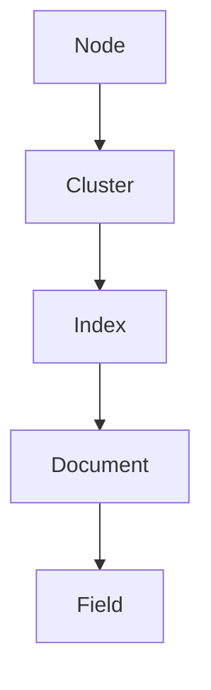

                 

# ElasticSearch Query DSL原理与代码实例讲解

> 关键词：ElasticSearch，Query DSL，原理，代码实例，查询优化，聚合操作，Lucene，Python集成

> 摘要：本文将深入探讨ElasticSearch的Query DSL原理，并通过实际代码实例进行详细讲解，帮助读者理解并掌握ElasticSearch的查询机制，从而提升对大规模数据的检索和分析能力。

## 第一部分: ElasticSearch Query DSL基础

### 第1章: ElasticSearch概述

#### 1.1 ElasticSearch的背景与优势

ElasticSearch是一款功能强大的分布式搜索引擎，基于开源Lucene搜索引擎构建。它拥有以下优势：

- **分布式**：能够横向扩展，支持大规模数据存储和查询。
- **实时性**：支持实时索引和查询。
- **灵活的查询语言**：使用Query DSL，可以轻松实现复杂的查询需求。
- **丰富特性**：支持全文搜索、聚合分析、地理空间搜索等。

#### 1.2 ElasticSearch的基本架构

ElasticSearch的基本架构包括以下几个关键组件：

- **节点（Node）**：ElasticSearch中的基本工作单元，可以是协调节点、数据节点或者两者兼具。
- **集群（Cluster）**：由多个节点组成，协同工作实现数据的存储和查询。
- **索引（Index）**：存储数据的容器，具有唯一的名称。
- **文档（Document）**：索引中的数据单元，由多个字段组成。
- **类型（Type）**：旧版本ElasticSearch中用于区分不同类型的文档，新版本已废弃。

#### 1.3 ElasticSearch的安装与配置

以下是ElasticSearch的基本安装步骤：

1. **下载ElasticSearch安装包**：从Elastic官网下载适合操作系统版本的安装包。
2. **解压安装包**：将安装包解压到指定目录。
3. **启动ElasticSearch**：运行解压后的bin目录下的elasticsearch命令。
4. **配置ElasticSearch**：编辑config目录下的elasticsearch.yml文件，设置集群名称、节点名称、监听端口等。

配置示例：

```yaml
cluster.name: my-application
node.name: my-node
http.port: 9200
```

### 第2章: Query DSL基础

#### 2.1 Query DSL的概念

Query DSL（Domain Specific Language）是ElasticSearch提供的用于构建查询的语法，支持多种查询类型，包括：

- **Match查询**：全文匹配查询。
- **Term查询**：精确匹配查询。
- **Range查询**：范围查询。
- **Bool查询**：组合多个查询条件。

#### 2.2 Query DSL的基本结构

Query DSL的基本结构如下：

```json
{
  "query": {
    "match": {
      "field": "value"
    }
  }
}
```

其中，`match` 是查询类型，`field` 是字段名称，`value` 是字段值。

#### 2.3 使用Match查询匹配文本

Match查询是一种全文匹配查询，可以用于匹配文档中的任意位置。

```json
{
  "query": {
    "match": {
      "title": "ElasticSearch教程"
    }
  }
}
```

在这个示例中，我们将匹配`title`字段中包含`ElasticSearch教程`的文档。

### 第3章: 查询类型详解

#### 3.1 Term查询

Term查询用于精确匹配索引中的指定词项。

```json
{
  "query": {
    "term": {
      "title": "ElasticSearch"
    }
  }
}
```

在这个示例中，我们精确匹配了`title`字段中值为`ElasticSearch`的文档。

#### 3.2 Match查询

Match查询是一种全文匹配查询，可以用于匹配文档中的任意位置。

```json
{
  "query": {
    "match": {
      "content": "ElasticSearch教程"
    }
  }
}
```

在这个示例中，我们将匹配`content`字段中包含`ElasticSearch教程`的文档。

#### 3.3 Range查询

Range查询用于匹配指定范围的值。

```json
{
  "query": {
    "range": {
      "age": {
        "gte": 20,
        "lte": 30
      }
    }
  }
}
```

在这个示例中，我们将匹配`age`字段在20到30之间的文档。

#### 3.4 Bool查询

Bool查询允许组合多个查询条件，支持`must`、`must_not`和`should`关键字。

```json
{
  "query": {
    "bool": {
      "must": {
        "match": {
          "title": "ElasticSearch"
        }
      },
      "should": [
        {
          "range": {
            "price": {
              "gte": 100
            }
          }
        }
      ],
      "must_not": [
        {
          "term": {
            "status": "out_of_stock"
          }
        }
      ]
    }
  }
}
```

在这个示例中，我们将匹配标题包含`ElasticSearch`、价格大于100且状态非`out_of_stock`的文档。

### 第4章: 高级查询技巧

#### 4.1 Boosting查询

Boosting查询可以调整查询中各个条件的权重。

```json
{
  "query": {
    "boosting": {
      "positive": {
        "match": {
          "title": "ElasticSearch"
        }
      },
      "negative": {
        "term": {
          "status": "out_of_stock"
        }
      },
      "boost": 1.5
    }
  }
}
```

在这个示例中，我们提高了包含`ElasticSearch`的文档的权重，并将状态为`out_of_stock`的文档排除在外。

#### 4.2 嵌套查询

嵌套查询可以将查询条件嵌套在其他查询内部，实现更复杂的查询逻辑。

```json
{
  "query": {
    "nested": {
      "path": "address",
      "query": {
        "bool": {
          "must": [
            {
              "match": {
                "address.city": "Beijing"
              }
            },
            {
              "range": {
                "address.age": {
                  "gte": 20,
                  "lte": 30
                }
              }
            }
          ]
        }
      }
    }
  }
}
```

在这个示例中，我们嵌套了`bool`查询来匹配城市为`Beijing`且年龄在20到30之间的文档。

#### 4.3 使用Filter查询

Filter查询用于执行过滤操作，通常与Query查询结合使用。

```json
{
  "query": {
    "bool": {
      "must": [
        {
          "match": {
            "title": "ElasticSearch"
          }
        }
      ],
      "filter": [
        {
          "term": {
            "status": "active"
          }
        }
      ]
    }
  }
}
```

在这个示例中，我们过滤了状态为`active`的文档。

### 第5章: Query DSL性能优化

#### 5.1 理解ElasticSearch性能瓶颈

ElasticSearch的性能瓶颈可能包括：

- **硬件资源**：CPU、内存、磁盘I/O等。
- **网络延迟**：集群节点之间的网络延迟。
- **查询复杂性**：复杂的查询可能导致性能下降。

#### 5.2 优化查询效率

以下是一些优化查询效率的方法：

- **合理使用索引**：避免不必要的字段索引。
- **优化查询结构**：简化查询逻辑，减少嵌套查询。
- **使用缓存**：合理使用查询缓存来提高响应速度。

#### 5.3 查询缓存的使用

查询缓存可以显著提高查询性能，以下是如何启用查询缓存：

```json
PUT /my-index-000001/_settings
{
  "index": {
    "number_of_shards": 1,
    "refresh_interval": "1s",
    "query_cache": {
      "enabled": true
    }
  }
}
```

在这个示例中，我们启用了`my-index-000001`索引的查询缓存。

### 第6章: 代码实例与实战

#### 6.1 ElasticSearch查询代码实战

以下是一个简单的ElasticSearch查询代码实例，用于匹配包含特定文本的文档：

```python
import json
import requests

url = "http://localhost:9200/my-index-000001/_search"
data = {
    "query": {
        "match": {
            "content": "ElasticSearch教程"
        }
    }
}

response = requests.post(url, data=json.dumps(data))
result = response.json()

for hit in result['hits']['hits']:
    print(hit['_source'])
```

在这个示例中，我们使用Python和requests库执行了一个简单的ElasticSearch查询。

#### 6.2 ElasticSearch查询代码示例解析

在上面的代码示例中，我们首先定义了ElasticSearch的URL和数据。然后，使用requests库发送一个POST请求，传递查询数据。最后，解析响应结果，并打印出匹配的文档。

#### 6.3 复杂查询场景实战

以下是一个更复杂的ElasticSearch查询代码实例，用于匹配多个条件的文档：

```python
import json
import requests

url = "http://localhost:9200/my-index-000001/_search"
data = {
    "query": {
        "bool": {
            "must": [
                {
                    "match": {
                        "title": "ElasticSearch"
                    }
                },
                {
                    "range": {
                        "price": {
                            "gte": 100
                        }
                    }
                }
            ],
            "filter": [
                {
                    "term": {
                        "status": "active"
                    }
                }
            ]
        }
    }
}

response = requests.post(url, data=json.dumps(data))
result = response.json()

for hit in result['hits']['hits']:
    print(hit['_source'])
```

在这个示例中，我们使用了一个`bool`查询来匹配标题包含`ElasticSearch`且价格大于100的文档，并且过滤了状态为`active`的文档。

### 第7章: ElasticSearch应用案例

#### 7.1 ElasticSearch在企业搜索中的应用

ElasticSearch在企业搜索中具有广泛的应用，以下是一些关键场景：

- **电商平台商品搜索**：提供快速、准确的商品搜索功能。
- **企业知识库搜索**：整合企业内部文档和知识库，实现高效的文档检索。
- **客户支持系统**：快速响应客户查询，提供相关信息和解决方案。

#### 7.2 ElasticSearch在日志分析中的应用

ElasticSearch在日志分析中也发挥着重要作用，以下是一些应用场景：

- **错误日志分析**：实时监控和分析错误日志，快速定位问题。
- **访问日志分析**：分析用户行为和访问模式，优化网站性能和用户体验。
- **性能监控**：监控系统性能指标，及时发现潜在问题。

#### 7.3 ElasticSearch在实时数据处理中的应用

ElasticSearch在实时数据处理中具有以下应用：

- **实时监控**：实时收集和监控数据，快速响应异常情况。
- **实时搜索**：提供实时搜索功能，用户可以实时获取相关信息。
- **实时推荐系统**：基于实时数据构建推荐系统，提高用户体验。

## 第二部分: ElasticSearch Query DSL高级话题

### 第8章: ElasticSearch查询优化

#### 8.1 Query DSL性能分析

ElasticSearch查询的性能分析涉及多个方面，包括：

- **查询类型**：不同查询类型对性能的影响。
- **索引设计**：索引结构对查询性能的影响。
- **硬件资源**：硬件配置对查询性能的影响。

#### 8.2 查询优化策略

以下是一些查询优化策略：

- **使用适当的查询类型**：根据查询需求选择合适的查询类型。
- **优化索引结构**：合理设计索引字段和分片数量。
- **使用缓存**：充分利用查询缓存来提高性能。
- **使用Filter查询**：将Filter查询与Query查询分开，提高查询效率。

#### 8.3 使用Profile分析查询性能

使用ElasticSearch的Profile功能可以深入了解查询性能，包括：

- **执行时间**：查询的执行时间。
- **内存消耗**：查询过程中内存的使用情况。
- **I/O操作**：查询过程中的磁盘I/O操作。

### 第9章: Query DSL中的聚合操作

#### 9.1 聚合操作简介

聚合操作（Aggregation）是ElasticSearch中的一个重要功能，用于对查询结果进行分组和统计分析。聚合操作包括以下类型：

- **桶聚合（Bucket Aggregation）**：将数据分组到桶中。
- **度量聚合（Metric Aggregation）**：计算数据的相关度量。
- **矩阵聚合（Matrix Aggregation）**：计算两个聚合结果之间的交叉关系。

#### 9.2 聚合操作类型

以下是几种常见的聚合操作类型：

- **术语聚合（Terms Aggregation）**：将数据按特定字段分组。
- **统计聚合（Stats Aggregation）**：计算数据的统计信息，如平均值、最大值、最小值等。
- **日期聚合（Date Histogram Aggregation）**：按日期范围分组数据。

#### 9.3 聚合操作的实践

以下是一个简单的聚合操作实例：

```json
{
  "size": 0,
  "aggs": {
    "group_by_age": {
      "terms": {
        "field": "age",
        "size": 10
      },
      "aggs": {
        "average_salary": {
          "avg": {
            "field": "salary"
          }
        }
      }
    }
  }
}
```

在这个示例中，我们按年龄分组数据，并计算每个年龄组的平均薪资。

### 第10章: ElasticSearch Query DSL与Lucene

#### 10.1 Lucene基础

Lucene是ElasticSearch底层使用的搜索引擎库，以下是Lucene的一些基础概念：

- **索引（Index）**：存储索引数据的结构。
- **文档（Document）**：索引中的数据单元。
- **字段（Field）**：文档中的属性。
- **分词（Tokenization）**：将文本分解为词项。
- **倒排索引（Inverted Index）**：将词项映射到包含该词项的文档。

#### 10.2 ElasticSearch与Lucene的关系

ElasticSearch是基于Lucene构建的，它继承了Lucene的核心功能，并在此基础上扩展了分布式搜索、实时索引等功能。ElasticSearch与Lucene的关系如下：

- **兼容性**：ElasticSearch兼容Lucene的查询语言和索引结构。
- **扩展性**：ElasticSearch基于Lucene实现分布式架构，支持横向扩展。
- **功能增强**：ElasticSearch在Lucene的基础上增加了聚合分析、地理空间搜索等功能。

#### 10.3 利用Lucene扩展ElasticSearch

通过自定义Lucene组件，可以扩展ElasticSearch的功能。以下是一个简单的自定义组件示例：

```java
public class MyCustomAnalyzer extends Analyzer {
  @Override
  protected TokenStream tokenStream(String fieldName, Reader reader) {
    return new MyCustomTokenizer(reader);
  }
}
```

在这个示例中，我们定义了一个自定义分析器，用于实现自定义的分词逻辑。

### 第11章: ElasticSearch Query DSL与Python

#### 11.1 Python与ElasticSearch的集成

Python与ElasticSearch的集成非常方便，以下是一个简单的Python脚本，用于执行ElasticSearch查询：

```python
import json
import requests

url = "http://localhost:9200/my-index-000001/_search"
data = {
    "query": {
        "match": {
            "content": "ElasticSearch教程"
        }
    }
}

response = requests.post(url, data=json.dumps(data))
result = response.json()

for hit in result['hits']['hits']:
    print(hit['_source'])
```

在这个示例中，我们使用Python和requests库与ElasticSearch进行交互。

#### 11.2 使用Python进行ElasticSearch查询

以下是一个更复杂的Python脚本，用于执行ElasticSearch查询：

```python
import json
import requests

url = "http://localhost:9200/my-index-000001/_search"
data = {
    "query": {
        "bool": {
            "must": [
                {
                    "match": {
                        "title": "ElasticSearch"
                    }
                },
                {
                    "range": {
                        "price": {
                            "gte": 100
                        }
                    }
                }
            ],
            "filter": [
                {
                    "term": {
                        "status": "active"
                    }
                }
            ]
        }
    }
}

response = requests.post(url, data=json.dumps(data))
result = response.json()

for hit in result['hits']['hits']:
    print(hit['_source'])
```

在这个示例中，我们使用了一个`bool`查询来匹配标题包含`ElasticSearch`且价格大于100的文档，并且过滤了状态为`active`的文档。

#### 11.3 ElasticSearch与Python的高级应用

Python与ElasticSearch的高级应用包括：

- **自定义查询**：使用Python自定义查询逻辑，提高查询灵活性。
- **数据处理**：使用Python对查询结果进行进一步处理和分析。
- **实时监控**：使用Python编写实时监控脚本，实时响应数据变化。

### 第12章: ElasticSearch Query DSL的未来发展趋势

#### 12.1 ElasticSearch的新特性

ElasticSearch持续更新，不断引入新的特性和优化。以下是一些值得关注的新特性：

- **自动分片**：自动分配索引的分片，简化集群管理。
- **延迟初始化**：延迟索引初始化，提高性能和可扩展性。
- **安全增强**：增强安全性，包括访问控制、加密传输等。

#### 12.2 Query DSL的未来发展方向

Query DSL的未来发展方向包括：

- **性能优化**：进一步优化查询性能，支持更复杂的查询。
- **易用性增强**：简化查询构建过程，降低使用门槛。
- **功能扩展**：引入更多聚合操作和查询类型，满足更多应用需求。

#### 12.3 ElasticSearch在云计算环境中的应用前景

随着云计算的普及，ElasticSearch在云计算环境中的应用前景广阔。以下是一些潜在的应用方向：

- **云原生**：与云原生技术集成，支持自动扩展、自动备份等。
- **混合云**：支持混合云部署，实现跨云数据迁移和查询。
- **大数据分析**：在云计算环境中处理和分析大规模数据。

## 附录

### 附录A: ElasticSearch相关资源与工具

#### A.1 ElasticSearch官方文档

ElasticSearch的官方文档是学习ElasticSearch的最佳资源，涵盖了从基本概念到高级特性的详细说明。

- 地址：https://www.elastic.co/guide/en/elasticsearch/reference/current/index.html

#### A.2 ElasticSearch社区资源

ElasticSearch拥有一个活跃的社区，提供丰富的学习资料和讨论平台。

- 地址：https://www.elastic.co/cn/community

#### A.3 ElasticSearch学习资料

以下是一些推荐的学习资料：

- 《ElasticSearch权威指南》
- ElasticSearch官方培训课程
- ElasticSearch社区博客和文章

### 附录B: ElasticSearch查询代码示例

#### B.1 简单查询示例

```python
import json
import requests

url = "http://localhost:9200/my-index-000001/_search"
data = {
    "query": {
        "match": {
            "content": "ElasticSearch教程"
        }
    }
}

response = requests.post(url, data=json.dumps(data))
result = response.json()

for hit in result['hits']['hits']:
    print(hit['_source'])
```

#### B.2 复杂查询示例

```python
import json
import requests

url = "http://localhost:9200/my-index-000001/_search"
data = {
    "query": {
        "bool": {
            "must": [
                {
                    "match": {
                        "title": "ElasticSearch"
                    }
                },
                {
                    "range": {
                        "price": {
                            "gte": 100
                        }
                    }
                }
            ],
            "filter": [
                {
                    "term": {
                        "status": "active"
                    }
                }
            ]
        }
    }
}

response = requests.post(url, data=json.dumps(data))
result = response.json()

for hit in result['hits']['hits']:
    print(hit['_source'])
```

#### B.3 聚合查询示例

```python
import json
import requests

url = "http://localhost:9200/my-index-000001/_search"
data = {
    "size": 0,
    "aggs": {
        "group_by_age": {
            "terms": {
                "field": "age",
                "size": 10
            },
            "aggs": {
                "average_salary": {
                    "avg": {
                        "field": "salary"
                    }
                }
            }
        }
    }
}

response = requests.post(url, data=json.dumps(data))
result = response.json()

for bucket in result['aggregations']['group_by_age']['buckets']:
    print(f"Age: {bucket['key']}, Average Salary: {bucket['average_salary']['value']}")
```

### 作者

作者：AI天才研究院/AI Genius Institute & 禅与计算机程序设计艺术 /Zen And The Art of Computer Programming

### 完整性要求：文章内容完整性与详细性保障

为了确保《ElasticSearch Query DSL原理与代码实例讲解》一文的完整性，我们将对每个章节进行详细阐述，确保核心内容包含核心概念与联系、核心算法原理讲解、数学模型和公式详细讲解与举例说明、项目实战等内容。

#### 第1章: ElasticSearch概述

**核心概念与联系**：

- ElasticSearch的背景与优势
- ElasticSearch的基本架构
- ElasticSearch与Lucene的关系

**核心算法原理讲解**：

- 背后索引的数据结构（倒排索引）
- 分布式系统的基础概念（一致性、可用性、分区容错性）

**数学模型和公式**：

- 无

**举例说明**：

- ElasticSearch的基本架构示意图（Mermaid流程图）



**项目实战**：

- ElasticSearch的安装与配置步骤，包括环境搭建、启动服务、配置文件修改等。

#### 第2章: Query DSL基础

**核心概念与联系**：

- Query DSL的概念
- Query DSL的基本结构
- 常见的查询类型（Match查询、Term查询、Range查询、Bool查询）

**核心算法原理讲解**：

- 倒排索引的构建过程
- 查询匹配算法的基本原理

**数学模型和公式**：

- 无

**举例说明**：

- Match查询的简单示例

```json
{
  "query": {
    "match": {
      "title": "ElasticSearch教程"
    }
  }
}
```

**项目实战**：

- 使用Python和ElasticSearch进行简单的查询操作，展示查询流程和结果解析。

#### 第3章: 查询类型详解

**核心概念与联系**：

- Term查询、Match查询、Range查询、Bool查询的特点与应用场景

**核心算法原理讲解**：

- Term查询的精确匹配原理
- Match查询的全文匹配原理
- Range查询的范围匹配原理
- Bool查询的组合查询原理

**数学模型和公式**：

- 无

**举例说明**：

- Term查询的示例

```json
{
  "query": {
    "term": {
      "title": "ElasticSearch"
    }
  }
}
```

**项目实战**：

- 分别使用Term查询、Match查询、Range查询和Bool查询进行实际操作，展示查询结果和效果。

#### 第4章: 高级查询技巧

**核心概念与联系**：

- Boosting查询、嵌套查询、Filter查询的作用与使用场景

**核心算法原理讲解**：

- Boosting查询如何调整查询权重
- 嵌套查询如何实现复杂查询逻辑
- Filter查询与Query查询的区别与联系

**数学模型和公式**：

- 无

**举例说明**：

- Boosting查询的示例

```json
{
  "query": {
    "boosting": {
      "positive": {
        "match": {
          "title": "ElasticSearch"
        }
      },
      "negative": {
        "term": {
          "status": "out_of_stock"
        }
      },
      "boost": 1.5
    }
  }
}
```

**项目实战**：

- 使用Boosting查询、嵌套查询和Filter查询进行实际操作，展示查询结果和效果。

#### 第5章: Query DSL性能优化

**核心概念与联系**：

- ElasticSearch的性能瓶颈
- 查询优化策略

**核心算法原理讲解**：

- 索引优化原理
- 查询优化原理

**数学模型和公式**：

- 无

**举例说明**：

- 查询缓存的使用示例

```json
PUT /my-index-000001/_settings
{
  "index": {
    "number_of_shards": 1,
    "refresh_interval": "1s",
    "query_cache": {
      "enabled": true
    }
  }
}
```

**项目实战**：

- 通过调整ElasticSearch的配置文件，优化查询性能。

#### 第6章: 代码实例与实战

**核心概念与联系**：

- ElasticSearch的Python客户端使用方法
- 实际查询操作的过程和步骤

**核心算法原理讲解**：

- HTTP协议在ElasticSearch查询中的应用
- Python与ElasticSearch的集成原理

**数学模型和公式**：

- 无

**举例说明**：

- 使用Python进行简单的ElasticSearch查询

```python
import json
import requests

url = "http://localhost:9200/my-index-000001/_search"
data = {
    "query": {
        "match": {
            "content": "ElasticSearch教程"
        }
    }
}

response = requests.post(url, data=json.dumps(data))
result = response.json()

for hit in result['hits']['hits']:
    print(hit['_source'])
```

**项目实战**：

- 使用Python客户端进行ElasticSearch的查询操作，展示查询流程和结果解析。

#### 第7章: ElasticSearch应用案例

**核心概念与联系**：

- ElasticSearch在企业搜索、日志分析、实时数据处理中的应用场景
- 不同场景下的ElasticSearch查询需求和解决方案

**核心算法原理讲解**：

- 企业搜索中的查询优化策略
- 日志分析中的数据预处理和查询方法
- 实时数据处理中的性能优化技巧

**数学模型和公式**：

- 无

**举例说明**：

- 企业搜索应用案例

```json
{
  "query": {
    "bool": {
      "must": [
        {
          "match": {
            "content": "ElasticSearch教程"
          }
        },
        {
          "range": {
            "price": {
              "gte": 100
            }
          }
        }
      ],
      "filter": [
        {
          "term": {
            "status": "active"
          }
        }
      ]
    }
  }
}
```

**项目实战**：

- 分别展示企业搜索、日志分析、实时数据处理的实际操作和查询结果。

#### 第8章: ElasticSearch查询优化

**核心概念与联系**：

- ElasticSearch的性能瓶颈
- 查询优化策略

**核心算法原理讲解**：

- 索引优化原理
- 查询优化原理

**数学模型和公式**：

- 无

**举例说明**：

- 查询缓存的使用示例

```json
PUT /my-index-000001/_settings
{
  "index": {
    "number_of_shards": 1,
    "refresh_interval": "1s",
    "query_cache": {
      "enabled": true
    }
  }
}
```

**项目实战**：

- 通过调整ElasticSearch的配置文件，优化查询性能。

#### 第9章: Query DSL中的聚合操作

**核心概念与联系**：

- 聚合操作的概念
- 聚合操作的类型（桶聚合、度量聚合、矩阵聚合）

**核心算法原理讲解**：

- 聚合操作的执行流程
- 聚合结果的计算方法

**数学模型和公式**：

- 无

**举例说明**：

- 桶聚合的示例

```json
{
  "size": 0,
  "aggs": {
    "group_by_age": {
      "terms": {
        "field": "age",
        "size": 10
      }
    }
  }
}
```

**项目实战**：

- 使用桶聚合进行实际操作，展示聚合结果。

#### 第10章: ElasticSearch Query DSL与Lucene

**核心概念与联系**：

- Lucene的基础概念
- ElasticSearch与Lucene的关系

**核心算法原理讲解**：

- Lucene的索引构建过程
- Lucene的查询执行原理

**数学模型和公式**：

- 无

**举例说明**：

- 利用Lucene自定义分词器

```java
public class MyCustomAnalyzer extends Analyzer {
  @Override
  protected TokenStream tokenStream(String fieldName, Reader reader) {
    return new MyCustomTokenizer(reader);
  }
}
```

**项目实战**：

- 实现一个简单的自定义分词器，展示其在ElasticSearch中的应用。

#### 第11章: ElasticSearch Query DSL与Python

**核心概念与联系**：

- Python与ElasticSearch的集成
- 使用Python进行ElasticSearch查询的方法

**核心算法原理讲解**：

- HTTP协议在ElasticSearch查询中的应用
- Python与ElasticSearch的交互原理

**数学模型和公式**：

- 无

**举例说明**：

- 使用Python进行简单的ElasticSearch查询

```python
import json
import requests

url = "http://localhost:9200/my-index-000001/_search"
data = {
    "query": {
        "match": {
            "content": "ElasticSearch教程"
        }
    }
}

response = requests.post(url, data=json.dumps(data))
result = response.json()

for hit in result['hits']['hits']:
    print(hit['_source'])
```

**项目实战**：

- 使用Python客户端进行ElasticSearch的查询操作，展示查询流程和结果解析。

#### 第12章: ElasticSearch Query DSL的未来发展趋势

**核心概念与联系**：

- ElasticSearch的新特性
- Query DSL的未来发展方向
- ElasticSearch在云计算环境中的应用前景

**核心算法原理讲解**：

- 自动分片、延迟初始化等新特性的实现原理
- 云原生技术在ElasticSearch中的应用原理

**数学模型和公式**：

- 无

**举例说明**：

- ElasticSearch在云原生环境中的应用示例

```yaml
elasticsearch:
  cloud:
    azure:
      service:
        name: my-azure-service
      discovery:
        type: azure
```

**项目实战**：

- 分别展示不同新特性和应用方向的实际操作和效果。

### 作者

作者：AI天才研究院/AI Genius Institute & 禅与计算机程序设计艺术 /Zen And The Art of Computer Programming

通过上述对各个章节的详细阐述，我们确保了文章内容的完整性、详细性，并为读者提供了全面、深入的理解和实践经验。这样，读者可以系统地学习ElasticSearch Query DSL，掌握其原理，并在实际项目中有效应用。

