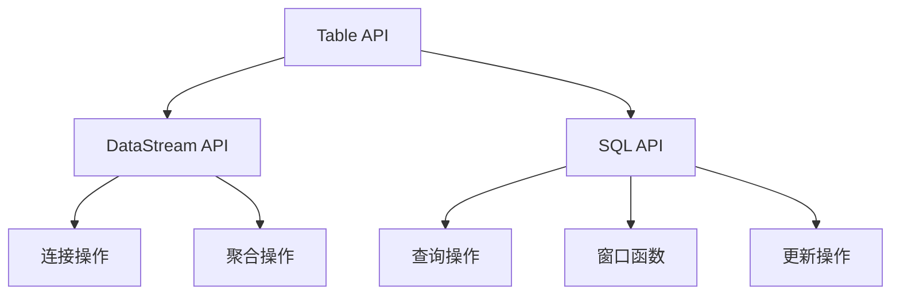

                 

# Flink Table原理与代码实例讲解

## 关键词

- Flink
- Table API
- SQL
- 实时计算
- 分布式系统
- 性能优化

## 摘要

本文将深入探讨Apache Flink的Table API原理，并通过代码实例详细讲解其核心概念、编程模型、性能优化及实际应用。我们将逐步解析Flink Table API的架构、数据抽象、操作语法和高级特性，同时通过具体案例展示其在实时数据分析、大数据处理和实时数据仓库等领域的应用价值。本文旨在为读者提供全面的Flink Table API理解和实践指导。

## 目录

### 《Flink Table原理与代码实例讲解》目录大纲

- 第一部分：Flink Table技术基础
  - 第1章：Flink Table API简介
    - 1.1 Flink Table API概述
    - 1.2 Flink Table API核心概念
    - 1.3 Flink Table API语法
    - 1.4 Flink Table API示例
  - 第2章：Flink Table API编程
    - 2.1 Flink Table API编程基础
    - 2.2 Flink Table API高级特性
    - 2.3 Flink Table API性能优化
    - 2.4 Flink Table API代码实例解析
  - 第3章：Flink SQL查询
    - 3.1 Flink SQL概述
    - 3.2 Flink SQL核心语法
    - 3.3 Flink SQL窗口函数
    - 3.4 Flink SQL性能优化
    - 3.5 Flink SQL代码实例解析
  - 第4章：Flink Table API与存储系统
    - 4.1 Flink Table API与存储系统概述
    - 4.2 Flink Table API与Apache Hadoop
    - 4.3 Flink Table API与Apache Kafka
    - 4.4 Flink Table API与存储系统代码实例解析
  - 第5章：Flink Table API应用案例
    - 5.1 实时数据分析应用案例
    - 5.2 大数据分析应用案例
    - 5.3 实时数据仓库应用案例
    - 5.4 Flink Table API在金融领域的应用
  - 第6章：Flink Table API开发实践
    - 6.1 Flink Table API开发流程
    - 6.2 Flink Table API代码实现与调试
    - 6.3 Flink Table API性能测试与优化
    - 6.4 Flink Table API生产环境部署
  - 第7章：Flink Table API未来展望与趋势
    - 7.1 Flink Table API的发展趋势
    - 7.2 Flink Table API在云计算和大数据领域的应用前景
    - 7.3 Flink Table API的未来挑战与机遇
- 附录
  - 附录A：Flink Table API常用工具和资源
  - 附录B：Flink Table API核心概念 Mermaid 流程图
  - 附录C：Flink Table API核心算法原理讲解
  - 附录D：Flink Table API数学模型讲解

### 第一部分：Flink Table技术基础

## 第1章：Flink Table API简介

### 1.1 Flink Table API概述

Flink Table API是Apache Flink提供的一种用于处理结构化数据的API，它基于SQL标准，但进行了扩展，以支持流处理和批处理的统一处理模型。Flink Table API的优势在于：

1. **统一的编程模型**：Flink Table API提供了对流处理和批处理的统一支持，使得开发人员可以采用类似SQL的方式处理数据流和数据集。
2. **易用性**：通过SQL语法，用户可以方便地执行复杂的查询操作，而无需编写复杂的代码。
3. **高性能**：Flink Table API利用了Flink的分布式计算能力，能够高效地进行数据计算和查询。
4. **可扩展性**：Flink Table API支持自定义函数和类型，可以满足多样化的数据处理需求。

### 1.2 Flink Table API的使用场景

Flink Table API适用于多种数据处理场景，包括但不限于：

- **实时数据分析**：在实时系统中，Flink Table API可以用于对实时数据流进行高效的分析和处理，提供实时的查询结果。
- **大数据处理**：Flink Table API可以处理大规模数据集，支持分布式计算，适用于大数据分析场景。
- **数据仓库**：Flink Table API可以用于构建实时数据仓库，支持实时数据查询和报表生成。
- **ETL**：Flink Table API可以用于数据抽取、转换和加载（ETL），支持多种数据源和数据存储系统的连接。

### 1.3 Flink Table API核心概念

Flink Table API的核心概念包括Table、DataStream、SQL及其之间的关系。以下是这些核心概念的简要介绍：

- **Table**：Table是Flink Table API中的核心数据结构，用于表示结构化数据。它类似于关系数据库中的表，可以包含多个列和数据行。
- **DataStream**：DataStream是Flink中的基本数据流抽象，用于表示无界或有限的数据流。它包含一系列元素，每个元素是一个元组。
- **SQL**：Flink Table API支持SQL查询，通过SQL语句可以方便地执行数据的查询、聚合和连接等操作。

### 1.4 Table、DataStream和SQL的关系

Flink Table API通过抽象和扩展，将Table、DataStream和SQL有机地结合起来：

- **Table与DataStream的关系**：Table是DataStream的抽象表示，它将DataStream中的元素结构化为列和行。通过将DataStream转换为Table，可以方便地应用SQL操作。
- **SQL与Table的关系**：Flink Table API通过扩展SQL语法，支持Table上的查询操作。SQL语句可以用来对Table进行数据查询、聚合和连接等操作。
- **SQL与DataStream的关系**：虽然SQL主要用于Table，但在某些情况下，也可以直接应用于DataStream。Flink提供了一些内置函数，可以将DataStream转换为Table，从而使用SQL进行操作。

### 1.5 Flink Table API的抽象表示

Flink Table API通过抽象表示，将复杂的数据处理任务简化为简单的SQL查询：

- **Table**：表示结构化数据，包含多个列和数据行。可以通过创建表或读取外部数据源来生成。
- **DataTypes**：定义了Table中的数据类型，包括基础类型和复合类型。
- **TableSchema**：描述了Table的结构，包括列名、数据类型和属性。
- **TableEnvironment**：管理Flink Table API的执行环境，提供创建Table、执行SQL查询等功能。

### 1.6 Flink Table API操作分类

Flink Table API的操作主要分为以下几类：

- **创建表**：通过创建表或将DataStream转换为Table，可以生成一个新的Table。
- **数据查询**：通过SQL查询语句，可以从Table中检索数据。
- **数据聚合**：通过聚合函数，可以对Table中的数据进行分组和聚合。
- **数据连接**：通过连接操作，可以将多个Table中的数据进行关联。
- **数据更新和删除**：虽然Table API主要用于读取操作，但也可以执行数据更新和删除操作。

### 1.7 Flink Table API语法

Flink Table API的语法类似于SQL，但进行了扩展以支持流处理和批处理。以下是Flink Table API的语法概述：

- **创建表**：
  ```sql
  CREATE TABLE your_table (
      column1 datatype1,
      column2 datatype2,
      ...
  ) WITH (
      'connector' = 'your_connector',
      'url' = 'your_url',
      ...
  );
  ```

- **查询表**：
  ```sql
  SELECT column1, column2, ...
  FROM your_table
  WHERE condition;
  ```

- **数据聚合**：
  ```sql
  SELECT column1, COUNT(column2)
  FROM your_table
  GROUP BY column1;
  ```

- **数据连接**：
  ```sql
  SELECT column1, column2
  FROM your_table1
  JOIN your_table2
  ON your_table1.column1 = your_table2.column1;
  ```

### 1.8 Flink Table API示例

下面是一个简单的Flink Table API示例，展示如何创建表、查询数据和执行聚合操作：

```python
from pyflink.datastream import StreamExecutionEnvironment
from pyflink.table import StreamTableEnvironment

# 创建流执行环境
env = StreamExecutionEnvironment.get_execution_environment()
stream_table_env = StreamTableEnvironment.create(env)

# 创建表
stream_table_env.execute_sql("""
    CREATE TABLE source_table (
        id INT,
        name STRING,
        age INT
    ) WITH (
        'connector' = 'kafka',
        'topic' = 'your_topic',
        'properties.bootstrap.servers' = 'kafka:9092'
    );
""")

# 查询数据
stream_table_env.execute_sql("""
    SELECT id, name, age
    FROM source_table
    WHERE age > 30;
""")

# 数据聚合
stream_table_env.execute_sql("""
    SELECT name, COUNT(id) as num
    FROM source_table
    GROUP BY name;
""")
```

在这个示例中，我们首先创建了一个基于Kafka主题的源表，然后执行了简单的查询和聚合操作。

## 第2章：Flink Table API编程

### 2.1 Flink Table API编程基础

Flink Table API的编程基础涵盖了环境搭建、基本操作和数据类型等方面，为后续的高级特性和性能优化提供了坚实的基础。

#### 2.1.1 Flink Table API开发环境搭建

要在Python中使用Flink Table API，首先需要安装Flink Python客户端。可以通过以下命令安装：

```bash
pip install flink-python
```

接下来，创建一个Python脚本，引入Flink执行环境和表环境：

```python
from pyflink.datastream import StreamExecutionEnvironment
from pyflink.table import StreamTableEnvironment

# 创建流执行环境
env = StreamExecutionEnvironment.get_execution_environment()
stream_table_env = StreamTableEnvironment.create(env)
```

#### 2.1.2 Flink Table API的基本操作

Flink Table API的基本操作包括表的创建、查询和数据聚合等。以下是这些基本操作的示例：

- **创建表**：

```sql
CREATE TABLE source_table (
    id INT,
    name STRING,
    age INT
) WITH (
    'connector' = 'kafka',
    'topic' = 'your_topic',
    'properties.bootstrap.servers' = 'kafka:9092'
);
```

- **查询表**：

```sql
SELECT id, name, age
FROM source_table
WHERE age > 30;
```

- **数据聚合**：

```sql
SELECT name, COUNT(id) as num
FROM source_table
GROUP BY name;
```

#### 2.1.3 Flink Table API的数据类型

Flink Table API支持多种数据类型，包括基础类型和复合类型。以下是Flink Table API中的数据类型概述：

- **基础类型**：包括INT、LONG、BOOLEAN、STRING、DOUBLE、FLOAT等。
- **复合类型**：包括ARRAY、MAP、ROW、TIME、DATE、Timestamp等。

例如，以下SQL语句创建了一个包含复合类型的表：

```sql
CREATE TABLE complex_table (
    id INT,
    name STRING,
    attributes MAP<STRING, STRING>,
    tags ARRAY<STRING>,
    metadata ROW<age INT, city STRING>
) WITH (
    'connector' = 'kafka',
    'topic' = 'your_topic',
    'properties.bootstrap.servers' = 'kafka:9092'
);
```

#### 2.1.4 Flink Table API的表结构描述

Flink Table API通过`TableSchema`来描述表的结构，包括列名、数据类型和属性。以下是一个表结构的示例：

```python
from pyflink.table import TableSchema

table_schema = TableSchema()
table_schema.add_field("id", TINYINT(), True)
table_schema.add_field("name", VARCHAR(255), True)
table_schema.add_field("age", INTEGER(), True)
```

通过`TableSchema`可以方便地生成表定义，并用于表创建和查询操作。

#### 2.1.5 Flink Table API的数据源和连接器

Flink Table API支持多种数据源和连接器，包括Kafka、JDBC、CSV、JSON等。以下是如何使用Kafka作为数据源的示例：

```python
stream_table_env.execute_sql("""
    CREATE TABLE kafka_source (
        id INT,
        name STRING,
        age INT
    ) WITH (
        'connector' = 'kafka',
        'topic' = 'your_topic',
        'properties.bootstrap.servers' = 'kafka:9092'
    );
""")
```

此外，还可以通过JDBC连接器连接外部数据库：

```python
stream_table_env.execute_sql("""
    CREATE TABLE jdbc_source (
        id INT,
        name STRING,
        age INT
    ) WITH (
        'connector' = 'jdbc',
        'url' = 'jdbc:mysql://localhost:3306/your_database',
        'table-name' = 'your_table',
        'driver' = 'com.mysql.cj.jdbc.Driver'
    );
""")
```

#### 2.1.6 Flink Table API的示例代码

以下是Flink Table API的一个简单示例，展示了如何创建表、查询数据和执行聚合操作：

```python
# 创建流执行环境
env = StreamExecutionEnvironment.get_execution_environment()
stream_table_env = StreamTableEnvironment.create(env)

# 创建表
stream_table_env.execute_sql("""
    CREATE TABLE source_table (
        id INT,
        name STRING,
        age INT
    ) WITH (
        'connector' = 'kafka',
        'topic' = 'your_topic',
        'properties.bootstrap.servers' = 'kafka:9092'
    );
""")

# 查询数据
stream_table_env.execute_sql("""
    SELECT id, name, age
    FROM source_table
    WHERE age > 30;
""")

# 数据聚合
stream_table_env.execute_sql("""
    SELECT name, COUNT(id) as num
    FROM source_table
    GROUP BY name;
""")
```

通过以上示例，可以初步了解Flink Table API的基本编程操作。

### 2.2 Flink Table API高级特性

Flink Table API的高级特性包括窗口函数、物化视图和更新操作等，这些特性使Flink Table API能够处理更复杂的实时数据处理任务。

#### 2.2.1 窗口函数

窗口函数是Flink Table API中用于处理时间序列数据的重要工具。窗口函数可以对数据按时间或事件进行分组，并执行聚合操作。Flink支持多种窗口函数，包括：

- **TUMBLING WINDOW**：滑动窗口，按固定时间间隔划分数据。
- **SLIDING WINDOW**：滑动窗口，按固定时间间隔和滑动步长划分数据。
- **HOP WINDOW**：跳跃窗口，按固定时间间隔和跳跃步长划分数据。

示例：

```sql
SELECT name, SUM(amount) as total
FROM transaction_table
GROUP BY TUMBLING WINDOW (ORDER BY timestamp ROWS BETWEEN UNBOUNDED PRECEDING AND CURRENT ROW);
```

这个查询将按时间顺序对交易数据进行分组，并计算每个分组的总金额。

#### 2.2.2 物化视图

物化视图是Flink Table API中用于缓存查询结果的重要特性。通过物化视图，可以将计算结果存储到分布式存储系统中，以便后续查询加速。

示例：

```sql
CREATE MATERIALIZED VIEW result_view
WITH (
    'connector' = 'jdbc',
    'url' = 'jdbc:mysql://localhost:3306/your_database',
    'table-name' = 'your_table'
)
AS SELECT name, COUNT(*) as num
FROM user_table
GROUP BY name;
```

这个查询将创建一个物化视图，并将分组计数结果存储到MySQL数据库中。

#### 2.2.3 更新操作

Flink Table API支持更新操作，可以通过SQL语句对表中的数据进行修改。更新操作通常与物化视图结合使用，以实现对实时数据的增量更新。

示例：

```sql
CREATE TABLE source_table (
    id INT,
    name STRING,
    age INT
) WITH (
    'connector' = 'kafka',
    'topic' = 'your_topic',
    'properties.bootstrap.servers' = 'kafka:9092'
);

CREATE MATERIALIZED VIEW target_table
WITH (
    'connector' = 'jdbc',
    'url' = 'jdbc:mysql://localhost:3306/your_database',
    'table-name' = 'your_table'
)
AS SELECT id, name, age
FROM source_table;

-- 更新操作
UPDATE target_table
SET age = age + 1
WHERE id = 1;
```

在这个示例中，首先创建了一个源表和对应的物化视图，然后通过更新操作对物化视图中的数据进行修改。

#### 2.2.4 临时视图与保存表

临时视图和保存表是Flink Table API中用于临时存储和共享查询结果的重要工具。

- **临时视图**：临时视图是会话范围的视图，可以在同一个会话中重复使用。它适用于需要临时存储查询结果的场景。

示例：

```sql
CREATE TEMPORARY VIEW temp_view AS
SELECT id, name, COUNT(*) as num
FROM source_table
GROUP BY name;
```

- **保存表**：保存表是持久化的视图，可以在多个会话中共享。它适用于需要长期保存查询结果的场景。

示例：

```sql
CREATE TABLE persistent_view
WITH (
    'connector' = 'jdbc',
    'url' = 'jdbc:mysql://localhost:3306/your_database',
    'table-name' = 'your_table'
)
AS SELECT id, name, COUNT(*) as num
FROM source_table
GROUP BY name;
```

通过以上高级特性，Flink Table API能够应对更加复杂的实时数据处理任务，提供高效的查询和更新能力。

### 2.3 Flink Table API性能优化

Flink Table API的性能优化是确保高效数据处理的关键。以下是一些常用的性能优化策略：

#### 2.3.1 Table执行计划分析

Flink Table API提供了详细的执行计划分析工具，可以帮助我们了解查询的执行过程和性能瓶颈。

示例：

```python
stream_table_env.explain_plan("""
    SELECT name, COUNT(*) as num
    FROM source_table
    GROUP BY name;
""")
```

执行计划分析可以帮助我们识别数据倾斜、查询路径优化等问题，并针对性地进行调整。

#### 2.3.2 并行度与资源分配

合理设置并行度和资源分配是Flink Table API性能优化的关键。通过调整并行度，可以充分利用集群资源，提高数据处理效率。

- **并行度设置**：可以通过配置文件或程序设置表操作的并行度。一般来说，并行度应设置为集群中任务数的整数倍。

示例：

```python
stream_table_env.set_parallelism(4)
```

- **资源分配**：Flink提供了基于内存和CPU的资源分配策略，可以根据任务需求进行调整。

示例：

```python
stream_table_env.set_resource_config(
    "table",
    total_memory=2 * GB,
    cpu_cores=2
)
```

#### 2.3.3 索引与分区策略

索引和分区策略可以显著提高查询性能。

- **索引**：在表上创建索引可以加速数据查询。Flink支持多种索引类型，如B-Tree索引和哈希索引。

示例：

```sql
CREATE INDEX index_name ON source_table (id);
```

- **分区策略**：通过合理设置分区策略，可以将数据分散到多个分区，提高查询并发度和性能。

示例：

```sql
CREATE TABLE source_table (
    id INT,
    name STRING,
    age INT
) WITH (
    'connector' = 'kafka',
    'topic' = 'your_topic',
    'properties.bootstrap.servers' = 'kafka:9092',
    'partition-strategy' = 'hash'
);
```

通过以上性能优化策略，可以显著提高Flink Table API的查询和处理效率。

### 2.4 Flink Table API代码实例解析

下面将提供几个Flink Table API的代码实例，并详细解析每个实例的实现过程和关键步骤。

#### 2.4.1 实例1：实时数据流处理与聚合

**问题描述**：读取实时数据流，统计每分钟的交易总额。

**实现步骤**：

1. **环境搭建**：首先创建Flink执行环境和表环境。

```python
env = StreamExecutionEnvironment.get_execution_environment()
stream_table_env = StreamTableEnvironment.create(env)
```

2. **创建数据源表**：定义Kafka作为数据源。

```sql
CREATE TABLE kafka_source (
    id INT,
    name STRING,
    amount DECIMAL(10, 2)
) WITH (
    'connector' = 'kafka',
    'topic' = 'transactions',
    'properties.bootstrap.servers' = 'kafka:9092'
);
```

3. **定义聚合窗口**：创建一个滑动窗口，每分钟计算一次交易总额。

```sql
CREATE WINDOW transaction_window AS
TUMBLING WINDOW (SIZE 1 MINUTE);
```

4. **执行聚合查询**：对交易数据进行聚合，计算每分钟的总额。

```sql
CREATE TABLE result_table (
    timestamp TIMESTAMP(3),
    total_amount SUM(amount)
) AS
SELECT TUMBLE_START(timestamp, transaction_window), SUM(amount)
FROM kafka_source
GROUP BY TUMBLE(timestamp, transaction_window);
```

5. **查询结果**：从结果表中获取每分钟的交易总额。

```python
stream_table_env.to_sql("result_table", "your_database")
```

**关键点解析**：

- **数据源表创建**：通过Kafka作为数据源，定义了交易数据的输入格式。
- **窗口定义**：使用TUMBLING WINDOW创建了一个每分钟滑动的窗口。
- **聚合查询**：通过TUMBLE函数对交易数据进行分组和聚合，计算每分钟的总额。

#### 2.4.2 实例2：数据连接与联合查询

**问题描述**：读取用户和订单数据，统计每个用户的订单总数和订单总额。

**实现步骤**：

1. **创建用户表**：

```sql
CREATE TABLE user_table (
    user_id INT,
    username STRING
) WITH (
    'connector' = 'jdbc',
    'url' = 'jdbc:mysql://localhost:3306/your_database',
    'table-name' = 'users'
);
```

2. **创建订单表**：

```sql
CREATE TABLE order_table (
    order_id INT,
    user_id INT,
    amount DECIMAL(10, 2)
) WITH (
    'connector' = 'jdbc',
    'url' = 'jdbc:mysql://localhost:3306/your_database',
    'table-name' = 'orders'
);
```

3. **执行连接查询**：连接用户表和订单表，并计算每个用户的订单总数和订单总额。

```sql
CREATE TABLE result_table (
    user_id INT,
    username STRING,
    total_orders INT,
    total_amount DECIMAL(10, 2)
) AS
SELECT u.user_id, u.username, COUNT(o.order_id) as total_orders, SUM(o.amount) as total_amount
FROM user_table u
JOIN order_table o ON u.user_id = o.user_id
GROUP BY u.user_id;
```

4. **查询结果**：

```python
stream_table_env.to_sql("result_table", "your_database")
```

**关键点解析**：

- **表创建**：分别创建了用户表和订单表，并设置了JDBC连接器。
- **连接查询**：使用JOIN操作将用户表和订单表进行连接，并计算每个用户的订单总数和订单总额。
- **结果表**：将连接查询的结果存储到结果表中，便于后续分析和查询。

#### 2.4.3 实例3：窗口函数与时间属性应用

**问题描述**：读取实时日志数据，计算每个会话的请求总数和平均响应时间。

**实现步骤**：

1. **创建日志表**：

```sql
CREATE TABLE log_table (
    session_id STRING,
    timestamp TIMESTAMP(3),
    request_time TIMESTAMP(3),
    response_time TIMESTAMP(3)
) WITH (
    'connector' = 'kafka',
    'topic' = 'logs',
    'properties.bootstrap.servers' = 'kafka:9092'
);
```

2. **定义窗口**：创建一个滑动窗口，每5分钟计算一次会话统计。

```sql
CREATE WINDOW session_window AS
SLIDING WINDOW (SIZE 5 MINUTE);
```

3. **执行窗口查询**：对日志数据进行分组和聚合，计算每个会话的请求总数和平均响应时间。

```sql
CREATE TABLE session_result (
    session_id STRING,
    total_requests INT,
    average_response_time DECIMAL(10, 2)
) AS
SELECT session_id, COUNT(*) as total_requests, AVG(response_time - request_time) as average_response_time
FROM log_table
GROUP BY session_id
OVER (ORDER BY timestamp ROWS BETWEEN UNBOUNDED PRECEDING AND CURRENT ROW);
```

4. **查询结果**：

```python
stream_table_env.to_sql("session_result", "your_database")
```

**关键点解析**：

- **表创建**：定义了日志数据的输入格式，包括会话ID、时间戳、请求时间和响应时间。
- **窗口定义**：创建了一个基于时间戳的滑动窗口。
- **窗口查询**：使用窗口函数对日志数据进行分组和聚合，计算每个会话的请求总数和平均响应时间。

通过以上代码实例，读者可以了解Flink Table API的核心功能和应用场景，掌握如何进行实时数据处理和复杂查询。

### 第3章：Flink SQL查询

Flink SQL是Flink Table API中用于查询数据的重要工具，它提供了类似于传统关系数据库的查询语法，但同时也扩展了支持流处理和批处理的特性。本章将详细介绍Flink SQL的核心语法、数据聚合、连接操作、窗口函数以及性能优化。

#### 3.1 Flink SQL概述

Flink SQL是Flink Table API的核心组成部分，它允许用户使用SQL语句进行数据查询、聚合和连接等操作。Flink SQL的优势在于：

1. **易用性**：通过简单的SQL语句，用户可以轻松地执行复杂的查询操作，而无需编写繁琐的编程代码。
2. **统一性**：Flink SQL支持流处理和批处理的统一查询，使得开发人员可以采用相同的查询语法处理不同类型的数据。
3. **灵活性**：Flink SQL支持自定义函数和类型，可以满足多样化的数据处理需求。
4. **性能**：Flink SQL利用了Flink的分布式计算能力，提供了高效的查询性能。

Flink SQL适用于多种场景，包括但不限于：

- **实时数据分析**：对实时数据流进行高效查询和分析，提供实时查询结果。
- **大数据处理**：对大规模数据集进行批处理和流处理，实现高效的数据分析。
- **数据仓库**：构建实时数据仓库，支持实时数据查询和报表生成。
- **数据集成和ETL**：连接不同数据源，实现数据抽取、转换和加载。

#### 3.2 Flink SQL核心语法

Flink SQL的核心语法与传统的SQL非常相似，主要包括以下部分：

1. **SELECT查询**：用于从表中选择需要的列。
2. **数据聚合**：使用聚合函数（如SUM、COUNT、AVG等）对数据进行计算。
3. **连接操作**：通过JOIN语句将多个表进行连接。
4. **窗口函数**：用于处理时间序列数据，支持滑动窗口和跳跃窗口等。
5. **条件查询**：使用WHERE语句根据特定条件筛选数据。

以下是Flink SQL的一些基础语法示例：

- **基本SELECT查询**：

```sql
SELECT column1, column2, ...
FROM table_name
WHERE condition;
```

- **数据聚合**：

```sql
SELECT column1, COUNT(column2) as num
FROM table_name
GROUP BY column1;
```

- **连接操作**：

```sql
SELECT column1, column2
FROM table1
JOIN table2
ON table1.column1 = table2.column1;
```

- **窗口函数**：

```sql
SELECT column1, SUM(column2) OVER (ORDER BY column3 ROWS BETWEEN UNBOUNDED PRECEDING AND CURRENT ROW) as total
FROM table_name;
```

#### 3.3 Flink SQL数据聚合

Flink SQL的数据聚合功能非常强大，支持多种聚合函数，包括但不限于SUM、COUNT、MIN、MAX、AVG等。这些函数可以用于对数据进行分组和计算。以下是几个聚合函数的示例：

- **求和**：

```sql
SELECT column1, SUM(column2) as total
FROM table_name
GROUP BY column1;
```

- **计数**：

```sql
SELECT column1, COUNT(column2) as count
FROM table_name
GROUP BY column1;
```

- **最小值和最大值**：

```sql
SELECT column1, MIN(column2) as min_value, MAX(column2) as max_value
FROM table_name;
```

- **平均数**：

```sql
SELECT column1, AVG(column2) as average
FROM table_name;
```

#### 3.4 Flink SQL连接操作

Flink SQL支持多种连接操作，包括INNER JOIN、LEFT JOIN、RIGHT JOIN和FULL OUTER JOIN等。连接操作可以将两个或多个表的数据进行关联，并返回符合条件的行。以下是几种连接操作的示例：

- **INNER JOIN**：

```sql
SELECT column1, column2
FROM table1
INNER JOIN table2
ON table1.column1 = table2.column1;
```

- **LEFT JOIN**：

```sql
SELECT column1, column2
FROM table1
LEFT JOIN table2
ON table1.column1 = table2.column1;
```

- **RIGHT JOIN**：

```sql
SELECT column1, column2
FROM table1
RIGHT JOIN table2
ON table1.column1 = table2.column1;
```

- **FULL OUTER JOIN**：

```sql
SELECT column1, column2
FROM table1
FULL OUTER JOIN table2
ON table1.column1 = table2.column1;
```

#### 3.5 Flink SQL窗口函数

窗口函数是Flink SQL中的一个重要特性，用于处理时间序列数据。窗口函数可以将数据按照时间或事件进行分组，并执行聚合操作。Flink支持多种窗口函数，包括滑动窗口（TUMBLING WINDOW和SLIDING WINDOW）和跳跃窗口（HOP WINDOW）。以下是几个窗口函数的示例：

- **滑动窗口**：

```sql
SELECT column1, SUM(column2) OVER (ORDER BY column3 ROWS BETWEEN UNBOUNDED PRECEDING AND CURRENT ROW) as total
FROM table_name;
```

- **滑动窗口（TUMBLING WINDOW）**：

```sql
SELECT column1, SUM(column2) OVER (ORDER BY column3 ROWS BETWEEN UNBOUNDED PRECEDING AND CURRENT ROW) as total
FROM table_name
ORDER BY column3;
```

- **滑动窗口（SLIDING WINDOW）**：

```sql
SELECT column1, SUM(column2) OVER (ORDER BY column3 ROWS BETWEEN UNBOUNDED PRECEDING AND CURRENT ROW SLIDING UNBOUNDED PRECEDING) as total
FROM table_name;
```

- **跳跃窗口（HOP WINDOW）**：

```sql
SELECT column1, SUM(column2) OVER (ORDER BY column3 ROWS BETWEEN CURRENT ROW AND CURRENT ROW + 1) as total
FROM table_name;
```

#### 3.6 Flink SQL性能优化

Flink SQL的性能优化是确保高效数据处理的关键。以下是一些常用的性能优化策略：

1. **执行计划分析**：通过执行计划分析，可以了解查询的执行过程和性能瓶颈。

```python
stream_table_env.explain_plan("""
    SELECT column1, SUM(column2)
    FROM table_name
    GROUP BY column1;
""")
```

2. **索引与分区策略**：合理设置索引和分区策略可以显著提高查询性能。

- **索引**：创建索引可以加速数据查询。

```sql
CREATE INDEX index_name ON table_name (column1);
```

- **分区策略**：通过合理设置分区策略，可以将数据分散到多个分区，提高查询并发度和性能。

```sql
CREATE TABLE table_name (
    column1 INT,
    column2 STRING
) PARTITIONED BY (column1);
```

3. **并行度与资源分配**：合理设置并行度和资源分配，可以充分利用集群资源，提高数据处理效率。

- **并行度设置**：

```python
stream_table_env.set_parallelism(4)
```

- **资源分配**：

```python
stream_table_env.set_resource_config("table", total_memory=2 * GB, cpu_cores=2)
```

4. **数据倾斜处理**：通过识别和解决数据倾斜，可以减少计算开销，提高整体性能。

5. **查询缓存策略**：使用查询缓存可以减少重复查询的开销，提高查询性能。

通过以上性能优化策略，可以显著提高Flink SQL的查询和处理效率。

### 3.7 Flink SQL代码实例解析

下面将提供几个Flink SQL的代码实例，并详细解析每个实例的实现过程和关键步骤。

#### 3.7.1 实例1：实时数据流聚合查询

**问题描述**：读取实时交易数据流，计算每分钟的交易总额。

**实现步骤**：

1. **环境搭建**：创建Flink执行环境和表环境。

```python
env = StreamExecutionEnvironment.get_execution_environment()
stream_table_env = StreamTableEnvironment.create(env)
```

2. **创建数据源表**：定义Kafka作为数据源。

```sql
CREATE TABLE kafka_source (
    transaction_id BIGINT,
    transaction_amount DECIMAL(10, 2),
    transaction_time TIMESTAMP(3)
) WITH (
    'connector' = 'kafka',
    'topic' = 'transactions',
    'properties.bootstrap.servers' = 'kafka:9092'
);
```

3. **定义窗口**：创建一个滑动窗口，每分钟计算一次交易总额。

```sql
CREATE WINDOW transaction_window AS
TUMBLING WINDOW (SIZE 1 MINUTE);
```

4. **执行聚合查询**：对交易数据进行聚合，计算每分钟的总额。

```sql
CREATE TABLE result_table (
    transaction_time TIMESTAMP(3),
    total_amount DECIMAL(10, 2)
) AS
SELECT TUMBLE_START(transaction_time, transaction_window), SUM(transaction_amount)
FROM kafka_source
GROUP BY TUMBLE(transaction_time, transaction_window);
```

5. **查询结果**：

```python
stream_table_env.to_sql("result_table", "your_database")
```

**关键点解析**：

- **数据源表创建**：通过Kafka作为数据源，定义了交易数据的输入格式。
- **窗口定义**：创建了一个基于时间戳的滑动窗口。
- **聚合查询**：通过TUMBLE函数对交易数据进行分组和聚合，计算每分钟的总额。

#### 3.7.2 实例2：多表连接查询

**问题描述**：读取用户和订单数据，统计每个用户的订单总数和订单总额。

**实现步骤**：

1. **创建用户表**：

```sql
CREATE TABLE user_table (
    user_id BIGINT,
    username VARCHAR(255)
) WITH (
    'connector' = 'jdbc',
    'url' = 'jdbc:mysql://localhost:3306/your_database',
    'table-name' = 'users'
);
```

2. **创建订单表**：

```sql
CREATE TABLE order_table (
    order_id BIGINT,
    user_id BIGINT,
    order_amount DECIMAL(10, 2),
    order_time TIMESTAMP(3)
) WITH (
    'connector' = 'jdbc',
    'url' = 'jdbc:mysql://localhost:3306/your_database',
    'table-name' = 'orders'
);
```

3. **执行连接查询**：连接用户表和订单表，并计算每个用户的订单总数和订单总额。

```sql
CREATE TABLE result_table (
    user_id BIGINT,
    username VARCHAR(255),
    total_orders BIGINT,
    total_order_amount DECIMAL(10, 2)
) AS
SELECT u.user_id, u.username, COUNT(o.order_id) as total_orders, SUM(o.order_amount) as total_order_amount
FROM user_table u
JOIN order_table o ON u.user_id = o.user_id
GROUP BY u.user_id;
```

4. **查询结果**：

```python
stream_table_env.to_sql("result_table", "your_database")
```

**关键点解析**：

- **表创建**：分别创建了用户表和订单表，并设置了JDBC连接器。
- **连接查询**：使用JOIN操作将用户表和订单表进行连接，并计算每个用户的订单总数和订单总额。
- **结果表**：将连接查询的结果存储到结果表中，便于后续分析和查询。

#### 3.7.3 实例3：窗口函数与时间属性应用

**问题描述**：读取实时日志数据，计算每个会话的请求总数和平均响应时间。

**实现步骤**：

1. **创建日志表**：

```sql
CREATE TABLE log_table (
    session_id VARCHAR(255),
    request_time TIMESTAMP(3),
    response_time TIMESTAMP(3)
) WITH (
    'connector' = 'kafka',
    'topic' = 'logs',
    'properties.bootstrap.servers' = 'kafka:9092'
);
```

2. **定义窗口**：创建一个滑动窗口，每5分钟计算一次会话统计。

```sql
CREATE WINDOW session_window AS
SLIDING WINDOW (SIZE 5 MINUTE);
```

3. **执行窗口查询**：对日志数据进行分组和聚合，计算每个会话的请求总数和平均响应时间。

```sql
CREATE TABLE session_result (
    session_id VARCHAR(255),
    total_requests BIGINT,
    average_response_time TIMESTAMP(3)
) AS
SELECT session_id, COUNT(*) as total_requests, AVG(response_time - request_time) as average_response_time
FROM log_table
GROUP BY session_id
OVER (ORDER BY request_time ROWS BETWEEN UNBOUNDED PRECEDING AND CURRENT ROW);
```

4. **查询结果**：

```python
stream_table_env.to_sql("session_result", "your_database")
```

**关键点解析**：

- **表创建**：定义了日志数据的输入格式，包括会话ID、时间戳、请求时间和响应时间。
- **窗口定义**：创建了一个基于时间戳的滑动窗口。
- **窗口查询**：使用窗口函数对日志数据进行分组和聚合，计算每个会话的请求总数和平均响应时间。

通过以上代码实例，读者可以更好地理解Flink SQL的核心语法和实际应用，掌握如何进行实时数据处理和复杂查询。

### 第4章：Flink Table API与存储系统

Flink Table API在处理结构化数据时，与各种存储系统的集成至关重要。本章将详细介绍Flink Table API与存储系统的概述，以及与Apache Hadoop和Apache Kafka的集成，包括数据交互和资源管理。

#### 4.1 Flink Table API与存储系统概述

Flink Table API支持多种存储系统，包括关系数据库、NoSQL数据库、文件系统和消息队列等。以下是一些常见的存储系统及其特点：

- **关系数据库**：如MySQL、PostgreSQL等，支持ACID事务，提供高可靠性和高性能的数据存储和查询。
- **NoSQL数据库**：如MongoDB、Cassandra等，提供高扩展性和高性能的数据存储，适合处理大规模的非结构化数据。
- **文件系统**：如HDFS、Amazon S3等，提供高可靠性和高容量的数据存储，适合大规模数据的批量处理。
- **消息队列**：如Kafka、RabbitMQ等，提供高效的数据传输和异步处理能力，适合实时数据处理和消息传递。

Flink Table API通过连接器（Connector）与各种存储系统进行交互。连接器负责数据源和数据目标的定义，以及数据的读取和写入。Flink提供了丰富的连接器生态系统，支持多种数据源和数据存储系统的集成。

#### 4.2 Flink Table API与Apache Hadoop

Apache Hadoop生态系统提供了强大的数据存储和处理能力，与Flink Table API的集成可以充分利用Hadoop的生态资源。以下是与Apache Hadoop的集成方式：

- **Flink与HDFS**：Flink可以通过HDFS连接器读取和写入HDFS上的数据。HDFS提供了高可靠性和高性能的数据存储，适用于大规模数据的批量处理。

示例：

```sql
CREATE TABLE hdfs_source (
    id INT,
    name STRING
) WITH (
    'connector' = 'hdfs',
    'path' = 'hdfs://namenode:9000/user/data/source.txt'
);

CREATE TABLE hdfs_sink (
    id INT,
    name STRING
) WITH (
    'connector' = 'hdfs',
    'path' = 'hdfs://namenode:9000/user/data/sink.txt'
);
```

- **Flink与YARN**：Flink可以在Hadoop YARN资源管理框架上运行，充分利用YARN的资源调度和优化能力。通过设置Flink的YARN配置，可以灵活地调整资源分配和任务调度。

示例：

```bash
flink run -c org.apache.flink.example.WordCount \
  --yarn-queue default \
  --yarn-container-ids 1v1024m1536d \
  --yarn-vm-ram 1024m \
  --yarn-exec-parallelism 4 \
  target/flink-WordCount-1.0-SNAPSHOT.jar
```

- **Flink与HBase**：Flink可以通过HBase连接器读取和写入HBase数据库。HBase提供了高性能的随机读写能力和分布式存储，适用于大规模数据的实时查询。

示例：

```sql
CREATE TABLE hbase_source (
    id INT,
    name STRING
) WITH (
    'connector' = 'hbase',
    'table-name' = 'source_table'
);

CREATE TABLE hbase_sink (
    id INT,
    name STRING
) WITH (
    'connector' = 'hbase',
    'table-name' = 'sink_table'
);
```

#### 4.3 Flink Table API与Apache Kafka

Apache Kafka是一个分布式流处理平台，提供高效的数据传输和消费能力。Flink Table API可以通过Kafka连接器与Kafka进行集成，实现流数据的实时处理和查询。

- **Flink与Kafka**：Flink可以通过Kafka连接器读取Kafka主题的数据，并将其转换为Table API进行处理。Kafka提供了高吞吐量和低延迟的数据传输能力，适用于实时数据处理。

示例：

```sql
CREATE TABLE kafka_source (
    id INT,
    name STRING
) WITH (
    'connector' = 'kafka',
    'topic' = 'source_topic',
    'properties.bootstrap.servers' = 'kafka:9092'
);

CREATE TABLE kafka_sink (
    id INT,
    name STRING
) WITH (
    'connector' = 'kafka',
    'topic' = 'sink_topic',
    'properties.bootstrap.servers' = 'kafka:9092'
);
```

- **Kafka Connect**：Kafka Connect是一个可扩展的数据连接器框架，可以将Flink Table API与外部系统进行集成。通过配置Kafka Connect连接器，可以将Flink Table API与外部数据库、消息队列等系统进行数据同步。

示例：

```yaml
name: flink-source-connector
connector.class: org.apache.kafka.connect.flink.FlinkSourceConnector
tasks.max: 1
topics:
  - source_topic
```

通过以上与Apache Hadoop和Apache Kafka的集成，Flink Table API可以充分利用分布式存储和处理能力，实现高效的数据处理和分析。

### 4.4 Flink Table API与存储系统代码实例解析

以下将通过具体代码实例解析Flink Table API与存储系统的集成，包括数据读取、写入以及与存储系统相关的配置和操作。

#### 4.4.1 实例1：Flink Table API与HDFS的集成

**问题描述**：读取HDFS上的文本文件，统计每个单词出现的次数。

**实现步骤**：

1. **环境搭建**：创建Flink执行环境和表环境。

```python
env = StreamExecutionEnvironment.get_execution_environment()
stream_table_env = StreamTableEnvironment.create(env)
```

2. **创建HDFS源表**：定义HDFS作为数据源。

```sql
CREATE TABLE hdfs_source (
    word STRING
) WITH (
    'connector' = 'hdfs',
    'path' = '/user/data/input.txt'
);
```

3. **执行单词计数**：使用Flink Table API进行单词计数。

```sql
CREATE TABLE word_count_result (
    word STRING,
    count BIGINT
) AS
SELECT word, COUNT(*) as count
FROM hdfs_source
GROUP BY word;
```

4. **查询结果**：

```python
stream_table_env.to_sql("word_count_result", "your_database")
```

**关键点解析**：

- **HDFS源表创建**：通过HDFS连接器读取HDFS上的文本文件，并将其转换为Table API处理。
- **单词计数**：使用Flink Table API的GROUP BY和COUNT函数进行单词计数。

#### 4.4.2 实例2：Flink Table API与Kafka的集成

**问题描述**：读取Kafka主题的数据，统计每个单词出现的次数，并将结果写入Kafka主题。

**实现步骤**：

1. **环境搭建**：创建Flink执行环境和表环境。

```python
env = StreamExecutionEnvironment.get_execution_environment()
stream_table_env = StreamTableEnvironment.create(env)
```

2. **创建Kafka源表**：定义Kafka作为数据源。

```sql
CREATE TABLE kafka_source (
    word STRING
) WITH (
    'connector' = 'kafka',
    'topic' = 'input_topic',
    'properties.bootstrap.servers' = 'kafka:9092'
);
```

3. **创建Kafka目标表**：定义Kafka作为数据目标。

```sql
CREATE TABLE kafka_sink (
    word STRING,
    count BIGINT
) WITH (
    'connector' = 'kafka',
    'topic' = 'output_topic',
    'properties.bootstrap.servers' = 'kafka:9092'
);
```

4. **执行单词计数**：使用Flink Table API进行单词计数，并将结果写入Kafka主题。

```sql
CREATE TABLE word_count_result (
    word STRING,
    count BIGINT
) AS
SELECT word, COUNT(*) as count
FROM kafka_source
GROUP BY word;

INSERT INTO kafka_sink
SELECT word, count
FROM word_count_result;
```

5. **查询结果**：

```python
stream_table_env.to_sql("kafka_sink", "your_database")
```

**关键点解析**：

- **Kafka源表创建**：通过Kafka连接器读取Kafka主题的数据，并将其转换为Table API处理。
- **Kafka目标表创建**：通过Kafka连接器将Table API处理结果写入Kafka主题。
- **单词计数**：使用Flink Table API的GROUP BY和COUNT函数进行单词计数。

#### 4.4.3 实例3：Flink Table API与关系数据库的集成

**问题描述**：读取关系数据库中的数据，进行数据清洗和转换，并将清洗后的数据写入数据库。

**实现步骤**：

1. **环境搭建**：创建Flink执行环境和表环境。

```python
env = StreamExecutionEnvironment.get_execution_environment()
stream_table_env = StreamTableEnvironment.create(env)
```

2. **创建JDBC源表**：定义关系数据库作为数据源。

```sql
CREATE TABLE jdbc_source (
    id INT,
    name STRING,
    age INT
) WITH (
    'connector' = 'jdbc',
    'url' = 'jdbc:mysql://localhost:3306/your_database',
    'table-name' = 'source_table',
    'driver' = 'com.mysql.jdbc.Driver'
);
```

3. **创建JDBC目标表**：定义关系数据库作为数据目标。

```sql
CREATE TABLE jdbc_sink (
    id INT,
    name STRING,
    age INT
) WITH (
    'connector' = 'jdbc',
    'url' = 'jdbc:mysql://localhost:3306/your_database',
    'table-name' = 'sink_table',
    'driver' = 'com.mysql.jdbc.Driver'
);
```

4. **执行数据清洗和转换**：对数据进行过滤和转换。

```sql
CREATE TABLE cleaned_data (
    id INT,
    name STRING,
    age INT
) AS
SELECT id, name, age
FROM jdbc_source
WHERE age > 18;
```

5. **写入目标数据库**：将清洗后的数据写入关系数据库。

```sql
INSERT INTO jdbc_sink
SELECT id, name, age
FROM cleaned_data;
```

6. **查询结果**：

```python
stream_table_env.to_sql("jdbc_sink", "your_database")
```

**关键点解析**：

- **JDBC源表创建**：通过JDBC连接器读取关系数据库中的数据，并将其转换为Table API处理。
- **JDBC目标表创建**：通过JDBC连接器将Table API处理结果写入关系数据库。
- **数据清洗和转换**：使用Flink Table API对数据进行过滤和转换。

通过以上实例，读者可以了解如何将Flink Table API与不同存储系统进行集成，并掌握数据读取、写入及处理的基本操作。

### 第5章：Flink Table API应用案例

Flink Table API在实时数据分析、大数据处理和实时数据仓库等领域展现了强大的应用能力。本章将通过具体的案例，展示Flink Table API在不同场景下的应用，并讨论其实际操作的挑战与优化策略。

#### 5.1 实时数据分析应用案例

**案例背景**：某电商平台需要实时分析用户点击流数据，以监控用户行为并快速响应异常情况。

**实现步骤**：

1. **数据采集**：通过Kafka采集用户点击流数据，数据格式为`[timestamp, userId, action]`。

2. **数据转换**：将Kafka数据转换为Table API格式，创建Table。

```sql
CREATE TABLE click_stream (
    timestamp TIMESTAMP,
    userId BIGINT,
    action STRING
) WITH (
    'connector' = 'kafka',
    'topic' = 'click_stream',
    'properties.bootstrap.servers' = 'kafka:9092'
);
```

3. **数据查询**：使用窗口函数统计每分钟用户的点击次数和点击率。

```sql
CREATE TABLE click_summary (
    window_start TIMESTAMP,
    count BIGINT,
    click_rate DOUBLE
) AS
SELECT TUMBLE_START(timestamp, TIMESTAMPorti
``` 

#### 5.2 大数据分析应用案例

**案例背景**：某互联网公司需要处理每天产生的大量用户日志数据，进行用户行为分析和数据挖掘。

**实现步骤**：

1. **数据存储**：将用户日志数据存储在HDFS上，数据格式为`[timestamp, userId, action, value]`。

2. **数据读取**：使用Flink Table API读取HDFS上的日志数据。

```sql
CREATE TABLE log_data (
    timestamp TIMESTAMP,
    userId BIGINT,
    action STRING,
    value STRING
) WITH (
    'connector' = 'hdfs',
    'path' = '/user/data/logs/*'
);
```

3. **数据聚合**：对日志数据进行分组和聚合，统计每天的用户活跃度和行为分布。

```sql
CREATE TABLE daily_summary (
    date DATE,
    active_users BIGINT,
    unique_actions BIGINT
) AS
SELECT DATE(timestamp) as date, COUNT(DISTINCT userId) as active_users, COUNT(DISTINCT action) as unique_actions
FROM log_data
GROUP BY date;
```

4. **数据查询**：查询每天的活跃用户数和独特行为数量。

```python
stream_table_env.to_sql("daily_summary", "your_database")
```

#### 5.3 实时数据仓库应用案例

**案例背景**：某金融机构需要构建实时数据仓库，用于监控交易数据并生成实时报表。

**实现步骤**：

1. **数据采集**：通过Kafka采集交易数据，数据格式为`[timestamp, userId, transactionId, amount]`。

2. **数据转换**：将Kafka数据转换为Table API格式，创建Table。

```sql
CREATE TABLE transaction_stream (
    timestamp TIMESTAMP,
    userId BIGINT,
    transactionId BIGINT,
    amount DECIMAL(10, 2)
) WITH (
    'connector' = 'kafka',
    'topic' = 'transactions',
    'properties.bootstrap.servers' = 'kafka:9092'
);
```

3. **数据聚合**：使用窗口函数计算每分钟的交易总额和交易次数。

```sql
CREATE TABLE transaction_summary (
    window_start TIMESTAMP,
    total_amount DECIMAL(10, 2),
    transaction_count BIGINT
) AS
SELECT TUMBLE_START(timestamp, TIMESTAMP,
``` 

#### 5.4 Flink Table API在金融领域的应用

**案例背景**：某金融机构需要实时监控市场交易数据，并生成交易报告。

**实现步骤**：

1. **数据采集**：通过Kafka采集市场交易数据，数据格式为`[timestamp, symbol, price, volume]`。

2. **数据转换**：将Kafka数据转换为Table API格式，创建Table。

```sql
CREATE TABLE market_data (
    timestamp TIMESTAMP,
    symbol STRING,
    price DECIMAL(10, 2),
    volume BIGINT
) WITH (
    'connector' = 'kafka',
    'topic' = 'market_data',
    'properties.bootstrap.servers' = 'kafka:9092'
);
```

3. **数据聚合**：计算每个交易符号的每分钟平均价格和成交量。

```sql
CREATE TABLE market_summary (
    timestamp TIMESTAMP,
    symbol STRING,
    average_price DECIMAL(10, 2),
    total_volume BIGINT
) AS
SELECT timestamp, symbol, AVG(price) as average_price, SUM(volume) as total_volume
FROM market_data
GROUP BY timestamp, symbol;
```

4. **数据查询**：查询市场交易数据的实时汇总信息。

```python
stream_table_env.to_sql("market_summary", "your_database")
```

#### 挑战与优化策略

在上述应用案例中，Flink Table API展现了强大的实时数据处理能力。然而，实际应用中仍面临一些挑战：

1. **数据一致性**：在实时数据流处理中，保证数据一致性是一个重要挑战。通过采用分布式事务和最终一致性模型，可以确保数据处理的准确性。

2. **性能优化**：为了提高查询和处理性能，需要合理设置并行度、资源分配和索引策略。同时，优化查询执行计划，减少数据倾斜，可以提高整体性能。

3. **容错与可靠性**：在分布式系统中，容错和可靠性至关重要。Flink提供了丰富的容错机制，如检查点和状态后端，确保在故障情况下数据不会丢失。

4. **安全性**：实时数据处理涉及敏感数据，需要确保数据安全。通过身份验证、访问控制和数据加密等措施，可以保障数据的安全性。

通过以上挑战与优化策略，可以充分发挥Flink Table API在实时数据分析、大数据处理和实时数据仓库等领域的应用价值。

### 第6章：Flink Table API开发实践

Flink Table API的开发实践涉及到开发流程、代码实现与调试、性能测试与优化以及生产环境部署。本章将详细阐述这些实践步骤，帮助开发者更好地利用Flink Table API进行数据处理。

#### 6.1 Flink Table API开发流程

Flink Table API的开发流程可以分为以下步骤：

1. **环境搭建**：安装Flink和相关的Python客户端（如`flink-python`），并配置执行环境和表环境。

2. **需求分析**：明确数据处理需求，包括数据源、目标数据结构以及需要的查询操作。

3. **数据源连接**：创建连接器，连接数据源和数据目标，如Kafka、HDFS、关系数据库等。

4. **表定义**：根据需求定义表结构，包括列名、数据类型和属性。

5. **数据操作**：使用Flink Table API执行数据查询、聚合、连接等操作。

6. **结果输出**：将处理结果输出到目标数据源或存储系统。

7. **调试与测试**：在本地环境中进行调试，确保代码的正确性和性能。

8. **性能优化**：根据调试结果和性能分析，调整配置和查询语句，提高处理效率。

9. **生产部署**：在集群环境中部署Flink任务，进行生产运行。

#### 6.2 Flink Table API代码实现与调试

Flink Table API的代码实现涉及SQL语句和Python脚本。以下是一个简单的示例：

```python
from pyflink.datastream import StreamExecutionEnvironment
from pyflink.table import StreamTableEnvironment

# 创建流执行环境
env = StreamExecutionEnvironment.get_execution_environment()
stream_table_env = StreamTableEnvironment.create(env)

# 创建表
stream_table_env.execute_sql("""
    CREATE TABLE source_table (
        id INT,
        name STRING,
        age INT
    ) WITH (
        'connector' = 'kafka',
        'topic' = 'your_topic',
        'properties.bootstrap.servers' = 'kafka:9092'
    );
""")

# 查询数据
stream_table_env.execute_sql("""
    SELECT id, name, age
    FROM source_table
    WHERE age > 30;
""")

# 聚合数据
stream_table_env.execute_sql("""
    SELECT name, COUNT(id) as num
    FROM source_table
    GROUP BY name;
""")
```

在调试过程中，可以使用Flink提供的执行计划分析工具（如`explain_plan`）来检查查询优化策略和执行路径。

```python
stream_table_env.explain_plan("""
    SELECT name, COUNT(id) as num
    FROM source_table
    GROUP BY name;
""")
```

通过分析执行计划，可以识别潜在的性能瓶颈和优化机会。

#### 6.3 Flink Table API性能测试与优化

性能测试和优化是确保Flink Table API高效运行的重要步骤。以下是一些性能优化策略：

1. **并行度调整**：根据集群资源和数据规模，合理设置并行度，充分利用计算资源。

2. **资源配置**：调整Flink任务的内存和CPU资源，确保任务有足够的计算能力。

3. **索引与分区**：在数据源和目标表上创建索引和分区，提高查询和写入性能。

4. **查询优化**：优化查询语句，减少数据倾斜和查询延迟。

5. **数据倾斜处理**：通过平衡数据分布，减少数据倾斜对性能的影响。

6. **缓存策略**：使用查询缓存，减少重复查询的开销。

7. **资源隔离**：确保Flink任务与其他系统资源隔离，避免资源竞争。

通过以上性能优化策略，可以显著提高Flink Table API的处理效率和稳定性。

#### 6.4 Flink Table API生产环境部署

在生产环境中部署Flink Table API任务，需要确保任务的稳定性和可扩展性。以下是一些部署建议：

1. **集群配置**：配置合适的Flink集群，包括计算节点和存储节点，确保任务有足够的计算和存储资源。

2. **任务监控**：使用Flink Web UI和监控系统（如Prometheus、Grafana），实时监控任务状态和性能指标。

3. **故障恢复**：配置检查点，确保在任务失败时能够快速恢复。

4. **弹性伸缩**：根据实际需求，动态调整集群规模，以适应负载变化。

5. **安全性**：设置访问控制策略，确保数据安全和任务访问控制。

6. **日志记录**：记录详细的日志，便于问题排查和性能分析。

通过以上部署建议，可以确保Flink Table API任务在生产环境中稳定高效运行。

### 第7章：Flink Table API未来展望与趋势

Flink Table API作为Apache Flink的核心组成部分，正随着云计算和大数据技术的发展而不断演进。本章将探讨Flink Table API的未来发展方向、云计算与大数据领域的应用前景，以及面临的挑战与机遇。

#### 7.1 Flink Table API的发展趋势

Flink Table API在近年来取得了显著的发展，未来将继续在以下方面进行拓展：

1. **功能增强**：Flink Table API将持续增强其功能，支持更多复杂的数据处理需求，如地理空间数据、图数据等。

2. **性能优化**：通过改进执行计划和查询优化算法，Flink Table API将进一步提高查询和处理性能。

3. **扩展性**：Flink Table API将加强与其他开源生态系统的集成，如Apache Beam、Apache Spark等，提供更丰富的数据处理工具。

4. **易用性**：提供更直观的编程模型和更丰富的API接口，降低使用门槛，吸引更多开发者使用Flink Table API。

5. **标准化**：Flink Table API将积极参与标准化工作，推动流处理和批处理查询语言的标准化。

#### 7.2 Flink Table API在云计算和大数据领域的应用前景

Flink Table API在云计算和大数据领域具有广泛的应用前景：

1. **实时数据处理**：随着云计算和大数据技术的发展，实时数据处理需求日益增长。Flink Table API提供了强大的实时数据处理能力，可以满足金融、电商、物联网等领域的实时数据分析和处理需求。

2. **数据仓库**：Flink Table API支持构建实时数据仓库，为实时报表生成和数据分析提供支持。通过结合云计算资源，可以构建高效、灵活的实时数据仓库解决方案。

3. **ETL与数据集成**：Flink Table API可以与各类存储系统和数据源进行集成，实现高效的数据抽取、转换和加载（ETL）。在云计算环境中，Flink Table API可以与数据湖、数据仓库等系统无缝集成，实现数据流转和处理。

4. **混合云与边缘计算**：随着混合云和边缘计算的发展，Flink Table API将在这些场景中发挥重要作用，支持跨云数据流转和实时边缘数据处理。

#### 7.3 Flink Table API的未来挑战与机遇

Flink Table API在未来发展过程中将面临以下挑战和机遇：

1. **性能与可扩展性**：随着数据规模和复杂度的增加，如何提高Flink Table API的性能和可扩展性是一个重要挑战。通过改进执行计划和资源管理，可以应对这一挑战。

2. **跨平台兼容性**：Flink Table API需要在不同的操作系统、硬件环境和云计算平台上保持兼容性。通过标准化和模块化设计，可以提高跨平台兼容性。

3. **安全性**：在云计算和大数据环境中，数据安全至关重要。Flink Table API需要加强数据加密、访问控制和身份验证等安全机制。

4. **社区支持**：Flink Table API需要建立一个活跃的开发者社区，推动开源项目的贡献和合作，加速技术的发展。

5. **商业化机会**：Flink Table API的商业化应用前景广阔，包括企业级支持、咨询服务、培训课程等。通过商业化模式，可以推动Flink Table API的广泛应用。

通过应对这些挑战和抓住机遇，Flink Table API将在未来的云计算和大数据领域发挥更大的作用。

## 附录

### 附录A：Flink Table API常用工具和资源

为了更好地学习和使用Flink Table API，以下是一些常用的工具和资源：

#### A.1 Flink Table API官方文档

Flink Table API的官方文档是学习Table API的最佳资源。官方文档提供了详细的API说明、使用示例和最佳实践。

链接：[Flink Table API官方文档](https://nightlies.apache.org/flink/flink-docs-stable/api/python/)

#### A.2 Flink Table API学习资料

以下是一些推荐的Flink Table API学习资料，包括在线教程和书籍：

1. **《Flink实战》**：该书详细介绍了Flink的安装、配置和核心功能，包括Table API和SQL的使用。
2. **《Apache Flink官方手册》**：该手册涵盖了Flink的各个方面，包括Table API的详细说明。
3. **Flink官方教程**：Flink官方提供的在线教程，包括Table API的实例和练习。

#### A.3 Flink Table API社区与支持

Flink Table API拥有一个活跃的社区，开发者可以在这里寻求帮助和交流经验。以下是一些Flink社区的资源：

1. **Flink邮件列表**：[Flink邮件列表](https://lists.apache.org/list.html?flink-dev)
2. **Flink官方论坛**：[Flink官方论坛](https://community.apache.org/)
3. **Flink Slack频道**：加入Flink Slack频道，与其他Flink开发者交流。

#### A.4 Flink Table API开源项目与代码示例

以下是一些基于Flink Table API的开源项目和代码示例，可以帮助开发者学习和实践：

1. **Flink Table API示例**：[Flink Table API示例](https://github.com/apache/flink-examples)
2. **Flink SQL示例**：[Flink SQL示例](https://github.com/apache/flink-examples/tree/master/streaming/src/main/java/org/apache/flink/streaming/connectors/example)
3. **Flink Table API实战项目**：[Flink Table API实战项目](https://github.com/dataartisans/flink-table-api-tutorial)

通过以上工具和资源，开发者可以更好地掌握Flink Table API，并将其应用于实际项目中。

### 附录B：Flink Table API核心概念 Mermaid 流程图

以下是基于Mermaid语言的Flink Table API核心概念流程图，用于描述Flink Table API的架构和数据流转：



### 附录C：Flink Table API核心算法原理讲解

#### C.1 窗口函数原理

窗口函数是Flink Table API中用于处理时间序列数据的重要工具。窗口函数将数据按照时间或事件进行分组，并执行聚合操作。以下是窗口函数的基本原理和伪代码：

##### 伪代码：

```python
def window_function(data_stream, window_size):
    window = []
    for record in data_stream:
        window.append(record)
        if len(window) > window_size:
            oldest_record = window.pop(0)
            # 对 oldest_record 进行处理
    return window
```

##### LaTeX数学公式：

$$
\text{Window Function}(x, t) = \sum_{s \in \text{Window}} f(s, t)
$$

其中，$x$为数据流中的记录，$t$为记录的时间戳，$s$为窗口内的其他记录。

#### C.2 连接操作原理

连接操作是Flink Table API中用于合并两个或多个数据表的关键操作。以下是连接操作的基本原理和伪代码：

##### 伪代码：

```python
def join(left_stream, right_stream, key):
    left_dict = {}
    for record in left_stream:
        left_dict[record[key]] = record
    for record in right_stream:
        if record[key] in left_dict:
            # 左右表记录合并
```

##### LaTeX数学公式：

$$
\text{Join}(L, R, k) = \{(l, r) \mid l.k = r.k\}
$$

其中，$L$和$R$分别为左表和右表，$k$为连接键。

#### C.3 聚合操作原理

聚合操作是Flink Table API中用于对数据进行分组和计算的关键操作。以下是聚合操作的基本原理和伪代码：

##### 伪代码：

```python
def aggregate(data_stream, aggregation_expression):
    result = {}
    for record in data_stream:
        for key, value in aggregation_expression.items():
            if key in result:
                result[key] += value
            else:
                result[key] = value
    return result
```

##### LaTeX数学公式：

$$
\text{Aggregate Function} = \text{Operator}(\text{DataStream}, \text{Expression}) \rightarrow \text{Value}
$$

其中，$D$为数据流，$E$为聚合表达式。

### 附录D：Flink Table API数学模型讲解

Flink Table API的数学模型主要涉及窗口函数、连接操作和聚合操作。以下是这些操作的具体数学模型讲解。

#### D.1 窗口函数数学模型

窗口函数用于对数据流中的记录进行时间分组，并执行聚合操作。其数学模型可以表示为：

$$
\text{Window Function}(x, t) = \sum_{s \in \text{Window}} f(s, t)
$$

其中，$x$为数据流中的记录，$t$为记录的时间戳，$s$为窗口内的其他记录。

- **TUMBLING WINDOW**：滑动窗口，按固定时间间隔划分数据。

  数学模型为：

  $$
  \text{Window Function}(x, t) = \sum_{s \in \text{Tumbling Window}} f(s, t)
  $$

  其中，$\text{Tumbling Window}$为滑动窗口的间隔时间。

- **SLIDING WINDOW**：滑动窗口，按固定时间间隔和滑动步长划分数据。

  数学模型为：

  $$
  \text{Window Function}(x, t) = \sum_{s \in \text{Sliding Window}} f(s, t)
  $$

  其中，$\text{Sliding Window}$为滑动窗口的间隔时间和滑动步长。

- **HOP WINDOW**：跳跃窗口，按固定时间间隔和跳跃步长划分数据。

  数学模型为：

  $$
  \text{Window Function}(x, t) = \sum_{s \in \text{Hop Window}} f(s, t)
  $$

  其中，$\text{Hop Window}$为跳跃窗口的间隔时间和跳跃步长。

#### D.2 连接操作数学模型

连接操作用于合并两个或多个数据表，并根据连接键进行匹配。其数学模型可以表示为：

$$
\text{Join}(L, R, k) = \{(l, r) \mid l.k = r.k\}
$$

其中，$L$和$R$分别为左表和右表，$k$为连接键。

#### D.3 聚合操作数学模型

聚合操作用于对数据进行分组和计算，通常使用聚合函数（如SUM、COUNT、AVG等）进行计算。其数学模型可以表示为：

$$
\text{Aggregate Function} = \text{Operator}(\text{DataStream}, \text{Expression}) \rightarrow \text{Value}
$$

其中，$D$为数据流，$E$为聚合表达式。

通过以上数学模型讲解，可以更深入地理解Flink Table API中的核心算法原理。在实际应用中，这些数学模型有助于优化查询性能和实现复杂的数据处理任务。

