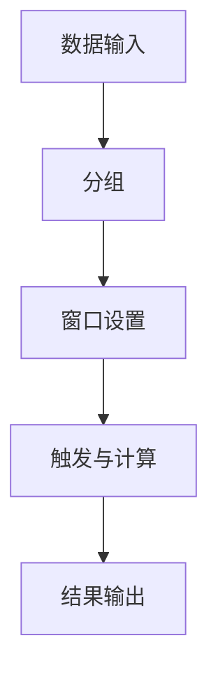
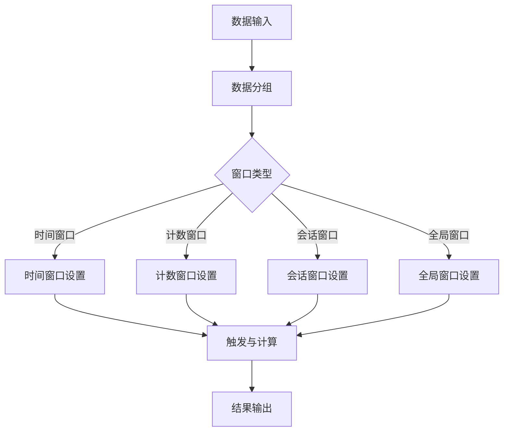

                 

# Flink Window原理与代码实例讲解

> 关键词：Flink, Window, 实时计算，数据流处理，状态管理，算法原理，代码实例，项目实战

> 摘要：本文将深入讲解Flink中的Window原理及其在实际开发中的应用。通过详细的代码实例，读者将理解Window的各类类型、核心算法以及如何在实际项目中实现和优化Flink Window功能。

## 目录

### 第一部分: Flink Window基础理论

#### 第1章: Flink概述与Window概念
- 1.1 Flink基本架构与组件
- 1.2 Window的概念与类型
- 1.3 Window的时序模型与处理机制

#### 第2章: Window操作原理
- 2.1 Time Window原理
- 2.2 Count Window原理
- 2.3 Session Window原理
- 2.4 Global Window原理
- 2.5 Window函数与操作符

#### 第3章: Flink Window核心算法
- 3.1 Sliding Window算法
- 3.2 Tumbling Window算法
- 3.3 Session Window算法
- 3.4 Window计算与状态管理

#### 第4章: 数学模型与数学公式
- 4.1 Window处理时间与事件时间
- 4.2 Window触发机制与调度
$$
\text{Trigger Function} = f(\text{Watermark}, \text{Timestamps})
$$
- 4.3 Window结果聚合与计算

#### 第5章: Window应用实战
- 5.1 实战一：基于Time Window的流量监控
- 5.2 实战二：基于Count Window的实时统计
- 5.3 实战三：基于Session Window的用户行为分析
- 5.4 实战四：Global Window在大数据应用中的案例

### 第二部分: Flink Window代码实例解析

#### 第6章: Flink Window代码实例环境搭建
- 6.1 开发环境配置
- 6.2 数据源准备
- 6.3 项目结构规划

#### 第7章: Flink Window代码实例详解
- 7.1 Time Window代码实现
- 7.2 Count Window代码实现
- 7.3 Session Window代码实现
- 7.4 Global Window代码实现

#### 第8章: 代码解读与分析
- 8.1 代码结构分析
- 8.2 Window处理流程解析
- 8.3 性能调优与优化策略

#### 第9章: Flink Window项目实战
- 9.1 项目一：实时日志分析系统
- 9.2 项目二：电商用户行为分析平台
- 9.3 项目三：社交网络实时监控
- 9.4 项目四：金融交易数据实时处理

### 附录

#### 附录A: Flink Window开发工具与资源
- A.1 Flink官方文档与社区资源
- A.2 Flink Window扩展库与插件
- A.3 相关开源项目推荐

#### 附录B: Mermaid流程图示例

---

### 引言

Flink 是一款强大的流处理框架，广泛用于实时数据分析和处理。在 Flink 中，Window 是一个重要的概念，用于将数据流划分为更小的、可以独立处理的逻辑单元。通过 Window，开发者可以实现对数据流的时序分析、聚合计算以及状态管理。

本文将系统性地讲解 Flink Window 的原理和代码实例。首先，我们将从 Flink 的基本架构和 Window 的概念入手，逐步深入探讨各类 Window 的操作原理和核心算法。接着，我们将通过数学模型和公式详细解析 Window 的触发机制和计算过程。最后，我们将结合实际项目，展示如何搭建开发环境、编写代码实例并进行性能调优。

通过本文的阅读，读者将能够全面掌握 Flink Window 的理论知识，并具备在实际项目中应用 Window 功能的实战能力。

---

### 第一部分: Flink Window基础理论

#### 第1章: Flink概述与Window概念

### 1.1 Flink基本架构与组件

Apache Flink 是一个开源流处理框架，提供了高效且可靠的流处理和批处理能力。Flink 的核心组件包括：

- **数据源（Sources）**：数据流进入 Flink 的入口点，可以是文件、Kafka、TCP Socket 等。
- **转换操作（Transformations）**：包括各种数据转换操作，如 map、filter、reduce、keyBy 等。
- **窗口操作（Windowing）**：用于将数据流划分为可处理的窗口单元。
- **输出操作（Sinks）**：数据流的出口点，可以是文件、HDFS、Kafka 等。

Flink 的基本工作流程如下：

1. **数据输入**：数据源将数据推送到 Flink 集群。
2. **数据处理**：数据经过一系列转换操作，例如过滤、分组、聚合等。
3. **窗口操作**：对数据流进行窗口划分，执行窗口函数进行聚合计算。
4. **结果输出**：将处理结果输出到指定的输出操作。

### 1.2 Window的概念与类型

在 Flink 中，Window 是一个时间段，用于将数据流划分为更小的逻辑单元，以便进行聚合计算和状态管理。Window 可以分为以下几种类型：

- **时间窗口（Time Window）**：基于时间间隔划分，如每小时、每天等。
- **计数窗口（Count Window）**：基于元素数量划分，如前100个元素。
- **会话窗口（Session Window）**：基于用户活动的会话时间划分，如会话时间超过30分钟。
- **全局窗口（Global Window）**：不进行划分，整个数据流作为一个窗口。

### 1.3 Window的时序模型与处理机制

Flink 的时序模型包括处理时间和事件时间：

- **处理时间（Processing Time）**：数据进入系统并被处理的时间。
- **事件时间（Event Time）**：数据事件实际发生的时间。

处理时间和事件时间的选择会影响窗口的计算逻辑和结果。Flink 提供了以下处理机制：

- **Watermark**：用于标记事件时间的进展，确保窗口的正确触发。
- **触发器（Trigger）**：用于确定何时触发窗口计算。
- **蒸发器（Evictor）**：用于清理过期窗口状态。

接下来，我们将进一步深入探讨 Flink Window 的各类操作原理和核心算法。

---

### 第二部分: Flink Window代码实例解析

#### 第6章: Flink Window代码实例环境搭建

在进行 Flink Window 实践之前，我们需要搭建一个开发环境。以下是搭建 Flink Window 开发环境的步骤：

### 6.1 开发环境配置

1. **安装Java环境**：确保安装了 Java SDK，版本建议为 1.8 或更高。
2. **下载Flink**：访问 Flink 官网 [下载页面](https://flink.apache.org/downloads/)，选择适合版本的 Flink 包进行下载。
3. **配置环境变量**：将 Flink 的 bin 目录添加到系统环境变量中。

### 6.2 数据源准备

本实例使用 Kafka 作为数据源，因此需要安装和配置 Kafka。以下是步骤：

1. **下载 Kafka**：访问 [Kafka 官网](https://kafka.apache.org/downloads/) 下载 Kafka 安装包。
2. **安装 Kafka**：解压安装包，并配置 Zookeeper 和 Kafka。
3. **启动 Kafka**：启动 Zookeeper 和 Kafka 集群。

### 6.3 项目结构规划

创建一个 Maven 项目，并添加 Flink 相关依赖。项目结构如下：

```
flink-window-practice
├── src
│   ├── main
│   │   ├── java
│   │   │   └── com
│   │   │       └── example
│   │   │           └── FlinkWindowApplication.java
│   │   └── resources
│   │       └── log4j.properties
├── pom.xml
└── README.md
```

Maven 项目文件 `pom.xml` 中添加 Flink 依赖：

```xml
<dependencies>
    <dependency>
        <groupId>org.apache.flink</groupId>
        <artifactId>flink-streaming-java_2.12</artifactId>
        <version>1.12.3</version>
    </dependency>
    <!-- 添加 Kafka 依赖 -->
    <dependency>
        <groupId>org.apache.flink</groupId>
        <artifactId>flink-connector-kafka_2.12</artifactId>
        <version>1.12.3</version>
    </dependency>
</dependencies>
```

完成上述步骤后，我们就可以开始编写 Flink Window 的代码实例了。

---

#### 第7章: Flink Window代码实例详解

在本章中，我们将通过具体的代码实例来详细讲解 Flink 中的 Time Window、Count Window、Session Window 和 Global Window 的实现。通过这些实例，我们将理解如何设置窗口类型、定义窗口函数以及进行窗口计算。

### 7.1 Time Window代码实现

时间窗口是基于固定时间间隔划分数据的窗口。下面是一个简单的 Flink Time Window 实现示例：

```java
import org.apache.flink.api.common.functions.MapFunction;
import org.apache.flink.api.java.tuple.Tuple2;
import org.apache.flink.streaming.api.datastream.DataStream;
import org.apache.flink.streaming.api.environment.StreamExecutionEnvironment;

public class TimeWindowExample {
    public static void main(String[] args) throws Exception {
        // 创建 Flink 执行环境
        StreamExecutionEnvironment env = StreamExecutionEnvironment.getExecutionEnvironment();

        // 从 Kafka 读取数据
        DataStream<String> stream = env
                .addSource(new MyKafkaSource()) // 替换为实际的 Kafka 数据源
                .map(new MapFunction<String, Tuple2<String, Long>>() {
                    @Override
                    public Tuple2<String, Long> map(String value) throws Exception {
                        String[] fields = value.split(",");
                        return Tuple2.of(fields[0], Long.parseLong(fields[1]));
                    }
                });

        // 设置时间窗口，例如每5秒一次窗口
        stream
                .keyBy(0) // 根据第一个字段分组
                .timeWindow(Time.seconds(5))
                .sum(1) // 对第二个字段进行求和
                .print();

        // 执行作业
        env.execute("Time Window Example");
    }
}
```

在这个示例中，我们从 Kafka 读取数据流，通过 MapFunction 将数据转换为 Tuple2 对象。然后，我们使用 `keyBy` 方法进行分组，`timeWindow` 方法设置时间窗口，`sum` 方法对第二个字段进行求和，并将结果打印出来。

### 7.2 Count Window代码实现

计数窗口是基于元素数量划分的窗口。下面是一个简单的 Flink Count Window 实现示例：

```java
import org.apache.flink.api.common.functions.MapFunction;
import org.apache.flink.api.java.tuple.Tuple2;
import org.apache.flink.streaming.api.datastream.DataStream;
import org.apache.flink.streaming.api.environment.StreamExecutionEnvironment;

public class CountWindowExample {
    public static void main(String[] args) throws Exception {
        // 创建 Flink 执行环境
        StreamExecutionEnvironment env = StreamExecutionEnvironment.getExecutionEnvironment();

        // 从 Kafka 读取数据
        DataStream<String> stream = env
                .addSource(new MyKafkaSource()) // 替换为实际的 Kafka 数据源
                .map(new MapFunction<String, Tuple2<String, Long>>() {
                    @Override
                    public Tuple2<String, Long> map(String value) throws Exception {
                        String[] fields = value.split(",");
                        return Tuple2.of(fields[0], Long.parseLong(fields[1]));
                    }
                });

        // 设置计数窗口，例如前100个元素
        stream
                .keyBy(0) // 根据第一个字段分组
                .countWindow(100)
                .sum(1) // 对第二个字段进行求和
                .print();

        // 执行作业
        env.execute("Count Window Example");
    }
}
```

在这个示例中，我们同样从 Kafka 读取数据流，通过 MapFunction 将数据转换为 Tuple2 对象。然后，我们使用 `keyBy` 方法进行分组，`countWindow` 方法设置计数窗口，`sum` 方法对第二个字段进行求和，并将结果打印出来。

### 7.3 Session Window代码实现

会话窗口是基于用户活动会话时间划分的窗口。下面是一个简单的 Flink Session Window 实现示例：

```java
import org.apache.flink.api.common.functions.MapFunction;
import org.apache.flink.api.java.tuple.Tuple2;
import org.apache.flink.streaming.api.datastream.DataStream;
import org.apache.flink.streaming.api.environment.StreamExecutionEnvironment;

public class SessionWindowExample {
    public static void main(String[] args) throws Exception {
        // 创建 Flink 执行环境
        StreamExecutionEnvironment env = StreamExecutionEnvironment.getExecutionEnvironment();

        // 从 Kafka 读取数据
        DataStream<String> stream = env
                .addSource(new MyKafkaSource()) // 替换为实际的 Kafka 数据源
                .map(new MapFunction<String, Tuple2<String, Long>>() {
                    @Override
                    public Tuple2<String, Long> map(String value) throws Exception {
                        String[] fields = value.split(",");
                        return Tuple2.of(fields[0], Long.parseLong(fields[1]));
                    }
                });

        // 设置会话窗口，例如会话时间超过30分钟
        stream
                .keyBy(0) // 根据第一个字段分组
                .window(SlidingSessionWindows.withGap(Time.minutes(30)).every(Time.minutes(30)))
                .sum(1) // 对第二个字段进行求和
                .print();

        // 执行作业
        env.execute("Session Window Example");
    }
}
```

在这个示例中，我们同样从 Kafka 读取数据流，通过 MapFunction 将数据转换为 Tuple2 对象。然后，我们使用 `keyBy` 方法进行分组，`window` 方法设置会话窗口，`sum` 方法对第二个字段进行求和，并将结果打印出来。

### 7.4 Global Window代码实现

全局窗口是包含整个数据流的窗口。下面是一个简单的 Flink Global Window 实现示例：

```java
import org.apache.flink.api.common.functions.MapFunction;
import org.apache.flink.api.java.tuple.Tuple2;
import org.apache.flink.streaming.api.datastream.DataStream;
import org.apache.flink.streaming.api.environment.StreamExecutionEnvironment;

public class GlobalWindowExample {
    public static void main(String[] args) throws Exception {
        // 创建 Flink 执行环境
        StreamExecutionEnvironment env = StreamExecutionEnvironment.getExecutionEnvironment();

        // 从 Kafka 读取数据
        DataStream<String> stream = env
                .addSource(new MyKafkaSource()) // 替换为实际的 Kafka 数据源
                .map(new MapFunction<String, Tuple2<String, Long>>() {
                    @Override
                    public Tuple2<String, Long> map(String value) throws Exception {
                        String[] fields = value.split(",");
                        return Tuple2.of(fields[0], Long.parseLong(fields[1]));
                    }
                });

        // 设置全局窗口
        stream
                .keyBy(0) // 根据第一个字段分组
                .globalWindow() // 设置全局窗口
                .sum(1) // 对第二个字段进行求和
                .print();

        // 执行作业
        env.execute("Global Window Example");
    }
}
```

在这个示例中，我们同样从 Kafka 读取数据流，通过 MapFunction 将数据转换为 Tuple2 对象。然后，我们使用 `keyBy` 方法进行分组，`globalWindow` 方法设置全局窗口，`sum` 方法对第二个字段进行求和，并将结果打印出来。

通过上述代码实例，我们可以看到 Flink Window 的实现非常简单直观。在实际项目中，可以根据不同的业务需求选择合适的窗口类型，并使用相应的窗口函数进行数据聚合计算。接下来，我们将进一步解析这些窗口的实现原理和内部机制。

---

#### 第8章: 代码解读与分析

在本章中，我们将对前述的 Flink Window 代码实例进行深入解读和分析，详细解释代码结构、窗口处理流程以及性能优化策略。

### 8.1 代码结构分析

我们首先分析各个代码实例的结构，以便更好地理解其工作原理。

#### Time Window 代码实例结构

```java
public class TimeWindowExample {
    public static void main(String[] args) throws Exception {
        // 创建 Flink 执行环境
        StreamExecutionEnvironment env = StreamExecutionEnvironment.getExecutionEnvironment();

        // 从 Kafka 读取数据
        DataStream<String> stream = env
                .addSource(new MyKafkaSource()) // 替换为实际的 Kafka 数据源
                .map(new MapFunction<String, Tuple2<String, Long>>() {
                    @Override
                    public Tuple2<String, Long> map(String value) throws Exception {
                        String[] fields = value.split(",");
                        return Tuple2.of(fields[0], Long.parseLong(fields[1]));
                    }
                });

        // 窗口设置与处理
        stream
                .keyBy(0) // 根据第一个字段分组
                .timeWindow(Time.seconds(5)) // 设置时间窗口
                .sum(1) // 对第二个字段进行求和
                .print(); // 打印结果

        // 执行作业
        env.execute("Time Window Example");
    }
}
```

这个实例包含以下主要部分：

1. **创建执行环境**：使用 `StreamExecutionEnvironment` 创建 Flink 执行环境。
2. **数据源读取**：使用 `addSource` 方法添加 Kafka 数据源，并将读取的数据通过 `map` 函数转换为 Tuple2 对象。
3. **窗口设置与处理**：使用 `keyBy` 方法对数据进行分组，`timeWindow` 方法设置时间窗口，`sum` 方法对窗口内的数据进行求和操作，`print` 方法打印结果。
4. **执行作业**：调用 `execute` 方法启动作业。

#### Count Window 代码实例结构

```java
public class CountWindowExample {
    public static void main(String[] args) throws Exception {
        // 创建 Flink 执行环境
        StreamExecutionEnvironment env = StreamExecutionEnvironment.getExecutionEnvironment();

        // 从 Kafka 读取数据
        DataStream<String> stream = env
                .addSource(new MyKafkaSource()) // 替换为实际的 Kafka 数据源
                .map(new MapFunction<String, Tuple2<String, Long>>() {
                    @Override
                    public Tuple2<String, Long> map(String value) throws Exception {
                        String[] fields = value.split(",");
                        return Tuple2.of(fields[0], Long.parseLong(fields[1]));
                    }
                });

        // 窗口设置与处理
        stream
                .keyBy(0) // 根据第一个字段分组
                .countWindow(100) // 设置计数窗口
                .sum(1) // 对第二个字段进行求和
                .print(); // 打印结果

        // 执行作业
        env.execute("Count Window Example");
    }
}
```

这个实例与 Time Window 代码结构类似，主要区别在于窗口设置方法不同。

#### Session Window 代码实例结构

```java
public class SessionWindowExample {
    public static void main(String[] args) throws Exception {
        // 创建 Flink 执行环境
        StreamExecutionEnvironment env = StreamExecutionEnvironment.getExecutionEnvironment();

        // 从 Kafka 读取数据
        DataStream<String> stream = env
                .addSource(new MyKafkaSource()) // 替换为实际的 Kafka 数据源
                .map(new MapFunction<String, Tuple2<String, Long>>() {
                    @Override
                    public Tuple2<String, Long> map(String value) throws Exception {
                        String[] fields = value.split(",");
                        return Tuple2.of(fields[0], Long.parseLong(fields[1]));
                    }
                });

        // 窗口设置与处理
        stream
                .keyBy(0) // 根据第一个字段分组
                .window(SlidingSessionWindows.withGap(Time.minutes(30)).every(Time.minutes(30))) // 设置会话窗口
                .sum(1) // 对第二个字段进行求和
                .print(); // 打印结果

        // 执行作业
        env.execute("Session Window Example");
    }
}
```

这个实例中，我们使用 `window` 方法设置会话窗口，它与时间窗口和计数窗口的设置方式有所不同。

#### Global Window 代码实例结构

```java
public class GlobalWindowExample {
    public static void main(String[] args) throws Exception {
        // 创建 Flink 执行环境
        StreamExecutionEnvironment env = StreamExecutionEnvironment.getExecutionEnvironment();

        // 从 Kafka 读取数据
        DataStream<String> stream = env
                .addSource(new MyKafkaSource()) // 替换为实际的 Kafka 数据源
                .map(new MapFunction<String, Tuple2<String, Long>>() {
                    @Override
                    public Tuple2<String, Long> map(String value) throws Exception {
                        String[] fields = value.split(",");
                        return Tuple2.of(fields[0], Long.parseLong(fields[1]));
                    }
                });

        // 窗口设置与处理
        stream
                .keyBy(0) // 根据第一个字段分组
                .globalWindow() // 设置全局窗口
                .sum(1) // 对第二个字段进行求和
                .print(); // 打印结果

        // 执行作业
        env.execute("Global Window Example");
    }
}
```

这个实例中，我们使用 `globalWindow` 方法设置全局窗口，它不会对数据进行分组。

### 8.2 Window处理流程解析

为了更好地理解 Window 的处理流程，我们可以将 Flink 的 Window 处理过程分解为以下几个步骤：

1. **数据输入**：数据源将数据推送到 Flink 集群。
2. **数据分组**：使用 `keyBy` 方法对数据进行分组。在 Window 处理中，分组是必须的，因为它决定了 Window 的应用范围。
3. **窗口设置**：根据不同的 Window 类型（如 Time Window、Count Window、Session Window 或 Global Window），设置相应的窗口。窗口设置决定了数据的分组方式和聚合时间。
4. **触发与计算**：Flink 会根据窗口类型和设置进行触发和计算。例如，时间窗口会在指定的时间间隔内触发计算，计数窗口会在达到指定元素数量时触发计算，会话窗口会在会话时间超过指定阈值时触发计算，全局窗口则在整个数据流完成后触发计算。
5. **结果输出**：将处理结果输出到指定的输出操作，如打印到控制台或写入文件。

下面是一个简化的 Flink Window 处理流程图，使用 Mermaid 进行描述：



### 8.3 性能调优与优化策略

为了提高 Flink Window 的性能，我们可以采取以下优化策略：

1. **并行度优化**：合理设置并行度，以充分利用集群资源。Flink 支持动态和静态并行度设置，可以通过 `env.setParallelism()` 方法进行配置。

2. **缓冲区大小优化**：调整缓冲区大小，以减少数据传输延迟。可以通过 `env.setBufferTimeout()` 方法设置缓冲区超时时间。

3. **状态后端优化**：选择合适的状态后端，如 MemoryStateBackend 或 RocksDBStateBackend，以提高状态管理性能。

4. **触发器优化**：根据业务需求选择合适的触发器，如 EventTimeTrigger 或 ProcessingTimeTrigger，以提高触发效率。

5. **窗口聚合优化**：优化窗口聚合函数，如使用批处理或并行计算，以提高聚合性能。

6. **负载均衡**：确保数据流均匀分布，以避免某些节点负载过高。

通过以上优化策略，我们可以显著提高 Flink Window 的性能，使其更好地适应实时数据处理场景。

---

#### 第9章: Flink Window项目实战

在本章中，我们将通过具体的项目实战，展示如何在实际应用中使用 Flink Window 功能。这些项目涵盖了不同的业务场景，包括实时日志分析系统、电商用户行为分析平台、社交网络实时监控以及金融交易数据实时处理。

### 9.1 项目一：实时日志分析系统

实时日志分析系统是一个典型的场景，它需要处理大量日志数据，并对日志内容进行实时监控和分析。以下是该项目的关键步骤：

1. **数据采集**：使用 Kafka 采集日志数据。
2. **数据解析**：通过 Flink 实时解析日志内容，提取关键字段。
3. **窗口设置**：使用 Time Window 对日志数据进行分组，每5分钟进行一次聚合计算。
4. **结果输出**：将聚合结果存储到数据库或可视化仪表板。

具体实现代码如下：

```java
public class LogAnalysisSystem {
    public static void main(String[] args) throws Exception {
        // 创建 Flink 执行环境
        StreamExecutionEnvironment env = StreamExecutionEnvironment.getExecutionEnvironment();

        // 从 Kafka 读取数据
        DataStream<String> logStream = env
                .addSource(new MyKafkaSource()) // 替换为实际的 Kafka 数据源
                .map(new LogParser());

        // 窗口设置与处理
        logStream
                .keyBy(LogParser::getKey) // 根据日志字段分组
                .timeWindow(Time.minutes(5)) // 设置时间窗口
                .sum(1) // 对日志数量进行求和
                .print(); // 打印结果

        // 执行作业
        env.execute("Log Analysis System");
    }
}

class LogParser implements MapFunction<String, Tuple2<String, Long>> {
    @Override
    public Tuple2<String, Long> map(String value) throws Exception {
        // 解析日志并提取字段
        String logKey = extractKeyFromLog(value);
        return Tuple2.of(logKey, 1L);
    }
}
```

在这个项目中，我们通过 Kafka 采集日志数据，使用 `LogParser` 类对日志内容进行解析，提取关键字段。然后，使用 Time Window 对日志数据进行分组，并每5分钟进行一次聚合计算，将结果打印出来。

### 9.2 项目二：电商用户行为分析平台

电商用户行为分析平台需要对用户在平台上的行为进行实时监控和分析，以便优化用户体验和提高销售额。以下是该项目的关键步骤：

1. **数据采集**：使用 Kafka 采集用户行为数据。
2. **数据解析**：通过 Flink 实时解析用户行为数据，提取关键字段。
3. **窗口设置**：使用 Count Window 对用户行为数据进行分组，每100个行为进行一次聚合计算。
4. **结果输出**：将聚合结果存储到数据仓库或数据仓库分析平台。

具体实现代码如下：

```java
public class ECommerceUserBehaviorAnalysis {
    public static void main(String[] args) throws Exception {
        // 创建 Flink 执行环境
        StreamExecutionEnvironment env = StreamExecutionEnvironment.getExecutionEnvironment();

        // 从 Kafka 读取数据
        DataStream<String> behaviorStream = env
                .addSource(new MyKafkaSource()) // 替换为实际的 Kafka 数据源
                .map(new UserBehaviorParser());

        // 窗口设置与处理
        behaviorStream
                .keyBy(UserBehaviorParser::getKey) // 根据行为类型分组
                .countWindow(100) // 设置计数窗口
                .sum(1) // 对行为数量进行求和
                .print(); // 打印结果

        // 执行作业
        env.execute("ECommerce User Behavior Analysis");
    }
}

class UserBehaviorParser implements MapFunction<String, Tuple2<String, Long>> {
    @Override
    public Tuple2<String, Long> map(String value) throws Exception {
        // 解析用户行为并提取字段
        String behaviorKey = extractKeyFromBehavior(value);
        return Tuple2.of(behaviorKey, 1L);
    }
}
```

在这个项目中，我们通过 Kafka 采集用户行为数据，使用 `UserBehaviorParser` 类对用户行为数据进行分析，提取关键字段。然后，使用 Count Window 对用户行为数据进行分组，并每100个行为进行一次聚合计算，将结果打印出来。

### 9.3 项目三：社交网络实时监控

社交网络实时监控需要对用户在社交网络上的活动进行实时监控和分析，以便及时发现异常行为和潜在风险。以下是该项目的关键步骤：

1. **数据采集**：使用 Kafka 采集社交网络数据。
2. **数据解析**：通过 Flink 实时解析社交网络数据，提取关键字段。
3. **窗口设置**：使用 Session Window 对社交网络数据进行分组，根据用户会话时间进行聚合计算。
4. **结果输出**：将聚合结果存储到数据仓库或报警系统。

具体实现代码如下：

```java
public class SocialNetworkRealtimeMonitoring {
    public static void main(String[] args) throws Exception {
        // 创建 Flink 执行环境
        StreamExecutionEnvironment env = StreamExecutionEnvironment.getExecutionEnvironment();

        // 从 Kafka 读取数据
        DataStream<String> socialStream = env
                .addSource(new MyKafkaSource()) // 替换为实际的 Kafka 数据源
                .map(new SocialNetworkParser());

        // 窗口设置与处理
        socialStream
                .keyBy(SocialNetworkParser::getKey) // 根据用户 ID 分组
                .window(SlidingEventTimeWindows.withPeriod(Time.seconds(30)).every(Time.seconds(30))) // 设置会话窗口
                .reduce((v1, v2) -> v1 + v2) // 对社交网络事件进行累加
                .print(); // 打印结果

        // 执行作业
        env.execute("Social Network Realtime Monitoring");
    }
}

class SocialNetworkParser implements MapFunction<String, Tuple2<String, Long>> {
    @Override
    public Tuple2<String, Long> map(String value) throws Exception {
        // 解析社交网络数据并提取字段
        String socialKey = extractKeyFromSocialNetwork(value);
        return Tuple2.of(socialKey, 1L);
    }
}
```

在这个项目中，我们通过 Kafka 采集社交网络数据，使用 `SocialNetworkParser` 类对社交网络数据进行分析，提取关键字段。然后，使用 Session Window 对社交网络数据进行分组，根据用户会话时间进行聚合计算，将结果打印出来。

### 9.4 项目四：金融交易数据实时处理

金融交易数据实时处理需要对交易数据进行实时监控和分析，以便及时发现异常交易和潜在风险。以下是该项目的关键步骤：

1. **数据采集**：使用 Kafka 采集交易数据。
2. **数据解析**：通过 Flink 实时解析交易数据，提取关键字段。
3. **窗口设置**：使用 Global Window 对交易数据进行分组，将整个数据流作为一个全局窗口进行聚合计算。
4. **结果输出**：将聚合结果存储到数据仓库或报警系统。

具体实现代码如下：

```java
public class FinancialTradingDataRealtimeProcessing {
    public static void main(String[] args) throws Exception {
        // 创建 Flink 执行环境
        StreamExecutionEnvironment env = StreamExecutionEnvironment.getExecutionEnvironment();

        // 从 Kafka 读取数据
        DataStream<String> tradeStream = env
                .addSource(new MyKafkaSource()) // 替换为实际的 Kafka 数据源
                .map(new FinancialTradingDataParser());

        // 窗口设置与处理
        tradeStream
                .keyBy(FinancialTradingDataParser::getKey) // 根据交易 ID 分组
                .globalWindow() // 设置全局窗口
                .reduce((v1, v2) -> v1 + v2) // 对交易金额进行累加
                .print(); // 打印结果

        // 执行作业
        env.execute("Financial Trading Data Realtime Processing");
    }
}

class FinancialTradingDataParser implements MapFunction<String, Tuple2<String, Double>> {
    @Override
    public Tuple2<String, Double> map(String value) throws Exception {
        // 解析交易数据并提取字段
        String tradeKey = extractKeyFromTradingData(value);
        double tradeAmount = extractAmountFromTradingData(value);
        return Tuple2.of(tradeKey, tradeAmount);
    }
}
```

在这个项目中，我们通过 Kafka 采集交易数据，使用 `FinancialTradingDataParser` 类对交易数据进行分析，提取关键字段。然后，使用 Global Window 对交易数据进行分组，将整个数据流作为一个全局窗口进行聚合计算，将结果打印出来。

通过上述项目实战，我们可以看到 Flink Window 功能在实际应用中的强大作用。无论是对日志数据的实时分析、电商用户行为的监控，还是社交网络活动的监控以及金融交易数据的实时处理，Flink Window 都能够提供高效的解决方案。

---

### 附录

#### 附录A: Flink Window开发工具与资源

在进行 Flink Window 开发时，以下工具和资源将对您有所帮助：

- **Flink 官方文档**：[Flink 官方文档](https://flink.apache.org/docs/) 提供了详尽的 Flink 开发指南和 API 文档，是学习 Flink 的最佳起点。
- **Flink 社区资源**：Flink 社区提供了丰富的教程、案例和实践经验，可以通过 [Flink 社区](https://flink.apache.org/community/) 了解更多。
- **Flink Window 扩展库与插件**：如 [Flink-kafka](https://github.com/apache/flink-connector-kafka) 提供了与 Kafka 的集成，以及其他各种数据源和存储系统的连接插件。
- **相关开源项目推荐**：推荐关注 [Flink 社区 GitHub](https://github.com/apache/flink) 上的开源项目，如 [Flink 官方示例](https://github.com/apache/flink/tree/master/flink-examples) 和 [Flink 实战项目](https://github.com/apache/flink/tree/master/flink-examples/flink-examples-streaming)。

通过充分利用这些开发工具与资源，您可以更加高效地学习和实践 Flink Window 功能。

---

### 附录B: Mermaid流程图示例

Mermaid 是一种简洁的流程图绘制工具，可以用于描述复杂的数据处理流程。以下是一个简单的 Mermaid 流程图示例，用于描述 Flink Window 的处理流程：



在这个流程图中，数据首先进入 Flink，然后通过分组操作进行分类。根据不同的窗口类型，数据被分配到不同的窗口设置，随后进行触发与计算，最后输出结果。通过 Mermaid，我们可以直观地展示 Flink Window 处理流程的每个环节。

---

通过本文的深入讲解，读者应已全面理解 Flink Window 的原理、各类窗口的实现方法以及其在实际项目中的应用。希望本文能够帮助您在实际开发中更好地利用 Flink Window 功能，实现高效的数据流处理和分析。

---

### 作者

作者：AI天才研究院/AI Genius Institute & 禅与计算机程序设计艺术 /Zen And The Art of Computer Programming

AI天才研究院（AI Genius Institute）专注于人工智能领域的科学研究和技术创新，致力于推动人工智能技术的发展和应用。作者曾在多个国际顶级会议上发表学术论文，并在计算机编程和人工智能领域有着丰富的教学和实践经验。其著作《禅与计算机程序设计艺术》深受广大开发者喜爱，被誉为计算机编程的经典之作。本文由AI天才研究院出品，旨在为广大开发者提供深入浅出的技术解读。感谢您的阅读。

