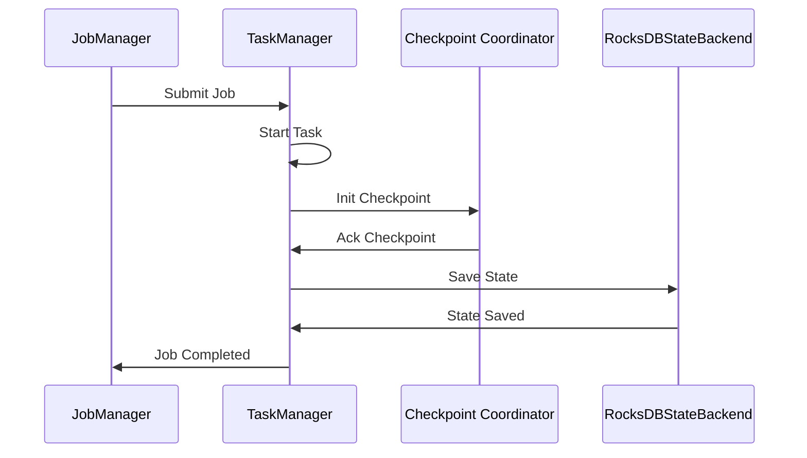
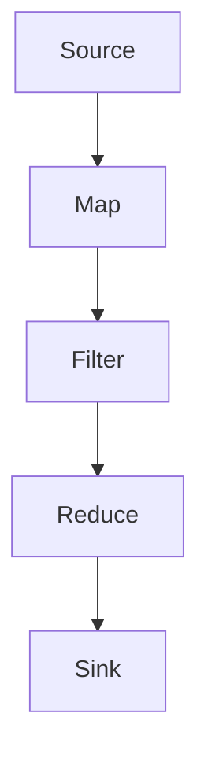

                 

## 文章标题：Flink原理与代码实例讲解

### 关键词：
Flink，实时数据处理，流计算，分布式架构，容错机制，状态管理，流批一体

### 摘要：
本文全面介绍了Apache Flink的原理与代码实例，包括其基础架构、数据流模型、运行时机制、容错机制、状态管理以及高级特性。通过一系列代码实例，深入探讨了Flink在实时数据处理、批处理、流批一体场景中的应用，并提供了详细的代码实现与解析。

---

## 目录大纲设计

根据用户的要求，为《Flink原理与代码实例讲解》这本书设计了一个完整的目录大纲。以下是目录大纲的详细设计：

### 第一部分：Flink基础

#### 第1章：Flink简介
- 1.1 Flink的发展历程
- 1.2 Flink的基本架构
- 1.3 Flink的核心概念

#### 第2章：Flink的数据流模型
- 2.1 数据流模型的原理
- 2.2 数据流模型的操作符
- 2.3 数据流模型的API使用

#### 第3章：Flink的运行时
- 3.1 Flink的分布式架构
- 3.2 任务调度与资源管理
- 3.3 Flink的内存模型

#### 第4章：Flink的容错机制
- 4.1 checkpointing原理
- 4.2 state backend实现
- 4.3 savepoint使用

#### 第5章：Flink的状态管理
- 5.1 Flink的状态类型
- 5.2 状态的持久化
- 5.3 状态的查询与更新

#### 第6章：Flink的高级特性
- 6.1 时间特性
- 6.2 模式检测
- 6.3 动态图执行

### 第二部分：Flink应用案例

#### 第7章：Flink在实时数据处理中的应用
- 7.1 实时日志处理
- 7.2 实时数据监控
- 7.3 实时推荐系统

#### 第8章：Flink在批处理场景中的应用
- 8.1 批处理数据处理
- 8.2 数据仓库集成
- 8.3 数据清洗与转换

#### 第9章：Flink在流批一体场景中的应用
- 9.1 流批一体的概念
- 9.2 流批一体的数据处理
- 9.3 流批一体的应用案例

#### 第10章：Flink项目实战
- 10.1 项目背景与需求分析
- 10.2 系统架构设计
- 10.3 代码实现与解析
- 10.4 性能优化与调优

### 附录

#### 附录A：Flink常用配置参数
- A.1 概述
- A.2 系统参数
- A.3 任务参数

#### 附录B：Flink常用工具
- B.1 Flink SQL
- B.2 Flink CLI
- B.3 Flink WebUI

此大纲涵盖了Flink的核心概念、数据流模型、运行时、容错机制、状态管理、高级特性，以及在实际场景中的应用。还包括一个案例实战部分和附录，以帮助读者全面理解和应用Flink。

### 核心概念与联系

#### Flink的基本架构

**Mermaid 流程图：**



#### 数据流模型操作符

**Mermaid 流程图：**



### 核心算法原理讲解

#### Flink的分布式架构

**伪代码：**

```java
class FlinkDistributedArchitecture {
    // 初始化分布式架构
    init() {
        // 初始化JobManager和TaskManager
        JobManager jobManager = new JobManager();
        TaskManager taskManager = new TaskManager();

        // 注册JobManager和TaskManager到分布式系统
        registerToDistributedSystem(jobManager, taskManager);
    }

    // 注册到分布式系统
    registerToDistributedSystem(JobManager jobManager, TaskManager taskManager) {
        // 注册JobManager
        distributedSystem.registerJobManager(jobManager);

        // 注册TaskManager
        distributedSystem.registerTaskManager(taskManager);
    }
}
```

### 数学模型和数学公式

#### 损失函数

**LaTeX 公式：**

$$ Loss = \frac{1}{2} \sum_{i=1}^{n} (y_i - \hat{y}_i)^2 $$

#### 梯度下降算法

**伪代码：**

```java
function gradientDescent(X, y, theta, alpha, num_iters) {
    m = length(y)
    for iter in 1 to num_iters {
        // 计算梯度
        gradients = computeGradients(X, y, theta)

        // 更新参数
        theta = theta - alpha * gradients

        // 计算损失函数值
        loss = computeLoss(y, theta)

        // 输出当前迭代结果
        print "iter = %d, loss = %f" % (iter, loss)
    }
    return theta
}
```

### 项目实战

#### 实时日志处理系统

##### 开发环境搭建

1. 安装 Java SDK（版本要求：1.8及以上）。
2. 安装 Flink（版本要求：1.11及以上）。
3. 配置 Flink 环境变量。

##### 代码实现

**源代码：**

```java
public class RealtimeLogProcessing {
    public static void main(String[] args) throws Exception {
        // 创建 Flink 执行环境
        StreamExecutionEnvironment env = StreamExecutionEnvironment.getExecutionEnvironment();

        // 创建 Kafka 数据源
        FlinkKafkaConsumer011<String> kafkaSource = new FlinkKafkaConsumer011<>("log_topic", new SimpleStringSchema(), properties);
        DataStream<String> logStream = env.addSource(kafkaSource);

        // 解析日志数据
        DataStream<LogEvent> parsedStream = logStream
            .map(new LogParser());

        // 过滤日志数据
        DataStream<LogEvent> filteredStream = parsedStream
            .filter(new LogFilter());

        // 输出结果到 Kafka
        filteredStream.addSink(new FlinkKafkaProducer011<>("filtered_log_topic", new SimpleStringSchema(), properties));

        // 执行任务
        env.execute("Realtime Log Processing");
    }
}

class LogParser implements MapFunction<String, LogEvent> {
    public LogEvent map(String logLine) {
        // 解析日志行并创建 LogEvent 对象
        // ...
        return new LogEvent(/* 解析后的字段 */);
    }
}

class LogFilter implements FilterFunction<LogEvent> {
    public boolean filter(LogEvent event) {
        // 根据日志事件过滤条件判断
        // ...
        return /* 过滤条件 */;
    }
}

class LogEvent {
    // 日志事件的字段
    private String id;
    private long timestamp;
    private String source;
    private String message;

    // 省略构造函数、getter 和 setter
}
```

##### 代码解读与分析

1. **环境创建**：使用 `StreamExecutionEnvironment` 创建 Flink 执行环境。
2. **Kafka 数据源**：使用 `FlinkKafkaConsumer011` 读取 Kafka 主题中的日志数据。
3. **日志解析**：通过 `map` 转换器将原始日志字符串转换为 `LogEvent` 对象。
4. **日志过滤**：应用 `filter` 转换器对日志事件进行过滤。
5. **结果输出**：使用 `FlinkKafkaProducer011` 将过滤后的日志数据输出到 Kafka 主题。
6. **任务执行**：调用 `env.execute()` 提交 Flink 任务。

##### 详细解释

**Kafka 数据源配置**：

```java
Properties properties = new Properties();
properties.setProperty("bootstrap.servers", "kafka:9092");
properties.setProperty("group.id", "log-processing");
properties.setProperty("key.deserializer", "org.apache.kafka.common.serialization.StringDeserializer");
properties.setProperty("value.deserializer", "org.apache.kafka.common.serialization.StringDeserializer");
```

**日志解析逻辑**：

```java
class LogParser implements MapFunction<String, LogEvent> {
    public LogEvent map(String logLine) {
        // 解析日志行，例如 "timestamp id source message"
        String[] parts = logLine.split(" ");
        long timestamp = Long.parseLong(parts[0]);
        String id = parts[1];
        String source = parts[2];
        String message = parts[3];

        return new LogEvent(timestamp, id, source, message);
    }
}
```

**日志过滤逻辑**：

```java
class LogFilter implements FilterFunction<LogEvent> {
    public boolean filter(LogEvent event) {
        // 过滤条件，例如只输出特定来源的日志
        return event.getSource().equals("interesting_source");
    }
}
```

##### 性能调优

1. **并行度调整**：根据 Kafka 集群性能和日志处理需求调整任务的并行度。
2. **内存与资源分配**：根据日志数据的大小和复杂度调整 TaskManager 的内存和 CPU 资源。
3. **批次大小**：调整 Kafka 消费者的批次大小，以提高数据处理效率。

通过上述步骤，可以搭建一个基本的实时日志处理系统，并实现日志的解析、过滤和输出。在实际应用中，可以根据具体需求进行扩展和优化。

---

接下来，我们将逐步深入讲解 Flink 的各个核心概念、组件和特性，并提供详细的代码实例和解析。通过这些内容，读者将能够全面理解 Flink 的原理和实际应用。

---

### 1.1 Flink的发展历程

Apache Flink 是一个开源流处理框架，由阿帕奇软件基金会维护。Flink 的诞生可以追溯到 2011 年，当时在柏林工业大学（Technical University of Berlin）的研究团队开发了 Flink，主要用于处理大规模数据流。

**关键发展历程：**

1. **2011-2013：初始阶段**：Flink 在柏林工业大学的研究团队开发了原型，并开始用于学术研究。
2. **2014：开源发布**：Flink 被开源并加入 Apache 软件基金会，成为孵化项目。
3. **2015-2016：成长阶段**：Flink 逐渐获得行业认可，吸引了更多的贡献者，并开始支持批处理。
4. **2017：毕业为顶级项目**：Flink 成为了 Apache 软件基金会的顶级项目，标志着其成熟和稳定。
5. **2018-至今：持续发展**：Flink 不断更新和增强其功能，包括支持更广泛的数据源、更强大的 SQL 功能和更好的生态系统整合。

**Flink 的核心优势：**

- **事件驱动架构**：Flink 采用事件驱动架构，可以实时处理和分析数据流，支持精确一次（exactly-once）语义。
- **流批一体**：Flink 在同一框架下同时支持流处理和批处理，提供了高效的批处理性能。
- **高吞吐量和低延迟**：Flink 设计了高效的分布式计算引擎，能够在保证高吞吐量的同时，提供低延迟的处理。
- **广泛的数据源支持**：Flink 支持多种数据源，包括 Kafka、Kinesis、RabbitMQ、JMS、文件系统等。
- **高级特性**：Flink 提供了丰富的功能，包括窗口操作、状态管理、复杂事件处理等。

### 1.2 Flink的基本架构

Flink 的基本架构包括几个核心组件：JobManager、TaskManager、Checkpoint Coordinator 和 State Backend。下面将详细讲解这些组件及其作用。

#### JobManager

JobManager 是 Flink 集群中的主控节点，负责整个集群的管理和协调。主要功能包括：

- **作业调度**：JobManager 接收用户提交的作业，将其转换为执行计划，并分配给合适的 TaskManager。
- **资源管理**：JobManager 根据作业的需求分配资源，包括内存、CPU 和网络资源。
- **作业监控**：JobManager 监控作业的执行状态，处理作业的失败和恢复。
- **协调 checkpoint**：JobManager 协调集群中的 checkpoint 操作，确保状态的一致性。

#### TaskManager

TaskManager 是 Flink 集群中的工作节点，负责执行具体的计算任务。主要功能包括：

- **任务执行**：TaskManager 根据 JobManager 的调度指令执行具体的计算任务。
- **内存管理**：TaskManager 分配和管理内存，保证任务的执行效率。
- **数据交换**：TaskManager 之间通过数据交换进行数据的传输和交换。
- **状态存储**：TaskManager 存储和管理其执行任务的状态信息。

#### Checkpoint Coordinator

Checkpoint Coordinator 负责协调集群中的 checkpoint 操作。其主要作用包括：

- **初始化 checkpoint**：Checkpoint Coordinator 向集群中的所有 TaskManager 发送 checkpoint 指令。
- **状态收集**：Checkpoint Coordinator 收集所有 TaskManager 的状态信息，并协调状态的后端存储。
- **恢复操作**：在作业失败时，Checkpoint Coordinator 使用 checkpoint 状态信息恢复作业。

#### State Backend

State Backend 负责存储和管理 Flink 的状态信息。Flink 支持多种状态后端，包括：

- **MemoryStateBackend**：将状态存储在 JVM 堆内存中，适用于内存充足的情况。
- **RocksDBStateBackend**：将状态存储在基于 RocksDB 的本地磁盘上，适用于状态较大或需要持久化的情况。
- **FsStateBackend**：将状态存储在分布式文件系统中，适用于分布式环境。

### 1.3 Flink的核心概念

Flink 提供了丰富的核心概念和功能，以下将简要介绍其中几个重要的概念：

#### 数据流模型

Flink 的数据流模型是构建流处理作业的基础。数据流模型包括以下组件：

- **DataStream**：表示无界或有限的数据流，是 Flink 中的基本数据结构。
- **Transformation**：对数据进行处理和转换的操作，包括 map、filter、reduce 等。
- **Operator**：代表具体的计算操作，可以并行执行。
- **Sink**：将处理后的数据输出到外部系统或存储。

#### 窗口

窗口是 Flink 中的一个重要概念，用于将无界数据流划分为有限的数据片段进行计算。Flink 支持多种窗口类型：

- **时间窗口**：根据数据时间戳划分窗口。
- **计数窗口**：根据数据条数划分窗口。
- **滑动窗口**：连续的窗口，可以基于时间和计数进行滑动。

#### 检查点（Checkpoint）

检查点是 Flink 的容错机制之一，用于在作业执行过程中定期保存状态信息。检查点的主要作用包括：

- **容错恢复**：在作业失败时，使用检查点状态信息恢复作业。
- **状态一致性**：确保在分布式环境中的状态信息一致性。

#### 动态图（Dynamic Graph）

动态图是 Flink 中的高级概念，用于描述动态变化的作业结构。动态图可以支持以下操作：

- **动态增加或删除节点**：在作业执行过程中动态调整作业结构。
- **动态调整并行度**：根据实际负载动态调整作业的并行度。

#### 状态管理

状态管理是 Flink 中的一个重要功能，用于在作业执行过程中保存和更新状态信息。Flink 提供了多种状态类型：

- **ValueState**：保存单个值的状态。
- **ListState**：保存列表类型的状态。
- **MapState**：保存键值对类型的状态。

#### 时间特性

Flink 支持多种时间特性，包括：

- **事件时间**：基于数据事件的实际发生时间进行计算。
- **处理时间**：基于数据到达处理系统的时间进行计算。
- **窗口时间**：用于定义窗口操作的基准时间。

通过以上核心概念和功能，Flink 提供了一种强大且灵活的流处理框架，可以满足不同场景下的数据处理需求。

### 2.1 数据流模型的原理

Flink 的数据流模型是其核心组件之一，用于描述数据在系统中的流动和处理过程。数据流模型由 DataStream、Transformation、Operator 和 Sink 等元素组成。以下将详细解释这些元素及其在数据流模型中的作用。

#### DataStream

DataStream 是 Flink 中的基本数据结构，表示无界或有限的数据流。DataStream 可以从多种数据源（如 Kafka、Kinesis、文件系统等）读取数据，也可以将数据输出到外部系统或存储。DataStream 主要具有以下特点：

- **无界性**：DataStream 可以处理无限的数据流，直到作业完成或被停止。
- **有序性**：DataStream 中的数据按照时间顺序进行处理。
- **类型安全**：DataStream 对数据类型进行严格的类型检查，确保数据的类型一致性。

#### Transformation

Transformation 是对数据进行处理和转换的操作，包括 map、filter、reduce、window 等。Transformation 将输入的 DataStream 转换为新的 DataStream。Flink 支持以下几种 Transformation：

- **map**：对输入数据进行映射操作，生成新的数据。
- **filter**：根据条件过滤数据，只保留满足条件的记录。
- **reduce**：对数据进行聚合操作，生成一个或多个结果。
- **window**：将数据流划分为窗口，并在窗口内对数据进行处理。
- **process**：用于执行复杂的处理逻辑，如事件时间处理和状态更新。

#### Operator

Operator 是具体的数据处理操作，代表 Transformation 中的每一个操作。Operator 可以在多个线程中并行执行，支持分布式计算。Operator 主要具有以下特点：

- **并行性**：Operator 可以在多个线程中并行执行，提高处理效率。
- **无状态性**：Operator 本身不存储状态信息，状态信息由外部状态后端（如 MemoryStateBackend、RocksDBStateBackend）管理。
- **可恢复性**：在作业失败时，Operator 可以根据状态信息恢复到执行前的状态。

#### Sink

Sink 是数据流的输出操作，将处理后的数据输出到外部系统或存储。Flink 提供了多种 Sink，如 Kafka、文件系统、HDFS 等。Sink 主要具有以下特点：

- **可靠性**：Sink 支持精确一次（exactly-once）语义，确保数据不被重复处理或丢失。
- **扩展性**：Sink 可以处理大规模数据流，支持并行输出和异步写入。
- **灵活性**：Sink 可以定制化输出格式和存储策略，适应不同的应用场景。

#### 数据流模型的工作原理

Flink 的数据流模型采用基于事件驱动的方式处理数据。数据流模型的工作原理如下：

1. **数据源读取**：Flink 从数据源读取数据，如 Kafka 主题或文件系统。
2. **数据流创建**：读取的数据被封装为 DataStream。
3. **数据处理**：通过 Transformation 操作对 DataStream 进行处理和转换，生成新的 DataStream。
4. **状态管理**：在数据处理过程中，可能会涉及状态管理，如保存中间结果或更新状态信息。
5. **数据输出**：通过 Sink 操作将处理后的数据输出到外部系统或存储。

Flink 的数据流模型具有以下优点：

- **灵活性和可扩展性**：支持多种数据源和输出系统，易于集成和扩展。
- **高效性和并行性**：采用事件驱动和分布式计算架构，提高数据处理效率和性能。
- **可靠性和一致性**：支持精确一次语义，确保数据处理的准确性和一致性。
- **动态性和灵活性**：支持动态调整并行度和作业结构，适应不同负载和场景。

通过数据流模型，Flink 提供了一种强大的数据处理框架，可以满足实时数据处理、批处理和流批一体等不同场景的需求。

#### 数据流模型操作符

在 Flink 的数据流模型中，操作符（Operator）是数据处理的核心组件。操作符负责对数据进行转换和处理，并支持并行执行。以下将详细解释 Flink 中的常见操作符及其用法。

##### 1. Map

Map 是最简单的操作符之一，用于对输入数据进行映射操作。Map 可以将一个 DataStream 转换为一个新的 DataStream，每个输入元素经过映射函数后生成一个输出元素。Map 操作符的用法如下：

java
DataStream<String> input = ...; // 假设已创建 DataStream
DataStream<String> output = input.map(new MapFunction<String, String>() {
    @Override
    public String map(String value) throws Exception {
        return value.toUpperCase();
    }
});

output.print(); // 输出结果


在上面的例子中，输入的 DataStream `input` 被映射为一个新的 DataStream `output`，其中每个字符串值被转换为全大写形式。

##### 2. Filter

Filter 用于根据条件过滤数据，只保留满足条件的记录。Filter 可以将一个 DataStream 转换为一个新的 DataStream，只有通过过滤条件的记录会被保留。Filter 操作符的用法如下：

java
DataStream<Student> students = ...; // 假设已创建包含学生信息的 DataStream
DataStream<Student> filteredStudents = students.filter(new FilterFunction<Student>() {
    @Override
    public boolean filter(Student student) throws Exception {
        return student.getGrade() > 90;
    }
});

filteredStudents.print(); // 输出成绩大于90分的学生信息


在上面的例子中，输入的 DataStream `students` 被过滤为一个新的 DataStream `filteredStudents`，只有成绩大于 90 分的学生记录会被保留并输出。

##### 3. Reduce

Reduce 用于对数据进行聚合操作，生成一个或多个结果。Reduce 可以将一个 DataStream 转换为一个新的 DataStream，通过指定的 reduce 函数对输入元素进行合并。Reduce 操作符的用法如下：

java
DataStream<Integer> numbers = ...; // 假设已创建包含整数的 DataStream
DataStream<Integer> reducedNumbers = numbers.reduce(new ReduceFunction<Integer>() {
    @Override
    public Integer reduce(Integer value1, Integer value2) throws Exception {
        return value1 + value2;
    }
});

reducedNumbers.print(); // 输出所有整数的总和


在上面的例子中，输入的 DataStream `numbers` 被聚合为一个新的 DataStream `reducedNumbers`，每个元素通过 reduce 函数进行合并，最终输出所有整数的总和。

##### 4. Window

Window 用于将数据流划分为窗口，并在窗口内对数据进行处理。Flink 支持多种窗口类型，如时间窗口、计数窗口和滑动窗口。Window 操作符的用法如下：

java
DataStream<T> data = ...; // 假设已创建 DataStream
DataStream<T> windowedData = data
    .timeWindow(Time.seconds(10)) // 创建时间窗口，窗口长度为10秒
    .reduce(new ReduceFunction<T>() {
        @Override
        public T reduce(T value1, T value2) throws Exception {
            return value1; // 在此示例中，仅返回第一个元素
        }
    });

windowedData.print(); // 输出每个窗口的合并结果


在上面的例子中，输入的 DataStream `data` 被划分为时间窗口，窗口长度为 10 秒。每个窗口中的数据通过 reduce 函数进行合并，并输出每个窗口的合并结果。

##### 5. ProcessFunction

ProcessFunction 用于执行复杂的处理逻辑，如事件时间处理和状态更新。ProcessFunction 可以在数据流中插入自定义的逻辑，实现更灵活的数据处理。ProcessFunction 的用法如下：

java
DataStream<Event> events = ...; // 假设已创建包含事件数据的 DataStream
DataStream<Result> processedEvents = events
    .process(new ProcessFunction<Event, Result>() {
        private ListState<Long> counters = null;

        @Override
        public void open(Configuration parameters) throws Exception {
            counters = getRuntimeContext().getListState(new ListStateDescriptor<>("counters", LongType.INSTANCE));
        }

        @Override
        public void processElement(Event event, Context ctx, Collector<Result> out) throws Exception {
            long count = counters.get().sum();
            out.collect(new Result(event.getId(), count));
            counters.update(Collections.singletonList(count + 1L));
        }

        @Override
        public void close() throws Exception {
            counters.clear();
        }
    });

processedEvents.print(); // 输出事件 ID 和计数结果


在上面的例子中，输入的 DataStream `events` 被处理为一个新的 DataStream `processedEvents`。每个事件通过 ProcessFunction 进行处理，更新计数器的状态，并输出事件 ID 和计数结果。

通过上述操作符，Flink 提供了丰富的数据处理能力，可以满足各种复杂的数据处理需求。操作符的组合和定制化使用，使得 Flink 成为一个强大且灵活的流处理框架。

#### 数据流模型的API使用

Flink 提供了丰富的 API，用于构建和操作数据流模型。在本节中，我们将详细介绍 Flink 的DataStream API、DataSet API和ProcessFunction API，并展示如何使用这些 API 进行数据流的处理。

##### 1. DataStream API

DataStream API 是 Flink 中用于处理实时数据流的主要接口。它提供了丰富的操作符，如 map、filter、reduce、window 等，用于对数据进行各种转换和处理。

**示例代码：**

java
// 创建执行环境
StreamExecutionEnvironment env = StreamExecutionEnvironment.getExecutionEnvironment();

// 创建数据源
DataStream<String> input = env.readTextFile("path/to/input.txt");

// 使用 map 操作符转换数据
DataStream<String> upperCaseInput = input.map(s -> s.toUpperCase());

// 使用 filter 操作符过滤数据
DataStream<String> filteredInput = upperCaseInput.filter(s -> s.contains("FLINK"));

// 使用 reduce 操作符聚合数据
DataStream<String> reducedInput = filteredInput.reduce((s1, s2) -> s1 + " " + s2);

// 打印结果
reducedInput.print();

// 执行作业
env.execute("DataStream Example");
```

在这个示例中，我们首先创建了一个 `StreamExecutionEnvironment`，然后使用 `readTextFile` 方法读取一个文本文件作为数据源。接着，我们使用 `map` 操作符将字符串转换为全大写形式，使用 `filter` 操作符过滤包含 "FLINK" 的字符串，最后使用 `reduce` 操作符将过滤后的字符串进行聚合。

##### 2. DataSet API

DataSet API 是 Flink 中用于处理批量数据的接口。与 DataStream API 相比，DataSet API 提供了更多的聚合函数和批处理优化。DataSet API 主要用于离线数据处理，支持并行处理和迭代计算。

**示例代码：**

java
// 创建执行环境
ExecutionEnvironment env = ExecutionEnvironment.getExecutionEnvironment();

// 创建数据集
DataSet<String> input = env.readTextFile("path/to/input.txt");

// 使用 map 操作符转换数据
DataSet<String> upperCaseInput = input.map(new MapFunction<String, String>() {
    @Override
    public String map(String s) throws Exception {
        return s.toUpperCase();
    }
});

// 使用 reduce 操作符聚合数据
DataSet<String> reducedInput = upperCaseInput.reduce(new ReduceFunction<String>() {
    @Override
    public String reduce(String s1, String s2) throws Exception {
        return s1 + " " + s2;
    }
});

// 打印结果
reducedInput.print();

// 执行作业
env.execute("DataSet Example");
```

在这个示例中，我们首先创建了一个 `ExecutionEnvironment`，然后使用 `readTextFile` 方法读取一个文本文件作为数据集。接着，我们使用 `map` 操作符将字符串转换为全大写形式，使用 `reduce` 操作符将转换后的字符串进行聚合。

##### 3. ProcessFunction API

ProcessFunction 是 Flink 中用于执行复杂处理逻辑的高级接口。它允许开发者自定义处理逻辑，例如在事件时间处理、窗口操作和状态更新方面。ProcessFunction 主要用于实时数据处理，提供了灵活的编程模型。

**示例代码：**

java
public class EventTimeProcessor {
    public static void main(String[] args) throws Exception {
        // 创建执行环境
        StreamExecutionEnvironment env = StreamExecutionEnvironment.getExecutionEnvironment();

        // 创建数据源
        DataStream<Event> events = env.addSource(new FlinkKafkaConsumer<>(...)); // 假设已配置 Kafka 数据源

        // 使用 ProcessFunction 处理事件
        DataStream<Result> processedEvents = events
            .process(new ProcessFunction<Event, Result>() {
                private ListState<Long> counters = null;

                @Override
                public void open(Configuration parameters) throws Exception {
                    counters = getRuntimeContext().getListState(new ListStateDescriptor<>("counters", LongType.INSTANCE));
                }

                @Override
                public void processElement(Event event, Context ctx, Collector<Result> out) throws Exception {
                    long count = counters.get().sum();
                    out.collect(new Result(event.getId(), count));
                    counters.update(Collections.singletonList(count + 1L));
                }

                @Override
                public void close() throws Exception {
                    counters.clear();
                }
            });

        // 打印结果
        processedEvents.print();

        // 执行作业
        env.execute("ProcessFunction Example");
    }
}

class Event {
    private String id;
    private long timestamp;

    // 省略构造函数、getter 和 setter
}

class Result {
    private String id;
    private long count;

    // 省略构造函数、getter 和 setter
}
```

在这个示例中，我们首先创建了一个 `StreamExecutionEnvironment`，然后使用 `addSource` 方法添加一个 Kafka 数据源作为数据源。接着，我们使用 `ProcessFunction` 处理每个事件，更新计数器状态，并输出结果。

通过 DataStream API、DataSet API 和 ProcessFunction API，Flink 提供了强大的数据处理能力，可以满足不同的数据处理需求。DataStream API 用于实时数据流处理，DataSet API 用于批量数据处理，ProcessFunction API 用于执行复杂处理逻辑。开发者可以根据具体需求选择合适的 API 进行编程。

#### Flink的运行时

Flink 的运行时系统是 Flink 能够高效处理大规模数据流的关键组件。它负责管理作业的调度、资源分配、任务执行以及容错机制。在本节中，我们将详细讲解 Flink 的分布式架构、任务调度与资源管理、以及内存模型。

##### 分布式架构

Flink 的分布式架构设计使其能够在大规模集群上高效运行。Flink 集群由 JobManager 和多个 TaskManager 组成，每个 TaskManager 下又分为多个 TaskSlot。

**JobManager**：JobManager 是 Flink 集群的主控节点，负责整个集群的管理和协调。主要功能包括：

- **作业调度**：JobManager 接收用户提交的作业，将其转换为执行计划，并分配给合适的 TaskManager。
- **资源管理**：JobManager 根据作业的需求分配资源，包括内存、CPU 和网络资源。
- **作业监控**：JobManager 监控作业的执行状态，处理作业的失败和恢复。
- **协调 checkpoint**：JobManager 协调集群中的 checkpoint 操作，确保状态的一致性。

**TaskManager**：TaskManager 是 Flink 集群中的工作节点，负责执行具体的计算任务。主要功能包括：

- **任务执行**：TaskManager 根据 JobManager 的调度指令执行具体的计算任务。
- **内存管理**：TaskManager 分配和管理内存，保证任务的执行效率。
- **数据交换**：TaskManager 之间通过数据交换进行数据的传输和交换。
- **状态存储**：TaskManager 存储和管理其执行任务的状态信息。

**TaskSlot**：每个 TaskManager 下分为多个 TaskSlot，用于隔离不同的任务。TaskSlot 的分配可以根据任务对资源的需求进行，确保任务之间互不干扰。

##### 任务调度与资源管理

Flink 的任务调度与资源管理机制使其能够高效利用集群资源，并确保作业的执行效率。Flink 主要通过以下步骤进行任务调度与资源管理：

1. **作业提交**：用户通过 Flink CLI 或编程接口提交作业，JobManager 接收作业并开始调度。
2. **作业计划**：JobManager 根据作业的依赖关系和资源需求生成执行计划。
3. **资源分配**：JobManager 根据执行计划向 TaskManager 分配资源，包括内存、CPU 和网络资源。
4. **任务执行**：TaskManager 根据 JobManager 的调度指令执行具体的计算任务。
5. **任务监控**：JobManager 和 TaskManager 不断监控任务的执行状态，处理任务失败和恢复。

Flink 的资源管理机制包括以下几个方面：

- **内存管理**：Flink 通过内存隔离机制，确保每个 TaskManager 之间的内存互不干扰。TaskManager 的内存分为堆内存和非堆内存，可以根据作业的需求进行动态调整。
- **CPU 管理

