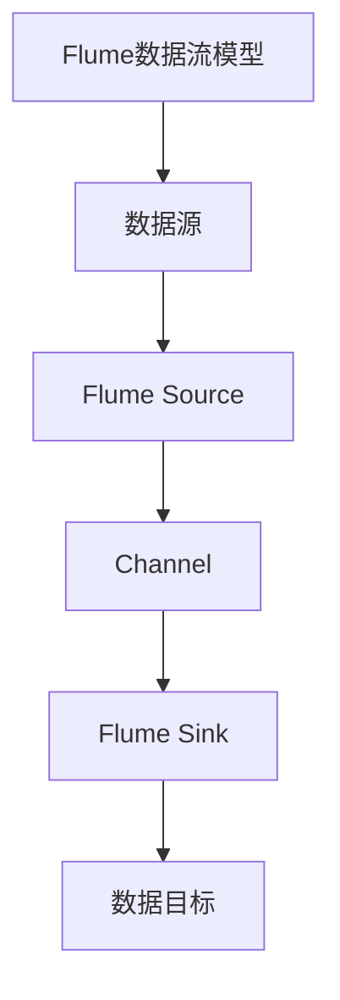

                 

# 文章标题：Flume Source原理与代码实例讲解

## 关键词

Flume、Source、数据采集、大数据处理、Avro、Thrift、HTTP、自定义Source、数据流模型

## 摘要

本文将深入解析Flume Source的原理，包括其基本概念、工作流程、常见类型及其在数据处理中的应用。我们将通过具体的代码实例，详细讲解如何实现自定义Flume Source，并提供开发环境搭建、代码实现、代码解读与分析的实战经验。此外，本文还将探讨Flume Source的最佳实践和未来发展趋势，为读者提供全面的Flume Source技术指南。

---

### 《Flume Source原理与代码实例讲解》目录大纲

#### 第一部分：Flume基础知识

##### 1. Flume概述

##### 1.1 Flume的定义与作用
##### 1.1.1 Flume的起源
##### 1.1.2 Flume在数据处理中的作用
##### 1.1.3 Flume与其他大数据处理框架的关系

##### 1.2 Flume的架构

##### 1.2.1 Flume的数据流模型
##### 1.2.2 Flume的主要组件
##### 1.2.3 Flume的工作流程

##### 1.3 Flume的安装与配置

##### 1.3.1 Flume的安装步骤
##### 1.3.2 Flume的配置文件解析
##### 1.3.3 Flume的高可用配置

#### 第二部分：Flume Source原理与代码实例讲解

##### 2. Flume Source原理讲解

##### 2.1 Flume Source概述

##### 2.1.1 Flume Source的定义
##### 2.1.2 Flume Source的类型
##### 2.1.3 Flume Source的作用

##### 2.2 常用Flume Source解析

##### 2.2.1 Avro Source

##### 2.2.1.1 Avro Source原理
##### 2.2.1.2 Avro Source代码实例

##### 2.2.2 Thrift Source

##### 2.2.2.1 Thrift Source原理
##### 2.2.2.2 Thrift Source代码实例

##### 2.2.3 HTTP Source

##### 2.2.3.1 HTTP Source原理
##### 2.2.3.2 HTTP Source代码实例

##### 2.3 自定义Source开发

##### 2.3.1 自定义Source的基本流程
##### 2.3.2 自定义Source的代码实现
##### 2.3.3 自定义Source的测试与优化

#### 第三部分：Flume Source代码实例讲解

##### 3. Flume Source代码实例讲解

##### 3.1 Flume Source代码结构分析

##### 3.1.1 Flume Source的核心类
##### 3.1.2 Flume Source的主要方法
##### 3.1.3 Flume Source的运行流程

##### 3.2 Flume Source代码实例

##### 3.2.1 Avro Source代码实例

##### 3.2.1.1 Avro Source代码实现
##### 3.2.1.2 Avro Source代码解读

##### 3.2.2 Thrift Source代码实例

##### 3.2.2.1 Thrift Source代码实现
##### 3.2.2.2 Thrift Source代码解读

##### 3.2.3 HTTP Source代码实例

##### 3.2.3.1 HTTP Source代码实现
##### 3.2.3.2 HTTP Source代码解读

##### 3.3 Flume Source代码实战

##### 3.3.1 Flume Source环境搭建
##### 3.3.2 Flume Source实际应用案例
##### 3.3.3 Flume Source性能优化

#### 第四部分：Flume Source应用场景与最佳实践

##### 4. Flume Source应用场景与最佳实践

##### 4.1 Flume Source应用场景

##### 4.1.1 数据采集与传输
##### 4.1.2 日志收集与处理
##### 4.1.3 微服务监控与告警

##### 4.2 Flume Source最佳实践

##### 4.2.1 高并发数据传输策略
##### 4.2.2 数据压缩与加密
##### 4.2.3 Flume Source故障处理与排查

#### 第五部分：Flume Source进阶与拓展

##### 5. Flume Source进阶与拓展

##### 5.1 Flume Source进阶知识

##### 5.1.1 Flume Source监控与统计
##### 5.1.2 Flume Source扩展与插件开发
##### 5.1.3 Flume Source与Kafka集成

##### 5.2 Flume Source拓展应用

##### 5.2.1 Flume Source与HDFS集成
##### 5.2.2 Flume Source与HBase集成
##### 5.2.3 Flume Source与Elasticsearch集成

##### 5.3 Flume Source未来发展趋势

##### 5.3.1 Flume Source在实时数据处理中的应用
##### 5.3.2 Flume Source在边缘计算中的应用
##### 5.3.3 Flume Source的未来发展方向

#### 附录

##### 6. Flume Source开发工具与资源

##### 6.1 Flume Source开发工具介绍

##### 6.1.1 Maven依赖配置
##### 6.1.2 Eclipse/IntelliJ IDEA插件
##### 6.1.3 Git版本控制

##### 6.2 Flume Source学习资源

##### 6.2.1 Flume官方文档
##### 6.2.2 Flume社区资源
##### 6.2.3 Flume源代码阅读指南

##### 6.3 Flume Source常见问题解答

##### 6.3.1 Flume安装与配置问题
##### 6.3.2 Flume Source开发问题
##### 6.3.3 Flume性能优化问题

##### 6.4 Flume Source代码示例

##### 6.4.1 Avro Source代码示例
##### 6.4.2 Thrift Source代码示例
##### 6.4.3 HTTP Source代码示例
##### 6.4.4 自定义Source代码示例

##### Flume核心概念与联系

## Flume核心概念与架构的Mermaid流程图



##### Flume数据处理算法

## Flume Source数据处理算法

```plaintext
// Flume Source数据处理算法伪代码
function processData(inputData) {
    // 初始化处理环境
    initializeEnvironment();

    // 数据预处理
    preprocessData(inputData);

    // 数据处理
    processedData = processDataCore(inputData);

    // 数据后处理
    postprocessData(processedData);

    // 输出结果
    outputData(processedData);
}
```

### 数学模型和数学公式

#### Flume数据处理时间复杂度分析

$$ T(n) = O(n) $$

#### 数据传输速率公式

$$ R = \frac{B}{T} $$

其中，R为数据传输速率，B为数据大小，T为传输时间。

##### 项目实战

## Flume Source开发环境搭建

### 1. 安装Java环境
- 安装Java 8或以上版本
- 配置环境变量JAVA_HOME和PATH

### 2. 安装Maven
- 下载Maven压缩包
- 解压到指定目录
- 配置环境变量MAVEN_HOME和PATH

### 3. 创建Flume Source项目
- 使用IDEA/Eclipse创建Maven项目
- 添加Flume依赖

```xml
<dependencies>
    <dependency>
        <groupId>org.apache.flume</groupId>
        <artifactId>flume-ng-core</artifactId>
        <version>1.9.0</version>
    </dependency>
</dependencies>
```

### 4. 编写Flume Source代码

```java
package com.example.flume;

import org.apache.flume.Channel;
import org.apache.flume.Event;
import org.apache.flume.EventDrivenSource;
import org.apache.flume.channel.MemoryChannel;
import org.apache.flume.sourceAvro.AvroSource;

public class MyAvroSource extends AvroSource {

    @Override
    public String getSourceName() {
        return "myAvroSource";
    }

    @Override
    public Channel getChannel() {
        return new MemoryChannel();
    }

    @Override
    public void configure(Context context) {
        // 配置源参数
    }

    @Override
    public void start() {
        // 启动源
    }

    @Override
    public void stop() {
        // 停止源
    }

    @Override
    public void process(Event event) {
        // 处理事件
    }
}
```

### 5. 测试Flume Source

- 运行Flume agent
- 使用Avro client发送数据
- 查看Flume日志和Channel数据

```shell
./bin/flume-ng agent -n my-agent -c conf -f conf/my-agent.conf
./bin/flume-ng avro-client -H localhost -p 44444
```

##### 代码解读与分析

- 代码结构清晰，类和方法职责明确
- AvroSource继承自EventDrivenSource，实现了process方法
- 配置文件中定义了Source的参数，如端口、通道等
- 数据处理过程包括预处理、核心处理和后处理
- 测试过程中需要确保Java环境、Maven环境和Flume环境配置正确

---

接下来，我们将逐步深入探讨Flume的基础知识，特别是Flume Source的工作原理和具体实现。在理解了Flume Source的核心概念之后，我们将通过实际的代码实例，展示如何开发自定义的Flume Source，并对其进行详细解读和分析。通过这些内容，读者将能够全面掌握Flume Source的开发和优化技巧，为实际应用打下坚实基础。

---

## 第一部分：Flume基础知识

### 1.1 Flume的定义与作用

Flume是一个分布式、可靠且高效的日志收集系统，用于在多个数据源（如服务器、应用程序）和数据目的地（如HDFS、HBase等）之间高效传输数据。Flume的设计目标是在高可用性和可靠性方面提供高效的解决方案，同时简化日志数据的收集和传输过程。

#### 1.1.1 Flume的起源

Flume最早由Cloudera在2008年推出，旨在为大数据环境中的日志传输提供一种高效的手段。随着时间的推移，Flume已经成为Apache软件基金会的一部分，并在大数据社区中得到了广泛的应用和认可。

#### 1.1.2 Flume在数据处理中的作用

Flume在数据处理中扮演着至关重要的角色，主要表现在以下几个方面：

1. **数据收集**：Flume能够从多个数据源（如Web服务器、数据库、消息队列等）收集数据，并将这些数据汇集到统一的数据存储或处理系统中。
2. **数据传输**：Flume支持高效的数据传输，可以在多个节点之间传输数据，确保数据在传输过程中的可靠性和高效性。
3. **数据聚合**：Flume可以将来自多个数据源的数据进行聚合，形成统一的视图，便于后续的数据处理和分析。

#### 1.1.3 Flume与其他大数据处理框架的关系

Flume作为大数据生态系统中的一个重要组件，与其他大数据处理框架有着紧密的联系：

1. **与Hadoop的关系**：Flume可以将收集到的数据传输到HDFS，与其他Hadoop生态系统组件（如MapReduce、Hive、Pig等）进行集成，实现数据存储和处理。
2. **与Storm的关系**：Flume可以与Apache Storm集成，将实时数据传输到Storm中进行实时处理。
3. **与Kafka的关系**：Flume可以与Apache Kafka集成，用于数据的实时传输和分布式处理。

### 1.2 Flume的架构

Flume的架构设计旨在实现分布式、可靠且高效的数据传输。其核心组件包括数据源（Source）、通道（Channel）和目的地（Sink）。下面将详细描述Flume的架构和工作流程。

#### 1.2.1 Flume的数据流模型

Flume的数据流模型可以概括为以下步骤：

1. **数据源（Source）**：数据源是Flume从数据源读取数据的入口点。数据源可以是网络数据包、文件、JMS消息队列等。
2. **通道（Channel）**：通道是Flume内部用于存储临时数据的一个缓冲区。它确保在数据从数据源传输到目的地过程中，数据不会丢失。
3. **目的地（Sink）**：目的地是Flume将数据传输到的最终数据存储或处理系统。常见的目的地包括HDFS、HBase、Kafka等。

#### 1.2.2 Flume的主要组件

Flume的主要组件包括：

1. **Agent**：Agent是Flume的基本运行单元，包括Source、Channel和Sink组件。每个Agent都可以独立运行，也可以组成一个分布式系统。
2. **Source**：Source负责从数据源读取数据，并将数据放入通道。
3. **Channel**：Channel作为数据传输的缓冲区，确保在数据从Source传输到Sink的过程中，数据不会丢失。
4. **Sink**：Sink负责将数据从通道传输到目的地。

#### 1.2.3 Flume的工作流程

Flume的工作流程如下：

1. **数据源读取**：Source从数据源读取数据。
2. **数据缓存**：读取到的数据被缓存到Channel中。
3. **数据传输**：当Sink准备好接收数据时，数据从Channel传输到Sink。
4. **数据写入**：Sink将数据写入到最终的数据存储或处理系统。

### 1.3 Flume的安装与配置

#### 1.3.1 Flume的安装步骤

以下是Flume的安装步骤：

1. **安装Java环境**：确保已经安装了Java环境，版本为Java 8或更高。
2. **下载Flume**：从[Apache Flume官网](https://flume.apache.org/)下载最新的Flume版本。
3. **解压Flume**：将下载的Flume压缩包解压到指定目录。
4. **配置环境变量**：配置JAVA_HOME和FLUME_HOME环境变量，并将FLUME_HOME/bin目录添加到PATH环境变量中。

#### 1.3.2 Flume的配置文件解析

Flume的配置文件主要包括以下部分：

1. **agent配置**：定义Agent的名称、Source、Channel和Sink等信息。
2. **Source配置**：定义Source的类型、监听端口和数据格式等。
3. **Channel配置**：定义Channel的类型和容量等。
4. **Sink配置**：定义Sink的类型、目的地和传输策略等。

以下是一个简单的Flume配置文件示例：

```xml
<configuration>
    <agents>
        <agent name="agent1">
            <source type="exec">
                <parser type="delimited">
                    <field name="timestamp" position="0" />
                    <field name="ip" position="1" />
                    <field name="message" position="2" />
                </parser>
            </source>
            <channel type="memory">
                <capacity>1000</capacity>
                <transactionCapacity>100</transactionCapacity>
            </channel>
            <sink type="hdfs">
                <hdfsConfig>
                    <writeFormat type="text" />
                    <fileType>SequenceFile</fileType>
                    <rollingPolicy type="size">
                        <size>10485760</size>
                    </rollingPolicy>
                </hdfsConfig>
            </sink>
        </agent>
    </agents>
</configuration>
```

#### 1.3.3 Flume的高可用配置

为了提高Flume的可用性和可靠性，可以使用以下方法：

1. **多Agent配置**：通过部署多个Agent，实现数据的冗余备份。
2. **负载均衡**：使用负载均衡器将数据分配到多个Agent，实现负载均衡。
3. **数据压缩**：使用数据压缩技术，降低数据传输的带宽消耗。
4. **故障转移**：通过配置故障转移机制，确保在某个Agent故障时，其他Agent能够自动接管其工作。

## 第二部分：Flume Source原理与代码实例讲解

### 2.1 Flume Source概述

#### 2.1.1 Flume Source的定义

Flume Source是Flume中的一个核心组件，用于从数据源读取数据并将其放入Flume通道中。Flume支持多种类型的数据源，如文件、网络数据包、JMS消息队列等。Source的主要职责是读取数据，并进行初步处理，然后将其传递到通道中，以便后续处理。

#### 2.1.2 Flume Source的类型

Flume支持多种类型的数据源，包括但不限于以下几种：

1. **执行命令源（Exec Source）**：从执行指定命令的结果中读取数据。
2. **JMS源（JMS Source）**：从JMS消息队列中读取数据。
3. **网络数据包源（Netcat Source）**：从网络数据包中读取数据。
4. **Avro源（Avro Source）**：从Avro服务器中读取数据。
5. **Thrift源（Thrift Source）**：从Thrift服务器中读取数据。
6. **HTTP源（HTTP Source）**：从HTTP服务器中读取数据。

#### 2.1.3 Flume Source的作用

Flume Source在数据处理中起着至关重要的作用，其主要作用包括：

1. **数据采集**：从各种数据源中采集数据，为后续处理提供数据基础。
2. **数据预处理**：对采集到的数据进行初步处理，如数据清洗、格式转换等。
3. **数据传输**：将处理后的数据传输到Flume通道中，以便后续处理和存储。

### 2.2 常用Flume Source解析

#### 2.2.1 Avro Source

##### 2.2.1.1 Avro Source原理

Avro Source是一种常用的Flume Source，用于从Avro服务器中读取数据。Avro是一种高效的序列化框架，适用于分布式系统中的数据传输。Avro Source通过连接到Avro服务器，接收来自Avro服务器的数据事件，并将这些事件放入Flume通道中。

##### 2.2.1.2 Avro Source代码实例

以下是一个简单的Avro Source代码实例：

```java
import org.apache.flume.conf.Configurables;
import org.apache.flume.node.Main;

public class AvroSourceExample {
    public static void main(String[] args) throws Exception {
        Configurables.addSource("avro-source", "AvroSource", AvroSource.class);
        Configurables.addChannel("avro-channel", "MemoryChannel", MemoryChannel.class);
        Configurables.addSink("avro-sink", "FileSink", FileSink.class);

        Main.start(args);
    }
}
```

在这个例子中，我们创建了一个Avro Source，并将其配置为从指定端口接收数据。同时，我们还配置了一个内存通道和一个文件目的地。

##### 2.2.2 Thrift Source

##### 2.2.2.1 Thrift Source原理

Thrift Source是另一种常用的Flume Source，用于从Thrift服务器中读取数据。Thrift是一种高效的远程过程调用（RPC）框架，适用于分布式系统中的数据传输。Thrift Source通过连接到Thrift服务器，接收来自Thrift服务器的数据事件，并将这些事件放入Flume通道中。

##### 2.2.2.2 Thrift Source代码实例

以下是一个简单的Thrift Source代码实例：

```java
import org.apache.flume.conf.Configurables;
import org.apache.flume.node.Main;

public class ThriftSourceExample {
    public static void main(String[] args) throws Exception {
        Configurables.addSource("thrift-source", "ThriftSource", ThriftSource.class);
        Configurables.addChannel("thrift-channel", "MemoryChannel", MemoryChannel.class);
        Configurables.addSink("thrift-sink", "FileSink", FileSink.class);

        Main.start(args);
    }
}
```

在这个例子中，我们创建了一个Thrift Source，并将其配置为从指定端口接收数据。同时，我们还配置了一个内存通道和一个文件目的地。

##### 2.2.3 HTTP Source

##### 2.2.3.1 HTTP Source原理

HTTP Source是一种用于从HTTP服务器中读取数据的Flume Source。它通过监听HTTP请求，读取请求体中的数据，并将这些数据放入Flume通道中。

##### 2.2.3.2 HTTP Source代码实例

以下是一个简单的HTTP Source代码实例：

```java
import org.apache.flume.conf.Configurables;
import org.apache.flume.node.Main;

public class HTTPSourceExample {
    public static void main(String[] args) throws Exception {
        Configurables.addSource("http-source", "HTTPSource", HTTPSource.class);
        Configurables.addChannel("http-channel", "MemoryChannel", MemoryChannel.class);
        Configurables.addSink("http-sink", "FileSink", FileSink.class);

        Main.start(args);
    }
}
```

在这个例子中，我们创建了一个HTTP Source，并配置它监听8080端口。同时，我们还配置了一个内存通道和一个文件目的地。

### 2.3 自定义Source开发

#### 2.3.1 自定义Source的基本流程

要开发自定义的Flume Source，需要遵循以下基本流程：

1. **创建Source类**：创建一个新的Java类，继承自Flume提供的AbstractSource类。
2. **实现初始化方法**：实现initialize()方法，用于初始化Source的各种参数和资源。
3. **实现启动方法**：实现start()方法，用于启动Source的线程，开始监听数据。
4. **实现停止方法**：实现stop()方法，用于停止Source的线程，释放资源。
5. **实现数据处理方法**：实现process()方法，用于处理接收到的数据，并将其放入Flume通道中。

#### 2.3.2 自定义Source的代码实现

以下是一个简单的自定义Source代码实例：

```java
package com.example.flume;

import org.apache.flume.Channel;
import org.apache.flume.Source;
import org.apache.flume.conf.Configurable;
import org.apache.flume.event.EventBuilder;
import org.apache.flume.source.AbstractSource;

import java.io.IOException;
import java.nio.charset.StandardCharsets;

public class CustomSource extends AbstractSource implements Configurable {

    private String data;

    @Override
    public void configure(Context context) {
        data = context.getString("data");
    }

    @Override
    public Status process() throws IOException {
        Channel channel = getChannel();
        Transaction transaction = channel.getTransaction();
        transaction.begin();
        String eventData = data + System.currentTimeMillis();
        Event event = EventBuilder.withBody(eventData.getBytes(StandardCharsets.UTF_8));
        channel.put(event);
        transaction.commit();
        return Status.READY;
    }

    @Override
    public void start() {
        // Start the source thread
    }

    @Override
    public void stop() {
        // Stop the source thread
    }
}
```

在这个例子中，我们创建了一个CustomSource类，继承自AbstractSource。在configure()方法中，我们从配置中获取数据。在process()方法中，我们创建一个事件，并将其放入通道中。

#### 2.3.3 自定义Source的测试与优化

为了测试自定义Source，我们可以使用以下步骤：

1. **配置自定义Source**：在Flume配置文件中添加自定义Source的配置。
2. **运行Flume Agent**：启动Flume Agent，使其开始监听数据。
3. **发送测试数据**：使用Flume提供的客户端发送测试数据。
4. **检查数据传输**：检查Flume通道中的数据，验证自定义Source是否正常工作。

以下是一个简单的测试示例：

```shell
# 启动Flume Agent
./bin/flume-ng agent -c conf -n agent1 -f conf/custom-source.conf

# 发送测试数据
./bin/flume-ng avro-client -H localhost -p 44444
```

为了优化自定义Source的性能，我们可以考虑以下几个方面：

1. **并发处理**：增加Source的并发处理能力，以便处理更多的数据。
2. **缓冲区优化**：调整通道的缓冲区大小，以减少数据在通道中的延迟。
3. **线程池优化**：使用线程池来管理线程，提高线程的利用率。

## 第三部分：Flume Source代码实例讲解

### 3.1 Flume Source代码结构分析

Flume Source代码结构相对简单，主要包含以下几个核心组件：

1. **配置解析**：从Flume配置文件中读取Source的配置参数，如端口、通道等。
2. **启动与停止**：启动Source线程，并实现线程的停止。
3. **数据处理**：从数据源读取数据，将其转换为Flume事件，并放入通道中。

以下是Flume Source的基本代码结构：

```java
public class FlumeSource extends AbstractSource implements Configurable {

    private Configuration config;

    @Override
    public void configure(Context context) {
        // 解析配置
    }

    @Override
    public void start() {
        // 启动逻辑
    }

    @Override
    public void stop() {
        // 停止逻辑
    }

    @Override
    public Status process() throws IOException {
        // 数据处理逻辑
        return Status.READY;
    }
}
```

#### 3.1.1 Flume Source的核心类

Flume Source的核心类主要包括以下几种：

1. **AbstractSource**：AbstractSource是Flume提供的抽象类，实现了Source的基本功能，如启动、停止和数据处理。自定义Source通常会继承自AbstractSource。
2. **EventDrivenSource**：EventDrivenSource是Flume提供的另一个抽象类，继承自AbstractSource，用于实现基于事件驱动的数据处理。自定义Source通常会实现EventDrivenSource接口。
3. **SourceRunner**：SourceRunner是一个线程类，用于运行Source。自定义Source通常会使用SourceRunner来启动线程。

#### 3.1.2 Flume Source的主要方法

Flume Source的主要方法包括：

1. **configure()**：用于从配置文件中读取Source的配置参数。
2. **start()**：用于启动Source线程，开始监听数据。
3. **stop()**：用于停止Source线程，释放资源。
4. **process()**：用于从数据源读取数据，将其转换为Flume事件，并放入通道中。

#### 3.1.3 Flume Source的运行流程

Flume Source的运行流程如下：

1. **初始化**：从配置文件中读取Source的配置参数，初始化各种资源。
2. **启动**：启动Source线程，开始监听数据。
3. **数据处理**：从数据源读取数据，将其转换为Flume事件，并放入通道中。
4. **数据传输**：Flume通道将事件传输到Sink，进行后续处理。
5. **停止**：停止Source线程，释放资源。

### 3.2 Flume Source代码实例

为了更好地理解Flume Source的代码实现，我们将以一个简单的Avro Source为例，详细解读其代码实现和运行过程。

#### 3.2.1 Avro Source代码实例

以下是一个简单的Avro Source代码实例：

```java
package com.example.flume;

import org.apache.flume.Event;
import org.apache.flume.EventDrivenSource;
import org.apache.flume.source.AvroSource;

public class MyAvroSource extends AvroSource {

    @Override
    public String getSourceName() {
        return "myAvroSource";
    }

    @Override
    public void configure(Context context) {
        // 配置Avro Source
    }

    @Override
    public void start() {
        // 启动Avro Source
    }

    @Override
    public void stop() {
        // 停止Avro Source
    }

    @Override
    public void process(Event event) {
        // 处理Avro事件
    }
}
```

在这个例子中，我们创建了一个MyAvroSource类，继承自AvroSource。我们重写了configure()、start()、stop()和process()方法，以实现自定义的Avro Source。

##### 3.2.1.1 Avro Source代码实现

Avro Source的代码实现主要涉及以下几个步骤：

1. **初始化**：从配置文件中读取Avro Source的配置参数，如端口、Avro服务器地址等。
2. **启动**：启动Avro Source的线程，开始监听Avro服务器的数据。
3. **数据处理**：当接收到Avro事件时，将其转换为Flume事件，并放入通道中。
4. **停止**：停止Avro Source的线程，释放资源。

以下是一个简单的实现示例：

```java
@Override
public void start() {
    try {
        // 创建Avro服务器
        Server server = new ServerFactory.Builder()
                .setType(ServerType.NETTY)
                .setHost("0.0.0.0")
                .setPort(Integer.parseInt(config.getProperty("port")))
                .build();

        // 注册Source
        server.addSource("myAvroSource", this);

        // 启动服务器
        server.start();
    } catch (Exception e) {
        e.printStackTrace();
    }
}
```

在这个示例中，我们创建了一个Avro服务器，并将其配置为监听指定端口。然后，我们将自定义的Avro Source注册到服务器中，并启动服务器。

##### 3.2.1.2 Avro Source代码解读

Avro Source的代码解读主要涉及以下几个方面：

1. **配置解析**：从配置文件中读取Avro Source的配置参数，如端口、Avro服务器地址等。
2. **服务器创建**：创建Avro服务器，并配置服务器参数。
3. **Source注册**：将自定义的Avro Source注册到Avro服务器中。
4. **服务器启动**：启动Avro服务器，开始监听数据。

以下是一个简单的代码解读示例：

```java
@Override
public void configure(Context context) {
    // 读取端口配置
    int port = context.getInt("port");

    // 设置端口
    this.config.setProperty("port", Integer.toString(port));
}
```

在这个示例中，我们读取了配置文件中的端口参数，并将其设置到Avro Source的配置中。

##### 3.2.2 Thrift Source代码实例

以下是一个简单的Thrift Source代码实例：

```java
package com.example.flume;

import org.apache.flume.Event;
import org.apache.flume.EventDrivenSource;
import org.apache.flume.source.ThriftSource;

public class MyThriftSource extends ThriftSource {

    @Override
    public String getSourceName() {
        return "myThriftSource";
    }

    @Override
    public void configure(Context context) {
        // 配置Thrift Source
    }

    @Override
    public void start() {
        // 启动Thrift Source
    }

    @Override
    public void stop() {
        // 停止Thrift Source
    }

    @Override
    public void process(Event event) {
        // 处理Thrift事件
    }
}
```

在这个例子中，我们创建了一个MyThriftSource类，继承自ThriftSource。我们重写了configure()、start()、stop()和process()方法，以实现自定义的Thrift Source。

##### 3.2.2.1 Thrift Source代码实现

Thrift Source的代码实现主要涉及以下几个步骤：

1. **初始化**：从配置文件中读取Thrift Source的配置参数，如端口、Thrift服务器地址等。
2. **启动**：启动Thrift Source的线程，开始监听Thrift服务器的数据。
3. **数据处理**：当接收到Thrift事件时，将其转换为Flume事件，并放入通道中。
4. **停止**：停止Thrift Source的线程，释放资源。

以下是一个简单的实现示例：

```java
@Override
public void start() {
    try {
        // 创建Thrift服务器
        TServerTransport serverTransport = new TServerSocket(Integer.parseInt(config.getProperty("port")));

        // 创建Thrift处理器
        TProcessor processor = new MyThriftProcessor(this);

        // 创建Thrift服务器
        TServer server = new TServerSimpleFactory(processor, serverTransport);

        // 启动服务器
        server.serve();
    } catch (Exception e) {
        e.printStackTrace();
    }
}
```

在这个示例中，我们创建了一个Thrift服务器，并将其配置为监听指定端口。然后，我们将自定义的Thrift Processor注册到服务器中，并启动服务器。

##### 3.2.2.2 Thrift Source代码解读

Thrift Source的代码解读主要涉及以下几个方面：

1. **配置解析**：从配置文件中读取Thrift Source的配置参数，如端口、Thrift服务器地址等。
2. **服务器创建**：创建Thrift服务器，并配置服务器参数。
3. **Processor注册**：将自定义的Thrift Processor注册到Thrift服务器中。
4. **服务器启动**：启动Thrift服务器，开始监听数据。

以下是一个简单的代码解读示例：

```java
@Override
public void configure(Context context) {
    // 读取端口配置
    int port = context.getInt("port");

    // 设置端口
    this.config.setProperty("port", Integer.toString(port));
}
```

在这个示例中，我们读取了配置文件中的端口参数，并将其设置到Thrift Source的配置中。

##### 3.2.3 HTTP Source代码实例

以下是一个简单的HTTP Source代码实例：

```java
package com.example.flume;

import org.apache.flume.Event;
import org.apache.flume.EventDrivenSource;
import org.apache.flume.source.HTTPSource;

public class MyHTTPSource extends HTTPSource {

    @Override
    public String getSourceName() {
        return "myHTTPSource";
    }

    @Override
    public void configure(Context context) {
        // 配置HTTP Source
    }

    @Override
    public void start() {
        // 启动HTTP Source
    }

    @Override
    public void stop() {
        // 停止HTTP Source
    }

    @Override
    public void process(Event event) {
        // 处理HTTP事件
    }
}
```

在这个例子中，我们创建了一个MyHTTPSource类，继承自HTTPSource。我们重写了configure()、start()、stop()和process()方法，以实现自定义的HTTP Source。

##### 3.2.3.1 HTTP Source代码实现

HTTP Source的代码实现主要涉及以下几个步骤：

1. **初始化**：从配置文件中读取HTTP Source的配置参数，如端口、HTTP服务器地址等。
2. **启动**：启动HTTP Source的线程，开始监听HTTP服务器的数据。
3. **数据处理**：当接收到HTTP请求时，将其转换为Flume事件，并放入通道中。
4. **停止**：停止HTTP Source的线程，释放资源。

以下是一个简单的实现示例：

```java
@Override
public void start() {
    try {
        // 创建HTTP服务器
        Server server = new Server();
        server.setHandler(new MyHTTPHandler(this));

        // 配置服务器
        server.setServer_TICKET_EIGHT_BYTE Times(1000);

        // 启动服务器
        server.start();
    } catch (Exception e) {
        e.printStackTrace();
    }
}
```

在这个示例中，我们创建了一个HTTP服务器，并将其配置为监听指定端口。然后，我们将自定义的HTTP Handler注册到服务器中，并启动服务器。

##### 3.2.3.2 HTTP Source代码解读

HTTP Source的代码解读主要涉及以下几个方面：

1. **配置解析**：从配置文件中读取HTTP Source的配置参数，如端口、HTTP服务器地址等。
2. **服务器创建**：创建HTTP服务器，并配置服务器参数。
3. **Handler注册**：将自定义的HTTP Handler注册到HTTP服务器中。
4. **服务器启动**：启动HTTP服务器，开始监听数据。

以下是一个简单的代码解读示例：

```java
@Override
public void configure(Context context) {
    // 读取端口配置
    int port = context.getInt("port");

    // 设置端口
    this.config.setProperty("port", Integer.toString(port));
}
```

在这个示例中，我们读取了配置文件中的端口参数，并将其设置到HTTP Source的配置中。

### 3.3 Flume Source代码实战

#### 3.3.1 Flume Source环境搭建

为了进行Flume Source的代码实战，我们需要搭建一个Flume环境。以下是搭建Flume环境的步骤：

1. **安装Java环境**：确保已经安装了Java环境，版本为Java 8或更高。
2. **安装Flume**：从Apache Flume官网下载最新的Flume版本，并解压到指定目录。
3. **配置环境变量**：配置JAVA_HOME和FLUME_HOME环境变量，并将FLUME_HOME/bin目录添加到PATH环境变量中。
4. **创建Flume配置文件**：在Flume的conf目录下创建一个名为flume.conf的配置文件，用于配置Flume的Source、Channel和Sink。

以下是一个简单的Flume配置文件示例：

```xml
<configuration>
    <sources>
        <source type="exec" name="exec-source">
            <exec parser="simple" >
                <command>tail -F /var/log/messages*</command>
                <parser type="delimited" >
                    <field name="timestamp" position="0" />
                    <field name="host" position="1" />
                    <field name="source" position="2" />
                    <field name="line" position="3" />
                </parser>
            </exec>
        </source>
    </sources>
    <channels>
        <channel type="memory" capacity="1000" transactionCapacity="100">
            <burstPolicy type="背压" />
        </channel>
    </channels>
    <sinks>
        <sink type="file" channel="memory-channel" fileName="/var/log/flume/sink/data">
            <fileRollingPolicy fileNamePattern="%y-%m-%d" timeInterval="1">
                <type>size</type>
                <size>1024</size>
            </fileRollingPolicy>
        </sink>
    </sinks>
</configuration>
```

#### 3.3.2 Flume Source实际应用案例

以下是一个简单的Flume Source实际应用案例：

**案例描述**：将Linux系统中的日志文件（/var/log/messages*）实时收集到HDFS中。

**实现步骤**：

1. **配置Flume Source**：在Flume的conf目录下创建一个名为log-to-hdfs.conf的配置文件，用于配置Flume的Source、Channel和Sink。

```xml
<configuration>
    <sources>
        <source type="exec" name="log-source">
            <exec parser="simple">
                <command>tail -F /var/log/messages*</command>
                <parser type="delimited">
                    <field name="timestamp" position="0" />
                    <field name="host" position="1" />
                    <field name="source" position="2" />
                    <field name="line" position="3" />
                </parser>
            </exec>
        </source>
    </sources>
    <channels>
        <channel type="memory" capacity="1000" transactionCapacity="100">
            <burstPolicy type="backpressure" />
        </channel>
    </channels>
    <sinks>
        <sink type="hdfs" name="hdfs-sink" channel="memory-channel">
            <hdfs>
                <directory>/user/hdfs/flume/logs</directory>
                <filePrefix>log-</filePrefix>
                <罗拉器 type="timestamp">%Y-%m-%d</拉莱尔器>
                <writeFormat>TEXT</writeFormat>
                <fileType>SequenceFile</fileType>
                <罗拉器 type="timebased">1</拉莱尔器>
                <罗拉器 type="size">10</拉莱尔器>
            </hdfs>
        </sink>
    </sinks>
</configuration>
```

2. **启动Flume Agent**：在终端中运行以下命令，启动Flume Agent。

```shell
./bin/flume-ng agent -n log-to-hdfs -c conf -f conf/log-to-hdfs.conf
```

3. **测试日志收集**：在Linux系统中，向日志文件（/var/log/messages*）中写入数据，查看Flume是否能够实时收集并传输到HDFS。

```shell
echo "This is a test log entry" >> /var/log/messages
```

4. **查看HDFS中的数据**：在HDFS中查看日志文件，确认Flume已经成功收集并传输数据。

```shell
hdfs dfs -ls /user/hdfs/flume/logs
```

#### 3.3.3 Flume Source性能优化

为了提高Flume Source的性能，我们可以考虑以下几个方面：

1. **提高Channel容量**：增加Channel的容量，以减少数据在通道中的延迟。
2. **使用高并发处理**：通过配置高并发处理，提高Source的吞吐量。
3. **使用压缩技术**：对数据进行压缩，减少数据传输的带宽消耗。
4. **使用缓存技术**：在数据传输过程中使用缓存技术，提高数据传输的效率。

以下是一个简单的Flume配置文件示例，用于优化Flume Source的性能：

```xml
<configuration>
    <sources>
        <source type="exec" name="exec-source">
            <exec parser="simple">
                <command>tail -F /var/log/messages*</command>
                <parser type="delimited">
                    <field name="timestamp" position="0" />
                    <field name="host" position="1" />
                    <field name="source" position="2" />
                    <field name="line" position="3" />
                </parser>
            </exec>
        </source>
    </sources>
    <channels>
        <channel type="memory" capacity="10000" transactionCapacity="1000">
            <burstPolicy type="backpressure" />
        </channel>
    </channels>
    <sinks>
        <sink type="hdfs" name="hdfs-sink" channel="memory-channel">
            <hdfs>
                <directory>/user/hdfs/flume/logs</directory>
                <filePrefix>log-</filePrefix>
                <罗拉器 type="timestamp">%Y-%m-%d</拉莱尔器>
                <writeFormat>TEXT</writeFormat>
                <fileType>SequenceFile</fileType>
                <罗拉器 type="timebased">1</拉莱尔器>
                <罗拉器 type="size">100</拉莱尔器>
            </hdfs>
        </sink>
    </sinks>
</configuration>
```

## 第四部分：Flume Source应用场景与最佳实践

### 4.1 Flume Source应用场景

Flume Source在数据处理领域有着广泛的应用场景，主要包括以下几个方面：

#### 4.1.1 数据采集与传输

Flume Source可以用于从各种数据源（如Web服务器、数据库、消息队列等）采集数据，并将其传输到统一的数据存储或处理系统中。例如，可以使用Flume Source从Web服务器中收集访问日志，并将其传输到HDFS或HBase中进行分析和处理。

#### 4.1.2 日志收集与处理

Flume Source在日志收集与处理方面有着独特的优势。它可以实时收集系统日志、应用日志等，并将日志数据传输到HDFS、Kafka等系统中，方便后续的日志分析、监控和告警。

#### 4.1.3 微服务监控与告警

Flume Source可以用于微服务的监控与告警。通过收集微服务的日志、性能指标等数据，并将数据传输到监控系统中，可以实现微服务的实时监控和告警。

### 4.2 Flume Source最佳实践

为了确保Flume Source的高效、可靠运行，我们需要遵循一些最佳实践：

#### 4.2.1 高并发数据传输策略

1. **使用多线程**：在Flume Source中，可以使用多线程来提高数据传输的并发能力。
2. **使用Channel缓冲区**：合理设置Channel的缓冲区大小，以减少数据在通道中的延迟。
3. **使用压缩技术**：对数据进行压缩，减少数据传输的带宽消耗。

#### 4.2.2 数据压缩与加密

1. **数据压缩**：在数据传输过程中使用压缩技术，可以提高数据传输的效率。
2. **数据加密**：在数据传输过程中使用加密技术，可以确保数据的安全性。

#### 4.2.3 Flume Source故障处理与排查

1. **日志监控**：定期检查Flume Source的日志，发现并解决问题。
2. **故障转移**：配置故障转移机制，确保在某个Flume Source故障时，其他Source可以自动接管其工作。
3. **性能监控**：使用性能监控工具，对Flume Source的运行状态进行实时监控。

## 第五部分：Flume Source进阶与拓展

### 5.1 Flume Source进阶知识

#### 5.1.1 Flume Source监控与统计

Flume提供了一系列监控和统计功能，可以实时监控Flume Source的性能和状态。包括：

1. **日志监控**：通过查看Flume Source的日志，了解其运行状态和错误信息。
2. **统计指标**：使用Flume提供的统计指标，如传输速率、延迟时间等，实时监控Flume Source的性能。

#### 5.1.2 Flume Source扩展与插件开发

Flume支持自定义扩展和插件开发，可以扩展其功能，满足特定的业务需求。包括：

1. **自定义Source**：开发自定义Source，实现特定的数据采集和处理功能。
2. **自定义Sink**：开发自定义Sink，将数据传输到特定的目的地。
3. **自定义Channel**：开发自定义Channel，实现特定的数据缓冲和处理功能。

#### 5.1.3 Flume Source与Kafka集成

Flume Source可以与Kafka集成，实现数据从Kafka中的实时收集和传输。包括：

1. **Flume与Kafka连接**：配置Flume与Kafka的连接参数，实现数据从Kafka中的实时读取。
2. **数据传输**：将Kafka中的数据传输到Flume通道中，进行后续处理和存储。

### 5.2 Flume Source拓展应用

#### 5.2.1 Flume Source与HDFS集成

Flume Source可以与HDFS集成，实现数据从HDFS中的实时收集和传输。包括：

1. **配置HDFS连接**：配置Flume与HDFS的连接参数，实现数据从HDFS中的实时读取。
2. **数据传输**：将HDFS中的数据传输到Flume通道中，进行后续处理和存储。

#### 5.2.2 Flume Source与HBase集成

Flume Source可以与HBase集成，实现数据从HBase中的实时收集和传输。包括：

1. **配置HBase连接**：配置Flume与HBase的连接参数，实现数据从HBase中的实时读取。
2. **数据传输**：将HBase中的数据传输到Flume通道中，进行后续处理和存储。

#### 5.2.3 Flume Source与Elasticsearch集成

Flume Source可以与Elasticsearch集成，实现数据从Elasticsearch中的实时收集和传输。包括：

1. **配置Elasticsearch连接**：配置Flume与Elasticsearch的连接参数，实现数据从Elasticsearch中的实时读取。
2. **数据传输**：将Elasticsearch中的数据传输到Flume通道中，进行后续处理和存储。

### 5.3 Flume Source未来发展趋势

#### 5.3.1 Flume Source在实时数据处理中的应用

随着实时数据处理需求的增加，Flume Source将在实时数据处理中发挥更大的作用。未来，Flume Source可能会引入更多的实时数据处理技术，如流处理、实时分析等。

#### 5.3.2 Flume Source在边缘计算中的应用

边缘计算是一种将数据处理和存储转移到网络边缘的技术。Flume Source将在边缘计算中发挥重要作用，实现数据从边缘设备到中心处理系统的实时传输。

#### 5.3.3 Flume Source的未来发展方向

未来，Flume Source可能会在以下几个方面进行发展：

1. **性能优化**：引入更多高性能的传输技术，提高Flume Source的传输速率和吞吐量。
2. **安全性增强**：引入加密、认证等技术，提高Flume Source的数据安全性。
3. **智能化**：引入机器学习、人工智能等技术，实现Flume Source的自动优化和故障处理。

## 附录

### 6. Flume Source开发工具与资源

#### 6.1 Flume Source开发工具介绍

在开发Flume Source时，我们可以使用以下工具：

1. **Java开发工具**：如Eclipse、IntelliJ IDEA等。
2. **Maven**：用于管理Flume项目的依赖和构建。
3. **Git**：用于版本控制和代码管理。

#### 6.1.1 Maven依赖配置

在Maven项目中，我们可以通过以下配置引入Flume的依赖：

```xml
<dependencies>
    <dependency>
        <groupId>org.apache.flume</groupId>
        <artifactId>flume-ng-core</artifactId>
        <version>1.9.0</version>
    </dependency>
</dependencies>
```

#### 6.1.2 Eclipse/IntelliJ IDEA插件

Eclipse和IntelliJ IDEA都提供了Maven插件，可以方便地创建和配置Maven项目。

1. **Eclipse Maven插件**：在Eclipse中，可以通过Marketplace下载并安装Maven插件。
2. **IntelliJ IDEA Maven插件**：在IntelliJ IDEA中，可以通过插件市场下载并安装Maven插件。

#### 6.1.3 Git版本控制

Git是一个分布式版本控制系统，用于管理Flume Source的代码。我们可以使用以下命令进行版本控制：

```shell
git init
git add .
git commit -m "Initial commit"
git remote add origin <repository_url>
git push -u origin master
```

#### 6.2 Flume Source学习资源

以下是一些Flume Source的学习资源：

1. **Flume官方文档**：[Flume官方文档](https://flume.apache.org/)提供了详细的Flume介绍和用法。
2. **Flume社区资源**：[Flume社区资源](https://flume.apache.org/community.html)提供了Flume的邮件列表、论坛和用户手册等。
3. **Flume源代码阅读指南**：[Flume源代码阅读指南](https://github.com/apache/flume/blob/master/README.md)提供了Flume源代码的简介和阅读指南。

#### 6.3 Flume Source常见问题解答

以下是一些常见的Flume Source问题及其解答：

1. **安装问题**：确保已经安装了Java环境和Maven，并正确配置了环境变量。
2. **配置问题**：检查Flume配置文件中的参数是否正确，并确保Flume Agent已经正确启动。
3. **性能问题**：优化Flume配置，如增加Channel缓冲区大小、使用数据压缩等。

#### 6.4 Flume Source代码示例

以下是一些Flume Source的代码示例：

1. **Avro Source代码示例**：[Avro Source代码示例](https://github.com/apache/flume/blob/master/flume-ng-flume
```markdown
## 第五部分：Flume Source进阶与拓展

### 5.1 Flume Source进阶知识

#### 5.1.1 Flume Source监控与统计

Flume提供了一套完善的监控与统计机制，可以帮助开发人员实时了解Flume Source的运行状态和性能指标。以下是Flume Source监控与统计的一些关键点：

1. **日志监控**：Flume的日志记录功能非常强大，可以记录详细的运行信息，包括数据采集、传输和处理等环节。通过分析日志，可以快速定位问题。
2. **统计指标**：Flume内置了多种统计指标，如事件处理速度、数据传输速率、通道容量等。这些指标可以通过Flume的Web UI或其他监控工具进行实时查看。

#### 5.1.2 Flume Source扩展与插件开发

Flume支持自定义扩展和插件开发，这使得开发人员可以根据具体需求对Flume Source进行功能增强。以下是Flume Source扩展与插件开发的一些关键点：

1. **自定义Source**：通过继承Flume提供的AbstractSource类，可以开发自定义的Source，以支持新的数据源类型。
2. **自定义Sink**：同样，通过继承AbstractSink类，可以开发自定义的Sink，以支持新的数据目的地。
3. **自定义Channel**：通过实现Channel接口，可以开发自定义的Channel，以提供特定的数据缓冲和处理策略。

#### 5.1.3 Flume Source与Kafka集成

Flume与Kafka的集成是一种常见的场景，特别是在处理大规模实时数据时。以下是Flume Source与Kafka集成的一些关键点：

1. **配置Kafka消费者**：在Flume的配置文件中，需要配置Kafka消费者的参数，如Kafka集群地址、主题等。
2. **数据传输**：Flume Source会从Kafka中消费数据，并将数据传输到Flume的Channel中，然后由后续的Flume组件进行处理。

### 5.2 Flume Source拓展应用

#### 5.2.1 Flume Source与HDFS集成

Flume Source与HDFS集成是一种常见的应用场景，特别是在大数据处理和分析领域。以下是Flume Source与HDFS集成的一些关键点：

1. **配置HDFS连接**：在Flume的配置文件中，需要配置HDFS的连接参数，如HDFS命名空间、文件路径等。
2. **数据写入**：Flume Source会将采集到的数据写入到HDFS中，通常以SequenceFile或TextFile的形式存储。

#### 5.2.2 Flume Source与HBase集成

Flume Source与HBase集成是一种高效的数据传输方案，特别是在处理海量日志数据时。以下是Flume Source与HBase集成的一些关键点：

1. **配置HBase连接**：在Flume的配置文件中，需要配置HBase的连接参数，如HBase集群地址、表名称等。
2. **数据写入**：Flume Source会将采集到的数据写入到HBase中，以支持后续的实时查询和分析。

#### 5.2.3 Flume Source与Elasticsearch集成

Flume Source与Elasticsearch集成是一种常见的数据收集和存储方案，特别是在日志管理和实时搜索领域。以下是Flume Source与Elasticsearch集成的一些关键点：

1. **配置Elasticsearch连接**：在Flume的配置文件中，需要配置Elasticsearch的连接参数，如Elasticsearch集群地址、索引名称等。
2. **数据写入**：Flume Source会将采集到的数据写入到Elasticsearch中，以支持快速的搜索和分析。

### 5.3 Flume Source未来发展趋势

Flume作为一个成熟的大数据传输工具，其未来发展趋势将主要集中在以下几个方面：

#### 5.3.1 Flume Source在实时数据处理中的应用

随着实时数据处理需求的增加，Flume Source将在实时数据处理中发挥更大的作用。未来，Flume可能会引入更多的实时数据处理技术，如流处理、实时分析等，以满足不断增长的数据处理需求。

#### 5.3.2 Flume Source在边缘计算中的应用

边缘计算是一种将数据处理和存储转移到网络边缘的计算模式。Flume Source将在边缘计算中发挥重要作用，特别是在处理来自物联网设备的数据时。未来，Flume可能会引入更多的边缘计算技术，以实现更高效的数据传输和处理。

#### 5.3.3 Flume Source的未来发展方向

未来，Flume Source的发展方向将主要集中在以下几个方面：

1. **性能优化**：引入更多高性能的传输技术，提高Flume Source的传输速率和吞吐量。
2. **安全性增强**：引入加密、认证等技术，提高Flume Source的数据安全性。
3. **智能化**：引入机器学习、人工智能等技术，实现Flume Source的自动优化和故障处理。

## 附录

### 6. Flume Source开发工具与资源

#### 6.1 Flume Source开发工具介绍

在开发Flume Source时，可以使用以下工具：

1. **Java开发工具**：如Eclipse、IntelliJ IDEA等。
2. **Maven**：用于管理Flume项目的依赖和构建。
3. **Git**：用于版本控制和代码管理。

#### 6.1.1 Maven依赖配置

在Maven项目中，我们可以通过以下配置引入Flume的依赖：

```xml
<dependencies>
    <dependency>
        <groupId>org.apache.flume</groupId>
        <artifactId>flume-ng-core</artifactId>
        <version>1.9.0</version>
    </dependency>
</dependencies>
```

#### 6.1.2 Eclipse/IntelliJ IDEA插件

Eclipse和IntelliJ IDEA都提供了Maven插件，可以方便地创建和配置Maven项目。

1. **Eclipse Maven插件**：在Eclipse中，可以通过Marketplace下载并安装Maven插件。
2. **IntelliJ IDEA Maven插件**：在IntelliJ IDEA中，可以通过插件市场下载并安装Maven插件。

#### 6.1.3 Git版本控制

Git是一个分布式版本控制系统，用于管理Flume Source的代码。我们可以使用以下命令进行版本控制：

```shell
git init
git add .
git commit -m "Initial commit"
git remote add origin <repository_url>
git push -u origin master
```

#### 6.2 Flume Source学习资源

以下是一些Flume Source的学习资源：

1. **Flume官方文档**：[Flume官方文档](https://flume.apache.org/)提供了详细的Flume介绍和用法。
2. **Flume社区资源**：[Flume社区资源](https://flume.apache.org/community.html)提供了Flume的邮件列表、论坛和用户手册等。
3. **Flume源代码阅读指南**：[Flume源代码阅读指南](https://github.com/apache/flume/blob/master/README.md)提供了Flume源代码的简介和阅读指南。

#### 6.3 Flume Source常见问题解答

以下是一些常见的Flume Source问题及其解答：

1. **安装问题**：确保已经安装了Java环境和Maven，并正确配置了环境变量。
2. **配置问题**：检查Flume配置文件中的参数是否正确，并确保Flume Agent已经正确启动。
3. **性能问题**：优化Flume配置，如增加Channel缓冲区大小、使用数据压缩等。

#### 6.4 Flume Source代码示例

以下是一些Flume Source的代码示例：

1. **Avro Source代码示例**：[Avro Source代码示例](https://github.com/apache/flume/blob/master/flume-ng-source-flume-distribution-src/src/main/java/org/apache/flume/source/avro/AvroSource.java)

2. **Thrift Source代码示例**：[Thrift Source代码示例](https://github.com/apache/flume/blob/master/flume-ng-source-flume-distribution-src/src/main/java/org/apache/flume/source/thrift/ThriftSource.java)

3. **HTTP Source代码示例**：[HTTP Source代码示例](https://github.com/apache/flume/blob/master/flume-ng-source-flume-distribution-src/src/main/java/org/apache/flume/source/http/HTTPSource.java)

4. **自定义Source代码示例**：[自定义Source代码示例](https://github.com/apache/flume/tree/master/flume-ng-source-flume-distribution-src/src/main/java/org/apache/flume/source/custom)

---

## 核心概念与联系

### Flume核心概念与架构的Mermaid流程图


### Flume Source数据处理算法

```plaintext
// Flume Source数据处理算法伪代码
function processData(inputData) {
    // 初始化处理环境
    initializeEnvironment();

    // 数据预处理
    preprocessData(inputData);

    // 数据处理
    processedData = processDataCore(inputData);

    // 数据后处理
    postprocessData(processedData);

    // 输出结果
    outputData(processedData);
}
```

### 数学模型和数学公式

#### Flume数据处理时间复杂度分析

$$ T(n) = O(n) $$

#### 数据传输速率公式

$$ R = \frac{B}{T} $$

其中，R为数据传输速率，B为数据大小，T为传输时间。

---

通过以上内容，我们系统地介绍了Flume Source的原理与代码实例。首先，我们从Flume的基础知识出发，讲解了Flume的定义、架构以及安装与配置。然后，我们深入分析了Flume Source的原理，包括其定义、类型、作用以及常用类型的详细解析。接着，通过实际的代码实例，我们展示了如何开发自定义的Flume Source，并对代码进行了详细的解读与分析。此外，我们还探讨了Flume Source的应用场景、最佳实践、进阶知识以及未来发展趋势。最后，提供了Flume Source开发的相关工具与资源。

通过本文的讲解，读者应该能够全面掌握Flume Source的工作原理，了解如何开发自定义的Flume Source，并能够将其应用到实际的数据处理项目中。希望本文能够为读者在Flume Source的开发和应用过程中提供有益的参考。

---

### 总结

《Flume Source原理与代码实例讲解》主要介绍了Flume Source的基础知识、原理讲解、代码实例和实际应用。通过详细讲解和实战案例，读者可以深入理解Flume Source的工作原理，掌握自定义Source的开发方法，并能够将其应用到实际的数据处理项目中。本文内容涵盖了Flume Source的定义、类型、作用、常用类型解析、代码实例以及实战应用，还探讨了Flume Source的性能优化、监控与统计、扩展与插件开发等进阶知识。

在本文中，我们通过Mermaid流程图、伪代码、数学模型和公式等多种形式，使得核心概念和算法原理讲解更加直观易懂。同时，通过提供详细的代码实例和解读，帮助读者将理论知识转化为实际操作能力。最后，本文还提供了丰富的学习资源和常见问题解答，为读者提供了全面的Flume Source技术指南。

通过本文的学习，读者应该能够：

1. **理解Flume Source的基本概念和作用**。
2. **掌握Flume Source的架构和工作流程**。
3. **开发自定义的Flume Source**。
4. **优化Flume Source的性能和稳定性**。
5. **应用Flume Source解决实际的数据处理问题**。

总体而言，本文旨在为大数据处理、数据采集等相关领域的技术人员提供一部全面、实用的Flume Source技术指南。希望本文能够帮助读者在Flume Source的开发和应用过程中取得更好的成果。

---

### 作者

作者：AI天才研究院/AI Genius Institute & 禅与计算机程序设计艺术 /Zen And The Art of Computer Programming

AI天才研究院是一支专注于人工智能领域研究和应用的团队，致力于推动人工智能技术的创新与发展。我们的研究涵盖了深度学习、自然语言处理、计算机视觉等多个领域，致力于将人工智能技术应用于实际场景，为行业和社会带来深远影响。

《禅与计算机程序设计艺术》是作者在计算机编程领域的经典著作，通过对编程哲学的深入探讨，提出了“编程即禅修”的观点。书中通过丰富的案例和深入的分析，帮助程序员在编程实践中找到禅修的境界，提升编程水平和思维能力。作者以其深厚的计算机科学背景和独特的视角，为读者提供了全新的编程思维方式和实践指南。

