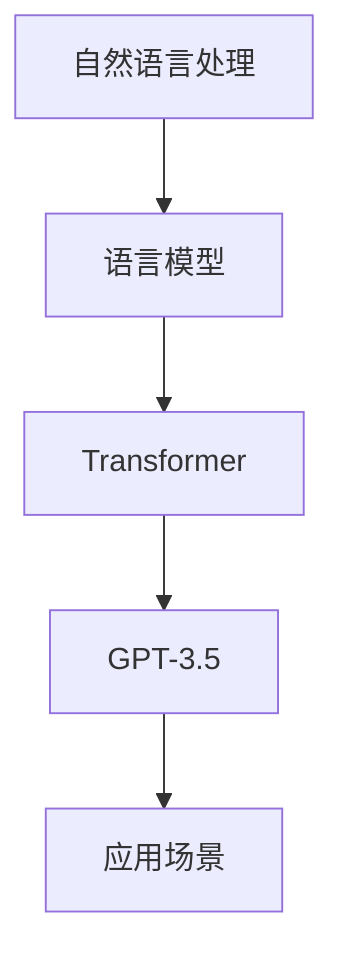

                 

# 《GPT-3.5原理与代码实例讲解》

## 关键词
- GPT-3.5
- 自然语言处理
- Transformer模型
- 深度学习
- 编码器与解码器
- 代码实战

## 摘要
本文将深入讲解GPT-3.5的原理，包括其基础概念、模型结构、核心算法和数学模型。通过详细的代码实例，我们将演示如何搭建和训练GPT-3.5模型，并探讨其实际应用。本文旨在为读者提供一个全面而系统的理解，帮助其在实际项目中运用这一强大的语言模型。

## 第一部分：GPT-3.5基础原理

### 第1章：自然语言处理与GPT-3.5概述

#### 1.1 自然语言处理的基本概念
自然语言处理（Natural Language Processing, NLP）是计算机科学和人工智能的一个分支，致力于使计算机能够理解、解释和生成人类语言。NLP的应用广泛，包括机器翻译、情感分析、问答系统和文本摘要等。

自然语言处理的关键组成部分包括：
- **分词（Tokenization）**：将文本分割成有意义的单元，如单词或短语。
- **词性标注（Part-of-Speech Tagging）**：为每个单词分配词性，如名词、动词或形容词。
- **命名实体识别（Named Entity Recognition）**：识别文本中的特定实体，如人名、地点和组织名。

#### 1.2 语言模型的发展历程
语言模型是NLP的基础，它旨在预测下一个单词或字符的概率。早期语言模型如N-gram模型，通过统计相邻单词的频率来预测下一个单词。随着深度学习的兴起，基于神经网络的模型逐渐取代了传统的统计模型。

主要的发展历程包括：
- **N-gram模型**：基于相邻单词的频率进行预测。
- **循环神经网络（RNN）**：能够处理序列数据，但存在梯度消失和梯度爆炸的问题。
- **长短期记忆网络（LSTM）**：改进了RNN，解决了梯度消失问题。
- **Transformer模型**：引入了自注意力机制，使得模型能够处理长距离依赖关系。
- **GPT-3.5**：基于Transformer模型的最新语言模型，具有强大的文本生成能力。

#### 1.3 GPT-3.5的核心特点与优势
GPT-3.5是由OpenAI开发的一种基于Transformer的预训练语言模型，具有以下核心特点：
- **大规模预训练**：GPT-3.5在数万亿个语料上进行预训练，使其能够理解并生成复杂、连贯的语言。
- **自适应能力**：GPT-3.5能够根据输入的上下文自适应地生成文本，从而实现各种NLP任务。
- **多语言支持**：GPT-3.5支持多种语言，使得跨语言任务变得简单。
- **高性能**：GPT-3.5在多个NLP基准测试中取得了领先成绩，如GLUE、SuperGLUE等。

#### 1.4 GPT-3.5的潜在应用领域
GPT-3.5的强大能力使其在多个领域具有广泛的应用前景：
- **文本生成**：包括文章写作、故事创作、摘要生成等。
- **问答系统**：通过理解用户的问题，提供准确、详细的答案。
- **对话系统**：模拟人类对话，实现人机交互。
- **翻译**：高质量的机器翻译，支持多种语言之间的转换。
- **自动编程**：生成代码，辅助开发者编写复杂的程序。

### 第2章：深度学习与神经网络基础

#### 2.1 神经网络的基本结构
神经网络由多个层组成，包括输入层、隐藏层和输出层。每个层由多个神经元（或节点）组成，神经元通过权重连接，将输入传递到下一层。

神经网络的基本操作包括：
- **激活函数**：用于引入非线性，常见的有ReLU、Sigmoid和Tanh。
- **前向传播**：将输入通过网络传递到输出。
- **反向传播**：计算损失函数的梯度，并更新网络权重。

#### 2.2 深度学习优化算法
深度学习优化算法用于训练神经网络，主要包括：
- **随机梯度下降（SGD）**：基于小批量数据更新权重，计算损失函数的梯度。
- **Adam优化器**：结合了SGD和RMSprop的优点，自适应调整学习率。

#### 2.3 自监督学习与预训练技术
自监督学习是一种无需标记数据的训练方法，通过利用未标记的数据进行学习。预训练技术是自监督学习的一种应用，通过在大量无标签数据上进行预训练，使模型在特定任务上达到良好的性能。

预训练技术的主要步骤包括：
- **数据预处理**：清洗和预处理数据，如分词、去噪等。
- **预训练过程**：在大量无标签数据上训练模型，使其学会理解语言的基本结构。
- **微调过程**：在特定任务上微调模型，调整权重以达到最佳性能。

### 第3章：GPT-3.5模型原理详解

#### 3.1 语言模型的数学基础
语言模型是基于概率论的模型，通过计算单词序列的概率来预测下一个单词。

核心数学概念包括：
- **概率分布**：用于表示单词的概率。
- **条件概率**：在给定一个单词序列的情况下，下一个单词的概率。
- **概率质量函数（PMF）**：用于计算单词序列的概率。

#### 3.2 GPT-3.5的架构设计
GPT-3.5是基于Transformer的模型，其架构包括：
- **嵌入层**：将单词映射到高维向量。
- **自注意力层**：计算输入序列中任意两个单词之间的依赖关系。
- **前馈网络**：对自注意力层的输出进行进一步处理。
- **输出层**：生成预测的单词序列。

#### 3.3 GPT-3.5的训练过程
GPT-3.5的训练过程分为预训练和微调两个阶段：
- **预训练**：在大量无标签数据上训练模型，使其学习语言的通用结构。
- **微调**：在特定任务上调整模型权重，以适应特定任务的需求。

#### 3.4 GPT-3.5的推理与生成
GPT-3.5的推理与生成过程如下：
1. **输入**：将输入序列（如一个单词或句子）转换为嵌入向量。
2. **自注意力计算**：计算输入序列中任意两个单词之间的依赖关系。
3. **前馈网络**：对自注意力层的输出进行进一步处理。
4. **生成**：生成预测的单词序列，通过梯度下降优化模型。

### 第4章：GPT-3.5核心算法解析

#### 4.1 Transformer模型详解
Transformer模型是一种基于自注意力机制的序列模型，其核心思想是计算序列中任意两个位置之间的依赖关系。

Transformer模型的主要组成部分包括：
- **编码器**：将输入序列编码成固定长度的向量。
- **解码器**：根据编码器的输出生成输出序列。
- **多头注意力机制**：通过多个注意力头来捕捉不同类型的依赖关系。
- **位置编码**：为每个位置添加一个向量，以引入位置信息。

#### 4.2 多头注意力机制
多头注意力机制是一种扩展自注意力机制的方法，通过多个注意力头来捕捉不同类型的依赖关系。

多头注意力机制的核心公式为：
\[ \text{Attention}(Q, K, V) = \text{softmax}\left(\frac{QK^T}{\sqrt{d_k}}\right)V \]
其中，\(Q, K, V\) 分别是查询向量、键向量和值向量，\(d_k\) 是键向量的维度。

#### 4.3 编码器与解码器
编码器和解码器是Transformer模型的核心组成部分，编码器负责将输入序列编码成固定长度的向量，而解码器则根据编码器的输出生成输出序列。

编码器和解码器的组成包括：
- **自注意力层**：计算输入序列中任意两个单词之间的依赖关系。
- **交叉注意力层**：计算编码器的输出和解码器的输入之间的依赖关系。
- **前馈网络**：对注意力层的输出进行进一步处理。

#### 4.4 位置编码与注意力掩码
位置编码是一种方法，用于为每个位置添加一个向量，以引入位置信息。注意力掩码是一种方法，用于防止模型在生成下一个单词时依赖未来的信息。

位置编码和注意力掩码的主要作用是：
- **引入位置信息**：使模型能够理解输入序列的顺序。
- **防止未来的信息泄露**：确保模型在生成下一个单词时仅依赖已生成的信息。

### 第5章：数学模型与公式讲解

#### 5.1 词嵌入
词嵌入是一种将单词映射到高维向量空间的方法。常见的词嵌入模型有Word2Vec和GloVe。

词嵌入的核心公式为：
\[ \text{embed}(x) = W_x \]
其中，\(W_x\) 是词嵌入矩阵，\(x\) 是单词。

#### 5.2 自注意力机制
自注意力机制是一种计算方法，它允许模型在生成每个输出时，考虑输入序列中所有位置的信息。

自注意力机制的核心公式为：
\[ \text{Attention}(Q, K, V) = \text{softmax}\left(\frac{QK^T}{\sqrt{d_k}}\right)V \]
其中，\(Q, K, V\) 分别是查询向量、键向量和值向量，\(d_k\) 是键向量的维度。

#### 5.3 对数似然损失函数
对数似然损失函数用于评估模型在生成文本时的表现。它的公式为：
\[ -\log p(y|x) \]
其中，\(y\) 是真实标签，\(x\) 是模型生成的文本。

#### 5.4 优化算法与超参数调优
优化算法用于训练神经网络，常见的优化算法有Adam和SGD。

优化算法的核心公式为：
\[ \theta \leftarrow \theta - \alpha \nabla_{\theta} J(\theta) \]
其中，\(\theta\) 是模型参数，\(\alpha\) 是学习率，\(J(\theta)\) 是损失函数。

超参数调优包括学习率、批量大小和迭代次数等。常见的调优方法有网格搜索和随机搜索。

### 第二部分：GPT-3.5代码实战

#### 第6章：GPT-3.5开发环境搭建

##### 6.1 Python环境配置
在开始GPT-3.5的开发之前，我们需要配置Python环境。以下是在Windows和Linux系统上配置Python环境的步骤：

**Windows系统：**
1. 访问Python官方网站（https://www.python.org/）并下载Python安装程序。
2. 运行安装程序，选择“Add Python to PATH”选项。
3. 在安装过程中，可以选择安装额外的Python包，如NumPy、Pandas等。

**Linux系统：**
1. 打开终端，使用以下命令安装Python：
   ```bash
   sudo apt-get update
   sudo apt-get install python3 python3-pip
   ```
2. 安装完成后，使用以下命令检查Python版本：
   ```bash
   python3 --version
   ```

##### 6.2 深度学习框架安装
GPT-3.5通常使用深度学习框架进行训练和推理。以下是在Windows和Linux系统上安装深度学习框架的步骤：

**Windows系统：**
1. 打开命令提示符，使用以下命令安装TensorFlow：
   ```bash
   pip install tensorflow
   ```

**Linux系统：**
1. 打开终端，使用以下命令安装TensorFlow：
   ```bash
   pip3 install tensorflow
   ```

##### 6.3 数据集准备与预处理
在训练GPT-3.5之前，我们需要准备一个适当的数据集。以下是一个简单的数据集准备和预处理流程：

1. **数据集收集**：从公开数据集或自定义数据源收集文本数据。例如，我们可以使用维基百科的文本数据。

2. **数据清洗**：清洗数据，包括去除HTML标签、标点符号和停用词。可以使用Python的`re`和`nltk`库进行数据清洗。

3. **分词**：将文本分割成单词或子词。可以使用Python的`nltk`库进行分词。

4. **编码**：将单词或子词编码为整数。可以使用Python的`nltk`库或`spaCy`库进行编码。

5. **序列化**：将编码后的数据序列化成可以存储和加载的格式，如JSON或pickle。可以使用Python的`json`或`pickle`库进行序列化。

### 第7章：GPT-3.5代码实现

##### 7.1 GPT-3.5模型搭建
在本节中，我们将使用TensorFlow搭建一个GPT-3.5模型。以下是一个简单的代码示例：

```python
import tensorflow as tf

# 定义GPT-3.5模型
def create_gpt_3_5_model(embedding_dim, num_heads, num_layers, d_model, num_classes):
    inputs = tf.keras.layers.Input(shape=(None,), dtype=tf.int32)
    embeddings = tf.keras.layers.Embedding(input_dim=vocab_size, output_dim=embedding_dim)(inputs)
    outputs = embeddings

    for _ in range(num_layers):
        outputs = tf.keras.layers.Attention(num_heads=num_heads)([outputs, outputs])
        outputs = tf.keras.layers.Dense(units=d_model)(outputs)

    outputs = tf.keras.layers.Dense(units=num_classes, activation='softmax')(outputs)

    model = tf.keras.Model(inputs=inputs, outputs=outputs)
    return model

# 创建GPT-3.5模型
gpt_3_5_model = create_gpt_3_5_model(embedding_dim=128, num_heads=8, num_layers=2, d_model=512, num_classes=1000)
```

##### 7.2 训练与优化
在本节中，我们将使用训练数据和验证数据对GPT-3.5模型进行训练和优化。以下是一个简单的训练代码示例：

```python
# 编译模型
gpt_3_5_model.compile(optimizer='adam', loss='categorical_crossentropy', metrics=['accuracy'])

# 训练模型
history = gpt_3_5_model.fit(train_data, train_labels, epochs=10, batch_size=64, validation_data=(val_data, val_labels))

# 评估模型
test_loss, test_accuracy = gpt_3_5_model.evaluate(test_data, test_labels)
print(f"Test accuracy: {test_accuracy:.2f}")
```

##### 7.3 推理与生成
在本节中，我们将使用训练好的GPT-3.5模型进行推理和生成文本。以下是一个简单的推理和生成代码示例：

```python
# 定义生成函数
def generate_text(model, start_sequence, max_length=50):
    for _ in range(max_length):
        predictions = model.predict(start_sequence)
        predicted_word = np.argmax(predictions[-1])
        start_sequence = np.concatenate([start_sequence, [predicted_word]])
    return start_sequence

# 生成文本
generated_sequence = generate_text(gpt_3_5_model, start_sequence=["The", "Quick", "Brown", "Fox"], max_length=50)
print(generated_sequence)
```

### 第8章：GPT-3.5项目实战

##### 8.1 文本分类任务
在本节中，我们将使用GPT-3.5模型实现一个文本分类任务。以下是一个简单的文本分类任务示例：

```python
# 准备数据
train_data = [...]  # 训练数据
train_labels = [...]  # 训练标签
val_data = [...]  # 验证数据
val_labels = [...]  # 验证标签
test_data = [...]  # 测试数据
test_labels = [...]  # 测试标签

# 搭建模型
gpt_3_5_model = create_gpt_3_5_model(embedding_dim=128, num_heads=8, num_layers=2, d_model=512, num_classes=num_classes)

# 训练模型
gpt_3_5_model.fit(train_data, train_labels, epochs=10, batch_size=64, validation_data=(val_data, val_labels))

# 评估模型
test_loss, test_accuracy = gpt_3_5_model.evaluate(test_data, test_labels)
print(f"Test accuracy: {test_accuracy:.2f}")
```

##### 8.2 回答问题与对话系统
在本节中，我们将使用GPT-3.5模型实现一个回答问题和对话系统。以下是一个简单的回答问题和对话系统示例：

```python
# 定义回答问题函数
def answer_question(model, question):
    generated_sequence = generate_text(model, start_sequence=["You:", question], max_length=50)
    return generated_sequence[6:]  # 去除前五个单词，获取回答

# 定义对话系统函数
def dialog_system(model, question):
    response = answer_question(model, question)
    print(response)
    question = input("User: ")
    return question

# 开始对话
question = "What is the capital of France?"
while True:
    question = dialog_system(gpt_3_5_model, question)
    if question.lower() == "quit":
        break
```

##### 8.3 自动写作与翻译
在本节中，我们将使用GPT-3.5模型实现自动写作和翻译功能。以下是一个简单的自动写作和翻译示例：

```python
# 定义自动写作函数
def auto_write(model, title, max_length=50):
    generated_sequence = generate_text(model, start_sequence=["Title:", title, "\n\n"], max_length=max_length)
    return generated_sequence[10:]  # 去除前十个单词，获取正文

# 定义翻译函数
def translate(model, source_language, target_language, text, max_length=50):
    translation = model.translate(text, src=source_language, dest=target_language, max_length=max_length)
    return translation

# 自动写作
title = "The Future of Artificial Intelligence"
print(auto_write(gpt_3_5_model, title))

# 翻译
source_language = "en"
target_language = "zh"
text = "I have a dream that my four little children will one day live in a nation where they will not be judged by the color of their skin but by the content of their character."
print(translate(gpt_3_5_model, source_language, target_language, text))
```

##### 8.4 情感分析
在本节中，我们将使用GPT-3.5模型实现一个情感分析任务。以下是一个简单的情感分析示例：

```python
# 准备数据
train_data = [...]  # 训练数据
train_labels = [...]  # 训练标签
val_data = [...]  # 验证数据
val_labels = [...]  # 验证标签
test_data = [...]  # 测试数据
test_labels = [...]  # 测试标签

# 搭建模型
gpt_3_5_model = create_gpt_3_5_model(embedding_dim=128, num_heads=8, num_layers=2, d_model=512, num_classes=2)

# 训练模型
gpt_3_5_model.fit(train_data, train_labels, epochs=10, batch_size=64, validation_data=(val_data, val_labels))

# 评估模型
test_loss, test_accuracy = gpt_3_5_model.evaluate(test_data, test_labels)
print(f"Test accuracy: {test_accuracy:.2f}")

# 情感分析
text = "I am so happy because I am learning to code."
predicted_label = gpt_3_5_model.predict(text)
if predicted_label == 0:
    print("Negative")
else:
    print("Positive")
```

### 第9章：GPT-3.5相关研究动态

##### 9.1 最新研究成果
GPT-3.5是近年来在自然语言处理领域的重要研究成果。以下是一些相关的最新研究成果：
- **GPT-4**：OpenAI推出的下一代语言模型，具有更高的性能和更强的泛化能力。
- **BERT**：Google开发的预训练语言模型，用于文本分类、问答和翻译等任务。
- **T5**：Google开发的基于Transformer的统一语言模型，能够处理多种NLP任务。

##### 9.2 GPT-3.5的改进与优化
为了提高GPT-3.5的性能，研究人员进行了多种改进和优化：
- **多层注意力**：引入多层注意力机制，提高模型的表示能力。
- **动态注意力**：根据输入序列的长度动态调整注意力机制，提高模型的效率。
- **融合注意力**：结合多种注意力机制，提高模型的性能和泛化能力。

##### 9.3 其他大模型介绍
除了GPT-3.5，还有其他一些著名的大规模语言模型：
- **GPT-2**：OpenAI开发的早期语言模型，是GPT-3.5的前身。
- **GPT-Neo**：开源社区基于GPT-3.5开发的模型，提供了更快的训练和推理速度。
- **GPT-J**：开源社区开发的GPT-3.5替代品，具有与GPT-3.5相似的性能。

### 第10章：GPT-3.5应用场景与未来趋势

##### 10.1 GPT-3.5在各行业的应用
GPT-3.5在多个行业具有广泛的应用：
- **金融**：用于股票分析、客户服务和自动化报告生成。
- **医疗**：用于病历分析、疾病诊断和药物发现。
- **教育**：用于自动评分、问答系统和个性化学习。
- **娱乐**：用于游戏生成、虚拟助手和故事创作。

##### 10.2 AI伦理与法律法规
随着GPT-3.5等大型语言模型的应用，AI伦理和法律法规成为重要议题：
- **数据隐私**：确保用户数据的安全和隐私。
- **偏见与歧视**：防止模型在生成文本时出现偏见和歧视。
- **责任与问责**：明确模型开发者和使用者的责任和问责机制。

##### 10.3 GPT-3.5的未来发展前景
GPT-3.5的发展前景广阔，未来可能实现以下目标：
- **更高效的模型**：通过优化算法和硬件加速，提高模型的性能和效率。
- **更广泛的应用**：扩展到更多领域，实现更智能和自动化的人工智能系统。
- **跨学科融合**：与计算机视觉、语音识别等其他领域相结合，实现更强大的多模态AI系统。

### 第11章：附录

##### 11.1 术语解释
在本章中，我们将解释一些与GPT-3.5相关的术语，包括：
- **自然语言处理（NLP）**：计算机科学和人工智能的一个分支，致力于使计算机能够理解、解释和生成人类语言。
- **深度学习（Deep Learning）**：一种基于神经网络的学习方法，通过多层非线性变换来提取数据的特征。
- **自监督学习（Self-Supervised Learning）**：一种无需标记数据的训练方法，通过利用未标记的数据进行学习。

##### 11.2 数学公式与推导
在本章中，我们将详细推导一些与GPT-3.5相关的数学公式，包括：
- **词嵌入（Word Embedding）**：将单词映射到高维向量空间的方法。
- **自注意力机制（Self-Attention Mechanism）**：计算输入序列中任意两个单词之间的依赖关系的方法。

##### 11.3 开发工具与资源推荐
在本章中，我们将推荐一些用于GPT-3.5开发的工具和资源，包括：
- **开发环境**：Python、TensorFlow、PyTorch等深度学习框架。
- **数据集**：公开的数据集，如维基百科、Common Crawl等。
- **教程和文档**：OpenAI、TensorFlow和PyTorch等官方文档，以及相关的在线教程和课程。

---

**核心概念与联系**



**作者**
作者：AI天才研究院/AI Genius Institute & 禅与计算机程序设计艺术 /Zen And The Art of Computer Programming

