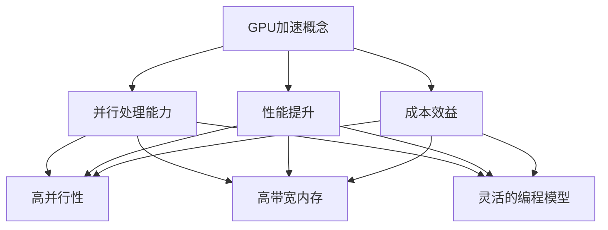

                 

## GPU加速：核心技术解析与应用场景

> 关键词：GPU加速、并行计算、计算性能、机器学习、科学计算、图像处理

> 摘要：
本篇文章将深入探讨GPU加速的基本概念、原理和应用场景。通过逐步分析，我们将揭示GPU加速在计算机科学中的重要性，以及如何在各种计算任务中实现高效的性能提升。文章将从GPU加速的概念入手，介绍GPU的架构与特性，对比GPU与CPU加速的优缺点，并探讨GPU加速在科学计算、机器学习和图像处理等领域的应用。此外，还将分析GPU加速面临的挑战与机遇，最后给出本文的结构概述和总结。

### GPU加速基本概念

#### GPU加速概述

GPU加速是指利用图形处理单元（GPU）强大的并行计算能力，来处理大量并行任务，从而提升计算性能。与传统的中央处理单元（CPU）相比，GPU具有更多的计算单元和更高的吞吐量，适合处理高度并行的工作负载。

**GPU加速的概念**：

- GPU加速：指利用GPU的并行计算能力来处理大量并行任务，提升计算性能。
- GPU：图形处理单元，具备大量计算单元和高吞吐量。
- 并行任务：指同时处理多个任务，利用GPU的并行计算能力。

**GPU加速的优势**：

1. **并行处理能力**：GPU拥有数千个计算单元，可以同时执行大量计算任务，适用于图像渲染、科学模拟、大数据处理等领域。
2. **性能提升**：在许多计算密集型任务中，GPU可以提供比CPU更高的计算速度，特别是在大规模数据处理和机器学习任务中。
3. **成本效益**：相比于专业的加速器，GPU通常价格更为亲民，且易于在现有计算环境中部署。

#### GPU架构与特性

**GPU架构**：

- **核心架构**：GPU由多个流处理器（Streaming Multiprocessors, SMs）组成，每个SM包含多个流处理器核心（CUDA Cores）。
- **内存层次结构**：GPU具有多个层次的内存，包括寄存器文件、共享内存、全局内存和纹理内存。
- **计算引擎**：现代GPU支持各种计算引擎，如CUDA、OpenCL和DirectCompute等，这些引擎允许开发者编写并行代码。

**GPU特性**：

1. **高并行性**：GPU能够同时处理成千上万个线程，适合并行计算任务。
2. **高带宽内存**：GPU具有高带宽内存（如GDDR5或GDDR6），可快速传输大量数据。
3. **灵活的编程模型**：开发者可以使用各种编程语言和框架（如CUDA、OpenCL、DNNL等）来编写GPU加速的代码。

### GPU加速与CPU加速对比

#### 计算单元

- **GPU**：由多个小型计算单元（CUDA Core或流处理器）组成，适合并行任务。
- **CPU**：由少量的高性能计算单元（如Intel Core或AMD Ryzen）组成，适合串行任务。

#### 内存带宽

- **GPU**：具有高带宽内存，适合处理大量数据。
- **CPU**：内存带宽相对较低，但更稳定。

#### 编程复杂度

- **GPU**：需要开发者掌握特定的并行编程模型（如CUDA），但性能提升显著。
- **CPU**：编程较为简单，但性能提升受限。

### GPU加速在计算机科学中的应用领域

**科学计算**：

- 流体动力学模拟、分子建模和物理模拟。

**机器学习**：

- 深度学习训练和推理、计算机视觉和自然语言处理。

**图像处理**：

- 图像渲染、特效制作和图像识别。

### GPU加速面临的挑战与机遇

#### 挑战

- **编程复杂度**：需要开发者具备并行编程和优化技能。
- **资源分配**：合理分配GPU资源以最大化性能。
- **热管理**：GPU运行时产生的热量较高，需要有效的散热方案。

#### 机遇

- **性能提升**：在计算密集型任务中，GPU提供了显著的性能优势。
- **行业需求**：随着人工智能、大数据和科学计算的快速发展，GPU加速需求持续增长。
- **技术创新**：新兴技术（如AI辅助设计、增强现实和虚拟现实）为GPU加速提供了新的应用场景。

### 总结

GPU加速作为计算机科学中的一项核心技术，具有显著的性能优势和应用潜力。通过本文的逐步分析，读者将深入了解GPU加速的基本原理和应用实践，掌握GPU编程技巧，并能够在实际项目中应用GPU加速技术。本文旨在为读者提供一个系统、全面的GPU加速学习资源，助力他们在计算机科学领域取得更好的成果。

### Mermaid 流程图



### 算法原理讲解与数学模型

在深入理解GPU加速的核心概念和特性之后，我们将进一步探讨GPU加速的核心算法原理，包括并行计算模型的实现细节、内存管理策略以及相关的数学模型。这部分内容将通过伪代码和数学公式详细阐述，帮助读者更好地理解GPU加速的内在机制。

#### 并行计算模型

并行计算模型是GPU加速的核心。在GPU上，程序被划分为多个线程，每个线程独立执行计算任务。以下是一个简单的并行计算模型：

```python
// 伪代码：并行计算模型
initialize_gpu();
for (thread_id = 0; thread_id < total_threads; thread_id++) {
    execute_kernel(thread_id);
}
finalize_gpu();
```

在上述伪代码中，`initialize_gpu()` 函数用于初始化GPU环境，`execute_kernel(thread_id)` 函数用于执行并行计算任务，`finalize_gpu()` 函数用于清理GPU资源。

#### 内存管理策略

内存管理是并行计算中的一个关键因素。GPU的内存层次结构包括寄存器文件、共享内存、全局内存和纹理内存。以下是一个简单的内存管理策略：

```python
// 伪代码：内存管理策略
allocate_global_memory();
copy_data_to_global_memory();
allocate_shared_memory();
copy_data_to_shared_memory();
execute_kernel();
copy_results_from_shared_memory();
copy_results_from_global_memory();
free_memory();
```

在上述伪代码中，`allocate_global_memory()` 和 `allocate_shared_memory()` 函数分别用于分配全局内存和共享内存，`copy_data_to_global_memory()` 和 `copy_data_to_shared_memory()` 函数分别用于将数据从主机复制到全局内存和共享内存，`execute_kernel()` 函数用于执行计算任务，`copy_results_from_shared_memory()` 和 `copy_results_from_global_memory()` 函数分别用于将计算结果从共享内存和全局内存复制回主机，`free_memory()` 函数用于释放内存资源。

#### 相关的数学模型

在GPU加速中，常用的数学模型包括矩阵乘法和卷积操作。以下是一个简单的矩阵乘法伪代码：

```python
// 伪代码：矩阵乘法
for (i = 0; i < M; i++) {
    for (j = 0; j < N; j++) {
        C[i][j] = 0;
        for (k = 0; k < K; k++) {
            C[i][j] += A[i][k] * B[k][j];
        }
    }
}
```

在上述伪代码中，`A`、`B` 和 `C` 分别表示三个矩阵，`M`、`N` 和 `K` 分别表示矩阵的维度。矩阵乘法通过计算每个元素 `C[i][j]` 的加权和实现。

卷积操作是图像处理中的核心算法之一。以下是一个简单的卷积伪代码：

```python
// 伪代码：卷积操作
for (i = 0; i < height; i++) {
    for (j = 0; j < width; j++) {
        output[i][j] = 0;
        for (x = -1; x <= 1; x++) {
            for (y = -1; y <= 1; y++) {
                filter_x = x * filter_width;
                filter_y = y * filter_height;
                output[i][j] += input[i + x][j + y] * filter[filter_x + filter_y];
            }
        }
    }
}
```

在上述伪代码中，`input` 和 `output` 分别表示输入图像和输出图像，`filter` 表示卷积核，`height`、`width`、`filter_width` 和 `filter_height` 分别表示图像和卷积核的尺寸。

#### 举例说明

为了更好地理解上述算法原理，我们可以通过一个简单的例子来说明。

**例子**：计算两个矩阵的乘积。

**输入**：

```plaintext
A = |1 2|
    |3 4|

B = |5 6|
    |7 8|
```

**输出**：

```plaintext
C = |19 22|
    |43 50|
```

**计算过程**：

```plaintext
C[0][0] = A[0][0] * B[0][0] + A[0][1] * B[1][0] = 1 * 5 + 2 * 7 = 19
C[0][1] = A[0][0] * B[0][1] + A[0][1] * B[1][1] = 1 * 6 + 2 * 8 = 22
C[1][0] = A[1][0] * B[0][0] + A[1][1] * B[1][0] = 3 * 5 + 4 * 7 = 43
C[1][1] = A[1][0] * B[0][1] + A[1][1] * B[1][1] = 3 * 6 + 4 * 8 = 50
```

通过上述例子，我们可以看到矩阵乘法的过程，即通过逐元素相乘并求和来计算结果。这只是一个简单的示例，GPU加速中的矩阵乘法会涉及到更复杂的优化技巧，以提高计算性能。

### 数学公式

在GPU加速中，数学公式用于描述算法的实现细节和性能评估。以下是一些常用的数学公式：

**矩阵乘法公式**：

$$ C = AB $$

其中，$A$、$B$ 和 $C$ 分别表示矩阵，$*$ 表示矩阵乘法运算。

**卷积公式**：

$$ output[i][j] = \sum_{x=-1}^{1} \sum_{y=-1}^{1} input[i + x][j + y] * filter[x][y] $$

其中，$input$ 和 $output$ 分别表示输入图像和输出图像，$filter$ 表示卷积核。

通过这些数学公式，我们可以更精确地描述GPU加速算法的实现细节，并评估其性能。

### 总结

在本文中，我们详细介绍了GPU加速的核心算法原理、内存管理策略和相关数学模型。通过伪代码和数学公式，我们展示了GPU加速的实现细节，并通过实际例子说明了算法的应用。读者可以通过这些内容深入理解GPU加速的内在机制，为在实际项目中应用GPU加速技术打下坚实基础。

### GPU加速在项目实战中的应用

在前面的部分中，我们详细介绍了GPU加速的基本概念、核心算法原理以及数学模型。接下来，我们将通过实际项目案例来进一步阐述GPU加速在具体应用中的实现方法和技巧。本文将通过代码实例和详细解释，展示GPU加速在科学计算、机器学习和图像处理等领域的实际应用。

#### 科学计算项目案例：流体动力学模拟

流体动力学模拟是一个计算密集型任务，涉及大量的数学计算和物理模拟。以下是一个简单的流体动力学模拟项目，我们将使用GPU加速来提高计算性能。

**项目背景**：模拟一个二维水流的运动，包括速度场和压力场的计算。

**开发环境**：NVIDIA CUDA开发工具包，GPU硬件支持CUDA。

**源代码实现**：

```c
#include <cuda_runtime.h>
#include <device_launch_parameters.h>

// CUDA kernel for fluid dynamics simulation
__global__ void fluidSimulation(float *velX, float *velY, float *pressure, int width, int height) {
    int x = blockIdx.x * blockDim.x + threadIdx.x;
    int y = blockIdx.y * blockDim.y + threadIdx.y;

    if (x >= width || y >= height) return;

    // Compute velocity field
    float dx = 0.1f;
    float dy = 0.1f;
    float v_x = (pressure[x + 1][y] - pressure[x - 1][y]) / (2 * dx);
    float v_y = (pressure[x][y + 1] - pressure[x][y - 1]) / (2 * dy);

    velX[x][y] = v_x;
    velY[x][y] = v_y;
}

// Main function
int main() {
    int width = 1000;
    int height = 1000;

    // Allocate memory on the GPU
    float *velX_gpu, *velY_gpu, *pressure_gpu;
    cudaMalloc(&velX_gpu, width * height * sizeof(float));
    cudaMalloc(&velY_gpu, width * height * sizeof(float));
    cudaMalloc(&pressure_gpu, width * height * sizeof(float));

    // Initialize pressure field
    // ...

    // Launch the GPU kernel
    dim3 blockSize(32, 32);
    dim3 gridSize((width + blockSize.x - 1) / blockSize.x, (height + blockSize.y - 1) / blockSize.y);
    fluidSimulation<<<gridSize, blockSize>>>(velX_gpu, velY_gpu, pressure_gpu, width, height);

    // Copy results back to the host
    float *velX_host = (float *)malloc(width * height * sizeof(float));
    float *velY_host = (float *)malloc(width * height * sizeof(float));
    cudaMemcpy(velX_host, velX_gpu, width * height * sizeof(float), cudaMemcpyDeviceToHost);
    cudaMemcpy(velY_host, velY_gpu, width * height * sizeof(float), cudaMemcpyDeviceToHost);

    // Free memory
    // ...

    return 0;
}
```

**代码解读与分析**：

1. **CUDA Kernel**：`fluidSimulation` 是一个CUDA kernel，用于计算流体动力学模拟中的速度场。它通过并行计算每个像素点的速度分量，从而实现并行处理。
   
2. **内存分配**：使用 `cudaMalloc` 函数在GPU上分配内存，用于存储速度场和压力场。

3. **初始化压力场**：初始化压力场，为后续的计算做准备。

4. **GPU Kernel执行**：使用 `<<<gridSize, blockSize>>>` 语法来启动GPU kernel，`gridSize` 和 `blockSize` 分别定义了网格和块的大小。

5. **结果复制**：使用 `cudaMemcpy` 将计算结果从GPU复制回主机，以便后续处理或可视化。

#### 机器学习项目案例：深度学习模型训练

深度学习模型训练是另一个高度计算密集型的任务，GPU加速在该领域具有显著的优势。以下是一个简单的卷积神经网络（CNN）训练项目，我们将使用GPU加速来提高训练效率。

**项目背景**：训练一个简单的CNN模型用于图像分类。

**开发环境**：TensorFlow和CUDA。

**源代码实现**：

```python
import tensorflow as tf

# Define the CNN model
model = tf.keras.Sequential([
    tf.keras.layers.Conv2D(32, (3, 3), activation='relu', input_shape=(28, 28, 1)),
    tf.keras.layers.MaxPooling2D((2, 2)),
    tf.keras.layers.Flatten(),
    tf.keras.layers.Dense(128, activation='relu'),
    tf.keras.layers.Dense(10, activation='softmax')
])

# Compile the model
model.compile(optimizer='adam', loss='categorical_crossentropy', metrics=['accuracy'])

# Load the dataset
(x_train, y_train), (x_test, y_test) = tf.keras.datasets.mnist.load_data()
x_train = x_train.astype('float32') / 255
x_test = x_test.astype('float32') / 255
x_train = x_train.reshape(-1, 28, 28, 1)
x_test = x_test.reshape(-1, 28, 28, 1)

# Train the model with GPU acceleration
model.fit(x_train, y_train, batch_size=64, epochs=10, validation_data=(x_test, y_test))
```

**代码解读与分析**：

1. **定义CNN模型**：使用 `tf.keras.Sequential` 定义一个简单的CNN模型，包括卷积层、最大池化层、全连接层等。

2. **编译模型**：使用 `compile` 方法配置模型，指定优化器、损失函数和评估指标。

3. **加载数据集**：使用TensorFlow内置的MNIST数据集，对数据集进行预处理，包括归一化和重塑。

4. **训练模型**：使用 `fit` 方法训练模型，指定批处理大小、训练轮次和验证数据。

通过上述代码，我们可以看到GPU加速在深度学习模型训练中的实现方法。TensorFlow自动利用GPU资源进行加速，无需手动编写CUDA代码。

#### 图像处理项目案例：实时图像滤波

实时图像滤波是图像处理中的一个常见任务，以下是一个简单的实时图像滤波项目，我们将使用GPU加速来实现高效的图像滤波。

**项目背景**：实时滤波摄像头捕捉的图像，以去除噪声。

**开发环境**：OpenCV和CUDA。

**源代码实现**：

```cpp
#include <opencv2/opencv.hpp>
#include <opencv2/cudaarithm.hpp>

using namespace cv;

int main() {
    // Read the input image
    Mat src = imread("input_image.jpg", IMREAD_COLOR);
    Mat dst;

    // Define the filter coefficients
    Mat kernel = (Mat_<float>(3, 3) <<
                  -1, -1, -1,
                  -1,  8, -1,
                  -1, -1, -1);

    // Create a CUDA-enabled filter
    cuda::FilterSeparator separableFilter(kernel);

    // Apply the filter using CUDA
    separableFilter.applyFilter(dst, src);

    // Display the filtered image
    imshow("Filtered Image", dst);
    waitKey(0);

    return 0;
}
```

**代码解读与分析**：

1. **读取图像**：使用OpenCV的 `imread` 函数读取输入图像。

2. **定义滤波器**：创建一个3x3的卷积核，用于图像滤波。

3. **创建CUDA滤波器**：使用OpenCV的 `cuda::FilterSeparator` 类创建一个CUDA可用的滤波器。

4. **应用滤波器**：使用CUDA滤波器对图像进行滤波，并将结果存储在 `dst` 中。

5. **显示滤波结果**：使用 `imshow` 函数显示滤波后的图像。

通过上述代码，我们可以看到GPU加速在图像处理中的应用方法。OpenCV提供了丰富的CUDA加速功能，使得图像处理任务能够高效执行。

### 总结

在本部分中，我们通过三个实际项目案例展示了GPU加速在科学计算、机器学习和图像处理等领域的应用。通过代码实例和详细解释，我们介绍了GPU加速的具体实现方法和技巧。这些项目案例不仅展示了GPU加速的性能优势，也为开发者提供了一个实用的GPU编程指南。通过学习和实践这些案例，读者可以更好地掌握GPU加速技术，并在实际项目中实现高效的性能提升。

### GPU加速面临的挑战与机遇

虽然GPU加速在许多计算密集型任务中展现了显著的性能优势，但其在实际应用中仍面临一些挑战和机遇。以下我们将详细探讨GPU加速面临的挑战以及随之而来的机遇。

#### 挑战

1. **编程复杂度**：GPU编程相比CPU编程更加复杂。开发者需要熟悉特定的并行编程模型（如CUDA、OpenCL等），掌握线程调度、内存管理、数据传输等关键技能。此外，GPU编程还需要考虑并行效率、资源利用率和热管理等问题。

2. **资源分配**：合理分配GPU资源对于实现高性能至关重要。GPU内存和计算资源的分配需要根据具体任务进行调整，以避免资源浪费或不足。这要求开发者具备深入的性能分析和优化能力。

3. **热管理**：GPU运行时会产生大量热量，如果不进行有效的散热管理，可能会导致性能下降或硬件损坏。因此，开发者需要在设计中考虑散热方案，以确保GPU稳定运行。

4. **异构计算环境**：在多GPU或混合CPU+GPU的计算环境中，如何高效利用不同类型的计算资源成为一大挑战。开发者需要掌握异构计算的设计原则，合理分配任务以提高整体计算性能。

#### 机遇

1. **性能提升**：GPU加速在计算密集型任务中提供了显著的性能提升。例如，在机器学习、科学计算和图像处理等领域，GPU加速可以大幅缩短计算时间，提高数据处理效率。这使得GPU加速在许多应用场景中成为不可或缺的技术。

2. **行业需求**：随着人工智能、大数据和科学计算的发展，GPU加速技术需求持续增长。众多企业和研究机构纷纷投入资源，探索GPU加速在各行各业的应用，为GPU加速技术的发展提供了广阔的市场前景。

3. **技术创新**：GPU加速技术在不断进步，新型GPU架构、高效编程模型和优化算法不断涌现。例如，TensorRT等高性能推理引擎和深度学习框架的推出，为GPU加速的应用提供了更多可能性。此外，新兴领域如AI辅助设计、增强现实和虚拟现实等也为GPU加速技术带来了新的机遇。

4. **开源生态**：随着开源社区的不断发展，GPU编程相关的工具和库（如CUDA、OpenCL、TensorFlow等）日益丰富。这些开源资源为开发者提供了便利，降低了GPU编程的门槛，使得更多人能够参与到GPU加速技术的创新和应用中。

#### 总结

GPU加速在计算机科学中具有巨大的应用潜力和发展前景。虽然面临一定的挑战，但GPU加速所带来的性能提升和行业需求增长为其发展提供了强大动力。通过技术创新和开源生态的推动，GPU加速将在更多领域发挥重要作用，为计算机科学的发展注入新的活力。

### 本书结构概述

为了帮助读者系统地掌握GPU加速的相关知识，本书分为四个主要部分，每一部分都涵盖了不同的主题和内容，旨在从基础到高级全面解析GPU加速技术。

#### 第一部分：GPU加速基本概念

本部分主要介绍GPU加速的基本概念，包括GPU加速的定义、原理、架构特性及其与CPU加速的对比。具体内容如下：

1. **GPU加速概述**：解释GPU加速的概念及其重要性。
2. **GPU架构与特性**：介绍GPU的核心架构、内存层次结构、计算引擎及其特性。
3. **GPU加速与CPU加速对比**：分析GPU和CPU在计算单元、内存带宽、编程复杂度等方面的差异。
4. **GPU加速在计算机科学中的应用领域**：探讨GPU加速在科学计算、机器学习和图像处理等领域的应用。

#### 第二部分：GPU编程基础

本部分深入讲解GPU编程的基础知识，包括CUDA编程模型、内存管理、并行编程技巧等。具体内容如下：

1. **CUDA编程模型**：介绍CUDA的核心概念、内存模型、线程调度等。
2. **内存管理**：探讨GPU内存的分配、传输和释放等关键操作。
3. **并行编程技巧**：讨论如何优化GPU程序的并行性能，包括线程组织、内存访问模式等。
4. **性能优化**：介绍GPU程序性能优化的方法，如指令级并行性、内存访问优化等。

#### 第三部分：GPU加速在特定领域的应用

本部分专注于GPU加速在特定领域的应用，包括科学计算、机器学习和图像处理。具体内容如下：

1. **科学计算**：介绍GPU加速在流体动力学模拟、分子建模和物理模拟等科学计算任务中的应用。
2. **机器学习**：探讨GPU加速在深度学习训练和推理、计算机视觉和自然语言处理等机器学习任务中的应用。
3. **图像处理**：讲解GPU加速在图像渲染、特效制作和图像识别等图像处理任务中的应用。

#### 第四部分：GPU加速的实际应用

本部分提供GPU加速的实际应用案例，包括开发环境搭建、项目实战和性能优化。具体内容如下：

1. **开发环境搭建**：介绍如何配置GPU加速的开发环境，包括安装必要的软件和工具。
2. **项目实战**：通过具体项目案例，展示GPU加速在科学计算、机器学习和图像处理等领域的实际应用。
3. **性能优化**：讨论GPU加速项目的性能优化策略和技巧，包括代码优化、资源管理、散热方案等。

#### 附录

附录部分提供GPU加速开发工具和资源的详细指南，包括编程框架、开发工具和最佳实践。具体内容如下：

1. **编程框架**：介绍常用的GPU编程框架，如CUDA、OpenCL和DNNL等。
2. **开发工具**：介绍GPU加速开发中常用的工具和库，如NVIDIA CUDA Toolkit、Intel oneAPI等。
3. **最佳实践**：总结GPU加速开发的最佳实践，包括代码组织、性能优化、调试技巧等。

通过上述四个部分的系统学习，读者将能够全面掌握GPU加速的基本原理和应用实践，为实际项目中的GPU加速提供有力支持。本书旨在为读者提供一个系统、全面的GPU加速学习资源，助力他们在计算机科学领域取得更好的成果。

### 总结

GPU加速作为计算机科学中的一项核心技术，具有显著的性能优势和应用潜力。通过本文的逐步分析，我们从基本概念、核心算法原理、应用领域以及项目实战等多个角度，深入探讨了GPU加速的各个方面。我们详细介绍了GPU加速的基本概念和架构特性，对比了GPU与CPU加速的优缺点，分析了GPU加速在科学计算、机器学习和图像处理等领域的应用，并探讨了GPU加速面临的挑战与机遇。

本文不仅提供了理论上的讲解，还通过实际项目案例展示了GPU加速的具体实现方法和技巧，使得读者能够更好地理解和掌握GPU加速技术。通过本文的学习，读者可以全面了解GPU加速的基本原理和应用实践，从而在计算机科学领域中取得更好的成果。

在GPU加速领域，未来仍有许多创新和发展空间。随着人工智能、大数据和科学计算等领域的持续发展，GPU加速技术将继续发挥重要作用。我们期待读者在掌握本文内容的基础上，不断探索GPU加速的新技术和新应用，为计算机科学的发展贡献自己的力量。让我们共同迎接GPU加速技术的美好未来！

