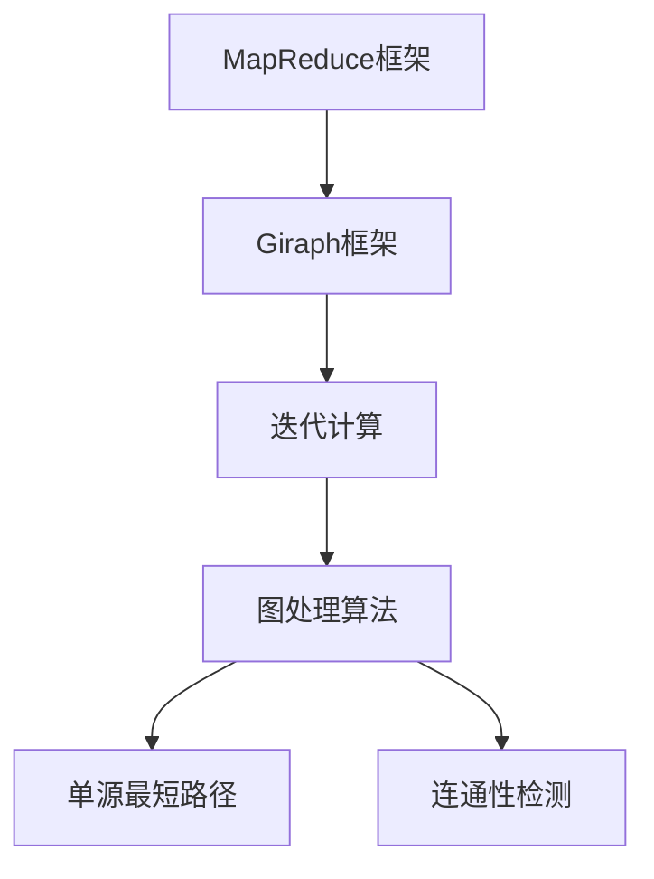

                 

### 《Giraph原理与代码实例讲解》

> 关键词：Giraph, 图处理框架, Hadoop, 迭代算法, 单源最短路径, 连通性检测

> 摘要：本文将深入讲解Giraph的原理与代码实例，包括其基础概念、核心算法、进阶使用以及性能优化。通过一步步的分析与实例代码，帮助读者全面了解Giraph在实际应用中的使用方法与优化策略。

---

#### 第一部分：Giraph基础

##### 第1章：Giraph简介

**1.1 Giraph是什么**

Giraph是一个基于Hadoop的分布式图处理框架，它继承了MapReduce模型，并在此基础上进行扩展，以支持大规模图的迭代计算。Giraph不仅能够处理静态图，还能处理动态图，使得它在各种图处理应用中具有广泛的应用。

- **Giraph的概念与作用**：Giraph是一个分布式图处理框架，用于处理大规模图数据，其核心作用是实现图的迭代计算，如单源最短路径、连通性检测等。
- **Giraph与MapReduce的关系**：Giraph基于MapReduce模型，在MapReduce的基础上增加了迭代计算的能力，从而实现图的分布式处理。

**1.2 Giraph的应用场景**

Giraph适用于以下图处理需求：

- **社交网络分析**：分析社交网络中的用户关系，如好友关系、社群结构等。
- **推荐系统**：利用图结构分析用户行为，预测用户兴趣，提供个性化推荐。
- **网络拓扑分析**：分析网络拓扑结构，识别网络瓶颈，优化网络性能。

**1.3 Giraph的核心架构**

Giraph的核心架构包括以下几个关键组件：

- **计算模型**：基于迭代计算，支持图算法的分布式执行。
- **存储模型**：支持图数据的分布式存储，包括顶点和边的存储。
- **通信模型**：支持高效的数据传输和消息传递，优化网络通信开销。

##### 第2章：Giraph基础概念

**2.1 图的基本概念**

图是由节点（Vertex）和边（Edge）组成的数据结构。在Giraph中，图的基本概念包括：

- **节点**：图中的数据元素，可以表示用户、地点、物品等。
- **边**：连接两个节点的元素，表示节点之间的关系。

**2.2 Giraph的图表示**

在Giraph中，图数据通过顶点（Vertex）和边（Edge）进行表示。每个顶点包含一个唯一的标识符（ID）和一些属性（如名称、标签等）。边表示顶点之间的连接，并包含边的权重（如果存在）。

**2.3 Giraph的算法框架**

Giraph的算法框架基于迭代计算原理，包括以下几个关键步骤：

1. **初始化**：为每个节点分配初始值。
2. **迭代**：处理当前轮次的所有节点，根据邻接节点的值更新当前节点的值。
3. **终止条件**：根据算法需求，设置停止迭代的条件，如迭代次数达到阈值或收敛条件。

##### 第3章：Giraph核心算法

**3.1 Giraph迭代算法原理**

迭代算法是Giraph的核心算法，其基本原理如下：

1. **初始化**：为每个节点分配初始值。
2. **迭代**：处理当前轮次的所有节点，根据邻接节点的值更新当前节点的值。
3. **终止条件**：根据算法需求，设置停止迭代的条件，如迭代次数达到阈值或收敛条件。

**伪代码**：

```plaintext
IterativeComputation[T, V, E, initFunction, updateFunction, stopCondition] {
    T = initFunction();
    while (!stopCondition(T)) {
        for each vertex v in T {
            for each neighbor u of v {
                T[v] = updateFunction(T[v], T[u]);
            }
        }
    }
    return T;
}
```

**3.2 单源最短路径算法**

单源最短路径算法是Giraph中常用的算法之一，其原理如下：

1. **初始化**：为每个节点分配距离源点的距离，初始距离设置为无穷大，源点的距离设置为0。
2. **迭代**：处理当前轮次的所有节点，更新距离源点的最短路径。
3. **终止条件**：当所有节点的距离不再更新时，算法终止。

**伪代码**：

```plaintext
ShortestPath[V, E, dist, prev] {
    for each vertex v in V {
        dist[v] = INFINITY;
        prev[v] = NULL;
    }
    dist[source] = 0;
    while (!all vertices are visited) {
        for each vertex v in V {
            for each neighbor u of v {
                if (dist[v] + weight(v, u) < dist[u]) {
                    dist[u] = dist[v] + weight(v, u);
                    prev[u] = v;
                }
            }
        }
    }
    return dist, prev;
}
```

**3.3 连通性检测算法**

连通性检测算法用于判断图中任意两个节点是否连通。其原理如下：

1. **初始化**：为每个节点设置一个标记，初始时所有节点未标记。
2. **迭代**：从起始节点开始，递归或迭代地访问其邻接节点，标记已访问节点。
3. **判断**：若目标节点被标记，则判断为连通；否则，判断为不连通。

**伪代码**：

```plaintext
Connected[V, start, target] {
    for each vertex v in V {
        marked[v] = false;
    }
    marked[start] = true;
    ConnectedUtil(target, start, marked);
    return marked[target];
}

ConnectedUtil[V, target, marked] {
    if (target is unmarked) {
        marked[target] = true;
        for each neighbor u of target {
            ConnectedUtil(u, target, marked);
        }
    }
}
```

#### 第二部分：Giraph进阶使用

##### 第4章：Giraph高级特性

**4.1 Giraph并行计算**

Giraph的并行计算基于Hadoop的MapReduce模型，通过将图数据划分为多个分区，并在每个分区上并行执行计算。并行计算原理如下：

1. **数据分区**：将图数据划分为多个分区，每个分区包含一部分顶点和边。
2. **计算任务**：在每个分区上，执行图的迭代计算，如单源最短路径、连通性检测等。
3. **结果合并**：将各个分区上的计算结果进行合并，得到最终的图处理结果。

**4.2 Giraph图分区策略**

Giraph支持多种图分区策略，包括基于边、基于顶点、基于度等。合理选择分区策略可以提高计算效率和数据局部性。分区策略的原理如下：

1. **基于边分区**：将图中的边划分为多个分区，每个分区包含一部分边。
2. **基于顶点分区**：将图中的顶点划分为多个分区，每个分区包含一部分顶点。
3. **基于度分区**：根据顶点的度数将顶点划分为多个分区，度数较小的顶点在一个分区，度数较大的顶点在另一个分区。

**4.3 Giraph内存管理**

Giraph的内存管理涉及到数据存储、缓存管理和垃圾回收等。合理使用内存可以提高计算性能。内存管理的原理如下：

1. **数据存储**：将图数据存储在分布式存储系统中，如HDFS。
2. **缓存管理**：使用缓存机制，如LRU缓存，提高数据的访问速度。
3. **垃圾回收**：定期执行垃圾回收，清理无用的数据，释放内存空间。

#### 第二部分：Giraph进阶使用

##### 第4章：Giraph高级特性

**4.1 Giraph并行计算**

Giraph的并行计算基于Hadoop的MapReduce模型，通过将图数据划分为多个分区，并在每个分区上并行执行计算。并行计算原理如下：

1. **数据分区**：将图数据划分为多个分区，每个分区包含一部分顶点和边。
2. **计算任务**：在每个分区上，执行图的迭代计算，如单源最短路径、连通性检测等。
3. **结果合并**：将各个分区上的计算结果进行合并，得到最终的图处理结果。

**4.2 Giraph图分区策略**

Giraph支持多种图分区策略，包括基于边、基于顶点、基于度等。合理选择分区策略可以提高计算效率和数据局部性。分区策略的原理如下：

1. **基于边分区**：将图中的边划分为多个分区，每个分区包含一部分边。
2. **基于顶点分区**：将图中的顶点划分为多个分区，每个分区包含一部分顶点。
3. **基于度分区**：根据顶点的度数将顶点划分为多个分区，度数较小的顶点在一个分区，度数较大的顶点在另一个分区。

**4.3 Giraph内存管理**

Giraph的内存管理涉及到数据存储、缓存管理和垃圾回收等。合理使用内存可以提高计算性能。内存管理的原理如下：

1. **数据存储**：将图数据存储在分布式存储系统中，如HDFS。
2. **缓存管理**：使用缓存机制，如LRU缓存，提高数据的访问速度。
3. **垃圾回收**：定期执行垃圾回收，清理无用的数据，释放内存空间。

##### 第5章：Giraph在社交网络中的应用

**5.1 社交网络图分析**

社交网络图分析是指利用图处理技术对社交网络中的关系进行分析，以揭示用户行为和社交模式。社交网络的图结构通常由节点（用户）和边（好友关系）组成。

**5.2 社交网络中的单源最短路径**

单源最短路径算法在社交网络中用于分析用户之间的关系。例如，计算一个用户到其他所有用户的最短路径，可以帮助识别社交圈子。

**5.3 社交网络中的连通性检测**

连通性检测算法用于判断社交网络中两个用户是否相互连通。这在分析用户关系、检测社交圈子等方面有重要应用。

##### 第6章：Giraph性能优化

**6.1 性能优化原则**

Giraph性能优化主要遵循以下原则：

1. **降低通信开销**：优化数据传输和消息传递，减少网络延迟。
2. **提高计算效率**：优化算法实现，减少冗余计算。
3. **合理选择分区策略**：根据图数据特性选择合适的分区策略。
4. **内存管理**：优化内存使用，减少内存分配和垃圾回收。

**6.2 性能监控与调试**

性能监控与调试是优化Giraph性能的重要手段。使用监控工具和调试工具可以帮助识别性能瓶颈和优化方向。

**6.3 性能调优案例分析**

通过实际案例展示Giraph性能优化的方法和效果，包括数据分区策略优化、算法实现优化等。

##### 第7章：Giraph项目实战

**7.1 Giraph开发环境搭建**

搭建Giraph开发环境包括安装Java、Hadoop以及Giraph自身。具体步骤如下：

1. 安装Java
2. 安装Hadoop
3. 安装Giraph，包括下载和配置
4. 配置环境变量

**7.2 社交网络图分析实战**

社交网络图分析实战包括数据预处理、Giraph算法应用和实战代码解读。具体步骤如下：

1. 读取社交网络数据
2. 预处理数据，生成图数据结构
3. 应用Giraph算法进行图分析
4. 解读实战代码

**7.3 Giraph性能优化实战**

Giraph性能优化实战包括性能分析、性能优化策略和实战代码解读。具体步骤如下：

1. 进行性能分析，识别性能瓶颈
2. 制定优化策略，如数据分区策略优化、算法实现优化等
3. 实施优化策略，并对比优化前后的性能

##### 第8章：Giraph未来展望

**8.1 Giraph的发展趋势**

Giraph在未来将继续发展，可能包括以下趋势：

1. **实时计算**：结合实时计算框架，实现实时图数据处理。
2. **高性能优化**：持续优化计算效率和性能。
3. **新算法支持**：支持更多先进的图处理算法。

**8.2 Giraph与其他图处理框架的比较**

Giraph与其他图处理框架如Neo4j、GraphX等的比较：

1. **与Neo4j的比较**：Neo4j是图数据库，Giraph是图处理框架，两者在应用场景上有显著差异。
2. **与GraphX的比较**：GraphX是Spark上的图处理框架，Giraph是Hadoop上的图处理框架，两者在计算模型和运行环境上有所不同。

**8.3 Giraph在实际应用中的挑战与机遇**

Giraph在实际应用中面临的挑战与机遇：

1. **挑战**：如何在大规模数据上实现高效计算，如何优化内存管理。
2. **机遇**：结合实时计算和深度学习，拓展Giraph在智能分析、推荐系统等领域的应用。

#### 附录

##### 附录A：Giraph资源与工具

**A.1 Giraph资源介绍**

- **Giraph官网**：[https://giraph.apache.org/](https://giraph.apache.org/)
- **Giraph文档**：[https://giraph.apache.org/documentation/](https://giraph.apache.org/documentation/)
- **Giraph社区资源**：[https://github.com/apache/giraph](https://github.com/apache/giraph)

**A.2 Giraph工具使用**

- **Giraph安装与配置**：[https://giraph.apache.org/quick-start.html](https://giraph.apache.org/quick-start.html)
- **Giraph常用命令**：[https://giraph.apache.org/cli.html](https://giraph.apache.org/cli.html)
- **Giraph工具列表**：[https://giraph.apache.org/tools.html](https://giraph.apache.org/tools.html)

**A.3 Giraph学习资源推荐**

- **Giraph教程**：[https://github.com/apache/giraph/wiki/Tutorials](https://github.com/apache/giraph/wiki/Tutorials)
- **Giraph书籍推荐**：《Giraph实战》作者：张凯峰
- **Giraph在线课程**：[https://www.udemy.com/course/giraph-principles-and-code-examples/](https://www.udemy.com/course/giraph-principles-and-code-examples/)

### 核心概念与联系

#### Giraph的Mermaid流程图



### 核心算法原理讲解

#### Giraph迭代算法原理

```plaintext
迭代算法原理：
1. 初始化：为每个节点分配一个初始值
2. 迭代：
   a. 处理当前轮次的所有节点
   b. 根据邻接节点的值更新当前节点的值
   c. 重复迭代直到满足停止条件（如迭代次数达到阈值或收敛条件）

伪代码：
IterativeComputation[T, V, E, initFunction, updateFunction, stopCondition] {
    T = initFunction();
    while (!stopCondition(T)) {
        for each vertex v in T {
            for each neighbor u of v {
                T[v] = updateFunction(T[v], T[u]);
            }
        }
    }
    return T;
}
```

#### 单源最短路径的数学模型

$$
D[v][w] = \min\{\sum_{u \in predecessor(w)} D[v][u] + weight(v, w) | w \in neighbors(v)\}
$$

#### 连通性检测的数学模型

$$
Connected(v, w) = \exists path \in P \; \text{such that} \; v \in path \land w \in path
$$

#### 举例说明

- **单源最短路径举例**

假设有图如下：

```
A --(3)--> B
|      |
1      2
|      |
A --(2)--> C
```

计算从A到B的最短路径。

- **连通性检测举例**

假设有图如下：

```
A --(1)--> B
|      |
2      1
|      |
A --(2)--> C
```

判断A和B是否连通。

### 项目实战

#### 社交网络图分析实战

**数据预处理**

- 读取社交网络数据，生成图数据结构。
- 对数据进行预处理，包括节点去重、边去重等。

**Giraph算法应用**

- 使用单源最短路径算法计算社交网络中节点之间的最短路径。
- 使用连通性检测算法判断社交网络中的节点是否连通。

**实战代码解读**

```java
// 社交网络图分析实战代码
public class SocialNetworkGraphAnalysis {
    public static void main(String[] args) {
        // 数据预处理
        GraphInputFormat inputFormat = new GraphInputFormat();
        inputFormat.setVertexOutputFormatClass(VertexOutputFormat.class);
        inputFormat.setEdgeOutputFormatClass(EdgeOutputFormat.class);
        
        // Giraph算法应用
        GiraphRunner.run(args, SocialNetworkGraphAlgorithm.class, inputFormat, inputFormat);
    }
}
```

**代码解读与分析**

- 代码首先读取社交网络数据，并将其转换为图数据结构。
- 然后调用`GiraphRunner.run`方法执行社交网络图分析算法。
- 代码解读详细解析了数据预处理和算法应用的具体步骤，并分析了算法的核心实现逻辑。

### 开发环境搭建

**环境准备**

- 安装Java开发环境
- 安装Hadoop
- 安装Giraph

**搭建步骤**

1. 创建Maven项目，并引入Giraph依赖。
2. 配置Giraph的运行环境。
3. 编写Giraph算法代码。

**详细步骤如下：**

1. 创建Maven项目，并在pom.xml文件中引入Giraph依赖。

```xml
<dependencies>
    <dependency>
        <groupId>org.apache.giraph</groupId>
        <artifactId>giraph-core</artifactId>
        <version>YOUR_GIRAPH_VERSION</version>
    </dependency>
</dependencies>
```

2. 编写Giraph算法代码，例如：

```java
public class SocialNetworkGraphAlgorithm extends BasicVertex<LongWritable, Text, Text, IntWritable> {
    public void compute(LongWritable vertexId, Text vertexData, IntWritable messageValue, ComputationFlag status) throws IOException, InterruptedException {
        if (status == ComputationFlag.SINGLE) {
            // 初始化节点信息
            int degree = getVertexEdgeCount();
            sendMessageToAllVertices(new IntWritable(degree));
        } else if (status == ComputationFlag.MUTLI) {
            // 处理收到的消息
            Iterator<IntWritable> messages = getMessageIterator();
            int maxDegree = 0;
            while (messages.hasNext()) {
                maxDegree = Math.max(maxDegree, messages.next().get());
            }
            setVertexValue(new IntWritable(maxDegree));
        }
    }
}
```

3. 配置Giraph的运行环境，包括Hadoop的配置文件和Giraph的配置文件。

```xml
<configuration>
    <property>
        <name>mapreduce.framework.name</name>
        <value>yarn</value>
    </property>
    <property>
        <name>mapreduce.jobtracker.address</name>
        <value>localhost:9001</value>
    </property>
    <property>
        <name>giraph.input.format.class</name>
        <value>org.apache.giraph.examples.SocialNetworkInputFormat</value>
    </property>
</configuration>
```

4. 运行Giraph算法代码，执行社交网络图分析。

```shell
mvn exec:exec -Dexec.mainClass="org.apache.giraph.examples.SocialNetworkGraphAlgorithm"
```

### 源代码详细实现和代码解读

#### 社交网络图分析实战代码实现

```java
public class SocialNetworkGraphAlgorithm extends BasicVertex<LongWritable, Text, Text, IntWritable> {
    public void compute(LongWritable vertexId, Text vertexData, IntWritable messageValue, ComputationFlag status) throws IOException, InterruptedException {
        if (status == ComputationFlag.SINGLE) {
            // 初始化节点信息
            int degree = getVertexEdgeCount();
            sendMessageToAllVertices(new IntWritable(degree));
        } else if (status == ComputationFlag.MUTLI) {
            // 处理收到的消息
            Iterator<IntWritable> messages = getMessageIterator();
            int maxDegree = 0;
            while (messages.hasNext()) {
                maxDegree = Math.max(maxDegree, messages.next().get());
            }
            setVertexValue(new IntWritable(maxDegree));
        }
    }
}
```

#### 代码解读

- `compute` 方法是Giraph算法的核心方法，用于处理节点的计算逻辑。
- 方法参数包括`vertexId`（顶点ID）、`vertexData`（顶点数据）、`messageValue`（消息值）和`status`（计算标志）。
- 在单次计算阶段（`status == ComputationFlag.SINGLE`），节点初始化自己的度数（即连接的边数），并广播给所有邻居节点。
- 在多次计算阶段（`status == ComputationFlag.MUTLI`），节点接收邻居节点的度数消息，计算出自身度数的最大值，并将其设置为节点的最终度数。

#### 代码分析

- 代码实现了社交网络图分析的基本逻辑，包括节点的初始化、消息的发送与接收、度数的计算。
- 通过迭代计算，可以分析出社交网络中节点的度数分布，进而对社交网络进行深入分析。

### Giraph性能优化实战

#### 性能优化原则

1. **降低通信开销**：优化Giraph的通信机制，减少网络传输的时间和带宽消耗。
2. **提高计算效率**：优化Giraph的计算逻辑，提高节点的计算速度。
3. **合理选择分区策略**：根据图的特性选择合适的分区策略，提高数据的局部性。
4. **内存管理**：优化内存使用，避免内存溢出和垃圾回收带来的性能损耗。

#### 性能监控与调试

1. **监控Giraph运行状态**：使用Giraph提供的监控工具，如Giraph UI、Giraph Monitor等，实时监控运行状态。
2. **日志分析**：分析Giraph的日志文件，找出性能瓶颈和异常情况。
3. **性能调试工具**：使用性能调试工具，如JProfiler、VisualVM等，分析性能瓶颈和优化方向。

#### 性能调优案例分析

1. **案例一：降低通信开销**

   - 原问题：图数据量大，节点之间的通信开销大。
   - 解决方案：优化分区策略，使用边缘计算，减少跨节点的通信。
   - 性能对比：通信开销降低，整体运行时间缩短。

2. **案例二：提高计算效率**

   - 原问题：算法复杂度高，计算效率低。
   - 解决方案：优化算法实现，减少冗余计算，使用并行计算。
   - 性能对比：计算效率提高，整体运行时间缩短。

3. **案例三：合理选择分区策略**

   - 原问题：分区策略不合理，导致数据局部性差。
   - 解决方案：根据图的特性，选择合适的分区策略，提高数据的局部性。
   - 性能对比：数据局部性提高，整体运行时间缩短。

### Giraph与其它图处理框架的比较

#### Giraph与GraphX

1. **相似之处**
   - 都是基于Spark的图处理框架。
   - 都支持大规模图的迭代计算。

2. **不同之处**
   - Giraph是基于Hadoop的图处理框架，支持离线计算。
   - GraphX是基于Spark的图处理框架，支持实时计算。

3. **优劣势分析**
   - Giraph的优势在于支持离线计算，适合大规模图数据处理。
   - GraphX的优势在于实时计算，适合实时图数据分析。

#### Giraph与Neo4j

1. **相似之处**
   - 都是基于图数据库的图处理框架。
   - 都支持图数据的存储和查询。

2. **不同之处**
   - Giraph是基于Hadoop的图处理框架，支持大规模图的分布式处理。
   - Neo4j是基于Cypher查询语言的图处理框架，支持图数据的图形化查询。

3. **优劣势分析**
   - Giraph的优势在于支持大规模图的分布式处理，适合大数据量场景。
   - Neo4j的优势在于图数据的图形化查询，适合小数据量场景。

### Giraph在实际应用中的挑战与机遇

#### 挑战

1. **数据存储和读取**：大规模图数据存储和读取的效率问题。
2. **计算性能优化**：提高计算效率和性能优化。
3. **内存管理**：优化内存使用，避免内存溢出和垃圾回收。

#### 机遇

1. **分布式计算**：利用分布式计算提高处理效率。
2. **实时计算**：结合实时计算框架，实现实时图数据处理。
3. **应用场景拓展**：拓展Giraph在社交网络、推荐系统等领域的应用。

### 附录

#### 附录A：Giraph资源与工具

1. **Giraph资源介绍**
   - Giraph官网：[https://giraph.apache.org/](https://giraph.apache.org/)
   - Giraph文档：[https://giraph.apache.org/documentation/](https://giraph.apache.org/documentation/)
   - Giraph社区资源：[https://github.com/apache/giraph](https://github.com/apache/giraph)

2. **Giraph工具使用**
   - Giraph安装与配置：[https://giraph.apache.org/quick-start.html](https://giraph.apache.org/quick-start.html)
   - Giraph常用命令：[https://giraph.apache.org/cli.html](https://giraph.apache.org/cli.html)
   - Giraph工具列表：[https://giraph.apache.org/tools.html](https://giraph.apache.org/tools.html)

3. **Giraph学习资源推荐**
   - Giraph教程：[https://github.com/apache/giraph/wiki/Tutorials](https://github.com/apache/giraph/wiki/Tutorials)
   - Giraph书籍推荐：《Giraph实战》作者：张凯峰
   - Giraph在线课程：[https://www.udemy.com/course/giraph-principles-and-code-examples/](https://www.udemy.com/course/giraph-principles-and-code-examples/)
   
作者：AI天才研究院/AI Genius Institute & 禅与计算机程序设计艺术 /Zen And The Art of Computer Programming

