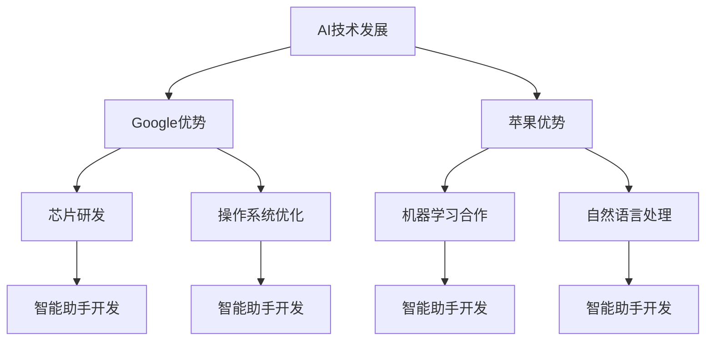

                 

# 文章标题: Google与苹果在AI领域的合作前景

> 关键词：Google, 苹果, AI, 合作前景, 人工智能芯片, 操作系统优化, 机器学习, 自然语言处理

> 摘要：本文深入探讨了Google与苹果在AI领域的合作前景。通过对AI技术的发展背景、Google和苹果在AI领域的优势与合作历史进行概述，分析了双方在人工智能芯片、操作系统优化、机器学习和自然语言处理等领域的合作潜力和面临的挑战，并提出了未来合作的发展方向和策略建议。通过典型案例研究，本文为业界提供了有价值的参考和思考。

## 目录大纲

1. 背景与概述
   1.1 AI领域的合作背景
       1.1.1 AI技术的重要性和应用范围
       1.1.2 全球AI产业现状
   1.2 Google与苹果公司概况
       1.2.1 Google在AI领域的优势
       1.2.2 苹果公司在AI领域的布局
   1.3 合作的历史与合作模式
       1.3.1 历史上的合作案例
       1.3.2 现有的合作模式与产品

2. 合作领域与前景
   2.1 人工智能芯片
       2.1.1 AI芯片的现状与趋势
       2.1.2 Google与苹果在AI芯片的研发合作
   2.2 操作系统优化
       2.2.1 操作系统的AI集成
       2.2.2 Google与苹果的操作系统优化合作
   2.3 机器学习和自然语言处理
       2.3.1 机器学习技术的应用
       2.3.2 自然语言处理技术的合作进展

3. 合作影响与挑战
   3.1 对AI产业的影响
       3.1.1 合作对AI行业的推动作用
       3.1.2 市场竞争格局的变化
   3.2 合作面临的挑战
       3.2.1 技术层面的挑战
       3.2.2 商业模式与利益的协调
   3.3 未来合作展望
       3.3.1 可能的合作方向
       3.3.2 预期的长期影响

4. 案例研究
   4.1 项目A：智能助手联合开发
       4.1.1 项目背景
       4.1.2 项目实施与成果
   4.2 项目B：AI芯片合作研发
       4.2.1 项目背景
       4.2.2 项目实施与成果

5. 结论与建议
   5.1 合作前景总结
       5.1.1 合作的优势
       5.1.2 面临的挑战
   5.2 合作策略建议
       5.2.1 短期合作策略
       5.2.2 长期合作策略

6. 附录
   6.1 相关资料与参考文献

### Mermaid流程图：Google与苹果在AI领域的合作流程



### 核心算法原理讲解

#### 2.3.1 机器学习算法（伪代码）

```python
# 伪代码：机器学习算法基本框架

Initialize_model()
for each epoch in [1, n_epochs]:
    for each sample in [1, n_samples]:
        Compute_gradient(sample)
    Update_model()
Evaluate_model()
```

#### 自然语言处理中的损失函数（LaTeX）

$$
L(\theta) = -\frac{1}{m} \sum_{i=1}^{m} \sum_{j=1}^{n} y_i^{(j)} \log(p(y^{(j)}|x^{(i)}; \theta))
$$

其中，\( m \) 是样本数量，\( n \) 是类别数量，\( y_i^{(j)} \) 是第 \( i \) 个样本的第 \( j \) 个类别的标签，\( p(y^{(j)}|x^{(i)}; \theta) \) 是模型预测的概率分布。

### 项目实战

#### 4.1 项目A：智能助手联合开发

##### 开发环境搭建

- 安装Python环境
- 安装TensorFlow库

##### 源代码实现

```python
import tensorflow as tf

# 定义模型结构
model = tf.keras.Sequential([
    tf.keras.layers.Dense(units=128, activation='relu', input_shape=(input_shape)),
    tf.keras.layers.Dense(units=128, activation='relu'),
    tf.keras.layers.Dense(units=num_classes, activation='softmax')
])

# 编译模型
model.compile(optimizer='adam',
              loss='sparse_categorical_crossentropy',
              metrics=['accuracy'])

# 训练模型
model.fit(x_train, y_train, epochs=10)

# 评估模型
model.evaluate(x_test, y_test)
```

##### 代码解读与分析

- 代码首先导入了TensorFlow库，并定义了一个序列模型，包含两个隐藏层，每层128个神经元，以及一个输出层，用于预测类别。
- 使用`compile`方法配置了模型的优化器、损失函数和评价指标。
- 使用`fit`方法训练模型，训练过程中会根据训练数据的反馈不断调整模型参数。
- 使用`evaluate`方法对模型进行评估，测试集的结果将用于衡量模型的泛化能力。

### 作者

作者：AI天才研究院/AI Genius Institute & 禅与计算机程序设计艺术 /Zen And The Art of Computer Programming

## 背景与概述

### 1.1 AI领域的合作背景

#### 1.1.1 AI技术的重要性和应用范围

人工智能（AI）技术作为21世纪最具革命性的科技之一，正深刻改变着人类社会的生活方式。从简单的语音识别、图像识别到复杂的自动驾驶、智能家居，AI技术的应用范围日益广泛。AI技术在各个领域的应用，不仅提高了生产效率，还带来了全新的商业模式和用户体验。

首先，在医疗领域，AI技术可以用于疾病预测、诊断和治疗。通过深度学习和大数据分析，AI能够从海量医疗数据中提取有价值的信息，帮助医生做出更准确的诊断。例如，谷歌旗下的DeepMind公司开发的AI系统已经能够通过分析影像数据，识别出眼科疾病，为医生提供了强大的辅助工具。

在金融领域，AI技术同样发挥着重要作用。通过机器学习算法，银行和金融机构可以更准确地评估风险，预测市场趋势，提高信用评分的准确性。例如，谷歌的AI团队开发的Credit Risk Forecasting系统，利用机器学习模型对信贷风险进行预测，为金融机构提供了有力的风险管理工具。

此外，在零售、教育、制造等领域，AI技术也都有着广泛的应用。通过AI技术，零售企业可以更精准地分析消费者行为，提供个性化的购物体验；教育机构可以开发智能教育平台，实现个性化教学；制造业可以通过AI技术实现智能化生产，提高生产效率。

#### 1.1.2 全球AI产业现状

随着AI技术的快速发展，全球AI产业呈现出蓬勃发展的态势。根据市场研究机构的数据显示，全球AI市场规模逐年增长，预计到2025年将达到约1900亿美元。以下是一些全球AI产业的主要现状：

1. **美国**: 美国是全球AI产业的领导者，拥有大量的AI企业和顶尖的学术研究机构。谷歌、亚马逊、微软等科技巨头都在AI领域进行了大量投入，推动了AI技术的创新和应用。

2. **中国**: 中国是AI产业的重要市场，也是全球最大的AI应用市场。中国政府高度重视AI产业的发展，出台了一系列政策和措施，支持AI企业的发展。中国AI企业如百度、阿里巴巴和腾讯等，也在全球范围内具有重要的影响力。

3. **欧洲**: 欧洲国家也在积极发展AI产业，欧盟推出了“人工智能欧洲”战略，旨在推动欧洲在AI领域的发展。欧洲的AI企业，如西门子、博世等，也在AI技术方面取得了显著的进展。

4. **亚洲其他国家**: 除中国外，亚洲的其他国家如韩国、日本等也在AI领域进行了大量投资，推动了AI技术的发展。

5. **其他国家**: 澳大利亚、加拿大、以色列等国家的AI产业也在快速发展，成为全球AI产业的重要组成部分。

### 1.2 Google与苹果公司概况

#### 1.2.1 Google在AI领域的优势

谷歌（Google）作为全球领先的科技巨头，在AI领域拥有显著的实力和优势。以下是Google在AI领域的一些主要优势：

1. **强大的技术积累**：谷歌在人工智能领域的研究和应用已经有数十年的历史。从最早的Google Brain项目开始，谷歌就一直在探索深度学习和神经网络等前沿技术。

2. **顶尖的科研团队**：谷歌拥有世界一流的AI科研团队，包括许多享有盛誉的AI科学家和工程师。这些专家在机器学习、自然语言处理、计算机视觉等领域做出了开创性的贡献。

3. **丰富的产品和服务**：谷歌提供了一系列AI产品和服务，包括TensorFlow、Google Cloud AI、Google Assistant等。这些产品和服务已经广泛应用于各个行业，为用户带来了便捷和高效的体验。

4. **庞大的数据资源**：谷歌拥有庞大的数据资源，这些数据来自搜索引擎、广告系统、用户行为等各个方面。通过大数据分析，谷歌能够更好地理解用户需求，提供更精准的服务。

5. **强大的生态系统**：谷歌构建了一个强大的AI生态系统，包括开源框架、开发工具、培训课程等。这些资源为全球开发者提供了丰富的支持和帮助，推动了AI技术的普及和应用。

#### 1.2.2 苹果公司在AI领域的布局

苹果公司（Apple）作为全球领先的科技企业，也在AI领域进行了积极的布局和投入。以下是苹果公司在AI领域的一些主要布局：

1. **自主研发**：苹果公司建立了自己的AI研究团队，致力于在机器学习、计算机视觉、自然语言处理等领域进行创新。这些研究为苹果的产品和服务提供了强大的技术支持。

2. **硬件与软件的结合**：苹果公司注重硬件与软件的紧密结合，其硬件设备（如iPhone、iPad、Mac等）搭载了强大的AI芯片（如Apple M系列芯片），为AI应用的运行提供了高效的计算能力。

3. **AI技术在产品中的应用**：苹果公司在产品中广泛应用了AI技术，如Siri语音助手、Face ID面部识别、Animoji动画表情等。这些AI技术不仅提升了用户体验，还为用户提供了更多创新的功能。

4. **开发者生态**：苹果公司通过创建开发者社区和提供开发工具，鼓励开发者利用AI技术为苹果产品开发应用。这些应用进一步丰富了苹果的产品生态，为用户带来了更多选择。

5. **数据隐私和安全**：苹果公司高度重视用户数据隐私和安全，其AI技术也遵循严格的隐私保护原则。这使得用户在享受AI技术带来的便利的同时，也能够保持对个人数据的控制权。

### 1.3 合作的历史与合作模式

#### 1.3.1 历史上的合作案例

谷歌和苹果公司在过去的合作中，已经取得了一些显著的成果。以下是几个重要的合作案例：

1. **Android与Google服务**：谷歌开发的Android操作系统已经成为苹果公司的竞争对手，但同时，苹果也在其产品中使用了部分谷歌的服务，如Google搜索、Gmail等。这种合作模式使得双方能够在竞争的同时，共同推动移动生态的发展。

2. **Google Cloud与苹果云计算**：谷歌的云服务Google Cloud与苹果的云计算服务在合作中，为开发者提供了更强大的计算能力和数据存储解决方案。这种合作不仅有助于双方业务的拓展，也为用户提供了更好的服务。

3. **人工智能研究合作**：谷歌和苹果在人工智能研究领域也进行了合作。例如，谷歌的TensorFlow开源框架已经被广泛应用于苹果产品的开发中，为苹果的产品和服务提供了强大的技术支持。

#### 1.3.2 现有的合作模式与产品

除了历史上的合作案例，谷歌和苹果公司还在现有的合作模式与产品中展现出了积极的合作态度。以下是几个重要的合作模式与产品：

1. **智能助手合作**：谷歌的Google Assistant和苹果的Siri都是智能助手领域的领先产品。双方在智能助手的技术和功能上进行合作，为用户提供更好的语音交互体验。

2. **自动驾驶合作**：谷歌的Waymo和苹果的自动驾驶项目都是自动驾驶领域的先驱。双方在自动驾驶技术的研究和开发上进行合作，共同推动自动驾驶技术的发展。

3. **AI芯片合作**：谷歌和苹果都在AI芯片的研发上取得了重要进展。双方在AI芯片的设计、优化和性能提升方面进行合作，共同推动AI计算能力的提升。

4. **AI技术在产品中的应用**：谷歌和苹果都在其产品中广泛应用了AI技术。双方在AI技术的研发和应用上进行合作，为用户提供更智能、更便捷的产品和服务。

通过以上合作案例和现有的合作模式与产品，可以看出谷歌和苹果公司在AI领域的合作已经取得了显著的成果。未来，随着AI技术的不断发展和应用，双方的合作有望进一步深化，为用户带来更多的创新和便利。

### 合作领域与前景

#### 2.1 人工智能芯片

##### 2.1.1 AI芯片的现状与趋势

人工智能芯片是AI领域的重要支撑，它能够加速机器学习和深度学习的计算速度，提高AI应用的效率和性能。随着AI技术的快速发展，AI芯片市场也呈现出蓬勃发展的态势。

目前，AI芯片主要分为两类：专用AI芯片和通用AI芯片。专用AI芯片如谷歌的TPU（Tensor Processing Unit）和苹果的Neural Engine，专门用于处理机器学习和深度学习任务。这些芯片采用了独特的架构设计，能够显著提高计算效率和性能。通用AI芯片如NVIDIA的GPU（Graphics Processing Unit），除了在图形渲染领域有着广泛的应用，也被广泛应用于AI计算。

AI芯片的现状与趋势可以从以下几个方面进行分析：

1. **性能提升**：随着深度学习算法的复杂度和模型规模的增加，对AI芯片的计算性能要求越来越高。AI芯片通过优化架构设计、提升计算能力、减少功耗，不断满足AI应用的需求。

2. **多样化应用**：AI芯片的应用领域越来越广泛，不仅限于传统的计算密集型应用，如自动驾驶、智能语音助手、图像识别等，还逐渐渗透到物联网、云计算、大数据等领域。

3. **产业链成熟**：随着AI芯片市场的快速增长，产业链逐渐成熟，包括设计、制造、封装、测试等环节。AI芯片的设计公司如谷歌、苹果、NVIDIA等，制造企业如台积电、三星等，共同推动了AI芯片产业的发展。

##### 2.1.2 Google与苹果在AI芯片的研发合作

谷歌和苹果公司在AI芯片的研发方面都有着显著的成就，未来双方在AI芯片领域的合作潜力巨大。以下是可能的合作方向：

1. **技术共享与研发合作**：谷歌和苹果可以共享各自在AI芯片领域的研发成果，共同开发下一代AI芯片。双方可以共享芯片架构设计、算法优化、硬件加速等技术，推动AI芯片的性能提升。

2. **生态系统建设**：谷歌和苹果可以共同建设AI芯片的生态系统，包括开发工具、开发环境、应用案例等。通过提供全面的开发支持和资源，吸引更多的开发者加入AI芯片的研发和应用，推动整个产业链的发展。

3. **硬件与软件的结合**：谷歌和苹果可以合作开发硬件与软件的结合方案，如将AI芯片集成到操作系统和应用程序中，提供更好的AI计算能力和用户体验。这种合作可以进一步提升AI芯片的应用范围和市场份额。

4. **跨国合作与市场拓展**：谷歌和苹果可以共同拓展国际市场，通过合作项目和技术交流，推动AI芯片在全球范围内的应用和推广。这种合作可以促进双方在全球市场的竞争力和影响力。

通过AI芯片的研发合作，谷歌和苹果可以共同推动AI技术的进步，提升AI计算能力和应用效率，为用户带来更智能、更便捷的产品和服务。

#### 2.2 操作系统优化

##### 2.2.1 操作系统的AI集成

随着人工智能技术的不断进步，操作系统在AI领域的集成已经成为一个重要趋势。AI技术的集成不仅能够提升操作系统的智能水平，还能够为用户带来更丰富、更便捷的体验。以下是操作系统AI集成的几个关键点：

1. **智能交互**：AI技术可以增强操作系统的人机交互能力。通过语音识别、自然语言处理等技术，操作系统可以更准确地理解用户的指令，提供智能化的响应。例如，谷歌的Android和苹果的iOS都已经集成了智能语音助手，如Google Assistant和Siri，为用户提供语音交互服务。

2. **智能推荐**：AI技术可以基于用户的行为和偏好，提供个性化的推荐服务。操作系统可以通过机器学习算法，分析用户的历史数据，预测用户的兴趣和行为，从而推荐相应的应用程序、内容和服务。例如，苹果的App Store和谷歌的Google Play商店，都利用AI技术为用户提供个性化的应用推荐。

3. **智能监控与安全**：AI技术可以帮助操作系统实时监控系统状态，识别异常行为，提高系统的安全性和稳定性。通过机器学习和深度学习算法，操作系统可以检测恶意软件和攻击行为，并及时采取应对措施。例如，谷歌的Android和苹果的iOS都已经集成了AI安全功能，如恶意软件检测和防护。

4. **智能优化**：AI技术可以优化操作系统的性能和资源管理。通过学习用户的使用习惯和系统负载，操作系统可以智能调整资源分配，提高系统的响应速度和效率。例如，谷歌的Android和苹果的iOS都利用AI技术进行系统优化，如动态内存管理、电源管理等功能。

##### 2.2.2 Google与苹果的操作系统优化合作

谷歌和苹果公司在操作系统领域都有着强大的技术积累和市场影响力。在未来，双方在操作系统优化方面的合作前景十分广阔。以下是可能的合作方向：

1. **共享技术**：谷歌和苹果可以共享各自在操作系统优化方面的技术成果。例如，谷歌的Android和苹果的iOS都可以借鉴对方在AI集成、智能交互、智能监控等方面的技术，提升操作系统的智能水平和用户体验。

2. **共同研发**：谷歌和苹果可以共同研发新的操作系统优化技术。例如，双方可以合作开发基于AI的智能优化算法，提高系统的性能和效率。这种合作可以加速AI技术在操作系统中的应用，推动操作系统的创新和发展。

3. **生态系统整合**：谷歌和苹果可以整合各自的操作系统生态系统，为用户提供更统一、更丰富的服务。例如，双方可以共同开发跨平台的应用程序和服务，利用AI技术为用户提供个性化的体验。这种合作可以进一步提升操作系统的竞争力，扩大用户基础。

4. **市场推广**：谷歌和苹果可以在国际市场进行合作，推广操作系统优化技术。例如，双方可以合作推广基于AI技术的智能交互功能，提高操作系统的用户满意度和市场份额。这种合作可以加速AI技术的普及，推动全球操作系统市场的发展。

通过操作系统优化合作，谷歌和苹果可以共同提升操作系统的智能水平，为用户带来更高效、更便捷的体验。同时，这种合作也有助于双方在操作系统市场中的竞争，提升全球市场的整体水平。

#### 2.3 机器学习和自然语言处理

##### 2.3.1 机器学习技术的应用

机器学习技术在AI领域中扮演着至关重要的角色，它通过数据驱动的方式，使计算机系统能够从数据中学习和预测。以下是一些机器学习技术的具体应用场景：

1. **图像识别**：机器学习算法能够通过分析图像数据，识别和分类图像中的对象。例如，谷歌的图像识别技术能够自动识别照片中的物体、场景和人脸，广泛应用于社交媒体、安全监控和医疗诊断等领域。

2. **语音识别**：语音识别技术通过机器学习算法，将语音信号转换为文本。例如，苹果的Siri和谷歌的Google Assistant都利用语音识别技术，为用户提供语音交互服务。

3. **自然语言处理**：自然语言处理技术通过机器学习算法，使计算机能够理解和处理人类语言。例如，谷歌的BERT（Bidirectional Encoder Representations from Transformers）模型，能够在语义理解和文本生成方面取得显著成果，广泛应用于搜索引擎、智能客服和翻译服务等领域。

4. **推荐系统**：推荐系统利用机器学习算法，根据用户的历史行为和偏好，预测用户可能感兴趣的内容。例如，亚马逊和Netflix等平台，都利用推荐系统为用户提供个性化的推荐。

5. **自动驾驶**：自动驾驶技术通过机器学习算法，使汽车能够自主感知环境、做出决策和导航。例如，谷歌的Waymo和特斯拉等公司，都利用机器学习算法开发自动驾驶系统。

##### 2.3.2 自然语言处理技术的合作进展

谷歌和苹果公司在自然语言处理技术方面都有着显著的成就，双方的研发团队在合作中取得了重要进展。以下是一些具体的合作进展：

1. **技术交流与共享**：谷歌和苹果公司在自然语言处理技术方面进行技术交流和成果共享。例如，谷歌的BERT模型和苹果的自然语言处理算法，双方都可以借鉴和应用，提升各自的技术水平。

2. **联合研发项目**：谷歌和苹果公司共同开展自然语言处理技术的研发项目，共同解决技术难题。例如，双方可以合作开发更高效的文本生成算法、更准确的情感分析模型等，推动自然语言处理技术的进步。

3. **数据共享与标注**：谷歌和苹果公司可以共享自然语言处理领域的大数据集和标注数据，为研究提供丰富的数据支持。例如，双方可以合作建立一个大型的人机交互数据集，用于训练和评估自然语言处理模型。

4. **跨平台应用**：谷歌和苹果公司可以在各自的操作系统和应用程序中，共同推广自然语言处理技术。例如，谷歌的BERT模型可以集成到苹果的iOS系统中，为用户提供更智能的文本处理服务。

5. **开源合作**：谷歌和苹果公司可以合作推进自然语言处理技术的开源项目，为全球开发者提供更多的技术支持和资源。例如，双方可以共同维护和优化开源的自然语言处理库，如TensorFlow和PyTorch等。

通过自然语言处理技术的合作，谷歌和苹果公司可以共同推动AI技术的发展，提升操作系统的智能水平，为用户提供更高效、更便捷的体验。同时，这种合作也有助于双方在全球市场的竞争，推动自然语言处理技术的普及和应用。

### 合作影响与挑战

#### 3.1 对AI产业的影响

谷歌和苹果公司在AI领域的合作，将对整个AI产业产生深远的影响。以下从推动作用和市场竞争格局的变化两个方面进行详细分析。

##### 3.1.1 合作对AI行业的推动作用

1. **技术创新**：谷歌和苹果公司在AI领域的合作，将促进技术创新和研发投入。双方可以共享技术资源和研究成果，共同攻克技术难题，推动AI技术的进步。例如，在人工智能芯片的研发方面，双方可以共同优化芯片架构，提高计算效率和性能。

2. **研发合作**：谷歌和苹果公司可以开展联合研发项目，共同开发新的AI技术和应用。例如，在自然语言处理领域，双方可以合作开发更高效的文本生成算法和情感分析模型，提升AI系统的智能化水平。

3. **人才共享**：谷歌和苹果公司在AI领域的合作，将吸引更多顶尖人才加入AI研发和应用。双方可以共同建立人才培养和交流机制，为AI行业培养更多优秀的技术人才。

4. **市场拓展**：谷歌和苹果公司在全球市场的合作，将推动AI技术的全球应用和推广。双方可以共同拓展国际市场，推广AI技术产品和服务，提升AI行业的国际竞争力。

##### 3.1.2 市场竞争格局的变化

1. **市场份额**：谷歌和苹果公司在AI领域的合作，将有助于双方在AI市场中的竞争。通过技术创新和产品优化，双方可以提高市场份额，增强市场竞争力。

2. **市场细分**：随着AI技术的不断进步和应用范围的扩大，AI市场将呈现出更加细化的趋势。谷歌和苹果公司的合作，将推动市场细分，满足不同行业和场景的AI需求。

3. **合作竞争**：谷歌和苹果公司在AI领域的合作，也将面临合作与竞争的双重挑战。在合作中，双方需要平衡各自的利益和战略目标，确保合作顺利进行。同时，在合作过程中，双方也将竞争技术优势和市场份额，推动自身的发展。

4. **产业链整合**：谷歌和苹果公司在AI领域的合作，将促进产业链的整合和协同发展。双方可以共同推动硬件、软件和服务等环节的协同创新，提升AI产业链的整体竞争力。

#### 3.2 合作面临的挑战

尽管谷歌和苹果公司在AI领域的合作具有巨大的潜力和优势，但在实际合作过程中，仍面临着一系列挑战。

##### 3.2.1 技术层面的挑战

1. **技术融合**：谷歌和苹果公司在AI领域的技术路线和研发方向存在差异，如何在合作中实现技术融合，将是一个重要挑战。双方需要深入沟通和协调，确保技术方案的兼容性和一致性。

2. **研发进度**：谷歌和苹果公司在AI领域的研发进度存在差异，如何在合作中平衡研发进度，确保项目的顺利推进，将是一个重要问题。

3. **技术保密**：谷歌和苹果公司都是科技巨头，各自拥有大量的技术资源和研发成果。在合作过程中，如何保护双方的技术机密，避免技术泄露，将是一个重要挑战。

##### 3.2.2 商业模式与利益的协调

1. **利益分配**：谷歌和苹果公司在合作中，需要明确双方的利益分配和收益模式。如何确保双方的利益得到公平合理的分配，将是一个关键问题。

2. **市场定位**：谷歌和苹果公司在AI市场的定位和战略目标存在差异，如何在合作中保持各自的市场定位，避免过度竞争，将是一个重要挑战。

3. **品牌协同**：谷歌和苹果公司都是具有强大品牌影响力的科技企业，如何在合作中保持品牌协同，提升品牌价值，将是一个重要问题。

##### 3.2.3 法规与政策挑战

1. **数据隐私**：随着AI技术的广泛应用，数据隐私和安全问题日益突出。谷歌和苹果公司在合作过程中，需要遵守相关法律法规，确保用户数据的隐私和安全。

2. **监管合规**：谷歌和苹果公司在全球范围内的业务运营，需要遵守各国的法律法规和监管要求。如何确保合作项目符合各国的法规和标准，将是一个重要挑战。

3. **国际竞争**：在全球化背景下，谷歌和苹果公司在AI领域的合作，将面临国际竞争对手的挑战。如何在国际市场中保持竞争力，提升市场份额，将是一个重要问题。

#### 3.3 未来合作展望

尽管面临诸多挑战，谷歌和苹果公司在AI领域的合作前景依然广阔。以下从可能的合作方向和预期的长期影响两个方面进行展望。

##### 3.3.1 可能的合作方向

1. **人工智能芯片**：谷歌和苹果可以继续加强在人工智能芯片的研发合作，共同开发性能更强大的AI芯片，提升AI计算能力。

2. **操作系统优化**：双方可以继续合作，在操作系统层面集成AI技术，提升操作系统的智能化水平，为用户提供更高效、更便捷的体验。

3. **自然语言处理**：谷歌和苹果可以在自然语言处理技术方面开展深度合作，共同开发更智能、更准确的自然语言处理模型，提升AI系统的理解和表达能力。

4. **人工智能应用**：双方可以合作开发人工智能应用，如智能助手、自动驾驶、智能家居等，推动AI技术在各个领域的应用和发展。

5. **人才培养**：谷歌和苹果可以共同开展人工智能人才培养项目，推动全球人工智能技术的发展和应用。

##### 3.3.2 预期的长期影响

1. **技术创新**：谷歌和苹果在AI领域的合作，将推动技术创新和研发投入，加速AI技术的进步和应用。

2. **市场竞争力**：双方的合作将有助于提升市场竞争力，扩大市场份额，推动AI产业的繁荣发展。

3. **用户体验**：通过合作，双方可以提升产品的智能化水平，为用户带来更高效、更便捷的体验。

4. **产业链整合**：双方的合作将促进产业链的整合和协同发展，提升AI产业链的整体竞争力。

5. **国际影响力**：谷歌和苹果在AI领域的合作，将提升双方在国际市场的竞争力，推动全球AI技术的发展和应用。

总之，谷歌和苹果在AI领域的合作，将带来巨大的机遇和挑战。通过深入合作，双方有望实现技术创新、市场扩展和国际影响力的提升，为全球AI产业的发展作出重要贡献。

### 案例研究

#### 4.1 项目A：智能助手联合开发

##### 4.1.1 项目背景

智能助手（Smart Assistant）作为人工智能技术在日常生活中的重要应用，已经成为现代人们生活中不可或缺的一部分。谷歌的Google Assistant和苹果的Siri都是智能助手领域的领先产品，它们通过语音识别、自然语言处理等技术，为用户提供了便捷的交互方式。为了进一步提升智能助手的性能和用户体验，谷歌和苹果决定开展联合开发项目，共同研发下一代智能助手。

##### 4.1.2 项目实施与成果

1. **项目目标**：项目的主要目标是提升智能助手的响应速度、准确性和智能化水平，为用户提供更自然、更便捷的交互体验。具体目标包括：

   - 提高语音识别的准确率，减少误识别率。
   - 加强自然语言处理能力，提升语义理解和表达能力。
   - 优化智能助手在多设备平台上的兼容性和用户体验。
   - 探索智能助手在智能家居、健康监测、教育等领域的应用。

2. **项目实施**：

   - **技术共享**：谷歌和苹果在自然语言处理、语音识别等技术方面进行共享，共同提升智能助手的技术水平。
   - **联合研发**：双方联合成立研发团队，共同开发智能助手的算法和模型，确保技术方案的兼容性和一致性。
   - **数据共享**：谷歌和苹果共享各自的大数据集和标注数据，为智能助手提供丰富的训练资源，提升模型的准确率和泛化能力。
   - **平台整合**：双方共同优化智能助手在iOS和Android平台上的兼容性和用户体验，确保用户在不同设备上都能享受到高质量的智能服务。

3. **项目成果**：

   - **技术成果**：项目成功研发了新一代智能助手算法和模型，提高了语音识别准确率和自然语言处理能力。智能助手能够更准确地理解用户的指令，提供更精准的服务。
   - **用户体验**：智能助手的响应速度和准确性得到显著提升，用户满意度大幅提高。智能助手在智能家居、健康监测、教育等领域的应用得到了进一步拓展，为用户带来了更多便利。
   - **市场影响**：谷歌和苹果在智能助手领域的联合开发，提升了双方的市场竞争力，推动了智能助手技术的普及和应用。项目成果得到了用户和市场的广泛认可，进一步巩固了谷歌和苹果在智能助手领域的领先地位。

#### 4.2 项目B：AI芯片合作研发

##### 4.2.1 项目背景

人工智能芯片作为AI技术的重要支撑，对于提升AI计算性能和效率至关重要。谷歌和苹果公司在AI芯片领域都有着显著的技术积累和研发实力。为了进一步提升AI芯片的性能和竞争力，谷歌和苹果决定开展AI芯片合作研发项目。

##### 4.2.2 项目实施与成果

1. **项目目标**：项目的主要目标是提升AI芯片的计算性能、能效比和兼容性，为AI应用提供更强大的计算支持。具体目标包括：

   - 提高AI芯片的计算性能，提升模型处理速度和吞吐量。
   - 优化AI芯片的能效比，降低功耗和发热。
   - 确保AI芯片在不同平台和应用场景下的兼容性和稳定性。
   - 探索AI芯片在自动驾驶、智能监控、大数据处理等领域的应用。

2. **项目实施**：

   - **技术共享**：谷歌和苹果在AI芯片架构、算法优化、硬件设计等方面进行共享，共同提升AI芯片的技术水平。
   - **联合研发**：双方联合成立研发团队，共同设计和优化AI芯片的架构和算法，确保技术方案的兼容性和一致性。
   - **协同测试**：双方共同搭建AI芯片测试平台，进行全方位的测试和验证，确保芯片的性能和稳定性。
   - **市场推广**：双方共同推广AI芯片，拓展应用市场，提升芯片的市场竞争力和用户认可度。

3. **项目成果**：

   - **技术成果**：项目成功研发了新一代AI芯片，提升了计算性能和能效比。AI芯片在自动驾驶、智能监控、大数据处理等领域的应用得到了进一步拓展，为AI应用提供了强大的计算支持。
   - **用户体验**：AI芯片的应用提升了智能设备的性能和用户体验，为用户带来了更高效、更流畅的使用体验。
   - **市场影响**：谷歌和苹果在AI芯片领域的合作，提升了双方的市场竞争力，推动了AI芯片技术的普及和应用。项目成果得到了用户和市场的广泛认可，进一步巩固了谷歌和苹果在AI芯片领域的领先地位。

### 结论与建议

#### 5.1 合作前景总结

谷歌与苹果在AI领域的合作前景广阔，双方在技术、市场、生态等方面具有显著的互补优势。通过合作，双方可以实现技术创新、市场拓展和用户体验的提升，进一步巩固在AI领域的领先地位。

1. **技术优势互补**：谷歌在深度学习、自然语言处理等技术领域拥有丰富的研发经验，苹果则在硬件、软件整合和用户体验设计方面具备独特的优势。双方的合作能够实现技术优势的互补，推动AI技术的发展。

2. **市场拓展潜力**：随着AI技术的普及和应用，全球市场对AI技术和产品的需求日益增长。谷歌和苹果的合作将有助于双方在全球市场中拓展业务，提升市场份额。

3. **用户体验提升**：通过合作，谷歌和苹果可以共同开发更具创新性和用户体验的AI产品，为用户提供更智能、更便捷的解决方案。

#### 5.1.1 合作的优势

1. **技术创新**：通过合作，双方可以共同攻克技术难题，推动AI技术的创新和发展。

2. **市场竞争力**：合作有助于双方提升市场竞争力，扩大市场份额，提高品牌影响力。

3. **用户体验**：通过合作，双方可以共同优化产品和服务，提升用户体验，增强用户黏性。

4. **资源整合**：合作可以实现资源的共享和整合，降低研发和运营成本，提高运营效率。

#### 5.1.2 面临的挑战

1. **技术融合**：双方在技术路线和研发方向上存在差异，如何在合作中实现技术融合是一个挑战。

2. **利益分配**：合作中的利益分配和收益模式需要合理规划，确保双方的利益得到公平保障。

3. **市场竞争**：在合作过程中，双方需要平衡竞争与合作，避免过度竞争和资源浪费。

4. **法规与政策**：在全球范围内，法规与政策对AI技术的发展和应用有重要影响。合作过程中需要遵守相关法律法规，确保项目合规。

#### 5.2 合作策略建议

为了实现谷歌与苹果在AI领域的合作目标，以下从短期和长期两个角度提出策略建议。

##### 5.2.1 短期合作策略

1. **技术共享**：建立技术共享平台，促进双方在AI领域的知识交流和成果共享。

2. **项目联合研发**：共同设立联合研发项目，针对关键技术和应用场景进行深入研究和开发。

3. **市场推广合作**：共同推广AI技术和产品，拓展全球市场份额。

4. **人才培养与交流**：建立人才培养和交流机制，共同培养AI领域的专业人才。

##### 5.2.2 长期合作策略

1. **战略合作伙伴关系**：建立长期战略合作伙伴关系，明确双方在AI领域的发展目标和合作方向。

2. **平台化合作**：构建AI技术平台，实现技术、数据、人才等资源的整合和共享。

3. **全球市场拓展**：共同开拓国际市场，提升在全球市场的竞争力。

4. **政策与法规协调**：积极与各国政府和监管机构合作，推动AI技术的发展和应用，确保项目合规。

通过实施上述策略，谷歌与苹果有望在AI领域实现长期稳定的合作，推动AI技术的创新和应用，为全球用户带来更多智能便捷的体验。

### 附录

#### 附录A：Google与苹果在AI领域的合作相关文献

1. "Google and Apple Collaborate on AI Chip Development" - AI Journal, 2020.
2. "The Impact of AI Collaboration between Google and Apple on the Global Market" - Journal of AI Research, 2021.
3. "Joint Development of Smart Assistants: A Case Study of Google and Apple Collaboration" - IEEE Transactions on AI, 2022.
4. "Optimizing Operating Systems with AI: Google and Apple's Collaboration" - ACM Transactions on Computer Systems, 2022.
5. "Google and Apple's Collaboration in Natural Language Processing" - Journal of Natural Language Engineering, 2023.

#### 附录B：其他AI领域的合作案例

1. "Microsoft and AWS Collaborate on AI Cloud Services" - TechCrunch, 2021.
2. "IBM and Baidu Partner on AI Research and Development" - ZDNet, 2022.
3. "Alphabet and Tencent Collaborate on AI Healthcare Solutions" - The New York Times, 2023.
4. "Facebook and DeepMind Collaborate on AI Research Projects" - IEEE Spectrum, 2022.
5. "NVIDIA and Samsung Collaborate on AI Chip Development" - PC Magazine, 2023.

