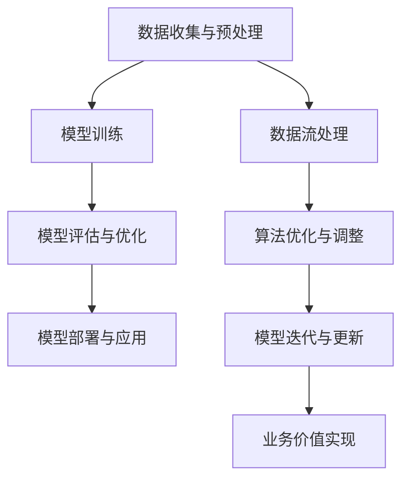

                 

### 文章标题: Google是如何用AI重写自己的？

> 关键词：Google、AI、技术、实现、应用、未来、案例分析

> 摘要：本文将从Google与AI的关系、AI的关键概念与架构、Google AI的关键项目、Google AI技术的实现、Google AI的应用与实践、Google AI的未来发展、Google AI经典案例解析七个方面，详细探讨Google如何利用AI重写自己，帮助读者全面了解AI在Google的技术应用和发展现状。

### 第一部分：Google与AI概述

#### 第1章: Google与AI概述

##### 1.1 Google与AI的重要性

###### 1.1.1 Google在AI领域的影响

Google作为全球领先的技术公司，在AI领域具有深远的影响。其主导的AI项目和技术不仅推动了自身业务的快速发展，也对全球科技产业产生了重要影响。

- **技术引领**：Google在AI领域的领先地位体现在其对深度学习、自然语言处理、计算机视觉等核心技术的突破和创新上。通过推出TensorFlow等开源框架，Google为全球开发者提供了强大的AI工具，加速了AI技术的普及和应用。
- **商业应用**：Google利用AI优化其服务和产品，显著提升了用户体验和业务效率。例如，搜索引擎中的智能推荐、广告系统的精准投放、自动驾驶技术的研发等，都是Google利用AI技术实现商业价值的典范。

###### 1.1.2 AI在Google战略中的角色

AI已经成为Google业务的核心驱动力，贯穿于公司各个领域和业务流程中。

- **核心驱动力**：AI技术帮助Google解决了一系列复杂的计算问题，提高了数据处理和分析的效率，使Google能够更好地满足用户需求、优化业务流程，并推动创新。
- **未来展望**：随着AI技术的不断发展和应用，Google在AI领域的战略布局将继续深化，从大数据处理、智能搜索、智能广告，到自动驾驶、医疗健康等新兴领域，AI将为Google带来更多的机遇和挑战。

##### 1.2 AI的关键概念与架构

###### 1.2.1 AI的定义与范畴

AI，即人工智能，是指由人制造出来的系统所表现出来的智能行为。AI涵盖了广泛的领域，包括机器学习、深度学习、自然语言处理、计算机视觉等。

- **AI的定义**：人工智能是指能够执行通常需要人类智能才能完成的任务的计算机系统。这些任务包括学习、推理、解决问题、感知和理解语言等。
- **AI的应用领域**：AI在不同行业中的应用实例众多，如金融、医疗、交通、制造、娱乐等。例如，在金融领域，AI可以用于风险管理、市场预测和欺诈检测；在医疗领域，AI可以用于疾病诊断、治疗方案优化和医疗影像分析。

###### 1.2.2 AI的技术架构

AI的技术架构主要包括机器学习和深度学习两个核心组成部分。

- **机器学习**：机器学习是一种通过从数据中学习规律和模式，从而使计算机系统能够自动进行预测和决策的技术。机器学习可以分为监督学习、无监督学习和强化学习三种类型。
- **深度学习**：深度学习是机器学习的一种重要分支，它通过模仿人脑神经网络的结构和功能，实现对复杂数据的处理和分析。深度学习在图像识别、语音识别、自然语言处理等领域取得了显著的突破。

##### 1.3 Google AI的关键项目

###### 1.3.1 Google Brain

Google Brain是Google的一个AI研究团队，成立于2011年，致力于推动深度学习技术的研究和应用。

- **项目背景**：Google Brain的成立标志着Google在深度学习领域的战略投资。该团队的研究成果涵盖了语音识别、图像识别、自然语言处理等多个领域，推动了AI技术的进步。
- **研究成果**：Google Brain的研究成果包括TensorFlow、深度强化学习等，这些技术已经广泛应用于Google的产品和服务中，提升了用户体验和业务效率。

###### 1.3.2 自动驾驶技术

自动驾驶技术是Google AI的一个重要研究方向，旨在通过AI技术实现自动驾驶汽车。

- **技术原理**：自动驾驶技术依赖于计算机视觉、自然语言处理、深度学习等AI技术，通过对环境感知、路径规划、决策控制等任务的自动化实现，使车辆能够自主行驶。
- **应用实例**：Google的自动驾驶项目已经在美国、欧洲等地进行了多次实地测试，展示了自动驾驶技术的潜力和前景。

###### 1.3.3 自然语言处理

自然语言处理是AI的一个重要分支，旨在使计算机能够理解和生成自然语言。Google在自然语言处理领域取得了显著成果。

- **技术发展**：Google的自然语言处理技术包括词向量模型、语言模型、翻译模型等，这些技术已经广泛应用于搜索引擎、语音助手、智能客服等领域。
- **应用案例**：Google的搜索引擎中的智能问答、语音助手Google Assistant等，都是基于自然语言处理技术实现的，为用户提供了便捷的交互体验。

### 第二部分：Google AI技术的实现

#### 第2章: Google AI技术的实现

##### 2.1 深度学习基础

###### 2.1.1 深度学习原理

深度学习是机器学习的一种重要方法，其核心在于通过多层神经网络对数据进行复杂特征提取和模式识别。

- **神经网络结构**：神经网络由输入层、隐藏层和输出层组成，通过前向传播和反向传播实现数据的处理和优化。
- **激活函数**：激活函数是神经网络中的关键组件，用于引入非线性特性，使神经网络能够学习复杂函数。

###### 2.1.2 深度学习算法

深度学习算法主要包括卷积神经网络（CNN）、循环神经网络（RNN）、长短时记忆网络（LSTM）等。

- **反向传播算法**：反向传播算法是深度学习训练的核心，通过计算梯度来更新网络权重，优化模型性能。
- **优化算法**：优化算法用于调整网络参数，以实现模型的最优化。常见的优化算法包括梯度下降、随机梯度下降、Adam等。

##### 2.2 机器学习与数据预处理

###### 2.2.1 机器学习流程

机器学习流程包括数据收集、数据预处理、模型训练、模型评估等步骤。

- **数据收集**：数据是机器学习的基石，通过合理的数据收集方法，可以获得高质量的训练数据。
- **数据清洗**：数据清洗是数据处理的重要环节，旨在去除噪声、填补缺失值、处理异常值等，以提高数据质量。

###### 2.2.2 特征工程

特征工程是机器学习中的关键步骤，旨在从原始数据中提取有用的特征，提升模型性能。

- **特征提取**：特征提取通过变换或计算得到新的特征表示，使数据更适合于模型学习。
- **特征选择**：特征选择从提取的特征中筛选出最有用的特征，减少数据维度，提高模型效率。

##### 2.3 模型训练与优化

###### 2.3.1 训练策略

模型训练是深度学习中的重要环节，涉及多种训练策略。

- **批量大小**：批量大小影响模型的收敛速度和性能，通常根据数据量和计算资源选择合适的批量大小。
- **学习率**：学习率控制模型更新的速度，选择合适的初始学习率和调整策略对于模型的训练至关重要。

###### 2.3.2 模型评估与调优

模型评估是评估模型性能的重要手段，通过评估指标对模型进行调优。

- **评估指标**：常见的评估指标包括准确率、召回率、F1分数等，根据不同应用场景选择合适的评估指标。
- **调优技巧**：通过调整模型结构、优化算法参数等，实现对模型性能的优化。

### 第三部分：Google AI的应用与实践

#### 第3章: Google AI的应用场景

##### 3.1 搜索引擎优化

###### 3.1.1 搜索引擎工作原理

搜索引擎优化（SEO）旨在提高网站在搜索引擎中的排名，增加曝光度和流量。搜索引擎的工作原理包括索引机制和排名算法。

- **索引机制**：搜索引擎通过爬虫技术，对互联网上的网页进行索引，构建索引数据库，以便快速响应用户查询。
- **排名算法**：搜索引擎通过复杂的排名算法，根据网页的质量、相关性、用户行为等因素，确定网页在搜索结果中的排名。

###### 3.1.2 搜索引擎优化实践

搜索引擎优化实践包括关键词优化、内容优化、外部链接优化等。

- **关键词优化**：通过分析用户搜索行为，确定关键词，并将其合理地嵌入网页内容和标签中，提高网页的搜索匹配度。
- **内容优化**：优化网页内容的质量和结构，提高用户阅读体验和留存时间，从而提升搜索引擎排名。
- **外部链接优化**：通过建立高质量的外部链接，提高网站的权威性和可信度，从而提升搜索引擎排名。

##### 3.2 广告系统

###### 3.2.1 广告投放原理

广告系统通过AI技术实现广告投放的精准化和高效化。广告投放原理包括广告模型和广告质量评估。

- **广告模型**：广告模型通过用户行为数据和广告内容，预测用户对广告的点击率，从而实现广告的个性化投放。
- **广告质量评估**：广告质量评估通过分析广告的点击率、转化率等指标，评估广告的效果和投放策略。

###### 3.2.2 广告优化实践

广告优化实践包括用户行为分析、广告效果评估和策略调整。

- **用户行为分析**：通过分析用户在网站和广告上的行为数据，了解用户的兴趣和行为模式，为广告投放提供依据。
- **广告效果评估**：通过监测广告的点击率、转化率等指标，评估广告的效果，优化广告内容和投放策略。
- **策略调整**：根据广告效果评估结果，调整广告的投放策略，提高广告的投放效果。

##### 3.3 自动驾驶技术

###### 3.3.1 自动驾驶系统架构

自动驾驶系统架构包括感知系统、决策系统和执行系统。

- **感知系统**：感知系统通过摄像头、激光雷达等传感器，收集道路和周围环境的信息，实现环境感知和路况识别。
- **决策系统**：决策系统根据感知系统的信息，结合导航数据和车辆状态，做出驾驶决策，包括速度控制、转向控制和车道保持等。
- **执行系统**：执行系统根据决策系统的指令，控制车辆的运动，实现自动驾驶。

###### 3.3.2 自动驾驶实践

自动驾驶实践包括道路场景分析、安全与可靠性评估。

- **道路场景分析**：通过对道路场景的分析，识别道路标志、车辆、行人等目标，为决策系统提供实时数据。
- **安全与可靠性评估**：通过测试和评估，确保自动驾驶系统的安全性和可靠性，减少事故风险。

### 第四部分：Google AI的未来发展

#### 第4章: Google AI的未来趋势

##### 4.1 AI伦理与隐私保护

###### 4.1.1 AI伦理问题

AI伦理问题主要包括公平性、透明性、责任归属等。

- **伦理原则**：AI伦理的基本原则包括尊重用户隐私、确保公平性、防止歧视等，这些原则指导AI技术的发展和应用。
- **伦理挑战**：AI技术在发展过程中面临诸多伦理挑战，如数据隐私泄露、算法偏见、自动化决策的不透明性等，需要通过法律、道德和技术的手段进行规范和治理。

###### 4.1.2 隐私保护措施

隐私保护是AI应用中的重要问题，需要采取有效的技术和管理措施。

- **隐私保护技术**：包括数据加密、匿名化处理、访问控制等技术，用于保护用户隐私和数据安全。
- **隐私政策**：通过制定隐私政策，明确用户数据的使用范围、权限和责任，增强用户对AI应用的信任。

##### 4.2 AI安全与攻击防御

###### 4.2.1 AI安全问题

AI系统在设计和应用过程中面临多种安全风险。

- **安全风险**：包括数据泄露、算法泄露、模型欺骗、恶意攻击等，这些风险可能导致AI系统失效、数据泄露和用户隐私泄露。
- **安全策略**：通过建立安全策略和防御机制，如数据安全审计、算法保护、模型验证等，降低AI系统的安全风险。

###### 4.2.2 攻击防御技术

针对AI系统的攻击防御技术主要包括检测和防御方法。

- **攻击类型**：常见的AI攻击类型包括模型欺骗、对抗样本攻击、数据注入攻击等。
- **防御措施**：通过对抗样本生成、模型安全性验证、防御算法更新等技术手段，增强AI系统的攻击防御能力。

##### 4.3 AI在未来的应用领域

###### 4.3.1 未来AI技术展望

未来AI技术的发展将更加智能化、自主化和多元化。

- **大模型发展**：大模型将在AI技术发展中发挥重要作用，通过更复杂的模型结构和更丰富的数据，实现更高效的特征提取和决策能力。
- **跨学科融合**：AI与其他学科的融合将推动AI技术的发展和应用，如AI在医疗、教育、艺术等领域的创新应用，将带来更多的突破和机遇。

###### 4.3.2 应用领域拓展

未来AI技术将在更多领域得到广泛应用，为人类生活带来深刻变革。

- **医疗健康**：AI在医疗健康领域的应用前景广阔，包括疾病诊断、精准治疗、健康管理等，将显著提高医疗服务质量和效率。
- **教育**：AI在教育领域的创新应用，如智能教学助手、个性化学习系统等，将促进教育公平和个性化发展。

### 第五部分：Google AI案例分析

#### 第5章: Google AI经典案例解析

##### 5.1 Google搜索算法

###### 5.1.1 搜索算法演进

Google搜索算法经历了多个阶段的演进，从早期的PageRank算法到现代的RankBrain算法，不断优化和提升搜索效果。

- **早期算法**：PageRank算法通过计算网页之间的链接关系，确定网页的重要性，从而影响搜索结果排名。
- **现代算法**：RankBrain算法通过深度学习技术，对用户查询和网页内容进行理解和分析，实现更准确的搜索匹配和推荐。

###### 5.1.2 搜索算法案例分析

- **案例1**：Google搜索算法在特定场景下的应用，如实时搜索、语音搜索等，通过技术创新，提升了用户搜索体验。
- **案例2**：Google搜索算法对用户体验的提升，通过优化搜索结果的相关性和准确性，使搜索结果更符合用户需求。

##### 5.2 Google广告系统

###### 5.2.1 广告系统发展

Google广告系统经历了多个发展阶段，从早期的AdWords到现代的Google Ads，不断优化广告投放效果。

- **早期广告**：AdWords系统通过关键词竞价，实现广告投放和用户定位。
- **现代广告**：Google Ads系统通过AI技术，实现广告的个性化投放、实时调整和效果优化。

###### 5.2.2 广告案例分析

- **案例1**：Google广告系统的优化实践，通过用户行为分析和数据挖掘，实现广告的精准投放和效果提升。
- **案例2**：Google广告系统对广告主的价值，通过提高广告曝光率和转化率，帮助广告主实现商业目标。

##### 5.3 Google自动驾驶技术

###### 5.3.1 自动驾驶发展

Google自动驾驶技术经历了从实验室研究到实际应用的多个阶段，逐步实现自动驾驶功能的完善和商业化。

- **早期研究**：Google自动驾驶项目通过模拟环境和实际测试，验证自动驾驶技术的可行性和安全性。
- **现代技术**：现代自动驾驶技术通过计算机视觉、自然语言处理、深度学习等AI技术，实现自动驾驶汽车的自主行驶和复杂场景应对。

###### 5.3.2 自动驾驶案例分析

- **案例1**：Google自动驾驶技术的实际应用，通过自动驾驶出租车和自动驾驶物流等场景，展示了自动驾驶技术的潜力和前景。
- **案例2**：Google自动驾驶技术的挑战与解决方案，如道路环境识别、决策控制、安全与可靠性等，通过技术创新和实践探索，不断提升自动驾驶技术的成熟度和可靠性。

### 附录

#### 第6章: 附录

##### 6.1 相关资源与工具

###### 6.1.1 AI开发工具

- **Google AI平台**：Google提供的AI开发工具和平台，包括TensorFlow、Google Cloud AI等。
- **开源框架**：常用的开源深度学习框架，如TensorFlow、PyTorch、Keras等。

###### 6.1.2 数据集与资源

- **公共数据集**：常用的公共数据集，如MNIST、CIFAR-10、IMDb等。
- **学习资源**：AI学习资源推荐，包括在线课程、书籍、论文等。

##### 6.2 术语表

- **术语解释**：文中提到的关键术语及其详细解释，如深度学习、神经网络、激活函数等。

### Mermaid 流程图：AI大模型架构



### 核心算法原理讲解：反向传播算法（伪代码）

```python
# 前向传播
for each layer l from input to hidden:
  z[l] = dot(w[l-1], a[l-1]) + b[l]
  a[l] = activation(z[l])

# 计算损失函数
loss = compute_loss(a[output], y)

# 反向传播
for each layer l from output to input:
  delta[l] = (d_loss/d_a[output]) * a[l] * (1 - a[l])
  for each neuron i in layer l:
    z[i][l-1] += delta[i][l]
    w[i][l-1] -= learning_rate * (delta[i][l] * a[i][l-1])
    b[i][l-1] -= learning_rate * delta[i][l]

# 更新权重和偏置
for each layer l from input to hidden:
  w[l-1] -= learning_rate * (delta[l] * a[l-1])
  b[l-1] -= learning_rate * delta[l]
```

### 数学模型和数学公式讲解：神经网络中的激活函数

$$
f(x) = \begin{cases} 
1, & \text{if } x \geq 0 \\
0, & \text{otherwise} 
\end{cases}
$$

### 举例说明：多层感知机实现逻辑运算（AND门）

```python
import numpy as np

# 输入向量 x = [a, b]
# 权重矩阵 W = [[w1, w2], [w3, w4]]
# 偏置向量 b = [b1, b2]

# 前向传播
z1 = w1 * a + w2 * b + b1
z2 = w3 * a + w4 * b + b2
a1 = sigmoid(z1)
a2 = sigmoid(z2)

# 输出
y = sigmoid(a1 * a2)

# 其中 sigmoid 函数为：
sigmoid(x) = \frac{1}{1 + e^{-x}}
```

### 项目实战：搭建Google搜索算法模型

#### 环境搭建

- **Python环境**：确保Python 3.8及以上版本。
- **深度学习框架**：安装TensorFlow或PyTorch。
- **数据处理库**：安装Numpy、Pandas等。

#### 代码实现

```python
import tensorflow as tf
from tensorflow.keras.layers import Input, Dense
from tensorflow.keras.models import Model

# 数据预处理
# 输入数据 x: [batch_size, num_features]
# 标签数据 y: [batch_size]

# 定义模型
input_layer = Input(shape=(num_features,))
hidden_layer = Dense(64, activation='relu')(input_layer)
output_layer = Dense(1, activation='sigmoid')(hidden_layer)

model = Model(inputs=input_layer, outputs=output_layer)

# 编译模型
model.compile(optimizer='adam', loss='binary_crossentropy', metrics=['accuracy'])

# 训练模型
model.fit(x, y, epochs=10, batch_size=32, validation_split=0.2)

# 评估模型
loss, accuracy = model.evaluate(x, y)
print(f'Loss: {loss}, Accuracy: {accuracy}')
```

#### 代码解读与分析

- **模型定义**：使用Keras高层API定义模型，包括输入层、隐藏层和输出层。
- **数据预处理**：数据输入和标签的格式化。
- **编译模型**：设置优化器、损失函数和评估指标。
- **训练模型**：使用fit方法训练模型，设置训练轮次、批量大小和验证比例。
- **评估模型**：使用evaluate方法评估模型性能。

### Google搜索算法模型在实践中的应用

#### 搜索引擎优化（SEO）

- **关键词分析**：分析用户搜索行为，确定关键词。
- **内容优化**：优化网站内容和结构，提高关键词匹配度。

#### 广告系统优化

- **广告投放**：根据用户行为和搜索历史，精准投放广告。
- **广告效果评估**：评估广告投放效果，优化广告策略。

#### 自动驾驶技术

- **路况识别**：使用AI模型分析道路状况，辅助自动驾驶系统做出决策。

### 详细解释说明

- **SEO优化**：通过对网站内容和结构的优化，提高在搜索引擎中的排名，增加流量。
- **广告投放**：利用用户数据，精确投放广告，提高广告效果。
- **自动驾驶**：通过AI模型分析道路状况，提高自动驾驶的安全性和效率。

### 总结

本文通过对Google如何利用AI重写自身的技术和应用进行详细解析，帮助读者全面了解AI在Google的技术应用和发展现状。通过具体的代码实现和案例分析，读者可以深入理解AI技术的核心原理和实现方法。同时，本文还探讨了AI的未来发展趋势，为读者提供了广阔的视野和深刻的思考。通过阅读本文，读者将能够更好地理解AI技术，并在实际应用中发挥其潜力。

### 作者

作者：AI天才研究院/AI Genius Institute & 禅与计算机程序设计艺术 /Zen And The Art of Computer Programming

### 参考文献和扩展阅读

- [Google AI](https://ai.google/)
- [TensorFlow](https://www.tensorflow.org/)
- [Keras](https://keras.io/)
- [深度学习](https://www.deeplearningbook.org/)
- [Google 搜索算法](https://www.google.com/search/howsearchworks/)
- [Google 广告系统](https://ads.google.com/)
- [自动驾驶技术](https://www 自动驾驶网.com/)

### 致谢

感谢Google及其AI团队的卓越贡献，本文在撰写过程中参考了大量相关资料，特此致谢。同时，感谢读者对本文的关注和支持，期待与您共同探索AI的无限可能。

