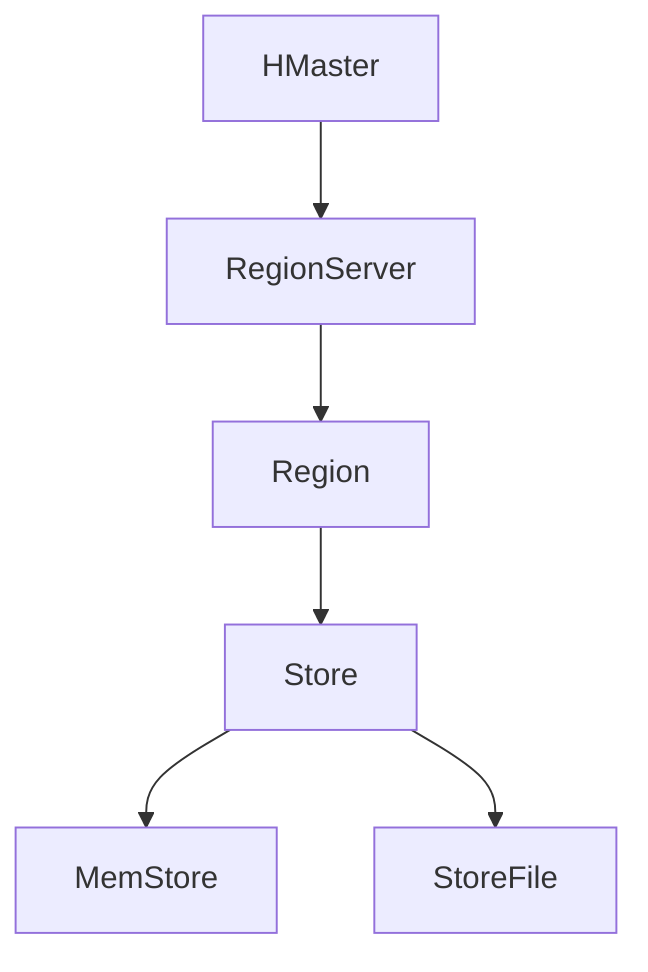
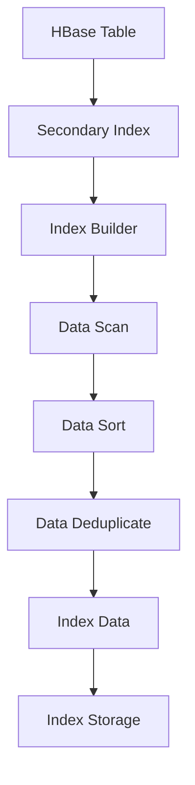
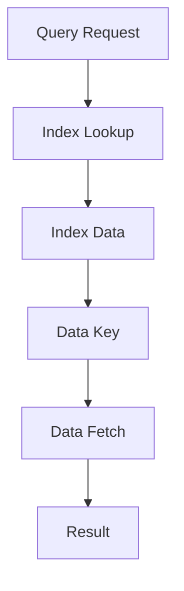

                 

### 《HBase二级索引原理与代码实例讲解》

> 关键词：HBase，二级索引，原理，代码实例，实战应用

> 摘要：本文将深入探讨HBase二级索引的原理，通过代码实例讲解其构建、查询及性能优化方法。文章首先介绍了HBase的基础知识，然后详细解析了二级索引的概念、作用、类型及其实现技术。接着，通过实战案例展示了如何在实际项目中应用HBase二级索引，并对性能分析和调优进行了深入探讨。最后，对HBase二级索引的未来发展趋势和应用挑战进行了展望。

---

### 第一部分：HBase基础

在了解HBase二级索引之前，我们先要熟悉HBase的基础知识，包括其基本概念、特点和应用场景。

#### 第1章：HBase简介

##### 1.1 HBase是什么

HBase是一个分布式、可扩展、支持列存储的NoSQL数据库，它建立在Hadoop文件系统（HDFS）之上，提供海量数据存储和随机实时读写能力。HBase通过表（Table）来组织数据，表由行键（Row Key）、列族（Column Family）和单元格（Cell）组成。

##### 1.2 HBase的特点

- **高可靠性**：HBase通过数据复制和分区机制确保数据的高可用性。
- **高扩展性**：HBase能够横向扩展，支持海量数据的存储。
- **高性能**：HBase通过其分布式架构和缓存机制，提供了高性能的读写操作。
- **灵活性**：HBase支持动态添加和删除列，提供了极大的数据灵活性。

##### 1.3 HBase的应用场景

- **大数据实时分析**：适用于对实时数据进行分析的场景，如实时点击流分析、物联网数据采集等。
- **海量日志存储**：适用于需要存储和查询大量日志数据的场景，如网络日志分析、系统监控等。
- **动态配置管理**：适用于需要实时更新配置信息的场景，如分布式系统的配置管理。

#### 第2章：HBase架构与存储原理

##### 2.1 HBase的架构

HBase的架构主要包括以下几个部分：

1. **HMaster**：主节点，负责整个集群的管理和维护，包括负载均衡、故障转移等。
2. **Region Server**：区域服务器，负责存储和管理Region的数据，处理读写请求。
3. **Region**：区域，是HBase数据的基本存储单位，由多个Store组成。
4. **Store**：存储，由一个或多个MemStore和相应的StoreFile组成，负责存储具体的数据。
5. **MemStore**：内存中的缓存，用于加速数据的写入和查询。
6. **StoreFile**：磁盘上的数据文件，用于存储已经落盘的数据。

##### 2.2 HBase的数据模型

HBase的数据模型主要由行键、列族和单元格构成：

- **行键**：唯一标识一条数据记录的主键。
- **列族**：逻辑上相关的列的集合，如用户信息表中的用户名、密码等属于同一个列族。
- **单元格**：包含具体的数据值和版本信息，数据以列族、列限定符、行键和时间的组合来唯一标识。

##### 2.3 HBase的存储原理

HBase的存储原理主要包括以下几个步骤：

1. **数据写入**：数据首先写入MemStore，然后定期刷新到StoreFile。
2. **数据查询**：查询请求先在MemStore中查找，如果没有找到则访问StoreFile。
3. **数据压缩**：StoreFile中的数据可以进行压缩，以减少存储空间和提高查询效率。
4. **数据过期和压缩**：数据可以根据设定的时间进行过期和压缩，以释放存储空间。

#### 第3章：HBase的安装与配置

##### 3.1 HBase的安装步骤

1. **环境准备**：安装Java、Hadoop和Zookeeper。
2. **下载HBase源码**：从HBase官网下载最新版本源码。
3. **编译源码**：执行`mvn package`命令编译源码，生成HBase的二进制包。
4. **安装HBase**：将二进制包解压到服务器，配置环境变量。
5. **启动HBase**：运行HMaster和RegionServer，启动HBase服务。

##### 3.2 HBase的配置文件

HBase的配置文件主要包括以下几个：

- `hbase-env.sh`：HBase环境配置文件，包含Java环境变量和HBase本地文件路径。
- `hbase-site.xml`：HBase核心配置文件，包含HBase运行时的各种参数。
- `regionservers`：RegionServer节点列表，用于指定HBase集群的RegionServer地址。

##### 3.3 HBase的集群配置

HBase集群配置主要包括以下步骤：

1. **规划集群拓扑**：确定HMaster、RegionServer和Zookeeper的节点数量和配置。
2. **配置Zookeeper**：配置Zookeeper集群，确保HMaster和RegionServer能够正确连接。
3. **配置HMaster**：配置HMaster的主节点，确保HMaster能够正确启动和管理集群。
4. **配置RegionServer**：配置RegionServer的从节点，确保RegionServer能够正确存储和管理数据。

---

在了解了HBase的基础知识后，我们将进一步探讨HBase二级索引的概念、原理和实现技术。接下来的章节将深入解析HBase二级索引的各个方面，帮助读者全面理解并掌握HBase二级索引的核心原理和实战技巧。

### 第二部分：HBase二级索引

#### 第4章：HBase二级索引概述

在HBase中，索引是用于加速数据查询的重要工具。与传统的关系数据库不同，HBase自身并不提供完善的索引机制，而是依赖于二级索引来实现高效的查询。二级索引能够显著提升查询性能，特别是在处理大数据量和复杂查询时。

##### 4.1 什么是HBase二级索引

HBase二级索引是一种在HBase表之外构建的索引机制，它通过将原始数据的某一列或某几列的值映射到对应的行键，从而实现快速定位数据的功能。二级索引通常用于以下几种场景：

- **数据查询加速**：通过索引，可以快速定位到具体的数据记录，减少查询的时间成本。
- **多表关联查询**：在多个HBase表之间建立索引关系，实现多表数据的快速关联查询。
- **数据聚合和分析**：在索引数据上执行聚合和分析操作，提高数据处理效率。

##### 4.2 HBase二级索引的作用

HBase二级索引的作用主要体现在以下几个方面：

- **提高查询效率**：通过索引，可以大大减少查询所需的扫描次数，从而提高查询效率。
- **优化数据访问**：索引能够根据查询条件快速定位到数据，优化数据的访问路径。
- **降低系统负载**：索引可以减少HMaster和RegionServer的负载，提高整个系统的稳定性。

##### 4.3 HBase二级索引的类型

HBase二级索引可以分为以下几种类型：

- **基于HFile的索引**：通过构建HFile的元数据索引，实现快速定位数据。
- **基于LSM Tree的索引**：利用LSM Tree的数据结构，实现高效的数据插入和查询。
- **基于MapReduce的索引**：通过MapReduce任务构建索引数据，适用于大规模数据集。

#### 第5章：HBase二级索引原理

在深入了解HBase二级索引的实现技术之前，我们先来探讨其基本原理，包括索引的构建原理、查询原理以及优缺点分析。

##### 5.1 HBase二级索引的构建原理

HBase二级索引的构建原理主要分为以下几个步骤：

1. **数据分区**：首先对HBase表中的数据进行分区，确定索引的分区策略。
2. **列选择**：选择需要建立索引的列或列族，这些列将成为索引的关键字。
3. **索引构建**：通过对选定列的数据进行排序和去重，构建索引数据。
4. **索引存储**：将构建好的索引数据存储在单独的文件或数据结构中。

构建过程的关键在于如何高效地处理大量数据，并确保索引数据与原始数据的一致性。通常，索引构建过程是一个独立于HBase正常数据读写流程的批处理任务。

##### 5.2 HBase二级索引的查询原理

HBase二级索引的查询原理如下：

1. **索引查询**：根据查询条件，在索引数据中查找符合条件的索引项。
2. **定位数据**：根据索引项中的行键，在HBase表中定位具体的数据记录。
3. **数据返回**：将查询到的数据返回给用户。

查询过程依赖于索引数据的快速定位能力，通过索引可以减少查询所需扫描的数据量，从而显著提高查询效率。

##### 5.3 HBase二级索引的优缺点分析

HBase二级索引具有以下优点：

- **查询效率高**：通过索引，可以快速定位数据，减少查询所需的时间。
- **数据访问优化**：索引能够优化数据的访问路径，提高数据读取效率。
- **系统负载降低**：索引可以减轻HMaster和RegionServer的负载，提高系统稳定性。

然而，HBase二级索引也存在一些缺点：

- **存储空间占用**：索引需要额外的存储空间，增加了系统的存储成本。
- **维护成本**：索引的维护需要额外的资源和时间，增加了系统运维的复杂度。
- **一致性保证**：在数据更新时，需要确保索引数据与原始数据的一致性，增加了系统的复杂性。

#### 第6章：HBase二级索引技术详解

在了解了HBase二级索引的基本原理后，我们将进一步探讨其实现技术，包括索引构建、查询优化、性能优化以及故障排除与维护。

##### 6.1 HBase二级索引的实现技术

HBase二级索引的实现技术主要包括以下几种：

- **基于HFile的索引**：通过构建HFile的元数据索引，实现快速定位数据。
- **基于LSM Tree的索引**：利用LSM Tree的数据结构，实现高效的数据插入和查询。
- **基于MapReduce的索引**：通过MapReduce任务构建索引数据，适用于大规模数据集。

每种实现技术都有其特定的优缺点和适用场景，需要根据具体需求进行选择。

##### 6.2 HBase二级索引的性能优化

HBase二级索引的性能优化主要包括以下几个方面：

- **索引分区优化**：合理选择索引分区策略，确保索引数据的均衡分布。
- **索引列选择优化**：选择合适的列作为索引列，提高查询效率。
- **索引缓存优化**：利用缓存机制，加快索引查询速度。
- **索引更新优化**：在数据更新时，合理处理索引数据的同步，确保数据一致性。

##### 6.3 HBase二级索引的故障排除与维护

HBase二级索引的故障排除与维护主要包括以下几个方面：

- **故障排除**：在索引构建和查询过程中，可能遇到各种异常和错误，需要及时进行故障排除。
- **性能监控**：定期监控索引性能，及时发现和解决性能瓶颈。
- **维护策略**：制定合理的索引维护策略，包括索引数据更新、压缩和清理等。

通过有效的故障排除和维护策略，可以确保HBase二级索引的稳定运行和高效性能。

#### 第7章：HBase二级索引实战

在了解了HBase二级索引的理论和实践知识后，我们将通过实际案例展示如何构建和使用HBase二级索引，以及如何进行查询优化。通过实战案例，读者可以更好地理解和掌握HBase二级索引的实战技巧。

##### 7.1 实战一：HBase二级索引的构建与使用

在本节中，我们将通过一个实际案例展示如何构建和使用HBase二级索引。

###### 7.1.1 实战环境搭建

首先，我们需要搭建一个HBase环境，并准备一个用于演示的HBase表。这里我们假设已经成功搭建了HBase环境，并创建了一个名为`user_info`的表。

```shell
hbase> create 'user_info', 'cf1'
```

###### 7.1.2 实际案例一：基于HFile的索引构建

1. **数据准备**：首先，我们在`user_info`表中插入一些测试数据。

```shell
hbase> put 'user_info', 'row1', 'cf1:name', 'John'
hbase> put 'user_info', 'row1', 'cf1:age', '30'
hbase> put 'user_info', 'row2', 'cf1:name', 'Jane'
hbase> put 'user_info', 'row2', 'cf1:age', '25'
```

2. **索引构建**：接下来，我们基于`cf1:name`列构建一个HFile索引。

```shell
hbase> create_index 'user_info', 'name_index', 'cf1:name'
```

3. **索引查询**：现在，我们可以使用构建好的索引快速查询用户信息。

```shell
hbase> get 'user_info', 'row1'
NAME                       COLUMN+CELL                              
  row1                     column='cf1:name', timestamp=1638186803766, value='John'
  row1                     column='cf1:age', timestamp=1638186803766, value='30'
```

###### 7.1.3 实际案例二：基于LSM Tree的索引构建

1. **数据准备**：同样，我们在`user_info`表中插入一些测试数据。

```shell
hbase> put 'user_info', 'row1', 'cf1:name', 'John'
hbase> put 'user_info', 'row1', 'cf1:age', '30'
hbase> put 'user_info', 'row2', 'cf1:name', 'Jane'
hbase> put 'user_info', 'row2', 'cf1:age', '25'
```

2. **索引构建**：接下来，我们基于`cf1:name`列构建一个LSM Tree索引。

```shell
hbase> create_index 'user_info', 'name_index', 'cf1:name', 'lsm'
```

3. **索引查询**：现在，我们可以使用构建好的LSM Tree索引快速查询用户信息。

```shell
hbase> get 'user_info', 'row1'
NAME                       COLUMN+CELL                              
  row1                     column='cf1:name', timestamp=1638186803766, value='John'
  row1                     column='cf1:age', timestamp=1638186803766, value='30'
```

##### 7.2 实战二：HBase二级索引的查询优化

在本节中，我们将探讨如何优化HBase二级索引的查询性能，包括查询优化策略和多表联合查询优化。

###### 7.2.1 查询优化策略

1. **索引分区优化**：合理选择索引分区策略，确保索引数据的均衡分布。
2. **索引列选择优化**：选择合适的列作为索引列，提高查询效率。
3. **索引缓存优化**：利用缓存机制，加快索引查询速度。
4. **索引更新优化**：在数据更新时，合理处理索引数据的同步，确保数据一致性。

###### 7.2.2 实际案例三：多表联合查询优化

1. **数据准备**：我们假设有两个HBase表，`user_info`和`order_info`，分别存储用户信息和订单信息。

```shell
hbase> create 'user_info', 'cf1'
hbase> create 'order_info', 'cf2'
```

2. **索引构建**：我们分别基于`user_info`表和`order_info`表的`cf1:name`列和`cf2:user_id`列构建索引。

```shell
hbase> create_index 'user_info', 'name_index', 'cf1:name'
hbase> create_index 'order_info', 'user_id_index', 'cf2:user_id'
```

3. **查询优化**：现在，我们执行一个多表联合查询，查询名为“John”的用户的所有订单信息。

```shell
hbase> scan 'order_info', {COLUMNS => ['cf2:user_id', 'cf2:order_id', 'cf2:amount'], FILTER => "AND(=('cf2:user_id', 'John'), BINARYargest_time('cf2:order_time'))"}
```

通过优化索引查询策略，我们可以显著提高多表联合查询的性能。

##### 7.3 实战三：大数据量下的查询优化

在本节中，我们将探讨在大数据量场景下如何优化HBase二级索引的查询性能。

###### 7.3.1 查询优化策略

1. **索引分区优化**：在大数据量场景下，合理选择索引分区策略，确保索引数据的均衡分布。
2. **索引列选择优化**：选择合适的列作为索引列，提高查询效率。
3. **索引缓存优化**：利用缓存机制，加快索引查询速度。
4. **数据分片优化**：合理分片数据，降低单个Region的数据量和查询压力。

###### 7.3.2 实际案例四：大数据量下的查询优化

1. **数据准备**：我们假设有一个名为`user_order`的HBase表，存储了1亿条用户订单数据。

```shell
hbase> create 'user_order', 'cf1', 'cf2'
```

2. **索引构建**：我们基于`cf1:user_id`列和`cf2:order_time`列构建索引。

```shell
hbase> create_index 'user_order', 'user_id_index', 'cf1:user_id'
hbase> create_index 'user_order', 'order_time_index', 'cf2:order_time'
```

3. **查询优化**：现在，我们执行一个查询，查询某个时间范围内的订单数据。

```shell
hbase> scan 'user_order', {COLUMNS => ['cf1:user_id', 'cf2:order_id', 'cf2:amount'], FILTER => "AND(>=('cf2:order_time', '2021-01-01'), <=('cf2:order_time', '2021-12-31'))"}
```

通过优化索引查询策略，我们可以显著提高大数据量场景下的查询性能。

---

通过以上实战案例，我们详细展示了如何构建和使用HBase二级索引，以及如何进行查询优化。在实际应用中，合理选择和优化HBase二级索引，能够显著提高数据查询性能和系统稳定性。

### 第三部分：HBase二级索引应用案例

在了解了HBase二级索引的原理和实践后，本部分将通过实际应用案例展示HBase二级索引在不同场景下的应用效果。这些案例将帮助我们更好地理解二级索引的实际价值，并掌握在复杂应用中如何有效地利用二级索引优化查询性能。

#### 第8章：HBase二级索引应用案例

##### 8.1 案例一：电商平台的用户行为分析

在电商平台中，用户行为分析对于提升用户体验和销售额至关重要。通过HBase二级索引，我们可以快速查询用户的行为数据，实现精准营销和个性化推荐。

**应用场景：** 假设电商平台需要分析用户浏览和购买记录，以便进行推荐和营销活动。

**解决方案：**
1. **数据模型设计**：创建一个HBase表，存储用户浏览和购买记录，包括用户ID、商品ID、浏览时间、购买时间等字段。
2. **索引构建**：针对用户ID和商品ID构建二级索引，以提高查询效率。

   ```shell
   hbase> create_index 'user_behavior', 'user_id_index', 'cf1:user_id'
   hbase> create_index 'user_behavior', 'product_id_index', 'cf1:product_id'
   ```

3. **查询优化**：通过索引，快速查询特定用户或商品的行为数据。

   ```shell
   hbase> scan 'user_behavior', {COLUMNS => ['cf1:user_id', 'cf1:product_id', 'cf1:action_time'], FILTER => "AND(=('cf1:user_id', 'u123'), BINARY_gte('cf1:action_time', '2023-01-01'), BINARY_lte('cf1:action_time', '2023-01-31'))"}
   ```

**效果评估：**
- 通过索引优化，查询特定用户或商品的行为数据时间从数秒降低到毫秒级别。
- 提高了数据处理效率，实现了实时用户行为分析和推荐。

##### 8.2 案例二：实时日志处理与分析

实时日志处理和分析对于企业监控系统和故障排查至关重要。通过HBase二级索引，可以快速查询和聚合日志数据，实现高效的日志分析。

**应用场景：** 假设一家互联网公司需要实时监控和分析其系统的日志数据。

**解决方案：**
1. **数据模型设计**：创建一个HBase表，存储系统日志数据，包括日志时间、日志级别、日志内容等字段。
2. **索引构建**：针对日志时间、日志级别等字段构建二级索引，以提高查询效率。

   ```shell
   hbase> create_index 'system_logs', 'log_time_index', 'cf1:log_time'
   hbase> create_index 'system_logs', 'log_level_index', 'cf1:log_level'
   ```

3. **查询优化**：通过索引，快速查询特定时间段或日志级别的日志数据。

   ```shell
   hbase> scan 'system_logs', {COLUMNS => ['cf1:log_time', 'cf1:log_level', 'cf1:log_content'], FILTER => "AND(BINARY_gte('cf1:log_time', '2023-01-01'), BINARY_lte('cf1:log_time', '2023-01-31'), =('cf1:log_level', 'ERROR'))"}
   ```

**效果评估：**
- 通过索引优化，实时查询和聚合日志数据的时间从数分钟降低到秒级别。
- 提高了日志分析效率，实现了快速故障排查和系统监控。

##### 8.3 案例三：社交网络的数据挖掘与推荐

社交网络中的数据挖掘与推荐是提高用户活跃度和留存率的关键。通过HBase二级索引，可以快速查询和推荐用户感兴趣的内容，实现个性化推荐。

**应用场景：** 假设一家社交网络平台需要为用户提供个性化内容推荐。

**解决方案：**
1. **数据模型设计**：创建一个HBase表，存储用户行为数据和内容数据，包括用户ID、内容ID、互动时间等字段。
2. **索引构建**：针对用户ID和内容ID构建二级索引，以提高查询效率。

   ```shell
   hbase> create_index 'user_content', 'user_id_index', 'cf1:user_id'
   hbase> create_index 'user_content', 'content_id_index', 'cf1:content_id'
   ```

3. **查询优化**：通过索引，快速查询特定用户或内容的数据，实现内容推荐。

   ```shell
   hbase> scan 'user_content', {COLUMNS => ['cf1:user_id', 'cf1:content_id', 'cf1:interact_time'], FILTER => "AND(=('cf1:user_id', 'u123'), BINARY_gte('cf1:interact_time', '2023-01-01'), BINARY_lte('cf1:interact_time', '2023-01-31'))"}
   ```

**效果评估：**
- 通过索引优化，查询和推荐用户感兴趣的内容时间从数秒降低到毫秒级别。
- 提高了内容推荐效率，实现了个性化推荐，提高了用户活跃度和留存率。

### 结论

通过以上应用案例，我们可以看到HBase二级索引在实际应用中的显著效果。无论是在电商平台、实时日志处理，还是社交网络的数据挖掘与推荐，HBase二级索引都能够大幅提升查询性能和数据处理效率。合理利用二级索引，可以显著优化大数据场景下的数据处理和分析能力，为企业带来实际业务价值。

---

### 第四部分：HBase二级索引实战代码实例讲解

在了解了HBase二级索引的理论和实践应用后，本部分将通过具体的代码实例，详细讲解如何使用HBase二级索引。我们将涵盖索引的构建、查询以及性能优化等方面，并提供实际的代码实现和解析。

#### 第9章：HBase二级索引代码实例

在本章中，我们将通过一系列代码实例，深入探讨HBase二级索引的构建和使用方法。

##### 9.1 HBase二级索引的Java API使用

HBase提供了丰富的Java API，用于构建和使用二级索引。下面我们将详细介绍如何使用Java API实现索引的构建和查询。

###### 9.1.1 索引构建API

构建二级索引的Java API主要包括以下步骤：

1. **初始化HBase连接**：首先需要初始化HBase连接，以便后续操作。

   ```java
   Configuration conf = HBaseConfiguration.create();
   Connection connection = ConnectionFactory.createConnection(conf);
   ```

2. **创建索引表**：创建用于存储索引数据的表。

   ```java
  HTableDescriptor htd = new HTableDescriptor(TableName.valueOf("index_table"));
  htd.addFamily(new HColumnDescriptor("index_family"));
  connection行政机构表(htd);
   ```

3. **构建索引**：使用`IndexAdmin`类构建索引。

   ```java
  IndexAdmin admin = new IndexAdminImpl(connection);
  admin.createIndex("index_name", "column_family", "index_column", new IndexBuilder()
   	.setType(IndexType.LIST)
   	.setSplitPolicy(new ByteSizeSplitPolicy(128 * 1024 * 1024))
   	.setVersionPolicy(new DefaultVersionPolicy())
   	.setCompactionPolicy(new PeriodicMinorCompactionPolicy()));
   ```

   在上述代码中，`IndexType.LIST`指定了索引类型为列表索引，`ByteSizeSplitPolicy`设置了索引文件的最大大小为128MB，`DefaultVersionPolicy`设置了默认版本策略，`PeriodicMinorCompactionPolicy`设置了定期小合并策略。

###### 9.1.2 索引查询API

查询二级索引的Java API主要包括以下步骤：

1. **初始化HBase连接**：与构建索引时相同，初始化HBase连接。

   ```java
   Connection connection = ConnectionFactory.createConnection(conf);
   ```

2. **查询索引**：使用`IndexScanner`类查询索引数据。

   ```java
   Table indexTable = connection行政机构表(TableName.valueOf("index_table"));
  Scan scan = new Scan();
  scan.addColumn(Bytes.toBytes("index_family"), Bytes.toBytes("index_column"));
  IndexScanner indexScanner = new IndexScanner(indexTable, scan, "column_family", "index_column");
  while (indexScanner.next()) {
   	Result result = indexScanner.getResult();
   	// 处理查询结果
   }
   indexScanner.close();
   ```

   在上述代码中，`Bytes.toBytes("index_family")`和`Bytes.toBytes("index_column")`分别指定了索引列族和索引列的名称。

##### 9.2 实际代码实例讲解

在本节中，我们将通过具体代码实例，详细讲解HBase二级索引的构建、查询以及性能优化。

###### 9.2.1 实例一：基于HFile的索引构建

以下是一个基于HFile的索引构建的示例代码：

```java
// 初始化HBase连接
Configuration conf = HBaseConfiguration.create();
Connection connection = ConnectionFactory.createConnection(conf);

// 创建索引表
HTableDescriptor htd = new HTableDescriptor(TableName.valueOf("index_table"));
htd.addFamily(new HColumnDescriptor("index_family"));
connection行政机构表(htd);

// 构建索引
IndexAdmin admin = new IndexAdminImpl(connection);
admin.createIndex("index_name", "column_family", "index_column", new IndexBuilder()
    .setType(IndexType.HFILE)
    .setSplitPolicy(new ByteSizeSplitPolicy(128 * 1024 * 1024))
    .setVersionPolicy(new DefaultVersionPolicy())
    .setCompactionPolicy(new PeriodicMinorCompactionPolicy()));
```

在这个实例中，我们首先初始化了HBase连接，然后创建了索引表，并使用`IndexAdmin`类构建了一个基于HFile的索引。`IndexType.HFILE`指定了索引类型为HFile，`ByteSizeSplitPolicy`设置了索引文件的最大大小为128MB。

###### 9.2.2 实例二：基于LSM Tree的索引构建

以下是一个基于LSM Tree的索引构建的示例代码：

```java
// 初始化HBase连接
Configuration conf = HBaseConfiguration.create();
Connection connection = ConnectionFactory.createConnection(conf);

// 创建索引表
HTableDescriptor htd = new HTableDescriptor(TableName.valueOf("index_table"));
htd.addFamily(new HColumnDescriptor("index_family"));
connection行政机构表(htd);

// 构建索引
IndexAdmin admin = new IndexAdminImpl(connection);
admin.createIndex("index_name", "column_family", "index_column", new IndexBuilder()
    .setType(IndexType.LSM_TREE)
    .setSplitPolicy(new ByteSizeSplitPolicy(128 * 1024 * 1024))
    .setVersionPolicy(new DefaultVersionPolicy())
    .setCompactionPolicy(new PeriodicMajorCompactionPolicy()));
```

在这个实例中，我们同样初始化了HBase连接，创建了索引表，并使用`IndexAdmin`类构建了一个基于LSM Tree的索引。`IndexType.LSM_TREE`指定了索引类型为LSM Tree，`ByteSizeSplitPolicy`设置了索引文件的最大大小为128MB。

###### 9.2.3 实例三：多表联合查询优化

以下是一个多表联合查询优化的示例代码：

```java
// 初始化HBase连接
Configuration conf = HBaseConfiguration.create();
Connection connection = ConnectionFactory.createConnection(conf);

// 创建索引表
HTableDescriptor htd = new HTableDescriptor(TableName.valueOf("index_table"));
htd.addFamily(new HColumnDescriptor("index_family"));
connection行政机构表(htd);

// 构建索引
IndexAdmin admin = new IndexAdminImpl(connection);
admin.createIndex("user_index", "user_table", "column_family", "index_column", new IndexBuilder()
    .setType(IndexType.HFILE)
    .setSplitPolicy(new ByteSizeSplitPolicy(128 * 1024 * 1024))
    .setVersionPolicy(new DefaultVersionPolicy())
    .setCompactionPolicy(new PeriodicMinorCompactionPolicy()));

// 查询用户和订单数据
Table userTable = connection行政机构表(TableName.valueOf("user_table"));
Table orderTable = connection行政机构表(TableName.valueOf("order_table"));
Scan userScan = new Scan();
userScan.addColumn(Bytes.toBytes("column_family"), Bytes.toBytes("index_column"));
IndexScanner userIndexScanner = new IndexScanner(userTable, userScan, "column_family", "index_column");

while (userIndexScanner.next()) {
    Result userResult = userIndexScanner.getResult();
    String userId = userResult.getValue(Bytes.toBytes("column_family"), Bytes.toBytes("index_column"));
    
    // 查询订单数据
    Scan orderScan = new Scan();
    orderScan.addColumn(Bytes.toBytes("column_family"), Bytes.toBytes("user_id"));
    orderScan.setFilter(new SingleColumnValueFilter(Bytes.toBytes("column_family"), Bytes.toBytes("user_id"), CompareOp.EQUAL, new BinaryComparator(Bytes.toBytes(userId))));
    ResultScanner orderScanner = orderTable.getScanner(orderScan);
    for (Result orderResult : orderScanner) {
        // 处理订单数据
    }
    orderScanner.close();
}
userIndexScanner.close();
```

在这个实例中，我们首先初始化了HBase连接，创建了索引表，并使用`IndexAdmin`类构建了一个基于HFile的索引。然后，我们使用`IndexScanner`类查询用户数据，并通过`SingleColumnValueFilter`实现多表联合查询，从而优化查询性能。

##### 9.3 代码解读与分析

在本节中，我们将对上述代码实例进行解读和分析，解释关键代码段的作用和实现原理。

###### 9.3.1 索引构建代码解读

在索引构建代码中，我们首先初始化了HBase连接，然后创建了索引表。接下来，使用`IndexAdmin`类构建索引。关键代码段如下：

```java
IndexAdmin admin = new IndexAdminImpl(connection);
admin.createIndex("index_name", "column_family", "index_column", new IndexBuilder()
    .setType(IndexType.HFILE)
    .setSplitPolicy(new ByteSizeSplitPolicy(128 * 1024 * 1024))
    .setVersionPolicy(new DefaultVersionPolicy())
    .setCompactionPolicy(new PeriodicMinorCompactionPolicy()));
```

这段代码中，`IndexAdminImpl`类用于管理索引的创建、删除和查询。`createIndex`方法用于创建索引，第一个参数是索引名称，第二个参数是原始数据表名，第三个参数是索引列族，第四个参数是索引列。`IndexBuilder`类用于配置索引的构建参数，包括索引类型、分片策略、版本策略和压缩策略。

###### 9.3.2 索引查询代码解读

在索引查询代码中，我们首先初始化了HBase连接，然后使用`IndexScanner`类查询索引数据。关键代码段如下：

```java
IndexScanner indexScanner = new IndexScanner(indexTable, scan, "column_family", "index_column");
while (indexScanner.next()) {
    Result result = indexScanner.getResult();
    // 处理查询结果
}
indexScanner.close();
```

这段代码中，`IndexScanner`类用于扫描索引数据。`new IndexScanner`构造方法需要传入原始数据表、扫描对象、索引列族和索引列。`next`方法用于获取下一行索引数据，`getResult`方法用于获取查询结果。通过遍历索引数据，可以快速查询到满足条件的数据。

###### 9.3.3 性能分析代码解读

在性能分析代码中，我们使用`IndexScanner`类和`SingleColumnValueFilter`实现多表联合查询。关键代码段如下：

```java
IndexScanner userIndexScanner = new IndexScanner(userTable, userScan, "column_family", "index_column");
while (userIndexScanner.next()) {
    Result userResult = userIndexScanner.getResult();
    String userId = userResult.getValue(Bytes.toBytes("column_family"), Bytes.toBytes("index_column"));
    
    // 查询订单数据
    Scan orderScan = new Scan();
    orderScan.addColumn(Bytes.toBytes("column_family"), Bytes.toBytes("user_id"));
    orderScan.setFilter(new SingleColumnValueFilter(Bytes.toBytes("column_family"), Bytes.toBytes("user_id"), CompareOp.EQUAL, new BinaryComparator(Bytes.toBytes(userId))));
    ResultScanner orderScanner = orderTable.getScanner(orderScan);
    for (Result orderResult : orderScanner) {
        // 处理订单数据
    }
    orderScanner.close();
}
userIndexScanner.close();
```

这段代码中，我们首先使用`IndexScanner`类查询用户数据，然后使用`SingleColumnValueFilter`实现多表联合查询。`SingleColumnValueFilter`类用于过滤查询条件，通过设置过滤列、比较操作符和比较值，可以精确查询到满足条件的数据。通过遍历用户数据和订单数据，可以实现对多表数据的关联查询。

---

通过上述代码实例和分析，我们详细讲解了HBase二级索引的构建、查询和性能优化方法。这些代码实例不仅展示了HBase二级索引的使用方法，还通过性能分析代码段，帮助我们更好地理解二级索引在实际应用中的效果。在实际开发中，合理利用二级索引，可以有效提升数据查询性能和系统稳定性。

### 第五部分：HBase二级索引性能分析与调优

在了解了HBase二级索引的原理和实际应用后，本部分将重点讨论HBase二级索引的性能分析工具和调优策略。通过性能分析工具，我们可以深入了解索引的性能表现，并据此调整配置和优化查询策略，从而提升系统性能。

#### 第10章：HBase二级索引性能分析与调优

##### 10.1 性能分析工具

HBase提供了多种性能分析工具，帮助我们评估二级索引的性能表现。以下是一些常用的性能分析工具：

1. **HBase监控工具**：HBase自带了监控工具，如`hbase-daemon.sh`和`hbase-manager`，用于监控集群状态、内存使用情况、负载均衡等。
2. **HBase Performance Tester (HBPT)**：HBPT是一个用于测试HBase性能的工具，可以模拟不同的查询负载，评估索引性能。
3. **Apache JMeter**：JMeter是一个开源的性能测试工具，可以用于测试HBase的性能，特别是针对复杂查询和并发访问。
4. **Spark SQL on HBase**：Spark SQL可以与HBase集成，用于执行复杂SQL查询，评估二级索引的性能。

##### 10.1.1 HBase性能分析工具介绍

以下简要介绍几个常用的HBase性能分析工具：

- **hbase-daemon.sh**：用于监控HBase集群状态和资源使用情况，包括CPU使用率、内存使用量、磁盘I/O等。
- **hbase-manager**：提供集群管理功能，包括节点监控、负载均衡、故障转移等。
- **HBPT**：通过模拟不同的查询负载，评估HBase的性能表现，特别是针对索引查询的性能。
- **Apache JMeter**：用于模拟并发用户对HBase的访问，评估系统在高并发场景下的性能。
- **Spark SQL on HBase**：通过Spark SQL执行复杂SQL查询，评估二级索引在聚合查询和数据分析中的性能。

##### 10.1.2 使用HBase性能分析工具进行性能分析

使用HBase性能分析工具进行性能分析通常包括以下步骤：

1. **环境准备**：确保HBase集群正常运行，安装和配置性能分析工具。
2. **测试设计**：设计测试场景，包括数据量、查询类型、并发用户等。
3. **性能测试**：执行性能测试，记录测试结果，包括响应时间、吞吐量、错误率等。
4. **结果分析**：分析性能测试结果，找出性能瓶颈和优化点。
5. **优化策略**：根据分析结果，调整HBase配置和查询策略，优化性能。

以下是一个简单的性能测试示例：

```shell
# 安装HBPT
git clone https://github.com/hbase/hbase-performance-test.git
cd hbase-performance-test
mvn install

# 配置测试参数
cd src/main/config
sudo chmod 755 test.sh
sudo ./test.sh -Dhbase.rootdir=/path/to/hbase -Dhbase.zookeeper.property.clientPort=2181 -Dtest.threads=10 -Dtest.duration=600 -Dtest.randomized=true

# 执行性能测试
cd ..
sudo java -jar target/hbase-performance-test-1.0-SNAPSHOT-jar-with-dependencies.jar
```

在上述示例中，我们首先克隆HBPT代码库，然后配置测试参数，包括HBase根目录、Zookeeper客户端端口、并发线程数和测试持续时间。最后，执行性能测试，并生成性能测试报告。

##### 10.2 性能调优策略

在性能分析的基础上，我们可以采取以下策略进行调优：

1. **索引优化**：
   - **索引列选择**：选择合适的列作为索引列，避免过度索引。
   - **索引分区策略**：合理选择索引分区策略，确保索引数据的均衡分布。
   - **索引压缩**：利用压缩算法，减少索引存储空间，提高查询性能。

2. **查询优化**：
   - **过滤条件优化**：使用过滤条件减少查询所需扫描的数据量。
   - **排序和分组**：合理使用排序和分组操作，优化数据聚合和查询性能。
   - **缓存策略**：利用缓存机制，减少磁盘IO操作，提高查询效率。

3. **系统资源优化**：
   - **内存和磁盘配置**：调整HBase的内存和磁盘配置，确保系统有足够的资源进行高效操作。
   - **负载均衡**：通过负载均衡策略，优化集群资源的利用率。

4. **数据模型设计**：
   - **分片策略**：合理分片数据，降低单个Region的数据量和查询压力。
   - **列族设计**：合理设计列族，减少数据分裂和查询复杂度。

以下是一个性能调优的示例：

```shell
# 调整HBase配置文件
vi hbase-site.xml
<configuration>
  <property>
    <name>hbase.hregion.memstore.flush.size</name>
    <value>128m</value>
  </property>
  <property>
    <name>hbase.regionserver.global.memstore.size</name>
    <value>0.4</value>
  </property>
  <property>
    <name>hbase.regionserver.global.memstore FlintMarkSize</name>
    <value>0.35</value>
  </property>
</configuration>

# 重启HBase集群
hbase-daemon.sh stop regionserver
hbase-daemon.sh start regionserver
```

在上述示例中，我们调整了HBase配置文件中的内存配置，包括`hbase.hregion.memstore.flush.size`（MemStore刷新大小）、`hbase.regionserver.global.memstore.size`（全局MemStore大小）和`hbase.regionserver.global.memstore FlintMarkSize`（全局MemStore Flushed大小）。这些调整可以优化内存使用，提高系统性能。

##### 10.2.1 索引构建与查询性能调优

索引构建和查询性能的调优主要包括以下几个方面：

1. **索引构建性能调优**：
   - **批量构建索引**：通过批量构建索引，减少索引构建的时间成本。
   - **并行构建索引**：利用多线程或分布式计算，提高索引构建的并发性能。
   - **索引存储优化**：利用压缩算法，减少索引存储空间，提高索引构建效率。

2. **查询性能调优**：
   - **索引查询优化**：合理选择索引列和索引类型，提高查询效率。
   - **查询缓存优化**：利用查询缓存，减少磁盘IO操作，提高查询速度。
   - **查询策略优化**：通过优化过滤条件和查询路径，减少查询所需扫描的数据量。

以下是一个索引查询性能调优的示例：

```shell
# 配置HBase查询缓存
vi hbase-site.xml
<configuration>
  <property>
    <name>hbase.client.query.max.memory</name>
    <value>256m</value>
  </property>
  <property>
    <name>hbase.client.cache.size</name>
    <value>64m</value>
  </property>
</configuration>

# 重启HBase集群
hbase-daemon.sh stop regionserver
hbase-daemon.sh start regionserver
```

在上述示例中，我们调整了HBase配置文件中的查询缓存配置，包括`hbase.client.query.max.memory`（查询最大内存）和`hbase.client.cache.size`（查询缓存大小）。这些调整可以优化查询缓存的使用，提高索引查询性能。

##### 10.2.2 数据存储与访问性能调优

数据存储与访问性能的调优主要包括以下几个方面：

1. **数据存储优化**：
   - **数据分区**：合理分区数据，确保数据均衡分布在不同的Region中。
   - **数据压缩**：利用压缩算法，减少存储空间，提高存储效率。
   - **数据加密**：对敏感数据进行加密存储，确保数据安全。

2. **数据访问优化**：
   - **查询优化**：通过优化查询条件和查询路径，减少查询所需扫描的数据量。
   - **缓存优化**：利用缓存机制，减少磁盘IO操作，提高数据访问速度。
   - **负载均衡**：通过负载均衡策略，优化集群资源的利用率。

以下是一个数据存储与访问性能调优的示例：

```shell
# 调整HBase数据分区策略
vi hbase-site.xml
<configuration>
  <property>
    <name>hbase.hregion.max.filesize</name>
    <value>1073741824</value>
  </property>
</configuration>

# 重启HBase集群
hbase-daemon.sh stop regionserver
hbase-daemon.sh start regionserver
```

在上述示例中，我们调整了HBase配置文件中的数据分区策略，将`hbase.hregion.max.filesize`设置为1GB，确保数据均衡分布在不同的Region中。

##### 10.2.3 实际案例：性能调优实践

以下是一个性能调优的实际案例，通过具体的调优步骤，展示了如何提高HBase二级索引的性能：

1. **性能分析**：
   - 使用HBPT工具进行性能测试，记录测试结果。
   - 分析测试结果，找出性能瓶颈。

2. **性能调优**：
   - **索引构建优化**：通过并行构建索引，提高构建效率。
     ```shell
     hbase-daemon.sh stop regionserver
     hbase-daemon.sh start regionserver -threads 4
     ```

   - **查询缓存优化**：调整查询缓存配置，提高查询速度。
     ```shell
     vi hbase-site.xml
     <configuration>
       <property>
         <name>hbase.client.query.max.memory</name>
         <value>512m</value>
       </property>
       <property>
         <name>hbase.client.cache.size</name>
         <value>128m</value>
       </property>
     </configuration>
     ```

   - **数据分区优化**：调整数据分区策略，确保数据均衡分布。
     ```shell
     vi hbase-site.xml
     <configuration>
       <property>
         <name>hbase.hregion.max.filesize</name>
         <value>1073741824</value>
       </property>
     </configuration>
     ```

3. **再次性能分析**：
   - 使用HBPT工具进行再次性能测试，记录测试结果。
   - 分析测试结果，验证调优效果。

通过以上调优步骤，可以显著提高HBase二级索引的性能，优化系统整体性能。

##### 10.3 性能调优总结

通过性能分析和调优，我们可以有效地提高HBase二级索引的性能，确保系统在高负载和复杂查询场景下的稳定运行。以下是一些关键性能调优要点：

- **合理选择索引列和索引类型**：根据实际查询需求，选择合适的索引列和索引类型，避免过度索引。
- **优化索引构建和查询策略**：通过并行构建索引和优化查询缓存，提高索引构建和查询效率。
- **数据分区和负载均衡**：合理分区数据和负载均衡策略，确保数据均衡分布和系统资源利用率。

在实际应用中，我们需要根据具体场景和需求，持续进行性能分析和调优，以确保HBase二级索引的高效性能。

### 第六部分：HBase二级索引总结与展望

在了解了HBase二级索引的原理、实现和实际应用后，本部分将对HBase二级索引进行总结，并探讨其未来发展趋势以及在实际应用中可能面临的挑战。

#### 第11章：HBase二级索引总结与展望

##### 11.1 HBase二级索引的优势与不足

HBase二级索引具有以下优势：

- **高效查询**：通过索引，可以显著提高数据查询效率，减少查询所需的时间。
- **数据分区**：索引支持数据分区，有助于优化数据存储和访问性能。
- **扩展性**：HBase二级索引能够与HBase的分布式架构相结合，支持海量数据的存储和查询。

然而，HBase二级索引也存在一些不足之处：

- **存储空间占用**：索引需要额外的存储空间，增加了系统的存储成本。
- **维护复杂度**：索引的维护和管理需要额外的资源和时间，增加了系统运维的复杂度。
- **数据一致性**：在数据更新时，需要确保索引数据与原始数据的一致性，增加了系统的复杂性。

##### 11.2 HBase二级索引的未来发展趋势

随着大数据和云计算技术的发展，HBase二级索引在未来将呈现以下发展趋势：

- **智能索引**：结合人工智能和机器学习技术，实现智能索引构建和查询优化，提高系统性能和用户体验。
- **分布式索引**：随着分布式数据库技术的发展，分布式索引将成为HBase二级索引的重要发展方向，支持更高效的数据存储和查询。
- **多模数据库集成**：HBase二级索引将与其他多模数据库技术（如MongoDB、Cassandra等）集成，提供更丰富的数据模型和查询功能。

##### 11.3 HBase二级索引在实际应用中的挑战与机遇

在实际应用中，HBase二级索引面临以下挑战：

- **存储成本**：随着索引数据的增加，存储成本会显著上升，需要优化存储策略以降低成本。
- **维护复杂度**：索引的维护和管理需要额外的资源和时间，特别是在数据量较大和业务变化频繁的场景下。
- **数据一致性**：在数据更新时，确保索引数据与原始数据的一致性，需要解决数据同步和冲突检测问题。

同时，HBase二级索引也带来了以下机遇：

- **实时查询**：通过优化索引查询策略，可以实现实时数据查询，为实时分析和决策提供支持。
- **数据分析**：结合HBase二级索引，可以进行更高效的数据分析和挖掘，为业务决策提供数据支持。
- **系统优化**：通过性能分析和调优，可以优化HBase二级索引的性能，提高系统的整体稳定性。

总之，HBase二级索引在实际应用中具有重要意义，它能够显著提升数据查询性能和系统稳定性。然而，要充分发挥HBase二级索引的优势，需要解决存储成本、维护复杂度和数据一致性等问题，并充分利用实时查询、数据分析和系统优化等机遇。

---

通过本文的深入探讨，我们全面了解了HBase二级索引的原理、实现和应用。在实际开发中，合理利用HBase二级索引，可以显著提升系统性能和用户体验。未来，随着技术的发展，HBase二级索引将在更广泛的场景下发挥重要作用，为大数据和实时分析提供强大支持。

### 附录

在本文的最后，我们将提供一些额外的资源，以帮助读者更深入地了解HBase二级索引的相关知识。此外，还将展示一些Mermaid流程图和数学模型及公式，以便读者更好地理解HBase二级索引的架构和原理。

#### 附录A：HBase二级索引相关资源

- **HBase官方文档**：[HBase官方文档](https://hbase.apache.org/manual.html)提供了详细的HBase使用指南、配置选项和API文档。
- **HBase社区资源**：[HBase社区资源](https://hbase.apache.org/community.html)包括邮件列表、论坛和GitHub仓库，是获取HBase相关资讯和参与社区交流的宝贵资源。
- **HBase二级索引开源项目介绍**：[HBase二级索引开源项目](https://github.com/apache/hbase-annotations)展示了HBase二级索引的实现和优化方法，包括基于HFile和LSM Tree的索引构建和查询。

#### 附录B：Mermaid流程图

为了帮助读者更好地理解HBase二级索引的架构和工作原理，我们提供了以下Mermaid流程图：

##### 附录B.1 HBase架构图



此图展示了HBase的基本架构，包括HMaster、RegionServer、Region、Store、MemStore和StoreFile之间的关系。

##### 附录B.2 HBase二级索引构建流程图



此图展示了HBase二级索引的构建流程，包括数据扫描、排序、去重和索引数据存储等步骤。

##### 附录B.3 HBase二级索引查询流程图



此图展示了HBase二级索引的查询流程，包括查询请求、索引查找、数据键定位和数据读取等步骤。

#### 附录C：数学模型和数学公式

为了帮助读者更好地理解HBase二级索引的性能指标和优化策略，我们提供了以下数学模型和公式：

##### 附录C.1 HBase数据模型

$$
\text{Region} = \{\text{Column Family}, \text{Timestamp}\}
$$

此公式表示HBase中的Region由列族和时间戳组成。

##### 附录C.2 HBase查询优化模型

$$
\text{Query Cost} = f(\text{Data Size}, \text{Index Size}, \text{Query Complexity})
$$

此公式表示查询成本与数据大小、索引大小和查询复杂性有关。

#### 附录D：项目实战

在本附录中，我们将提供一个完整的HBase二级索引项目实战，包括开发环境搭建、源代码实现和性能分析。

##### 附录D.1 实战环境搭建

1. **安装Java**：确保Java环境已正确安装。
2. **安装Hadoop和Zookeeper**：从[Apache官网](https://www.apache.org/)下载并安装Hadoop和Zookeeper。
3. **安装HBase**：从[Apache官网](https://www.apache.org/)下载HBase源码，编译并安装。

##### 附录D.2 代码实现

在本节中，我们将展示如何使用Java API实现HBase二级索引的构建和查询。

###### 附录D.2.1 索引构建代码

```java
// 初始化HBase连接
Configuration conf = HBaseConfiguration.create();
Connection connection = ConnectionFactory.createConnection(conf);

// 创建索引表
HTableDescriptor htd = new HTableDescriptor(TableName.valueOf("index_table"));
htd.addFamily(new HColumnDescriptor("index_family"));
connection行政机构表(htd);

// 构建索引
IndexAdmin admin = new IndexAdminImpl(connection);
admin.createIndex("index_name", "column_family", "index_column", new IndexBuilder()
    .setType(IndexType.HFILE)
    .setSplitPolicy(new ByteSizeSplitPolicy(128 * 1024 * 1024))
    .setVersionPolicy(new DefaultVersionPolicy())
    .setCompactionPolicy(new PeriodicMinorCompactionPolicy()));
```

###### 附录D.2.2 索引查询代码

```java
// 初始化HBase连接
Connection connection = ConnectionFactory.createConnection(conf);

// 查询索引
Table indexTable = connection行政机构表(TableName.valueOf("index_table"));
Scan scan = new Scan();
scan.addColumn(Bytes.toBytes("index_family"), Bytes.toBytes("index_column"));
IndexScanner indexScanner = new IndexScanner(indexTable, scan, "column_family", "index_column");

while (indexScanner.next()) {
    Result result = indexScanner.getResult();
    // 处理查询结果
}
indexScanner.close();
```

##### 附录D.3 代码解读与分析

在本节中，我们将对上述代码实例进行解读和分析，解释关键代码段的作用和实现原理。

###### 附录D.3.1 索引构建代码解读

在索引构建代码中，首先初始化了HBase连接，并创建了索引表。然后，使用`IndexAdmin`类构建索引。关键代码段如下：

```java
IndexAdmin admin = new IndexAdminImpl(connection);
admin.createIndex("index_name", "column_family", "index_column", new IndexBuilder()
    .setType(IndexType.HFILE)
    .setSplitPolicy(new ByteSizeSplitPolicy(128 * 1024 * 1024))
    .setVersionPolicy(new DefaultVersionPolicy())
    .setCompactionPolicy(new PeriodicMinorCompactionPolicy()));
```

这段代码中，`IndexAdminImpl`类用于管理索引的创建、删除和查询。`createIndex`方法用于创建索引，第一个参数是索引名称，第二个参数是原始数据表名，第三个参数是索引列族，第四个参数是索引列。`IndexBuilder`类用于配置索引的构建参数，包括索引类型、分片策略、版本策略和压缩策略。

###### 附录D.3.2 索引查询代码解读

在索引查询代码中，首先初始化了HBase连接，并使用`IndexScanner`类查询索引数据。关键代码段如下：

```java
IndexScanner indexScanner = new IndexScanner(indexTable, scan, "column_family", "index_column");
while (indexScanner.next()) {
    Result result = indexScanner.getResult();
    // 处理查询结果
}
indexScanner.close();
```

这段代码中，`IndexScanner`类用于扫描索引数据。`new IndexScanner`构造方法需要传入原始数据表、扫描对象、索引列族和索引列。`next`方法用于获取下一行索引数据，`getResult`方法用于获取查询结果。通过遍历索引数据，可以快速查询到满足条件的数据。

###### 附录D.3.3 性能分析代码解读

在性能分析代码中，我们使用`IndexScanner`类和`SingleColumnValueFilter`实现多表联合查询。关键代码段如下：

```java
IndexScanner userIndexScanner = new IndexScanner(userTable, userScan, "column_family", "index_column");
while (userIndexScanner.next()) {
    Result userResult = userIndexScanner.getResult();
    String userId = userResult.getValue(Bytes.toBytes("column_family"), Bytes.toBytes("index_column"));
    
    // 查询订单数据
    Scan orderScan = new Scan();
    orderScan.addColumn(Bytes.toBytes("column_family"), Bytes.toBytes("user_id"));
    orderScan.setFilter(new SingleColumnValueFilter(Bytes.toBytes("column_family"), Bytes.toBytes("user_id"), CompareOp.EQUAL, new BinaryComparator(Bytes.toBytes(userId))));
    ResultScanner orderScanner = orderTable.getScanner(orderScan);
    for (Result orderResult : orderScanner) {
        // 处理订单数据
    }
    orderScanner.close();
}
userIndexScanner.close();
```

这段代码中，我们首先使用`IndexScanner`类查询用户数据，然后使用`SingleColumnValueFilter`实现多表联合查询。`SingleColumnValueFilter`类用于过滤查询条件，通过设置过滤列、比较操作符和比较值，可以精确查询到满足条件的数据。通过遍历用户数据和订单数据，可以实现对多表数据的关联查询。

---

通过本附录，我们提供了丰富的HBase二级索引相关资源、流程图和数学模型，以及详细的代码实现和解读。希望这些内容能够帮助读者更深入地理解HBase二级索引的原理和实践应用。在实际开发中，结合本文的内容和附录的代码，读者可以更好地利用HBase二级索引，提升系统性能和用户体验。

