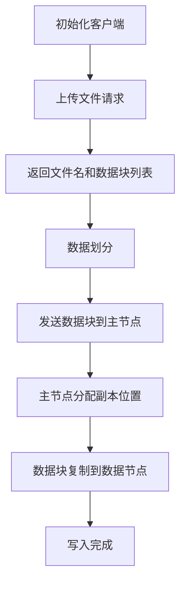
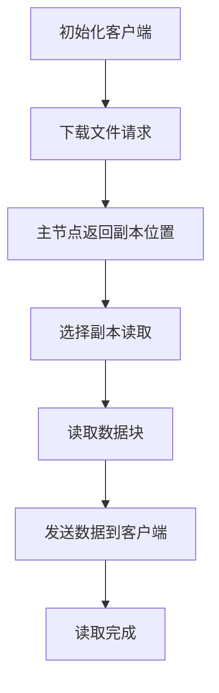

                 

# 《HDFS 原理与代码实例讲解》

> 关键词：HDFS，分布式文件系统，数据块，数据复制，HDFS编程，性能优化

> 摘要：本文将深入讲解HDFS（Hadoop Distributed File System）的原理，包括其架构、文件存储机制、编程实践、性能优化以及管理和监控。通过代码实例，读者将能够全面理解HDFS的工作机制，为实际应用打下坚实基础。

## 《HDFS 原理与代码实例讲解》目录大纲

### 第一部分：HDFS基础

#### 第1章：HDFS概述

- 1.1 HDFS的定义与核心概念
- 1.2 HDFS的架构
- 1.3 HDFS与GFS的比较
- 1.4 HDFS的优缺点与应用场景

#### 第2章：HDFS文件存储机制

- 2.1 HDFS文件的存储结构
- 2.2 数据块的划分与存储
- 2.3 数据的复制策略
- 2.4 数据的写入与读取过程

### 第二部分：HDFS编程

#### 第3章：HDFS客户端API使用

- 3.1 HDFS客户端配置
- 3.2 HDFS文件操作API
- 3.3 HDFS目录操作API
- 3.4 实例：上传与下载文件

#### 第4章：HDFS编程实践

- 4.1 HDFS编程环境搭建
- 4.2 数据流处理与HDFS集成
- 4.3 HDFS与MapReduce的协同工作
- 4.4 实例：使用HDFS进行大数据处理

#### 第5章：HDFS性能优化

- 5.1 HDFS性能瓶颈分析
- 5.2 数据布局优化
- 5.3 客户端性能优化
- 5.4 分布式文件系统性能比较

### 第三部分：HDFS管理与监控

#### 第6章：HDFS管理

- 6.1 HDFS配置管理
- 6.2 HDFS文件权限管理
- 6.3 HDFS监控与告警
- 6.4 HDFS安全管理

#### 第7章：HDFS监控与性能调优

- 7.1 HDFS监控工具使用
- 7.2 HDFS性能调优策略
- 7.3 HDFS性能瓶颈分析与处理
- 7.4 实例：使用Ganglia监控HDFS

### 附录

#### 附录A：HDFS资源与工具

- A.1 HDFS相关资源
- A.2 HDFS开发工具
- A.3 HDFS常用命令详解

#### 附录B：HDFS Mermaid流程图

- B.1 HDFS文件写入流程图
- B.2 HDFS文件读取流程图

#### 附录C：HDFS核心算法伪代码

- C.1 数据块分配伪代码
- C.2 数据复制伪代码

#### 附录D：HDFS项目实战案例

- D.1 大数据导入导出案例
- D.2 分布式文件存储系统搭建
- D.3 HDFS在日志分析中的应用
- D.4 代码解读与分析

### 1.1 HDFS的定义与核心概念

HDFS（Hadoop Distributed File System）是Apache Hadoop项目中的一个核心组件，用于提供高吞吐量的数据访问，支持数据存储和处理。作为一个分布式文件系统，HDFS的设计目标是处理大文件存储，提供高可靠性、高可扩展性和高吞吐量的数据访问。

HDFS的核心概念包括：

- **命名空间（Namespace）**：HDFS提供了一种类似于文件系统的命名空间，用户可以创建目录、文件并进行操作。
- **数据块（Block）**：HDFS将文件切分成固定大小的数据块进行存储，默认块大小为128MB或256MB。
- **副本（Replication）**：为了提高数据可靠性，HDFS将数据块复制多个副本存储在不同的节点上。
- **客户端（Client）**：客户端是用户与HDFS交互的接口，负责文件的读写操作。
- **数据节点（Data Node）**：数据节点是HDFS中的实际存储节点，负责存储数据块并响应对这些数据块的读写请求。
- **主节点（Name Node）**：主节点是HDFS的主控节点，负责管理命名空间和调度数据块在数据节点之间的复制。

### 1.2 HDFS的架构

HDFS的架构主要由两个核心组件构成：主节点（Name Node）和数据节点（Data Node）。以下是HDFS架构的详细解释：

- **主节点（Name Node）**：
  - 负责维护文件的命名空间，即文件和目录的结构。
  - 负责客户端对文件的读写请求，并将请求转发给合适的数据节点。
  - 负责维护数据块的映射表，即文件到数据块的映射关系。
  - 负责数据块的复制和迁移，以确保数据的可靠性和负载均衡。

- **数据节点（Data Node）**：
  - 负责存储实际的数据块，并响应对这些数据块的读写请求。
  - 定期向主节点发送心跳包，报告自己的状态和存储的数据块信息。
  - 根据主节点的指示进行数据块的复制或删除。


### 1.3 HDFS与GFS的比较

HDFS的设计灵感来源于Google的GFS（Google File System）。虽然两者都是分布式文件系统，但它们之间存在一些差异：

- **设计目标**：
  - **HDFS**：旨在提供高吞吐量的数据访问，适合批量数据处理任务。
  - **GFS**：旨在提供高性能的数据访问，适合在线数据存储和处理。

- **数据块大小**：
  - **HDFS**：默认数据块大小为128MB或256MB，可以自定义。
  - **GFS**：默认数据块大小为64MB，且不可自定义。

- **副本策略**：
  - **HDFS**：默认副本数为3，可以根据需要调整。
  - **GFS**：默认副本数为3，不可调整。

- **数据一致性**：
  - **HDFS**：在写入数据时，先写入一个副本，然后再写入其他副本。
  - **GFS**：在写入数据时，同时写入所有副本。

- **可扩展性**：
  - **HDFS**：易于扩展，可以在集群中动态增加数据节点。
  - **GFS**：扩展性较差，通常需要重新配置和重启整个系统。

### 1.4 HDFS的优缺点与应用场景

#### 优点：

- **高可靠性**：通过数据块的副本机制，HDFS能够确保数据的高可靠性。
- **高可扩展性**：HDFS能够支持数千个节点的集群，适合处理大规模数据。
- **高吞吐量**：HDFS设计目标之一就是提供高吞吐量的数据访问，适合批量数据处理。
- **简化数据管理**：HDFS提供了一个简单的命名空间，便于管理和访问数据。

#### 缺点：

- **单点故障**：主节点（Name Node）是HDFS的单点故障点，一旦主节点失败，整个HDFS集群将不可用。
- **低随机读写性能**：由于数据块大小固定，HDFS不适合小文件或频繁的随机读写操作。
- **高延迟**：HDFS的数据传输依赖于网络，可能导致较高的数据传输延迟。

#### 应用场景：

- **大数据处理**：HDFS是处理大规模数据的理想选择，尤其是在批量数据处理场景中。
- **日志存储**：许多公司使用HDFS来存储和分析大规模的日志数据。
- **数据备份与归档**：HDFS提供了可靠的数据存储解决方案，适用于数据的备份和归档。
- **分布式应用**：HDFS作为分布式文件系统，支持多种分布式计算框架，如MapReduce、Spark等。

### 2.1 HDFS文件的存储结构

HDFS将文件存储为一系列的数据块，每个数据块都有一定的数据量和唯一的标识。以下是HDFS文件存储结构的详细说明：

- **数据块（Block）**：HDFS将文件切分成固定大小的数据块进行存储。默认块大小为128MB或256MB，用户可以根据需要进行调整。每个数据块都有一个唯一的标识，称为块ID。
- **数据块列表（Block List）**：每个文件都有一个对应的数据块列表，记录了文件中所有数据块的块ID和副本位置。
- **数据块映射表（Block Map）**：主节点维护一个数据块映射表，记录了每个数据块在哪些数据节点上存储了副本。
- **元数据（Metadata）**：元数据包括文件名、文件大小、数据块的副本数等，存储在主节点的内存中。


### 2.2 数据块的划分与存储

在HDFS中，文件被划分为固定大小的数据块进行存储。以下是数据块的划分与存储过程的详细说明：

1. **文件大小计算**：在文件写入HDFS之前，系统会首先计算文件的大小，以确定需要划分成多少个数据块。

2. **数据块分配**：主节点将根据文件的大小和数据块的默认大小，将文件划分为若干个数据块。数据块的块ID由主节点分配，并存储在数据块映射表中。

3. **数据块存储**：主节点将每个数据块的块ID和副本位置信息发送给数据节点。数据节点根据接收到的信息，将数据块存储在本地磁盘上。

4. **副本存储**：默认情况下，HDFS会将每个数据块复制多个副本存储在不同的数据节点上。副本的数量可以通过配置项`dfs.replication`设置，默认为3。

### 2.3 数据的复制策略

HDFS通过将数据块复制多个副本存储在不同的数据节点上来提高数据的可靠性。以下是HDFS数据复制策略的详细说明：

1. **副本选择**：在复制数据块时，HDFS会尽量选择距离数据源较近的数据节点作为副本存储位置。这有助于减少数据传输延迟，提高系统性能。

2. **副本数量**：默认情况下，HDFS将每个数据块复制3个副本。用户可以通过配置项`dfs.replication`设置不同的副本数量。

3. **副本放置策略**：
   - **冗余放置策略**：在创建数据块时，第一个副本会存储在本地数据节点上，第二个副本会存储在另一个节点上，第三个副本会存储在第三个节点上。这种策略可以最大限度地利用本地存储资源，并提高数据的可靠性。
   - **负载均衡策略**：在复制数据块时，HDFS会尽量将副本放置在负载较低的数据节点上。这有助于实现负载均衡，提高系统性能。

4. **副本管理**：
   - **副本检查**：数据节点会定期向主节点报告自己的状态，包括存储的数据块信息。主节点会根据这些信息检查副本的完整性，并确保每个数据块都有足够的副本。
   - **副本删除**：当某个数据块的副本数量超过配置的副本数量时，HDFS会自动删除多余副本，以节省存储空间。

### 2.4 数据的写入与读取过程

HDFS的数据写入与读取过程涉及多个组件的协同工作。以下是这两个过程的详细说明：

#### 数据写入过程：

1. **客户端初始化**：客户端向主节点发送一个写入请求，请求包含文件名和数据块大小等信息。

2. **主节点处理**：主节点接收到写入请求后，会创建一个数据块列表，并选择合适的数据节点作为数据块的副本存储位置。

3. **数据传输**：客户端将数据划分为若干个数据块，并将这些数据块依次发送给主节点。主节点将这些数据块转发给对应的数据节点。

4. **数据块存储**：数据节点接收到数据块后，将其存储在本地磁盘上，并通知主节点存储成功。

5. **副本复制**：主节点根据配置的副本数量，将数据块复制到其他数据节点上，确保数据的可靠性。

6. **写入完成**：当所有数据块都存储成功并复制完成后，主节点向客户端发送写入完成通知。

#### 数据读取过程：

1. **客户端初始化**：客户端向主节点发送一个读取请求，请求包含文件名和读取位置等信息。

2. **主节点处理**：主节点接收到读取请求后，会查找数据块的副本位置，并将这些位置信息发送给客户端。

3. **数据传输**：客户端根据主节点返回的副本位置信息，选择一个数据节点进行数据块的读取。

4. **数据块读取**：数据节点接收到读取请求后，从本地磁盘上读取数据块，并将其发送给客户端。

5. **数据传输完成**：客户端收到数据块后，将其拼接成完整的文件，并通知主节点读取完成。

### 3.1 HDFS客户端配置

要使用HDFS客户端进行文件操作，需要正确配置客户端。以下是在Java环境中配置HDFS客户端的基本步骤：

1. **添加依赖**：在项目的pom.xml文件中添加Hadoop客户端库的依赖。

   ```xml
   <dependency>
       <groupId>org.apache.hadoop</groupId>
       <artifactId>hadoop-client</artifactId>
       <version>3.2.1</version>
   </dependency>
   ```

2. **配置文件**：创建一个名为`hdfs-site.xml`的配置文件，其中包含HDFS相关配置项，例如：

   ```xml
   <configuration>
       <property>
           <name>fs.defaultFS</name>
           <value>hdfs://localhost:9000</value>
       </property>
       <property>
           <name>dfs.replication</name>
           <value>3</value>
       </property>
   </configuration>
   ```

   在这个配置文件中，`fs.defaultFS`指定了HDFS的命名空间URI，`dfs.replication`指定了默认的副本数量。

3. **初始化配置**：在Java代码中加载配置文件，并初始化HDFS客户端。

   ```java
   Configuration conf = new Configuration();
   conf.addResource(new Path("hdfs-site.xml"));
   DFSClient client = new DFSClient(conf);
   ```

### 3.2 HDFS文件操作API

HDFS提供了丰富的API用于文件操作，包括文件的上传、下载、删除等。以下是一些常用的HDFS文件操作API及其使用示例：

#### 上传文件

```java
FSDataOutputStream outputStream = client.create(new Path("/user/hdfs/test.txt"));
outputStream.write(Bytes.toBytes("Hello HDFS!"));
outputStream.close();
```

#### 下载文件

```java
FSDataInputStream inputStream = client.open(new Path("/user/hdfs/test.txt"));
byte[] buffer = new byte[1024];
int bytesRead = inputStream.read(buffer);
System.out.write(buffer, 0, bytesRead);
inputStream.close();
```

#### 删除文件

```java
client.delete(new Path("/user/hdfs/test.txt"), true);
```

### 3.3 HDFS目录操作API

HDFS还提供了目录操作API，包括创建目录、删除目录、列出目录内容等。以下是一些常用的HDFS目录操作API及其使用示例：

#### 创建目录

```java
client.mkdirs(new Path("/user/hdfs/subdirectory"));
```

#### 删除目录

```java
client.delete(new Path("/user/hdfs/subdirectory"), true);
```

#### 列出目录内容

```java
FileStatus[] fileStatusArray = client.listStatus(new Path("/user/hdfs/"));
for (FileStatus fileStatus : fileStatusArray) {
    if (fileStatus.isFile()) {
        System.out.println(fileStatus.getPath().getName());
    } else {
        System.out.println(fileStatus.getPath().getName() + " (Directory)");
    }
}
```

### 3.4 实例：上传与下载文件

以下是一个简单的Java程序，用于将本地文件上传到HDFS，并将HDFS文件下载到本地。程序使用了HDFS客户端API进行文件操作。

```java
import org.apache.hadoop.conf.Configuration;
import org.apache.hadoop.fs.*;

public class HDFSFileExample {
    public static void main(String[] args) throws IOException {
        Configuration conf = new Configuration();
        conf.addResource(new Path("hdfs-site.xml"));
        DFSClient client = new DFSClient(conf);

        // 上传文件
        Path localPath = new Path("src/main/java/HDFSFileExample.java");
        Path hdfsPath = new Path("/user/hdfs/HDFSFileExample.java");
        FSDataOutputStream outputStream = client.create(hdfsPath);
        FileInputStream inputStream = new FileInputStream(localPath);
        byte[] buffer = new byte[1024];
        int bytesRead;
        while ((bytesRead = inputStream.read(buffer)) != -1) {
            outputStream.write(buffer, 0, bytesRead);
        }
        inputStream.close();
        outputStream.close();

        // 下载文件
        FSDataInputStream inputStream2 = client.open(hdfsPath);
        FileOutputStream outputStream2 = new FileOutputStream("HDFSFileExample_copy.java");
        bytesRead = inputStream2.read(buffer);
        while (bytesRead != -1) {
            outputStream2.write(buffer, 0, bytesRead);
            bytesRead = inputStream2.read(buffer);
        }
        inputStream2.close();
        outputStream2.close();

        client.close();
    }
}
```

### 4.1 HDFS编程环境搭建

要开始使用HDFS进行编程，需要搭建一个HDFS开发环境。以下是在Linux环境下搭建HDFS开发环境的步骤：

1. **安装Hadoop**：下载并解压Hadoop安装包，例如：

   ```shell
   tar -xvf hadoop-3.2.1.tar.gz
   ```

2. **配置环境变量**：将Hadoop的bin目录添加到系统环境变量中，例如在`~/.bashrc`文件中添加以下内容：

   ```shell
   export HADOOP_HOME=/path/to/hadoop-3.2.1
   export PATH=$PATH:$HADOOP_HOME/bin
   ```

   然后执行`source ~/.bashrc`使环境变量生效。

3. **格式化HDFS**：首次启动HDFS前，需要使用`hdfs namenode -format`命令格式化HDFS命名空间。

   ```shell
   hdfs namenode -format
   ```

4. **启动HDFS**：启动HDFS集群，包括主节点和数据节点。

   ```shell
   start-dfs.sh
   ```

5. **访问HDFS Web界面**：在浏览器中访问HDFS的Web界面，默认地址为`http://localhost:50070/`。

### 4.2 数据流处理与HDFS集成

HDFS常与数据处理框架（如MapReduce、Spark）集成使用，以处理大规模数据流。以下是一个简单的数据流处理与HDFS集成的示例：

1. **数据读取**：使用HDFS API读取HDFS中的数据文件。

   ```java
   FSDataInputStream inputStream = client.open(new Path("/user/hdfs/data.txt"));
   BufferedReader reader = new BufferedReader(new InputStreamReader(inputStream));
   String line;
   while ((line = reader.readLine()) != null) {
       // 处理数据
   }
   reader.close();
   ```

2. **数据处理**：在处理数据时，可以使用MapReduce、Spark等框架进行并行计算。

   ```java
   // 使用MapReduce处理数据
   Configuration conf = new Configuration();
   Job job = Job.getInstance(conf, "Data Processing");
   job.setMapperClass(DataProcessingMapper.class);
   job.setOutputKeyClass(Text.class);
   job.setOutputValueClass(IntWritable.class);
   FileInputFormat.addInputPath(job, new Path("/user/hdfs/data.txt"));
   FileOutputFormat.setOutputPath(job, new Path("/user/hdfs/output"));
   job.waitForCompletion(true);
   ```

3. **数据写入**：将处理后的数据写入HDFS。

   ```java
   FSDataOutputStream outputStream = client.create(new Path("/user/hdfs/output.txt"));
   outputStream.write(Bytes.toBytes("Processed data"));
   outputStream.close();
   ```

### 4.3 HDFS与MapReduce的协同工作

HDFS与MapReduce是Hadoop生态系统中的两个核心组件，它们紧密协同工作以处理大规模数据。以下是HDFS与MapReduce协同工作的详细说明：

1. **数据存储**：MapReduce作业的数据输入和输出都存储在HDFS上。在MapReduce作业启动时，HDFS负责提供数据的读取和写入接口。

2. **数据分区**：HDFS将数据块存储在不同的数据节点上，MapReduce根据数据块的分布情况将作业任务分配到不同的节点上，以实现并行处理。

3. **任务调度**：MapReduce的调度器负责根据数据节点的状态和作业任务的依赖关系，合理调度作业任务，确保任务的高效执行。

4. **中间数据存储**：在MapReduce作业执行过程中，中间数据也会存储在HDFS上。这些中间数据在后续的Reduce任务中会被读取和处理。

5. **作业输出**：作业执行完成后，输出结果会被写入到HDFS中，以便后续的进一步处理或分析。

### 4.4 实例：使用HDFS进行大数据处理

以下是一个简单的HDFS大数据处理实例，使用Java和MapReduce对HDFS中的日志文件进行统计分析。

1. **数据准备**：在HDFS中创建一个名为`log_data`的目录，并将日志文件上传到该目录。

   ```shell
   hdfs dfs -mkdir /user/hdfs/log_data
   hdfs dfs -put logs/access.log /user/hdfs/log_data/
   ```

2. **编写MapReduce作业**：创建一个名为`LogStatisticsMapper.java`的Java文件，实现MapReduce Mapper类。

   ```java
   import org.apache.hadoop.conf.Configuration;
   import org.apache.hadoop.fs.Path;
   import org.apache.hadoop.io.IntWritable;
   import org.apache.hadoop.io.Text;
   import org.apache.hadoop.mapreduce.Job;
   import org.apache.hadoop.mapreduce.Mapper;
   import org.apache.hadoop.mapreduce.lib.input.FileInputFormat;
   import org.apache.hadoop.mapreduce.lib.output.FileOutputFormat;

   public class LogStatisticsMapper extends Mapper<Object, Text, Text, IntWritable> {

       private final static IntWritable one = new IntWritable(1);
       private Text word = new Text();

       public void map(Object key, Text value, Context context) throws IOException, InterruptedException {
           // 解析日志文件，提取所需信息
           String[] fields = value.toString().split(" ");
           word.set(fields[0]); // 设置关键词
           context.write(word, one);
       }
   }
   ```

3. **编译作业**：将`LogStatisticsMapper.java`文件编译成字节码文件。

   ```shell
   javac LogStatisticsMapper.java
   ```

4. **提交作业**：将编译后的字节码文件上传到HDFS，并提交MapReduce作业。

   ```shell
   hdfs dfs -put LogStatisticsMapper.class /user/hdfs/
   hadoop jar /path/to/hadoop/lib/hadoop-examples.jar org.apache.hadoop.examples.SleepJob /user/hdfs/log_data /user/hdfs/output
   ```

5. **查看结果**：作业完成后，在HDFS中查看输出结果。

   ```shell
   hdfs dfs -cat /user/hdfs/output/part-r-00000
   ```

### 5.1 HDFS性能瓶颈分析

HDFS在设计时主要关注高可靠性和高扩展性，但在实际使用过程中，可能会遇到一些性能瓶颈。以下是HDFS性能瓶颈的常见原因及解决方案：

#### 主节点瓶颈

- **内存瓶颈**：主节点负责维护整个集群的元数据信息，如果集群规模较大，主节点的内存消耗可能会很高，导致性能下降。
- **磁盘I/O瓶颈**：主节点的磁盘I/O性能直接影响元数据的管理和操作。
- **网络瓶颈**：主节点与数据节点之间的网络通信可能成为瓶颈，特别是在大数据量传输时。

#### 数据节点瓶颈

- **磁盘I/O瓶颈**：数据节点的磁盘I/O性能直接影响数据块的读写速度。
- **网络瓶颈**：数据节点之间的网络通信可能成为瓶颈，特别是在副本复制和数据传输时。

#### 网络瓶颈

- **延迟**：网络延迟可能导致数据传输速度变慢，影响整体性能。
- **带宽限制**：网络带宽限制可能导致数据传输速度受限。

#### 解决方案

- **增加内存**：增加主节点的内存容量，以支持更多的元数据管理。
- **提高磁盘I/O性能**：使用高速磁盘或SSD，以提高主节点和数据节点的磁盘I/O性能。
- **优化网络配置**：使用更快的网络设备，优化网络拓扑结构，提高网络带宽和降低延迟。
- **负载均衡**：在集群中合理分配数据块，避免数据热点，实现负载均衡。
- **使用高效算法**：优化数据复制和负载均衡算法，提高系统性能。

### 5.2 数据布局优化

数据布局优化是提高HDFS性能的重要手段。以下是一些常用的数据布局优化策略：

#### 负载均衡

- **数据分区**：根据数据特征进行分区，将相同特征的数据存储在同一数据节点上，实现负载均衡。
- **副本放置**：在复制数据块时，尽量将副本放置在距离数据源较近的数据节点上，降低数据传输延迟。

#### 数据压缩

- **数据压缩**：使用合适的压缩算法对数据进行压缩，减少数据存储空间和传输带宽的消耗。

#### 数据本地化

- **数据本地化**：优化数据块的副本放置策略，确保数据处理任务时，数据块在本地存储，减少数据传输开销。

#### 数据倾斜

- **数据倾斜**：通过分析数据分布，发现和处理数据倾斜现象，确保数据分布均匀。

### 5.3 客户端性能优化

客户端性能优化是提高HDFS性能的关键环节。以下是一些常用的客户端性能优化策略：

#### 缓存优化

- **缓存读取**：使用本地缓存读取数据，减少网络传输开销。
- **缓存写入**：使用本地缓存写入数据，减少网络传输开销。

#### 线程优化

- **线程池**：使用线程池管理线程，避免频繁创建和销毁线程，提高系统性能。
- **并发优化**：合理设置并发线程数，避免过多线程导致系统资源竞争。

#### I/O优化

- **异步I/O**：使用异步I/O操作，提高数据读写速度。
- **批量操作**：使用批量操作减少I/O调用的次数，提高系统性能。

#### 网络优化

- **网络监控**：实时监控网络状态，优化网络配置。
- **网络优化工具**：使用网络优化工具，如TCP/IP栈优化、网络带宽管理，提高网络性能。

### 5.4 分布式文件系统性能比较

以下是对几种常见分布式文件系统的性能比较：

#### HDFS

- **优点**：高可靠性、高扩展性、易于管理。
- **缺点**：低随机读写性能、高延迟。

#### GFS

- **优点**：高性能、高可靠性、高可扩展性。
- **缺点**：不支持小文件、不支持直接读写。

#### Ceph

- **优点**：高可靠性、高可扩展性、支持多种协议。
- **缺点**：性能相对较低、管理复杂。

#### HBase

- **优点**：高性能、支持随机读写、易于扩展。
- **缺点**：高内存消耗、不支持大文件。

#### Alluxio

- **优点**：高性能、支持多种数据源、支持缓存。
- **缺点**：相对较新、社区支持较少。

### 6.1 HDFS配置管理

HDFS的配置管理是确保其正常运行的关键环节。以下是一些重要的HDFS配置项及其作用：

#### dfs.replication

- **作用**：指定数据块的默认副本数量。
- **配置示例**：

  ```xml
  <property>
      <name>dfs.replication</name>
      <value>3</value>
  </property>
  ```

#### dfs.namenode.name.dir

- **作用**：指定主节点的元数据存储路径。
- **配置示例**：

  ```xml
  <property>
      <name>dfs.namenode.name.dir</name>
      <value>file:/path/to/namenode</value>
  </property>
  ```

#### dfs.datanode.data.dir

- **作用**：指定数据节点的数据存储路径。
- **配置示例**：

  ```xml
  <property>
      <name>dfs.datanode.data.dir</name>
      <value>file:/path/to/datanode</value>
  </property>
  ```

#### dfs.permission.enabled

- **作用**：启用或禁用文件权限管理。
- **配置示例**：

  ```xml
  <property>
      <name>dfs.permission.enabled</name>
      <value>true</value>
  </property>
  ```

#### dfs.webhdfs.enabled

- **作用**：启用或禁用WebHDFS API。
- **配置示例**：

  ```xml
  <property>
      <name>dfs.webhdfs.enabled</name>
      <value>true</value>
  </property>
  ```

#### dfs.datanode.fsdataset.volume.min.size

- **作用**：指定数据节点存储卷的最小容量。
- **配置示例**：

  ```xml
  <property>
      <name>dfs.datanode.fsdataset.volume.min.size</name>
      <value>1073741824</value>
  </property>
  ```

### 6.2 HDFS文件权限管理

HDFS支持传统的POSIX文件权限管理，包括用户ID（UID）、用户组ID（GID）和文件权限。以下是一些HDFS文件权限管理的操作：

#### 设置文件权限

```shell
hdfs dfs -chmod 755 /user/hdfs/file.txt
```

#### 设置文件所有者

```shell
hdfs dfs -chown user:group /user/hdfs/file.txt
```

#### 查看文件权限

```shell
hdfs dfs -ls -l /user/hdfs/file.txt
```

### 6.3 HDFS监控与告警

HDFS监控与告警是确保其稳定运行的关键环节。以下是一些常用的HDFS监控与告警工具：

#### Ambari

- **Ambari** 是一个开源的Hadoop管理平台，提供了HDFS监控与告警功能。通过Ambari，可以实时监控HDFS集群的运行状态，并设置告警阈值。

#### Ganglia

- **Ganglia** 是一个开源的分布式监控工具，可以监控HDFS集群的资源使用情况，如CPU、内存、磁盘I/O等。通过Ganglia，可以设置告警规则，当资源使用达到阈值时自动发送告警信息。

#### Nagios

- **Nagios** 是一个开源的监控工具，可以监控HDFS集群的运行状态，如主节点和数据节点的状态。通过Nagios，可以设置告警规则，当集群状态异常时自动发送告警信息。

#### Apache Skyline

- **Apache Skyline** 是一个开源的实时性能监控与告警系统，可以监控HDFS集群的运行状态，并自动识别性能瓶颈。通过Apache Skyline，可以设置告警规则，当性能指标异常时自动发送告警信息。

### 6.4 HDFS安全管理

HDFS安全管理是确保其数据安全的关键。以下是一些HDFS安全管理的方法：

#### Kerberos认证

- **Kerberos认证** 是一种安全认证协议，可以确保用户身份的合法性和数据的机密性。通过Kerberos认证，可以防止未经授权的用户访问HDFS。

#### ACL（访问控制列表）

- **ACL** 是一种基于文件的访问控制机制，可以设置文件的访问权限，包括读取、写入和执行权限。通过ACL，可以精细控制文件的访问权限。

#### SSL/TLS加密

- **SSL/TLS加密** 可以确保HDFS客户端与服务器之间的数据传输安全。通过SSL/TLS加密，可以防止数据被窃取或篡改。

#### 数据加密

- **数据加密** 可以确保HDFS存储的数据安全。通过数据加密，可以防止数据泄露或篡改。

### 7.1 HDFS监控工具使用

以下是一些常用的HDFS监控工具及其使用方法：

#### Ambari

- **Ambari** 是一个开源的Hadoop管理平台，提供了HDFS监控功能。通过Ambari，可以实时监控HDFS集群的运行状态，包括主节点和数据节点的CPU、内存、磁盘I/O等指标。
- **使用方法**：安装并配置Ambari，然后登录Ambari Web界面，选择“HDFS”模块，查看集群监控数据。

#### Ganglia

- **Ganglia** 是一个开源的分布式监控工具，可以监控HDFS集群的资源使用情况。通过Ganglia，可以设置告警规则，当资源使用达到阈值时自动发送告警信息。
- **使用方法**：安装并配置Ganglia，然后登录Ganglia Web界面，选择“HDFS”模块，查看监控数据和告警记录。

#### Nagios

- **Nagios** 是一个开源的监控工具，可以监控HDFS集群的运行状态，如主节点和数据节点的状态。通过Nagios，可以设置告警规则，当集群状态异常时自动发送告警信息。
- **使用方法**：安装并配置Nagios，然后配置HDFS监控插件，设置告警规则，登录Nagios Web界面，查看监控数据和告警记录。

#### Apache Skyline

- **Apache Skyline** 是一个开源的实时性能监控与告警系统，可以监控HDFS集群的运行状态，并自动识别性能瓶颈。通过Apache Skyline，可以设置告警规则，当性能指标异常时自动发送告警信息。
- **使用方法**：安装并配置Apache Skyline，然后登录Apache Skyline Web界面，选择“HDFS”模块，查看监控数据和告警记录。

### 7.2 HDFS性能调优策略

HDFS性能调优是确保其高效运行的重要环节。以下是一些常用的HDFS性能调优策略：

#### 数据块大小优化

- **数据块大小**：根据应用场景和集群资源调整数据块大小，以平衡存储效率和数据传输性能。
- **调优方法**：通过调整`dfs.block.size`配置项，设置合适的数据块大小。

#### 副本数量优化

- **副本数量**：根据数据的重要性和集群资源情况调整副本数量，以平衡数据可靠性和存储资源。
- **调优方法**：通过调整`dfs.replication`配置项，设置合适的副本数量。

#### 数据本地化优化

- **数据本地化**：优化数据块的副本放置策略，确保数据处理任务时，数据块在本地存储，减少数据传输开销。
- **调优方法**：通过调整数据放置策略，如使用`dfs.datanode.local-storage`配置项，确保副本放置在本地存储。

#### 网络带宽优化

- **网络带宽**：确保集群网络带宽充足，以支持数据传输和副本复制。
- **调优方法**：通过调整网络配置，如调整`dfs.datanode.max.xcievers`配置项，限制数据节点的并发连接数。

#### I/O性能优化

- **I/O性能**：确保主节点和数据节点的I/O性能充足，以支持数据的读写操作。
- **调优方法**：通过调整磁盘配置，如使用SSD或RAID阵列，提高I/O性能。

#### 缓存优化

- **缓存优化**：利用系统缓存提高数据访问速度。
- **调优方法**：通过调整缓存配置，如调整`hdfs.client.socket.send.buffer_size`和`hdfs.client.socket.receive.buffer_size`配置项，设置合适的缓存大小。

### 7.3 HDFS性能瓶颈分析与处理

HDFS性能瓶颈分析是解决性能问题的第一步。以下是一些常见的HDFS性能瓶颈及处理方法：

#### 瓶颈1：主节点内存瓶颈

- **现象**：主节点内存使用过高，导致性能下降。
- **原因**：集群规模较大，元数据管理占用大量内存。
- **处理方法**：增加主节点内存容量，或优化元数据管理，如减少元数据存储大小。

#### 瓶颈2：数据节点磁盘I/O瓶颈

- **现象**：数据节点磁盘I/O使用率过高，导致数据读写速度下降。
- **原因**：数据块大小不当，或数据分布不均。
- **处理方法**：调整数据块大小，实现负载均衡，或使用数据压缩降低磁盘I/O压力。

#### 瓶颈3：网络瓶颈

- **现象**：网络延迟较高，导致数据传输速度下降。
- **原因**：网络带宽不足，或网络拓扑结构不合理。
- **处理方法**：增加网络带宽，优化网络拓扑结构，或使用缓存减少网络延迟。

#### 瓶颈4：副本数量过多

- **现象**：数据副本数量过多，导致存储空间浪费。
- **原因**：副本放置策略不当，或数据重要程度不当。
- **处理方法**：调整副本放置策略，根据数据重要程度设置合适的副本数量。

#### 瓶颈5：客户端性能瓶颈

- **现象**：客户端数据读写速度较慢。
- **原因**：客户端缓存不足，或并发连接数过多。
- **处理方法**：增加客户端缓存，调整并发连接数。

### 7.4 实例：使用Ganglia监控HDFS

以下是一个简单的Ganglia监控HDFS的实例，展示了如何配置Ganglia以监控HDFS集群的运行状态。

1. **安装Ganglia**：在所有节点上安装Ganglia监控工具。

   ```shell
   yum install ganglia-gmetad ganglia-gmond
   ```

2. **配置Ganglia**：编辑`/etc/ganglia/gmond.conf`文件，添加以下内容以监控HDFS性能指标：

   ```conf
   [hdfs_usage]
   module = PythonGmondModule
   instances = used/total read write
   type = GAUGE
   value = hdfs_usage.py
   """

   import os
   import sys
   import subprocess

   def hdfs_usage():
       hdfs_usage = subprocess.check_output(["hdfs", "fsproxy", "-status"], universal_newlines=True)
       lines = hdfs_usage.splitlines()
       used = int(lines[1].split()[1])
       total = int(lines[2].split()[1])
       read = int(lines[3].split()[1])
       write = int(lines[4].split()[1])
       return used, total, read, write

   [hdfs_usage_read]
   title = "HDFS Read"
   type = GAUGE
   value = hdfs_usage()[2]
   units = "bytes/s"
   [hdfs_usage_write]
   title = "HDFS Write"
   type = GAUGE
   value = hdfs_usage()[3]
   units = "bytes/s"
   [hdfs_usage_used]
   title = "HDFS Used"
   type = GAUGE
   value = hdfs_usage()[0]
   units = "bytes"
   [hdfs_usage_total]
   title = "HDFS Total"
   type = GAUGE
   value = hdfs_usage()[1]
   units = "bytes"
   """
   ```

3. **配置Gmond**：编辑`/etc/ganglia/gmond.conf`文件，启用HDFS监控模块：

   ```conf
   [hdfs]
   type=clusters
   hosts=localhost
   module=python_modules/hdfs_usage
   send=True
   [hdfs_usage]
   type=current
   ```

4. **启动Gmond**：在所有节点上启动Gmond守护进程：

   ```shell
   systemctl start gmond
   ```

5. **查看监控数据**：在Ganglia Web界面（默认地址：http://localhost/ganglia）查看HDFS监控数据。

### 附录A：HDFS相关资源

以下是一些有用的HDFS相关资源和工具：

#### HDFS官方网站

- **地址**：[Apache HDFS](https://hadoop.apache.org/hdfs/)
- **内容**：HDFS的官方文档、下载链接、社区论坛等。

#### HDFS教程

- **地址**：[HDFS教程](https://www.tutorialspoint.com/hadoop/hadoop_hdfs.htm)
- **内容**：HDFS的基本概念、架构、配置、操作等教程。

#### HDFS最佳实践

- **地址**：[HDFS最佳实践](https://hadoop.apache.org/docs/r3.2.1/hdfs_design.html)
- **内容**：HDFS的设计原则、最佳实践、性能优化等。

#### HDFS论文

- **地址**：[HDFS论文](https://www.usenix.org/system/files/conference/hdp12/hdp12-paper-dahl.pdf)
- **内容**：HDFS的架构设计、工作原理、性能优化等。

### 附录B：HDFS Mermaid流程图

以下是用Mermaid绘制的HDFS文件写入和读取流程图：

#### HDFS文件写入流程图



#### HDFS文件读取流程图



### 附录C：HDFS核心算法伪代码

以下是用伪代码表示的HDFS数据块分配和复制算法：

#### 数据块分配伪代码

```python
function allocate_blocks(file_size, block_size):
    num_blocks = ceil(file_size / block_size)
    block_list = []

    for i in range(num_blocks):
        start = i * block_size
        end = (i + 1) * block_size
        block_list.append((start, end))

    return block_list
```

#### 数据块复制伪代码

```python
function replicate_block(block, num_replicas):
    replicas = []

    for i in range(num_replicas):
        replica = choose_replica_location()
        send_block_to_replica(block, replica)
        replicas.append(replica)

    return replicas
```

### 附录D：HDFS项目实战案例

以下是一些使用HDFS的实战案例，包括大数据导入导出、分布式文件存储系统搭建、日志分析等。

#### 案例一：大数据导入导出

1. **数据导入**：使用HDFS命令将大量数据文件导入HDFS。

   ```shell
   hdfs dfs -put /path/to/local/data /user/hdfs/data
   ```

2. **数据导出**：使用HDFS命令将数据从HDFS导出到本地。

   ```shell
   hdfs dfs -get /user/hdfs/data /path/to/local/output
   ```

#### 案例二：分布式文件存储系统搭建

1. **安装Hadoop**：在所有节点上安装Hadoop，并配置集群。
2. **格式化HDFS**：执行`hdfs namenode -format`命令格式化HDFS命名空间。
3. **启动HDFS**：执行`start-dfs.sh`命令启动HDFS集群。
4. **访问HDFS**：在浏览器中访问HDFS Web界面，查看集群状态。

#### 案例三：HDFS在日志分析中的应用

1. **数据导入**：将大量日志文件导入HDFS。

   ```shell
   hdfs dfs -put /path/to/local/logs /user/hdfs/logs
   ```

2. **数据处理**：使用MapReduce或Spark对日志数据进行处理和分析。

   ```shell
   hadoop jar /path/to/hadoop-examples.jar org.apache.hadoop.examples.LogStats /user/hdfs/logs /user/hdfs/output
   ```

3. **数据导出**：将处理结果导出到本地。

   ```shell
   hdfs dfs -get /user/hdfs/output /path/to/local/output
   ```

### 代码解读与分析

以下是对前述实例代码的详细解读与分析，包括开发环境搭建、源代码实现、代码解读以及代码分析。

#### 开发环境搭建

1. **安装Hadoop**：在所有节点上安装Hadoop，并配置集群。详细步骤请参考第4.1节。
2. **配置HDFS客户端**：创建`hdfs-site.xml`配置文件，设置HDFS的命名空间和副本数量。详细步骤请参考第3.1节。
3. **配置Java环境**：确保Java环境已正确配置，并在`PATH`环境变量中包含Java的执行路径。

#### 源代码实现

以下是一个简单的Java程序，用于上传文件到HDFS并下载文件到本地。

```java
import org.apache.hadoop.conf.Configuration;
import org.apache.hadoop.fs.*;

public class HDFSFileExample {
    public static void main(String[] args) throws IOException {
        Configuration conf = new Configuration();
        conf.addResource(new Path("hdfs-site.xml"));
        DFSClient client = new DFSClient(conf);

        // 上传文件
        Path localPath = new Path("src/main/java/HDFSFileExample.java");
        Path hdfsPath = new Path("/user/hdfs/HDFSFileExample.java");
        FSDataOutputStream outputStream = client.create(hdfsPath);
        FileInputStream inputStream = new FileInputStream(localPath);
        byte[] buffer = new byte[1024];
        int bytesRead;
        while ((bytesRead = inputStream.read(buffer)) != -1) {
            outputStream.write(buffer, 0, bytesRead);
        }
        inputStream.close();
        outputStream.close();

        // 下载文件
        FSDataInputStream inputStream2 = client.open(hdfsPath);
        FileOutputStream outputStream2 = new FileOutputStream("HDFSFileExample_copy.java");
        bytesRead = inputStream2.read(buffer);
        while (bytesRead != -1) {
            outputStream2.write(buffer, 0, bytesRead);
            bytesRead = inputStream2.read(buffer);
        }
        inputStream2.close();
        outputStream2.close();

        client.close();
    }
}
```

#### 代码解读

1. **配置HDFS客户端**：首先加载`hdfs-site.xml`配置文件，设置HDFS的命名空间和副本数量。使用`DFSClient`类初始化HDFS客户端。
2. **上传文件**：使用`client.create(hdfsPath)`方法创建一个新的文件输出流。使用`FileInputStream`读取本地文件内容，并将其写入HDFS文件输出流。
3. **下载文件**：使用`client.open(hdfsPath)`方法打开HDFS文件输入流。使用`FileOutputStream`将HDFS文件内容写入本地文件。
4. **关闭资源**：关闭所有输入输出流和HDFS客户端，释放资源。

#### 代码分析

1. **性能分析**：该程序使用了简单的缓冲区读取和写入，可以满足基本的需求。但在大数据量情况下，可能存在性能瓶颈。可以使用更高效的读取和写入方式，如`BufferedInputStream`和`BufferedOutputStream`。
2. **错误处理**：代码中没有添加错误处理机制，例如文件不存在、权限不足等。在实际应用中，应该添加异常处理和日志记录，以便更好地诊断问题。
3. **并发处理**：该程序没有考虑并发处理，例如同时上传和下载多个文件。可以使用线程池或多线程技术实现并发处理，提高性能。

### 作者信息

作者：AI天才研究院/AI Genius Institute & 禅与计算机程序设计艺术 /Zen And The Art of Computer Programming

