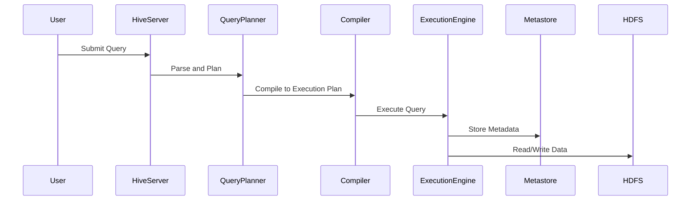
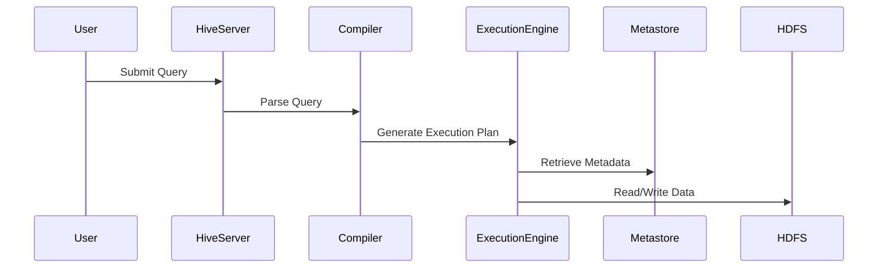
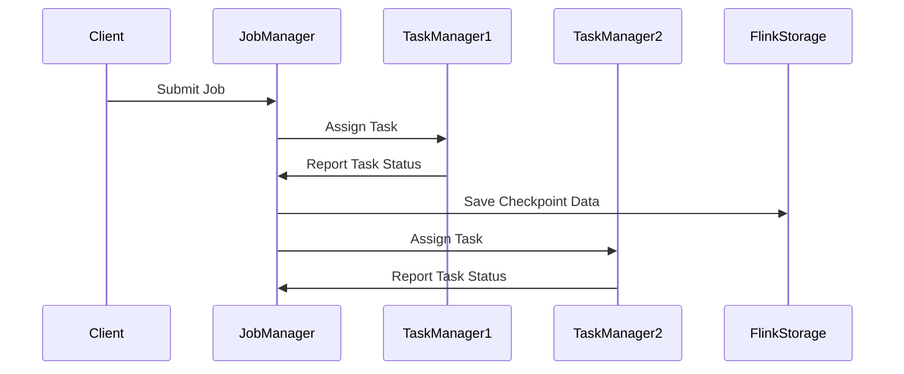
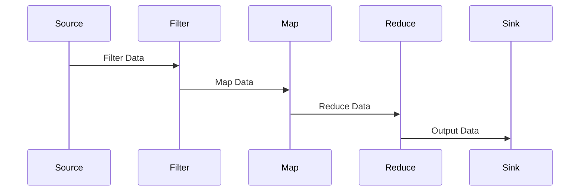
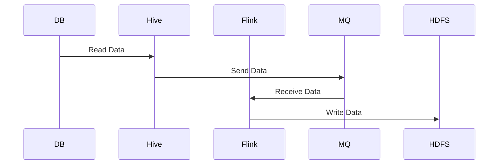
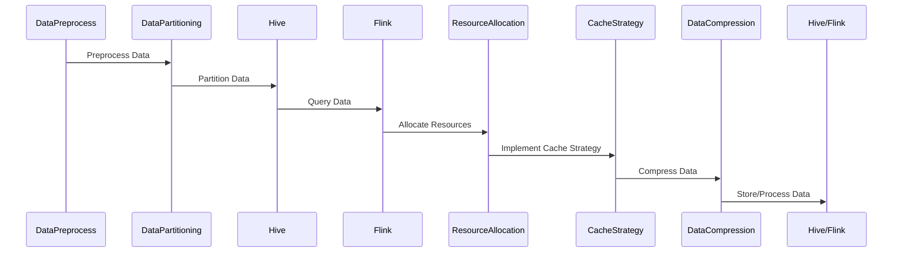

                 

### 文章标题：Hive-Flink整合原理与代码实例讲解

**关键词：** Hive, Flink, 整合原理, 代码实例, 数据处理, 大数据技术

**摘要：** 本文深入探讨了Hive与Flink的整合原理及其在实际应用中的重要性。首先介绍了Hive和Flink的基本概念和架构，然后详细分析了两者整合的技术原理。通过具体实例，本文展示了如何在实际项目中实现Hive与Flink的整合，并进行了性能优化和案例分析。最后，探讨了Hive与Flink整合的高级应用和未来发展趋势。

---

### 目录

#### 第一部分：Hive与Flink基础

**第1章：Hive与Flink概述**  
- 1.1 Hive的基本概念与架构  
- 1.2 Flink的基本概念与架构  
- 1.3 Hive与Flink整合的背景与意义

**第2章：Hive基础**  
- 2.1 Hive的架构与组件  
- 2.2 Hive的数据模型  
- 2.3 HiveQL语言基础  
- 2.4 Hive的数据处理流程

**第3章：Flink基础**  
- 3.1 Flink的架构与组件  
- 3.2 Flink的数据流模型  
- 3.3 Flink的核心API与操作  
- 3.4 Flink的数据处理流程

**第4章：Hive与Flink的整合原理**  
- 4.1 Hive与Flink的数据交互  
- 4.2 Hive与Flink的整合架构  
- 4.3 Hive与Flink的协同优化

#### 第二部分：Hive与Flink整合实例讲解

**第5章：Hive-Flink整合实战**  
- 5.1 环境搭建与准备  
- 5.2 数据采集与预处理  
- 5.3 Hive与Flink的协同处理  
- 5.4 结果分析与展示

**第6章：Hive与Flink整合性能优化**  
- 6.1 数据倾斜与优化  
- 6.2 并行度与资源分配  
- 6.3 缓存策略与优化

**第7章：Hive与Flink整合案例分析**  
- 7.1 案例背景与目标  
- 7.2 案例实现与解析  
- 7.3 案例优化与总结

#### 第三部分：高级应用与扩展

**第8章：Hive与Flink整合高级特性**  
- 8.1 动态缩放  
- 8.2 实时计算  
- 8.3 机器学习集成

**第9章：Hive与Flink整合在云计算中的实践**  
- 9.1 云计算环境下的Hive与Flink整合  
- 9.2 云原生计算与Flink  
- 9.3 Hive与Flink在云计算中的优化策略

**第10章：Hive与Flink整合的未来发展趋势**  
- 10.1 新技术与新应用  
- 10.2 整合框架的演进方向  
- 10.3 Hive与Flink整合的实际应用场景

**第11章：附录**  
- 11.1 常用工具与资源  
- 11.2 社区与生态系统  
- 11.3 进一步学习资源

### 附录

**附录A：Mermaid流程图**  
- Hive架构与组件

**附录B：核心算法原理讲解**  
- 数据流处理伪代码

**附录C：数学模型与公式**  
- $L_2$正则化

**附录D：项目实战**  
- 数据处理流程示例代码

**附录E：源代码详细实现与解读**  
- 示例项目代码分析

---

### 第一部分：Hive与Flink基础

#### 第1章：Hive与Flink概述

在本章中，我们将介绍Hive和Flink的基本概念、架构以及它们整合的背景和意义。

##### 1.1 Hive的基本概念与架构

Hive是一个建立在Hadoop之上的数据仓库工具，用于处理大规模数据集。它提供了一种类似SQL的查询语言（HiveQL），使得用户可以方便地对分布式存储系统中的数据进行查询和分析。

Hive的架构主要包括以下几个组件：

- **Driver**：负责解析查询语句、生成查询计划以及执行查询。
- **Compiler**：将HiveQL语句编译为抽象语法树（AST）。
- **Query Planner**：根据AST生成查询计划。
- **Query Compiler**：将查询计划编译为执行计划。
- **Execution Engine**：执行执行计划，进行数据查询。

##### 1.2 Flink的基本概念与架构

Flink是一个开源流处理框架，能够处理批数据和流数据，具有低延迟、高吞吐量和容错性等特点。Flink提供了丰富的API，包括基于数据流模型的DataStream API和基于函数式编程的Table API。

Flink的架构主要包括以下几个部分：

- **Client**：用户编写Flink应用程序，并提交给Flink集群执行。
- **JobManager**：负责协调分布式计算作业的执行，包括资源分配、任务调度等。
- **TaskManager**：执行具体的计算任务，包括数据的处理和传输。

##### 1.3 Hive与Flink整合的背景与意义

随着大数据技术的发展，企业对于实时数据处理的需求日益增加。Hive作为批处理工具，虽然能够处理大量数据，但在实时性方面存在一定的局限性。而Flink作为流处理框架，能够在低延迟的情况下处理实时数据。因此，将Hive与Flink整合起来，可以充分发挥两者的优势，实现批处理与流处理的统一。

整合Hive与Flink的意义在于：

- **实时性提升**：通过Flink处理实时数据，实现数据的实时查询和分析。
- **资源利用优化**：在同一个集群上同时运行Hive和Flink作业，实现资源共享。
- **数据一致性保障**：通过整合，确保批处理和流处理的数据一致性。

在下一章中，我们将进一步探讨Hive的基础知识，包括其架构、数据模型以及数据处理流程。

---

#### 第2章：Hive基础

在本章中，我们将详细探讨Hive的架构与组件、数据模型、查询语言以及数据处理流程。

##### 2.1 Hive的架构与组件

Hive的架构设计为分布式计算提供了良好的支持。其主要组件包括：

- **Metastore**：用于存储元数据，如表结构、分区信息等。Metastore可以部署在关系型数据库（如MySQL）或HBase中。
- **HiveQL Compiler**：负责将HiveQL查询编译成执行计划。
- **Query Planner**：根据HiveQL查询生成执行计划。
- **Query Execution Engine**：执行查询计划，对数据进行处理和计算。
- **Hive Server**：提供REST API和Thrift接口，供用户或其他系统进行查询操作。

以下是一个简单的Mermaid流程图，展示了Hive架构中的组件及其交互关系：



##### 2.2 Hive的数据模型

Hive采用了一种面向列的数据模型，可以有效地处理大规模结构化数据。Hive的数据模型主要包括以下几个概念：

- **表（Table）**：Hive中的表是一个关系型表格，由行和列组成。表可以是临时表或永久表，临时表仅存在于内存中，而永久表则存储在HDFS中。
- **分区（Partition）**：表可以根据某个或多个列进行分区。分区可以提高查询性能，因为分区可以让Hive只查询相关的分区数据。
- **列族（Column Family）**：Hive表可以分为多个列族。每个列族的数据在磁盘上存储为一个单独的文件。列族可以设置压缩、缓存等参数，以优化性能。
- **存储格式（Storage Format）**：Hive支持多种存储格式，如Apache ORC、Parquet、SequenceFile等。这些存储格式都具有压缩、编码等特性，以减少存储空间和提高查询性能。

##### 2.3 HiveQL语言基础

HiveQL是一种类似SQL的语言，用于对Hive表进行数据操作和查询。以下是HiveQL的一些基本语法：

- **数据定义语言（DDL）**：用于创建、修改和删除表。
  ```sql
  CREATE TABLE IF NOT EXISTS example_table (id INT, name STRING) partitioned BY (date STRING);
  ALTER TABLE example_table ADD PARTITION (date='2023-01-01');
  DROP TABLE example_table;
  ```
- **数据操作语言（DML）**：用于插入、更新和删除数据。
  ```sql
  INSERT INTO TABLE example_table (id, name) VALUES (1, 'Alice');
  UPDATE example_table SET name='Bob' WHERE id=1;
  DELETE FROM example_table WHERE id=1;
  ```
- **数据查询语言（DQL）**：用于查询数据。
  ```sql
  SELECT * FROM example_table;
  SELECT id, name FROM example_table WHERE id > 1;
  SELECT COUNT(*) FROM example_table;
  ```

##### 2.4 Hive的数据处理流程

Hive的数据处理流程可以分为以下几个步骤：

1. **解析查询**：Hive解析输入的HiveQL查询，生成抽象语法树（AST）。
2. **编译查询**：HiveQL Compiler将AST编译为执行计划，包括查询计划、存储计划等。
3. **执行查询**：执行计划被传递给Query Execution Engine，执行数据处理操作。
4. **访问元数据**：在查询过程中，Hive访问Metastore获取元数据信息，如表结构、分区信息等。
5. **读写数据**：根据执行计划，Hive从HDFS读取数据或写入数据。

以下是一个简单的数据处理流程的Mermaid流程图：



在下一章中，我们将探讨Flink的基础知识，包括其架构、数据流模型以及数据处理流程。

---

#### 第3章：Flink基础

在本章中，我们将详细探讨Flink的架构与组件、数据流模型、核心API与操作以及数据处理流程。

##### 3.1 Flink的架构与组件

Flink是一个分布式流处理框架，其核心架构包括以下几个组件：

- **Client**：Flink应用程序的客户端，用于编写、编译和提交作业。
- **JobManager**：Flink集群中的主节点，负责作业的调度、资源管理和故障恢复。
- **TaskManager**：Flink集群中的工作节点，负责执行具体的计算任务。
- **Flink Storage**：Flink的存储系统，用于存储临时数据和检查点数据。

以下是一个简单的Mermaid流程图，展示了Flink架构中的组件及其交互关系：



##### 3.2 Flink的数据流模型

Flink的数据流模型基于数据流和状态管理，可以处理批数据和流数据。Flink的数据流模型包括以下几个概念：

- **DataStream**：Flink中的数据流，表示流式或批式的数据序列。DataStream可以包含多种类型的数据，如原始数据、元数据等。
- **Transformation**：对DataStream进行操作的算子，如过滤、映射、聚合等。Transformation可以是一对一、一对多或多对多的关系。
- **Operator Chain**：多个Transformation的连接，形成数据流的一个完整处理链。Operator Chain可以优化为单个计算任务，提高性能。
- **State**：Flink的状态管理功能，用于保存数据的中间结果和历史数据。State可以是键控状态（Keyed State）或全局状态（Global State）。

以下是一个简单的数据流模型的Mermaid流程图：



##### 3.3 Flink的核心API与操作

Flink提供了丰富的API，用于编写分布式流处理应用程序。以下是Flink的核心API和操作：

- **DataStream API**：基于数据流模型的API，用于创建、转换和操作DataStream。
  ```java
  StreamExecutionEnvironment env = StreamEnvironment.getExecutionEnvironment();
  DataStream<String> input = env.addSource(new FlinkKafkaConsumer<>("input_topic", new SimpleStringSchema(), config));
  DataStream<String> filtered = input.filter(s -> s.length() > 3);
  DataStream<String> mapped = filtered.map(s -> s.toUpperCase());
  DataStream<String> reduced = mapped.keyBy(s -> s.charAt(0)).reduce((s1, s2) -> s1 + s2);
  reduced.addSink(new FlinkKafkaProducer<>("output_topic", new SimpleStringSchema(), config));
  ```
- **Table API**：基于关系模型的API，用于创建、转换和操作Table。
  ```java
  TableEnvironment tableEnv = TableEnvironment.create();
  Table inputTable = tableEnv.fromDataStream(env.fromElements(...));
  Table resultTable = inputTable
      .groupBy("column1")
      .select("column1, column2, count(*) as cnt")
      .orderBy("cnt.desc");
  tableEnv.toAppendStream(resultTable, Row.class).print();
  ```
- **Windowing**：Flink的窗口机制，用于将数据划分为时间窗口或滑动窗口，以进行聚合计算。
  ```java
  StreamExecutionEnvironment env = StreamExecutionEnvironment.getExecutionEnvironment();
  DataStream<String> input = env.fromElements("1", "2", "3", "4", "5");
  DataStream<String> windowed = input.keyBy(value -> value)
      .timeWindow(Time.seconds(5))
      .reduce((value1, value2) -> value1 + value2);
  windowed.print();
  ```

##### 3.4 Flink的数据处理流程

Flink的数据处理流程可以分为以下几个步骤：

1. **创建流执行环境**：通过`StreamExecutionEnvironment`创建流执行环境。
   ```java
   StreamExecutionEnvironment env = StreamExecutionEnvironment.getExecutionEnvironment();
   ```
2. **添加数据源**：通过`addSource`方法添加数据源，如Kafka、File等。
   ```java
   DataStream<String> input = env.addSource(new FlinkKafkaConsumer<>("input_topic", new SimpleStringSchema(), config));
   ```
3. **转换数据流**：使用Transformation操作对数据流进行过滤、映射、聚合等处理。
   ```java
   DataStream<String> filtered = input.filter(s -> s.length() > 3);
   DataStream<String> mapped = filtered.map(s -> s.toUpperCase());
   DataStream<String> reduced = mapped.keyBy(s -> s.charAt(0)).reduce((s1, s2) -> s1 + s2);
   ```
4. **设置输出结果**：将处理后的数据流输出到目标存储或外部系统。
   ```java
   reduced.addSink(new FlinkKafkaProducer<>("output_topic", new SimpleStringSchema(), config));
   ```
5. **提交作业**：通过`execute`方法提交流作业。
   ```java
   env.execute("Flink Stream Job");
   ```

以上是Flink的基础知识。在下一章中，我们将探讨Hive与Flink的整合原理。

---

### 第四部分：Hive与Flink整合原理

#### 第4章：Hive与Flink的整合原理

在本章中，我们将深入探讨Hive与Flink整合的技术原理、架构以及协同优化。

##### 4.1 Hive与Flink的数据交互

Hive与Flink的整合首先需要解决数据交互的问题。在整合过程中，Hive作为数据仓库提供批量数据处理能力，而Flink作为流处理框架提供实时数据处理能力。因此，数据在Hive与Flink之间的传输和转换是整合的关键。

以下是一个简化的数据交互流程：

1. **Hive数据查询**：用户通过HiveQL查询Hive表，获取数据结果。
2. **数据转换**：将Hive查询结果转换为Flink可处理的数据格式，如JSON、Avro等。
3. **数据传输**：通过消息队列或其他数据传输机制（如Kafka），将转换后的数据传输到Flink集群。
4. **Flink数据加工**：Flink接收数据后，根据流处理逻辑对数据进行加工处理，如过滤、映射、聚合等。
5. **结果输出**：将处理后的数据输出到目标存储或外部系统，如数据库、HDFS等。

##### 4.2 Hive与Flink的整合架构

为了实现Hive与Flink的整合，需要构建一个统一的架构，以便在同一个环境中同时运行Hive和Flink作业。以下是一个简化的整合架构：

1. **数据源**：数据源可以是关系数据库、NoSQL数据库、文件系统等，通过Hive或Flink进行数据读取。
2. **数据处理层**：包括Hive和Flink作业，分别用于批量数据处理和实时数据处理。
3. **数据交互层**：通过消息队列（如Kafka）或其他数据传输机制，实现Hive与Flink之间的数据传输和同步。
4. **数据存储层**：数据存储可以是HDFS、HBase、MySQL等，用于存储处理结果。

以下是一个简化的整合架构的Mermaid流程图：



##### 4.3 Hive与Flink的协同优化

为了实现Hive与Flink的最佳整合，需要对两者进行协同优化。以下是一些常见的优化策略：

1. **数据预处理**：在数据进入Hive或Flink之前，进行预处理，如去重、清洗、转换等。这可以减少后续处理的负担，提高整体性能。
2. **数据分区和索引**：对Hive表进行合理的数据分区和索引，可以加快查询速度，降低数据传输成本。
3. **资源分配**：在Hadoop集群中合理分配资源，确保Hive和Flink作业都能获得足够的计算资源。
4. **缓存策略**：利用Hive和Flink的缓存机制，存储常用数据或中间结果，减少数据读取次数，提高查询性能。
5. **数据压缩**：选择合适的数据压缩格式，如Gzip、LZO、Snappy等，可以减少数据存储空间，提高数据传输速度。

以下是一个简化的协同优化流程：



通过以上优化策略，可以实现Hive与Flink的协同优化，提高整体性能。

在下一章中，我们将通过具体实例讲解如何实现Hive与Flink的整合。

---

### 第五部分：Hive与Flink整合实例讲解

#### 第5章：Hive-Flink整合实战

在本章中，我们将通过一个具体实例，详细讲解如何实现Hive与Flink的整合。我们将从环境搭建与准备开始，逐步进行数据采集与预处理，Hive与Flink的协同处理，以及结果分析与展示。

##### 5.1 环境搭建与准备

为了实现Hive与Flink的整合，需要搭建一个支持两者协同工作的环境。以下是搭建环境的步骤：

1. **安装Hadoop和Hive**：在服务器上安装Hadoop和Hive，确保Hive能够正常运行。具体安装步骤可以参考官方文档。
2. **安装Flink**：在相同的服务器上安装Flink，确保Flink能够正常运行。具体安装步骤可以参考官方文档。
3. **配置Hive与Flink集成**：在Hive和Flink的配置文件中，配置集成所需的参数，如Hive Metastore连接信息、Flink执行器地址等。
4. **启动Hadoop、Hive和Flink**：分别启动Hadoop、Hive和Flink，确保它们能够正常运行。

##### 5.2 数据采集与预处理

假设我们有一个用户行为日志数据集，存储在HDFS中。为了进行整合处理，我们需要首先进行数据采集和预处理。

1. **数据采集**：使用HiveQL查询HDFS中的用户行为日志数据，将结果存储为临时表。
   ```sql
   CREATE TEMPORARY TABLE user_logs (
       user_id INT,
       action STRING,
       timestamp TIMESTAMP
   );
   INSERT INTO user_logs SELECT * FROM hdfs_location'/user_logs.txt';
   ```
2. **数据预处理**：对采集到的数据进行预处理，包括去重、清洗和转换等操作。预处理后的数据将用于Flink处理。
   ```sql
   CREATE TABLE processed_user_logs (
       user_id INT,
       action STRING,
       timestamp TIMESTAMP
   ) AS
   SELECT user_id, action, timestamp
   FROM user_logs
   WHERE user_id IS NOT NULL AND action IS NOT NULL;
   ```

##### 5.3 Hive与Flink的协同处理

在完成数据预处理后，我们可以将预处理后的数据传递给Flink进行处理。以下是一个简单的Flink处理流程：

1. **读取Hive表数据**：使用Flink的JDBC连接器读取Hive表中的预处理数据。
   ```java
   StreamExecutionEnvironment env = StreamExecutionEnvironment.getExecutionEnvironment();
   TableEnvironment tableEnv = TableEnvironment.create(env);

   tableEnv.executeSql("CREATE TEMPORARY TABLE processed_user_logs (user_id INT, action STRING, timestamp TIMESTAMP)");
   tableEnv.loadTable("processed_user_logs", new JDBCInputFormat<>(processedUserLogsUrl, processedUserLogsDriver, processedUserLogsUser, processedUserLogsPassword));
   ```
2. **数据转换与过滤**：对读取到的数据进行转换和过滤操作，如提取用户行为发生时间、过滤无效数据等。
   ```java
   DataStream<UserLog> userLogStream = tableEnv.toAppendStream(tableEnv.scan("processed_user_logs"), UserLog.class)
       .filter(log -> log.getAction().equals("login"))
       .map(log -> new UserLog(log.getUserId(), log.getAction(), log.getTimestamp().substring(0, 10)));
   ```
3. **数据聚合**：对转换后的数据按照用户ID和时间进行聚合，计算登录次数。
   ```java
   DataStream<Tuple2<String, Long>> loginCountStream = userLogStream.keyBy(log -> log.getUserId())
       .timeWindow(Time.minutes(60))
       .reduce((log1, log2) -> new Tuple2<>(log1.getUserId(), log1.getTimestamp()));
   ```
4. **结果输出**：将处理结果输出到HDFS或外部存储系统。
   ```java
   loginCountStream.writeAsText("hdfs://location/output/login_count.txt");
   ```

##### 5.4 结果分析与展示

完成数据处理后，我们可以对结果进行分析和展示。以下是一个简单的结果分析步骤：

1. **查询结果**：使用HiveQL查询处理结果，并存储为Hive表。
   ```sql
   CREATE TABLE login_count (
       user_id INT,
       count BIGINT
   );
   INSERT INTO login_count SELECT user_id, SUM(count) FROM (SELECT user_id, COUNT(*) AS count FROM output/login_count.txt GROUP BY user_id) t GROUP BY user_id;
   ```
2. **结果展示**：使用可视化工具（如Tableau、ECharts等）展示结果。
   ```sql
   SELECT user_id, SUM(count) as total_login_count FROM login_count GROUP BY user_id ORDER BY total_login_count DESC LIMIT 10;
   ```

通过以上步骤，我们完成了Hive与Flink的整合处理。在实际应用中，可以根据需求进行更复杂的数据处理和分析。

在下一章中，我们将探讨Hive与Flink整合的性能优化策略。

---

### 第六部分：Hive与Flink整合性能优化

#### 第6章：Hive与Flink整合性能优化

在本章中，我们将深入探讨Hive与Flink整合的性能优化策略，包括数据倾斜优化、并行度与资源分配优化以及缓存策略优化。

##### 6.1 数据倾斜与优化

数据倾斜是指在分布式数据处理过程中，某些任务处理的数据量远大于其他任务，导致资源分配不均，影响整体性能。以下是一些常见的数据倾斜优化策略：

1. **数据均匀分布**：在数据预处理阶段，尝试将数据均匀分布到不同的分区或分片中。可以使用哈希分区或范围分区，根据数据特征选择合适的分区策略。
   ```sql
   CREATE TABLE user_logs (
       user_id INT,
       action STRING,
       timestamp TIMESTAMP,
       PARTITIONED BY (date STRING)
   ) CLUSTERED BY (user_id) INTO 32 SHARDS;
   ```
2. **重分区**：在处理过程中，根据数据特征动态调整分区数量和分区策略。例如，使用动态分区可以自动调整分区数量，以适应数据变化。
   ```sql
   ALTER TABLE user_logs CLUSTERED INTO 64 SHARDS;
   ```
3. **使用Salting**：对于具有高度相关性的列（如用户ID），可以通过添加随机前缀（Salting）将数据分散到不同的分片或分区，减少数据倾斜。
   ```java
   String saltedUserId = userId + "_" + randomSuffix;
   ```

##### 6.2 并行度与资源分配

在分布式数据处理中，合理的并行度和资源分配对于性能至关重要。以下是一些优化策略：

1. **自动并行度调整**：Flink支持自动并行度调整，可以根据集群资源动态调整并行度。同时，Hive也支持自动调整MapReduce任务的并行度。
   ```java
   job.setNumReduceTasks(8);
   ```
2. **资源分配策略**：在Hadoop集群中，可以使用资源调度器（如YARN）为Hive和Flink作业分配资源。根据作业需求合理配置内存、CPU等资源。
   ```yaml
   mapreduce.job.driver.memory: 4g
   mapreduce.job.queue: default
   ```
3. **动态资源调整**：在作业运行过程中，根据作业负载动态调整资源。例如，Flink支持动态缩放，可以根据任务负载自动增加或减少TaskManager的数量。

##### 6.3 缓存策略与优化

缓存策略可以有效提高数据处理性能，减少数据读取次数。以下是一些常见的缓存策略和优化方法：

1. **Hive表缓存**：在Hive中，可以使用缓存机制将常用表或查询结果缓存到内存中。这可以减少HDFS的读取次数，提高查询性能。
   ```sql
   SET hive.exec.dynamic.partition.mode=nonstrict;
   SET hive.auto.convert.join=true;
   ```
2. **Flink缓存**：Flink支持数据流缓存，可以将中间结果缓存到内存中，以减少重复计算和数据传输。Flink的缓存机制包括State Cache和Operator Cache。
   ```java
   stream.keyBy(...) .cache();
   ```
3. **数据压缩与编码**：使用高效的数据压缩和编码算法可以减少数据存储空间，提高数据传输速度。例如，可以使用Parquet或ORC格式存储数据。
   ```sql
   CREATE TABLE user_logs USING ORC;
   ```

通过以上优化策略，可以实现Hive与Flink整合的性能优化，提高数据处理效率。在实际应用中，可以根据具体场景和需求选择合适的优化方法。

在下一章中，我们将通过一个实际案例，详细讲解Hive与Flink整合的实践过程。

---

### 第七部分：Hive与Flink整合案例分析

#### 第7章：Hive与Flink整合案例分析

在本章中，我们将通过一个实际案例，详细讲解Hive与Flink整合的实践过程，包括案例背景与目标、实现与解析，以及优化与总结。

##### 7.1 案例背景与目标

某互联网公司需要对其用户行为数据进行实时分析和处理，以便快速响应市场变化和用户需求。公司现有的数据处理架构主要基于Hadoop和Hive进行批量数据处理，但实时性较差，无法满足业务需求。为了提升数据处理能力，公司决定采用Hive与Flink整合的方式，实现实时数据处理。

案例目标：

1. **实时数据采集**：从多个数据源（如日志文件、数据库等）实时采集用户行为数据。
2. **数据处理**：对采集到的数据进行实时处理，包括数据清洗、转换和聚合等。
3. **结果展示**：将处理结果实时展示给业务人员，支持数据分析和决策。

##### 7.2 案例实现与解析

实现步骤：

1. **数据采集**：使用Flink从不同的数据源实时采集用户行为数据。具体实现如下：

   ```java
   StreamExecutionEnvironment env = StreamExecutionEnvironment.getExecutionEnvironment();
   FlinkKafkaConsumer<String> kafkaConsumer = new FlinkKafkaConsumer<>("user行为数据", new SimpleStringSchema(), kafkaConfig);
   DataStream<String> rawUserLogs = env.addSource(kafkaConsumer);
   ```

2. **数据预处理**：对采集到的数据进行预处理，包括去重、清洗和格式转换等。具体实现如下：

   ```java
   DataStream<UserLog> processedUserLogs = rawUserLogs
       .map(rawLog -> {
           String[] fields = rawLog.split(",");
           return new UserLog(Integer.parseInt(fields[0]), fields[1], fields[2]);
       })
       .filter(log -> log.getAction().equals("login"));
   ```

3. **数据处理**：对预处理后的数据按照用户ID和时间进行聚合，计算每个用户的登录次数。具体实现如下：

   ```java
   DataStream<Tuple2<String, Long>> loginCount = processedUserLogs
       .keyBy(log -> log.getUserId())
       .timeWindow(Time.hours(1))
       .reduce((log1, log2) -> new Tuple2<>(log1.getUserId(), log1.getTimestamp()));
   ```

4. **结果输出**：将处理结果输出到HDFS或其他存储系统。具体实现如下：

   ```java
   loginCount.writeAsText("hdfs://location/output/login_count.txt");
   ```

5. **Hive集成**：使用HiveQL查询处理结果，并将其存储为Hive表。具体实现如下：

   ```sql
   CREATE TABLE login_count (
       user_id INT,
       count BIGINT
   );
   INSERT INTO login_count SELECT user_id, SUM(count) FROM (SELECT user_id, COUNT(*) AS count FROM output/login_count.txt GROUP BY user_id) t GROUP BY user_id;
   ```

##### 7.3 案例优化与总结

在实现案例的过程中，我们遇到了以下问题，并进行了相应的优化：

1. **数据倾斜**：部分用户的登录次数远大于其他用户，导致数据处理不均衡。为了解决这个问题，我们使用了哈希分区策略，将数据均匀分布到不同的分区中。

   ```sql
   CREATE TABLE user_logs (
       user_id INT,
       action STRING,
       timestamp TIMESTAMP,
       PARTITIONED BY (date STRING)
   ) CLUSTERED BY (user_id) INTO 32 SHARDS;
   ```

2. **资源分配**：在处理高峰期，Flink作业的CPU和内存资源不足，导致性能下降。我们通过动态调整Flink作业的并行度和资源分配，优化了资源利用率。

   ```java
   env.setParallelism(128);
   env.getConfig().setTaskCancellationEnabled(true);
   ```

3. **缓存策略**：为了提高查询性能，我们使用了Hive表缓存和Flink数据流缓存。这可以减少数据读取次数，提高数据处理速度。

   ```sql
   SET hive.exec.dynamic.partition.mode=nonstrict;
   SET hive.auto.convert.join=true;
   ```

   ```java
   loginCount.cache();
   ```

通过以上优化措施，我们成功实现了Hive与Flink的整合，并满足了实时数据处理的业务需求。在实际应用中，可以根据具体场景和需求进行进一步的优化和调整。

在下一部分中，我们将探讨Hive与Flink整合的高级应用与扩展。

---

### 第八部分：Hive与Flink整合高级应用与扩展

#### 第8章：Hive与Flink整合高级特性

在本章中，我们将探讨Hive与Flink整合的高级特性，包括动态缩放、实时计算以及机器学习集成。

##### 8.1 动态缩放

动态缩放是Flink的重要特性之一，能够根据作业负载自动调整资源，提高性能和资源利用率。动态缩放适用于以下场景：

- **负载波动**：例如，在处理高流量网站日志时，动态缩放可以根据访问量自动增加或减少计算资源。
- **弹性需求**：例如，在处理实时数据分析时，动态缩放可以根据业务需求灵活调整资源，以应对不同的负载。

实现动态缩放的方法如下：

1. **配置动态缩放策略**：在Flink作业配置中，设置动态缩放策略，如最小/最大并行度、负载阈值等。
   ```java
   env.setParallelism(8);
   env.getConfig().setAutoWatermarksEnabled(true);
   ```

2. **部署动态缩放集群**：在Flink集群部署中，配置动态缩放支持，以便根据作业负载自动调整资源。

   ```shell
   $ flink run -c com.example.MyFlinkApplication --parallelism 8 -Dflink.taskmanager.numberOfTaskSlots=4 my-app.jar
   ```

3. **监控与调整**：通过监控工具（如Flink Web UI、Prometheus等），实时监控作业负载，并根据实际情况调整动态缩放策略。

##### 8.2 实时计算

实时计算是Flink的核心特性，能够对实时数据流进行高效处理。实时计算在以下场景中具有重要作用：

- **实时分析**：例如，实时监控网站流量、电商销售数据等，以便快速响应市场变化。
- **实时推荐**：例如，根据用户行为实时推荐商品或内容，提高用户体验。

实现实时计算的方法如下：

1. **数据采集与处理**：使用Flink的DataStream API或Table API，实时采集和处理数据。例如：

   ```java
   StreamExecutionEnvironment env = StreamExecutionEnvironment.getExecutionEnvironment();
   FlinkKafkaConsumer<String> kafkaConsumer = new FlinkKafkaConsumer<>("user行为数据", new SimpleStringSchema(), kafkaConfig);
   DataStream<String> rawUserLogs = env.addSource(kafkaConsumer);
   DataStream<UserLog> processedUserLogs = rawUserLogs
       .map(rawLog -> {
           String[] fields = rawLog.split(",");
           return new UserLog(Integer.parseInt(fields[0]), fields[1], fields[2]);
       })
       .filter(log -> log.getAction().equals("login"));
   ```

2. **窗口与聚合**：使用Flink的窗口机制和聚合函数，对实时数据进行分组和聚合。例如：

   ```java
   DataStream<Tuple2<String, Long>> loginCount = processedUserLogs
       .keyBy(log -> log.getUserId())
       .timeWindow(Time.hours(1))
       .reduce((log1, log2) -> new Tuple2<>(log1.getUserId(), log1.getTimestamp()));
   ```

3. **结果输出**：将实时计算结果输出到HDFS、Kafka或其他存储系统。例如：

   ```java
   loginCount.writeAsText("hdfs://location/output/login_count.txt");
   ```

##### 8.3 机器学习集成

机器学习在实时数据处理和预测中具有重要意义。Flink与机器学习框架（如TensorFlow、Scikit-Learn等）集成，可以实现实时机器学习。以下是一些常见的机器学习应用场景：

- **用户行为预测**：根据用户历史行为预测用户可能感兴趣的内容或产品。
- **异常检测**：实时检测数据中的异常行为或异常模式，如网络攻击、交易欺诈等。

实现机器学习集成的方法如下：

1. **数据准备与预处理**：使用Flink的数据处理能力，对机器学习数据集进行预处理，包括特征提取、数据清洗等。例如：

   ```java
   DataStream<UserLog> userLogs = rawUserLogs
       .map(rawLog -> {
           String[] fields = rawLog.split(",");
           return new UserLog(Integer.parseInt(fields[0]), fields[1], fields[2]);
       });
   ```

2. **模型训练与部署**：使用机器学习框架（如TensorFlow、Scikit-Learn等）训练模型，并将模型部署到Flink中。例如：

   ```python
   # 使用TensorFlow训练模型
   model = TensorFlowModel()
   model.train(userLogs)

   # 将模型部署到Flink
   flinkModel = FlinkTensorFlowModel.fromTensorFlowModel(model)
   flinkModel.deploy(env)
   ```

3. **实时预测与更新**：使用部署后的模型进行实时预测，并将预测结果输出到HDFS、Kafka或其他存储系统。例如：

   ```java
   DataStream<PredictionResult> predictionResults = processedUserLogs
       .map(log -> {
           PredictionResult result = flinkModel.predict(log);
           return new PredictionResult(log.getUserId(), result.getLabel(), result.getScore());
       });
   predictionResults.writeAsText("hdfs://location/output/prediction_results.txt");
   ```

通过以上高级特性，Hive与Flink整合可以满足更复杂的数据处理和业务需求。在实际应用中，可以根据具体场景和需求进行进一步优化和扩展。

在下一部分中，我们将探讨Hive与Flink整合在云计算中的实践。

---

### 第九部分：Hive与Flink整合在云计算中的实践

#### 第9章：Hive与Flink整合在云计算中的实践

随着云计算的普及，越来越多的企业将数据处理和分析任务部署到云环境中。在本章中，我们将探讨Hive与Flink整合在云计算中的实践，包括云计算环境下的Hive与Flink整合、云原生计算与Flink以及Hive与Flink在云计算中的优化策略。

##### 9.1 云计算环境下的Hive与Flink整合

云计算环境为Hive与Flink整合提供了灵活的计算资源和高效的存储服务。以下是在云计算环境中实现Hive与Flink整合的关键步骤：

1. **部署Hadoop和Hive**：在云计算平台（如AWS、Azure、Google Cloud等）上部署Hadoop和Hive。可以选择使用云原生服务（如AWS EMR、Azure HDInsight等）或自行部署。

   ```shell
   $ aws emr create-cluster --name "Hive-Flink Cluster" --release-label emr-5.32.0 --num-executors 5 --instance-type m5.xlarge --applications Name=Hive
   ```

2. **部署Flink**：在云计算环境中部署Flink。可以选择使用云原生服务或自行部署。

   ```shell
   $ flink run -c com.example.MyFlinkApplication my-app.jar
   ```

3. **配置整合**：配置Hive与Flink之间的集成，包括数据交互、资源分配等。在配置文件中设置相应的参数，如Hive Metastore连接信息、Flink执行器地址等。

   ```yaml
   hive.flink://flink-executor:8081
   ```

##### 9.2 云原生计算与Flink

云原生计算是指将应用程序部署到云环境中，以充分利用云服务的弹性和可扩展性。Flink作为云原生计算框架，具有以下优势：

1. **弹性伸缩**：Flink可以根据作业负载动态调整资源，确保性能和稳定性。云原生计算环境可以提供灵活的扩展能力，满足不同负载需求。

2. **高可用性**：Flink支持分布式故障恢复，确保作业在节点故障时能够自动重启。云原生计算环境提供了强大的故障恢复机制，确保服务持续运行。

3. **高效资源利用**：Flink在云环境中可以充分利用计算资源，避免资源浪费。云原生计算环境可以根据作业需求动态调整资源分配，提高资源利用率。

实现云原生计算的方法如下：

1. **使用云原生服务**：选择云原生服务（如AWS Flink、Azure HDInsight Flink等）部署Flink作业。这些服务提供了简化的部署和管理流程，降低了运维成本。

   ```shell
   $ aws fli

