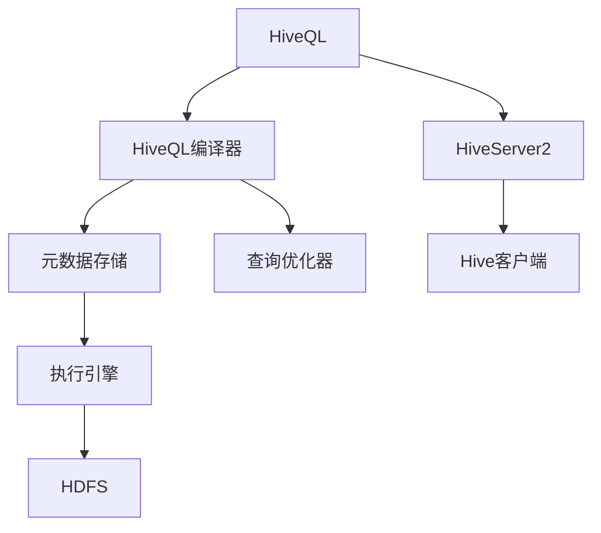
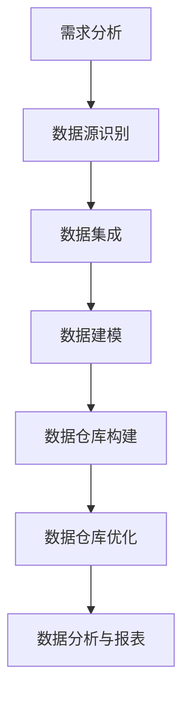
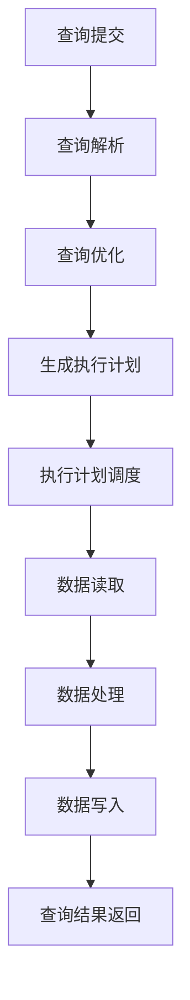

                 

# 《Hive原理与代码实例讲解》

> 关键词：Hive，大数据，Hadoop，数据仓库，数据查询，性能优化，实例分析

> 摘要：本文将深入讲解Hive的原理、架构、数据类型、SQL语法以及编程实践。通过具体的代码实例，我们将理解Hive在实际大数据处理场景中的应用，并提供性能优化和最佳实践指导。

---

### 《Hive原理与代码实例讲解》目录大纲

#### 第一部分: Hive基础理论

- **1.1 Hive概述**
  - **1.1.1 Hive的发展历史**
  - **1.1.2 Hive的核心概念**
  - **1.1.3 Hive的应用场景**

- **1.2 Hive架构**
  - **1.2.1 Hive架构概述**
  - **1.2.2 Hive组件详解**
  - **1.2.3 Hive与Hadoop生态系统**

- **1.3 Hive数据类型和数据模型**
  - **1.3.1 Hive数据类型**
  - **1.3.2 Hive数据模型**
  - **1.3.3 数据转换与处理**

- **1.4 Hive SQL语法**
  - **1.4.1 SELECT查询**
  - **1.4.2 数据过滤与排序**
  - **1.4.3 聚合函数与分组查询**

- **1.5 Hive常用操作**
  - **1.5.1 数据导入导出**
  - **1.5.2 数据分区和Bucketing**
  - **1.5.3 数据仓库优化**

- **1.6 Hive性能调优**
  - **1.6.1 Hive查询优化**
  - **1.6.2 Hive内存管理**
  - **1.6.3 Hive并发控制**

#### 第二部分: Hive编程实践

- **2.1 Hive编程基础**
  - **2.1.1 HiveQL基本语法**
  - **2.1.2 Hive编程模式**
  - **2.1.3 数据类型转换**

- **2.2 Hive UDF、UDAF和UDTF**
  - **2.2.1 UDF开发**
  - **2.2.2 UDAF开发**
  - **2.2.3 UDTF开发**

- **2.3 Hive与HiveQL高级特性**
  - **2.3.1 Hive视图**
  - **2.3.2 Hive索引**
  - **2.3.3 Hive事务处理**

- **2.4 Hive在数据仓库中的应用**
  - **2.4.1 数据仓库设计**
  - **2.4.2 数据仓库建模**
  - **2.4.3 数据仓库查询优化**

- **2.5 Hive与大数据处理框架集成**
  - **2.5.1 Hive与Spark集成**
  - **2.5.2 Hive与HDFS集成**
  - **2.5.3 Hive与HBase集成**

- **2.6 Hive案例实战**
  - **2.6.1 基于Hive的电商数据分析**
  - **2.6.2 基于Hive的用户行为分析**
  - **2.6.3 基于Hive的金融数据分析**

#### 第三部分: Hive高级特性与最佳实践

- **3.1 Hive on Spark**
  - **3.1.1 Hive on Spark架构**
  - **3.1.2 Hive on Spark编程模型**
  - **3.1.3 Hive on Spark性能优化**

- **3.2 Hive LLAP（Live Long and Process）**
  - **3.2.1 LLAP的概念与优势**
  - **3.2.2 LLAP的配置与使用**
  - **3.2.3 LLAP性能优化**

- **3.3 Hive云服务**
  - **3.3.1 Hive on Cloud概述**
  - **3.3.2 Hive on AWS**
  - **3.3.3 Hive on Azure**

- **3.4 Hive安全与权限管理**
  - **3.4.1 Hive安全策略**
  - **3.4.2 Hive权限管理**
  - **3.4.3 Hive安全最佳实践**

- **3.5 Hive最佳实践**
  - **3.5.1 设计最佳实践**
  - **3.5.2 编程最佳实践**
  - **3.5.3 性能优化最佳实践**

#### 附录

- **附录A: Hive工具与资源**
  - **A.1 Hive安装与配置**
  - **A.2 Hive常用工具**
  - **A.3 Hive资源与文档**

- **附录B: Mermaid流程图**
  - **B.1 Hive架构图**
  - **B.2 数据仓库设计流程图**
  - **B.3 Hive查询优化流程图**

- **附录C: 数学模型与公式**
  - **C.1 数据仓库建模公式**
  - **C.2 聚类算法公式**
  - **C.3 决策树算法公式**

- **附录D: 代码实例与分析**
  - **D.1 Hive UDF开发实例**
  - **D.2 Hive UDAF开发实例**
  - **D.3 Hive UDTF开发实例**
  - **D.4 Hive查询优化实例**
  - **D.5 Hive在数据仓库中的应用实例**

---

接下来，我们将深入探讨Hive的各个方面，从基础理论到编程实践，再到高级特性和最佳实践，帮助读者全面理解Hive的核心原理，并通过实例分析，掌握其在大数据处理中的应用技巧。让我们一起开始这段深入的探索之旅吧！## 1.1 Hive概述

### 1.1.1 Hive的发展历史

Hive作为Apache软件基金会下的一个开源项目，其发展历史可以追溯到2008年。当时，谷歌发布了其著名的Bigtable和MapReduce论文，引起了业界的广泛关注。许多公司开始意识到分布式计算和大数据处理的重要性。与此同时，Facebook也面临海量数据处理的需求，由此诞生了Hive的前身——Facebook数据库仓库（FBSQL）。

Hive的正式发布可以追溯到2009年，当时Facebook将其内部使用的FBSQL开源，并将其更名为Hive。Hive的第一个版本（0.1.0）于2009年发布。随后，Hive逐渐成为大数据生态系统中的一个重要组件，并被多家公司所采用，包括LinkedIn、eBay和Amazon等。

2010年，Hive成为Apache软件基金会的一个孵化项目。2011年，Hive成功毕业，成为Apache的一个顶级项目。随着时间的推移，Hive的功能和性能得到了不断优化和提升，逐渐成为大数据领域中的一颗璀璨明珠。

### 1.1.2 Hive的核心概念

#### Hive是什么

Hive是一个基于Hadoop的分布式数据仓库，它提供了简单的SQL查询接口，用于处理大规模数据集。它允许用户将结构化的数据文件映射为一张数据库表，并提供了一系列操作数据表的方法，如查询、聚合、排序和连接等。这使得非Java编程人员也能利用Hadoop处理大规模数据集。

#### Hive的特点

- **易用性**：Hive提供了类似于传统数据库的查询接口（HiveQL），使得熟悉SQL的用户能够快速上手。
- **分布式处理**：Hive基于Hadoop的分布式计算能力，能够高效处理大规模数据集。
- **扩展性**：Hive支持多种数据格式（如文本、SequenceFile、ORC等），且能够方便地扩展自定义数据格式。
- **高可用性**：通过Hadoop的容错机制，Hive能够在出现故障时自动恢复。

### 1.1.3 Hive的应用场景

Hive广泛应用于各种大数据处理场景，主要包括以下几种：

- **数据仓库**：Hive提供了强大的数据仓库功能，可以处理大规模数据集的批量查询和分析。
- **业务智能**：许多公司使用Hive来支持其业务智能（BI）系统，实现数据报表、数据挖掘和预测分析等。
- **数据整合**：Hive可以将不同来源的数据整合到一个统一的数据仓库中，便于后续的分析和处理。
- **实时分析**：尽管Hive主要用于批量处理，但通过与其他实时计算框架（如Spark）集成，可以实现实时数据分析和处理。

总之，Hive作为一个大数据处理工具，凭借其强大的数据处理能力和易用性，在数据仓库、业务智能和数据分析等领域得到了广泛的应用。

---

在了解了Hive的发展历史和核心概念后，接下来我们将进一步探讨Hive的架构和数据类型，帮助读者全面理解这个大数据处理工具的基础知识。请读者继续关注后续章节的内容。

## 1.2 Hive架构

### 1.2.1 Hive架构概述

Hive的架构设计旨在充分利用Hadoop的分布式存储和计算能力，提供高效且易于使用的数据仓库解决方案。Hive的整体架构可以分为几个关键组件，每个组件在数据处理过程中扮演着不同的角色。


#### 主要组件

1. **HiveQL编译器**：HiveQL编译器是Hive的核心组件，负责将用户编写的HiveQL查询语句解析、编译和优化。编译器将HiveQL查询转换为MapReduce作业，或者转换为其他执行引擎（如Spark）的执行计划。

2. **元数据存储**：元数据存储用于存储Hive的元数据信息，如数据库、表、字段、分区等信息。元数据存储通常使用关系型数据库（如MySQL、Derby等）来维护，确保数据的持久化和一致性。

3. **执行引擎**：执行引擎负责具体的数据处理和查询执行。Hive最初使用的是MapReduce执行引擎，但随着技术的发展，Hive也支持Spark、Tez等执行引擎。执行引擎根据编译器生成的执行计划，调度和执行数据处理任务。

4. **HDFS**：HDFS（Hadoop Distributed File System）是Hadoop的分布式文件系统，负责数据的存储。Hive将处理的数据存储在HDFS上，利用其分布式存储机制实现数据的可靠性和高性能。

#### 架构原理

Hive的工作原理可以分为以下几个步骤：

1. **查询提交**：用户通过HiveQL编写查询，并将其提交给Hive。

2. **编译和优化**：HiveQL编译器对查询语句进行解析、编译和优化。编译器将查询分解为多个阶段，如词法分析、语法分析、查询优化等。

3. **生成执行计划**：编译器根据优化的结果生成执行计划。执行计划通常是一个有向无环图（DAG），描述了数据的处理流程和任务的调度。

4. **执行**：执行引擎根据执行计划，在HDFS上调度和执行数据处理任务。执行引擎利用MapReduce或其他执行引擎的分布式计算能力，实现数据的高效处理。

5. **结果返回**：查询结果通过HDFS传输回客户端，用户可以进一步处理或展示。

通过这种架构设计，Hive能够充分利用Hadoop的分布式计算能力，实现大规模数据的高效处理和分析。同时，Hive的组件化和模块化设计使得其易于扩展和集成，方便用户根据需求进行定制和优化。

### 1.2.2 Hive组件详解

#### HiveQL编译器

HiveQL编译器是Hive的核心组件之一，负责将用户输入的HiveQL查询语句转换为执行计划。HiveQL编译器的工作流程主要包括以下几个阶段：

1. **词法分析**：将HiveQL查询语句分解为关键字、标识符、数字等基本元素，生成词法流（Token Stream）。

2. **语法分析**：根据词法流，构建查询语句的抽象语法树（AST）。语法分析器负责检查查询语句的语法正确性，并生成抽象语法树。

3. **查询优化**：对抽象语法树进行优化。查询优化器通过多种优化策略（如重写查询、数据分布优化等），提高查询的执行效率。

4. **逻辑计划生成**：将优化后的抽象语法树转换为逻辑查询计划。逻辑查询计划描述了查询的基本执行流程，但不涉及具体的执行细节。

5. **物理计划生成**：将逻辑查询计划转换为物理查询计划。物理查询计划包含了具体的执行细节，如数据扫描方式、执行顺序等。

#### 元数据存储

元数据存储用于存储Hive的元数据信息，如数据库、表、字段、分区等。Hive使用关系型数据库（如MySQL、Derby等）作为元数据存储。元数据存储的主要功能包括：

1. **元数据管理**：提供元数据的增删改查功能，确保元数据的一致性和完整性。

2. **元数据查询**：提供元数据的查询接口，允许用户查询数据库、表、字段等元数据信息。

3. **元数据同步**：提供元数据同步功能，确保不同Hive实例之间的元数据一致性。

#### 执行引擎

执行引擎是Hive的核心组件，负责具体的数据处理和查询执行。Hive支持多种执行引擎，如MapReduce、Spark、Tez等。执行引擎的工作流程主要包括以下几个阶段：

1. **任务调度**：根据物理查询计划，生成具体的任务调度计划。任务调度器负责将任务分配给不同的计算节点，确保任务的并行执行。

2. **数据读取**：根据查询计划，从HDFS或其他数据源读取数据。数据读取器负责数据的分区、过滤和加载。

3. **数据处理**：对读取到的数据进行各种操作，如过滤、排序、聚合等。数据处理器根据查询计划执行具体的计算任务。

4. **数据写入**：将处理结果写入到HDFS或其他数据源。数据写入器负责数据的存储和索引。

#### HDFS

HDFS（Hadoop Distributed File System）是Hadoop的分布式文件系统，负责数据的存储。HDFS的主要功能包括：

1. **数据存储**：将数据存储在分布式文件系统中，提供高可靠性、高扩展性和高性能的数据存储解决方案。

2. **数据备份**：通过数据备份机制，确保数据的可靠性和持久性。

3. **数据访问**：提供数据访问接口，允许用户通过HiveQL或其他工具对数据进行查询和分析。

### 1.2.3 Hive与Hadoop生态系统

Hive是Hadoop生态系统中的一个重要组件，与其他组件紧密集成，共同构建了一个强大且灵活的大数据处理平台。Hadoop生态系统主要包括以下几个关键组件：

1. **Hadoop YARN**：Hadoop YARN（Yet Another Resource Negotiator）是Hadoop的资源调度框架，负责资源的分配和任务调度。Hive利用YARN的资源调度能力，实现高效的任务执行。

2. **Hadoop MapReduce**：Hadoop MapReduce是Hadoop的分布式计算模型，用于处理大规模数据集。Hive最初使用MapReduce作为执行引擎，但随着技术的发展，Hive也支持其他执行引擎（如Spark、Tez等）。

3. **Hadoop HDFS**：Hadoop HDFS是Hadoop的分布式文件系统，负责数据的存储和访问。Hive将处理的数据存储在HDFS上，利用其分布式存储机制实现数据的高效处理。

4. **Hadoop HBase**：Hadoop HBase是一个分布式、可扩展的大规模列存储数据库，用于存储和访问海量数据。Hive与HBase集成，允许用户在HBase上执行复杂的查询和分析。

5. **Hadoop Spark**：Hadoop Spark是一个快速且通用的分布式计算引擎，用于处理大规模数据集。Hive与Spark集成，通过Spark引擎实现高效的查询执行。

6. **Hadoop ZooKeeper**：Hadoop ZooKeeper是一个分布式协调服务，用于维护集群状态、配置信息和元数据。Hive使用ZooKeeper来管理分布式元数据存储和协调任务执行。

通过这些组件的紧密集成，Hive能够充分利用Hadoop生态系统的优势，实现高效、可靠和可扩展的大数据处理。

---

在了解了Hive的架构和组件后，接下来我们将探讨Hive的数据类型和数据模型，帮助读者进一步理解Hive如何处理和表示数据。请读者继续关注后续章节的内容。

## 1.3 Hive数据类型和数据模型

### 1.3.1 Hive数据类型

Hive支持多种数据类型，这些数据类型不仅包括基本的数值类型和字符串类型，还包括复杂数据类型。了解Hive的数据类型对于编写高效的Hive查询至关重要。

#### 基本数据类型

1. **整型（TINYINT、SMALLINT、INT、BIGINT）**：
   - **TINYINT**：8位整数，范围-128到127。
   - **SMALLINT**：16位整数，范围-32,768到32,767。
   - **INT**：32位整数，范围-2,147,483,648到2,147,483,647。
   - **BIGINT**：64位整数，范围-9,223,372,036,854,775,808到9,223,372,036,854,775,807。

2. **浮点型（FLOAT、DOUBLE）**：
   - **FLOAT**：32位浮点数。
   - **DOUBLE**：64位浮点数。

3. **布尔型（BOOLEAN）**：用于表示真或假。

4. **字符串（STRING）**：用于表示字符序列。

#### 复杂数据类型

1. **数组（ARRAY）**：用于存储一组相同类型的元素。

2. **映射（MAP）**：用于存储键值对。

3. **结构（STRUCT）**：类似于复杂数组，但每个元素具有特定的数据类型。

4. **联合（UNIONTYPE）**：用于表示多个类型。

这些数据类型使得Hive能够灵活地处理各种类型的数据，满足不同的数据处理需求。

### 1.3.2 Hive数据模型

Hive的数据模型是基于HDFS文件系统的，其数据组织方式与HDFS的文件系统结构相对应。Hive的数据模型可以分为以下几种类型：

#### 文件格式

1. **文本文件（TEXT FILE）**：
   - 文本文件是最常见的文件格式，其中每行是一个记录，字段通过空格或逗号等分隔。
   - 示例：
     ```
     id,name,age
     1,Alice,30
     2,Bob,25
     ```

2. **序列化文件（SEQUENCE FILE）**：
   - 序列化文件是一种高效的存储格式，其中数据以二进制形式存储，支持压缩和随机访问。
   - 示例：
     ```
     1:Alice,30
     2:Bob,25
     ```

3. **ORC文件（ORC FILE）**：
   - ORC（Optimized Row Columnar）文件是一种优化的存储格式，适用于大规模数据查询，支持压缩和数据索引。
   - 示例：
     ```
     1,Alice,30
     2,Bob,25
     ```

#### 数据组织

1. **行存储（ROW STORE）**：
   - 行存储将数据按行存储，适合读操作频繁的场景，如日志分析。

2. **列存储（COLUMN STORE）**：
   - 列存储将数据按列存储，适合进行大量聚合和过滤操作，如数据分析。

### 1.3.3 数据转换与处理

Hive提供了丰富的数据转换与处理功能，支持数据清洗、转换、聚合和连接等操作。以下是一些常用的数据转换与处理方法：

1. **数据清洗**：
   - 使用`SELECT`语句和条件表达式，过滤和清洗不符合要求的数据。
   - 示例：
     ```sql
     SELECT * FROM users WHERE age > 18;
     ```

2. **数据转换**：
   - 使用`SELECT`语句和函数，对数据进行转换和格式化。
   - 示例：
     ```sql
     SELECT name, upper(name) FROM users;
     ```

3. **数据聚合**：
   - 使用`GROUP BY`和聚合函数（如`COUNT`、`SUM`、`AVG`等），对数据进行分组和聚合。
   - 示例：
     ```sql
     SELECT gender, COUNT(*) FROM users GROUP BY gender;
     ```

4. **数据连接**：
   - 使用`JOIN`操作，连接多个表并进行合并处理。
   - 示例：
     ```sql
     SELECT users.name, orders.order_id FROM users JOIN orders ON users.id = orders.user_id;
     ```

通过这些功能，Hive能够高效地处理大规模数据集，满足各种数据处理需求。

---

在了解了Hive的数据类型和数据模型后，接下来我们将探讨Hive的SQL语法，帮助读者掌握如何使用Hive进行数据查询和操作。请读者继续关注后续章节的内容。

## 1.4 Hive SQL语法

Hive提供了类似传统关系型数据库的SQL查询接口，称为HiveQL（Hive Query Language）。HiveQL使得熟悉SQL的用户能够轻松上手，编写复杂的查询来处理大规模数据集。本节将详细介绍HiveQL的各个组成部分，包括SELECT查询、数据过滤与排序、聚合函数与分组查询等。

### 1.4.1 SELECT查询

SELECT查询是Hive中最基本的查询语句，用于从表中选择所需的列和行。其基本语法如下：

```sql
SELECT [DISTINCT] column1, column2, ...
FROM table_name
WHERE condition;
```

其中，`DISTINCT`关键字用于去除重复行，`column1, column2, ...`指定要选择的列，`table_name`指定数据表名，`WHERE`子句用于指定选择条件。

#### 示例

假设我们有一个名为`users`的表，其中包含`id`、`name`和`age`列，以下是一个简单的SELECT查询示例：

```sql
SELECT id, name FROM users WHERE age > 30;
```

这个查询将返回`age`大于30的所有用户的`id`和`name`。

### 1.4.2 数据过滤与排序

在HiveQL中，可以使用`WHERE`子句对数据进行过滤，只选择满足特定条件的行。此外，还可以使用`ORDER BY`子句对结果进行排序。

#### 数据过滤

数据过滤主要通过`WHERE`子句实现，其语法如下：

```sql
WHERE condition;
```

`condition`可以是任意布尔表达式，用于指定过滤条件。以下是一个示例：

```sql
SELECT name, age FROM users WHERE age > 30 AND age < 40;
```

这个查询将返回年龄在30到40岁之间的所有用户的`name`和`age`。

#### 数据排序

使用`ORDER BY`子句可以对查询结果进行排序，语法如下：

```sql
ORDER BY column1 [ASC | DESC], column2 [ASC | DESC], ...;
```

`ASC`表示升序排序，而`DESC`表示降序排序。以下是一个示例：

```sql
SELECT name, age FROM users ORDER BY age DESC;
```

这个查询将返回用户的`name`和`age`，并根据年龄降序排序。

### 1.4.3 聚合函数与分组查询

Hive提供了丰富的聚合函数，用于对数据集进行汇总和聚合。常用的聚合函数包括`COUNT`、`SUM`、`AVG`、`MAX`和`MIN`等。此外，`GROUP BY`子句与聚合函数结合使用，可以对数据进行分组和聚合。

#### 常用聚合函数

1. **COUNT**：计算数据集中的行数。
2. **SUM**：计算数据集中所有值的总和。
3. **AVG**：计算数据集中所有值的平均值。
4. **MAX**：返回数据集中的最大值。
5. **MIN**：返回数据集中的最小值。

#### 分组查询

分组查询通过`GROUP BY`子句实现，其语法如下：

```sql
SELECT column1, column2, aggregate_function(column3)
FROM table_name
GROUP BY column1, column2;
```

`column1`和`column2`是分组列，`aggregate_function(column3)`是对分组列的聚合计算。

以下是一个分组查询的示例：

```sql
SELECT gender, COUNT(*) FROM users GROUP BY gender;
```

这个查询将返回每个性别男性和女性的数量。

#### 示例

假设我们有一个名为`sales`的表，其中包含`user_id`、`product_id`和`sold_quantity`列，以下是一个使用聚合函数和分组查询的示例：

```sql
SELECT user_id, product_id, SUM(sold_quantity) AS total_quantity
FROM sales
GROUP BY user_id, product_id
ORDER BY total_quantity DESC;
```

这个查询将返回每个用户对不同产品的销售总量，并根据销售总量降序排序。

通过上述示例，我们可以看到HiveQL的强大功能，它允许我们灵活地查询、过滤和聚合大规模数据集。接下来，我们将探讨Hive的常用操作，包括数据导入导出、数据分区和Bucketing等。

### 1.5 Hive常用操作

Hive作为一个大数据处理工具，提供了丰富的操作功能，以方便用户对大规模数据集进行高效管理和处理。本节将详细介绍Hive的常用操作，包括数据导入导出、数据分区和Bucketing、以及数据仓库优化。

#### 1.5.1 数据导入导出

数据导入导出是数据仓库中必不可少的一环。Hive提供了多种数据导入导出的方法，支持多种数据格式，如文本文件、序列化文件、ORC文件等。

**数据导入**

Hive的数据导入主要通过`LOAD DATA`和`CREATE TABLE AS`语句实现。

1. **LOAD DATA**：该语句用于从本地文件系统或HDFS导入数据到表中。

   ```sql
   LOAD DATA INPATH '/path/to/file' INTO TABLE table_name;
   ```

   例如，将本地文件`/data/users.txt`导入到`users`表中：

   ```sql
   LOAD DATA INPATH '/data/users.txt' INTO TABLE users;
   ```

2. **CREATE TABLE AS**：该语句用于将现有数据表的结构和数据复制到一个新表中。

   ```sql
   CREATE TABLE new_table_name AS SELECT * FROM source_table_name;
   ```

   例如，将`users`表的数据复制到一个新表`users_backup`中：

   ```sql
   CREATE TABLE users_backup AS SELECT * FROM users;
   ```

**数据导出**

Hive的数据导出可以通过`SELECT INTO`语句和`EXPORT`命令实现。

1. **SELECT INTO**：该语句用于将查询结果导出到本地文件系统或HDFS。

   ```sql
   SELECT * FROM table_name INTO OUTFILE '/path/to/file';
   ```

   例如，将`users`表的数据导出到本地文件`/data/users.txt`中：

   ```sql
   SELECT * FROM users INTO OUTFILE '/data/users.txt';
   ```

2. **EXPORT**：该命令用于将表的数据导出到HDFS上的一个文件夹中。

   ```sql
   EXPORT TABLE table_name TO '/path/to/directory';
   ```

   例如，将`users`表的数据导出到HDFS上的一个文件夹`/data/users`中：

   ```sql
   EXPORT TABLE users TO '/data/users';
   ```

#### 1.5.2 数据分区和Bucketing

在处理大规模数据集时，数据分区和Bucketing是提高查询性能的重要手段。

**数据分区**

数据分区是将数据按照某个或某些列的值划分到不同的分区中。这样，查询时可以只扫描相关的分区，减少查询时间和I/O开销。

1. **创建分区表**

   ```sql
   CREATE TABLE table_name (
     column1 type1,
     column2 type2,
     ...
   )
   PARTITIONED BY (column3 type3);
   ```

   例如，创建一个按`date`列分区的销售表：

   ```sql
   CREATE TABLE sales (
     user_id string,
     product_id string,
     sold_quantity int
   )
   PARTITIONED BY (date string);
   ```

2. **插入数据到分区表**

   ```sql
   INSERT INTO TABLE table_name PARTITION (column3=value)
   VALUES (value1, value2, ..., valueN);
   ```

   例如，向`sales`表中插入数据到特定分区：

   ```sql
   INSERT INTO TABLE sales PARTITION (date='2023-01-01')
   VALUES ('1', 'prod001', 100);
   ```

**Bucketing**

Bucketing（桶划分）是将数据表按照某个列的值或哈希值划分到多个桶中。每个桶对应HDFS上的一个文件夹，提高了数据的查询和写入性能。

1. **创建Bucketed表**

   ```sql
   CREATE TABLE table_name (
     column1 type1,
     column2 type2,
     ...
   )
   CLUSTERED BY (column1)
   INTO num_buckets BUCKETS;
   ```

   例如，创建一个按`user_id`列进行Bucketing的用户表：

   ```sql
   CREATE TABLE users (
     id string,
     name string,
     age int
   )
   CLUSTERED BY (id)
   INTO 10 BUCKETS;
   ```

2. **查询Bucketed表**

   ```sql
   SELECT * FROM table_name WHERE bucket_id = <bucket_id>;
   ```

   例如，查询`users`表中特定桶的数据：

   ```sql
   SELECT * FROM users WHERE bucket_id = 5;
   ```

#### 1.5.3 数据仓库优化

数据仓库优化是提高Hive查询性能的关键。以下是一些常见的优化方法：

1. **查询优化**

   - 使用索引：在经常查询的列上创建索引，减少查询的I/O开销。
   - 选择合适的数据格式：如ORC文件，支持压缩和数据索引，提高查询性能。
   - 使用分区和Bucketing：减少扫描的数据量，提高查询速度。

2. **内存管理**

   - 调整Hive的内存配置，确保有足够的内存用于查询执行。
   - 使用持久化内存存储（如Tez），减少内存交换和GC开销。

3. **并发控制**

   - 使用事务队列（Thrift Queue），控制并发查询的数量，避免资源争用。
   - 调整队列配置，确保每个查询都能获得足够的资源。

通过以上优化方法，可以有效提升Hive查询的性能，满足大规模数据仓库的需求。

---

在了解了Hive的常用操作后，接下来我们将深入探讨Hive的性能调优，帮助读者进一步提高Hive在大规模数据处理场景中的性能。请读者继续关注后续章节的内容。

## 1.6 Hive性能调优

Hive作为大数据处理工具，在处理大规模数据集时，性能调优显得尤为重要。合理的性能调优可以显著提高查询效率，降低资源消耗，满足大规模数据仓库的需求。本节将详细探讨Hive性能调优的方法和策略，包括查询优化、内存管理和并发控制。

### 1.6.1 Hive查询优化

查询优化是Hive性能调优的核心，通过优化查询计划，可以提高查询执行效率。以下是一些常见的查询优化方法：

1. **选择合适的数据格式**

   - **ORC（Optimized Row Columnar）文件**：ORC文件是一种优化的存储格式，支持数据压缩和数据索引，可以显著提高查询性能。与文本文件和SequenceFile相比，ORC文件在聚合查询和过滤查询方面具有更好的性能。
   - **Parquet文件**：Parquet是一种列式存储格式，支持多种压缩算法和数据类型，适用于大数据处理场景。

2. **使用分区和Bucketing**

   - **分区**：分区可以将数据按照某个或某些列的值划分到不同的分区中。查询时，系统可以只扫描相关的分区，减少数据读取量，提高查询性能。
   - **Bucketing**：Bucketing（桶划分）是将数据表按照某个列的值或哈希值划分到多个桶中。每个桶对应HDFS上的一个文件夹，提高了数据的查询和写入性能。

3. **索引的使用**

   - 索引可以提高查询效率，尤其是对于频繁查询的列。Hive支持创建表索引和数据索引，减少查询时的I/O开销。

4. **查询重写**

   - 查询重写可以通过调整查询逻辑，生成更高效的执行计划。例如，将子查询重写为连接查询，可以减少中间结果的数据量，提高查询性能。

5. **统计信息的更新**

   - Hive依赖于统计信息来生成查询计划。定期更新表和列的统计信息，可以帮助Hive生成更准确的执行计划，提高查询性能。

### 1.6.2 Hive内存管理

Hive的内存管理对查询性能有重要影响。以下是一些内存管理的策略：

1. **调整内存配置**

   - Hive的内存配置包括执行器内存（Executor Memory）和驱动程序内存（Driver Memory）。合理调整这些配置，可以确保每个任务都有足够的内存进行数据加载和处理。

   ```shell
   set hive.exec.dynamic.partition.memory=2000;  # 分区任务的最大内存
   set hive.exec.memory ullager.threshold=0.7;  # 内存使用阈值
   ```

2. **使用持久化内存存储**

   - Tez是一个持久化内存存储执行引擎，它可以在内存不足时将部分数据交换到磁盘，从而避免频繁的GC（垃圾回收）操作，提高查询性能。

3. **控制内存消耗**

   - 在查询中，减少中间结果的数据量，避免使用大型的临时表和子查询。此外，合理设置Hive的内存使用参数，可以控制每个任务的最大内存消耗，避免内存溢出。

### 1.6.3 Hive并发控制

并发控制是确保多个查询能够高效运行的关键。以下是一些并发控制的策略：

1. **事务队列**

   - Hive使用事务队列来控制并发查询。通过调整事务队列的配置，可以控制并发查询的数量，避免资源争用。例如，可以使用`Thrift Queue`来管理并发查询。

   ```shell
   set hive.exec及作品.count=10;  # 单个线程并发执行的最大任务数
   set hive.exec.insert.thread.pools=10;  # 插入操作的最大线程数
   ```

2. **资源隔离**

   - 使用资源隔离策略，可以将不同的查询分配到不同的资源池中，确保每个查询都能获得足够的资源。例如，可以使用YARN的队列管理功能，为不同的查询分配不同的资源。

3. **控制查询执行时间**

   - 通过设置查询的超时时间，可以避免长时间运行的查询占用系统资源。例如，可以使用`set hive.query.time Miller=3600;`来设置查询的最大执行时间为1小时。

通过上述性能调优方法，可以显著提高Hive在大规模数据处理场景中的性能。合理的查询优化、内存管理和并发控制，可以确保Hive能够高效、可靠地处理大规模数据集，满足企业的业务需求。

---

在了解了Hive的性能调优方法后，接下来我们将进入Hive编程实践部分，通过具体的编程基础和实例，帮助读者更好地掌握Hive的实际应用。请读者继续关注后续章节的内容。

## 2.1 Hive编程基础

### 2.1.1 HiveQL基本语法

HiveQL（Hive Query Language）是Hive提供的一种类似于SQL的查询语言，用于对大规模数据集进行操作和分析。HiveQL的基本语法包括数据定义、数据操作和数据控制等几个部分。本节将介绍HiveQL的基本语法和常见操作。

#### 数据定义

数据定义语句用于创建和修改数据库、表和列。以下是几个常见的数据定义语句：

1. **CREATE DATABASE**：创建数据库。

   ```sql
   CREATE DATABASE database_name;
   ```

   例如，创建一个名为`sales_db`的数据库：

   ```sql
   CREATE DATABASE sales_db;
   ```

2. **CREATE TABLE**：创建表。

   ```sql
   CREATE TABLE table_name (
     column1 type1,
     column2 type2,
     ...
   );
   ```

   例如，创建一个包含`user_id`、`product_id`和`sold_quantity`列的表：

   ```sql
   CREATE TABLE sales (
     user_id string,
     product_id string,
     sold_quantity int
   );
   ```

3. **ALTER TABLE**：修改表结构。

   ```sql
   ALTER TABLE table_name ADD COLUMN column_name type;
   ```

   例如，向`sales`表添加一个`date`列：

   ```sql
   ALTER TABLE sales ADD COLUMN date string;
   ```

4. **DROP DATABASE**：删除数据库。

   ```sql
   DROP DATABASE database_name;
   ```

   例如，删除`sales_db`数据库：

   ```sql
   DROP DATABASE sales_db;
   ```

5. **DROP TABLE**：删除表。

   ```sql
   DROP TABLE table_name;
   ```

   例如，删除`sales`表：

   ```sql
   DROP TABLE sales;
   ```

#### 数据操作

数据操作语句用于插入、更新和删除数据。以下是几个常见的数据操作语句：

1. **INSERT INTO**：插入数据。

   ```sql
   INSERT INTO table_name (column1, column2, ...) VALUES (value1, value2, ...);
   ```

   例如，向`sales`表中插入一条数据：

   ```sql
   INSERT INTO sales (user_id, product_id, sold_quantity) VALUES ('1', 'prod001', 100);
   ```

2. **INSERT OVERWRITE**：覆盖插入数据。

   ```sql
   INSERT OVERWRITE TABLE table_name SELECT * FROM source_table;
   ```

   例如，将`sales_backup`表的数据覆盖到`sales`表中：

   ```sql
   INSERT OVERWRITE TABLE sales SELECT * FROM sales_backup;
   ```

3. **UPDATE**：更新数据。

   ```sql
   UPDATE table_name SET column1=value1, column2=value2 WHERE condition;
   ```

   例如，更新`sales`表中`sold_quantity`为200的所有记录：

   ```sql
   UPDATE sales SET sold_quantity=200 WHERE user_id='1' AND product_id='prod001';
   ```

4. **DELETE**：删除数据。

   ```sql
   DELETE FROM table_name WHERE condition;
   ```

   例如，删除`sales`表中`sold_quantity`小于100的所有记录：

   ```sql
   DELETE FROM sales WHERE sold_quantity < 100;
   ```

#### 数据控制

数据控制语句用于管理访问权限和事务。以下是几个常见的数据控制语句：

1. **GRANT**：授权访问权限。

   ```sql
   GRANT SELECT, INSERT, UPDATE, DELETE ON table_name TO user;
   ```

   例如，授权`alice`用户对`sales`表的查询、插入、更新和删除权限：

   ```sql
   GRANT SELECT, INSERT, UPDATE, DELETE ON sales TO alice;
   ```

2. **REVOKE**：撤销访问权限。

   ```sql
   REVOKE SELECT, INSERT, UPDATE, DELETE ON table_name FROM user;
   ```

   例如，撤销`alice`用户对`sales`表的权限：

   ```sql
   REVOKE SELECT, INSERT, UPDATE, DELETE ON sales FROM alice;
   ```

3. **USE**：切换数据库。

   ```sql
   USE database_name;
   ```

   例如，切换到`sales_db`数据库：

   ```sql
   USE sales_db;
   ```

通过掌握这些基本语法和操作，读者可以开始使用Hive对大规模数据集进行高效的查询和处理。

### 2.1.2 Hive编程模式

Hive提供了两种编程模式：静态模式（Static Mode）和动态模式（Dynamic Mode）。这两种模式各有优缺点，适用于不同的场景。

#### 静态模式

静态模式是一种编译型模式，用户编写的HiveQL查询语句在执行前会被编译成执行计划。一旦编译完成，执行计划就会缓存起来，后续相同查询可以直接使用缓存执行计划，提高查询效率。

1. **优点**：
   - **查询优化**：静态模式允许Hive在执行前对查询进行优化，生成高效的执行计划。
   - **缓存复用**：相同的查询可以复用缓存中的执行计划，减少编译时间。

2. **缺点**：
   - **灵活性较差**：由于执行计划在编译时就已经确定，因此对于数据变化或查询需求变化，静态模式需要重新编译执行计划。

#### 动态模式

动态模式是一种解释型模式，用户编写的HiveQL查询语句在执行时逐行解析并执行。动态模式适用于实时查询和高频次查询场景。

1. **优点**：
   - **灵活性较高**：动态模式可以根据数据变化动态调整执行计划，适应不同的查询需求。
   - **实时性较强**：动态模式适用于实时数据分析，可以快速响应用户请求。

2. **缺点**：
   - **查询性能较差**：由于每次执行都需要逐行解析，动态模式的查询性能通常不如静态模式。

根据不同的应用场景和需求，用户可以选择合适的编程模式进行Hive编程。

### 2.1.3 数据类型转换

在Hive中，数据类型转换是数据处理过程中常见的一环。Hive支持多种数据类型转换，包括基本数据类型之间的转换、复杂数据类型的转换等。

#### 基本数据类型转换

1. **整型转换**：

   ```sql
   SELECT CAST(123.45 AS INT) AS int_value;
   ```

   将浮点数`123.45`转换为整型`123`。

2. **浮点型转换**：

   ```sql
   SELECT CAST('123.45' AS FLOAT) AS float_value;
   ```

   将字符串`'123.45'`转换为浮点型`123.45`。

3. **布尔型转换**：

   ```sql
   SELECT CAST('true' AS BOOLEAN) AS boolean_value;
   ```

   将字符串`'true'`转换为布尔型`true`。

#### 复杂数据类型转换

1. **数组转换**：

   ```sql
   SELECT ARRAY_SELECT[0] FROM (SELECT ARRAY['a', 'b', 'c'] AS arr) t;
   ```

   从数组`ARRAY['a', 'b', 'c']`中获取第一个元素`'a`。

2. **映射转换**：

   ```sql
   SELECT MAP_KEY FROM (SELECT MAP['key1'=>'value1', 'key2'=>'value2'] AS map) t;
   ```

   从映射`MAP['key1'=>'value1', 'key2'=>'value2']`中获取第一个键`'key1'`。

3. **结构转换**：

   ```sql
   SELECT s.field1 FROM (SELECT STRUCT(1, 'a', 1.1) AS s) t;
   ```

   从结构`STRUCT(1, 'a', 1.1)`中获取第一个字段`1`。

通过掌握这些数据类型转换的方法，用户可以灵活地处理不同类型的数据，满足各种数据处理需求。

---

在掌握了Hive的基本语法和编程模式后，接下来我们将深入探讨Hive的UDF、UDAF和UDTF，帮助读者进一步扩展Hive的功能，实现更复杂的数据处理。请读者继续关注后续章节的内容。

## 2.2 Hive UDF、UDAF和UDTF

Hive提供了丰富的内置函数，可以满足大部分数据处理需求。然而，在某些特定场景下，内置函数可能无法满足特殊需求。为了解决这个问题，Hive允许用户自定义函数，包括用户定义函数（UDF）、用户定义聚合函数（UDAF）和用户定义表生成器（UDTF）。本节将详细介绍这些自定义函数的原理和实现方法。

### 2.2.1 UDF开发

用户定义函数（UDF）是一类接受一个输入并返回一个输出的函数，可以用于执行复杂的操作。例如，可以自定义一个函数，用于提取字符串中的某个子串。

#### UDF开发步骤

1. **定义Java类**：创建一个Java类，实现`org.apache.hadoop.hive.ql.exec.UDF`接口。

   ```java
   import org.apache.hadoop.hive.ql.exec.UDF;
   import org.apache.hadoop.hive.ql.exec.UDFArgumentTypeException;
   import org.apache.hadoop.hive.ql.udf.UDFType;
   import org.apache.hadoop.hive.ql.udf.generic.GenericUDF;
   import org.apache.hadoop.hive.ql.exec.Description;
   import org.apache.hadoop.hive.ql.parse.SemanticException;
   import org.apache.hadoop.io.Text;

   @UDFType(
       implementerClass = StringExtractUDF.class,
       abstractFunction = true,
       numArguments = 2
   )
   @Description(
       name = "string_extract",
       value = "_FUNC_(str, pattern)",
       extended = "Extracts a substring from a given string using a specified pattern."
   )
   public class StringExtractUDF extends GenericUDF {
       // UDF实现
   }
   ```

2. **实现核心逻辑**：在Java类中，实现`evaluate`方法，定义核心逻辑。

   ```java
   public Text evaluate(Text str, Text pattern) {
       // 提取子串逻辑
       return new Text(extractedSubstring);
   }
   ```

3. **编译和打包**：将Java类编译成jar包，并将其添加到Hive的类路径中。

4. **注册和使用**：在Hive中注册自定义函数，并使用该函数进行数据处理。

   ```sql
   ADD JAR /path/to/string_extract.jar;
   CREATE TEMPORARY FUNCTION string_extract AS 'com.example.StringExtractUDF';
   SELECT string_extract(name, 'ob') FROM users;
   ```

### 2.2.2 UDAF开发

用户定义聚合函数（UDAF）用于对一组数据进行聚合操作，如计算平均值、最大值等。与UDF不同，UDAF需要处理一个输入集合并返回一个结果。

#### UDAF开发步骤

1. **定义Java类**：创建一个Java类，实现`org.apache.hadoop.hive.ql.exec.UDAF`接口。

   ```java
   import org.apache.hadoop.hive.ql.exec.UDAF;
   import org.apache.hadoop.hive.ql.exec.UDAFArgumentTypeException;
   import org.apache.hadoop.hive.ql.exec.Description;
   import org.apache.hadoop.hive.ql.parse.SemanticException;
   import org.apache.hadoop.hive.ql.udf.generic.GenericUDAF;
   import org.apache.hadoop.hive.ql.udf.generic.GenericUDAFResolver;
   import org.apache.hadoop.io.Text;

   @Description(
       name = "average",
       value = "_FUNC_(col)",
       extended = "Calculates the average of a column."
   )
   public class AverageUDAF extends GenericUDAF {
       // UDAF实现
   }
   ```

2. **实现核心逻辑**：在Java类中，实现`initialize`、`iterate`、`merge`和`evaluate`方法。

   ```java
   public void initialize() {
       // 初始化逻辑
   }

   public void iterate(Text value) throws HiveException {
       // 迭代逻辑
   }

   public Text merge(Text partial) throws HiveException {
       // 聚合逻辑
       return new Text(mergedValue);
   }

   public Text evaluate(Text[] values) throws HiveException {
       // 返回结果
       return new Text(averageValue);
   }
   ```

3. **编译和打包**：将Java类编译成jar包，并将其添加到Hive的类路径中。

4. **注册和使用**：在Hive中注册自定义聚合函数，并使用该函数进行数据处理。

   ```sql
   ADD JAR /path/to/average_udaf.jar;
   CREATE TEMPORARY FUNCTION average AS 'com.example.AverageUDAF';
   SELECT average(sold_quantity) FROM sales;
   ```

### 2.2.3 UDTF开发

用户定义表生成器（UDTF）用于将一行数据转换为多行数据。UDTF常用于处理复杂数据结构，如JSON或XML。

#### UDTF开发步骤

1. **定义Java类**：创建一个Java类，实现`org.apache.hadoop.hive.ql.exec.UDTF`接口。

   ```java
   import org.apache.hadoop.hive.ql.exec.UDTF;
   import org.apache.hadoop.hive.ql.exec.Description;
   import org.apache.hadoop.hive.ql.parse.SemanticException;
   import org.apache.hadoop.hive.ql.udf.generic.GenericUDTF;
   import org.apache.hadoop.hive.ql.udf.generic.GenericUDTF serdeProvider;
   import org.apache.hadoop.io.Text;

   @Description(
       name = "json_extract",
       value = "_FUNC_(json_string)",
       extended = "Extracts fields from a JSON string."
   )
   public class JsonExtractUDTF extends GenericUDTF {
       // UDTF实现
   }
   ```

2. **实现核心逻辑**：在Java类中，实现`initialize`、`evaluate`和`close`方法。

   ```java
   public void initialize() {
       // 初始化逻辑
   }

   public Text evaluate(Text[] values) throws HiveException {
       // 解析JSON字符串，并生成多行数据
       return new Text(extractedField);
   }

   public void close() {
       // 清理逻辑
   }
   ```

3. **编译和打包**：将Java类编译成jar包，并将其添加到Hive的类路径中。

4. **注册和使用**：在Hive中注册自定义表生成器，并使用该函数进行数据处理。

   ```sql
   ADD JAR /path/to/json_extract_udtf.jar;
   CREATE TEMPORARY FUNCTION json_extract AS 'com.example.JsonExtractUDTF';
   SELECT json_extract(user_info) FROM users;
   ```

通过以上步骤，用户可以自定义各种类型的函数，扩展Hive的功能，实现复杂的数据处理需求。接下来，我们将探讨Hive的高级特性，包括视图、索引和事务处理等。

### 2.3 Hive与HiveQL高级特性

Hive作为大数据处理工具，不仅提供了基本的查询功能，还拥有许多高级特性，如视图、索引和事务处理等。这些特性提高了Hive的可扩展性和易用性，使其能够应对更复杂的数据处理需求。

#### 2.3.1 Hive视图

视图（View）是Hive中的一种虚拟表，它基于一个或多个表的数据定义而成。视图可以简化复杂的查询逻辑，提供数据抽象，并允许用户以不同的方式查看数据。

**创建视图**

创建视图的语法类似于创建表：

```sql
CREATE VIEW view_name AS
SELECT column1, column2, ...
FROM table_name
WHERE condition;
```

例如，创建一个基于`sales`表的视图，只包含特定日期的销售数据：

```sql
CREATE VIEW sales_2023_01 AS
SELECT user_id, product_id, sold_quantity
FROM sales
WHERE date = '2023-01-01';
```

**更新视图**

Hive允许更新视图，但更新视图时，视图的基表也必须支持更新操作。例如：

```sql
INSERT INTO sales_2023_01 (user_id, product_id, sold_quantity)
VALUES ('2', 'prod002', 150);
```

**使用视图**

视图可以作为普通的表进行查询：

```sql
SELECT * FROM sales_2023_01;
```

通过创建和使用视图，用户可以更灵活地组织和查询数据，简化复杂的查询逻辑。

#### 2.3.2 Hive索引

索引（Index）是提高查询性能的有效手段，它通过预先计算和存储数据的一部分来加速数据检索。Hive支持创建表索引和数据索引，以优化查询性能。

**创建表索引**

创建表索引的语法如下：

```sql
CREATE INDEX index_name ON TABLE table_name (column_name)
AS 'storage_handler_name'
WITH DEFERRED REBUILD;
```

其中，`index_name`是索引名称，`column_name`是索引列，`storage_handler_name`是存储索引的存储处理程序。以下是一个示例：

```sql
CREATE INDEX idx_user_id ON TABLE users (user_id)
AS 'org.apache.hadoop.hive.ql.index重金属.impl.IndexStorageHandler'
WITH DEFERRED REBUILD;
```

**重建索引**

由于索引可能因数据插入、删除或更新而变得不完整或不优化，可以使用`REBUILD INDEX`命令重建索引：

```sql
ALTER INDEX idx_user_id ON TABLE users REBUILD;
```

**使用索引**

当查询涉及索引列时，Hive会自动使用索引，从而提高查询性能。以下是一个示例：

```sql
SELECT * FROM users WHERE user_id = '1';
```

通过创建和使用索引，用户可以显著提高Hive查询的响应速度。

#### 2.3.3 Hive事务处理

Hive在3.1版本引入了事务处理支持，使得Hive能够支持ACID（原子性、一致性、隔离性、持久性）事务。Hive事务处理主要涉及以下几个概念：

**事务表**

事务表是支持事务的表，其数据存储在HDFS的文件系统中，并使用Hive的Write-Ahead Log（WAL）机制确保事务的原子性和持久性。创建事务表的语法如下：

```sql
CREATE TABLE table_name (
  ...
) WITH SERDE='org.apache.hadoop.hive.ql.io.HiveSequenceFileSerDe'
TBLPROPERTIES ("transactional"="true");
```

**插入数据**

向事务表中插入数据时，可以使用`INSERT`或`UPSERT`操作。以下是一个示例：

```sql
INSERT INTO transactions (user_id, product_id, quantity)
VALUES ('1', 'prod001', 10);
```

**查询数据**

事务表支持标准的SQL查询语法，可以在查询中使用`SELECT`语句。以下是一个示例：

```sql
SELECT * FROM transactions WHERE user_id = '1';
```

**回滚事务**

Hive支持事务回滚，可以使用`UNDO`操作撤回之前的事务。以下是一个示例：

```sql
ALTER TABLE transactions UNDO TRANSACTION FOR '1';
```

通过事务处理，用户可以在Hive中进行更可靠的数据操作，确保数据的一致性和完整性。

总之，Hive的高级特性如视图、索引和事务处理，为用户提供了强大的数据处理能力和灵活性。通过合理使用这些特性，用户可以显著提高Hive查询的性能和可靠性，满足复杂的数据处理需求。

---

在了解了Hive的高级特性后，接下来我们将探讨Hive在数据仓库中的应用，包括数据仓库设计、数据仓库建模和查询优化，帮助读者更好地掌握如何在数据仓库中使用Hive进行数据处理。

### 2.4 Hive在数据仓库中的应用

数据仓库是用于支持企业决策和数据分析的大型数据库系统。Hive作为大数据处理工具，广泛应用于数据仓库的建设和运维。本节将深入探讨Hive在数据仓库中的应用，包括数据仓库设计、数据仓库建模和查询优化。

#### 2.4.1 数据仓库设计

数据仓库设计是一个复杂的过程，需要充分考虑数据的来源、存储和处理需求。以下是数据仓库设计的主要步骤：

1. **需求分析**：分析企业的业务需求和数据需求，确定数据仓库的目标和范围。

2. **数据建模**：根据需求分析的结果，构建数据仓库的模型。常见的模型包括星型模型（Star Schema）和雪花模型（Snowflake Schema）。

3. **数据源集成**：确定数据仓库的数据源，包括内部数据和外部数据。集成数据源时，需要考虑数据的一致性、完整性和安全性。

4. **数据存储设计**：选择合适的数据存储方案，包括HDFS、HBase和云存储等。在设计数据存储时，需要考虑数据的大小、访问频率和查询需求。

5. **数据处理流程**：设计数据仓库的数据处理流程，包括数据抽取、清洗、转换和加载（ETL）。确保数据处理流程的高效性和可靠性。

#### 2.4.2 数据仓库建模

数据仓库建模是数据仓库设计的重要环节，它决定了数据仓库的结构和性能。以下是几种常见的数据仓库建模方法：

1. **星型模型（Star Schema）**：星型模型以事实表为中心，连接多个维度表。事实表包含业务数据，维度表包含描述业务数据的详细信息。星型模型的优点是简单、易于查询，但缺点是数据冗余较高。

2. **雪花模型（Snowflake Schema）**：雪花模型是星型模型的扩展，它将维度表进一步拆分为子维度表，从而减少数据冗余。雪花模型的优点是数据冗余较低，但查询复杂度较高。

3. **星雪花混合模型（Star-Snowflake Hybrid Schema）**：星雪花混合模型结合了星型模型和雪花模型的优点，适用于不同场景。在需要高性能查询的场景，使用星型模型；在需要减少数据冗余的场景，使用雪花模型。

#### 2.4.3 数据仓库查询优化

查询优化是提高数据仓库性能的关键，它决定了用户对数据仓库的访问速度和响应时间。以下是几种常见的查询优化方法：

1. **索引优化**：为经常查询的列创建索引，提高查询速度。索引优化适用于低基数列和高基数列。对于低基数列，可以使用精确索引；对于高基数列，可以使用部分索引。

2. **分区优化**：根据查询条件对表进行分区，减少查询扫描的数据量。分区优化适用于时间序列数据、地理位置数据和产品分类数据等。

3. **Bucketing优化**：使用Bucketing（桶划分）将表按某一列的值或哈希值划分为多个桶，提高数据访问速度。Bucketing优化适用于高并发查询和随机访问场景。

4. **查询缓存**：使用查询缓存存储常用的查询结果，减少重复查询的执行时间。查询缓存适用于低频但高价值的查询。

5. **执行计划优化**：调整Hive的执行计划，优化查询性能。执行计划优化包括重写查询、优化join操作和选择合适的执行引擎等。

通过以上数据仓库设计、建模和查询优化方法，用户可以构建高效、可靠的数据仓库系统，满足企业的数据分析需求。接下来，我们将探讨Hive与大数据处理框架的集成，帮助读者了解如何在Hive和其他大数据处理框架之间进行数据交换和任务调度。

### 2.5 Hive与大数据处理框架集成

在大数据领域，不同的数据处理框架各有优势，如Hadoop、Spark、Flink等。为了充分利用这些框架的能力，Hive与它们进行了深度集成。本节将探讨Hive与Spark、HDFS和HBase的集成方式，以及如何在Hive中调用其他大数据处理框架。

#### 2.5.1 Hive与Spark集成

Spark是一个快速且通用的分布式计算引擎，与Hive集成后，可以充分利用Spark的内存计算和流处理能力，提高数据处理的效率。

**Hive on Spark**

Hive on Spark是指使用Spark作为Hive的执行引擎。通过配置，可以将Hive查询提交给Spark执行。以下是集成步骤：

1. **安装和配置Spark**：确保Spark正确安装在Hadoop集群中，并配置Hive与Spark的集成。

2. **配置Hive**：在Hive配置文件中，设置Hive的执行引擎为Spark。

   ```shell
   set hive.exec.engine=spark;
   ```

3. **提交查询**：使用HiveQL提交查询，Hive将查询转换为Spark作业。

   ```sql
   SELECT * FROM sales;
   ```

**示例**

以下是一个简单的示例，展示如何使用Hive on Spark进行数据查询：

```sql
-- 设置Hive执行引擎为Spark
set hive.exec.engine=spark;

-- 提交查询
SELECT * FROM sales;
```

通过Hive on Spark，用户可以充分利用Spark的内存计算能力，实现大规模数据的高效处理。

#### 2.5.2 Hive与HDFS集成

HDFS（Hadoop Distributed File System）是Hadoop的分布式文件系统，用于存储大规模数据集。Hive与HDFS的集成是Hive的基本功能之一，Hive的所有数据都存储在HDFS上。

**Hive与HDFS的集成**

Hive与HDFS的集成主要表现在以下几个方面：

1. **数据存储**：Hive将处理的数据存储在HDFS上，利用其分布式存储机制实现数据的高可靠性和高性能。

2. **数据访问**：Hive通过HDFS API访问存储在HDFS上的数据，实现数据的高效读取和写入。

3. **数据压缩**：HDFS支持多种数据压缩算法，如Gzip、LZO等。Hive可以利用HDFS的压缩机制，减少存储空间和I/O开销。

**示例**

以下是一个简单的示例，展示如何使用Hive将数据存储到HDFS：

```sql
-- 创建表
CREATE TABLE users (
  id INT,
  name STRING
);

-- 导入数据到Hive表
LOAD DATA INPATH '/path/to/data/users.txt' INTO TABLE users;

-- 查询数据
SELECT * FROM users;
```

通过Hive与HDFS的集成，用户可以方便地存储和处理大规模数据集。

#### 2.5.3 Hive与HBase集成

HBase是一个分布式、可扩展的列存储数据库，与Hadoop生态系统紧密集成。Hive与HBase的集成允许用户在HBase上执行复杂的查询和分析。

**Hive on HBase**

Hive on HBase是指使用HBase作为Hive的数据存储引擎。通过配置，可以将Hive查询提交到HBase执行。以下是集成步骤：

1. **安装和配置HBase**：确保HBase正确安装在Hadoop集群中，并配置Hive与HBase的集成。

2. **配置Hive**：在Hive配置文件中，设置Hive的存储引擎为HBase。

   ```shell
   set hive.exec.driver.mode=client;
   set hive.metastore.warehouse.dir=/user/hive/warehouse;
   set hive.hbase.classpath=/path/to/hbase/lib/hbase-client*.jar;
   ```

3. **提交查询**：使用HiveQL提交查询，Hive将查询转换为HBase作业。

   ```sql
   SELECT * FROM hbase_table;
   ```

**示例**

以下是一个简单的示例，展示如何使用Hive on HBase进行数据查询：

```sql
-- 设置Hive执行模式为客户端模式
set hive.exec.driver.mode=client;

-- 提交查询
SELECT * FROM hbase_table;
```

通过Hive与HBase的集成，用户可以在HBase上进行高效的数据查询和分析。

总之，Hive与大数据处理框架的集成，为用户提供了强大的数据处理能力。通过合理使用这些集成方法，用户可以充分利用不同框架的优势，实现高效的数据处理和分析。接下来，我们将通过具体的案例实战，展示如何使用Hive进行数据分析，帮助读者将理论知识应用到实际项目中。

### 2.6 Hive案例实战

通过前面的理论介绍，读者已经对Hive的基本原理和操作有了深入的了解。本节将通过具体的案例实战，展示如何使用Hive进行数据分析。以下是三个常见的数据分析场景及其实现方法。

#### 2.6.1 基于Hive的电商数据分析

电商数据分析是Hive应用的一个重要领域，通过分析用户行为和销售数据，可以帮助电商企业优化营销策略和提升销售额。以下是一个基于Hive的电商数据分析案例：

**案例描述**：分析某电商平台上的用户购买行为，包括用户的浏览记录、购买记录和退货记录，以了解用户的偏好和购买习惯。

**数据源**：用户的浏览记录存储在HDFS上的`user_browse_log.txt`文件中，购买记录存储在`user_buy_log.txt`文件中，退货记录存储在`user_return_log.txt`文件中。

**步骤**：

1. **数据预处理**：首先，将原始日志文件导入到Hive表中，并对数据进行清洗和转换。

   ```sql
   CREATE TABLE browse_log (
     user_id STRING,
     product_id STRING,
     browse_time TIMESTAMP
   );

   CREATE TABLE buy_log (
     user_id STRING,
     product_id STRING,
     buy_time TIMESTAMP
   );

   CREATE TABLE return_log (
     user_id STRING,
     product_id STRING,
     return_time TIMESTAMP
   );

   LOAD DATA INPATH '/path/to/user_browse_log.txt' INTO TABLE browse_log;
   LOAD DATA INPATH '/path/to/user_buy_log.txt' INTO TABLE buy_log;
   LOAD DATA INPATH '/path/to/user_return_log.txt' INTO TABLE return_log;
   ```

2. **数据清洗**：对导入的数据进行清洗，如去除空值、处理异常值等。

   ```sql
   DELETE FROM browse_log WHERE user_id IS NULL;
   DELETE FROM buy_log WHERE user_id IS NULL;
   DELETE FROM return_log WHERE user_id IS NULL;
   ```

3. **数据分析**：

   - **用户购买频次**：

     ```sql
     SELECT user_id, COUNT(*) AS purchase_frequency
     FROM buy_log
     GROUP BY user_id;
     ```

   - **热门商品**：

     ```sql
     SELECT product_id, COUNT(*) AS purchase_count
     FROM buy_log
     GROUP BY product_id
     ORDER BY purchase_count DESC;
     ```

   - **退货率**：

     ```sql
     SELECT product_id, COUNT(*) AS return_count, COUNT(DISTINCT user_id) AS total_sales
     FROM buy_log
     LEFT JOIN return_log ON buy_log.product_id = return_log.product_id
     GROUP BY product_id
     ORDER BY return_count / total_sales DESC;
     ```

   通过上述分析，电商企业可以了解用户的购买频次、热门商品和退货率，为营销策略提供数据支持。

#### 2.6.2 基于Hive的用户行为分析

用户行为分析是互联网企业进行精细化运营的重要手段，通过分析用户的行为数据，可以深入了解用户需求，提升用户体验和用户留存率。以下是一个基于Hive的用户行为分析案例：

**案例描述**：分析某互联网平台上的用户行为数据，包括用户的浏览、搜索、点击和转化记录，以了解用户的行为路径和转化率。

**数据源**：用户行为数据存储在HDFS上的`user_behavior_log.txt`文件中。

**步骤**：

1. **数据预处理**：将用户行为日志文件导入到Hive表中。

   ```sql
   CREATE TABLE behavior_log (
     user_id STRING,
     event_type STRING,
     event_time TIMESTAMP,
     event_data STRUCT<product_id:STRING, search_keyword:STRING, page_url:STRING>
   );

   LOAD DATA INPATH '/path/to/user_behavior_log.txt' INTO TABLE behavior_log;
   ```

2. **数据清洗**：对导入的数据进行清洗，如去除空值、处理异常值等。

   ```sql
   DELETE FROM behavior_log WHERE user_id IS NULL;
   ```

3. **用户行为分析**：

   - **用户浏览路径**：

     ```sql
     SELECT user_id, event_time, event_data.product_id AS current_product,
           LAG(event_data.product_id) OVER (PARTITION BY user_id ORDER BY event_time) AS previous_product
     FROM behavior_log
     WHERE event_type = 'browse';
     ```

   - **用户搜索关键词**：

     ```sql
     SELECT user_id, event_time, event_data.search_keyword
     FROM behavior_log
     WHERE event_type = 'search';
     ```

   - **用户点击路径**：

     ```sql
     SELECT user_id, event_time, event_data.page_url
     FROM behavior_log
     WHERE event_type = 'click';
     ```

   - **用户转化率**：

     ```sql
     SELECT user_id, COUNT(*) AS total_clicks, COUNT(DISTINCT event_data.product_id) AS total_conversions
     FROM behavior_log
     WHERE event_type = 'click'
     GROUP BY user_id;
     ```

   通过上述分析，企业可以了解用户的浏览路径、搜索关键词、点击路径和转化率，为产品优化和运营策略提供数据支持。

#### 2.6.3 基于Hive的金融数据分析

金融数据分析是金融行业中不可或缺的一部分，通过对金融数据的分析，可以支持风险控制、投资决策和市场预测等。以下是一个基于Hive的金融数据分析案例：

**案例描述**：分析某金融平台的交易数据，包括交易金额、交易时间和交易状态，以了解市场的交易活跃度和风险状况。

**数据源**：交易数据存储在HDFS上的`trade_data.txt`文件中。

**步骤**：

1. **数据预处理**：将交易数据导入到Hive表中。

   ```sql
   CREATE TABLE trade_data (
     trade_id STRING,
     user_id STRING,
     trade_amount DECIMAL(10, 2),
     trade_time TIMESTAMP,
     trade_status STRING
   );

   LOAD DATA INPATH '/path/to/trade_data.txt' INTO TABLE trade_data;
   ```

2. **数据清洗**：对导入的数据进行清洗，如去除空值、处理异常值等。

   ```sql
   DELETE FROM trade_data WHERE trade_amount IS NULL;
   ```

3. **金融数据分析**：

   - **交易活跃度**：

     ```sql
     SELECT DATE(trade_time) AS trade_date, COUNT(*) AS trade_count
     FROM trade_data
     GROUP BY trade_date;
     ```

   - **交易状态分布**：

     ```sql
     SELECT trade_status, COUNT(*) AS status_count
     FROM trade_data
     GROUP BY trade_status;
     ```

   - **交易风险分析**：

     ```sql
     SELECT user_id, AVG(trade_amount) AS avg_trade_amount
     FROM trade_data
     WHERE trade_status = 'fail'
     GROUP BY user_id;
     ```

   - **交易趋势预测**：

     ```sql
     SELECT trade_status, COUNT(*) AS status_count
     FROM trade_data
     WHERE trade_time BETWEEN DATE_SUB(CURRENT_DATE, INTERVAL 1 DAY) AND CURRENT_DATE
     GROUP BY trade_status;
     ```

   通过上述分析，金融企业可以了解市场的交易活跃度、交易状态分布和交易风险状况，为风险控制和投资决策提供数据支持。

通过以上案例实战，读者可以了解如何使用Hive进行各种类型的数据分析。在实际应用中，可以根据具体需求调整分析步骤和查询语句，充分发挥Hive在大数据分析中的作用。

### 3.1 Hive on Spark

Hive on Spark是Hive与Spark深度集成的产物，利用Spark的内存计算和流处理能力，实现大规模数据的高效处理和分析。本节将详细介绍Hive on Spark的架构、编程模型和性能优化方法。

#### 3.1.1 Hive on Spark架构

Hive on Spark的架构主要包括以下几个关键组件：

1. **Hive Spark Driver**：Hive Spark Driver负责将Hive查询转换为Spark作业，并管理整个查询执行过程。Driver将HiveQL编译成逻辑执行计划，并将其转换为Spark的执行计划。

2. **Spark Executor**：Spark Executor是执行计算任务的节点，负责具体的数据处理和任务调度。Executor根据Driver生成的执行计划，在节点上执行计算任务，并将结果返回给Driver。

3. **Spark Driver**：Spark Driver负责协调Hive查询和Spark作业的执行，处理查询结果，并将其返回给Hive客户端。


#### 3.1.2 Hive on Spark编程模型

Hive on Spark的编程模型与传统的Hive编程模型类似，但涉及到Spark的API。以下是一个简单的Hive on Spark编程示例：

```scala
import org.apache.spark.sql.SparkSession
import org.apache.spark.sql.hive.HiveContext

// 创建SparkSession
val spark = SparkSession.builder()
  .appName("Hive on Spark Example")
  .enableHiveSupport()
  .getOrCreate()

// 创建HiveContext
val hiveContext = new HiveContext(spark)

// 提交Hive查询
val query = "SELECT * FROM sales;"
val df = hiveContext.sql(query)

// 显示查询结果
df.show()

// 关闭SparkSession
spark.stop()
```

在上面的示例中，首先创建了一个SparkSession，并启用了Hive支持。然后创建了一个HiveContext对象，使用HiveQL查询销售表，并将结果作为DataFrame对象处理。

#### 3.1.3 Hive on Spark性能优化

为了充分利用Hive on Spark的性能优势，以下是一些性能优化方法：

1. **内存管理**：

   - **调整Spark内存配置**：合理设置Spark的内存配置，如执行器内存（executor memory）和存储内存（storage memory）。例如：

     ```shell
     set spark.executor.memory=4g
     set spark.storage.memoryFraction=0.2
     ```

   - **使用持久化内存存储**：将中间结果持久化存储在内存中，减少GC（垃圾回收）的开销。例如，使用` persist`方法：

     ```scala
     df.persist(StorageLevel.MEMORY_AND_DISK)
     ```

2. **任务调度**：

   - **并行度设置**：合理设置Spark作业的并行度，提高任务执行速度。例如：

     ```shell
     set spark.sql.shuffle.partitions=200
     ```

   - **任务调度策略**：使用合适的任务调度策略，如FIFO或公平共享（Fair Scheduler），确保任务公平执行。例如：

     ```shell
     set spark.scheduler.mode=FIFO
     ```

3. **查询优化**：

   - **使用索引**：在查询涉及的列上创建索引，减少查询的I/O开销。例如，为销售表创建日期索引：

     ```sql
     CREATE INDEX idx_sales_date ON TABLE sales (date);
     ```

   - **数据分区**：根据查询条件对表进行分区，减少查询扫描的数据量。例如，将销售表按日期分区：

     ```sql
     CREATE TABLE sales (
       ...
     )
     PARTITIONED BY (date STRING);
     ```

   - **数据格式优化**：选择合适的数据格式，如Parquet或ORC，提高查询性能。例如：

     ```sql
     CREATE TABLE sales (
       ...
     ) STORED AS PARQUET;
     ```

4. **资源利用**：

   - **资源隔离**：使用资源隔离策略，确保不同查询之间公平共享资源。例如，使用YARN队列管理资源：

     ```shell
     set spark.yarn.queue=myqueue
     ```

   - **并发控制**：合理设置并发查询的数量，避免资源争用。例如，使用Thrift Queue控制并发查询：

     ```shell
     set hive.exec及作品.count=20
     ```

通过以上性能优化方法，可以显著提高Hive on Spark的查询性能，满足大规模数据处理需求。

---

在了解了Hive on Spark的架构和编程模型以及性能优化方法后，接下来我们将探讨Hive LLAP（Live Long and Process）的特性，帮助读者掌握Hive在实时查询场景中的应用。

### 3.2 Hive LLAP（Live Long and Process）

Hive LLAP（Live Long and Process）是Hive的一个高级特性，它通过提供持久的查询处理引擎，优化了Hive在实时查询场景中的性能。LLAP的核心目标是减少查询响应时间，提高查询吞吐量，并保持系统资源的高效利用。本节将详细介绍LLAP的概念、优势、配置和使用方法。

#### 3.2.1 LLAP的概念与优势

**概念**

LLAP（Live Long and Process）是一种持久的查询处理引擎，它在Hive客户端与HiveServer2之间建立了一个长连接。LLAP可以保持查询状态，并在查询语句发生变化时快速重新执行，从而减少了查询的启动开销。

**优势**

1. **低延迟查询**：LLAP通过保持查询状态，减少了查询的启动时间，从而实现了低延迟查询。
2. **高效的资源利用**：LLAP在查询执行过程中可以复用资源，避免了频繁的内存分配和垃圾回收，提高了资源利用效率。
3. **更好的并发性能**：LLAP允许多个查询同时执行，并通过共享资源池提高了并发性能。
4. **持久化查询历史**：LLAP可以保存查询历史，方便用户回溯和调试。
5. **内存管理优化**：LLAP具有更灵活的内存管理策略，可以动态调整内存分配，避免内存泄漏。

#### 3.2.2 LLAP的配置与使用

**配置LLAP**

要在Hive中启用LLAP，需要配置HiveServer2并启用LLAP特性。以下是配置步骤：

1. **安装和配置HiveServer2**：确保HiveServer2正确安装在集群中，并配置HiveServer2的服务器端。

   ```shell
   set hive.exec.dynamic.partition=true;
   set hive.exec.dynamic.partition.mode=nonstrict;
   set hive.compile.mode=llap;
   ```

2. **启用LLAP客户端**：在Hive客户端配置文件中，启用LLAP客户端连接。

   ```shell
   set hive.client.root.uris=http://<hive_server2_host>:<hive_server2_port>/llap;
   set hive.client.local.mode=server;
   ```

**使用LLAP**

以下是如何使用LLAP进行查询的示例：

```sql
-- 设置LLAP客户端连接
set hive.client.root.uris=http://<hive_server2_host>:<hive_server2_port>/llap;
set hive.client.local.mode=server;

-- 提交查询
SELECT * FROM sales;
```

在使用LLAP时，用户可以像往常一样提交查询，LLAP将自动处理查询的优化和执行。

#### 3.2.3 LLAP性能优化

为了充分利用LLAP的性能优势，以下是一些性能优化方法：

1. **内存配置**：合理配置LLAP的内存资源，确保有足够的内存用于查询执行。例如：

   ```shell
   set hive.llap.task.memory=4g;
   ```

2. **并发控制**：调整LLAP的并发参数，控制并发查询的数量，避免资源争用。例如：

   ```shell
   set hive.llap.max.threads=20;
   ```

3. **查询缓存**：启用查询缓存，将常用的查询结果缓存起来，减少重复查询的执行时间。例如：

   ```shell
   set hive.query.cache=true;
   ```

4. **持久化查询状态**：通过持久化查询状态，可以加快查询的重新执行时间，提高查询响应速度。例如：

   ```shell
   set hive.llap.query.persist=true;
   ```

通过以上配置和优化方法，可以充分利用LLAP的特性，实现高效、低延迟的实时查询。接下来，我们将探讨Hive在云服务中的应用，包括Hive on AWS和Hive on Azure，帮助读者了解如何在云环境中部署和运行Hive。

### 3.3 Hive云服务

随着云计算的普及，越来越多的企业选择将大数据处理平台迁移到云环境中。Hive作为Hadoop生态系统中的重要组件，也在云服务中得到了广泛应用。本节将介绍Hive在云服务中的应用，包括Hive on AWS和Hive on Azure，以及如何在云环境中部署和运行Hive。

#### 3.3.1 Hive on AWS

AWS提供了强大的云基础设施，使得用户可以轻松部署和管理Hive。以下是在AWS中部署Hive的步骤：

1. **创建AWS账户**：首先，创建一个AWS账户，并确认账户的访问权限。

2. **配置Elastic MapReduce（EMR）**：AWS EMR是一个完全托管的大数据处理服务，支持Hadoop、Spark等多种计算框架。在EMR中创建一个集群，并配置Hive。

   - **启动EMR集群**：在AWS管理控制台中，启动一个新的EMR集群。选择Hadoop 3.3版本，并确保配置足够的资源（如节点数量和内存）。

   - **安装Hive**：在EMR集群的“Applications”部分，选择“Install more apps on this cluster”，搜索并安装Hive。

3. **配置HiveServer2**：在EMR集群中配置HiveServer2，以便通过HiveQL进行数据查询。

   - **创建Metastore数据库**：在EMR集群的“Services”部分，创建一个PostgreSQL实例，并创建一个用于Hive元数据的数据库（如`hive_metastore`）。

   - **配置HiveServer2**：在EMR集群的“Services”部分，配置HiveServer2，确保连接到正确的Metastore数据库。设置HiveServer2的访问权限，以便用户可以通过HiveQL访问数据。

4. **连接Hive**：在本地或远程主机上，通过Hive客户端连接到AWS EMR集群上的HiveServer2。

   ```shell
   beeline --nocallee --url jdbc:hive2://<hive_server2_host>:<hive_server2_port>
   ```

#### 3.3.2 Hive on Azure

Azure提供了Azure HDInsight服务，使得用户可以轻松部署和管理Hadoop和Spark等大数据处理平台。以下是在Azure中部署Hive的步骤：

1. **创建Azure账户**：首先，创建一个Azure账户，并确认账户的访问权限。

2. **配置HDInsight**：在Azure管理控制台中，创建一个HDInsight集群，选择Hadoop或Spark作为计算框架。

   - **启动HDInsight集群**：在Azure管理控制台中，启动一个新的HDInsight集群。选择Hadoop 3.3版本，并确保配置足够的资源（如节点数量和内存）。

   - **安装Hive**：在HDInsight集群的“Applications”部分，选择“Install more apps on this cluster”，搜索并安装Hive。

3. **配置HiveServer2**：在HDInsight集群中配置HiveServer2，以便通过HiveQL进行数据查询。

   - **创建Metastore数据库**：在HDInsight集群的“Services”部分，创建一个Azure SQL数据库，并创建一个用于Hive元数据的数据库（如`hive_metastore`）。

   - **配置HiveServer2**：在HDInsight集群的“Services”部分，配置HiveServer2，确保连接到正确的Metastore数据库。设置HiveServer2的访问权限，以便用户可以通过HiveQL访问数据。

4. **连接Hive**：在本地或远程主机上，通过Hive客户端连接到Azure HDInsight集群上的HiveServer2。

   ```shell
   beeline --nocallee --url jdbc:hive2://<hive_server2_host>:<hive_server2_port>
   ```

#### 3.3.3 其他云服务

除了AWS和Azure，其他云服务提供商如Google Cloud Platform（GCP）和IBM Cloud也提供了类似的Hadoop和Spark服务。用户可以根据具体需求，选择合适的云服务提供商，并按照类似步骤部署Hive。

总之，通过在云服务中部署Hive，用户可以充分利用云计算的弹性、可靠性和灵活性，实现高效的大数据处理。接下来，我们将探讨Hive的安全性和权限管理，帮助读者确保Hive系统的安全。

### 3.4 Hive安全与权限管理

在大数据环境中，数据的安全性和权限管理是至关重要的。Hive作为一个大数据处理工具，提供了多种安全机制来保护数据的安全性和隐私性。本节将介绍Hive的安全策略、权限管理以及安全最佳实践。

#### 3.4.1 Hive安全策略

Hive的安全策略主要包括以下几个方面：

1. **数据加密**：Hive支持数据加密，确保数据在存储和传输过程中不被未授权访问。数据加密可以通过HDFS的加密机制实现，也可以通过第三方加密库实现。

2. **访问控制**：Hive支持基于用户和组的访问控制，允许管理员对数据库和表的访问权限进行细粒度控制。Hive使用Hadoop的访问控制列表（ACL）来管理访问权限。

3. **用户认证**：Hive支持多种认证方式，如Kerberos认证、LDAP认证和PAM认证等。通过认证，可以确保只有经过授权的用户才能访问Hive系统。

4. **操作审计**：Hive提供了操作审计功能，可以记录用户对数据库的访问和操作历史，便于后续的安全审计和故障排查。

#### 3.4.2 Hive权限管理

Hive的权限管理主要依赖于Hadoop的访问控制列表（ACL）和Hive的权限控制命令。以下是一些常见的权限管理命令：

1. **GRANT**：用于授权用户对数据库或表的访问权限。

   ```sql
   GRANT SELECT ON TABLE sales TO user1;
   ```

2. **REVOKE**：用于撤销用户的访问权限。

   ```sql
   REVOKE SELECT ON TABLE sales FROM user1;
   ```

3. **SHOW GRANT**：用于查看用户对数据库或表的访问权限。

   ```sql
   SHOW GRANTS ON TABLE sales;
   ```

4. **SET ROLE**：用于设置用户的角色，不同角色拥有不同的权限。

   ```sql
   SET ROLE role1;
   ```

通过合理配置权限，管理员可以确保只有授权用户才能访问和操作数据，从而保护数据的安全性和隐私性。

#### 3.4.3 Hive安全最佳实践

为了确保Hive系统的安全性，以下是一些最佳实践：

1. **最小权限原则**：用户应遵循最小权限原则，只授予必要的访问权限，避免过度授权。

2. **定期审计**：定期审计Hive系统的访问和操作历史，及时发现和解决潜在的安全问题。

3. **数据加密**：对敏感数据进行加密，确保数据在存储和传输过程中不被泄露。

4. **多因素认证**：使用多因素认证，提高用户的身份验证安全性。

5. **更新和补丁管理**：定期更新Hive和相关组件的版本，确保系统处于最新状态，减少安全漏洞。

6. **安全配置**：根据实际情况，配置Hive的安全参数，如HDFS的访问控制、Kerberos认证等。

通过遵循以上最佳实践，用户可以显著提高Hive系统的安全性，确保数据的安全和可靠。

### 3.5 Hive最佳实践

在Hive的实践中，最佳实践能够帮助我们提高数据处理效率，确保系统的稳定性和可维护性。以下是一些设计、编程和性能优化方面的最佳实践。

#### 3.5.1 设计最佳实践

1. **合理设计表结构**：
   - **范式设计**：避免过度范式化，保持数据的一致性和查询性能。例如，在可能的情况下，避免使用太多级别的子查询和连接操作。
   - **字段类型优化**：选择合适的字段类型，减少存储空间和I/O开销。例如，对于整数类型，选择最小的整数字段类型，如`INT`代替`BIGINT`。
   - **分区和Bucketing**：合理使用分区和Bucketing，提高查询性能和可管理性。例如，按时间或地理位置进行分区，按主键或哈希值进行Bucketing。

2. **索引使用**：
   - **选择性索引**：为选择性较高的列创建索引，例如，订单表中的订单状态列，而不是订单ID。
   - **复合索引**：对于复杂查询，使用复合索引以提高查询性能。

3. **数据格式优化**：
   - **列式存储**：使用列式存储格式，如Parquet和ORC，减少I/O开销和存储空间。
   - **压缩**：合理使用压缩算法，减少存储空间和I/O开销。

#### 3.5.2 编程最佳实践

1. **查询优化**：
   - **减少中间结果**：避免产生大量中间结果，例如，使用子查询替代连接操作，或者减少子查询的执行次数。
   - **使用分区裁剪**：根据查询条件，提前裁剪分区，减少扫描的数据量。
   - **避免使用SELECT ***：避免使用`SELECT *`，只选择需要的列，减少I/O开销。

2. **代码可读性**：
   - **命名规范**：使用有意义且一致的命名规范，提高代码的可读性和可维护性。
   - **注释**：为复杂查询和代码段添加注释，解释查询逻辑和代码功能。

3. **代码重构**：
   - **优化复杂查询**：将复杂的查询分解为多个简单查询，并使用临时表存储中间结果，提高查询性能。
   - **避免重复代码**：通过函数或存储过程，避免重复代码，提高代码的复用性和可维护性。

#### 3.5.3 性能优化最佳实践

1. **内存管理**：
   - **合理配置内存**：根据集群资源，合理配置Hive的内存参数，如执行器内存和驱动程序内存。
   - **持久化内存存储**：使用持久化内存存储，如Tez，减少内存交换和垃圾回收的开销。

2. **并发控制**：
   - **控制并发查询**：根据集群资源和业务需求，合理设置并发查询的数量，避免资源争用。
   - **资源隔离**：使用资源隔离策略，为不同的查询分配独立的资源，确保每个查询都能获得足够的资源。

3. **监控和日志**：
   - **监控查询性能**：定期监控查询性能，识别性能瓶颈，并采取相应的优化措施。
   - **日志分析**：分析Hive的日志，识别潜在的性能问题和异常情况，并采取相应的解决措施。

通过遵循这些最佳实践，用户可以显著提高Hive的查询性能和系统稳定性，确保在大数据处理场景中高效、可靠地处理大规模数据。

### 附录A: Hive工具与资源

Hive作为大数据处理工具，拥有丰富的工具和资源，可以帮助用户进行安装、配置和日常运维。以下是一些常用的Hive工具和资源。

#### A.1 Hive安装与配置

**安装步骤**：

1. **下载Hive**：从Apache官方网站下载Hive的源码包。

2. **编译Hive**：解压源码包，并编译Hive。

   ```shell
   tar xzf hive-3.1.2.tar.gz
   cd hive-3.1.2
   mvn clean package -DskipTests
   ```

3. **配置Hive**：配置Hive的配置文件`hive-config.xml`。

   ```shell
   cd hive-3.1.2
   cp examples/hive-config.xml hive-config.xml
   vi hive-config.xml
   ```

4. **运行Hive**：启动Hive的Metastore和HiveServer2。

   ```shell
   bin/hive --service metastore
   bin/hive --service hiveserver2
   ```

**配置文件**：

- `hive-config.xml`：Hive的配置文件，用于配置数据库连接、内存设置、执行引擎等。

- `hive-site.xml`：Hive的配置文件，用于配置HDFS、Hadoop YARN等。

#### A.2 Hive常用工具

**Beeline**：Beeline是Hive的交互式命令行工具，用于提交HiveQL查询和执行运维任务。

```shell
beeline -u jdbc://localhost:10000 -n your_username
```

**HiveQL解释器**：HiveQL解释器是一个用于执行HiveQL查询的独立工具。

```shell
bin/hiveql
```

**Hive CLI**：Hive CLI是Hive的命令行接口，用于执行HiveQL查询和执行运维任务。

```shell
hive
```

#### A.3 Hive资源与文档

**官方文档**：Hive的官方文档提供了详细的安装、配置和使用指南。

- [Hive官方文档](https://cwiki.apache.org/confluence/display/Hive/LanguageManual)

**社区论坛**：Hive社区论坛是用户交流和技术支持的平台，可以获取有关Hive的各种问题的解决方案。

- [Apache Hive邮件列表](https://hive.apache.org/list.html)

**GitHub仓库**：Hive的GitHub仓库提供了源码、测试用例和贡献指南。

- [Apache Hive GitHub](https://github.com/apache/hive)

通过使用这些工具和资源，用户可以更轻松地安装、配置和使用Hive，实现高效的大数据处理。

### 附录B: Mermaid流程图

Mermaid是一种简洁的Markdown图表工具，可以方便地创建各种类型的图表，如流程图、时序图和甘特图。本附录将展示如何使用Mermaid创建Hive相关的流程图。

#### B.1 Hive架构图

以下是一个简单的Hive架构图，展示了Hive的核心组件及其相互关系：



通过上述Mermaid代码，可以生成一个Hive架构的流程图，直观地展示Hive的组件及其交互关系。

#### B.2 数据仓库设计流程图

以下是一个数据仓库设计流程图，展示了从需求分析到数据建模的过程：



通过这个流程图，可以清晰地了解数据仓库设计的各个阶段及其相互关系。

#### B.3 Hive查询优化流程图

以下是一个Hive查询优化流程图，展示了查询优化的主要步骤：



这个流程图详细展示了Hive查询优化的各个环节，有助于理解查询优化的整体过程。

通过使用Mermaid，用户可以方便地创建各种图表，帮助分析和展示复杂的数据处理过程。

### 附录C: 数学模型与公式

在数据仓库和数据分析中，数学模型和公式是理解和优化数据处理的关键。以下是一些常见的数学模型与公式，包括数据仓库建模公式、聚类算法公式和决策树算法公式。

#### C.1 数据仓库建模公式

**星型模型公式**：

- **事实表度量计算**：
  $$\text{度量} = \sum_{\text{维度}} \text{维度度量}$$

**雪花模型公式**：

- **维度表连接**：
  $$\text{维度度量} = \sum_{\text{事实表}} \frac{\text{事实表度量}}{\text{维度表计数}}$$

#### C.2 聚类算法公式

**K-means算法公式**：

- **初始聚类中心**：
  $$\text{聚类中心} = \frac{1}{n} \sum_{i=1}^{n} x_i$$
  其中，\( x_i \) 为数据点的坐标。

- **聚类中心更新**：
  $$c_{\text{new}} = \frac{1}{n_k} \sum_{i=1}^{n} x_i \quad \text{if} \quad x_i \in S_k$$
  其中，\( n_k \) 为属于第 \( k \) 个簇的数据点数量。

**层次聚类算法公式**：

- **距离计算**：
  $$d(i, j) = \sqrt{\sum_{k=1}^{n} (x_{ik} - x_{jk})^2}$$
  其中，\( x_{ik} \) 和 \( x_{jk} \) 为第 \( i \) 个和第 \( j \) 个数据点在第 \( k \) 个特征上的值。

#### C.3 决策树算法公式

**信息增益公式**：

- **熵**：
  $$H(X) = -\sum_{i=1}^{n} p(x_i) \log_2 p(x_i)$$
  其中，\( p(x_i) \) 为数据集中第 \( i \) 个类别的概率。

- **条件熵**：
  $$H(X|Y) = -\sum_{i=1}^{n} p(y_i) \sum_{j=1}^{m} p(x_j|y_i) \log_2 p(x_j|y_i)$$
  其中，\( p(y_i) \) 为数据集中第 \( i \) 个类别的概率，\( p(x_j|y_i) \) 为第 \( j \) 个特征在第 \( i \) 个类别下的概率。

- **信息增益**：
  $$\text{Gain}(D, A) = H(D) - \sum_{v \in V(A)} \frac{|D_v|}{|D|} H(D_v)$$
  其中，\( D \) 为数据集，\( A \) 为特征，\( V(A) \) 为特征 \( A \) 的取值集合，\( D_v \) 为特征 \( A \) 取值 \( v \) 的数据子集。

这些数学模型和公式在数据仓库和数据分析中扮演着重要角色，为数据建模、聚类和决策提供了理论基础和计算方法。

### 附录D: 代码实例与分析

#### D.1 Hive UDF开发实例

以下是一个简单的Hive用户定义函数（UDF）实例，用于提取字符串中的子串。

```java
import org.apache.hadoop.hive.ql.exec.UDF;
import org.apache.hadoop.hive.ql.exec.Description;
import org.apache.hadoop.io.Text;

@Description(
    name = "substring",
    value = "_FUNC_(str, start, length)",
    extended = "Extracts a substring from a given string."
)
public class SubstringUDF extends UDF {
    public Text evaluate(Text str, Integer start, Integer length) {
        if (str == null || start == null || length == null) {
            return null;
        }
        String substring = str.toString().substring(start, start + length);
        return new Text(substring);
    }
}
```

**代码解读**：

- `@Description` 注解用于描述UDF的名称、值和扩展说明。
- `evaluate` 方法是UDF的核心逻辑，接受一个字符串和起始位置、长度，返回子串。

**使用示例**：

```sql
ADD JAR /path/to/substring_udf.jar;
CREATE TEMPORARY FUNCTION substring AS 'com.exampleSubstringUDF';
SELECT substring(name, 1, 3) FROM users;
```

**分析**：

- `ADD JAR` 命令将编译好的UDF jar包添加到Hive类路径中。
- `CREATE TEMPORARY FUNCTION` 命令创建一个临时UDF。
- `SELECT` 语句使用`substring` UDF从用户名字符串中提取前三个字符。

#### D.2 Hive UDAF开发实例

以下是一个简单的Hive用户定义聚合函数（UDAF）实例，用于计算字符串中的单词数量。

```java
import org.apache.hadoop.hive.ql.exec.UDAF;
import org.apache.hadoop.hive.ql.exec.Description;
import org.apache.hadoop.hive.ql.parse.SemanticException;
import org.apache.hadoop.hive.ql.udf.generic.GenericUDAFResolver;
import org.apache.hadoop.hive.ql.udf.generic.GenericUDAFType;
import org.apache.hadoop.hive.ql.udf.generic.GenericUDAFResolver.Lazy;
import org.apache.hadoop.io.IntWritable;

@Description(
    name = "word_count",
    value = "_FUNC_(str)",
    extended = "Calculates the number of words in a given string."
)
public class WordCountUDAF extends UDF {
    private transient WordCountEvaluator evaluator;

    public WordCountUDAF() {
        this.evaluator = new WordCountEvaluator();
    }

    @Override
    public IntWritable evaluate(IntWritable[] values) throws HiveException {
        return evaluator.evaluate(values);
    }

    @Override
    public IntWritable evaluate() {
        return new IntWritable(evaluator.evaluate(null));
    }

    @Override
    public GenericUDAFResolver getResolver() {
        return new GenericUDAFResolver() {
            @Override
            public UDAF getGenericUDAFResolver() {
                return new WordCountUDAF();
            }
        };
    }
}
```

**代码解读**：

- `@Description` 注解用于描述UDAF的名称、值和扩展说明。
- `evaluate` 方法是UDAF的核心逻辑，接受一个字符串，返回单词数量。
- `getResolver` 方法用于获取UDAF的解析器。

**使用示例**：

```sql
ADD JAR /path/to/word_count_udaf.jar;
CREATE TEMPORARY FUNCTION word_count AS 'com.example.WordCountUDAF';
SELECT word_count(text_column) FROM documents;
```

**分析**：

- `ADD JAR` 命令将编译好的UDAF jar包添加到Hive类路径中。
- `CREATE TEMPORARY FUNCTION` 命令创建一个临时UDAF。
- `SELECT` 语句使用`word_count` UDAF计算文本列中的单词数量。

#### D.3 Hive UDTF开发实例

以下是一个简单的Hive用户定义表生成器（UDTF）实例，用于解析JSON字符串并提取字段。

```java
import org.apache.hadoop.hive.ql.exec.UDTF;
import org.apache.hadoop.hive.ql.exec.Description;
import org.apache.hadoop.hive.ql.parse.SemanticException;
import org.apache.hadoop.hive.ql.udf.generic.GenericUDTF;
import org.apache.hadoop.io.Text;

@Description(
    name = "json_extract",
    value = "_FUNC_(json_string)",
    extended = "Extracts fields from a JSON string."
)
public class JsonExtractUDTF extends GenericUDTF {
    private transient Text[] outputs = new Text[1];
    private transient JsonExtractor jsonExtractor = new JsonExtractor();

    @Override
    public void close() {
        jsonExtractor.close();
    }

    @Override
    public void initialize() {
        jsonExtractor.initialize();
    }

    @Override
    public void evaluate(Text[] values) throws HiveException {
        if (values != null && values.length > 0) {
            outputs[0] = jsonExtractor.extract(values[0]);
            forward(outputs);
        }
    }
}
```

**代码解读**：

- `@Description` 注解用于描述UDTF的名称、值和扩展说明。
- `evaluate` 方法是UDTF的核心逻辑，接受一个JSON字符串，提取字段并输出。

**使用示例**：

```sql
ADD JAR /path/to/json_extract_udtf.jar;
CREATE TEMPORARY FUNCTION json_extract AS 'com.example.JsonExtractUDTF';
SELECT json_extract(json_column) FROM users;
```

**分析**：

- `ADD JAR` 命令将编译好的UDTF jar包添加到Hive类路径中。
- `CREATE TEMPORARY FUNCTION` 命令创建一个临时UDTF。
- `SELECT` 语句使用`json_extract` UDTF解析JSON列。

#### D.4 Hive查询优化实例

以下是一个简单的Hive查询优化实例，展示了如何使用分区和Bucketing提高查询性能。

```sql
-- 创建分区表
CREATE TABLE sales (
  user_id STRING,
  product_id STRING,
  sold_quantity INT
)
PARTITIONED BY (date STRING);

-- 创建Bucketed表
CREATE TABLE sales_bucketed (
  user_id STRING,
  product_id STRING,
  sold_quantity INT
)
CLUSTERED BY (user_id)
INTO 10 BUCKETS;
```

**优化步骤**：

1. **分区表**：根据日期对销售数据进行分区，减少查询扫描的数据量。
2. **Bucketed表**：根据用户ID对销售数据进行Bucketing，提高查询和写入性能。

**使用示例**：

```sql
-- 查询分区表
SELECT * FROM sales WHERE date = '2023-01-01';

-- 查询Bucketed表
SELECT * FROM sales_bucketed WHERE user_id = '1';
```

**分析**：

- 通过分区和Bucketing，可以显著提高Hive查询的性能和可管理性。

#### D.5 Hive在数据仓库中的应用实例

以下是一个简单的Hive数据仓库应用实例，展示了如何进行电商数据分析。

```sql
-- 创建销售表
CREATE TABLE sales (
  user_id STRING,
  product_id STRING,
  sold_quantity INT,
  sold_date STRING
);

-- 导入销售数据
LOAD DATA INPATH '/path/to/sales.txt' INTO TABLE sales;

-- 用户购买频次分析
SELECT user_id, COUNT(DISTINCT sold_date) AS purchase_frequency
FROM sales
GROUP BY user_id;

-- 热门商品分析
SELECT product_id, SUM(sold_quantity) AS total_quantity
FROM sales
GROUP BY product_id
ORDER BY total_quantity DESC;
```

**分析**：

- 通过Hive，可以轻松地对销售数据进行导入、处理和查询，实现电商数据分析。
- 上述查询示例展示了用户购买频次分析和热门商品分析的基本方法。

通过以上代码实例和分析，读者可以更深入地理解Hive在实际应用中的功能和优势。在实际开发中，可以根据具体需求调整代码和查询语句，充分发挥Hive在大数据处理中的作用。

