                 

## 文章标题: Hot-Hot与Hot-Warm冗余设计比较

### 关键词:
- 冗余设计
- 系统可靠性
- 系统可用性
- 硬件冗余
- 软件冗余
- 算法原理
- 性能分析

### 摘要:
本文深入探讨了Hot-Hot与Hot-Warm冗余设计的概念、原理、架构、算法和性能分析，并通过实际案例展示了两种冗余设计的应用和实践。文章旨在帮助读者理解冗余设计在提升系统可靠性和可用性方面的作用，并提供最佳实践以优化冗余设计。

## 第1章: Hot-Hot与Hot-Warm冗余设计比较

### 1.1 Hot-Hot与Hot-Warm冗余设计基本概念

#### 1.1.1 Hot-Hot冗余设计

**定义**: Hot-Hot冗余设计是指在关键系统中，为提高可靠性和可用性，采用两个或多个相同的系统模块同时工作，并确保它们输出的结果是相同或相互验证的。

**原理**: 通过硬件或软件的冗余，当一个模块发生故障时，其他模块可以接管其功能，从而保证系统的持续运行。

**应用**: 通常用于关键业务系统，如航空交通控制、医疗设备、电力系统等。

**例子**: 假设一个航空交通控制系统中有两个相同的监控模块A和B，它们同时运行，并实时比较输出结果。如果模块A出现故障，模块B会立即接管监控任务，确保系统正常运行。

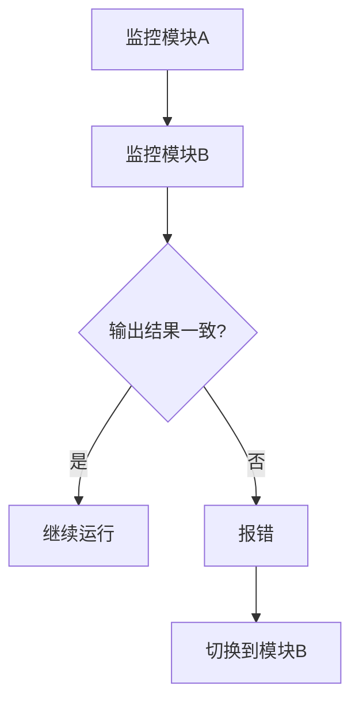

#### 1.1.2 Hot-Warm冗余设计

**定义**: Hot-Warm冗余设计是指在一个主要系统模块运行的同时，有一个备用模块处于待机状态，当主模块发生故障时，备用模块迅速接管工作。

**原理**: 备用模块虽然不是实时工作的，但在关键时可以快速启动，从而降低故障发生时系统停机的时间。

**应用**: 适用于对系统连续性要求较高的场合，如金融服务、电子商务等。

**例子**: 在一个金融交易系统中，主交易处理模块A在运行，备用交易处理模块B处于待机状态。如果主模块A出现故障，模块B会在几秒内接管交易处理任务，确保交易不会中断。

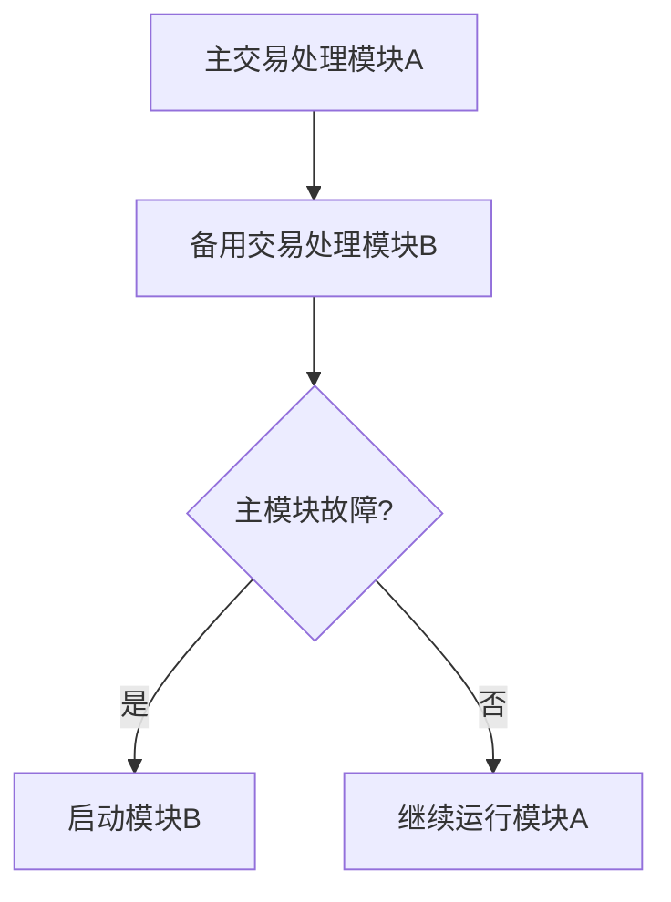

### 1.2 系统架构与流程比较

#### 1.2.1 Hot-Hot冗余架构

**架构描述**: 在Hot-Hot冗余架构中，主模块和备用模块同时工作，并通过比较输出结果来保证一致性。

**流程描述**: 系统运行过程中，主模块执行任务，同时备用模块也执行相同的任务，两个模块的输出结果进行对比。

**优缺点**:
- **优点**: 可靠性高，故障发生时可以立即切换到备用模块，确保系统持续运行。
- **缺点**: 硬件和软件资源消耗较大。

**例子**: 假设一个电力监控系统采用Hot-Hot冗余设计，主模块A和备用模块B同时监控电网状态。如果主模块A检测到异常，备用模块B立即接管监控任务，确保电网正常运行。

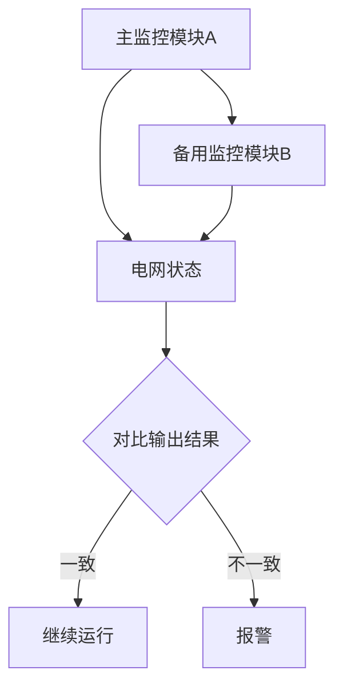

#### 1.2.2 Hot-Warm冗余架构

**架构描述**: 在Hot-Warm冗余架构中，主模块在运行，备用模块处于待机状态，只有当主模块故障时才被激活。

**流程描述**: 系统正常运行时，备用模块定期进行自检，确保在需要时可以快速接管工作。

**优缺点**:
- **优点**: 资源利用率高，备用模块只在必要时激活，节省了资源。
- **缺点**: 故障切换时间相对较长，可能在故障发生后的几秒内无法立即切换。

**例子**: 在一个电子商务系统中，主交易处理模块A在运行，备用模块B定期进行自检。如果主模块A发生故障，备用模块B会在几秒内接管交易处理任务。

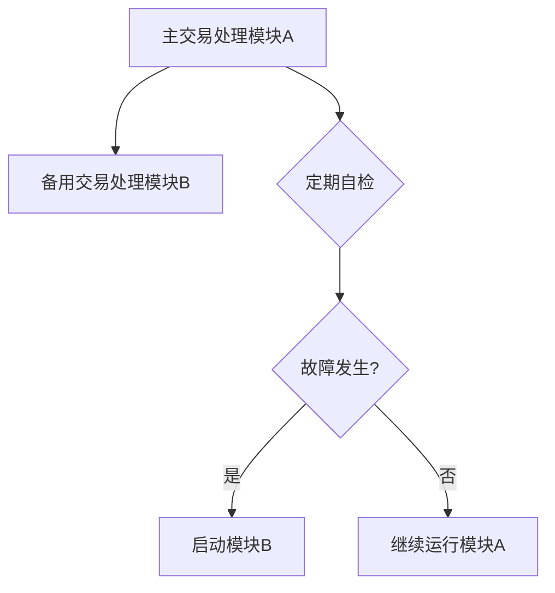

### 1.3 算法原理与性能分析

#### 1.3.1 Hot-Hot冗余算法原理

**算法描述**: Hot-Hot冗余算法的核心是通过实时比较多个模块的输出结果，确保一致性。

**伪代码**:

```python
def hotHotRedundancy(module1, module2):
    result1 = module1.execute()
    result2 = module2.execute()
    if result1 != result2:
        raise Error("Results do not match")
    return result1
```

**例子**: 假设有一个气象监控系统，主模块A和备用模块B同时运行，并实时比较温度和湿度传感器数据。如果数据不一致，系统会报错并尝试切换到备用模块。

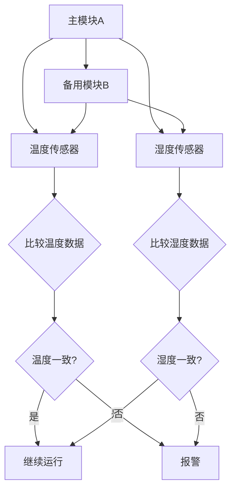

#### 1.3.2 Hot-Warm冗余算法原理

**算法描述**: Hot-Warm冗余算法是通过定期检测主模块的状态，并在检测到故障时激活备用模块。

**伪代码**:

```python
def hotWarmRedundancy(module, backupModule):
    while module.isRunning():
        if module.hasFault():
            backupModule.activate()
            break
    return module
```

**例子**: 假设有一个网络通信系统，主模块A在运行，备用模块B定期自检。如果主模块A检测到故障，备用模块B会立即接管通信任务。

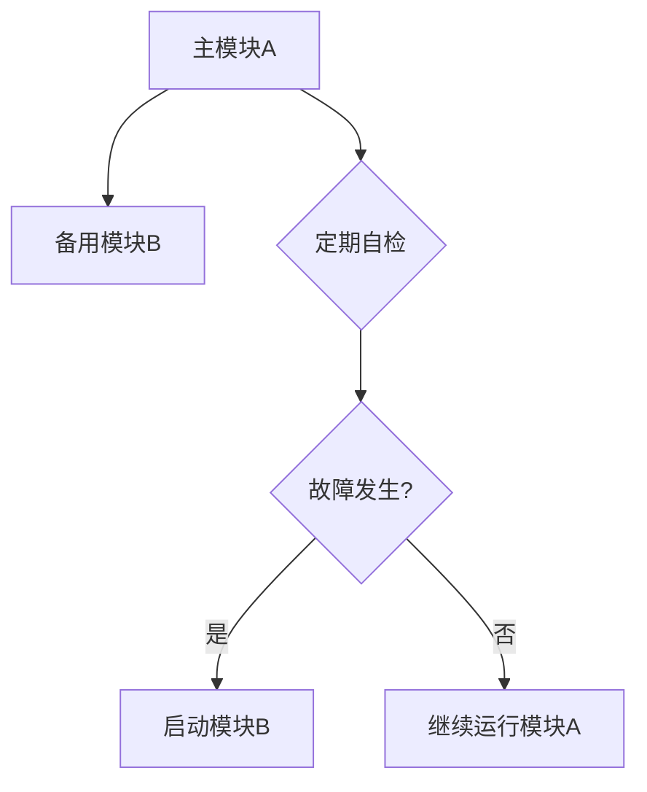

### 1.4 数学模型与公式

#### 1.4.1 系统可靠性模型

**公式**: 系统可靠性 R 可以表示为各模块可靠性的乘积。

$$ R = R_1 \times R_2 \times ... \times R_n $$

**例子**: 假设一个监控系统有两个模块A和B，它们的可靠性分别为0.95和0.98。系统的可靠性为：

$$ R = 0.95 \times 0.98 = 0.931 $$

#### 1.4.2 故障切换时间模型

**公式**: 故障切换时间 T 可以表示为模块故障检测时间和模块切换时间的总和。

$$ T = T_d + T_s $$

**例子**: 假设一个系统的故障检测时间为2秒，模块切换时间为3秒。故障切换时间为：

$$ T = 2 + 3 = 5 $$

### 1.5 项目实战

#### 1.5.1 Hot-Hot冗余设计项目实战

**案例描述**: 在某一金融系统中，采用两个相同的交易处理模块来实现Hot-Hot冗余设计。

**实现细节**: 交易处理模块1和交易处理模块2同时运行，通过对比交易结果来保证一致性。

**代码解读**:

```python
class TradeProcessor:
    def execute(self, trade_data):
        # 处理交易数据
        processed_data = ...
        return processed_data

# 创建两个交易处理模块
processor1 = TradeProcessor()
processor2 = TradeProcessor()

# 比较输出结果
result1 = processor1.execute(trade_data)
result2 = processor2.execute(trade_data)

if result1 != result2:
    raise Exception("交易处理结果不一致")
```

#### 1.5.2 Hot-Warm冗余设计项目实战

**案例描述**: 在某一电商系统中，采用主备交易处理模块来实现Hot-Warm冗余设计。

**实现细节**: 主交易处理模块运行，备用交易处理模块定期自检，并在主模块故障时迅速接管。

**代码解读**:

```python
class TradeProcessor:
    def execute(self, trade_data):
        # 处理交易数据
        processed_data = ...
        return processed_data

class BackupTradeProcessor(TradeProcessor):
    def activate(self):
        # 激活备用交易处理模块
        self.is_active = True

# 创建主交易处理模块和备用交易处理模块
main_processor = TradeProcessor()
backup_processor = BackupTradeProcessor()

# 定期自检
while main_processor.isRunning():
    if main_processor.hasFault():
        backup_processor.activate()
        break

# 切换到备用模块
if main_processor.hasFault():
    main_processor = backup_processor
```

## 第2章: 硬件冗余设计

### 2.1 硬件冗余设计原理

#### 2.1.1 硬件冗余设计概念

**定义**: 硬件冗余设计是指在硬件系统上采用多个相同的组件，以增加系统的可靠性和可用性。

**原理**: 当硬件组件出现故障时，冗余组件可以立即接管，确保系统正常运行。

**例子**: 在一个数据中心中，为了提高服务器的可靠性，可以采用两个冗余电源和一个冗余风扇，确保在某个电源或风扇出现故障时，系统仍然可以正常运行。

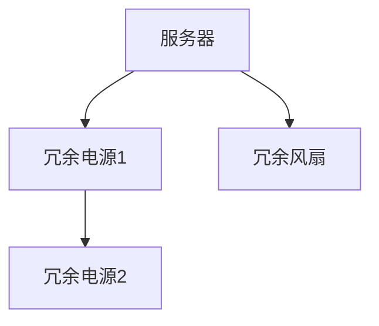

#### 2.1.2 硬件冗余设计分类

**静态冗余**: 在系统运行期间，所有冗余组件都处于工作状态。

**动态冗余**: 在系统运行期间，冗余组件处于待机状态，只有当主组件出现故障时才会激活。

**例子**: 在一个通信系统中，静态冗余可以使用两个路由器同时工作，而动态冗余则可以使用一个主路由器和两个待机路由器，主路由器出现故障时，待机路由器会立即接管。

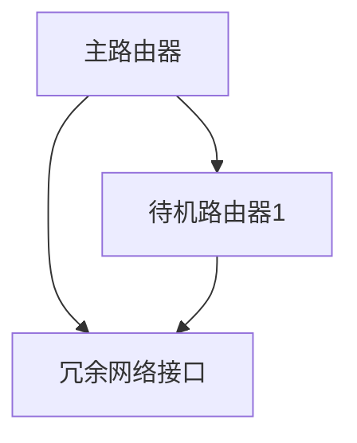

### 2.2 硬件冗余设计应用场景

#### 2.2.1 数据中心硬件冗余设计

**应用场景**: 在数据中心，硬件冗余设计用于服务器、存储设备和网络设备等。

**实现方式**: 通过冗余电源、风扇、网络接口等组件来提高系统的可靠性。

**例子**: 在一个大型数据中心中，服务器可以使用冗余电源和风扇，存储设备可以使用冗余硬盘和RAID阵列，网络设备可以使用冗余交换机和路由器。

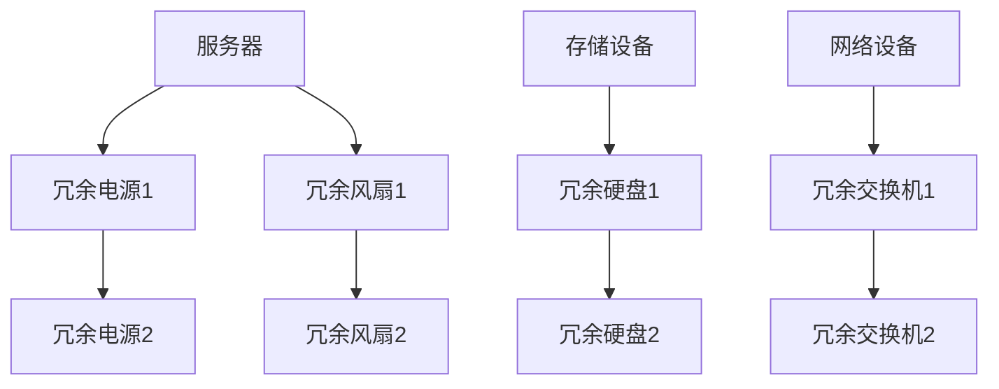

#### 2.2.2 通信设备硬件冗余设计

**应用场景**: 在通信设备中，硬件冗余设计用于路由器、交换机等。

**实现方式**: 通过冗余电源、风扇、接口等组件来提高设备的可靠性。

**例子**: 在一个大型通信系统中，路由器可以使用冗余电源和风扇，交换机可以使用冗余接口和电源。

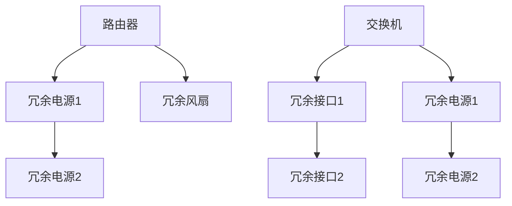

### 2.3 硬件冗余设计性能分析

#### 2.3.1 可靠性分析

**公式**: 系统可靠性 R 可以通过以下公式计算：

$$ R = (1 - f)^n $$

其中，f 为单个组件的故障率，n 为冗余组件的数量。

**例子**: 假设一个服务器有四个冗余电源，每个电源的故障率为0.01。系统的可靠性为：

$$ R = (1 - 0.01)^4 = 0.9605 $$

#### 2.3.2 成本分析

**公式**: 硬件冗余设计的成本 C 可以通过以下公式计算：

$$ C = c_1 \times n + c_2 $$

其中，c_1 为单个组件的成本，c_2 为维护成本。

**例子**: 假设一个服务器每个冗余电源的成本为500美元，维护成本为每年100美元。系统包含四个冗余电源，总成本为：

$$ C = 500 \times 4 + 100 = 2100 $$

## 第3章: 软件冗余设计

### 3.1 软件冗余设计原理

#### 3.1.1 软件冗余设计概念

**定义**: 软件冗余设计是指在软件系统中，通过编写多个相同或相似的功能模块来提高系统的可靠性和可用性。

**原理**: 当软件模块出现故障时，冗余模块可以立即接管，确保系统正常运行。

**例子**: 在一个Web应用程序中，可以编写两个相同的服务器端代码，当一个服务器端代码出现故障时，另一个服务器端代码可以立即接管，确保应用程序的正常运行。

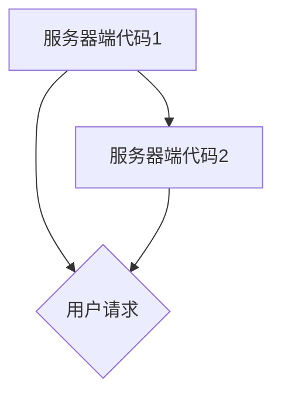

#### 3.1.2 软件冗余设计分类

**功能冗余**: 通过编写多个功能相同或相似的模块来实现冗余。

**数据冗余**: 通过在多个模块中保存相同或相似的数据来实现冗余。

**例子**: 在一个数据库系统中，可以同时使用两个相同的数据表，确保当一个数据表出现故障时，另一个数据表可以立即接管。

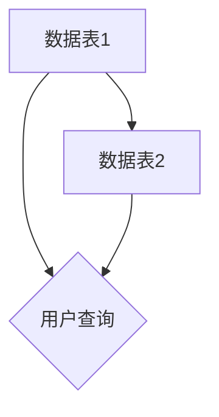

### 3.2 软件冗余设计应用场景

#### 3.2.1 网络应用软件冗余设计

**应用场景**: 在网络应用中，软件冗余设计用于服务器、数据库和缓存等。

**实现方式**: 通过编写多个相同的服务器端代码、数据库脚本和缓存策略来实现冗余。

**例子**: 在一个在线购物平台中，可以同时运行两个相同的服务器端代码，确保当一个服务器端代码出现故障时，另一个服务器端代码可以立即接管。


#### 3.2.2 实时系统软件冗余设计

**应用场景**: 在实时系统中，软件冗余设计用于控制程序、数据处理和通信等。

**实现方式**: 通过编写多个相同或相似的控制程序、数据处理模块和通信模块来实现冗余。

**例子**: 在一个无人驾驶系统中，可以同时运行两个相同的数据处理模块，确保当一个数据处理模块出现故障时，另一个数据处理模块可以立即接管。

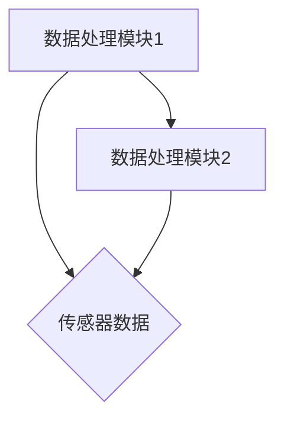

### 3.3 软件冗余设计性能分析

#### 3.3.1 可靠性分析

**公式**: 系统可靠性 R 可以通过以下公式计算：

$$ R = (1 - f)^n $$

其中，f 为单个模块的故障率，n 为冗余模块的数量。

**例子**: 假设一个Web应用程序有两个相同的服务器端代码，每个服务器端代码的故障率为0.01。系统的可靠性为：

$$ R = (1 - 0.01)^2 = 0.9801 $$

#### 3.3.2 成本分析

**公式**: 软件冗余设计的成本 C 可以通过以下公式计算：

$$ C = c_1 \times n + c_2 $$

其中，c_1 为单个模块的开发成本，c_2 为维护成本。

**例子**: 假设一个Web应用程序有两个相同的服务器端代码，每个服务器端代码的开发成本为1000美元，维护成本为每年200美元。系统的总成本为：

$$ C = 1000 \times 2 + 200 = 2200 $$

## 第4章: 冗余设计案例分析

### 4.1 数据中心冗余设计案例分析

#### 4.1.1 案例背景

**背景描述**: 某大型互联网公司的数据中心由于业务需求增长，需要进行冗余设计以提高系统的可靠性和可用性。

**需求分析**: 数据中心需要处理大量用户请求，确保系统在高负载情况下仍能稳定运行。同时，由于业务重要性，系统需要具备高可用性和快速故障恢复能力。

#### 4.1.2 案例实现

**实现描述**: 数据中心采用硬件和软件冗余设计，包括服务器、存储设备、网络设备和数据库等。

**硬件冗余**:
- **服务器**: 采用两套冗余电源和冗余风扇，确保单个组件故障时系统仍能正常运行。
- **存储设备**: 采用RAID 5阵列，通过多个硬盘冗余存储数据，确保单个硬盘故障时数据不会丢失。
- **网络设备**: 采用冗余交换机和路由器，确保网络连接的稳定性和可靠性。

**软件冗余**:
- **服务器端代码**: 编写两套相同的服务器端代码，确保当一个代码出现故障时，另一个代码可以立即接管。
- **数据库**: 采用主备数据库架构，主数据库故障时备用数据库可以迅速接管。

#### 4.1.3 案例效果

**效果描述**: 通过冗余设计，数据中心的系统可靠性得到显著提高，业务连续性得到保障。在高负载情况下，系统仍能稳定运行，用户体验得到提升。同时，故障恢复时间缩短，降低了维护成本。

### 4.2 网络应用冗余设计案例分析

#### 4.2.1 案例背景

**背景描述**: 某大型电子商务平台由于业务需求增长，需要提高系统的可靠性和可用性。

**需求分析**: 平台需要处理大量用户请求，确保系统在高负载情况下仍能稳定运行。同时，由于业务重要性，系统需要具备高可用性和快速故障恢复能力。

#### 4.2.2 案例实现

**实现描述**: 电子商务平台采用软件冗余设计，包括服务器端代码、数据库和缓存等。

**服务器端代码**: 编写两套相同的服务器端代码，确保当一个代码出现故障时，另一个代码可以立即接管。

**数据库**: 采用主备数据库架构，主数据库故障时备用数据库可以迅速接管。

**缓存**: 采用多级缓存策略，确保在缓存失效时系统仍能快速响应。

#### 4.2.3 案例效果

**效果描述**: 通过冗余设计，电子商务平台的系统可靠性得到显著提高，业务连续性得到保障。在高负载情况下，系统仍能稳定运行，用户体验得到提升。同时，故障恢复时间缩短，降低了维护成本。

## 第5章: 冗余设计优化策略

### 5.1 冗余设计优化策略概述

#### 5.1.1 冗余设计优化策略概念

**定义**: 冗余设计优化策略是指通过优化冗余设计和实现，以提高系统的性能和可靠性。

**目的**: 在保证系统可靠性和可用性的同时，降低成本和资源消耗。

#### 5.1.2 冗余设计优化策略分类

**主动冗余**:
- **策略描述**: 通过主动检测和切换来优化冗余设计。
- **实现方式**: 采用高效的冗余组件、优化冗余组件的部署和配置，以及定期进行硬件维护和升级。

**被动冗余**:
- **策略描述**: 通过被动监测和响应来优化冗余设计。
- **实现方式**: 采用冗余组件的故障监测、自动切换和冗余组件的负载均衡。

### 5.2 冗余设计优化策略应用

#### 5.2.1 硬件冗余优化策略

**策略描述**: 通过优化硬件冗余设计，提高系统的可靠性和性能。

**实现方式**:
1. **选择高效冗余组件**: 选择故障率低、性能高的冗余组件，如采用最新的冗余电源和风扇。
2. **优化部署和配置**: 根据系统需求，合理部署冗余组件，确保冗余组件之间的高效协同工作。
3. **定期维护和升级**: 定期检查冗余组件的工作状态，确保冗余组件的正常运行，并在必要时进行升级。

**例子**: 在一个数据中心中，采用最新的冗余电源和风扇，并定期进行维护和升级，确保系统的可靠性和性能。

#### 5.2.2 软件冗余优化策略

**策略描述**: 通过优化软件冗余设计，提高系统的性能和可靠性。

**实现方式**:
1. **选择高效冗余算法**: 根据系统需求，选择适合的冗余算法，如Hot-Hot冗余算法和Hot-Warm冗余算法。
2. **优化负载均衡**: 通过负载均衡技术，合理分配系统负载，确保冗余模块之间的负载均衡。
3. **自动化故障切换**: 采用自动化工具，实现冗余模块的故障检测和自动切换，提高系统的响应速度。

**例子**: 在一个电子商务平台中，采用Hot-Hot冗余算法，并使用自动化工具进行故障检测和自动切换，确保系统的性能和可靠性。

## 第6章: 冗余设计最佳实践

### 6.1 冗余设计最佳实践概述

#### 6.1.1 冗余设计最佳实践概念

**定义**: 冗余设计最佳实践是指在实际项目中采用一系列有效的方法和策略来优化冗余设计。

**目的**: 提高系统的可靠性、可用性和性能，同时降低成本和资源消耗。

#### 6.1.2 冗余设计最佳实践分类

**设计阶段最佳实践**:
- **需求分析**: 充分了解系统需求，确保冗余设计能够满足业务需求。
- **架构设计**: 根据需求分析，设计合理的冗余架构，确保系统的可靠性和性能。

**实施阶段最佳实践**:
- **组件选择**: 根据系统需求，选择适合的冗余组件，确保组件的高效性和可靠性。
- **部署和配置**: 合理部署冗余组件，确保冗余组件之间的高效协同工作。

**运维阶段最佳实践**:
- **监控和维护**: 定期监控系统运行状态，确保冗余组件的正常运行。
- **故障处理**: 制定完善的故障处理流程，确保在故障发生时能够迅速恢复。

### 6.2 冗余设计最佳实践应用

#### 6.2.1 冗余设计最佳实践应用案例

**案例描述**: 在某大型互联网公司的数据中心项目中，采用了冗余设计最佳实践来优化系统的可靠性和性能。

**实践描述**:
1. **设计阶段**:
   - **需求分析**: 充分了解数据中心的业务需求，确保冗余设计能够满足高负载和可靠性要求。
   - **架构设计**: 设计了合理的冗余架构，包括硬件冗余和软件冗余，确保系统的可靠性和性能。

2. **实施阶段**:
   - **组件选择**: 选择高效可靠的冗余组件，如冗余电源、风扇、存储设备和网络设备。
   - **部署和配置**: 合理部署冗余组件，确保冗余组件之间的高效协同工作。

3. **运维阶段**:
   - **监控和维护**: 定期监控系统运行状态，确保冗余组件的正常运行，及时处理故障。
   - **故障处理**: 制定完善的故障处理流程，确保在故障发生时能够迅速恢复。

**效果描述**: 通过采用冗余设计最佳实践，数据中心的系统可靠性得到显著提高，业务连续性得到保障，同时降低了运维成本和资源消耗。

## 第7章: 冗余设计与未来发展趋势

### 7.1 冗余设计发展趋势概述

#### 7.1.1 冗余设计发展趋势概念

**定义**: 冗余设计发展趋势是指随着技术的发展和业务需求的演变，冗余设计方法和策略的演变方向。

**目的**: 适应新的技术环境和业务需求，提高系统的可靠性和可用性。

#### 7.1.2 冗余设计发展趋势分类

**硬件冗余发展趋势**:
- **智能化**: 利用人工智能和机器学习技术，优化硬件冗余管理和故障预测。
- **高效化**: 通过硬件创新和优化，提高冗余组件的性能和效率。

**软件冗余发展趋势**:
- **自动化**: 通过自动化工具和流程，实现软件冗余的自动化部署和管理。
- **分布式**: 利用分布式架构和云计算技术，实现软件冗余的分布式部署和扩展。

### 7.2 冗余设计未来发展趋势应用

#### 7.2.1 硬件冗余未来发展趋势应用

**应用描述**: 在未来的数据中心和通信设备中，硬件冗余设计将更加智能化和高效化。

**技术实现**:
1. **智能故障预测**: 利用人工智能算法，对硬件冗余系统进行实时监测和预测，提前发现潜在故障，减少故障发生概率。
2. **自适应冗余**: 根据系统负载和运行状态，动态调整冗余组件的数量和配置，提高系统的性能和可靠性。

**例子**: 在一个未来的数据中心中，通过智能故障预测技术，提前检测到冗余电源的潜在故障，自动调整冗余电源的配置，确保系统的可靠性和性能。

#### 7.2.2 软件冗余未来发展趋势应用

**应用描述**: 在未来的网络应用和实时系统中，软件冗余设计将更加自动化和分布式。

**技术实现**:
1. **自动化部署**: 通过容器化和云计算技术，实现软件冗余的自动化部署和扩展。
2. **分布式冗余**: 通过分布式架构，实现软件冗余的分布式部署和管理，提高系统的可靠性和性能。

**例子**: 在一个未来的电子商务平台中，通过容器化和云计算技术，实现软件冗余的自动化部署和扩展，确保系统在高并发情况下的可靠性和性能。

## 附录：相关资源与工具

### 附录A：硬件冗余设计相关资源与工具

**硬件冗余设计资源**:
- **书籍**: 《系统可靠性工程》、《硬件可靠性设计》等。
- **论文**: 《冗余设计在数据中心中的应用研究》等。
- **在线资源**: IEEE官方文档、数据中心设计指南等。

**硬件冗余设计工具**:
- **虚拟化软件**: VMware、KVM等。
- **负载均衡器**: Nginx、HAProxy等。
- **监控工具**: Zabbix、Nagios等。

### 附录B：软件冗余设计相关资源与工具

**软件冗余设计资源**:
- **书籍**: 《软件工程实践》、《分布式系统设计》等。
- **论文**: 《软件冗余在分布式系统中的应用》等。
- **在线资源**: Stack Overflow、GitHub等。

**软件冗余设计工具**:
- **冗余检测工具**: JMeter、LoadRunner等。
- **负载均衡器**: Nginx、HAProxy等。
- **测试框架**: TestNG、JUnit等。

---

**作者**: AI天才研究院/AI Genius Institute & 禅与计算机程序设计艺术 /Zen And The Art of Computer Programming

