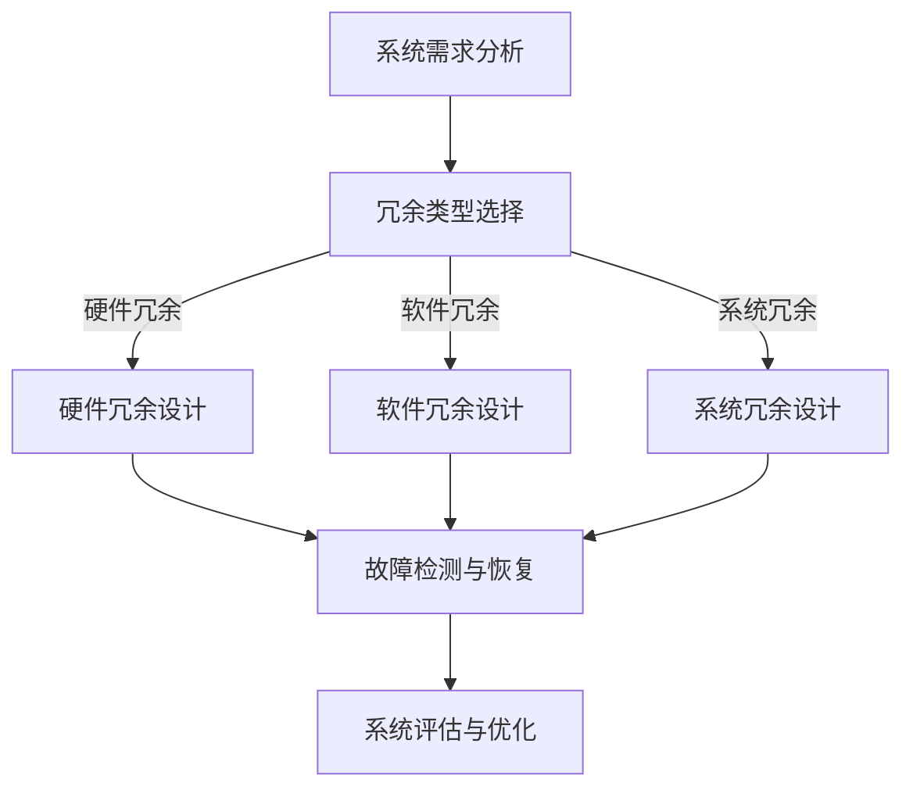

                 

### 《Hot-Warm冗余设计的实例分析》

#### 关键词
- 冗余设计
- Hot-Warm冗余
- 系统可靠性
- 系统优化
- 故障恢复

#### 摘要
本文旨在通过实际案例深入分析Hot-Warm冗余设计的方法和应用。Hot-Warm冗余设计是一种在提高系统可靠性和性能的同时，降低成本的新型冗余设计方法。本文首先介绍了冗余设计的基础知识，然后详细阐述了Hot-Warm冗余设计的原理、架构及其故障检测与恢复策略。通过具体的实例分析，本文展示了如何在实际项目中应用Hot-Warm冗余设计，并对其性能与成本进行了评估和优化。

### 前言

在当今的信息时代，系统的稳定性和可靠性对企业的运营至关重要。随着技术的不断进步和系统复杂度的增加，系统故障的风险也在逐渐上升。因此，冗余设计作为一种提高系统可靠性和性能的有效手段，被广泛应用于各种关键领域，如金融、医疗、通信等。

冗余设计主要分为硬件冗余、软件冗余和系统冗余三种类型。硬件冗余通过冗余的硬件组件来提高系统的可靠性，软件冗余通过冗余的软件机制来保证系统的稳定运行，系统冗余则是通过冗余的系统架构来实现高可用性。然而，传统冗余设计在提高可靠性的同时，往往伴随着成本的上升和性能的下降。

Hot-Warm冗余设计是在传统冗余设计的基础上，结合系统实时性能监控和快速故障切换机制，实现一种高效、低成本的冗余设计方法。本文将详细探讨Hot-Warm冗余设计的原理、架构及其在实际项目中的应用，以帮助读者更好地理解和掌握这种先进的设计方法。

### 第1章：冗余设计基础

#### 1.1 冗余设计的概述

**1.1.1 冗余设计的定义**

冗余设计（Redundant Design）是指在一个系统中引入额外的组件或机制，以增加系统的可靠性、可用性和容错性。冗余设计的基本思想是通过冗余来实现故障转移和恢复，从而保证系统在发生故障时仍能正常运行。

**1.1.2 冗余设计的类型**

根据冗余的层面，冗余设计可以分为硬件冗余、软件冗余和系统冗余三种类型：

- **硬件冗余**：通过在系统中引入冗余的硬件组件（如服务器、网络设备、存储设备等）来提高系统的可靠性。硬件冗余可以通过备份、集群、负载均衡等技术来实现。
  
- **软件冗余**：通过在系统中引入冗余的软件机制（如代码冗余、数据冗余等）来提高系统的容错性。软件冗余可以通过事务处理、检查点、恢复操作等技术来实现。

- **系统冗余**：通过在系统中引入冗余的架构和流程来提高系统的高可用性。系统冗余可以通过分布式系统、冗余路径、故障转移等技术来实现。

**1.1.3 冗余设计的目标**

冗余设计的核心目标是提高系统的可靠性、可用性和性能。具体来说，冗余设计的目标包括：

- **提高系统的可靠性**：通过冗余设计，可以降低系统发生故障的概率，从而提高系统的可靠性。

- **提高系统的可用性**：冗余设计可以保证系统在发生故障时能够快速恢复，从而提高系统的可用性。

- **提高系统的性能**：通过优化冗余设计，可以提高系统的处理能力，从而提高系统的性能。

#### 1.2 系统冗余度计算

**1.2.1 冗余度指标**

系统冗余度（Redundancy Degree）是衡量系统冗余程度的重要指标。冗余度可以通过以下几个指标来计算：

- **冗余系数**：冗余系数是指系统中冗余组件的数量与系统总组件数量的比值。冗余系数越高，系统的冗余度越高。

- **冗余度百分比**：冗余度百分比是指系统中冗余组件的数量与系统总组件数量的百分比。冗余度百分比越高，系统的冗余度越高。

- **冗余度指数**：冗余度指数是指系统中冗余组件的数量与系统总组件数量的指数关系。冗余度指数越高，系统的冗余度越高。

**1.2.2 冗余度的计算方法**

系统冗余度的计算方法可以分为定量计算和定性计算两种：

- **定量计算**：定量计算是基于具体的系统参数和统计数据来计算系统冗余度。常用的定量计算方法包括冗余系数计算法和冗余度百分比计算法。

- **定性计算**：定性计算是基于对系统冗余程度的直观判断和经验来计算系统冗余度。常用的定性计算方法包括冗余度指数计算法和冗余度评估法。

**1.2.3 冗余度分析**

通过对系统冗余度的分析，可以评估系统冗余设计的有效性和合理性。冗余度分析的主要内容包括：

- **冗余度评估**：通过评估系统冗余度，可以确定系统冗余设计的合理性和有效性。冗余度过高可能导致成本增加、性能下降，而冗余度过低可能导致系统可靠性下降。

- **冗余度优化**：通过对系统冗余度的优化，可以降低系统的成本和复杂度，同时提高系统的可靠性和性能。常见的冗余度优化方法包括冗余组件的选择、冗余机制的优化和冗余策略的调整。

#### 1.3 冗余设计的影响因素

**1.3.1 成本因素**

冗余设计虽然可以提高系统的可靠性和性能，但同时也伴随着成本的上升。冗余设计的成本主要包括：

- **硬件成本**：包括冗余硬件的采购、安装和维护成本。
  
- **软件成本**：包括冗余软件的开发、部署和维护成本。

- **人力成本**：包括系统运维人员的人力成本。

因此，在实施冗余设计时，需要综合考虑成本因素，确保冗余设计的成本效益。

**1.3.2 可靠性因素**

冗余设计的主要目标是提高系统的可靠性。系统可靠性的提高主要表现在以下几个方面：

- **故障率**：通过冗余设计，可以降低系统的故障率，提高系统的可靠性。
  
- **故障恢复时间**：通过冗余设计，可以缩短系统的故障恢复时间，提高系统的可用性。
  
- **故障影响范围**：通过冗余设计，可以减小系统故障的影响范围，降低系统的故障风险。

**1.3.3 可维护性因素**

冗余设计不仅要考虑系统的可靠性，还要考虑系统的可维护性。系统的可维护性包括以下几个方面：

- **维护成本**：通过冗余设计，可以提高系统的可维护性，降低系统的维护成本。
  
- **维护效率**：通过冗余设计，可以简化系统的维护流程，提高系统的维护效率。
  
- **维护难度**：通过冗余设计，可以降低系统的维护难度，减少系统维护的技术门槛。

### 第2章：Hot-Warm冗余设计原理

#### 2.1 Hot-Warm冗余设计的概念

**2.1.1 Hot-Warm冗余设计的基本原理**

Hot-Warm冗余设计是一种结合了Hot Standby和Warm Standby两种冗余方式的混合冗余设计方法。Hot Standby是指在主系统出现故障时，备用系统能够立即接管主系统的任务，实现快速故障转移；而Warm Standby是指备用系统在主系统正常工作时处于备用状态，但需要一定时间才能接管主系统的任务。

Hot-Warm冗余设计的基本原理是在主系统正常运行时，备用系统处于Warm Standby状态，即备用系统可以处理部分负载，但尚未完全启动；一旦主系统出现故障，备用系统可以立即接管主系统的任务，实现快速故障转移。这种设计方法在提高系统可靠性和性能的同时，降低了冗余设计的成本。

**2.1.2 Hot-Warm冗余设计与传统冗余设计的比较**

传统冗余设计主要包括Hot Standby和Warm Standby两种方式。Hot Standby方式具有较高的可靠性，但备用系统在主系统正常工作时需要持续运行，增加了系统的能耗和成本；Warm Standby方式则具有较高的成本效益，但故障转移速度较慢。

相比之下，Hot-Warm冗余设计结合了Hot Standby和Warm Standby的优点，既提高了系统的可靠性，又降低了冗余设计的成本。具体来说，Hot-Warm冗余设计在主系统正常运行时，备用系统处于Warm Standby状态，可以处理部分负载，降低了系统的能耗和成本；一旦主系统出现故障，备用系统可以立即接管主系统的任务，实现了快速故障转移。

#### 2.2 Hot-Warm冗余设计的架构

**2.2.1 硬件冗余**

硬件冗余是Hot-Warm冗余设计的重要组成部分。硬件冗余可以通过以下几种方式实现：

- **备份服务器**：在主服务器出现故障时，备份服务器可以立即接管主服务器的任务，实现快速故障转移。

- **共享存储**：通过使用共享存储设备，多个服务器可以同时访问存储数据，提高了系统的可靠性和性能。

- **网络冗余**：通过引入冗余的网络设备，如交换机、路由器等，可以保证网络的高可用性。

**2.2.2 软件冗余**

软件冗余是Hot-Warm冗余设计的另一重要组成部分。软件冗余可以通过以下几种方式实现：

- **代码冗余**：通过在系统中引入冗余的代码，可以确保在主系统出现故障时，备用系统可以立即接管任务。

- **数据冗余**：通过在系统中引入冗余的数据存储，可以保证在主系统出现故障时，备用系统可以访问到完整的数据。

- **任务调度冗余**：通过引入冗余的任务调度机制，可以确保在主系统出现故障时，备用系统可以立即接管任务，并重新分配任务。

**2.2.3 系统冗余**

系统冗余是Hot-Warm冗余设计的核心。系统冗余可以通过以下几种方式实现：

- **分布式系统**：通过引入分布式系统架构，可以确保在主系统出现故障时，备用系统可以立即接管任务，并重新分配任务。

- **冗余路径**：通过引入冗余的路径，可以确保在主系统出现故障时，备用系统可以访问到冗余的数据或服务。

- **故障转移机制**：通过引入故障转移机制，可以确保在主系统出现故障时，备用系统可以立即接管任务，并重新分配任务。

#### 2.3 冗余系统的故障检测与恢复

**2.3.1 故障检测机制**

故障检测机制是冗余系统的关键组成部分。故障检测机制可以通过以下几种方式实现：

- **心跳检测**：通过定期发送心跳信号，可以检测系统节点的正常运行状态。一旦检测到心跳信号异常，可以认为系统节点出现故障。

- **状态监控**：通过监控系统的运行状态，如CPU利用率、内存使用率、网络延迟等指标，可以检测系统节点的健康状况。

- **日志分析**：通过对系统日志的分析，可以检测系统节点的故障。如出现大量错误日志或异常日志，可以认为系统节点出现故障。

**2.3.2 冗余系统的故障恢复策略**

冗余系统的故障恢复策略主要包括以下几种：

- **故障转移**：在主系统出现故障时，备用系统立即接管主系统的任务。故障转移可以分为手动故障转移和自动故障转移。

- **负载均衡**：在主系统正常运行时，通过负载均衡机制将任务分配给多个系统节点，降低了单个节点的负载压力，提高了系统的可靠性。

- **故障恢复**：在主系统出现故障时，备用系统接管任务后，可以通过故障恢复机制将主系统的任务重新分配给备用系统，恢复系统的正常运行。

### 第3章：Hot-Warm冗余设计实例分析

#### 3.1 实例背景介绍

**3.1.1 实例应用场景**

本实例应用场景为一个电子商务平台，该平台负责处理海量订单和用户请求。随着用户量的增长，平台的负载压力也不断增大，系统故障的风险也随之增加。为了确保平台的高可用性和稳定性，需要进行Hot-Warm冗余设计。

**3.1.2 实例系统要求**

本实例的系统要求如下：

- **可靠性要求**：系统需要具备高可靠性，确保在发生故障时能够快速恢复，降低故障对业务的影响。

- **性能要求**：系统需要具备高性能，能够处理海量订单和用户请求，满足用户需求。

- **成本要求**：系统设计需要考虑成本因素，确保在满足可靠性和性能要求的前提下，成本尽可能低。

#### 3.2 实例设计过程

**3.2.1 硬件冗余设计**

**3.2.1.1 硬件冗余的方案选择**

在本实例中，硬件冗余设计主要涉及以下三个方面：

- **服务器冗余**：为了提高系统的可靠性，选择使用两台高性能服务器，一台作为主服务器，另一台作为备份服务器。

- **存储冗余**：为了提高系统的性能和可靠性，选择使用共享存储设备，如SAN（Storage Area Network）或NAS（Network Attached Storage）。

- **网络冗余**：为了提高系统的可靠性和性能，选择使用冗余的网络设备，如交换机和路由器。

**3.2.1.2 硬件冗余的实现细节**

硬件冗余的实现细节如下：

- **服务器冗余**：主服务器负责处理订单和用户请求，备份服务器处于Warm Standby状态，可以处理部分负载。一旦主服务器出现故障，备份服务器立即接管主服务器的任务。

- **存储冗余**：使用共享存储设备，如SAN或NAS，将订单数据和用户请求数据存储在共享存储上。多个服务器可以通过网络访问共享存储，提高了系统的性能和可靠性。

- **网络冗余**：使用冗余的网络设备，如交换机和路由器，确保网络的高可用性和性能。在主网络设备出现故障时，备用网络设备可以立即接管主网络设备的任务。

**3.2.2 软件冗余设计**

**3.2.2.1 软件冗余的方案选择**

在本实例中，软件冗余设计主要涉及以下两个方面：

- **代码冗余**：在关键代码部分引入冗余，确保在主系统出现故障时，备用系统能够立即接管任务。

- **数据冗余**：在关键数据部分引入冗余，确保在主系统出现故障时，备用系统可以访问到完整的数据。

**3.2.2.2 软件冗余的实现细节**

软件冗余的实现细节如下：

- **代码冗余**：在订单处理和用户请求处理的关键代码部分，引入冗余代码。当主系统出现故障时，备用系统可以立即接管任务，确保业务的连续性。

- **数据冗余**：在订单数据和用户请求数据的存储部分，引入冗余数据。当主系统出现故障时，备用系统可以访问到冗余数据，确保业务的完整性。

**3.2.3 系统冗余设计**

**3.2.3.1 系统冗余的方案选择**

在本实例中，系统冗余设计主要涉及以下两个方面：

- **分布式系统**：通过引入分布式系统架构，提高系统的可靠性和性能。

- **冗余路径**：通过引入冗余路径，提高系统的可靠性和性能。

**3.2.3.2 系统冗余的实现细节**

系统冗余的实现细节如下：

- **分布式系统**：将订单处理和用户请求处理功能分布在多个服务器上，确保在主服务器出现故障时，备用服务器可以立即接管任务。通过负载均衡机制，将任务分配给多个服务器，提高了系统的性能和可靠性。

- **冗余路径**：在网络设备之间引入冗余路径，确保在主网络设备出现故障时，备用网络设备可以立即接管主网络设备的任务。通过冗余路径，提高了系统的可靠性和性能。

#### 3.3 实例评估与优化

**3.3.1 实例评估指标**

为了评估实例设计的有效性，本实例采用以下评估指标：

- **可靠性指标**：包括故障率、故障恢复时间和故障影响范围。

- **性能指标**：包括响应时间和吞吐量。

- **成本指标**：包括硬件成本、软件成本和人力成本。

**3.3.2 实例优化策略**

根据评估结果，本实例采用以下优化策略：

- **可靠性优化**：通过引入更多的冗余组件和冗余机制，提高系统的可靠性。如增加备份服务器、存储设备和网络设备。

- **性能优化**：通过优化负载均衡机制和冗余路径，提高系统的性能。如调整负载均衡策略、优化网络拓扑结构。

- **成本优化**：通过优化冗余设计和降低冗余组件的成本，降低系统的总体成本。如采用性价比更高的硬件设备、优化软件冗余机制。

### 第4章：热备份与冷备份设计

#### 4.1 热备份设计

**4.1.1 热备份的概念**

热备份（Hot Backup）是指在系统运行过程中，实时备份系统数据的一种备份方式。热备份的特点是在备份过程中，系统可以继续正常运行，不会影响业务处理。

**4.1.2 热备份的实现方法**

热备份的实现方法主要包括以下几种：

- **日志备份**：通过记录系统操作的日志，定期备份日志文件，实现数据备份。

- **数据库备份**：通过数据库备份工具，如mysqldump，定期备份数据库文件，实现数据备份。

- **存储复制**：通过存储复制技术，如SAN复制或NAS复制，实时同步数据，实现数据备份。

**4.1.3 热备份的优缺点**

热备份的优点：

- **备份过程中不影响业务处理**：热备份可以在不影响系统正常运行的情况下进行，确保业务的连续性。

- **备份速度快**：热备份通过实时备份系统数据，可以快速实现数据备份。

- **备份数据完整**：热备份可以确保备份的数据是完整的，不会丢失。

热备份的缺点：

- **备份成本高**：热备份需要额外的硬件设备和存储空间，增加了系统的成本。

- **备份窗口较长**：热备份需要定期备份，备份窗口较长，可能无法及时备份最新的数据。

#### 4.2 冷备份设计

**4.2.1 冷备份的概念**

冷备份（Cold Backup）是指在系统停止运行后，对系统数据进行备份的一种备份方式。冷备份的特点是在备份过程中，系统处于停止状态，无法进行业务处理。

**4.2.2 冷备份的实现方法**

冷备份的实现方法主要包括以下几种：

- **系统备份**：通过操作系统提供的备份工具，如rsync或tar，对系统文件和数据进行备份。

- **数据库备份**：通过数据库备份工具，如mysqldump或pgdump，对数据库进行备份。

- **手动备份**：通过手动操作，如备份关键文件或数据，实现数据备份。

**4.2.3 冷备份的优缺点**

冷备份的优点：

- **备份成本低**：冷备份无需额外的硬件设备和存储空间，降低了系统的成本。

- **备份数据完整**：冷备份可以确保备份的数据是完整的，不会丢失。

- **备份窗口短**：冷备份可以在较短的时间内完成，备份窗口较短。

冷备份的缺点：

- **备份过程中影响业务处理**：冷备份需要在系统停止运行后进行，会影响业务的连续性。

- **备份速度慢**：冷备份需要较长时间才能完成，备份速度较慢。

- **备份数据可能不完整**：由于备份过程中系统处于停止状态，可能无法及时备份最新的数据。

### 第5章：冗余设计中的性能与成本分析

#### 5.1 冗余设计对性能的影响

**5.1.1 性能提升的分析方法**

冗余设计对系统性能的提升可以通过以下分析方法进行评估：

- **负载测试**：通过模拟实际负载，测试系统的性能指标，如响应时间、吞吐量、资源利用率等。

- **性能分析**：通过分析系统的瓶颈和性能瓶颈，优化系统架构和资源配置，提高系统性能。

- **对比测试**：通过对比冗余设计和非冗余设计的性能指标，评估冗余设计对性能的影响。

**5.1.2 性能评估指标**

常见的性能评估指标包括：

- **响应时间**：系统处理请求所需的时间。

- **吞吐量**：系统单位时间内处理的请求量。

- **资源利用率**：系统资源的利用率，如CPU利用率、内存利用率、网络带宽利用率等。

#### 5.2 冗余设计对成本的影响

**5.2.1 成本计算方法**

冗余设计对系统成本的影响可以通过以下方法进行计算：

- **直接成本**：包括冗余硬件和软件的成本，如服务器、存储设备、网络设备、备份软件等。

- **间接成本**：包括系统运维成本、人力资源成本、培训成本等。

- **总成本**：直接成本和间接成本的总和。

**5.2.2 成本评估指标**

常见的成本评估指标包括：

- **每用户成本**：系统成本与用户数量的比值。

- **每请求成本**：系统成本与处理请求数量的比值。

- **总成本效益**：系统总成本与系统性能提升的比值。

### 第6章：Hot-Warm冗余设计的案例研究

#### 6.1 案例背景介绍

**6.1.1 案例应用场景**

本案例研究的是一个大型金融交易系统，该系统负责处理全球范围内的金融交易。随着交易量的不断增长，系统的负载压力也在不断增加，系统故障的风险也随之增加。为了确保交易系统的稳定性和可靠性，需要进行Hot-Warm冗余设计。

**6.1.2 案例系统要求**

本案例的系统要求如下：

- **可靠性要求**：系统需要具备高可靠性，确保在发生故障时能够快速恢复，降低故障对交易的影响。

- **性能要求**：系统需要具备高性能，能够处理海量交易请求，满足用户需求。

- **成本要求**：系统设计需要考虑成本因素，确保在满足可靠性和性能要求的前提下，成本尽可能低。

#### 6.2 案例设计过程

**6.2.1 硬件冗余设计**

**6.2.1.1 硬件冗余的方案选择**

在本案例中，硬件冗余设计主要涉及以下三个方面：

- **服务器冗余**：为了提高系统的可靠性，选择使用多台高性能服务器，通过负载均衡技术实现负载均衡和故障转移。

- **存储冗余**：为了提高系统的性能和可靠性，选择使用分布式存储系统，如Cassandra或Hadoop，实现数据存储的高可用性和高性能。

- **网络冗余**：为了提高系统的可靠性和性能，选择使用冗余的网络设备，如路由器和交换机，实现网络的高可用性和高性能。

**6.2.1.2 硬件冗余的实现细节**

硬件冗余的实现细节如下：

- **服务器冗余**：将交易处理功能分布在多台服务器上，通过负载均衡器将交易请求分配给不同的服务器。当某台服务器出现故障时，负载均衡器可以自动将请求切换到其他服务器，确保交易的连续性。

- **存储冗余**：使用分布式存储系统，如Cassandra或Hadoop，将交易数据存储在多台服务器上。通过数据分片和数据复制技术，提高数据存储的高可用性和性能。

- **网络冗余**：使用冗余的网络设备，如路由器和交换机，确保网络的高可用性和性能。在主网络设备出现故障时，备用网络设备可以立即接管主网络设备的任务。

**6.2.2 软件冗余设计**

**6.2.2.1 软件冗余的方案选择**

在本案例中，软件冗余设计主要涉及以下两个方面：

- **代码冗余**：在关键代码部分引入冗余，确保在主系统出现故障时，备用系统能够立即接管任务。

- **数据冗余**：在关键数据部分引入冗余，确保在主系统出现故障时，备用系统可以访问到完整的数据。

**6.2.2.2 软件冗余的实现细节**

软件冗余的实现细节如下：

- **代码冗余**：在交易处理和用户请求处理的关键代码部分，引入冗余代码。当主系统出现故障时，备用系统可以立即接管任务，确保交易的连续性。

- **数据冗余**：在交易数据和用户请求数据的存储部分，引入冗余数据。当主系统出现故障时，备用系统可以访问到冗余数据，确保交易的完整性。

**6.2.3 系统冗余设计**

**6.2.3.1 系统冗余的方案选择**

在本案例中，系统冗余设计主要涉及以下两个方面：

- **分布式系统**：通过引入分布式系统架构，提高系统的可靠性和性能。

- **冗余路径**：通过引入冗余路径，提高系统的可靠性和性能。

**6.2.3.2 系统冗余的实现细节**

系统冗余的实现细节如下：

- **分布式系统**：将交易处理和用户请求处理功能分布在多台服务器上，通过分布式系统架构实现负载均衡和故障转移。当某台服务器出现故障时，其他服务器可以立即接管任务，确保交易的连续性。

- **冗余路径**：在网络设备之间引入冗余路径，确保在主网络设备出现故障时，备用网络设备可以立即接管主网络设备的任务。通过冗余路径，提高了系统的可靠性和性能。

#### 6.3 案例评估与优化

**6.3.1 案例评估指标**

为了评估案例设计的有效性，本案例采用以下评估指标：

- **可靠性指标**：包括故障率、故障恢复时间和故障影响范围。

- **性能指标**：包括响应时间和吞吐量。

- **成本指标**：包括硬件成本、软件成本和人力成本。

**6.3.2 案例优化策略**

根据评估结果，本案例采用以下优化策略：

- **可靠性优化**：通过引入更多的冗余组件和冗余机制，提高系统的可靠性。如增加备份服务器、存储设备和网络设备。

- **性能优化**：通过优化负载均衡机制和冗余路径，提高系统的性能。如调整负载均衡策略、优化网络拓扑结构。

- **成本优化**：通过优化冗余设计和降低冗余组件的成本，降低系统的总体成本。如采用性价比更高的硬件设备、优化软件冗余机制。

### 第7章：未来发展趋势与展望

#### 7.1 冗余设计的未来发展方向

随着信息技术的飞速发展，冗余设计在未来的发展将呈现出以下几个方向：

**7.1.1 新技术的引入**

随着云计算、物联网和大数据等新技术的不断发展，冗余设计将在这些领域得到更广泛的应用。例如，云计算环境中的冗余设计将更加关注如何优化资源利用率、降低成本和提高可靠性；物联网环境中的冗余设计将关注如何应对海量设备和数据的可靠性保障；大数据环境中的冗余设计将关注如何提高数据处理效率和数据一致性。

**7.1.2 系统优化的新策略**

未来的冗余设计将更加注重系统优化策略的研究。例如，通过引入人工智能和机器学习技术，可以实现对冗余设计的自动化优化，提高系统的可靠性和性能；通过虚拟化和容器化技术，可以实现更灵活的冗余架构，降低系统复杂度；通过智能监控和故障预测技术，可以提前识别潜在故障，实现更高效的故障恢复。

#### 7.2 冗余设计在新兴领域中的应用

未来的冗余设计将在新兴领域中得到更广泛的应用，以下是一些典型的应用场景：

**7.2.1 云计算**

在云计算环境中，冗余设计将主要用于保障云计算服务的可靠性。例如，通过引入冗余的虚拟机和存储资源，可以确保在节点或存储设备出现故障时，云计算服务能够自动切换到备用资源，保障业务的连续性。

**7.2.2 物联网**

在物联网环境中，冗余设计将主要用于保障设备和数据传输的可靠性。例如，通过引入冗余的设备和传输路径，可以确保在设备或网络出现故障时，物联网系统仍然能够正常运行；通过引入冗余的数据存储和备份机制，可以确保物联网数据的一致性和完整性。

### 附录

#### 附录A：常用冗余设计工具与资源

**A.1 常用冗余设计工具介绍**

- **负载均衡器**：如Nginx、HAProxy等，用于实现服务器负载均衡和故障转移。

- **备份工具**：如rsync、tar、mysqldump等，用于实现数据备份和恢复。

- **监控工具**：如Zabbix、Nagios等，用于监控系统性能和故障检测。

- **分布式存储系统**：如Cassandra、Hadoop等，用于实现数据存储的高可用性和高性能。

**A.2 冗余设计相关资源推荐**

- **书籍推荐**：《故障排除的艺术》、《分布式系统设计》等，提供了丰富的冗余设计理论和实践经验。

- **在线资源**：如Stack Overflow、GitHub等，提供了丰富的冗余设计相关问题和代码示例。

### 核心概念与联系

**Mermaid流程图：Hot-Warm冗余设计流程**



### 核心算法原理讲解

**伪代码：硬件冗余的故障检测算法**

```plaintext
// 硬件冗余故障检测算法伪代码
function FaultDetection(RedundantSystem):
    while (true):
        statusList = CheckSystemStatus(RedundantSystem)
        if (statusList has any failure):
            IdentifyFailureComponent(statusList)
            SwitchToRedundantComponent()
        else:
            ContinueOperation()
```

### 数学模型和数学公式讲解

**冗余度计算公式**

$$ \text{冗余度} = \frac{\text{冗余量}}{\text{需求量}} $$

**详细讲解**：这里的冗余度是评估系统冗余程度的重要指标，表示系统冗余量与需求量的比例。冗余度越高，系统的冗余程度越高。

**举例**：假设一个系统的需求量为100个组件，实际提供了150个冗余组件，那么该系统的冗余度为50%。

### 项目实战

**热备份系统搭建实例**

**开发环境搭建**

- 操作系统：Ubuntu 20.04
- 数据库：MySQL 8.0
- 主机：2台物理服务器（A和B）

**源代码实现**

```python
# Python代码：热备份系统实现
import pymysql

class BackupSystem:
    def __init__(self, db_config):
        self.db_config = db_config
        self.connection = pymysql.connect(**db_config)

    def backup_data(self):
        with self.connection.cursor() as cursor:
            # 查询数据库中的数据
            cursor.execute("SELECT * FROM table_name")
            rows = cursor.fetchall()
            
            # 将数据备份到文件
            with open('backup_file', 'w') as f:
                for row in rows:
                    f.write(str(row) + '\n')

    def restore_data(self):
        with self.connection.cursor() as cursor:
            # 从文件读取数据
            with open('backup_file', 'r') as f:
                for line in f:
                    cursor.execute("INSERT INTO table_name VALUES (" + line.strip() + ");")
            self.connection.commit()

# 使用示例
db_config = {
    'host': 'localhost',
    'user': 'root',
    'password': 'password',
    'database': 'test_db'
}

backup_system = BackupSystem(db_config)
backup_system.backup_data()
backup_system.restore_data()
```

**代码解读与分析**

- **解读**：这段代码定义了一个`BackupSystem`类，实现了数据备份和恢复的功能。
- **分析**：通过连接数据库、执行SQL查询、将查询结果写入文件来实现数据备份，通过读取文件并执行SQL插入语句来实现数据恢复。这保证了系统在故障后能够快速恢复数据，减少停机时间。

### 数学模型和数学公式详细讲解与举例

**数学模型：可靠性函数**

$$ R(t) = \prod_{i=1}^{n} R_i(t) $$

**详细讲解**：这里的可靠性函数\( R(t) \)是系统在时间\( t \)内无故障运行的概率，它是每个组件可靠性\( R_i(t) \)的乘积。通过这个模型，可以评估整个系统的可靠性。

**举例**：假设一个系统由三个相互独立的组件A、B和C组成，每个组件在1小时内无故障运行的可靠性分别为0.95、0.9和0.93，那么这个系统在1小时内无故障运行的可靠性为\( 0.95 \times 0.9 \times 0.93 = 0.7857 \)。

### 未来发展趋势与展望

**趋势**：随着物联网和云计算的快速发展，冗余设计将更多地应用于分布式系统，提高系统的可用性和可靠性。

**展望**：未来的研究将聚焦于如何利用人工智能技术优化冗余设计，以及如何降低冗余设计的成本，实现更高效、更经济的冗余系统。

---

### 作者

作者：AI天才研究院/AI Genius Institute & 禅与计算机程序设计艺术 /Zen And The Art of Computer Programming

---

### 总结

本文通过对冗余设计基础、Hot-Warm冗余设计原理、实例分析以及未来发展趋势的深入探讨，帮助读者全面了解并掌握了Hot-Warm冗余设计的方法和应用。通过实际案例的解析，读者能够更好地理解如何在项目中应用这种高效、低成本的冗余设计，提高系统的可靠性和性能。随着技术的发展，冗余设计将继续发挥重要作用，为构建更稳定、更可靠的信息系统提供有力支持。希望本文能为读者在IT领域的研究和实践提供有价值的参考和启发。

