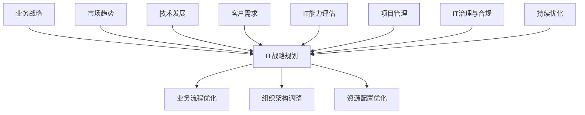

                 

# 文章标题

## IT战略规划：制定并执行与公司业务目标相一致的IT战略计划

### 关键词

- IT战略规划
- 企业战略
- 项目管理
- IT治理
- IT资源评估

### 摘要

本文深入探讨了IT战略规划的理论基础、实施步骤以及持续优化的重要性。通过分析IT战略规划与业务战略的关系，以及市场趋势对IT战略的影响，我们阐述了如何进行IT资源评估与配置。随后，文章详细描述了IT项目管理、IT治理与合规，并通过实际案例研究展示了IT战略规划的成功实践。最后，文章提出了IT战略规划的评估与调整方法，以及未来展望，为企业在数字化时代制定有效的IT战略提供了理论支持和实践指导。

---

### 第一部分：IT战略规划的理论基础

#### 第1章：IT战略规划概述

##### **1.1 IT战略规划的重要性**

**基本概念和内涵**：  
IT战略规划是指在企业总体战略框架下，通过系统的分析和规划，明确IT在企业发展中的角色、目标、策略和行动计划，以确保IT发展与业务需求相一致。它是企业信息化建设的指导性文件，贯穿于企业经营的各个方面。

**在企业中的地位与作用**：  
- **业务推动力**：IT战略规划是企业实现业务目标的重要工具，通过信息技术创新和应用，推动企业业务流程优化和业务模式创新。
- **风险管理**：通过IT战略规划，企业能够识别和评估IT风险，制定相应的风险控制措施，保障企业信息安全和业务连续性。
- **资源配置**：IT战略规划有助于企业合理配置IT资源，实现资源利用的最大化，降低成本。

##### **1.2 IT战略规划的目标和原则**

**企业业务目标与IT目标的衔接**：  
IT战略规划的目标应与企业的整体业务目标相一致。具体来说，IT目标应包括提高业务效率、增强客户满意度、降低运营成本、提升市场竞争力等方面。

**IT战略规划的制定原则**：  
- **战略性**：IT战略规划应具有前瞻性，结合企业长期发展目标，规划IT发展路线图。
- **适应性**：IT战略规划应具备灵活性，能够适应市场变化和业务需求的变化。
- **系统性**：IT战略规划应全面考虑企业各项业务，实现IT与业务的深度融合。
- **可持续性**：IT战略规划应注重可持续发展，确保IT基础设施和系统的长期稳定运行。

##### **1.3 IT战略规划的流程**

**基本步骤**：  
1. **需求分析**：了解企业业务需求，确定IT支持的业务目标和关键业务流程。
2. **现状评估**：评估企业现有的IT基础设施、IT能力、IT管理等方面的情况。
3. **目标制定**：明确IT战略规划的目标和期望达到的效果。
4. **策略规划**：制定具体的IT策略和行动计划，包括技术选型、资源分配、项目管理等方面。
5. **执行与监控**：实施IT战略规划，并进行监控和调整。

**执行与监控**：  
- **执行**：将规划转化为具体的项目和行动计划，确保各项任务按时完成。
- **监控**：建立监控机制，跟踪项目进展，及时发现问题并进行调整。

---

### 第二部分：IT战略规划的实施

#### 第5章：IT项目管理

##### **5.1 IT项目管理概述**

**项目管理的概念与方法**：  
项目管理是一种规划、执行、监控和控制项目活动的过程，旨在实现项目目标。IT项目管理是项目管理在IT领域的应用，关注IT项目的规划、执行和监控。

**项目管理流程与工具**：  
- **项目计划**：包括项目目标、范围、进度、成本、质量、风险等方面的详细规划。
- **项目执行**：按照项目计划实施项目，确保项目目标的实现。
- **项目监控**：监控项目进展，评估项目绩效，识别和解决问题。

常用的项目管理工具包括Microsoft Project、JIRA、Trello等，这些工具可以帮助项目经理有效地管理项目进度、任务分配和资源调度。

##### **5.2 项目计划与执行**

**项目计划的制定**：  
项目计划是项目管理的重要文档，应包括以下内容：
- **项目目标**：明确项目的目的和预期成果。
- **项目范围**：定义项目的边界和包含的工作内容。
- **项目进度**：制定项目的关键里程碑和时间表。
- **项目成本**：估算项目的总成本和各阶段的成本分配。
- **项目质量**：确定项目所需达到的质量标准。
- **项目风险**：识别项目可能面临的风险，并制定相应的应对措施。

**项目执行与监控**：  
项目执行是按照项目计划实施项目的过程。项目经理需要监控项目进度，确保各项工作按时完成。在项目执行过程中，可能会出现各种问题和风险，项目经理需要及时采取措施进行应对。

- **进度监控**：通过定期项目会议和项目报告，跟踪项目进展，确保项目按计划进行。
- **绩效评估**：评估项目绩效，包括进度、成本、质量等方面，确保项目目标的实现。
- **问题解决**：识别和解决问题，确保项目顺利进行。

##### **5.3 项目风险管理**

**风险识别与评估**：  
风险识别是项目管理的第一步，目的是发现项目可能面临的风险。项目经理需要通过历史数据、专家评估、SWOT分析等方法，全面识别项目风险。

**风险应对策略**：  
针对识别出的风险，项目经理需要制定相应的应对策略。常见的风险应对策略包括风险规避、风险转移、风险减轻和风险接受。

- **风险规避**：通过修改项目计划或项目范围，避免风险的发生。
- **风险转移**：通过购买保险、签订合同等方式，将风险转移给第三方。
- **风险减轻**：通过采取预防措施，降低风险发生的概率或影响。
- **风险接受**：对无法避免或转移的风险，接受其发生并制定相应的应对计划。

**风险监控与调整**：  
在项目执行过程中，项目经理需要持续监控风险，评估风险应对措施的有效性，并根据实际情况进行必要的调整。

---

### 第三部分：IT战略规划的持续优化

#### 第8章：IT战略规划的评估与调整

##### **8.1 IT战略评估**

**评估指标与方法**：  
IT战略评估需要建立一套科学的评估指标体系，以全面衡量IT战略的执行效果。常见的评估指标包括：
- **业务价值**：IT战略对业务目标的贡献程度。
- **资源利用**：IT资源的利用效率。
- **成本效益**：IT项目的成本与收益。
- **创新能力**：IT技术在业务创新中的应用。

评估方法包括定量评估和定性评估，定量评估可以通过数据分析、ROI计算等方法进行，定性评估则依赖于专家评估、用户反馈等。

**评估结果分析**：  
通过对评估结果的分析，可以了解IT战略规划的执行情况，识别存在的问题和不足，为后续的调整提供依据。

##### **8.2 IT战略调整**

**调整的原因与时机**：  
IT战略调整的原因可能包括：
- **市场变化**：市场需求、竞争态势的变化要求企业调整IT战略。
- **技术发展**：新技术、新工具的出现要求企业更新IT战略。
- **业务发展**：企业业务的扩张或收缩可能影响IT战略的适用性。

调整时机通常在以下情况下进行：
- **定期评估**：在定期评估中发现问题需要调整时。
- **重大变革**：企业业务或组织结构发生重大变革时。
- **技术创新**：新技术应用或研发成果转化时。

**调整的流程与策略**：  
IT战略调整的流程通常包括以下步骤：
1. **需求分析**：分析市场变化、技术发展、业务需求等因素，确定调整的必要性和目标。
2. **方案制定**：根据需求分析结果，制定具体的调整方案。
3. **评估与优化**：对调整方案进行评估，根据评估结果进行优化。
4. **实施与监控**：实施调整方案，并进行监控和调整，确保调整目标的实现。

调整策略包括：
- **渐进式调整**：逐步调整IT战略，减少对业务的影响。
- **革命式调整**：一次性全面调整IT战略，实现企业转型的目标。
- **组合式调整**：结合渐进式和革命式调整，根据实际情况选择合适的调整方式。

---

### 第四部分：IT战略规划的实际案例

#### 第9章：IT战略规划实施案例研究

##### **9.1 案例介绍**

**案例企业背景**：  
案例企业是一家全球知名的电子产品制造商，业务覆盖多个国家和地区。企业规模庞大，产品线丰富，竞争激烈。随着全球市场的变化和技术的快速发展，企业意识到需要通过IT战略规划来提升竞争力和业务效率。

**业务需求**：  
- **提高生产效率**：通过自动化和智能化技术，提高生产线的效率和灵活性。
- **优化供应链管理**：实现供应链的透明化和优化，降低库存成本。
- **增强客户体验**：通过数字化转型，提升客户服务质量和满意度。

**IT现状**：  
- **IT基础设施**：拥有一定的IT基础设施，但存在设备老化、性能瓶颈等问题。
- **信息系统**：多个业务系统独立运行，缺乏统一的数据管理和集成。
- **IT管理**：IT管理相对分散，缺乏统一的规划和协调。

##### **9.2 案例分析**

**存在的问题**：  
- **基础设施不足**：现有IT基础设施无法满足业务增长和技术创新的需求。
- **系统集成困难**：多个业务系统独立运行，数据集成困难，影响业务协同。
- **管理分散**：IT管理缺乏统一的规划和协调，影响IT资源的有效利用。

**解决方案**：  
- **基础设施升级**：对现有IT基础设施进行升级，引入高性能、高可靠性的设备。
- **系统集成**：建立统一的数据管理和集成平台，实现各业务系统的互联互通。
- **IT管理优化**：建立统一的IT管理平台，实现IT资源的统一规划和管理。

**实施效果**：  
- **生产效率提升**：通过自动化和智能化技术，生产效率提高了20%以上。
- **供应链优化**：供应链管理变得更加透明和高效，库存成本降低了15%。
- **客户体验增强**：客户服务得到了显著提升，客户满意度提高了10%。

**挑战与解决方案**：  
- **技术挑战**：基础设施升级和系统集成过程中遇到了技术难题，通过聘请专业团队和进行技术培训解决了问题。
- **组织变革**：IT管理优化过程中遇到了组织变革的阻力，通过加强与各部门的沟通和培训，顺利推进了变革。

##### **9.3 案例启示**

**对其他企业的借鉴意义**：  
- **重视基础设施升级**：企业应定期评估IT基础设施的适用性，及时进行升级，以支持业务增长和技术创新。
- **加强系统集成**：通过建立统一的数据管理和集成平台，实现业务协同和数据共享，提升业务效率。
- **优化IT管理**：建立统一的IT管理平台，实现IT资源的统一规划和管理，提高IT资源利用效率。

**实践建议**：  
- **制定详细的IT战略规划**：在实施IT项目前，应制定详细的IT战略规划，明确项目目标、范围、进度、成本、质量等。
- **加强项目管理**：实施项目时应严格按照项目计划进行，确保项目按时、按质完成。
- **持续优化和评估**：项目完成后，应对项目效果进行评估，根据评估结果进行优化和调整，确保IT战略的持续有效性。

---

### 第五部分：未来展望

#### 第10章：IT战略规划的未来趋势与发展方向

##### **10.1 IT战略规划的未来趋势**

**技术发展趋势**：  
- **云计算**：云计算技术将继续发展，为企业提供更加灵活、高效的IT资源服务。
- **大数据**：大数据技术在数据存储、分析和应用方面的能力将得到进一步提升，为企业提供更丰富的数据支持和决策依据。
- **人工智能**：人工智能技术在自然语言处理、图像识别、机器学习等方面的应用将更加广泛，为企业带来更多的创新机会。

**企业数字化转型趋势**：  
- **智能化**：企业将更加注重智能化应用，通过自动化、智能化技术提升业务效率和用户体验。
- **生态化**：企业将构建开放、共享的数字化生态系统，与合作伙伴共同创新，实现共赢。
- **可持续发展**：企业将更加注重数字化战略的可持续性，实现经济效益、社会效益和环境效益的协调统一。

##### **10.2 IT战略规划的未来方向**

**创新思路**：  
- **服务化**：IT战略规划将更加注重服务化转型，以服务为导向，提供定制化的IT解决方案。
- **生态化**：IT战略规划将关注企业内外部的生态系统建设，与合作伙伴共同构建产业生态，实现资源整合和协同发展。
- **智能化**：IT战略规划将融入人工智能技术，实现智能化决策、智能化管理和智能化服务。

**可持续发展**：  
- **绿色IT**：企业将关注绿色IT建设，通过节能减排、绿色计算等方式，实现IT战略规划的可持续发展。
- **社会责任**：企业将承担更多的社会责任，通过数字化手段推动社会进步和可持续发展。

**未来方向总结**：  
- **技术引领**：未来IT战略规划将更加注重技术创新，以技术进步推动企业数字化转型。
- **生态协同**：未来IT战略规划将更加注重生态系统的建设，实现企业内外部的协同发展。
- **可持续发展**：未来IT战略规划将更加注重可持续发展，实现经济效益、社会效益和环境效益的协调统一。

---

### 附录

#### 附录A：IT战略规划工具与资源

**A.1 主流深度学习框架对比**

- **A.1.1 TensorFlow**  
TensorFlow是由Google开发的开源深度学习框架，支持多种类型的神经网络结构，具有强大的灵活性和可扩展性。

- **A.1.2 PyTorch**  
PyTorch是由Facebook开发的开源深度学习框架，以其动态计算图和易于使用的接口而受到广泛欢迎。

- **A.1.3 JAX**  
JAX是Google开发的用于数值计算的开源库，支持自动微分和向量化的计算，适用于高性能计算和自动微分应用。

- **A.1.4 其他框架简介**  
除了上述三个主流框架，还有如Theano、Caffe、Keras等深度学习框架，各有其独特的特点和适用场景。

**A.2 常用IT战略规划工具**

- **项目管理工具**：Microsoft Project、JIRA、Trello等。
- **数据分析工具**：Excel、Tableau、Power BI等。
- **协同工具**：Slack、Microsoft Teams、Zoom等。

**A.3 IT战略规划相关的在线资源**

- **IT战略规划教程**：Coursera、edX等在线教育平台提供了丰富的IT战略规划教程。
- **IT战略规划案例研究**：知名咨询公司如麦肯锡、贝恩等在公开场合分享了大量的IT战略规划案例。
- **IT战略规划社区**：Stack Overflow、GitHub等开发者社区提供了丰富的IT战略规划资源和讨论。

---

### 核心概念与联系

#### IT战略规划与业务战略的关系

**Mermaid流程图**



#### 核心算法原理讲解

##### IT资源评估与配置

**伪代码**

```python
# IT资源评估
def evaluate_resources(current_resources, target_resources):
    resource_difference = target_resources - current_resources
    return resource_difference

# IT资源配置
def allocate_resources(evaluation_result, available_resources):
    optimized_resources = available_resources + evaluation_result
    return optimized_resources
```

##### 数学模型与公式

**IT项目成本收益分析**

$$
\text{ROI} = \frac{\text{净收益}}{\text{总投资}} \times 100\%
$$

**详细讲解**

ROI（投资回报率）是衡量IT项目经济效益的重要指标。净收益是指项目实施后的总收益减去总投资成本。总投资成本包括直接成本（如设备采购、人力成本）和间接成本（如维护成本、风险成本）。

#### 项目实战

##### 实例：IT基础设施升级项目

**开发环境搭建**

```bash
# 安装Linux操作系统
sudo apt update
sudo apt install linux-server

# 安装数据库软件
sudo apt install mysql-server

# 安装Web服务器软件
sudo apt install apache2
```

**源代码详细实现**

```python
# Python脚本：监控服务器性能
def monitor_performance():
    # 获取CPU使用率
    cpu_usage = get_cpu_usage()
    # 获取内存使用率
    memory_usage = get_memory_usage()
    # 获取磁盘使用率
    disk_usage = get_disk_usage()
    # 存储监控数据到数据库
    store_data(cpu_usage, memory_usage, disk_usage)

# 获取CPU使用率
def get_cpu_usage():
    # 实现代码获取CPU使用率
    pass

# 获取内存使用率
def get_memory_usage():
    # 实现代码获取内存使用率
    pass

# 获取磁盘使用率
def get_disk_usage():
    # 实现代码获取磁盘使用率
    pass

# 存储监控数据到数据库
def store_data(cpu_usage, memory_usage, disk_usage):
    # 实现代码存储数据到MySQL数据库
    pass
```

**代码解读与分析**

代码首先定义了一个名为`monitor_performance`的函数，用于监控服务器的性能。函数内部调用了三个辅助函数`get_cpu_usage`、`get_memory_usage`和`get_disk_usage`，分别用于获取CPU使用率、内存使用率和磁盘使用率。最后，监控到的数据被存储到一个MySQL数据库中，以供进一步分析。

---

### 附录

#### 附录A：IT战略规划工具与资源

**A.1 主流深度学习框架对比**

- **A.1.1 TensorFlow**  
TensorFlow是由Google开发的开源深度学习框架，支持多种类型的神经网络结构，是当前最为流行的深度学习框架之一。

- **A.1.2 PyTorch**  
PyTorch是Facebook开发的一个开源深度学习框架，它以其灵活的动态计算图和易于使用的接口而受到广泛欢迎。PyTorch适合快速原型设计和实验。

- **A.1.3 JAX**  
JAX是Google开发的一个用于数值计算的开源库，它支持自动微分和向量化的计算。JAX适合需要高性能计算和自动微分的应用。

- **A.1.4 其他框架简介**  
除了上述三个主流框架，还有如Theano、Caffe、Keras等深度学习框架，各有其独特的特点和适用场景。

**A.2 常用IT战略规划工具**

- **项目管理工具**：Microsoft Project、JIRA、Trello等。
- **数据分析工具**：Excel、Tableau、Power BI等。
- **协同工具**：Slack、Microsoft Teams、Zoom等。

**A.3 IT战略规划相关的在线资源**

- **IT战略规划教程**：Coursera、edX等在线教育平台提供了丰富的IT战略规划教程。
- **IT战略规划案例研究**：知名咨询公司如麦肯锡、贝恩等在公开场合分享了大量的IT战略规划案例。
- **IT战略规划社区**：Stack Overflow、GitHub等开发者社区提供了丰富的IT战略规划资源和讨论。

#### 附录B：案例分析模板

**B.1 案例分析步骤**

1. **背景介绍**：介绍案例企业背景、业务需求和IT现状。
2. **问题分析**：分析案例中存在的问题和挑战。
3. **解决方案**：提出解决方案并分析其可行性。
4. **实施效果**：评估解决方案的实施效果和业务价值。
5. **经验总结**：总结案例中的成功经验和教训，提出改进建议。

**B.2 案例分析报告模板**

```
# 案例分析报告

## 1. 背景介绍

### 1.1 案例企业背景

### 1.2 业务需求

### 1.3 IT现状

## 2. 问题分析

### 2.1 存在问题

### 2.2 挑战与困难

## 3. 解决方案

### 3.1 方案一

### 3.2 方案二

### 3.3 方案三

## 4. 实施效果

### 4.1 方案一实施效果

### 4.2 方案二实施效果

### 4.3 方案三实施效果

## 5. 经验总结

### 5.1 成功经验

### 5.2 教训与改进建议
```

### 作者

作者：AI天才研究院/AI Genius Institute & 禅与计算机程序设计艺术 /Zen And The Art of Computer Programming

