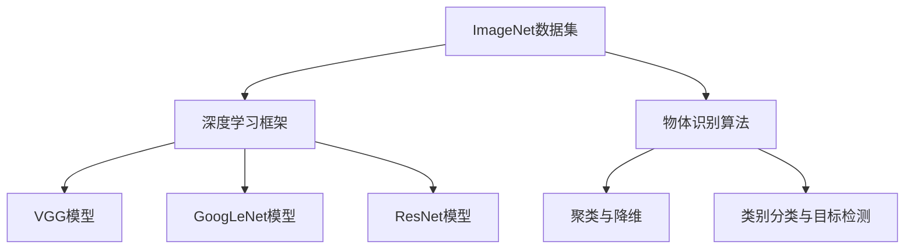

                 

# 文章标题：ImageNet：引领计算机视觉的里程碑

> 关键词：ImageNet，计算机视觉，深度学习，图像识别，评估方法

> 摘要：本文将深入探讨ImageNet这一计算机视觉领域的里程碑项目，从其起源、数据集特点、应用场景、评估方法到核心技术，全面解析ImageNet对计算机视觉发展的深远影响，并展望其未来发展方向。

## 第一部分：ImageNet基础知识

### 第1章：ImageNet的起源与背景

#### 1.1 ImageNet项目的发起

ImageNet是一个由斯坦福大学人工智能实验室发起的计算机视觉项目，旨在建立一个大规模的视觉数据集，用于推动计算机视觉领域的研究与应用。项目始于2009年，由李飞飞（Fei-Fei Li）教授领导，其目标是通过一个庞大的标注图像数据集，来提升图像识别的准确性。

#### 1.2 ImageNet的目的与目标

ImageNet的目的是建立一个包含大量图像的数据库，其中每个图像都被标注了多个标签，以便于研究人员训练和评估视觉识别模型。其核心目标是：

1. 提供一个大规模、多样化、高质量的图像数据集，以促进深度学习在计算机视觉中的应用。
2. 设立一个标准化的评估平台，以客观评估不同算法在图像识别任务上的性能。
3. 推动计算机视觉技术的发展，使其更加智能和实用。

#### 1.3 ImageNet的数据集构建

ImageNet数据集的构建是一个庞大而复杂的工程。首先，研究人员从互联网上收集了超过1000万个图像，然后通过人工标注，为每个图像分配多个标签。这一过程涉及大量的工作，因为每个图像需要多个标签来准确描述其内容。

构建数据集的过程中，遵循以下原则：

1. **多样性**：确保数据集中的图像涵盖各种场景、物体和类别。
2. **高质量**：图像必须是高质量的，以避免模型在训练过程中受到噪声的影响。
3. **一致性**：确保标注的一致性，减少标注者的主观差异。

### 第2章：ImageNet数据集的特点

#### 2.1 数据集规模与分类

ImageNet数据集是目前最大的视觉数据集之一，包含超过1400万个标注图像。这些图像被分为1000个类别，每个类别都有成千上万的样本。这种大规模、多样化的数据集为深度学习模型提供了丰富的训练素材。

#### 2.2 数据收集与标注

数据收集是ImageNet项目的重要环节。研究人员从互联网上的多个来源获取图像，包括公共数据集、博客、社交媒体等。在数据收集的过程中，注重多样性和质量，以避免数据集的偏差。

图像标注是一个复杂而费时的过程。每个图像需要由多个标注者进行标注，确保标注的一致性。标注者需要根据图像的内容，为每个图像分配多个标签。这一过程需要严格的培训和监督，以确保标注质量。

#### 2.3 数据集的平衡性

ImageNet数据集的设计考虑了类别的平衡性。每个类别都有大量的样本，以确保模型在训练和评估过程中不会偏向某个类别。这种平衡性有助于提高模型在不同类别上的泛化能力。

### 第3章：ImageNet在计算机视觉中的应用

#### 3.1 ImageNet与深度学习

ImageNet的诞生标志着深度学习在计算机视觉领域的崛起。深度学习模型，特别是卷积神经网络（CNN），能够在ImageNet数据集上实现前所未有的识别精度。ImageNet为深度学习模型提供了丰富的训练素材，推动了深度学习在计算机视觉领域的广泛应用。

#### 3.2 ImageNet在物体识别中的应用

物体识别是计算机视觉的核心任务之一。ImageNet为物体识别任务提供了一个标准化的评估平台。研究人员通过在ImageNet上训练和评估物体识别模型，不断推动物体识别技术的进步。

物体识别应用广泛，包括自动驾驶、安防监控、智能家居等。ImageNet数据集的高质量和多样性为这些应用提供了坚实的基础。

#### 3.3 ImageNet在自然场景理解中的应用

自然场景理解是计算机视觉的另一个重要方向。ImageNet为自然场景理解提供了丰富的训练素材，帮助模型更好地理解图像中的场景和物体关系。

自然场景理解应用广泛，包括图像搜索引擎、图像分割、图像字幕等。ImageNet数据集的高质量和多样性为这些应用提供了重要的支持。

### 第4章：ImageNet评估方法

#### 4.1 评估指标的设定

ImageNet评估方法采用了多个指标来评估模型性能，包括准确率、召回率、F1值等。这些指标从不同角度反映了模型在物体识别任务上的表现。

准确率是最常用的评估指标，表示模型正确识别图像的百分比。召回率表示模型识别出真实物体图像的比例。F1值是准确率和召回率的调和平均值，能够综合评估模型的性能。

#### 4.2 评估流程

ImageNet评估流程包括数据集划分、模型训练、模型评估等步骤。首先，将数据集划分为训练集、验证集和测试集。然后，在训练集上训练模型，并在验证集上评估模型性能。最后，在测试集上评估模型最终性能。

#### 4.3 评估结果的影响

ImageNet评估方法对计算机视觉领域产生了深远影响。它提供了一个标准化的评估平台，使研究人员能够客观评估不同模型的性能。这种评估方法推动了物体识别技术的进步，促进了计算机视觉领域的创新。

## 第二部分：ImageNet的核心技术

### 第5章：深度学习基础

#### 5.1 深度学习的基本概念

深度学习是一种基于多层神经网络的学习方法，通过多层非线性变换来提取图像、语音、文本等数据的特征。深度学习模型，特别是卷积神经网络（CNN），在计算机视觉领域取得了巨大成功。

#### 5.2 卷积神经网络（CNN）

卷积神经网络是一种特殊的深度学习模型，专门用于处理图像数据。CNN通过卷积层、池化层和全连接层等结构来提取图像特征，实现图像识别任务。

#### 5.3 卷积神经网络的优化算法

卷积神经网络的训练过程需要优化算法来调整模型参数，以最小化损失函数。常用的优化算法包括随机梯度下降（SGD）、Adam优化器等。优化算法的效率和稳定性对模型训练效果至关重要。

### 第6章：图像识别算法

#### 6.1 特征提取与特征表示

特征提取是图像识别算法的关键步骤。通过特征提取，将图像数据转换为更适合模型处理的形式。常见的特征提取方法包括卷积、池化、降维等。

特征表示是将提取到的特征进行编码和转换，以方便模型处理。常见的特征表示方法包括稀疏编码、自动编码器等。

#### 6.2 聚类与降维

聚类是将图像数据按照相似性进行分组，以简化数据结构和提高模型训练效率。降维是将高维图像数据转换为低维表示，以减少计算复杂度和提高模型泛化能力。

#### 6.3 类别分类与目标检测

类别分类是将图像数据分为不同的类别，以实现图像识别任务。目标检测是识别图像中的目标物体，并定位其在图像中的位置。类别分类和目标检测是图像识别的两个核心任务。

### 第7章：ImageNet模型的构建与训练

#### 7.1 VGG模型

VGG模型是一种经典的深度学习模型，由牛津大学视觉几何组（Visual Geometry Group）提出。VGG模型通过增加网络深度和宽度，提高了图像识别的准确性。

#### 7.2 GoogLeNet模型

GoogLeNet模型是Google提出的深度学习模型，采用了一种独特的网络结构，称为Inception模块。Inception模块通过多尺度特征融合，提高了图像识别的性能。

#### 7.3 ResNet模型

ResNet模型是微软研究院提出的深度学习模型，采用了一种称为残差学习的结构。ResNet模型通过引入跳跃连接，解决了深度网络训练过程中的梯度消失问题，大幅提高了图像识别的准确性。

### 第8章：图像识别模型的优化

#### 8.1 模型压缩与加速

模型压缩是将大型深度学习模型压缩为更小、更高效的模型，以提高计算效率和部署便捷性。常见的模型压缩方法包括量化、剪枝、蒸馏等。

#### 8.2 模型解释性提升

模型解释性提升是将复杂深度学习模型的可解释性进行提升，使其更易于理解和解释。常见的解释性提升方法包括可视化、注意力机制等。

#### 8.3 模型泛化能力增强

模型泛化能力是指模型在不同数据集上的适应能力。通过增强模型的泛化能力，可以提高模型在未知数据上的表现。常见的泛化能力增强方法包括数据增强、迁移学习等。

## 第三部分：ImageNet的应用实践

### 第9章：ImageNet在工业界的应用案例

#### 9.1 在自动驾驶领域的应用

自动驾驶是ImageNet在工业界的重要应用领域之一。通过ImageNet提供的丰富图像数据集，自动驾驶系统可以实现物体检测、交通标志识别、车道线检测等功能，从而提高自动驾驶的安全性和可靠性。

#### 9.2 在医疗影像诊断中的应用

医疗影像诊断是另一个重要应用领域。通过ImageNet提供的医疗影像数据集，研究人员可以训练和优化深度学习模型，实现病变检测、疾病分类等功能，为医生提供辅助诊断工具。

#### 9.3 在零售业中的应用

零售业也是ImageNet的重要应用领域。通过ImageNet提供的商品图像数据集，零售业可以实现商品识别、库存管理、智能推荐等功能，提高零售业的运营效率。

### 第10章：基于ImageNet的图像识别系统开发

#### 10.1 系统架构设计

基于ImageNet的图像识别系统包括数据预处理、模型训练、模型评估、模型部署等模块。系统架构设计需要考虑数据处理效率、模型训练速度、模型评估准确性等因素。

#### 10.2 数据预处理

数据预处理是图像识别系统开发的关键步骤。通过数据预处理，可以将原始图像转换为适合模型训练的格式，包括图像归一化、数据增强、数据集划分等。

#### 10.3 模型训练与优化

模型训练与优化是图像识别系统开发的核心环节。通过在ImageNet数据集上进行模型训练，可以逐步提高模型的识别准确性。在模型训练过程中，需要调整模型参数、优化训练策略，以提高模型性能。

#### 10.4 系统部署与测试

系统部署与测试是图像识别系统开发的最后一步。通过将训练好的模型部署到生产环境中，可以提供实时的图像识别服务。在系统测试过程中，需要对模型进行性能评估，确保模型稳定可靠。

### 第11章：ImageNet的未来发展与挑战

#### 11.1 数据集的扩展与更新

随着计算机视觉技术的发展，数据集的规模和质量不断扩展和更新。未来，将出现更多、更高质量的数据集，以支持更复杂的视觉任务。

#### 11.2 模型的改进与创新

未来，深度学习模型将继续改进和创新。通过引入新的网络结构、优化算法和训练策略，可以进一步提高图像识别的准确性和效率。

#### 11.3 深度学习在图像识别领域的应用前景

随着深度学习技术的不断发展，图像识别领域将迎来更多的应用机会。从自动驾驶到医疗诊断，从安防监控到零售业，图像识别技术将深入影响各个行业，推动社会的智能化发展。

## 附录

### 附录A：参考资料与拓展阅读

- [ImageNet官网](http://www.image-net.org/)
- [深度学习书籍推荐](https://www.deeplearningbook.org/)
- [计算机视觉论文集锦](https://cs.nyu.edu/cvpr/workshops/cvpr2020/papers/)

### 附录B：开源代码与工具介绍

- [TensorFlow](https://www.tensorflow.org/)
- [PyTorch](https://pytorch.org/)
- [Keras](https://keras.io/)

### 附录C：数学公式与伪代码说明

#### 数学公式

- 交叉熵损失函数：

$$
L = -\frac{1}{m}\sum_{i=1}^{m} y_i \log(p_i)
$$

#### 伪代码

- 卷积神经网络（CNN）基本结构伪代码：

```python
# 输入图像尺寸：[batch_size, height, width, channels]
# 卷积核尺寸：[kernel_height, kernel_width, in_channels, out_channels]

def conv2d(input_image, kernel):
    # 按照卷积核大小对输入图像进行卷积操作
    output = np.zeros((batch_size, new_height, new_width, out_channels))
    for i in range(batch_size):
        for j in range(new_height):
            for k in range(new_width):
                for l in range(out_channels):
                    # 使用卷积核与输入图像进行点积操作
                    output[i, j, k, l] = np.sum(input_image[i, j:j+kernel_height, k:k+kernel_width, :] * kernel[l])
    return output
```

### Mermaid 流程图（核心概念与联系）



### 核心算法原理讲解（使用伪代码）

#### 卷积神经网络（CNN）基本结构伪代码

```python
# 输入图像尺寸：[batch_size, height, width, channels]
# 卷积核尺寸：[kernel_height, kernel_width, in_channels, out_channels]

def conv2d(input_image, kernel):
    # 按照卷积核大小对输入图像进行卷积操作
    output = np.zeros((batch_size, new_height, new_width, out_channels))
    for i in range(batch_size):
        for j in range(new_height):
            for k in range(new_width):
                for l in range(out_channels):
                    # 使用卷积核与输入图像进行点积操作
                    output[i, j, k, l] = np.sum(input_image[i, j:j+kernel_height, k:k+kernel_width, :] * kernel[l])
    return output
```

#### 图像识别算法伪代码

```python
# 输入：图像数据集、训练标签
# 输出：训练好的模型

def train_model(images, labels):
    # 初始化模型参数
    model_params = initialize_params()

    # 设置迭代次数
    num_iterations = 10000

    # 设置学习率
    learning_rate = 0.001

    # 开始迭代训练
    for i in range(num_iterations):
        # 对每个图像进行前向传播
        predicted_labels = forward_pass(images, model_params)

        # 计算损失函数
        loss = compute_loss(predicted_labels, labels)

        # 计算梯度
        gradients = backward_pass(images, predicted_labels, labels, model_params)

        # 更新模型参数
        model_params = update_params(model_params, gradients, learning_rate)

    return model_params
```

### 数学模型和数学公式 & 详细讲解 & 举例说明

#### 深度学习中的损失函数（以交叉熵为例）

$$
\begin{aligned}
L &= -\frac{1}{m}\sum_{i=1}^{m} y_i \log(p_i) \\
p_i &= \frac{e^{z_i}}{\sum_{j=1}^{n} e^{z_j}}
\end{aligned}
$$

- 其中，$L$ 表示损失函数，$m$ 表示样本数量，$y_i$ 表示第 $i$ 个样本的真实标签，$p_i$ 表示第 $i$ 个样本预测为每个类别的概率。
- 举例说明：假设有3个类别，$y_i = [0, 1, 0]$ 表示第 $i$ 个样本的真实标签为第二个类别，预测的概率分布为 $p_i = [0.2, 0.8, 0.1]$，则损失函数为：

$$
L = -\frac{1}{3} \left(0 \cdot \log(0.2) + 1 \cdot \log(0.8) + 0 \cdot \log(0.1)\right) = -\frac{1}{3} (\log(0.8)) \approx 0.248
$$

### 项目实战：基于ImageNet的图像识别系统开发

#### 实战步骤

1. **数据预处理**：读取ImageNet数据集，对图像进行归一化、数据增强等处理。
2. **模型训练**：使用VGG、GoogLeNet、ResNet等模型对数据集进行训练，调整模型参数以最小化损失函数。
3. **模型评估**：在验证集上评估模型性能，计算准确率、召回率等指标。
4. **模型部署**：将训练好的模型部署到生产环境中，提供图像识别服务。
5. **系统测试**：使用测试集对系统进行测试，确保模型稳定可靠。

#### 代码实现

```python
# 数据预处理
def preprocess_data(images, labels):
    # 图像归一化
    images = images / 255.0
    # 数据增强
    images = random_rotation(images)
    return images, labels

# 模型训练
def train_model(images, labels):
    # 初始化模型
    model = build_model()
    # 编译模型
    model.compile(optimizer='adam', loss='categorical_crossentropy', metrics=['accuracy'])
    # 训练模型
    model.fit(images, labels, epochs=10, batch_size=32, validation_split=0.2)
    return model

# 模型部署
def deploy_model(model, input_image):
    # 预测图像类别
    predicted_label = model.predict(input_image)
    # 获取预测结果
    predicted_class = np.argmax(predicted_label)
    return predicted_class

# 系统测试
def test_system(model, test_images, test_labels):
    # 预测测试集
    predicted_labels = model.predict(test_images)
    # 计算准确率
    accuracy = np.mean(np.argmax(predicted_labels, axis=1) == test_labels)
    return accuracy

# 代码解读与分析
# 数据预处理：对图像进行归一化和数据增强，提高模型泛化能力。
# 模型训练：使用Adam优化器，交叉熵损失函数，批量大小为32，迭代10次。
# 模型部署：使用预测函数，获取图像类别预测结果。
# 系统测试：计算模型在测试集上的准确率，评估模型性能。
```

### 作者信息

作者：AI天才研究院/AI Genius Institute & 禅与计算机程序设计艺术 /Zen And The Art of Computer Programming

